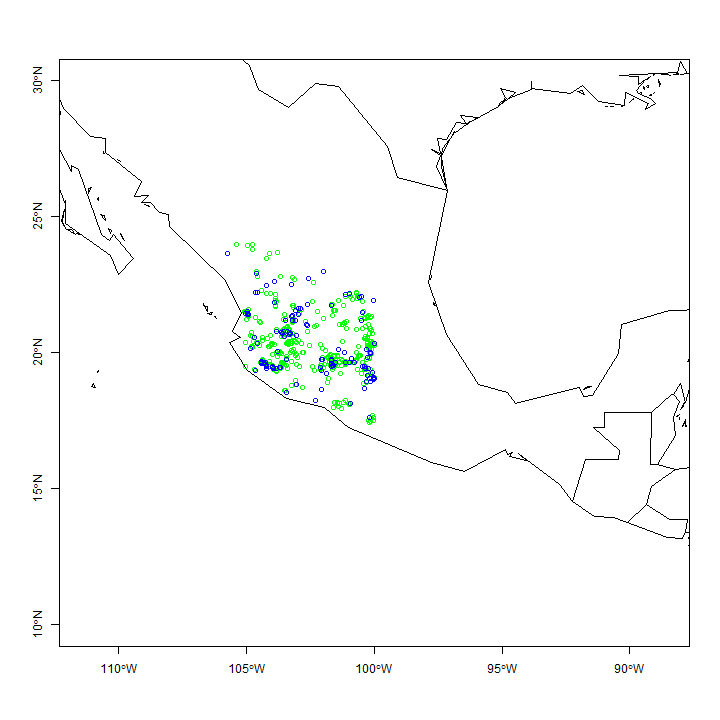
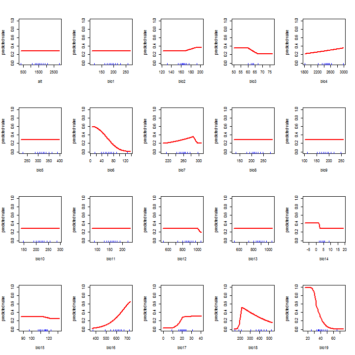
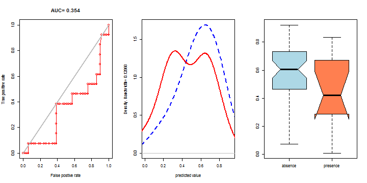
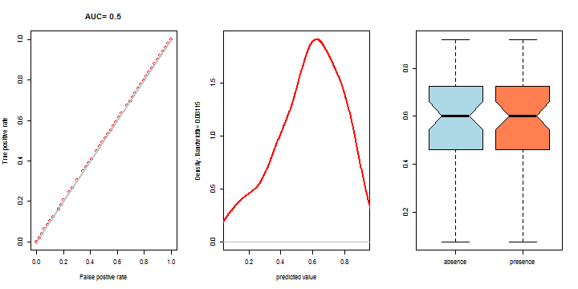
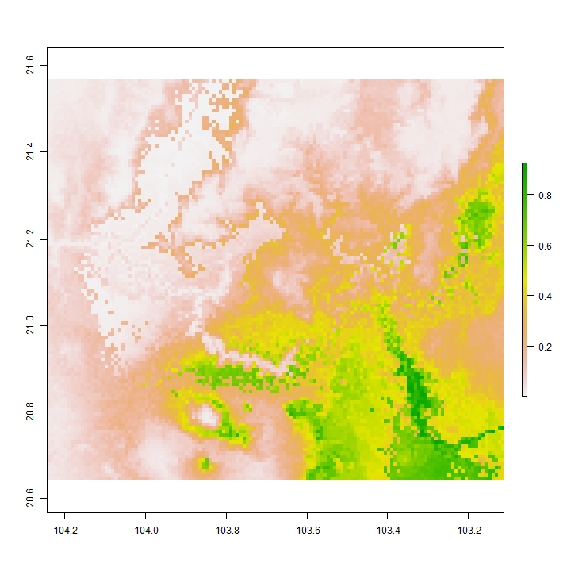
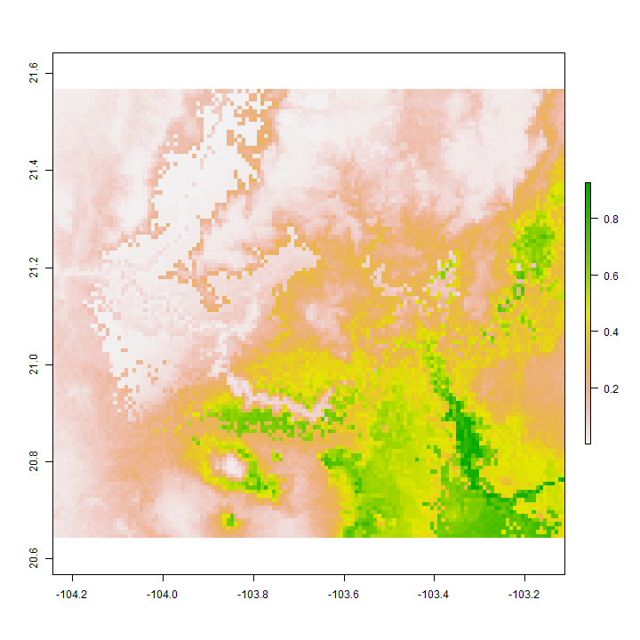

SDM
========================================================


```r
library(rgdal)
```

```
## Warning: package 'rgdal' was built under R version 3.1.2
```

```
## Loading required package: sp
```

```
## Warning: package 'sp' was built under R version 3.1.3
```

```
## rgdal: version: 0.9-1, (SVN revision 518)
## Geospatial Data Abstraction Library extensions to R successfully loaded
## Loaded GDAL runtime: GDAL 1.11.1, released 2014/09/24
## Path to GDAL shared files: C:/Users/Viacheslav/Documents/R/win-library/3.1/rgdal/gdal
## GDAL does not use iconv for recoding strings.
## Loaded PROJ.4 runtime: Rel. 4.8.0, 6 March 2012, [PJ_VERSION: 480]
## Path to PROJ.4 shared files: C:/Users/Viacheslav/Documents/R/win-library/3.1/rgdal/proj
```

```r
library(maptools)
```

```
## Warning: package 'maptools' was built under R version 3.1.3
```

```
## Checking rgeos availability: TRUE
```

```r
library(raster)
```

```
## Warning: package 'raster' was built under R version 3.1.2
```

```
## Warning: no function found corresponding to methods exports from 'raster'
## for: 'overlay'
```

```r
library(dismo)
```

```
## Warning: package 'dismo' was built under R version 3.1.2
```

```r
my_factor.as.numeric <- function (f) { as.numeric(levels(f))[f] }
```

Definición de veriables


```r
my_specie <- 'Zinnia spp.'
my_specie_file <- 'Zinnia_spp_'
my_path <- 'C:\\Users\\Viacheslav\\Google Drive\\Projects_actual\\geo_BioclimInterpolation_Occidente\\Bioclim_a100\\'

b <- stack(paste(my_path,"biovars_primnev_urb_a300.tif",sep=""))
b1 <- stack(paste(my_path,"biovars_primavera_urb_a1001.tif",sep=""))
b2 <- stack(paste(my_path,"biovars_nevado_urb_a100.tif",sep=""))

#names(b) <- c(paste('b',1:19,sep=""))
names(b) <- c(c(paste('b',1:19,sep='')),'bosque')
names(b1) <- c(c(paste('b',1:19,sep='')),'bosque')
names(b2) <- c(c(paste('b',1:19,sep='')),'bosque')

b
```

```
## class       : RasterStack 
## dimensions  : 708, 816, 577728, 20  (nrow, ncol, ncell, nlayers)
## resolution  : 0.002826, 0.002826  (x, y)
## extent      : -104.4682, -102.1622, 19.12987, 21.13067  (xmin, xmax, ymin, ymax)
## coord. ref. : +proj=longlat +datum=WGS84 +no_defs +ellps=WGS84 +towgs84=0,0,0 
## names       :         b1,         b2,         b3,         b4,         b5,         b6,         b7,         b8,         b9,        b10,        b11,        b12,        b13,        b14,        b15, ... 
## min values  :   4.405223,  10.981567,  58.278425, 134.447840,  13.692080,  -4.477830,  15.868942,   5.477194,   3.813679,   6.428560,   2.027267, 566.840209, 126.221420,   0.528550,  83.396544, ... 
## max values  :   29.10558,   18.90479,   73.53308,  303.72861,   40.62962,   18.32430,   28.97528,   30.20341,   29.28378,   31.54873,   26.69527, 1673.42474,  427.77356,   15.02741,  127.54359, ...
```

```r
summary(b)
```

```
## Warning in .local(object, ...): summary is an estimate based on a sample of 1e+05 cells (17.31% of all cells)
```

```
##                b1       b2       b3       b4       b5        b6       b7
## Min.     5.303542 10.98157 58.39999 134.4478 14.42565 -3.486739 15.92261
## 1st Qu. 17.830029 14.65179 63.42119 189.0696 29.70061  4.888924 22.35455
## Median  19.516818 15.25611 64.33775 228.2259 31.38568  6.980811 23.85411
## 3rd Qu. 21.250493 16.23135 65.56369 253.7398 32.96421  9.051780 25.48019
## Max.    29.018219 18.87661 73.44313 302.8456 40.57313 18.199379 28.92143
## NA's     0.000000  0.00000  0.00000   0.0000  0.00000  0.000000  0.00000
##                b8        b9       b10       b11       b12      b13
## Min.     6.324073  4.693514  7.259609  3.022379  588.6977 129.0594
## 1st Qu. 19.758344 17.105520 20.420013 14.517401  828.2686 199.8276
## Median  21.389765 18.827032 22.009894 16.320516  899.8595 223.3313
## 3rd Qu. 22.868360 20.436711 23.568385 18.349322 1006.4109 250.7004
## Max.    30.180412 29.216132 31.490491 26.610166 1671.4274 423.8400
## NA's     0.000000  0.000000  0.000000  0.000000    0.0000   0.0000
##                b14       b15       b16      b17      b18       b19 bosque
## Min.     0.6865053  83.90184  341.5551  3.84918 142.4443  15.93053      1
## 1st Qu.  3.7225207 104.29744  531.6080 17.13714 287.9702  34.17491      1
## Median   4.9566002 110.71527  585.9325 20.65069 399.7682  39.54154      2
## 3rd Qu.  5.9797268 114.64480  654.4386 23.92794 446.5816  48.59670      2
## Max.    14.8146677 127.42572 1147.1639 52.04270 804.6729 100.04044      5
## NA's     0.0000000   0.00000    0.0000  0.00000   0.0000   0.00000      0
```

```r
mask_reclass_table <- matrix(c(-Inf, Inf, 1), ncol=3, byrow=TRUE)
b_mask <- reclassify(subset(b,1),mask_reclass_table)

#b_mask <- mask(subset(b,1),subset(b,1),updatevalue=1)

plot(b,c(1:9), nc=3)
```

 

```r
plot(b,c(10:18), nc=3)
```

 


```r
par(mfrow=c(1, 3))
plot(b,c(19))
plot(b,c(20))
plot(b_mask)
```

 

Cargando puntos de presencia


```r
obs_points <- read.csv("Zinnia_para_modelo.csv")

obs_points
```

```
##    Especie         X        Y
## 1   Zinnia -103.9600 20.67000
## 2   Zinnia -103.1908 20.37611
## 3   Zinnia -103.0306 20.40056
## 4   Zinnia -103.3920 20.72000
## 5   Zinnia -103.5690 20.22800
## 6   Zinnia -103.3870 20.58800
## 7   Zinnia -103.8370 20.88300
## 8   Zinnia -103.3900 20.78000
## 9   Zinnia -103.4800 20.47000
## 10  Zinnia -103.5300 20.38000
## 11  Zinnia -103.6650 20.41500
## 12  Zinnia -103.3900 20.78000
## 13  Zinnia -103.3600 20.42000
## 14  Zinnia -103.3989 20.78056
## 15  Zinnia -103.9658 20.67556
## 16  Zinnia -103.9600 20.37200
## 17  Zinnia -103.7900 20.83000
## 18  Zinnia -103.3980 20.78200
## 19  Zinnia -103.9658 20.67556
## 20  Zinnia -103.8408 20.87000
## 21  Zinnia -103.5333 20.38333
## 22  Zinnia -103.4847 20.47167
## 23  Zinnia -103.3989 20.78056
## 24  Zinnia -103.5640 20.72500
## 25  Zinnia -103.5000 20.67000
## 26  Zinnia -103.5640 20.72500
## 27  Zinnia -103.3106 20.43722
## 28  Zinnia -103.7900 20.83000
## 29  Zinnia -103.5690 20.22800
## 30  Zinnia -103.7900 20.83000
## 31  Zinnia -103.3900 20.78000
## 32  Zinnia -103.6220 20.73300
## 33  Zinnia -103.1900 20.37000
## 34  Zinnia -103.6220 20.73300
## 35  Zinnia -103.4400 20.45000
## 36  Zinnia -103.5878 20.73806
## 37  Zinnia -103.5920 20.42000
## 38  Zinnia -103.8400 20.87000
## 39  Zinnia -103.6219 20.73319
## 40  Zinnia -102.9336 20.71472
## 41  Zinnia -103.3845 19.38128
## 42  Zinnia -103.7580 19.94500
## 43  Zinnia -102.7000 19.88000
## 44  Zinnia -103.3770 19.55300
## 45  Zinnia -102.7000 19.88000
## 46  Zinnia -102.7000 19.88000
## 47  Zinnia -103.3850 19.38100
## 48  Zinnia -102.6158 19.82639
## 49  Zinnia -103.6250 19.32944
## 50  Zinnia -103.6200 19.32000
## 51  Zinnia -103.1486 19.20611
## 52  Zinnia -103.3850 19.38100
## 53  Zinnia -104.2580 19.60000
## 54  Zinnia -102.6670 19.96700
## 55  Zinnia -103.2550 19.67300
## 56  Zinnia -103.6250 19.32944
## 57  Zinnia -103.1400 19.20000
## 58  Zinnia -103.5042 19.31000
```

```r
obs_points_xy <- data.frame(cbind(obs_points[,2],obs_points[,3]))
colnames(obs_points_xy) <- c('x','y')

data(wrld_simpl)
plot(wrld_simpl, xlim=c(-110,-90), ylim=c(10,30), axes=TRUE, col="lightyellow")

points(obs_points_xy$x, obs_points_xy$y, col="red", cex=0.75)
```

 

Generando puntos aleatorios (fondo)


```r
set.seed(0)
random_bg <- randomPoints(b_mask, 1000)

plot(wrld_simpl, xlim=c(-110,-90), ylim=c(10,30), axes=TRUE, col="lightyellow")
points(random_bg, cex=0.2, col="blue")
points(obs_points_xy$x, obs_points_xy$y, col="red", cex=0.75)
```

 

```r
pb <- c(rep(1, nrow(obs_points_xy)), rep(0, nrow(random_bg)))

all_points_xy <- data.frame(cbind(pb, rbind(obs_points_xy, random_bg)))
#dim(all_points_xy)
```

Muestreo de variables


```r
all_vals <- extract(b, all_points_xy[,2:3])

all_vals_xy <- data.frame(cbind(all_points_xy, all_vals))
all_vals_xy <- na.omit(all_vals_xy)

pairs(all_vals_xy[all_vals_xy$pb==1,4:22], cex=0.1, fig=TRUE)
```

 

Separación de "trainset" y "testset"


```r
train_test <- sample(nrow(all_vals_xy), round(0.75 * nrow(all_vals_xy)))
traindata <- all_vals_xy[train_test,]
paste('Número de puntos de entrenamiento:',nrow(traindata[traindata$pb==1,]),sep=' ')
```

```
## [1] "Número de puntos de entrenamiento: 45"
```

```r
#traindata[traindata$pb==1,]
testdata <- all_vals_xy[-train_test,]
paste('Número de puntos de control:',nrow(traindata[testdata$pb==1,]),sep=' ')
```

```
## [1] "Número de puntos de control: 41"
```

```r
#testdata[testdata$pb==1,]
```

Modelación


```r
jar <- paste(system.file(package='dismo'), '/java/maxent.jar', sep='')
if (file.exists(jar)) {
  bc_model <- maxent(b, obs_points_xy, factors='bosque')
  
  str(bc_model)  
  plot(bc_model)
  response(bc_model)
  
} else {
  print('maxent.jar no disponible')
}
```

```
## Loading required package: rJava
```

```
## Warning: package 'rJava' was built under R version 3.1.2
```

```
## Formal class 'MaxEnt' [package "dismo"] with 7 slots
##   ..@ lambdas   : chr [1:84] "(bosque=1.0), -0.8637865763656268, 0.0, 1.0" "(bosque=5.0), 1.781612745710228, 0.0, 1.0" "b1, 0.0, 6.28682441512744, 28.9719986915588" "b10, 0.0, 8.18722101052602, 31.3783283233643" ...
##   ..@ results   : num [1:84, 1] 41 0.945 1.354 500 0.877 ...
##   .. ..- attr(*, "dimnames")=List of 2
##   .. .. ..$ : chr [1:84] "X.Training.samples" "Regularized.training.gain" "Unregularized.training.gain" "Iterations" ...
##   .. .. ..$ : NULL
##   ..@ path      : chr "C:/Users/VIACHE~1/AppData/Local/Temp/R_raster_Viacheslav/maxent/10935549296"
##   ..@ html      : chr "C:/Users/VIACHE~1/AppData/Local/Temp/R_raster_Viacheslav/maxent/10935549296/maxent.html"
##   ..@ presence  :'data.frame':	41 obs. of  20 variables:
##   .. ..$ b1    : num [1:41] 20.6 19.2 19.9 19.4 20.3 ...
##   .. ..$ b2    : num [1:41] 16.4 15.2 15.7 16.1 15.4 ...
##   .. ..$ b3    : num [1:41] 65.2 62.5 63.4 62.5 63.7 ...
##   .. ..$ b4    : num [1:41] 232 252 254 254 222 ...
##   .. ..$ b5    : num [1:41] 33 31 31.7 32.3 32.2 ...
##   .. ..$ b6    : num [1:41] 7.78 6.69 7.03 6.52 8.02 ...
##   .. ..$ b7    : num [1:41] 25.2 24.3 24.7 25.8 24.2 ...
##   .. ..$ b8    : num [1:41] 22.6 21.3 22 21.5 21.7 ...
##   .. ..$ b9    : num [1:41] 19.7 18.6 19.4 18.8 19.5 ...
##   .. ..$ b10   : num [1:41] 22.9 21.8 22.6 22.1 22.7 ...
##   .. ..$ b11   : num [1:41] 17.3 15.7 16.4 16 17.2 ...
##   .. ..$ b12   : num [1:41] 951 825 839 960 614 ...
##   .. ..$ b13   : num [1:41] 241 212 220 258 146 ...
##   .. ..$ b14   : num [1:41] 8.55 5.05 3.17 5.08 2.89 ...
##   .. ..$ b15   : num [1:41] 111 113 116 116 110 ...
##   .. ..$ b16   : num [1:41] 620 544 566 654 384 ...
##   .. ..$ b17   : num [1:41] 28.2 19.5 17.1 21.3 10.9 ...
##   .. ..$ b18   : num [1:41] 450 393 198 460 297 ...
##   .. ..$ b19   : num [1:41] 49.2 31.9 31.5 38.3 22.3 ...
##   .. ..$ bosque: Factor w/ 4 levels "1","2","3","5": 2 1 2 4 4 4 4 2 2 2 ...
##   ..@ absence   :'data.frame':	10000 obs. of  20 variables:
##   .. ..$ b1    : num [1:10000] 21.9 13.4 22.2 21.4 17.5 ...
##   .. ..$ b2    : num [1:10000] 16.9 14.7 14.2 15 14.8 ...
##   .. ..$ b3    : num [1:10000] 63.8 64.9 67.8 66.2 64.9 ...
##   .. ..$ b4    : num [1:10000] 248 211 166 190 211 ...
##   .. ..$ b5    : num [1:10000] 34.9 24.5 32.3 32.7 29.1 ...
##   .. ..$ b6    : num [1:10000] 8.48 1.88 11.3 10.09 6.21 ...
##   .. ..$ b7    : num [1:10000] 26.5 22.6 21 22.6 22.9 ...
##   .. ..$ b8    : num [1:10000] 23.9 14.7 23.2 23 19.4 ...
##   .. ..$ b9    : num [1:10000] 21.3 12.9 21.2 20.6 16.7 ...
##   .. ..$ b10   : num [1:10000] 24.6 15.7 24 23.5 19.8 ...
##   .. ..$ b11   : num [1:10000] 18.5 10.5 20 18.8 14.6 ...
##   .. ..$ b12   : num [1:10000] 946 1192 1295 768 1035 ...
##   .. ..$ b13   : num [1:10000] 264 261 318 170 257 ...
##   .. ..$ b14   : num [1:10000] 4.35 6.22 2.61 5.54 6.72 ...
##   .. ..$ b15   : num [1:10000] 122.1 103.2 115.5 96.5 106.3 ...
##   .. ..$ b16   : num [1:10000] 668 736 896 451 652 ...
##   .. ..$ b17   : num [1:10000] 20.1 30 18 24.8 28 ...
##   .. ..$ b18   : num [1:10000] 201 517 506 340 481 ...
##   .. ..$ b19   : num [1:10000] 35 42.6 52.3 50.5 54.1 ...
##   .. ..$ bosque: Factor w/ 4 levels "1","2","3","5": 1 1 1 2 1 2 2 1 1 1 ...
##   ..@ hasabsence: logi TRUE
```

  

Predicción


```r
  pb1 <- predict(b1, bc_model, progress='window')
```

```
## Loading required package: tcltk
```

```r
  pb1
```

```
## class       : RasterLayer 
## dimensions  : 707, 644, 455308  (nrow, ncol, ncell)
## resolution  : 0.0009421779, 0.0009423608  (x, y)
## extent      : -103.8412, -103.2344, 20.26076, 20.92701  (xmin, xmax, ymin, ymax)
## coord. ref. : +proj=longlat +datum=WGS84 +no_defs +ellps=WGS84 +towgs84=0,0,0 
## data source : in memory
## names       : layer 
## values      : 0.006573327, 0.9559019  (min, max)
```

```r
  plot(pb1, main='Modelo MAXENT Primavera')
```

 

```r
  pb2 <- predict(b2, bc_model, progress='window')
  pb2
```

```
## class       : RasterLayer 
## dimensions  : 566, 515, 291490  (nrow, ncol, ncell)
## resolution  : 0.000941889, 0.000941889  (x, y)
## extent      : -103.8629, -103.3778, 19.32421, 19.85732  (xmin, xmax, ymin, ymax)
## coord. ref. : +proj=longlat +datum=WGS84 +no_defs +ellps=WGS84 +towgs84=0,0,0 
## data source : in memory
## names       : layer 
## values      : 0.00390657, 0.9952362  (min, max)
```

```r
  plot(pb2, main='Modelo MAXENT Nevado')
```

 


Evaluación


```r
e <- evaluate(testdata[testdata$pb==1,], testdata[testdata$pb==0,], bc_model)
e
```

```
## class          : ModelEvaluation 
## n presences    : 13 
## n absences     : 251 
## AUC            : 0.8691388 
## cor            : 0.3931091 
## max TPR+TNR at : 0.5362311
```

```r
#str(e)

par(mfrow=c(1, 3))

plot(e, 'ROC')
density(e)
boxplot(e, col=c('lightblue','coral'), notch=TRUE)
```

```
## Warning in bxp(structure(list(stats = structure(c(0.0026912575121969,
## 0.0780237950384617, : some notches went outside hinges ('box'): maybe set
## notch=FALSE
```

 

Evaluación parte 2


```r
test_presence <- extract(pb1,testdata[testdata$pb==1,2:3])
test_absence <- extract(pb1,testdata[testdata$pb==0,2:3])

test_pb = c(rep('presence', length(test_presence)), rep('absence', length(test_absence)))
test_points <- data.frame(cbind(test_pb, c(test_presence,test_absence)))
colnames(test_points) <- c('obs','prob')
test_points$obs <- as.factor(test_points$obs)
test_points$prob <- my_factor.as.numeric(test_points$prob)

par(mfrow=c(1, 3))
boxplot(prob~obs, data=test_points, col=c('lightblue','coral'), notch=TRUE)
```

```
## Warning in bxp(structure(list(stats = structure(c(0.0717898309230804,
## 0.285201460123062, : some notches went outside hinges ('box'): maybe set
## notch=FALSE
```

 

Guardando raster


```r
if (require(rgdal)) {
  rf1 <- writeRaster(pb1, 
                     filename=paste(my_specie_file,'primavera_maxent_superficie_a100.tif',sep=''), 
                     format='GTiff', overwrite=TRUE)
  rf2 <- writeRaster(pb2, 
                     filename=paste(my_specie_file,'nevado_maxent_superficie_a100.tif',sep=''), 
                     format='GTiff', overwrite=TRUE)
}
```

