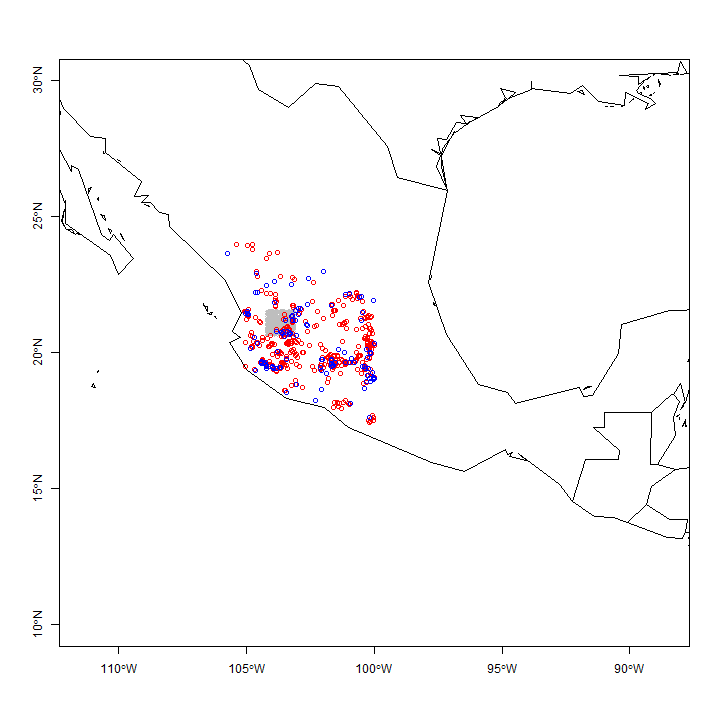
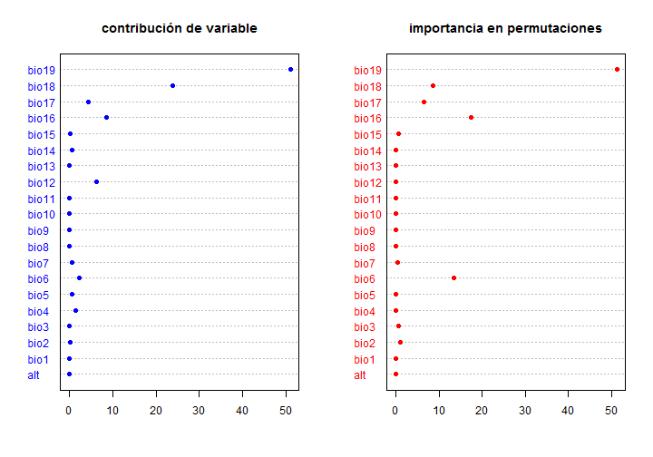
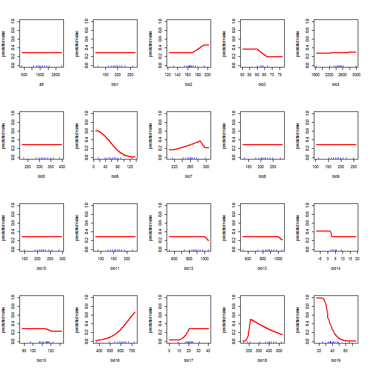
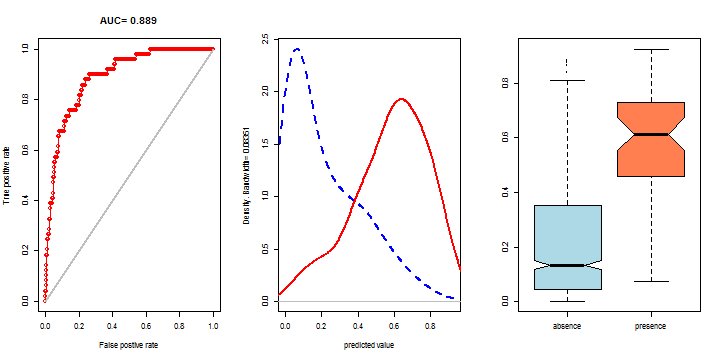
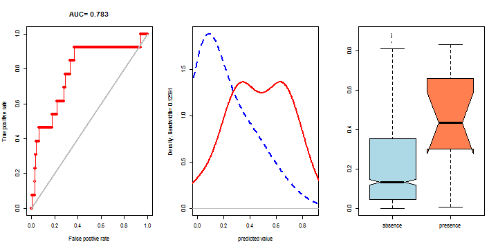
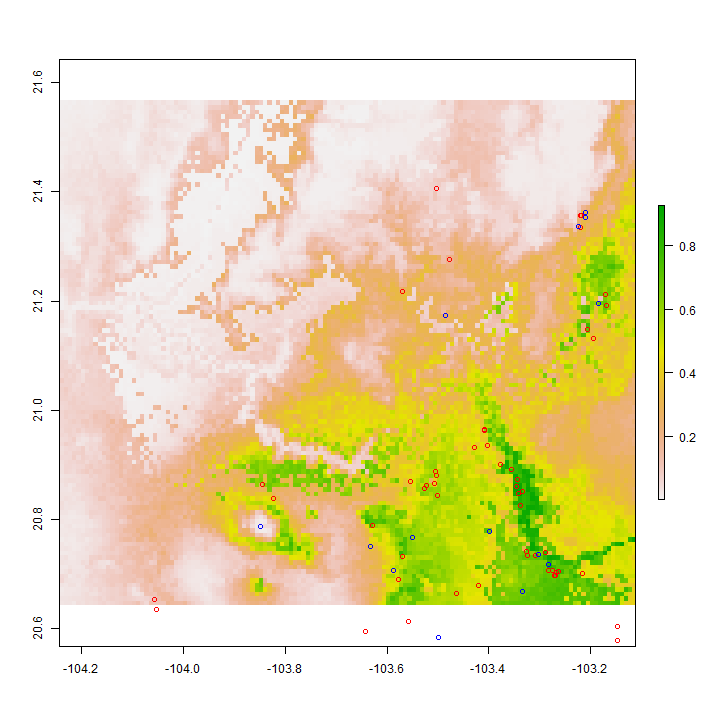

Cargar modulos necesarios


```r
library(maptools)
```

```
## Warning: package 'maptools' was built under R version 3.1.3
```

```
## Loading required package: sp
```

```
## Warning: package 'sp' was built under R version 3.1.3
```

```
## Checking rgeos availability: TRUE
```

```r
library(sp)
library(raster)
```

```
## Warning: package 'raster' was built under R version 3.1.2
```

```
## Warning: no function found corresponding to methods exports from 'raster'
## for: 'overlay'
```

```r
library(dismo)
```

```
## Warning: package 'dismo' was built under R version 3.1.2
```

```r
library(rgdal)
```

```
## Warning: package 'rgdal' was built under R version 3.1.2
```

```
## rgdal: version: 0.9-1, (SVN revision 518)
## Geospatial Data Abstraction Library extensions to R successfully loaded
## Loaded GDAL runtime: GDAL 1.11.1, released 2014/09/24
## Path to GDAL shared files: C:/Users/Viacheslav/Documents/R/win-library/3.1/rgdal/gdal
## GDAL does not use iconv for recoding strings.
## Loaded PROJ.4 runtime: Rel. 4.8.0, 6 March 2012, [PJ_VERSION: 480]
## Path to PROJ.4 shared files: C:/Users/Viacheslav/Documents/R/win-library/3.1/rgdal/proj
```

```r
library(rJava)
```

```
## Warning: package 'rJava' was built under R version 3.1.2
```

```r
maxent.select.contribution <- function (m,n) {
  # parametros: m - objeto del model maxent, n - vector de nombres de variables raster
  resultados <- m@results
  tabla_resultados <- data.frame(t(rep(NA,3)))
  names(tabla_resultados) <- c('variable','contribution','permutation.importance')
  for (i in 1:length(n)) {
    variable1_name <- paste(n[i],'.contribution',sep='')
    variable1_value <- resultados[variable1_name,1]
    variable2_name <- paste(n[i],'.permutation.importance',sep='')
    variable2_value <- resultados[variable2_name,1]
    tabla_resultados <- rbind(tabla_resultados,c(n[i],variable1_value,variable2_value))
  }
  tabla_resultados <- tabla_resultados[-1,]
  return(tabla_resultados)
}
```

Cargar capas de variables


```r
capas_raster<-stack("bioclim_20var_recorte.tif")

nombres <- c("alt","bio1","bio2","bio3","bio4",
                        "bio5","bio6","bio7","bio8","bio9",
                        "bio10","bio11","bio12","bio13","bio14",
                        "bio15","bio16","bio17","bio18","bio19")

names(capas_raster) <- nombres

capas_raster
```

```
## class       : RasterStack 
## dimensions  : 111, 136, 15096, 20  (nrow, ncol, ncell, nlayers)
## resolution  : 0.008333334, 0.008333334  (x, y)
## extent      : -104.2447, -103.1114, 20.64269, 21.56769  (xmin, xmax, ymin, ymax)
## coord. ref. : +proj=longlat +datum=WGS84 +no_defs +ellps=WGS84 +towgs84=0,0,0 
## names       :  alt, bio1, bio2, bio3, bio4, bio5, bio6, bio7, bio8, bio9, bio10, bio11, bio12, bio13, bio14, ... 
## min values  :  349,  120,  132,   60, 1822,  231,   15,  216,  133,  112,   147,    88,   536,   536,     2, ... 
## max values  : 2842,  258,  192,   67, 2978,  389,  128,  297,  279,  249,   286,   223,  1044,  1044,     9, ...
```

```r
summary(capas_raster)
```

```
##          alt bio1 bio2 bio3 bio4 bio5 bio6 bio7 bio8 bio9 bio10 bio11
## Min.     349  120  132   60 1822  231   15  216  133  112   147    88
## 1st Qu. 1335  176  160   62 2372  303   48  251  197  167   204   142
## Median  1574  193  164   63 2475  322   63  260  213  185   220   159
## 3rd Qu. 1845  211  169   63 2551  343   77  268  232  203   238   175
## Max.    2842  258  192   67 2978  389  128  297  279  249   286   223
## NA's       0    0    0    0    0    0    0    0    0    0     0     0
##         bio12 bio13 bio14 bio15 bio16 bio17 bio18 bio19
## Min.      536   536     2    97   370     9 143.0    25
## 1st Qu.   815   815     4   109   557    18 265.0    36
## Median    868   868     5   114   601    21 387.5    40
## 3rd Qu.   920   920     5   116   637    22 431.0    46
## Max.     1044  1044     9   122   722    31 524.0    66
## NA's        0     0     0     0     0     0   0.0     0
```

Cagrar puntos (de entrenamiento 80% y de control 20%)


```r
#puntos<- read.csv("C:/R_est_RFABRS/Dah_coc_80.csv")
puntos_entrenamiento<- read.csv("Dah_coc_80_ok.csv")
dim(puntos_entrenamiento)
```

```
## [1] 464   3
```

```r
head(puntos_entrenamiento)
```

```
##           Especie  Longitud  Latitud
## 1 Dahlia coccinea -104.3793 20.46244
## 2 Dahlia coccinea -103.5066 20.86470
## 3 Dahlia coccinea -104.0570 20.65311
## 4 Dahlia coccinea -104.4861 20.25069
## 5 Dahlia coccinea -103.2412 20.33191
## 6 Dahlia coccinea -101.6098 19.46586
```

```r
tail(puntos_entrenamiento)
```

```
##             Especie  Longitud  Latitud
## 459 Dahlia coccinea -102.5570 20.25673
## 460 Dahlia coccinea -103.3451 20.85950
## 461 Dahlia coccinea -103.5546 20.86980
## 462 Dahlia coccinea -103.2673 20.70310
## 463 Dahlia coccinea -104.4396 21.10696
## 464 Dahlia coccinea -103.4769 21.27639
```

```r
#attach(puntos_entrenamiento)
puntos_entrenamiento_coordenadas<-data.frame(cbind(
                              puntos_entrenamiento[,'Longitud'],
                              puntos_entrenamiento[,'Latitud']))

puntos_control<- read.csv("Dah_coc_20_ok.csv")
dim(puntos_control)
```

```
## [1] 116   3
```

```r
head(puntos_control)
```

```
##           Especie  Longitud  Latitud
## 1 Dahlia coccinea -103.2833 20.71670
## 2 Dahlia coccinea -100.0500 19.03333
## 3 Dahlia coccinea -100.2859 19.83961
## 4 Dahlia coccinea -103.3022 20.73470
## 5 Dahlia coccinea -102.2874 18.25667
## 6 Dahlia coccinea -103.0325 18.82381
```

```r
tail(puntos_control)
```

```
##             Especie  Longitud  Latitud
## 111 Dahlia coccinea -104.5800 22.22000
## 112 Dahlia coccinea -103.5500 20.76667
## 113 Dahlia coccinea -103.3333 20.66667
## 114 Dahlia coccinea -100.4642 19.50000
## 115 Dahlia coccinea -104.2100 19.50000
## 116 Dahlia coccinea -102.0000 23.00000
```

```r
#attach(puntos_control)
puntos_control_coordenadas<-data.frame(cbind(
                            puntos_control[,'Longitud'],
                            puntos_control[,'Latitud']))
```

Generar puntos aleatorios de pseudo-ausencia


```r
mascara_tabla_reclasificacion <- matrix(c(-Inf, Inf, 1), ncol=3, byrow=TRUE)
mascara <- reclassify(subset(capas_raster,1),mascara_tabla_reclasificacion)
set.seed(0)
puntos_aleatorios_fondo <- randomPoints(mascara, 1000)
```

Representar los puntos


```r
data(wrld_simpl)
plot(wrld_simpl, xlim=c(-110,-90), ylim=c(10,30), axes=TRUE)
points(puntos_aleatorios_fondo, cex=0.5, col="gray")
points(puntos_entrenamiento_coordenadas,col='red')
points(puntos_control_coordenadas,col='blue')
```

 

Ajustar el modelo con MaxEnt


```r
jar <- paste(system.file(package="dismo"), "/java/maxent.jar", sep='')

modelo_maxent <- maxent(x=capas_raster, 
                        p=puntos_entrenamiento_coordenadas, 
                        args=c(
                          'removeDuplicates=TRUE', 
                          'jackknife=FALSE',
                          'responsecurves=TRUE',
                          'threads=2'
                        ))
```

```
## Warning in .local(x, p, ...): 1 (2.27%) of the presence points have NA
## predictor values
```

```r
summary(modelo_maxent)
```

```
## Length  Class   Mode 
##      1 MaxEnt     S4
```

```r
#representar la estructura del modelo
#str(modelo_maxent)
#representar resultados en forma de una lista
print(modelo_maxent@results)
```

```
##                                                                                          [,1]
## X.Training.samples                                                                    43.0000
## Regularized.training.gain                                                              0.8366
## Unregularized.training.gain                                                            1.1322
## Iterations                                                                           500.0000
## Training.AUC                                                                           0.8768
## X.Background.points                                                                10043.0000
## alt.contribution                                                                       0.0000
## bio1.contribution                                                                      0.0000
## bio10.contribution                                                                     0.0000
## bio11.contribution                                                                     0.0000
## bio12.contribution                                                                     6.1877
## bio13.contribution                                                                     0.0144
## bio14.contribution                                                                     0.6299
## bio15.contribution                                                                     0.1160
## bio16.contribution                                                                     8.5294
## bio17.contribution                                                                     4.4328
## bio18.contribution                                                                    23.7692
## bio19.contribution                                                                    50.9691
## bio2.contribution                                                                      0.2206
## bio3.contribution                                                                      0.0110
## bio4.contribution                                                                      1.3933
## bio5.contribution                                                                      0.7236
## bio6.contribution                                                                      2.2977
## bio7.contribution                                                                      0.7053
## bio8.contribution                                                                      0.0000
## bio9.contribution                                                                      0.0000
## alt.permutation.importance                                                             0.0000
## bio1.permutation.importance                                                            0.0000
## bio10.permutation.importance                                                           0.0000
## bio11.permutation.importance                                                           0.0000
## bio12.permutation.importance                                                           0.0918
## bio13.permutation.importance                                                           0.0000
## bio14.permutation.importance                                                           0.0000
## bio15.permutation.importance                                                           0.5948
## bio16.permutation.importance                                                          17.4709
## bio17.permutation.importance                                                           6.5099
## bio18.permutation.importance                                                           8.5862
## bio19.permutation.importance                                                          51.2452
## bio2.permutation.importance                                                            1.1318
## bio3.permutation.importance                                                            0.5375
## bio4.permutation.importance                                                            0.0000
## bio5.permutation.importance                                                            0.0000
## bio6.permutation.importance                                                           13.4189
## bio7.permutation.importance                                                            0.4131
## bio8.permutation.importance                                                            0.0000
## bio9.permutation.importance                                                            0.0000
## Entropy                                                                                8.3803
## Prevalence..average.of.logistic.output.over.background.sites.                          0.2150
## Fixed.cumulative.value.1.cumulative.threshold                                          1.0000
## Fixed.cumulative.value.1.logistic.threshold                                            0.0383
## Fixed.cumulative.value.1.area                                                          0.7681
## Fixed.cumulative.value.1.training.omission                                             0.0000
## Fixed.cumulative.value.5.cumulative.threshold                                          5.0000
## Fixed.cumulative.value.5.logistic.threshold                                            0.1135
## Fixed.cumulative.value.5.area                                                          0.5426
## Fixed.cumulative.value.5.training.omission                                             0.0465
## Fixed.cumulative.value.10.cumulative.threshold                                        10.0000
## Fixed.cumulative.value.10.logistic.threshold                                           0.2027
## Fixed.cumulative.value.10.area                                                         0.4242
## Fixed.cumulative.value.10.training.omission                                            0.0465
## Minimum.training.presence.cumulative.threshold                                         2.8553
## Minimum.training.presence.logistic.threshold                                           0.0748
## Minimum.training.presence.area                                                         0.6334
## Minimum.training.presence.training.omission                                            0.0000
## X10.percentile.training.presence.cumulative.threshold                                 13.2366
## X10.percentile.training.presence.logistic.threshold                                    0.2425
## X10.percentile.training.presence.area                                                  0.3755
## X10.percentile.training.presence.training.omission                                     0.0930
## Equal.training.sensitivity.and.specificity.cumulative.threshold                       31.1055
## Equal.training.sensitivity.and.specificity.logistic.threshold                          0.4000
## Equal.training.sensitivity.and.specificity.area                                        0.2093
## Equal.training.sensitivity.and.specificity.training.omission                           0.2093
## Maximum.training.sensitivity.plus.specificity.cumulative.threshold                    27.7403
## Maximum.training.sensitivity.plus.specificity.logistic.threshold                       0.3734
## Maximum.training.sensitivity.plus.specificity.area                                     0.2323
## Maximum.training.sensitivity.plus.specificity.training.omission                        0.1395
## Balance.training.omission..predicted.area.and.threshold.value.cumulative.threshold     2.8553
## Balance.training.omission..predicted.area.and.threshold.value.logistic.threshold       0.0748
## Balance.training.omission..predicted.area.and.threshold.value.area                     0.6334
## Balance.training.omission..predicted.area.and.threshold.value.training.omission        0.0000
## Equate.entropy.of.thresholded.and.original.distributions.cumulative.threshold          9.4379
## Equate.entropy.of.thresholded.and.original.distributions.logistic.threshold            0.1939
## Equate.entropy.of.thresholded.and.original.distributions.area                          0.4341
## Equate.entropy.of.thresholded.and.original.distributions.training.omission             0.0465
```

```r
str(modelo_maxent@results)
```

```
##  num [1:84, 1] 43 0.837 1.132 500 0.877 ...
##  - attr(*, "dimnames")=List of 2
##   ..$ : chr [1:84] "X.Training.samples" "Regularized.training.gain" "Unregularized.training.gain" "Iterations" ...
##   ..$ : NULL
```

Representar grafica de importancia de variables


```r
#plot(modelo_maxent)

contribuciones <- maxent.select.contribution(modelo_maxent,nombres)
#contribuciones
par(mfrow=c(1, 2))
dotchart(as.numeric(contribuciones[,2]),
        col='blue', pch=16,
        labels=contribuciones[,1],
        main='contribución de variable')
dotchart(as.numeric(contribuciones[,3]),
        col='red', pch=16,
        labels=contribuciones[,1],
        main='importancia en permutaciones')
```

 

Representar grafica de curvas de respuesta


```r
response(modelo_maxent)
```

 

Evaluación inicial del modelo


```r
valores_puntos_aleatorios_fondo <- extract(capas_raster, puntos_aleatorios_fondo)
valores_entrenamiento <- extract(capas_raster, puntos_entrenamiento_coordenadas)
valores_control <- extract(capas_raster, puntos_control_coordenadas)

print('Evaluacion con datos de entrenamiento')
```

```
## [1] "Evaluacion con datos de entrenamiento"
```

```r
e_entrenamiento <- evaluate(valores_entrenamiento, valores_puntos_aleatorios_fondo, modelo_maxent)
e_entrenamiento
```

```
## class          : ModelEvaluation 
## n presences    : 49 
## n absences     : 1000 
## AUC            : 0.8891837 
## cor            : 0.3587799 
## max TPR+TNR at : 0.373261
```

```r
threshold(e_entrenamiento)
```

```
##                kappa spec_sens no_omission prevalence equal_sens_spec
## thresholds 0.6100143  0.373261  0.07476206 0.04664419       0.4063395
##            sensitivity
## thresholds   0.2436325
```

```r
par(mfrow=c(1, 3))
plot(e_entrenamiento, 'ROC')
density(e_entrenamiento)
boxplot(e_entrenamiento, col=c('lightblue','coral'), notch=TRUE)
```

 

```r
print('Evaluacion con datos de control')
```

```
## [1] "Evaluacion con datos de control"
```

```r
e_control <- evaluate(valores_control, valores_puntos_aleatorios_fondo, modelo_maxent)
e_control
```

```
## class          : ModelEvaluation 
## n presences    : 13 
## n absences     : 1000 
## AUC            : 0.7834615 
## cor            : 0.1381169 
## max TPR+TNR at : 0.2424164
```

```r
threshold(e_control)
```

```
##                kappa spec_sens no_omission prevalence equal_sens_spec
## thresholds 0.6330841 0.2424164  0.00853643 0.01264877       0.3014585
##            sensitivity
## thresholds   0.2436325
```

```r
par(mfrow=c(1, 3))
plot(e_control, 'ROC')
density(e_control)
boxplot(e_control, col=c('lightblue','coral'), notch=TRUE)
```

```
## Warning in bxp(structure(list(stats = structure(c(0.000799187226220965, :
## some notches went outside hinges ('box'): maybe set notch=FALSE
```

 

Construir la superficie de respuesta con el modelo ajustado


```r
resultado_maxent <- predict(modelo_maxent, capas_raster) 
```

Guardar los resultados


```r
writeRaster(resultado_maxent, filename="Dah_coc_80_raster.csv", format="ascii", overwrite=TRUE)
```

```
## class       : RasterLayer 
## dimensions  : 111, 136, 15096  (nrow, ncol, ncell)
## resolution  : 0.008333334, 0.008333334  (x, y)
## extent      : -104.2447, -103.1114, 20.64269, 21.56769  (xmin, xmax, ymin, ymax)
## coord. ref. : NA 
## data source : C:\Users\Viacheslav\Google Drive\UdeG_Docencia\Tesistas\Martin_Tena\R_scripts_2016\Dah_coc_80_raster.asc 
## names       : Dah_coc_80_raster
```

```r
writeRaster(resultado_maxent, filename="Dah_coc_80_raster.tif", format="GTiff", overwrite=TRUE)
```

```
## class       : RasterLayer 
## dimensions  : 111, 136, 15096  (nrow, ncol, ncell)
## resolution  : 0.008333334, 0.008333334  (x, y)
## extent      : -104.2447, -103.1114, 20.64269, 21.56769  (xmin, xmax, ymin, ymax)
## coord. ref. : +proj=longlat +datum=WGS84 +no_defs +ellps=WGS84 +towgs84=0,0,0 
## data source : C:\Users\Viacheslav\Google Drive\UdeG_Docencia\Tesistas\Martin_Tena\R_scripts_2016\Dah_coc_80_raster.tif 
## names       : Dah_coc_80_raster 
## values      : 0.0004513414, 0.9258956  (min, max)
```

Visualizar los resultados


```r
plot(resultado_maxent)
points(puntos_entrenamiento_coordenadas, col='red')
points(puntos_control_coordenadas, col='blue')
```

 

Generar la pagina de reporte MexEnt en HTML


```r
modelo_maxent
```

```
## class    : MaxEnt 
## variables: alt bio1 bio2 bio3 bio4 bio5 bio6 bio7 bio8 bio9 bio10 bio11 bio12 bio13 bio14 bio15 bio16 bio17 bio18 bio19
```
