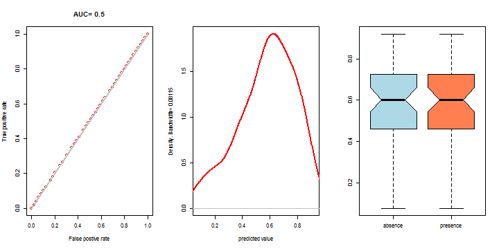

SDM
========================================================


```r
library(rgdal)
```

```
## Warning: package 'rgdal' was built under R version 3.1.2
```

```
## Loading required package: sp
```

```
## Warning: package 'sp' was built under R version 3.1.3
```

```
## rgdal: version: 0.9-1, (SVN revision 518)
## Geospatial Data Abstraction Library extensions to R successfully loaded
## Loaded GDAL runtime: GDAL 1.11.1, released 2014/09/24
## Path to GDAL shared files: C:/Users/Viacheslav/Documents/R/win-library/3.1/rgdal/gdal
## GDAL does not use iconv for recoding strings.
## Loaded PROJ.4 runtime: Rel. 4.8.0, 6 March 2012, [PJ_VERSION: 480]
## Path to PROJ.4 shared files: C:/Users/Viacheslav/Documents/R/win-library/3.1/rgdal/proj
```

```r
library(maptools)
```

```
## Warning: package 'maptools' was built under R version 3.1.3
```

```
## Checking rgeos availability: TRUE
```

```r
library(raster)
```

```
## Warning: package 'raster' was built under R version 3.1.2
```

```
## Warning: no function found corresponding to methods exports from 'raster'
## for: 'overlay'
```

```r
library(dismo)
```

```
## Warning: package 'dismo' was built under R version 3.1.2
```

```r
my_factor.as.numeric <- function (f) { as.numeric(levels(f))[f] }
```

Cargar variables


```r
my_path <- 'C:\\Users\\Viacheslav\\Google Drive\\Projects_actual\\geo_BioclimInterpolation_Occidente\\Bioclim_a100\\'

b <- stack(paste(my_path,"biovars_primnev_modis_a300.tif",sep=""))
b1 <- stack(paste(my_path,"biovars_primavera_modis_a100.tif",sep=""))
b2 <- stack(paste(my_path,"biovars_nevado_modis_a100.tif",sep=""))

names(b) <- c(c(paste('b',1:19,sep='')),'bosque')
names(b1) <- c(c(paste('b',1:19,sep='')),'bosque')
names(b2) <- c(c(paste('b',1:19,sep='')),'bosque')

# variable 18 presenta artefactos
b <- dropLayer(b,18)
b1 <- dropLayer(b1,18)
b2 <- dropLayer(b2,18)

b
```

```
## class       : RasterStack 
## dimensions  : 710, 818, 580780, 19  (nrow, ncol, ncell, nlayers)
## resolution  : 0.002826, 0.002826  (x, y)
## extent      : -104.4701, -102.1584, 19.1279, 21.13436  (xmin, xmax, ymin, ymax)
## coord. ref. : +proj=longlat +datum=WGS84 +no_defs +ellps=WGS84 +towgs84=0,0,0 
## names       :            b1,            b2,            b3,            b4,            b5,            b6,            b7,            b8,            b9,           b10,           b11,           b12,           b13,           b14,           b15, ... 
## min values  :     4.4052229,    10.9750853,    58.2798920,   134.2431641,    13.6920795,    -4.4778304,    15.8833466,     5.4771938,     3.8136790,     6.4285603,     2.0272667,   582.9362793,   126.9471054,     0.5586119,    83.5632095, ... 
## max values  :      29.09713,      18.95131,      73.55495,     304.98874,      40.61411,      18.31081,      29.00008,      30.18755,      29.25659,      31.52076,      26.68643,    1673.64124,     427.13290,      15.02741,     127.91476, ...
```

```r
summary(b)
```

```
## Warning in .local(object, ...): summary is an estimate based on a sample of 1e+05 cells (17.22% of all cells)
```

```
##                b1       b2       b3       b4       b5        b6       b7
## Min.     5.010379 10.99543 58.27989 135.9685 14.17943 -3.800337 15.90026
## 1st Qu. 17.821900 14.65207 63.42052 189.0876 29.70666  4.885640 22.35699
## Median  19.508052 15.25959 64.33964 228.3731 31.38538  6.979039 23.85974
## 3rd Qu. 21.243605 16.23388 65.55941 253.8704 32.96555  9.051965 25.48901
## Max.    29.097128 18.95131 73.48251 304.9503 40.57313 18.310806 29.00008
## NA's     0.000000  0.00000  0.00000   0.0000  0.00000  0.000000  0.00000
##                b8        b9       b10      b11       b12      b13
## Min.     6.041408  4.409182  6.984944  2.70340  586.7786 129.5736
## 1st Qu. 19.754200 17.099059 20.419888 14.51491  828.2810 199.8797
## Median  21.391521 18.822578 22.013971 16.31789  899.8633 223.3840
## 3rd Qu. 22.870901 20.432270 23.566324 18.35339 1006.1586 250.7695
## Max.    30.136705 29.216553 31.485538 26.68643 1671.4352 424.9762
## NA's     0.000000  0.000000  0.000000  0.00000    0.0000   0.0000
##                b14       b15       b16       b17       b19 bosque
## Min.     0.5637149  83.69952  344.1025  3.845378  15.92943  -1999
## 1st Qu.  3.7251334 104.31909  531.6743 17.139454  34.15264   3422
## Median   4.9581990 110.73201  586.1349 20.646889  39.51943   4498
## 3rd Qu.  5.9768168 114.66469  654.5441 23.919662  48.54155   6097
## Max.    14.9223719 127.86947 1146.4808 52.440823 101.12070  10000
## NA's     0.0000000   0.00000    0.0000  0.000000   0.00000      0
```

```r
mask_reclass_table <- matrix(c(-Inf, Inf, 1), ncol=3, byrow=TRUE)
b_mask <- reclassify(subset(b,1),mask_reclass_table)
```


```r
plot(b,c(1:9), nc=3)
```

 

```r
plot(b,c(10:18), nc=3)
```

 


```r
par(mfrow=c(1, 3))
plot(b,c(19))
#plot(b,c(20))
plot(b_mask)
```

 

Cargando puntos de presencia


```r
my_specie <- 'Abies colimensis'
my_specie_file <- 'Abies_colimensis'
my_method <- 'MAXENT'

obs_points <- read.csv("Abies_colimensis_para_modelo.csv")

obs_points
```

```
##               Specie        X       Y
## 1   Abies_colimensis -103.630 19.6063
## 2   Abies_colimensis -103.591 19.6051
## 3   Abies_colimensis -103.599 19.5845
## 4   Abies_colimensis -103.598 19.5868
## 5   Abies_colimensis -103.646 19.5421
## 6   Abies_colimensis -103.607 19.6248
## 7   Abies_colimensis -103.571 19.5601
## 8   Abies_colimensis -103.569 19.5662
## 9   Abies_colimensis -103.561 19.5913
## 10  Abies_colimensis -103.609 19.5292
## 11  Abies_colimensis -103.603 19.5292
## 12  Abies_colimensis -103.562 19.5460
## 13  Abies_colimensis -103.567 19.5425
## 14  Abies_colimensis -103.595 19.5905
## 15  Abies_colimensis -103.953 19.4636
## 16  Abies_colimensis -103.615 19.6172
## 17  Abies_colimensis -104.154 19.5556
## 18  Abies_colimensis -104.100 19.5583
## 19  Abies_colimensis -104.156 19.5606
## 20  Abies_colimensis -104.137 19.5472
## 21  Abies_colimensis -104.139 19.5597
## 22  Abies_colimensis -104.150 19.5542
## 23  Abies_colimensis -104.146 19.5595
## 24  Abies_colimensis -104.168 19.5800
## 25  Abies_colimensis -103.950 19.4553
## 26  Abies_colimensis -103.585 19.5986
## 27  Abies_colimensis -103.570 19.6053
## 28  Abies_colimensis -103.598 19.5361
## 29  Abies_colimensis -103.567 19.5477
## 30  Abies_colimensis -103.604 19.6040
## 31  Abies_colimensis -103.580 19.6034
## 32  Abies_colimensis -103.633 19.6181
## 33  Abies_colimensis -103.576 19.6029
## 34  Abies_colimensis -103.591 19.5966
## 35  Abies_colimensis -103.617 19.6000
## 36  Abies_colimensis -103.600 19.6167
## 37  Abies_colimensis -103.577 19.6036
## 38  Abies_colimensis -103.588 19.5945
## 39  Abies_colimensis -103.651 19.5872
## 40  Abies_colimensis -103.568 19.6047
## 41  Abies_colimensis -103.571 19.6093
## 42  Abies_colimensis -103.569 19.6045
## 43  Abies_colimensis -103.572 19.6043
## 44  Abies_colimensis -103.574 19.6062
## 45  Abies_colimensis -103.574 19.6092
## 46  Abies_colimensis -103.568 19.6089
## 47  Abies_colimensis -103.582 19.5989
## 48  Abies_colimensis -103.579 19.6016
## 49  Abies_colimensis -103.609 19.6246
## 50  Abies_colimensis -103.577 19.6024
## 51  Abies_colimensis -103.570 19.6066
## 52  Abies_colimensis -103.603 19.5679
## 53  Abies_colimensis -103.615 19.5831
## 54  Abies_colimensis -103.581 19.5913
## 55  Abies_colimensis -103.581 19.5987
## 56  Abies_colimensis -103.581 19.5987
## 57  Abies_colimensis -103.589 19.5964
## 58  Abies_colimensis -103.589 19.5969
## 59  Abies_colimensis -103.589 19.5960
## 60  Abies_colimensis -103.598 19.5885
## 61  Abies_colimensis -103.590 19.5966
## 62  Abies_colimensis -103.598 19.5872
## 63  Abies_colimensis -103.597 19.5870
## 64  Abies_colimensis -103.598 19.5868
## 65  Abies_colimensis -103.586 19.5985
## 66  Abies_colimensis -103.582 19.6035
## 67  Abies_colimensis -103.581 19.6037
## 68  Abies_colimensis -103.580 19.6019
## 69  Abies_colimensis -103.590 19.5958
## 70  Abies_colimensis -103.570 19.6054
## 71  Abies_colimensis -103.580 19.6010
## 72  Abies_colimensis -103.582 19.6009
## 73  Abies_colimensis -103.581 19.5988
## 74  Abies_colimensis -103.583 19.5994
## 75  Abies_colimensis -103.586 19.5995
## 76  Abies_colimensis -103.587 19.5957
## 77  Abies_colimensis -103.640 19.5501
## 78  Abies_colimensis -103.639 19.5334
## 79  Abies_colimensis -103.638 19.5462
## 80  Abies_colimensis -103.637 19.5462
## 81  Abies_colimensis -103.638 19.5478
## 82  Abies_colimensis -103.638 19.5479
## 83  Abies_colimensis -103.639 19.5473
## 84  Abies_colimensis -103.635 19.5453
## 85  Abies_colimensis -103.597 19.5871
## 86  Abies_colimensis -103.598 19.5867
## 87  Abies_colimensis -103.598 19.5884
## 88  Abies_colimensis -103.599 19.5899
## 89  Abies_colimensis -103.598 19.5856
## 90  Abies_colimensis -103.598 19.5846
## 91  Abies_colimensis -103.599 19.5844
## 92  Abies_colimensis -103.600 19.5839
## 93  Abies_colimensis -103.599 19.5819
## 94  Abies_colimensis -103.596 19.5767
## 95  Abies_colimensis -103.592 19.5737
## 96  Abies_colimensis -103.633 19.5406
## 97  Abies_colimensis -103.632 19.5382
## 98  Abies_colimensis -103.633 19.5382
## 99  Abies_colimensis -103.637 19.5351
## 100 Abies_colimensis -103.637 19.5338
## 101 Abies_colimensis -103.642 19.5235
## 102 Abies_colimensis -103.594 19.5293
## 103 Abies_colimensis -103.593 19.5316
## 104 Abies_colimensis -103.599 19.5319
## 105 Abies_colimensis -103.604 19.5259
## 106 Abies_colimensis -103.611 19.5285
## 107 Abies_colimensis -103.632 19.5850
## 108 Abies_colimensis -103.634 19.5802
## 109 Abies_colimensis -103.636 19.5855
## 110 Abies_colimensis -103.638 19.5805
## 111 Abies_colimensis -103.641 19.5846
## 112 Abies_colimensis -103.597 19.5871
## 113 Abies_colimensis -103.589 19.5969
## 114 Abies_colimensis -103.581 19.5987
## 115 Abies_colimensis -103.579 19.6024
## 116 Abies_colimensis -103.576 19.6038
## 117 Abies_colimensis -103.584 19.5249
## 118 Abies_colimensis -103.962 19.5054
## 119 Abies_colimensis -103.949 19.4674
## 120 Abies_colimensis -103.933 19.4500
## 121 Abies_colimensis -103.947 19.5083
## 122 Abies_colimensis -103.953 19.4008
```

```r
obs_points_xy <- data.frame(cbind(obs_points[,2],obs_points[,3]))
colnames(obs_points_xy) <- c('x','y')

data(wrld_simpl)
plot(wrld_simpl, xlim=c(-110,-90), ylim=c(10,30), axes=TRUE, col="lightyellow")

points(obs_points_xy$x, obs_points_xy$y, col="red", cex=0.75)
```

 

Generando puntos aleatorios (fondo)


```r
set.seed(0)
random_bg <- randomPoints(b_mask, 1000)

plot(wrld_simpl, xlim=c(-110,-90), ylim=c(10,30), axes=TRUE, col="lightyellow")
points(random_bg, cex=0.2, col="blue")
points(obs_points_xy$x, obs_points_xy$y, col="red", cex=0.75)
```

 

```r
pb <- c(rep(1, nrow(obs_points_xy)), rep(0, nrow(random_bg)))

all_points_xy <- data.frame(cbind(pb, rbind(obs_points_xy, random_bg)))
#dim(all_points_xy)
```

Muestreo de variables


```r
all_vals <- extract(b, all_points_xy[,2:3])

all_vals_xy <- data.frame(cbind(all_points_xy, all_vals))
all_vals_xy <- na.omit(all_vals_xy)

pairs(all_vals_xy[all_vals_xy$pb==1,4:22], cex=0.1, fig=TRUE)
```

 

Separación de "trainset" y "testset"


```r
train_test <- sample(nrow(all_vals_xy), round(0.75 * nrow(all_vals_xy)))
traindata <- all_vals_xy[train_test,]
paste('Número de puntos de entrenamiento:',nrow(traindata[traindata$pb==1,]),sep=' ')
```

```
## [1] "Número de puntos de entrenamiento: 93"
```

```r
#traindata[traindata$pb==1,]
testdata <- all_vals_xy[-train_test,]
paste('Número de puntos de control:',nrow(traindata[testdata$pb==1,]),sep=' ')
```

```
## [1] "Número de puntos de control: 89"
```

```r
#testdata[testdata$pb==1,]
```

Modelación


```r
jar <- paste(system.file(package='dismo'), '/java/maxent.jar', sep='')
if (file.exists(jar)) {
  #bc_model <- maxent(b, obs_points_xy, factors='bosque')
  bc_model <- maxent(b, obs_points_xy)  
  
  str(bc_model)  
  plot(bc_model)
  response(bc_model)
  
} else {
  print('maxent.jar no disponible')
}
```

```
## Loading required package: rJava
```

```
## Warning: package 'rJava' was built under R version 3.1.2
```

```
## Formal class 'MaxEnt' [package "dismo"] with 7 slots
##   ..@ lambdas   : chr [1:56] "b1, 0.0, 6.099032402038574, 29.0174884796143" "b10, 0.0, 8.063112258911133, 31.3041381835938" "b11, 0.0, 3.8127622604370117, 26.5992984771729" "b12, 0.0, 591.928039550781, 1640.89770507812" ...
##   ..@ results   : num [1:82, 1] 82 4.158 4.296 500 0.994 ...
##   .. ..- attr(*, "dimnames")=List of 2
##   .. .. ..$ : chr [1:82] "X.Training.samples" "Regularized.training.gain" "Unregularized.training.gain" "Iterations" ...
##   .. .. ..$ : NULL
##   ..@ path      : chr "C:/Users/VIACHE~1/AppData/Local/Temp/R_raster_Viacheslav/maxent/2544763163"
##   ..@ html      : chr "C:/Users/VIACHE~1/AppData/Local/Temp/R_raster_Viacheslav/maxent/2544763163/maxent.html"
##   ..@ presence  :'data.frame':	82 obs. of  19 variables:
##   .. ..$ b1    : num [1:82] 11.02 10.86 9.21 9.19 11.56 ...
##   .. ..$ b2    : num [1:82] 12.1 12.2 11.5 11.5 12.2 ...
##   .. ..$ b3    : num [1:82] 62.1 62.1 62.7 62.6 62.5 ...
##   .. ..$ b4    : num [1:82] 195 197 175 177 190 ...
##   .. ..$ b5    : num [1:82] 20.8 20.7 18.4 18.5 21.3 ...
##   .. ..$ b6    : num [1:82] 1.2961 1.0283 0.106 0.0393 1.7931 ...
##   .. ..$ b7    : num [1:82] 19.5 19.7 18.3 18.4 19.5 ...
##   .. ..$ b8    : num [1:82] 12.3 12.1 10.3 10.3 12.8 ...
##   .. ..$ b9    : num [1:82] 10.29 10.12 8.51 8.49 10.82 ...
##   .. ..$ b10   : num [1:82] 13.2 13.1 11.2 11.2 13.7 ...
##   .. ..$ b11   : num [1:82] 8.43 8.21 6.87 6.83 9.02 ...
##   .. ..$ b12   : num [1:82] 1169 1182 1248 1238 1186 ...
##   .. ..$ b13   : num [1:82] 236 239 257 255 243 ...
##   .. ..$ b14   : num [1:82] 9.17 8.99 10.98 10.9 8.35 ...
##   .. ..$ b15   : num [1:82] 95.6 96 95.3 95.3 97.2 ...
##   .. ..$ b16   : num [1:82] 680 691 733 727 701 ...
##   .. ..$ b17   : num [1:82] 32.4 32 39.3 39 29.6 ...
##   .. ..$ b19   : num [1:82] 66 65.4 76.4 75.5 63.2 ...
##   .. ..$ bosque: num [1:82] 8026 7280 6772 6979 6783 ...
##   ..@ absence   :'data.frame':	10000 obs. of  19 variables:
##   .. ..$ b1    : num [1:10000] 15.5 20.4 19.3 18.2 25.7 ...
##   .. ..$ b2    : num [1:10000] 14.5 14.6 14.2 15.7 14.5 ...
##   .. ..$ b3    : num [1:10000] 63.3 66.5 66.5 65.5 65.7 ...
##   .. ..$ b4    : num [1:10000] 225 173 168 221 176 ...
##   .. ..$ b5    : num [1:10000] 27.3 31.3 29.4 30.2 36.7 ...
##   .. ..$ b6    : num [1:10000] 4.37 9.37 8.09 6.34 14.61 ...
##   .. ..$ b7    : num [1:10000] 22.9 21.9 21.3 23.9 22.1 ...
##   .. ..$ b8    : num [1:10000] 17 21.7 20.3 20.2 26.2 ...
##   .. ..$ b9    : num [1:10000] 14.7 19.7 18.4 17.4 25.6 ...
##   .. ..$ b10   : num [1:10000] 18.1 22.3 21 20.5 27.9 ...
##   .. ..$ b11   : num [1:10000] 12.6 18 16.9 15.2 23.3 ...
##   .. ..$ b12   : num [1:10000] 906 762 684 964 992 ...
##   .. ..$ b13   : num [1:10000] 239 167 158 241 214 ...
##   .. ..$ b14   : num [1:10000] 5 5.07 2.21 6.73 3.46 ...
##   .. ..$ b15   : num [1:10000] 111.5 95.1 105.7 109.7 108.1 ...
##   .. ..$ b16   : num [1:10000] 600 440 447 621 616 ...
##   .. ..$ b17   : num [1:10000] 22.11 23.63 7.89 23 16.66 ...
##   .. ..$ b19   : num [1:10000] 52.1 52.8 32 47.2 35.8 ...
##   .. ..$ bosque: num [1:10000] 6820 5653 7403 5075 5475 ...
##   ..@ hasabsence: logi TRUE
```

  

Predicción


```r
  pb1 <- predict(b1, bc_model, progress='window')
```

```
## Loading required package: tcltk
```

```r
  pb1
```

```
## class       : RasterLayer 
## dimensions  : 278, 253, 70334  (nrow, ncol, ncell)
## resolution  : 0.002413, 0.002413  (x, y)
## extent      : -103.8431, -103.2326, 20.25888, 20.92969  (xmin, xmax, ymin, ymax)
## coord. ref. : +proj=longlat +datum=WGS84 +no_defs +ellps=WGS84 +towgs84=0,0,0 
## data source : in memory
## names       : layer 
## values      : 2.209038e-07, 0.09969407  (min, max)
```

```r
  plot(pb1, main=paste('Modelo',my_method,'Primavera:',my_specie,sep=' '))
```

 

```r
  pb2 <- predict(b2, bc_model, progress='window')
  pb2
```

```
## class       : RasterLayer 
## dimensions  : 223, 203, 45269  (nrow, ncol, ncell)
## resolution  : 0.002413, 0.002413  (x, y)
## extent      : -103.8647, -103.3749, 19.32139, 19.85949  (xmin, xmax, ymin, ymax)
## coord. ref. : +proj=longlat +datum=WGS84 +no_defs +ellps=WGS84 +towgs84=0,0,0 
## data source : in memory
## names       : layer 
## values      : 7.182651e-06, 0.7498888  (min, max)
```

```r
  plot(pb2, main=paste('Modelo',my_method,'Nevado:',my_specie,sep=' '))
```

 


Evaluación


```r
e <- evaluate(testdata[testdata$pb==1,], testdata[testdata$pb==0,], bc_model)
e
```

```
## class          : ModelEvaluation 
## n presences    : 29 
## n absences     : 251 
## AUC            : 0.9973898 
## cor            : 0.9682943 
## max TPR+TNR at : 0.4253253
```

```r
#str(e)

par(mfrow=c(1, 3))

plot(e, 'ROC')
density(e)
boxplot(e, col=c('lightblue','coral'), notch=TRUE)
```

 

Evaluación parte 2


```r
test_presence1 <- extract(pb1,testdata[testdata$pb==1,2:3])
test_absence1 <- extract(pb1,testdata[testdata$pb==0,2:3])
test_presence2 <- extract(pb2,testdata[testdata$pb==1,2:3])
test_absence2 <- extract(pb2,testdata[testdata$pb==0,2:3])

test_pb1 = c(rep('presence', length(test_presence1)), rep('absence', length(test_absence1)))
test_points1 <- data.frame(cbind(test_pb1, c(test_presence1,test_absence1)))
colnames(test_points1) <- c('obs','prob')
test_points1$obs <- as.factor(test_points1$obs)
test_points1$prob <- my_factor.as.numeric(test_points1$prob)

test_pb2 = c(rep('presence', length(test_presence2)), rep('absence', length(test_absence2)))
test_points2 <- data.frame(cbind(test_pb2, c(test_presence2,test_absence2)))
colnames(test_points2) <- c('obs','prob')
test_points2$obs <- as.factor(test_points2$obs)
test_points2$prob <- my_factor.as.numeric(test_points2$prob)

par(mfrow=c(1, 3))
boxplot(prob~obs, data=test_points1, col=c('lightblue','coral'), notch=TRUE, main='Primavera')
```

```
## Warning in bxp(structure(list(stats = structure(c(6.55339499644469e-06, :
## some notches went outside hinges ('box'): maybe set notch=FALSE
```

```r
boxplot(prob~obs, data=test_points2, col=c('lightblue','coral'), notch=TRUE, main='Nevado')
```

```
## Warning in bxp(structure(list(stats = structure(c(3.45088046742603e-05, :
## some notches went outside hinges ('box'): maybe set notch=FALSE
```

 

Guardando raster


```r
if (require(rgdal)) {
  rf1 <- writeRaster(pb1, 
                     filename=paste(my_specie_file,'_primavera_',my_method,'_superficie_a100.tif',sep=''), 
                     format='GTiff', overwrite=TRUE)
  rf2 <- writeRaster(pb2, 
                     filename=paste(my_specie_file,'_nevado_',my_method,'_superficie_a100.tif',sep=''), 
                     format='GTiff', overwrite=TRUE)
}
```

