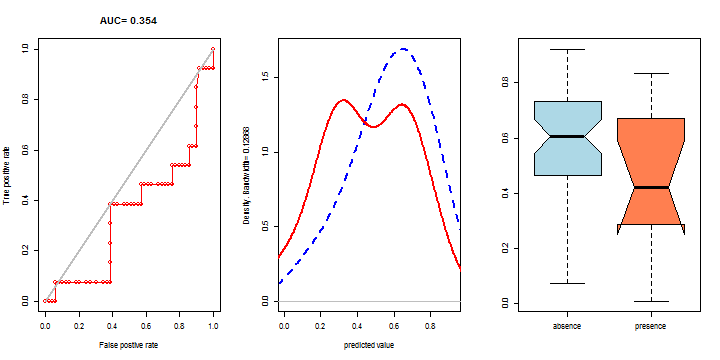
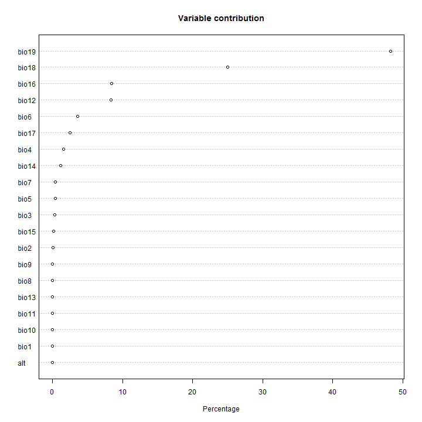

Regresiones de temperatura vs. elevación por cuadrantes
========================================================


```r
elev_field <- 'MDE_aster';
slope_field <- 'slope';
wind_slope_field <- 'wind_slop';
wind_dist_field <- 'wind_dist';
ocean_slope_field <- 'ocean_slop';
ocean_dist_field <- 'ocean_dist';
wind_speed_field <- 'wind_sp01';

list_prec <- c('prec_1_cli')  # for debugging
#list_prec <- c('prec_1_cli','prec_2_cli','prec_3_cli','prec_4_cli','prec_5_cli','prec_6_cli','prec_7_cli','prec_8_cli','prec_9_cli','prec_10_cl','prec_11_cl','prec_12_cl')


orth2raw <- function(x){
# x <- poly(.., raw=FALSE) has a "coefs" attribute "which contains 
# the centering and normalization constants used in constructing 
# the orthogonal polynomials". orth2raw returns the coefficents of
# those polynomials in the conventional form
#    b0.x^0 + b1.x^1 + b2.x^2 + ...
# It handles the coefs list returned by my modifications of 
# poly and polym to handle multivariate predictions  
    o2r <- function(coefs){
       Xmean <- coefs$alpha[1]
       Xsd <- sqrt(coefs$norm2[3]/coefs$norm2[2])
       X <- seq(Xmean-3*Xsd, Xmean+3*Xsd, length.out=degree+1)
       Y <- poly(X, degree = degree, coefs=coefs)
       Rcoefs <- matrix(0,degree, degree+1)
       for (i in 1:degree) Rcoefs[i,1:(i+1)] <- coef(lm(Y[,i] ~ poly(X, i, raw=TRUE) ))
       dimnames(Rcoefs) <- list(paste0("poly(x)", 1:degree), paste0("x^",0:degree))
       Rcoefs
      }
   degree <- max(attr(x, "degree"))
   coefs <- attr(x, "coefs")
   if(is.list(coefs[[1]])) lapply(coefs, o2r) else o2r(coefs)
   }

mypolym <- function (..., degree = 1, coefs = NULL, raw = FALSE) 
# modified by Keith Jewell 
# modified by Trevor Hastie
# add coefs argument 
{ 
   if(is.null(coefs)) { 
     dots <- list(...) 
     nd <- length(dots) 
     if (nd == 0) 
       stop("must supply one or more vectors") 
     if (nd == 1) 
       return(mypoly(dots[[1L]], degree, raw = raw)) 
     n <- sapply(dots, length) 
     if (any(n != n[1L])) 
       stop("arguments must have the same length") 
     z <- do.call("expand.grid", rep.int(list(0:degree), nd)) 
     s <- rowSums(z) 
     ind <- (s > 0) & (s <= degree) 
     z <- z[ind, ] 
     s <- s[ind] 
     aPoly <- mypoly(dots[[1L]], degree, raw = raw) # avoid 2 calcs 
     res <- cbind(1, aPoly)[, 1 + z[, 1]] 
# attribute "coefs" = list of coefs from individual variables 
     if (!raw) coefs <- list(attr(aPoly, "coefs")) 
     for (i in 2:nd) { 
       aPoly <- mypoly(dots[[i]], degree, raw = raw) 
       res <- res * cbind(1, aPoly)[, 1 + z[, i]] 
       if (!raw) coefs <- c(coefs, list(attr(aPoly, "coefs"))) 
     } 
     colnames(res) <- apply(z, 1L, function(x) paste(x, collapse = ".")) 
     attr(res, "degree") <- as.vector(s) 
     if (!raw) attr(res, "coefs") <- coefs 
     class(res) <- c("mypoly", "matrix") # add poly class 
     res 
   } 
   else 
   { 
     nd <- length(coefs)    # number of variables 
     newdata <- as.data.frame(list(...)) # new data 
     if (nd != ncol(newdata)) stop("wrong number of columns in newdata") 
     z <- do.call("expand.grid", rep.int(list(0:degree), nd)) 
     s <- rowSums(z) 
     ind <- (s > 0) & (s <= degree) 
     z <- z[ind, ] 
     res <- cbind(1, mypoly(newdata[[1]], degree=degree, 
coefs=coefs[[1]]))[, 1 + z[, 1]] 
     for (i in 2:nd) res <- res*cbind(1, poly(newdata[[i]], 
degree=degree, coefs=coefs[[i]]))[, 1 + z[, i]] 
     colnames(res) <- apply(z, 1L, function(x) paste(x, collapse = ".")) 
     res 
   } 
} 

mypoly <-
  function (x, ..., degree = 1, coefs = NULL, raw = FALSE) 
{
  dots <- list(...)
  if (nd <- length(dots)) {
    if (nd == 1 && length(dots[[1L]]) == 1L) 
      degree <- dots[[1L]]
    else return(mypolym(x, ..., degree = degree, coefs=coefs, raw = raw))
  }
  if (is.matrix(x)) {
    m <- unclass(as.data.frame(cbind(x, ...)))
    return(do.call("mypolym", c(m, degree = degree, raw = raw,list(coefs=coefs))))
  }
  if (degree < 1) 
    stop("'degree' must be at least 1")
  if (any(is.na(x))) 
    stop("missing values are not allowed in 'poly'")
  n <- degree + 1
  if (raw) {
    Z <- outer(x, 1L:degree, "^")
    colnames(Z) <- 1L:degree
    attr(Z, "degree") <- 1L:degree
    class(Z) <- c("mypoly", "matrix")
    return(Z)
  }
  if (is.null(coefs)) {
    if (degree >= length(unique(x))) 
      stop("'degree' must be less than number of unique points")
    xbar <- mean(x)
    x <- x - xbar
    X <- outer(x, seq_len(n) - 1, "^")
    QR <- qr(X)
#browser()  # debugging
    if (QR$rank < degree) 
      stop("'degree' must be less than number of unique points")
    z <- QR$qr
    z <- z * (row(z) == col(z))
    raw <- qr.qy(QR, z)
    norm2 <- colSums(raw^2)
    alpha <- (colSums(x * raw^2)/norm2 + xbar)[1L:degree]
    Z <- raw/rep(sqrt(norm2), each = length(x))
    colnames(Z) <- 1L:n - 1L
    Z <- Z[, -1, drop = FALSE]
    attr(Z, "degree") <- 1L:degree
    attr(Z, "coefs") <- list(alpha = alpha, norm2 = c(1, 
                                              norm2))
    class(Z) <- c("mypoly", "matrix")
  }
  else {
    alpha <- coefs$alpha
    norm2 <- coefs$norm2
    Z <- matrix(, length(x), n)
    Z[, 1] <- 1
    Z[, 2] <- x - alpha[1L]
    if (degree > 1) 
      for (i in 2:degree) Z[, i + 1] <- (x - alpha[i]) * 
        Z[, i] - (norm2[i + 1]/norm2[i]) * Z[, i - 1]
    Z <- Z/rep(sqrt(norm2[-1L]), each = length(x))
    colnames(Z) <- 0:degree
    Z <- Z[, -1, drop = FALSE]
    attr(Z, "degree") <- 1L:degree
    attr(Z, "coefs") <- list(alpha = alpha, norm2 = norm2)
    class(Z) <- c("mypoly", "matrix")
  }
  Z
}
```


```r
# read data
library(foreign)
prec<-read.dbf("prec_100000_sample.dbf")

# add variables to identify 1 degree cuadrants 
prec$Xclass <- as.factor(floor(prec$X))
prec$Yclass <- as.factor(floor(prec$Y))

# make lists of cuadrant indices
prec_X_values <- sort(unique(prec$Xclass, incomparables = FALSE))
prec_Y_values <- sort(unique(prec$Yclass, incomparables = FALSE))

prec_X_values
```

```
##  [1] -107 -106 -105 -104 -103 -102 -101 -100 -99  -98  -97  -96  -95  -94 
## [15] -93  -92  -91  -90  -89  -88  -87  -86  -85  -84  -83  -82  -81  -80 
## [29] -79  -78  -77  -76  -75  -74  -73 
## 35 Levels: -107 -106 -105 -104 -103 -102 -101 -100 -99 -98 -97 -96 ... -73
```

```r
prec_Y_values
```

```
##  [1] 5  6  7  8  9  10 11 12 13 14 15 16 17 18 19 20 21 22 23 24
## Levels: 5 6 7 8 9 10 11 12 13 14 15 16 17 18 19 20 21 22 23 24
```


```r
dim(prec)
```

```
## [1] 100000     23
```

```r
summary(prec)
```

```
##    MDE_aster          slope          wind_slop         wind_dist     
##  Min.   :   0.0   Min.   : 0.000   Min.   : 0.0000   Min.   :0.0000  
##  1st Qu.:  61.0   1st Qu.: 3.769   1st Qu.: 0.8431   1st Qu.:0.3000  
##  Median : 365.0   Median : 7.854   Median : 2.3821   Median :0.7807  
##  Mean   : 763.5   Mean   :11.143   Mean   : 4.0702   Mean   :1.0310  
##  3rd Qu.:1410.0   3rd Qu.:16.051   3rd Qu.: 5.4667   3rd Qu.:1.4795  
##  Max.   :4861.0   Max.   :87.970   Max.   :44.5858   Max.   :5.4989  
##                                                                      
##    ocean_slop        ocean_dist       wind_sp01         prec_1_cli    
##  Min.   : 0.0000   Min.   :0.0000   Min.   : 0.3498   Min.   :  0.00  
##  1st Qu.: 0.9218   1st Qu.:0.3005   1st Qu.: 1.2826   1st Qu.: 16.00  
##  Median : 2.5579   Median :0.7777   Median : 4.1188   Median : 30.00  
##  Mean   : 4.2938   Mean   :1.0018   Mean   : 4.0609   Mean   : 51.05  
##  3rd Qu.: 5.7629   3rd Qu.:1.4535   3rd Qu.: 6.1260   3rd Qu.: 63.00  
##  Max.   :44.7741   Max.   :4.1128   Max.   :10.6780   Max.   :504.00  
##                                                                       
##    prec_10_cl      prec_11_cl      prec_12_cl       prec_2_cli    
##  Min.   : 13.0   Min.   :  2.0   Min.   :  0.00   Min.   :  0.00  
##  1st Qu.: 82.0   1st Qu.: 22.0   1st Qu.: 15.00   1st Qu.:  8.00  
##  Median :166.0   Median : 65.0   Median : 37.00   Median : 24.00  
##  Mean   :192.5   Mean   :109.7   Mean   : 69.02   Mean   : 36.42  
##  3rd Qu.:276.0   3rd Qu.:167.0   3rd Qu.: 98.00   3rd Qu.: 51.00  
##  Max.   :820.0   Max.   :799.0   Max.   :749.00   Max.   :483.00  
##                                                                   
##    prec_3_cli       prec_4_cli       prec_5_cli      prec_6_cli   
##  Min.   :  0.00   Min.   :  0.00   Min.   :  0.0   Min.   : 15.0  
##  1st Qu.:  8.00   1st Qu.: 18.00   1st Qu.: 59.0   1st Qu.:147.0  
##  Median : 24.00   Median : 41.00   Median :111.0   Median :200.0  
##  Mean   : 35.85   Mean   : 64.15   Mean   :136.2   Mean   :219.6  
##  3rd Qu.: 49.00   3rd Qu.: 74.00   3rd Qu.:190.0   3rd Qu.:280.0  
##  Max.   :486.00   Max.   :797.00   Max.   :709.0   Max.   :777.0  
##                                                                   
##    prec_7_cli    prec_8_cli      prec_9_cli          X          
##  Min.   : 16   Min.   : 29.0   Min.   : 31.0   Min.   :-107.00  
##  1st Qu.:139   1st Qu.:148.0   1st Qu.:169.0   1st Qu.: -99.17  
##  Median :192   Median :198.0   Median :225.0   Median : -90.27  
##  Mean   :219   Mean   :220.2   Mean   :243.2   Mean   : -90.48  
##  3rd Qu.:273   3rd Qu.:276.0   3rd Qu.:310.0   3rd Qu.: -83.88  
##  Max.   :942   Max.   :803.0   Max.   :807.0   Max.   : -72.98  
##                                                                 
##        Y              Xclass          Yclass     
##  Min.   : 5.992   -90    : 4832   20     : 9342  
##  1st Qu.:13.813   -99    : 4770   18     : 9301  
##  Median :17.730   -100   : 4714   17     : 8460  
##  Mean   :16.719   -89    : 4608   21     : 7729  
##  3rd Qu.:20.598   -101   : 4396   19     : 7637  
##  Max.   :24.016   -102   : 4142   22     : 7545  
##                   (Other):72538   (Other):49986
```


```r
par(mfcol = c(1,2))

for (k in 1:length(list_prec)) {
  
          y <- prec[[list_prec[k]]]  
          el <- prec[[elev_field]]
          sl <- prec[[slope_field]]
          ws <- prec[[wind_slope_field]]
          wd <- prec[[wind_dist_field]]
          os <- prec[[ocean_slope_field]]
          od <- prec[[ocean_dist_field]]
          sp <- prec[[wind_speed_field]]

    my_fit <- lm(y ~ el)
    plot(y ~ el, 
            main=paste('month ',k,sep=""), 
            xlab=paste('elevation, R²=',round(summary(my_fit)$r.squared,digits=2),sep=''), 
            ylab='P',col='darkgray')
    abline(my_fit, col='red', lwd=2)
    
    my_fit2 <- lm(y ~ sl)
    plot(y ~ sl, 
            main=paste('month ',k,sep=""), 
            xlab=paste('slope, R²=',round(summary(my_fit2)$r.squared,digits=2),sep=''), 
            ylab='P',col='darkgray')
    abline(my_fit2, col='red', lwd=2)
    
    my_fit3 <- lm(y ~ ws)
    plot(y ~ ws, 
            main=paste('month ',k,sep=""), 
            xlab=paste('wind slope, R²=',round(summary(my_fit3)$r.squared,digits=2),sep=''), 
            ylab='P',col='darkgray')
    abline(my_fit3, col='red', lwd=2)
    
    my_fit4 <- lm(y ~ wd)
    plot(y ~ wd, 
            main=paste('month ',k,sep=""), 
            xlab=paste('wind distance, R²=',round(summary(my_fit4)$r.squared,digits=2),sep=''), 
            ylab='P',col='darkgray')
    abline(my_fit4, col='red', lwd=2)

    # wind speed
    my_fit5 <- lm(y ~ sp)
    plot(y ~ sp, 
             main=paste('month ',k,sep=""), 
             xlab=paste('wind speed, R²=',round(summary(my_fit5)$r.squared,digits=2),sep=''), 
             ylab='P',col='darkgray')
    abline(my_fit5, col='red', lwd=2)
            
    # ocean slope
    my_fit6 <- lm(y ~ os)
    plot(y ~ os, 
            main=paste('month ',k,sep=""), 
            xlab=paste('ocean slope, R²=',round(summary(my_fit6)$r.squared,digits=2),sep=''), 
            ylab='P',col='darkgray')
    abline(my_fit6, col='red', lwd=2)            

    # ocean distance
    my_fit7 <- lm(y ~ od)
    plot(y ~ od, 
           main=paste('month ',k,sep=""), 
           xlab=paste('ocean distance, R²=',round(summary(my_fit7)$r.squared,digits=2),sep=''), 
           ylab='P',col='darkgray')
    abline(my_fit7, col='red', lwd=2)
            
    # wind ocean distance
    my_fit8 <- lm(y ~ el + sl)
    plot(y ~ el, 
          main=paste('month ',k,sep=""), 
          xlab=paste('elevation + slope, R²=',round(summary(my_fit8)$r.squared,digits=2),sep=''), 
          ylab='P',col='darkgray')
    abline(my_fit8, col='red', lwd=2)  

    # wind ocean distance
    my_fit9 <- lm(y ~ el + sl + ws + os)
    plot(y ~ el, 
          main=paste('month ',k,sep=""), 
          xlab=paste('local effect vars., R²=',round(summary(my_fit9)$r.squared,digits=2),sep=''), 
          ylab='P',col='darkgray')
    abline(my_fit9, col='red', lwd=2) 
    
    # remote effect vars
    my_fit10 <- lm(y ~ el + sp + wd + od)
    plot(y ~ el, 
          main=paste('month ',k,sep=""), 
          xlab=paste('remote effect vars., R²=',round(summary(my_fit10)$r.squared,digits=2),sep=''), 
          ylab='P',col='darkgray')
    abline(my_fit10, col='red', lwd=2)  
    
}
```

   

```
## Warning in abline(my_fit8, col = "red", lwd = 2): only using the first two
## of 3 regression coefficients
```

 

```
## Warning in abline(my_fit9, col = "red", lwd = 2): only using the first two
## of 5 regression coefficients
```

```
## Warning in abline(my_fit10, col = "red", lwd = 2): only using the first
## two of 5 regression coefficients
```

 

PREC regressions in cuadrants


```r
par(mfcol = c(1,4))

for (k in 1:length(list_prec)) {
  
  print(paste('Variable ',list_prec[k],sep=""))

  # create empty table for variable of month k
  my_table_prec <- data.frame(t(rep(NA,5)))
  columns <- c("X_center", "Y_center", 
             paste('prec_',k,'_A',sep=""),
             paste('prec_',k,'_B',sep=""),
             paste('prec_',k,'_R2',sep=""))
  names(my_table_prec) <- columns
  
  
#  for (i in 1:length(prec_X_values) ) {
  for (i in 1:2) {
    prec_i <- prec[prec$Xclass == prec_X_values[i],]
    for (j in 1:length(prec_Y_values) ) {
      prec_ij <- prec_i[prec_i$Yclass == prec_Y_values[j],]
      prec_ij <- prec_ij[complete.cases(prec_ij),]        # take only cases with data
      prec_ij <- prec_ij[prec_ij[[elev_field]] > 0,]      # take only data with positive elevation
      if (nrow(prec_ij) > 0) {
        #print(dim(prec_ij))
      
        # data suitable for regression analysis should fit following criteria:
        # 1) have enough samples (n > 20)
        # 2) values should be normally distributed ?
        # 3) variability in elevation should be at least 1000 m
        if ((nrow(prec_ij) > 20) && 
              ( max(prec_ij[[elev_field]]) - min(prec_ij[[elev_field]]) >= 1000 )) {
              # data could be considered suitable for analysis

          y <- prec_ij[[list_prec[k]]]  
          el <- prec_ij[[elev_field]]
          sl <- prec_ij[[slope_field]]
          ws <- prec_ij[[wind_slope_field]]
          wd <- prec_ij[[wind_dist_field]]
          os <- prec_ij[[ocean_slope_field]]
          od <- prec_ij[[ocean_dist_field]]
          sp <- prec_ij[[wind_speed_field]]
          
          
            # elevation
            my_fit <- lm(y ~ el)
            plot(y ~ el, 
                 main=paste('Cuadrant ',prec_X_values[i],'° ',prec_Y_values[j],'°, month ',k,sep=""), 
                 xlab=paste('elevation, R²=',round(summary(my_fit)$r.squared,digits=2),sep=''), 
                 ylab='P',col='darkgray')
            abline(my_fit, col='red', lwd=2)
            
            # slope
            my_fit2 <- lm(y ~ sl)
            plot(y ~ sl, 
                main=paste('Cuadrant ',prec_X_values[i],'° ',prec_Y_values[j],'°, month ',k,sep=""), 
                xlab=paste('slope, R²=',round(summary(my_fit2)$r.squared,digits=2),sep=''), 
                ylab='P',col='darkgray')
            abline(my_fit2, col='red', lwd=2)            

            # wind slope
            my_fit3 <- lm(y ~ ws)
            plot(y ~ ws, 
                 main=paste('Cuadrant ',prec_X_values[i],'° ',prec_Y_values[j],'°, month ',k,sep=""), 
                 xlab=paste('wind slope, R²=',round(summary(my_fit3)$r.squared,digits=2),sep=''), 
                 ylab='P',col='darkgray')
            abline(my_fit3, col='red', lwd=2)
            
            # wind ocean distance
            my_fit4 <- lm(y ~ wd)
            plot(y ~ wd, 
                main=paste('Cuadrant ',prec_X_values[i],'° ',prec_Y_values[j],'°, month ',k,sep=""), 
                xlab=paste('wind distance, R²=',round(summary(my_fit4)$r.squared,digits=2),sep=''), 
                ylab='P',col='darkgray')
            abline(my_fit4, col='red', lwd=2)                  
            
            # wind speed
            my_fit5 <- lm(y ~ sp)
            plot(y ~ sp, 
                 main=paste('Cuadrant ',prec_X_values[i],'° ',prec_Y_values[j],'°, month ',k,sep=""), 
                 xlab=paste('wind speed, R²=',round(summary(my_fit5)$r.squared,digits=2),sep=''), 
                 ylab='P',col='darkgray')
            abline(my_fit5, col='red', lwd=2)
            
            # ocean slope
            my_fit6 <- lm(y ~ os)
            plot(y ~ os, 
                main=paste('Cuadrant ',prec_X_values[i],'° ',prec_Y_values[j],'°, month ',k,sep=""), 
                xlab=paste('ocean slope, R²=',round(summary(my_fit6)$r.squared,digits=2),sep=''), 
                ylab='P',col='darkgray')
            abline(my_fit6, col='red', lwd=2)            

            # ocean distance
            my_fit7 <- lm(y ~ od)
            plot(y ~ od, 
                 main=paste('Cuadrant ',prec_X_values[i],'° ',prec_Y_values[j],'°, month ',k,sep=""), 
                 xlab=paste('ocean distance, R²=',round(summary(my_fit7)$r.squared,digits=2),sep=''), 
                 ylab='P',col='darkgray')
            abline(my_fit7, col='red', lwd=2)
            
            # elevation + slope
            my_fit8 <- lm(y ~ el + sl)
            plot(y ~ el, 
                main=paste('Cuadrant ',prec_X_values[i],'° ',prec_Y_values[j],'°, month ',k,sep=""), 
                xlab=paste('elevation, el + sl, R²=',round(summary(my_fit8)$r.squared,digits=2),sep=''), 
                ylab='P',col='darkgray')
            abline(my_fit8, col='red', lwd=2)
            plot(y ~ sl, 
                main=paste('Cuadrant ',prec_X_values[i],'° ',prec_Y_values[j],'°, month ',k,sep=""), 
                xlab=paste('slope, el + sl, R²=',round(summary(my_fit8)$r.squared,digits=2),sep=''), 
                ylab='P',col='darkgray')
            abline(my_fit8, col='red', lwd=2)
          
            # elevation + slope second order
            #my_fit15 <- lm(y ~ polym(el,sl,degree=2,raw=TRUE))  # the same as following line, but ugly summary output
            my_fit15 <- lm(y ~ el + sl + I(el^2) + I(sl^2) + el*sl)
            plot(y ~ el, 
                main=paste('Cuadrant ',prec_X_values[i],'° ',prec_Y_values[j],'°, month ',k,sep=""), 
                xlab=paste('elevation, el + sl 2-nd order, R²=',round(summary(my_fit15)$r.squared,digits=2),sep=''), 
                ylab='P',col='darkgray')
            #abline(my_fit15, col='red', lwd=2)
            pol15 <- function(el) my_fit15$coefficient[4]*el^2 + my_fit15$coefficient[2]*el + my_fit15$coefficient[1]
            curve(pol15, col="blue", lwd=2, xname="el", add = TRUE)
            plot(y ~ sl, 
                main=paste('Cuadrant ',prec_X_values[i],'° ',prec_Y_values[j],'°, month ',k,sep=""), 
                xlab=paste('slope, el + sl 2-nd order, R²=',round(summary(my_fit15)$r.squared,digits=2),sep=''), 
                ylab='P',col='darkgray')
            #abline(my_fit15, col='red', lwd=2)
            pol15a <- function(sl) my_fit15$coefficient[5]*sl^2 + my_fit15$coefficient[3]*sl + my_fit15$coefficient[1]
            curve(pol15a, col="blue", lwd=2, xname="sl", add = TRUE)

            # elevation + slope second order orthogonal polynomes
            #my_fit17 <- lm(y ~ polym(el,sl,degree=2,raw=TRUE))
            x <- mypoly(el,sl,degree=2,raw=FALSE)
            my_fit17 <- lm(y ~ x)
          
            # print(attr(x,'degree')) # debugging
            print(attr(x,'coefs')) # debugging
            x_coefs <- orth2raw(x)
            print(x_coefs)
            #print(x_coefs[[1]][1,])
            
            plot(y ~ el, 
                main=paste('Cuadrant ',prec_X_values[i],'° ',prec_Y_values[j],'°, month ',k,sep=""), 
                xlab=paste('elevation, ord. el + sl 2-nd order, R²=',round(summary(my_fit17)$r.squared,digits=2),sep=''), 
                ylab='P',col='darkgray')
            #abline(my_fit15, col='red', lwd=2)
            pol17 <- function(el) { 
              y <- x_coefs[[1]][1,2]*el + x_coefs[[1]][1,1] 
              + x_coefs[[1]][2,3]*el^2 + x_coefs[[1]][2,2]*el 
              + x_coefs[[1]][2,1]
              return(y)
            }
            curve(pol17, col="green", lwd=2, xname="el", add = FALSE, from=0, to=5000)
            plot(y ~ sl, 
                main=paste('Cuadrant ',prec_X_values[i],'° ',prec_Y_values[j],'°, month ',k,sep=""), 
                xlab=paste('slope, ord. el + sl 2-nd order, R²=',round(summary(my_fit17)$r.squared,digits=2),sep=''), 
                ylab='P',col='darkgray')
            #abline(my_fit15, col='red', lwd=2)
            pol17a <- function(sl) { 
              y <- x_coefs[[2]][1,2]*sl + x_coefs[[2]][1,1] 
              + x_coefs[[2]][2,3]*sl^2 + x_coefs[[2]][2,2]*sl 
              + x_coefs[[2]][2,1]
              return(y)
            }
            curve(pol17a, col="green", lwd=2, xname="sl", add = FALSE, from=0, to=90)          
          
          
            # elevation + slope + wind slope + ocean slope
            my_fit13 <- lm(y ~ el + sl + ws + os)
            plot(y ~ el, 
                main=paste('Cuadrant ',prec_X_values[i],'° ',prec_Y_values[j],'°, month ',k,sep=""), 
                xlab=paste('elevation, local effect vars., R²=',round(summary(my_fit13)$r.squared,digits=2),sep=''), 
                ylab='P',col='darkgray')
            abline(my_fit13, col='red', lwd=2)  
            plot(y ~ sl, 
                main=paste('Cuadrant ',prec_X_values[i],'° ',prec_Y_values[j],'°, month ',k,sep=""), 
                xlab=paste('slope, local effect vars., R²=',round(summary(my_fit13)$r.squared,digits=2),sep=''), 
                ylab='P',col='darkgray')
            abline(my_fit13, col='red', lwd=2)
            plot(y ~ ws, 
                main=paste('Cuadrant ',prec_X_values[i],'° ',prec_Y_values[j],'°, month ',k,sep=""), 
                xlab=paste('ws, local effect vars., R²=',round(summary(my_fit13)$r.squared,digits=2),sep=''), 
                ylab='P',col='darkgray')
            abline(my_fit13, col='red', lwd=2)
              plot(y ~ os, 
                main=paste('Cuadrant ',prec_X_values[i],'° ',prec_Y_values[j],'°, month ',k,sep=""), 
                xlab=paste('os, local effect vars., R²=',round(summary(my_fit13)$r.squared,digits=2),sep=''), 
                ylab='P',col='darkgray')
            abline(my_fit13, col='red', lwd=2) 
            
            # elevation + slope + wind slope + ocean slope second order
            my_fit14 <- lm(y ~ el + sl + ws + os
                          + I(el^2) + I(sl^2) + I(ws^2) + I(os^2) 
                          + el*sl + el*ws + el*os + sl*ws + sl*os + ws*os)
            plot(y ~ el, 
                main=paste('Cuadrant ',prec_X_values[i],'° ',prec_Y_values[j],'°, month ',k,sep=""), 
                xlab=paste('elevation, local effect vars. 2-nd order, R²=',round(summary(my_fit14)$r.squared,digits=2),sep=''), 
                ylab='P',col='darkgray')
            #abline(my_fit14, col='red', lwd=2)  
            pol14 <- function(el) my_fit14$coefficient[6]*el^2 + my_fit14$coefficient[2]*el + my_fit14$coefficient[1]
            curve(pol14, col="blue", lwd=2, xname="el", add = TRUE)
            plot(y ~ sl, 
                main=paste('Cuadrant ',prec_X_values[i],'° ',prec_Y_values[j],'°, month ',k,sep=""), 
                xlab=paste('slope, local effect vars. 2-nd order, R²=',round(summary(my_fit14)$r.squared,digits=2),sep=''), 
                ylab='P',col='darkgray')
            #abline(my_fit14, col='red', lwd=2)  
            pol14a <- function(sl) my_fit14$coefficient[7]*sl^2 + my_fit14$coefficient[3]*sl + my_fit14$coefficient[1]
            curve(pol14a, col="blue", lwd=2, xname="sl", add = TRUE)
            plot(y ~ ws, 
                main=paste('Cuadrant ',prec_X_values[i],'° ',prec_Y_values[j],'°, month ',k,sep=""), 
                xlab=paste('ws, local effect vars. 2-nd order, R²=',round(summary(my_fit14)$r.squared,digits=2),sep=''), 
                ylab='P',col='darkgray')
            #abline(my_fit14, col='red', lwd=2)  
            pol14b <- function(ws) my_fit14$coefficient[8]*ws^2 + my_fit14$coefficient[4]*ws + my_fit14$coefficient[1]
            curve(pol14b, col="blue", lwd=2, xname="ws", add = TRUE)          
            plot(y ~ os, 
                main=paste('Cuadrant ',prec_X_values[i],'° ',prec_Y_values[j],'°, month ',k,sep=""), 
                xlab=paste('os, local effect vars. 2-nd order, R²=',round(summary(my_fit14)$r.squared,digits=2),sep=''), 
                ylab='P',col='darkgray')
            #abline(my_fit14, col='red', lwd=2)  
            pol14c <- function(os) my_fit14$coefficient[9]*os^2 + my_fit14$coefficient[5]*os + my_fit14$coefficient[1]
            curve(pol14c, col="blue", lwd=2, xname="os", add = TRUE)          
          
            # elevation + slope + wind slope + wind distance + ocean slope + ocean distance
            my_fit12 <- lm(y ~ el + sl + ws + wd + os + od)
            plot(y ~ el, 
                main=paste('Cuadrant ',prec_X_values[i],'° ',prec_Y_values[j],'°, month ',k,sep=""), 
                xlab=paste('elevation, all vars. (-sp), R²=',round(summary(my_fit12)$r.squared,digits=2),sep=''), 
                ylab='P',col='darkgray')
            abline(my_fit12, col='red', lwd=2)
            plot(y ~ sl, 
                main=paste('Cuadrant ',prec_X_values[i],'° ',prec_Y_values[j],'°, month ',k,sep=""), 
                xlab=paste('slope, all vars. (-sp), R²=',round(summary(my_fit12)$r.squared,digits=2),sep=''), 
                ylab='P',col='darkgray')
            abline(my_fit12, col='red', lwd=2)  
              plot(y ~ ws, 
                main=paste('Cuadrant ',prec_X_values[i],'° ',prec_Y_values[j],'°, month ',k,sep=""), 
                xlab=paste('ws, all vars. (-sp), R²=',round(summary(my_fit12)$r.squared,digits=2),sep=''), 
                ylab='P',col='darkgray')
            abline(my_fit12, col='red', lwd=2)  
              plot(y ~ wd, 
                main=paste('Cuadrant ',prec_X_values[i],'° ',prec_Y_values[j],'°, month ',k,sep=""), 
                xlab=paste('wd, all vars. (-sp), R²=',round(summary(my_fit12)$r.squared,digits=2),sep=''), 
                ylab='P',col='darkgray')
            abline(my_fit12, col='red', lwd=2)  
              plot(y ~ os, 
                main=paste('Cuadrant ',prec_X_values[i],'° ',prec_Y_values[j],'°, month ',k,sep=""), 
                xlab=paste('os, all vars. (-sp), R²=',round(summary(my_fit12)$r.squared,digits=2),sep=''), 
                ylab='P',col='darkgray')
            abline(my_fit12, col='red', lwd=2)  
              plot(y ~ od, 
                main=paste('Cuadrant ',prec_X_values[i],'° ',prec_Y_values[j],'°, month ',k,sep=""), 
                xlab=paste('od, all vars. (-sp), R²=',round(summary(my_fit12)$r.squared,digits=2),sep=''), 
                ylab='P',col='darkgray')
            abline(my_fit12, col='red', lwd=2)  
          
            # elevation + slope + wind slope + wind distance + ocean slope + ocean distance second order
            my_fit9 <- lm(y ~ el + sl + ws + os + wd + od
                          + I(el^2) + I(sl^2) + I(ws^2) + I(os^2) + I(wd^2) + I(od^2)
                          + el*sl + el*ws + el*os + el*wd + el*od + sl*ws + sl*os + sl*wd + sl*od
                          + ws*os + ws*wd + ws*od + os*wd + os*od + wd*od)
            plot(y ~ el, 
                main=paste('Cuadrant ',prec_X_values[i],'° ',prec_Y_values[j],'°, month ',k,sep=""), 
                xlab=paste('elevation, all vars. (-sp), R²=',round(summary(my_fit9)$r.squared,digits=2),sep=''), 
                ylab='P',col='darkgray')
            #abline(my_fit9, col='red', lwd=2)  
            pol9 <- function(el) my_fit9$coefficient[8]*el^2 + my_fit9$coefficient[2]*el + my_fit9$coefficient[1]
            curve(pol9, col="blue", lwd=2, add = TRUE)  
            plot(y ~ sl, 
                main=paste('Cuadrant ',prec_X_values[i],'° ',prec_Y_values[j],'°, month ',k,sep=""), 
                xlab=paste('slope, all vars. (-sp), R²=',round(summary(my_fit9)$r.squared,digits=2),sep=''), 
                ylab='P',col='darkgray')
            #abline(my_fit9, col='red', lwd=2)  
            pol9a <- function(sl) my_fit9$coefficient[9]*sl^2 + my_fit9$coefficient[3]*sl + my_fit9$coefficient[1]
            curve(pol9a, col="blue", lwd=2, add = TRUE)  
            plot(y ~ ws, 
                main=paste('Cuadrant ',prec_X_values[i],'° ',prec_Y_values[j],'°, month ',k,sep=""), 
                xlab=paste('ws, all vars. (-sp), R²=',round(summary(my_fit9)$r.squared,digits=2),sep=''), 
                ylab='P',col='darkgray')
            #abline(my_fit9, col='red', lwd=2)  
            pol9b <- function(ws) my_fit9$coefficient[10]*ws^2 + my_fit9$coefficient[4]*ws + my_fit9$coefficient[1]
            curve(pol9b, col="blue", lwd=2, add = TRUE) 
            plot(y ~ os, 
                main=paste('Cuadrant ',prec_X_values[i],'° ',prec_Y_values[j],'°, month ',k,sep=""), 
                xlab=paste('os, all vars. (-sp), R²=',round(summary(my_fit9)$r.squared,digits=2),sep=''), 
                ylab='P',col='darkgray')
            #abline(my_fit9, col='red', lwd=2)  
            pol9c <- function(os) my_fit9$coefficient[11]*os^2 + my_fit9$coefficient[5]*os + my_fit9$coefficient[1]
            curve(pol9c, col="blue", lwd=2, add = TRUE)
            plot(y ~ wd, 
                main=paste('Cuadrant ',prec_X_values[i],'° ',prec_Y_values[j],'°, month ',k,sep=""), 
                xlab=paste('wd, all vars. (-sp), R²=',round(summary(my_fit9)$r.squared,digits=2),sep=''), 
                ylab='P',col='darkgray')
            #abline(my_fit9, col='red', lwd=2)  
            pol9d <- function(wd) my_fit9$coefficient[12]*wd^2 + my_fit9$coefficient[6]*wd + my_fit9$coefficient[1]
            curve(pol9d, col="blue", lwd=2, add = TRUE) 
            plot(y ~ od, 
                main=paste('Cuadrant ',prec_X_values[i],'° ',prec_Y_values[j],'°, month ',k,sep=""), 
                xlab=paste('od, all vars. (-sp), R²=',round(summary(my_fit9)$r.squared,digits=2),sep=''), 
                ylab='P',col='darkgray')
            #abline(my_fit9, col='red', lwd=2)  
            pol9e <- function(od) my_fit9$coefficient[13]*od^2 + my_fit9$coefficient[7]*od + my_fit9$coefficient[1]
            curve(pol9e, col="blue", lwd=2, add = TRUE)

            # elevation + slope + wind slope + wind distance + ocean slope + ocean distance second order ortogonal
            my_fit10 <- lm(y ~ polym(el,sl,ws,os,wd,od,degree=2))
            plot(y ~ el, 
                main=paste('Cuadrant ',prec_X_values[i],'° ',prec_Y_values[j],'°, month ',k,sep=""), 
                xlab=paste('elevation, ort. all vars. (-sp), R²=',round(summary(my_fit10)$r.squared,digits=2),sep=''), 
                ylab='P',col='darkgray')
            #abline(my_fit10, col='red', lwd=2)  
            print(my_fit10$coefficient[3])
            print(my_fit10$coefficient[2])
            print(my_fit10$coefficient[1])
            b0 <- my_fit10$coefficient[1] - my_fit10$coefficient[2]*mean(el) + my_fit10$coefficient[3]*(mean(el)^2)
            b1 <- my_fit10$coefficient[2] - 2*my_fit10$coefficient[3]*mean(el)
            b2 <- my_fit10$coefficient[3]
            print(b0)
            print(b1)
            print(b2)
                      
            pol10 <- function(el) my_fit10$coefficient[3]*el^2 + my_fit10$coefficient[2]*el + my_fit10$coefficient[1]
            #pol10 <- function(el) b2*el^2 + b1*el + b0
            print(paste('Prediction el=100 ',pol10(100),sep=''))
            print(paste('Prediction el=1000 ',pol10(1000),sep=''))
            curve(pol10, col="blue", lwd=2, add = TRUE)            
          
          
            # elevation + slope + wind slope + wind distance + ocean slope + ocean distance + wind speed
            my_fit16 <- lm(y ~ el + sl + ws + wd + os + od + sp
                           + I(el^2) + I(sl^2) + I(ws^2) + I(os^2) + I(wd^2) + I(od^2) + I(sp^2))
            plot(y ~ el, 
                main=paste('Cuadrant ',prec_X_values[i],'° ',prec_Y_values[j],'°, month ',k,sep=""), 
                xlab=paste('el, all variables, R²=',round(summary(my_fit16)$r.squared,digits=2),sep=''), 
                ylab='P',col='darkgray')
            abline(my_fit16, col='red', lwd=2)             
            plot(y ~ sl, 
                main=paste('Cuadrant ',prec_X_values[i],'° ',prec_Y_values[j],'°, month ',k,sep=""), 
                xlab=paste('sl, all variables, R²=',round(summary(my_fit16)$r.squared,digits=2),sep=''), 
                ylab='P',col='darkgray')
            abline(my_fit16, col='red', lwd=2)   
            plot(y ~ sp, 
                main=paste('Cuadrant ',prec_X_values[i],'° ',prec_Y_values[j],'°, month ',k,sep=""), 
                xlab=paste('sp, all variables, R²=',round(summary(my_fit16)$r.squared,digits=2),sep=''), 
                ylab='P',col='darkgray')
            abline(my_fit16, col='red', lwd=2)  
            plot(y ~ ws, 
                main=paste('Cuadrant ',prec_X_values[i],'° ',prec_Y_values[j],'°, month ',k,sep=""), 
                xlab=paste('ws, all variables, R²=',round(summary(my_fit16)$r.squared,digits=2),sep=''), 
                ylab='P',col='darkgray')
            abline(my_fit16, col='red', lwd=2)  
            plot(y ~ wd, 
                main=paste('Cuadrant ',prec_X_values[i],'° ',prec_Y_values[j],'°, month ',k,sep=""), 
                xlab=paste('wd, all variables, R²=',round(summary(my_fit16)$r.squared,digits=2),sep=''), 
                ylab='P',col='darkgray')
            abline(my_fit16, col='red', lwd=2)
            plot(y ~ os, 
                main=paste('Cuadrant ',prec_X_values[i],'° ',prec_Y_values[j],'°, month ',k,sep=""), 
                xlab=paste('os, all variables, R²=',round(summary(my_fit16)$r.squared,digits=2),sep=''), 
                ylab='P',col='darkgray')
            abline(my_fit16, col='red', lwd=2)
            plot(y ~ od, 
                main=paste('Cuadrant ',prec_X_values[i],'° ',prec_Y_values[j],'°, month ',k,sep=""), 
                xlab=paste('od, all variables, R²=',round(summary(my_fit16)$r.squared,digits=2),sep=''), 
                ylab='P',col='darkgray')
            abline(my_fit16, col='red', lwd=2)  
          
          
            print('Correlations')
            print(cor(el,sl))
            print(cor(el,ws))
            print(cor(el,os))
            print(cor(el,wd))
            print(cor(el,od))
            print(cor(el,sp))
            print(cor(sl,ws))
            print(cor(sl,os))
            print(cor(sl,wd))
            print(cor(sl,od))
            print(cor(sl,sp))
            print(cor(ws,os))
            print(cor(ws,wd))
            print(cor(ws,od))
            print(cor(ws,sp))
            print(cor(os,wd))
            print(cor(os,od))
            print(cor(os,sp))
            print(cor(wd,od))
            print(cor(wd,sp))
            print(cor(od,sp))
            
            print('Elevation + slope 2-nd order')
            print(summary(my_fit15))
            print(summary(my_fit17))
            print('Elevation + slope + wind slope + ocean slope 2-nd order')
            print(summary(my_fit14)) 
            print('all vars. (-sp) 2-nd order')
            print(summary(my_fit9)) 
            print(summary(my_fit10))
            
            # store the centers of cuadrants, regression coefficients and R2 in table
            # note: the conversion of factor to numeric values require use of levels attribute
            my_table_line <- c(as.numeric(levels(prec_X_values)[prec_X_values[i]])+0.5,
                               as.numeric(levels(prec_Y_values)[prec_Y_values[j]])+0.5,
                               coef(my_fit)[1],coef(my_fit)[2],
                               summary(my_fit)$r.squared)            

            my_table_prec <- rbind(my_table_prec,my_table_line)

        }
      }
    }     
  }

  my_table_prec <- my_table_prec[-1,]
  #my_table_prec
  write.table(my_table_prec, file = paste('table_',list_prec[k],'.csv',sep=""), 
              sep = ",", row.names = FALSE)
}
```

```
## [1] "Variable prec_1_cli"
```

  

```
## [[1]]
## [[1]]$alpha
## [1]  293.6862 1216.1941
## 
## [[1]]$norm2
## [1] 1.000000e+00 3.760000e+02 5.526019e+07 2.365270e+13
## 
## 
## [[2]]
## [[2]]$alpha
## [1] 10.85980 21.26919
## 
## [[2]]$norm2
## [1]       1.00     376.00   30933.58 3457092.33
## 
## 
## [[1]]
##                  x^0           x^1          x^2
## poly(x)1 -0.03950729  0.0001345221 0.000000e+00
## poly(x)2  0.04322298 -0.0003104575 2.056173e-07
## 
## [[2]]
##                  x^0          x^1          x^2
## poly(x)1 -0.06174573  0.005685713 0.0000000000
## poly(x)2  0.07998011 -0.017279917 0.0005378294
```

       

```
## polym(el, sl, ws, os, wd, od, degree = 2)2.0.0.0.0.0 
##                                              67.1036 
## polym(el, sl, ws, os, wd, od, degree = 2)1.0.0.0.0.0 
##                                             153.2291 
## (Intercept) 
##   -51.54444 
## (Intercept) 
##     5742738 
## polym(el, sl, ws, os, wd, od, degree = 2)1.0.0.0.0.0 
##                                            -39261.57 
## polym(el, sl, ws, os, wd, od, degree = 2)2.0.0.0.0.0 
##                                              67.1036 
## [1] "Prediction el=100 686307.333302141"
## [1] "Prediction el=1000 67256774.3308525"
```

 

```
## [1] "Correlations"
## [1] 0.6379861
## [1] 0.4073131
## [1] 0.5251672
## [1] 0.7846925
## [1] 0.7784463
## [1] 0.3683298
## [1] 0.3973774
## [1] 0.4885809
## [1] 0.6089715
## [1] 0.607883
## [1] 0.2736747
## [1] 0.4922081
## [1] 0.3540692
## [1] 0.3535693
## [1] 0.2623864
## [1] 0.4774089
## [1] 0.475792
## [1] 0.2794423
## [1] 0.9953345
## [1] 0.4116911
## [1] 0.4289762
## [1] "Elevation + slope 2-nd order"
## 
## Call:
## lm(formula = y ~ el + sl + I(el^2) + I(sl^2) + el * sl)
## 
## Residuals:
##     Min      1Q  Median      3Q     Max 
## -7.7816 -2.2552 -0.3412  2.7979 11.7632 
## 
## Coefficients:
##               Estimate Std. Error t value Pr(>|t|)    
## (Intercept)  2.260e+01  4.470e-01  50.569  < 2e-16 ***
## el           6.997e-03  1.792e-03   3.905 0.000112 ***
## sl           2.618e-01  7.997e-02   3.274 0.001162 ** 
## I(el^2)      5.016e-06  1.069e-06   4.693 3.79e-06 ***
## I(sl^2)     -3.914e-03  2.978e-03  -1.314 0.189571    
## el:sl       -2.371e-04  9.306e-05  -2.548 0.011236 *  
## ---
## Signif. codes:  0 '***' 0.001 '**' 0.01 '*' 0.05 '.' 0.1 ' ' 1
## 
## Residual standard error: 3.9 on 370 degrees of freedom
## Multiple R-squared:  0.5504,	Adjusted R-squared:  0.5444 
## F-statistic:  90.6 on 5 and 370 DF,  p-value: < 2.2e-16
## 
## 
## Call:
## lm(formula = y ~ x)
## 
## Residuals:
##     Min      1Q  Median      3Q     Max 
## -7.7816 -2.2552 -0.3412  2.7979 11.7632 
## 
## Coefficients:
##              Estimate Std. Error t value Pr(>|t|)    
## (Intercept)   27.1298     0.2882  94.126  < 2e-16 ***
## x1.0          89.1675     7.1494  12.472  < 2e-16 ***
## x2.0          24.3934     5.1974   4.693 3.79e-06 ***
## x0.1          11.6762     6.0077   1.944   0.0527 .  
## x1.1        -310.0315   121.6742  -2.548   0.0112 *  
## x0.2          -7.2772     5.5371  -1.314   0.1896    
## ---
## Signif. codes:  0 '***' 0.001 '**' 0.01 '*' 0.05 '.' 0.1 ' ' 1
## 
## Residual standard error: 3.9 on 370 degrees of freedom
## Multiple R-squared:  0.5504,	Adjusted R-squared:  0.5444 
## F-statistic:  90.6 on 5 and 370 DF,  p-value: < 2.2e-16
## 
## [1] "Elevation + slope + wind slope + ocean slope 2-nd order"
## 
## Call:
## lm(formula = y ~ el + sl + ws + os + I(el^2) + I(sl^2) + I(ws^2) + 
##     I(os^2) + el * sl + el * ws + el * os + sl * ws + sl * os + 
##     ws * os)
## 
## Residuals:
##     Min      1Q  Median      3Q     Max 
## -7.9866 -2.1875 -0.1542  2.6256 12.4628 
## 
## Coefficients:
##               Estimate Std. Error t value Pr(>|t|)    
## (Intercept)  2.220e+01  4.884e-01  45.466  < 2e-16 ***
## el           6.221e-03  2.250e-03   2.765  0.00599 ** 
## sl           1.493e-01  8.799e-02   1.697  0.09049 .  
## ws           2.030e-01  1.453e-01   1.396  0.16344    
## os           2.346e-01  1.365e-01   1.719  0.08654 .  
## I(el^2)      5.724e-06  1.118e-06   5.120 4.99e-07 ***
## I(sl^2)     -3.361e-03  3.238e-03  -1.038  0.29997    
## I(ws^2)      2.838e-03  1.020e-02   0.278  0.78106    
## I(os^2)      1.028e-03  8.869e-03   0.116  0.90782    
## el:sl       -1.554e-04  1.048e-04  -1.483  0.13887    
## el:ws       -2.376e-04  1.820e-04  -1.305  0.19265    
## el:os       -1.040e-04  1.316e-04  -0.791  0.42960    
## sl:ws        5.755e-03  7.356e-03   0.782  0.43451    
## sl:os       -2.172e-03  5.896e-03  -0.368  0.71278    
## ws:os       -1.441e-02  1.699e-02  -0.848  0.39695    
## ---
## Signif. codes:  0 '***' 0.001 '**' 0.01 '*' 0.05 '.' 0.1 ' ' 1
## 
## Residual standard error: 3.849 on 361 degrees of freedom
## Multiple R-squared:  0.5727,	Adjusted R-squared:  0.5561 
## F-statistic: 34.55 on 14 and 361 DF,  p-value: < 2.2e-16
## 
## [1] "all vars. (-sp) 2-nd order"
## 
## Call:
## lm(formula = y ~ el + sl + ws + os + wd + od + I(el^2) + I(sl^2) + 
##     I(ws^2) + I(os^2) + I(wd^2) + I(od^2) + el * sl + el * ws + 
##     el * os + el * wd + el * od + sl * ws + sl * os + sl * wd + 
##     sl * od + ws * os + ws * wd + ws * od + os * wd + os * od + 
##     wd * od)
## 
## Residuals:
##     Min      1Q  Median      3Q     Max 
## -7.8423 -1.9639  0.0669  1.8157 11.8531 
## 
## Coefficients:
##               Estimate Std. Error t value Pr(>|t|)    
## (Intercept)  2.102e+01  6.186e-01  33.982  < 2e-16 ***
## el           1.229e-02  4.091e-03   3.004  0.00286 ** 
## sl           5.571e-02  9.499e-02   0.586  0.55793    
## ws           3.416e-01  1.829e-01   1.867  0.06267 .  
## os           9.166e-02  1.507e-01   0.608  0.54340    
## wd           7.458e+01  4.161e+01   1.792  0.07394 .  
## od          -4.276e+01  3.154e+01  -1.356  0.17610    
## I(el^2)      1.380e-05  2.109e-06   6.543 2.16e-10 ***
## I(sl^2)     -1.302e-03  3.219e-03  -0.404  0.68613    
## I(ws^2)      2.707e-03  9.597e-03   0.282  0.77805    
## I(os^2)      8.301e-03  8.765e-03   0.947  0.34426    
## I(wd^2)     -2.029e+03  8.481e+02  -2.392  0.01728 *  
## I(od^2)     -1.196e+03  4.527e+02  -2.641  0.00863 ** 
## el:sl        1.001e-06  1.275e-04   0.008  0.99374    
## el:ws        1.258e-04  2.410e-04   0.522  0.60199    
## el:os       -8.679e-05  1.587e-04  -0.547  0.58478    
## el:wd       -1.593e-01  1.306e-01  -1.220  0.22328    
## el:od        7.381e-02  9.786e-02   0.754  0.45119    
## sl:ws        4.792e-04  7.045e-03   0.068  0.94581    
## sl:os        1.163e-03  5.776e-03   0.201  0.84059    
## sl:wd       -1.033e+00  2.519e+00  -0.410  0.68193    
## sl:od        7.088e-01  1.897e+00   0.374  0.70897    
## ws:os       -1.272e-02  1.669e-02  -0.762  0.44659    
## ws:wd        2.785e+00  4.758e+00   0.585  0.55870    
## ws:od       -2.771e+00  3.585e+00  -0.773  0.44002    
## os:wd        1.980e-01  3.953e+00   0.050  0.96009    
## os:od       -3.464e-01  2.940e+00  -0.118  0.90628    
## wd:od        3.128e+03  1.223e+03   2.559  0.01092 *  
## ---
## Signif. codes:  0 '***' 0.001 '**' 0.01 '*' 0.05 '.' 0.1 ' ' 1
## 
## Residual standard error: 3.565 on 348 degrees of freedom
## Multiple R-squared:  0.6467,	Adjusted R-squared:  0.6193 
## F-statistic: 23.59 on 27 and 348 DF,  p-value: < 2.2e-16
## 
## 
## Call:
## lm(formula = y ~ polym(el, sl, ws, os, wd, od, degree = 2))
## 
## Residuals:
##     Min      1Q  Median      3Q     Max 
## -7.8423 -1.9639  0.0669  1.8157 11.8531 
## 
## Coefficients:
##                                                        Estimate Std. Error
## (Intercept)                                            -51.5444    31.7919
## polym(el, sl, ws, os, wd, od, degree = 2)1.0.0.0.0.0   153.2291    20.4686
## polym(el, sl, ws, os, wd, od, degree = 2)2.0.0.0.0.0    67.1036    10.2554
## polym(el, sl, ws, os, wd, od, degree = 2)0.1.0.0.0.0     0.7687     6.9432
## polym(el, sl, ws, os, wd, od, degree = 2)1.1.0.0.0.0     1.3087   166.7175
## polym(el, sl, ws, os, wd, od, degree = 2)0.2.0.0.0.0    -2.4208     5.9853
## polym(el, sl, ws, os, wd, od, degree = 2)0.0.1.0.0.0    14.6542     6.8294
## polym(el, sl, ws, os, wd, od, degree = 2)1.0.1.0.0.0    78.7500   150.8568
## polym(el, sl, ws, os, wd, od, degree = 2)0.1.1.0.0.0     7.0958   104.3219
## polym(el, sl, ws, os, wd, od, degree = 2)0.0.2.0.0.0     1.9750     7.0018
## polym(el, sl, ws, os, wd, od, degree = 2)0.0.0.1.0.0    12.3939     8.9538
## polym(el, sl, ws, os, wd, od, degree = 2)1.0.0.1.0.0   -64.1844   117.3534
## polym(el, sl, ws, os, wd, od, degree = 2)0.1.0.1.0.0    20.3448   101.0727
## polym(el, sl, ws, os, wd, od, degree = 2)0.0.1.1.0.0  -106.5538   139.8372
## polym(el, sl, ws, os, wd, od, degree = 2)0.0.0.2.0.0     5.9545     6.2872
## polym(el, sl, ws, os, wd, od, degree = 2)0.0.0.0.1.0  -326.0413   192.9351
## polym(el, sl, ws, os, wd, od, degree = 2)1.0.0.0.1.0 -3215.6739  2635.7253
## polym(el, sl, ws, os, wd, od, degree = 2)0.1.0.0.1.0  -493.4045  1202.9123
## polym(el, sl, ws, os, wd, od, degree = 2)0.0.1.0.1.0   636.5802  1087.5440
## polym(el, sl, ws, os, wd, od, degree = 2)0.0.0.1.1.0    53.4650  1067.6335
## polym(el, sl, ws, os, wd, od, degree = 2)0.0.0.0.2.0  -838.3428   350.4637
## polym(el, sl, ws, os, wd, od, degree = 2)0.0.0.0.0.1  -644.4268   202.0797
## polym(el, sl, ws, os, wd, od, degree = 2)1.0.0.0.0.1  1982.2674  2628.0203
## polym(el, sl, ws, os, wd, od, degree = 2)0.1.0.0.0.1   450.3529  1205.6058
## polym(el, sl, ws, os, wd, od, degree = 2)0.0.1.0.0.1  -842.8505  1090.2947
## polym(el, sl, ws, os, wd, od, degree = 2)0.0.0.1.0.1  -124.4854  1056.5973
## polym(el, sl, ws, os, wd, od, degree = 2)0.0.0.0.1.1 30680.5816 11989.1197
## polym(el, sl, ws, os, wd, od, degree = 2)0.0.0.0.0.2  -867.2265   328.3190
##                                                      t value Pr(>|t|)    
## (Intercept)                                           -1.621  0.10586    
## polym(el, sl, ws, os, wd, od, degree = 2)1.0.0.0.0.0   7.486 5.88e-13 ***
## polym(el, sl, ws, os, wd, od, degree = 2)2.0.0.0.0.0   6.543 2.16e-10 ***
## polym(el, sl, ws, os, wd, od, degree = 2)0.1.0.0.0.0   0.111  0.91190    
## polym(el, sl, ws, os, wd, od, degree = 2)1.1.0.0.0.0   0.008  0.99374    
## polym(el, sl, ws, os, wd, od, degree = 2)0.2.0.0.0.0  -0.404  0.68613    
## polym(el, sl, ws, os, wd, od, degree = 2)0.0.1.0.0.0   2.146  0.03258 *  
## polym(el, sl, ws, os, wd, od, degree = 2)1.0.1.0.0.0   0.522  0.60199    
## polym(el, sl, ws, os, wd, od, degree = 2)0.1.1.0.0.0   0.068  0.94581    
## polym(el, sl, ws, os, wd, od, degree = 2)0.0.2.0.0.0   0.282  0.77805    
## polym(el, sl, ws, os, wd, od, degree = 2)0.0.0.1.0.0   1.384  0.16718    
## polym(el, sl, ws, os, wd, od, degree = 2)1.0.0.1.0.0  -0.547  0.58478    
## polym(el, sl, ws, os, wd, od, degree = 2)0.1.0.1.0.0   0.201  0.84059    
## polym(el, sl, ws, os, wd, od, degree = 2)0.0.1.1.0.0  -0.762  0.44659    
## polym(el, sl, ws, os, wd, od, degree = 2)0.0.0.2.0.0   0.947  0.34426    
## polym(el, sl, ws, os, wd, od, degree = 2)0.0.0.0.1.0  -1.690  0.09194 .  
## polym(el, sl, ws, os, wd, od, degree = 2)1.0.0.0.1.0  -1.220  0.22328    
## polym(el, sl, ws, os, wd, od, degree = 2)0.1.0.0.1.0  -0.410  0.68193    
## polym(el, sl, ws, os, wd, od, degree = 2)0.0.1.0.1.0   0.585  0.55870    
## polym(el, sl, ws, os, wd, od, degree = 2)0.0.0.1.1.0   0.050  0.96009    
## polym(el, sl, ws, os, wd, od, degree = 2)0.0.0.0.2.0  -2.392  0.01728 *  
## polym(el, sl, ws, os, wd, od, degree = 2)0.0.0.0.0.1  -3.189  0.00156 ** 
## polym(el, sl, ws, os, wd, od, degree = 2)1.0.0.0.0.1   0.754  0.45119    
## polym(el, sl, ws, os, wd, od, degree = 2)0.1.0.0.0.1   0.374  0.70897    
## polym(el, sl, ws, os, wd, od, degree = 2)0.0.1.0.0.1  -0.773  0.44002    
## polym(el, sl, ws, os, wd, od, degree = 2)0.0.0.1.0.1  -0.118  0.90628    
## polym(el, sl, ws, os, wd, od, degree = 2)0.0.0.0.1.1   2.559  0.01092 *  
## polym(el, sl, ws, os, wd, od, degree = 2)0.0.0.0.0.2  -2.641  0.00863 ** 
## ---
## Signif. codes:  0 '***' 0.001 '**' 0.01 '*' 0.05 '.' 0.1 ' ' 1
## 
## Residual standard error: 3.565 on 348 degrees of freedom
## Multiple R-squared:  0.6467,	Adjusted R-squared:  0.6193 
## F-statistic: 23.59 on 27 and 348 DF,  p-value: < 2.2e-16
```

   

```
## [[1]]
## [[1]]$alpha
## [1]  552.4907 1158.5069
## 
## [[1]]$norm2
## [1] 1.000000e+00 3.240000e+02 8.637525e+07 2.825569e+13
## 
## 
## [[2]]
## [[2]]$alpha
## [1] 15.97922 23.55942
## 
## [[2]]$norm2
## [1]       1.00     324.00   39197.19 6019617.42
## 
## 
## [[1]]
##                  x^0           x^1          x^2
## poly(x)1 -0.05944705  0.0001075983 0.000000e+00
## poly(x)2  0.07025990 -0.0003218818 1.881252e-07
## 
## [[2]]
##                  x^0          x^1          x^2
## poly(x)1 -0.08071015  0.005050944 0.0000000000
## poly(x)2  0.10413007 -0.016115258 0.0004075825
```

      

```
## polym(el, sl, ws, os, wd, od, degree = 2)2.0.0.0.0.0 
##                                             13.28081 
## polym(el, sl, ws, os, wd, od, degree = 2)1.0.0.0.0.0 
##                                             42.59522 
## (Intercept) 
##    25.05442 
## (Intercept) 
##     4030407 
## polym(el, sl, ws, os, wd, od, degree = 2)1.0.0.0.0.0 
##                                            -14632.46 
## polym(el, sl, ws, os, wd, od, degree = 2)2.0.0.0.0.0 
##                                             13.28081 
## [1] "Prediction el=100 137092.69594135"
## [1] "Prediction el=1000 13323432.1943074"
```

  

```
## [1] "Correlations"
## [1] 0.5493387
## [1] 0.435099
## [1] 0.2630269
## [1] 0.5992887
## [1] 0.3306441
## [1] -0.3955936
## [1] 0.4485145
## [1] 0.3345573
## [1] 0.4048366
## [1] 0.1167135
## [1] -0.135471
## [1] -0.2526405
## [1] 0.3276574
## [1] 0.2820041
## [1] -0.2359194
## [1] 0.1717214
## [1] -0.05612686
## [1] 0.03728667
## [1] 0.7279165
## [1] -0.764795
## [1] -0.8201361
## [1] "Elevation + slope 2-nd order"
## 
## Call:
## lm(formula = y ~ el + sl + I(el^2) + I(sl^2) + el * sl)
## 
## Residuals:
##     Min      1Q  Median      3Q     Max 
## -4.1216 -1.0460  0.0392  0.9691  4.3256 
## 
## Coefficients:
##               Estimate Std. Error t value Pr(>|t|)    
## (Intercept)  2.358e+01  2.099e-01 112.362  < 2e-16 ***
## el           1.528e-03  5.287e-04   2.889  0.00413 ** 
## sl           9.522e-03  2.559e-02   0.372  0.71003    
## I(el^2)      1.883e-06  3.371e-07   5.587 4.98e-08 ***
## I(sl^2)      4.165e-05  7.285e-04   0.057  0.95445    
## el:sl       -2.485e-05  2.017e-05  -1.232  0.21885    
## ---
## Signif. codes:  0 '***' 0.001 '**' 0.01 '*' 0.05 '.' 0.1 ' ' 1
## 
## Residual standard error: 1.406 on 318 degrees of freedom
## Multiple R-squared:  0.7166,	Adjusted R-squared:  0.7122 
## F-statistic: 160.8 on 5 and 318 DF,  p-value: < 2.2e-16
## 
## 
## Call:
## lm(formula = y ~ x)
## 
## Residuals:
##     Min      1Q  Median      3Q     Max 
## -4.1216 -1.0460  0.0392  0.9691  4.3256 
## 
## Coefficients:
##             Estimate Std. Error t value Pr(>|t|)    
## (Intercept)  25.4510     0.1003 253.675  < 2e-16 ***
## x1.0         40.4524     1.8767  21.555  < 2e-16 ***
## x2.0         10.0103     1.7919   5.587 4.98e-08 ***
## x0.1         -0.5072     1.7589  -0.288    0.773    
## x1.1        -45.7299    37.1176  -1.232    0.219    
## x0.2          0.1022     1.7873   0.057    0.954    
## ---
## Signif. codes:  0 '***' 0.001 '**' 0.01 '*' 0.05 '.' 0.1 ' ' 1
## 
## Residual standard error: 1.406 on 318 degrees of freedom
## Multiple R-squared:  0.7166,	Adjusted R-squared:  0.7122 
## F-statistic: 160.8 on 5 and 318 DF,  p-value: < 2.2e-16
## 
## [1] "Elevation + slope + wind slope + ocean slope 2-nd order"
## 
## Call:
## lm(formula = y ~ el + sl + ws + os + I(el^2) + I(sl^2) + I(ws^2) + 
##     I(os^2) + el * sl + el * ws + el * os + sl * ws + sl * os + 
##     ws * os)
## 
## Residuals:
##     Min      1Q  Median      3Q     Max 
## -4.2405 -1.1611  0.0595  1.0149  4.0519 
## 
## Coefficients:
##               Estimate Std. Error t value Pr(>|t|)    
## (Intercept)  2.343e+01  2.486e-01  94.263  < 2e-16 ***
## el           1.022e-03  6.222e-04   1.643   0.1014    
## sl          -4.580e-03  3.100e-02  -0.148   0.8827    
## ws           1.373e-01  5.549e-02   2.474   0.0139 *  
## os          -1.755e-02  5.071e-02  -0.346   0.7295    
## I(el^2)      1.850e-06  3.970e-07   4.661 4.69e-06 ***
## I(sl^2)      6.655e-04  8.667e-04   0.768   0.4432    
## I(ws^2)     -3.071e-03  2.869e-03  -1.070   0.2852    
## I(os^2)      9.086e-04  2.613e-03   0.348   0.7283    
## el:sl       -1.639e-05  2.348e-05  -0.698   0.4857    
## el:ws        3.000e-06  4.993e-05   0.060   0.9521    
## el:os        2.873e-05  4.108e-05   0.699   0.4849    
## sl:ws       -1.959e-03  2.068e-03  -0.948   0.3441    
## sl:os       -7.094e-04  2.105e-03  -0.337   0.7363    
## ws:os       -6.354e-05  4.531e-03  -0.014   0.9888    
## ---
## Signif. codes:  0 '***' 0.001 '**' 0.01 '*' 0.05 '.' 0.1 ' ' 1
## 
## Residual standard error: 1.396 on 309 degrees of freedom
## Multiple R-squared:  0.7287,	Adjusted R-squared:  0.7164 
## F-statistic: 59.27 on 14 and 309 DF,  p-value: < 2.2e-16
## 
## [1] "all vars. (-sp) 2-nd order"
## 
## Call:
## lm(formula = y ~ el + sl + ws + os + wd + od + I(el^2) + I(sl^2) + 
##     I(ws^2) + I(os^2) + I(wd^2) + I(od^2) + el * sl + el * ws + 
##     el * os + el * wd + el * od + sl * ws + sl * os + sl * wd + 
##     sl * od + ws * os + ws * wd + ws * od + os * wd + os * od + 
##     wd * od)
## 
## Residuals:
##     Min      1Q  Median      3Q     Max 
## -3.2499 -0.8969 -0.0991  0.7960  3.1220 
## 
## Coefficients:
##               Estimate Std. Error t value Pr(>|t|)    
## (Intercept)  2.391e+01  3.121e-01  76.624  < 2e-16 ***
## el           9.744e-04  8.004e-04   1.217 0.224396    
## sl          -2.511e-02  3.167e-02  -0.793 0.428443    
## ws           1.246e-01  5.664e-02   2.199 0.028642 *  
## os          -2.881e-02  5.070e-02  -0.568 0.570330    
## wd           1.217e+01  2.306e+00   5.277 2.54e-07 ***
## od          -2.019e+01  3.640e+00  -5.546 6.48e-08 ***
## I(el^2)      2.498e-06  4.405e-07   5.672 3.36e-08 ***
## I(sl^2)      6.700e-04  8.533e-04   0.785 0.432980    
## I(ws^2)     -4.016e-03  2.686e-03  -1.495 0.135990    
## I(os^2)     -2.844e-03  2.390e-03  -1.190 0.235007    
## I(wd^2)     -1.568e+01  4.082e+00  -3.842 0.000149 ***
## I(od^2)     -1.950e+01  1.508e+01  -1.293 0.196942    
## el:sl       -2.004e-05  2.283e-05  -0.878 0.380773    
## el:ws        8.300e-05  4.909e-05   1.691 0.091948 .  
## el:os        1.102e-04  4.557e-05   2.418 0.016200 *  
## el:wd       -1.053e-02  1.792e-03  -5.876 1.13e-08 ***
## el:od        1.298e-02  3.341e-03   3.885 0.000126 ***
## sl:ws       -1.914e-03  2.007e-03  -0.954 0.340977    
## sl:os       -6.743e-04  1.878e-03  -0.359 0.719849    
## sl:wd       -3.190e-02  6.142e-02  -0.519 0.603894    
## sl:od        1.855e-01  1.243e-01   1.492 0.136697    
## ws:os       -5.610e-04  4.160e-03  -0.135 0.892828    
## ws:wd       -1.229e-01  1.161e-01  -1.059 0.290668    
## ws:od        2.327e-01  2.443e-01   0.952 0.341716    
## os:wd        1.296e-01  9.995e-02   1.297 0.195670    
## os:od       -7.531e-02  2.048e-01  -0.368 0.713382    
## wd:od        3.758e+01  1.255e+01   2.994 0.002990 ** 
## ---
## Signif. codes:  0 '***' 0.001 '**' 0.01 '*' 0.05 '.' 0.1 ' ' 1
## 
## Residual standard error: 1.224 on 296 degrees of freedom
## Multiple R-squared:  0.8002,	Adjusted R-squared:  0.7819 
## F-statistic: 43.89 on 27 and 296 DF,  p-value: < 2.2e-16
## 
## 
## Call:
## lm(formula = y ~ polym(el, sl, ws, os, wd, od, degree = 2))
## 
## Residuals:
##     Min      1Q  Median      3Q     Max 
## -3.2499 -0.8969 -0.0991  0.7960  3.1220 
## 
## Coefficients:
##                                                       Estimate Std. Error
## (Intercept)                                            25.0544     0.2979
## polym(el, sl, ws, os, wd, od, degree = 2)1.0.0.0.0.0   42.5952     3.0032
## polym(el, sl, ws, os, wd, od, degree = 2)2.0.0.0.0.0   13.2808     2.3416
## polym(el, sl, ws, os, wd, od, degree = 2)0.1.0.0.0.0   -0.3479     2.1584
## polym(el, sl, ws, os, wd, od, degree = 2)1.1.0.0.0.0  -36.8738    42.0078
## polym(el, sl, ws, os, wd, od, degree = 2)0.2.0.0.0.0    1.6438     2.0935
## polym(el, sl, ws, os, wd, od, degree = 2)0.0.1.0.0.0    5.4449     2.6970
## polym(el, sl, ws, os, wd, od, degree = 2)1.0.1.0.0.0   81.1837    48.0180
## polym(el, sl, ws, os, wd, od, degree = 2)0.1.1.0.0.0  -39.8766    41.8093
## polym(el, sl, ws, os, wd, od, degree = 2)0.0.2.0.0.0   -3.6671     2.4530
## polym(el, sl, ws, os, wd, od, degree = 2)0.0.0.1.0.0   -0.4583     1.9901
## polym(el, sl, ws, os, wd, od, degree = 2)1.0.0.1.0.0  109.1453    45.1347
## polym(el, sl, ws, os, wd, od, degree = 2)0.1.0.1.0.0  -14.2266    39.6283
## polym(el, sl, ws, os, wd, od, degree = 2)0.0.1.1.0.0   -6.2912    46.6559
## polym(el, sl, ws, os, wd, od, degree = 2)0.0.0.2.0.0   -2.3685     1.9904
## polym(el, sl, ws, os, wd, od, degree = 2)0.0.0.0.1.0    2.8238     3.2332
## polym(el, sl, ws, os, wd, od, degree = 2)1.0.0.0.1.0 -427.0501    72.6824
## polym(el, sl, ws, os, wd, od, degree = 2)0.1.0.0.1.0  -27.5591    53.0629
## polym(el, sl, ws, os, wd, od, degree = 2)0.0.1.0.1.0  -56.4417    53.3198
## polym(el, sl, ws, os, wd, od, degree = 2)0.0.0.1.1.0   60.2682    46.4704
## polym(el, sl, ws, os, wd, od, degree = 2)0.0.0.0.2.0  -14.5242     3.7800
## polym(el, sl, ws, os, wd, od, degree = 2)0.0.0.0.0.1   -6.8193     3.3924
## polym(el, sl, ws, os, wd, od, degree = 2)1.0.0.0.0.1  251.2368    64.6608
## polym(el, sl, ws, os, wd, od, degree = 2)0.1.0.0.0.1   76.4642    51.2406
## polym(el, sl, ws, os, wd, od, degree = 2)0.0.1.0.0.1   50.9943    53.5479
## polym(el, sl, ws, os, wd, od, degree = 2)0.0.0.1.0.1  -16.7117    45.4531
## polym(el, sl, ws, os, wd, od, degree = 2)0.0.0.0.1.1  341.4732   114.0692
## polym(el, sl, ws, os, wd, od, degree = 2)0.0.0.0.0.2   -5.3391     4.1285
##                                                      t value Pr(>|t|)    
## (Intercept)                                           84.090  < 2e-16 ***
## polym(el, sl, ws, os, wd, od, degree = 2)1.0.0.0.0.0  14.183  < 2e-16 ***
## polym(el, sl, ws, os, wd, od, degree = 2)2.0.0.0.0.0   5.672 3.36e-08 ***
## polym(el, sl, ws, os, wd, od, degree = 2)0.1.0.0.0.0  -0.161 0.872057    
## polym(el, sl, ws, os, wd, od, degree = 2)1.1.0.0.0.0  -0.878 0.380773    
## polym(el, sl, ws, os, wd, od, degree = 2)0.2.0.0.0.0   0.785 0.432980    
## polym(el, sl, ws, os, wd, od, degree = 2)0.0.1.0.0.0   2.019 0.044404 *  
## polym(el, sl, ws, os, wd, od, degree = 2)1.0.1.0.0.0   1.691 0.091948 .  
## polym(el, sl, ws, os, wd, od, degree = 2)0.1.1.0.0.0  -0.954 0.340977    
## polym(el, sl, ws, os, wd, od, degree = 2)0.0.2.0.0.0  -1.495 0.135990    
## polym(el, sl, ws, os, wd, od, degree = 2)0.0.0.1.0.0  -0.230 0.818024    
## polym(el, sl, ws, os, wd, od, degree = 2)1.0.0.1.0.0   2.418 0.016200 *  
## polym(el, sl, ws, os, wd, od, degree = 2)0.1.0.1.0.0  -0.359 0.719849    
## polym(el, sl, ws, os, wd, od, degree = 2)0.0.1.1.0.0  -0.135 0.892828    
## polym(el, sl, ws, os, wd, od, degree = 2)0.0.0.2.0.0  -1.190 0.235007    
## polym(el, sl, ws, os, wd, od, degree = 2)0.0.0.0.1.0   0.873 0.383171    
## polym(el, sl, ws, os, wd, od, degree = 2)1.0.0.0.1.0  -5.876 1.13e-08 ***
## polym(el, sl, ws, os, wd, od, degree = 2)0.1.0.0.1.0  -0.519 0.603894    
## polym(el, sl, ws, os, wd, od, degree = 2)0.0.1.0.1.0  -1.059 0.290668    
## polym(el, sl, ws, os, wd, od, degree = 2)0.0.0.1.1.0   1.297 0.195670    
## polym(el, sl, ws, os, wd, od, degree = 2)0.0.0.0.2.0  -3.842 0.000149 ***
## polym(el, sl, ws, os, wd, od, degree = 2)0.0.0.0.0.1  -2.010 0.045322 *  
## polym(el, sl, ws, os, wd, od, degree = 2)1.0.0.0.0.1   3.885 0.000126 ***
## polym(el, sl, ws, os, wd, od, degree = 2)0.1.0.0.0.1   1.492 0.136697    
## polym(el, sl, ws, os, wd, od, degree = 2)0.0.1.0.0.1   0.952 0.341716    
## polym(el, sl, ws, os, wd, od, degree = 2)0.0.0.1.0.1  -0.368 0.713382    
## polym(el, sl, ws, os, wd, od, degree = 2)0.0.0.0.1.1   2.994 0.002990 ** 
## polym(el, sl, ws, os, wd, od, degree = 2)0.0.0.0.0.2  -1.293 0.196942    
## ---
## Signif. codes:  0 '***' 0.001 '**' 0.01 '*' 0.05 '.' 0.1 ' ' 1
## 
## Residual standard error: 1.224 on 296 degrees of freedom
## Multiple R-squared:  0.8002,	Adjusted R-squared:  0.7819 
## F-statistic: 43.89 on 27 and 296 DF,  p-value: < 2.2e-16
```

   

```
## [[1]]
## [[1]]$alpha
## [1] 147.5275 626.6215
## 
## [[1]]$norm2
## [1]            1          218     11151274 983016634835
## 
## 
## [[2]]
## [[2]]$alpha
## [1]  8.938399 24.185231
## 
## [[2]]$norm2
## [1]       1.00     218.00   17901.62 2896576.89
## 
## 
## [[1]]
##                  x^0           x^1          x^2
## poly(x)1 -0.04417848  0.0002994593 0.000000e+00
## poly(x)2  0.04164644 -0.0007808078 1.008601e-06
## 
## [[2]]
##                  x^0          x^1          x^2
## poly(x)1 -0.06680571  0.007474013 0.0000000000
## poly(x)2  0.07876909 -0.019462356 0.0005875671
```

      

```
## polym(el, sl, ws, os, wd, od, degree = 2)2.0.0.0.0.0 
##                                             8.684507 
## polym(el, sl, ws, os, wd, od, degree = 2)1.0.0.0.0.0 
##                                             55.54894 
## (Intercept) 
##    23.23771 
## (Intercept) 
##    180841.1 
## polym(el, sl, ws, os, wd, od, degree = 2)1.0.0.0.0.0 
##                                            -2506.859 
## polym(el, sl, ws, os, wd, od, degree = 2)2.0.0.0.0.0 
##                                             8.684507 
## [1] "Prediction el=100 92423.2020127763"
## [1] "Prediction el=1000 8740079.19319814"
```

  

```
## [1] "Correlations"
## [1] 0.5107284
## [1] 0.5192199
## [1] 0.5242471
## [1] 0.3981709
## [1] -0.03874899
## [1] -0.4913751
## [1] 0.4452432
## [1] 0.6026383
## [1] 0.2458798
## [1] -0.16185
## [1] -0.5086213
## [1] 0.2389783
## [1] 0.3822787
## [1] -0.01428159
## [1] -0.4376666
## [1] 0.2573183
## [1] -0.09159638
## [1] -0.4067602
## [1] 0.5925197
## [1] -0.3361523
## [1] 0.4520247
## [1] "Elevation + slope 2-nd order"
## 
## Call:
## lm(formula = y ~ el + sl + I(el^2) + I(sl^2) + el * sl)
## 
## Residuals:
##     Min      1Q  Median      3Q     Max 
## -7.2726 -1.4234  0.2966  1.3862  5.3967 
## 
## Coefficients:
##               Estimate Std. Error t value Pr(>|t|)    
## (Intercept)  2.044e+01  2.844e-01  71.863   <2e-16 ***
## el           5.729e-03  2.548e-03   2.248   0.0256 *  
## sl           4.436e-02  5.647e-02   0.785   0.4330    
## I(el^2)      6.732e-06  2.813e-06   2.393   0.0176 *  
## I(sl^2)      1.255e-03  1.652e-03   0.759   0.4484    
## el:sl       -1.410e-04  1.052e-04  -1.341   0.1814    
## ---
## Signif. codes:  0 '***' 0.001 '**' 0.01 '*' 0.05 '.' 0.1 ' ' 1
## 
## Residual standard error: 2.281 on 212 degrees of freedom
## Multiple R-squared:  0.5204,	Adjusted R-squared:  0.5091 
## F-statistic: 46.01 on 5 and 212 DF,  p-value: < 2.2e-16
## 
## 
## Call:
## lm(formula = y ~ x)
## 
## Residuals:
##     Min      1Q  Median      3Q     Max 
## -7.2726 -1.4234  0.2966  1.3862  5.3967 
## 
## Coefficients:
##             Estimate Std. Error t value Pr(>|t|)    
## (Intercept)  22.1889     0.1897 116.961   <2e-16 ***
## x1.0         32.3271     3.1754  10.181   <2e-16 ***
## x2.0          6.6745     2.7888   2.393   0.0176 *  
## x0.1          8.7121     3.3992   2.563   0.0111 *  
## x1.1        -62.9929    46.9841  -1.341   0.1814    
## x0.2          2.1352     2.8115   0.759   0.4484    
## ---
## Signif. codes:  0 '***' 0.001 '**' 0.01 '*' 0.05 '.' 0.1 ' ' 1
## 
## Residual standard error: 2.281 on 212 degrees of freedom
## Multiple R-squared:  0.5204,	Adjusted R-squared:  0.5091 
## F-statistic: 46.01 on 5 and 212 DF,  p-value: < 2.2e-16
## 
## [1] "Elevation + slope + wind slope + ocean slope 2-nd order"
## 
## Call:
## lm(formula = y ~ el + sl + ws + os + I(el^2) + I(sl^2) + I(ws^2) + 
##     I(os^2) + el * sl + el * ws + el * os + sl * ws + sl * os + 
##     ws * os)
## 
## Residuals:
##     Min      1Q  Median      3Q     Max 
## -7.3611 -1.1330  0.2757  1.3371  5.3090 
## 
## Coefficients:
##               Estimate Std. Error t value Pr(>|t|)    
## (Intercept)  2.052e+01  3.134e-01  65.473   <2e-16 ***
## el           9.206e-03  3.031e-03   3.037   0.0027 ** 
## sl           4.827e-02  6.131e-02   0.787   0.4320    
## ws          -1.655e-01  1.556e-01  -1.064   0.2888    
## os          -2.024e-02  1.092e-01  -0.185   0.8531    
## I(el^2)      7.205e-06  3.334e-06   2.161   0.0319 *  
## I(sl^2)      1.693e-04  2.069e-03   0.082   0.9349    
## I(ws^2)      3.729e-03  8.687e-03   0.429   0.6682    
## I(os^2)     -4.489e-03  7.853e-03  -0.572   0.5683    
## el:sl       -1.295e-04  1.549e-04  -0.836   0.4039    
## el:ws       -4.446e-04  3.130e-04  -1.420   0.1571    
## el:os       -1.292e-04  1.845e-04  -0.700   0.4845    
## sl:ws        3.767e-03  5.878e-03   0.641   0.5223    
## sl:os        2.802e-03  7.390e-03   0.379   0.7049    
## ws:os        2.193e-02  1.260e-02   1.741   0.0833 .  
## ---
## Signif. codes:  0 '***' 0.001 '**' 0.01 '*' 0.05 '.' 0.1 ' ' 1
## 
## Residual standard error: 2.269 on 203 degrees of freedom
## Multiple R-squared:  0.5459,	Adjusted R-squared:  0.5146 
## F-statistic: 17.43 on 14 and 203 DF,  p-value: < 2.2e-16
## 
## [1] "all vars. (-sp) 2-nd order"
## 
## Call:
## lm(formula = y ~ el + sl + ws + os + wd + od + I(el^2) + I(sl^2) + 
##     I(ws^2) + I(os^2) + I(wd^2) + I(od^2) + el * sl + el * ws + 
##     el * os + el * wd + el * od + sl * ws + sl * os + sl * wd + 
##     sl * od + ws * os + ws * wd + ws * od + os * wd + os * od + 
##     wd * od)
## 
## Residuals:
##      Min       1Q   Median       3Q      Max 
## -3.14371 -0.75145 -0.00993  0.61157  3.09181 
## 
## Coefficients:
##               Estimate Std. Error t value Pr(>|t|)    
## (Intercept)  2.343e+01  3.449e-01  67.930  < 2e-16 ***
## el           7.959e-03  2.402e-03   3.314 0.001102 ** 
## sl           6.961e-03  4.538e-02   0.153 0.878250    
## ws          -9.348e-02  1.037e-01  -0.901 0.368709    
## os          -7.757e-02  9.187e-02  -0.844 0.399581    
## wd           9.969e+00  4.031e+00   2.473 0.014289 *  
## od          -2.768e+01  3.832e+00  -7.223 1.20e-11 ***
## I(el^2)      8.759e-06  1.966e-06   4.455 1.43e-05 ***
## I(sl^2)     -2.730e-04  1.240e-03  -0.220 0.825940    
## I(ws^2)      1.212e-03  5.529e-03   0.219 0.826727    
## I(os^2)     -5.598e-03  4.491e-03  -1.247 0.214100    
## I(wd^2)      1.882e+01  1.295e+01   1.453 0.147944    
## I(od^2)      5.332e+01  1.554e+01   3.432 0.000736 ***
## el:sl       -2.763e-05  8.529e-05  -0.324 0.746353    
## el:ws       -4.152e-04  1.813e-04  -2.291 0.023083 *  
## el:os        3.771e-06  1.105e-04   0.034 0.972803    
## el:wd       -6.303e-02  1.009e-02  -6.245 2.71e-09 ***
## el:od        8.856e-02  1.589e-02   5.572 8.51e-08 ***
## sl:ws        2.934e-03  3.694e-03   0.794 0.428022    
## sl:os        2.495e-03  4.235e-03   0.589 0.556442    
## sl:wd        1.202e-01  1.587e-01   0.757 0.449789    
## sl:od       -3.431e-01  1.907e-01  -1.799 0.073612 .  
## ws:os        1.747e-02  7.918e-03   2.207 0.028529 *  
## ws:wd        1.791e-01  3.425e-01   0.523 0.601565    
## ws:od        1.997e-01  6.234e-01   0.320 0.749011    
## os:wd        2.654e-01  3.351e-01   0.792 0.429257    
## os:od       -1.707e-01  4.139e-01  -0.413 0.680427    
## wd:od       -6.840e+01  2.411e+01  -2.837 0.005050 ** 
## ---
## Signif. codes:  0 '***' 0.001 '**' 0.01 '*' 0.05 '.' 0.1 ' ' 1
## 
## Residual standard error: 1.201 on 190 degrees of freedom
## Multiple R-squared:  0.881,	Adjusted R-squared:  0.8641 
## F-statistic: 52.08 on 27 and 190 DF,  p-value: < 2.2e-16
## 
## 
## Call:
## lm(formula = y ~ polym(el, sl, ws, os, wd, od, degree = 2))
## 
## Residuals:
##      Min       1Q   Median       3Q      Max 
## -3.14371 -0.75145 -0.00993  0.61157  3.09181 
## 
## Coefficients:
##                                                       Estimate Std. Error
## (Intercept)                                            23.2377     0.2940
## polym(el, sl, ws, os, wd, od, degree = 2)1.0.0.0.0.0   55.5489     3.4112
## polym(el, sl, ws, os, wd, od, degree = 2)2.0.0.0.0.0    8.6845     1.9492
## polym(el, sl, ws, os, wd, od, degree = 2)0.1.0.0.0.0   -3.3619     2.7050
## polym(el, sl, ws, os, wd, od, degree = 2)1.1.0.0.0.0  -12.3432    38.1055
## polym(el, sl, ws, os, wd, od, degree = 2)0.2.0.0.0.0   -0.4646     2.1097
## polym(el, sl, ws, os, wd, od, degree = 2)0.0.1.0.0.0    1.2117     4.1097
## polym(el, sl, ws, os, wd, od, degree = 2)1.0.1.0.0.0  -79.9075    34.8846
## polym(el, sl, ws, os, wd, od, degree = 2)0.1.1.0.0.0   22.6209    28.4797
## polym(el, sl, ws, os, wd, od, degree = 2)0.0.2.0.0.0    0.4498     2.0517
## polym(el, sl, ws, os, wd, od, degree = 2)0.0.0.1.0.0   -6.1930     4.2150
## polym(el, sl, ws, os, wd, od, degree = 2)1.0.0.1.0.0    0.9048    26.5032
## polym(el, sl, ws, os, wd, od, degree = 2)0.1.0.1.0.0   23.9854    40.7100
## polym(el, sl, ws, os, wd, od, degree = 2)0.0.1.1.0.0   72.3383    32.7804
## polym(el, sl, ws, os, wd, od, degree = 2)0.0.0.2.0.0   -3.3030     2.6497
## polym(el, sl, ws, os, wd, od, degree = 2)0.0.0.0.1.0   -0.3313     3.1743
## polym(el, sl, ws, os, wd, od, degree = 2)1.0.0.0.1.0 -375.5154    60.1270
## polym(el, sl, ws, os, wd, od, degree = 2)0.1.0.0.1.0   28.6988    37.8946
## polym(el, sl, ws, os, wd, od, degree = 2)0.0.1.0.1.0   18.4198    35.2178
## polym(el, sl, ws, os, wd, od, degree = 2)0.0.0.1.1.0   34.0206    42.9468
## polym(el, sl, ws, os, wd, od, degree = 2)0.0.0.0.2.0    4.6393     3.1935
## polym(el, sl, ws, os, wd, od, degree = 2)0.0.0.0.0.1  -12.1900     5.0193
## polym(el, sl, ws, os, wd, od, degree = 2)1.0.0.0.0.1  504.7364    90.5790
## polym(el, sl, ws, os, wd, od, degree = 2)0.1.0.0.0.1  -78.3520    43.5541
## polym(el, sl, ws, os, wd, od, degree = 2)0.0.1.0.0.1   19.6471    61.3192
## polym(el, sl, ws, os, wd, od, degree = 2)0.0.0.1.0.1  -20.9348    50.7492
## polym(el, sl, ws, os, wd, od, degree = 2)0.0.0.0.1.1 -208.2766    73.4184
## polym(el, sl, ws, os, wd, od, degree = 2)0.0.0.0.0.2   12.2018     3.5556
##                                                      t value Pr(>|t|)    
## (Intercept)                                           79.028  < 2e-16 ***
## polym(el, sl, ws, os, wd, od, degree = 2)1.0.0.0.0.0  16.284  < 2e-16 ***
## polym(el, sl, ws, os, wd, od, degree = 2)2.0.0.0.0.0   4.455 1.43e-05 ***
## polym(el, sl, ws, os, wd, od, degree = 2)0.1.0.0.0.0  -1.243 0.215456    
## polym(el, sl, ws, os, wd, od, degree = 2)1.1.0.0.0.0  -0.324 0.746353    
## polym(el, sl, ws, os, wd, od, degree = 2)0.2.0.0.0.0  -0.220 0.825940    
## polym(el, sl, ws, os, wd, od, degree = 2)0.0.1.0.0.0   0.295 0.768436    
## polym(el, sl, ws, os, wd, od, degree = 2)1.0.1.0.0.0  -2.291 0.023083 *  
## polym(el, sl, ws, os, wd, od, degree = 2)0.1.1.0.0.0   0.794 0.428022    
## polym(el, sl, ws, os, wd, od, degree = 2)0.0.2.0.0.0   0.219 0.826727    
## polym(el, sl, ws, os, wd, od, degree = 2)0.0.0.1.0.0  -1.469 0.143411    
## polym(el, sl, ws, os, wd, od, degree = 2)1.0.0.1.0.0   0.034 0.972803    
## polym(el, sl, ws, os, wd, od, degree = 2)0.1.0.1.0.0   0.589 0.556442    
## polym(el, sl, ws, os, wd, od, degree = 2)0.0.1.1.0.0   2.207 0.028529 *  
## polym(el, sl, ws, os, wd, od, degree = 2)0.0.0.2.0.0  -1.247 0.214100    
## polym(el, sl, ws, os, wd, od, degree = 2)0.0.0.0.1.0  -0.104 0.916991    
## polym(el, sl, ws, os, wd, od, degree = 2)1.0.0.0.1.0  -6.245 2.71e-09 ***
## polym(el, sl, ws, os, wd, od, degree = 2)0.1.0.0.1.0   0.757 0.449789    
## polym(el, sl, ws, os, wd, od, degree = 2)0.0.1.0.1.0   0.523 0.601565    
## polym(el, sl, ws, os, wd, od, degree = 2)0.0.0.1.1.0   0.792 0.429257    
## polym(el, sl, ws, os, wd, od, degree = 2)0.0.0.0.2.0   1.453 0.147944    
## polym(el, sl, ws, os, wd, od, degree = 2)0.0.0.0.0.1  -2.429 0.016088 *  
## polym(el, sl, ws, os, wd, od, degree = 2)1.0.0.0.0.1   5.572 8.51e-08 ***
## polym(el, sl, ws, os, wd, od, degree = 2)0.1.0.0.0.1  -1.799 0.073612 .  
## polym(el, sl, ws, os, wd, od, degree = 2)0.0.1.0.0.1   0.320 0.749011    
## polym(el, sl, ws, os, wd, od, degree = 2)0.0.0.1.0.1  -0.413 0.680427    
## polym(el, sl, ws, os, wd, od, degree = 2)0.0.0.0.1.1  -2.837 0.005050 ** 
## polym(el, sl, ws, os, wd, od, degree = 2)0.0.0.0.0.2   3.432 0.000736 ***
## ---
## Signif. codes:  0 '***' 0.001 '**' 0.01 '*' 0.05 '.' 0.1 ' ' 1
## 
## Residual standard error: 1.201 on 190 degrees of freedom
## Multiple R-squared:  0.881,	Adjusted R-squared:  0.8641 
## F-statistic: 52.08 on 27 and 190 DF,  p-value: < 2.2e-16
```

   

```
## [[1]]
## [[1]]$alpha
## [1]  415.1385 1169.1065
## 
## [[1]]$norm2
## [1] 1.000000e+00 4.620000e+02 1.438867e+08 3.354843e+13
## 
## 
## [[2]]
## [[2]]$alpha
## [1] 11.32295 22.77538
## 
## [[2]]$norm2
## [1]       1.00     462.00   49036.05 7419057.21
## 
## 
## [[1]]
##                  x^0           x^1          x^2
## poly(x)1 -0.03460850  8.336614e-05 0.000000e+00
## poly(x)2  0.03002332 -2.735182e-04 1.726489e-07
## 
## [[2]]
##                  x^0          x^1          x^2
## poly(x)1 -0.05113308  0.004515879 0.0000000000
## poly(x)2  0.05571123 -0.012518688 0.0003671349
```

      

```
## polym(el, sl, ws, os, wd, od, degree = 2)2.0.0.0.0.0 
##                                            -5.477566 
## polym(el, sl, ws, os, wd, od, degree = 2)1.0.0.0.0.0 
##                                             317.8916 
## (Intercept) 
##    13.86619 
## (Intercept) 
##    -1075959 
## polym(el, sl, ws, os, wd, od, degree = 2)1.0.0.0.0.0 
##                                             4865.789 
## polym(el, sl, ws, os, wd, od, degree = 2)2.0.0.0.0.0 
##                                            -5.477566 
## [1] "Prediction el=100 -22972.6278201252"
## [1] "Prediction el=1000 -5159660.02459914"
```

  

```
## [1] "Correlations"
## [1] 0.5468853
## [1] 0.3301566
## [1] 0.3974656
## [1] 0.7995937
## [1] 0.7753234
## [1] 0.8073438
## [1] 0.5767499
## [1] 0.5172127
## [1] 0.6285494
## [1] 0.6442831
## [1] 0.6201352
## [1] 0.5167647
## [1] 0.4078154
## [1] 0.4358674
## [1] 0.4003432
## [1] 0.423751
## [1] 0.4360691
## [1] 0.4210591
## [1] 0.974344
## [1] 0.9109758
## [1] 0.8468861
## [1] "Elevation + slope 2-nd order"
## 
## Call:
## lm(formula = y ~ el + sl + I(el^2) + I(sl^2) + el * sl)
## 
## Residuals:
##      Min       1Q   Median       3Q      Max 
## -24.2560  -2.6429  -0.1824   2.3673  14.1095 
## 
## Coefficients:
##               Estimate Std. Error t value Pr(>|t|)    
## (Intercept)  1.805e+01  4.634e-01  38.948  < 2e-16 ***
## el           3.542e-02  2.170e-03  16.324  < 2e-16 ***
## sl           3.090e-01  8.642e-02   3.575 0.000387 ***
## I(el^2)     -6.302e-06  1.147e-06  -5.493 6.58e-08 ***
## I(sl^2)     -4.773e-03  2.400e-03  -1.989 0.047344 *  
## el:sl       -1.662e-04  6.176e-05  -2.691 0.007385 ** 
## ---
## Signif. codes:  0 '***' 0.001 '**' 0.01 '*' 0.05 '.' 0.1 ' ' 1
## 
## Residual standard error: 5.169 on 456 degrees of freedom
## Multiple R-squared:  0.8758,	Adjusted R-squared:  0.8744 
## F-statistic: 643.1 on 5 and 456 DF,  p-value: < 2.2e-16
## 
## 
## Call:
## lm(formula = y ~ x)
## 
## Residuals:
##      Min       1Q   Median       3Q      Max 
## -24.2560  -2.6429  -0.1824   2.3673  14.1095 
## 
## Coefficients:
##              Estimate Std. Error t value Pr(>|t|)    
## (Intercept)   31.3040     0.3091 101.269  < 2e-16 ***
## x1.0         282.5679     7.3196  38.604  < 2e-16 ***
## x2.0         -36.5000     6.6449  -5.493 6.58e-08 ***
## x0.1          17.1016     8.1028   2.111  0.03535 *  
## x1.1        -441.4699   164.0536  -2.691  0.00739 ** 
## x0.2         -13.0016     6.5381  -1.989  0.04734 *  
## ---
## Signif. codes:  0 '***' 0.001 '**' 0.01 '*' 0.05 '.' 0.1 ' ' 1
## 
## Residual standard error: 5.169 on 456 degrees of freedom
## Multiple R-squared:  0.8758,	Adjusted R-squared:  0.8744 
## F-statistic: 643.1 on 5 and 456 DF,  p-value: < 2.2e-16
## 
## [1] "Elevation + slope + wind slope + ocean slope 2-nd order"
## 
## Call:
## lm(formula = y ~ el + sl + ws + os + I(el^2) + I(sl^2) + I(ws^2) + 
##     I(os^2) + el * sl + el * ws + el * os + sl * ws + sl * os + 
##     ws * os)
## 
## Residuals:
##      Min       1Q   Median       3Q      Max 
## -21.9405  -2.5038  -0.1624   2.3805  14.8510 
## 
## Coefficients:
##               Estimate Std. Error t value Pr(>|t|)    
## (Intercept)  1.769e+01  4.856e-01  36.437  < 2e-16 ***
## el           3.201e-02  2.440e-03  13.117  < 2e-16 ***
## sl           1.810e-01  9.744e-02   1.857 0.063964 .  
## ws           1.939e-01  1.734e-01   1.118 0.264150    
## os           3.648e-01  1.549e-01   2.355 0.018938 *  
## I(el^2)     -4.548e-06  1.268e-06  -3.586 0.000373 ***
## I(sl^2)     -1.706e-04  2.968e-03  -0.057 0.954179    
## I(ws^2)     -7.924e-04  1.051e-02  -0.075 0.939908    
## I(os^2)     -2.220e-02  9.832e-03  -2.258 0.024438 *  
## el:sl       -1.628e-04  6.764e-05  -2.406 0.016531 *  
## el:ws        1.714e-04  1.325e-04   1.293 0.196583    
## el:os       -1.306e-04  1.105e-04  -1.182 0.237636    
## sl:ws       -1.882e-02  7.018e-03  -2.681 0.007604 ** 
## sl:os        1.076e-02  6.864e-03   1.567 0.117731    
## ws:os        1.406e-02  1.306e-02   1.077 0.282171    
## ---
## Signif. codes:  0 '***' 0.001 '**' 0.01 '*' 0.05 '.' 0.1 ' ' 1
## 
## Residual standard error: 5.063 on 447 degrees of freedom
## Multiple R-squared:  0.8832,	Adjusted R-squared:  0.8795 
## F-statistic: 241.4 on 14 and 447 DF,  p-value: < 2.2e-16
## 
## [1] "all vars. (-sp) 2-nd order"
## 
## Call:
## lm(formula = y ~ el + sl + ws + os + wd + od + I(el^2) + I(sl^2) + 
##     I(ws^2) + I(os^2) + I(wd^2) + I(od^2) + el * sl + el * ws + 
##     el * os + el * wd + el * od + sl * ws + sl * os + sl * wd + 
##     sl * od + ws * os + ws * wd + ws * od + os * wd + os * od + 
##     wd * od)
## 
## Residuals:
##      Min       1Q   Median       3Q      Max 
## -17.4942  -2.2034  -0.2606   2.0882  13.0141 
## 
## Coefficients:
##               Estimate Std. Error t value Pr(>|t|)    
## (Intercept)  1.385e+01  7.793e-01  17.769  < 2e-16 ***
## el           3.601e-02  4.708e-03   7.650 1.31e-13 ***
## sl           1.927e-01  1.251e-01   1.541 0.124166    
## ws          -5.217e-01  2.258e-01  -2.311 0.021316 *  
## os           1.296e-01  2.039e-01   0.635 0.525492    
## wd           9.141e+01  1.513e+01   6.042 3.29e-09 ***
## od          -5.922e+01  1.624e+01  -3.647 0.000297 ***
## I(el^2)     -9.457e-07  1.684e-06  -0.562 0.574737    
## I(sl^2)      1.033e-03  2.780e-03   0.371 0.710450    
## I(ws^2)      8.923e-03  9.430e-03   0.946 0.344527    
## I(os^2)     -1.339e-02  8.685e-03  -1.541 0.123935    
## I(wd^2)     -3.051e+02  8.864e+01  -3.442 0.000634 ***
## I(od^2)     -1.224e+02  7.740e+01  -1.581 0.114573    
## el:sl        7.527e-06  8.202e-05   0.092 0.926929    
## el:ws        6.007e-06  1.581e-04   0.038 0.969715    
## el:os       -3.062e-04  1.243e-04  -2.464 0.014124 *  
## el:wd        4.706e-02  2.611e-02   1.802 0.072200 .  
## el:od       -6.572e-02  2.848e-02  -2.308 0.021472 *  
## sl:ws       -1.163e-02  6.466e-03  -1.798 0.072895 .  
## sl:os        6.687e-03  6.311e-03   1.060 0.289939    
## sl:wd       -1.693e+00  6.860e-01  -2.468 0.013983 *  
## sl:od        1.328e+00  7.373e-01   1.801 0.072331 .  
## ws:os        8.822e-03  1.179e-02   0.748 0.454805    
## ws:wd       -2.599e+00  1.332e+00  -1.951 0.051663 .  
## ws:od        3.640e+00  1.411e+00   2.579 0.010245 *  
## os:wd        2.324e+00  1.202e+00   1.933 0.053833 .  
## os:od       -1.851e+00  1.339e+00  -1.382 0.167632    
## wd:od        3.997e+02  1.591e+02   2.512 0.012352 *  
## ---
## Signif. codes:  0 '***' 0.001 '**' 0.01 '*' 0.05 '.' 0.1 ' ' 1
## 
## Residual standard error: 4.253 on 434 degrees of freedom
## Multiple R-squared:   0.92,	Adjusted R-squared:  0.915 
## F-statistic: 184.8 on 27 and 434 DF,  p-value: < 2.2e-16
## 
## 
## Call:
## lm(formula = y ~ polym(el, sl, ws, os, wd, od, degree = 2))
## 
## Residuals:
##      Min       1Q   Median       3Q      Max 
## -17.4942  -2.2034  -0.2606   2.0882  13.0141 
## 
## Coefficients:
##                                                       Estimate Std. Error
## (Intercept)                                             13.866      7.490
## polym(el, sl, ws, os, wd, od, degree = 2)1.0.0.0.0.0   317.892     24.593
## polym(el, sl, ws, os, wd, od, degree = 2)2.0.0.0.0.0    -5.478      9.755
## polym(el, sl, ws, os, wd, od, degree = 2)0.1.0.0.0.0    13.812      9.879
## polym(el, sl, ws, os, wd, od, degree = 2)1.1.0.0.0.0    19.993    217.876
## polym(el, sl, ws, os, wd, od, degree = 2)0.2.0.0.0.0     2.813      7.571
## polym(el, sl, ws, os, wd, od, degree = 2)0.0.1.0.0.0    -7.965     12.110
## polym(el, sl, ws, os, wd, od, degree = 2)1.0.1.0.0.0     7.936    208.908
## polym(el, sl, ws, os, wd, od, degree = 2)0.1.1.0.0.0  -283.541    157.711
## polym(el, sl, ws, os, wd, od, degree = 2)0.0.2.0.0.0     7.468      7.892
## polym(el, sl, ws, os, wd, od, degree = 2)0.0.0.1.0.0     7.554     10.964
## polym(el, sl, ws, os, wd, od, degree = 2)1.0.0.1.0.0  -431.583    175.152
## polym(el, sl, ws, os, wd, od, degree = 2)0.1.0.1.0.0   174.003    164.223
## polym(el, sl, ws, os, wd, od, degree = 2)0.0.1.1.0.0   114.183    152.630
## polym(el, sl, ws, os, wd, od, degree = 2)0.0.0.2.0.0   -11.148      7.232
## polym(el, sl, ws, os, wd, od, degree = 2)0.0.0.0.1.0   -24.712     39.652
## polym(el, sl, ws, os, wd, od, degree = 2)1.0.0.0.1.0  2706.755   1501.875
## polym(el, sl, ws, os, wd, od, degree = 2)0.1.0.0.1.0 -1797.344    728.350
## polym(el, sl, ws, os, wd, od, degree = 2)0.0.1.0.1.0 -1372.653    703.452
## polym(el, sl, ws, os, wd, od, degree = 2)0.0.0.1.1.0  1309.281    677.181
## polym(el, sl, ws, os, wd, od, degree = 2)0.0.0.0.2.0  -336.712     97.827
## polym(el, sl, ws, os, wd, od, degree = 2)0.0.0.0.0.1   -18.193     36.707
## polym(el, sl, ws, os, wd, od, degree = 2)1.0.0.0.0.1 -3596.469   1558.305
## polym(el, sl, ws, os, wd, od, degree = 2)0.1.0.0.0.1  1341.730    744.818
## polym(el, sl, ws, os, wd, od, degree = 2)0.0.1.0.0.1  1828.834    709.200
## polym(el, sl, ws, os, wd, od, degree = 2)0.0.0.1.0.1  -992.304    717.934
## polym(el, sl, ws, os, wd, od, degree = 2)0.0.0.0.1.1  8741.560   3479.326
## polym(el, sl, ws, os, wd, od, degree = 2)0.0.0.0.0.2  -111.540     70.544
##                                                      t value Pr(>|t|)    
## (Intercept)                                            1.851 0.064801 .  
## polym(el, sl, ws, os, wd, od, degree = 2)1.0.0.0.0.0  12.926  < 2e-16 ***
## polym(el, sl, ws, os, wd, od, degree = 2)2.0.0.0.0.0  -0.562 0.574737    
## polym(el, sl, ws, os, wd, od, degree = 2)0.1.0.0.0.0   1.398 0.162791    
## polym(el, sl, ws, os, wd, od, degree = 2)1.1.0.0.0.0   0.092 0.926929    
## polym(el, sl, ws, os, wd, od, degree = 2)0.2.0.0.0.0   0.371 0.710450    
## polym(el, sl, ws, os, wd, od, degree = 2)0.0.1.0.0.0  -0.658 0.511049    
## polym(el, sl, ws, os, wd, od, degree = 2)1.0.1.0.0.0   0.038 0.969715    
## polym(el, sl, ws, os, wd, od, degree = 2)0.1.1.0.0.0  -1.798 0.072895 .  
## polym(el, sl, ws, os, wd, od, degree = 2)0.0.2.0.0.0   0.946 0.344527    
## polym(el, sl, ws, os, wd, od, degree = 2)0.0.0.1.0.0   0.689 0.491213    
## polym(el, sl, ws, os, wd, od, degree = 2)1.0.0.1.0.0  -2.464 0.014124 *  
## polym(el, sl, ws, os, wd, od, degree = 2)0.1.0.1.0.0   1.060 0.289939    
## polym(el, sl, ws, os, wd, od, degree = 2)0.0.1.1.0.0   0.748 0.454805    
## polym(el, sl, ws, os, wd, od, degree = 2)0.0.0.2.0.0  -1.541 0.123935    
## polym(el, sl, ws, os, wd, od, degree = 2)0.0.0.0.1.0  -0.623 0.533473    
## polym(el, sl, ws, os, wd, od, degree = 2)1.0.0.0.1.0   1.802 0.072200 .  
## polym(el, sl, ws, os, wd, od, degree = 2)0.1.0.0.1.0  -2.468 0.013983 *  
## polym(el, sl, ws, os, wd, od, degree = 2)0.0.1.0.1.0  -1.951 0.051663 .  
## polym(el, sl, ws, os, wd, od, degree = 2)0.0.0.1.1.0   1.933 0.053833 .  
## polym(el, sl, ws, os, wd, od, degree = 2)0.0.0.0.2.0  -3.442 0.000634 ***
## polym(el, sl, ws, os, wd, od, degree = 2)0.0.0.0.0.1  -0.496 0.620413    
## polym(el, sl, ws, os, wd, od, degree = 2)1.0.0.0.0.1  -2.308 0.021472 *  
## polym(el, sl, ws, os, wd, od, degree = 2)0.1.0.0.0.1   1.801 0.072331 .  
## polym(el, sl, ws, os, wd, od, degree = 2)0.0.1.0.0.1   2.579 0.010245 *  
## polym(el, sl, ws, os, wd, od, degree = 2)0.0.0.1.0.1  -1.382 0.167632    
## polym(el, sl, ws, os, wd, od, degree = 2)0.0.0.0.1.1   2.512 0.012352 *  
## polym(el, sl, ws, os, wd, od, degree = 2)0.0.0.0.0.2  -1.581 0.114573    
## ---
## Signif. codes:  0 '***' 0.001 '**' 0.01 '*' 0.05 '.' 0.1 ' ' 1
## 
## Residual standard error: 4.253 on 434 degrees of freedom
## Multiple R-squared:   0.92,	Adjusted R-squared:  0.915 
## F-statistic: 184.8 on 27 and 434 DF,  p-value: < 2.2e-16
```

  

```
## [[1]]
## [[1]]$alpha
## [1] 1598.261 1341.331
## 
## [[1]]$norm2
## [1] 1.000000e+00 6.100000e+02 3.853063e+08 2.043720e+14
## 
## 
## [[2]]
## [[2]]$alpha
## [1] 22.09650 29.06221
## 
## [[2]]$norm2
## [1]        1.0      610.0   103446.6 28564016.8
## 
## 
## [[1]]
##                  x^0           x^1          x^2
## poly(x)1 -0.08142252  5.094446e-05 0.000000e+00
## poly(x)2  0.10577503 -2.056252e-04 6.995026e-08
## 
## [[2]]
##                  x^0          x^1          x^2
## poly(x)1 -0.06870136  0.003109151 0.0000000000
## poly(x)2  0.08842468 -0.009572160 0.0001871071
```

       

```
## polym(el, sl, ws, os, wd, od, degree = 2)2.0.0.0.0.0 
##                                             23.52475 
## polym(el, sl, ws, os, wd, od, degree = 2)1.0.0.0.0.0 
##                                             451.5823 
## (Intercept) 
##    5.711577 
## (Intercept) 
##    59370760 
## polym(el, sl, ws, os, wd, od, degree = 2)1.0.0.0.0.0 
##                                            -74745.79 
## polym(el, sl, ws, os, wd, od, degree = 2)2.0.0.0.0.0 
##                                             23.52475 
## [1] "Prediction el=100 280411.462784955"
## [1] "Prediction el=1000 23976340.338323"
```

 

```
## [1] "Correlations"
## [1] -0.06688062
## [1] -0.0285895
## [1] -0.07873804
## [1] 0.7740456
## [1] 0.8302927
## [1] 0.6695661
## [1] 0.2717921
## [1] 0.3367254
## [1] -0.01317465
## [1] -0.01498883
## [1] -0.0547452
## [1] 0.4459018
## [1] -0.0118879
## [1] -0.01991874
## [1] -0.03199672
## [1] -0.05619534
## [1] -0.05242836
## [1] -0.08935722
## [1] 0.9610553
## [1] 0.9461668
## [1] 0.8458611
## [1] "Elevation + slope 2-nd order"
## 
## Call:
## lm(formula = y ~ el + sl + I(el^2) + I(sl^2) + el * sl)
## 
## Residuals:
##      Min       1Q   Median       3Q      Max 
## -27.2236  -6.5676  -0.1409   5.7005  22.7281 
## 
## Coefficients:
##               Estimate Std. Error t value Pr(>|t|)    
## (Intercept)  2.409e+01  1.835e+00  13.127  < 2e-16 ***
## el           1.963e-02  2.333e-03   8.416 2.82e-16 ***
## sl          -3.133e-01  1.229e-01  -2.550    0.011 *  
## I(el^2)     -3.668e-06  7.850e-07  -4.673 3.67e-06 ***
## I(sl^2)     -8.881e-04  1.812e-03  -0.490    0.624    
## el:sl        2.395e-04  4.298e-05   5.572 3.80e-08 ***
## ---
## Signif. codes:  0 '***' 0.001 '**' 0.01 '*' 0.05 '.' 0.1 ' ' 1
## 
## Residual standard error: 9.508 on 604 degrees of freedom
## Multiple R-squared:  0.5557,	Adjusted R-squared:  0.552 
## F-statistic: 151.1 on 5 and 604 DF,  p-value: < 2.2e-16
## 
## 
## Call:
## lm(formula = y ~ x)
## 
## Residuals:
##      Min       1Q   Median       3Q      Max 
## -27.2236  -6.5676  -0.1409   5.7005  22.7281 
## 
## Coefficients:
##              Estimate Std. Error t value Pr(>|t|)    
## (Intercept)   44.7363     0.3861 115.862  < 2e-16 ***
## x1.0         277.6355    10.5953  26.204  < 2e-16 ***
## x2.0         -52.4369    11.2223  -4.673 3.67e-06 ***
## x0.1           7.7529    10.9628   0.707    0.480    
## x1.1        1512.0953   271.3708   5.572 3.80e-08 ***
## x0.2          -4.7464     9.6860  -0.490    0.624    
## ---
## Signif. codes:  0 '***' 0.001 '**' 0.01 '*' 0.05 '.' 0.1 ' ' 1
## 
## Residual standard error: 9.508 on 604 degrees of freedom
## Multiple R-squared:  0.5557,	Adjusted R-squared:  0.552 
## F-statistic: 151.1 on 5 and 604 DF,  p-value: < 2.2e-16
## 
## [1] "Elevation + slope + wind slope + ocean slope 2-nd order"
## 
## Call:
## lm(formula = y ~ el + sl + ws + os + I(el^2) + I(sl^2) + I(ws^2) + 
##     I(os^2) + el * sl + el * ws + el * os + sl * ws + sl * os + 
##     ws * os)
## 
## Residuals:
##     Min      1Q  Median      3Q     Max 
## -30.693  -6.005  -0.184   5.384  24.817 
## 
## Coefficients:
##               Estimate Std. Error t value Pr(>|t|)    
## (Intercept)  2.489e+01  2.041e+00  12.196  < 2e-16 ***
## el           1.827e-02  2.437e-03   7.496 2.39e-13 ***
## sl          -2.281e-01  1.300e-01  -1.754  0.07993 .  
## ws          -3.120e-01  2.216e-01  -1.408  0.15967    
## os           1.191e-01  2.296e-01   0.518  0.60433    
## I(el^2)     -3.768e-06  8.149e-07  -4.625 4.60e-06 ***
## I(sl^2)     -1.461e-03  2.179e-03  -0.670  0.50292    
## I(ws^2)     -8.919e-03  8.104e-03  -1.101  0.27152    
## I(os^2)     -1.476e-02  6.835e-03  -2.159  0.03126 *  
## el:sl        1.807e-04  4.584e-05   3.942 9.03e-05 ***
## el:ws        3.256e-04  9.272e-05   3.511  0.00048 ***
## el:os        6.329e-05  9.672e-05   0.654  0.51312    
## sl:ws        3.105e-03  4.793e-03   0.648  0.51742    
## sl:os        2.035e-03  4.821e-03   0.422  0.67312    
## ws:os        5.633e-03  1.129e-02   0.499  0.61796    
## ---
## Signif. codes:  0 '***' 0.001 '**' 0.01 '*' 0.05 '.' 0.1 ' ' 1
## 
## Residual standard error: 9.342 on 595 degrees of freedom
## Multiple R-squared:  0.5775,	Adjusted R-squared:  0.5675 
## F-statistic: 58.08 on 14 and 595 DF,  p-value: < 2.2e-16
## 
## [1] "all vars. (-sp) 2-nd order"
## 
## Call:
## lm(formula = y ~ el + sl + ws + os + wd + od + I(el^2) + I(sl^2) + 
##     I(ws^2) + I(os^2) + I(wd^2) + I(od^2) + el * sl + el * ws + 
##     el * os + el * wd + el * od + sl * ws + sl * os + sl * wd + 
##     sl * od + ws * os + ws * wd + ws * od + os * wd + os * od + 
##     wd * od)
## 
## Residuals:
##      Min       1Q   Median       3Q      Max 
## -17.5035  -3.6014   0.2082   3.5178  19.9068 
## 
## Coefficients:
##               Estimate Std. Error t value Pr(>|t|)    
## (Intercept)  2.764e+01  2.889e+00   9.568  < 2e-16 ***
## el           3.664e-02  2.792e-03  13.122  < 2e-16 ***
## sl          -5.922e-01  9.616e-02  -6.159 1.37e-09 ***
## ws          -3.891e-01  1.738e-01  -2.239   0.0256 *  
## os          -6.785e-02  1.733e-01  -0.391   0.6956    
## wd           1.395e+01  1.815e+01   0.769   0.4424    
## od          -1.095e+01  2.051e+01  -0.534   0.5937    
## I(el^2)      1.646e-06  1.067e-06   1.543   0.1234    
## I(sl^2)      1.839e-03  1.385e-03   1.328   0.1848    
## I(ws^2)     -4.648e-03  4.969e-03  -0.935   0.3499    
## I(os^2)     -8.999e-03  4.213e-03  -2.136   0.0331 *  
## I(wd^2)     -3.771e+02  4.702e+01  -8.020 5.85e-15 ***
## I(od^2)     -2.505e+02  4.999e+01  -5.012 7.15e-07 ***
## el:sl       -2.549e-05  4.571e-05  -0.558   0.5774    
## el:ws        9.128e-05  8.451e-05   1.080   0.2805    
## el:os        6.398e-05  8.159e-05   0.784   0.4333    
## el:wd        3.723e-02  7.748e-03   4.805 1.97e-06 ***
## el:od       -5.458e-02  9.318e-03  -5.858 7.86e-09 ***
## sl:ws        5.399e-03  2.936e-03   1.839   0.0665 .  
## sl:os        2.387e-04  2.962e-03   0.081   0.9358    
## sl:wd        4.189e-02  2.549e-01   0.164   0.8695    
## sl:od        5.456e-01  2.984e-01   1.828   0.0681 .  
## ws:os        1.183e-02  6.783e-03   1.743   0.0818 .  
## ws:wd       -1.282e-02  4.716e-01  -0.027   0.9783    
## ws:od        1.324e-01  5.315e-01   0.249   0.8034    
## os:wd        6.534e-01  4.231e-01   1.544   0.1231    
## os:od       -4.685e-01  4.861e-01  -0.964   0.3355    
## wd:od        6.018e+02  9.380e+01   6.416 2.90e-10 ***
## ---
## Signif. codes:  0 '***' 0.001 '**' 0.01 '*' 0.05 '.' 0.1 ' ' 1
## 
## Residual standard error: 5.563 on 582 degrees of freedom
## Multiple R-squared:  0.8535,	Adjusted R-squared:  0.8467 
## F-statistic: 125.5 on 27 and 582 DF,  p-value: < 2.2e-16
## 
## 
## Call:
## lm(formula = y ~ polym(el, sl, ws, os, wd, od, degree = 2))
## 
## Residuals:
##      Min       1Q   Median       3Q      Max 
## -17.5035  -3.6014   0.2082   3.5178  19.9068 
## 
## Coefficients:
##                                                       Estimate Std. Error
## (Intercept)                                              5.712      6.548
## polym(el, sl, ws, os, wd, od, degree = 2)1.0.0.0.0.0   451.582     13.297
## polym(el, sl, ws, os, wd, od, degree = 2)2.0.0.0.0.0    23.525     15.247
## polym(el, sl, ws, os, wd, od, degree = 2)0.1.0.0.0.0    -1.720      7.261
## polym(el, sl, ws, os, wd, od, degree = 2)1.1.0.0.0.0  -160.896    288.587
## polym(el, sl, ws, os, wd, od, degree = 2)0.2.0.0.0.0     9.826      7.401
## polym(el, sl, ws, os, wd, od, degree = 2)0.0.1.0.0.0    -5.648      7.910
## polym(el, sl, ws, os, wd, od, degree = 2)1.0.1.0.0.0   320.491    296.697
## polym(el, sl, ws, os, wd, od, degree = 2)0.1.1.0.0.0   310.598    168.920
## polym(el, sl, ws, os, wd, od, degree = 2)0.0.2.0.0.0    -8.181      8.746
## polym(el, sl, ws, os, wd, od, degree = 2)0.0.0.1.0.0    -5.886      8.646
## polym(el, sl, ws, os, wd, od, degree = 2)1.0.0.1.0.0   235.093    299.810
## polym(el, sl, ws, os, wd, od, degree = 2)0.1.0.1.0.0    14.370    178.349
## polym(el, sl, ws, os, wd, od, degree = 2)0.0.1.1.0.0   395.976    227.128
## polym(el, sl, ws, os, wd, od, degree = 2)0.0.0.2.0.0   -17.747      8.308
## polym(el, sl, ws, os, wd, od, degree = 2)0.0.0.0.1.0   269.205     22.794
## polym(el, sl, ws, os, wd, od, degree = 2)1.0.0.0.1.0  4853.776   1010.153
## polym(el, sl, ws, os, wd, od, degree = 2)0.1.0.0.1.0    89.499    544.567
## polym(el, sl, ws, os, wd, od, degree = 2)0.0.1.0.1.0   -15.227    560.337
## polym(el, sl, ws, os, wd, od, degree = 2)0.0.0.1.1.0   812.458    526.104
## polym(el, sl, ws, os, wd, od, degree = 2)0.0.0.0.2.0  -773.154     96.407
## polym(el, sl, ws, os, wd, od, degree = 2)0.0.0.0.0.1  -538.585     25.824
## polym(el, sl, ws, os, wd, od, degree = 2)1.0.0.0.0.1 -7161.316   1222.573
## polym(el, sl, ws, os, wd, od, degree = 2)0.1.0.0.0.1  1172.929    641.630
## polym(el, sl, ws, os, wd, od, degree = 2)0.0.1.0.0.1   158.296    635.428
## polym(el, sl, ws, os, wd, od, degree = 2)0.0.0.1.0.1  -586.191    608.212
## polym(el, sl, ws, os, wd, od, degree = 2)0.0.0.0.1.1 26721.280   4164.822
## polym(el, sl, ws, os, wd, od, degree = 2)0.0.0.0.0.2  -551.489    110.026
##                                                      t value Pr(>|t|)    
## (Intercept)                                            0.872   0.3834    
## polym(el, sl, ws, os, wd, od, degree = 2)1.0.0.0.0.0  33.960  < 2e-16 ***
## polym(el, sl, ws, os, wd, od, degree = 2)2.0.0.0.0.0   1.543   0.1234    
## polym(el, sl, ws, os, wd, od, degree = 2)0.1.0.0.0.0  -0.237   0.8128    
## polym(el, sl, ws, os, wd, od, degree = 2)1.1.0.0.0.0  -0.558   0.5774    
## polym(el, sl, ws, os, wd, od, degree = 2)0.2.0.0.0.0   1.328   0.1848    
## polym(el, sl, ws, os, wd, od, degree = 2)0.0.1.0.0.0  -0.714   0.4755    
## polym(el, sl, ws, os, wd, od, degree = 2)1.0.1.0.0.0   1.080   0.2805    
## polym(el, sl, ws, os, wd, od, degree = 2)0.1.1.0.0.0   1.839   0.0665 .  
## polym(el, sl, ws, os, wd, od, degree = 2)0.0.2.0.0.0  -0.935   0.3499    
## polym(el, sl, ws, os, wd, od, degree = 2)0.0.0.1.0.0  -0.681   0.4963    
## polym(el, sl, ws, os, wd, od, degree = 2)1.0.0.1.0.0   0.784   0.4333    
## polym(el, sl, ws, os, wd, od, degree = 2)0.1.0.1.0.0   0.081   0.9358    
## polym(el, sl, ws, os, wd, od, degree = 2)0.0.1.1.0.0   1.743   0.0818 .  
## polym(el, sl, ws, os, wd, od, degree = 2)0.0.0.2.0.0  -2.136   0.0331 *  
## polym(el, sl, ws, os, wd, od, degree = 2)0.0.0.0.1.0  11.810  < 2e-16 ***
## polym(el, sl, ws, os, wd, od, degree = 2)1.0.0.0.1.0   4.805 1.97e-06 ***
## polym(el, sl, ws, os, wd, od, degree = 2)0.1.0.0.1.0   0.164   0.8695    
## polym(el, sl, ws, os, wd, od, degree = 2)0.0.1.0.1.0  -0.027   0.9783    
## polym(el, sl, ws, os, wd, od, degree = 2)0.0.0.1.1.0   1.544   0.1231    
## polym(el, sl, ws, os, wd, od, degree = 2)0.0.0.0.2.0  -8.020 5.85e-15 ***
## polym(el, sl, ws, os, wd, od, degree = 2)0.0.0.0.0.1 -20.856  < 2e-16 ***
## polym(el, sl, ws, os, wd, od, degree = 2)1.0.0.0.0.1  -5.858 7.86e-09 ***
## polym(el, sl, ws, os, wd, od, degree = 2)0.1.0.0.0.1   1.828   0.0681 .  
## polym(el, sl, ws, os, wd, od, degree = 2)0.0.1.0.0.1   0.249   0.8034    
## polym(el, sl, ws, os, wd, od, degree = 2)0.0.0.1.0.1  -0.964   0.3355    
## polym(el, sl, ws, os, wd, od, degree = 2)0.0.0.0.1.1   6.416 2.90e-10 ***
## polym(el, sl, ws, os, wd, od, degree = 2)0.0.0.0.0.2  -5.012 7.15e-07 ***
## ---
## Signif. codes:  0 '***' 0.001 '**' 0.01 '*' 0.05 '.' 0.1 ' ' 1
## 
## Residual standard error: 5.563 on 582 degrees of freedom
## Multiple R-squared:  0.8535,	Adjusted R-squared:  0.8467 
## F-statistic: 125.5 on 27 and 582 DF,  p-value: < 2.2e-16
```

 


