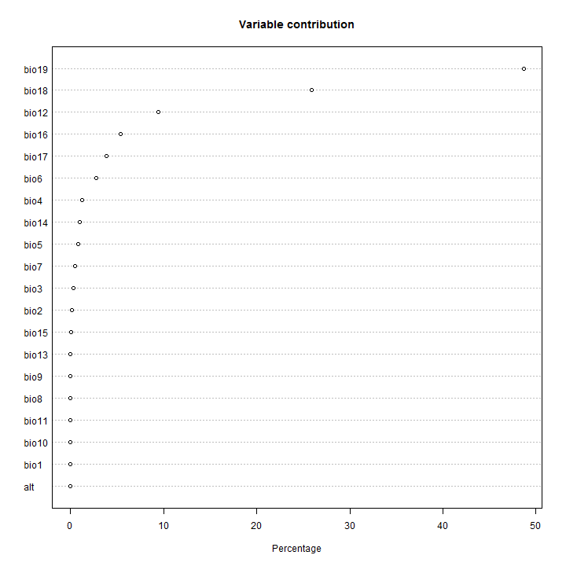

Regresiones de temperatura vs. elevación por cuadrantes
========================================================


```r
elev_field <- 'MDE_aster';
slope_field <- 'slope';
wind_slope_field <- 'wind_slop';
wind_dist_field <- 'wind_dist';
ocean_slope_field <- 'ocean_slop';
ocean_dist_field <- 'ocean_dist';
wind_speed_field <- 'wind_sp01';

list_prec <- c('prec_1_cli')  # for debugging
#list_prec <- c('prec_1_cli','prec_2_cli','prec_3_cli','prec_4_cli','prec_5_cli','prec_6_cli','prec_7_cli','prec_8_cli','prec_9_cli','prec_10_cl','prec_11_cl','prec_12_cl')
```


```r
# read data
library(foreign)
prec<-read.dbf("prec_100000_sample.dbf")

# add variables to identify 1 degree cuadrants 
prec$Xclass <- as.factor(floor(prec$X))
prec$Yclass <- as.factor(floor(prec$Y))

# make lists of cuadrant indices
prec_X_values <- sort(unique(prec$Xclass, incomparables = FALSE))
prec_Y_values <- sort(unique(prec$Yclass, incomparables = FALSE))

prec_X_values
```

```
##  [1] -107 -106 -105 -104 -103 -102 -101 -100 -99  -98  -97  -96  -95  -94 
## [15] -93  -92  -91  -90  -89  -88  -87  -86  -85  -84  -83  -82  -81  -80 
## [29] -79  -78  -77  -76  -75  -74  -73 
## 35 Levels: -107 -106 -105 -104 -103 -102 -101 -100 -99 -98 -97 -96 ... -73
```

```r
prec_Y_values
```

```
##  [1] 5  6  7  8  9  10 11 12 13 14 15 16 17 18 19 20 21 22 23 24
## Levels: 5 6 7 8 9 10 11 12 13 14 15 16 17 18 19 20 21 22 23 24
```


```r
dim(prec)
```

```
## [1] 100000     23
```

```r
summary(prec)
```

```
##    MDE_aster          slope          wind_slop         wind_dist     
##  Min.   :   0.0   Min.   : 0.000   Min.   : 0.0000   Min.   :0.0000  
##  1st Qu.:  61.0   1st Qu.: 3.769   1st Qu.: 0.8431   1st Qu.:0.3000  
##  Median : 365.0   Median : 7.854   Median : 2.3821   Median :0.7807  
##  Mean   : 763.5   Mean   :11.143   Mean   : 4.0702   Mean   :1.0310  
##  3rd Qu.:1410.0   3rd Qu.:16.051   3rd Qu.: 5.4667   3rd Qu.:1.4795  
##  Max.   :4861.0   Max.   :87.970   Max.   :44.5858   Max.   :5.4989  
##                                                                      
##    ocean_slop        ocean_dist       wind_sp01         prec_1_cli    
##  Min.   : 0.0000   Min.   :0.0000   Min.   : 0.3498   Min.   :  0.00  
##  1st Qu.: 0.9218   1st Qu.:0.3005   1st Qu.: 1.2826   1st Qu.: 16.00  
##  Median : 2.5579   Median :0.7777   Median : 4.1188   Median : 30.00  
##  Mean   : 4.2938   Mean   :1.0018   Mean   : 4.0609   Mean   : 51.05  
##  3rd Qu.: 5.7629   3rd Qu.:1.4535   3rd Qu.: 6.1260   3rd Qu.: 63.00  
##  Max.   :44.7741   Max.   :4.1128   Max.   :10.6780   Max.   :504.00  
##                                                                       
##    prec_10_cl      prec_11_cl      prec_12_cl       prec_2_cli    
##  Min.   : 13.0   Min.   :  2.0   Min.   :  0.00   Min.   :  0.00  
##  1st Qu.: 82.0   1st Qu.: 22.0   1st Qu.: 15.00   1st Qu.:  8.00  
##  Median :166.0   Median : 65.0   Median : 37.00   Median : 24.00  
##  Mean   :192.5   Mean   :109.7   Mean   : 69.02   Mean   : 36.42  
##  3rd Qu.:276.0   3rd Qu.:167.0   3rd Qu.: 98.00   3rd Qu.: 51.00  
##  Max.   :820.0   Max.   :799.0   Max.   :749.00   Max.   :483.00  
##                                                                   
##    prec_3_cli       prec_4_cli       prec_5_cli      prec_6_cli   
##  Min.   :  0.00   Min.   :  0.00   Min.   :  0.0   Min.   : 15.0  
##  1st Qu.:  8.00   1st Qu.: 18.00   1st Qu.: 59.0   1st Qu.:147.0  
##  Median : 24.00   Median : 41.00   Median :111.0   Median :200.0  
##  Mean   : 35.85   Mean   : 64.15   Mean   :136.2   Mean   :219.6  
##  3rd Qu.: 49.00   3rd Qu.: 74.00   3rd Qu.:190.0   3rd Qu.:280.0  
##  Max.   :486.00   Max.   :797.00   Max.   :709.0   Max.   :777.0  
##                                                                   
##    prec_7_cli    prec_8_cli      prec_9_cli          X          
##  Min.   : 16   Min.   : 29.0   Min.   : 31.0   Min.   :-107.00  
##  1st Qu.:139   1st Qu.:148.0   1st Qu.:169.0   1st Qu.: -99.17  
##  Median :192   Median :198.0   Median :225.0   Median : -90.27  
##  Mean   :219   Mean   :220.2   Mean   :243.2   Mean   : -90.48  
##  3rd Qu.:273   3rd Qu.:276.0   3rd Qu.:310.0   3rd Qu.: -83.88  
##  Max.   :942   Max.   :803.0   Max.   :807.0   Max.   : -72.98  
##                                                                 
##        Y              Xclass          Yclass     
##  Min.   : 5.992   -90    : 4832   20     : 9342  
##  1st Qu.:13.813   -99    : 4770   18     : 9301  
##  Median :17.730   -100   : 4714   17     : 8460  
##  Mean   :16.719   -89    : 4608   21     : 7729  
##  3rd Qu.:20.598   -101   : 4396   19     : 7637  
##  Max.   :24.016   -102   : 4142   22     : 7545  
##                   (Other):72538   (Other):49986
```


PREC regressions in cuadrants


```r
for (k in 1:length(list_prec)) {
  
  print(paste('Variable ',list_prec[k],sep=""))
  
  # create empty table for variable of month k
  my_table_prec <- data.frame(t(rep(NA,18)))
  columns <- c("X_center", "Y_center", 
             paste('pr_',k,'_I',sep=""),
             paste('pr_',k,'_el2',sep=""),
             paste('pr_',k,'_el1',sep=""),
             paste('pr_',k,'_sl2',sep=""),
             paste('pr_',k,'_sl1',sep=""),
             paste('pr_',k,'_ws2',sep=""),
             paste('pr_',k,'_ws1',sep=""),
             paste('pr_',k,'_os2',sep=""),
             paste('pr_',k,'_os1',sep=""),
             paste('pr_',k,'_elsl',sep=""),
             paste('pr_',k,'_elws',sep=""),
             paste('pr_',k,'_elos',sep=""),
             paste('pr_',k,'_slws',sep=""),
             paste('pr_',k,'_wlos',sep=""),
             paste('pr_',k,'_wsos',sep=""),
             paste('pr_',k,'_R2',sep=""))
  names(my_table_prec) <- columns
  
    # create empty table for variable of month k
  my_table_prec2 <- data.frame(t(rep(NA,9)))
  columns <- c("X_center", "Y_center", 
             paste('pr_',k,'_I',sep=""),
             paste('pr_',k,'_el2',sep=""),
             paste('pr_',k,'_el1',sep=""),
             paste('pr_',k,'_sl2',sep=""),
             paste('pr_',k,'_sl1',sep=""),
             paste('pr_',k,'_elsl',sep=""),
             paste('pr_',k,'_R2',sep=""))
  names(my_table_prec2) <- columns
  
for (i in 1:length(prec_X_values) ) {
#  for (i in 1:2) {
    prec_i <- prec[prec$Xclass == prec_X_values[i],]
    for (j in 1:length(prec_Y_values) ) {
      prec_ij <- prec_i[prec_i$Yclass == prec_Y_values[j],]
      prec_ij <- prec_ij[complete.cases(prec_ij),]        # take only cases with data
      prec_ij <- prec_ij[prec_ij[[elev_field]] > 0,]      # take only data with positive elevation
      if (nrow(prec_ij) > 0) {
        #print(dim(prec_ij))
      
        # data suitable for regression analysis should fit following criteria:
        # 1) have enough samples (n > 20)
        # 2) values should be normally distributed ?
        # 3) variability in elevation should be at least 1000 m
        if ((nrow(prec_ij) > 20) && 
              ( max(prec_ij[[elev_field]]) - min(prec_ij[[elev_field]]) >= 1000 )) {
              # data could be considered suitable for analysis

          y <- prec_ij[[list_prec[k]]]  
          el <- prec_ij[[elev_field]]
          sl <- prec_ij[[slope_field]]
          ws <- prec_ij[[wind_slope_field]]
          wd <- prec_ij[[wind_dist_field]]
          os <- prec_ij[[ocean_slope_field]]
          od <- prec_ij[[ocean_dist_field]]
          sp <- prec_ij[[wind_speed_field]]

            print('Correlations')
            print(paste('el vs. sl',cor(el,sl)))
            print(paste('el vs. ws',cor(el,ws)))
            print(paste('el vs. os',cor(el,os)))
            print(paste('el vs. wd',cor(el,wd)))
            print(paste('el vs. od',cor(el,od)))
            print(paste('el vs. sp',cor(el,sp)))
            print(paste('sl vs. ws',cor(sl,ws)))
            print(paste('sl vs. os',cor(sl,os)))
            print(paste('sl vs. wd',cor(sl,wd)))
            print(paste('sl vs. od',cor(sl,od)))
            print(paste('sl vs. sp',cor(sl,sp)))
            print(paste('ws vs. os',cor(ws,os)))
            print(paste('ws vs. wd',cor(ws,wd)))
            print(paste('ws vs. od',cor(ws,od)))
            print(paste('ws vs. sp',cor(ws,sp)))
            print(paste('os vs. wd',cor(os,wd)))
            print(paste('os vs. od',cor(os,od)))
            print(paste('os vs. sp',cor(os,sp)))
            print(paste('wd vs. wd',cor(wd,od)))
            print(paste('wd vs. sp',cor(wd,sp)))
            print(paste('el vs. sp',cor(od,sp)))

            par(mfcol = c(1,4))
          
            # elevation
            my_fit <- lm(y ~ el)
            plot(y ~ el, 
                 main=paste('Cuadrant ',prec_X_values[i],'° ',prec_Y_values[j],'°, month ',k,sep=""), 
                 xlab=paste('elevation, R²=',round(summary(my_fit)$r.squared,digits=2),sep=''), 
                 ylab='P',col='darkgray')
            abline(my_fit, col='red', lwd=2)
            
            # slope
            my_fit2 <- lm(y ~ sl)
            plot(y ~ sl, 
                main=paste('Cuadrant ',prec_X_values[i],'° ',prec_Y_values[j],'°, month ',k,sep=""), 
                xlab=paste('slope, R²=',round(summary(my_fit2)$r.squared,digits=2),sep=''), 
                ylab='P',col='darkgray')
            abline(my_fit2, col='red', lwd=2)            

            # wind slope
            my_fit3 <- lm(y ~ ws)
            plot(y ~ ws, 
                 main=paste('Cuadrant ',prec_X_values[i],'° ',prec_Y_values[j],'°, month ',k,sep=""), 
                 xlab=paste('wind slope, R²=',round(summary(my_fit3)$r.squared,digits=2),sep=''), 
                 ylab='P',col='darkgray')
            abline(my_fit3, col='red', lwd=2)
            
            # wind ocean distance
            my_fit4 <- lm(y ~ wd)
            plot(y ~ wd, 
                main=paste('Cuadrant ',prec_X_values[i],'° ',prec_Y_values[j],'°, month ',k,sep=""), 
                xlab=paste('wind distance, R²=',round(summary(my_fit4)$r.squared,digits=2),sep=''), 
                ylab='P',col='darkgray')
            abline(my_fit4, col='red', lwd=2)                  
            
            # wind speed
            my_fit5 <- lm(y ~ sp)
            plot(y ~ sp, 
                 main=paste('Cuadrant ',prec_X_values[i],'° ',prec_Y_values[j],'°, month ',k,sep=""), 
                 xlab=paste('wind speed, R²=',round(summary(my_fit5)$r.squared,digits=2),sep=''), 
                 ylab='P',col='darkgray')
            abline(my_fit5, col='red', lwd=2)
            
            # ocean slope
            my_fit6 <- lm(y ~ os)
            plot(y ~ os, 
                main=paste('Cuadrant ',prec_X_values[i],'° ',prec_Y_values[j],'°, month ',k,sep=""), 
                xlab=paste('ocean slope, R²=',round(summary(my_fit6)$r.squared,digits=2),sep=''), 
                ylab='P',col='darkgray')
            abline(my_fit6, col='red', lwd=2)            

            # ocean distance
            my_fit7 <- lm(y ~ od)
            plot(y ~ od, 
                 main=paste('Cuadrant ',prec_X_values[i],'° ',prec_Y_values[j],'°, month ',k,sep=""), 
                 xlab=paste('ocean distance, R²=',round(summary(my_fit7)$r.squared,digits=2),sep=''), 
                 ylab='P',col='darkgray')
            abline(my_fit7, col='red', lwd=2)
            
            # elevation + slope
            my_fit8 <- lm(y ~ el + sl)
            plot(y ~ el, 
                main=paste('Cuadrant ',prec_X_values[i],'° ',prec_Y_values[j],'°, month ',k,sep=""), 
                xlab=paste('elevation, el + sl, R²=',round(summary(my_fit8)$r.squared,digits=2),sep=''), 
                ylab='P',col='darkgray')
            abline(my_fit8, col='red', lwd=2)
            plot(y ~ sl, 
                main=paste('Cuadrant ',prec_X_values[i],'° ',prec_Y_values[j],'°, month ',k,sep=""), 
                xlab=paste('slope, el + sl, R²=',round(summary(my_fit8)$r.squared,digits=2),sep=''), 
                ylab='P',col='darkgray')
            abline(my_fit8, col='red', lwd=2)
          
            # elevation + slope second order
            #my_fit15 <- lm(y ~ polym(el,sl,degree=2,raw=TRUE))  # the same as following line, but ugly summary output
            my_fit15 <- lm(y ~ el + sl + I(el^2) + I(sl^2) + el*sl)
            plot(y ~ el, 
                main=paste('Cuadrant ',prec_X_values[i],'° ',prec_Y_values[j],'°, month ',k,sep=""), 
                xlab=paste('elevation, el + sl 2-nd order, R²=',round(summary(my_fit15)$r.squared,digits=2),sep=''), 
                ylab='P',col='darkgray')
            #abline(my_fit15, col='red', lwd=2)
            pol15 <- function(el) my_fit15$coefficient[4]*el^2 + my_fit15$coefficient[2]*el + my_fit15$coefficient[1]
            curve(pol15, col="blue", lwd=2, xname="el", add = TRUE)
            plot(y ~ sl, 
                main=paste('Cuadrant ',prec_X_values[i],'° ',prec_Y_values[j],'°, month ',k,sep=""), 
                xlab=paste('slope, el + sl 2-nd order, R²=',round(summary(my_fit15)$r.squared,digits=2),sep=''), 
                ylab='P',col='darkgray')
            #abline(my_fit15, col='red', lwd=2)
            pol15a <- function(sl) my_fit15$coefficient[5]*sl^2 + my_fit15$coefficient[3]*sl + my_fit15$coefficient[1]
            curve(pol15a, col="blue", lwd=2, xname="sl", add = TRUE)

            # elevation + slope + wind slope + ocean slope
#            my_fit13 <- lm(y ~ el + sl + ws + os)
#            plot(y ~ el, 
#                main=paste('Cuadrant ',prec_X_values[i],'° ',prec_Y_values[j],'°, month ',k,sep=""), 
#                xlab=paste('elevation, local effect vars., R²=',round(summary(my_fit13)$r.squared,digits=2),sep=''), 
#                ylab='P',col='darkgray')
#            abline(my_fit13, col='red', lwd=2)  
#            plot(y ~ sl, 
#                main=paste('Cuadrant ',prec_X_values[i],'° ',prec_Y_values[j],'°, month ',k,sep=""), 
#                xlab=paste('slope, local effect vars., R²=',round(summary(my_fit13)$r.squared,digits=2),sep=''), 
#                ylab='P',col='darkgray')
#            abline(my_fit13, col='red', lwd=2)
#            plot(y ~ ws, 
#                main=paste('Cuadrant ',prec_X_values[i],'° ',prec_Y_values[j],'°, month ',k,sep=""), 
#                xlab=paste('ws, local effect vars., R²=',round(summary(my_fit13)$r.squared,digits=2),sep=''), 
#                ylab='P',col='darkgray')
#            abline(my_fit13, col='red', lwd=2)
#              plot(y ~ os, 
#                main=paste('Cuadrant ',prec_X_values[i],'° ',prec_Y_values[j],'°, month ',k,sep=""), 
#                xlab=paste('os, local effect vars., R²=',round(summary(my_fit13)$r.squared,digits=2),sep=''), 
#                ylab='P',col='darkgray')
#            abline(my_fit13, col='red', lwd=2) 
            
            # elevation + slope + wind slope + ocean slope second order
            my_fit14 <- lm(y ~ el + sl + ws + os
                          + I(el^2) + I(sl^2) + I(ws^2) + I(os^2) 
                          + el*sl + el*ws + el*os + sl*ws + sl*os + ws*os)
            plot(y ~ el, 
                main=paste('Cuadrant ',prec_X_values[i],'° ',prec_Y_values[j],'°, month ',k,sep=""), 
                xlab=paste('elevation, local effect vars. 2-nd order, R²=',round(summary(my_fit14)$r.squared,digits=2),sep=''), 
                ylab='P',col='darkgray')
            #abline(my_fit14, col='red', lwd=2)  
            pol14 <- function(el) my_fit14$coefficient[6]*el^2 + my_fit14$coefficient[2]*el + my_fit14$coefficient[1]
            curve(pol14, col="blue", lwd=2, xname="el", add = TRUE)
            plot(y ~ sl, 
                main=paste('Cuadrant ',prec_X_values[i],'° ',prec_Y_values[j],'°, month ',k,sep=""), 
                xlab=paste('slope, local effect vars. 2-nd order, R²=',round(summary(my_fit14)$r.squared,digits=2),sep=''), 
                ylab='P',col='darkgray')
            #abline(my_fit14, col='red', lwd=2)  
            pol14a <- function(sl) my_fit14$coefficient[7]*sl^2 + my_fit14$coefficient[3]*sl + my_fit14$coefficient[1]
            curve(pol14a, col="blue", lwd=2, xname="sl", add = TRUE)
            plot(y ~ ws, 
                main=paste('Cuadrant ',prec_X_values[i],'° ',prec_Y_values[j],'°, month ',k,sep=""), 
                xlab=paste('ws, local effect vars. 2-nd order, R²=',round(summary(my_fit14)$r.squared,digits=2),sep=''), 
                ylab='P',col='darkgray')
            #abline(my_fit14, col='red', lwd=2)  
            pol14b <- function(ws) my_fit14$coefficient[8]*ws^2 + my_fit14$coefficient[4]*ws + my_fit14$coefficient[1]
            curve(pol14b, col="blue", lwd=2, xname="ws", add = TRUE)          
            plot(y ~ os, 
                main=paste('Cuadrant ',prec_X_values[i],'° ',prec_Y_values[j],'°, month ',k,sep=""), 
                xlab=paste('os, local effect vars. 2-nd order, R²=',round(summary(my_fit14)$r.squared,digits=2),sep=''), 
                ylab='P',col='darkgray')
            #abline(my_fit14, col='red', lwd=2)  
            pol14c <- function(os) my_fit14$coefficient[9]*os^2 + my_fit14$coefficient[5]*os + my_fit14$coefficient[1]
            curve(pol14c, col="blue", lwd=2, xname="os", add = TRUE)          
          
            # elevation + slope + wind slope + wind distance + ocean slope + ocean distance
#            my_fit12 <- lm(y ~ el + sl + ws + wd + os + od)
#            plot(y ~ el, 
#                main=paste('Cuadrant ',prec_X_values[i],'° ',prec_Y_values[j],'°, month ',k,sep=""), 
#                xlab=paste('elevation, all vars. (-sp), R²=',round(summary(my_fit12)$r.squared,digits=2),sep=''), 
#                ylab='P',col='darkgray')
#            abline(my_fit12, col='red', lwd=2)
#            plot(y ~ sl, 
#                main=paste('Cuadrant ',prec_X_values[i],'° ',prec_Y_values[j],'°, month ',k,sep=""), 
#                xlab=paste('slope, all vars. (-sp), R²=',round(summary(my_fit12)$r.squared,digits=2),sep=''), 
#                ylab='P',col='darkgray')
#            abline(my_fit12, col='red', lwd=2)  
#              plot(y ~ ws, 
#                main=paste('Cuadrant ',prec_X_values[i],'° ',prec_Y_values[j],'°, month ',k,sep=""), 
#                xlab=paste('ws, all vars. (-sp), R²=',round(summary(my_fit12)$r.squared,digits=2),sep=''), 
#                ylab='P',col='darkgray')
#            abline(my_fit12, col='red', lwd=2)  
#              plot(y ~ wd, 
#                main=paste('Cuadrant ',prec_X_values[i],'° ',prec_Y_values[j],'°, month ',k,sep=""), 
#                xlab=paste('wd, all vars. (-sp), R²=',round(summary(my_fit12)$r.squared,digits=2),sep=''), 
#                ylab='P',col='darkgray')
#            abline(my_fit12, col='red', lwd=2)  
#              plot(y ~ os, 
#                main=paste('Cuadrant ',prec_X_values[i],'° ',prec_Y_values[j],'°, month ',k,sep=""), 
#                xlab=paste('os, all vars. (-sp), R²=',round(summary(my_fit12)$r.squared,digits=2),sep=''), 
#                ylab='P',col='darkgray')
#            abline(my_fit12, col='red', lwd=2)  
#              plot(y ~ od, 
#                main=paste('Cuadrant ',prec_X_values[i],'° ',prec_Y_values[j],'°, month ',k,sep=""), 
#                xlab=paste('od, all vars. (-sp), R²=',round(summary(my_fit12)$r.squared,digits=2),sep=''), 
#                ylab='P',col='darkgray')
#            abline(my_fit12, col='red', lwd=2)  
          
            # elevation + slope + wind slope + wind distance + ocean slope + ocean distance second order
            my_fit9 <- lm(y ~ el + sl + ws + os + wd + od
                          + I(el^2) + I(sl^2) + I(ws^2) + I(os^2) + I(wd^2) + I(od^2)
                          + el*sl + el*ws + el*os + el*wd + el*od + sl*ws + sl*os + sl*wd + sl*od
                          + ws*os + ws*wd + ws*od + os*wd + os*od + wd*od)
            plot(y ~ el, 
                main=paste('Cuadrant ',prec_X_values[i],'° ',prec_Y_values[j],'°, month ',k,sep=""), 
                xlab=paste('elevation, all vars. (-sp), R²=',round(summary(my_fit9)$r.squared,digits=2),sep=''), 
                ylab='P',col='darkgray')
            #abline(my_fit9, col='red', lwd=2)  
            pol9 <- function(el) my_fit9$coefficient[8]*el^2 + my_fit9$coefficient[2]*el + my_fit9$coefficient[1]
            curve(pol9, col="blue", lwd=2, add = TRUE)  
            plot(y ~ sl, 
                main=paste('Cuadrant ',prec_X_values[i],'° ',prec_Y_values[j],'°, month ',k,sep=""), 
                xlab=paste('slope, all vars. (-sp), R²=',round(summary(my_fit9)$r.squared,digits=2),sep=''), 
                ylab='P',col='darkgray')
            #abline(my_fit9, col='red', lwd=2)  
            pol9a <- function(sl) my_fit9$coefficient[9]*sl^2 + my_fit9$coefficient[3]*sl + my_fit9$coefficient[1]
            curve(pol9a, col="blue", lwd=2, add = TRUE)  
            plot(y ~ ws, 
                main=paste('Cuadrant ',prec_X_values[i],'° ',prec_Y_values[j],'°, month ',k,sep=""), 
                xlab=paste('ws, all vars. (-sp), R²=',round(summary(my_fit9)$r.squared,digits=2),sep=''), 
                ylab='P',col='darkgray')
            #abline(my_fit9, col='red', lwd=2)  
            pol9b <- function(ws) my_fit9$coefficient[10]*ws^2 + my_fit9$coefficient[4]*ws + my_fit9$coefficient[1]
            curve(pol9b, col="blue", lwd=2, add = TRUE) 
            plot(y ~ os, 
                main=paste('Cuadrant ',prec_X_values[i],'° ',prec_Y_values[j],'°, month ',k,sep=""), 
                xlab=paste('os, all vars. (-sp), R²=',round(summary(my_fit9)$r.squared,digits=2),sep=''), 
                ylab='P',col='darkgray')
            #abline(my_fit9, col='red', lwd=2)  
            pol9c <- function(os) my_fit9$coefficient[11]*os^2 + my_fit9$coefficient[5]*os + my_fit9$coefficient[1]
            curve(pol9c, col="blue", lwd=2, add = TRUE)
            plot(y ~ wd, 
                main=paste('Cuadrant ',prec_X_values[i],'° ',prec_Y_values[j],'°, month ',k,sep=""), 
                xlab=paste('wd, all vars. (-sp), R²=',round(summary(my_fit9)$r.squared,digits=2),sep=''), 
                ylab='P',col='darkgray')
            #abline(my_fit9, col='red', lwd=2)  
            pol9d <- function(wd) my_fit9$coefficient[12]*wd^2 + my_fit9$coefficient[6]*wd + my_fit9$coefficient[1]
            curve(pol9d, col="blue", lwd=2, add = TRUE) 
            plot(y ~ od, 
                main=paste('Cuadrant ',prec_X_values[i],'° ',prec_Y_values[j],'°, month ',k,sep=""), 
                xlab=paste('od, all vars. (-sp), R²=',round(summary(my_fit9)$r.squared,digits=2),sep=''), 
                ylab='P',col='darkgray')
            #abline(my_fit9, col='red', lwd=2)  
            pol9e <- function(od) my_fit9$coefficient[13]*od^2 + my_fit9$coefficient[7]*od + my_fit9$coefficient[1]
            curve(pol9e, col="blue", lwd=2, add = TRUE)
            
            print('Elevation + slope 2-nd order')
            print(summary(my_fit15))
            print('Elevation + slope + wind slope + ocean slope 2-nd order')
            print(summary(my_fit14)) 
            print('all vars. (-sp) 2-nd order')
            print(summary(my_fit9)) 
            
            # store the centers of cuadrants, regression coefficients and R2 in table
            # note: the conversion of factor to numeric values require use of levels attribute
            my_table_line <- c(as.numeric(levels(prec_X_values)[prec_X_values[i]])+0.5,
                               as.numeric(levels(prec_Y_values)[prec_Y_values[j]])+0.5,
                               coef(my_fit14)[1],
                               coef(my_fit14)[6],
                               coef(my_fit14)[2],
                               coef(my_fit14)[7],
                               coef(my_fit14)[3],
                               coef(my_fit14)[8],
                               coef(my_fit14)[4],
                               coef(my_fit14)[9],
                               coef(my_fit14)[5],
                               coef(my_fit14)[10],
                               coef(my_fit14)[11],
                               coef(my_fit14)[12],
                               coef(my_fit14)[13],
                               coef(my_fit14)[14],
                               coef(my_fit14)[15],
                               summary(my_fit14)$r.squared)            

            my_table_prec <- rbind(my_table_prec,my_table_line)

            my_table_line2 <- c(as.numeric(levels(prec_X_values)[prec_X_values[i]])+0.5,
                               as.numeric(levels(prec_Y_values)[prec_Y_values[j]])+0.5,
                               coef(my_fit15)[1],                               
                               coef(my_fit15)[4],
                               coef(my_fit15)[2],
                               coef(my_fit15)[5],
                               coef(my_fit15)[3],
                               coef(my_fit15)[6],
                               summary(my_fit15)$r.squared)            

            my_table_prec2 <- rbind(my_table_prec2,my_table_line2)          
          
        }
      }
    }     
  }

  my_table_prec <- my_table_prec[-1,]
  write.table(my_table_prec, file = paste('table_4var_',list_prec[k],'.csv',sep=""), 
              sep = ",", row.names = FALSE)

  my_table_prec2 <- my_table_prec2[-1,]
  write.table(my_table_prec2, file = paste('table_2var_',list_prec[k],'.csv',sep=""), 
              sep = ",", row.names = FALSE)

}
```

```
## [1] "Variable prec_1_cli"
## [1] "Correlations"
## [1] "el vs. sl 0.6379861215322"
## [1] "el vs. ws 0.407313058184196"
## [1] "el vs. os 0.52516717565979"
## [1] "el vs. wd 0.784692471624785"
## [1] "el vs. od 0.778446264525656"
## [1] "el vs. sp 0.368329791531114"
## [1] "sl vs. ws 0.397377377668365"
## [1] "sl vs. os 0.488580940653079"
## [1] "sl vs. wd 0.608971513952789"
## [1] "sl vs. od 0.60788301212147"
## [1] "sl vs. sp 0.273674726401431"
## [1] "ws vs. os 0.492208083192844"
## [1] "ws vs. wd 0.354069216730982"
## [1] "ws vs. od 0.353569319919686"
## [1] "ws vs. sp 0.262386356809894"
## [1] "os vs. wd 0.477408900947407"
## [1] "os vs. od 0.475791988424165"
## [1] "os vs. sp 0.279442348758961"
## [1] "wd vs. wd 0.995334530557141"
## [1] "wd vs. sp 0.411691101502527"
## [1] "el vs. sp 0.428976164731029"
```

      

```
## [1] "Elevation + slope 2-nd order"
## 
## Call:
## lm(formula = y ~ el + sl + I(el^2) + I(sl^2) + el * sl)
## 
## Residuals:
##     Min      1Q  Median      3Q     Max 
## -7.7816 -2.2552 -0.3412  2.7979 11.7632 
## 
## Coefficients:
##               Estimate Std. Error t value Pr(>|t|)    
## (Intercept)  2.260e+01  4.470e-01  50.569  < 2e-16 ***
## el           6.997e-03  1.792e-03   3.905 0.000112 ***
## sl           2.618e-01  7.997e-02   3.274 0.001162 ** 
## I(el^2)      5.016e-06  1.069e-06   4.693 3.79e-06 ***
## I(sl^2)     -3.914e-03  2.978e-03  -1.314 0.189571    
## el:sl       -2.371e-04  9.306e-05  -2.548 0.011236 *  
## ---
## Signif. codes:  0 '***' 0.001 '**' 0.01 '*' 0.05 '.' 0.1 ' ' 1
## 
## Residual standard error: 3.9 on 370 degrees of freedom
## Multiple R-squared:  0.5504,	Adjusted R-squared:  0.5444 
## F-statistic:  90.6 on 5 and 370 DF,  p-value: < 2.2e-16
## 
## [1] "Elevation + slope + wind slope + ocean slope 2-nd order"
## 
## Call:
## lm(formula = y ~ el + sl + ws + os + I(el^2) + I(sl^2) + I(ws^2) + 
##     I(os^2) + el * sl + el * ws + el * os + sl * ws + sl * os + 
##     ws * os)
## 
## Residuals:
##     Min      1Q  Median      3Q     Max 
## -7.9866 -2.1875 -0.1542  2.6256 12.4628 
## 
## Coefficients:
##               Estimate Std. Error t value Pr(>|t|)    
## (Intercept)  2.220e+01  4.884e-01  45.466  < 2e-16 ***
## el           6.221e-03  2.250e-03   2.765  0.00599 ** 
## sl           1.493e-01  8.799e-02   1.697  0.09049 .  
## ws           2.030e-01  1.453e-01   1.396  0.16344    
## os           2.346e-01  1.365e-01   1.719  0.08654 .  
## I(el^2)      5.724e-06  1.118e-06   5.120 4.99e-07 ***
## I(sl^2)     -3.361e-03  3.238e-03  -1.038  0.29997    
## I(ws^2)      2.838e-03  1.020e-02   0.278  0.78106    
## I(os^2)      1.028e-03  8.869e-03   0.116  0.90782    
## el:sl       -1.554e-04  1.048e-04  -1.483  0.13887    
## el:ws       -2.376e-04  1.820e-04  -1.305  0.19265    
## el:os       -1.040e-04  1.316e-04  -0.791  0.42960    
## sl:ws        5.755e-03  7.356e-03   0.782  0.43451    
## sl:os       -2.172e-03  5.896e-03  -0.368  0.71278    
## ws:os       -1.441e-02  1.699e-02  -0.848  0.39695    
## ---
## Signif. codes:  0 '***' 0.001 '**' 0.01 '*' 0.05 '.' 0.1 ' ' 1
## 
## Residual standard error: 3.849 on 361 degrees of freedom
## Multiple R-squared:  0.5727,	Adjusted R-squared:  0.5561 
## F-statistic: 34.55 on 14 and 361 DF,  p-value: < 2.2e-16
## 
## [1] "all vars. (-sp) 2-nd order"
## 
## Call:
## lm(formula = y ~ el + sl + ws + os + wd + od + I(el^2) + I(sl^2) + 
##     I(ws^2) + I(os^2) + I(wd^2) + I(od^2) + el * sl + el * ws + 
##     el * os + el * wd + el * od + sl * ws + sl * os + sl * wd + 
##     sl * od + ws * os + ws * wd + ws * od + os * wd + os * od + 
##     wd * od)
## 
## Residuals:
##     Min      1Q  Median      3Q     Max 
## -7.8423 -1.9639  0.0669  1.8157 11.8531 
## 
## Coefficients:
##               Estimate Std. Error t value Pr(>|t|)    
## (Intercept)  2.102e+01  6.186e-01  33.982  < 2e-16 ***
## el           1.229e-02  4.091e-03   3.004  0.00286 ** 
## sl           5.571e-02  9.499e-02   0.586  0.55793    
## ws           3.416e-01  1.829e-01   1.867  0.06267 .  
## os           9.166e-02  1.507e-01   0.608  0.54340    
## wd           7.458e+01  4.161e+01   1.792  0.07394 .  
## od          -4.276e+01  3.154e+01  -1.356  0.17610    
## I(el^2)      1.380e-05  2.109e-06   6.543 2.16e-10 ***
## I(sl^2)     -1.302e-03  3.219e-03  -0.404  0.68613    
## I(ws^2)      2.707e-03  9.597e-03   0.282  0.77805    
## I(os^2)      8.301e-03  8.765e-03   0.947  0.34426    
## I(wd^2)     -2.029e+03  8.481e+02  -2.392  0.01728 *  
## I(od^2)     -1.196e+03  4.527e+02  -2.641  0.00863 ** 
## el:sl        1.001e-06  1.275e-04   0.008  0.99374    
## el:ws        1.258e-04  2.410e-04   0.522  0.60199    
## el:os       -8.679e-05  1.587e-04  -0.547  0.58478    
## el:wd       -1.593e-01  1.306e-01  -1.220  0.22328    
## el:od        7.381e-02  9.786e-02   0.754  0.45119    
## sl:ws        4.792e-04  7.045e-03   0.068  0.94581    
## sl:os        1.163e-03  5.776e-03   0.201  0.84059    
## sl:wd       -1.033e+00  2.519e+00  -0.410  0.68193    
## sl:od        7.088e-01  1.897e+00   0.374  0.70897    
## ws:os       -1.272e-02  1.669e-02  -0.762  0.44659    
## ws:wd        2.785e+00  4.758e+00   0.585  0.55870    
## ws:od       -2.771e+00  3.585e+00  -0.773  0.44002    
## os:wd        1.980e-01  3.953e+00   0.050  0.96009    
## os:od       -3.464e-01  2.940e+00  -0.118  0.90628    
## wd:od        3.128e+03  1.223e+03   2.559  0.01092 *  
## ---
## Signif. codes:  0 '***' 0.001 '**' 0.01 '*' 0.05 '.' 0.1 ' ' 1
## 
## Residual standard error: 3.565 on 348 degrees of freedom
## Multiple R-squared:  0.6467,	Adjusted R-squared:  0.6193 
## F-statistic: 23.59 on 27 and 348 DF,  p-value: < 2.2e-16
## 
## [1] "Correlations"
## [1] "el vs. sl 0.549338652716049"
## [1] "el vs. ws 0.43509895904063"
## [1] "el vs. os 0.263026882836688"
## [1] "el vs. wd 0.599288690717317"
## [1] "el vs. od 0.330644083783892"
## [1] "el vs. sp -0.395593646025065"
## [1] "sl vs. ws 0.448514456748149"
## [1] "sl vs. os 0.334557323794117"
## [1] "sl vs. wd 0.404836642772763"
## [1] "sl vs. od 0.116713511546887"
## [1] "sl vs. sp -0.135471003453302"
## [1] "ws vs. os -0.252640475001792"
## [1] "ws vs. wd 0.327657412583015"
## [1] "ws vs. od 0.282004143971832"
## [1] "ws vs. sp -0.235919395615805"
## [1] "os vs. wd 0.171721405266223"
## [1] "os vs. od -0.0561268560210879"
## [1] "os vs. sp 0.0372866651008668"
## [1] "wd vs. wd 0.727916515530876"
## [1] "wd vs. sp -0.764795011550453"
## [1] "el vs. sp -0.820136147051134"
```

      

```
## [1] "Elevation + slope 2-nd order"
## 
## Call:
## lm(formula = y ~ el + sl + I(el^2) + I(sl^2) + el * sl)
## 
## Residuals:
##     Min      1Q  Median      3Q     Max 
## -4.1216 -1.0460  0.0392  0.9691  4.3256 
## 
## Coefficients:
##               Estimate Std. Error t value Pr(>|t|)    
## (Intercept)  2.358e+01  2.099e-01 112.362  < 2e-16 ***
## el           1.528e-03  5.287e-04   2.889  0.00413 ** 
## sl           9.522e-03  2.559e-02   0.372  0.71003    
## I(el^2)      1.883e-06  3.371e-07   5.587 4.98e-08 ***
## I(sl^2)      4.165e-05  7.285e-04   0.057  0.95445    
## el:sl       -2.485e-05  2.017e-05  -1.232  0.21885    
## ---
## Signif. codes:  0 '***' 0.001 '**' 0.01 '*' 0.05 '.' 0.1 ' ' 1
## 
## Residual standard error: 1.406 on 318 degrees of freedom
## Multiple R-squared:  0.7166,	Adjusted R-squared:  0.7122 
## F-statistic: 160.8 on 5 and 318 DF,  p-value: < 2.2e-16
## 
## [1] "Elevation + slope + wind slope + ocean slope 2-nd order"
## 
## Call:
## lm(formula = y ~ el + sl + ws + os + I(el^2) + I(sl^2) + I(ws^2) + 
##     I(os^2) + el * sl + el * ws + el * os + sl * ws + sl * os + 
##     ws * os)
## 
## Residuals:
##     Min      1Q  Median      3Q     Max 
## -4.2405 -1.1611  0.0595  1.0149  4.0519 
## 
## Coefficients:
##               Estimate Std. Error t value Pr(>|t|)    
## (Intercept)  2.343e+01  2.486e-01  94.263  < 2e-16 ***
## el           1.022e-03  6.222e-04   1.643   0.1014    
## sl          -4.580e-03  3.100e-02  -0.148   0.8827    
## ws           1.373e-01  5.549e-02   2.474   0.0139 *  
## os          -1.755e-02  5.071e-02  -0.346   0.7295    
## I(el^2)      1.850e-06  3.970e-07   4.661 4.69e-06 ***
## I(sl^2)      6.655e-04  8.667e-04   0.768   0.4432    
## I(ws^2)     -3.071e-03  2.869e-03  -1.070   0.2852    
## I(os^2)      9.086e-04  2.613e-03   0.348   0.7283    
## el:sl       -1.639e-05  2.348e-05  -0.698   0.4857    
## el:ws        3.000e-06  4.993e-05   0.060   0.9521    
## el:os        2.873e-05  4.108e-05   0.699   0.4849    
## sl:ws       -1.959e-03  2.068e-03  -0.948   0.3441    
## sl:os       -7.094e-04  2.105e-03  -0.337   0.7363    
## ws:os       -6.354e-05  4.531e-03  -0.014   0.9888    
## ---
## Signif. codes:  0 '***' 0.001 '**' 0.01 '*' 0.05 '.' 0.1 ' ' 1
## 
## Residual standard error: 1.396 on 309 degrees of freedom
## Multiple R-squared:  0.7287,	Adjusted R-squared:  0.7164 
## F-statistic: 59.27 on 14 and 309 DF,  p-value: < 2.2e-16
## 
## [1] "all vars. (-sp) 2-nd order"
## 
## Call:
## lm(formula = y ~ el + sl + ws + os + wd + od + I(el^2) + I(sl^2) + 
##     I(ws^2) + I(os^2) + I(wd^2) + I(od^2) + el * sl + el * ws + 
##     el * os + el * wd + el * od + sl * ws + sl * os + sl * wd + 
##     sl * od + ws * os + ws * wd + ws * od + os * wd + os * od + 
##     wd * od)
## 
## Residuals:
##     Min      1Q  Median      3Q     Max 
## -3.2499 -0.8969 -0.0991  0.7960  3.1220 
## 
## Coefficients:
##               Estimate Std. Error t value Pr(>|t|)    
## (Intercept)  2.391e+01  3.121e-01  76.624  < 2e-16 ***
## el           9.744e-04  8.004e-04   1.217 0.224396    
## sl          -2.511e-02  3.167e-02  -0.793 0.428443    
## ws           1.246e-01  5.664e-02   2.199 0.028642 *  
## os          -2.881e-02  5.070e-02  -0.568 0.570330    
## wd           1.217e+01  2.306e+00   5.277 2.54e-07 ***
## od          -2.019e+01  3.640e+00  -5.546 6.48e-08 ***
## I(el^2)      2.498e-06  4.405e-07   5.672 3.36e-08 ***
## I(sl^2)      6.700e-04  8.533e-04   0.785 0.432980    
## I(ws^2)     -4.016e-03  2.686e-03  -1.495 0.135990    
## I(os^2)     -2.844e-03  2.390e-03  -1.190 0.235007    
## I(wd^2)     -1.568e+01  4.082e+00  -3.842 0.000149 ***
## I(od^2)     -1.950e+01  1.508e+01  -1.293 0.196942    
## el:sl       -2.004e-05  2.283e-05  -0.878 0.380773    
## el:ws        8.300e-05  4.909e-05   1.691 0.091948 .  
## el:os        1.102e-04  4.557e-05   2.418 0.016200 *  
## el:wd       -1.053e-02  1.792e-03  -5.876 1.13e-08 ***
## el:od        1.298e-02  3.341e-03   3.885 0.000126 ***
## sl:ws       -1.914e-03  2.007e-03  -0.954 0.340977    
## sl:os       -6.743e-04  1.878e-03  -0.359 0.719849    
## sl:wd       -3.190e-02  6.142e-02  -0.519 0.603894    
## sl:od        1.855e-01  1.243e-01   1.492 0.136697    
## ws:os       -5.610e-04  4.160e-03  -0.135 0.892828    
## ws:wd       -1.229e-01  1.161e-01  -1.059 0.290668    
## ws:od        2.327e-01  2.443e-01   0.952 0.341716    
## os:wd        1.296e-01  9.995e-02   1.297 0.195670    
## os:od       -7.531e-02  2.048e-01  -0.368 0.713382    
## wd:od        3.758e+01  1.255e+01   2.994 0.002990 ** 
## ---
## Signif. codes:  0 '***' 0.001 '**' 0.01 '*' 0.05 '.' 0.1 ' ' 1
## 
## Residual standard error: 1.224 on 296 degrees of freedom
## Multiple R-squared:  0.8002,	Adjusted R-squared:  0.7819 
## F-statistic: 43.89 on 27 and 296 DF,  p-value: < 2.2e-16
## 
## [1] "Correlations"
## [1] "el vs. sl 0.510728401976386"
## [1] "el vs. ws 0.519219856876648"
## [1] "el vs. os 0.524247096575577"
## [1] "el vs. wd 0.398170899700811"
## [1] "el vs. od -0.0387489947958006"
## [1] "el vs. sp -0.491375074461619"
## [1] "sl vs. ws 0.445243202356478"
## [1] "sl vs. os 0.60263834818853"
## [1] "sl vs. wd 0.245879754058158"
## [1] "sl vs. od -0.161850030141804"
## [1] "sl vs. sp -0.508621335892881"
## [1] "ws vs. os 0.238978287946487"
## [1] "ws vs. wd 0.382278666974087"
## [1] "ws vs. od -0.0142815881571145"
## [1] "ws vs. sp -0.43766664290318"
## [1] "os vs. wd 0.257318281361838"
## [1] "os vs. od -0.0915963770867773"
## [1] "os vs. sp -0.406760154382301"
## [1] "wd vs. wd 0.592519679857928"
## [1] "wd vs. sp -0.336152343232878"
## [1] "el vs. sp 0.452024713007582"
```

      

```
## [1] "Elevation + slope 2-nd order"
## 
## Call:
## lm(formula = y ~ el + sl + I(el^2) + I(sl^2) + el * sl)
## 
## Residuals:
##     Min      1Q  Median      3Q     Max 
## -7.2726 -1.4234  0.2966  1.3862  5.3967 
## 
## Coefficients:
##               Estimate Std. Error t value Pr(>|t|)    
## (Intercept)  2.044e+01  2.844e-01  71.863   <2e-16 ***
## el           5.729e-03  2.548e-03   2.248   0.0256 *  
## sl           4.436e-02  5.647e-02   0.785   0.4330    
## I(el^2)      6.732e-06  2.813e-06   2.393   0.0176 *  
## I(sl^2)      1.255e-03  1.652e-03   0.759   0.4484    
## el:sl       -1.410e-04  1.052e-04  -1.341   0.1814    
## ---
## Signif. codes:  0 '***' 0.001 '**' 0.01 '*' 0.05 '.' 0.1 ' ' 1
## 
## Residual standard error: 2.281 on 212 degrees of freedom
## Multiple R-squared:  0.5204,	Adjusted R-squared:  0.5091 
## F-statistic: 46.01 on 5 and 212 DF,  p-value: < 2.2e-16
## 
## [1] "Elevation + slope + wind slope + ocean slope 2-nd order"
## 
## Call:
## lm(formula = y ~ el + sl + ws + os + I(el^2) + I(sl^2) + I(ws^2) + 
##     I(os^2) + el * sl + el * ws + el * os + sl * ws + sl * os + 
##     ws * os)
## 
## Residuals:
##     Min      1Q  Median      3Q     Max 
## -7.3611 -1.1330  0.2757  1.3371  5.3090 
## 
## Coefficients:
##               Estimate Std. Error t value Pr(>|t|)    
## (Intercept)  2.052e+01  3.134e-01  65.473   <2e-16 ***
## el           9.206e-03  3.031e-03   3.037   0.0027 ** 
## sl           4.827e-02  6.131e-02   0.787   0.4320    
## ws          -1.655e-01  1.556e-01  -1.064   0.2888    
## os          -2.024e-02  1.092e-01  -0.185   0.8531    
## I(el^2)      7.205e-06  3.334e-06   2.161   0.0319 *  
## I(sl^2)      1.693e-04  2.069e-03   0.082   0.9349    
## I(ws^2)      3.729e-03  8.687e-03   0.429   0.6682    
## I(os^2)     -4.489e-03  7.853e-03  -0.572   0.5683    
## el:sl       -1.295e-04  1.549e-04  -0.836   0.4039    
## el:ws       -4.446e-04  3.130e-04  -1.420   0.1571    
## el:os       -1.292e-04  1.845e-04  -0.700   0.4845    
## sl:ws        3.767e-03  5.878e-03   0.641   0.5223    
## sl:os        2.802e-03  7.390e-03   0.379   0.7049    
## ws:os        2.193e-02  1.260e-02   1.741   0.0833 .  
## ---
## Signif. codes:  0 '***' 0.001 '**' 0.01 '*' 0.05 '.' 0.1 ' ' 1
## 
## Residual standard error: 2.269 on 203 degrees of freedom
## Multiple R-squared:  0.5459,	Adjusted R-squared:  0.5146 
## F-statistic: 17.43 on 14 and 203 DF,  p-value: < 2.2e-16
## 
## [1] "all vars. (-sp) 2-nd order"
## 
## Call:
## lm(formula = y ~ el + sl + ws + os + wd + od + I(el^2) + I(sl^2) + 
##     I(ws^2) + I(os^2) + I(wd^2) + I(od^2) + el * sl + el * ws + 
##     el * os + el * wd + el * od + sl * ws + sl * os + sl * wd + 
##     sl * od + ws * os + ws * wd + ws * od + os * wd + os * od + 
##     wd * od)
## 
## Residuals:
##      Min       1Q   Median       3Q      Max 
## -3.14371 -0.75145 -0.00993  0.61157  3.09181 
## 
## Coefficients:
##               Estimate Std. Error t value Pr(>|t|)    
## (Intercept)  2.343e+01  3.449e-01  67.930  < 2e-16 ***
## el           7.959e-03  2.402e-03   3.314 0.001102 ** 
## sl           6.961e-03  4.538e-02   0.153 0.878250    
## ws          -9.348e-02  1.037e-01  -0.901 0.368709    
## os          -7.757e-02  9.187e-02  -0.844 0.399581    
## wd           9.969e+00  4.031e+00   2.473 0.014289 *  
## od          -2.768e+01  3.832e+00  -7.223 1.20e-11 ***
## I(el^2)      8.759e-06  1.966e-06   4.455 1.43e-05 ***
## I(sl^2)     -2.730e-04  1.240e-03  -0.220 0.825940    
## I(ws^2)      1.212e-03  5.529e-03   0.219 0.826727    
## I(os^2)     -5.598e-03  4.491e-03  -1.247 0.214100    
## I(wd^2)      1.882e+01  1.295e+01   1.453 0.147944    
## I(od^2)      5.332e+01  1.554e+01   3.432 0.000736 ***
## el:sl       -2.763e-05  8.529e-05  -0.324 0.746353    
## el:ws       -4.152e-04  1.813e-04  -2.291 0.023083 *  
## el:os        3.771e-06  1.105e-04   0.034 0.972803    
## el:wd       -6.303e-02  1.009e-02  -6.245 2.71e-09 ***
## el:od        8.856e-02  1.589e-02   5.572 8.51e-08 ***
## sl:ws        2.934e-03  3.694e-03   0.794 0.428022    
## sl:os        2.495e-03  4.235e-03   0.589 0.556442    
## sl:wd        1.202e-01  1.587e-01   0.757 0.449789    
## sl:od       -3.431e-01  1.907e-01  -1.799 0.073612 .  
## ws:os        1.747e-02  7.918e-03   2.207 0.028529 *  
## ws:wd        1.791e-01  3.425e-01   0.523 0.601565    
## ws:od        1.997e-01  6.234e-01   0.320 0.749011    
## os:wd        2.654e-01  3.351e-01   0.792 0.429257    
## os:od       -1.707e-01  4.139e-01  -0.413 0.680427    
## wd:od       -6.840e+01  2.411e+01  -2.837 0.005050 ** 
## ---
## Signif. codes:  0 '***' 0.001 '**' 0.01 '*' 0.05 '.' 0.1 ' ' 1
## 
## Residual standard error: 1.201 on 190 degrees of freedom
## Multiple R-squared:  0.881,	Adjusted R-squared:  0.8641 
## F-statistic: 52.08 on 27 and 190 DF,  p-value: < 2.2e-16
## 
## [1] "Correlations"
## [1] "el vs. sl 0.546885312260963"
## [1] "el vs. ws 0.3301565818601"
## [1] "el vs. os 0.397465578554164"
## [1] "el vs. wd 0.799593720554003"
## [1] "el vs. od 0.775323447496426"
## [1] "el vs. sp 0.807343824932906"
## [1] "sl vs. ws 0.576749947048019"
## [1] "sl vs. os 0.51721269613284"
## [1] "sl vs. wd 0.628549416403844"
## [1] "sl vs. od 0.644283069795701"
## [1] "sl vs. sp 0.62013521643577"
## [1] "ws vs. os 0.516764718227981"
## [1] "ws vs. wd 0.407815353365108"
## [1] "ws vs. od 0.435867369404677"
## [1] "ws vs. sp 0.400343187216084"
## [1] "os vs. wd 0.42375103727146"
## [1] "os vs. od 0.436069063930556"
## [1] "os vs. sp 0.42105906862708"
## [1] "wd vs. wd 0.974343991159026"
## [1] "wd vs. sp 0.910975750576842"
## [1] "el vs. sp 0.846886061124972"
```

      

```
## [1] "Elevation + slope 2-nd order"
## 
## Call:
## lm(formula = y ~ el + sl + I(el^2) + I(sl^2) + el * sl)
## 
## Residuals:
##      Min       1Q   Median       3Q      Max 
## -24.2560  -2.6429  -0.1824   2.3673  14.1095 
## 
## Coefficients:
##               Estimate Std. Error t value Pr(>|t|)    
## (Intercept)  1.805e+01  4.634e-01  38.948  < 2e-16 ***
## el           3.542e-02  2.170e-03  16.324  < 2e-16 ***
## sl           3.090e-01  8.642e-02   3.575 0.000387 ***
## I(el^2)     -6.302e-06  1.147e-06  -5.493 6.58e-08 ***
## I(sl^2)     -4.773e-03  2.400e-03  -1.989 0.047344 *  
## el:sl       -1.662e-04  6.176e-05  -2.691 0.007385 ** 
## ---
## Signif. codes:  0 '***' 0.001 '**' 0.01 '*' 0.05 '.' 0.1 ' ' 1
## 
## Residual standard error: 5.169 on 456 degrees of freedom
## Multiple R-squared:  0.8758,	Adjusted R-squared:  0.8744 
## F-statistic: 643.1 on 5 and 456 DF,  p-value: < 2.2e-16
## 
## [1] "Elevation + slope + wind slope + ocean slope 2-nd order"
## 
## Call:
## lm(formula = y ~ el + sl + ws + os + I(el^2) + I(sl^2) + I(ws^2) + 
##     I(os^2) + el * sl + el * ws + el * os + sl * ws + sl * os + 
##     ws * os)
## 
## Residuals:
##      Min       1Q   Median       3Q      Max 
## -21.9405  -2.5038  -0.1624   2.3805  14.8510 
## 
## Coefficients:
##               Estimate Std. Error t value Pr(>|t|)    
## (Intercept)  1.769e+01  4.856e-01  36.437  < 2e-16 ***
## el           3.201e-02  2.440e-03  13.117  < 2e-16 ***
## sl           1.810e-01  9.744e-02   1.857 0.063964 .  
## ws           1.939e-01  1.734e-01   1.118 0.264150    
## os           3.648e-01  1.549e-01   2.355 0.018938 *  
## I(el^2)     -4.548e-06  1.268e-06  -3.586 0.000373 ***
## I(sl^2)     -1.706e-04  2.968e-03  -0.057 0.954179    
## I(ws^2)     -7.924e-04  1.051e-02  -0.075 0.939908    
## I(os^2)     -2.220e-02  9.832e-03  -2.258 0.024438 *  
## el:sl       -1.628e-04  6.764e-05  -2.406 0.016531 *  
## el:ws        1.714e-04  1.325e-04   1.293 0.196583    
## el:os       -1.306e-04  1.105e-04  -1.182 0.237636    
## sl:ws       -1.882e-02  7.018e-03  -2.681 0.007604 ** 
## sl:os        1.076e-02  6.864e-03   1.567 0.117731    
## ws:os        1.406e-02  1.306e-02   1.077 0.282171    
## ---
## Signif. codes:  0 '***' 0.001 '**' 0.01 '*' 0.05 '.' 0.1 ' ' 1
## 
## Residual standard error: 5.063 on 447 degrees of freedom
## Multiple R-squared:  0.8832,	Adjusted R-squared:  0.8795 
## F-statistic: 241.4 on 14 and 447 DF,  p-value: < 2.2e-16
## 
## [1] "all vars. (-sp) 2-nd order"
## 
## Call:
## lm(formula = y ~ el + sl + ws + os + wd + od + I(el^2) + I(sl^2) + 
##     I(ws^2) + I(os^2) + I(wd^2) + I(od^2) + el * sl + el * ws + 
##     el * os + el * wd + el * od + sl * ws + sl * os + sl * wd + 
##     sl * od + ws * os + ws * wd + ws * od + os * wd + os * od + 
##     wd * od)
## 
## Residuals:
##      Min       1Q   Median       3Q      Max 
## -17.4942  -2.2034  -0.2606   2.0882  13.0141 
## 
## Coefficients:
##               Estimate Std. Error t value Pr(>|t|)    
## (Intercept)  1.385e+01  7.793e-01  17.769  < 2e-16 ***
## el           3.601e-02  4.708e-03   7.650 1.31e-13 ***
## sl           1.927e-01  1.251e-01   1.541 0.124166    
## ws          -5.217e-01  2.258e-01  -2.311 0.021316 *  
## os           1.296e-01  2.039e-01   0.635 0.525492    
## wd           9.141e+01  1.513e+01   6.042 3.29e-09 ***
## od          -5.922e+01  1.624e+01  -3.647 0.000297 ***
## I(el^2)     -9.457e-07  1.684e-06  -0.562 0.574737    
## I(sl^2)      1.033e-03  2.780e-03   0.371 0.710450    
## I(ws^2)      8.923e-03  9.430e-03   0.946 0.344527    
## I(os^2)     -1.339e-02  8.685e-03  -1.541 0.123935    
## I(wd^2)     -3.051e+02  8.864e+01  -3.442 0.000634 ***
## I(od^2)     -1.224e+02  7.740e+01  -1.581 0.114573    
## el:sl        7.527e-06  8.202e-05   0.092 0.926929    
## el:ws        6.007e-06  1.581e-04   0.038 0.969715    
## el:os       -3.062e-04  1.243e-04  -2.464 0.014124 *  
## el:wd        4.706e-02  2.611e-02   1.802 0.072200 .  
## el:od       -6.572e-02  2.848e-02  -2.308 0.021472 *  
## sl:ws       -1.163e-02  6.466e-03  -1.798 0.072895 .  
## sl:os        6.687e-03  6.311e-03   1.060 0.289939    
## sl:wd       -1.693e+00  6.860e-01  -2.468 0.013983 *  
## sl:od        1.328e+00  7.373e-01   1.801 0.072331 .  
## ws:os        8.822e-03  1.179e-02   0.748 0.454805    
## ws:wd       -2.599e+00  1.332e+00  -1.951 0.051663 .  
## ws:od        3.640e+00  1.411e+00   2.579 0.010245 *  
## os:wd        2.324e+00  1.202e+00   1.933 0.053833 .  
## os:od       -1.851e+00  1.339e+00  -1.382 0.167632    
## wd:od        3.997e+02  1.591e+02   2.512 0.012352 *  
## ---
## Signif. codes:  0 '***' 0.001 '**' 0.01 '*' 0.05 '.' 0.1 ' ' 1
## 
## Residual standard error: 4.253 on 434 degrees of freedom
## Multiple R-squared:   0.92,	Adjusted R-squared:  0.915 
## F-statistic: 184.8 on 27 and 434 DF,  p-value: < 2.2e-16
## 
## [1] "Correlations"
## [1] "el vs. sl -0.0668806209404694"
## [1] "el vs. ws -0.0285895009836415"
## [1] "el vs. os -0.0787380356485436"
## [1] "el vs. wd 0.774045581846131"
## [1] "el vs. od 0.830292696933251"
## [1] "el vs. sp 0.669566102264547"
## [1] "sl vs. ws 0.271792059623718"
## [1] "sl vs. os 0.336725428482989"
## [1] "sl vs. wd -0.0131746493304933"
## [1] "sl vs. od -0.0149888302481366"
## [1] "sl vs. sp -0.0547452019841075"
## [1] "ws vs. os 0.44590184171468"
## [1] "ws vs. wd -0.0118879012614946"
## [1] "ws vs. od -0.019918735092955"
## [1] "ws vs. sp -0.0319967182437863"
## [1] "os vs. wd -0.0561953448008676"
## [1] "os vs. od -0.0524283642037211"
## [1] "os vs. sp -0.0893572236470231"
## [1] "wd vs. wd 0.961055280232827"
## [1] "wd vs. sp 0.946166755758351"
## [1] "el vs. sp 0.845861102469351"
```

      

```
## [1] "Elevation + slope 2-nd order"
## 
## Call:
## lm(formula = y ~ el + sl + I(el^2) + I(sl^2) + el * sl)
## 
## Residuals:
##      Min       1Q   Median       3Q      Max 
## -27.2236  -6.5676  -0.1409   5.7005  22.7281 
## 
## Coefficients:
##               Estimate Std. Error t value Pr(>|t|)    
## (Intercept)  2.409e+01  1.835e+00  13.127  < 2e-16 ***
## el           1.963e-02  2.333e-03   8.416 2.82e-16 ***
## sl          -3.133e-01  1.229e-01  -2.550    0.011 *  
## I(el^2)     -3.668e-06  7.850e-07  -4.673 3.67e-06 ***
## I(sl^2)     -8.881e-04  1.812e-03  -0.490    0.624    
## el:sl        2.395e-04  4.298e-05   5.572 3.80e-08 ***
## ---
## Signif. codes:  0 '***' 0.001 '**' 0.01 '*' 0.05 '.' 0.1 ' ' 1
## 
## Residual standard error: 9.508 on 604 degrees of freedom
## Multiple R-squared:  0.5557,	Adjusted R-squared:  0.552 
## F-statistic: 151.1 on 5 and 604 DF,  p-value: < 2.2e-16
## 
## [1] "Elevation + slope + wind slope + ocean slope 2-nd order"
## 
## Call:
## lm(formula = y ~ el + sl + ws + os + I(el^2) + I(sl^2) + I(ws^2) + 
##     I(os^2) + el * sl + el * ws + el * os + sl * ws + sl * os + 
##     ws * os)
## 
## Residuals:
##     Min      1Q  Median      3Q     Max 
## -30.693  -6.005  -0.184   5.384  24.817 
## 
## Coefficients:
##               Estimate Std. Error t value Pr(>|t|)    
## (Intercept)  2.489e+01  2.041e+00  12.196  < 2e-16 ***
## el           1.827e-02  2.437e-03   7.496 2.39e-13 ***
## sl          -2.281e-01  1.300e-01  -1.754  0.07993 .  
## ws          -3.120e-01  2.216e-01  -1.408  0.15967    
## os           1.191e-01  2.296e-01   0.518  0.60433    
## I(el^2)     -3.768e-06  8.149e-07  -4.625 4.60e-06 ***
## I(sl^2)     -1.461e-03  2.179e-03  -0.670  0.50292    
## I(ws^2)     -8.919e-03  8.104e-03  -1.101  0.27152    
## I(os^2)     -1.476e-02  6.835e-03  -2.159  0.03126 *  
## el:sl        1.807e-04  4.584e-05   3.942 9.03e-05 ***
## el:ws        3.256e-04  9.272e-05   3.511  0.00048 ***
## el:os        6.329e-05  9.672e-05   0.654  0.51312    
## sl:ws        3.105e-03  4.793e-03   0.648  0.51742    
## sl:os        2.035e-03  4.821e-03   0.422  0.67312    
## ws:os        5.633e-03  1.129e-02   0.499  0.61796    
## ---
## Signif. codes:  0 '***' 0.001 '**' 0.01 '*' 0.05 '.' 0.1 ' ' 1
## 
## Residual standard error: 9.342 on 595 degrees of freedom
## Multiple R-squared:  0.5775,	Adjusted R-squared:  0.5675 
## F-statistic: 58.08 on 14 and 595 DF,  p-value: < 2.2e-16
## 
## [1] "all vars. (-sp) 2-nd order"
## 
## Call:
## lm(formula = y ~ el + sl + ws + os + wd + od + I(el^2) + I(sl^2) + 
##     I(ws^2) + I(os^2) + I(wd^2) + I(od^2) + el * sl + el * ws + 
##     el * os + el * wd + el * od + sl * ws + sl * os + sl * wd + 
##     sl * od + ws * os + ws * wd + ws * od + os * wd + os * od + 
##     wd * od)
## 
## Residuals:
##      Min       1Q   Median       3Q      Max 
## -17.5035  -3.6014   0.2082   3.5178  19.9068 
## 
## Coefficients:
##               Estimate Std. Error t value Pr(>|t|)    
## (Intercept)  2.764e+01  2.889e+00   9.568  < 2e-16 ***
## el           3.664e-02  2.792e-03  13.122  < 2e-16 ***
## sl          -5.922e-01  9.616e-02  -6.159 1.37e-09 ***
## ws          -3.891e-01  1.738e-01  -2.239   0.0256 *  
## os          -6.785e-02  1.733e-01  -0.391   0.6956    
## wd           1.395e+01  1.815e+01   0.769   0.4424    
## od          -1.095e+01  2.051e+01  -0.534   0.5937    
## I(el^2)      1.646e-06  1.067e-06   1.543   0.1234    
## I(sl^2)      1.839e-03  1.385e-03   1.328   0.1848    
## I(ws^2)     -4.648e-03  4.969e-03  -0.935   0.3499    
## I(os^2)     -8.999e-03  4.213e-03  -2.136   0.0331 *  
## I(wd^2)     -3.771e+02  4.702e+01  -8.020 5.85e-15 ***
## I(od^2)     -2.505e+02  4.999e+01  -5.012 7.15e-07 ***
## el:sl       -2.549e-05  4.571e-05  -0.558   0.5774    
## el:ws        9.128e-05  8.451e-05   1.080   0.2805    
## el:os        6.398e-05  8.159e-05   0.784   0.4333    
## el:wd        3.723e-02  7.748e-03   4.805 1.97e-06 ***
## el:od       -5.458e-02  9.318e-03  -5.858 7.86e-09 ***
## sl:ws        5.399e-03  2.936e-03   1.839   0.0665 .  
## sl:os        2.387e-04  2.962e-03   0.081   0.9358    
## sl:wd        4.189e-02  2.549e-01   0.164   0.8695    
## sl:od        5.456e-01  2.984e-01   1.828   0.0681 .  
## ws:os        1.183e-02  6.783e-03   1.743   0.0818 .  
## ws:wd       -1.282e-02  4.716e-01  -0.027   0.9783    
## ws:od        1.324e-01  5.315e-01   0.249   0.8034    
## os:wd        6.534e-01  4.231e-01   1.544   0.1231    
## os:od       -4.685e-01  4.861e-01  -0.964   0.3355    
## wd:od        6.018e+02  9.380e+01   6.416 2.90e-10 ***
## ---
## Signif. codes:  0 '***' 0.001 '**' 0.01 '*' 0.05 '.' 0.1 ' ' 1
## 
## Residual standard error: 5.563 on 582 degrees of freedom
## Multiple R-squared:  0.8535,	Adjusted R-squared:  0.8467 
## F-statistic: 125.5 on 27 and 582 DF,  p-value: < 2.2e-16
## 
## [1] "Correlations"
## [1] "el vs. sl 0.4304852652039"
## [1] "el vs. ws 0.311269317096623"
## [1] "el vs. os 0.211218610351524"
## [1] "el vs. wd 0.700509708281032"
## [1] "el vs. od 0.728505767350926"
## [1] "el vs. sp 0.429801359310881"
## [1] "sl vs. ws 0.351450360763598"
## [1] "sl vs. os 0.425740931934815"
## [1] "sl vs. wd 0.195481356855236"
## [1] "sl vs. od 0.209798126449253"
## [1] "sl vs. sp 0.111164567766967"
## [1] "ws vs. os 0.178503019481725"
## [1] "ws vs. wd 0.12429841100633"
## [1] "ws vs. od 0.136680197650774"
## [1] "ws vs. sp 0.0700618969695158"
## [1] "os vs. wd 0.0566630413839924"
## [1] "os vs. od 0.0645537036964982"
## [1] "os vs. sp 0.0319067306388404"
## [1] "wd vs. wd 0.979925295157306"
## [1] "wd vs. sp 0.819988998542643"
## [1] "el vs. sp 0.76155555297262"
```

      

```
## [1] "Elevation + slope 2-nd order"
## 
## Call:
## lm(formula = y ~ el + sl + I(el^2) + I(sl^2) + el * sl)
## 
## Residuals:
##     Min      1Q  Median      3Q     Max 
## -7.6135 -1.6217 -0.4676  1.6232  9.3178 
## 
## Coefficients:
##               Estimate Std. Error t value Pr(>|t|)    
## (Intercept)  2.330e+01  3.403e-01  68.454  < 2e-16 ***
## el          -2.519e-03  6.930e-04  -3.635 0.000303 ***
## sl          -6.637e-02  3.406e-02  -1.949 0.051826 .  
## I(el^2)      2.854e-06  3.413e-07   8.362 4.68e-16 ***
## I(sl^2)      1.614e-03  9.932e-04   1.625 0.104783    
## el:sl        3.195e-05  2.492e-05   1.282 0.200259    
## ---
## Signif. codes:  0 '***' 0.001 '**' 0.01 '*' 0.05 '.' 0.1 ' ' 1
## 
## Residual standard error: 2.609 on 573 degrees of freedom
## Multiple R-squared:  0.4334,	Adjusted R-squared:  0.4285 
## F-statistic: 87.67 on 5 and 573 DF,  p-value: < 2.2e-16
## 
## [1] "Elevation + slope + wind slope + ocean slope 2-nd order"
## 
## Call:
## lm(formula = y ~ el + sl + ws + os + I(el^2) + I(sl^2) + I(ws^2) + 
##     I(os^2) + el * sl + el * ws + el * os + sl * ws + sl * os + 
##     ws * os)
## 
## Residuals:
##     Min      1Q  Median      3Q     Max 
## -7.7717 -1.6004 -0.4114  1.6909  8.7083 
## 
## Coefficients:
##               Estimate Std. Error t value Pr(>|t|)    
## (Intercept)  2.339e+01  3.776e-01  61.938  < 2e-16 ***
## el          -2.782e-03  7.174e-04  -3.878 0.000118 ***
## sl          -5.994e-02  3.793e-02  -1.580 0.114655    
## ws          -1.261e-02  6.513e-02  -0.194 0.846580    
## os          -2.702e-02  6.286e-02  -0.430 0.667504    
## I(el^2)      2.631e-06  3.500e-07   7.517 2.21e-13 ***
## I(sl^2)      2.109e-03  1.129e-03   1.869 0.062138 .  
## I(ws^2)     -7.094e-04  3.672e-03  -0.193 0.846896    
## I(os^2)      4.358e-03  3.330e-03   1.309 0.191106    
## el:sl        4.578e-05  2.718e-05   1.684 0.092703 .  
## el:ws        1.124e-04  4.778e-05   2.352 0.018991 *  
## el:os       -5.398e-05  4.734e-05  -1.140 0.254661    
## sl:ws       -4.637e-03  2.454e-03  -1.889 0.059339 .  
## sl:os       -1.827e-03  2.469e-03  -0.740 0.459657    
## ws:os        6.286e-03  5.314e-03   1.183 0.237384    
## ---
## Signif. codes:  0 '***' 0.001 '**' 0.01 '*' 0.05 '.' 0.1 ' ' 1
## 
## Residual standard error: 2.598 on 564 degrees of freedom
## Multiple R-squared:  0.447,	Adjusted R-squared:  0.4333 
## F-statistic: 32.57 on 14 and 564 DF,  p-value: < 2.2e-16
## 
## [1] "all vars. (-sp) 2-nd order"
## 
## Call:
## lm(formula = y ~ el + sl + ws + os + wd + od + I(el^2) + I(sl^2) + 
##     I(ws^2) + I(os^2) + I(wd^2) + I(od^2) + el * sl + el * ws + 
##     el * os + el * wd + el * od + sl * ws + sl * os + sl * wd + 
##     sl * od + ws * os + ws * wd + ws * od + os * wd + os * od + 
##     wd * od)
## 
## Residuals:
##     Min      1Q  Median      3Q     Max 
## -7.4185 -1.2711 -0.1632  1.5240  8.1998 
## 
## Coefficients:
##               Estimate Std. Error t value Pr(>|t|)    
## (Intercept)  2.396e+01  4.550e-01  52.650  < 2e-16 ***
## el          -2.983e-03  1.143e-03  -2.609 0.009320 ** 
## sl          -7.268e-03  4.044e-02  -0.180 0.857440    
## ws          -1.014e-01  6.845e-02  -1.481 0.139105    
## os          -3.040e-02  6.626e-02  -0.459 0.646610    
## wd          -2.543e+01  6.910e+00  -3.681 0.000255 ***
## od           2.822e+01  7.838e+00   3.600 0.000347 ***
## I(el^2)     -1.154e-06  5.383e-07  -2.144 0.032432 *  
## I(sl^2)      1.284e-03  1.067e-03   1.203 0.229450    
## I(ws^2)     -4.187e-04  3.426e-03  -0.122 0.902777    
## I(os^2)      1.529e-03  3.215e-03   0.476 0.634512    
## I(wd^2)      7.296e+01  3.248e+01   2.247 0.025063 *  
## I(od^2)      3.788e+01  4.642e+01   0.816 0.414904    
## el:sl        6.130e-05  3.449e-05   1.777 0.076070 .  
## el:ws        6.519e-06  5.833e-05   0.112 0.911050    
## el:os       -1.278e-05  5.819e-05  -0.220 0.826233    
## el:wd        4.388e-03  7.790e-03   0.563 0.573514    
## el:od        1.439e-02  8.981e-03   1.603 0.109556    
## sl:ws       -3.224e-03  2.358e-03  -1.367 0.172035    
## sl:os       -1.862e-03  2.302e-03  -0.809 0.418957    
## sl:wd       -2.569e-01  2.436e-01  -1.055 0.291963    
## sl:od        1.645e-01  2.819e-01   0.584 0.559707    
## ws:os        5.941e-03  5.068e-03   1.172 0.241632    
## ws:wd       -1.826e-01  4.519e-01  -0.404 0.686315    
## ws:od        4.951e-01  5.283e-01   0.937 0.349093    
## os:wd        1.335e-01  4.196e-01   0.318 0.750468    
## os:od       -1.266e-01  4.791e-01  -0.264 0.791728    
## wd:od       -1.339e+02  7.559e+01  -1.771 0.077088 .  
## ---
## Signif. codes:  0 '***' 0.001 '**' 0.01 '*' 0.05 '.' 0.1 ' ' 1
## 
## Residual standard error: 2.362 on 551 degrees of freedom
## Multiple R-squared:  0.5536,	Adjusted R-squared:  0.5317 
## F-statistic: 25.31 on 27 and 551 DF,  p-value: < 2.2e-16
## 
## [1] "Correlations"
## [1] "el vs. sl 0.0821780833432929"
## [1] "el vs. ws 0.0605955872477837"
## [1] "el vs. os 0.00206358435603168"
## [1] "el vs. wd 0.219494346878801"
## [1] "el vs. od 0.263275790573385"
## [1] "el vs. sp -0.149665385786893"
## [1] "sl vs. ws 0.263842662834454"
## [1] "sl vs. os 0.391567093355649"
## [1] "sl vs. wd -0.106221641034188"
## [1] "sl vs. od -0.266714307582718"
## [1] "sl vs. sp 0.112618757828693"
## [1] "ws vs. os -0.274645797990142"
## [1] "ws vs. wd -0.141710473946924"
## [1] "ws vs. od -0.193219812848213"
## [1] "ws vs. sp -0.0148851211464183"
## [1] "os vs. wd -0.101329146564038"
## [1] "os vs. od -0.197595323190403"
## [1] "os vs. sp 0.0812667054311132"
## [1] "wd vs. wd 0.698918978272947"
## [1] "wd vs. sp 0.554642641289842"
## [1] "el vs. sp -0.0139325921188609"
```

      

```
## [1] "Elevation + slope 2-nd order"
## 
## Call:
## lm(formula = y ~ el + sl + I(el^2) + I(sl^2) + el * sl)
## 
## Residuals:
##      Min       1Q   Median       3Q      Max 
## -12.8444  -2.6134   0.8704   3.3035   8.0817 
## 
## Coefficients:
##               Estimate Std. Error t value Pr(>|t|)    
## (Intercept)  2.354e+01  1.466e+00  16.056  < 2e-16 ***
## el          -1.125e-02  1.921e-03  -5.858 7.54e-09 ***
## sl           2.243e-01  7.676e-02   2.922  0.00361 ** 
## I(el^2)      6.284e-06  7.241e-07   8.678  < 2e-16 ***
## I(sl^2)     -3.462e-03  1.318e-03  -2.627  0.00883 ** 
## el:sl       -2.644e-05  3.818e-05  -0.692  0.48900    
## ---
## Signif. codes:  0 '***' 0.001 '**' 0.01 '*' 0.05 '.' 0.1 ' ' 1
## 
## Residual standard error: 4.447 on 628 degrees of freedom
## Multiple R-squared:  0.2817,	Adjusted R-squared:  0.276 
## F-statistic: 49.26 on 5 and 628 DF,  p-value: < 2.2e-16
## 
## [1] "Elevation + slope + wind slope + ocean slope 2-nd order"
## 
## Call:
## lm(formula = y ~ el + sl + ws + os + I(el^2) + I(sl^2) + I(ws^2) + 
##     I(os^2) + el * sl + el * ws + el * os + sl * ws + sl * os + 
##     ws * os)
## 
## Residuals:
##      Min       1Q   Median       3Q      Max 
## -12.4902  -2.7002   0.7846   3.2822   8.2024 
## 
## Coefficients:
##               Estimate Std. Error t value Pr(>|t|)    
## (Intercept)  2.333e+01  1.644e+00  14.192  < 2e-16 ***
## el          -1.135e-02  1.953e-03  -5.811 9.96e-09 ***
## sl           1.592e-01  8.977e-02   1.773   0.0766 .  
## ws          -5.004e-02  1.774e-01  -0.282   0.7780    
## os           1.619e-01  1.554e-01   1.041   0.2981    
## I(el^2)      6.221e-06  7.262e-07   8.567  < 2e-16 ***
## I(sl^2)     -2.950e-03  1.561e-03  -1.890   0.0592 .  
## I(ws^2)      5.592e-03  5.900e-03   0.948   0.3437    
## I(os^2)     -2.906e-03  4.915e-03  -0.591   0.5546    
## el:sl       -2.139e-05  4.504e-05  -0.475   0.6350    
## el:ws        7.070e-05  9.822e-05   0.720   0.4720    
## el:os       -3.306e-05  8.264e-05  -0.400   0.6893    
## sl:ws       -8.739e-04  3.934e-03  -0.222   0.8243    
## sl:os        3.468e-04  3.770e-03   0.092   0.9267    
## ws:os        6.210e-03  7.639e-03   0.813   0.4165    
## ---
## Signif. codes:  0 '***' 0.001 '**' 0.01 '*' 0.05 '.' 0.1 ' ' 1
## 
## Residual standard error: 4.395 on 619 degrees of freedom
## Multiple R-squared:  0.3086,	Adjusted R-squared:  0.2929 
## F-statistic: 19.73 on 14 and 619 DF,  p-value: < 2.2e-16
## 
## [1] "all vars. (-sp) 2-nd order"
## 
## Call:
## lm(formula = y ~ el + sl + ws + os + wd + od + I(el^2) + I(sl^2) + 
##     I(ws^2) + I(os^2) + I(wd^2) + I(od^2) + el * sl + el * ws + 
##     el * os + el * wd + el * od + sl * ws + sl * os + sl * wd + 
##     sl * od + ws * os + ws * wd + ws * od + os * wd + os * od + 
##     wd * od)
## 
## Residuals:
##     Min      1Q  Median      3Q     Max 
## -7.4976 -1.1544  0.0891  1.3262  5.7842 
## 
## Coefficients:
##               Estimate Std. Error t value Pr(>|t|)    
## (Intercept)  1.498e+01  1.593e+00   9.409  < 2e-16 ***
## el           1.709e-03  1.081e-03   1.581 0.114292    
## sl          -3.904e-02  4.735e-02  -0.824 0.409989    
## ws           5.854e-02  1.096e-01   0.534 0.593382    
## os           1.053e-01  8.963e-02   1.175 0.240522    
## wd           8.801e+00  2.140e+00   4.113 4.45e-05 ***
## od           1.047e+01  2.872e+00   3.644 0.000291 ***
## I(el^2)      3.079e-06  3.756e-07   8.198 1.46e-15 ***
## I(sl^2)     -5.515e-04  7.103e-04  -0.776 0.437774    
## I(ws^2)     -1.193e-03  2.785e-03  -0.428 0.668468    
## I(os^2)     -1.178e-03  2.243e-03  -0.525 0.599557    
## I(wd^2)     -3.201e+00  1.436e+00  -2.228 0.026238 *  
## I(od^2)     -9.252e+00  2.611e+00  -3.543 0.000425 ***
## el:sl        9.010e-06  2.134e-05   0.422 0.673036    
## el:ws        3.930e-05  4.596e-05   0.855 0.392855    
## el:os        9.815e-06  3.966e-05   0.247 0.804610    
## el:wd       -3.894e-03  8.340e-04  -4.669 3.74e-06 ***
## el:od        1.800e-03  1.390e-03   1.295 0.195790    
## sl:ws        2.948e-03  1.779e-03   1.658 0.097888 .  
## sl:os        1.733e-03  1.728e-03   1.003 0.316303    
## sl:wd        3.688e-02  3.789e-02   0.973 0.330754    
## sl:od       -6.287e-02  5.290e-02  -1.189 0.235076    
## ws:os       -4.811e-03  3.676e-03  -1.309 0.191164    
## ws:wd       -1.352e-01  7.643e-02  -1.769 0.077471 .  
## ws:od        8.463e-02  9.613e-02   0.880 0.379010    
## os:wd       -1.356e-01  6.360e-02  -2.132 0.033372 *  
## os:od        9.906e-02  8.526e-02   1.162 0.245747    
## wd:od       -3.124e+00  3.381e+00  -0.924 0.355806    
## ---
## Signif. codes:  0 '***' 0.001 '**' 0.01 '*' 0.05 '.' 0.1 ' ' 1
## 
## Residual standard error: 1.926 on 606 degrees of freedom
## Multiple R-squared:  0.8699,	Adjusted R-squared:  0.8641 
## F-statistic: 150.1 on 27 and 606 DF,  p-value: < 2.2e-16
## 
## [1] "Correlations"
## [1] "el vs. sl -0.0580988046582832"
## [1] "el vs. ws 0.00234911791350571"
## [1] "el vs. os 0.017044755002381"
## [1] "el vs. wd 0.533541008726141"
## [1] "el vs. od 0.494739395877491"
## [1] "el vs. sp -0.0245840771308319"
## [1] "sl vs. ws 0.403156723362207"
## [1] "sl vs. os 0.328238862107846"
## [1] "sl vs. wd 0.136914976192183"
## [1] "sl vs. od 0.167054573280849"
## [1] "sl vs. sp 0.0518326908930788"
## [1] "ws vs. os -0.0210405242402413"
## [1] "ws vs. wd 0.128465670543026"
## [1] "ws vs. od 0.183511040194499"
## [1] "ws vs. sp 0.0785550236272277"
## [1] "os vs. wd 0.0690167653424508"
## [1] "os vs. od 0.0764416900093723"
## [1] "os vs. sp 0.0111928889880008"
## [1] "wd vs. wd 0.899794787992807"
## [1] "wd vs. sp -0.051362441363073"
## [1] "el vs. sp 0.299725142630634"
```

      

```
## [1] "Elevation + slope 2-nd order"
## 
## Call:
## lm(formula = y ~ el + sl + I(el^2) + I(sl^2) + el * sl)
## 
## Residuals:
##      Min       1Q   Median       3Q      Max 
## -15.0503  -4.9614  -0.5709   4.3114  24.4407 
## 
## Coefficients:
##               Estimate Std. Error t value Pr(>|t|)    
## (Intercept)  2.018e+01  1.581e+00  12.767  < 2e-16 ***
## el           1.001e-02  2.251e-03   4.447 1.02e-05 ***
## sl           1.402e-01  9.274e-02   1.512 0.131069    
## I(el^2)     -3.160e-06  9.070e-07  -3.484 0.000528 ***
## I(sl^2)     -2.605e-03  1.566e-03  -1.663 0.096774 .  
## el:sl       -8.770e-05  5.048e-05  -1.737 0.082783 .  
## ---
## Signif. codes:  0 '***' 0.001 '**' 0.01 '*' 0.05 '.' 0.1 ' ' 1
## 
## Residual standard error: 6.937 on 657 degrees of freedom
## Multiple R-squared:  0.04613,	Adjusted R-squared:  0.03887 
## F-statistic: 6.354 on 5 and 657 DF,  p-value: 8.962e-06
## 
## [1] "Elevation + slope + wind slope + ocean slope 2-nd order"
## 
## Call:
## lm(formula = y ~ el + sl + ws + os + I(el^2) + I(sl^2) + I(ws^2) + 
##     I(os^2) + el * sl + el * ws + el * os + sl * ws + sl * os + 
##     ws * os)
## 
## Residuals:
##      Min       1Q   Median       3Q      Max 
## -15.8207  -4.8548  -0.3818   4.2293  24.5107 
## 
## Coefficients:
##               Estimate Std. Error t value Pr(>|t|)    
## (Intercept)  2.065e+01  1.643e+00  12.569  < 2e-16 ***
## el           1.049e-02  2.196e-03   4.776 2.22e-06 ***
## sl           2.053e-01  9.777e-02   2.100  0.03615 *  
## ws          -2.128e-01  1.936e-01  -1.099  0.27214    
## os          -4.180e-01  1.838e-01  -2.274  0.02331 *  
## I(el^2)     -3.091e-06  8.807e-07  -3.510  0.00048 ***
## I(sl^2)      4.444e-04  2.024e-03   0.219  0.82633    
## I(ws^2)      1.033e-02  6.843e-03   1.510  0.13153    
## I(os^2)      2.219e-02  7.076e-03   3.135  0.00179 ** 
## el:sl       -4.768e-05  5.537e-05  -0.861  0.38947    
## el:ws       -7.014e-05  1.080e-04  -0.650  0.51612    
## el:os       -5.818e-05  1.025e-04  -0.568  0.57049    
## sl:ws       -1.654e-02  5.215e-03  -3.172  0.00159 ** 
## sl:os       -1.651e-02  5.038e-03  -3.277  0.00110 ** 
## ws:os        6.522e-02  8.179e-03   7.974 6.94e-15 ***
## ---
## Signif. codes:  0 '***' 0.001 '**' 0.01 '*' 0.05 '.' 0.1 ' ' 1
## 
## Residual standard error: 6.644 on 648 degrees of freedom
## Multiple R-squared:  0.1369,	Adjusted R-squared:  0.1183 
## F-statistic: 7.344 on 14 and 648 DF,  p-value: 2.419e-14
## 
## [1] "all vars. (-sp) 2-nd order"
## 
## Call:
## lm(formula = y ~ el + sl + ws + os + wd + od + I(el^2) + I(sl^2) + 
##     I(ws^2) + I(os^2) + I(wd^2) + I(od^2) + el * sl + el * ws + 
##     el * os + el * wd + el * od + sl * ws + sl * os + sl * wd + 
##     sl * od + ws * os + ws * wd + ws * od + os * wd + os * od + 
##     wd * od)
## 
## Residuals:
##      Min       1Q   Median       3Q      Max 
## -11.4082  -2.8151   0.0724   2.4671  10.9578 
## 
## Coefficients:
##               Estimate Std. Error t value Pr(>|t|)    
## (Intercept)  1.696e+01  1.615e+00  10.501  < 2e-16 ***
## el           1.926e-02  1.561e-03  12.338  < 2e-16 ***
## sl          -7.455e-02  6.693e-02  -1.114  0.26576    
## ws          -4.863e-02  1.287e-01  -0.378  0.70576    
## os          -1.876e-01  1.154e-01  -1.626  0.10446    
## wd          -1.489e+01  2.843e+00  -5.238 2.21e-07 ***
## od           3.112e+01  6.005e+00   5.182 2.96e-07 ***
## I(el^2)     -4.491e-06  7.305e-07  -6.148 1.39e-09 ***
## I(sl^2)      4.226e-04  1.242e-03   0.340  0.73388    
## I(ws^2)      7.774e-03  4.254e-03   1.828  0.06806 .  
## I(os^2)      1.063e-02  4.163e-03   2.554  0.01089 *  
## I(wd^2)      1.591e+01  2.298e+00   6.922 1.09e-11 ***
## I(od^2)      5.313e-01  9.783e+00   0.054  0.95671    
## el:sl       -1.404e-05  3.676e-05  -0.382  0.70259    
## el:ws       -2.702e-05  7.205e-05  -0.375  0.70777    
## el:os        2.876e-05  6.856e-05   0.419  0.67500    
## el:wd       -1.202e-02  1.660e-03  -7.245 1.26e-12 ***
## el:od        2.031e-02  3.596e-03   5.648 2.46e-08 ***
## sl:ws       -3.920e-03  3.166e-03  -1.238  0.21615    
## sl:os       -5.210e-03  3.054e-03  -1.706  0.08846 .  
## sl:wd       -1.021e-01  6.072e-02  -1.682  0.09299 .  
## sl:od        3.387e-01  1.344e-01   2.520  0.01198 *  
## ws:os        1.416e-02  5.392e-03   2.627  0.00883 ** 
## ws:wd       -1.864e-01  1.201e-01  -1.552  0.12106    
## ws:od        2.154e-01  2.648e-01   0.814  0.41620    
## os:wd       -6.145e-02  1.030e-01  -0.597  0.55088    
## os:od        7.410e-02  2.265e-01   0.327  0.74365    
## wd:od       -3.635e+01  9.061e+00  -4.011 6.75e-05 ***
## ---
## Signif. codes:  0 '***' 0.001 '**' 0.01 '*' 0.05 '.' 0.1 ' ' 1
## 
## Residual standard error: 3.836 on 635 degrees of freedom
## Multiple R-squared:  0.7181,	Adjusted R-squared:  0.7062 
## F-statistic: 59.92 on 27 and 635 DF,  p-value: < 2.2e-16
## 
## [1] "Correlations"
## [1] "el vs. sl -0.169841905655504"
## [1] "el vs. ws -0.176374346678166"
## [1] "el vs. os -0.104515221084489"
## [1] "el vs. wd 0.384121742343946"
## [1] "el vs. od 0.413250731704231"
## [1] "el vs. sp 0.498613262548676"
## [1] "sl vs. ws 0.217686899401857"
## [1] "sl vs. os 0.280413659757351"
## [1] "sl vs. wd -0.127398777139056"
## [1] "sl vs. od -0.16354442669246"
## [1] "sl vs. sp -0.164760462805402"
## [1] "ws vs. os 0.22839027949431"
## [1] "ws vs. wd -0.109414369444933"
## [1] "ws vs. od -0.134520547458713"
## [1] "ws vs. sp -0.155195713879536"
## [1] "os vs. wd -0.178728890000285"
## [1] "os vs. od -0.201338784931674"
## [1] "os vs. sp -0.132829174384526"
## [1] "wd vs. wd 0.936410513639691"
## [1] "wd vs. sp 0.660813408309475"
## [1] "el vs. sp 0.796864048864281"
```

      

```
## [1] "Elevation + slope 2-nd order"
## 
## Call:
## lm(formula = y ~ el + sl + I(el^2) + I(sl^2) + el * sl)
## 
## Residuals:
##      Min       1Q   Median       3Q      Max 
## -22.9295  -6.4876   0.4487   6.9182  19.6493 
## 
## Coefficients:
##               Estimate Std. Error t value Pr(>|t|)    
## (Intercept)  1.591e+01  3.434e+00   4.633 4.40e-06 ***
## el           2.446e-02  3.445e-03   7.100 3.49e-12 ***
## sl           2.017e-01  1.677e-01   1.203    0.230    
## I(el^2)     -6.759e-06  1.003e-06  -6.739 3.69e-11 ***
## I(sl^2)     -2.369e-03  2.396e-03  -0.989    0.323    
## el:sl        1.026e-06  6.573e-05   0.016    0.988    
## ---
## Signif. codes:  0 '***' 0.001 '**' 0.01 '*' 0.05 '.' 0.1 ' ' 1
## 
## Residual standard error: 9.341 on 609 degrees of freedom
## Multiple R-squared:  0.1384,	Adjusted R-squared:  0.1314 
## F-statistic: 19.57 on 5 and 609 DF,  p-value: < 2.2e-16
## 
## [1] "Elevation + slope + wind slope + ocean slope 2-nd order"
## 
## Call:
## lm(formula = y ~ el + sl + ws + os + I(el^2) + I(sl^2) + I(ws^2) + 
##     I(os^2) + el * sl + el * ws + el * os + sl * ws + sl * os + 
##     ws * os)
## 
## Residuals:
##      Min       1Q   Median       3Q      Max 
## -24.3453  -6.4312   0.2843   6.7771  20.9934 
## 
## Coefficients:
##               Estimate Std. Error t value Pr(>|t|)    
## (Intercept)  1.525e+01  3.880e+00   3.930 9.50e-05 ***
## el           2.323e-02  3.680e-03   6.313 5.32e-10 ***
## sl           2.076e-01  1.737e-01   1.195   0.2324    
## ws          -8.459e-02  2.941e-01  -0.288   0.7737    
## os           3.028e-01  2.295e-01   1.320   0.1874    
## I(el^2)     -6.532e-06  1.025e-06  -6.376 3.63e-10 ***
## I(sl^2)     -2.949e-03  2.667e-03  -1.106   0.2693    
## I(ws^2)     -1.787e-02  9.400e-03  -1.901   0.0577 .  
## I(os^2)     -1.428e-02  7.329e-03  -1.949   0.0518 .  
## el:sl        1.321e-05  6.923e-05   0.191   0.8488    
## el:ws        9.183e-05  1.252e-04   0.734   0.4635    
## el:os        1.200e-05  9.784e-05   0.123   0.9025    
## sl:ws        4.426e-03  6.178e-03   0.716   0.4741    
## sl:os       -4.621e-03  5.417e-03  -0.853   0.3939    
## ws:os        3.255e-02  1.120e-02   2.905   0.0038 ** 
## ---
## Signif. codes:  0 '***' 0.001 '**' 0.01 '*' 0.05 '.' 0.1 ' ' 1
## 
## Residual standard error: 9.229 on 600 degrees of freedom
## Multiple R-squared:  0.1714,	Adjusted R-squared:  0.1521 
## F-statistic: 8.866 on 14 and 600 DF,  p-value: < 2.2e-16
## 
## [1] "all vars. (-sp) 2-nd order"
## 
## Call:
## lm(formula = y ~ el + sl + ws + os + wd + od + I(el^2) + I(sl^2) + 
##     I(ws^2) + I(os^2) + I(wd^2) + I(od^2) + el * sl + el * ws + 
##     el * os + el * wd + el * od + sl * ws + sl * os + sl * wd + 
##     sl * od + ws * os + ws * wd + ws * od + os * wd + os * od + 
##     wd * od)
## 
## Residuals:
##      Min       1Q   Median       3Q      Max 
## -11.2369  -1.9596   0.1931   1.9881  14.3639 
## 
## Coefficients:
##               Estimate Std. Error t value Pr(>|t|)    
## (Intercept)  2.258e+01  3.678e+00   6.138 1.53e-09 ***
## el           4.569e-02  1.627e-03  28.084  < 2e-16 ***
## sl          -1.985e-01  8.776e-02  -2.262   0.0241 *  
## ws           1.171e-01  1.455e-01   0.805   0.4212    
## os           2.300e-02  1.250e-01   0.184   0.8541    
## wd          -7.596e+01  1.072e+01  -7.085 4.00e-12 ***
## od           7.204e+01  1.446e+01   4.984 8.22e-07 ***
## I(el^2)     -1.242e-05  5.444e-07 -22.811  < 2e-16 ***
## I(sl^2)      1.076e-03  1.035e-03   1.039   0.2990    
## I(ws^2)     -2.977e-03  3.653e-03  -0.815   0.4155    
## I(os^2)      1.179e-03  2.840e-03   0.415   0.6783    
## I(wd^2)      3.649e+01  7.439e+00   4.906 1.21e-06 ***
## I(od^2)     -5.676e+00  1.579e+01  -0.360   0.7194    
## el:sl        3.126e-05  2.801e-05   1.116   0.2648    
## el:ws       -3.911e-05  5.192e-05  -0.753   0.4515    
## el:os        1.184e-05  4.204e-05   0.282   0.7782    
## el:wd        5.665e-03  3.449e-03   1.643   0.1010    
## el:od       -4.554e-03  4.130e-03  -1.103   0.2706    
## sl:ws        2.790e-03  2.381e-03   1.172   0.2418    
## sl:os       -3.457e-03  2.111e-03  -1.638   0.1021    
## sl:wd       -4.236e-02  1.054e-01  -0.402   0.6879    
## sl:od        1.538e-01  1.364e-01   1.128   0.2599    
## ws:os        1.223e-03  4.400e-03   0.278   0.7812    
## ws:wd        7.433e-02  1.892e-01   0.393   0.6946    
## ws:od       -1.305e-01  2.499e-01  -0.522   0.6018    
## os:wd        2.922e-01  1.909e-01   1.531   0.1263    
## os:od       -3.128e-01  2.491e-01  -1.256   0.2097    
## wd:od       -4.355e+01  2.132e+01  -2.043   0.0415 *  
## ---
## Signif. codes:  0 '***' 0.001 '**' 0.01 '*' 0.05 '.' 0.1 ' ' 1
## 
## Residual standard error: 3.477 on 587 degrees of freedom
## Multiple R-squared:  0.8849,	Adjusted R-squared:  0.8796 
## F-statistic: 167.2 on 27 and 587 DF,  p-value: < 2.2e-16
## 
## [1] "Correlations"
## [1] "el vs. sl -0.0221092999740294"
## [1] "el vs. ws 0.0367086239474306"
## [1] "el vs. os 0.0107766603488643"
## [1] "el vs. wd -0.13599826264001"
## [1] "el vs. od -0.102081914884837"
## [1] "el vs. sp -0.076778105158231"
## [1] "sl vs. ws 0.31660997246599"
## [1] "sl vs. os 0.347782177202639"
## [1] "sl vs. wd -0.36348419828149"
## [1] "sl vs. od -0.386643030076538"
## [1] "sl vs. sp -0.40647705600339"
## [1] "ws vs. os 0.308744907890931"
## [1] "ws vs. wd -0.230939834338519"
## [1] "ws vs. od -0.254597747669403"
## [1] "ws vs. sp -0.301532096505352"
## [1] "os vs. wd -0.2443042932035"
## [1] "os vs. od -0.272197699599485"
## [1] "os vs. sp -0.308895012843538"
## [1] "wd vs. wd 0.981697716798504"
## [1] "wd vs. sp 0.843579449717034"
## [1] "el vs. sp 0.916825126671913"
```

      

```
## [1] "Elevation + slope 2-nd order"
## 
## Call:
## lm(formula = y ~ el + sl + I(el^2) + I(sl^2) + el * sl)
## 
## Residuals:
##     Min      1Q  Median      3Q     Max 
## -17.210  -6.954  -2.202   6.960  34.136 
## 
## Coefficients:
##               Estimate Std. Error t value Pr(>|t|)    
## (Intercept) -9.983e+00  1.024e+01  -0.974 0.330234    
## el           1.313e-02  8.819e-03   1.488 0.137187    
## sl           1.219e+00  2.244e-01   5.434 7.99e-08 ***
## I(el^2)      3.516e-08  1.908e-06   0.018 0.985305    
## I(sl^2)     -6.436e-03  2.674e-03  -2.407 0.016391 *  
## el:sl       -3.241e-04  8.338e-05  -3.886 0.000113 ***
## ---
## Signif. codes:  0 '***' 0.001 '**' 0.01 '*' 0.05 '.' 0.1 ' ' 1
## 
## Residual standard error: 9.469 on 610 degrees of freedom
## Multiple R-squared:  0.1961,	Adjusted R-squared:  0.1895 
## F-statistic: 29.76 on 5 and 610 DF,  p-value: < 2.2e-16
## 
## [1] "Elevation + slope + wind slope + ocean slope 2-nd order"
## 
## Call:
## lm(formula = y ~ el + sl + ws + os + I(el^2) + I(sl^2) + I(ws^2) + 
##     I(os^2) + el * sl + el * ws + el * os + sl * ws + sl * os + 
##     ws * os)
## 
## Residuals:
##     Min      1Q  Median      3Q     Max 
## -16.568  -6.464  -1.821   5.699  32.890 
## 
## Coefficients:
##               Estimate Std. Error t value Pr(>|t|)    
## (Intercept) -2.341e+01  1.033e+01  -2.266 0.023814 *  
## el           2.174e-02  8.748e-03   2.485 0.013220 *  
## sl           9.251e-01  2.393e-01   3.866 0.000122 ***
## ws           1.240e+00  4.334e-01   2.862 0.004358 ** 
## os           1.157e+00  4.814e-01   2.404 0.016525 *  
## I(el^2)     -1.426e-06  1.878e-06  -0.759 0.448107    
## I(sl^2)      2.750e-04  2.863e-03   0.096 0.923484    
## I(ws^2)     -2.089e-02  9.998e-03  -2.089 0.037122 *  
## I(os^2)      2.207e-03  1.102e-02   0.200 0.841337    
## el:sl       -2.155e-04  8.754e-05  -2.462 0.014091 *  
## el:ws       -3.675e-04  1.640e-04  -2.240 0.025454 *  
## el:os       -4.260e-04  1.817e-04  -2.344 0.019398 *  
## sl:ws       -1.363e-02  7.064e-03  -1.929 0.054200 .  
## sl:os       -2.773e-02  7.849e-03  -3.532 0.000443 ***
## ws:os        5.487e-02  1.452e-02   3.779 0.000173 ***
## ---
## Signif. codes:  0 '***' 0.001 '**' 0.01 '*' 0.05 '.' 0.1 ' ' 1
## 
## Residual standard error: 9.134 on 601 degrees of freedom
## Multiple R-squared:  0.2631,	Adjusted R-squared:  0.2459 
## F-statistic: 15.32 on 14 and 601 DF,  p-value: < 2.2e-16
## 
## [1] "all vars. (-sp) 2-nd order"
## 
## Call:
## lm(formula = y ~ el + sl + ws + os + wd + od + I(el^2) + I(sl^2) + 
##     I(ws^2) + I(os^2) + I(wd^2) + I(od^2) + el * sl + el * ws + 
##     el * os + el * wd + el * od + sl * ws + sl * os + sl * wd + 
##     sl * od + ws * os + ws * wd + ws * od + os * wd + os * od + 
##     wd * od)
## 
## Residuals:
##      Min       1Q   Median       3Q      Max 
## -12.1537  -1.2555   0.1812   1.5323   9.3946 
## 
## Coefficients:
##               Estimate Std. Error t value Pr(>|t|)    
## (Intercept)  6.503e+01  7.191e+00   9.043  < 2e-16 ***
## el           6.770e-02  3.254e-03  20.804  < 2e-16 ***
## sl          -1.722e-01  1.157e-01  -1.488   0.1373    
## ws           9.501e-02  1.834e-01   0.518   0.6046    
## os          -8.736e-01  2.139e-01  -4.083 5.05e-05 ***
## wd          -1.433e+01  4.404e+01  -0.325   0.7450    
## od          -9.496e+01  4.534e+01  -2.095   0.0366 *  
## I(el^2)     -1.289e-05  6.470e-07 -19.919  < 2e-16 ***
## I(sl^2)      7.393e-04  9.354e-04   0.790   0.4296    
## I(ws^2)      1.367e-03  3.204e-03   0.427   0.6698    
## I(os^2)      3.571e-03  3.556e-03   1.004   0.3158    
## I(wd^2)     -2.934e+02  4.047e+01  -7.250 1.32e-12 ***
## I(od^2)     -3.924e+02  4.778e+01  -8.213 1.37e-15 ***
## el:sl       -1.370e-05  2.896e-05  -0.473   0.6363    
## el:ws       -1.933e-05  5.368e-05  -0.360   0.7189    
## el:os        1.072e-04  5.786e-05   1.853   0.0643 .  
## el:wd       -8.895e-02  1.050e-02  -8.473  < 2e-16 ***
## el:od        8.665e-02  1.093e-02   7.929 1.11e-14 ***
## sl:ws       -2.182e-03  2.193e-03  -0.995   0.3201    
## sl:os        2.499e-03  2.426e-03   1.030   0.3034    
## sl:wd        1.540e-01  2.211e-01   0.697   0.4864    
## sl:od       -3.756e-02  2.292e-01  -0.164   0.8699    
## ws:os        6.940e-04  4.738e-03   0.146   0.8836    
## ws:wd        3.761e-01  4.692e-01   0.802   0.4231    
## ws:od       -4.036e-01  4.933e-01  -0.818   0.4136    
## os:wd       -1.151e-01  4.612e-01  -0.250   0.8030    
## os:od        4.510e-01  4.998e-01   0.903   0.3672    
## wd:od        7.083e+02  8.657e+01   8.182 1.73e-15 ***
## ---
## Signif. codes:  0 '***' 0.001 '**' 0.01 '*' 0.05 '.' 0.1 ' ' 1
## 
## Residual standard error: 2.745 on 588 degrees of freedom
## Multiple R-squared:  0.9349,	Adjusted R-squared:  0.9319 
## F-statistic: 312.7 on 27 and 588 DF,  p-value: < 2.2e-16
## 
## [1] "Correlations"
## [1] "el vs. sl 0.367973540287588"
## [1] "el vs. ws 0.240708023791575"
## [1] "el vs. os 0.285488053340315"
## [1] "el vs. wd 0.388326846994756"
## [1] "el vs. od 0.653242233575732"
## [1] "el vs. sp 0.331726915707212"
## [1] "sl vs. ws 0.344687089175471"
## [1] "sl vs. os 0.490301918905548"
## [1] "sl vs. wd 0.144178690399228"
## [1] "sl vs. od 0.24843660383721"
## [1] "sl vs. sp 0.0775666046958721"
## [1] "ws vs. os -0.201274534962482"
## [1] "ws vs. wd 0.0698539905178624"
## [1] "ws vs. od 0.122443545361407"
## [1] "ws vs. sp 0.00402142814408049"
## [1] "os vs. wd 0.0172582023749669"
## [1] "os vs. od 0.10242838626112"
## [1] "os vs. sp -0.0119160232987513"
## [1] "wd vs. wd 0.845628930377094"
## [1] "wd vs. sp 0.853627302839842"
## [1] "el vs. sp 0.843420652837202"
```

      

```
## [1] "Elevation + slope 2-nd order"
## 
## Call:
## lm(formula = y ~ el + sl + I(el^2) + I(sl^2) + el * sl)
## 
## Residuals:
##     Min      1Q  Median      3Q     Max 
## -8.8287 -3.0274 -0.8224  2.8437 13.2530 
## 
## Coefficients:
##               Estimate Std. Error t value Pr(>|t|)    
## (Intercept)  1.542e+01  6.694e-01  23.028  < 2e-16 ***
## el           1.084e-02  1.416e-03   7.658 1.96e-13 ***
## sl           3.636e-01  7.951e-02   4.572 6.76e-06 ***
## I(el^2)     -4.107e-06  6.314e-07  -6.505 2.78e-10 ***
## I(sl^2)     -2.863e-03  1.926e-03  -1.486 0.138114    
## el:sl       -1.641e-04  4.518e-05  -3.631 0.000325 ***
## ---
## Signif. codes:  0 '***' 0.001 '**' 0.01 '*' 0.05 '.' 0.1 ' ' 1
## 
## Residual standard error: 4.319 on 341 degrees of freedom
## Multiple R-squared:  0.3468,	Adjusted R-squared:  0.3372 
## F-statistic: 36.21 on 5 and 341 DF,  p-value: < 2.2e-16
## 
## [1] "Elevation + slope + wind slope + ocean slope 2-nd order"
## 
## Call:
## lm(formula = y ~ el + sl + ws + os + I(el^2) + I(sl^2) + I(ws^2) + 
##     I(os^2) + el * sl + el * ws + el * os + sl * ws + sl * os + 
##     ws * os)
## 
## Residuals:
##     Min      1Q  Median      3Q     Max 
## -9.6917 -3.0000 -0.5764  2.8017 10.8341 
## 
## Coefficients:
##               Estimate Std. Error t value Pr(>|t|)    
## (Intercept)  1.530e+01  6.880e-01  22.243  < 2e-16 ***
## el           1.088e-02  1.548e-03   7.028 1.20e-11 ***
## sl           2.363e-01  9.548e-02   2.475   0.0138 *  
## ws           9.987e-02  1.864e-01   0.536   0.5924    
## os           1.467e-01  1.568e-01   0.936   0.3502    
## I(el^2)     -4.288e-06  6.746e-07  -6.356 6.85e-10 ***
## I(sl^2)     -2.216e-03  2.511e-03  -0.883   0.3780    
## I(ws^2)     -1.636e-03  8.291e-03  -0.197   0.8437    
## I(os^2)      2.043e-03  7.728e-03   0.264   0.7916    
## el:sl       -1.049e-04  5.454e-05  -1.923   0.0553 .  
## el:ws       -7.882e-05  8.679e-05  -0.908   0.3645    
## el:os       -6.448e-05  7.901e-05  -0.816   0.4150    
## sl:ws       -8.406e-04  5.954e-03  -0.141   0.8878    
## sl:os       -2.088e-03  5.972e-03  -0.350   0.7269    
## ws:os        2.579e-02  1.094e-02   2.357   0.0190 *  
## ---
## Signif. codes:  0 '***' 0.001 '**' 0.01 '*' 0.05 '.' 0.1 ' ' 1
## 
## Residual standard error: 4.168 on 332 degrees of freedom
## Multiple R-squared:  0.4076,	Adjusted R-squared:  0.3826 
## F-statistic: 16.32 on 14 and 332 DF,  p-value: < 2.2e-16
## 
## [1] "all vars. (-sp) 2-nd order"
## 
## Call:
## lm(formula = y ~ el + sl + ws + os + wd + od + I(el^2) + I(sl^2) + 
##     I(ws^2) + I(os^2) + I(wd^2) + I(od^2) + el * sl + el * ws + 
##     el * os + el * wd + el * od + sl * ws + sl * os + sl * wd + 
##     sl * od + ws * os + ws * wd + ws * od + os * wd + os * od + 
##     wd * od)
## 
## Residuals:
##     Min      1Q  Median      3Q     Max 
## -7.2314 -2.1023  0.0285  1.5539  9.8035 
## 
## Coefficients:
##               Estimate Std. Error t value Pr(>|t|)    
## (Intercept)  1.629e+01  7.896e-01  20.627  < 2e-16 ***
## el           1.392e-02  1.890e-03   7.365 1.52e-12 ***
## sl           1.357e-01  7.787e-02   1.743 0.082266 .  
## ws           3.677e-01  1.612e-01   2.280 0.023249 *  
## os           3.590e-01  1.294e-01   2.775 0.005838 ** 
## wd           7.827e+00  3.087e+00   2.536 0.011703 *  
## od          -1.541e+01  8.351e+00  -1.845 0.065983 .  
## I(el^2)     -4.835e-06  8.384e-07  -5.768 1.90e-08 ***
## I(sl^2)      2.415e-04  1.947e-03   0.124 0.901342    
## I(ws^2)     -3.224e-03  6.445e-03  -0.500 0.617245    
## I(os^2)     -1.597e-03  5.754e-03  -0.277 0.781617    
## I(wd^2)     -1.585e+01  4.625e+00  -3.426 0.000692 ***
## I(od^2)     -7.218e+01  2.668e+01  -2.705 0.007191 ** 
## el:sl       -3.724e-05  5.651e-05  -0.659 0.510440    
## el:ws       -4.220e-05  9.474e-05  -0.445 0.656279    
## el:os       -9.722e-05  8.204e-05  -1.185 0.236880    
## el:wd       -6.694e-03  2.729e-03  -2.453 0.014701 *  
## el:od        1.214e-02  7.424e-03   1.635 0.102933    
## sl:ws       -5.333e-03  4.535e-03  -1.176 0.240466    
## sl:os       -1.536e-03  4.508e-03  -0.341 0.733546    
## sl:wd        2.079e-02  1.117e-01   0.186 0.852394    
## sl:od       -1.396e-01  3.011e-01  -0.464 0.643223    
## ws:os        3.676e-03  8.449e-03   0.435 0.663836    
## ws:wd       -1.490e-02  2.153e-01  -0.069 0.944862    
## ws:od       -3.295e-01  6.443e-01  -0.511 0.609359    
## os:wd       -2.340e-01  1.859e-01  -1.259 0.209112    
## os:od        2.583e-01  5.350e-01   0.483 0.629529    
## wd:od        6.026e+01  2.018e+01   2.986 0.003045 ** 
## ---
## Signif. codes:  0 '***' 0.001 '**' 0.01 '*' 0.05 '.' 0.1 ' ' 1
## 
## Residual standard error: 3.023 on 319 degrees of freedom
## Multiple R-squared:  0.7007,	Adjusted R-squared:  0.6753 
## F-statistic: 27.66 on 27 and 319 DF,  p-value: < 2.2e-16
## 
## [1] "Correlations"
## [1] "el vs. sl 0.233158993547636"
## [1] "el vs. ws 0.157280875106246"
## [1] "el vs. os 0.0910476255604169"
## [1] "el vs. wd 0.473185824516739"
## [1] "el vs. od 0.667570276624477"
## [1] "el vs. sp 0.668947016886323"
## [1] "sl vs. ws 0.336885248567586"
## [1] "sl vs. os 0.38867136597452"
## [1] "sl vs. wd -0.0443466239294271"
## [1] "sl vs. od 0.00570546878413551"
## [1] "sl vs. sp -0.0254450091749101"
## [1] "ws vs. os -0.195344010820618"
## [1] "ws vs. wd -0.0174064104844105"
## [1] "ws vs. od -0.00351458879703234"
## [1] "ws vs. sp -0.0524130655898059"
## [1] "os vs. wd -0.120410311651085"
## [1] "os vs. od -0.0523828534928133"
## [1] "os vs. sp -0.0650671967680011"
## [1] "wd vs. wd 0.785246360045926"
## [1] "wd vs. sp 0.5956496053401"
## [1] "el vs. sp 0.912444755512306"
```

      

```
## [1] "Elevation + slope 2-nd order"
## 
## Call:
## lm(formula = y ~ el + sl + I(el^2) + I(sl^2) + el * sl)
## 
## Residuals:
##     Min      1Q  Median      3Q     Max 
## -9.7079 -2.4522 -0.1962  2.3648 15.5762 
## 
## Coefficients:
##               Estimate Std. Error t value Pr(>|t|)    
## (Intercept)  2.304e+01  7.444e-01  30.953  < 2e-16 ***
## el          -6.133e-03  9.881e-04  -6.207 1.00e-09 ***
## sl          -7.279e-03  5.548e-02  -0.131    0.896    
## I(el^2)      2.682e-06  3.616e-07   7.419 3.99e-13 ***
## I(sl^2)      5.473e-04  1.386e-03   0.395    0.693    
## el:sl       -3.339e-05  2.798e-05  -1.193    0.233    
## ---
## Signif. codes:  0 '***' 0.001 '**' 0.01 '*' 0.05 '.' 0.1 ' ' 1
## 
## Residual standard error: 3.563 on 609 degrees of freedom
## Multiple R-squared:  0.1002,	Adjusted R-squared:  0.09282 
## F-statistic: 13.57 on 5 and 609 DF,  p-value: 1.447e-12
## 
## [1] "Elevation + slope + wind slope + ocean slope 2-nd order"
## 
## Call:
## lm(formula = y ~ el + sl + ws + os + I(el^2) + I(sl^2) + I(ws^2) + 
##     I(os^2) + el * sl + el * ws + el * os + sl * ws + sl * os + 
##     ws * os)
## 
## Residuals:
##     Min      1Q  Median      3Q     Max 
## -9.7290 -2.4422 -0.2014  2.2886 15.2714 
## 
## Coefficients:
##               Estimate Std. Error t value Pr(>|t|)    
## (Intercept)  2.314e+01  8.243e-01  28.075  < 2e-16 ***
## el          -5.849e-03  1.008e-03  -5.802 1.06e-08 ***
## sl           1.774e-02  7.012e-02   0.253   0.8004    
## ws           7.250e-02  1.332e-01   0.544   0.5863    
## os          -2.179e-01  1.270e-01  -1.716   0.0867 .  
## I(el^2)      2.787e-06  3.639e-07   7.658 7.62e-14 ***
## I(sl^2)     -4.603e-04  1.635e-03  -0.282   0.7784    
## I(ws^2)      1.416e-03  5.597e-03   0.253   0.8003    
## I(os^2)      8.538e-03  6.076e-03   1.405   0.1605    
## el:sl       -9.410e-06  3.284e-05  -0.287   0.7745    
## el:ws       -1.161e-04  5.901e-05  -1.967   0.0497 *  
## el:os       -7.008e-05  6.260e-05  -1.120   0.2634    
## sl:ws       -3.825e-03  3.850e-03  -0.993   0.3209    
## sl:os        2.360e-03  4.400e-03   0.536   0.5919    
## ws:os        2.359e-02  9.468e-03   2.492   0.0130 *  
## ---
## Signif. codes:  0 '***' 0.001 '**' 0.01 '*' 0.05 '.' 0.1 ' ' 1
## 
## Residual standard error: 3.536 on 600 degrees of freedom
## Multiple R-squared:  0.1268,	Adjusted R-squared:  0.1064 
## F-statistic: 6.221 on 14 and 600 DF,  p-value: 1.138e-11
## 
## [1] "all vars. (-sp) 2-nd order"
## 
## Call:
## lm(formula = y ~ el + sl + ws + os + wd + od + I(el^2) + I(sl^2) + 
##     I(ws^2) + I(os^2) + I(wd^2) + I(od^2) + el * sl + el * ws + 
##     el * os + el * wd + el * od + sl * ws + sl * os + sl * wd + 
##     sl * od + ws * os + ws * wd + ws * od + os * wd + os * od + 
##     wd * od)
## 
## Residuals:
##     Min      1Q  Median      3Q     Max 
## -9.9029 -2.3711  0.0078  1.9356 12.9612 
## 
## Coefficients:
##               Estimate Std. Error t value Pr(>|t|)    
## (Intercept)  2.409e+01  1.307e+00  18.431  < 2e-16 ***
## el          -1.175e-02  2.075e-03  -5.662 2.34e-08 ***
## sl           2.633e-02  7.931e-02   0.332 0.740002    
## ws          -3.964e-02  1.649e-01  -0.240 0.810072    
## os          -8.200e-02  1.504e-01  -0.545 0.585882    
## wd          -5.183e+00  1.141e+00  -4.541 6.79e-06 ***
## od           1.385e+01  5.503e+00   2.518 0.012080 *  
## I(el^2)      3.570e-06  5.484e-07   6.510 1.61e-10 ***
## I(sl^2)     -3.989e-04  1.543e-03  -0.259 0.796078    
## I(ws^2)      6.216e-03  5.517e-03   1.127 0.260334    
## I(os^2)      6.125e-03  5.968e-03   1.026 0.305126    
## I(wd^2)      2.746e+00  4.573e-01   6.004 3.36e-09 ***
## I(od^2)     -1.493e+01  6.981e+00  -2.139 0.032854 *  
## el:sl        6.061e-06  4.006e-05   0.151 0.879792    
## el:ws       -1.067e-04  6.732e-05  -1.585 0.113456    
## el:os       -7.938e-05  7.408e-05  -1.071 0.284389    
## el:wd       -2.516e-03  7.970e-04  -3.157 0.001676 ** 
## el:od        1.014e-02  3.035e-03   3.341 0.000889 ***
## sl:ws       -2.331e-03  3.628e-03  -0.643 0.520780    
## sl:os        2.031e-03  4.177e-03   0.486 0.626991    
## sl:wd       -4.489e-03  3.144e-02  -0.143 0.886526    
## sl:od       -3.905e-02  1.211e-01  -0.322 0.747253    
## ws:os        1.925e-02  9.275e-03   2.076 0.038355 *  
## ws:wd       -3.529e-02  5.555e-02  -0.635 0.525516    
## ws:od        1.218e-01  2.161e-01   0.564 0.573242    
## os:wd       -7.446e-02  5.540e-02  -1.344 0.179506    
## os:od        1.433e-01  2.143e-01   0.669 0.504009    
## wd:od       -1.524e+00  2.944e+00  -0.518 0.604881    
## ---
## Signif. codes:  0 '***' 0.001 '**' 0.01 '*' 0.05 '.' 0.1 ' ' 1
## 
## Residual standard error: 3.248 on 587 degrees of freedom
## Multiple R-squared:  0.2792,	Adjusted R-squared:  0.246 
## F-statistic:  8.42 on 27 and 587 DF,  p-value: < 2.2e-16
## 
## [1] "Correlations"
## [1] "el vs. sl 0.163899998017646"
## [1] "el vs. ws 0.194393013367635"
## [1] "el vs. os 0.117109335094902"
## [1] "el vs. wd 0.0905287810224717"
## [1] "el vs. od 0.000218541269155168"
## [1] "el vs. sp -0.184289170009051"
## [1] "sl vs. ws 0.437616167127279"
## [1] "sl vs. os 0.526867597527987"
## [1] "sl vs. wd -0.0997061661378947"
## [1] "sl vs. od -0.122748325281915"
## [1] "sl vs. sp -0.0277279591550715"
## [1] "ws vs. os 0.036359554499089"
## [1] "ws vs. wd -0.0991793193108302"
## [1] "ws vs. od -0.108236018962912"
## [1] "ws vs. sp -0.0548575469635021"
## [1] "os vs. wd -0.0482053214046129"
## [1] "os vs. od -0.0629849944075019"
## [1] "os vs. sp 0.0168829223600504"
## [1] "wd vs. wd 0.629218955136033"
## [1] "wd vs. sp 0.446125694856884"
## [1] "el vs. sp 0.821044894659553"
```

      

```
## [1] "Elevation + slope 2-nd order"
## 
## Call:
## lm(formula = y ~ el + sl + I(el^2) + I(sl^2) + el * sl)
## 
## Residuals:
##     Min      1Q  Median      3Q     Max 
## -5.1974 -2.0629 -0.8624  1.5668  8.9412 
## 
## Coefficients:
##               Estimate Std. Error t value Pr(>|t|)    
## (Intercept)  1.329e+01  2.550e+00   5.210 2.54e-07 ***
## el          -3.323e-03  2.841e-03  -1.170 0.242437    
## sl           1.139e-01  6.495e-02   1.754 0.079985 .  
## I(el^2)      2.944e-06  7.967e-07   3.695 0.000238 ***
## I(sl^2)     -4.510e-04  8.390e-04  -0.537 0.591134    
## el:sl       -5.903e-05  3.608e-05  -1.636 0.102324    
## ---
## Signif. codes:  0 '***' 0.001 '**' 0.01 '*' 0.05 '.' 0.1 ' ' 1
## 
## Residual standard error: 2.831 on 648 degrees of freedom
## Multiple R-squared:  0.2864,	Adjusted R-squared:  0.2809 
## F-statistic: 52.01 on 5 and 648 DF,  p-value: < 2.2e-16
## 
## [1] "Elevation + slope + wind slope + ocean slope 2-nd order"
## 
## Call:
## lm(formula = y ~ el + sl + ws + os + I(el^2) + I(sl^2) + I(ws^2) + 
##     I(os^2) + el * sl + el * ws + el * os + sl * ws + sl * os + 
##     ws * os)
## 
## Residuals:
##    Min     1Q Median     3Q    Max 
## -6.001 -1.938 -0.705  1.614  8.385 
## 
## Coefficients:
##               Estimate Std. Error t value Pr(>|t|)    
## (Intercept)  1.298e+01  2.552e+00   5.085 4.84e-07 ***
## el          -3.439e-03  2.827e-03  -1.216 0.224298    
## sl           5.206e-02  8.728e-02   0.597 0.551051    
## ws           2.851e-01  1.843e-01   1.547 0.122439    
## os           1.097e-02  1.265e-01   0.087 0.930952    
## I(el^2)      3.376e-06  7.925e-07   4.259 2.36e-05 ***
## I(sl^2)      6.956e-04  1.198e-03   0.580 0.561796    
## I(ws^2)      2.797e-02  6.406e-03   4.367 1.47e-05 ***
## I(os^2)      3.259e-03  3.416e-03   0.954 0.340443    
## el:sl        3.854e-06  4.694e-05   0.082 0.934580    
## el:ws       -3.707e-04  1.083e-04  -3.422 0.000662 ***
## el:os       -1.132e-04  7.390e-05  -1.532 0.125951    
## sl:ws       -1.188e-02  3.865e-03  -3.073 0.002207 ** 
## sl:os       -2.892e-03  3.202e-03  -0.903 0.366784    
## ws:os        3.082e-02  7.287e-03   4.229 2.69e-05 ***
## ---
## Signif. codes:  0 '***' 0.001 '**' 0.01 '*' 0.05 '.' 0.1 ' ' 1
## 
## Residual standard error: 2.758 on 639 degrees of freedom
## Multiple R-squared:  0.3322,	Adjusted R-squared:  0.3175 
## F-statistic:  22.7 on 14 and 639 DF,  p-value: < 2.2e-16
## 
## [1] "all vars. (-sp) 2-nd order"
## 
## Call:
## lm(formula = y ~ el + sl + ws + os + wd + od + I(el^2) + I(sl^2) + 
##     I(ws^2) + I(os^2) + I(wd^2) + I(od^2) + el * sl + el * ws + 
##     el * os + el * wd + el * od + sl * ws + sl * os + sl * wd + 
##     sl * od + ws * os + ws * wd + ws * od + os * wd + os * od + 
##     wd * od)
## 
## Residuals:
##     Min      1Q  Median      3Q     Max 
## -6.0833 -1.0115 -0.0805  1.0807  5.7369 
## 
## Coefficients:
##               Estimate Std. Error t value Pr(>|t|)    
## (Intercept)  4.498e+01  5.772e+00   7.792 2.75e-14 ***
## el           5.847e-04  3.206e-03   0.182  0.85534    
## sl           8.373e-02  8.291e-02   1.010  0.31294    
## ws           1.709e-01  1.846e-01   0.926  0.35497    
## os          -8.363e-02  1.574e-01  -0.531  0.59529    
## wd          -3.642e+00  1.775e+00  -2.052  0.04058 *  
## od          -3.700e+01  5.559e+00  -6.655 6.18e-11 ***
## I(el^2)      1.931e-06  6.399e-07   3.018  0.00265 ** 
## I(sl^2)      7.129e-04  7.859e-04   0.907  0.36468    
## I(ws^2)      1.367e-02  4.448e-03   3.073  0.00221 ** 
## I(os^2)      6.368e-03  2.262e-03   2.815  0.00503 ** 
## I(wd^2)      3.217e+00  4.576e-01   7.029 5.44e-12 ***
## I(od^2)      1.782e+01  1.289e+00  13.817  < 2e-16 ***
## el:sl       -5.242e-05  3.147e-05  -1.666  0.09624 .  
## el:ws       -1.920e-04  7.272e-05  -2.640  0.00849 ** 
## el:os       -1.214e-04  5.352e-05  -2.269  0.02361 *  
## el:wd       -1.428e-03  6.272e-04  -2.276  0.02316 *  
## el:od        3.167e-03  1.663e-03   1.904  0.05739 .  
## sl:ws       -3.055e-03  2.595e-03  -1.177  0.23946    
## sl:os        1.617e-03  2.099e-03   0.770  0.44136    
## sl:wd        5.803e-02  2.268e-02   2.559  0.01075 *  
## sl:od       -1.136e-01  5.486e-02  -2.071  0.03872 *  
## ws:os        1.329e-02  5.096e-03   2.607  0.00935 ** 
## ws:wd        2.238e-02  4.772e-02   0.469  0.63930    
## ws:od       -8.751e-02  1.337e-01  -0.655  0.51286    
## os:wd       -4.309e-03  4.209e-02  -0.102  0.91850    
## os:od        4.014e-02  9.802e-02   0.409  0.68233    
## wd:od       -8.728e+00  1.393e+00  -6.265 6.95e-10 ***
## ---
## Signif. codes:  0 '***' 0.001 '**' 0.01 '*' 0.05 '.' 0.1 ' ' 1
## 
## Residual standard error: 1.763 on 626 degrees of freedom
## Multiple R-squared:  0.7328,	Adjusted R-squared:  0.7212 
## F-statistic: 63.57 on 27 and 626 DF,  p-value: < 2.2e-16
## 
## [1] "Correlations"
## [1] "el vs. sl -0.226471811539479"
## [1] "el vs. ws -0.216990525299066"
## [1] "el vs. os -0.0846924147742448"
## [1] "el vs. wd 0.13208923052103"
## [1] "el vs. od 0.37628574341403"
## [1] "el vs. sp 0.399791565269011"
## [1] "sl vs. ws 0.392084501183987"
## [1] "sl vs. os 0.264258440876172"
## [1] "sl vs. wd -0.140816755817076"
## [1] "sl vs. od -0.178683324020926"
## [1] "sl vs. sp -0.176457620030644"
## [1] "ws vs. os -0.35274968874245"
## [1] "ws vs. wd -0.05984501407645"
## [1] "ws vs. od -0.201200288237065"
## [1] "ws vs. sp -0.134708395873522"
## [1] "os vs. wd -0.116817005764104"
## [1] "os vs. od -0.105841541659206"
## [1] "os vs. sp -0.0877073825474944"
## [1] "wd vs. wd 0.12649837102779"
## [1] "wd vs. sp -0.0534490127855871"
## [1] "el vs. sp 0.367819719019984"
```

      

```
## [1] "Elevation + slope 2-nd order"
## 
## Call:
## lm(formula = y ~ el + sl + I(el^2) + I(sl^2) + el * sl)
## 
## Residuals:
##     Min      1Q  Median      3Q     Max 
## -5.3332 -1.5241 -0.2367  0.9833 13.4651 
## 
## Coefficients:
##               Estimate Std. Error t value Pr(>|t|)    
## (Intercept)  1.231e+01  1.643e+00   7.495 2.26e-13 ***
## el          -3.095e-04  1.711e-03  -0.181  0.85653    
## sl           2.521e-03  5.146e-02   0.049  0.96094    
## I(el^2)      1.410e-06  4.673e-07   3.017  0.00266 ** 
## I(sl^2)     -3.307e-04  6.306e-04  -0.524  0.60021    
## el:sl        2.920e-05  2.135e-05   1.368  0.17190    
## ---
## Signif. codes:  0 '***' 0.001 '**' 0.01 '*' 0.05 '.' 0.1 ' ' 1
## 
## Residual standard error: 2.386 on 629 degrees of freedom
## Multiple R-squared:  0.4315,	Adjusted R-squared:  0.427 
## F-statistic: 95.49 on 5 and 629 DF,  p-value: < 2.2e-16
## 
## [1] "Elevation + slope + wind slope + ocean slope 2-nd order"
## 
## Call:
## lm(formula = y ~ el + sl + ws + os + I(el^2) + I(sl^2) + I(ws^2) + 
##     I(os^2) + el * sl + el * ws + el * os + sl * ws + sl * os + 
##     ws * os)
## 
## Residuals:
##    Min     1Q Median     3Q    Max 
## -7.771 -1.375 -0.252  1.008 13.909 
## 
## Coefficients:
##               Estimate Std. Error t value Pr(>|t|)    
## (Intercept)  1.480e+01  1.972e+00   7.507 2.12e-13 ***
## el          -1.808e-03  1.825e-03  -0.991 0.322188    
## sl           9.637e-02  5.867e-02   1.643 0.100938    
## ws          -4.169e-01  1.283e-01  -3.248 0.001226 ** 
## os          -3.578e-01  1.315e-01  -2.721 0.006686 ** 
## I(el^2)      1.681e-06  4.706e-07   3.572 0.000382 ***
## I(sl^2)     -4.387e-04  8.319e-04  -0.527 0.598149    
## I(ws^2)      1.149e-02  2.611e-03   4.401 1.27e-05 ***
## I(os^2)      8.232e-03  3.123e-03   2.636 0.008603 ** 
## el:sl        5.428e-06  2.468e-05   0.220 0.825999    
## el:ws        8.067e-05  5.386e-05   1.498 0.134662    
## el:os        1.009e-04  5.490e-05   1.837 0.066640 .  
## sl:ws       -2.397e-03  2.015e-03  -1.190 0.234661    
## sl:os       -4.764e-03  2.031e-03  -2.345 0.019324 *  
## ws:os        2.920e-02  5.432e-03   5.376 1.08e-07 ***
## ---
## Signif. codes:  0 '***' 0.001 '**' 0.01 '*' 0.05 '.' 0.1 ' ' 1
## 
## Residual standard error: 2.317 on 620 degrees of freedom
## Multiple R-squared:  0.4713,	Adjusted R-squared:  0.4594 
## F-statistic: 39.48 on 14 and 620 DF,  p-value: < 2.2e-16
## 
## [1] "all vars. (-sp) 2-nd order"
## 
## Call:
## lm(formula = y ~ el + sl + ws + os + wd + od + I(el^2) + I(sl^2) + 
##     I(ws^2) + I(os^2) + I(wd^2) + I(od^2) + el * sl + el * ws + 
##     el * os + el * wd + el * od + sl * ws + sl * os + sl * wd + 
##     sl * od + ws * os + ws * wd + ws * od + os * wd + os * od + 
##     wd * od)
## 
## Residuals:
##     Min      1Q  Median      3Q     Max 
## -6.2067 -1.2296 -0.0477  1.0505  8.6077 
## 
## Coefficients:
##               Estimate Std. Error t value Pr(>|t|)    
## (Intercept)  4.311e+01  1.652e+01   2.609  0.00932 ** 
## el           1.820e-02  3.020e-03   6.025 2.93e-09 ***
## sl           1.417e-01  1.119e-01   1.267  0.20582    
## ws          -6.331e-01  2.340e-01  -2.706  0.00700 ** 
## os          -1.741e-01  2.145e-01  -0.811  0.41750    
## wd          -1.326e+01  6.863e+00  -1.932  0.05383 .  
## od          -2.739e+01  1.315e+01  -2.083  0.03766 *  
## I(el^2)     -8.218e-07  4.895e-07  -1.679  0.09367 .  
## I(sl^2)      1.889e-04  7.210e-04   0.262  0.79339    
## I(ws^2)      9.647e-03  2.310e-03   4.177 3.39e-05 ***
## I(os^2)      2.183e-03  2.738e-03   0.797  0.42571    
## I(wd^2)      3.551e+00  1.164e+00   3.050  0.00239 ** 
## I(od^2)      4.342e+00  1.809e+00   2.401  0.01666 *  
## el:sl        2.222e-05  2.280e-05   0.975  0.33017    
## el:ws        5.777e-05  4.888e-05   1.182  0.23769    
## el:os        7.082e-05  4.940e-05   1.433  0.15224    
## el:wd       -6.317e-03  8.441e-04  -7.484 2.55e-13 ***
## el:od        4.247e-03  8.348e-04   5.088 4.84e-07 ***
## sl:ws       -8.723e-04  1.753e-03  -0.497  0.61905    
## sl:os       -1.721e-03  1.747e-03  -0.985  0.32499    
## sl:wd       -3.737e-02  3.469e-02  -1.077  0.28171    
## sl:od       -2.279e-02  3.384e-02  -0.674  0.50086    
## ws:os        1.990e-02  4.763e-03   4.179 3.35e-05 ***
## ws:wd        1.329e-01  7.161e-02   1.856  0.06400 .  
## ws:od       -5.842e-02  7.016e-02  -0.833  0.40532    
## os:wd        1.986e-02  6.114e-02   0.325  0.74543    
## os:od       -7.779e-02  7.160e-02  -1.087  0.27767    
## wd:od        1.355e+00  3.117e+00   0.435  0.66401    
## ---
## Signif. codes:  0 '***' 0.001 '**' 0.01 '*' 0.05 '.' 0.1 ' ' 1
## 
## Residual standard error: 1.939 on 607 degrees of freedom
## Multiple R-squared:  0.6375,	Adjusted R-squared:  0.6214 
## F-statistic: 39.54 on 27 and 607 DF,  p-value: < 2.2e-16
## 
## [1] "Correlations"
## [1] "el vs. sl -0.0496082227488722"
## [1] "el vs. ws 0.0164082855650567"
## [1] "el vs. os -0.0447287450317206"
## [1] "el vs. wd 0.0403713376267298"
## [1] "el vs. od 0.422412633798576"
## [1] "el vs. sp 0.482025295021024"
## [1] "sl vs. ws 0.363687646715023"
## [1] "sl vs. os 0.381928812751475"
## [1] "sl vs. wd -0.10581979913703"
## [1] "sl vs. od -0.187371776490477"
## [1] "sl vs. sp -0.15970606674192"
## [1] "ws vs. os -0.0754873814127329"
## [1] "ws vs. wd -0.0515702581467153"
## [1] "ws vs. od -0.0615555633170948"
## [1] "ws vs. sp -0.0374572539061299"
## [1] "os vs. wd -0.0641879599446859"
## [1] "os vs. od -0.157566293168515"
## [1] "os vs. sp -0.101297079319369"
## [1] "wd vs. wd 0.494179725852742"
## [1] "wd vs. sp 0.118536230712218"
## [1] "el vs. sp 0.786016852461332"
```

      

```
## [1] "Elevation + slope 2-nd order"
## 
## Call:
## lm(formula = y ~ el + sl + I(el^2) + I(sl^2) + el * sl)
## 
## Residuals:
##      Min       1Q   Median       3Q      Max 
## -10.8457  -3.0544  -0.4176   2.3164  18.8723 
## 
## Coefficients:
##               Estimate Std. Error t value Pr(>|t|)    
## (Intercept) -4.781e+01  5.594e+00  -8.547   <2e-16 ***
## el           6.970e-02  5.256e-03  13.259   <2e-16 ***
## sl           1.004e-02  1.376e-01   0.073    0.942    
## I(el^2)     -1.655e-05  1.269e-06 -13.041   <2e-16 ***
## I(sl^2)     -5.738e-04  8.848e-04  -0.648    0.517    
## el:sl        3.770e-05  5.897e-05   0.639    0.523    
## ---
## Signif. codes:  0 '***' 0.001 '**' 0.01 '*' 0.05 '.' 0.1 ' ' 1
## 
## Residual standard error: 4.331 on 636 degrees of freedom
## Multiple R-squared:  0.2355,	Adjusted R-squared:  0.2295 
## F-statistic: 39.18 on 5 and 636 DF,  p-value: < 2.2e-16
## 
## [1] "Elevation + slope + wind slope + ocean slope 2-nd order"
## 
## Call:
## lm(formula = y ~ el + sl + ws + os + I(el^2) + I(sl^2) + I(ws^2) + 
##     I(os^2) + el * sl + el * ws + el * os + sl * ws + sl * os + 
##     ws * os)
## 
## Residuals:
##      Min       1Q   Median       3Q      Max 
## -11.0450  -3.0227  -0.3749   2.4563  18.9154 
## 
## Coefficients:
##               Estimate Std. Error t value Pr(>|t|)    
## (Intercept) -4.865e+01  5.877e+00  -8.278 7.57e-16 ***
## el           7.108e-02  5.378e-03  13.217  < 2e-16 ***
## sl           1.323e-01  1.658e-01   0.798  0.42535    
## ws          -1.374e-01  3.122e-01  -0.440  0.65986    
## os          -4.239e-01  2.787e-01  -1.521  0.12886    
## I(el^2)     -1.707e-05  1.288e-06 -13.257  < 2e-16 ***
## I(sl^2)      1.198e-03  1.082e-03   1.107  0.26853    
## I(ws^2)      1.727e-03  7.439e-03   0.232  0.81652    
## I(os^2)      1.815e-02  6.932e-03   2.618  0.00905 ** 
## el:sl       -1.398e-05  7.166e-05  -0.195  0.84537    
## el:ws        6.135e-05  1.389e-04   0.442  0.65896    
## el:os        1.981e-04  1.173e-04   1.688  0.09183 .  
## sl:ws       -3.532e-03  4.833e-03  -0.731  0.46523    
## sl:os       -1.506e-02  4.868e-03  -3.094  0.00206 ** 
## ws:os        1.480e-02  1.189e-02   1.245  0.21360    
## ---
## Signif. codes:  0 '***' 0.001 '**' 0.01 '*' 0.05 '.' 0.1 ' ' 1
## 
## Residual standard error: 4.301 on 627 degrees of freedom
## Multiple R-squared:  0.257,	Adjusted R-squared:  0.2404 
## F-statistic: 15.49 on 14 and 627 DF,  p-value: < 2.2e-16
## 
## [1] "all vars. (-sp) 2-nd order"
## 
## Call:
## lm(formula = y ~ el + sl + ws + os + wd + od + I(el^2) + I(sl^2) + 
##     I(ws^2) + I(os^2) + I(wd^2) + I(od^2) + el * sl + el * ws + 
##     el * os + el * wd + el * od + sl * ws + sl * os + sl * wd + 
##     sl * od + ws * os + ws * wd + ws * od + os * wd + os * od + 
##     wd * od)
## 
## Residuals:
##     Min      1Q  Median      3Q     Max 
## -9.3019 -1.7111 -0.3637  1.4675 10.6538 
## 
## Coefficients:
##               Estimate Std. Error t value Pr(>|t|)    
## (Intercept)  4.037e+01  1.293e+01   3.122  0.00188 ** 
## el           6.786e-02  4.855e-03  13.977  < 2e-16 ***
## sl           2.537e-03  1.481e-01   0.017  0.98634    
## ws           7.298e-03  3.132e-01   0.023  0.98142    
## os          -7.961e-01  2.709e-01  -2.939  0.00342 ** 
## wd          -2.220e+01  8.307e+00  -2.672  0.00774 ** 
## od          -5.001e+01  7.771e+00  -6.435 2.48e-10 ***
## I(el^2)     -2.407e-05  1.205e-06 -19.977  < 2e-16 ***
## I(sl^2)      1.405e-03  7.624e-04   1.843  0.06582 .  
## I(ws^2)      2.287e-03  5.177e-03   0.442  0.65875    
## I(os^2)      9.554e-03  5.019e-03   1.904  0.05744 .  
## I(wd^2)     -1.088e+00  1.602e+00  -0.679  0.49734    
## I(od^2)     -1.306e+01  2.045e+00  -6.387 3.33e-10 ***
## el:sl        4.484e-05  5.682e-05   0.789  0.43033    
## el:ws       -8.766e-05  1.164e-04  -0.753  0.45173    
## el:os        7.294e-05  9.639e-05   0.757  0.44950    
## el:wd       -2.706e-03  1.461e-03  -1.853  0.06443 .  
## el:od        2.279e-02  2.566e-03   8.883  < 2e-16 ***
## sl:ws       -1.047e-03  3.400e-03  -0.308  0.75826    
## sl:os       -4.432e-03  3.359e-03  -1.319  0.18758    
## sl:wd       -9.916e-03  4.827e-02  -0.205  0.83729    
## sl:od       -5.863e-02  7.580e-02  -0.773  0.43953    
## ws:os        1.389e-02  8.122e-03   1.710  0.08779 .  
## ws:wd       -9.048e-02  9.653e-02  -0.937  0.34898    
## ws:od        1.600e-01  1.608e-01   0.995  0.32010    
## os:wd        1.592e-01  8.673e-02   1.835  0.06697 .  
## os:od        5.344e-02  1.433e-01   0.373  0.70937    
## wd:od        1.680e+01  2.701e+00   6.220 9.22e-10 ***
## ---
## Signif. codes:  0 '***' 0.001 '**' 0.01 '*' 0.05 '.' 0.1 ' ' 1
## 
## Residual standard error: 2.906 on 614 degrees of freedom
## Multiple R-squared:  0.6677,	Adjusted R-squared:  0.6531 
## F-statistic: 45.69 on 27 and 614 DF,  p-value: < 2.2e-16
## 
## [1] "Correlations"
## [1] "el vs. sl 0.363773059383851"
## [1] "el vs. ws 0.301832413762689"
## [1] "el vs. os 0.2990926669358"
## [1] "el vs. wd -0.0354949102414426"
## [1] "el vs. od -0.408368744246072"
## [1] "el vs. sp -0.473047383354128"
## [1] "sl vs. ws 0.40953002074456"
## [1] "sl vs. os 0.334014043989982"
## [1] "sl vs. wd -0.171221398297116"
## [1] "sl vs. od -0.28800344687516"
## [1] "sl vs. sp -0.327319572616361"
## [1] "ws vs. os 0.1206870927079"
## [1] "ws vs. wd -0.123350828233784"
## [1] "ws vs. od -0.198183224935719"
## [1] "ws vs. sp -0.233821810765456"
## [1] "os vs. wd -0.295942801950378"
## [1] "os vs. od -0.322140338774082"
## [1] "os vs. sp -0.309392379347071"
## [1] "wd vs. wd 0.751960914377737"
## [1] "wd vs. sp 0.54329178709188"
## [1] "el vs. sp 0.796260610346365"
```

      

```
## [1] "Elevation + slope 2-nd order"
## 
## Call:
## lm(formula = y ~ el + sl + I(el^2) + I(sl^2) + el * sl)
## 
## Residuals:
##     Min      1Q  Median      3Q     Max 
## -8.8781 -2.5519 -0.0135  2.3011 12.9328 
## 
## Coefficients:
##               Estimate Std. Error t value Pr(>|t|)    
## (Intercept) -1.480e+02  1.595e+01  -9.282  < 2e-16 ***
## el           1.286e-01  1.408e-02   9.132  < 2e-16 ***
## sl           1.045e+00  2.240e-01   4.664 3.82e-06 ***
## I(el^2)     -2.404e-05  3.116e-06  -7.716 4.86e-14 ***
## I(sl^2)      3.380e-04  1.884e-03   0.179    0.858    
## el:sl       -4.285e-04  1.030e-04  -4.159 3.65e-05 ***
## ---
## Signif. codes:  0 '***' 0.001 '**' 0.01 '*' 0.05 '.' 0.1 ' ' 1
## 
## Residual standard error: 3.765 on 615 degrees of freedom
## Multiple R-squared:  0.416,	Adjusted R-squared:  0.4113 
## F-statistic: 87.62 on 5 and 615 DF,  p-value: < 2.2e-16
## 
## [1] "Elevation + slope + wind slope + ocean slope 2-nd order"
## 
## Call:
## lm(formula = y ~ el + sl + ws + os + I(el^2) + I(sl^2) + I(ws^2) + 
##     I(os^2) + el * sl + el * ws + el * os + sl * ws + sl * os + 
##     ws * os)
## 
## Residuals:
##     Min      1Q  Median      3Q     Max 
## -9.2573 -2.4537 -0.1003  2.3576 13.1748 
## 
## Coefficients:
##               Estimate Std. Error t value Pr(>|t|)    
## (Intercept) -1.408e+02  1.637e+01  -8.603  < 2e-16 ***
## el           1.200e-01  1.454e-02   8.256 9.47e-16 ***
## sl           4.860e-01  2.689e-01   1.807 0.071212 .  
## ws           1.111e+00  4.956e-01   2.243 0.025276 *  
## os           1.848e+00  5.273e-01   3.504 0.000493 ***
## I(el^2)     -2.175e-05  3.240e-06  -6.714 4.38e-11 ***
## I(sl^2)      3.105e-04  2.141e-03   0.145 0.884711    
## I(ws^2)      6.233e-03  9.706e-03   0.642 0.520992    
## I(os^2)     -2.937e-03  9.937e-03  -0.296 0.767651    
## el:sl       -1.892e-04  1.222e-04  -1.548 0.122098    
## el:ws       -4.136e-04  2.230e-04  -1.855 0.064127 .  
## el:os       -7.972e-04  2.395e-04  -3.329 0.000924 ***
## sl:ws       -8.150e-03  5.840e-03  -1.395 0.163413    
## sl:os        2.192e-03  5.359e-03   0.409 0.682639    
## ws:os       -2.325e-03  1.497e-02  -0.155 0.876639    
## ---
## Signif. codes:  0 '***' 0.001 '**' 0.01 '*' 0.05 '.' 0.1 ' ' 1
## 
## Residual standard error: 3.715 on 606 degrees of freedom
## Multiple R-squared:  0.4398,	Adjusted R-squared:  0.4268 
## F-statistic: 33.98 on 14 and 606 DF,  p-value: < 2.2e-16
## 
## [1] "all vars. (-sp) 2-nd order"
## 
## Call:
## lm(formula = y ~ el + sl + ws + os + wd + od + I(el^2) + I(sl^2) + 
##     I(ws^2) + I(os^2) + I(wd^2) + I(od^2) + el * sl + el * ws + 
##     el * os + el * wd + el * od + sl * ws + sl * os + sl * wd + 
##     sl * od + ws * os + ws * wd + ws * od + os * wd + os * od + 
##     wd * od)
## 
## Residuals:
##      Min       1Q   Median       3Q      Max 
## -10.7815  -1.9961  -0.1068   2.0105  12.0098 
## 
## Coefficients:
##               Estimate Std. Error t value Pr(>|t|)    
## (Intercept) -1.681e+02  3.213e+01  -5.231 2.34e-07 ***
## el           9.422e-02  1.824e-02   5.165 3.28e-07 ***
## sl           2.957e-01  3.388e-01   0.873 0.383190    
## ws           7.314e-01  6.507e-01   1.124 0.261452    
## os           8.338e-01  6.693e-01   1.246 0.213340    
## wd          -1.763e+02  5.185e+01  -3.401 0.000717 ***
## od           2.430e+02  5.658e+01   4.295 2.04e-05 ***
## I(el^2)     -1.440e-05  3.899e-06  -3.692 0.000243 ***
## I(sl^2)     -1.400e-04  1.962e-03  -0.071 0.943150    
## I(ws^2)      1.595e-03  9.525e-03   0.167 0.867072    
## I(os^2)     -1.014e-02  9.796e-03  -1.035 0.301070    
## I(wd^2)      7.841e+01  1.309e+01   5.991 3.63e-09 ***
## I(od^2)     -1.344e+01  6.995e+00  -1.922 0.055118 .  
## el:sl       -2.158e-04  1.251e-04  -1.725 0.085123 .  
## el:ws       -3.935e-04  2.301e-04  -1.710 0.087751 .  
## el:os       -2.915e-04  2.516e-04  -1.159 0.247078    
## el:wd       -2.229e-02  7.223e-03  -3.086 0.002122 ** 
## el:od        1.643e-02  7.629e-03   2.153 0.031695 *  
## sl:ws       -1.257e-02  5.472e-03  -2.297 0.021938 *  
## sl:os        6.273e-03  5.163e-03   1.215 0.224929    
## sl:wd        2.285e-01  1.369e-01   1.669 0.095637 .  
## sl:od       -1.271e-01  1.558e-01  -0.816 0.414722    
## ws:os        8.243e-03  1.495e-02   0.551 0.581695    
## ws:wd        5.092e-01  2.852e-01   1.786 0.074683 .  
## ws:od       -3.479e-01  3.249e-01  -1.071 0.284681    
## os:wd        3.562e-01  3.245e-01   1.098 0.272733    
## os:od       -4.186e-01  3.388e-01  -1.236 0.217063    
## wd:od       -7.838e+01  1.235e+01  -6.348 4.34e-10 ***
## ---
## Signif. codes:  0 '***' 0.001 '**' 0.01 '*' 0.05 '.' 0.1 ' ' 1
## 
## Residual standard error: 3.354 on 593 degrees of freedom
## Multiple R-squared:  0.5532,	Adjusted R-squared:  0.5329 
## F-statistic: 27.19 on 27 and 593 DF,  p-value: < 2.2e-16
## 
## [1] "Correlations"
## [1] "el vs. sl 0.358851167908415"
## [1] "el vs. ws 0.3242595915165"
## [1] "el vs. os 0.174309317641974"
## [1] "el vs. wd -0.0804950938823595"
## [1] "el vs. od 0.0919033589610092"
## [1] "el vs. sp -0.284780782601129"
## [1] "sl vs. ws 0.341273033076173"
## [1] "sl vs. os 0.304006308439308"
## [1] "sl vs. wd -0.135080429279578"
## [1] "sl vs. od -0.0972146933179197"
## [1] "sl vs. sp -0.25155055186679"
## [1] "ws vs. os -0.218490184136698"
## [1] "ws vs. wd -0.0567004638659596"
## [1] "ws vs. od -0.00656682522322747"
## [1] "ws vs. sp -0.189301025085493"
## [1] "os vs. wd -0.184039534127631"
## [1] "os vs. od -0.204954129648361"
## [1] "os vs. sp -0.227801660487305"
## [1] "wd vs. wd 0.93487747297065"
## [1] "wd vs. sp 0.801093586541885"
## [1] "el vs. sp 0.765756765319302"
```

      

```
## [1] "Elevation + slope 2-nd order"
## 
## Call:
## lm(formula = y ~ el + sl + I(el^2) + I(sl^2) + el * sl)
## 
## Residuals:
##      Min       1Q   Median       3Q      Max 
## -10.9785  -3.5091  -0.4346   3.4516  14.8620 
## 
## Coefficients:
##               Estimate Std. Error t value Pr(>|t|)    
## (Intercept)  1.745e+01  7.230e-01  24.139  < 2e-16 ***
## el          -1.069e-03  1.600e-03  -0.668   0.5045    
## sl           4.727e-01  7.438e-02   6.356 4.24e-10 ***
## I(el^2)      3.609e-07  7.617e-07   0.474   0.6358    
## I(sl^2)     -8.892e-03  2.138e-03  -4.160 3.68e-05 ***
## el:sl       -1.160e-04  5.219e-05  -2.222   0.0267 *  
## ---
## Signif. codes:  0 '***' 0.001 '**' 0.01 '*' 0.05 '.' 0.1 ' ' 1
## 
## Residual standard error: 5.045 on 571 degrees of freedom
## Multiple R-squared:  0.09574,	Adjusted R-squared:  0.08782 
## F-statistic: 12.09 on 5 and 571 DF,  p-value: 3.775e-11
## 
## [1] "Elevation + slope + wind slope + ocean slope 2-nd order"
## 
## Call:
## lm(formula = y ~ el + sl + ws + os + I(el^2) + I(sl^2) + I(ws^2) + 
##     I(os^2) + el * sl + el * ws + el * os + sl * ws + sl * os + 
##     ws * os)
## 
## Residuals:
##      Min       1Q   Median       3Q      Max 
## -12.2612  -3.5839  -0.3767   3.1976  12.7950 
## 
## Coefficients:
##               Estimate Std. Error t value Pr(>|t|)    
## (Intercept)  1.635e+01  7.743e-01  21.115  < 2e-16 ***
## el          -1.521e-03  1.765e-03  -0.862 0.389241    
## sl           2.910e-01  8.562e-02   3.399 0.000724 ***
## ws           2.907e-01  1.575e-01   1.846 0.065370 .  
## os           4.692e-01  1.489e-01   3.151 0.001716 ** 
## I(el^2)      9.932e-07  7.977e-07   1.245 0.213589    
## I(sl^2)     -7.352e-03  2.496e-03  -2.945 0.003359 ** 
## I(ws^2)     -3.124e-03  6.830e-03  -0.457 0.647594    
## I(os^2)     -8.950e-03  6.539e-03  -1.369 0.171646    
## el:sl       -1.562e-05  5.821e-05  -0.268 0.788575    
## el:ws       -1.705e-04  8.886e-05  -1.918 0.055578 .  
## el:os       -2.413e-04  8.707e-05  -2.771 0.005773 ** 
## sl:ws       -1.514e-03  4.739e-03  -0.319 0.749588    
## sl:os        9.533e-04  4.731e-03   0.202 0.840377    
## ws:os        8.840e-03  1.084e-02   0.815 0.415353    
## ---
## Signif. codes:  0 '***' 0.001 '**' 0.01 '*' 0.05 '.' 0.1 ' ' 1
## 
## Residual standard error: 4.962 on 562 degrees of freedom
## Multiple R-squared:  0.139,	Adjusted R-squared:  0.1175 
## F-statistic: 6.478 on 14 and 562 DF,  p-value: 3.356e-12
## 
## [1] "all vars. (-sp) 2-nd order"
## 
## Call:
## lm(formula = y ~ el + sl + ws + os + wd + od + I(el^2) + I(sl^2) + 
##     I(ws^2) + I(os^2) + I(wd^2) + I(od^2) + el * sl + el * ws + 
##     el * os + el * wd + el * od + sl * ws + sl * os + sl * wd + 
##     sl * od + ws * os + ws * wd + ws * od + os * wd + os * od + 
##     wd * od)
## 
## Residuals:
##     Min      1Q  Median      3Q     Max 
## -9.8112 -2.0003 -0.4614  1.7891 10.5137 
## 
## Coefficients:
##               Estimate Std. Error t value Pr(>|t|)    
## (Intercept)  1.712e+01  9.058e-01  18.902  < 2e-16 ***
## el           9.258e-03  1.682e-03   5.503 5.74e-08 ***
## sl           1.271e-01  6.352e-02   2.001  0.04590 *  
## ws           1.817e-01  1.144e-01   1.588  0.11280    
## os           3.447e-01  1.116e-01   3.089  0.00211 ** 
## wd           7.130e+00  2.285e+00   3.121  0.00190 ** 
## od          -1.401e+01  7.388e+00  -1.896  0.05852 .  
## I(el^2)     -7.134e-07  8.129e-07  -0.878  0.38054    
## I(sl^2)      2.994e-03  1.664e-03   1.799  0.07258 .  
## I(ws^2)      3.594e-03  4.424e-03   0.812  0.41692    
## I(os^2)     -4.215e-03  4.337e-03  -0.972  0.33159    
## I(wd^2)      1.477e+00  1.896e+00   0.779  0.43634    
## I(od^2)     -3.340e+00  1.486e+01  -0.225  0.82220    
## el:sl       -9.728e-05  4.165e-05  -2.336  0.01988 *  
## el:ws       -1.199e-04  6.892e-05  -1.739  0.08251 .  
## el:os       -1.067e-04  7.367e-05  -1.448  0.14813    
## el:wd       -6.678e-03  1.757e-03  -3.801  0.00016 ***
## el:od        4.639e-03  5.528e-03   0.839  0.40173    
## sl:ws       -3.615e-04  3.072e-03  -0.118  0.90639    
## sl:os       -2.354e-03  3.142e-03  -0.749  0.45410    
## sl:wd       -3.817e-02  6.052e-02  -0.631  0.52854    
## sl:od       -1.491e-01  1.928e-01  -0.773  0.43966    
## ws:os        1.430e-02  7.117e-03   2.009  0.04502 *  
## ws:wd       -5.288e-02  1.016e-01  -0.521  0.60275    
## ws:od       -1.658e-01  3.338e-01  -0.497  0.61962    
## os:wd        3.256e-03  1.118e-01   0.029  0.97677    
## os:od       -3.322e-01  3.656e-01  -0.909  0.36393    
## wd:od       -4.985e+00  9.326e+00  -0.535  0.59318    
## ---
## Signif. codes:  0 '***' 0.001 '**' 0.01 '*' 0.05 '.' 0.1 ' ' 1
## 
## Residual standard error: 3.149 on 549 degrees of freedom
## Multiple R-squared:  0.6612,	Adjusted R-squared:  0.6446 
## F-statistic: 39.69 on 27 and 549 DF,  p-value: < 2.2e-16
## 
## [1] "Correlations"
## [1] "el vs. sl 0.232350459614601"
## [1] "el vs. ws 0.124208985838785"
## [1] "el vs. os 0.0725912695957131"
## [1] "el vs. wd -0.175082133413885"
## [1] "el vs. od 0.7832915094982"
## [1] "el vs. sp 0.696849400823599"
## [1] "sl vs. ws 0.384713384947807"
## [1] "sl vs. os 0.416283247259924"
## [1] "sl vs. wd 0.122327309159957"
## [1] "sl vs. od 0.0738169078152768"
## [1] "sl vs. sp 0.180955278417323"
## [1] "ws vs. os -0.228980615681478"
## [1] "ws vs. wd 0.0136123518270871"
## [1] "ws vs. od 0.00435236090210918"
## [1] "ws vs. sp 0.0915518186808083"
## [1] "os vs. wd 0.187588544570521"
## [1] "os vs. od -0.0520600248880102"
## [1] "os vs. sp 0.0575837485585845"
## [1] "wd vs. wd -0.150156965109895"
## [1] "wd vs. sp 0.195149842076457"
## [1] "el vs. sp 0.845094125311957"
```

      

```
## [1] "Elevation + slope 2-nd order"
## 
## Call:
## lm(formula = y ~ el + sl + I(el^2) + I(sl^2) + el * sl)
## 
## Residuals:
##     Min      1Q  Median      3Q     Max 
## -9.4277 -1.9076  0.1913  1.8945 12.9508 
## 
## Coefficients:
##               Estimate Std. Error t value Pr(>|t|)    
## (Intercept)  9.233e+00  4.747e-01  19.449  < 2e-16 ***
## el           5.270e-03  6.975e-04   7.557 1.42e-13 ***
## sl           8.394e-02  4.950e-02   1.696   0.0904 .  
## I(el^2)     -5.421e-08  2.625e-07  -0.207   0.8364    
## I(sl^2)      6.323e-05  1.291e-03   0.049   0.9610    
## el:sl       -5.366e-05  2.249e-05  -2.386   0.0173 *  
## ---
## Signif. codes:  0 '***' 0.001 '**' 0.01 '*' 0.05 '.' 0.1 ' ' 1
## 
## Residual standard error: 3.02 on 645 degrees of freedom
## Multiple R-squared:  0.5587,	Adjusted R-squared:  0.5552 
## F-statistic: 163.3 on 5 and 645 DF,  p-value: < 2.2e-16
## 
## [1] "Elevation + slope + wind slope + ocean slope 2-nd order"
## 
## Call:
## lm(formula = y ~ el + sl + ws + os + I(el^2) + I(sl^2) + I(ws^2) + 
##     I(os^2) + el * sl + el * ws + el * os + sl * ws + sl * os + 
##     ws * os)
## 
## Residuals:
##     Min      1Q  Median      3Q     Max 
## -8.5323 -1.7449  0.0702  1.7539 12.9823 
## 
## Coefficients:
##               Estimate Std. Error t value Pr(>|t|)    
## (Intercept)  9.325e+00  5.236e-01  17.808  < 2e-16 ***
## el           5.332e-03  6.933e-04   7.691 5.58e-14 ***
## sl           5.288e-02  5.825e-02   0.908   0.3643    
## ws           2.676e-01  1.102e-01   2.427   0.0155 *  
## os          -2.180e-01  1.091e-01  -1.998   0.0461 *  
## I(el^2)     -1.127e-07  2.683e-07  -0.420   0.6747    
## I(sl^2)     -3.957e-04  1.768e-03  -0.224   0.8230    
## I(ws^2)     -7.658e-03  7.047e-03  -1.087   0.2776    
## I(os^2)      5.006e-03  4.825e-03   1.038   0.2999    
## el:sl       -4.749e-05  2.706e-05  -1.755   0.0797 .  
## el:ws       -5.352e-05  4.851e-05  -1.103   0.2703    
## el:os        4.658e-05  4.733e-05   0.984   0.3254    
## sl:ws        1.589e-03  5.360e-03   0.296   0.7670    
## sl:os        1.523e-03  4.335e-03   0.351   0.7255    
## ws:os        9.321e-03  1.215e-02   0.767   0.4431    
## ---
## Signif. codes:  0 '***' 0.001 '**' 0.01 '*' 0.05 '.' 0.1 ' ' 1
## 
## Residual standard error: 2.963 on 636 degrees of freedom
## Multiple R-squared:  0.5811,	Adjusted R-squared:  0.5719 
## F-statistic: 63.02 on 14 and 636 DF,  p-value: < 2.2e-16
## 
## [1] "all vars. (-sp) 2-nd order"
## 
## Call:
## lm(formula = y ~ el + sl + ws + os + wd + od + I(el^2) + I(sl^2) + 
##     I(ws^2) + I(os^2) + I(wd^2) + I(od^2) + el * sl + el * ws + 
##     el * os + el * wd + el * od + sl * ws + sl * os + sl * wd + 
##     sl * od + ws * os + ws * wd + ws * od + os * wd + os * od + 
##     wd * od)
## 
## Residuals:
##     Min      1Q  Median      3Q     Max 
## -7.8336 -1.6227 -0.1448  1.5111 13.7797 
## 
## Coefficients:
##               Estimate Std. Error t value Pr(>|t|)    
## (Intercept)  6.896e+01  1.168e+01   5.906 5.77e-09 ***
## el           5.949e-02  8.437e-03   7.051 4.73e-12 ***
## sl           6.343e-02  4.086e-01   0.155 0.876696    
## ws          -7.366e-01  6.036e-01  -1.220 0.222750    
## os          -2.595e+00  7.812e-01  -3.323 0.000944 ***
## wd           9.775e+00  8.130e+00   1.202 0.229691    
## od          -1.581e+02  2.403e+01  -6.577 1.02e-10 ***
## I(el^2)     -3.728e-07  4.509e-07  -0.827 0.408582    
## I(sl^2)      8.107e-05  1.730e-03   0.047 0.962645    
## I(ws^2)     -9.318e-03  6.912e-03  -1.348 0.178127    
## I(os^2)      8.240e-04  4.824e-03   0.171 0.864425    
## I(wd^2)     -8.635e+00  2.065e+00  -4.181 3.31e-05 ***
## I(od^2)      1.350e+01  3.941e+00   3.424 0.000656 ***
## el:sl       -3.153e-05  3.714e-05  -0.849 0.396192    
## el:ws        3.392e-05  7.032e-05   0.482 0.629715    
## el:os        2.646e-05  7.861e-05   0.337 0.736581    
## el:wd       -1.797e-02  2.562e-03  -7.014 6.04e-12 ***
## el:od       -2.336e-03  2.134e-03  -1.095 0.274102    
## sl:ws        1.348e-03  5.200e-03   0.259 0.795602    
## sl:os        1.358e-03  4.198e-03   0.323 0.746435    
## sl:wd       -3.652e-02  1.277e-01  -0.286 0.775043    
## sl:od        4.404e-02  1.118e-01   0.394 0.693908    
## ws:os        1.152e-02  1.221e-02   0.944 0.345505    
## ws:wd        4.349e-01  1.975e-01   2.202 0.028021 *  
## ws:od       -2.327e-01  2.054e-01  -1.133 0.257637    
## os:wd        7.837e-01  2.422e-01   3.236 0.001275 ** 
## os:od        1.889e-01  2.366e-01   0.798 0.424915    
## wd:od        4.456e+01  6.153e+00   7.241 1.31e-12 ***
## ---
## Signif. codes:  0 '***' 0.001 '**' 0.01 '*' 0.05 '.' 0.1 ' ' 1
## 
## Residual standard error: 2.81 on 623 degrees of freedom
## Multiple R-squared:  0.6308,	Adjusted R-squared:  0.6148 
## F-statistic: 39.42 on 27 and 623 DF,  p-value: < 2.2e-16
## 
## [1] "Correlations"
## [1] "el vs. sl 0.163033103275442"
## [1] "el vs. ws 0.115329332932524"
## [1] "el vs. os 0.108540867545717"
## [1] "el vs. wd -0.487551534810907"
## [1] "el vs. od 0.614671965996557"
## [1] "el vs. sp 0.467296750974068"
## [1] "sl vs. ws 0.424809437080151"
## [1] "sl vs. os 0.356998140822379"
## [1] "sl vs. wd 0.0236907456828921"
## [1] "sl vs. od 0.00184647352053542"
## [1] "sl vs. sp 0.00857610637582781"
## [1] "ws vs. os -0.153969123804569"
## [1] "ws vs. wd 0.0171475260512605"
## [1] "ws vs. od 0.014824052673465"
## [1] "ws vs. sp 0.038217160606578"
## [1] "os vs. wd 0.00276170440512525"
## [1] "os vs. od 0.0418607321751076"
## [1] "os vs. sp 0.0744243797536395"
## [1] "wd vs. wd -0.87411259834602"
## [1] "wd vs. sp -0.171684693356453"
## [1] "el vs. sp 0.614831794149296"
```

      

```
## [1] "Elevation + slope 2-nd order"
## 
## Call:
## lm(formula = y ~ el + sl + I(el^2) + I(sl^2) + el * sl)
## 
## Residuals:
##     Min      1Q  Median      3Q     Max 
## -5.6584 -1.5469 -0.0242  1.4554 10.8963 
## 
## Coefficients:
##               Estimate Std. Error t value Pr(>|t|)   
## (Intercept)  8.032e+00  6.681e+00   1.202  0.22973   
## el           1.220e-02  7.408e-03   1.647  0.10010   
## sl          -2.059e-01  1.201e-01  -1.714  0.08691 . 
## I(el^2)     -4.716e-06  2.029e-06  -2.325  0.02039 * 
## I(sl^2)     -3.690e-03  1.402e-03  -2.632  0.00868 **
## el:sl        1.994e-04  6.363e-05   3.133  0.00181 **
## ---
## Signif. codes:  0 '***' 0.001 '**' 0.01 '*' 0.05 '.' 0.1 ' ' 1
## 
## Residual standard error: 2.302 on 662 degrees of freedom
## Multiple R-squared:  0.1428,	Adjusted R-squared:  0.1363 
## F-statistic: 22.05 on 5 and 662 DF,  p-value: < 2.2e-16
## 
## [1] "Elevation + slope + wind slope + ocean slope 2-nd order"
## 
## Call:
## lm(formula = y ~ el + sl + ws + os + I(el^2) + I(sl^2) + I(ws^2) + 
##     I(os^2) + el * sl + el * ws + el * os + sl * ws + sl * os + 
##     ws * os)
## 
## Residuals:
##     Min      1Q  Median      3Q     Max 
## -6.2399 -1.5383 -0.0906  1.4571 10.5596 
## 
## Coefficients:
##               Estimate Std. Error t value Pr(>|t|)  
## (Intercept)  1.168e+01  6.762e+00   1.727   0.0846 .
## el           8.147e-03  7.511e-03   1.085   0.2784  
## sl          -1.952e-01  1.494e-01  -1.307   0.1918  
## ws          -1.242e-02  3.232e-01  -0.038   0.9693  
## os          -4.714e-02  3.725e-01  -0.127   0.8994  
## I(el^2)     -3.792e-06  2.059e-06  -1.841   0.0660 .
## I(sl^2)     -4.504e-03  2.051e-03  -2.196   0.0284 *
## I(ws^2)     -1.124e-02  9.541e-03  -1.179   0.2390  
## I(os^2)     -1.321e-02  9.497e-03  -1.391   0.1646  
## el:sl        1.665e-04  7.828e-05   2.127   0.0338 *
## el:ws        1.199e-04  1.708e-04   0.702   0.4829  
## el:os        1.680e-04  1.951e-04   0.861   0.3895  
## sl:ws        4.102e-03  8.101e-03   0.506   0.6128  
## sl:os        5.256e-03  7.771e-03   0.676   0.4990  
## ws:os       -1.267e-02  2.024e-02  -0.626   0.5315  
## ---
## Signif. codes:  0 '***' 0.001 '**' 0.01 '*' 0.05 '.' 0.1 ' ' 1
## 
## Residual standard error: 2.289 on 653 degrees of freedom
## Multiple R-squared:  0.1644,	Adjusted R-squared:  0.1465 
## F-statistic:  9.18 on 14 and 653 DF,  p-value: < 2.2e-16
## 
## [1] "all vars. (-sp) 2-nd order"
## 
## Call:
## lm(formula = y ~ el + sl + ws + os + wd + od + I(el^2) + I(sl^2) + 
##     I(ws^2) + I(os^2) + I(wd^2) + I(od^2) + el * sl + el * ws + 
##     el * os + el * wd + el * od + sl * ws + sl * os + sl * wd + 
##     sl * od + ws * os + ws * wd + ws * od + os * wd + os * od + 
##     wd * od)
## 
## Residuals:
##     Min      1Q  Median      3Q     Max 
## -6.1650 -0.7956 -0.0655  0.7652  9.3475 
## 
## Coefficients:
##               Estimate Std. Error t value Pr(>|t|)    
## (Intercept)  1.677e+02  1.701e+02   0.986 0.324365    
## el           4.712e-02  2.719e-02   1.733 0.083533 .  
## sl          -4.108e-01  6.636e-01  -0.619 0.536085    
## ws           5.326e+00  1.538e+00   3.463 0.000570 ***
## os           2.952e+00  1.517e+00   1.945 0.052183 .  
## wd          -9.376e+01  8.809e+01  -1.064 0.287597    
## od          -8.196e+01  4.183e+01  -1.959 0.050492 .  
## I(el^2)     -6.942e-06  2.007e-06  -3.458 0.000580 ***
## I(sl^2)     -1.576e-03  1.508e-03  -1.045 0.296528    
## I(ws^2)     -8.470e-03  7.121e-03  -1.189 0.234745    
## I(os^2)     -1.083e-02  6.894e-03  -1.571 0.116644    
## I(wd^2)      1.330e+01  1.185e+01   1.122 0.262244    
## I(od^2)      3.513e+00  3.372e+00   1.042 0.297933    
## el:sl        1.195e-04  7.083e-05   1.687 0.092097 .  
## el:ws        6.379e-06  1.472e-04   0.043 0.965438    
## el:os       -3.078e-05  1.661e-04  -0.185 0.853016    
## el:wd       -9.255e-03  6.652e-03  -1.391 0.164632    
## el:od        1.615e-03  3.626e-03   0.445 0.656249    
## sl:ws       -1.132e-03  5.982e-03  -0.189 0.849991    
## sl:os        1.024e-03  5.791e-03   0.177 0.859643    
## sl:wd        6.964e-02  1.695e-01   0.411 0.681297    
## sl:od        2.145e-02  9.773e-02   0.219 0.826361    
## ws:os        1.620e-02  1.601e-02   1.012 0.311945    
## ws:wd       -1.263e+00  4.014e-01  -3.146 0.001734 ** 
## ws:od       -8.295e-01  2.262e-01  -3.667 0.000266 ***
## os:wd       -6.757e-01  3.954e-01  -1.709 0.087951 .  
## os:od       -4.140e-01  2.291e-01  -1.807 0.071247 .  
## wd:od        2.417e+01  1.048e+01   2.307 0.021397 *  
## ---
## Signif. codes:  0 '***' 0.001 '**' 0.01 '*' 0.05 '.' 0.1 ' ' 1
## 
## Residual standard error: 1.613 on 640 degrees of freedom
## Multiple R-squared:  0.5934,	Adjusted R-squared:  0.5762 
## F-statistic: 34.59 on 27 and 640 DF,  p-value: < 2.2e-16
## 
## [1] "Correlations"
## [1] "el vs. sl 0.184370001527829"
## [1] "el vs. ws 0.272407370223307"
## [1] "el vs. os 0.109986307359226"
## [1] "el vs. wd -0.141216796751415"
## [1] "el vs. od 0.0536818858323823"
## [1] "el vs. sp 0.260066115756447"
## [1] "sl vs. ws 0.291043972901849"
## [1] "sl vs. os 0.451226348601211"
## [1] "sl vs. wd 0.254158888698492"
## [1] "sl vs. od -0.314340526789567"
## [1] "sl vs. sp 0.0881907791171252"
## [1] "ws vs. os -0.354358623227777"
## [1] "ws vs. wd 0.264140957135487"
## [1] "ws vs. od -0.324603814747165"
## [1] "ws vs. sp 0.0870094789154454"
## [1] "os vs. wd 0.182658566873451"
## [1] "os vs. od -0.214626545906376"
## [1] "os vs. sp 0.0612435823312915"
## [1] "wd vs. wd -0.95964236344344"
## [1] "wd vs. sp -0.408013040499932"
## [1] "el vs. sp 0.181202472863044"
```

      

```
## [1] "Elevation + slope 2-nd order"
## 
## Call:
## lm(formula = y ~ el + sl + I(el^2) + I(sl^2) + el * sl)
## 
## Residuals:
##    Min     1Q Median     3Q    Max 
## -5.242 -1.123 -0.114  1.010  5.941 
## 
## Coefficients:
##               Estimate Std. Error t value Pr(>|t|)    
## (Intercept)  2.885e+01  4.705e+00   6.132 1.55e-09 ***
## el          -2.350e-02  4.754e-03  -4.943 9.93e-07 ***
## sl           4.281e-02  7.785e-02   0.550  0.58256    
## I(el^2)      8.126e-06  1.210e-06   6.715 4.30e-11 ***
## I(sl^2)     -2.568e-03  8.283e-04  -3.100  0.00203 ** 
## el:sl        4.578e-05  4.264e-05   1.074  0.28340    
## ---
## Signif. codes:  0 '***' 0.001 '**' 0.01 '*' 0.05 '.' 0.1 ' ' 1
## 
## Residual standard error: 1.588 on 613 degrees of freedom
## Multiple R-squared:  0.572,	Adjusted R-squared:  0.5685 
## F-statistic: 163.9 on 5 and 613 DF,  p-value: < 2.2e-16
## 
## [1] "Elevation + slope + wind slope + ocean slope 2-nd order"
## 
## Call:
## lm(formula = y ~ el + sl + ws + os + I(el^2) + I(sl^2) + I(ws^2) + 
##     I(os^2) + el * sl + el * ws + el * os + sl * ws + sl * os + 
##     ws * os)
## 
## Residuals:
##     Min      1Q  Median      3Q     Max 
## -4.9597 -0.9869 -0.1328  0.9125  5.8077 
## 
## Coefficients:
##               Estimate Std. Error t value Pr(>|t|)    
## (Intercept)  2.308e+01  4.705e+00   4.905 1.20e-06 ***
## el          -1.683e-02  4.871e-03  -3.454 0.000591 ***
## sl           8.731e-02  1.156e-01   0.755 0.450443    
## ws          -1.081e-01  2.912e-01  -0.371 0.710566    
## os          -1.311e-01  2.545e-01  -0.515 0.606788    
## I(el^2)      5.914e-06  1.296e-06   4.561 6.16e-06 ***
## I(sl^2)     -5.610e-04  1.299e-03  -0.432 0.666053    
## I(ws^2)     -1.379e-02  6.202e-03  -2.224 0.026519 *  
## I(os^2)     -4.476e-03  4.960e-03  -0.902 0.367202    
## el:sl       -2.112e-05  6.375e-05  -0.331 0.740470    
## el:ws        2.704e-04  1.579e-04   1.713 0.087241 .  
## el:os        2.480e-04  1.395e-04   1.777 0.076043 .  
## sl:ws        3.458e-04  4.098e-03   0.084 0.932768    
## sl:os       -4.398e-03  4.071e-03  -1.080 0.280451    
## ws:os       -3.920e-02  1.157e-02  -3.389 0.000746 ***
## ---
## Signif. codes:  0 '***' 0.001 '**' 0.01 '*' 0.05 '.' 0.1 ' ' 1
## 
## Residual standard error: 1.513 on 604 degrees of freedom
## Multiple R-squared:  0.6173,	Adjusted R-squared:  0.6085 
## F-statistic:  69.6 on 14 and 604 DF,  p-value: < 2.2e-16
## 
## [1] "all vars. (-sp) 2-nd order"
## 
## Call:
## lm(formula = y ~ el + sl + ws + os + wd + od + I(el^2) + I(sl^2) + 
##     I(ws^2) + I(os^2) + I(wd^2) + I(od^2) + el * sl + el * ws + 
##     el * os + el * wd + el * od + sl * ws + sl * os + sl * wd + 
##     sl * od + ws * os + ws * wd + ws * od + os * wd + os * od + 
##     wd * od)
## 
## Residuals:
##     Min      1Q  Median      3Q     Max 
## -4.2028 -0.6498 -0.1123  0.5429  5.6416 
## 
## Coefficients:
##               Estimate Std. Error t value Pr(>|t|)    
## (Intercept)  3.469e+03  5.911e+02   5.868 7.34e-09 ***
## el           1.393e-01  4.442e-02   3.137  0.00179 ** 
## sl           1.495e+00  9.824e-01   1.522  0.12865    
## ws           1.283e+00  2.608e+00   0.492  0.62283    
## os           7.037e-01  2.162e+00   0.325  0.74497    
## wd          -1.771e+03  2.926e+02  -6.052 2.55e-09 ***
## od          -1.013e+03  1.648e+02  -6.145 1.47e-09 ***
## I(el^2)     -2.896e-06  1.257e-06  -2.303  0.02162 *  
## I(sl^2)     -9.128e-04  9.933e-04  -0.919  0.35850    
## I(ws^2)     -1.130e-03  5.789e-03  -0.195  0.84527    
## I(os^2)      4.161e-03  4.368e-03   0.953  0.34120    
## I(wd^2)      2.272e+02  3.613e+01   6.289 6.22e-10 ***
## I(od^2)      7.885e+01  1.181e+01   6.676 5.68e-11 ***
## el:sl       -4.830e-05  5.156e-05  -0.937  0.34921    
## el:ws        2.144e-04  1.307e-04   1.640  0.10150    
## el:os        4.955e-05  1.135e-04   0.437  0.66255    
## el:wd       -2.352e-02  1.095e-02  -2.148  0.03210 *  
## el:od       -2.432e-02  5.965e-03  -4.077 5.19e-05 ***
## sl:ws        5.801e-04  3.504e-03   0.166  0.86857    
## sl:os        4.396e-04  3.425e-03   0.128  0.89790    
## sl:wd       -3.346e-01  2.437e-01  -1.373  0.17019    
## sl:od       -2.062e-01  1.341e-01  -1.538  0.12470    
## ws:os       -5.571e-04  9.790e-03  -0.057  0.95464    
## ws:wd       -7.990e-01  6.321e-01  -1.264  0.20668    
## ws:od        1.345e-01  3.632e-01   0.370  0.71125    
## os:wd       -5.962e-01  5.225e-01  -1.141  0.25435    
## os:od        2.705e-01  3.097e-01   0.874  0.38274    
## wd:od        2.508e+02  4.075e+01   6.156 1.38e-09 ***
## ---
## Signif. codes:  0 '***' 0.001 '**' 0.01 '*' 0.05 '.' 0.1 ' ' 1
## 
## Residual standard error: 1.118 on 591 degrees of freedom
## Multiple R-squared:  0.7954,	Adjusted R-squared:  0.786 
## F-statistic: 85.07 on 27 and 591 DF,  p-value: < 2.2e-16
## 
## [1] "Correlations"
## [1] "el vs. sl 0.233154751982383"
## [1] "el vs. ws 0.025897275290603"
## [1] "el vs. os 0.258262641669109"
## [1] "el vs. wd 0.0847302770540602"
## [1] "el vs. od -0.0530795988735963"
## [1] "el vs. sp 0.0973568584441783"
## [1] "sl vs. ws 0.294045360749669"
## [1] "sl vs. os 0.423006850884703"
## [1] "sl vs. wd 0.141615670028974"
## [1] "sl vs. od -0.183747245864575"
## [1] "sl vs. sp -0.176002930226865"
## [1] "ws vs. os -0.263762030539119"
## [1] "ws vs. wd 0.0967105490652851"
## [1] "ws vs. od -0.116282568507122"
## [1] "ws vs. sp -0.11761285731829"
## [1] "os vs. wd 0.138609687098853"
## [1] "os vs. od -0.194400931562779"
## [1] "os vs. sp -0.201417879809037"
## [1] "wd vs. wd -0.946364414027877"
## [1] "wd vs. sp -0.466235605429529"
## [1] "el vs. sp 0.6941924438216"
```

      

```
## [1] "Elevation + slope 2-nd order"
## 
## Call:
## lm(formula = y ~ el + sl + I(el^2) + I(sl^2) + el * sl)
## 
## Residuals:
##     Min      1Q  Median      3Q     Max 
## -8.3847 -1.5493 -0.4506  0.9403  7.9568 
## 
## Coefficients:
##               Estimate Std. Error t value Pr(>|t|)  
## (Intercept)  8.059e+00  6.044e+00   1.333   0.1829  
## el           6.653e-03  5.267e-03   1.263   0.2070  
## sl           1.596e-01  9.295e-02   1.717   0.0865 .
## I(el^2)     -8.349e-07  1.147e-06  -0.728   0.4671  
## I(sl^2)      4.245e-04  1.213e-03   0.350   0.7264  
## el:sl       -5.563e-05  3.647e-05  -1.525   0.1276  
## ---
## Signif. codes:  0 '***' 0.001 '**' 0.01 '*' 0.05 '.' 0.1 ' ' 1
## 
## Residual standard error: 2.282 on 638 degrees of freedom
## Multiple R-squared:  0.07044,	Adjusted R-squared:  0.06316 
## F-statistic: 9.669 on 5 and 638 DF,  p-value: 6.504e-09
## 
## [1] "Elevation + slope + wind slope + ocean slope 2-nd order"
## 
## Call:
## lm(formula = y ~ el + sl + ws + os + I(el^2) + I(sl^2) + I(ws^2) + 
##     I(os^2) + el * sl + el * ws + el * os + sl * ws + sl * os + 
##     ws * os)
## 
## Residuals:
##     Min      1Q  Median      3Q     Max 
## -7.4599 -1.4374 -0.3230  0.9341  8.2042 
## 
## Coefficients:
##               Estimate Std. Error t value Pr(>|t|)  
## (Intercept)  1.186e+01  7.350e+00   1.614   0.1071  
## el           2.222e-03  6.593e-03   0.337   0.7362  
## sl           2.870e-01  1.739e-01   1.650   0.0994 .
## ws           2.002e-01  3.778e-01   0.530   0.5962  
## os           3.406e-01  3.520e-01   0.968   0.3335  
## I(el^2)      2.132e-07  1.488e-06   0.143   0.8861  
## I(sl^2)      6.915e-04  1.907e-03   0.363   0.7171  
## I(ws^2)     -1.571e-02  9.036e-03  -1.739   0.0826 .
## I(os^2)     -9.115e-03  6.753e-03  -1.350   0.1775  
## el:sl       -1.441e-04  8.202e-05  -1.757   0.0794 .
## el:ws        5.694e-05  1.591e-04   0.358   0.7205  
## el:os       -4.539e-05  1.632e-04  -0.278   0.7810  
## sl:ws        2.250e-03  6.495e-03   0.346   0.7292  
## sl:os        5.727e-03  5.590e-03   1.024   0.3060  
## ws:os       -2.617e-02  1.668e-02  -1.568   0.1173  
## ---
## Signif. codes:  0 '***' 0.001 '**' 0.01 '*' 0.05 '.' 0.1 ' ' 1
## 
## Residual standard error: 2.257 on 629 degrees of freedom
## Multiple R-squared:  0.1035,	Adjusted R-squared:  0.08352 
## F-statistic: 5.186 on 14 and 629 DF,  p-value: 2.527e-09
## 
## [1] "all vars. (-sp) 2-nd order"
## 
## Call:
## lm(formula = y ~ el + sl + ws + os + wd + od + I(el^2) + I(sl^2) + 
##     I(ws^2) + I(os^2) + I(wd^2) + I(od^2) + el * sl + el * ws + 
##     el * os + el * wd + el * od + sl * ws + sl * os + sl * wd + 
##     sl * od + ws * os + ws * wd + ws * od + os * wd + os * od + 
##     wd * od)
## 
## Residuals:
##     Min      1Q  Median      3Q     Max 
## -4.4485 -0.8722  0.0177  0.8099  5.3304 
## 
## Coefficients:
##               Estimate Std. Error t value Pr(>|t|)    
## (Intercept)  4.085e+02  4.864e+02   0.840  0.40136    
## el           1.579e-01  5.025e-02   3.143  0.00175 ** 
## sl          -7.038e-01  1.088e+00  -0.647  0.51796    
## ws          -5.036e+00  1.906e+00  -2.643  0.00844 ** 
## os           5.682e-01  2.380e+00   0.239  0.81138    
## wd          -9.526e+01  2.456e+02  -0.388  0.69821    
## od          -2.744e+02  1.332e+02  -2.060  0.03985 *  
## I(el^2)     -1.074e-05  1.099e-06  -9.774  < 2e-16 ***
## I(sl^2)      2.166e-04  1.277e-03   0.170  0.86541    
## I(ws^2)      9.289e-04  6.404e-03   0.145  0.88472    
## I(os^2)     -1.224e-04  4.693e-03  -0.026  0.97920    
## I(wd^2)     -3.652e+00  3.198e+01  -0.114  0.90913    
## I(od^2)      3.001e+01  9.158e+00   3.277  0.00111 ** 
## el:sl       -7.804e-05  5.424e-05  -1.439  0.15072    
## el:ws       -1.629e-04  1.072e-04  -1.520  0.12900    
## el:os       -5.711e-05  1.101e-04  -0.519  0.60406    
## el:wd       -2.553e-02  1.374e-02  -1.858  0.06368 .  
## el:od       -1.527e-02  6.440e-03  -2.372  0.01801 *  
## sl:ws        1.245e-02  4.310e-03   2.888  0.00401 ** 
## sl:os        9.868e-03  3.685e-03   2.678  0.00760 ** 
## sl:wd        1.353e-01  2.911e-01   0.465  0.64214    
## sl:od        1.602e-01  1.439e-01   1.114  0.26588    
## ws:os        1.738e-02  1.143e-02   1.521  0.12883    
## ws:wd        1.466e+00  5.186e-01   2.827  0.00486 ** 
## ws:od        5.936e-01  2.600e-01   2.283  0.02279 *  
## os:wd       -6.921e-02  6.338e-01  -0.109  0.91308    
## os:od       -1.693e-01  3.244e-01  -0.522  0.60202    
## wd:od        4.893e+01  3.349e+01   1.461  0.14442    
## ---
## Signif. codes:  0 '***' 0.001 '**' 0.01 '*' 0.05 '.' 0.1 ' ' 1
## 
## Residual standard error: 1.45 on 616 degrees of freedom
## Multiple R-squared:  0.6376,	Adjusted R-squared:  0.6217 
## F-statistic: 40.14 on 27 and 616 DF,  p-value: < 2.2e-16
## 
## [1] "Correlations"
## [1] "el vs. sl 0.468199217684199"
## [1] "el vs. ws 0.243772915135172"
## [1] "el vs. os 0.459153376581996"
## [1] "el vs. wd 0.790068843477281"
## [1] "el vs. od 0.868623541337222"
## [1] "el vs. sp -0.130241110784166"
## [1] "sl vs. ws 0.361022572317967"
## [1] "sl vs. os 0.402660464319607"
## [1] "sl vs. wd 0.482704908295476"
## [1] "sl vs. od 0.468133448835949"
## [1] "sl vs. sp -0.162641481239753"
## [1] "ws vs. os -0.278951779331882"
## [1] "ws vs. wd 0.268043608010154"
## [1] "ws vs. od 0.211329072824111"
## [1] "ws vs. sp -0.126615601052574"
## [1] "os vs. wd 0.41310826266192"
## [1] "os vs. od 0.45960947830213"
## [1] "os vs. sp -0.0504481818358507"
## [1] "wd vs. wd 0.920523602228445"
## [1] "wd vs. sp -0.40431210273683"
## [1] "el vs. sp -0.151882664295366"
```

      

```
## [1] "Elevation + slope 2-nd order"
## 
## Call:
## lm(formula = y ~ el + sl + I(el^2) + I(sl^2) + el * sl)
## 
## Residuals:
##     Min      1Q  Median      3Q     Max 
## -4.1078 -1.6864 -0.1969  1.2934  7.3850 
## 
## Coefficients:
##               Estimate Std. Error t value Pr(>|t|)    
## (Intercept)  1.452e+01  3.632e-01  39.995  < 2e-16 ***
## el           1.233e-02  8.098e-04  15.232  < 2e-16 ***
## sl           1.451e-01  4.594e-02   3.158  0.00181 ** 
## I(el^2)     -3.397e-06  3.481e-07  -9.759  < 2e-16 ***
## I(sl^2)     -2.696e-03  1.214e-03  -2.220  0.02744 *  
## el:sl       -8.965e-06  2.406e-05  -0.373  0.70977    
## ---
## Signif. codes:  0 '***' 0.001 '**' 0.01 '*' 0.05 '.' 0.1 ' ' 1
## 
## Residual standard error: 2.09 on 223 degrees of freedom
## Multiple R-squared:  0.7814,	Adjusted R-squared:  0.7765 
## F-statistic: 159.4 on 5 and 223 DF,  p-value: < 2.2e-16
## 
## [1] "Elevation + slope + wind slope + ocean slope 2-nd order"
## 
## Call:
## lm(formula = y ~ el + sl + ws + os + I(el^2) + I(sl^2) + I(ws^2) + 
##     I(os^2) + el * sl + el * ws + el * os + sl * ws + sl * os + 
##     ws * os)
## 
## Residuals:
##    Min     1Q Median     3Q    Max 
## -4.523 -1.588 -0.024  1.361  5.665 
## 
## Coefficients:
##               Estimate Std. Error t value Pr(>|t|)    
## (Intercept)  1.374e+01  4.680e-01  29.352  < 2e-16 ***
## el           1.169e-02  1.111e-03  10.522  < 2e-16 ***
## sl           7.862e-02  5.176e-02   1.519   0.1302    
## ws           3.132e-01  1.224e-01   2.559   0.0112 *  
## os           2.399e-01  1.059e-01   2.265   0.0245 *  
## I(el^2)     -3.258e-06  4.166e-07  -7.821 2.36e-13 ***
## I(sl^2)     -1.099e-03  1.537e-03  -0.715   0.4753    
## I(ws^2)     -7.132e-03  6.823e-03  -1.045   0.2970    
## I(os^2)     -5.321e-03  5.921e-03  -0.899   0.3699    
## el:sl        1.695e-05  2.712e-05   0.625   0.5327    
## el:ws       -8.411e-05  9.381e-05  -0.897   0.3709    
## el:os       -9.576e-07  6.738e-05  -0.014   0.9887    
## sl:ws       -8.133e-04  4.048e-03  -0.201   0.8409    
## sl:os       -3.825e-03  3.610e-03  -1.060   0.2905    
## ws:os       -8.987e-03  1.071e-02  -0.839   0.4025    
## ---
## Signif. codes:  0 '***' 0.001 '**' 0.01 '*' 0.05 '.' 0.1 ' ' 1
## 
## Residual standard error: 2.073 on 214 degrees of freedom
## Multiple R-squared:  0.7936,	Adjusted R-squared:  0.7801 
## F-statistic: 58.78 on 14 and 214 DF,  p-value: < 2.2e-16
## 
## [1] "all vars. (-sp) 2-nd order"
## 
## Call:
## lm(formula = y ~ el + sl + ws + os + wd + od + I(el^2) + I(sl^2) + 
##     I(ws^2) + I(os^2) + I(wd^2) + I(od^2) + el * sl + el * ws + 
##     el * os + el * wd + el * od + sl * ws + sl * os + sl * wd + 
##     sl * od + ws * os + ws * wd + ws * od + os * wd + os * od + 
##     wd * od)
## 
## Residuals:
##    Min     1Q Median     3Q    Max 
## -5.056 -1.119 -0.222  1.024  4.082 
## 
## Coefficients:
##               Estimate Std. Error t value Pr(>|t|)    
## (Intercept)  1.335e+01  5.649e-01  23.629  < 2e-16 ***
## el           1.890e-02  1.936e-03   9.765  < 2e-16 ***
## sl           9.386e-02  5.502e-02   1.706 0.089556 .  
## ws          -3.840e-02  1.205e-01  -0.319 0.750207    
## os          -2.665e-02  1.055e-01  -0.253 0.800765    
## wd           6.994e+00  2.895e+00   2.416 0.016597 *  
## od          -3.238e+01  9.367e+00  -3.457 0.000666 ***
## I(el^2)      8.899e-07  8.139e-07   1.093 0.275532    
## I(sl^2)     -2.154e-03  1.406e-03  -1.532 0.127140    
## I(ws^2)     -6.523e-03  5.943e-03  -1.098 0.273682    
## I(os^2)     -6.770e-03  4.937e-03  -1.371 0.171835    
## I(wd^2)     -2.725e+00  4.455e+00  -0.612 0.541349    
## I(od^2)     -8.409e+01  4.165e+01  -2.019 0.044830 *  
## el:sl        4.678e-05  3.538e-05   1.322 0.187559    
## el:ws       -2.008e-05  1.171e-04  -0.172 0.863977    
## el:os       -9.985e-05  8.661e-05  -1.153 0.250347    
## el:wd       -1.867e-02  3.896e-03  -4.792 3.21e-06 ***
## el:od        1.012e-02  1.014e-02   0.998 0.319356    
## sl:ws        2.569e-03  3.543e-03   0.725 0.469284    
## sl:os        1.213e-03  3.166e-03   0.383 0.702020    
## sl:wd       -2.958e-02  1.165e-01  -0.254 0.799738    
## sl:od       -1.575e-01  3.312e-01  -0.475 0.635008    
## ws:os       -5.112e-03  9.625e-03  -0.531 0.595928    
## ws:wd        3.183e-01  2.082e-01   1.529 0.127951    
## ws:od       -4.326e-01  6.688e-01  -0.647 0.518440    
## os:wd        1.780e-01  2.348e-01   0.758 0.449143    
## os:od        3.923e-01  7.285e-01   0.539 0.590802    
## wd:od        6.090e+01  2.500e+01   2.436 0.015743 *  
## ---
## Signif. codes:  0 '***' 0.001 '**' 0.01 '*' 0.05 '.' 0.1 ' ' 1
## 
## Residual standard error: 1.653 on 201 degrees of freedom
## Multiple R-squared:  0.8768,	Adjusted R-squared:  0.8602 
## F-statistic: 52.96 on 27 and 201 DF,  p-value: < 2.2e-16
## 
## [1] "Correlations"
## [1] "el vs. sl 0.381738378709504"
## [1] "el vs. ws 0.267960096070227"
## [1] "el vs. os 0.240559494379195"
## [1] "el vs. wd -0.0274829131461655"
## [1] "el vs. od 0.0805357689348193"
## [1] "el vs. sp 0.463441348523049"
## [1] "sl vs. ws 0.299586983671981"
## [1] "sl vs. os 0.30879357579139"
## [1] "sl vs. wd -0.0960499999079156"
## [1] "sl vs. od -0.10752229886827"
## [1] "sl vs. sp 0.177309517172577"
## [1] "ws vs. os -0.418654393883409"
## [1] "ws vs. wd -0.0537985944128507"
## [1] "ws vs. od -0.0416861621688472"
## [1] "ws vs. sp 0.18346734492243"
## [1] "os vs. wd -0.0251028521620845"
## [1] "os vs. od -0.0748551126762485"
## [1] "os vs. sp 0.0147900584003055"
## [1] "wd vs. wd 0.832314113103443"
## [1] "wd vs. sp -0.373052593342431"
## [1] "el vs. sp -0.316840868032039"
```

      

```
## [1] "Elevation + slope 2-nd order"
## 
## Call:
## lm(formula = y ~ el + sl + I(el^2) + I(sl^2) + el * sl)
## 
## Residuals:
##     Min      1Q  Median      3Q     Max 
## -9.2082 -3.4813 -0.6528  3.3056 12.1101 
## 
## Coefficients:
##               Estimate Std. Error t value Pr(>|t|)    
## (Intercept)  2.313e+01  6.534e-01  35.391   <2e-16 ***
## el          -1.318e-02  1.382e-03  -9.536   <2e-16 ***
## sl           2.695e-02  5.332e-02   0.505    0.613    
## I(el^2)      7.732e-06  7.808e-07   9.903   <2e-16 ***
## I(sl^2)      1.583e-03  1.372e-03   1.154    0.249    
## el:sl       -6.308e-05  4.433e-05  -1.423    0.155    
## ---
## Signif. codes:  0 '***' 0.001 '**' 0.01 '*' 0.05 '.' 0.1 ' ' 1
## 
## Residual standard error: 4.319 on 646 degrees of freedom
## Multiple R-squared:   0.16,	Adjusted R-squared:  0.1535 
## F-statistic:  24.6 on 5 and 646 DF,  p-value: < 2.2e-16
## 
## [1] "Elevation + slope + wind slope + ocean slope 2-nd order"
## 
## Call:
## lm(formula = y ~ el + sl + ws + os + I(el^2) + I(sl^2) + I(ws^2) + 
##     I(os^2) + el * sl + el * ws + el * os + sl * ws + sl * os + 
##     ws * os)
## 
## Residuals:
##     Min      1Q  Median      3Q     Max 
## -8.8141 -3.4742 -0.6134  3.2682 10.9079 
## 
## Coefficients:
##               Estimate Std. Error t value Pr(>|t|)    
## (Intercept)  2.274e+01  7.857e-01  28.938   <2e-16 ***
## el          -1.533e-02  1.604e-03  -9.553   <2e-16 ***
## sl           5.072e-03  6.369e-02   0.080    0.937    
## ws           7.290e-02  1.278e-01   0.571    0.569    
## os           2.192e-01  1.389e-01   1.578    0.115    
## I(el^2)      7.978e-06  7.963e-07  10.020   <2e-16 ***
## I(sl^2)      2.231e-03  1.651e-03   1.352    0.177    
## I(ws^2)      9.013e-03  6.333e-03   1.423    0.155    
## I(os^2)     -4.196e-03  6.237e-03  -0.673    0.501    
## el:sl       -4.007e-05  5.075e-05  -0.790    0.430    
## el:ws        3.837e-05  9.116e-05   0.421    0.674    
## el:os        2.952e-05  9.443e-05   0.313    0.755    
## sl:ws       -6.118e-03  4.354e-03  -1.405    0.160    
## sl:os       -2.111e-03  4.215e-03  -0.501    0.617    
## ws:os       -1.061e-03  1.049e-02  -0.101    0.919    
## ---
## Signif. codes:  0 '***' 0.001 '**' 0.01 '*' 0.05 '.' 0.1 ' ' 1
## 
## Residual standard error: 4.27 on 637 degrees of freedom
## Multiple R-squared:  0.1904,	Adjusted R-squared:  0.1726 
## F-statistic:  10.7 on 14 and 637 DF,  p-value: < 2.2e-16
## 
## [1] "all vars. (-sp) 2-nd order"
## 
## Call:
## lm(formula = y ~ el + sl + ws + os + wd + od + I(el^2) + I(sl^2) + 
##     I(ws^2) + I(os^2) + I(wd^2) + I(od^2) + el * sl + el * ws + 
##     el * os + el * wd + el * od + sl * ws + sl * os + sl * wd + 
##     sl * od + ws * os + ws * wd + ws * od + os * wd + os * od + 
##     wd * od)
## 
## Residuals:
##     Min      1Q  Median      3Q     Max 
## -8.2541 -1.4687  0.0709  1.5184  6.3777 
## 
## Coefficients:
##               Estimate Std. Error t value Pr(>|t|)    
## (Intercept)  1.712e+01  1.957e+00   8.746  < 2e-16 ***
## el          -4.431e-03  2.518e-03  -1.760 0.078918 .  
## sl          -3.784e-02  7.042e-02  -0.537 0.591174    
## ws           7.929e-02  1.528e-01   0.519 0.604007    
## os           3.197e-01  1.501e-01   2.131 0.033494 *  
## wd           6.696e+00  3.419e+00   1.959 0.050589 .  
## od           9.114e+00  6.914e+00   1.318 0.187899    
## I(el^2)      3.524e-06  5.133e-07   6.865 1.61e-11 ***
## I(sl^2)     -8.008e-04  9.184e-04  -0.872 0.383541    
## I(ws^2)      4.079e-03  3.621e-03   1.126 0.260483    
## I(os^2)      8.687e-03  3.698e-03   2.349 0.019122 *  
## I(wd^2)      4.618e+00  1.332e+00   3.466 0.000565 ***
## I(od^2)      2.359e+01  3.364e+00   7.013 6.08e-12 ***
## el:sl        6.042e-06  2.937e-05   0.206 0.837046    
## el:ws        6.352e-06  5.476e-05   0.116 0.907697    
## el:os       -6.548e-05  5.911e-05  -1.108 0.268370    
## el:wd       -5.866e-03  1.776e-03  -3.303 0.001011 ** 
## el:od        1.582e-02  2.994e-03   5.286 1.73e-07 ***
## sl:ws        9.625e-04  2.454e-03   0.392 0.695076    
## sl:os        2.124e-03  2.367e-03   0.897 0.369947    
## sl:wd        3.117e-03  4.850e-02   0.064 0.948769    
## sl:od        3.245e-02  7.740e-02   0.419 0.675179    
## ws:os        1.359e-02  6.047e-03   2.247 0.024992 *  
## ws:wd       -1.058e-01  1.033e-01  -1.024 0.306310    
## ws:od        1.631e-02  1.595e-01   0.102 0.918598    
## os:wd       -3.547e-01  1.093e-01  -3.245 0.001239 ** 
## os:od        3.505e-01  1.773e-01   1.977 0.048531 *  
## wd:od       -3.195e+01  3.871e+00  -8.253 9.20e-16 ***
## ---
## Signif. codes:  0 '***' 0.001 '**' 0.01 '*' 0.05 '.' 0.1 ' ' 1
## 
## Residual standard error: 2.334 on 624 degrees of freedom
## Multiple R-squared:  0.763,	Adjusted R-squared:  0.7527 
## F-statistic:  74.4 on 27 and 624 DF,  p-value: < 2.2e-16
## 
## [1] "Correlations"
## [1] "el vs. sl -0.0631271944230413"
## [1] "el vs. ws -0.0685101210565631"
## [1] "el vs. os -0.0722136743285846"
## [1] "el vs. wd -0.180157001692605"
## [1] "el vs. od 0.563945683446791"
## [1] "el vs. sp 0.438918500331329"
## [1] "sl vs. ws 0.404444938856043"
## [1] "sl vs. os 0.366668775013471"
## [1] "sl vs. wd -0.110234191777335"
## [1] "sl vs. od -0.172101271208856"
## [1] "sl vs. sp -0.305531376827075"
## [1] "ws vs. os -0.235250581571238"
## [1] "ws vs. wd -0.179074910632364"
## [1] "ws vs. od -0.0724622841457644"
## [1] "ws vs. sp -0.271357000827372"
## [1] "os vs. wd -0.0548339340001704"
## [1] "os vs. od -0.170028962492044"
## [1] "os vs. sp -0.239886889617825"
## [1] "wd vs. wd -0.642418486957611"
## [1] "wd vs. sp 0.52117940273248"
## [1] "el vs. sp 0.292553801156685"
```

      

```
## [1] "Elevation + slope 2-nd order"
## 
## Call:
## lm(formula = y ~ el + sl + I(el^2) + I(sl^2) + el * sl)
## 
## Residuals:
##      Min       1Q   Median       3Q      Max 
## -11.5979  -2.5159   0.2966   2.8604  10.2809 
## 
## Coefficients:
##               Estimate Std. Error t value Pr(>|t|)    
## (Intercept)  1.279e+01  1.330e+00   9.615  < 2e-16 ***
## el          -2.139e-03  1.348e-03  -1.586   0.1132    
## sl           1.957e-01  8.466e-02   2.312   0.0211 *  
## I(el^2)      2.427e-06  3.978e-07   6.101 1.77e-09 ***
## I(sl^2)     -2.630e-03  1.783e-03  -1.475   0.1407    
## el:sl       -1.559e-05  3.005e-05  -0.519   0.6040    
## ---
## Signif. codes:  0 '***' 0.001 '**' 0.01 '*' 0.05 '.' 0.1 ' ' 1
## 
## Residual standard error: 3.822 on 680 degrees of freedom
## Multiple R-squared:  0.4498,	Adjusted R-squared:  0.4457 
## F-statistic: 111.2 on 5 and 680 DF,  p-value: < 2.2e-16
## 
## [1] "Elevation + slope + wind slope + ocean slope 2-nd order"
## 
## Call:
## lm(formula = y ~ el + sl + ws + os + I(el^2) + I(sl^2) + I(ws^2) + 
##     I(os^2) + el * sl + el * ws + el * os + sl * ws + sl * os + 
##     ws * os)
## 
## Residuals:
##      Min       1Q   Median       3Q      Max 
## -10.5612  -2.4279   0.2769   2.5059  10.7714 
## 
## Coefficients:
##               Estimate Std. Error t value Pr(>|t|)    
## (Intercept)  1.169e+01  1.399e+00   8.360 3.63e-16 ***
## el          -2.152e-03  1.326e-03  -1.623  0.10504    
## sl           1.162e-01  9.616e-02   1.208  0.22737    
## ws          -1.169e-01  1.789e-01  -0.653  0.51385    
## os           4.957e-01  1.702e-01   2.912  0.00371 ** 
## I(el^2)      2.576e-06  3.939e-07   6.541 1.21e-10 ***
## I(sl^2)     -3.418e-03  2.418e-03  -1.413  0.15797    
## I(ws^2)      2.018e-02  7.382e-03   2.734  0.00643 ** 
## I(os^2)     -1.003e-02  6.742e-03  -1.488  0.13730    
## el:sl        7.867e-06  3.555e-05   0.221  0.82493    
## el:ws       -2.095e-05  6.942e-05  -0.302  0.76293    
## el:os       -1.001e-04  6.777e-05  -1.477  0.14003    
## sl:ws       -2.040e-03  5.937e-03  -0.344  0.73128    
## sl:os        1.668e-03  5.863e-03   0.285  0.77607    
## ws:os        5.284e-03  1.321e-02   0.400  0.68935    
## ---
## Signif. codes:  0 '***' 0.001 '**' 0.01 '*' 0.05 '.' 0.1 ' ' 1
## 
## Residual standard error: 3.719 on 671 degrees of freedom
## Multiple R-squared:  0.486,	Adjusted R-squared:  0.4753 
## F-statistic: 45.32 on 14 and 671 DF,  p-value: < 2.2e-16
## 
## [1] "all vars. (-sp) 2-nd order"
## 
## Call:
## lm(formula = y ~ el + sl + ws + os + wd + od + I(el^2) + I(sl^2) + 
##     I(ws^2) + I(os^2) + I(wd^2) + I(od^2) + el * sl + el * ws + 
##     el * os + el * wd + el * od + sl * ws + sl * os + sl * wd + 
##     sl * od + ws * os + ws * wd + ws * od + os * wd + os * od + 
##     wd * od)
## 
## Residuals:
##     Min      1Q  Median      3Q     Max 
## -6.5148 -1.3916 -0.0107  1.3257  7.4073 
## 
## Coefficients:
##               Estimate Std. Error t value Pr(>|t|)    
## (Intercept) -2.827e+02  7.911e+01  -3.574 0.000378 ***
## el          -5.650e-03  6.462e-03  -0.874 0.382295    
## sl           7.229e-01  3.716e-01   1.945 0.052160 .  
## ws           8.235e-01  8.747e-01   0.942 0.346792    
## os           1.050e+00  7.604e-01   1.381 0.167631    
## wd           1.566e+02  5.126e+01   3.054 0.002347 ** 
## od           1.445e+02  2.605e+01   5.544 4.28e-08 ***
## I(el^2)      1.088e-06  3.851e-07   2.826 0.004858 ** 
## I(sl^2)     -1.644e-03  1.412e-03  -1.164 0.244719    
## I(ws^2)      9.361e-03  5.181e-03   1.807 0.071242 .  
## I(os^2)     -3.496e-03  4.261e-03  -0.821 0.412182    
## I(wd^2)     -2.482e+01  8.556e+00  -2.900 0.003852 ** 
## I(od^2)     -2.750e+01  2.814e+00  -9.772  < 2e-16 ***
## el:sl        1.054e-05  2.623e-05   0.402 0.687952    
## el:ws        4.994e-06  5.484e-05   0.091 0.927459    
## el:os       -2.635e-05  5.393e-05  -0.489 0.625332    
## el:wd        4.428e-03  2.025e-03   2.187 0.029109 *  
## el:od       -1.160e-03  1.752e-03  -0.662 0.508161    
## sl:ws       -3.958e-03  3.657e-03  -1.082 0.279472    
## sl:os       -1.264e-03  3.557e-03  -0.355 0.722448    
## sl:wd       -2.269e-01  1.178e-01  -1.927 0.054434 .  
## sl:od       -7.603e-02  7.711e-02  -0.986 0.324520    
## ws:os        1.103e-02  8.428e-03   1.308 0.191187    
## ws:wd       -3.328e-01  2.664e-01  -1.249 0.212095    
## ws:od       -8.720e-02  1.763e-01  -0.495 0.620986    
## os:wd       -4.017e-01  2.395e-01  -1.678 0.093871 .  
## os:od        2.154e-02  1.559e-01   0.138 0.890132    
## wd:od       -2.587e+01  7.779e+00  -3.326 0.000931 ***
## ---
## Signif. codes:  0 '***' 0.001 '**' 0.01 '*' 0.05 '.' 0.1 ' ' 1
## 
## Residual standard error: 2.159 on 658 degrees of freedom
## Multiple R-squared:  0.8301,	Adjusted R-squared:  0.8232 
## F-statistic: 119.1 on 27 and 658 DF,  p-value: < 2.2e-16
## 
## [1] "Correlations"
## [1] "el vs. sl 0.480862317380224"
## [1] "el vs. ws 0.371628375433182"
## [1] "el vs. os 0.423358090761671"
## [1] "el vs. wd -0.170533884933606"
## [1] "el vs. od 0.00531905892908618"
## [1] "el vs. sp -0.129118114463411"
## [1] "sl vs. ws 0.463422102882911"
## [1] "sl vs. os 0.425043174956108"
## [1] "sl vs. wd -0.206515603144507"
## [1] "sl vs. od 0.0500958404142911"
## [1] "sl vs. sp -0.145536582416613"
## [1] "ws vs. os 0.00804864757456238"
## [1] "ws vs. wd -0.124534766844018"
## [1] "ws vs. od -0.0227006668665665"
## [1] "ws vs. sp -0.162766859458262"
## [1] "os vs. wd -0.261884269643093"
## [1] "os vs. od 0.145139281037596"
## [1] "os vs. sp -0.0851517728563583"
## [1] "wd vs. wd -0.576318085032414"
## [1] "wd vs. sp 0.360910027895121"
## [1] "el vs. sp 0.54079711334784"
```

      

```
## [1] "Elevation + slope 2-nd order"
## 
## Call:
## lm(formula = y ~ el + sl + I(el^2) + I(sl^2) + el * sl)
## 
## Residuals:
##     Min      1Q  Median      3Q     Max 
## -4.2088 -0.8429  0.1202  0.7790  3.9646 
## 
## Coefficients:
##               Estimate Std. Error t value Pr(>|t|)    
## (Intercept)  2.638e+01  4.852e+00   5.438 7.76e-08 ***
## el          -2.260e-02  5.009e-03  -4.511 7.71e-06 ***
## sl           1.367e-01  9.743e-02   1.403    0.161    
## I(el^2)      8.105e-06  1.291e-06   6.277 6.50e-10 ***
## I(sl^2)     -2.326e-05  1.107e-03  -0.021    0.983    
## el:sl       -5.279e-05  5.326e-05  -0.991    0.322    
## ---
## Signif. codes:  0 '***' 0.001 '**' 0.01 '*' 0.05 '.' 0.1 ' ' 1
## 
## Residual standard error: 1.312 on 617 degrees of freedom
## Multiple R-squared:  0.6451,	Adjusted R-squared:  0.6422 
## F-statistic: 224.3 on 5 and 617 DF,  p-value: < 2.2e-16
## 
## [1] "Elevation + slope + wind slope + ocean slope 2-nd order"
## 
## Call:
## lm(formula = y ~ el + sl + ws + os + I(el^2) + I(sl^2) + I(ws^2) + 
##     I(os^2) + el * sl + el * ws + el * os + sl * ws + sl * os + 
##     ws * os)
## 
## Residuals:
##     Min      1Q  Median      3Q     Max 
## -4.4144 -0.8272  0.1079  0.7389  3.8169 
## 
## Coefficients:
##               Estimate Std. Error t value Pr(>|t|)    
## (Intercept)  3.255e+01  5.176e+00   6.288 6.14e-10 ***
## el          -2.825e-02  5.461e-03  -5.173 3.13e-07 ***
## sl           1.116e-01  1.122e-01   0.995   0.3201    
## ws          -1.783e-01  2.240e-01  -0.796   0.4263    
## os           9.509e-02  2.402e-01   0.396   0.6923    
## I(el^2)      9.149e-06  1.444e-06   6.336 4.60e-10 ***
## I(sl^2)     -2.800e-04  1.412e-03  -0.198   0.8428    
## I(ws^2)     -2.293e-03  5.314e-03  -0.431   0.6663    
## I(os^2)     -1.380e-02  6.791e-03  -2.032   0.0426 *  
## el:sl       -5.041e-05  6.089e-05  -0.828   0.4081    
## el:ws        2.175e-04  1.253e-04   1.736   0.0831 .  
## el:os        9.528e-05  1.387e-04   0.687   0.4924    
## sl:ws       -3.795e-03  3.688e-03  -1.029   0.3039    
## sl:os        5.819e-03  4.017e-03   1.448   0.1480    
## ws:os       -4.469e-02  9.137e-03  -4.891 1.29e-06 ***
## ---
## Signif. codes:  0 '***' 0.001 '**' 0.01 '*' 0.05 '.' 0.1 ' ' 1
## 
## Residual standard error: 1.272 on 608 degrees of freedom
## Multiple R-squared:  0.6711,	Adjusted R-squared:  0.6635 
## F-statistic: 88.62 on 14 and 608 DF,  p-value: < 2.2e-16
## 
## [1] "all vars. (-sp) 2-nd order"
## 
## Call:
## lm(formula = y ~ el + sl + ws + os + wd + od + I(el^2) + I(sl^2) + 
##     I(ws^2) + I(os^2) + I(wd^2) + I(od^2) + el * sl + el * ws + 
##     el * os + el * wd + el * od + sl * ws + sl * os + sl * wd + 
##     sl * od + ws * os + ws * wd + ws * od + os * wd + os * od + 
##     wd * od)
## 
## Residuals:
##     Min      1Q  Median      3Q     Max 
## -2.6764 -0.5469  0.0551  0.5543  2.4603 
## 
## Coefficients:
##               Estimate Std. Error t value Pr(>|t|)    
## (Intercept) -2.138e+02  3.147e+01  -6.793 2.67e-11 ***
## el           6.003e-02  9.367e-03   6.409 2.99e-10 ***
## sl           3.378e-01  2.200e-01   1.535   0.1252    
## ws           7.264e-01  5.143e-01   1.413   0.1583    
## os           1.199e-01  5.255e-01   0.228   0.8196    
## wd           6.644e+01  1.690e+01   3.932 9.43e-05 ***
## od           7.466e+01  8.841e+00   8.445 2.34e-16 ***
## I(el^2)      7.083e-06  1.149e-06   6.165 1.30e-09 ***
## I(sl^2)      5.018e-04  1.035e-03   0.485   0.6281    
## I(ws^2)     -4.465e-03  3.899e-03  -1.145   0.2526    
## I(os^2)     -6.101e-03  5.227e-03  -1.167   0.2435    
## I(wd^2)      1.074e+00  2.785e+00   0.386   0.7000    
## I(od^2)     -5.895e+00  8.447e-01  -6.979 7.94e-12 ***
## el:sl       -1.095e-05  4.480e-05  -0.245   0.8069    
## el:ws       -9.434e-05  9.723e-05  -0.970   0.3323    
## el:os       -5.925e-05  1.062e-04  -0.558   0.5771    
## el:wd       -2.413e-02  2.202e-03 -10.957  < 2e-16 ***
## el:od       -1.040e-02  1.340e-03  -7.763 3.65e-14 ***
## sl:ws       -3.520e-03  2.726e-03  -1.291   0.1971    
## sl:os        9.965e-04  3.031e-03   0.329   0.7424    
## sl:wd       -1.426e-01  6.139e-02  -2.322   0.0205 *  
## sl:od       -3.818e-03  3.635e-02  -0.105   0.9164    
## ws:os       -5.699e-03  6.968e-03  -0.818   0.4138    
## ws:wd       -1.282e-01  1.401e-01  -0.915   0.3607    
## ws:od       -6.952e-02  7.722e-02  -0.900   0.3683    
## os:wd        1.076e-01  1.472e-01   0.731   0.4650    
## os:od       -6.279e-02  8.464e-02  -0.742   0.4585    
## wd:od       -1.165e+01  1.900e+00  -6.132 1.58e-09 ***
## ---
## Signif. codes:  0 '***' 0.001 '**' 0.01 '*' 0.05 '.' 0.1 ' ' 1
## 
## Residual standard error: 0.9151 on 595 degrees of freedom
## Multiple R-squared:  0.8335,	Adjusted R-squared:  0.826 
## F-statistic: 110.3 on 27 and 595 DF,  p-value: < 2.2e-16
## 
## [1] "Correlations"
## [1] "el vs. sl 0.509157660912776"
## [1] "el vs. ws 0.315825597503967"
## [1] "el vs. os 0.289974217826924"
## [1] "el vs. wd 0.604056844409244"
## [1] "el vs. od 0.569067566974923"
## [1] "el vs. sp -0.433102600570049"
## [1] "sl vs. ws 0.272630056148912"
## [1] "sl vs. os 0.344558818818082"
## [1] "sl vs. wd 0.439487982527693"
## [1] "sl vs. od 0.428495897423944"
## [1] "sl vs. sp -0.249443975323454"
## [1] "ws vs. os -0.383176719207415"
## [1] "ws vs. wd 0.352963417331239"
## [1] "ws vs. od 0.343930106958736"
## [1] "ws vs. sp -0.264337979079726"
## [1] "os vs. wd 0.162690315136996"
## [1] "os vs. od 0.146067565368378"
## [1] "os vs. sp -0.0704480230192604"
## [1] "wd vs. wd 0.98538416237191"
## [1] "wd vs. sp -0.6864666919702"
## [1] "el vs. sp -0.642292622124351"
```

      

```
## [1] "Elevation + slope 2-nd order"
## 
## Call:
## lm(formula = y ~ el + sl + I(el^2) + I(sl^2) + el * sl)
## 
## Residuals:
##     Min      1Q  Median      3Q     Max 
## -8.9036 -2.3111 -0.3092  2.9976  8.0020 
## 
## Coefficients:
##               Estimate Std. Error t value Pr(>|t|)    
## (Intercept)  1.409e+01  4.695e-01  30.009   <2e-16 ***
## el           7.440e-03  7.592e-04   9.800   <2e-16 ***
## sl          -7.382e-02  4.582e-02  -1.611   0.1077    
## I(el^2)     -7.414e-07  3.250e-07  -2.281   0.0229 *  
## I(sl^2)      1.497e-03  1.093e-03   1.370   0.1713    
## el:sl       -3.089e-05  2.491e-05  -1.240   0.2155    
## ---
## Signif. codes:  0 '***' 0.001 '**' 0.01 '*' 0.05 '.' 0.1 ' ' 1
## 
## Residual standard error: 3.535 on 549 degrees of freedom
## Multiple R-squared:  0.4907,	Adjusted R-squared:  0.486 
## F-statistic: 105.8 on 5 and 549 DF,  p-value: < 2.2e-16
## 
## [1] "Elevation + slope + wind slope + ocean slope 2-nd order"
## 
## Call:
## lm(formula = y ~ el + sl + ws + os + I(el^2) + I(sl^2) + I(ws^2) + 
##     I(os^2) + el * sl + el * ws + el * os + sl * ws + sl * os + 
##     ws * os)
## 
## Residuals:
##    Min     1Q Median     3Q    Max 
## -9.315 -2.317 -0.038  3.066  7.428 
## 
## Coefficients:
##               Estimate Std. Error t value Pr(>|t|)    
## (Intercept)  1.377e+01  5.461e-01  25.218  < 2e-16 ***
## el           7.658e-03  9.144e-04   8.375 4.79e-16 ***
## sl          -1.098e-01  5.539e-02  -1.983   0.0479 *  
## ws           1.035e-01  1.081e-01   0.957   0.3390    
## os           9.703e-02  1.061e-01   0.914   0.3610    
## I(el^2)     -7.198e-07  3.535e-07  -2.036   0.0423 *  
## I(sl^2)      1.899e-03  1.360e-03   1.397   0.1631    
## I(ws^2)     -4.630e-03  4.697e-03  -0.986   0.3248    
## I(os^2)      1.968e-03  4.312e-03   0.456   0.6483    
## el:sl       -5.990e-06  2.802e-05  -0.214   0.8308    
## el:ws       -1.365e-06  5.968e-05  -0.023   0.9818    
## el:os       -9.360e-05  4.960e-05  -1.887   0.0597 .  
## sl:ws       -1.224e-03  3.494e-03  -0.350   0.7261    
## sl:os       -4.378e-04  3.210e-03  -0.136   0.8916    
## ws:os       -4.412e-03  7.848e-03  -0.562   0.5742    
## ---
## Signif. codes:  0 '***' 0.001 '**' 0.01 '*' 0.05 '.' 0.1 ' ' 1
## 
## Residual standard error: 3.533 on 540 degrees of freedom
## Multiple R-squared:  0.4997,	Adjusted R-squared:  0.4867 
## F-statistic: 38.53 on 14 and 540 DF,  p-value: < 2.2e-16
## 
## [1] "all vars. (-sp) 2-nd order"
## 
## Call:
## lm(formula = y ~ el + sl + ws + os + wd + od + I(el^2) + I(sl^2) + 
##     I(ws^2) + I(os^2) + I(wd^2) + I(od^2) + el * sl + el * ws + 
##     el * os + el * wd + el * od + sl * ws + sl * os + sl * wd + 
##     sl * od + ws * os + ws * wd + ws * od + os * wd + os * od + 
##     wd * od)
## 
## Residuals:
##     Min      1Q  Median      3Q     Max 
## -5.9894 -1.9780 -0.2977  1.9990  5.9772 
## 
## Coefficients:
##               Estimate Std. Error t value Pr(>|t|)    
## (Intercept)  1.352e+01  4.824e-01  28.032  < 2e-16 ***
## el           1.397e-02  1.065e-03  13.117  < 2e-16 ***
## sl          -9.523e-02  4.642e-02  -2.052  0.04069 *  
## ws          -1.553e-01  9.228e-02  -1.683  0.09296 .  
## os          -8.668e-02  8.270e-02  -1.048  0.29508    
## wd          -6.838e+00  4.724e+00  -1.448  0.14833    
## od           1.616e+01  1.147e+01   1.409  0.15955    
## I(el^2)      1.757e-06  3.348e-07   5.249 2.22e-07 ***
## I(sl^2)      5.768e-05  1.013e-03   0.057  0.95462    
## I(ws^2)     -5.482e-03  3.618e-03  -1.515  0.13035    
## I(os^2)      1.087e-03  3.223e-03   0.337  0.73616    
## I(wd^2)     -1.509e+01  8.914e+00  -1.693  0.09101 .  
## I(od^2)     -1.806e+02  4.578e+01  -3.946 9.03e-05 ***
## el:sl       -7.600e-06  2.135e-05  -0.356  0.72194    
## el:ws       -7.879e-05  4.618e-05  -1.706  0.08855 .  
## el:os       -1.067e-04  3.893e-05  -2.742  0.00631 ** 
## el:wd       -1.776e-02  2.669e-03  -6.654 7.18e-11 ***
## el:od        1.665e-02  5.636e-03   2.955  0.00327 ** 
## sl:ws        1.187e-03  2.771e-03   0.428  0.66857    
## sl:os        9.240e-04  2.414e-03   0.383  0.70207    
## sl:wd        1.989e-01  1.170e-01   1.700  0.08967 .  
## sl:od       -3.677e-01  2.556e-01  -1.438  0.15095    
## ws:os       -2.212e-03  5.791e-03  -0.382  0.70264    
## ws:wd        8.041e-01  2.837e-01   2.834  0.00477 ** 
## ws:od       -1.217e+00  6.034e-01  -2.016  0.04428 *  
## os:wd        6.629e-01  2.263e-01   2.930  0.00354 ** 
## os:od       -1.187e+00  4.901e-01  -2.422  0.01579 *  
## wd:od        1.185e+02  4.026e+01   2.943  0.00339 ** 
## ---
## Signif. codes:  0 '***' 0.001 '**' 0.01 '*' 0.05 '.' 0.1 ' ' 1
## 
## Residual standard error: 2.542 on 527 degrees of freedom
## Multiple R-squared:  0.7472,	Adjusted R-squared:  0.7343 
## F-statistic: 57.69 on 27 and 527 DF,  p-value: < 2.2e-16
## 
## [1] "Correlations"
## [1] "el vs. sl 0.461921808426404"
## [1] "el vs. ws 0.240211937856661"
## [1] "el vs. os 0.30570642504471"
## [1] "el vs. wd -0.752208978411637"
## [1] "el vs. od 0.561591566413327"
## [1] "el vs. sp 0.0221316294631916"
## [1] "sl vs. ws 0.395549457046928"
## [1] "sl vs. os 0.335777723818297"
## [1] "sl vs. wd -0.332642398040121"
## [1] "sl vs. od 0.128770605916524"
## [1] "sl vs. sp 0.1377790034072"
## [1] "ws vs. os -0.375009690123881"
## [1] "ws vs. wd -0.156391545360951"
## [1] "ws vs. od -0.0392840741751941"
## [1] "ws vs. sp 0.105722027691341"
## [1] "os vs. wd -0.208050551776262"
## [1] "os vs. od 0.131315668876217"
## [1] "os vs. sp 0.0574146234409012"
## [1] "wd vs. wd -0.62737492938116"
## [1] "wd vs. sp -0.190011628946991"
## [1] "el vs. sp -0.443375239342467"
```

      

```
## [1] "Elevation + slope 2-nd order"
## 
## Call:
## lm(formula = y ~ el + sl + I(el^2) + I(sl^2) + el * sl)
## 
## Residuals:
##     Min      1Q  Median      3Q     Max 
## -9.5588 -1.9992 -0.1573  2.0105 13.6340 
## 
## Coefficients:
##               Estimate Std. Error t value Pr(>|t|)    
## (Intercept)  1.236e+01  4.488e-01  27.545  < 2e-16 ***
## el           4.131e-03  1.046e-03   3.949 8.71e-05 ***
## sl           9.363e-02  3.850e-02   2.432   0.0153 *  
## I(el^2)     -4.556e-07  5.113e-07  -0.891   0.3733    
## I(sl^2)     -1.603e-03  1.057e-03  -1.516   0.1300    
## el:sl       -8.960e-06  2.889e-05  -0.310   0.7566    
## ---
## Signif. codes:  0 '***' 0.001 '**' 0.01 '*' 0.05 '.' 0.1 ' ' 1
## 
## Residual standard error: 3.007 on 651 degrees of freedom
## Multiple R-squared:  0.2274,	Adjusted R-squared:  0.2215 
## F-statistic: 38.33 on 5 and 651 DF,  p-value: < 2.2e-16
## 
## [1] "Elevation + slope + wind slope + ocean slope 2-nd order"
## 
## Call:
## lm(formula = y ~ el + sl + ws + os + I(el^2) + I(sl^2) + I(ws^2) + 
##     I(os^2) + el * sl + el * ws + el * os + sl * ws + sl * os + 
##     ws * os)
## 
## Residuals:
##     Min      1Q  Median      3Q     Max 
## -9.4751 -1.8421 -0.1109  1.9385 13.0563 
## 
## Coefficients:
##               Estimate Std. Error t value Pr(>|t|)    
## (Intercept)  1.230e+01  4.845e-01  25.396   <2e-16 ***
## el           2.618e-03  1.157e-03   2.263   0.0240 *  
## sl           4.455e-02  4.933e-02   0.903   0.3668    
## ws           1.768e-01  9.739e-02   1.815   0.0699 .  
## os           1.431e-01  1.001e-01   1.429   0.1535    
## I(el^2)     -3.153e-07  5.432e-07  -0.580   0.5618    
## I(sl^2)     -4.502e-04  1.292e-03  -0.349   0.7275    
## I(ws^2)     -1.908e-03  4.878e-03  -0.391   0.6959    
## I(os^2)     -9.359e-03  5.008e-03  -1.869   0.0621 .  
## el:sl       -2.330e-05  3.418e-05  -0.682   0.4957    
## el:ws        1.025e-04  7.545e-05   1.359   0.1747    
## el:os        9.416e-05  7.469e-05   1.261   0.2079    
## sl:ws       -3.306e-03  3.789e-03  -0.872   0.3833    
## sl:os        1.505e-03  3.632e-03   0.414   0.6787    
## ws:os       -9.473e-03  8.602e-03  -1.101   0.2712    
## ---
## Signif. codes:  0 '***' 0.001 '**' 0.01 '*' 0.05 '.' 0.1 ' ' 1
## 
## Residual standard error: 2.981 on 642 degrees of freedom
## Multiple R-squared:  0.2513,	Adjusted R-squared:  0.235 
## F-statistic: 15.39 on 14 and 642 DF,  p-value: < 2.2e-16
## 
## [1] "all vars. (-sp) 2-nd order"
## 
## Call:
## lm(formula = y ~ el + sl + ws + os + wd + od + I(el^2) + I(sl^2) + 
##     I(ws^2) + I(os^2) + I(wd^2) + I(od^2) + el * sl + el * ws + 
##     el * os + el * wd + el * od + sl * ws + sl * os + sl * wd + 
##     sl * od + ws * os + ws * wd + ws * od + os * wd + os * od + 
##     wd * od)
## 
## Residuals:
##     Min      1Q  Median      3Q     Max 
## -5.6137 -1.1788 -0.0743  1.0376 10.4539 
## 
## Coefficients:
##               Estimate Std. Error t value Pr(>|t|)    
## (Intercept)  1.729e+02  5.581e+01   3.099  0.00203 ** 
## el          -6.050e-02  1.174e-02  -5.155 3.41e-07 ***
## sl           2.182e-01  3.001e-01   0.727  0.46758    
## ws           2.669e-01  5.536e-01   0.482  0.62985    
## os           7.038e-02  6.221e-01   0.113  0.90995    
## wd          -6.110e+01  4.811e+01  -1.270  0.20457    
## od          -1.638e+02  1.103e+01 -14.850  < 2e-16 ***
## I(el^2)      1.236e-06  8.344e-07   1.482  0.13893    
## I(sl^2)     -1.390e-03  8.614e-04  -1.613  0.10718    
## I(ws^2)      1.528e-03  3.507e-03   0.436  0.66322    
## I(os^2)     -6.599e-04  3.538e-03  -0.187  0.85210    
## I(wd^2)      4.010e+00  1.042e+01   0.385  0.70044    
## I(od^2)      3.076e+01  1.444e+00  21.298  < 2e-16 ***
## el:sl        5.649e-06  3.361e-05   0.168  0.86659    
## el:ws        9.656e-06  7.085e-05   0.136  0.89164    
## el:os        3.716e-05  7.667e-05   0.485  0.62809    
## el:wd        2.656e-02  5.106e-03   5.202 2.67e-07 ***
## el:od        6.972e-03  1.440e-03   4.842 1.62e-06 ***
## sl:ws       -1.657e-04  2.641e-03  -0.063  0.94999    
## sl:os       -1.250e-04  2.534e-03  -0.049  0.96067    
## sl:wd       -7.502e-02  1.278e-01  -0.587  0.55736    
## sl:od       -3.039e-03  4.362e-02  -0.070  0.94447    
## ws:os       -7.973e-04  6.369e-03  -0.125  0.90042    
## ws:wd       -1.306e-01  2.326e-01  -0.561  0.57488    
## ws:od       -1.707e-02  8.113e-02  -0.210  0.83342    
## os:wd       -6.519e-02  2.597e-01  -0.251  0.80190    
## os:od        3.615e-02  9.033e-02   0.400  0.68912    
## wd:od        4.007e+01  4.550e+00   8.806  < 2e-16 ***
## ---
## Signif. codes:  0 '***' 0.001 '**' 0.01 '*' 0.05 '.' 0.1 ' ' 1
## 
## Residual standard error: 1.969 on 629 degrees of freedom
## Multiple R-squared:   0.68,	Adjusted R-squared:  0.6663 
## F-statistic:  49.5 on 27 and 629 DF,  p-value: < 2.2e-16
## 
## [1] "Correlations"
## [1] "el vs. sl -0.133098786770364"
## [1] "el vs. ws -0.0452479190102741"
## [1] "el vs. os -0.113068278371234"
## [1] "el vs. wd -0.690172433114239"
## [1] "el vs. od 0.786948579272139"
## [1] "el vs. sp -0.184093779024173"
## [1] "sl vs. ws 0.315037663272576"
## [1] "sl vs. os 0.379301174081976"
## [1] "sl vs. wd 0.245780611612389"
## [1] "sl vs. od -0.293019189993198"
## [1] "sl vs. sp 0.0884980552313906"
## [1] "ws vs. os -0.402159976772431"
## [1] "ws vs. wd 0.203985479652657"
## [1] "ws vs. od -0.215548134137311"
## [1] "ws vs. sp 0.00638092751999955"
## [1] "os vs. wd 0.218547596509576"
## [1] "os vs. od -0.248365206117525"
## [1] "os vs. sp 0.0294774563510062"
## [1] "wd vs. wd -0.871132702876319"
## [1] "wd vs. sp 0.0252525034470278"
## [1] "el vs. sp -0.308982676778197"
```

      

```
## [1] "Elevation + slope 2-nd order"
## 
## Call:
## lm(formula = y ~ el + sl + I(el^2) + I(sl^2) + el * sl)
## 
## Residuals:
##      Min       1Q   Median       3Q      Max 
## -10.2221  -2.9838   0.6805   2.7360  11.4705 
## 
## Coefficients:
##               Estimate Std. Error t value Pr(>|t|)    
## (Intercept)  2.401e+01  1.470e+00  16.326  < 2e-16 ***
## el          -8.605e-03  1.377e-03  -6.247 8.02e-10 ***
## sl           1.056e-01  7.018e-02   1.504   0.1330    
## I(el^2)      3.326e-06  3.611e-07   9.212  < 2e-16 ***
## I(sl^2)     -1.517e-03  8.630e-04  -1.758   0.0793 .  
## el:sl        9.071e-06  2.472e-05   0.367   0.7138    
## ---
## Signif. codes:  0 '***' 0.001 '**' 0.01 '*' 0.05 '.' 0.1 ' ' 1
## 
## Residual standard error: 4.059 on 589 degrees of freedom
## Multiple R-squared:  0.3484,	Adjusted R-squared:  0.3429 
## F-statistic: 62.99 on 5 and 589 DF,  p-value: < 2.2e-16
## 
## [1] "Elevation + slope + wind slope + ocean slope 2-nd order"
## 
## Call:
## lm(formula = y ~ el + sl + ws + os + I(el^2) + I(sl^2) + I(ws^2) + 
##     I(os^2) + el * sl + el * ws + el * os + sl * ws + sl * os + 
##     ws * os)
## 
## Residuals:
##      Min       1Q   Median       3Q      Max 
## -10.8928  -2.8217   0.5551   2.6194  11.5539 
## 
## Coefficients:
##               Estimate Std. Error t value Pr(>|t|)    
## (Intercept)  2.206e+01  1.727e+00  12.772  < 2e-16 ***
## el          -7.798e-03  1.408e-03  -5.539 4.62e-08 ***
## sl          -1.489e-02  9.237e-02  -0.161    0.872    
## ws           3.233e-01  2.123e-01   1.523    0.128    
## os           2.697e-01  1.912e-01   1.410    0.159    
## I(el^2)      3.128e-06  3.742e-07   8.359 4.69e-16 ***
## I(sl^2)     -7.655e-04  1.391e-03  -0.550    0.582    
## I(ws^2)     -9.371e-04  6.634e-03  -0.141    0.888    
## I(os^2)     -1.078e-03  6.877e-03  -0.157    0.876    
## el:sl        1.938e-05  3.202e-05   0.605    0.545    
## el:ws       -1.996e-05  7.108e-05  -0.281    0.779    
## el:os       -5.011e-06  6.289e-05  -0.080    0.937    
## sl:ws       -1.656e-03  4.938e-03  -0.335    0.738    
## sl:os        3.319e-04  5.137e-03   0.065    0.949    
## ws:os       -8.870e-03  1.358e-02  -0.653    0.514    
## ---
## Signif. codes:  0 '***' 0.001 '**' 0.01 '*' 0.05 '.' 0.1 ' ' 1
## 
## Residual standard error: 3.971 on 580 degrees of freedom
## Multiple R-squared:  0.3858,	Adjusted R-squared:  0.371 
## F-statistic: 26.02 on 14 and 580 DF,  p-value: < 2.2e-16
## 
## [1] "all vars. (-sp) 2-nd order"
## 
## Call:
## lm(formula = y ~ el + sl + ws + os + wd + od + I(el^2) + I(sl^2) + 
##     I(ws^2) + I(os^2) + I(wd^2) + I(od^2) + el * sl + el * ws + 
##     el * os + el * wd + el * od + sl * ws + sl * os + sl * wd + 
##     sl * od + ws * os + ws * wd + ws * od + os * wd + os * od + 
##     wd * od)
## 
## Residuals:
##     Min      1Q  Median      3Q     Max 
## -6.2778 -1.7356 -0.2882  1.6263 10.0831 
## 
## Coefficients:
##               Estimate Std. Error t value Pr(>|t|)    
## (Intercept) -2.449e+03  1.414e+02 -17.318  < 2e-16 ***
## el           1.088e-01  1.327e-02   8.198 1.64e-15 ***
## sl           7.598e-01  5.198e-01   1.462 0.144352    
## ws          -6.662e+00  1.454e+00  -4.581 5.70e-06 ***
## os          -5.547e+00  1.203e+00  -4.611 4.96e-06 ***
## wd           1.899e+03  9.594e+01  19.796  < 2e-16 ***
## od           5.874e+02  5.814e+01  10.103  < 2e-16 ***
## I(el^2)      4.905e-06  6.335e-07   7.743 4.48e-14 ***
## I(sl^2)     -2.626e-04  9.794e-04  -0.268 0.788690    
## I(ws^2)     -1.028e-03  5.531e-03  -0.186 0.852604    
## I(os^2)      5.357e-03  5.280e-03   1.014 0.310785    
## I(wd^2)     -3.637e+02  1.747e+01 -20.817  < 2e-16 ***
## I(od^2)     -2.796e+01  7.322e+00  -3.819 0.000149 ***
## el:sl        4.359e-05  3.512e-05   1.241 0.215101    
## el:ws       -2.202e-04  9.028e-05  -2.439 0.015039 *  
## el:os       -2.774e-04  7.786e-05  -3.563 0.000398 ***
## el:wd       -3.120e-02  4.149e-03  -7.520 2.16e-13 ***
## el:od       -2.832e-02  3.632e-03  -7.797 3.05e-14 ***
## sl:ws       -2.057e-03  3.765e-03  -0.546 0.585035    
## sl:os       -1.058e-03  3.725e-03  -0.284 0.776472    
## sl:wd       -1.879e-01  1.729e-01  -1.086 0.277783    
## sl:od       -2.295e-01  1.267e-01  -1.811 0.070600 .  
## ws:os        2.815e-04  1.073e-02   0.026 0.979072    
## ws:wd        2.243e+00  4.783e-01   4.689 3.44e-06 ***
## ws:od        1.384e+00  3.405e-01   4.065 5.48e-05 ***
## os:wd        1.649e+00  3.858e-01   4.275 2.24e-05 ***
## os:od        1.399e+00  3.066e-01   4.564 6.17e-06 ***
## wd:od       -2.335e+02  1.720e+01 -13.574  < 2e-16 ***
## ---
## Signif. codes:  0 '***' 0.001 '**' 0.01 '*' 0.05 '.' 0.1 ' ' 1
## 
## Residual standard error: 2.603 on 567 degrees of freedom
## Multiple R-squared:  0.742,	Adjusted R-squared:  0.7297 
## F-statistic: 60.39 on 27 and 567 DF,  p-value: < 2.2e-16
## 
## [1] "Correlations"
## [1] "el vs. sl 0.310291675493722"
## [1] "el vs. ws 0.312306171028891"
## [1] "el vs. os 0.241349068716267"
## [1] "el vs. wd -0.364370646726473"
## [1] "el vs. od 0.0188923701491948"
## [1] "el vs. sp -0.153102298458849"
## [1] "sl vs. ws 0.429031584499328"
## [1] "sl vs. os 0.341256419417802"
## [1] "sl vs. wd -0.0823101964737874"
## [1] "sl vs. od -0.0958035249058744"
## [1] "sl vs. sp 0.103931964767412"
## [1] "ws vs. os 0.334857420690377"
## [1] "ws vs. wd -0.12766475163577"
## [1] "ws vs. od -0.0350784726379538"
## [1] "ws vs. sp 0.138211698198348"
## [1] "os vs. wd -0.0553973095001882"
## [1] "os vs. od -0.0994553098644178"
## [1] "os vs. sp 0.134129225551768"
## [1] "wd vs. wd -0.176915078076636"
## [1] "wd vs. sp -0.325962866187161"
## [1] "el vs. sp 0.432132852936929"
```

      

```
## [1] "Elevation + slope 2-nd order"
## 
## Call:
## lm(formula = y ~ el + sl + I(el^2) + I(sl^2) + el * sl)
## 
## Residuals:
##     Min      1Q  Median      3Q     Max 
## -3.9932 -1.0124 -0.1170  0.9953  6.6158 
## 
## Coefficients:
##               Estimate Std. Error t value Pr(>|t|)    
## (Intercept) -2.882e+01  3.732e+00  -7.721 4.74e-14 ***
## el           3.581e-02  3.457e-03  10.358  < 2e-16 ***
## sl          -1.911e-01  7.523e-02  -2.540  0.01134 *  
## I(el^2)     -6.913e-06  8.015e-07  -8.626  < 2e-16 ***
## I(sl^2)     -1.767e-03  8.001e-04  -2.208  0.02760 *  
## el:sl        1.134e-04  3.603e-05   3.147  0.00173 ** 
## ---
## Signif. codes:  0 '***' 0.001 '**' 0.01 '*' 0.05 '.' 0.1 ' ' 1
## 
## Residual standard error: 1.588 on 610 degrees of freedom
## Multiple R-squared:  0.5564,	Adjusted R-squared:  0.5528 
## F-statistic:   153 on 5 and 610 DF,  p-value: < 2.2e-16
## 
## [1] "Elevation + slope + wind slope + ocean slope 2-nd order"
## 
## Call:
## lm(formula = y ~ el + sl + ws + os + I(el^2) + I(sl^2) + I(ws^2) + 
##     I(os^2) + el * sl + el * ws + el * os + sl * ws + sl * os + 
##     ws * os)
## 
## Residuals:
##     Min      1Q  Median      3Q     Max 
## -3.8881 -0.9725 -0.0851  0.9758  7.1243 
## 
## Coefficients:
##               Estimate Std. Error t value Pr(>|t|)    
## (Intercept) -3.539e+01  3.862e+00  -9.165  < 2e-16 ***
## el           4.283e-02  3.653e-03  11.725  < 2e-16 ***
## sl          -4.336e-02  8.012e-02  -0.541 0.588596    
## ws          -3.604e-01  1.607e-01  -2.243 0.025270 *  
## os          -5.578e-01  1.632e-01  -3.417 0.000675 ***
## I(el^2)     -8.718e-06  8.668e-07 -10.057  < 2e-16 ***
## I(sl^2)     -2.376e-03  9.144e-04  -2.598 0.009593 ** 
## I(ws^2)      2.351e-03  4.384e-03   0.536 0.591964    
## I(os^2)      3.033e-03  3.758e-03   0.807 0.419928    
## el:sl        3.714e-05  3.877e-05   0.958 0.338364    
## el:ws        1.869e-04  7.899e-05   2.367 0.018266 *  
## el:os        2.301e-04  8.176e-05   2.814 0.005053 ** 
## sl:ws        3.294e-04  2.547e-03   0.129 0.897144    
## sl:os        8.060e-03  2.406e-03   3.350 0.000859 ***
## ws:os       -1.792e-02  3.310e-03  -5.414 8.91e-08 ***
## ---
## Signif. codes:  0 '***' 0.001 '**' 0.01 '*' 0.05 '.' 0.1 ' ' 1
## 
## Residual standard error: 1.529 on 601 degrees of freedom
## Multiple R-squared:  0.5947,	Adjusted R-squared:  0.5852 
## F-statistic: 62.98 on 14 and 601 DF,  p-value: < 2.2e-16
## 
## [1] "all vars. (-sp) 2-nd order"
## 
## Call:
## lm(formula = y ~ el + sl + ws + os + wd + od + I(el^2) + I(sl^2) + 
##     I(ws^2) + I(os^2) + I(wd^2) + I(od^2) + el * sl + el * ws + 
##     el * os + el * wd + el * od + sl * ws + sl * os + sl * wd + 
##     sl * od + ws * os + ws * wd + ws * od + os * wd + os * od + 
##     wd * od)
## 
## Residuals:
##     Min      1Q  Median      3Q     Max 
## -3.6239 -0.8263 -0.0167  0.6884  7.5320 
## 
## Coefficients:
##               Estimate Std. Error t value Pr(>|t|)    
## (Intercept) -1.514e+01  2.292e+01  -0.661 0.509113    
## el           1.206e-02  7.854e-03   1.536 0.125108    
## sl           1.150e-01  1.766e-01   0.651 0.515126    
## ws          -5.586e-01  5.026e-01  -1.112 0.266780    
## os          -1.765e-01  5.641e-01  -0.313 0.754507    
## wd          -4.613e+00  1.493e+01  -0.309 0.757421    
## od           9.883e+00  1.182e+01   0.836 0.403390    
## I(el^2)     -4.748e-06  8.782e-07  -5.406 9.39e-08 ***
## I(sl^2)     -1.072e-03  7.917e-04  -1.354 0.176329    
## I(ws^2)     -1.338e-03  3.751e-03  -0.357 0.721444    
## I(os^2)     -4.309e-03  3.286e-03  -1.311 0.190234    
## I(wd^2)     -1.503e+01  3.957e+00  -3.798 0.000161 ***
## I(od^2)     -1.537e+00  1.485e+00  -1.035 0.301025    
## el:sl       -6.301e-06  3.306e-05  -0.191 0.848907    
## el:ws        1.136e-04  7.528e-05   1.510 0.131645    
## el:os        1.620e-04  8.068e-05   2.008 0.045120 *  
## el:wd        2.098e-02  2.181e-03   9.622  < 2e-16 ***
## el:od       -6.922e-03  1.741e-03  -3.976 7.89e-05 ***
## sl:ws       -1.794e-03  2.136e-03  -0.840 0.401365    
## sl:os        2.908e-03  2.062e-03   1.410 0.159079    
## sl:wd       -3.583e-02  5.344e-02  -0.670 0.502832    
## sl:od       -4.194e-03  4.975e-02  -0.084 0.932848    
## ws:os        5.437e-03  3.520e-03   1.544 0.123027    
## ws:wd       -2.634e-02  1.681e-01  -0.157 0.875485    
## ws:od        1.278e-01  1.017e-01   1.257 0.209200    
## os:wd       -1.172e-01  1.856e-01  -0.631 0.528077    
## os:od       -1.968e-03  1.024e-01  -0.019 0.984667    
## wd:od        6.122e+00  2.477e+00   2.471 0.013754 *  
## ---
## Signif. codes:  0 '***' 0.001 '**' 0.01 '*' 0.05 '.' 0.1 ' ' 1
## 
## Residual standard error: 1.254 on 588 degrees of freedom
## Multiple R-squared:  0.7335,	Adjusted R-squared:  0.7213 
## F-statistic: 59.94 on 27 and 588 DF,  p-value: < 2.2e-16
## 
## [1] "Correlations"
## [1] "el vs. sl -0.0981328493224903"
## [1] "el vs. ws -0.119057437396147"
## [1] "el vs. os -0.136331360387364"
## [1] "el vs. wd 0.511460405096948"
## [1] "el vs. od 0.487191604929178"
## [1] "el vs. sp -0.450503899609057"
## [1] "sl vs. ws 0.458431560521236"
## [1] "sl vs. os 0.443560775379892"
## [1] "sl vs. wd -0.448738910259869"
## [1] "sl vs. od -0.436152189841591"
## [1] "sl vs. sp 0.260176934561128"
## [1] "ws vs. os 0.960752538616567"
## [1] "ws vs. wd -0.339972508544007"
## [1] "ws vs. od -0.33459877259163"
## [1] "ws vs. sp 0.163089051664693"
## [1] "os vs. wd -0.336567875013613"
## [1] "os vs. od -0.332724638049755"
## [1] "os vs. sp 0.160051375680569"
## [1] "wd vs. wd 0.989728979405825"
## [1] "wd vs. sp -0.490423211461529"
## [1] "el vs. sp -0.3858098734364"
```

      

```
## [1] "Elevation + slope 2-nd order"
## 
## Call:
## lm(formula = y ~ el + sl + I(el^2) + I(sl^2) + el * sl)
## 
## Residuals:
##     Min      1Q  Median      3Q     Max 
## -4.6447 -1.3367 -0.1565  1.1115  6.6624 
## 
## Coefficients:
##               Estimate Std. Error t value Pr(>|t|)    
## (Intercept)  2.403e+01  1.808e+00  13.286  < 2e-16 ***
## el          -1.758e-02  2.018e-03  -8.711  < 2e-16 ***
## sl           2.196e-01  5.761e-02   3.811 0.000151 ***
## I(el^2)      5.643e-06  5.805e-07   9.721  < 2e-16 ***
## I(sl^2)     -3.308e-03  7.473e-04  -4.426 1.12e-05 ***
## el:sl       -1.519e-05  2.480e-05  -0.613 0.540361    
## ---
## Signif. codes:  0 '***' 0.001 '**' 0.01 '*' 0.05 '.' 0.1 ' ' 1
## 
## Residual standard error: 1.935 on 662 degrees of freedom
## Multiple R-squared:  0.2905,	Adjusted R-squared:  0.2851 
## F-statistic: 54.21 on 5 and 662 DF,  p-value: < 2.2e-16
## 
## [1] "Elevation + slope + wind slope + ocean slope 2-nd order"
## 
## Call:
## lm(formula = y ~ el + sl + ws + os + I(el^2) + I(sl^2) + I(ws^2) + 
##     I(os^2) + el * sl + el * ws + el * os + sl * ws + sl * os + 
##     ws * os)
## 
## Residuals:
##     Min      1Q  Median      3Q     Max 
## -4.8244 -1.3426 -0.1316  1.1103  6.3388 
## 
## Coefficients:
##               Estimate Std. Error t value Pr(>|t|)    
## (Intercept)  2.372e+01  1.821e+00  13.026  < 2e-16 ***
## el          -1.741e-02  2.012e-03  -8.652  < 2e-16 ***
## sl           2.244e-01  6.233e-02   3.600 0.000342 ***
## ws          -1.361e-01  3.677e-01  -0.370 0.711293    
## os           1.100e-01  3.397e-01   0.324 0.746221    
## I(el^2)      5.605e-06  5.777e-07   9.701  < 2e-16 ***
## I(sl^2)     -1.903e-03  8.159e-04  -2.332 0.019991 *  
## I(ws^2)      3.694e-02  2.192e-02   1.685 0.092486 .  
## I(os^2)      3.629e-02  1.955e-02   1.856 0.063901 .  
## el:sl       -2.534e-05  2.722e-05  -0.931 0.352165    
## el:ws        6.222e-05  1.775e-04   0.351 0.726064    
## el:os       -3.568e-05  1.655e-04  -0.216 0.829347    
## sl:ws       -6.249e-03  6.902e-03  -0.905 0.365618    
## sl:os       -2.562e-03  6.591e-03  -0.389 0.697609    
## ws:os       -6.286e-02  3.922e-02  -1.603 0.109482    
## ---
## Signif. codes:  0 '***' 0.001 '**' 0.01 '*' 0.05 '.' 0.1 ' ' 1
## 
## Residual standard error: 1.902 on 653 degrees of freedom
## Multiple R-squared:  0.3239,	Adjusted R-squared:  0.3094 
## F-statistic: 22.34 on 14 and 653 DF,  p-value: < 2.2e-16
## 
## [1] "all vars. (-sp) 2-nd order"
## 
## Call:
## lm(formula = y ~ el + sl + ws + os + wd + od + I(el^2) + I(sl^2) + 
##     I(ws^2) + I(os^2) + I(wd^2) + I(od^2) + el * sl + el * ws + 
##     el * os + el * wd + el * od + sl * ws + sl * os + sl * wd + 
##     sl * od + ws * os + ws * wd + ws * od + os * wd + os * od + 
##     wd * od)
## 
## Residuals:
##     Min      1Q  Median      3Q     Max 
## -3.3517 -0.6474 -0.1066  0.5831  3.8597 
## 
## Coefficients:
##               Estimate Std. Error t value Pr(>|t|)    
## (Intercept)  7.454e+01  5.900e+00  12.633  < 2e-16 ***
## el           3.094e-03  2.239e-03   1.382 0.167458    
## sl           7.349e-02  6.970e-02   1.054 0.292139    
## ws          -4.123e-01  3.959e-01  -1.041 0.298105    
## os           8.270e-01  3.775e-01   2.191 0.028833 *  
## wd          -3.449e+02  3.729e+01  -9.248  < 2e-16 ***
## od           1.348e+02  1.984e+01   6.794 2.50e-11 ***
## I(el^2)      1.567e-07  5.586e-07   0.280 0.779252    
## I(sl^2)     -8.437e-04  5.060e-04  -1.667 0.095923 .  
## I(ws^2)      4.245e-03  1.376e-02   0.308 0.757837    
## I(os^2)      1.127e-02  1.183e-02   0.953 0.341116    
## I(wd^2)     -1.530e+02  5.212e+01  -2.935 0.003453 ** 
## I(od^2)     -9.362e+01  1.642e+01  -5.703 1.80e-08 ***
## el:sl       -6.437e-06  2.037e-05  -0.316 0.752042    
## el:ws        1.647e-04  1.165e-04   1.414 0.157829    
## el:os       -1.402e-04  1.087e-04  -1.290 0.197592    
## el:wd        2.244e-02  1.341e-02   1.673 0.094865 .  
## el:od       -1.048e-02  6.707e-03  -1.563 0.118554    
## sl:ws       -2.970e-04  3.976e-03  -0.075 0.940481    
## sl:os       -3.521e-03  3.768e-03  -0.934 0.350417    
## sl:wd       -1.264e+00  3.260e-01  -3.878 0.000116 ***
## sl:od        6.543e-01  1.636e-01   3.999 7.09e-05 ***
## ws:os       -1.257e-02  2.430e-02  -0.517 0.604988    
## ws:wd       -8.539e-01  1.027e+00  -0.831 0.406010    
## ws:od        4.876e-01  5.924e-01   0.823 0.410800    
## os:wd       -4.116e-02  9.971e-01  -0.041 0.967083    
## os:od       -1.858e-01  5.812e-01  -0.320 0.749359    
## wd:od        2.717e+02  5.799e+01   4.685 3.41e-06 ***
## ---
## Signif. codes:  0 '***' 0.001 '**' 0.01 '*' 0.05 '.' 0.1 ' ' 1
## 
## Residual standard error: 1.052 on 640 degrees of freedom
## Multiple R-squared:  0.7973,	Adjusted R-squared:  0.7888 
## F-statistic: 93.26 on 27 and 640 DF,  p-value: < 2.2e-16
## 
## [1] "Correlations"
## [1] "el vs. sl 0.244943240636316"
## [1] "el vs. ws 0.190296283851119"
## [1] "el vs. os 0.185315185577437"
## [1] "el vs. wd 0.757337645114993"
## [1] "el vs. od 0.763429469454036"
## [1] "el vs. sp -0.271550934515031"
## [1] "sl vs. ws 0.536231423595418"
## [1] "sl vs. os 0.519495428004449"
## [1] "sl vs. wd -0.0202218120080077"
## [1] "sl vs. od -0.0297913945268502"
## [1] "sl vs. sp -0.0403980087095191"
## [1] "ws vs. os 0.971278232401915"
## [1] "ws vs. wd -0.0560087716214233"
## [1] "ws vs. od -0.0539059942026628"
## [1] "ws vs. sp -0.0768548318523593"
## [1] "os vs. wd -0.0450017155181452"
## [1] "os vs. od -0.0438062659800501"
## [1] "os vs. sp -0.102160826842789"
## [1] "wd vs. wd 0.993445427118883"
## [1] "wd vs. sp -0.340142529164564"
## [1] "el vs. sp -0.334266601968036"
```

      

```
## [1] "Elevation + slope 2-nd order"
## 
## Call:
## lm(formula = y ~ el + sl + I(el^2) + I(sl^2) + el * sl)
## 
## Residuals:
##     Min      1Q  Median      3Q     Max 
## -7.0015 -2.5629 -0.1602  1.8275 11.3198 
## 
## Coefficients:
##               Estimate Std. Error t value Pr(>|t|)    
## (Intercept) -1.355e+01  3.186e+00  -4.252 2.45e-05 ***
## el           4.216e-02  4.390e-03   9.603  < 2e-16 ***
## sl          -4.951e-01  1.182e-01  -4.188 3.23e-05 ***
## I(el^2)     -1.416e-05  1.500e-06  -9.440  < 2e-16 ***
## I(sl^2)     -6.352e-04  1.721e-03  -0.369    0.712    
## el:sl        3.553e-04  7.355e-05   4.831 1.72e-06 ***
## ---
## Signif. codes:  0 '***' 0.001 '**' 0.01 '*' 0.05 '.' 0.1 ' ' 1
## 
## Residual standard error: 3.693 on 611 degrees of freedom
## Multiple R-squared:  0.1637,	Adjusted R-squared:  0.1568 
## F-statistic: 23.92 on 5 and 611 DF,  p-value: < 2.2e-16
## 
## [1] "Elevation + slope + wind slope + ocean slope 2-nd order"
## 
## Call:
## lm(formula = y ~ el + sl + ws + os + I(el^2) + I(sl^2) + I(ws^2) + 
##     I(os^2) + el * sl + el * ws + el * os + sl * ws + sl * os + 
##     ws * os)
## 
## Residuals:
##    Min     1Q Median     3Q    Max 
## -7.159 -2.663 -0.241  1.924 11.813 
## 
## Coefficients:
##               Estimate Std. Error t value Pr(>|t|)    
## (Intercept) -1.422e+01  3.236e+00  -4.395 1.31e-05 ***
## el           4.362e-02  4.515e-03   9.662  < 2e-16 ***
## sl          -4.789e-01  1.283e-01  -3.734 0.000207 ***
## ws           1.049e+00  8.336e-01   1.258 0.208849    
## os          -1.283e+00  7.911e-01  -1.622 0.105297    
## I(el^2)     -1.483e-05  1.564e-06  -9.482  < 2e-16 ***
## I(sl^2)      1.379e-03  1.975e-03   0.698 0.485214    
## I(ws^2)      2.701e-02  6.212e-02   0.435 0.663913    
## I(os^2)      2.231e-02  6.248e-02   0.357 0.721149    
## el:sl        3.473e-04  7.941e-05   4.374 1.44e-05 ***
## el:ws       -4.192e-04  5.037e-04  -0.832 0.405600    
## el:os        5.729e-04  4.842e-04   1.183 0.237193    
## sl:ws       -2.117e-02  1.766e-02  -1.199 0.231062    
## sl:os        8.681e-03  1.734e-02   0.501 0.616823    
## ws:os       -3.843e-02  1.210e-01  -0.318 0.750971    
## ---
## Signif. codes:  0 '***' 0.001 '**' 0.01 '*' 0.05 '.' 0.1 ' ' 1
## 
## Residual standard error: 3.688 on 602 degrees of freedom
## Multiple R-squared:  0.1779,	Adjusted R-squared:  0.1587 
## F-statistic: 9.303 on 14 and 602 DF,  p-value: < 2.2e-16
## 
## [1] "all vars. (-sp) 2-nd order"
## 
## Call:
## lm(formula = y ~ el + sl + ws + os + wd + od + I(el^2) + I(sl^2) + 
##     I(ws^2) + I(os^2) + I(wd^2) + I(od^2) + el * sl + el * ws + 
##     el * os + el * wd + el * od + sl * ws + sl * os + sl * wd + 
##     sl * od + ws * os + ws * wd + ws * od + os * wd + os * od + 
##     wd * od)
## 
## Residuals:
##     Min      1Q  Median      3Q     Max 
## -6.0816 -1.9211 -0.2952  1.4102 10.7565 
## 
## Coefficients:
##               Estimate Std. Error t value Pr(>|t|)    
## (Intercept) -3.209e+01  1.401e+01  -2.290  0.02236 *  
## el           9.878e-02  9.907e-03   9.971  < 2e-16 ***
## sl          -7.285e-01  2.513e-01  -2.899  0.00389 ** 
## ws          -2.301e+00  1.539e+00  -1.496  0.13531    
## os           2.489e+00  1.525e+00   1.632  0.10327    
## wd          -6.918e+02  7.635e+01  -9.061  < 2e-16 ***
## od           3.386e+02  4.219e+01   8.026  5.5e-15 ***
## I(el^2)      7.381e-07  2.212e-06   0.334  0.73873    
## I(sl^2)      1.556e-03  1.633e-03   0.953  0.34085    
## I(ws^2)      5.310e-02  5.121e-02   1.037  0.30020    
## I(os^2)      4.839e-02  5.044e-02   0.959  0.33777    
## I(wd^2)      5.368e+03  4.273e+02  12.561  < 2e-16 ***
## I(od^2)      1.281e+03  1.089e+02  11.769  < 2e-16 ***
## el:sl        1.514e-04  8.805e-05   1.720  0.08599 .  
## el:ws       -1.380e-03  5.620e-04  -2.456  0.01433 *  
## el:os        1.416e-03  5.359e-04   2.643  0.00844 ** 
## el:wd        5.098e-03  4.480e-02   0.114  0.90943    
## el:od       -4.091e-02  2.419e-02  -1.691  0.09132 .  
## sl:ws       -6.729e-03  1.418e-02  -0.474  0.63532    
## sl:os        6.378e-03  1.380e-02   0.462  0.64417    
## sl:wd       -1.791e+00  1.110e+00  -1.613  0.10720    
## sl:od        1.092e+00  5.879e-01   1.857  0.06376 .  
## ws:os       -9.534e-02  9.902e-02  -0.963  0.33601    
## ws:wd       -1.018e+01  8.633e+00  -1.180  0.23865    
## ws:od        6.962e+00  4.503e+00   1.546  0.12263    
## os:wd        1.211e+01  8.607e+00   1.407  0.15994    
## os:od       -8.104e+00  4.477e+00  -1.810  0.07081 .  
## wd:od       -5.225e+03  4.309e+02 -12.126  < 2e-16 ***
## ---
## Signif. codes:  0 '***' 0.001 '**' 0.01 '*' 0.05 '.' 0.1 ' ' 1
## 
## Residual standard error: 2.831 on 589 degrees of freedom
## Multiple R-squared:  0.5262,	Adjusted R-squared:  0.5045 
## F-statistic: 24.23 on 27 and 589 DF,  p-value: < 2.2e-16
## 
## [1] "Correlations"
## [1] "el vs. sl 0.406178916393524"
## [1] "el vs. ws 0.254463188971563"
## [1] "el vs. os 0.264547052876369"
## [1] "el vs. wd 0.304355332416031"
## [1] "el vs. od 0.324486955660022"
## [1] "el vs. sp 0.126575227208358"
## [1] "sl vs. ws 0.376954326091234"
## [1] "sl vs. os 0.397320275279434"
## [1] "sl vs. wd -0.0857007618496213"
## [1] "sl vs. od -0.0840413501722712"
## [1] "sl vs. sp -0.0134619362143424"
## [1] "ws vs. os 0.964460219323945"
## [1] "ws vs. wd -0.12132686460845"
## [1] "ws vs. od -0.122396041651622"
## [1] "ws vs. sp 0.018141316919125"
## [1] "os vs. wd -0.124937056574741"
## [1] "os vs. od -0.124787359824467"
## [1] "os vs. sp 0.0193737964981682"
## [1] "wd vs. wd 0.995368126970168"
## [1] "wd vs. sp -0.417805062337974"
## [1] "el vs. sp -0.363597876909647"
```

      

```
## [1] "Elevation + slope 2-nd order"
## 
## Call:
## lm(formula = y ~ el + sl + I(el^2) + I(sl^2) + el * sl)
## 
## Residuals:
##    Min     1Q Median     3Q    Max 
## -7.122 -3.416 -1.324  2.369 18.362 
## 
## Coefficients:
##               Estimate Std. Error t value Pr(>|t|)  
## (Intercept)  8.432e+00  5.250e+00   1.606   0.1087  
## el           1.042e-02  6.218e-03   1.676   0.0942 .
## sl           1.294e-01  1.450e-01   0.892   0.3727  
## I(el^2)     -1.509e-06  1.859e-06  -0.812   0.4174  
## I(sl^2)      3.685e-03  1.665e-03   2.214   0.0272 *
## el:sl       -1.503e-04  7.828e-05  -1.920   0.0553 .
## ---
## Signif. codes:  0 '***' 0.001 '**' 0.01 '*' 0.05 '.' 0.1 ' ' 1
## 
## Residual standard error: 4.673 on 656 degrees of freedom
## Multiple R-squared:  0.04511,	Adjusted R-squared:  0.03783 
## F-statistic: 6.198 on 5 and 656 DF,  p-value: 1.259e-05
## 
## [1] "Elevation + slope + wind slope + ocean slope 2-nd order"
## 
## Call:
## lm(formula = y ~ el + sl + ws + os + I(el^2) + I(sl^2) + I(ws^2) + 
##     I(os^2) + el * sl + el * ws + el * os + sl * ws + sl * os + 
##     ws * os)
## 
## Residuals:
##    Min     1Q Median     3Q    Max 
## -7.240 -3.403 -1.335  2.524 18.208 
## 
## Coefficients:
##               Estimate Std. Error t value Pr(>|t|)  
## (Intercept)  1.059e+01  5.396e+00   1.962   0.0502 .
## el           6.596e-03  6.517e-03   1.012   0.3118  
## sl           8.938e-02  1.500e-01   0.596   0.5514  
## ws           1.184e+00  1.178e+00   1.005   0.3155  
## os          -4.699e-01  1.208e+00  -0.389   0.6974  
## I(el^2)     -3.721e-08  1.996e-06  -0.019   0.9851  
## I(sl^2)      4.381e-03  1.730e-03   2.532   0.0116 *
## I(ws^2)      1.701e-03  5.060e-02   0.034   0.9732  
## I(os^2)      5.226e-02  6.168e-02   0.847   0.3972  
## el:sl       -1.676e-04  8.132e-05  -2.060   0.0398 *
## el:ws       -4.361e-04  6.363e-04  -0.685   0.4934  
## el:os        8.159e-05  6.538e-04   0.125   0.9007  
## sl:ws        1.341e-02  2.144e-02   0.625   0.5319  
## sl:os       -6.387e-03  2.218e-02  -0.288   0.7735  
## ws:os       -5.681e-02  1.040e-01  -0.546   0.5850  
## ---
## Signif. codes:  0 '***' 0.001 '**' 0.01 '*' 0.05 '.' 0.1 ' ' 1
## 
## Residual standard error: 4.653 on 647 degrees of freedom
## Multiple R-squared:  0.06647,	Adjusted R-squared:  0.04627 
## F-statistic: 3.291 on 14 and 647 DF,  p-value: 4.217e-05
## 
## [1] "all vars. (-sp) 2-nd order"
## 
## Call:
## lm(formula = y ~ el + sl + ws + os + wd + od + I(el^2) + I(sl^2) + 
##     I(ws^2) + I(os^2) + I(wd^2) + I(od^2) + el * sl + el * ws + 
##     el * os + el * wd + el * od + sl * ws + sl * os + sl * wd + 
##     sl * od + ws * os + ws * wd + ws * od + os * wd + os * od + 
##     wd * od)
## 
## Residuals:
##     Min      1Q  Median      3Q     Max 
## -9.7679 -2.4417 -0.5041  2.0007 15.4698 
## 
## Coefficients:
##               Estimate Std. Error t value Pr(>|t|)    
## (Intercept)  2.430e+01  1.883e+01   1.290 0.197420    
## el           2.994e-02  8.052e-03   3.718 0.000218 ***
## sl           4.578e-01  2.168e-01   2.112 0.035101 *  
## ws           1.190e+00  1.703e+00   0.699 0.485009    
## os          -1.877e+00  1.761e+00  -1.066 0.286968    
## wd          -9.843e+01  1.395e+02  -0.706 0.480640    
## od           1.830e+01  6.787e+01   0.270 0.787563    
## I(el^2)     -7.853e-08  2.228e-06  -0.035 0.971892    
## I(sl^2)      5.958e-04  1.547e-03   0.385 0.700176    
## I(ws^2)      8.202e-03  4.463e-02   0.184 0.854243    
## I(os^2)      3.560e-02  5.544e-02   0.642 0.521036    
## I(wd^2)     -1.206e+03  8.157e+02  -1.478 0.139792    
## I(od^2)     -3.008e+02  2.115e+02  -1.422 0.155377    
## el:sl       -1.151e-05  8.500e-05  -0.135 0.892362    
## el:ws       -4.745e-04  6.751e-04  -0.703 0.482422    
## el:os        1.548e-04  6.894e-04   0.225 0.822350    
## el:wd        1.160e-01  5.428e-02   2.138 0.032904 *  
## el:od       -6.927e-02  2.818e-02  -2.458 0.014228 *  
## sl:ws        1.756e-02  1.894e-02   0.927 0.354397    
## sl:os       -1.755e-02  1.953e-02  -0.899 0.369225    
## sl:wd       -1.122e-02  1.560e+00  -0.007 0.994267    
## sl:od       -1.577e-01  7.834e-01  -0.201 0.840521    
## ws:os       -4.755e-02  9.319e-02  -0.510 0.610040    
## ws:wd       -4.375e+00  1.212e+01  -0.361 0.718265    
## ws:od        2.121e+00  6.062e+00   0.350 0.726589    
## os:wd        4.773e+00  1.266e+01   0.377 0.706300    
## os:od       -1.752e+00  6.318e+00  -0.277 0.781608    
## wd:od        1.226e+03  8.284e+02   1.480 0.139430    
## ---
## Signif. codes:  0 '***' 0.001 '**' 0.01 '*' 0.05 '.' 0.1 ' ' 1
## 
## Residual standard error: 3.985 on 634 degrees of freedom
## Multiple R-squared:  0.3291,	Adjusted R-squared:  0.3005 
## F-statistic: 11.52 on 27 and 634 DF,  p-value: < 2.2e-16
## 
## [1] "Correlations"
## [1] "el vs. sl 0.495026154617374"
## [1] "el vs. ws 0.470217477319398"
## [1] "el vs. os 0.425988672070363"
## [1] "el vs. wd 0.653251143457353"
## [1] "el vs. od 0.699889961729772"
## [1] "el vs. sp -0.107043137614405"
## [1] "sl vs. ws 0.562495987679928"
## [1] "sl vs. os 0.385541319090965"
## [1] "sl vs. wd 0.375820504819134"
## [1] "sl vs. od 0.371407029481934"
## [1] "sl vs. sp -0.173455883291439"
## [1] "ws vs. os 0.00209647943721228"
## [1] "ws vs. wd 0.206570254111197"
## [1] "ws vs. od 0.307790716901113"
## [1] "ws vs. sp -0.184000513506051"
## [1] "os vs. wd 0.248828237742523"
## [1] "os vs. od 0.238276493272704"
## [1] "os vs. sp -0.0753730310960829"
## [1] "wd vs. wd 0.900348751934575"
## [1] "wd vs. sp -0.0746156968798947"
## [1] "el vs. sp -0.0541091870293384"
```

      

```
## [1] "Elevation + slope 2-nd order"
## 
## Call:
## lm(formula = y ~ el + sl + I(el^2) + I(sl^2) + el * sl)
## 
## Residuals:
##     Min      1Q  Median      3Q     Max 
## -2.5862 -0.9544 -0.3247  0.6306  5.6016 
## 
## Coefficients:
##               Estimate Std. Error t value Pr(>|t|)    
## (Intercept)  9.158e+00  2.414e-01  37.931  < 2e-16 ***
## el          -3.795e-03  1.364e-03  -2.781  0.00600 ** 
## sl           1.596e-01  6.154e-02   2.594  0.01028 *  
## I(el^2)      5.917e-06  1.770e-06   3.343  0.00101 ** 
## I(sl^2)     -5.735e-03  2.830e-03  -2.026  0.04422 *  
## el:sl        6.535e-05  1.078e-04   0.606  0.54523    
## ---
## Signif. codes:  0 '***' 0.001 '**' 0.01 '*' 0.05 '.' 0.1 ' ' 1
## 
## Residual standard error: 1.447 on 177 degrees of freedom
## Multiple R-squared:  0.2331,	Adjusted R-squared:  0.2114 
## F-statistic: 10.76 on 5 and 177 DF,  p-value: 4.784e-09
## 
## [1] "Elevation + slope + wind slope + ocean slope 2-nd order"
## 
## Call:
## lm(formula = y ~ el + sl + ws + os + I(el^2) + I(sl^2) + I(ws^2) + 
##     I(os^2) + el * sl + el * ws + el * os + sl * ws + sl * os + 
##     ws * os)
## 
## Residuals:
##     Min      1Q  Median      3Q     Max 
## -2.7623 -0.9146 -0.2484  0.5541  4.5923 
## 
## Coefficients:
##               Estimate Std. Error t value Pr(>|t|)    
## (Intercept)  8.996e+00  2.688e-01  33.467  < 2e-16 ***
## el          -4.505e-03  1.592e-03  -2.831  0.00521 ** 
## sl           1.078e-01  7.109e-02   1.516  0.13148    
## ws          -3.322e-02  1.159e-01  -0.287  0.77471    
## os           1.953e-01  1.101e-01   1.775  0.07776 .  
## I(el^2)      6.057e-06  2.594e-06   2.336  0.02070 *  
## I(sl^2)      1.158e-03  4.153e-03   0.279  0.78077    
## I(ws^2)      2.357e-02  1.189e-02   1.983  0.04904 *  
## I(os^2)      7.967e-04  1.170e-02   0.068  0.94581    
## el:sl        1.901e-04  1.426e-04   1.333  0.18424    
## el:ws       -1.834e-04  2.450e-04  -0.749  0.45498    
## el:os       -1.317e-04  2.441e-04  -0.539  0.59028    
## sl:ws       -2.231e-02  1.172e-02  -1.903  0.05877 .  
## sl:os       -1.616e-02  8.300e-03  -1.947  0.05318 .  
## ws:os        3.072e-02  1.756e-02   1.749  0.08206 .  
## ---
## Signif. codes:  0 '***' 0.001 '**' 0.01 '*' 0.05 '.' 0.1 ' ' 1
## 
## Residual standard error: 1.416 on 168 degrees of freedom
## Multiple R-squared:  0.3026,	Adjusted R-squared:  0.2444 
## F-statistic: 5.206 on 14 and 168 DF,  p-value: 4.057e-08
## 
## [1] "all vars. (-sp) 2-nd order"
## 
## Call:
## lm(formula = y ~ el + sl + ws + os + wd + od + I(el^2) + I(sl^2) + 
##     I(ws^2) + I(os^2) + I(wd^2) + I(od^2) + el * sl + el * ws + 
##     el * os + el * wd + el * od + sl * ws + sl * os + sl * wd + 
##     sl * od + ws * os + ws * wd + ws * od + os * wd + os * od + 
##     wd * od)
## 
## Residuals:
##      Min       1Q   Median       3Q      Max 
## -1.62698 -0.59653  0.03616  0.49895  2.71732 
## 
## Coefficients:
##               Estimate Std. Error t value Pr(>|t|)    
## (Intercept)  8.765e+00  2.819e-01  31.087  < 2e-16 ***
## el           1.887e-03  2.701e-03   0.699 0.485666    
## sl          -5.675e-02  6.222e-02  -0.912 0.363099    
## ws           6.604e-02  1.261e-01   0.524 0.601165    
## os           8.717e-02  1.127e-01   0.773 0.440494    
## wd           3.181e+01  2.692e+00  11.815  < 2e-16 ***
## od          -5.851e+01  6.466e+00  -9.049 5.71e-16 ***
## I(el^2)      7.514e-06  2.682e-06   2.801 0.005738 ** 
## I(sl^2)      4.559e-03  2.790e-03   1.634 0.104294    
## I(ws^2)      1.148e-02  8.762e-03   1.310 0.192136    
## I(os^2)      1.923e-02  9.671e-03   1.988 0.048540 *  
## I(wd^2)     -6.486e+01  1.240e+01  -5.230 5.40e-07 ***
## I(od^2)     -1.396e+02  6.368e+01  -2.193 0.029815 *  
## el:sl        5.389e-05  1.521e-04   0.354 0.723649    
## el:ws       -7.008e-05  1.899e-04  -0.369 0.712628    
## el:os       -2.302e-04  2.381e-04  -0.967 0.335225    
## el:wd        1.066e-02  5.233e-03   2.037 0.043323 *  
## el:od       -4.737e-02  1.372e-02  -3.453 0.000715 ***
## sl:ws       -1.328e-02  8.764e-03  -1.515 0.131767    
## sl:os       -1.795e-02  6.852e-03  -2.619 0.009684 ** 
## sl:wd       -1.496e-02  1.606e-01  -0.093 0.925928    
## sl:od        2.725e-01  3.916e-01   0.696 0.487591    
## ws:os        1.293e-02  1.559e-02   0.829 0.408296    
## ws:wd       -5.380e-01  2.899e-01  -1.855 0.065428 .  
## ws:od        9.447e-01  8.160e-01   1.158 0.248749    
## os:wd        1.838e-01  2.671e-01   0.688 0.492439    
## os:od       -4.854e-01  6.724e-01  -0.722 0.471486    
## wd:od        2.028e+02  5.417e+01   3.744 0.000255 ***
## ---
## Signif. codes:  0 '***' 0.001 '**' 0.01 '*' 0.05 '.' 0.1 ' ' 1
## 
## Residual standard error: 0.8606 on 155 degrees of freedom
## Multiple R-squared:  0.7624,	Adjusted R-squared:  0.7211 
## F-statistic: 18.42 on 27 and 155 DF,  p-value: < 2.2e-16
## 
## [1] "Correlations"
## [1] "el vs. sl 0.168128098812417"
## [1] "el vs. ws 0.152664244258306"
## [1] "el vs. os 0.117768972847296"
## [1] "el vs. wd 0.498556775506423"
## [1] "el vs. od 0.228408370734215"
## [1] "el vs. sp -0.278581020389002"
## [1] "sl vs. ws 0.312563301616887"
## [1] "sl vs. os 0.24387929668049"
## [1] "sl vs. wd 0.107340785273861"
## [1] "sl vs. od -0.00220917708624403"
## [1] "sl vs. sp -0.0990131206195605"
## [1] "ws vs. os -0.460341143469046"
## [1] "ws vs. wd 0.121078766158663"
## [1] "ws vs. od 0.0453561848038917"
## [1] "ws vs. sp -0.0866864953384626"
## [1] "os vs. wd -0.0152269931189947"
## [1] "os vs. od -0.0650688007963141"
## [1] "os vs. sp 0.0129633580588203"
## [1] "wd vs. wd 0.813785628644233"
## [1] "wd vs. sp -0.566200753247955"
## [1] "el vs. sp -0.566464189504675"
```

      

```
## [1] "Elevation + slope 2-nd order"
## 
## Call:
## lm(formula = y ~ el + sl + I(el^2) + I(sl^2) + el * sl)
## 
## Residuals:
##     Min      1Q  Median      3Q     Max 
## -6.8758 -2.4493 -0.8128  1.3957 10.9677 
## 
## Coefficients:
##               Estimate Std. Error t value Pr(>|t|)    
## (Intercept)  1.150e+01  7.955e-01  14.462  < 2e-16 ***
## el          -2.932e-03  1.063e-03  -2.759  0.00597 ** 
## sl          -1.740e-02  5.165e-02  -0.337  0.73627    
## I(el^2)      2.837e-06  3.993e-07   7.106 3.28e-12 ***
## I(sl^2)      5.121e-04  1.103e-03   0.464  0.64262    
## el:sl        1.161e-05  2.821e-05   0.412  0.68079    
## ---
## Signif. codes:  0 '***' 0.001 '**' 0.01 '*' 0.05 '.' 0.1 ' ' 1
## 
## Residual standard error: 3.47 on 624 degrees of freedom
## Multiple R-squared:  0.3705,	Adjusted R-squared:  0.3654 
## F-statistic: 73.44 on 5 and 624 DF,  p-value: < 2.2e-16
## 
## [1] "Elevation + slope + wind slope + ocean slope 2-nd order"
## 
## Call:
## lm(formula = y ~ el + sl + ws + os + I(el^2) + I(sl^2) + I(ws^2) + 
##     I(os^2) + el * sl + el * ws + el * os + sl * ws + sl * os + 
##     ws * os)
## 
## Residuals:
##     Min      1Q  Median      3Q     Max 
## -7.8896 -2.4070 -0.7723  1.5567 11.3307 
## 
## Coefficients:
##               Estimate Std. Error t value Pr(>|t|)    
## (Intercept)  1.083e+01  8.802e-01  12.305  < 2e-16 ***
## el          -3.642e-03  1.085e-03  -3.356  0.00084 ***
## sl          -1.015e-01  6.096e-02  -1.665  0.09649 .  
## ws           1.928e-01  1.175e-01   1.641  0.10130    
## os           3.082e-01  1.121e-01   2.749  0.00615 ** 
## I(el^2)      2.891e-06  4.181e-07   6.915 1.17e-11 ***
## I(sl^2)      1.615e-03  1.456e-03   1.109  0.26776    
## I(ws^2)     -6.127e-03  4.335e-03  -1.413  0.15807    
## I(os^2)     -8.779e-03  4.437e-03  -1.979  0.04828 *  
## el:sl        1.740e-05  3.227e-05   0.539  0.58991    
## el:ws        9.098e-06  5.474e-05   0.166  0.86805    
## el:os        3.882e-05  6.024e-05   0.645  0.51949    
## sl:ws        1.886e-03  3.645e-03   0.517  0.60506    
## sl:os       -3.089e-04  3.476e-03  -0.089  0.92921    
## ws:os       -1.474e-02  8.700e-03  -1.695  0.09064 .  
## ---
## Signif. codes:  0 '***' 0.001 '**' 0.01 '*' 0.05 '.' 0.1 ' ' 1
## 
## Residual standard error: 3.45 on 615 degrees of freedom
## Multiple R-squared:  0.3865,	Adjusted R-squared:  0.3725 
## F-statistic: 27.67 on 14 and 615 DF,  p-value: < 2.2e-16
## 
## [1] "all vars. (-sp) 2-nd order"
## 
## Call:
## lm(formula = y ~ el + sl + ws + os + wd + od + I(el^2) + I(sl^2) + 
##     I(ws^2) + I(os^2) + I(wd^2) + I(od^2) + el * sl + el * ws + 
##     el * os + el * wd + el * od + sl * ws + sl * os + sl * wd + 
##     sl * od + ws * os + ws * wd + ws * od + os * wd + os * od + 
##     wd * od)
## 
## Residuals:
##     Min      1Q  Median      3Q     Max 
## -5.9427 -1.3183 -0.1851  1.1809  6.9922 
## 
## Coefficients:
##               Estimate Std. Error t value Pr(>|t|)    
## (Intercept)  1.144e+01  1.175e+00   9.732  < 2e-16 ***
## el           1.110e-02  1.197e-03   9.270  < 2e-16 ***
## sl          -1.898e-02  5.359e-02  -0.354 0.723357    
## ws          -3.558e-02  1.002e-01  -0.355 0.722535    
## os          -5.284e-02  9.989e-02  -0.529 0.597035    
## wd           1.279e+01  3.446e+00   3.713 0.000224 ***
## od          -3.872e+01  6.464e+00  -5.990 3.62e-09 ***
## I(el^2)      2.723e-06  3.594e-07   7.576 1.35e-13 ***
## I(sl^2)      1.213e-03  9.267e-04   1.309 0.191007    
## I(ws^2)      1.958e-03  2.753e-03   0.711 0.477374    
## I(os^2)     -1.753e-03  2.844e-03  -0.616 0.537960    
## I(wd^2)     -1.059e+01  2.186e+00  -4.842 1.63e-06 ***
## I(od^2)      2.614e+00  3.036e+00   0.861 0.389494    
## el:sl       -2.193e-05  2.367e-05  -0.927 0.354504    
## el:ws       -2.816e-05  4.114e-05  -0.684 0.493947    
## el:os       -6.871e-05  4.498e-05  -1.528 0.127160    
## el:wd       -6.673e-05  1.261e-03  -0.053 0.957800    
## el:od       -1.370e-02  1.573e-03  -8.710  < 2e-16 ***
## sl:ws       -2.100e-03  2.330e-03  -0.901 0.367730    
## sl:os       -1.418e-03  2.238e-03  -0.634 0.526447    
## sl:wd        2.131e-02  4.599e-02   0.463 0.643251    
## sl:od       -1.879e-02  6.282e-02  -0.299 0.764984    
## ws:os        1.964e-06  5.548e-03   0.000 0.999718    
## ws:wd        1.333e-03  8.738e-02   0.015 0.987833    
## ws:od        6.456e-02  1.091e-01   0.592 0.554119    
## os:wd        9.076e-02  9.769e-02   0.929 0.353215    
## os:od        3.569e-02  1.306e-01   0.273 0.784754    
## wd:od        2.539e+01  4.652e+00   5.458 7.05e-08 ***
## ---
## Signif. codes:  0 '***' 0.001 '**' 0.01 '*' 0.05 '.' 0.1 ' ' 1
## 
## Residual standard error: 2.156 on 602 degrees of freedom
## Multiple R-squared:  0.7656,	Adjusted R-squared:  0.755 
## F-statistic: 72.81 on 27 and 602 DF,  p-value: < 2.2e-16
## 
## [1] "Correlations"
## [1] "el vs. sl 0.133627616893581"
## [1] "el vs. ws 0.0843328590795935"
## [1] "el vs. os 0.177614047021555"
## [1] "el vs. wd 0.0597180621537307"
## [1] "el vs. od 0.452527700579704"
## [1] "el vs. sp -0.68322157815311"
## [1] "sl vs. ws 0.415314217326033"
## [1] "sl vs. os 0.277018978893425"
## [1] "sl vs. wd 0.129563566092988"
## [1] "sl vs. od -0.0801318182987703"
## [1] "sl vs. sp -0.0500776062814099"
## [1] "ws vs. os -0.394699988272456"
## [1] "ws vs. wd 0.156438902274201"
## [1] "ws vs. od -0.125034946414685"
## [1] "ws vs. sp -0.0342705012775789"
## [1] "os vs. wd 0.0682556584708671"
## [1] "os vs. od -0.0126373136532653"
## [1] "os vs. sp -0.0719632840003995"
## [1] "wd vs. wd -0.751431336008843"
## [1] "wd vs. sp -0.301682230191978"
## [1] "el vs. sp -0.375367560493773"
```

      

```
## [1] "Elevation + slope 2-nd order"
## 
## Call:
## lm(formula = y ~ el + sl + I(el^2) + I(sl^2) + el * sl)
## 
## Residuals:
##     Min      1Q  Median      3Q     Max 
## -7.2997 -1.3285 -0.0623  1.2150  9.7681 
## 
## Coefficients:
##               Estimate Std. Error t value Pr(>|t|)    
## (Intercept)  1.513e+01  8.584e-01  17.622   <2e-16 ***
## el          -1.241e-02  1.082e-03 -11.474   <2e-16 ***
## sl          -4.679e-02  3.216e-02  -1.455    0.146    
## I(el^2)      6.521e-06  3.302e-07  19.749   <2e-16 ***
## I(sl^2)      5.249e-04  4.476e-04   1.173    0.241    
## el:sl        6.828e-06  2.054e-05   0.332    0.740    
## ---
## Signif. codes:  0 '***' 0.001 '**' 0.01 '*' 0.05 '.' 0.1 ' ' 1
## 
## Residual standard error: 2.356 on 642 degrees of freedom
## Multiple R-squared:  0.7668,	Adjusted R-squared:  0.7649 
## F-statistic: 422.1 on 5 and 642 DF,  p-value: < 2.2e-16
## 
## [1] "Elevation + slope + wind slope + ocean slope 2-nd order"
## 
## Call:
## lm(formula = y ~ el + sl + ws + os + I(el^2) + I(sl^2) + I(ws^2) + 
##     I(os^2) + el * sl + el * ws + el * os + sl * ws + sl * os + 
##     ws * os)
## 
## Residuals:
##     Min      1Q  Median      3Q     Max 
## -7.3902 -1.2647 -0.0744  1.2160  9.4796 
## 
## Coefficients:
##               Estimate Std. Error t value Pr(>|t|)    
## (Intercept)  1.427e+01  9.122e-01  15.646  < 2e-16 ***
## el          -1.162e-02  1.109e-03 -10.478  < 2e-16 ***
## sl          -9.561e-02  4.203e-02  -2.275  0.02326 *  
## ws           1.677e-01  9.332e-02   1.797  0.07278 .  
## os           1.074e-01  9.301e-02   1.154  0.24881    
## I(el^2)      6.583e-06  3.374e-07  19.513  < 2e-16 ***
## I(sl^2)      2.702e-04  7.672e-04   0.352  0.72479    
## I(ws^2)      4.698e-04  4.210e-03   0.112  0.91119    
## I(os^2)      3.296e-04  3.984e-03   0.083  0.93408    
## el:sl        5.483e-05  2.603e-05   2.106  0.03558 *  
## el:ws       -1.681e-04  5.120e-05  -3.283  0.00108 ** 
## el:os       -1.145e-04  4.804e-05  -2.383  0.01745 *  
## sl:ws        4.749e-04  3.010e-03   0.158  0.87469    
## sl:os        2.555e-04  3.056e-03   0.084  0.93340    
## ws:os        1.499e-03  7.447e-03   0.201  0.84050    
## ---
## Signif. codes:  0 '***' 0.001 '**' 0.01 '*' 0.05 '.' 0.1 ' ' 1
## 
## Residual standard error: 2.342 on 633 degrees of freedom
## Multiple R-squared:  0.7727,	Adjusted R-squared:  0.7677 
## F-statistic: 153.7 on 14 and 633 DF,  p-value: < 2.2e-16
## 
## [1] "all vars. (-sp) 2-nd order"
## 
## Call:
## lm(formula = y ~ el + sl + ws + os + wd + od + I(el^2) + I(sl^2) + 
##     I(ws^2) + I(os^2) + I(wd^2) + I(od^2) + el * sl + el * ws + 
##     el * os + el * wd + el * od + sl * ws + sl * os + sl * wd + 
##     sl * od + ws * os + ws * wd + ws * od + os * wd + os * od + 
##     wd * od)
## 
## Residuals:
##     Min      1Q  Median      3Q     Max 
## -7.0249 -0.7466  0.0211  0.7286  7.7285 
## 
## Coefficients:
##               Estimate Std. Error t value Pr(>|t|)    
## (Intercept)  2.270e+02  5.202e+01   4.363 1.50e-05 ***
## el          -3.955e-02  6.752e-03  -5.857 7.67e-09 ***
## sl          -1.806e-02  2.444e-01  -0.074  0.94112    
## ws           1.731e-01  4.777e-01   0.362  0.71726    
## os          -4.860e-02  5.129e-01  -0.095  0.92453    
## wd          -9.748e+01  4.316e+01  -2.259  0.02425 *  
## od          -1.633e+02  2.532e+01  -6.450 2.25e-10 ***
## I(el^2)      3.469e-06  4.516e-07   7.682 6.14e-14 ***
## I(sl^2)      5.358e-04  4.859e-04   1.103  0.27053    
## I(ws^2)      2.380e-03  2.705e-03   0.880  0.37927    
## I(os^2)      1.449e-03  2.599e-03   0.557  0.57747    
## I(wd^2)      4.184e+00  9.305e+00   0.450  0.65310    
## I(od^2)      2.676e+01  3.600e+00   7.433 3.54e-13 ***
## el:sl       -1.979e-06  2.651e-05  -0.075  0.94051    
## el:ws        3.055e-05  4.770e-05   0.641  0.52207    
## el:os        5.159e-05  4.982e-05   1.035  0.30089    
## el:wd        1.369e-02  2.901e-03   4.721 2.91e-06 ***
## el:od        5.365e-03  1.957e-03   2.741  0.00629 ** 
## sl:ws       -3.169e-03  1.939e-03  -1.635  0.10260    
## sl:os       -2.765e-03  1.964e-03  -1.408  0.15959    
## sl:wd        1.960e-02  1.037e-01   0.189  0.85008    
## sl:od        3.607e-04  6.481e-02   0.006  0.99556    
## ws:os        1.126e-03  4.888e-03   0.230  0.81791    
## ws:wd       -1.381e-02  1.996e-01  -0.069  0.94485    
## ws:od       -9.301e-02  1.211e-01  -0.768  0.44260    
## os:wd        1.441e-01  2.175e-01   0.663  0.50789    
## os:od       -1.339e-01  1.309e-01  -1.023  0.30649    
## wd:od        4.874e+01  9.789e+00   4.980 8.27e-07 ***
## ---
## Signif. codes:  0 '***' 0.001 '**' 0.01 '*' 0.05 '.' 0.1 ' ' 1
## 
## Residual standard error: 1.451 on 620 degrees of freedom
## Multiple R-squared:  0.9146,	Adjusted R-squared:  0.9108 
## F-statistic: 245.8 on 27 and 620 DF,  p-value: < 2.2e-16
## 
## [1] "Correlations"
## [1] "el vs. sl 0.341744394948863"
## [1] "el vs. ws 0.222065052075724"
## [1] "el vs. os 0.324692233278986"
## [1] "el vs. wd 0.472542594253389"
## [1] "el vs. od 0.145119005786128"
## [1] "el vs. sp -0.204316027348214"
## [1] "sl vs. ws 0.313644806151939"
## [1] "sl vs. os 0.501795405141286"
## [1] "sl vs. wd 0.147804293333437"
## [1] "sl vs. od -0.0235674982858911"
## [1] "sl vs. sp -0.0715843394989467"
## [1] "ws vs. os 0.319068054503452"
## [1] "ws vs. wd 0.0286635964133572"
## [1] "ws vs. od 0.0757153781532077"
## [1] "ws vs. sp -0.0299141989610618"
## [1] "os vs. wd 0.0609048677595076"
## [1] "os vs. od -0.0023348192554506"
## [1] "os vs. sp 0.0544072582716809"
## [1] "wd vs. wd 0.168888642754117"
## [1] "wd vs. sp -0.713168254798229"
## [1] "el vs. sp -0.501923876265661"
```

      

```
## [1] "Elevation + slope 2-nd order"
## 
## Call:
## lm(formula = y ~ el + sl + I(el^2) + I(sl^2) + el * sl)
## 
## Residuals:
##     Min      1Q  Median      3Q     Max 
## -13.572  -3.319  -1.252   2.641  36.637 
## 
## Coefficients:
##               Estimate Std. Error t value Pr(>|t|)    
## (Intercept) -2.644e+01  5.624e+00  -4.701 3.18e-06 ***
## el           2.197e-02  4.126e-03   5.325 1.40e-07 ***
## sl           3.565e-01  2.078e-01   1.716  0.08671 .  
## I(el^2)     -2.098e-06  7.971e-07  -2.632  0.00871 ** 
## I(sl^2)      1.102e-03  2.670e-03   0.413  0.67987    
## el:sl       -1.314e-04  8.384e-05  -1.567  0.11759    
## ---
## Signif. codes:  0 '***' 0.001 '**' 0.01 '*' 0.05 '.' 0.1 ' ' 1
## 
## Residual standard error: 5.333 on 634 degrees of freedom
## Multiple R-squared:  0.289,	Adjusted R-squared:  0.2834 
## F-statistic: 51.54 on 5 and 634 DF,  p-value: < 2.2e-16
## 
## [1] "Elevation + slope + wind slope + ocean slope 2-nd order"
## 
## Call:
## lm(formula = y ~ el + sl + ws + os + I(el^2) + I(sl^2) + I(ws^2) + 
##     I(os^2) + el * sl + el * ws + el * os + sl * ws + sl * os + 
##     ws * os)
## 
## Residuals:
##     Min      1Q  Median      3Q     Max 
## -11.894  -3.080  -1.085   2.369  34.076 
## 
## Coefficients:
##               Estimate Std. Error t value Pr(>|t|)    
## (Intercept) -2.732e+01  5.458e+00  -5.006 7.25e-07 ***
## el           2.042e-02  4.010e-03   5.091 4.71e-07 ***
## sl           4.296e-01  2.380e-01   1.805   0.0715 .  
## ws           5.558e-01  4.607e-01   1.206   0.2281    
## os           1.058e+00  4.910e-01   2.154   0.0316 *  
## I(el^2)     -1.387e-06  7.990e-07  -1.736   0.0831 .  
## I(sl^2)     -2.256e-03  3.186e-03  -0.708   0.4790    
## I(ws^2)      1.665e-02  1.288e-02   1.292   0.1967    
## I(os^2)      2.396e-02  1.237e-02   1.937   0.0532 .  
## el:sl       -1.306e-04  9.243e-05  -1.413   0.1582    
## el:ws       -1.578e-04  1.688e-04  -0.934   0.3505    
## el:os       -4.568e-04  1.835e-04  -2.489   0.0131 *  
## sl:ws       -3.054e-03  7.804e-03  -0.391   0.6956    
## sl:os        8.217e-03  8.647e-03   0.950   0.3424    
## ws:os       -7.373e-02  1.221e-02  -6.036 2.70e-09 ***
## ---
## Signif. codes:  0 '***' 0.001 '**' 0.01 '*' 0.05 '.' 0.1 ' ' 1
## 
## Residual standard error: 5.065 on 625 degrees of freedom
## Multiple R-squared:  0.3676,	Adjusted R-squared:  0.3535 
## F-statistic: 25.96 on 14 and 625 DF,  p-value: < 2.2e-16
## 
## [1] "all vars. (-sp) 2-nd order"
## 
## Call:
## lm(formula = y ~ el + sl + ws + os + wd + od + I(el^2) + I(sl^2) + 
##     I(ws^2) + I(os^2) + I(wd^2) + I(od^2) + el * sl + el * ws + 
##     el * os + el * wd + el * od + sl * ws + sl * os + sl * wd + 
##     sl * od + ws * os + ws * wd + ws * od + os * wd + os * od + 
##     wd * od)
## 
## Residuals:
##      Min       1Q   Median       3Q      Max 
## -13.5820  -1.7385  -0.0506   1.7342  15.4467 
## 
## Coefficients:
##               Estimate Std. Error t value Pr(>|t|)    
## (Intercept)  5.587e+01  3.146e+01   1.776 0.076254 .  
## el           4.270e-02  1.283e-02   3.327 0.000931 ***
## sl          -2.998e-01  3.217e-01  -0.932 0.351853    
## ws          -5.996e-01  8.309e-01  -0.722 0.470782    
## os           7.863e-01  8.608e-01   0.913 0.361390    
## wd          -5.641e+01  3.329e+01  -1.694 0.090707 .  
## od          -6.362e+01  2.486e+01  -2.559 0.010740 *  
## I(el^2)     -1.211e-06  5.371e-07  -2.255 0.024479 *  
## I(sl^2)     -6.312e-04  1.975e-03  -0.320 0.749329    
## I(ws^2)      7.687e-03  8.441e-03   0.911 0.362882    
## I(os^2)      1.240e-02  7.876e-03   1.575 0.115828    
## I(wd^2)      1.761e+01  1.209e+01   1.456 0.145791    
## I(od^2)      8.150e+00  4.817e+00   1.692 0.091192 .  
## el:sl       -7.397e-06  6.632e-05  -0.112 0.911240    
## el:ws        6.737e-05  1.212e-04   0.556 0.578410    
## el:os       -3.956e-04  1.287e-04  -3.073 0.002211 ** 
## el:wd       -8.982e-03  3.647e-03  -2.463 0.014060 *  
## el:od       -7.580e-03  3.479e-03  -2.179 0.029710 *  
## sl:ws       -8.608e-03  4.998e-03  -1.722 0.085509 .  
## sl:os       -4.340e-03  5.520e-03  -0.786 0.432034    
## sl:wd        1.731e-01  1.552e-01   1.115 0.265107    
## sl:od        8.205e-02  1.142e-01   0.718 0.472761    
## ws:os       -3.072e-03  8.805e-03  -0.349 0.727328    
## ws:wd       -3.100e-01  3.913e-01  -0.792 0.428606    
## ws:od        3.180e-01  2.389e-01   1.331 0.183634    
## os:wd        7.590e-02  3.848e-01   0.197 0.843712    
## os:od        5.285e-02  2.349e-01   0.225 0.822049    
## wd:od        2.615e+01  7.008e+00   3.732 0.000208 ***
## ---
## Signif. codes:  0 '***' 0.001 '**' 0.01 '*' 0.05 '.' 0.1 ' ' 1
## 
## Residual standard error: 3.102 on 612 degrees of freedom
## Multiple R-squared:  0.7678,	Adjusted R-squared:  0.7575 
## F-statistic: 74.93 on 27 and 612 DF,  p-value: < 2.2e-16
## 
## [1] "Correlations"
## [1] "el vs. sl -0.159153104259638"
## [1] "el vs. ws -0.182439002218542"
## [1] "el vs. os -0.206083848509317"
## [1] "el vs. wd 0.404524471582212"
## [1] "el vs. od 0.448826496636126"
## [1] "el vs. sp -0.469403907538491"
## [1] "sl vs. ws 0.489263150938739"
## [1] "sl vs. os 0.480926168790611"
## [1] "sl vs. wd -0.371523154813429"
## [1] "sl vs. od -0.399708149379197"
## [1] "sl vs. sp 0.425781409969184"
## [1] "ws vs. os 0.971951261347506"
## [1] "ws vs. wd -0.223051374778212"
## [1] "ws vs. od -0.247320746222282"
## [1] "ws vs. sp 0.282539707312685"
## [1] "os vs. wd -0.214951767144929"
## [1] "os vs. od -0.240383125063762"
## [1] "os vs. sp 0.277451233757277"
## [1] "wd vs. wd 0.994585016207738"
## [1] "wd vs. sp -0.96744474947337"
## [1] "el vs. sp -0.977724141640304"
```

      

```
## [1] "Elevation + slope 2-nd order"
## 
## Call:
## lm(formula = y ~ el + sl + I(el^2) + I(sl^2) + el * sl)
## 
## Residuals:
##     Min      1Q  Median      3Q     Max 
## -6.7921 -1.8860 -0.2306  1.3236 12.4972 
## 
## Coefficients:
##               Estimate Std. Error t value Pr(>|t|)    
## (Intercept)  2.706e+01  2.439e+00  11.093  < 2e-16 ***
## el          -1.379e-02  2.209e-03  -6.244 7.94e-10 ***
## sl          -2.240e-01  6.841e-02  -3.274  0.00112 ** 
## I(el^2)      3.445e-06  5.229e-07   6.587 9.62e-11 ***
## I(sl^2)      1.251e-04  9.466e-04   0.132  0.89492    
## el:sl        1.441e-04  2.619e-05   5.502 5.53e-08 ***
## ---
## Signif. codes:  0 '***' 0.001 '**' 0.01 '*' 0.05 '.' 0.1 ' ' 1
## 
## Residual standard error: 2.76 on 616 degrees of freedom
## Multiple R-squared:  0.2036,	Adjusted R-squared:  0.1971 
## F-statistic: 31.49 on 5 and 616 DF,  p-value: < 2.2e-16
## 
## [1] "Elevation + slope + wind slope + ocean slope 2-nd order"
## 
## Call:
## lm(formula = y ~ el + sl + ws + os + I(el^2) + I(sl^2) + I(ws^2) + 
##     I(os^2) + el * sl + el * ws + el * os + sl * ws + sl * os + 
##     ws * os)
## 
## Residuals:
##     Min      1Q  Median      3Q     Max 
## -6.7315 -1.7640 -0.2293  1.3011 12.0839 
## 
## Coefficients:
##               Estimate Std. Error t value Pr(>|t|)    
## (Intercept)  2.642e+01  2.663e+00   9.920  < 2e-16 ***
## el          -1.360e-02  2.360e-03  -5.762 1.33e-08 ***
## sl          -2.701e-01  7.292e-02  -3.704 0.000231 ***
## ws           1.588e+00  4.589e-01   3.461 0.000576 ***
## os          -1.355e+00  4.596e-01  -2.949 0.003312 ** 
## I(el^2)      3.459e-06  5.482e-07   6.310 5.40e-10 ***
## I(sl^2)      1.132e-03  1.063e-03   1.065 0.287326    
## I(ws^2)     -1.258e-02  2.687e-02  -0.468 0.639685    
## I(os^2)     -3.830e-03  2.233e-02  -0.172 0.863865    
## el:sl        1.528e-04  2.907e-05   5.256 2.04e-07 ***
## el:ws       -5.736e-04  1.899e-04  -3.021 0.002630 ** 
## el:os        5.196e-04  1.919e-04   2.708 0.006957 ** 
## sl:ws       -1.410e-02  9.192e-03  -1.534 0.125506    
## sl:os        1.029e-02  9.012e-03   1.142 0.254003    
## ws:os        1.705e-02  4.582e-02   0.372 0.710033    
## ---
## Signif. codes:  0 '***' 0.001 '**' 0.01 '*' 0.05 '.' 0.1 ' ' 1
## 
## Residual standard error: 2.738 on 607 degrees of freedom
## Multiple R-squared:  0.2273,	Adjusted R-squared:  0.2094 
## F-statistic: 12.75 on 14 and 607 DF,  p-value: < 2.2e-16
## 
## [1] "all vars. (-sp) 2-nd order"
## 
## Call:
## lm(formula = y ~ el + sl + ws + os + wd + od + I(el^2) + I(sl^2) + 
##     I(ws^2) + I(os^2) + I(wd^2) + I(od^2) + el * sl + el * ws + 
##     el * os + el * wd + el * od + sl * ws + sl * os + sl * wd + 
##     sl * od + ws * os + ws * wd + ws * od + os * wd + os * od + 
##     wd * od)
## 
## Residuals:
##     Min      1Q  Median      3Q     Max 
## -7.1376 -1.0757 -0.0249  1.0607 12.0154 
## 
## Coefficients:
##               Estimate Std. Error t value Pr(>|t|)    
## (Intercept)  5.850e+01  5.322e+00  10.991  < 2e-16 ***
## el          -3.688e-03  2.836e-03  -1.300 0.193956    
## sl          -6.638e-02  9.513e-02  -0.698 0.485587    
## ws           6.641e-01  5.690e-01   1.167 0.243680    
## os          -2.003e-01  5.698e-01  -0.352 0.725314    
## wd           3.526e+02  7.538e+01   4.677 3.60e-06 ***
## od          -2.248e+02  4.144e+01  -5.424 8.51e-08 ***
## I(el^2)      1.707e-06  6.250e-07   2.731 0.006502 ** 
## I(sl^2)      4.369e-04  8.264e-04   0.529 0.597259    
## I(ws^2)     -2.776e-02  1.958e-02  -1.418 0.156663    
## I(os^2)     -2.637e-02  1.671e-02  -1.578 0.115016    
## I(wd^2)      2.186e+03  4.722e+02   4.630 4.49e-06 ***
## I(od^2)      7.170e+02  1.416e+02   5.063 5.51e-07 ***
## el:sl        1.098e-04  2.893e-05   3.795 0.000163 ***
## el:ws       -1.434e-04  1.730e-04  -0.829 0.407465    
## el:os        1.218e-04  1.756e-04   0.694 0.488077    
## el:wd        7.435e-02  2.782e-02   2.672 0.007739 ** 
## el:od       -3.915e-02  1.536e-02  -2.549 0.011040 *  
## sl:ws       -5.951e-03  7.092e-03  -0.839 0.401767    
## sl:os        4.925e-03  6.963e-03   0.707 0.479621    
## sl:wd       -1.695e+00  8.042e-01  -2.107 0.035510 *  
## sl:od        8.124e-01  4.444e-01   1.828 0.068008 .  
## ws:os        5.097e-02  3.381e-02   1.507 0.132219    
## ws:wd        7.652e+00  5.616e+00   1.363 0.173529    
## ws:od       -4.185e+00  3.092e+00  -1.353 0.176455    
## os:wd       -6.550e+00  5.605e+00  -1.169 0.242997    
## os:od        3.441e+00  3.079e+00   1.117 0.264259    
## wd:od       -2.497e+03  5.154e+02  -4.845 1.62e-06 ***
## ---
## Signif. codes:  0 '***' 0.001 '**' 0.01 '*' 0.05 '.' 0.1 ' ' 1
## 
## Residual standard error: 1.948 on 594 degrees of freedom
## Multiple R-squared:  0.6175,	Adjusted R-squared:  0.6001 
## F-statistic: 35.51 on 27 and 594 DF,  p-value: < 2.2e-16
## 
## [1] "Correlations"
## [1] "el vs. sl 0.307626352123677"
## [1] "el vs. ws 0.187586397820494"
## [1] "el vs. os 0.174434911011238"
## [1] "el vs. wd 0.616437723264261"
## [1] "el vs. od 0.562075212086234"
## [1] "el vs. sp -0.7291845323773"
## [1] "sl vs. ws 0.373229365201036"
## [1] "sl vs. os 0.349114791145399"
## [1] "sl vs. wd 0.141721669450303"
## [1] "sl vs. od 0.0970230500517816"
## [1] "sl vs. sp -0.308930947717689"
## [1] "ws vs. os 0.963136466319118"
## [1] "ws vs. wd 0.135922728969878"
## [1] "ws vs. od 0.109852548409221"
## [1] "ws vs. sp -0.2244028781282"
## [1] "os vs. wd 0.126049861086211"
## [1] "os vs. od 0.100934109487658"
## [1] "os vs. sp -0.211926711540966"
## [1] "wd vs. wd 0.992977138567292"
## [1] "wd vs. sp -0.875036030182752"
## [1] "el vs. sp -0.818299943063621"
```

      

```
## [1] "Elevation + slope 2-nd order"
## 
## Call:
## lm(formula = y ~ el + sl + I(el^2) + I(sl^2) + el * sl)
## 
## Residuals:
##     Min      1Q  Median      3Q     Max 
## -16.886  -5.577  -2.870   2.853  40.377 
## 
## Coefficients:
##               Estimate Std. Error t value Pr(>|t|)    
## (Intercept)  3.853e+01  1.510e+00  25.518  < 2e-16 ***
## el          -3.435e-02  2.183e-03 -15.735  < 2e-16 ***
## sl           4.597e-01  1.171e-01   3.925 9.56e-05 ***
## I(el^2)      1.213e-05  9.403e-07  12.903  < 2e-16 ***
## I(sl^2)     -4.884e-03  2.212e-03  -2.208   0.0276 *  
## el:sl       -1.125e-04  6.309e-05  -1.783   0.0751 .  
## ---
## Signif. codes:  0 '***' 0.001 '**' 0.01 '*' 0.05 '.' 0.1 ' ' 1
## 
## Residual standard error: 9.126 on 682 degrees of freedom
## Multiple R-squared:  0.3024,	Adjusted R-squared:  0.2973 
## F-statistic: 59.14 on 5 and 682 DF,  p-value: < 2.2e-16
## 
## [1] "Elevation + slope + wind slope + ocean slope 2-nd order"
## 
## Call:
## lm(formula = y ~ el + sl + ws + os + I(el^2) + I(sl^2) + I(ws^2) + 
##     I(os^2) + el * sl + el * ws + el * os + sl * ws + sl * os + 
##     ws * os)
## 
## Residuals:
##     Min      1Q  Median      3Q     Max 
## -16.003  -5.487  -2.860   2.762  40.536 
## 
## Coefficients:
##               Estimate Std. Error t value Pr(>|t|)    
## (Intercept)  3.829e+01  1.559e+00  24.566  < 2e-16 ***
## el          -3.478e-02  2.223e-03 -15.645  < 2e-16 ***
## sl           4.445e-01  1.225e-01   3.627 0.000308 ***
## ws           1.122e+00  6.753e-01   1.661 0.097171 .  
## os          -1.041e+00  6.806e-01  -1.529 0.126796    
## I(el^2)      1.234e-05  9.466e-07  13.039  < 2e-16 ***
## I(sl^2)     -3.298e-03  2.475e-03  -1.333 0.183079    
## I(ws^2)     -1.413e-02  5.413e-02  -0.261 0.794115    
## I(os^2)      2.717e-02  6.003e-02   0.453 0.650948    
## el:sl       -1.131e-04  6.735e-05  -1.680 0.093515 .  
## el:ws       -6.137e-04  4.054e-04  -1.514 0.130520    
## el:os        5.764e-04  4.101e-04   1.405 0.160345    
## sl:ws        5.259e-03  1.673e-02   0.314 0.753328    
## sl:os       -1.484e-02  1.722e-02  -0.862 0.388905    
## ws:os       -3.307e-05  1.064e-01   0.000 0.999752    
## ---
## Signif. codes:  0 '***' 0.001 '**' 0.01 '*' 0.05 '.' 0.1 ' ' 1
## 
## Residual standard error: 9.123 on 673 degrees of freedom
## Multiple R-squared:  0.3121,	Adjusted R-squared:  0.2978 
## F-statistic: 21.81 on 14 and 673 DF,  p-value: < 2.2e-16
## 
## [1] "all vars. (-sp) 2-nd order"
## 
## Call:
## lm(formula = y ~ el + sl + ws + os + wd + od + I(el^2) + I(sl^2) + 
##     I(ws^2) + I(os^2) + I(wd^2) + I(od^2) + el * sl + el * ws + 
##     el * os + el * wd + el * od + sl * ws + sl * os + sl * wd + 
##     sl * od + ws * os + ws * wd + ws * od + os * wd + os * od + 
##     wd * od)
## 
## Residuals:
##      Min       1Q   Median       3Q      Max 
## -19.3766  -2.0887  -0.2338   1.6435  22.2331 
## 
## Coefficients:
##               Estimate Std. Error t value Pr(>|t|)    
## (Intercept)  2.089e+02  8.786e+00  23.775  < 2e-16 ***
## el           1.199e-02  3.247e-03   3.692 0.000241 ***
## sl           5.616e-01  1.316e-01   4.268 2.26e-05 ***
## ws           3.446e-01  7.533e-01   0.457 0.647543    
## os           3.890e-01  7.414e-01   0.525 0.599927    
## wd          -4.100e+02  9.811e+01  -4.179 3.32e-05 ***
## od           2.309e+01  5.233e+01   0.441 0.659164    
## I(el^2)     -6.184e-07  9.696e-07  -0.638 0.523840    
## I(sl^2)     -1.116e-03  1.372e-03  -0.813 0.416441    
## I(ws^2)      2.209e-02  2.840e-02   0.778 0.437062    
## I(os^2)      3.886e-02  3.118e-02   1.247 0.213010    
## I(wd^2)     -5.148e+03  9.613e+02  -5.355 1.18e-07 ***
## I(od^2)     -1.398e+03  2.586e+02  -5.407 8.96e-08 ***
## el:sl       -1.085e-04  4.389e-05  -2.472 0.013669 *  
## el:ws        1.585e-04  2.891e-04   0.548 0.583580    
## el:os       -2.748e-04  2.829e-04  -0.971 0.331701    
## el:wd        1.734e-01  4.484e-02   3.867 0.000121 ***
## el:od       -9.235e-02  2.295e-02  -4.023 6.40e-05 ***
## sl:ws       -1.529e-02  8.701e-03  -1.758 0.079263 .  
## sl:os        1.053e-02  8.947e-03   1.177 0.239445    
## sl:wd        9.216e-01  1.210e+00   0.762 0.446545    
## sl:od       -6.518e-01  6.251e-01  -1.043 0.297429    
## ws:os       -5.499e-02  5.550e-02  -0.991 0.322220    
## ws:wd       -5.837e+00  6.972e+00  -0.837 0.402746    
## ws:od        3.039e+00  3.572e+00   0.851 0.395180    
## os:wd        7.581e+00  6.965e+00   1.088 0.276786    
## os:od       -4.252e+00  3.566e+00  -1.192 0.233532    
## wd:od        5.452e+03  9.952e+02   5.478 6.13e-08 ***
## ---
## Signif. codes:  0 '***' 0.001 '**' 0.01 '*' 0.05 '.' 0.1 ' ' 1
## 
## Residual standard error: 4.655 on 660 degrees of freedom
## Multiple R-squared:  0.8244,	Adjusted R-squared:  0.8172 
## F-statistic: 114.8 on 27 and 660 DF,  p-value: < 2.2e-16
## 
## [1] "Correlations"
## [1] "el vs. sl 0.261146982494256"
## [1] "el vs. ws 0.123196436499261"
## [1] "el vs. os 0.0980647716941222"
## [1] "el vs. wd 0.765345855516284"
## [1] "el vs. od 0.768741337742665"
## [1] "el vs. sp -0.636020869066177"
## [1] "sl vs. ws 0.571574698012369"
## [1] "sl vs. os 0.55820462597749"
## [1] "sl vs. wd -0.0146809480198447"
## [1] "sl vs. od -0.0179251725087713"
## [1] "sl vs. sp -0.0165934618667193"
## [1] "ws vs. os 0.974897938564805"
## [1] "ws vs. wd -0.0712647031226005"
## [1] "ws vs. od -0.071684796515931"
## [1] "ws vs. sp 0.0368204681385695"
## [1] "os vs. wd -0.0780109142376135"
## [1] "os vs. od -0.0785678042727761"
## [1] "os vs. sp 0.0390981446348472"
## [1] "wd vs. wd 0.994886730299239"
## [1] "wd vs. sp -0.775817305814847"
## [1] "el vs. sp -0.797798086278328"
```

      

```
## [1] "Elevation + slope 2-nd order"
## 
## Call:
## lm(formula = y ~ el + sl + I(el^2) + I(sl^2) + el * sl)
## 
## Residuals:
##     Min      1Q  Median      3Q     Max 
## -8.9089 -2.6329 -0.4401  2.2617 14.7036 
## 
## Coefficients:
##               Estimate Std. Error t value Pr(>|t|)    
## (Intercept)  2.232e+01  5.837e-01  38.241  < 2e-16 ***
## el          -1.143e-02  1.399e-03  -8.172 1.65e-15 ***
## sl           5.244e-01  6.758e-02   7.759 3.42e-14 ***
## I(el^2)      3.651e-06  9.687e-07   3.769 0.000179 ***
## I(sl^2)     -8.402e-03  1.777e-03  -4.729 2.79e-06 ***
## el:sl       -4.425e-05  4.938e-05  -0.896 0.370471    
## ---
## Signif. codes:  0 '***' 0.001 '**' 0.01 '*' 0.05 '.' 0.1 ' ' 1
## 
## Residual standard error: 3.835 on 635 degrees of freedom
## Multiple R-squared:  0.3916,	Adjusted R-squared:  0.3868 
## F-statistic: 81.75 on 5 and 635 DF,  p-value: < 2.2e-16
## 
## [1] "Elevation + slope + wind slope + ocean slope 2-nd order"
## 
## Call:
## lm(formula = y ~ el + sl + ws + os + I(el^2) + I(sl^2) + I(ws^2) + 
##     I(os^2) + el * sl + el * ws + el * os + sl * ws + sl * os + 
##     ws * os)
## 
## Residuals:
##      Min       1Q   Median       3Q      Max 
## -10.3707  -2.5322  -0.2502   2.1279  14.3085 
## 
## Coefficients:
##               Estimate Std. Error t value Pr(>|t|)    
## (Intercept)  2.194e+01  5.817e-01  37.711  < 2e-16 ***
## el          -1.156e-02  1.379e-03  -8.384 3.38e-16 ***
## sl           4.005e-01  7.148e-02   5.603 3.16e-08 ***
## ws           5.130e-01  4.126e-01   1.243    0.214    
## os          -1.250e-01  4.120e-01  -0.303    0.762    
## I(el^2)      3.901e-06  9.586e-07   4.069 5.32e-05 ***
## I(sl^2)     -1.326e-03  2.338e-03  -0.567    0.571    
## I(ws^2)      7.947e-02  5.160e-02   1.540    0.124    
## I(os^2)      8.530e-02  5.410e-02   1.577    0.115    
## el:sl       -7.756e-05  5.486e-05  -1.414    0.158    
## el:ws       -3.941e-05  3.383e-04  -0.116    0.907    
## el:os        3.268e-05  3.276e-04   0.100    0.921    
## sl:ws       -1.347e-02  1.955e-02  -0.689    0.491    
## sl:os       -1.321e-02  1.901e-02  -0.695    0.487    
## ws:os       -1.476e-01  9.961e-02  -1.482    0.139    
## ---
## Signif. codes:  0 '***' 0.001 '**' 0.01 '*' 0.05 '.' 0.1 ' ' 1
## 
## Residual standard error: 3.703 on 626 degrees of freedom
## Multiple R-squared:  0.4408,	Adjusted R-squared:  0.4283 
## F-statistic: 35.25 on 14 and 626 DF,  p-value: < 2.2e-16
## 
## [1] "all vars. (-sp) 2-nd order"
## 
## Call:
## lm(formula = y ~ el + sl + ws + os + wd + od + I(el^2) + I(sl^2) + 
##     I(ws^2) + I(os^2) + I(wd^2) + I(od^2) + el * sl + el * ws + 
##     el * os + el * wd + el * od + sl * ws + sl * os + sl * wd + 
##     sl * od + ws * os + ws * wd + ws * od + os * wd + os * od + 
##     wd * od)
## 
## Residuals:
##    Min     1Q Median     3Q    Max 
## -6.370 -1.439 -0.276  1.157 10.428 
## 
## Coefficients:
##               Estimate Std. Error t value Pr(>|t|)    
## (Intercept)  1.658e+01  5.888e+00   2.816  0.00502 ** 
## el           3.996e-02  4.790e-03   8.342 4.86e-16 ***
## sl           3.016e-02  1.388e-01   0.217  0.82809    
## ws          -1.845e+00  8.954e-01  -2.060  0.03979 *  
## os           1.681e+00  9.080e-01   1.851  0.06468 .  
## wd          -2.895e+02  5.838e+01  -4.959 9.17e-07 ***
## od           1.488e+02  3.054e+01   4.874 1.40e-06 ***
## I(el^2)      4.908e-06  1.139e-06   4.310 1.90e-05 ***
## I(sl^2)      3.845e-03  1.567e-03   2.454  0.01440 *  
## I(ws^2)      5.683e-02  3.497e-02   1.625  0.10464    
## I(os^2)      4.789e-02  3.656e-02   1.310  0.19073    
## I(wd^2)      4.045e+02  3.656e+02   1.106  0.26910    
## I(od^2)      5.527e+01  9.752e+01   0.567  0.57105    
## el:sl       -1.251e-04  5.540e-05  -2.259  0.02424 *  
## el:ws       -3.158e-04  3.148e-04  -1.003  0.31627    
## el:os        2.558e-04  3.093e-04   0.827  0.40861    
## el:wd        7.399e-02  2.612e-02   2.832  0.00478 ** 
## el:od       -6.816e-02  1.384e-02  -4.925 1.08e-06 ***
## sl:ws       -9.688e-03  1.281e-02  -0.757  0.44959    
## sl:os       -8.621e-03  1.253e-02  -0.688  0.49177    
## sl:wd        1.685e-01  9.917e-01   0.170  0.86513    
## sl:od       -1.562e-03  5.192e-01  -0.003  0.99760    
## ws:os       -9.371e-02  6.739e-02  -1.391  0.16487    
## ws:wd        2.612e+00  6.656e+00   0.392  0.69489    
## ws:od        8.036e-02  3.484e+00   0.023  0.98161    
## os:wd       -3.006e+00  6.753e+00  -0.445  0.65637    
## os:od        3.605e-01  3.531e+00   0.102  0.91871    
## wd:od       -3.093e+02  3.747e+02  -0.825  0.40943    
## ---
## Signif. codes:  0 '***' 0.001 '**' 0.01 '*' 0.05 '.' 0.1 ' ' 1
## 
## Residual standard error: 2.381 on 613 degrees of freedom
## Multiple R-squared:  0.7736,	Adjusted R-squared:  0.7636 
## F-statistic: 77.56 on 27 and 613 DF,  p-value: < 2.2e-16
## 
## [1] "Correlations"
## [1] "el vs. sl 0.369040352320624"
## [1] "el vs. ws 0.190078483764791"
## [1] "el vs. os 0.188818246613606"
## [1] "el vs. wd 0.75739284504086"
## [1] "el vs. od 0.766207209995918"
## [1] "el vs. sp -0.623784037538559"
## [1] "sl vs. ws 0.442998566998508"
## [1] "sl vs. os 0.427298113745958"
## [1] "sl vs. wd 0.124963414661827"
## [1] "sl vs. od 0.138460938362597"
## [1] "sl vs. sp -0.077296329849143"
## [1] "ws vs. os 0.973866633231863"
## [1] "ws vs. wd 0.0313596399887907"
## [1] "ws vs. od 0.0374650463799559"
## [1] "ws vs. sp -0.0016031283655787"
## [1] "os vs. wd 0.0317404931776068"
## [1] "os vs. od 0.0379480362928993"
## [1] "os vs. sp -0.0028069803442823"
## [1] "wd vs. wd 0.996386730831752"
## [1] "wd vs. sp -0.877305859353307"
## [1] "el vs. sp -0.862470633150004"
```

      

```
## [1] "Elevation + slope 2-nd order"
## 
## Call:
## lm(formula = y ~ el + sl + I(el^2) + I(sl^2) + el * sl)
## 
## Residuals:
##    Min     1Q Median     3Q    Max 
## -6.438 -2.150 -0.151  2.084  9.804 
## 
## Coefficients:
##               Estimate Std. Error t value Pr(>|t|)    
## (Intercept)  2.417e+01  3.988e-01  60.608  < 2e-16 ***
## el          -9.781e-03  5.887e-04 -16.615  < 2e-16 ***
## sl           1.810e-01  3.600e-02   5.028 6.45e-07 ***
## I(el^2)      4.444e-06  2.239e-07  19.846  < 2e-16 ***
## I(sl^2)     -1.790e-03  7.345e-04  -2.436   0.0151 *  
## el:sl       -2.679e-05  1.600e-05  -1.674   0.0946 .  
## ---
## Signif. codes:  0 '***' 0.001 '**' 0.01 '*' 0.05 '.' 0.1 ' ' 1
## 
## Residual standard error: 2.885 on 641 degrees of freedom
## Multiple R-squared:  0.5677,	Adjusted R-squared:  0.5643 
## F-statistic: 168.4 on 5 and 641 DF,  p-value: < 2.2e-16
## 
## [1] "Elevation + slope + wind slope + ocean slope 2-nd order"
## 
## Call:
## lm(formula = y ~ el + sl + ws + os + I(el^2) + I(sl^2) + I(ws^2) + 
##     I(os^2) + el * sl + el * ws + el * os + sl * ws + sl * os + 
##     ws * os)
## 
## Residuals:
##     Min      1Q  Median      3Q     Max 
## -6.7433 -2.0399 -0.0984  1.9823 10.3936 
## 
## Coefficients:
##               Estimate Std. Error t value Pr(>|t|)    
## (Intercept)  2.390e+01  4.095e-01  58.367  < 2e-16 ***
## el          -9.912e-03  5.910e-04 -16.774  < 2e-16 ***
## sl           1.242e-01  4.035e-02   3.079  0.00217 ** 
## ws          -1.237e-01  2.190e-01  -0.565  0.57239    
## os           3.156e-01  2.117e-01   1.491  0.13653    
## I(el^2)      4.524e-06  2.255e-07  20.061  < 2e-16 ***
## I(sl^2)     -8.779e-04  8.788e-04  -0.999  0.31821    
## I(ws^2)     -3.854e-03  2.221e-02  -0.174  0.86229    
## I(os^2)     -6.177e-03  2.184e-02  -0.283  0.77738    
## el:sl       -1.223e-05  1.709e-05  -0.716  0.47446    
## el:ws        1.072e-04  1.096e-04   0.978  0.32865    
## el:os       -1.578e-04  1.079e-04  -1.462  0.14419    
## sl:ws       -1.457e-03  5.873e-03  -0.248  0.80416    
## sl:os       -7.514e-04  5.917e-03  -0.127  0.89898    
## ws:os        9.745e-03  4.238e-02   0.230  0.81820    
## ---
## Signif. codes:  0 '***' 0.001 '**' 0.01 '*' 0.05 '.' 0.1 ' ' 1
## 
## Residual standard error: 2.87 on 632 degrees of freedom
## Multiple R-squared:  0.5782,	Adjusted R-squared:  0.5689 
## F-statistic: 61.89 on 14 and 632 DF,  p-value: < 2.2e-16
## 
## [1] "all vars. (-sp) 2-nd order"
## 
## Call:
## lm(formula = y ~ el + sl + ws + os + wd + od + I(el^2) + I(sl^2) + 
##     I(ws^2) + I(os^2) + I(wd^2) + I(od^2) + el * sl + el * ws + 
##     el * os + el * wd + el * od + sl * ws + sl * os + sl * wd + 
##     sl * od + ws * os + ws * wd + ws * od + os * wd + os * od + 
##     wd * od)
## 
## Residuals:
##     Min      1Q  Median      3Q     Max 
## -7.3336 -1.4904 -0.2465  1.4066  8.2904 
## 
## Coefficients:
##               Estimate Std. Error t value Pr(>|t|)    
## (Intercept)  7.714e+01  5.161e+00  14.945  < 2e-16 ***
## el          -1.316e-03  2.054e-03  -0.640   0.5221    
## sl          -2.265e-01  8.729e-02  -2.594   0.0097 ** 
## ws          -7.843e-02  4.706e-01  -0.167   0.8677    
## os           6.758e-02  4.680e-01   0.144   0.8852    
## wd          -5.384e+01  5.499e+01  -0.979   0.3279    
## od          -2.845e+01  2.837e+01  -1.003   0.3163    
## I(el^2)      1.920e-06  4.226e-07   4.543 6.67e-06 ***
## I(sl^2)      9.080e-04  7.390e-04   1.229   0.2196    
## I(ws^2)     -2.703e-02  1.770e-02  -1.527   0.1273    
## I(os^2)     -2.084e-02  1.746e-02  -1.194   0.2331    
## I(wd^2)     -4.321e+03  5.968e+02  -7.240 1.33e-12 ***
## I(od^2)     -1.126e+03  1.564e+02  -7.202 1.73e-12 ***
## el:sl       -4.378e-05  2.208e-05  -1.983   0.0478 *  
## el:ws        8.744e-06  1.268e-04   0.069   0.9451    
## el:os       -7.549e-05  1.274e-04  -0.593   0.5537    
## el:wd        1.692e-04  1.947e-02   0.009   0.9931    
## el:od        1.772e-03  9.984e-03   0.177   0.8592    
## sl:ws        1.055e-03  4.718e-03   0.224   0.8231    
## sl:os       -2.259e-03  4.737e-03  -0.477   0.6336    
## sl:wd        6.142e-01  8.007e-01   0.767   0.4434    
## sl:od       -1.535e-01  4.144e-01  -0.370   0.7113    
## ws:os        4.825e-02  3.383e-02   1.426   0.1544    
## ws:wd       -7.469e-01  4.941e+00  -0.151   0.8799    
## ws:od        4.255e-01  2.549e+00   0.167   0.8675    
## os:wd        2.022e+00  4.695e+00   0.431   0.6669    
## os:od       -9.782e-01  2.439e+00  -0.401   0.6885    
## wd:od        4.435e+03  6.104e+02   7.266 1.12e-12 ***
## ---
## Signif. codes:  0 '***' 0.001 '**' 0.01 '*' 0.05 '.' 0.1 ' ' 1
## 
## Residual standard error: 2.25 on 619 degrees of freedom
## Multiple R-squared:  0.7462,	Adjusted R-squared:  0.7351 
## F-statistic: 67.39 on 27 and 619 DF,  p-value: < 2.2e-16
## 
## [1] "Correlations"
## [1] "el vs. sl 0.517698623217091"
## [1] "el vs. ws 0.390504173223836"
## [1] "el vs. os 0.454152767977923"
## [1] "el vs. wd 0.754764917385889"
## [1] "el vs. od 0.711167710648485"
## [1] "el vs. sp -0.572813378305997"
## [1] "sl vs. ws 0.348973608294135"
## [1] "sl vs. os 0.413611297066306"
## [1] "sl vs. wd 0.485718703660346"
## [1] "sl vs. od 0.464517685736539"
## [1] "sl vs. sp -0.317593588705989"
## [1] "ws vs. os -0.225857017633754"
## [1] "ws vs. wd 0.381381984745228"
## [1] "ws vs. od 0.357224879795156"
## [1] "ws vs. sp -0.243898717993798"
## [1] "os vs. wd 0.364819378321139"
## [1] "os vs. od 0.349977323451693"
## [1] "os vs. sp -0.23853206003407"
## [1] "wd vs. wd 0.937206388670586"
## [1] "wd vs. sp -0.521598574488206"
## [1] "el vs. sp -0.396495898524899"
```

      

```
## [1] "Elevation + slope 2-nd order"
## 
## Call:
## lm(formula = y ~ el + sl + I(el^2) + I(sl^2) + el * sl)
## 
## Residuals:
##     Min      1Q  Median      3Q     Max 
## -4.9274 -1.5769 -0.3635  1.2730  7.7412 
## 
## Coefficients:
##               Estimate Std. Error t value Pr(>|t|)    
## (Intercept)  8.772e+00  2.686e-01  32.660  < 2e-16 ***
## el          -5.309e-03  1.026e-03  -5.176 3.68e-07 ***
## sl           9.653e-02  4.837e-02   1.996   0.0467 *  
## I(el^2)      6.622e-06  9.042e-07   7.324 1.46e-12 ***
## I(sl^2)     -1.907e-03  1.718e-03  -1.110   0.2677    
## el:sl       -1.959e-05  4.673e-05  -0.419   0.6752    
## ---
## Signif. codes:  0 '***' 0.001 '**' 0.01 '*' 0.05 '.' 0.1 ' ' 1
## 
## Residual standard error: 2.076 on 380 degrees of freedom
## Multiple R-squared:  0.273,	Adjusted R-squared:  0.2634 
## F-statistic: 28.54 on 5 and 380 DF,  p-value: < 2.2e-16
## 
## [1] "Elevation + slope + wind slope + ocean slope 2-nd order"
## 
## Call:
## lm(formula = y ~ el + sl + ws + os + I(el^2) + I(sl^2) + I(ws^2) + 
##     I(os^2) + el * sl + el * ws + el * os + sl * ws + sl * os + 
##     ws * os)
## 
## Residuals:
##     Min      1Q  Median      3Q     Max 
## -4.5188 -1.5137 -0.3597  1.1902  6.9397 
## 
## Coefficients:
##               Estimate Std. Error t value Pr(>|t|)    
## (Intercept)  8.519e+00  3.370e-01  25.274  < 2e-16 ***
## el          -4.373e-03  1.228e-03  -3.561 0.000417 ***
## sl           7.695e-02  5.263e-02   1.462 0.144534    
## ws           9.229e-02  1.058e-01   0.872 0.383546    
## os           2.203e-02  8.764e-02   0.251 0.801641    
## I(el^2)      9.033e-06  1.113e-06   8.116 7.17e-15 ***
## I(sl^2)     -3.588e-03  1.913e-03  -1.875 0.061509 .  
## I(ws^2)      8.077e-03  6.792e-03   1.189 0.235146    
## I(os^2)     -1.193e-03  6.786e-03  -0.176 0.860507    
## el:sl       -9.851e-06  5.150e-05  -0.191 0.848417    
## el:ws       -4.730e-04  1.231e-04  -3.841 0.000144 ***
## el:os       -2.885e-04  1.094e-04  -2.637 0.008707 ** 
## sl:ws        1.850e-03  4.789e-03   0.386 0.699480    
## sl:os        6.670e-03  4.871e-03   1.369 0.171740    
## ws:os        1.459e-02  1.156e-02   1.262 0.207613    
## ---
## Signif. codes:  0 '***' 0.001 '**' 0.01 '*' 0.05 '.' 0.1 ' ' 1
## 
## Residual standard error: 2.047 on 371 degrees of freedom
## Multiple R-squared:  0.3096,	Adjusted R-squared:  0.2835 
## F-statistic: 11.88 on 14 and 371 DF,  p-value: < 2.2e-16
## 
## [1] "all vars. (-sp) 2-nd order"
## 
## Call:
## lm(formula = y ~ el + sl + ws + os + wd + od + I(el^2) + I(sl^2) + 
##     I(ws^2) + I(os^2) + I(wd^2) + I(od^2) + el * sl + el * ws + 
##     el * os + el * wd + el * od + sl * ws + sl * os + sl * wd + 
##     sl * od + ws * os + ws * wd + ws * od + os * wd + os * od + 
##     wd * od)
## 
## Residuals:
##     Min      1Q  Median      3Q     Max 
## -4.3166 -1.0571 -0.2298  0.9267  6.1870 
## 
## Coefficients:
##               Estimate Std. Error t value Pr(>|t|)    
## (Intercept)  7.559e+00  4.026e-01  18.778  < 2e-16 ***
## el           4.850e-03  2.015e-03   2.407 0.016603 *  
## sl           7.742e-03  5.044e-02   0.153 0.878099    
## ws           1.598e-03  1.080e-01   0.015 0.988208    
## os          -2.822e-03  9.323e-02  -0.030 0.975868    
## wd           4.435e+00  1.955e+00   2.268 0.023915 *  
## od          -9.014e+00  5.033e+00  -1.791 0.074121 .  
## I(el^2)      1.315e-05  1.143e-06  11.503  < 2e-16 ***
## I(sl^2)     -2.719e-03  1.614e-03  -1.684 0.093073 .  
## I(ws^2)      5.236e-03  5.723e-03   0.915 0.360927    
## I(os^2)     -6.013e-04  5.606e-03  -0.107 0.914649    
## I(wd^2)      9.216e+00  3.543e+00   2.601 0.009673 ** 
## I(od^2)      5.280e+01  1.725e+01   3.061 0.002371 ** 
## el:sl       -2.403e-05  4.842e-05  -0.496 0.620050    
## el:ws       -2.110e-04  1.157e-04  -1.823 0.069114 .  
## el:os       -3.862e-05  1.106e-04  -0.349 0.727076    
## el:wd       -1.391e-02  3.573e-03  -3.894 0.000117 ***
## el:od       -3.979e-03  6.767e-03  -0.588 0.556875    
## sl:ws        5.636e-05  3.979e-03   0.014 0.988707    
## sl:os        4.408e-03  3.986e-03   1.106 0.269568    
## sl:wd       -1.074e-02  8.515e-02  -0.126 0.899722    
## sl:od        1.916e-01  1.609e-01   1.191 0.234559    
## ws:os        9.170e-03  9.461e-03   0.969 0.333074    
## ws:wd        8.953e-02  1.818e-01   0.492 0.622672    
## ws:od       -1.307e-01  3.322e-01  -0.394 0.694113    
## os:wd        4.363e-02  2.103e-01   0.207 0.835749    
## os:od       -2.454e-01  3.828e-01  -0.641 0.521851    
## wd:od       -3.936e+01  1.498e+01  -2.627 0.008980 ** 
## ---
## Signif. codes:  0 '***' 0.001 '**' 0.01 '*' 0.05 '.' 0.1 ' ' 1
## 
## Residual standard error: 1.623 on 358 degrees of freedom
## Multiple R-squared:  0.5813,	Adjusted R-squared:  0.5498 
## F-statistic: 18.41 on 27 and 358 DF,  p-value: < 2.2e-16
## 
## [1] "Correlations"
## [1] "el vs. sl 0.0846082803000204"
## [1] "el vs. ws 0.0706739948697405"
## [1] "el vs. os 0.0689755971557016"
## [1] "el vs. wd 0.0948710644147091"
## [1] "el vs. od -0.175884987766839"
## [1] "el vs. sp 0.137721741665881"
## [1] "sl vs. ws 0.202841661360757"
## [1] "sl vs. os 0.214583285025563"
## [1] "sl vs. wd 0.191624271783327"
## [1] "sl vs. od -0.209236813310955"
## [1] "sl vs. sp 0.086442986964024"
## [1] "ws vs. os -0.53386310668423"
## [1] "ws vs. wd 0.178990008158656"
## [1] "ws vs. od -0.141326641282794"
## [1] "ws vs. sp -0.0186548578699057"
## [1] "os vs. wd 0.0761589850715542"
## [1] "os vs. od -0.159708302118457"
## [1] "os vs. sp 0.167669851429249"
## [1] "wd vs. wd -0.601767661131686"
## [1] "wd vs. sp -0.25808691575264"
## [1] "el vs. sp -0.509112695377427"
```

      

```
## [1] "Elevation + slope 2-nd order"
## 
## Call:
## lm(formula = y ~ el + sl + I(el^2) + I(sl^2) + el * sl)
## 
## Residuals:
##     Min      1Q  Median      3Q     Max 
## -5.8865 -2.3058 -0.9056  1.2743 12.5203 
## 
## Coefficients:
##               Estimate Std. Error t value Pr(>|t|)    
## (Intercept)  1.879e+01  2.036e+00   9.232   <2e-16 ***
## el          -2.182e-02  2.235e-03  -9.763   <2e-16 ***
## sl           8.990e-02  7.721e-02   1.164    0.245    
## I(el^2)      9.329e-06  6.554e-07  14.235   <2e-16 ***
## I(sl^2)     -1.101e-03  1.290e-03  -0.854    0.394    
## el:sl        1.286e-05  3.549e-05   0.362    0.717    
## ---
## Signif. codes:  0 '***' 0.001 '**' 0.01 '*' 0.05 '.' 0.1 ' ' 1
## 
## Residual standard error: 3.498 on 602 degrees of freedom
## Multiple R-squared:   0.62,	Adjusted R-squared:  0.6168 
## F-statistic: 196.4 on 5 and 602 DF,  p-value: < 2.2e-16
## 
## [1] "Elevation + slope + wind slope + ocean slope 2-nd order"
## 
## Call:
## lm(formula = y ~ el + sl + ws + os + I(el^2) + I(sl^2) + I(ws^2) + 
##     I(os^2) + el * sl + el * ws + el * os + sl * ws + sl * os + 
##     ws * os)
## 
## Residuals:
##     Min      1Q  Median      3Q     Max 
## -6.9749 -2.3134 -0.8208  1.4469 12.7411 
## 
## Coefficients:
##               Estimate Std. Error t value Pr(>|t|)    
## (Intercept)  1.666e+01  2.175e+00   7.659 7.64e-14 ***
## el          -2.158e-02  2.250e-03  -9.593  < 2e-16 ***
## sl           1.315e-03  8.436e-02   0.016   0.9876    
## ws           3.685e-01  1.615e-01   2.282   0.0228 *  
## os           3.582e-01  1.493e-01   2.400   0.0167 *  
## I(el^2)      9.324e-06  6.837e-07  13.638  < 2e-16 ***
## I(sl^2)      1.220e-03  1.605e-03   0.761   0.4472    
## I(ws^2)     -1.018e-03  5.721e-03  -0.178   0.8588    
## I(os^2)      9.581e-04  5.014e-03   0.191   0.8485    
## el:sl        4.770e-05  3.809e-05   1.252   0.2109    
## el:ws       -7.330e-05  7.711e-05  -0.951   0.3422    
## el:os       -7.941e-05  7.442e-05  -1.067   0.2864    
## sl:ws       -6.720e-03  4.180e-03  -1.608   0.1085    
## sl:os       -6.282e-03  3.785e-03  -1.660   0.0975 .  
## ws:os       -3.344e-03  8.658e-03  -0.386   0.6995    
## ---
## Signif. codes:  0 '***' 0.001 '**' 0.01 '*' 0.05 '.' 0.1 ' ' 1
## 
## Residual standard error: 3.474 on 593 degrees of freedom
## Multiple R-squared:  0.6309,	Adjusted R-squared:  0.6222 
## F-statistic: 72.41 on 14 and 593 DF,  p-value: < 2.2e-16
## 
## [1] "all vars. (-sp) 2-nd order"
## 
## Call:
## lm(formula = y ~ el + sl + ws + os + wd + od + I(el^2) + I(sl^2) + 
##     I(ws^2) + I(os^2) + I(wd^2) + I(od^2) + el * sl + el * ws + 
##     el * os + el * wd + el * od + sl * ws + sl * os + sl * wd + 
##     sl * od + ws * os + ws * wd + ws * od + os * wd + os * od + 
##     wd * od)
## 
## Residuals:
##     Min      1Q  Median      3Q     Max 
## -7.2062 -1.2723 -0.0586  1.1183 10.5366 
## 
## Coefficients:
##               Estimate Std. Error t value Pr(>|t|)    
## (Intercept)  4.296e+01  1.418e+01   3.029  0.00256 ** 
## el           5.624e-02  4.601e-03  12.223  < 2e-16 ***
## sl           2.397e-01  2.183e-01   1.098  0.27257    
## ws          -6.369e-01  3.322e-01  -1.917  0.05568 .  
## os          -3.890e-01  3.765e-01  -1.033  0.30192    
## wd          -7.594e+01  1.692e+01  -4.488 8.67e-06 ***
## od          -3.570e+01  6.582e+00  -5.424 8.58e-08 ***
## I(el^2)      5.369e-06  4.811e-07  11.158  < 2e-16 ***
## I(sl^2)      1.092e-03  1.054e-03   1.036  0.30074    
## I(ws^2)     -5.127e-03  3.858e-03  -1.329  0.18435    
## I(os^2)     -3.070e-03  3.404e-03  -0.902  0.36753    
## I(wd^2)      3.607e+01  5.348e+00   6.744 3.72e-11 ***
## I(od^2)      9.205e+00  1.658e+00   5.553 4.27e-08 ***
## el:sl        1.177e-05  2.504e-05   0.470  0.63856    
## el:ws       -2.769e-06  5.255e-05  -0.053  0.95799    
## el:os       -1.449e-05  5.234e-05  -0.277  0.78195    
## el:wd       -3.456e-02  2.234e-03 -15.470  < 2e-16 ***
## el:od       -1.428e-02  1.380e-03 -10.354  < 2e-16 ***
## sl:ws        2.037e-04  2.822e-03   0.072  0.94248    
## sl:os       -6.510e-04  2.532e-03  -0.257  0.79718    
## sl:wd       -1.511e-01  1.090e-01  -1.387  0.16606    
## sl:od       -6.083e-02  5.778e-02  -1.053  0.29289    
## ws:os       -1.237e-02  5.886e-03  -2.101  0.03603 *  
## ws:wd        4.005e-01  1.681e-01   2.383  0.01750 *  
## ws:od        1.570e-01  9.430e-02   1.665  0.09647 .  
## os:wd        2.765e-01  1.870e-01   1.479  0.13980    
## os:od        1.280e-01  1.026e-01   1.247  0.21296    
## wd:od        1.819e+01  2.982e+00   6.099 1.96e-09 ***
## ---
## Signif. codes:  0 '***' 0.001 '**' 0.01 '*' 0.05 '.' 0.1 ' ' 1
## 
## Residual standard error: 2.253 on 580 degrees of freedom
## Multiple R-squared:  0.8481,	Adjusted R-squared:  0.841 
## F-statistic: 119.9 on 27 and 580 DF,  p-value: < 2.2e-16
## 
## [1] "Correlations"
## [1] "el vs. sl -0.0516709902283672"
## [1] "el vs. ws -0.0960380288780383"
## [1] "el vs. os -0.0854347222075498"
## [1] "el vs. wd -0.622013740037474"
## [1] "el vs. od 0.577693484741415"
## [1] "el vs. sp -0.250979753739746"
## [1] "sl vs. ws 0.436000345430833"
## [1] "sl vs. os 0.331136081859517"
## [1] "sl vs. wd 0.221068511249433"
## [1] "sl vs. od -0.280443956472028"
## [1] "sl vs. sp 0.121431068340055"
## [1] "ws vs. os -0.0853672927739479"
## [1] "ws vs. wd 0.239232054719078"
## [1] "ws vs. od -0.328228097645619"
## [1] "ws vs. sp 0.149975850386979"
## [1] "os vs. wd 0.167907409474852"
## [1] "os vs. od -0.142595386758303"
## [1] "os vs. sp 0.0549014747736843"
## [1] "wd vs. wd -0.553786659113055"
## [1] "wd vs. sp -0.255695877664726"
## [1] "el vs. sp -0.533988576938867"
```

      

```
## [1] "Elevation + slope 2-nd order"
## 
## Call:
## lm(formula = y ~ el + sl + I(el^2) + I(sl^2) + el * sl)
## 
## Residuals:
##     Min      1Q  Median      3Q     Max 
## -6.3337 -1.1808  0.0204  1.0759  5.1463 
## 
## Coefficients:
##               Estimate Std. Error t value Pr(>|t|)    
## (Intercept)  8.810e+00  7.053e-01  12.491  < 2e-16 ***
## el          -2.471e-03  7.777e-04  -3.178  0.00156 ** 
## sl          -9.398e-03  3.328e-02  -0.282  0.77771    
## I(el^2)      1.596e-06  2.202e-07   7.248 1.26e-12 ***
## I(sl^2)      1.662e-03  6.181e-04   2.688  0.00737 ** 
## el:sl       -6.996e-05  1.764e-05  -3.966 8.17e-05 ***
## ---
## Signif. codes:  0 '***' 0.001 '**' 0.01 '*' 0.05 '.' 0.1 ' ' 1
## 
## Residual standard error: 1.685 on 623 degrees of freedom
## Multiple R-squared:  0.3229,	Adjusted R-squared:  0.3175 
## F-statistic: 59.42 on 5 and 623 DF,  p-value: < 2.2e-16
## 
## [1] "Elevation + slope + wind slope + ocean slope 2-nd order"
## 
## Call:
## lm(formula = y ~ el + sl + ws + os + I(el^2) + I(sl^2) + I(ws^2) + 
##     I(os^2) + el * sl + el * ws + el * os + sl * ws + sl * os + 
##     ws * os)
## 
## Residuals:
##     Min      1Q  Median      3Q     Max 
## -6.0648 -1.1003 -0.0101  1.0320  5.0385 
## 
## Coefficients:
##               Estimate Std. Error t value Pr(>|t|)    
## (Intercept)  1.032e+01  7.893e-01  13.076  < 2e-16 ***
## el          -3.384e-03  8.163e-04  -4.146 3.86e-05 ***
## sl           7.617e-02  3.744e-02   2.034 0.042341 *  
## ws          -2.111e-01  8.073e-02  -2.614 0.009162 ** 
## os          -3.234e-01  9.162e-02  -3.530 0.000447 ***
## I(el^2)      1.737e-06  2.206e-07   7.875 1.55e-14 ***
## I(sl^2)      9.315e-04  8.399e-04   1.109 0.267840    
## I(ws^2)      4.885e-03  2.831e-03   1.726 0.084911 .  
## I(os^2)      7.963e-03  3.389e-03   2.349 0.019115 *  
## el:sl       -8.576e-05  2.040e-05  -4.205 3.00e-05 ***
## el:ws       -2.539e-05  5.107e-05  -0.497 0.619209    
## el:os        1.112e-04  5.022e-05   2.214 0.027167 *  
## sl:ws        4.248e-04  2.060e-03   0.206 0.836696    
## sl:os       -2.971e-03  2.163e-03  -1.373 0.170183    
## ws:os        1.941e-02  4.469e-03   4.344 1.64e-05 ***
## ---
## Signif. codes:  0 '***' 0.001 '**' 0.01 '*' 0.05 '.' 0.1 ' ' 1
## 
## Residual standard error: 1.635 on 614 degrees of freedom
## Multiple R-squared:  0.3711,	Adjusted R-squared:  0.3568 
## F-statistic: 25.88 on 14 and 614 DF,  p-value: < 2.2e-16
## 
## [1] "all vars. (-sp) 2-nd order"
## 
## Call:
## lm(formula = y ~ el + sl + ws + os + wd + od + I(el^2) + I(sl^2) + 
##     I(ws^2) + I(os^2) + I(wd^2) + I(od^2) + el * sl + el * ws + 
##     el * os + el * wd + el * od + sl * ws + sl * os + sl * wd + 
##     sl * od + ws * os + ws * wd + ws * od + os * wd + os * od + 
##     wd * od)
## 
## Residuals:
##     Min      1Q  Median      3Q     Max 
## -5.0480 -0.8389 -0.0537  0.8778  4.9564 
## 
## Coefficients:
##               Estimate Std. Error t value Pr(>|t|)    
## (Intercept)  1.325e+02  2.292e+01   5.782 1.19e-08 ***
## el          -4.281e-03  4.499e-03  -0.952 0.341710    
## sl          -1.942e-01  1.481e-01  -1.311 0.190437    
## ws          -1.256e-01  3.157e-01  -0.398 0.690917    
## os          -1.444e-01  3.385e-01  -0.427 0.669715    
## wd          -1.011e+02  2.265e+01  -4.464 9.59e-06 ***
## od          -6.568e+01  1.069e+01  -6.142 1.48e-09 ***
## I(el^2)      4.236e-07  3.988e-07   1.062 0.288672    
## I(sl^2)     -5.322e-05  7.621e-04  -0.070 0.944347    
## I(ws^2)     -2.051e-04  2.757e-03  -0.074 0.940720    
## I(os^2)      8.267e-03  3.265e-03   2.532 0.011605 *  
## I(wd^2)      2.569e+01  6.046e+00   4.249 2.49e-05 ***
## I(od^2)      8.132e+00  2.211e+00   3.678 0.000256 ***
## el:sl       -1.673e-05  2.617e-05  -0.639 0.522810    
## el:ws        1.844e-04  6.071e-05   3.038 0.002488 ** 
## el:os        2.319e-05  6.061e-05   0.383 0.702107    
## el:wd       -8.999e-03  2.169e-03  -4.149 3.82e-05 ***
## el:od        6.377e-03  1.714e-03   3.721 0.000217 ***
## sl:ws       -6.560e-04  1.866e-03  -0.352 0.725230    
## sl:os       -2.829e-03  1.922e-03  -1.472 0.141674    
## sl:wd        1.251e-01  7.128e-02   1.755 0.079710 .  
## sl:od        3.577e-02  4.700e-02   0.761 0.446900    
## ws:os        1.205e-02  4.201e-03   2.868 0.004281 ** 
## ws:wd        1.648e-01  1.518e-01   1.086 0.278122    
## ws:od       -2.068e-01  1.042e-01  -1.985 0.047633 *  
## os:wd        9.023e-02  1.548e-01   0.583 0.560254    
## os:od       -8.058e-02  1.141e-01  -0.707 0.480129    
## wd:od        2.535e+01  4.332e+00   5.851 8.05e-09 ***
## ---
## Signif. codes:  0 '***' 0.001 '**' 0.01 '*' 0.05 '.' 0.1 ' ' 1
## 
## Residual standard error: 1.421 on 601 degrees of freedom
## Multiple R-squared:  0.5355,	Adjusted R-squared:  0.5146 
## F-statistic: 25.66 on 27 and 601 DF,  p-value: < 2.2e-16
## 
## [1] "Correlations"
## [1] "el vs. sl 0.45982625694077"
## [1] "el vs. ws 0.473712055487346"
## [1] "el vs. os 0.478253355739239"
## [1] "el vs. wd -0.116371656329198"
## [1] "el vs. od -0.0868561893706666"
## [1] "el vs. sp 0.131856571651549"
## [1] "sl vs. ws 0.435338428705514"
## [1] "sl vs. os 0.441340504394311"
## [1] "sl vs. wd -0.0189910974483389"
## [1] "sl vs. od -0.0013230351028374"
## [1] "sl vs. sp 0.0468378965331452"
## [1] "ws vs. os 0.938009312839172"
## [1] "ws vs. wd -0.00331789512395245"
## [1] "ws vs. od 0.0274168804913249"
## [1] "ws vs. sp 0.0673937802212488"
## [1] "os vs. wd 0.0270155607554694"
## [1] "os vs. od 0.0544493043091055"
## [1] "os vs. sp 0.0392049067838416"
## [1] "wd vs. wd 0.987774511972669"
## [1] "wd vs. sp -0.715895275546357"
## [1] "el vs. sp -0.612462012213806"
```

      

```
## [1] "Elevation + slope 2-nd order"
## 
## Call:
## lm(formula = y ~ el + sl + I(el^2) + I(sl^2) + el * sl)
## 
## Residuals:
##    Min     1Q Median     3Q    Max 
## -4.902 -1.286 -0.172  1.192  8.656 
## 
## Coefficients:
##               Estimate Std. Error t value Pr(>|t|)    
## (Intercept) -9.285e+00  4.042e+00  -2.297    0.022 *  
## el           1.408e-02  3.033e-03   4.641 4.33e-06 ***
## sl          -1.289e-01  9.956e-02  -1.295    0.196    
## I(el^2)     -2.433e-06  5.714e-07  -4.259 2.41e-05 ***
## I(sl^2)     -1.904e-04  1.230e-03  -0.155    0.877    
## el:sl        5.226e-05  3.938e-05   1.327    0.185    
## ---
## Signif. codes:  0 '***' 0.001 '**' 0.01 '*' 0.05 '.' 0.1 ' ' 1
## 
## Residual standard error: 2.095 on 560 degrees of freedom
## Multiple R-squared:  0.05545,	Adjusted R-squared:  0.04702 
## F-statistic: 6.575 on 5 and 560 DF,  p-value: 5.858e-06
## 
## [1] "Elevation + slope + wind slope + ocean slope 2-nd order"
## 
## Call:
## lm(formula = y ~ el + sl + ws + os + I(el^2) + I(sl^2) + I(ws^2) + 
##     I(os^2) + el * sl + el * ws + el * os + sl * ws + sl * os + 
##     ws * os)
## 
## Residuals:
##    Min     1Q Median     3Q    Max 
## -4.939 -1.253 -0.236  1.107  8.899 
## 
## Coefficients:
##               Estimate Std. Error t value Pr(>|t|)    
## (Intercept) -8.886e+00  4.252e+00  -2.090 0.037098 *  
## el           1.353e-02  3.257e-03   4.153 3.81e-05 ***
## sl          -1.810e-01  1.074e-01  -1.685 0.092566 .  
## ws          -3.287e-01  5.298e-01  -0.620 0.535293    
## os           4.582e-01  5.327e-01   0.860 0.390046    
## I(el^2)     -2.264e-06  6.302e-07  -3.593 0.000357 ***
## I(sl^2)     -1.880e-04  1.320e-03  -0.142 0.886817    
## I(ws^2)      2.700e-02  1.701e-02   1.587 0.113130    
## I(os^2)      3.566e-02  2.385e-02   1.495 0.135396    
## el:sl        7.025e-05  4.251e-05   1.653 0.098997 .  
## el:ws       -2.246e-05  2.153e-04  -0.104 0.916974    
## el:os       -4.158e-05  2.136e-04  -0.195 0.845718    
## sl:ws        2.562e-02  1.027e-02   2.494 0.012920 *  
## sl:os       -2.312e-02  9.491e-03  -2.436 0.015158 *  
## ws:os       -6.731e-02  3.542e-02  -1.901 0.057885 .  
## ---
## Signif. codes:  0 '***' 0.001 '**' 0.01 '*' 0.05 '.' 0.1 ' ' 1
## 
## Residual standard error: 2.079 on 551 degrees of freedom
## Multiple R-squared:  0.0852,	Adjusted R-squared:  0.06196 
## F-statistic: 3.666 on 14 and 551 DF,  p-value: 7.136e-06
## 
## [1] "all vars. (-sp) 2-nd order"
## 
## Call:
## lm(formula = y ~ el + sl + ws + os + wd + od + I(el^2) + I(sl^2) + 
##     I(ws^2) + I(os^2) + I(wd^2) + I(od^2) + el * sl + el * ws + 
##     el * os + el * wd + el * od + sl * ws + sl * os + sl * wd + 
##     sl * od + ws * os + ws * wd + ws * od + os * wd + os * od + 
##     wd * od)
## 
## Residuals:
##     Min      1Q  Median      3Q     Max 
## -4.1416 -0.9485 -0.1415  0.7304  7.9476 
## 
## Coefficients:
##               Estimate Std. Error t value Pr(>|t|)    
## (Intercept)  1.789e+01  5.947e+00   3.008 0.002750 ** 
## el           1.131e-02  2.960e-03   3.820 0.000149 ***
## sl          -1.227e-01  1.010e-01  -1.214 0.225143    
## ws           1.031e+00  5.139e-01   2.007 0.045296 *  
## os          -5.976e-01  5.103e-01  -1.171 0.242061    
## wd           3.944e+01  4.862e+01   0.811 0.417602    
## od          -4.985e+01  2.390e+01  -2.086 0.037489 *  
## I(el^2)     -8.948e-07  5.225e-07  -1.713 0.087365 .  
## I(sl^2)     -9.707e-04  9.874e-04  -0.983 0.325969    
## I(ws^2)     -1.310e-02  1.489e-02  -0.880 0.379434    
## I(os^2)      1.186e-02  2.063e-02   0.575 0.565610    
## I(wd^2)      1.614e+03  2.138e+02   7.552 1.85e-13 ***
## I(od^2)      4.699e+02  5.573e+01   8.432 3.13e-16 ***
## el:sl        5.463e-05  3.191e-05   1.712 0.087422 .  
## el:ws       -1.852e-04  1.701e-04  -1.088 0.276907    
## el:os        1.089e-04  1.678e-04   0.649 0.516605    
## el:wd        4.564e-02  1.394e-02   3.273 0.001131 ** 
## el:od       -2.582e-02  7.188e-03  -3.593 0.000357 ***
## sl:ws        1.460e-02  7.897e-03   1.849 0.064959 .  
## sl:os       -1.411e-02  7.356e-03  -1.918 0.055646 .  
## sl:wd       -8.746e-01  5.025e-01  -1.741 0.082335 .  
## sl:od        4.561e-01  2.567e-01   1.777 0.076151 .  
## ws:os        4.698e-03  3.206e-02   0.147 0.883563    
## ws:wd       -6.663e+00  2.927e+00  -2.276 0.023208 *  
## ws:od        3.086e+00  1.499e+00   2.059 0.040015 *  
## os:wd        6.815e+00  2.851e+00   2.390 0.017178 *  
## os:od       -3.323e+00  1.480e+00  -2.245 0.025147 *  
## wd:od       -1.725e+03  2.173e+02  -7.938 1.20e-14 ***
## ---
## Signif. codes:  0 '***' 0.001 '**' 0.01 '*' 0.05 '.' 0.1 ' ' 1
## 
## Residual standard error: 1.529 on 538 degrees of freedom
## Multiple R-squared:  0.5166,	Adjusted R-squared:  0.4924 
## F-statistic:  21.3 on 27 and 538 DF,  p-value: < 2.2e-16
## 
## [1] "Correlations"
## [1] "el vs. sl -0.178203044690793"
## [1] "el vs. ws -0.150327524112592"
## [1] "el vs. os -0.160276404038869"
## [1] "el vs. wd 0.771099328704187"
## [1] "el vs. od 0.752546965270149"
## [1] "el vs. sp -0.69984200074444"
## [1] "sl vs. ws 0.41806817587165"
## [1] "sl vs. os 0.412561319745441"
## [1] "sl vs. wd -0.0789983403769696"
## [1] "sl vs. od -0.07099039066436"
## [1] "sl vs. sp 0.0395960344391111"
## [1] "ws vs. os 0.956280617359797"
## [1] "ws vs. wd -0.0770312050751304"
## [1] "ws vs. od -0.066854620769095"
## [1] "ws vs. sp 0.0454418143535723"
## [1] "os vs. wd -0.0839332405526144"
## [1] "os vs. od -0.0735141318198396"
## [1] "os vs. sp 0.050728228995403"
## [1] "wd vs. wd 0.997666999976211"
## [1] "wd vs. sp -0.981691529093094"
## [1] "el vs. sp -0.987454731113341"
```

      

```
## [1] "Elevation + slope 2-nd order"
## 
## Call:
## lm(formula = y ~ el + sl + I(el^2) + I(sl^2) + el * sl)
## 
## Residuals:
##      Min       1Q   Median       3Q      Max 
## -30.7799  -6.2752  -0.2623   6.2125  29.4455 
## 
## Coefficients:
##               Estimate Std. Error t value Pr(>|t|)    
## (Intercept)  4.944e+01  2.041e+00  24.228  < 2e-16 ***
## el          -1.831e-02  2.383e-03  -7.683 5.37e-14 ***
## sl           7.312e-01  1.318e-01   5.546 4.17e-08 ***
## I(el^2)      1.200e-06  8.016e-07   1.497    0.135    
## I(sl^2)     -1.300e-02  2.283e-03  -5.696 1.82e-08 ***
## el:sl        7.104e-06  5.038e-05   0.141    0.888    
## ---
## Signif. codes:  0 '***' 0.001 '**' 0.01 '*' 0.05 '.' 0.1 ' ' 1
## 
## Residual standard error: 9.947 on 686 degrees of freedom
## Multiple R-squared:  0.5929,	Adjusted R-squared:  0.5899 
## F-statistic: 199.8 on 5 and 686 DF,  p-value: < 2.2e-16
## 
## [1] "Elevation + slope + wind slope + ocean slope 2-nd order"
## 
## Call:
## lm(formula = y ~ el + sl + ws + os + I(el^2) + I(sl^2) + I(ws^2) + 
##     I(os^2) + el * sl + el * ws + el * os + sl * ws + sl * os + 
##     ws * os)
## 
## Residuals:
##      Min       1Q   Median       3Q      Max 
## -29.7235  -6.3271  -0.2661   6.3103  29.3385 
## 
## Coefficients:
##               Estimate Std. Error t value Pr(>|t|)    
## (Intercept)  4.778e+01  2.181e+00  21.911  < 2e-16 ***
## el          -1.837e-02  2.448e-03  -7.505 1.94e-13 ***
## sl           6.358e-01  1.395e-01   4.556 6.17e-06 ***
## ws           1.129e+00  6.990e-01   1.615 0.106748    
## os          -4.648e-01  7.077e-01  -0.657 0.511533    
## I(el^2)      1.331e-06  8.171e-07   1.629 0.103822    
## I(sl^2)     -9.199e-03  2.739e-03  -3.359 0.000826 ***
## I(ws^2)     -5.802e-02  5.532e-02  -1.049 0.294662    
## I(os^2)     -5.385e-02  5.385e-02  -1.000 0.317666    
## el:sl        7.864e-06  5.440e-05   0.145 0.885109    
## el:ws       -2.211e-05  3.292e-04  -0.067 0.946462    
## el:os        1.057e-05  3.198e-04   0.033 0.973653    
## sl:ws       -2.652e-02  2.032e-02  -1.305 0.192383    
## sl:os        1.761e-02  2.017e-02   0.873 0.383108    
## ws:os        9.318e-02  1.018e-01   0.915 0.360258    
## ---
## Signif. codes:  0 '***' 0.001 '**' 0.01 '*' 0.05 '.' 0.1 ' ' 1
## 
## Residual standard error: 9.901 on 677 degrees of freedom
## Multiple R-squared:  0.6019,	Adjusted R-squared:  0.5937 
## F-statistic: 73.12 on 14 and 677 DF,  p-value: < 2.2e-16
## 
## [1] "all vars. (-sp) 2-nd order"
## 
## Call:
## lm(formula = y ~ el + sl + ws + os + wd + od + I(el^2) + I(sl^2) + 
##     I(ws^2) + I(os^2) + I(wd^2) + I(od^2) + el * sl + el * ws + 
##     el * os + el * wd + el * od + sl * ws + sl * os + sl * wd + 
##     sl * od + ws * os + ws * wd + ws * od + os * wd + os * od + 
##     wd * od)
## 
## Residuals:
##      Min       1Q   Median       3Q      Max 
## -16.6513  -5.1034  -0.1941   4.4900  19.2149 
## 
## Coefficients:
##               Estimate Std. Error t value Pr(>|t|)    
## (Intercept)  7.515e+01  7.896e+00   9.517  < 2e-16 ***
## el          -9.751e-03  4.274e-03  -2.282 0.022830 *  
## sl           6.100e-01  1.515e-01   4.026 6.33e-05 ***
## ws           2.694e-01  7.579e-01   0.355 0.722394    
## os           1.049e+00  7.678e-01   1.366 0.172308    
## wd          -1.406e+03  1.859e+02  -7.561 1.33e-13 ***
## od           7.120e+02  9.271e+01   7.680 5.70e-14 ***
## I(el^2)     -6.721e-06  1.135e-06  -5.922 5.10e-09 ***
## I(sl^2)     -5.050e-03  1.965e-03  -2.570 0.010394 *  
## I(ws^2)     -6.589e-02  3.941e-02  -1.672 0.095030 .  
## I(os^2)     -6.040e-02  3.793e-02  -1.592 0.111765    
## I(wd^2)      9.435e+03  3.496e+03   2.699 0.007130 ** 
## I(od^2)      1.904e+03  9.428e+02   2.019 0.043880 *  
## el:sl       -1.225e-06  6.274e-05  -0.020 0.984427    
## el:ws        8.706e-05  3.672e-04   0.237 0.812679    
## el:os        2.394e-04  3.633e-04   0.659 0.510223    
## el:wd       -3.832e-01  7.788e-02  -4.920 1.10e-06 ***
## el:od        2.224e-01  3.975e-02   5.595 3.23e-08 ***
## sl:ws       -9.154e-03  1.456e-02  -0.629 0.529811    
## sl:os        2.289e-03  1.447e-02   0.158 0.874380    
## sl:wd        8.569e+00  2.757e+00   3.108 0.001963 ** 
## sl:od       -4.616e+00  1.391e+00  -3.318 0.000956 ***
## ws:os        1.223e-01  7.205e-02   1.697 0.090072 .  
## ws:wd       -3.627e-01  1.555e+01  -0.023 0.981395    
## ws:od        2.773e-01  8.036e+00   0.035 0.972484    
## os:wd        5.982e-01  1.563e+01   0.038 0.969486    
## os:od       -1.504e+00  8.071e+00  -0.186 0.852237    
## wd:od       -8.609e+03  3.626e+03  -2.374 0.017856 *  
## ---
## Signif. codes:  0 '***' 0.001 '**' 0.01 '*' 0.05 '.' 0.1 ' ' 1
## 
## Residual standard error: 6.878 on 664 degrees of freedom
## Multiple R-squared:  0.8116,	Adjusted R-squared:  0.8039 
## F-statistic: 105.9 on 27 and 664 DF,  p-value: < 2.2e-16
## 
## [1] "Correlations"
## [1] "el vs. sl 0.693765189320751"
## [1] "el vs. ws 0.624308438537418"
## [1] "el vs. os 0.611640079162666"
## [1] "el vs. wd 0.593087203884181"
## [1] "el vs. od 0.56658024466893"
## [1] "el vs. sp -0.679471519500722"
## [1] "sl vs. ws 0.548580006068179"
## [1] "sl vs. os 0.525875081872445"
## [1] "sl vs. wd 0.478636390777106"
## [1] "sl vs. od 0.457143327168535"
## [1] "sl vs. sp -0.560609304903915"
## [1] "ws vs. os 0.975301739255449"
## [1] "ws vs. wd 0.398577543471316"
## [1] "ws vs. od 0.379018606861747"
## [1] "ws vs. sp -0.472555037858947"
## [1] "os vs. wd 0.397513502442038"
## [1] "os vs. od 0.378622941213246"
## [1] "os vs. sp -0.470253718071241"
## [1] "wd vs. wd 0.99793958805625"
## [1] "wd vs. sp -0.948058789940355"
## [1] "el vs. sp -0.933774977360152"
```

      

```
## [1] "Elevation + slope 2-nd order"
## 
## Call:
## lm(formula = y ~ el + sl + I(el^2) + I(sl^2) + el * sl)
## 
## Residuals:
##      Min       1Q   Median       3Q      Max 
## -20.9771  -2.7829   0.6087   3.0369  15.0478 
## 
## Coefficients:
##               Estimate Std. Error t value Pr(>|t|)    
## (Intercept)  3.467e+01  4.052e-01  85.569  < 2e-16 ***
## el           8.244e-02  3.618e-03  22.785  < 2e-16 ***
## sl           2.433e-01  8.242e-02   2.952  0.00328 ** 
## I(el^2)     -6.556e-05  4.179e-06 -15.690  < 2e-16 ***
## I(sl^2)     -1.420e-03  2.929e-03  -0.485  0.62795    
## el:sl       -4.853e-04  1.630e-04  -2.977  0.00302 ** 
## ---
## Signif. codes:  0 '***' 0.001 '**' 0.01 '*' 0.05 '.' 0.1 ' ' 1
## 
## Residual standard error: 5.046 on 618 degrees of freedom
## Multiple R-squared:  0.6327,	Adjusted R-squared:  0.6298 
## F-statistic: 212.9 on 5 and 618 DF,  p-value: < 2.2e-16
## 
## [1] "Elevation + slope + wind slope + ocean slope 2-nd order"
## 
## Call:
## lm(formula = y ~ el + sl + ws + os + I(el^2) + I(sl^2) + I(ws^2) + 
##     I(os^2) + el * sl + el * ws + el * os + sl * ws + sl * os + 
##     ws * os)
## 
## Residuals:
##      Min       1Q   Median       3Q      Max 
## -18.5337  -2.8520   0.5272   3.1103  13.5731 
## 
## Coefficients:
##               Estimate Std. Error t value Pr(>|t|)    
## (Intercept)  3.467e+01  4.253e-01  81.508  < 2e-16 ***
## el           8.061e-02  3.903e-03  20.654  < 2e-16 ***
## sl           2.104e-01  8.338e-02   2.524 0.011872 *  
## ws           3.463e-01  4.432e-01   0.781 0.434843    
## os          -2.589e-01  4.502e-01  -0.575 0.565519    
## I(el^2)     -5.889e-05  4.701e-06 -12.527  < 2e-16 ***
## I(sl^2)     -3.623e-03  3.062e-03  -1.183 0.237159    
## I(ws^2)      1.128e-01  1.230e-01   0.917 0.359395    
## I(os^2)      2.386e-01  1.184e-01   2.016 0.044280 *  
## el:sl       -6.044e-04  1.692e-04  -3.572 0.000382 ***
## el:ws        1.001e-04  9.692e-04   0.103 0.917797    
## el:os       -7.127e-04  9.661e-04  -0.738 0.460960    
## sl:ws        4.267e-02  3.049e-02   1.400 0.162133    
## sl:os       -2.156e-02  3.100e-02  -0.695 0.487035    
## ws:os       -3.535e-01  2.349e-01  -1.505 0.132875    
## ---
## Signif. codes:  0 '***' 0.001 '**' 0.01 '*' 0.05 '.' 0.1 ' ' 1
## 
## Residual standard error: 4.971 on 609 degrees of freedom
## Multiple R-squared:  0.6489,	Adjusted R-squared:  0.6408 
## F-statistic: 80.38 on 14 and 609 DF,  p-value: < 2.2e-16
## 
## [1] "all vars. (-sp) 2-nd order"
## 
## Call:
## lm(formula = y ~ el + sl + ws + os + wd + od + I(el^2) + I(sl^2) + 
##     I(ws^2) + I(os^2) + I(wd^2) + I(od^2) + el * sl + el * ws + 
##     el * os + el * wd + el * od + sl * ws + sl * os + sl * wd + 
##     sl * od + ws * os + ws * wd + ws * od + os * wd + os * od + 
##     wd * od)
## 
## Residuals:
##      Min       1Q   Median       3Q      Max 
## -13.1826  -2.7827   0.3197   2.7060  15.8474 
## 
## Coefficients:
##               Estimate Std. Error t value Pr(>|t|)    
## (Intercept)  3.265e+01  1.795e+00  18.184  < 2e-16 ***
## el           1.290e-01  1.126e-02  11.457  < 2e-16 ***
## sl           1.630e-01  1.517e-01   1.075  0.28290    
## ws           1.343e-01  8.808e-01   0.152  0.87887    
## os          -3.463e-01  9.021e-01  -0.384  0.70120    
## wd           6.406e+01  9.402e+01   0.681  0.49592    
## od          -2.727e+01  4.949e+01  -0.551  0.58183    
## I(el^2)     -3.784e-05  5.304e-06  -7.134 2.83e-12 ***
## I(sl^2)      9.304e-04  2.812e-03   0.331  0.74086    
## I(ws^2)     -5.619e-02  1.045e-01  -0.538  0.59096    
## I(os^2)     -6.298e-02  1.018e-01  -0.619  0.53636    
## I(wd^2)     -4.142e+03  2.799e+03  -1.480  0.13941    
## I(od^2)     -1.230e+03  7.733e+02  -1.591  0.11219    
## el:sl       -9.444e-05  1.582e-04  -0.597  0.55081    
## el:ws       -4.138e-04  9.953e-04  -0.416  0.67772    
## el:os       -4.918e-04  9.715e-04  -0.506  0.61285    
## el:wd       -6.736e-01  2.455e-01  -2.744  0.00625 ** 
## el:od        3.038e-01  1.349e-01   2.252  0.02469 *  
## sl:ws        6.450e-02  2.588e-02   2.492  0.01296 *  
## sl:os       -5.962e-02  2.643e-02  -2.256  0.02445 *  
## sl:wd       -8.723e+00  3.637e+00  -2.399  0.01676 *  
## sl:od        4.485e+00  1.963e+00   2.285  0.02265 *  
## ws:os        1.252e-01  2.006e-01   0.624  0.53284    
## ws:wd       -2.854e+01  2.421e+01  -1.179  0.23881    
## ws:od        1.422e+01  1.300e+01   1.094  0.27445    
## os:wd        3.686e+01  2.408e+01   1.531  0.12636    
## os:od       -1.819e+01  1.294e+01  -1.405  0.16041    
## wd:od        4.512e+03  2.942e+03   1.534  0.12562    
## ---
## Signif. codes:  0 '***' 0.001 '**' 0.01 '*' 0.05 '.' 0.1 ' ' 1
## 
## Residual standard error: 4.145 on 596 degrees of freedom
## Multiple R-squared:  0.761,	Adjusted R-squared:  0.7502 
## F-statistic: 70.29 on 27 and 596 DF,  p-value: < 2.2e-16
## 
## [1] "Correlations"
## [1] "el vs. sl 0.657949717319434"
## [1] "el vs. ws 0.49195537254286"
## [1] "el vs. os 0.499862193500024"
## [1] "el vs. wd -0.0081006310189179"
## [1] "el vs. od 0.0132856724821137"
## [1] "el vs. sp -0.150939134554488"
## [1] "sl vs. ws 0.547337106782768"
## [1] "sl vs. os 0.545924687521507"
## [1] "sl vs. wd -0.0851415539077592"
## [1] "sl vs. od -0.0732828943049718"
## [1] "sl vs. sp -0.0156608352120963"
## [1] "ws vs. os 0.973511195649495"
## [1] "ws vs. wd -0.125949501498144"
## [1] "ws vs. od -0.115446581426255"
## [1] "ws vs. sp 0.0554040309193076"
## [1] "os vs. wd -0.124831693881138"
## [1] "os vs. od -0.114532107730104"
## [1] "os vs. sp 0.0470492186564324"
## [1] "wd vs. wd 0.998461974464925"
## [1] "wd vs. sp -0.915361755509216"
## [1] "el vs. sp -0.920785190837519"
```

      

```
## [1] "Elevation + slope 2-nd order"
## 
## Call:
## lm(formula = y ~ el + sl + I(el^2) + I(sl^2) + el * sl)
## 
## Residuals:
##      Min       1Q   Median       3Q      Max 
## -14.5647  -5.8455  -0.6097   5.0734  19.7765 
## 
## Coefficients:
##               Estimate Std. Error t value Pr(>|t|)    
## (Intercept)  2.698e+01  8.255e-01  32.689   <2e-16 ***
## el           1.146e-03  4.829e-03   0.237   0.8125    
## sl           2.753e-01  1.301e-01   2.116   0.0347 *  
## I(el^2)     -1.974e-07  6.623e-06  -0.030   0.9762    
## I(sl^2)     -5.239e-03  4.535e-03  -1.155   0.2485    
## el:sl        1.722e-05  2.866e-04   0.060   0.9521    
## ---
## Signif. codes:  0 '***' 0.001 '**' 0.01 '*' 0.05 '.' 0.1 ' ' 1
## 
## Residual standard error: 7.678 on 635 degrees of freedom
## Multiple R-squared:  0.02666,	Adjusted R-squared:  0.01899 
## F-statistic: 3.478 on 5 and 635 DF,  p-value: 0.00414
## 
## [1] "Elevation + slope + wind slope + ocean slope 2-nd order"
## 
## Call:
## lm(formula = y ~ el + sl + ws + os + I(el^2) + I(sl^2) + I(ws^2) + 
##     I(os^2) + el * sl + el * ws + el * os + sl * ws + sl * os + 
##     ws * os)
## 
## Residuals:
##      Min       1Q   Median       3Q      Max 
## -15.2033  -6.0361  -0.4327   5.1095  20.6910 
## 
## Coefficients:
##               Estimate Std. Error t value Pr(>|t|)    
## (Intercept)  2.652e+01  8.437e-01  31.428  < 2e-16 ***
## el           9.888e-04  4.863e-03   0.203  0.83894    
## sl           1.625e-01  1.371e-01   1.185  0.23652    
## ws           1.968e+00  7.484e-01   2.630  0.00876 ** 
## os          -1.368e+00  7.716e-01  -1.772  0.07682 .  
## I(el^2)     -2.435e-07  7.156e-06  -0.034  0.97286    
## I(sl^2)     -1.812e-03  5.228e-03  -0.347  0.72894    
## I(ws^2)     -3.300e-01  1.628e-01  -2.026  0.04315 *  
## I(os^2)     -2.350e-01  1.561e-01  -1.506  0.13260    
## el:sl        9.910e-05  3.028e-04   0.327  0.74354    
## el:ws       -4.049e-04  1.487e-03  -0.272  0.78542    
## el:os        1.185e-04  1.442e-03   0.082  0.93454    
## sl:ws       -2.170e-02  3.170e-02  -0.685  0.49384    
## sl:os        1.287e-02  3.259e-02   0.395  0.69312    
## ws:os        5.572e-01  3.077e-01   1.811  0.07065 .  
## ---
## Signif. codes:  0 '***' 0.001 '**' 0.01 '*' 0.05 '.' 0.1 ' ' 1
## 
## Residual standard error: 7.641 on 626 degrees of freedom
## Multiple R-squared:  0.04985,	Adjusted R-squared:  0.0286 
## F-statistic: 2.346 on 14 and 626 DF,  p-value: 0.003611
## 
## [1] "all vars. (-sp) 2-nd order"
## 
## Call:
## lm(formula = y ~ el + sl + ws + os + wd + od + I(el^2) + I(sl^2) + 
##     I(ws^2) + I(os^2) + I(wd^2) + I(od^2) + el * sl + el * ws + 
##     el * os + el * wd + el * od + sl * ws + sl * os + sl * wd + 
##     sl * od + ws * os + ws * wd + ws * od + os * wd + os * od + 
##     wd * od)
## 
## Residuals:
##     Min      1Q  Median      3Q     Max 
## -17.914  -2.635  -0.147   2.931  21.895 
## 
## Coefficients:
##               Estimate Std. Error t value Pr(>|t|)    
## (Intercept)  2.849e+01  2.065e+00  13.796  < 2e-16 ***
## el          -2.389e-02  7.878e-03  -3.033  0.00253 ** 
## sl           2.621e-01  1.987e-01   1.319  0.18758    
## ws           1.002e+00  1.121e+00   0.894  0.37193    
## os          -9.810e-01  1.186e+00  -0.827  0.40850    
## wd           8.562e+02  1.729e+02   4.953 9.47e-07 ***
## od          -4.185e+02  8.976e+01  -4.662 3.85e-06 ***
## I(el^2)     -1.218e-05  7.334e-06  -1.661  0.09713 .  
## I(sl^2)     -5.009e-03  4.176e-03  -1.199  0.23082    
## I(ws^2)     -3.021e-01  1.291e-01  -2.341  0.01956 *  
## I(os^2)     -2.128e-01  1.255e-01  -1.695  0.09055 .  
## I(wd^2)     -3.130e+04  3.335e+03  -9.385  < 2e-16 ***
## I(od^2)     -7.793e+03  8.641e+02  -9.018  < 2e-16 ***
## el:sl        2.633e-04  2.631e-04   1.001  0.31732    
## el:ws        1.136e-03  1.295e-03   0.877  0.38086    
## el:os       -8.052e-04  1.290e-03  -0.624  0.53280    
## el:wd        1.587e-01  3.646e-01   0.435  0.66357    
## el:od       -2.866e-02  1.847e-01  -0.155  0.87674    
## sl:ws       -5.951e-03  2.507e-02  -0.237  0.81249    
## sl:os        3.994e-03  2.581e-02   0.155  0.87710    
## sl:wd       -1.640e+01  8.014e+00  -2.047  0.04110 *  
## sl:od        8.056e+00  4.086e+00   1.972  0.04911 *  
## ws:os        5.190e-01  2.452e-01   2.117  0.03467 *  
## ws:wd        1.219e+02  4.784e+01   2.548  0.01109 *  
## ws:od       -6.221e+01  2.439e+01  -2.551  0.01099 *  
## os:wd       -6.390e+01  4.986e+01  -1.282  0.20046    
## os:od        3.286e+01  2.549e+01   1.289  0.19787    
## wd:od        3.120e+04  3.393e+03   9.195  < 2e-16 ***
## ---
## Signif. codes:  0 '***' 0.001 '**' 0.01 '*' 0.05 '.' 0.1 ' ' 1
## 
## Residual standard error: 5.956 on 613 degrees of freedom
## Multiple R-squared:  0.4346,	Adjusted R-squared:  0.4096 
## F-statistic: 17.45 on 27 and 613 DF,  p-value: < 2.2e-16
## 
## [1] "Correlations"
## [1] "el vs. sl 0.383619979008815"
## [1] "el vs. ws 0.209871765491424"
## [1] "el vs. os 0.22556340223264"
## [1] "el vs. wd 0.64989826011906"
## [1] "el vs. od 0.732378803764613"
## [1] "el vs. sp -0.256937663867701"
## [1] "sl vs. ws 0.272539480559617"
## [1] "sl vs. os 0.307677450517754"
## [1] "sl vs. wd 0.340070482464641"
## [1] "sl vs. od 0.329824933791666"
## [1] "sl vs. sp -0.11139875751998"
## [1] "ws vs. os -0.432459591856437"
## [1] "ws vs. wd 0.205626596395867"
## [1] "ws vs. od 0.222189810999847"
## [1] "ws vs. sp -0.113381538564244"
## [1] "os vs. wd 0.177317977582053"
## [1] "os vs. od 0.143019660436099"
## [1] "os vs. sp -0.0224883392550645"
## [1] "wd vs. wd 0.905342917203695"
## [1] "wd vs. sp -0.707811014212152"
## [1] "el vs. sp -0.687281684741092"
```

      

```
## [1] "Elevation + slope 2-nd order"
## 
## Call:
## lm(formula = y ~ el + sl + I(el^2) + I(sl^2) + el * sl)
## 
## Residuals:
##     Min      1Q  Median      3Q     Max 
## -6.8405 -1.6764 -0.5578  1.5286 11.7603 
## 
## Coefficients:
##               Estimate Std. Error t value Pr(>|t|)    
## (Intercept)  4.800e+00  4.334e-01  11.074  < 2e-16 ***
## el           4.751e-03  6.839e-04   6.947 9.70e-12 ***
## sl          -1.631e-01  3.990e-02  -4.087 4.95e-05 ***
## I(el^2)     -3.561e-07  2.532e-07  -1.406  0.16022    
## I(sl^2)      5.332e-03  1.034e-03   5.157 3.41e-07 ***
## el:sl       -6.320e-05  2.030e-05  -3.114  0.00193 ** 
## ---
## Signif. codes:  0 '***' 0.001 '**' 0.01 '*' 0.05 '.' 0.1 ' ' 1
## 
## Residual standard error: 3.049 on 603 degrees of freedom
## Multiple R-squared:  0.2878,	Adjusted R-squared:  0.2819 
## F-statistic: 48.74 on 5 and 603 DF,  p-value: < 2.2e-16
## 
## [1] "Elevation + slope + wind slope + ocean slope 2-nd order"
## 
## Call:
## lm(formula = y ~ el + sl + ws + os + I(el^2) + I(sl^2) + I(ws^2) + 
##     I(os^2) + el * sl + el * ws + el * os + sl * ws + sl * os + 
##     ws * os)
## 
## Residuals:
##     Min      1Q  Median      3Q     Max 
## -7.2127 -1.5869 -0.4471  1.5906 11.6553 
## 
## Coefficients:
##               Estimate Std. Error t value Pr(>|t|)    
## (Intercept)  5.309e+00  5.164e-01  10.282  < 2e-16 ***
## el           5.075e-03  7.581e-04   6.693 5.06e-11 ***
## sl          -1.396e-01  4.861e-02  -2.871  0.00424 ** 
## ws          -1.363e-01  1.150e-01  -1.185  0.23636    
## os          -1.313e-01  9.403e-02  -1.397  0.16302    
## I(el^2)     -5.005e-07  2.686e-07  -1.863  0.06292 .  
## I(sl^2)      3.132e-03  1.361e-03   2.301  0.02171 *  
## I(ws^2)      1.797e-03  4.892e-03   0.367  0.71345    
## I(os^2)     -1.889e-04  4.302e-03  -0.044  0.96499    
## el:sl       -8.568e-05  2.362e-05  -3.628  0.00031 ***
## el:ws        4.579e-06  4.509e-05   0.102  0.91914    
## el:os        6.527e-05  4.187e-05   1.559  0.11955    
## sl:ws        7.713e-03  3.403e-03   2.266  0.02378 *  
## sl:os        5.190e-03  3.007e-03   1.726  0.08486 .  
## ws:os       -1.081e-02  8.663e-03  -1.247  0.21274    
## ---
## Signif. codes:  0 '***' 0.001 '**' 0.01 '*' 0.05 '.' 0.1 ' ' 1
## 
## Residual standard error: 3.029 on 594 degrees of freedom
## Multiple R-squared:  0.3078,	Adjusted R-squared:  0.2915 
## F-statistic: 18.87 on 14 and 594 DF,  p-value: < 2.2e-16
## 
## [1] "all vars. (-sp) 2-nd order"
## 
## Call:
## lm(formula = y ~ el + sl + ws + os + wd + od + I(el^2) + I(sl^2) + 
##     I(ws^2) + I(os^2) + I(wd^2) + I(od^2) + el * sl + el * ws + 
##     el * os + el * wd + el * od + sl * ws + sl * os + sl * wd + 
##     sl * od + ws * os + ws * wd + ws * od + os * wd + os * od + 
##     wd * od)
## 
## Residuals:
##     Min      1Q  Median      3Q     Max 
## -6.9097 -1.5714 -0.2794  1.3191 12.3330 
## 
## Coefficients:
##               Estimate Std. Error t value Pr(>|t|)    
## (Intercept)  6.329e+00  7.233e-01   8.749  < 2e-16 ***
## el           1.819e-03  1.343e-03   1.354   0.1762    
## sl          -1.148e-01  5.491e-02  -2.091   0.0370 *  
## ws          -7.798e-02  1.210e-01  -0.645   0.5194    
## os          -1.820e-01  1.034e-01  -1.760   0.0789 .  
## wd           2.457e+00  3.625e+00   0.678   0.4981    
## od          -9.893e+00  7.023e+00  -1.409   0.1595    
## I(el^2)     -2.044e-06  4.217e-07  -4.848  1.6e-06 ***
## I(sl^2)      2.263e-03  1.279e-03   1.769   0.0774 .  
## I(ws^2)     -2.554e-03  4.634e-03  -0.551   0.5818    
## I(os^2)      5.186e-04  4.078e-03   0.127   0.8989    
## I(wd^2)      1.887e+00  4.096e+00   0.461   0.6452    
## I(od^2)      7.001e+00  8.398e+00   0.834   0.4048    
## el:sl       -5.743e-05  3.085e-05  -1.861   0.0632 .  
## el:ws       -2.253e-05  5.653e-05  -0.399   0.6903    
## el:os       -4.630e-05  5.089e-05  -0.910   0.3633    
## el:wd        3.585e-03  1.890e-03   1.897   0.0584 .  
## el:od        5.931e-03  2.879e-03   2.060   0.0399 *  
## sl:ws        8.003e-03  3.208e-03   2.495   0.0129 *  
## sl:os        4.522e-03  2.832e-03   1.597   0.1108    
## sl:wd        1.111e-01  9.035e-02   1.230   0.2192    
## sl:od       -2.390e-01  1.452e-01  -1.646   0.1003    
## ws:os       -9.003e-03  8.155e-03  -1.104   0.2701    
## ws:wd        7.992e-02  1.590e-01   0.503   0.6154    
## ws:od       -8.338e-02  2.534e-01  -0.329   0.7422    
## os:wd        4.921e-02  1.687e-01   0.292   0.7707    
## os:od        2.515e-01  2.627e-01   0.958   0.3387    
## wd:od       -9.416e+00  1.133e+01  -0.831   0.4064    
## ---
## Signif. codes:  0 '***' 0.001 '**' 0.01 '*' 0.05 '.' 0.1 ' ' 1
## 
## Residual standard error: 2.799 on 581 degrees of freedom
## Multiple R-squared:  0.4217,	Adjusted R-squared:  0.3948 
## F-statistic: 15.69 on 27 and 581 DF,  p-value: < 2.2e-16
## 
## [1] "Correlations"
## [1] "el vs. sl 0.132842103982686"
## [1] "el vs. ws 0.00981654022714674"
## [1] "el vs. os -0.0149818628006391"
## [1] "el vs. wd 0.104275600641796"
## [1] "el vs. od -0.0162119808961962"
## [1] "el vs. sp 0.126878694366311"
## [1] "sl vs. ws 0.270579043747716"
## [1] "sl vs. os 0.230156205465578"
## [1] "sl vs. wd 0.080003170803993"
## [1] "sl vs. od -0.103781414885189"
## [1] "sl vs. sp 0.078871766218027"
## [1] "ws vs. os -0.212697166732842"
## [1] "ws vs. wd -0.0210710254983623"
## [1] "ws vs. od -0.0320935800312884"
## [1] "ws vs. sp 0.0400356865198164"
## [1] "os vs. wd -0.0447373706597342"
## [1] "os vs. od 0.000705620672793645"
## [1] "os vs. sp 0.0475501221867698"
## [1] "wd vs. wd -0.817594557633095"
## [1] "wd vs. sp 0.153677929617811"
## [1] "el vs. sp -0.566512765786427"
```

      

```
## [1] "Elevation + slope 2-nd order"
## 
## Call:
## lm(formula = y ~ el + sl + I(el^2) + I(sl^2) + el * sl)
## 
## Residuals:
##      Min       1Q   Median       3Q      Max 
## -10.0927  -2.8139  -0.9806   1.7502  22.2015 
## 
## Coefficients:
##               Estimate Std. Error t value Pr(>|t|)    
## (Intercept)  1.434e+01  2.706e+00   5.300 1.60e-07 ***
## el          -1.424e-02  2.562e-03  -5.558 4.04e-08 ***
## sl           2.032e-01  1.326e-01   1.532    0.126    
## I(el^2)      5.326e-06  7.026e-07   7.581 1.23e-13 ***
## I(sl^2)     -1.769e-03  1.901e-03  -0.931    0.352    
## el:sl       -3.818e-05  5.477e-05  -0.697    0.486    
## ---
## Signif. codes:  0 '***' 0.001 '**' 0.01 '*' 0.05 '.' 0.1 ' ' 1
## 
## Residual standard error: 4.667 on 631 degrees of freedom
## Multiple R-squared:  0.2471,	Adjusted R-squared:  0.2411 
## F-statistic: 41.41 on 5 and 631 DF,  p-value: < 2.2e-16
## 
## [1] "Elevation + slope + wind slope + ocean slope 2-nd order"
## 
## Call:
## lm(formula = y ~ el + sl + ws + os + I(el^2) + I(sl^2) + I(ws^2) + 
##     I(os^2) + el * sl + el * ws + el * os + sl * ws + sl * os + 
##     ws * os)
## 
## Residuals:
##      Min       1Q   Median       3Q      Max 
## -10.4166  -2.8103  -0.9008   1.7858  22.8174 
## 
## Coefficients:
##               Estimate Std. Error t value Pr(>|t|)    
## (Intercept)  1.355e+01  3.063e+00   4.424 1.14e-05 ***
## el          -1.463e-02  2.684e-03  -5.450 7.27e-08 ***
## sl           2.881e-01  1.421e-01   2.028   0.0430 *  
## ws          -1.706e-01  2.207e-01  -0.773   0.4398    
## os           3.386e-01  2.146e-01   1.577   0.1152    
## I(el^2)      5.400e-06  7.100e-07   7.606 1.05e-13 ***
## I(sl^2)      1.510e-03  2.242e-03   0.674   0.5009    
## I(ws^2)     -5.935e-03  6.752e-03  -0.879   0.3797    
## I(os^2)      2.288e-03  5.840e-03   0.392   0.6954    
## el:sl       -8.250e-05  5.956e-05  -1.385   0.1665    
## el:ws        2.062e-04  9.142e-05   2.256   0.0244 *  
## el:os       -8.555e-05  8.782e-05  -0.974   0.3304    
## sl:ws       -6.913e-03  4.711e-03  -1.467   0.1428    
## sl:os       -1.056e-02  4.581e-03  -2.305   0.0215 *  
## ws:os       -2.988e-03  6.702e-03  -0.446   0.6558    
## ---
## Signif. codes:  0 '***' 0.001 '**' 0.01 '*' 0.05 '.' 0.1 ' ' 1
## 
## Residual standard error: 4.632 on 622 degrees of freedom
## Multiple R-squared:  0.2688,	Adjusted R-squared:  0.2523 
## F-statistic: 16.33 on 14 and 622 DF,  p-value: < 2.2e-16
## 
## [1] "all vars. (-sp) 2-nd order"
## 
## Call:
## lm(formula = y ~ el + sl + ws + os + wd + od + I(el^2) + I(sl^2) + 
##     I(ws^2) + I(os^2) + I(wd^2) + I(od^2) + el * sl + el * ws + 
##     el * os + el * wd + el * od + sl * ws + sl * os + sl * wd + 
##     sl * od + ws * os + ws * wd + ws * od + os * wd + os * od + 
##     wd * od)
## 
## Residuals:
##      Min       1Q   Median       3Q      Max 
## -10.7329  -1.2455  -0.1878   1.2026  11.4109 
## 
## Coefficients:
##               Estimate Std. Error t value Pr(>|t|)    
## (Intercept)  1.621e+02  5.209e+01   3.112 0.001948 ** 
## el          -2.224e-02  5.683e-03  -3.914 0.000101 ***
## sl           7.597e-02  2.679e-01   0.284 0.776784    
## ws           4.164e-01  4.891e-01   0.851 0.394923    
## os          -8.012e-03  4.939e-01  -0.016 0.987063    
## wd          -3.003e+02  5.638e+01  -5.326 1.41e-07 ***
## od          -5.236e+00  3.540e+01  -0.148 0.882456    
## I(el^2)     -1.817e-06  5.000e-07  -3.633 0.000304 ***
## I(sl^2)      3.762e-03  1.157e-03   3.252 0.001208 ** 
## I(ws^2)     -1.833e-04  3.465e-03  -0.053 0.957829    
## I(os^2)     -1.290e-03  3.049e-03  -0.423 0.672495    
## I(wd^2)      1.305e+02  1.610e+01   8.103 2.94e-15 ***
## I(od^2)      4.126e+00  5.684e+00   0.726 0.468192    
## el:sl       -2.457e-05  3.231e-05  -0.760 0.447363    
## el:ws        9.830e-05  5.459e-05   1.801 0.072239 .  
## el:os        1.140e-04  5.078e-05   2.245 0.025110 *  
## el:wd        3.005e-02  3.250e-03   9.245  < 2e-16 ***
## el:od        2.826e-03  1.995e-03   1.417 0.157130    
## sl:ws       -1.154e-03  2.443e-03  -0.472 0.636787    
## sl:os       -5.083e-03  2.368e-03  -2.146 0.032248 *  
## sl:wd       -3.080e-02  1.494e-01  -0.206 0.836771    
## sl:od       -5.840e-02  8.822e-02  -0.662 0.508218    
## ws:os       -2.076e-03  4.212e-03  -0.493 0.622256    
## ws:wd       -4.119e-01  2.854e-01  -1.443 0.149445    
## ws:od       -1.106e-01  1.484e-01  -0.746 0.456233    
## os:wd       -1.814e-01  2.832e-01  -0.641 0.522082    
## os:od        4.226e-02  1.492e-01   0.283 0.777067    
## wd:od       -3.387e+00  1.835e+01  -0.185 0.853595    
## ---
## Signif. codes:  0 '***' 0.001 '**' 0.01 '*' 0.05 '.' 0.1 ' ' 1
## 
## Residual standard error: 2.358 on 609 degrees of freedom
## Multiple R-squared:  0.8145,	Adjusted R-squared:  0.8062 
## F-statistic: 99.01 on 27 and 609 DF,  p-value: < 2.2e-16
## 
## [1] "Correlations"
## [1] "el vs. sl 0.156421021930892"
## [1] "el vs. ws 0.0924039628612548"
## [1] "el vs. os 0.0722140473150391"
## [1] "el vs. wd -0.130257515868172"
## [1] "el vs. od -0.150806946281723"
## [1] "el vs. sp -0.374680249602492"
## [1] "sl vs. ws 0.475824113870938"
## [1] "sl vs. os 0.437693050969286"
## [1] "sl vs. wd -0.276066437709024"
## [1] "sl vs. od -0.248802458407819"
## [1] "sl vs. sp 0.38104674983605"
## [1] "ws vs. os 0.905595585195546"
## [1] "ws vs. wd -0.248518827930172"
## [1] "ws vs. od -0.225480146919812"
## [1] "ws vs. sp 0.270624506397731"
## [1] "os vs. wd -0.225257598800131"
## [1] "os vs. od -0.218867800153002"
## [1] "os vs. sp 0.259541055552409"
## [1] "wd vs. wd 0.977534552711717"
## [1] "wd vs. sp -0.410746044417443"
## [1] "el vs. sp -0.32746695964621"
```

      

```
## [1] "Elevation + slope 2-nd order"
## 
## Call:
## lm(formula = y ~ el + sl + I(el^2) + I(sl^2) + el * sl)
## 
## Residuals:
##     Min      1Q  Median      3Q     Max 
## -12.818  -5.662  -2.853   1.593  40.941 
## 
## Coefficients:
##               Estimate Std. Error t value Pr(>|t|)    
## (Intercept)  1.733e+01  4.731e+00   3.664  0.00027 ***
## el          -1.279e-02  4.849e-03  -2.638  0.00854 ** 
## sl           3.143e-01  1.977e-01   1.590  0.11233    
## I(el^2)      3.794e-06  1.348e-06   2.815  0.00503 ** 
## I(sl^2)     -4.518e-03  3.166e-03  -1.427  0.15406    
## el:sl        6.507e-05  9.099e-05   0.715  0.47478    
## ---
## Signif. codes:  0 '***' 0.001 '**' 0.01 '*' 0.05 '.' 0.1 ' ' 1
## 
## Residual standard error: 9.506 on 634 degrees of freedom
## Multiple R-squared:  0.1218,	Adjusted R-squared:  0.1149 
## F-statistic: 17.59 on 5 and 634 DF,  p-value: 2.429e-16
## 
## [1] "Elevation + slope + wind slope + ocean slope 2-nd order"
## 
## Call:
## lm(formula = y ~ el + sl + ws + os + I(el^2) + I(sl^2) + I(ws^2) + 
##     I(os^2) + el * sl + el * ws + el * os + sl * ws + sl * os + 
##     ws * os)
## 
## Residuals:
##     Min      1Q  Median      3Q     Max 
## -20.355  -5.345  -2.318   2.132  40.147 
## 
## Coefficients:
##               Estimate Std. Error t value Pr(>|t|)    
## (Intercept)  1.782e+01  4.637e+00   3.843 0.000134 ***
## el          -1.484e-02  4.739e-03  -3.133 0.001814 ** 
## sl           1.871e-01  2.054e-01   0.911 0.362569    
## ws          -1.341e+00  8.115e-01  -1.652 0.099011 .  
## os           2.166e+00  8.276e-01   2.617 0.009090 ** 
## I(el^2)      4.586e-06  1.318e-06   3.478 0.000540 ***
## I(sl^2)     -3.572e-04  3.376e-03  -0.106 0.915763    
## I(ws^2)     -5.074e-02  2.089e-02  -2.429 0.015439 *  
## I(os^2)     -2.405e-02  2.281e-02  -1.055 0.292030    
## el:sl        4.286e-05  9.545e-05   0.449 0.653583    
## el:ws        8.621e-04  4.095e-04   2.106 0.035645 *  
## el:os       -1.034e-03  4.174e-04  -2.478 0.013468 *  
## sl:ws        4.506e-03  1.477e-02   0.305 0.760389    
## sl:os       -2.106e-02  1.553e-02  -1.356 0.175470    
## ws:os        9.094e-02  3.118e-02   2.917 0.003662 ** 
## ---
## Signif. codes:  0 '***' 0.001 '**' 0.01 '*' 0.05 '.' 0.1 ' ' 1
## 
## Residual standard error: 9.19 on 625 degrees of freedom
## Multiple R-squared:  0.1909,	Adjusted R-squared:  0.1728 
## F-statistic: 10.53 on 14 and 625 DF,  p-value: < 2.2e-16
## 
## [1] "all vars. (-sp) 2-nd order"
## 
## Call:
## lm(formula = y ~ el + sl + ws + os + wd + od + I(el^2) + I(sl^2) + 
##     I(ws^2) + I(os^2) + I(wd^2) + I(od^2) + el * sl + el * ws + 
##     el * os + el * wd + el * od + sl * ws + sl * os + sl * wd + 
##     sl * od + ws * os + ws * wd + ws * od + os * wd + os * od + 
##     wd * od)
## 
## Residuals:
##     Min      1Q  Median      3Q     Max 
## -6.9069 -2.5124 -0.2952  2.0882 16.1770 
## 
## Coefficients:
##               Estimate Std. Error t value Pr(>|t|)    
## (Intercept)  2.075e+02  6.950e+00  29.861  < 2e-16 ***
## el          -3.061e-02  3.743e-03  -8.177 1.68e-15 ***
## sl           6.235e-01  1.322e-01   4.718 2.96e-06 ***
## ws           1.115e+00  6.421e-01   1.737  0.08297 .  
## os          -6.929e-01  6.452e-01  -1.074  0.28332    
## wd          -3.436e+02  7.388e+01  -4.651 4.05e-06 ***
## od          -3.978e+01  3.525e+01  -1.128  0.25956    
## I(el^2)      2.241e-06  6.637e-07   3.377  0.00078 ***
## I(sl^2)      9.674e-04  1.365e-03   0.709  0.47869    
## I(ws^2)     -1.074e-02  9.148e-03  -1.174  0.24092    
## I(os^2)      7.932e-03  9.290e-03   0.854  0.39355    
## I(wd^2)     -2.042e+01  6.921e+01  -0.295  0.76805    
## I(od^2)     -1.195e+02  2.613e+01  -4.575 5.78e-06 ***
## el:sl       -1.755e-04  3.851e-05  -4.558 6.24e-06 ***
## el:ws       -3.856e-05  1.931e-04  -0.200  0.84179    
## el:os        3.706e-06  1.930e-04   0.019  0.98469    
## el:wd       -1.148e-01  2.145e-02  -5.351 1.24e-07 ***
## el:od        8.038e-02  1.104e-02   7.279 1.04e-12 ***
## sl:ws        8.294e-03  5.874e-03   1.412  0.15849    
## sl:os       -1.363e-02  6.438e-03  -2.117  0.03464 *  
## sl:wd       -5.795e-01  6.817e-01  -0.850  0.39556    
## sl:od        1.098e-01  3.597e-01   0.305  0.76020    
## ws:os        2.839e-04  1.313e-02   0.022  0.98276    
## ws:wd        1.281e+00  1.433e+00   0.894  0.37156    
## ws:od       -1.253e+00  7.598e-01  -1.649  0.09966 .  
## os:wd       -3.926e+00  1.484e+00  -2.645  0.00839 ** 
## os:od        2.525e+00  8.151e-01   3.098  0.00204 ** 
## wd:od        3.423e+02  7.984e+01   4.288 2.10e-05 ***
## ---
## Signif. codes:  0 '***' 0.001 '**' 0.01 '*' 0.05 '.' 0.1 ' ' 1
## 
## Residual standard error: 3.531 on 612 degrees of freedom
## Multiple R-squared:  0.883,	Adjusted R-squared:  0.8779 
## F-statistic: 171.1 on 27 and 612 DF,  p-value: < 2.2e-16
## 
## [1] "Correlations"
## [1] "el vs. sl -0.224457041765537"
## [1] "el vs. ws -0.233708148694403"
## [1] "el vs. os -0.272371353343277"
## [1] "el vs. wd 0.495039169030724"
## [1] "el vs. od 0.48111302851925"
## [1] "el vs. sp -0.0444046881666437"
## [1] "sl vs. ws 0.552889697570236"
## [1] "sl vs. os 0.545994971723167"
## [1] "sl vs. wd -0.292304283425452"
## [1] "sl vs. od -0.295543803217813"
## [1] "sl vs. sp 0.0137856824385443"
## [1] "ws vs. os 0.946144455881041"
## [1] "ws vs. wd -0.346134376172199"
## [1] "ws vs. od -0.34948653929171"
## [1] "ws vs. sp 0.110552145164993"
## [1] "os vs. wd -0.35812475000677"
## [1] "os vs. od -0.359292776354224"
## [1] "os vs. sp 0.0955944634719903"
## [1] "wd vs. wd 0.996016525007024"
## [1] "wd vs. sp -0.500302483395369"
## [1] "el vs. sp -0.556732838345179"
```

      

```
## [1] "Elevation + slope 2-nd order"
## 
## Call:
## lm(formula = y ~ el + sl + I(el^2) + I(sl^2) + el * sl)
## 
## Residuals:
##     Min      1Q  Median      3Q     Max 
## -50.916  -6.759  -2.743   6.158  55.322 
## 
## Coefficients:
##               Estimate Std. Error t value Pr(>|t|)    
## (Intercept)  1.548e+02  4.961e+00  31.213  < 2e-16 ***
## el          -1.055e-01  3.477e-03 -30.348  < 2e-16 ***
## sl           1.301e+00  2.691e-01   4.834  1.7e-06 ***
## I(el^2)      1.886e-05  7.655e-07  24.636  < 2e-16 ***
## I(sl^2)     -1.135e-02  3.733e-03  -3.041  0.00246 ** 
## el:sl       -2.209e-04  8.125e-05  -2.719  0.00673 ** 
## ---
## Signif. codes:  0 '***' 0.001 '**' 0.01 '*' 0.05 '.' 0.1 ' ' 1
## 
## Residual standard error: 11.75 on 613 degrees of freedom
## Multiple R-squared:  0.7995,	Adjusted R-squared:  0.7978 
## F-statistic: 488.8 on 5 and 613 DF,  p-value: < 2.2e-16
## 
## [1] "Elevation + slope + wind slope + ocean slope 2-nd order"
## 
## Call:
## lm(formula = y ~ el + sl + ws + os + I(el^2) + I(sl^2) + I(ws^2) + 
##     I(os^2) + el * sl + el * ws + el * os + sl * ws + sl * os + 
##     ws * os)
## 
## Residuals:
##     Min      1Q  Median      3Q     Max 
## -49.974  -6.049  -1.826   4.522  53.504 
## 
## Coefficients:
##               Estimate Std. Error t value Pr(>|t|)    
## (Intercept)  1.376e+02  5.597e+00  24.593  < 2e-16 ***
## el          -9.735e-02  3.635e-03 -26.780  < 2e-16 ***
## sl           1.130e+00  2.774e-01   4.073 5.27e-05 ***
## ws          -1.296e+00  1.064e+00  -1.218 0.223654    
## os           3.678e+00  1.157e+00   3.179 0.001555 ** 
## I(el^2)      1.802e-05  7.568e-07  23.816  < 2e-16 ***
## I(sl^2)     -3.514e-03  4.074e-03  -0.863 0.388686    
## I(ws^2)      5.158e-02  6.693e-02   0.771 0.441258    
## I(os^2)     -1.158e-01  6.534e-02  -1.772 0.076842 .  
## el:sl       -3.010e-04  8.709e-05  -3.456 0.000587 ***
## el:ws        2.031e-04  3.687e-04   0.551 0.581874    
## el:os       -4.250e-04  3.918e-04  -1.085 0.278490    
## sl:ws       -7.876e-03  2.451e-02  -0.321 0.748017    
## sl:os       -7.822e-03  2.442e-02  -0.320 0.748821    
## ws:os        8.944e-03  1.222e-01   0.073 0.941676    
## ---
## Signif. codes:  0 '***' 0.001 '**' 0.01 '*' 0.05 '.' 0.1 ' ' 1
## 
## Residual standard error: 11.22 on 604 degrees of freedom
## Multiple R-squared:  0.8198,	Adjusted R-squared:  0.8157 
## F-statistic: 196.3 on 14 and 604 DF,  p-value: < 2.2e-16
## 
## [1] "all vars. (-sp) 2-nd order"
## 
## Call:
## lm(formula = y ~ el + sl + ws + os + wd + od + I(el^2) + I(sl^2) + 
##     I(ws^2) + I(os^2) + I(wd^2) + I(od^2) + el * sl + el * ws + 
##     el * os + el * wd + el * od + sl * ws + sl * os + sl * wd + 
##     sl * od + ws * os + ws * wd + ws * od + os * wd + os * od + 
##     wd * od)
## 
## Residuals:
##     Min      1Q  Median      3Q     Max 
## -46.659  -5.145  -0.609   3.458  53.185 
## 
## Coefficients:
##               Estimate Std. Error t value Pr(>|t|)    
## (Intercept)  1.602e+02  7.984e+00  20.068  < 2e-16 ***
## el          -6.170e-02  4.373e-03 -14.108  < 2e-16 ***
## sl           1.258e+00  2.655e-01   4.740 2.68e-06 ***
## ws           1.731e-01  1.166e+00   0.148 0.882042    
## os           1.525e+00  1.162e+00   1.313 0.189723    
## wd          -5.103e+02  2.768e+02  -1.843 0.065764 .  
## od           1.621e+02  1.378e+02   1.177 0.239825    
## I(el^2)      1.363e-05  1.202e-06  11.338  < 2e-16 ***
## I(sl^2)     -1.793e-03  3.439e-03  -0.521 0.602299    
## I(ws^2)      4.879e-03  5.867e-02   0.083 0.933750    
## I(os^2)     -6.051e-02  5.665e-02  -1.068 0.285877    
## I(wd^2)      8.425e+03  3.499e+03   2.407 0.016369 *  
## I(od^2)      2.351e+03  9.075e+02   2.591 0.009802 ** 
## el:sl       -2.290e-04  9.012e-05  -2.541 0.011323 *  
## el:ws       -3.039e-05  3.990e-04  -0.076 0.939301    
## el:os       -2.758e-04  4.294e-04  -0.642 0.520952    
## el:wd        2.863e-01  7.618e-02   3.758 0.000188 ***
## el:od       -1.589e-01  3.776e-02  -4.209 2.97e-05 ***
## sl:ws       -1.007e-02  2.108e-02  -0.478 0.633024    
## sl:os       -6.424e-03  2.081e-02  -0.309 0.757707    
## sl:wd       -7.913e-01  4.379e+00  -0.181 0.856670    
## sl:od        2.150e-02  2.177e+00   0.010 0.992124    
## ws:os        2.258e-02  1.066e-01   0.212 0.832386    
## ws:wd        5.510e+00  1.691e+01   0.326 0.744691    
## ws:od       -2.995e+00  8.301e+00  -0.361 0.718377    
## os:wd       -4.933e-01  1.794e+01  -0.027 0.978072    
## os:od        6.527e-01  8.698e+00   0.075 0.940210    
## wd:od       -8.814e+03  3.556e+03  -2.479 0.013467 *  
## ---
## Signif. codes:  0 '***' 0.001 '**' 0.01 '*' 0.05 '.' 0.1 ' ' 1
## 
## Residual standard error: 9.279 on 591 degrees of freedom
## Multiple R-squared:  0.8795,	Adjusted R-squared:  0.874 
## F-statistic: 159.7 on 27 and 591 DF,  p-value: < 2.2e-16
## 
## [1] "Correlations"
## [1] "el vs. sl 0.453765709295659"
## [1] "el vs. ws 0.469929524161448"
## [1] "el vs. os 0.461601513764859"
## [1] "el vs. wd 0.743315929131026"
## [1] "el vs. od 0.74988088705368"
## [1] "el vs. sp -0.684355909878928"
## [1] "sl vs. ws 0.442751382923596"
## [1] "sl vs. os 0.410341107659328"
## [1] "sl vs. wd 0.377841850335537"
## [1] "sl vs. od 0.379953421569081"
## [1] "sl vs. sp -0.365756771080518"
## [1] "ws vs. os 0.9359361492918"
## [1] "ws vs. wd 0.383118070053938"
## [1] "ws vs. od 0.385455488996669"
## [1] "ws vs. sp -0.35411952998682"
## [1] "os vs. wd 0.389643642905241"
## [1] "os vs. od 0.392228266064165"
## [1] "os vs. sp -0.35738878619998"
## [1] "wd vs. wd 0.99836229071108"
## [1] "wd vs. sp -0.959954890206854"
## [1] "el vs. sp -0.948901918085315"
```

      

```
## [1] "Elevation + slope 2-nd order"
## 
## Call:
## lm(formula = y ~ el + sl + I(el^2) + I(sl^2) + el * sl)
## 
## Residuals:
##     Min      1Q  Median      3Q     Max 
## -26.645  -9.329  -3.253   7.394  54.825 
## 
## Coefficients:
##               Estimate Std. Error t value Pr(>|t|)    
## (Intercept)  3.598e+01  1.398e+00  25.732   <2e-16 ***
## el           8.593e-02  4.610e-03  18.642   <2e-16 ***
## sl           1.765e-01  1.968e-01   0.896   0.3703    
## I(el^2)     -4.562e-05  2.968e-06 -15.369   <2e-16 ***
## I(sl^2)     -1.156e-02  6.488e-03  -1.783   0.0752 .  
## el:sl        3.205e-04  1.851e-04   1.731   0.0840 .  
## ---
## Signif. codes:  0 '***' 0.001 '**' 0.01 '*' 0.05 '.' 0.1 ' ' 1
## 
## Residual standard error: 14.15 on 610 degrees of freedom
## Multiple R-squared:  0.4472,	Adjusted R-squared:  0.4427 
## F-statistic: 98.71 on 5 and 610 DF,  p-value: < 2.2e-16
## 
## [1] "Elevation + slope + wind slope + ocean slope 2-nd order"
## 
## Call:
## lm(formula = y ~ el + sl + ws + os + I(el^2) + I(sl^2) + I(ws^2) + 
##     I(os^2) + el * sl + el * ws + el * os + sl * ws + sl * os + 
##     ws * os)
## 
## Residuals:
##     Min      1Q  Median      3Q     Max 
## -28.357  -9.288  -2.935   7.999  54.910 
## 
## Coefficients:
##               Estimate Std. Error t value Pr(>|t|)    
## (Intercept)  3.637e+01  1.599e+00  22.750   <2e-16 ***
## el           9.134e-02  5.051e-03  18.084   <2e-16 ***
## sl           1.270e-01  2.014e-01   0.631   0.5285    
## ws          -1.729e+00  9.353e-01  -1.849   0.0649 .  
## os           1.474e+00  8.389e-01   1.757   0.0795 .  
## I(el^2)     -4.790e-05  3.460e-06 -13.844   <2e-16 ***
## I(sl^2)     -1.342e-02  7.360e-03  -1.823   0.0687 .  
## I(ws^2)      1.037e-02  1.281e-01   0.081   0.9355    
## I(os^2)     -7.409e-03  1.111e-01  -0.067   0.9468    
## el:sl        3.280e-04  2.048e-04   1.602   0.1097    
## el:ws        2.174e-03  1.125e-03   1.932   0.0539 .  
## el:os       -2.415e-03  1.108e-03  -2.179   0.0297 *  
## sl:ws        2.663e-02  4.778e-02   0.557   0.5774    
## sl:os       -7.116e-03  4.379e-02  -0.162   0.8710    
## ws:os       -7.683e-03  2.098e-01  -0.037   0.9708    
## ---
## Signif. codes:  0 '***' 0.001 '**' 0.01 '*' 0.05 '.' 0.1 ' ' 1
## 
## Residual standard error: 14.12 on 601 degrees of freedom
## Multiple R-squared:  0.458,	Adjusted R-squared:  0.4454 
## F-statistic: 36.28 on 14 and 601 DF,  p-value: < 2.2e-16
## 
## [1] "all vars. (-sp) 2-nd order"
## 
## Call:
## lm(formula = y ~ el + sl + ws + os + wd + od + I(el^2) + I(sl^2) + 
##     I(ws^2) + I(os^2) + I(wd^2) + I(od^2) + el * sl + el * ws + 
##     el * os + el * wd + el * od + sl * ws + sl * os + sl * wd + 
##     sl * od + ws * os + ws * wd + ws * od + os * wd + os * od + 
##     wd * od)
## 
## Residuals:
##     Min      1Q  Median      3Q     Max 
## -35.927  -4.992  -0.204   4.383  29.970 
## 
## Coefficients:
##               Estimate Std. Error t value Pr(>|t|)    
## (Intercept)  3.765e+01  1.876e+00  20.073  < 2e-16 ***
## el           1.899e-01  1.146e-02  16.575  < 2e-16 ***
## sl          -3.791e-01  1.508e-01  -2.515   0.0122 *  
## ws          -1.151e+00  7.153e-01  -1.609   0.1081    
## os           3.882e-01  6.741e-01   0.576   0.5649    
## wd          -1.461e+03  2.231e+02  -6.547 1.28e-10 ***
## od           7.253e+02  1.182e+02   6.137 1.54e-09 ***
## I(el^2)     -8.164e-06  4.535e-06  -1.800   0.0723 .  
## I(sl^2)     -4.027e-04  4.311e-03  -0.093   0.9256    
## I(ws^2)      4.123e-02  7.147e-02   0.577   0.5642    
## I(os^2)     -4.782e-02  6.139e-02  -0.779   0.4363    
## I(wd^2)      5.089e+04  6.828e+03   7.453 3.29e-13 ***
## I(od^2)      1.388e+04  1.903e+03   7.291 9.95e-13 ***
## el:sl       -6.014e-05  1.577e-04  -0.381   0.7031    
## el:ws        9.097e-04  9.195e-04   0.989   0.3229    
## el:os       -1.349e-03  9.289e-04  -1.452   0.1471    
## el:wd        8.562e-01  2.068e-01   4.141 3.96e-05 ***
## el:od       -6.226e-01  1.150e-01  -5.414 9.00e-08 ***
## sl:ws       -2.080e-02  2.705e-02  -0.769   0.4422    
## sl:os        9.892e-03  2.466e-02   0.401   0.6885    
## sl:wd       -3.226e+00  5.589e+00  -0.577   0.5641    
## sl:od        2.361e+00  3.004e+00   0.786   0.4323    
## ws:os        2.691e-02  1.162e-01   0.231   0.8170    
## ws:wd        8.322e+00  2.810e+01   0.296   0.7672    
## ws:od       -4.477e+00  1.511e+01  -0.296   0.7671    
## os:wd       -1.566e+01  2.594e+01  -0.604   0.5463    
## os:od        9.472e+00  1.395e+01   0.679   0.4974    
## wd:od       -5.307e+04  7.198e+03  -7.373 5.71e-13 ***
## ---
## Signif. codes:  0 '***' 0.001 '**' 0.01 '*' 0.05 '.' 0.1 ' ' 1
## 
## Residual standard error: 7.684 on 588 degrees of freedom
## Multiple R-squared:  0.8429,	Adjusted R-squared:  0.8357 
## F-statistic: 116.9 on 27 and 588 DF,  p-value: < 2.2e-16
## 
## [1] "Correlations"
## [1] "el vs. sl 0.366104222473067"
## [1] "el vs. ws 0.227298569635487"
## [1] "el vs. os 0.211432284789715"
## [1] "el vs. wd 0.54123961768378"
## [1] "el vs. od 0.549104459872897"
## [1] "el vs. sp -0.534480040575462"
## [1] "sl vs. ws 0.220863095378715"
## [1] "sl vs. os 0.208044979570822"
## [1] "sl vs. wd 0.125040286494775"
## [1] "sl vs. od 0.127225492218754"
## [1] "sl vs. sp -0.185516566707684"
## [1] "ws vs. os 0.905736033631807"
## [1] "ws vs. wd 0.110321965374943"
## [1] "ws vs. od 0.112001019282162"
## [1] "ws vs. sp -0.147975612500938"
## [1] "os vs. wd 0.119533102687136"
## [1] "os vs. od 0.119673554795381"
## [1] "os vs. sp -0.171556919134019"
## [1] "wd vs. wd 0.99883954420098"
## [1] "wd vs. sp -0.911196411990714"
## [1] "el vs. sp -0.910141452664403"
```

      

```
## [1] "Elevation + slope 2-nd order"
## 
## Call:
## lm(formula = y ~ el + sl + I(el^2) + I(sl^2) + el * sl)
## 
## Residuals:
##     Min      1Q  Median      3Q     Max 
## -8.4116 -2.5970  0.0113  1.8275 14.4948 
## 
## Coefficients:
##               Estimate Std. Error t value Pr(>|t|)    
## (Intercept)  4.175e+01  6.009e-01  69.479  < 2e-16 ***
## el           2.187e-02  4.148e-03   5.272  2.5e-07 ***
## sl          -1.006e-01  1.295e-01  -0.776  0.43814    
## I(el^2)      1.178e-05  4.531e-06   2.600  0.00975 ** 
## I(sl^2)     -2.960e-04  6.192e-03  -0.048  0.96191    
## el:sl        2.403e-04  2.288e-04   1.050  0.29440    
## ---
## Signif. codes:  0 '***' 0.001 '**' 0.01 '*' 0.05 '.' 0.1 ' ' 1
## 
## Residual standard error: 4.033 on 316 degrees of freedom
## Multiple R-squared:  0.5222,	Adjusted R-squared:  0.5147 
## F-statistic: 69.08 on 5 and 316 DF,  p-value: < 2.2e-16
## 
## [1] "Elevation + slope + wind slope + ocean slope 2-nd order"
## 
## Call:
## lm(formula = y ~ el + sl + ws + os + I(el^2) + I(sl^2) + I(ws^2) + 
##     I(os^2) + el * sl + el * ws + el * os + sl * ws + sl * os + 
##     ws * os)
## 
## Residuals:
##     Min      1Q  Median      3Q     Max 
## -9.4985 -2.3630 -0.0345  1.8268 13.8642 
## 
## Coefficients:
##               Estimate Std. Error t value Pr(>|t|)    
## (Intercept)  4.247e+01  7.684e-01  55.269  < 2e-16 ***
## el           1.651e-02  5.044e-03   3.274  0.00118 ** 
## sl          -1.074e-01  1.350e-01  -0.796  0.42682    
## ws          -5.596e-01  4.726e-01  -1.184  0.23733    
## os           3.041e-01  5.184e-01   0.587  0.55794    
## I(el^2)      9.675e-06  4.699e-06   2.059  0.04033 *  
## I(sl^2)      1.055e-03  6.253e-03   0.169  0.86612    
## I(ws^2)      2.110e-01  7.719e-02   2.734  0.00662 ** 
## I(os^2)      1.508e-01  1.211e-01   1.246  0.21389    
## el:sl        2.327e-04  2.417e-04   0.963  0.33630    
## el:ws        7.921e-04  1.828e-03   0.433  0.66506    
## el:os        1.145e-03  2.092e-03   0.548  0.58440    
## sl:ws        2.395e-02  3.809e-02   0.629  0.53000    
## sl:os       -2.817e-02  3.999e-02  -0.705  0.48165    
## ws:os       -3.808e-01  1.775e-01  -2.146  0.03267 *  
## ---
## Signif. codes:  0 '***' 0.001 '**' 0.01 '*' 0.05 '.' 0.1 ' ' 1
## 
## Residual standard error: 3.98 on 307 degrees of freedom
## Multiple R-squared:  0.5481,	Adjusted R-squared:  0.5275 
## F-statistic: 26.59 on 14 and 307 DF,  p-value: < 2.2e-16
## 
## [1] "all vars. (-sp) 2-nd order"
## 
## Call:
## lm(formula = y ~ el + sl + ws + os + wd + od + I(el^2) + I(sl^2) + 
##     I(ws^2) + I(os^2) + I(wd^2) + I(od^2) + el * sl + el * ws + 
##     el * os + el * wd + el * od + sl * ws + sl * os + sl * wd + 
##     sl * od + ws * os + ws * wd + ws * od + os * wd + os * od + 
##     wd * od)
## 
## Residuals:
##     Min      1Q  Median      3Q     Max 
## -7.9322 -1.9605  0.2889  1.9074 10.6691 
## 
## Coefficients:
##               Estimate Std. Error t value Pr(>|t|)    
## (Intercept)  4.656e+01  1.010e+00  46.099   <2e-16 ***
## el          -1.192e-02  1.286e-02  -0.926   0.3550    
## sl          -7.234e-02  1.453e-01  -0.498   0.6189    
## ws          -3.149e-01  5.108e-01  -0.616   0.5381    
## os           3.776e-01  5.142e-01   0.734   0.4632    
## wd           2.046e+02  1.904e+02   1.075   0.2834    
## od          -1.423e+02  1.006e+02  -1.414   0.1584    
## I(el^2)     -1.012e-05  5.154e-06  -1.964   0.0505 .  
## I(sl^2)      1.514e-03  5.322e-03   0.284   0.7763    
## I(ws^2)      1.404e-02  7.014e-02   0.200   0.8415    
## I(os^2)     -7.618e-02  1.068e-01  -0.713   0.4762    
## I(wd^2)      1.283e+04  8.917e+03   1.439   0.1513    
## I(od^2)      3.822e+03  2.273e+03   1.682   0.0937 .  
## el:sl        8.308e-06  2.806e-04   0.030   0.9764    
## el:ws       -3.391e-04  2.341e-03  -0.145   0.8850    
## el:os        1.928e-03  2.432e-03   0.793   0.4285    
## el:wd       -1.143e+00  7.737e-01  -1.478   0.1406    
## el:od        7.280e-01  4.018e-01   1.812   0.0710 .  
## sl:ws        3.439e-02  3.276e-02   1.050   0.2947    
## sl:os       -4.050e-02  3.327e-02  -1.217   0.2244    
## sl:wd       -9.138e+00  1.376e+01  -0.664   0.5071    
## sl:od        4.976e+00  7.207e+00   0.690   0.4905    
## ws:os        4.585e-02  1.597e-01   0.287   0.7742    
## ws:wd        1.721e+01  4.528e+01   0.380   0.7042    
## ws:od       -1.145e+01  2.309e+01  -0.496   0.6204    
## os:wd       -1.032e+00  5.204e+01  -0.020   0.9842    
## os:od        2.561e+00  2.663e+01   0.096   0.9235    
## wd:od       -1.396e+04  8.999e+03  -1.552   0.1219    
## ---
## Signif. codes:  0 '***' 0.001 '**' 0.01 '*' 0.05 '.' 0.1 ' ' 1
## 
## Residual standard error: 3.187 on 294 degrees of freedom
## Multiple R-squared:  0.7224,	Adjusted R-squared:  0.6969 
## F-statistic: 28.34 on 27 and 294 DF,  p-value: < 2.2e-16
## 
## [1] "Correlations"
## [1] "el vs. sl 0.543760647922982"
## [1] "el vs. ws 0.412204699787066"
## [1] "el vs. os 0.333032398708267"
## [1] "el vs. wd 0.664857462291167"
## [1] "el vs. od 0.820810764201815"
## [1] "el vs. sp -0.3196829106359"
## [1] "sl vs. ws 0.318065449361818"
## [1] "sl vs. os 0.400653782755368"
## [1] "sl vs. wd 0.379191590399584"
## [1] "sl vs. od 0.518538626927937"
## [1] "sl vs. sp -0.176842731888746"
## [1] "ws vs. os -0.0503712532640267"
## [1] "ws vs. wd 0.233128921006019"
## [1] "ws vs. od 0.354245825417625"
## [1] "ws vs. sp -0.074165874110071"
## [1] "os vs. wd 0.277563052318949"
## [1] "os vs. od 0.297103328477455"
## [1] "os vs. sp -0.169106959628741"
## [1] "wd vs. wd 0.861371015956386"
## [1] "wd vs. sp -0.798122975888669"
## [1] "el vs. sp -0.473853969961295"
```

      

```
## [1] "Elevation + slope 2-nd order"
## 
## Call:
## lm(formula = y ~ el + sl + I(el^2) + I(sl^2) + el * sl)
## 
## Residuals:
##     Min      1Q  Median      3Q     Max 
## -3.6474 -0.6018 -0.0399  0.3709  6.6025 
## 
## Coefficients:
##               Estimate Std. Error t value Pr(>|t|)    
## (Intercept)  1.358e+00  2.723e-01   4.985 1.42e-06 ***
## el           3.724e-03  7.734e-04   4.815 3.06e-06 ***
## sl          -1.200e-02  3.528e-02  -0.340 0.734226    
## I(el^2)     -1.662e-06  4.553e-07  -3.650 0.000342 ***
## I(sl^2)     -1.445e-03  1.209e-03  -1.195 0.233537    
## el:sl        1.357e-04  3.795e-05   3.576 0.000446 ***
## ---
## Signif. codes:  0 '***' 0.001 '**' 0.01 '*' 0.05 '.' 0.1 ' ' 1
## 
## Residual standard error: 1.221 on 185 degrees of freedom
## Multiple R-squared:  0.6301,	Adjusted R-squared:  0.6201 
## F-statistic: 63.03 on 5 and 185 DF,  p-value: < 2.2e-16
## 
## [1] "Elevation + slope + wind slope + ocean slope 2-nd order"
## 
## Call:
## lm(formula = y ~ el + sl + ws + os + I(el^2) + I(sl^2) + I(ws^2) + 
##     I(os^2) + el * sl + el * ws + el * os + sl * ws + sl * os + 
##     ws * os)
## 
## Residuals:
##     Min      1Q  Median      3Q     Max 
## -4.5261 -0.5740 -0.0580  0.3612  5.8323 
## 
## Coefficients:
##               Estimate Std. Error t value Pr(>|t|)    
## (Intercept)  1.659e+00  3.308e-01   5.013 1.30e-06 ***
## el           4.087e-03  9.251e-04   4.418 1.74e-05 ***
## sl          -2.982e-04  3.875e-02  -0.008   0.9939    
## ws          -7.995e-02  5.784e-02  -1.382   0.1686    
## os          -8.215e-02  6.363e-02  -1.291   0.1984    
## I(el^2)     -7.386e-07  5.904e-07  -1.251   0.2126    
## I(sl^2)     -2.006e-03  1.386e-03  -1.448   0.1494    
## I(ws^2)      8.455e-03  4.269e-03   1.981   0.0492 *  
## I(os^2)      4.720e-03  3.209e-03   1.471   0.1432    
## el:sl        1.098e-04  4.387e-05   2.503   0.0132 *  
## el:ws       -1.467e-04  5.712e-05  -2.569   0.0110 *  
## el:os       -1.683e-05  5.764e-05  -0.292   0.7707    
## sl:ws        9.577e-04  3.230e-03   0.297   0.7672    
## sl:os        1.229e-04  2.423e-03   0.051   0.9596    
## ws:os       -5.582e-04  5.300e-03  -0.105   0.9162    
## ---
## Signif. codes:  0 '***' 0.001 '**' 0.01 '*' 0.05 '.' 0.1 ' ' 1
## 
## Residual standard error: 1.212 on 176 degrees of freedom
## Multiple R-squared:  0.6531,	Adjusted R-squared:  0.6255 
## F-statistic: 23.67 on 14 and 176 DF,  p-value: < 2.2e-16
## 
## [1] "all vars. (-sp) 2-nd order"
## 
## Call:
## lm(formula = y ~ el + sl + ws + os + wd + od + I(el^2) + I(sl^2) + 
##     I(ws^2) + I(os^2) + I(wd^2) + I(od^2) + el * sl + el * ws + 
##     el * os + el * wd + el * od + sl * ws + sl * os + sl * wd + 
##     sl * od + ws * os + ws * wd + ws * od + os * wd + os * od + 
##     wd * od)
## 
## Residuals:
##     Min      1Q  Median      3Q     Max 
## -3.9635 -0.4267  0.0606  0.3644  6.0076 
## 
## Coefficients:
##               Estimate Std. Error t value Pr(>|t|)    
## (Intercept)  1.778e+00  5.112e-01   3.479 0.000646 ***
## el           4.531e-03  2.405e-03   1.884 0.061348 .  
## sl           5.859e-02  4.452e-02   1.316 0.189977    
## ws          -1.614e-01  6.927e-02  -2.331 0.020989 *  
## os          -4.379e-02  6.884e-02  -0.636 0.525644    
## wd           1.299e+00  6.116e+00   0.212 0.832037    
## od          -5.281e+00  1.204e+01  -0.438 0.661605    
## I(el^2)     -4.059e-06  1.480e-06  -2.744 0.006758 ** 
## I(sl^2)     -2.173e-03  1.371e-03  -1.585 0.114887    
## I(ws^2)      4.032e-03  4.349e-03   0.927 0.355208    
## I(os^2)      4.215e-03  3.147e-03   1.340 0.182258    
## I(wd^2)      8.753e-01  1.976e+01   0.044 0.964713    
## I(od^2)     -1.208e+02  7.842e+01  -1.540 0.125436    
## el:sl        1.014e-04  6.494e-05   1.562 0.120343    
## el:ws       -2.276e-04  7.851e-05  -2.900 0.004251 ** 
## el:os        3.498e-05  7.687e-05   0.455 0.649641    
## el:wd       -3.009e-02  8.777e-03  -3.428 0.000770 ***
## el:od        6.740e-02  2.142e-02   3.146 0.001968 ** 
## sl:ws        1.876e-03  3.011e-03   0.623 0.534064    
## sl:os        7.086e-04  2.342e-03   0.303 0.762609    
## sl:wd       -6.033e-02  2.277e-01  -0.265 0.791350    
## sl:od       -2.217e-01  4.446e-01  -0.499 0.618748    
## ws:os       -1.491e-03  5.047e-03  -0.295 0.767993    
## ws:wd       -2.108e-01  4.293e-01  -0.491 0.624119    
## ws:od        1.190e+00  6.663e-01   1.787 0.075867 .  
## os:wd        8.269e-02  2.688e-01   0.308 0.758761    
## os:od       -4.505e-01  5.328e-01  -0.846 0.399048    
## wd:od        5.977e+01  6.349e+01   0.941 0.347886    
## ---
## Signif. codes:  0 '***' 0.001 '**' 0.01 '*' 0.05 '.' 0.1 ' ' 1
## 
## Residual standard error: 1.096 on 163 degrees of freedom
## Multiple R-squared:  0.7375,	Adjusted R-squared:  0.694 
## F-statistic: 16.96 on 27 and 163 DF,  p-value: < 2.2e-16
## 
## [1] "Correlations"
## [1] "el vs. sl 0.173520243198862"
## [1] "el vs. ws 0.172248211105506"
## [1] "el vs. os 0.090202466923998"
## [1] "el vs. wd 0.0971477290913276"
## [1] "el vs. od 0.0910867197103689"
## [1] "el vs. sp -0.0820878892286772"
## [1] "sl vs. ws 0.319868652253919"
## [1] "sl vs. os 0.31279465355738"
## [1] "sl vs. wd -0.329243513830156"
## [1] "sl vs. od -0.289567930467703"
## [1] "sl vs. sp 0.326298095855864"
## [1] "ws vs. os -0.116358433761396"
## [1] "ws vs. wd -0.161413471504101"
## [1] "ws vs. od -0.108448789684605"
## [1] "ws vs. sp 0.161432268517648"
## [1] "os vs. wd -0.264625980635554"
## [1] "os vs. od -0.234671493358396"
## [1] "os vs. sp 0.235123275314486"
## [1] "wd vs. wd 0.845976186409756"
## [1] "wd vs. sp -0.976668966062158"
## [1] "el vs. sp -0.85244905773985"
```

      

```
## [1] "Elevation + slope 2-nd order"
## 
## Call:
## lm(formula = y ~ el + sl + I(el^2) + I(sl^2) + el * sl)
## 
## Residuals:
##     Min      1Q  Median      3Q     Max 
## -5.0812 -2.4222 -1.1217  0.8772 30.6258 
## 
## Coefficients:
##               Estimate Std. Error t value Pr(>|t|)   
## (Intercept) -1.939e+00  1.778e+00  -1.091  0.27569   
## el           3.002e-03  1.772e-03   1.694  0.09066 . 
## sl           2.081e-01  6.711e-02   3.102  0.00201 **
## I(el^2)     -8.472e-08  4.825e-07  -0.176  0.86066   
## I(sl^2)     -2.057e-03  1.103e-03  -1.865  0.06258 . 
## el:sl       -2.166e-05  3.296e-05  -0.657  0.51122   
## ---
## Signif. codes:  0 '***' 0.001 '**' 0.01 '*' 0.05 '.' 0.1 ' ' 1
## 
## Residual standard error: 4.086 on 657 degrees of freedom
## Multiple R-squared:  0.128,	Adjusted R-squared:  0.1213 
## F-statistic: 19.29 on 5 and 657 DF,  p-value: < 2.2e-16
## 
## [1] "Elevation + slope + wind slope + ocean slope 2-nd order"
## 
## Call:
## lm(formula = y ~ el + sl + ws + os + I(el^2) + I(sl^2) + I(ws^2) + 
##     I(os^2) + el * sl + el * ws + el * os + sl * ws + sl * os + 
##     ws * os)
## 
## Residuals:
##     Min      1Q  Median      3Q     Max 
## -5.7236 -2.2356 -0.9621  0.8784 29.5205 
## 
## Coefficients:
##               Estimate Std. Error t value Pr(>|t|)   
## (Intercept) -3.118e+00  1.984e+00  -1.571  0.11657   
## el           4.183e-03  1.854e-03   2.256  0.02439 * 
## sl           1.450e-01  7.304e-02   1.985  0.04758 * 
## ws          -6.683e-03  1.272e-01  -0.053  0.95810   
## os           1.690e-01  1.248e-01   1.354  0.17619   
## I(el^2)     -5.135e-07  5.003e-07  -1.026  0.30506   
## I(sl^2)     -2.715e-04  1.327e-03  -0.205  0.83798   
## I(ws^2)      4.363e-03  4.372e-03   0.998  0.31868   
## I(os^2)     -1.071e-03  3.535e-03  -0.303  0.76206   
## el:sl       -2.028e-07  3.430e-05  -0.006  0.99528   
## el:ws        1.193e-05  5.492e-05   0.217  0.82809   
## el:os       -4.123e-05  6.135e-05  -0.672  0.50181   
## sl:ws       -6.409e-03  2.960e-03  -2.165  0.03076 * 
## sl:os       -3.423e-03  2.813e-03  -1.217  0.22411   
## ws:os        1.377e-02  5.256e-03   2.620  0.00901 **
## ---
## Signif. codes:  0 '***' 0.001 '**' 0.01 '*' 0.05 '.' 0.1 ' ' 1
## 
## Residual standard error: 4.039 on 648 degrees of freedom
## Multiple R-squared:  0.1594,	Adjusted R-squared:  0.1413 
## F-statistic: 8.779 on 14 and 648 DF,  p-value: < 2.2e-16
## 
## [1] "all vars. (-sp) 2-nd order"
## 
## Call:
## lm(formula = y ~ el + sl + ws + os + wd + od + I(el^2) + I(sl^2) + 
##     I(ws^2) + I(os^2) + I(wd^2) + I(od^2) + el * sl + el * ws + 
##     el * os + el * wd + el * od + sl * ws + sl * os + sl * wd + 
##     sl * od + ws * os + ws * wd + ws * od + os * wd + os * od + 
##     wd * od)
## 
## Residuals:
##      Min       1Q   Median       3Q      Max 
## -11.5184  -1.2849  -0.2674   0.9194  21.9421 
## 
## Coefficients:
##               Estimate Std. Error t value Pr(>|t|)    
## (Intercept)  2.021e+00  2.197e+00   0.920 0.358096    
## el           4.100e-03  1.543e-03   2.657 0.008071 ** 
## sl          -2.269e-02  7.211e-02  -0.315 0.753163    
## ws          -3.402e-02  1.224e-01  -0.278 0.781171    
## os           1.217e-01  1.258e-01   0.968 0.333568    
## wd          -1.075e+01  5.214e+00  -2.061 0.039684 *  
## od           3.150e+00  4.890e+00   0.644 0.519656    
## I(el^2)     -6.366e-07  3.902e-07  -1.631 0.103336    
## I(sl^2)      5.029e-04  9.782e-04   0.514 0.607354    
## I(ws^2)     -8.699e-04  3.174e-03  -0.274 0.784111    
## I(os^2)     -3.009e-03  2.705e-03  -1.112 0.266535    
## I(wd^2)      6.363e+01  6.008e+00  10.590  < 2e-16 ***
## I(od^2)      6.983e+01  5.155e+00  13.547  < 2e-16 ***
## el:sl        3.699e-06  2.433e-05   0.152 0.879204    
## el:ws        5.035e-05  3.902e-05   1.290 0.197387    
## el:os       -9.962e-06  4.358e-05  -0.229 0.819266    
## el:wd       -8.290e-03  2.195e-03  -3.777 0.000173 ***
## el:od        1.011e-02  2.355e-03   4.293 2.04e-05 ***
## sl:ws       -1.286e-03  2.165e-03  -0.594 0.552771    
## sl:os       -1.097e-03  2.011e-03  -0.546 0.585478    
## sl:wd       -2.719e-01  8.754e-02  -3.106 0.001978 ** 
## sl:od        4.095e-01  8.655e-02   4.732 2.75e-06 ***
## ws:os        3.890e-03  4.311e-03   0.902 0.367259    
## ws:wd        8.226e-03  1.582e-01   0.052 0.958545    
## ws:od       -4.962e-02  1.567e-01  -0.317 0.751598    
## os:wd       -4.637e-01  1.580e-01  -2.935 0.003451 ** 
## os:od        5.688e-01  1.474e-01   3.860 0.000125 ***
## wd:od       -1.321e+02  1.047e+01 -12.619  < 2e-16 ***
## ---
## Signif. codes:  0 '***' 0.001 '**' 0.01 '*' 0.05 '.' 0.1 ' ' 1
## 
## Residual standard error: 2.787 on 635 degrees of freedom
## Multiple R-squared:  0.608,	Adjusted R-squared:  0.5913 
## F-statistic: 36.47 on 27 and 635 DF,  p-value: < 2.2e-16
## 
## [1] "Correlations"
## [1] "el vs. sl 0.158125369303802"
## [1] "el vs. ws 0.0973198998988582"
## [1] "el vs. os 0.0967904934106888"
## [1] "el vs. wd 0.646370547791951"
## [1] "el vs. od 0.665456471577384"
## [1] "el vs. sp 0.257443771808713"
## [1] "sl vs. ws 0.304789974419573"
## [1] "sl vs. os 0.241760370020878"
## [1] "sl vs. wd -0.0802690815652255"
## [1] "sl vs. od 0.236375747298642"
## [1] "sl vs. sp -0.048881925722178"
## [1] "ws vs. os 0.487889474477154"
## [1] "ws vs. wd -0.0320426117966411"
## [1] "ws vs. od 0.0928794036466567"
## [1] "ws vs. sp 0.018411322233749"
## [1] "os vs. wd -0.0342203554432047"
## [1] "os vs. od 0.125066522276331"
## [1] "os vs. sp 0.0173497263496396"
## [1] "wd vs. wd 0.512934579664889"
## [1] "wd vs. sp 0.623638084057613"
## [1] "el vs. sp 0.0760667394598768"
```

      

```
## [1] "Elevation + slope 2-nd order"
## 
## Call:
## lm(formula = y ~ el + sl + I(el^2) + I(sl^2) + el * sl)
## 
## Residuals:
##    Min     1Q Median     3Q    Max 
## -56.72 -10.65  -3.02  10.07  73.48 
## 
## Coefficients:
##               Estimate Std. Error t value Pr(>|t|)    
## (Intercept)  7.667e+01  3.632e+00  21.110  < 2e-16 ***
## el          -7.494e-02  3.692e-03 -20.297  < 2e-16 ***
## sl           2.375e+00  2.745e-01   8.653  < 2e-16 ***
## I(el^2)      1.828e-05  1.262e-06  14.489  < 2e-16 ***
## I(sl^2)     -2.223e-02  5.297e-03  -4.197 3.10e-05 ***
## el:sl       -5.366e-04  9.626e-05  -5.574 3.71e-08 ***
## ---
## Signif. codes:  0 '***' 0.001 '**' 0.01 '*' 0.05 '.' 0.1 ' ' 1
## 
## Residual standard error: 18.85 on 619 degrees of freedom
## Multiple R-squared:  0.679,	Adjusted R-squared:  0.6765 
## F-statistic: 261.9 on 5 and 619 DF,  p-value: < 2.2e-16
## 
## [1] "Elevation + slope + wind slope + ocean slope 2-nd order"
## 
## Call:
## lm(formula = y ~ el + sl + ws + os + I(el^2) + I(sl^2) + I(ws^2) + 
##     I(os^2) + el * sl + el * ws + el * os + sl * ws + sl * os + 
##     ws * os)
## 
## Residuals:
##     Min      1Q  Median      3Q     Max 
## -58.047  -9.601  -2.508   9.234  70.138 
## 
## Coefficients:
##               Estimate Std. Error t value Pr(>|t|)    
## (Intercept)  7.337e+01  3.802e+00  19.297  < 2e-16 ***
## el          -7.548e-02  3.622e-03 -20.838  < 2e-16 ***
## sl           2.248e+00  2.757e-01   8.156 1.98e-15 ***
## ws           6.537e-01  5.195e-01   1.258 0.208707    
## os           2.105e-01  5.412e-01   0.389 0.697525    
## I(el^2)      1.885e-05  1.257e-06  14.998  < 2e-16 ***
## I(sl^2)     -2.052e-02  5.874e-03  -3.494 0.000511 ***
## I(ws^2)     -3.090e-02  1.752e-02  -1.764 0.078241 .  
## I(os^2)     -1.717e-02  1.727e-02  -0.994 0.320556    
## el:sl       -4.946e-04  9.734e-05  -5.081 5.00e-07 ***
## el:ws       -7.192e-05  2.113e-04  -0.340 0.733630    
## el:os       -7.419e-05  2.066e-04  -0.359 0.719623    
## sl:ws       -1.046e-02  1.293e-02  -0.809 0.418833    
## sl:os       -4.898e-03  1.173e-02  -0.418 0.676450    
## ws:os        7.007e-02  1.706e-02   4.107 4.55e-05 ***
## ---
## Signif. codes:  0 '***' 0.001 '**' 0.01 '*' 0.05 '.' 0.1 ' ' 1
## 
## Residual standard error: 18.33 on 610 degrees of freedom
## Multiple R-squared:  0.7011,	Adjusted R-squared:  0.6942 
## F-statistic: 102.2 on 14 and 610 DF,  p-value: < 2.2e-16
## 
## [1] "all vars. (-sp) 2-nd order"
## 
## Call:
## lm(formula = y ~ el + sl + ws + os + wd + od + I(el^2) + I(sl^2) + 
##     I(ws^2) + I(os^2) + I(wd^2) + I(od^2) + el * sl + el * ws + 
##     el * os + el * wd + el * od + sl * ws + sl * os + sl * wd + 
##     sl * od + ws * os + ws * wd + ws * od + os * wd + os * od + 
##     wd * od)
## 
## Residuals:
##     Min      1Q  Median      3Q     Max 
## -37.535  -9.173  -0.908   8.751  48.601 
## 
## Coefficients:
##               Estimate Std. Error t value Pr(>|t|)    
## (Intercept) -1.744e+02  4.278e+01  -4.076 5.21e-05 ***
## el          -6.394e-02  1.450e-02  -4.411 1.22e-05 ***
## sl           1.463e+00  5.440e-01   2.689 0.007375 ** 
## ws           3.771e-01  1.237e+00   0.305 0.760672    
## os           1.367e+00  1.271e+00   1.075 0.282823    
## wd           3.343e+02  9.573e+01   3.492 0.000515 ***
## od           2.825e+02  6.845e+01   4.127 4.19e-05 ***
## I(el^2)      6.128e-06  1.816e-06   3.375 0.000787 ***
## I(sl^2)     -5.254e-03  4.606e-03  -1.141 0.254473    
## I(ws^2)     -1.053e-02  1.406e-02  -0.749 0.454100    
## I(os^2)     -1.953e-03  1.399e-02  -0.140 0.889071    
## I(wd^2)     -3.529e+02  4.166e+01  -8.472  < 2e-16 ***
## I(od^2)     -2.047e+02  2.933e+01  -6.980 7.89e-12 ***
## el:sl       -4.735e-04  1.144e-04  -4.140 3.97e-05 ***
## el:ws       -1.324e-04  2.046e-04  -0.647 0.517879    
## el:os        5.655e-05  2.036e-04   0.278 0.781271    
## el:wd        1.366e-03  1.278e-02   0.107 0.914898    
## el:od        2.913e-02  1.110e-02   2.625 0.008888 ** 
## sl:ws       -9.674e-03  1.026e-02  -0.943 0.346220    
## sl:os        4.298e-04  9.069e-03   0.047 0.962220    
## sl:wd        1.414e+00  5.268e-01   2.684 0.007486 ** 
## sl:od       -1.059e+00  4.441e-01  -2.385 0.017401 *  
## ws:os        1.743e-02  1.586e-02   1.099 0.272092    
## ws:wd        1.053e+00  1.046e+00   1.007 0.314413    
## ws:od       -4.648e-01  8.003e-01  -0.581 0.561625    
## os:wd       -1.169e+00  1.113e+00  -1.050 0.294106    
## os:od       -3.366e-01  8.558e-01  -0.393 0.694213    
## wd:od        1.659e+02  5.081e+01   3.265 0.001158 ** 
## ---
## Signif. codes:  0 '***' 0.001 '**' 0.01 '*' 0.05 '.' 0.1 ' ' 1
## 
## Residual standard error: 13.67 on 597 degrees of freedom
## Multiple R-squared:  0.8371,	Adjusted R-squared:  0.8297 
## F-statistic: 113.6 on 27 and 597 DF,  p-value: < 2.2e-16
## 
## [1] "Correlations"
## [1] "el vs. sl 0.578183011917349"
## [1] "el vs. ws 0.444393140827092"
## [1] "el vs. os 0.430304691351952"
## [1] "el vs. wd 0.660607084293319"
## [1] "el vs. od 0.694463530467959"
## [1] "el vs. sp -0.378917432529903"
## [1] "sl vs. ws 0.604991894288428"
## [1] "sl vs. os 0.584738971065253"
## [1] "sl vs. wd 0.531290600820213"
## [1] "sl vs. od 0.561465523316635"
## [1] "sl vs. sp -0.196365811915663"
## [1] "ws vs. os 0.957841533161434"
## [1] "ws vs. wd 0.392004355403658"
## [1] "ws vs. od 0.417576439243392"
## [1] "ws vs. sp -0.215395259162536"
## [1] "os vs. wd 0.398016162493524"
## [1] "os vs. od 0.423500008575951"
## [1] "os vs. sp -0.210582119436054"
## [1] "wd vs. wd 0.990503339404062"
## [1] "wd vs. sp -0.0261944698256822"
## [1] "el vs. sp -0.106977330392589"
```

      

```
## [1] "Elevation + slope 2-nd order"
## 
## Call:
## lm(formula = y ~ el + sl + I(el^2) + I(sl^2) + el * sl)
## 
## Residuals:
##     Min      1Q  Median      3Q     Max 
## -35.180 -10.041  -1.180   5.623  65.542 
## 
## Coefficients:
##               Estimate Std. Error t value Pr(>|t|)    
## (Intercept)  2.532e+01  1.340e+00  18.895  < 2e-16 ***
## el           6.120e-02  4.015e-03  15.245  < 2e-16 ***
## sl           2.993e-01  2.069e-01   1.446 0.148607    
## I(el^2)     -2.145e-05  1.941e-06 -11.049  < 2e-16 ***
## I(sl^2)      9.490e-03  5.273e-03   1.800 0.072364 .  
## el:sl       -5.236e-04  1.386e-04  -3.776 0.000175 ***
## ---
## Signif. codes:  0 '***' 0.001 '**' 0.01 '*' 0.05 '.' 0.1 ' ' 1
## 
## Residual standard error: 16.09 on 612 degrees of freedom
## Multiple R-squared:  0.4344,	Adjusted R-squared:  0.4298 
## F-statistic:    94 on 5 and 612 DF,  p-value: < 2.2e-16
## 
## [1] "Elevation + slope + wind slope + ocean slope 2-nd order"
## 
## Call:
## lm(formula = y ~ el + sl + ws + os + I(el^2) + I(sl^2) + I(ws^2) + 
##     I(os^2) + el * sl + el * ws + el * os + sl * ws + sl * os + 
##     ws * os)
## 
## Residuals:
##     Min      1Q  Median      3Q     Max 
## -33.438  -9.866  -1.258   5.541  64.697 
## 
## Coefficients:
##               Estimate Std. Error t value Pr(>|t|)    
## (Intercept)  2.403e+01  1.389e+00  17.309  < 2e-16 ***
## el           5.716e-02  4.178e-03  13.680  < 2e-16 ***
## sl           1.248e-01  2.173e-01   0.574 0.566076    
## ws          -5.723e-01  8.710e-01  -0.657 0.511367    
## os           1.749e+00  7.986e-01   2.191 0.028870 *  
## I(el^2)     -2.080e-05  1.969e-06 -10.562  < 2e-16 ***
## I(sl^2)      1.566e-02  6.024e-03   2.599 0.009575 ** 
## I(ws^2)     -2.136e-01  1.071e-01  -1.994 0.046574 *  
## I(os^2)     -1.752e-01  8.871e-02  -1.975 0.048731 *  
## el:sl       -5.469e-04  1.509e-04  -3.624 0.000315 ***
## el:ws        6.579e-04  7.806e-04   0.843 0.399704    
## el:os       -2.801e-04  6.899e-04  -0.406 0.684876    
## sl:ws        5.997e-02  4.864e-02   1.233 0.218033    
## sl:os       -7.904e-02  4.361e-02  -1.813 0.070397 .  
## ws:os        3.651e-01  1.816e-01   2.011 0.044823 *  
## ---
## Signif. codes:  0 '***' 0.001 '**' 0.01 '*' 0.05 '.' 0.1 ' ' 1
## 
## Residual standard error: 15.84 on 603 degrees of freedom
## Multiple R-squared:  0.4599,	Adjusted R-squared:  0.4474 
## F-statistic: 36.68 on 14 and 603 DF,  p-value: < 2.2e-16
## 
## [1] "all vars. (-sp) 2-nd order"
## 
## Call:
## lm(formula = y ~ el + sl + ws + os + wd + od + I(el^2) + I(sl^2) + 
##     I(ws^2) + I(os^2) + I(wd^2) + I(od^2) + el * sl + el * ws + 
##     el * os + el * wd + el * od + sl * ws + sl * os + sl * wd + 
##     sl * od + ws * os + ws * wd + ws * od + os * wd + os * od + 
##     wd * od)
## 
## Residuals:
##     Min      1Q  Median      3Q     Max 
## -45.602  -7.595  -1.117   6.307  58.721 
## 
## Coefficients:
##               Estimate Std. Error t value Pr(>|t|)    
## (Intercept)  2.591e+01  3.403e+00   7.612 1.07e-13 ***
## el           7.950e-02  9.369e-03   8.485  < 2e-16 ***
## sl           1.067e+00  3.137e-01   3.400 0.000718 ***
## ws          -2.340e+00  1.581e+00  -1.480 0.139506    
## os           9.016e-01  1.508e+00   0.598 0.550250    
## wd           3.146e+02  1.511e+02   2.082 0.037728 *  
## od          -2.203e+02  7.899e+01  -2.789 0.005455 ** 
## I(el^2)     -1.371e-05  2.721e-06  -5.038 6.27e-07 ***
## I(sl^2)      1.949e-02  6.485e-03   3.005 0.002765 ** 
## I(ws^2)     -1.679e-01  9.454e-02  -1.776 0.076265 .  
## I(os^2)     -1.697e-01  8.058e-02  -2.106 0.035666 *  
## I(wd^2)     -6.283e+01  1.093e+03  -0.057 0.954182    
## I(od^2)      2.230e+02  3.440e+02   0.648 0.517139    
## el:sl        9.432e-05  1.616e-04   0.584 0.559748    
## el:ws       -5.561e-04  8.966e-04  -0.620 0.535317    
## el:os        3.946e-04  8.033e-04   0.491 0.623462    
## el:wd       -1.830e-01  1.268e-01  -1.443 0.149547    
## el:od        3.702e-02  6.860e-02   0.540 0.589623    
## sl:ws        3.104e-02  4.392e-02   0.707 0.480013    
## sl:os       -4.137e-02  3.951e-02  -1.047 0.295465    
## sl:wd       -2.907e-01  5.195e+00  -0.056 0.955390    
## sl:od       -1.933e+00  2.800e+00  -0.690 0.490175    
## ws:os        3.073e-01  1.629e-01   1.886 0.059813 .  
## ws:wd        4.182e+00  2.129e+01   0.196 0.844358    
## ws:od        1.887e+00  1.168e+01   0.161 0.871768    
## os:wd       -5.742e+00  1.894e+01  -0.303 0.761937    
## os:od        2.005e+00  1.047e+01   0.191 0.848235    
## wd:od       -2.194e+02  1.212e+03  -0.181 0.856359    
## ---
## Signif. codes:  0 '***' 0.001 '**' 0.01 '*' 0.05 '.' 0.1 ' ' 1
## 
## Residual standard error: 13.21 on 590 degrees of freedom
## Multiple R-squared:  0.6325,	Adjusted R-squared:  0.6157 
## F-statistic: 37.61 on 27 and 590 DF,  p-value: < 2.2e-16
## 
## [1] "Correlations"
## [1] "el vs. sl 0.444783569143601"
## [1] "el vs. ws 0.307369820022081"
## [1] "el vs. os 0.31933308033703"
## [1] "el vs. wd 0.705715207009145"
## [1] "el vs. od 0.720284985372396"
## [1] "el vs. sp -0.702058591970997"
## [1] "sl vs. ws 0.553902666455978"
## [1] "sl vs. os 0.549727931987605"
## [1] "sl vs. wd 0.200969693262037"
## [1] "sl vs. od 0.21102399447952"
## [1] "sl vs. sp -0.419785635134628"
## [1] "ws vs. os 0.93991956946684"
## [1] "ws vs. wd 0.127832751021157"
## [1] "ws vs. od 0.135057445511599"
## [1] "ws vs. sp -0.339055169815288"
## [1] "os vs. wd 0.155440112804263"
## [1] "os vs. od 0.162660841006267"
## [1] "os vs. sp -0.365400559638456"
## [1] "wd vs. wd 0.998956014242145"
## [1] "wd vs. sp -0.494137804164661"
## [1] "el vs. sp -0.513249284831328"
```

      

```
## [1] "Elevation + slope 2-nd order"
## 
## Call:
## lm(formula = y ~ el + sl + I(el^2) + I(sl^2) + el * sl)
## 
## Residuals:
##     Min      1Q  Median      3Q     Max 
## -21.894 -10.551  -4.615   2.369  75.166 
## 
## Coefficients:
##               Estimate Std. Error t value Pr(>|t|)    
## (Intercept)  1.660e+01  2.043e+00   8.126 5.32e-15 ***
## el           3.257e-02  4.893e-03   6.657 9.00e-11 ***
## sl           8.321e-01  2.591e-01   3.211  0.00143 ** 
## I(el^2)     -8.847e-06  3.148e-06  -2.811  0.00518 ** 
## I(sl^2)     -1.405e-02  7.822e-03  -1.796  0.07329 .  
## el:sl       -2.989e-05  2.047e-04  -0.146  0.88398    
## ---
## Signif. codes:  0 '***' 0.001 '**' 0.01 '*' 0.05 '.' 0.1 ' ' 1
## 
## Residual standard error: 17.73 on 409 degrees of freedom
## Multiple R-squared:  0.3055,	Adjusted R-squared:  0.297 
## F-statistic: 35.99 on 5 and 409 DF,  p-value: < 2.2e-16
## 
## [1] "Elevation + slope + wind slope + ocean slope 2-nd order"
## 
## Call:
## lm(formula = y ~ el + sl + ws + os + I(el^2) + I(sl^2) + I(ws^2) + 
##     I(os^2) + el * sl + el * ws + el * os + sl * ws + sl * os + 
##     ws * os)
## 
## Residuals:
##     Min      1Q  Median      3Q     Max 
## -31.630 -10.081  -4.209   3.470  71.666 
## 
## Coefficients:
##               Estimate Std. Error t value Pr(>|t|)    
## (Intercept)  1.297e+01  2.201e+00   5.893 8.06e-09 ***
## el           3.119e-02  5.100e-03   6.115 2.30e-09 ***
## sl           4.659e-01  2.810e-01   1.658  0.09812 .  
## ws          -1.253e-01  1.077e+00  -0.116  0.90742    
## os           2.319e+00  1.104e+00   2.101  0.03626 *  
## I(el^2)     -7.161e-06  3.145e-06  -2.277  0.02332 *  
## I(sl^2)     -1.442e-02  9.233e-03  -1.562  0.11913    
## I(ws^2)     -4.493e-01  1.614e-01  -2.784  0.00562 ** 
## I(os^2)     -4.544e-01  1.666e-01  -2.727  0.00667 ** 
## el:sl        1.968e-04  2.212e-04   0.889  0.37427    
## el:ws       -1.574e-05  9.883e-04  -0.016  0.98730    
## el:os       -1.037e-03  9.611e-04  -1.079  0.28128    
## sl:ws        3.678e-03  5.100e-02   0.072  0.94255    
## sl:os        7.591e-03  4.648e-02   0.163  0.87034    
## ws:os        8.779e-01  3.072e-01   2.858  0.00448 ** 
## ---
## Signif. codes:  0 '***' 0.001 '**' 0.01 '*' 0.05 '.' 0.1 ' ' 1
## 
## Residual standard error: 17.36 on 400 degrees of freedom
## Multiple R-squared:  0.3492,	Adjusted R-squared:  0.3264 
## F-statistic: 15.33 on 14 and 400 DF,  p-value: < 2.2e-16
## 
## [1] "all vars. (-sp) 2-nd order"
## 
## Call:
## lm(formula = y ~ el + sl + ws + os + wd + od + I(el^2) + I(sl^2) + 
##     I(ws^2) + I(os^2) + I(wd^2) + I(od^2) + el * sl + el * ws + 
##     el * os + el * wd + el * od + sl * ws + sl * os + sl * wd + 
##     sl * od + ws * os + ws * wd + ws * od + os * wd + os * od + 
##     wd * od)
## 
## Residuals:
##     Min      1Q  Median      3Q     Max 
## -27.648  -8.339  -1.480   4.608  64.974 
## 
## Coefficients:
##               Estimate Std. Error t value Pr(>|t|)    
## (Intercept)  2.329e+01  3.006e+00   7.748 8.30e-14 ***
## el           7.152e-02  9.418e-03   7.593 2.36e-13 ***
## sl           5.916e-01  3.097e-01   1.911  0.05680 .  
## ws          -3.281e-01  1.386e+00  -0.237  0.81300    
## os           1.218e+00  1.421e+00   0.857  0.39186    
## wd          -4.385e+03  6.673e+02  -6.571 1.61e-10 ***
## od           2.185e+03  3.590e+02   6.088 2.75e-09 ***
## I(el^2)     -3.526e-05  4.772e-06  -7.389 9.22e-13 ***
## I(sl^2)     -1.870e-02  7.705e-03  -2.427  0.01567 *  
## I(ws^2)     -1.312e-01  1.388e-01  -0.945  0.34517    
## I(os^2)     -7.910e-02  1.406e-01  -0.563  0.57399    
## I(wd^2)      7.478e+04  2.957e+04   2.528  0.01186 *  
## I(od^2)      1.592e+04  8.517e+03   1.870  0.06230 .  
## el:sl        2.697e-04  2.541e-04   1.061  0.28929    
## el:ws        2.096e-03  1.415e-03   1.481  0.13938    
## el:os       -3.720e-03  1.356e-03  -2.744  0.00635 ** 
## el:wd       -1.299e+00  5.925e-01  -2.193  0.02893 *  
## el:od        7.158e-01  3.249e-01   2.204  0.02815 *  
## sl:ws        5.730e-02  4.252e-02   1.348  0.17849    
## sl:os       -3.895e-02  3.842e-02  -1.014  0.31133    
## sl:wd        1.222e+01  2.238e+01   0.546  0.58530    
## sl:od       -6.845e+00  1.231e+01  -0.556  0.57840    
## ws:os        1.840e-01  2.600e-01   0.708  0.47950    
## ws:wd        2.126e+02  1.226e+02   1.734  0.08368 .  
## ws:od       -1.164e+02  6.766e+01  -1.720  0.08616 .  
## os:wd       -2.904e+02  1.219e+02  -2.383  0.01767 *  
## os:od        1.596e+02  6.696e+01   2.384  0.01761 *  
## wd:od       -6.946e+04  3.169e+04  -2.192  0.02900 *  
## ---
## Signif. codes:  0 '***' 0.001 '**' 0.01 '*' 0.05 '.' 0.1 ' ' 1
## 
## Residual standard error: 14.02 on 387 degrees of freedom
## Multiple R-squared:  0.5891,	Adjusted R-squared:  0.5605 
## F-statistic: 20.55 on 27 and 387 DF,  p-value: < 2.2e-16
## 
## [1] "Correlations"
## [1] "el vs. sl 0.553554516213777"
## [1] "el vs. ws 0.361070464409515"
## [1] "el vs. os 0.424146936959714"
## [1] "el vs. wd 0.516321144205626"
## [1] "el vs. od 0.590525082067649"
## [1] "el vs. sp -0.503615074346352"
## [1] "sl vs. ws 0.360709349695543"
## [1] "sl vs. os 0.419005890698134"
## [1] "sl vs. wd 0.345669360340608"
## [1] "sl vs. od 0.37922829844889"
## [1] "sl vs. sp -0.327648576727341"
## [1] "ws vs. os 0.185568573101605"
## [1] "ws vs. wd 0.237300121640586"
## [1] "ws vs. od 0.264727322664862"
## [1] "ws vs. sp -0.220804148341918"
## [1] "os vs. wd 0.264394289629892"
## [1] "os vs. od 0.287063033508732"
## [1] "os vs. sp -0.233997624007021"
## [1] "wd vs. wd 0.940554076548722"
## [1] "wd vs. sp -0.954825826234318"
## [1] "el vs. sp -0.968587509870087"
```

      

```
## [1] "Elevation + slope 2-nd order"
## 
## Call:
## lm(formula = y ~ el + sl + I(el^2) + I(sl^2) + el * sl)
## 
## Residuals:
##     Min      1Q  Median      3Q     Max 
## -18.723  -8.451  -2.599   3.469  43.538 
## 
## Coefficients:
##               Estimate Std. Error t value Pr(>|t|)    
## (Intercept)  3.020e+00  1.291e+00   2.338   0.0197 *  
## el           1.802e-02  3.604e-03   4.999 7.53e-07 ***
## sl          -2.062e-01  1.660e-01  -1.242   0.2146    
## I(el^2)     -5.716e-06  2.287e-06  -2.499   0.0127 *  
## I(sl^2)     -1.471e-03  4.405e-03  -0.334   0.7386    
## el:sl        2.875e-04  1.410e-04   2.039   0.0419 *  
## ---
## Signif. codes:  0 '***' 0.001 '**' 0.01 '*' 0.05 '.' 0.1 ' ' 1
## 
## Residual standard error: 12.1 on 614 degrees of freedom
## Multiple R-squared:  0.2197,	Adjusted R-squared:  0.2134 
## F-statistic: 34.58 on 5 and 614 DF,  p-value: < 2.2e-16
## 
## [1] "Elevation + slope + wind slope + ocean slope 2-nd order"
## 
## Call:
## lm(formula = y ~ el + sl + ws + os + I(el^2) + I(sl^2) + I(ws^2) + 
##     I(os^2) + el * sl + el * ws + el * os + sl * ws + sl * os + 
##     ws * os)
## 
## Residuals:
##     Min      1Q  Median      3Q     Max 
## -20.181  -8.233  -2.440   3.560  42.694 
## 
## Coefficients:
##               Estimate Std. Error t value Pr(>|t|)    
## (Intercept)  4.399e+00  1.402e+00   3.137 0.001792 ** 
## el           2.144e-02  3.783e-03   5.667 2.25e-08 ***
## sl          -2.755e-02  1.789e-01  -0.154 0.877649    
## ws          -5.355e-01  2.739e-01  -1.955 0.051013 .  
## os          -7.180e-01  3.224e-01  -2.227 0.026327 *  
## I(el^2)     -8.662e-06  2.596e-06  -3.336 0.000902 ***
## I(sl^2)     -3.179e-03  4.570e-03  -0.696 0.486979    
## I(ws^2)      3.318e-02  1.514e-02   2.192 0.028735 *  
## I(os^2)     -8.048e-03  1.785e-02  -0.451 0.652292    
## el:sl        2.099e-04  1.472e-04   1.426 0.154243    
## el:ws       -2.905e-04  2.050e-04  -1.417 0.156986    
## el:os        6.580e-04  2.596e-04   2.534 0.011519 *  
## sl:ws       -7.477e-03  9.661e-03  -0.774 0.439261    
## sl:os        6.897e-04  1.041e-02   0.066 0.947196    
## ws:os        4.237e-02  2.013e-02   2.105 0.035672 *  
## ---
## Signif. codes:  0 '***' 0.001 '**' 0.01 '*' 0.05 '.' 0.1 ' ' 1
## 
## Residual standard error: 11.96 on 605 degrees of freedom
## Multiple R-squared:  0.2483,	Adjusted R-squared:  0.2309 
## F-statistic: 14.27 on 14 and 605 DF,  p-value: < 2.2e-16
## 
## [1] "all vars. (-sp) 2-nd order"
## 
## Call:
## lm(formula = y ~ el + sl + ws + os + wd + od + I(el^2) + I(sl^2) + 
##     I(ws^2) + I(os^2) + I(wd^2) + I(od^2) + el * sl + el * ws + 
##     el * os + el * wd + el * od + sl * ws + sl * os + sl * wd + 
##     sl * od + ws * os + ws * wd + ws * od + os * wd + os * od + 
##     wd * od)
## 
## Residuals:
##      Min       1Q   Median       3Q      Max 
## -27.2021  -2.7328  -0.2494   2.0984  31.4054 
## 
## Coefficients:
##               Estimate Std. Error t value Pr(>|t|)    
## (Intercept)  6.061e+00  1.044e+00   5.804 1.06e-08 ***
## el          -6.235e-03  3.108e-03  -2.006  0.04527 *  
## sl           5.338e-02  1.177e-01   0.454  0.65030    
## ws          -5.561e-02  1.791e-01  -0.310  0.75629    
## os           1.224e-01  2.148e-01   0.570  0.56889    
## wd          -4.648e+00  1.600e+01  -0.290  0.77154    
## od          -2.567e+01  1.543e+01  -1.663  0.09682 .  
## I(el^2)     -7.266e-06  1.714e-06  -4.239 2.61e-05 ***
## I(sl^2)     -4.920e-03  2.677e-03  -1.838  0.06663 .  
## I(ws^2)     -2.926e-03  9.311e-03  -0.314  0.75345    
## I(os^2)     -1.272e-02  1.048e-02  -1.213  0.22547    
## I(wd^2)      2.692e+01  3.157e+01   0.853  0.39426    
## I(od^2)     -3.617e+01  4.668e+01  -0.775  0.43875    
## el:sl        1.605e-04  9.095e-05   1.765  0.07816 .  
## el:ws       -3.113e-05  1.266e-04  -0.246  0.80580    
## el:os        1.965e-04  1.631e-04   1.205  0.22869    
## el:wd        5.996e-02  1.849e-02   3.243  0.00125 ** 
## el:od       -1.098e-02  1.673e-02  -0.657  0.51174    
## sl:ws       -3.582e-03  5.710e-03  -0.627  0.53063    
## sl:os        1.363e-03  6.106e-03   0.223  0.82348    
## sl:wd       -2.499e-01  4.159e-01  -0.601  0.54809    
## sl:od        3.789e-01  4.201e-01   0.902  0.36738    
## ws:os       -6.497e-04  1.200e-02  -0.054  0.95685    
## ws:wd       -6.853e-01  7.200e-01  -0.952  0.34162    
## ws:od        1.077e+00  7.096e-01   1.517  0.12974    
## os:wd        3.352e-02  6.866e-01   0.049  0.96108    
## os:od       -3.858e-01  7.035e-01  -0.548  0.58361    
## wd:od        3.882e+01  7.576e+01   0.512  0.60857    
## ---
## Signif. codes:  0 '***' 0.001 '**' 0.01 '*' 0.05 '.' 0.1 ' ' 1
## 
## Residual standard error: 6.961 on 592 degrees of freedom
## Multiple R-squared:  0.751,	Adjusted R-squared:  0.7397 
## F-statistic: 66.14 on 27 and 592 DF,  p-value: < 2.2e-16
## 
## [1] "Correlations"
## [1] "el vs. sl 0.605254850827705"
## [1] "el vs. ws 0.582849781885533"
## [1] "el vs. os 0.510394884447476"
## [1] "el vs. wd 0.640489232373898"
## [1] "el vs. od 0.480830759962889"
## [1] "el vs. sp 0.169902089969203"
## [1] "sl vs. ws 0.602084008866961"
## [1] "sl vs. os 0.461258633074897"
## [1] "sl vs. wd 0.569239070292884"
## [1] "sl vs. od 0.454625883354621"
## [1] "sl vs. sp 0.121315723243681"
## [1] "ws vs. os 0.519187295449109"
## [1] "ws vs. wd 0.543546924619742"
## [1] "ws vs. od 0.384115470675515"
## [1] "ws vs. sp 0.147786738736606"
## [1] "os vs. wd 0.458494198572735"
## [1] "os vs. od 0.377231329950782"
## [1] "os vs. sp 0.05986170849427"
## [1] "wd vs. wd 0.56427497612604"
## [1] "wd vs. sp 0.485489074340332"
## [1] "el vs. sp -0.0826821826733783"
```

      

```
## [1] "Elevation + slope 2-nd order"
## 
## Call:
## lm(formula = y ~ el + sl + I(el^2) + I(sl^2) + el * sl)
## 
## Residuals:
##     Min      1Q  Median      3Q     Max 
## -31.277  -9.455  -0.476   8.080  38.421 
## 
## Coefficients:
##               Estimate Std. Error t value Pr(>|t|)    
## (Intercept)  3.939e+01  1.296e+00  30.385  < 2e-16 ***
## el           4.172e-02  5.110e-03   8.164 1.75e-15 ***
## sl           4.845e-01  2.138e-01   2.266   0.0238 *  
## I(el^2)     -1.525e-05  2.225e-06  -6.854 1.71e-11 ***
## I(sl^2)     -2.964e-03  6.917e-03  -0.429   0.6684    
## el:sl       -1.961e-04  1.883e-04  -1.042   0.2980    
## ---
## Signif. codes:  0 '***' 0.001 '**' 0.01 '*' 0.05 '.' 0.1 ' ' 1
## 
## Residual standard error: 13.06 on 634 degrees of freedom
## Multiple R-squared:  0.304,	Adjusted R-squared:  0.2985 
## F-statistic: 55.38 on 5 and 634 DF,  p-value: < 2.2e-16
## 
## [1] "Elevation + slope + wind slope + ocean slope 2-nd order"
## 
## Call:
## lm(formula = y ~ el + sl + ws + os + I(el^2) + I(sl^2) + I(ws^2) + 
##     I(os^2) + el * sl + el * ws + el * os + sl * ws + sl * os + 
##     ws * os)
## 
## Residuals:
##     Min      1Q  Median      3Q     Max 
## -33.628  -9.439  -0.519   7.931  44.080 
## 
## Coefficients:
##               Estimate Std. Error t value Pr(>|t|)    
## (Intercept)  3.839e+01  1.412e+00  27.187  < 2e-16 ***
## el           3.316e-02  6.086e-03   5.449 7.29e-08 ***
## sl           4.359e-01  2.195e-01   1.986  0.04752 *  
## ws           1.838e-01  3.556e-01   0.517  0.60532    
## os           6.317e-01  3.569e-01   1.770  0.07718 .  
## I(el^2)     -1.754e-05  2.773e-06  -6.327 4.78e-10 ***
## I(sl^2)      9.330e-03  7.884e-03   1.183  0.23709    
## I(ws^2)      1.562e-02  2.659e-02   0.587  0.55710    
## I(os^2)     -2.099e-02  2.555e-02  -0.821  0.41170    
## el:sl        7.088e-05  2.174e-04   0.326  0.74450    
## el:ws        4.549e-04  3.387e-04   1.343  0.17983    
## el:os        1.186e-04  4.036e-04   0.294  0.76885    
## sl:ws       -5.565e-02  1.909e-02  -2.916  0.00368 ** 
## sl:os       -1.474e-02  1.977e-02  -0.746  0.45613    
## ws:os        3.743e-02  3.522e-02   1.063  0.28841    
## ---
## Signif. codes:  0 '***' 0.001 '**' 0.01 '*' 0.05 '.' 0.1 ' ' 1
## 
## Residual standard error: 12.93 on 625 degrees of freedom
## Multiple R-squared:  0.3277,	Adjusted R-squared:  0.3126 
## F-statistic: 21.76 on 14 and 625 DF,  p-value: < 2.2e-16
## 
## [1] "all vars. (-sp) 2-nd order"
## 
## Call:
## lm(formula = y ~ el + sl + ws + os + wd + od + I(el^2) + I(sl^2) + 
##     I(ws^2) + I(os^2) + I(wd^2) + I(od^2) + el * sl + el * ws + 
##     el * os + el * wd + el * od + sl * ws + sl * os + sl * wd + 
##     sl * od + ws * os + ws * wd + ws * od + os * wd + os * od + 
##     wd * od)
## 
## Residuals:
##     Min      1Q  Median      3Q     Max 
## -31.204  -6.635  -2.190   6.029  30.829 
## 
## Coefficients:
##               Estimate Std. Error t value Pr(>|t|)    
## (Intercept)  4.794e+01  1.167e+01   4.108 4.54e-05 ***
## el          -1.459e-02  2.549e-02  -0.572  0.56724    
## sl           1.432e+00  5.012e-01   2.858  0.00441 ** 
## ws           1.997e-01  1.304e+00   0.153  0.87832    
## os           1.243e+00  1.244e+00   1.000  0.31792    
## wd           3.900e+02  6.880e+01   5.669 2.21e-08 ***
## od          -2.754e+02  4.827e+01  -5.706 1.80e-08 ***
## I(el^2)     -1.680e-05  3.460e-06  -4.856 1.52e-06 ***
## I(sl^2)      1.067e-02  6.604e-03   1.615  0.10675    
## I(ws^2)      3.802e-02  2.059e-02   1.847  0.06528 .  
## I(os^2)      5.408e-02  2.051e-02   2.636  0.00859 ** 
## I(wd^2)     -3.058e+02  6.072e+01  -5.037 6.24e-07 ***
## I(od^2)      1.204e+02  2.407e+01   5.004 7.36e-07 ***
## el:sl        2.244e-04  1.956e-04   1.147  0.25181    
## el:ws        4.393e-04  3.334e-04   1.317  0.18819    
## el:os        2.254e-04  3.761e-04   0.599  0.54924    
## el:wd        2.007e-02  3.655e-02   0.549  0.58305    
## el:od        2.447e-02  1.316e-02   1.859  0.06346 .  
## sl:ws       -3.698e-02  1.484e-02  -2.491  0.01299 *  
## sl:os       -1.022e-03  1.542e-02  -0.066  0.94720    
## sl:wd       -2.450e+00  6.990e-01  -3.505  0.00049 ***
## sl:od        1.043e-01  4.175e-01   0.250  0.80282    
## ws:os       -4.135e-02  2.798e-02  -1.478  0.13995    
## ws:wd       -2.607e+00  1.628e+00  -1.602  0.10974    
## ws:od        1.482e+00  7.342e-01   2.018  0.04400 *  
## os:wd       -2.709e+00  1.617e+00  -1.675  0.09447 .  
## os:od        1.467e-01  7.097e-01   0.207  0.83636    
## wd:od        5.143e+01  2.901e+01   1.773  0.07674 .  
## ---
## Signif. codes:  0 '***' 0.001 '**' 0.01 '*' 0.05 '.' 0.1 ' ' 1
## 
## Residual standard error: 9.709 on 612 degrees of freedom
## Multiple R-squared:  0.629,	Adjusted R-squared:  0.6126 
## F-statistic: 38.43 on 27 and 612 DF,  p-value: < 2.2e-16
## 
## [1] "Correlations"
## [1] "el vs. sl 0.451090502222334"
## [1] "el vs. ws 0.308609196013409"
## [1] "el vs. os 0.368434068992014"
## [1] "el vs. wd -0.26632462133052"
## [1] "el vs. od -0.237048790700653"
## [1] "el vs. sp 0.252174645591229"
## [1] "sl vs. ws 0.331094748564418"
## [1] "sl vs. os 0.30559569530843"
## [1] "sl vs. wd -0.151859006546949"
## [1] "sl vs. od -0.151472788547001"
## [1] "sl vs. sp 0.0819407776614825"
## [1] "ws vs. os 0.80113806833075"
## [1] "ws vs. wd -0.106091010059678"
## [1] "ws vs. od -0.101539601385299"
## [1] "ws vs. sp 0.112603854267967"
## [1] "os vs. wd -0.156366543619483"
## [1] "os vs. od -0.151451226099811"
## [1] "os vs. sp 0.118304484827516"
## [1] "wd vs. wd 0.982581924551857"
## [1] "wd vs. sp 0.407269710436364"
## [1] "el vs. sp 0.5078301170983"
```

      

```
## [1] "Elevation + slope 2-nd order"
## 
## Call:
## lm(formula = y ~ el + sl + I(el^2) + I(sl^2) + el * sl)
## 
## Residuals:
##     Min      1Q  Median      3Q     Max 
## -55.291 -16.351  -8.700   4.014 136.768 
## 
## Coefficients:
##               Estimate Std. Error t value Pr(>|t|)    
## (Intercept)  3.903e+01  3.273e+00  11.924  < 2e-16 ***
## el           2.292e-01  2.608e-02   8.791  < 2e-16 ***
## sl          -3.366e-02  8.777e-01  -0.038 0.969430    
## I(el^2)     -1.010e-04  2.593e-05  -3.893 0.000114 ***
## I(sl^2)      1.139e-01  5.345e-02   2.132 0.033563 *  
## el:sl       -6.433e-03  1.890e-03  -3.404 0.000722 ***
## ---
## Signif. codes:  0 '***' 0.001 '**' 0.01 '*' 0.05 '.' 0.1 ' ' 1
## 
## Residual standard error: 30.58 on 466 degrees of freedom
## Multiple R-squared:  0.3145,	Adjusted R-squared:  0.3071 
## F-statistic: 42.76 on 5 and 466 DF,  p-value: < 2.2e-16
## 
## [1] "Elevation + slope + wind slope + ocean slope 2-nd order"
## 
## Call:
## lm(formula = y ~ el + sl + ws + os + I(el^2) + I(sl^2) + I(ws^2) + 
##     I(os^2) + el * sl + el * ws + el * os + sl * ws + sl * os + 
##     ws * os)
## 
## Residuals:
##     Min      1Q  Median      3Q     Max 
## -69.839 -15.075  -7.977   3.785 138.366 
## 
## Coefficients:
##               Estimate Std. Error t value Pr(>|t|)    
## (Intercept)  3.827e+01  3.845e+00   9.953  < 2e-16 ***
## el           1.950e-01  2.684e-02   7.265 1.62e-12 ***
## sl          -6.564e-01  9.062e-01  -0.724  0.46925    
## ws          -3.285e+00  2.228e+00  -1.475  0.14097    
## os           3.615e+00  1.863e+00   1.940  0.05297 .  
## I(el^2)     -6.191e-05  3.077e-05  -2.012  0.04482 *  
## I(sl^2)      1.046e-01  5.594e-02   1.870  0.06218 .  
## I(ws^2)      1.500e+00  5.090e-01   2.946  0.00338 ** 
## I(os^2)      1.157e-01  3.353e-01   0.345  0.73021    
## el:sl       -5.705e-03  2.040e-03  -2.796  0.00540 ** 
## el:ws       -1.066e-02  6.152e-03  -1.733  0.08375 .  
## el:os        3.446e-03  5.396e-03   0.639  0.52340    
## sl:ws       -1.285e-01  2.433e-01  -0.528  0.59765    
## sl:os        2.039e-01  2.322e-01   0.878  0.38028    
## ws:os       -1.118e+00  7.277e-01  -1.536  0.12511    
## ---
## Signif. codes:  0 '***' 0.001 '**' 0.01 '*' 0.05 '.' 0.1 ' ' 1
## 
## Residual standard error: 29.38 on 457 degrees of freedom
## Multiple R-squared:  0.3796,	Adjusted R-squared:  0.3606 
## F-statistic: 19.97 on 14 and 457 DF,  p-value: < 2.2e-16
## 
## [1] "all vars. (-sp) 2-nd order"
## 
## Call:
## lm(formula = y ~ el + sl + ws + os + wd + od + I(el^2) + I(sl^2) + 
##     I(ws^2) + I(os^2) + I(wd^2) + I(od^2) + el * sl + el * ws + 
##     el * os + el * wd + el * od + sl * ws + sl * os + sl * wd + 
##     sl * od + ws * os + ws * wd + ws * od + os * wd + os * od + 
##     wd * od)
## 
## Residuals:
##     Min      1Q  Median      3Q     Max 
## -62.311  -8.326  -0.424   5.829 106.397 
## 
## Coefficients:
##               Estimate Std. Error t value Pr(>|t|)    
## (Intercept)  6.915e+01  5.663e+00  12.211  < 2e-16 ***
## el           2.517e-01  3.393e-02   7.417 6.12e-13 ***
## sl           4.419e-01  9.472e-01   0.467  0.64106    
## ws           3.903e+00  2.542e+00   1.535  0.12546    
## os           2.852e+00  2.205e+00   1.293  0.19655    
## wd          -7.912e+01  1.953e+02  -0.405  0.68555    
## od          -1.291e+02  1.245e+02  -1.037  0.30040    
## I(el^2)     -9.544e-05  2.758e-05  -3.461  0.00059 ***
## I(sl^2)      4.464e-02  4.572e-02   0.976  0.32939    
## I(ws^2)      5.000e-01  4.120e-01   1.213  0.22564    
## I(os^2)     -4.676e-02  2.690e-01  -0.174  0.86207    
## I(wd^2)      2.764e+03  2.481e+03   1.114  0.26590    
## I(od^2)      1.001e+03  9.158e+02   1.093  0.27519    
## el:sl       -3.838e-03  1.748e-03  -2.196  0.02862 *  
## el:ws       -1.108e-02  4.944e-03  -2.242  0.02548 *  
## el:os        2.839e-03  4.389e-03   0.647  0.51802    
## el:wd        2.349e+00  9.744e-01   2.410  0.01635 *  
## el:od       -1.590e+00  6.142e-01  -2.589  0.00993 ** 
## sl:ws       -1.090e-01  1.985e-01  -0.549  0.58321    
## sl:os        6.291e-02  1.887e-01   0.333  0.73905    
## sl:wd       -1.440e+01  1.489e+01  -0.967  0.33429    
## sl:od        7.560e+00  9.303e+00   0.813  0.41689    
## ws:os       -3.930e-01  5.829e-01  -0.674  0.50058    
## ws:wd       -2.028e+01  4.303e+01  -0.471  0.63774    
## ws:od        2.615e+00  2.592e+01   0.101  0.91967    
## os:wd        2.116e+01  4.276e+01   0.495  0.62097    
## os:od       -1.630e+01  2.600e+01  -0.627  0.53111    
## wd:od       -3.018e+03  2.997e+03  -1.007  0.31440    
## ---
## Signif. codes:  0 '***' 0.001 '**' 0.01 '*' 0.05 '.' 0.1 ' ' 1
## 
## Residual standard error: 22.93 on 444 degrees of freedom
## Multiple R-squared:  0.6327,	Adjusted R-squared:  0.6104 
## F-statistic: 28.33 on 27 and 444 DF,  p-value: < 2.2e-16
## 
## [1] "Correlations"
## [1] "el vs. sl 0.652676988183795"
## [1] "el vs. ws 0.515201702328103"
## [1] "el vs. os 0.494385448732785"
## [1] "el vs. wd 0.812009250965264"
## [1] "el vs. od 0.704827834547144"
## [1] "el vs. sp -0.363183302872469"
## [1] "sl vs. ws 0.499256732188086"
## [1] "sl vs. os 0.595582137980353"
## [1] "sl vs. wd 0.688711917667041"
## [1] "sl vs. od 0.61639420065685"
## [1] "sl vs. sp -0.444052360265561"
## [1] "ws vs. os -0.0101176976848294"
## [1] "ws vs. wd 0.494221271465489"
## [1] "ws vs. od 0.456374096955024"
## [1] "ws vs. sp -0.310297607317299"
## [1] "os vs. wd 0.496646348548102"
## [1] "os vs. od 0.407250669288261"
## [1] "os vs. sp -0.278047873510263"
## [1] "wd vs. wd 0.806504359603467"
## [1] "wd vs. sp -0.505255526971229"
## [1] "el vs. sp -0.786483313508566"
```

      

```
## [1] "Elevation + slope 2-nd order"
## 
## Call:
## lm(formula = y ~ el + sl + I(el^2) + I(sl^2) + el * sl)
## 
## Residuals:
##     Min      1Q  Median      3Q     Max 
## -36.186 -10.498  -3.521   2.618 102.982 
## 
## Coefficients:
##               Estimate Std. Error t value Pr(>|t|)    
## (Intercept)  8.719e-01  1.597e+00   0.546  0.58543    
## el           3.431e-02  8.339e-03   4.114 4.48e-05 ***
## sl           1.831e+00  2.694e-01   6.797 2.78e-11 ***
## I(el^2)     -9.978e-06  6.125e-06  -1.629  0.10386    
## I(sl^2)     -1.708e-02  7.682e-03  -2.224  0.02659 *  
## el:sl       -1.029e-03  3.145e-04  -3.271  0.00114 ** 
## ---
## Signif. codes:  0 '***' 0.001 '**' 0.01 '*' 0.05 '.' 0.1 ' ' 1
## 
## Residual standard error: 21.31 on 550 degrees of freedom
## Multiple R-squared:  0.2825,	Adjusted R-squared:  0.276 
## F-statistic: 43.32 on 5 and 550 DF,  p-value: < 2.2e-16
## 
## [1] "Elevation + slope + wind slope + ocean slope 2-nd order"
## 
## Call:
## lm(formula = y ~ el + sl + ws + os + I(el^2) + I(sl^2) + I(ws^2) + 
##     I(os^2) + el * sl + el * ws + el * os + sl * ws + sl * os + 
##     ws * os)
## 
## Residuals:
##     Min      1Q  Median      3Q     Max 
## -40.623 -11.079  -3.257   3.735  97.115 
## 
## Coefficients:
##               Estimate Std. Error t value Pr(>|t|)    
## (Intercept) -9.155e-01  1.701e+00  -0.538 0.590664    
## el           2.264e-02  9.927e-03   2.280 0.022986 *  
## sl           1.250e+00  3.730e-01   3.350 0.000864 ***
## ws           2.326e+00  7.759e-01   2.998 0.002841 ** 
## os           1.367e+00  7.003e-01   1.952 0.051508 .  
## I(el^2)     -7.160e-06  7.304e-06  -0.980 0.327394    
## I(sl^2)     -8.497e-03  1.269e-02  -0.669 0.503556    
## I(ws^2)     -7.987e-02  3.685e-02  -2.167 0.030651 *  
## I(os^2)     -6.680e-02  3.996e-02  -1.672 0.095114 .  
## el:sl       -8.283e-04  3.751e-04  -2.208 0.027663 *  
## el:ws       -2.862e-04  6.328e-04  -0.452 0.651250    
## el:os        4.458e-04  6.152e-04   0.725 0.469046    
## sl:ws        1.243e-03  3.060e-02   0.041 0.967610    
## sl:os        9.130e-03  2.899e-02   0.315 0.752901    
## ws:os       -7.702e-02  5.146e-02  -1.497 0.135099    
## ---
## Signif. codes:  0 '***' 0.001 '**' 0.01 '*' 0.05 '.' 0.1 ' ' 1
## 
## Residual standard error: 21.24 on 541 degrees of freedom
## Multiple R-squared:  0.299,	Adjusted R-squared:  0.2809 
## F-statistic: 16.48 on 14 and 541 DF,  p-value: < 2.2e-16
## 
## [1] "all vars. (-sp) 2-nd order"
## 
## Call:
## lm(formula = y ~ el + sl + ws + os + wd + od + I(el^2) + I(sl^2) + 
##     I(ws^2) + I(os^2) + I(wd^2) + I(od^2) + el * sl + el * ws + 
##     el * os + el * wd + el * od + sl * ws + sl * os + sl * wd + 
##     sl * od + ws * os + ws * wd + ws * od + os * wd + os * od + 
##     wd * od)
## 
## Residuals:
##     Min      1Q  Median      3Q     Max 
## -41.413  -3.632   0.362   3.798  53.784 
## 
## Coefficients:
##               Estimate Std. Error t value Pr(>|t|)    
## (Intercept)  2.059e+00  9.901e-01   2.079  0.03808 *  
## el           1.218e-01  1.276e-02   9.545  < 2e-16 ***
## sl          -2.560e-01  2.900e-01  -0.883  0.37785    
## ws          -8.387e-01  5.962e-01  -1.407  0.16005    
## os          -1.263e+00  5.431e-01  -2.326  0.02038 *  
## wd          -1.798e+01  8.892e+00  -2.022  0.04364 *  
## od          -3.254e+01  2.166e+01  -1.502  0.13367    
## I(el^2)      6.333e-05  4.239e-06  14.938  < 2e-16 ***
## I(sl^2)     -2.297e-03  6.049e-03  -0.380  0.70428    
## I(ws^2)      6.837e-03  1.795e-02   0.381  0.70342    
## I(os^2)      1.179e-02  1.977e-02   0.597  0.55097    
## I(wd^2)     -6.561e+00  7.067e+00  -0.928  0.35361    
## I(od^2)      1.756e+02  2.489e+01   7.056 5.40e-12 ***
## el:sl        3.626e-05  2.396e-04   0.151  0.87975    
## el:ws       -6.723e-04  4.266e-04  -1.576  0.11564    
## el:os       -1.739e-03  4.108e-04  -4.233 2.72e-05 ***
## el:wd       -8.855e-02  9.313e-03  -9.508  < 2e-16 ***
## el:od       -2.762e-01  1.383e-02 -19.963  < 2e-16 ***
## sl:ws       -6.585e-03  1.481e-02  -0.445  0.65673    
## sl:os       -9.934e-03  1.400e-02  -0.709  0.47838    
## sl:wd        2.278e-01  2.841e-01   0.802  0.42307    
## sl:od        4.163e-01  4.452e-01   0.935  0.35015    
## ws:os        1.654e-03  2.535e-02   0.065  0.94800    
## ws:wd        1.029e+00  5.628e-01   1.828  0.06806 .  
## ws:od        5.381e-01  9.151e-01   0.588  0.55682    
## os:wd        1.755e+00  4.857e-01   3.614  0.00033 ***
## os:od        2.054e+00  8.102e-01   2.535  0.01152 *  
## wd:od        1.406e+02  2.185e+01   6.433 2.81e-10 ***
## ---
## Signif. codes:  0 '***' 0.001 '**' 0.01 '*' 0.05 '.' 0.1 ' ' 1
## 
## Residual standard error: 9.886 on 528 degrees of freedom
## Multiple R-squared:  0.8518,	Adjusted R-squared:  0.8442 
## F-statistic: 112.4 on 27 and 528 DF,  p-value: < 2.2e-16
## 
## [1] "Correlations"
## [1] "el vs. sl 0.631791028314342"
## [1] "el vs. ws 0.481422819521492"
## [1] "el vs. os 0.520136265299334"
## [1] "el vs. wd 0.641657970858297"
## [1] "el vs. od 0.40001985973597"
## [1] "el vs. sp 0.636888911916666"
## [1] "sl vs. ws 0.498610557758895"
## [1] "sl vs. os 0.405840584090483"
## [1] "sl vs. wd 0.563736020133447"
## [1] "sl vs. od 0.404326218859929"
## [1] "sl vs. sp 0.557102123473282"
## [1] "ws vs. os 0.225159842897781"
## [1] "ws vs. wd 0.434845552360838"
## [1] "ws vs. od 0.320802790288819"
## [1] "ws vs. sp 0.434300218022298"
## [1] "os vs. wd 0.442353639069664"
## [1] "os vs. od 0.321689341392171"
## [1] "os vs. sp 0.420533857829868"
## [1] "wd vs. wd 0.843553975872167"
## [1] "wd vs. sp 0.954835664771327"
## [1] "el vs. sp 0.746090554353614"
```

      

```
## [1] "Elevation + slope 2-nd order"
## 
## Call:
## lm(formula = y ~ el + sl + I(el^2) + I(sl^2) + el * sl)
## 
## Residuals:
##      Min       1Q   Median       3Q      Max 
## -101.024  -25.243    8.758   24.130   71.167 
## 
## Coefficients:
##               Estimate Std. Error t value Pr(>|t|)    
## (Intercept)  1.042e+02  2.779e+00  37.480  < 2e-16 ***
## el           2.560e-01  2.643e-02   9.684  < 2e-16 ***
## sl           1.268e+00  5.370e-01   2.362  0.01847 *  
## I(el^2)     -2.887e-04  3.350e-05  -8.618  < 2e-16 ***
## I(sl^2)      9.762e-03  2.273e-02   0.429  0.66771    
## el:sl       -3.624e-03  1.338e-03  -2.709  0.00692 ** 
## ---
## Signif. codes:  0 '***' 0.001 '**' 0.01 '*' 0.05 '.' 0.1 ' ' 1
## 
## Residual standard error: 34.42 on 650 degrees of freedom
## Multiple R-squared:  0.2452,	Adjusted R-squared:  0.2393 
## F-statistic: 42.22 on 5 and 650 DF,  p-value: < 2.2e-16
## 
## [1] "Elevation + slope + wind slope + ocean slope 2-nd order"
## 
## Call:
## lm(formula = y ~ el + sl + ws + os + I(el^2) + I(sl^2) + I(ws^2) + 
##     I(os^2) + el * sl + el * ws + el * os + sl * ws + sl * os + 
##     ws * os)
## 
## Residuals:
##      Min       1Q   Median       3Q      Max 
## -101.766  -23.456    8.078   22.658   72.559 
## 
## Coefficients:
##               Estimate Std. Error t value Pr(>|t|)    
## (Intercept)  1.049e+02  3.322e+00  31.591  < 2e-16 ***
## el           2.738e-01  3.291e-02   8.320 5.31e-16 ***
## sl           1.115e+00  5.813e-01   1.918   0.0556 .  
## ws          -4.616e-01  9.714e-01  -0.475   0.6348    
## os          -1.015e+00  1.176e+00  -0.863   0.3882    
## I(el^2)     -2.500e-04  3.856e-05  -6.484 1.78e-10 ***
## I(sl^2)      1.627e-02  2.424e-02   0.671   0.5023    
## I(ws^2)      1.229e-01  7.545e-02   1.629   0.1038    
## I(os^2)      1.275e-01  9.471e-02   1.347   0.1786    
## el:sl       -2.660e-03  1.477e-03  -1.801   0.0722 .  
## el:ws       -5.942e-03  2.748e-03  -2.162   0.0310 *  
## el:os       -4.962e-03  2.382e-03  -2.083   0.0376 *  
## sl:ws       -4.882e-02  6.285e-02  -0.777   0.4375    
## sl:os       -2.811e-02  5.524e-02  -0.509   0.6110    
## ws:os        2.690e-01  1.102e-01   2.441   0.0149 *  
## ---
## Signif. codes:  0 '***' 0.001 '**' 0.01 '*' 0.05 '.' 0.1 ' ' 1
## 
## Residual standard error: 34.36 on 641 degrees of freedom
## Multiple R-squared:  0.2582,	Adjusted R-squared:  0.242 
## F-statistic: 15.94 on 14 and 641 DF,  p-value: < 2.2e-16
## 
## [1] "all vars. (-sp) 2-nd order"
## 
## Call:
## lm(formula = y ~ el + sl + ws + os + wd + od + I(el^2) + I(sl^2) + 
##     I(ws^2) + I(os^2) + I(wd^2) + I(od^2) + el * sl + el * ws + 
##     el * os + el * wd + el * od + sl * ws + sl * os + sl * wd + 
##     sl * od + ws * os + ws * wd + ws * od + os * wd + os * od + 
##     wd * od)
## 
## Residuals:
##     Min      1Q  Median      3Q     Max 
## -82.632  -6.026   2.258  10.260  67.517 
## 
## Coefficients:
##               Estimate Std. Error t value Pr(>|t|)    
## (Intercept)  1.528e+02  6.852e+00  22.294  < 2e-16 ***
## el           3.715e-03  8.033e-02   0.046 0.963130    
## sl           1.313e-01  7.549e-01   0.174 0.861942    
## ws          -2.203e+00  1.718e+00  -1.283 0.200095    
## os           3.198e+00  1.762e+00   1.815 0.070042 .  
## wd           3.779e+02  3.871e+01   9.762  < 2e-16 ***
## od          -4.783e+02  4.003e+01 -11.948  < 2e-16 ***
## I(el^2)     -2.437e-04  3.289e-05  -7.410 4.09e-13 ***
## I(sl^2)      1.562e-02  1.459e-02   1.071 0.284526    
## I(ws^2)      1.072e-01  4.332e-02   2.474 0.013608 *  
## I(os^2)      4.833e-02  5.641e-02   0.857 0.391910    
## I(wd^2)     -9.361e+02  4.217e+01 -22.200  < 2e-16 ***
## I(od^2)     -2.984e+02  5.961e+01  -5.005 7.25e-07 ***
## el:sl       -5.089e-04  9.317e-04  -0.546 0.585132    
## el:ws       -3.435e-03  1.738e-03  -1.976 0.048611 *  
## el:os       -1.265e-03  1.518e-03  -0.833 0.405240    
## el:wd        4.035e-01  8.792e-02   4.589 5.37e-06 ***
## el:od       -2.267e-01  6.549e-02  -3.461 0.000574 ***
## sl:ws       -5.015e-02  3.619e-02  -1.386 0.166290    
## sl:os        5.748e-03  3.231e-02   0.178 0.858875    
## sl:wd       -4.692e-01  1.332e+00  -0.352 0.724844    
## sl:od        3.018e-01  1.316e+00   0.229 0.818661    
## ws:os        1.957e-01  6.602e-02   2.964 0.003150 ** 
## ws:wd        1.686e+00  2.426e+00   0.695 0.487362    
## ws:od       -4.835e-01  2.733e+00  -0.177 0.859640    
## os:wd       -2.506e+00  2.478e+00  -1.011 0.312309    
## os:od       -3.194e+00  2.597e+00  -1.230 0.219126    
## wd:od        1.364e+03  8.765e+01  15.558  < 2e-16 ***
## ---
## Signif. codes:  0 '***' 0.001 '**' 0.01 '*' 0.05 '.' 0.1 ' ' 1
## 
## Residual standard error: 19.29 on 628 degrees of freedom
## Multiple R-squared:  0.7709,	Adjusted R-squared:  0.7611 
## F-statistic: 78.27 on 27 and 628 DF,  p-value: < 2.2e-16
## 
## [1] "Correlations"
## [1] "el vs. sl 0.657254121670991"
## [1] "el vs. ws 0.496734398327242"
## [1] "el vs. os 0.449968000996276"
## [1] "el vs. wd 0.0385778471789121"
## [1] "el vs. od 0.184741538473992"
## [1] "el vs. sp -0.508043953779699"
## [1] "sl vs. ws 0.452775382311195"
## [1] "sl vs. os 0.523632086491684"
## [1] "sl vs. wd -0.104627347098125"
## [1] "sl vs. od -0.0247340623401804"
## [1] "sl vs. sp -0.382577459677766"
## [1] "ws vs. os 0.878391607321849"
## [1] "ws vs. wd -0.17307319131807"
## [1] "ws vs. od -0.102961235457951"
## [1] "ws vs. sp -0.413760736725555"
## [1] "os vs. wd -0.192147819014889"
## [1] "os vs. od -0.157497354522717"
## [1] "os vs. sp -0.343648137627768"
## [1] "wd vs. wd 0.893824613471573"
## [1] "wd vs. sp 0.295138885873923"
## [1] "el vs. sp -0.0226380650573403"
```

      

```
## [1] "Elevation + slope 2-nd order"
## 
## Call:
## lm(formula = y ~ el + sl + I(el^2) + I(sl^2) + el * sl)
## 
## Residuals:
##     Min      1Q  Median      3Q     Max 
## -83.319 -25.854   6.135  24.747  84.261 
## 
## Coefficients:
##               Estimate Std. Error t value Pr(>|t|)    
## (Intercept)  1.098e+02  5.877e+00  18.685  < 2e-16 ***
## el          -1.144e-01  3.043e-02  -3.760 0.000233 ***
## sl           1.866e+00  1.174e+00   1.589 0.113951    
## I(el^2)      1.328e-04  4.091e-05   3.247 0.001405 ** 
## I(sl^2)      3.554e-02  5.075e-02   0.700 0.484679    
## el:sl       -3.210e-03  2.266e-03  -1.417 0.158347    
## ---
## Signif. codes:  0 '***' 0.001 '**' 0.01 '*' 0.05 '.' 0.1 ' ' 1
## 
## Residual standard error: 37.85 on 171 degrees of freedom
## Multiple R-squared:  0.1074,	Adjusted R-squared:  0.08134 
## F-statistic: 4.117 on 5 and 171 DF,  p-value: 0.001483
## 
## [1] "Elevation + slope + wind slope + ocean slope 2-nd order"
## 
## Call:
## lm(formula = y ~ el + sl + ws + os + I(el^2) + I(sl^2) + I(ws^2) + 
##     I(os^2) + el * sl + el * ws + el * os + sl * ws + sl * os + 
##     ws * os)
## 
## Residuals:
##     Min      1Q  Median      3Q     Max 
## -83.926 -18.810   2.845  21.885  66.000 
## 
## Coefficients:
##               Estimate Std. Error t value Pr(>|t|)    
## (Intercept)  9.910e+01  5.619e+00  17.638  < 2e-16 ***
## el          -1.583e-01  2.915e-02  -5.432 2.01e-07 ***
## sl           1.252e+00  1.195e+00   1.048 0.296388    
## ws          -1.443e+00  3.317e+00  -0.435 0.664012    
## os           6.618e+00  3.508e+00   1.886 0.061034 .  
## I(el^2)      2.236e-04  4.683e-05   4.774 4.02e-06 ***
## I(sl^2)      3.021e-02  7.090e-02   0.426 0.670647    
## I(ws^2)      1.949e+00  5.193e-01   3.754 0.000242 ***
## I(os^2)      1.249e+00  5.516e-01   2.264 0.024913 *  
## el:sl       -4.195e-03  2.507e-03  -1.673 0.096244 .  
## el:ws       -2.017e-02  7.548e-03  -2.672 0.008316 ** 
## el:os        9.455e-03  8.202e-03   1.153 0.250667    
## sl:ws        2.449e-01  2.663e-01   0.919 0.359255    
## sl:os       -2.054e-01  3.442e-01  -0.597 0.551504    
## ws:os       -2.956e+00  8.484e-01  -3.484 0.000636 ***
## ---
## Signif. codes:  0 '***' 0.001 '**' 0.01 '*' 0.05 '.' 0.1 ' ' 1
## 
## Residual standard error: 33.69 on 162 degrees of freedom
## Multiple R-squared:  0.3301,	Adjusted R-squared:  0.2722 
## F-statistic: 5.701 on 14 and 162 DF,  p-value: 6.18e-09
## 
## [1] "all vars. (-sp) 2-nd order"
## 
## Call:
## lm(formula = y ~ el + sl + ws + os + wd + od + I(el^2) + I(sl^2) + 
##     I(ws^2) + I(os^2) + I(wd^2) + I(od^2) + el * sl + el * ws + 
##     el * os + el * wd + el * od + sl * ws + sl * os + sl * wd + 
##     sl * od + ws * os + ws * wd + ws * od + os * wd + os * od + 
##     wd * od)
## 
## Residuals:
##     Min      1Q  Median      3Q     Max 
## -44.341  -8.834  -1.545   6.234  47.469 
## 
## Coefficients:
##               Estimate Std. Error t value Pr(>|t|)    
## (Intercept)  1.328e+02  6.359e+00  20.882  < 2e-16 ***
## el          -4.269e-02  3.283e-02  -1.300 0.195508    
## sl           1.968e+00  9.379e-01   2.098 0.037610 *  
## ws           8.847e-01  2.409e+00   0.367 0.713975    
## os           2.327e+00  2.599e+00   0.896 0.371871    
## wd           8.709e+02  2.504e+02   3.478 0.000663 ***
## od          -9.555e+02  1.467e+02  -6.513 1.06e-09 ***
## I(el^2)      4.182e-05  2.691e-05   1.554 0.122263    
## I(sl^2)     -1.936e-02  4.092e-02  -0.473 0.636710    
## I(ws^2)      9.836e-01  2.792e-01   3.523 0.000567 ***
## I(os^2)      5.298e-01  2.865e-01   1.849 0.066432 .  
## I(wd^2)     -1.773e+04  3.583e+03  -4.948 2.00e-06 ***
## I(od^2)     -8.738e+03  1.734e+03  -5.038 1.34e-06 ***
## el:sl       -8.754e-04  1.568e-03  -0.558 0.577441    
## el:ws       -9.672e-03  4.978e-03  -1.943 0.053921 .  
## el:os        4.460e-03  5.439e-03   0.820 0.413466    
## el:wd       -2.811e+00  9.094e-01  -3.092 0.002377 ** 
## el:od        1.809e+00  4.877e-01   3.710 0.000292 ***
## sl:ws       -6.666e-02  1.402e-01  -0.476 0.635121    
## sl:os        8.288e-02  1.826e-01   0.454 0.650474    
## sl:wd       -2.442e+01  2.048e+01  -1.192 0.235061    
## sl:od        7.197e+00  1.091e+01   0.660 0.510539    
## ws:os       -1.377e+00  4.409e-01  -3.123 0.002149 ** 
## ws:wd        4.284e+01  4.492e+01   0.954 0.341731    
## ws:od       -2.527e+01  3.523e+01  -0.717 0.474373    
## os:wd       -4.590e+01  4.798e+01  -0.957 0.340280    
## os:od        2.277e+01  3.823e+01   0.596 0.552248    
## wd:od        2.740e+04  5.194e+03   5.275 4.59e-07 ***
## ---
## Signif. codes:  0 '***' 0.001 '**' 0.01 '*' 0.05 '.' 0.1 ' ' 1
## 
## Residual standard error: 16.76 on 149 degrees of freedom
## Multiple R-squared:  0.8475,	Adjusted R-squared:  0.8198 
## F-statistic: 30.67 on 27 and 149 DF,  p-value: < 2.2e-16
## 
## [1] "Correlations"
## [1] "el vs. sl 0.801689368094891"
## [1] "el vs. ws 0.589579668670415"
## [1] "el vs. os 0.609347657794173"
## [1] "el vs. wd 0.440688122008266"
## [1] "el vs. od 0.821315379244781"
## [1] "el vs. sp -0.295555024258725"
## [1] "sl vs. ws 0.464481541546176"
## [1] "sl vs. os 0.670581739954628"
## [1] "sl vs. wd 0.420919675956831"
## [1] "sl vs. od 0.65617023275853"
## [1] "sl vs. sp -0.235707829281947"
## [1] "ws vs. os -0.0819526278821268"
## [1] "ws vs. wd 0.229681397207701"
## [1] "ws vs. od 0.500773833125136"
## [1] "ws vs. sp -0.242295912198592"
## [1] "os vs. wd 0.379444697566545"
## [1] "os vs. od 0.426899504043929"
## [1] "os vs. sp -0.103582274330108"
## [1] "wd vs. wd 0.635621382550428"
## [1] "wd vs. sp -0.0608179492419323"
## [1] "el vs. sp -0.351895194825417"
```

      

```
## [1] "Elevation + slope 2-nd order"
## 
## Call:
## lm(formula = y ~ el + sl + I(el^2) + I(sl^2) + el * sl)
## 
## Residuals:
##     Min      1Q  Median      3Q     Max 
## -3.4986 -0.6385  0.2543  0.5242  4.1928 
## 
## Coefficients:
##               Estimate Std. Error t value Pr(>|t|)    
## (Intercept)  3.435e+00  1.706e-01  20.138  < 2e-16 ***
## el           3.153e-03  7.855e-04   4.014  8.5e-05 ***
## sl           2.853e-02  3.323e-02   0.859   0.3917    
## I(el^2)      4.469e-07  6.646e-07   0.672   0.5021    
## I(sl^2)      1.276e-03  1.164e-03   1.096   0.2744    
## el:sl       -7.564e-05  4.096e-05  -1.847   0.0663 .  
## ---
## Signif. codes:  0 '***' 0.001 '**' 0.01 '*' 0.05 '.' 0.1 ' ' 1
## 
## Residual standard error: 1.376 on 195 degrees of freedom
## Multiple R-squared:  0.5931,	Adjusted R-squared:  0.5827 
## F-statistic: 56.85 on 5 and 195 DF,  p-value: < 2.2e-16
## 
## [1] "Elevation + slope + wind slope + ocean slope 2-nd order"
## 
## Call:
## lm(formula = y ~ el + sl + ws + os + I(el^2) + I(sl^2) + I(ws^2) + 
##     I(os^2) + el * sl + el * ws + el * os + sl * ws + sl * os + 
##     ws * os)
## 
## Residuals:
##     Min      1Q  Median      3Q     Max 
## -3.1569 -0.6579 -0.0205  0.6427  3.9772 
## 
## Coefficients:
##               Estimate Std. Error t value Pr(>|t|)    
## (Intercept)  2.982e+00  1.947e-01  15.316  < 2e-16 ***
## el           1.048e-04  1.016e-03   0.103   0.9179    
## sl          -5.352e-02  3.829e-02  -1.398   0.1639    
## ws           2.192e-01  1.152e-01   1.902   0.0587 .  
## os           3.867e-01  8.543e-02   4.526 1.07e-05 ***
## I(el^2)      5.338e-07  1.081e-06   0.494   0.6219    
## I(sl^2)      2.815e-03  1.424e-03   1.976   0.0496 *  
## I(ws^2)     -1.622e-02  7.003e-03  -2.316   0.0217 *  
## I(os^2)     -1.149e-02  4.983e-03  -2.307   0.0222 *  
## el:sl       -5.202e-05  4.858e-05  -1.071   0.2856    
## el:ws        3.212e-04  1.206e-04   2.664   0.0084 ** 
## el:os        1.818e-05  1.100e-04   0.165   0.8689    
## sl:ws       -2.428e-03  3.968e-03  -0.612   0.5413    
## sl:os        1.801e-03  3.582e-03   0.503   0.6157    
## ws:os       -2.872e-02  1.231e-02  -2.333   0.0207 *  
## ---
## Signif. codes:  0 '***' 0.001 '**' 0.01 '*' 0.05 '.' 0.1 ' ' 1
## 
## Residual standard error: 1.227 on 186 degrees of freedom
## Multiple R-squared:  0.6914,	Adjusted R-squared:  0.6682 
## F-statistic: 29.76 on 14 and 186 DF,  p-value: < 2.2e-16
## 
## [1] "all vars. (-sp) 2-nd order"
## 
## Call:
## lm(formula = y ~ el + sl + ws + os + wd + od + I(el^2) + I(sl^2) + 
##     I(ws^2) + I(os^2) + I(wd^2) + I(od^2) + el * sl + el * ws + 
##     el * os + el * wd + el * od + sl * ws + sl * os + sl * wd + 
##     sl * od + ws * os + ws * wd + ws * od + os * wd + os * od + 
##     wd * od)
## 
## Residuals:
##     Min      1Q  Median      3Q     Max 
## -2.6371 -0.5605 -0.0482  0.4467  3.1684 
## 
## Coefficients:
##               Estimate Std. Error t value Pr(>|t|)    
## (Intercept)  2.736e+00  4.052e-01   6.751 2.13e-10 ***
## el          -2.937e-02  4.863e-03  -6.040 9.20e-09 ***
## sl           6.739e-02  7.761e-02   0.868 0.386466    
## ws           7.464e-01  2.049e-01   3.643 0.000356 ***
## os           1.961e-01  1.583e-01   1.239 0.217189    
## wd           1.626e+00  8.427e-01   1.929 0.055312 .  
## od          -2.288e+01  9.481e+00  -2.414 0.016831 *  
## I(el^2)     -2.835e-06  1.595e-06  -1.778 0.077143 .  
## I(sl^2)      3.420e-03  1.202e-03   2.846 0.004964 ** 
## I(ws^2)     -2.091e-02  8.753e-03  -2.389 0.017979 *  
## I(os^2)     -9.672e-03  5.139e-03  -1.882 0.061498 .  
## I(wd^2)     -8.615e-01  4.965e-01  -1.735 0.084501 .  
## I(od^2)     -4.489e+01  1.720e+01  -2.611 0.009831 ** 
## el:sl       -1.886e-04  6.373e-05  -2.959 0.003516 ** 
## el:ws        6.993e-04  2.103e-04   3.325 0.001080 ** 
## el:os        2.509e-04  1.509e-04   1.663 0.098182 .  
## el:wd        1.401e-02  2.548e-03   5.499 1.35e-07 ***
## el:od        1.919e-02  8.297e-03   2.313 0.021897 *  
## sl:ws        4.205e-03  3.906e-03   1.077 0.283184    
## sl:os        6.080e-03  3.592e-03   1.693 0.092313 .  
## sl:wd       -9.405e-02  4.681e-02  -2.009 0.046078 *  
## sl:od        2.890e-01  2.181e-01   1.325 0.186849    
## ws:os       -2.823e-02  1.299e-02  -2.174 0.031072 *  
## ws:wd       -2.602e-01  9.669e-02  -2.692 0.007811 ** 
## ws:od       -1.571e+00  6.026e-01  -2.607 0.009919 ** 
## os:wd       -3.904e-03  8.728e-02  -0.045 0.964376    
## os:od       -5.969e-01  4.496e-01  -1.328 0.186011    
## wd:od        2.039e+01  6.715e+00   3.037 0.002762 ** 
## ---
## Signif. codes:  0 '***' 0.001 '**' 0.01 '*' 0.05 '.' 0.1 ' ' 1
## 
## Residual standard error: 0.9857 on 173 degrees of freedom
## Multiple R-squared:  0.8148,	Adjusted R-squared:  0.7859 
## F-statistic:  28.2 on 27 and 173 DF,  p-value: < 2.2e-16
## 
## [1] "Correlations"
## [1] "el vs. sl 0.401966974713486"
## [1] "el vs. ws 0.360279748483539"
## [1] "el vs. os 0.214019029364325"
## [1] "el vs. wd 0.299088652159062"
## [1] "el vs. od 0.316712190362152"
## [1] "el vs. sp -0.108253068624976"
## [1] "sl vs. ws 0.366618848229681"
## [1] "sl vs. os 0.416955197191071"
## [1] "sl vs. wd 0.201542752820059"
## [1] "sl vs. od 0.0249952182281956"
## [1] "sl vs. sp -0.0202523446170928"
## [1] "ws vs. os -0.3085721750336"
## [1] "ws vs. wd 0.227412690693607"
## [1] "ws vs. od 0.00772092793942557"
## [1] "ws vs. sp 0.0756596217759506"
## [1] "os vs. wd 0.0549741965749958"
## [1] "os vs. od 0.0254472817159689"
## [1] "os vs. sp -0.10438830304604"
## [1] "wd vs. wd -0.174111130516792"
## [1] "wd vs. sp 0.513134875262835"
## [1] "el vs. sp -0.639970185653814"
```

      

```
## [1] "Elevation + slope 2-nd order"
## 
## Call:
## lm(formula = y ~ el + sl + I(el^2) + I(sl^2) + el * sl)
## 
## Residuals:
##     Min      1Q  Median      3Q     Max 
## -18.938  -5.140  -3.036   1.124  69.285 
## 
## Coefficients:
##               Estimate Std. Error t value Pr(>|t|)    
## (Intercept)  7.342e-01  1.433e+00   0.512 0.608713    
## el           7.713e-04  3.465e-03   0.223 0.823904    
## sl           5.367e-01  1.378e-01   3.896 0.000108 ***
## I(el^2)      1.113e-05  2.593e-06   4.293 2.05e-05 ***
## I(sl^2)      8.249e-03  2.938e-03   2.808 0.005147 ** 
## el:sl       -8.292e-04  1.352e-04  -6.132 1.55e-09 ***
## ---
## Signif. codes:  0 '***' 0.001 '**' 0.01 '*' 0.05 '.' 0.1 ' ' 1
## 
## Residual standard error: 9.527 on 619 degrees of freedom
## Multiple R-squared:  0.1502,	Adjusted R-squared:  0.1434 
## F-statistic: 21.89 on 5 and 619 DF,  p-value: < 2.2e-16
## 
## [1] "Elevation + slope + wind slope + ocean slope 2-nd order"
## 
## Call:
## lm(formula = y ~ el + sl + ws + os + I(el^2) + I(sl^2) + I(ws^2) + 
##     I(os^2) + el * sl + el * ws + el * os + sl * ws + sl * os + 
##     ws * os)
## 
## Residuals:
##     Min      1Q  Median      3Q     Max 
## -16.927  -5.310  -2.359   1.931  62.636 
## 
## Coefficients:
##               Estimate Std. Error t value Pr(>|t|)    
## (Intercept) -8.748e-01  1.459e+00  -0.600  0.54891    
## el          -7.155e-03  3.665e-03  -1.952  0.05140 .  
## sl           2.082e-01  1.765e-01   1.179  0.23876    
## ws           1.772e+00  3.618e-01   4.898 1.24e-06 ***
## os           1.022e+00  3.420e-01   2.987  0.00293 ** 
## I(el^2)      1.669e-05  3.198e-06   5.219 2.46e-07 ***
## I(sl^2)      1.763e-02  4.089e-03   4.310 1.90e-05 ***
## I(ws^2)     -9.165e-03  2.133e-02  -0.430  0.66751    
## I(os^2)      2.525e-03  1.291e-02   0.196  0.84498    
## el:sl       -5.166e-04  1.661e-04  -3.110  0.00196 ** 
## el:ws       -1.103e-03  3.665e-04  -3.009  0.00273 ** 
## el:os       -1.908e-04  3.725e-04  -0.512  0.60858    
## sl:ws       -2.853e-02  1.450e-02  -1.968  0.04953 *  
## sl:os       -3.482e-02  1.205e-02  -2.889  0.00401 ** 
## ws:os       -2.359e-02  3.176e-02  -0.743  0.45799    
## ---
## Signif. codes:  0 '***' 0.001 '**' 0.01 '*' 0.05 '.' 0.1 ' ' 1
## 
## Residual standard error: 9.269 on 610 degrees of freedom
## Multiple R-squared:  0.2073,	Adjusted R-squared:  0.1891 
## F-statistic: 11.39 on 14 and 610 DF,  p-value: < 2.2e-16
## 
## [1] "all vars. (-sp) 2-nd order"
## 
## Call:
## lm(formula = y ~ el + sl + ws + os + wd + od + I(el^2) + I(sl^2) + 
##     I(ws^2) + I(os^2) + I(wd^2) + I(od^2) + el * sl + el * ws + 
##     el * os + el * wd + el * od + sl * ws + sl * os + sl * wd + 
##     sl * od + ws * os + ws * wd + ws * od + os * wd + os * od + 
##     wd * od)
## 
## Residuals:
##     Min      1Q  Median      3Q     Max 
## -13.363  -3.465  -0.787   2.444  50.833 
## 
## Coefficients:
##               Estimate Std. Error t value Pr(>|t|)    
## (Intercept)  2.308e+00  1.886e+00   1.224 0.221544    
## el          -4.623e-02  1.241e-02  -3.726 0.000213 ***
## sl           8.539e-01  4.740e-01   1.801 0.072133 .  
## ws           3.601e+00  8.454e-01   4.260 2.38e-05 ***
## os           3.453e+00  9.055e-01   3.813 0.000151 ***
## wd          -4.807e+01  5.205e+00  -9.235  < 2e-16 ***
## od           1.763e+02  1.367e+01  12.898  < 2e-16 ***
## I(el^2)      2.481e-05  3.023e-06   8.205 1.42e-15 ***
## I(sl^2)      8.365e-03  3.065e-03   2.730 0.006526 ** 
## I(ws^2)     -1.180e-02  1.595e-02  -0.740 0.459722    
## I(os^2)     -6.899e-03  9.516e-03  -0.725 0.468702    
## I(wd^2)      2.722e+01  2.702e+00  10.074  < 2e-16 ***
## I(od^2)     -6.482e+01  5.842e+00 -11.095  < 2e-16 ***
## el:sl       -5.472e-05  1.268e-04  -0.431 0.666294    
## el:ws       -4.432e-04  2.773e-04  -1.598 0.110574    
## el:os       -1.926e-04  2.864e-04  -0.673 0.501466    
## el:wd        1.012e-03  7.274e-03   0.139 0.889413    
## el:od        1.419e-02  5.502e-03   2.580 0.010118 *  
## sl:ws       -2.188e-02  1.078e-02  -2.029 0.042910 *  
## sl:os       -1.801e-02  9.039e-03  -1.993 0.046719 *  
## sl:wd       -3.686e-01  2.498e-01  -1.475 0.140636    
## sl:od       -4.573e-01  2.166e-01  -2.111 0.035211 *  
## ws:os       -1.861e-02  2.412e-02  -0.771 0.440744    
## ws:wd       -1.347e+00  4.400e-01  -3.061 0.002306 ** 
## ws:od       -4.594e-01  4.058e-01  -1.132 0.258075    
## os:wd       -1.484e+00  4.874e-01  -3.045 0.002429 ** 
## os:od       -6.859e-01  4.147e-01  -1.654 0.098623 .  
## wd:od       -6.720e+01  6.717e+00 -10.005  < 2e-16 ***
## ---
## Signif. codes:  0 '***' 0.001 '**' 0.01 '*' 0.05 '.' 0.1 ' ' 1
## 
## Residual standard error: 6.604 on 597 degrees of freedom
## Multiple R-squared:  0.6062,	Adjusted R-squared:  0.5884 
## F-statistic: 34.03 on 27 and 597 DF,  p-value: < 2.2e-16
## 
## [1] "Correlations"
## [1] "el vs. sl 0.496954180462361"
## [1] "el vs. ws 0.39683311873671"
## [1] "el vs. os 0.450668822504319"
## [1] "el vs. wd 0.603414364623389"
## [1] "el vs. od 0.698812331265577"
## [1] "el vs. sp 0.711248624411183"
## [1] "sl vs. ws 0.385086712680876"
## [1] "sl vs. os 0.529599244257013"
## [1] "sl vs. wd 0.464256318266354"
## [1] "sl vs. od 0.507360429943297"
## [1] "sl vs. sp 0.471393988719612"
## [1] "ws vs. os 0.306546898285996"
## [1] "ws vs. wd 0.374734369612586"
## [1] "ws vs. od 0.373563230042633"
## [1] "ws vs. sp 0.353972416324274"
## [1] "os vs. wd 0.352230802906392"
## [1] "os vs. od 0.421996440277913"
## [1] "os vs. sp 0.392551269974676"
## [1] "wd vs. wd 0.934632082386805"
## [1] "wd vs. sp 0.930911575123983"
## [1] "el vs. sp 0.952427658737584"
```

      

```
## [1] "Elevation + slope 2-nd order"
## 
## Call:
## lm(formula = y ~ el + sl + I(el^2) + I(sl^2) + el * sl)
## 
## Residuals:
##     Min      1Q  Median      3Q     Max 
## -111.37  -33.53  -11.11   21.80  160.17 
## 
## Coefficients:
##               Estimate Std. Error t value Pr(>|t|)    
## (Intercept)  1.771e+02  4.159e+00  42.574  < 2e-16 ***
## el          -1.197e-01  1.735e-02  -6.899 1.23e-11 ***
## sl           1.866e+00  6.720e-01   2.777  0.00565 ** 
## I(el^2)      3.164e-05  1.149e-05   2.754  0.00604 ** 
## I(sl^2)     -2.959e-02  1.885e-02  -1.570  0.11684    
## el:sl       -2.534e-04  7.440e-04  -0.341  0.73351    
## ---
## Signif. codes:  0 '***' 0.001 '**' 0.01 '*' 0.05 '.' 0.1 ' ' 1
## 
## Residual standard error: 51.9 on 659 degrees of freedom
## Multiple R-squared:  0.2131,	Adjusted R-squared:  0.2071 
## F-statistic:  35.7 on 5 and 659 DF,  p-value: < 2.2e-16
## 
## [1] "Elevation + slope + wind slope + ocean slope 2-nd order"
## 
## Call:
## lm(formula = y ~ el + sl + ws + os + I(el^2) + I(sl^2) + I(ws^2) + 
##     I(os^2) + el * sl + el * ws + el * os + sl * ws + sl * os + 
##     ws * os)
## 
## Residuals:
##     Min      1Q  Median      3Q     Max 
## -142.33  -31.96  -12.68   21.91  167.76 
## 
## Coefficients:
##               Estimate Std. Error t value Pr(>|t|)    
## (Intercept)  1.700e+02  4.537e+00  37.481  < 2e-16 ***
## el          -1.403e-01  1.910e-02  -7.347 6.09e-13 ***
## sl           9.154e-01  7.134e-01   1.283  0.19988    
## ws           2.063e+00  1.440e+00   1.433  0.15232    
## os           2.708e+00  1.234e+00   2.194  0.02856 *  
## I(el^2)      3.960e-05  1.246e-05   3.177  0.00156 ** 
## I(sl^2)      1.107e-02  2.158e-02   0.513  0.60835    
## I(ws^2)     -9.415e-02  9.853e-02  -0.956  0.33965    
## I(os^2)      4.696e-02  8.281e-02   0.567  0.57087    
## el:sl        1.654e-03  8.957e-04   1.847  0.06522 .  
## el:ws       -1.531e-03  1.499e-03  -1.021  0.30740    
## el:os       -3.139e-03  1.475e-03  -2.128  0.03375 *  
## sl:ws       -8.783e-02  6.014e-02  -1.460  0.14464    
## sl:os       -1.777e-01  6.148e-02  -2.890  0.00398 ** 
## ws:os        4.970e-01  1.064e-01   4.673 3.61e-06 ***
## ---
## Signif. codes:  0 '***' 0.001 '**' 0.01 '*' 0.05 '.' 0.1 ' ' 1
## 
## Residual standard error: 50.04 on 650 degrees of freedom
## Multiple R-squared:  0.2785,	Adjusted R-squared:  0.263 
## F-statistic: 17.93 on 14 and 650 DF,  p-value: < 2.2e-16
## 
## [1] "all vars. (-sp) 2-nd order"
## 
## Call:
## lm(formula = y ~ el + sl + ws + os + wd + od + I(el^2) + I(sl^2) + 
##     I(ws^2) + I(os^2) + I(wd^2) + I(od^2) + el * sl + el * ws + 
##     el * os + el * wd + el * od + sl * ws + sl * os + sl * wd + 
##     sl * od + ws * os + ws * wd + ws * od + os * wd + os * od + 
##     wd * od)
## 
## Residuals:
##     Min      1Q  Median      3Q     Max 
## -88.213 -20.992  -8.118  16.119 100.988 
## 
## Coefficients:
##               Estimate Std. Error t value Pr(>|t|)    
## (Intercept) -2.887e+01  1.769e+01  -1.632 0.103107    
## el           7.243e-01  7.597e-02   9.533  < 2e-16 ***
## sl           5.532e-01  1.120e+00   0.494 0.621490    
## ws          -4.100e+00  2.625e+00  -1.562 0.118740    
## os          -4.835e+00  2.659e+00  -1.819 0.069437 .  
## wd           7.140e+02  1.056e+02   6.763 3.07e-11 ***
## od          -9.646e+01  1.010e+02  -0.955 0.340143    
## I(el^2)      5.237e-05  1.547e-05   3.385 0.000754 ***
## I(sl^2)      1.916e-02  1.601e-02   1.197 0.231683    
## I(ws^2)     -6.018e-02  7.299e-02  -0.824 0.409980    
## I(os^2)      3.804e-02  5.838e-02   0.652 0.514916    
## I(wd^2)     -3.137e+02  1.285e+02  -2.441 0.014925 *  
## I(od^2)      2.630e+02  1.289e+02   2.039 0.041822 *  
## el:sl        2.287e-03  7.674e-04   2.980 0.002988 ** 
## el:ws       -1.228e-03  1.433e-03  -0.857 0.391706    
## el:os       -4.528e-03  1.320e-03  -3.431 0.000640 ***
## el:wd       -6.321e-01  8.731e-02  -7.240 1.30e-12 ***
## el:od       -2.614e-01  7.720e-02  -3.385 0.000755 ***
## sl:ws       -7.709e-02  4.352e-02  -1.771 0.076968 .  
## sl:os       -3.509e-02  4.423e-02  -0.793 0.427868    
## sl:wd        4.336e+00  2.358e+00   1.839 0.066319 .  
## sl:od       -5.832e+00  2.384e+00  -2.447 0.014684 *  
## ws:os        1.223e-01  7.773e-02   1.573 0.116223    
## ws:wd        3.295e+00  4.105e+00   0.803 0.422508    
## ws:od        3.791e+00  4.544e+00   0.834 0.404455    
## os:wd        1.409e+00  4.907e+00   0.287 0.774039    
## os:od        5.575e+00  5.054e+00   1.103 0.270389    
## wd:od       -3.578e+02  2.246e+02  -1.593 0.111546    
## ---
## Signif. codes:  0 '***' 0.001 '**' 0.01 '*' 0.05 '.' 0.1 ' ' 1
## 
## Residual standard error: 34.48 on 637 degrees of freedom
## Multiple R-squared:  0.6643,	Adjusted R-squared:  0.6501 
## F-statistic: 46.68 on 27 and 637 DF,  p-value: < 2.2e-16
## 
## [1] "Correlations"
## [1] "el vs. sl 0.589609833740059"
## [1] "el vs. ws 0.403595415611318"
## [1] "el vs. os 0.422577516011139"
## [1] "el vs. wd 0.285438472857029"
## [1] "el vs. od 0.33420585144095"
## [1] "el vs. sp -0.00264364462038925"
## [1] "sl vs. ws 0.429029487954102"
## [1] "sl vs. os 0.472515376336933"
## [1] "sl vs. wd 0.377257850619417"
## [1] "sl vs. od 0.117047224949349"
## [1] "sl vs. sp -0.0145921393808032"
## [1] "ws vs. os -0.296624102988674"
## [1] "ws vs. wd 0.234191056454807"
## [1] "ws vs. od 0.154852626640317"
## [1] "ws vs. sp -0.140840790285297"
## [1] "os vs. wd 0.27648061884632"
## [1] "os vs. od 0.0153096497032265"
## [1] "os vs. sp 0.0885770777900678"
## [1] "wd vs. wd 0.075522424386965"
## [1] "wd vs. sp -0.4550899768157"
## [1] "el vs. sp -0.589055070922341"
```

      

```
## [1] "Elevation + slope 2-nd order"
## 
## Call:
## lm(formula = y ~ el + sl + I(el^2) + I(sl^2) + el * sl)
## 
## Residuals:
##     Min      1Q  Median      3Q     Max 
## -14.652  -6.058  -1.319   2.854  30.119 
## 
## Coefficients:
##               Estimate Std. Error t value Pr(>|t|)    
## (Intercept)  4.482e+00  8.902e-01   5.035 6.37e-07 ***
## el           1.176e-02  1.717e-03   6.850 1.87e-11 ***
## sl           4.107e-01  1.130e-01   3.635 0.000302 ***
## I(el^2)     -3.689e-06  6.676e-07  -5.525 4.95e-08 ***
## I(sl^2)     -2.671e-03  2.983e-03  -0.895 0.371069    
## el:sl       -1.381e-04  6.321e-05  -2.185 0.029306 *  
## ---
## Signif. codes:  0 '***' 0.001 '**' 0.01 '*' 0.05 '.' 0.1 ' ' 1
## 
## Residual standard error: 8.601 on 587 degrees of freedom
## Multiple R-squared:  0.197,	Adjusted R-squared:  0.1901 
## F-statistic:  28.8 on 5 and 587 DF,  p-value: < 2.2e-16
## 
## [1] "Elevation + slope + wind slope + ocean slope 2-nd order"
## 
## Call:
## lm(formula = y ~ el + sl + ws + os + I(el^2) + I(sl^2) + I(ws^2) + 
##     I(os^2) + el * sl + el * ws + el * os + sl * ws + sl * os + 
##     ws * os)
## 
## Residuals:
##     Min      1Q  Median      3Q     Max 
## -16.126  -5.704  -1.143   2.418  28.245 
## 
## Coefficients:
##               Estimate Std. Error t value Pr(>|t|)    
## (Intercept)  4.106e+00  9.359e-01   4.387 1.36e-05 ***
## el           9.567e-03  2.014e-03   4.750 2.57e-06 ***
## sl           2.526e-01  1.502e-01   1.682  0.09316 .  
## ws          -7.935e-02  3.063e-01  -0.259  0.79570    
## os           8.422e-01  2.728e-01   3.088  0.00211 ** 
## I(el^2)     -4.225e-06  7.917e-07  -5.337 1.36e-07 ***
## I(sl^2)      3.933e-03  3.865e-03   1.018  0.30932    
## I(ws^2)      2.191e-03  1.715e-02   0.128  0.89840    
## I(os^2)     -2.181e-02  1.350e-02  -1.616  0.10673    
## el:sl       -1.306e-04  7.964e-05  -1.640  0.10151    
## el:ws        3.344e-04  1.802e-04   1.856  0.06399 .  
## el:os        1.268e-04  1.594e-04   0.796  0.42654    
## sl:ws       -1.457e-02  1.189e-02  -1.225  0.22103    
## sl:os       -1.112e-02  1.093e-02  -1.017  0.30951    
## ws:os       -1.819e-02  2.794e-02  -0.651  0.51518    
## ---
## Signif. codes:  0 '***' 0.001 '**' 0.01 '*' 0.05 '.' 0.1 ' ' 1
## 
## Residual standard error: 8.449 on 578 degrees of freedom
## Multiple R-squared:  0.237,	Adjusted R-squared:  0.2185 
## F-statistic: 12.83 on 14 and 578 DF,  p-value: < 2.2e-16
## 
## [1] "all vars. (-sp) 2-nd order"
## 
## Call:
## lm(formula = y ~ el + sl + ws + os + wd + od + I(el^2) + I(sl^2) + 
##     I(ws^2) + I(os^2) + I(wd^2) + I(od^2) + el * sl + el * ws + 
##     el * os + el * wd + el * od + sl * ws + sl * os + sl * wd + 
##     sl * od + ws * os + ws * wd + ws * od + os * wd + os * od + 
##     wd * od)
## 
## Residuals:
##      Min       1Q   Median       3Q      Max 
## -24.3898  -3.4800  -0.7265   2.3704  27.1603 
## 
## Coefficients:
##               Estimate Std. Error t value Pr(>|t|)    
## (Intercept) -5.726e+00  1.415e+01  -0.405  0.68592    
## el           4.911e-02  1.586e-02   3.096  0.00206 ** 
## sl          -7.426e-01  7.241e-01  -1.026  0.30550    
## ws           3.258e+00  1.730e+00   1.884  0.06013 .  
## os           3.771e+00  1.541e+00   2.446  0.01473 *  
## wd           1.573e+00  1.956e+01   0.080  0.93591    
## od           1.749e+02  3.536e+01   4.945 1.01e-06 ***
## I(el^2)     -6.680e-06  8.113e-07  -8.233 1.27e-15 ***
## I(sl^2)      4.172e-03  2.944e-03   1.417  0.15711    
## I(ws^2)      8.590e-03  1.315e-02   0.653  0.51397    
## I(os^2)      2.503e-04  1.037e-02   0.024  0.98075    
## I(wd^2)      1.149e+00  6.314e+00   0.182  0.85561    
## I(od^2)     -4.721e+01  1.084e+01  -4.357 1.57e-05 ***
## el:sl       -1.768e-04  6.294e-05  -2.809  0.00515 ** 
## el:ws       -1.430e-05  1.464e-04  -0.098  0.92224    
## el:os       -1.648e-04  1.264e-04  -1.303  0.19303    
## el:wd       -1.150e-02  7.303e-03  -1.574  0.11598    
## el:od       -1.307e-02  5.477e-03  -2.386  0.01736 *  
## sl:ws       -6.665e-03  9.136e-03  -0.730  0.46593    
## sl:os        5.774e-04  8.466e-03   0.068  0.94565    
## sl:wd        3.331e-01  3.478e-01   0.958  0.33858    
## sl:od        4.414e-01  2.417e-01   1.826  0.06841 .  
## ws:os        3.098e-02  2.158e-02   1.435  0.15180    
## ws:wd       -1.495e+00  7.941e-01  -1.883  0.06021 .  
## ws:od       -1.057e+00  5.602e-01  -1.887  0.05966 .  
## os:wd       -1.623e+00  7.210e-01  -2.251  0.02478 *  
## os:od       -1.126e+00  4.928e-01  -2.284  0.02275 *  
## wd:od       -7.839e+01  1.517e+01  -5.168 3.30e-07 ***
## ---
## Signif. codes:  0 '***' 0.001 '**' 0.01 '*' 0.05 '.' 0.1 ' ' 1
## 
## Residual standard error: 6.386 on 565 degrees of freedom
## Multiple R-squared:  0.5739,	Adjusted R-squared:  0.5535 
## F-statistic: 28.19 on 27 and 565 DF,  p-value: < 2.2e-16
## 
## [1] "Correlations"
## [1] "el vs. sl 0.373735769632607"
## [1] "el vs. ws 0.272978237439797"
## [1] "el vs. os 0.194199245129421"
## [1] "el vs. wd -0.347013593843669"
## [1] "el vs. od 0.716709390095801"
## [1] "el vs. sp -0.398664361813473"
## [1] "sl vs. ws 0.415578161932487"
## [1] "sl vs. os 0.318960142025489"
## [1] "sl vs. wd -0.328115855268459"
## [1] "sl vs. od 0.349618741791626"
## [1] "sl vs. sp -0.347752313963341"
## [1] "ws vs. os -0.284564182985325"
## [1] "ws vs. wd -0.229158409518906"
## [1] "ws vs. od 0.286628416961774"
## [1] "ws vs. sp -0.272408203929077"
## [1] "os vs. wd -0.202426649197122"
## [1] "os vs. od 0.16335873617762"
## [1] "os vs. sp -0.156517482656007"
## [1] "wd vs. wd -0.581124507965629"
## [1] "wd vs. sp 0.853572115678031"
## [1] "el vs. sp -0.579362931788155"
```

      

```
## [1] "Elevation + slope 2-nd order"
## 
## Call:
## lm(formula = y ~ el + sl + I(el^2) + I(sl^2) + el * sl)
## 
## Residuals:
##     Min      1Q  Median      3Q     Max 
## -27.940  -8.365  -1.802   5.883  58.930 
## 
## Coefficients:
##               Estimate Std. Error t value Pr(>|t|)    
## (Intercept) -3.058e+01  2.920e+00 -10.473  < 2e-16 ***
## el           6.895e-02  5.181e-03  13.307  < 2e-16 ***
## sl          -1.877e-01  2.267e-01  -0.828  0.40789    
## I(el^2)     -2.017e-05  1.902e-06 -10.602  < 2e-16 ***
## I(sl^2)     -3.556e-03  6.200e-03  -0.573  0.56651    
## el:sl        3.769e-04  1.314e-04   2.867  0.00428 ** 
## ---
## Signif. codes:  0 '***' 0.001 '**' 0.01 '*' 0.05 '.' 0.1 ' ' 1
## 
## Residual standard error: 14.35 on 653 degrees of freedom
## Multiple R-squared:  0.4727,	Adjusted R-squared:  0.4687 
## F-statistic: 117.1 on 5 and 653 DF,  p-value: < 2.2e-16
## 
## [1] "Elevation + slope + wind slope + ocean slope 2-nd order"
## 
## Call:
## lm(formula = y ~ el + sl + ws + os + I(el^2) + I(sl^2) + I(ws^2) + 
##     I(os^2) + el * sl + el * ws + el * os + sl * ws + sl * os + 
##     ws * os)
## 
## Residuals:
##     Min      1Q  Median      3Q     Max 
## -33.834  -7.324  -1.454   6.062  50.452 
## 
## Coefficients:
##               Estimate Std. Error t value Pr(>|t|)    
## (Intercept) -2.741e+01  2.746e+00  -9.980  < 2e-16 ***
## el           6.828e-02  4.777e-03  14.294  < 2e-16 ***
## sl           3.503e-01  2.524e-01   1.388  0.16562    
## ws          -1.067e+00  5.566e-01  -1.917  0.05568 .  
## os          -1.964e+00  4.857e-01  -4.043 5.91e-05 ***
## I(el^2)     -2.143e-05  1.796e-06 -11.930  < 2e-16 ***
## I(sl^2)      1.382e-02  7.550e-03   1.831  0.06763 .  
## I(ws^2)      8.387e-02  3.291e-02   2.549  0.01105 *  
## I(os^2)      6.620e-02  2.300e-02   2.879  0.00412 ** 
## el:sl        3.953e-04  1.394e-04   2.836  0.00471 ** 
## el:ws        6.088e-04  2.956e-04   2.059  0.03988 *  
## el:os        5.210e-04  2.634e-04   1.978  0.04835 *  
## sl:ws       -1.200e-01  2.185e-02  -5.492 5.72e-08 ***
## sl:os       -1.050e-01  1.951e-02  -5.380 1.04e-07 ***
## ws:os        4.008e-01  3.727e-02  10.754  < 2e-16 ***
## ---
## Signif. codes:  0 '***' 0.001 '**' 0.01 '*' 0.05 '.' 0.1 ' ' 1
## 
## Residual standard error: 12.79 on 644 degrees of freedom
## Multiple R-squared:  0.5869,	Adjusted R-squared:  0.5779 
## F-statistic: 65.35 on 14 and 644 DF,  p-value: < 2.2e-16
## 
## [1] "all vars. (-sp) 2-nd order"
## 
## Call:
## lm(formula = y ~ el + sl + ws + os + wd + od + I(el^2) + I(sl^2) + 
##     I(ws^2) + I(os^2) + I(wd^2) + I(od^2) + el * sl + el * ws + 
##     el * os + el * wd + el * od + sl * ws + sl * os + sl * wd + 
##     sl * od + ws * os + ws * wd + ws * od + os * wd + os * od + 
##     wd * od)
## 
## Residuals:
##     Min      1Q  Median      3Q     Max 
## -26.692  -2.411  -0.134   1.971  46.376 
## 
## Coefficients:
##               Estimate Std. Error t value Pr(>|t|)    
## (Intercept) -9.010e+01  4.121e+01  -2.186  0.02916 *  
## el          -4.497e-03  9.552e-03  -0.471  0.63796    
## sl           2.761e-01  4.839e-01   0.570  0.56858    
## ws          -3.992e-01  1.075e+00  -0.371  0.71055    
## os          -6.951e-01  1.101e+00  -0.631  0.52816    
## wd           7.117e+01  3.201e+01   2.223  0.02657 *  
## od           3.891e+01  3.343e+01   1.164  0.24492    
## I(el^2)     -7.781e-06  1.259e-06  -6.181 1.14e-09 ***
## I(sl^2)     -2.563e-03  3.882e-03  -0.660  0.50937    
## I(ws^2)      4.967e-02  1.655e-02   3.002  0.00279 ** 
## I(os^2)      3.667e-02  1.166e-02   3.145  0.00174 ** 
## I(wd^2)      2.143e+00  7.229e+00   0.296  0.76699    
## I(od^2)      4.492e+01  7.859e+00   5.715 1.69e-08 ***
## el:sl        2.389e-04  8.291e-05   2.882  0.00409 ** 
## el:ws        1.958e-04  1.859e-04   1.053  0.29257    
## el:os        4.519e-04  1.558e-04   2.900  0.00386 ** 
## el:wd       -6.241e-03  3.507e-03  -1.780  0.07560 .  
## el:od        2.685e-02  5.399e-03   4.973 8.51e-07 ***
## sl:ws       -2.757e-02  1.125e-02  -2.452  0.01449 *  
## sl:os       -3.273e-02  1.004e-02  -3.258  0.00118 ** 
## sl:wd        8.381e-02  1.975e-01   0.424  0.67140    
## sl:od       -2.704e-01  2.195e-01  -1.232  0.21851    
## ws:os        1.301e-01  2.136e-02   6.089 1.97e-09 ***
## ws:wd       -2.191e-01  4.429e-01  -0.495  0.62098    
## ws:od       -2.984e-01  4.216e-01  -0.708  0.47945    
## os:wd       -5.475e-02  4.145e-01  -0.132  0.89496    
## os:od       -4.226e-01  4.891e-01  -0.864  0.38788    
## wd:od       -7.134e+01  1.197e+01  -5.958 4.24e-09 ***
## ---
## Signif. codes:  0 '***' 0.001 '**' 0.01 '*' 0.05 '.' 0.1 ' ' 1
## 
## Residual standard error: 6.315 on 631 degrees of freedom
## Multiple R-squared:  0.9013,	Adjusted R-squared:  0.8971 
## F-statistic: 213.4 on 27 and 631 DF,  p-value: < 2.2e-16
## 
## [1] "Correlations"
## [1] "el vs. sl 0.584791184762088"
## [1] "el vs. ws 0.346391761959754"
## [1] "el vs. os 0.382288917302418"
## [1] "el vs. wd 0.743062342028303"
## [1] "el vs. od 0.778882778414322"
## [1] "el vs. sp 0.701800160905261"
## [1] "sl vs. ws 0.507668183675471"
## [1] "sl vs. os 0.531539301907177"
## [1] "sl vs. wd 0.560713171012966"
## [1] "sl vs. od 0.616951704341259"
## [1] "sl vs. sp 0.54157308301451"
## [1] "ws vs. os 0.649337396921589"
## [1] "ws vs. wd 0.404029555880426"
## [1] "ws vs. od 0.437400278059892"
## [1] "ws vs. sp 0.385595282269516"
## [1] "os vs. wd 0.442950309824405"
## [1] "os vs. od 0.485089540770234"
## [1] "os vs. sp 0.431613172274626"
## [1] "wd vs. wd 0.94400557808608"
## [1] "wd vs. sp 0.91363665702822"
## [1] "el vs. sp 0.929877091610226"
```

      

```
## [1] "Elevation + slope 2-nd order"
## 
## Call:
## lm(formula = y ~ el + sl + I(el^2) + I(sl^2) + el * sl)
## 
## Residuals:
##      Min       1Q   Median       3Q      Max 
## -108.325  -23.657   -6.949   23.021  141.657 
## 
## Coefficients:
##               Estimate Std. Error t value Pr(>|t|)    
## (Intercept)  1.516e+02  3.089e+00  49.076  < 2e-16 ***
## el          -9.449e-02  1.328e-02  -7.115 2.98e-12 ***
## sl           2.394e+00  5.797e-01   4.130 4.10e-05 ***
## I(el^2)      4.787e-05  8.339e-06   5.740 1.45e-08 ***
## I(sl^2)     -1.263e-02  1.431e-02  -0.882    0.378    
## el:sl       -1.948e-03  4.137e-04  -4.708 3.05e-06 ***
## ---
## Signif. codes:  0 '***' 0.001 '**' 0.01 '*' 0.05 '.' 0.1 ' ' 1
## 
## Residual standard error: 39.9 on 649 degrees of freedom
## Multiple R-squared:  0.2645,	Adjusted R-squared:  0.2588 
## F-statistic: 46.67 on 5 and 649 DF,  p-value: < 2.2e-16
## 
## [1] "Elevation + slope + wind slope + ocean slope 2-nd order"
## 
## Call:
## lm(formula = y ~ el + sl + ws + os + I(el^2) + I(sl^2) + I(ws^2) + 
##     I(os^2) + el * sl + el * ws + el * os + sl * ws + sl * os + 
##     ws * os)
## 
## Residuals:
##      Min       1Q   Median       3Q      Max 
## -111.923  -23.318   -7.521   22.789  135.397 
## 
## Coefficients:
##               Estimate Std. Error t value Pr(>|t|)    
## (Intercept)  1.513e+02  3.366e+00  44.938  < 2e-16 ***
## el          -9.054e-02  1.433e-02  -6.317 5.00e-10 ***
## sl           1.968e+00  6.186e-01   3.182 0.001536 ** 
## ws           3.042e+00  1.178e+00   2.583 0.010016 *  
## os          -2.581e+00  1.238e+00  -2.085 0.037442 *  
## I(el^2)      4.704e-05  8.706e-06   5.403 9.26e-08 ***
## I(sl^2)     -2.724e-03  1.671e-02  -0.163 0.870520    
## I(ws^2)      8.871e-02  7.315e-02   1.213 0.225689    
## I(os^2)      2.235e-01  7.192e-02   3.108 0.001967 ** 
## el:sl       -1.568e-03  4.631e-04  -3.386 0.000752 ***
## el:ws       -6.299e-04  8.902e-04  -0.708 0.479469    
## el:os       -1.417e-03  8.191e-04  -1.730 0.084049 .  
## sl:ws       -9.652e-02  5.035e-02  -1.917 0.055697 .  
## sl:os        6.066e-04  4.312e-02   0.014 0.988779    
## ws:os       -1.271e-01  9.883e-02  -1.286 0.198834    
## ---
## Signif. codes:  0 '***' 0.001 '**' 0.01 '*' 0.05 '.' 0.1 ' ' 1
## 
## Residual standard error: 39.51 on 640 degrees of freedom
## Multiple R-squared:  0.2887,	Adjusted R-squared:  0.2731 
## F-statistic: 18.55 on 14 and 640 DF,  p-value: < 2.2e-16
## 
## [1] "all vars. (-sp) 2-nd order"
## 
## Call:
## lm(formula = y ~ el + sl + ws + os + wd + od + I(el^2) + I(sl^2) + 
##     I(ws^2) + I(os^2) + I(wd^2) + I(od^2) + el * sl + el * ws + 
##     el * os + el * wd + el * od + sl * ws + sl * os + sl * wd + 
##     sl * od + ws * os + ws * wd + ws * od + os * wd + os * od + 
##     wd * od)
## 
## Residuals:
##     Min      1Q  Median      3Q     Max 
## -74.144 -15.179  -1.474  12.938  99.434 
## 
## Coefficients:
##               Estimate Std. Error t value Pr(>|t|)    
## (Intercept) -1.844e+02  2.095e+01  -8.803  < 2e-16 ***
## el          -4.089e-02  3.428e-02  -1.193  0.23339    
## sl           2.912e-01  1.160e+00   0.251  0.80188    
## ws           9.981e+00  2.368e+00   4.215 2.86e-05 ***
## os           4.362e+00  2.330e+00   1.872  0.06165 .  
## wd           4.803e+02  6.847e+01   7.014 6.01e-12 ***
## od           4.116e+02  7.607e+01   5.411 8.92e-08 ***
## I(el^2)      1.727e-05  7.795e-06   2.216  0.02705 *  
## I(sl^2)      1.335e-03  1.104e-02   0.121  0.90383    
## I(ws^2)     -4.014e-02  4.875e-02  -0.823  0.41061    
## I(os^2)      1.097e-01  4.738e-02   2.316  0.02090 *  
## I(wd^2)     -2.912e+02  1.677e+02  -1.736  0.08298 .  
## I(od^2)     -1.666e+02  1.322e+02  -1.259  0.20833    
## el:sl       -8.855e-04  3.892e-04  -2.276  0.02321 *  
## el:ws        2.227e-03  7.834e-04   2.843  0.00462 ** 
## el:os        7.722e-04  7.488e-04   1.031  0.30278    
## el:wd        2.995e-01  6.102e-02   4.909 1.17e-06 ***
## el:od       -2.150e-01  7.073e-02  -3.040  0.00246 ** 
## sl:ws       -2.397e-02  3.358e-02  -0.714  0.47551    
## sl:os       -2.507e-02  2.854e-02  -0.879  0.37998    
## sl:wd       -1.806e+00  2.149e+00  -0.840  0.40110    
## sl:od        1.889e+00  2.260e+00   0.836  0.40356    
## ws:os        7.956e-02  6.604e-02   1.205  0.22876    
## ws:wd        7.273e+00  4.799e+00   1.515  0.13017    
## ws:od       -1.444e+01  4.828e+00  -2.991  0.00289 ** 
## os:wd       -5.066e-01  4.158e+00  -0.122  0.90308    
## os:od       -5.857e+00  4.441e+00  -1.319  0.18768    
## wd:od       -1.083e+02  2.822e+02  -0.384  0.70121    
## ---
## Signif. codes:  0 '***' 0.001 '**' 0.01 '*' 0.05 '.' 0.1 ' ' 1
## 
## Residual standard error: 25.3 on 627 degrees of freedom
## Multiple R-squared:  0.7143,	Adjusted R-squared:  0.702 
## F-statistic: 58.06 on 27 and 627 DF,  p-value: < 2.2e-16
## 
## [1] "Correlations"
## [1] "el vs. sl 0.588752081132816"
## [1] "el vs. ws 0.588585827086438"
## [1] "el vs. os 0.420629661692285"
## [1] "el vs. wd 0.838613583838758"
## [1] "el vs. od 0.876980149591977"
## [1] "el vs. sp -0.816715251242763"
## [1] "sl vs. ws 0.467316498816839"
## [1] "sl vs. os 0.647804801231906"
## [1] "sl vs. wd 0.56722563628932"
## [1] "sl vs. od 0.529254948289567"
## [1] "sl vs. sp -0.546676615653827"
## [1] "ws vs. os 0.0515717574240178"
## [1] "ws vs. wd 0.463485160290015"
## [1] "ws vs. od 0.545807058673369"
## [1] "ws vs. sp -0.452050535033967"
## [1] "os vs. wd 0.448061223879028"
## [1] "os vs. od 0.360779148774224"
## [1] "os vs. sp -0.428407347038796"
## [1] "wd vs. wd 0.851631367377607"
## [1] "wd vs. sp -0.974551349846541"
## [1] "el vs. sp -0.81228419658085"
```

      

```
## [1] "Elevation + slope 2-nd order"
## 
## Call:
## lm(formula = y ~ el + sl + I(el^2) + I(sl^2) + el * sl)
## 
## Residuals:
##     Min      1Q  Median      3Q     Max 
## -16.723  -4.974  -1.515   2.751  35.664 
## 
## Coefficients:
##               Estimate Std. Error t value Pr(>|t|)    
## (Intercept)  3.002e+00  7.089e-01   4.234 2.68e-05 ***
## el           1.190e-02  1.683e-03   7.073 4.50e-12 ***
## sl           9.002e-01  1.329e-01   6.772 3.18e-11 ***
## I(el^2)     -3.912e-06  6.543e-07  -5.979 3.99e-09 ***
## I(sl^2)     -4.216e-03  3.123e-03  -1.350    0.178    
## el:sl       -3.231e-04  5.944e-05  -5.437 8.07e-08 ***
## ---
## Signif. codes:  0 '***' 0.001 '**' 0.01 '*' 0.05 '.' 0.1 ' ' 1
## 
## Residual standard error: 8.636 on 566 degrees of freedom
## Multiple R-squared:  0.2867,	Adjusted R-squared:  0.2804 
## F-statistic: 45.49 on 5 and 566 DF,  p-value: < 2.2e-16
## 
## [1] "Elevation + slope + wind slope + ocean slope 2-nd order"
## 
## Call:
## lm(formula = y ~ el + sl + ws + os + I(el^2) + I(sl^2) + I(ws^2) + 
##     I(os^2) + el * sl + el * ws + el * os + sl * ws + sl * os + 
##     ws * os)
## 
## Residuals:
##     Min      1Q  Median      3Q     Max 
## -21.591  -4.145  -1.200   2.343  36.711 
## 
## Coefficients:
##               Estimate Std. Error t value Pr(>|t|)    
## (Intercept)  1.213e-01  7.714e-01   0.157  0.87507    
## el           5.389e-03  1.850e-03   2.913  0.00372 ** 
## sl           1.410e-01  1.535e-01   0.919  0.35846    
## ws           5.912e-01  3.929e-01   1.505  0.13301    
## os           2.644e+00  2.936e-01   9.007  < 2e-16 ***
## I(el^2)     -1.603e-06  8.009e-07  -2.002  0.04580 *  
## I(sl^2)      5.904e-03  4.236e-03   1.394  0.16392    
## I(ws^2)     -2.601e-02  1.693e-02  -1.536  0.12516    
## I(os^2)     -1.869e-02  1.292e-02  -1.447  0.14854    
## el:sl       -1.475e-04  6.646e-05  -2.219  0.02690 *  
## el:ws        1.505e-04  1.832e-04   0.821  0.41173    
## el:os       -7.091e-04  1.359e-04  -5.219 2.54e-07 ***
## sl:ws       -5.278e-03  1.422e-02  -0.371  0.71073    
## sl:os       -8.582e-03  1.154e-02  -0.744  0.45732    
## ws:os       -4.315e-02  2.525e-02  -1.709  0.08796 .  
## ---
## Signif. codes:  0 '***' 0.001 '**' 0.01 '*' 0.05 '.' 0.1 ' ' 1
## 
## Residual standard error: 7.993 on 557 degrees of freedom
## Multiple R-squared:  0.3986,	Adjusted R-squared:  0.3835 
## F-statistic: 26.37 on 14 and 557 DF,  p-value: < 2.2e-16
## 
## [1] "all vars. (-sp) 2-nd order"
## 
## Call:
## lm(formula = y ~ el + sl + ws + os + wd + od + I(el^2) + I(sl^2) + 
##     I(ws^2) + I(os^2) + I(wd^2) + I(od^2) + el * sl + el * ws + 
##     el * os + el * wd + el * od + sl * ws + sl * os + sl * wd + 
##     sl * od + ws * os + ws * wd + ws * od + os * wd + os * od + 
##     wd * od)
## 
## Residuals:
##      Min       1Q   Median       3Q      Max 
## -20.1869  -3.4555  -0.6692   2.5240  21.7779 
## 
## Coefficients:
##               Estimate Std. Error t value Pr(>|t|)    
## (Intercept)  9.000e+00  1.690e+00   5.325 1.48e-07 ***
## el           2.533e-02  4.035e-03   6.278 7.03e-10 ***
## sl          -2.718e-01  2.345e-01  -1.159 0.246854    
## ws          -3.799e-01  6.852e-01  -0.554 0.579537    
## os           6.465e-01  5.029e-01   1.285 0.199168    
## wd          -7.190e+01  6.385e+00 -11.261  < 2e-16 ***
## od           6.980e+01  1.202e+01   5.808 1.08e-08 ***
## I(el^2)      7.795e-06  1.391e-06   5.606 3.30e-08 ***
## I(sl^2)      3.031e-03  3.375e-03   0.898 0.369526    
## I(ws^2)     -2.785e-02  1.369e-02  -2.034 0.042444 *  
## I(os^2)     -1.567e-02  1.021e-02  -1.536 0.125241    
## I(wd^2)      5.272e+01  6.891e+00   7.651 9.14e-14 ***
## I(od^2)     -6.771e+01  1.705e+01  -3.972 8.10e-05 ***
## el:sl       -2.114e-05  7.679e-05  -0.275 0.783202    
## el:ws       -2.228e-04  2.129e-04  -1.046 0.295831    
## el:os       -7.487e-04  1.445e-04  -5.180 3.12e-07 ***
## el:wd       -4.492e-02  4.336e-03 -10.359  < 2e-16 ***
## el:od       -2.266e-03  7.246e-03  -0.313 0.754583    
## sl:ws        2.561e-03  1.142e-02   0.224 0.822711    
## sl:os       -3.312e-03  9.180e-03  -0.361 0.718391    
## sl:wd        1.613e-01  2.231e-01   0.723 0.470210    
## sl:od       -5.498e-02  2.989e-01  -0.184 0.854107    
## ws:os       -3.401e-02  1.993e-02  -1.707 0.088432 .  
## ws:wd        1.615e+00  7.304e-01   2.211 0.027422 *  
## ws:od       -5.098e-01  7.815e-01  -0.652 0.514453    
## os:wd        1.758e+00  4.628e-01   3.799 0.000162 ***
## os:od       -6.664e-01  5.331e-01  -1.250 0.211863    
## wd:od        2.469e+01  2.313e+01   1.067 0.286271    
## ---
## Signif. codes:  0 '***' 0.001 '**' 0.01 '*' 0.05 '.' 0.1 ' ' 1
## 
## Residual standard error: 6.183 on 544 degrees of freedom
## Multiple R-squared:  0.6486,	Adjusted R-squared:  0.6312 
## F-statistic: 37.19 on 27 and 544 DF,  p-value: < 2.2e-16
## 
## [1] "Correlations"
## [1] "el vs. sl 0.0486342333667356"
## [1] "el vs. ws 0.112062643180249"
## [1] "el vs. os 0.074011127792893"
## [1] "el vs. wd 0.210884337856414"
## [1] "el vs. od -0.324425306993767"
## [1] "el vs. sp 0.383344870317084"
## [1] "sl vs. ws 0.303388110587599"
## [1] "sl vs. os 0.267992615440931"
## [1] "sl vs. wd -0.0104998402932125"
## [1] "sl vs. od -0.00740027039771829"
## [1] "sl vs. sp 0.0283658994916445"
## [1] "ws vs. os -0.52846169995377"
## [1] "ws vs. wd -0.172474831733448"
## [1] "ws vs. od 0.132444977257047"
## [1] "ws vs. sp 0.0221539940874823"
## [1] "os vs. wd 0.114603057172018"
## [1] "os vs. od -0.0904258299345318"
## [1] "os vs. sp -0.0182839773902807"
## [1] "wd vs. wd -0.87563749563957"
## [1] "wd vs. sp 0.248519599523765"
## [1] "el vs. sp -0.670921780577128"
```

      

```
## [1] "Elevation + slope 2-nd order"
## 
## Call:
## lm(formula = y ~ el + sl + I(el^2) + I(sl^2) + el * sl)
## 
## Residuals:
##      Min       1Q   Median       3Q      Max 
## -137.001  -22.504   -8.539   11.634  202.044 
## 
## Coefficients:
##               Estimate Std. Error t value Pr(>|t|)    
## (Intercept)  7.791e+01  1.203e+01   6.474 2.04e-10 ***
## el          -5.510e-02  1.098e-02  -5.019 6.95e-07 ***
## sl           3.900e+00  7.263e-01   5.370 1.14e-07 ***
## I(el^2)      1.263e-05  2.664e-06   4.740 2.70e-06 ***
## I(sl^2)     -1.580e-02  1.211e-02  -1.305    0.192    
## el:sl       -1.337e-03  2.101e-04  -6.365 3.98e-10 ***
## ---
## Signif. codes:  0 '***' 0.001 '**' 0.01 '*' 0.05 '.' 0.1 ' ' 1
## 
## Residual standard error: 41.18 on 576 degrees of freedom
## Multiple R-squared:  0.268,	Adjusted R-squared:  0.2617 
## F-statistic: 42.19 on 5 and 576 DF,  p-value: < 2.2e-16
## 
## [1] "Elevation + slope + wind slope + ocean slope 2-nd order"
## 
## Call:
## lm(formula = y ~ el + sl + ws + os + I(el^2) + I(sl^2) + I(ws^2) + 
##     I(os^2) + el * sl + el * ws + el * os + sl * ws + sl * os + 
##     ws * os)
## 
## Residuals:
##      Min       1Q   Median       3Q      Max 
## -108.141  -21.834   -9.161   12.202  215.611 
## 
## Coefficients:
##               Estimate Std. Error t value Pr(>|t|)    
## (Intercept)  6.100e+01  1.243e+01   4.909 1.20e-06 ***
## el          -5.863e-02  1.123e-02  -5.219 2.53e-07 ***
## sl           1.068e+00  8.611e-01   1.241 0.215199    
## ws           6.628e+00  1.632e+00   4.062 5.56e-05 ***
## os           6.089e+00  1.679e+00   3.626 0.000313 ***
## I(el^2)      1.655e-05  2.690e-06   6.151 1.45e-09 ***
## I(sl^2)     -8.956e-03  1.572e-02  -0.570 0.569031    
## I(ws^2)      1.322e-02  5.950e-02   0.222 0.824252    
## I(os^2)     -1.611e-02  5.825e-02  -0.277 0.782206    
## el:sl       -3.517e-04  2.808e-04  -1.252 0.210986    
## el:ws       -2.584e-03  5.643e-04  -4.579 5.75e-06 ***
## el:os       -2.315e-03  5.242e-04  -4.416 1.20e-05 ***
## sl:ws       -3.161e-03  4.963e-02  -0.064 0.949236    
## sl:os        1.642e-03  4.380e-02   0.037 0.970118    
## ws:os        5.647e-02  1.128e-01   0.500 0.616949    
## ---
## Signif. codes:  0 '***' 0.001 '**' 0.01 '*' 0.05 '.' 0.1 ' ' 1
## 
## Residual standard error: 39.76 on 567 degrees of freedom
## Multiple R-squared:  0.3283,	Adjusted R-squared:  0.3117 
## F-statistic:  19.8 on 14 and 567 DF,  p-value: < 2.2e-16
## 
## [1] "all vars. (-sp) 2-nd order"
## 
## Call:
## lm(formula = y ~ el + sl + ws + os + wd + od + I(el^2) + I(sl^2) + 
##     I(ws^2) + I(os^2) + I(wd^2) + I(od^2) + el * sl + el * ws + 
##     el * os + el * wd + el * od + sl * ws + sl * os + sl * wd + 
##     sl * od + ws * os + ws * wd + ws * od + os * wd + os * od + 
##     wd * od)
## 
## Residuals:
##     Min      1Q  Median      3Q     Max 
## -98.241 -11.101  -3.284   6.986 123.987 
## 
## Coefficients:
##               Estimate Std. Error t value Pr(>|t|)    
## (Intercept) -1.315e+03  9.191e+02  -1.431  0.15303    
## el          -4.012e-02  6.700e-02  -0.599  0.54953    
## sl           3.154e+00  3.321e+00   0.950  0.34266    
## ws           2.352e+00  8.045e+00   0.292  0.77017    
## os           3.551e+00  7.102e+00   0.500  0.61728    
## wd           1.562e+03  9.367e+02   1.667  0.09600 .  
## od           2.275e+02  4.624e+02   0.492  0.62296    
## I(el^2)     -6.315e-06  2.148e-06  -2.941  0.00341 ** 
## I(sl^2)     -1.064e-02  9.650e-03  -1.103  0.27058    
## I(ws^2)      5.026e-02  3.804e-02   1.321  0.18703    
## I(os^2)      1.505e-02  3.588e-02   0.420  0.67501    
## I(wd^2)     -4.537e+02  2.409e+02  -1.884  0.06014 .  
## I(od^2)      1.323e+02  6.266e+01   2.112  0.03514 *  
## el:sl       -3.864e-04  1.823e-04  -2.120  0.03448 *  
## el:ws       -1.713e-03  3.997e-04  -4.287 2.13e-05 ***
## el:os       -1.683e-03  3.536e-04  -4.760 2.47e-06 ***
## el:wd        5.924e-02  3.230e-02   1.834  0.06717 .  
## el:od       -1.566e-03  1.722e-02  -0.091  0.92757    
## sl:ws        1.334e-02  3.095e-02   0.431  0.66659    
## sl:os        1.617e-02  2.684e-02   0.602  0.54719    
## sl:wd       -1.241e+00  1.652e+00  -0.751  0.45295    
## sl:od       -3.079e-01  8.720e-01  -0.353  0.72417    
## ws:os        2.060e-03  7.181e-02   0.029  0.97713    
## ws:wd        4.342e-01  3.815e+00   0.114  0.90941    
## ws:od       -6.545e-01  2.253e+00  -0.291  0.77151    
## os:wd       -2.892e-01  3.461e+00  -0.084  0.93343    
## os:od       -1.840e-01  1.917e+00  -0.096  0.92356    
## wd:od       -2.772e+02  2.300e+02  -1.205  0.22861    
## ---
## Signif. codes:  0 '***' 0.001 '**' 0.01 '*' 0.05 '.' 0.1 ' ' 1
## 
## Residual standard error: 23.55 on 554 degrees of freedom
## Multiple R-squared:  0.7697,	Adjusted R-squared:  0.7585 
## F-statistic: 68.59 on 27 and 554 DF,  p-value: < 2.2e-16
## 
## [1] "Correlations"
## [1] "el vs. sl 0.117673746058239"
## [1] "el vs. ws 0.0869432002759921"
## [1] "el vs. os -0.000421868201439172"
## [1] "el vs. wd 0.666740096317828"
## [1] "el vs. od -0.540720415556517"
## [1] "el vs. sp -0.0378371899387896"
## [1] "sl vs. ws 0.411201553533854"
## [1] "sl vs. os 0.316658904716288"
## [1] "sl vs. wd 0.0253851840024341"
## [1] "sl vs. od 0.077303130569818"
## [1] "sl vs. sp -0.00469172185632914"
## [1] "ws vs. os -0.00526916063021206"
## [1] "ws vs. wd 0.0633053282018528"
## [1] "ws vs. od 0.0678126636205475"
## [1] "ws vs. sp -0.0838630626270516"
## [1] "os vs. wd -0.00712310469427474"
## [1] "os vs. od 0.0932249970022787"
## [1] "os vs. sp -0.0320746853427567"
## [1] "wd vs. wd -0.449315918450761"
## [1] "wd vs. sp -0.564068029529071"
## [1] "el vs. sp 0.188770001748505"
```

      

```
## [1] "Elevation + slope 2-nd order"
## 
## Call:
## lm(formula = y ~ el + sl + I(el^2) + I(sl^2) + el * sl)
## 
## Residuals:
##     Min      1Q  Median      3Q     Max 
## -90.661 -12.684  -2.466  13.054 102.962 
## 
## Coefficients:
##               Estimate Std. Error t value Pr(>|t|)    
## (Intercept)  7.179e+01  4.120e+00  17.425  < 2e-16 ***
## el           6.623e-02  8.343e-03   7.939 1.01e-14 ***
## sl           8.472e-01  3.545e-01   2.390   0.0172 *  
## I(el^2)     -4.859e-05  4.219e-06 -11.516  < 2e-16 ***
## I(sl^2)     -1.916e-02  8.021e-03  -2.389   0.0172 *  
## el:sl        5.770e-04  2.230e-04   2.587   0.0099 ** 
## ---
## Signif. codes:  0 '***' 0.001 '**' 0.01 '*' 0.05 '.' 0.1 ' ' 1
## 
## Residual standard error: 24.15 on 601 degrees of freedom
## Multiple R-squared:  0.331,	Adjusted R-squared:  0.3254 
## F-statistic: 59.47 on 5 and 601 DF,  p-value: < 2.2e-16
## 
## [1] "Elevation + slope + wind slope + ocean slope 2-nd order"
## 
## Call:
## lm(formula = y ~ el + sl + ws + os + I(el^2) + I(sl^2) + I(ws^2) + 
##     I(os^2) + el * sl + el * ws + el * os + sl * ws + sl * os + 
##     ws * os)
## 
## Residuals:
##    Min     1Q Median     3Q    Max 
## -89.38 -12.60  -2.45  11.56  87.61 
## 
## Coefficients:
##               Estimate Std. Error t value Pr(>|t|)    
## (Intercept)  6.772e+01  4.598e+00  14.726  < 2e-16 ***
## el           5.901e-02  8.547e-03   6.904 1.31e-11 ***
## sl           8.252e-01  4.011e-01   2.057  0.04010 *  
## ws           9.750e-01  6.353e-01   1.535  0.12538    
## os           1.124e+00  7.495e-01   1.499  0.13442    
## I(el^2)     -4.926e-05  4.203e-06 -11.720  < 2e-16 ***
## I(sl^2)      3.067e-04  9.006e-03   0.034  0.97284    
## I(ws^2)      9.014e-03  3.216e-02   0.280  0.77936    
## I(os^2)     -3.513e-02  3.471e-02  -1.012  0.31195    
## el:sl        1.823e-04  2.618e-04   0.696  0.48645    
## el:ws        1.426e-03  4.535e-04   3.145  0.00174 ** 
## el:os        1.088e-03  4.813e-04   2.260  0.02421 *  
## sl:ws       -5.581e-02  2.162e-02  -2.582  0.01007 *  
## sl:os       -3.399e-02  2.538e-02  -1.339  0.18110    
## ws:os       -1.142e-01  3.816e-02  -2.992  0.00289 ** 
## ---
## Signif. codes:  0 '***' 0.001 '**' 0.01 '*' 0.05 '.' 0.1 ' ' 1
## 
## Residual standard error: 23.28 on 592 degrees of freedom
## Multiple R-squared:  0.388,	Adjusted R-squared:  0.3736 
## F-statistic: 26.81 on 14 and 592 DF,  p-value: < 2.2e-16
## 
## [1] "all vars. (-sp) 2-nd order"
## 
## Call:
## lm(formula = y ~ el + sl + ws + os + wd + od + I(el^2) + I(sl^2) + 
##     I(ws^2) + I(os^2) + I(wd^2) + I(od^2) + el * sl + el * ws + 
##     el * os + el * wd + el * od + sl * ws + sl * os + sl * wd + 
##     sl * od + ws * os + ws * wd + ws * od + os * wd + os * od + 
##     wd * od)
## 
## Residuals:
##     Min      1Q  Median      3Q     Max 
## -41.709  -6.551  -0.081   7.635  29.039 
## 
## Coefficients:
##               Estimate Std. Error t value Pr(>|t|)    
## (Intercept) -5.401e+02  1.984e+02  -2.723  0.00667 ** 
## el           1.620e-01  3.016e-02   5.371 1.14e-07 ***
## sl           3.693e-01  1.290e+00   0.286  0.77486    
## ws           3.387e+00  2.182e+00   1.552  0.12126    
## os          -2.780e+00  2.301e+00  -1.208  0.22752    
## wd          -1.129e+02  1.351e+02  -0.836  0.40374    
## od           7.573e+02  1.314e+02   5.763 1.34e-08 ***
## I(el^2)      5.641e-06  4.084e-06   1.381  0.16774    
## I(sl^2)     -1.520e-03  5.212e-03  -0.292  0.77061    
## I(ws^2)      2.547e-02  1.852e-02   1.375  0.16958    
## I(os^2)     -2.782e-02  1.990e-02  -1.398  0.16274    
## I(wd^2)      2.721e+02  3.362e+01   8.094 3.42e-15 ***
## I(od^2)     -9.909e+01  2.347e+01  -4.222 2.81e-05 ***
## el:sl       -6.236e-05  2.079e-04  -0.300  0.76431    
## el:ws        4.655e-05  3.535e-04   0.132  0.89528    
## el:os        5.824e-05  3.988e-04   0.146  0.88393    
## el:wd       -3.032e-01  2.078e-02 -14.591  < 2e-16 ***
## el:od        1.809e-01  1.151e-02  15.720  < 2e-16 ***
## sl:ws       -2.186e-02  1.238e-02  -1.766  0.07790 .  
## sl:os       -7.409e-03  1.448e-02  -0.512  0.60912    
## sl:wd        3.136e-01  5.856e-01   0.535  0.59252    
## sl:od       -2.464e-01  5.152e-01  -0.478  0.63260    
## ws:os        1.829e-04  2.303e-02   0.008  0.99366    
## ws:wd        5.195e-02  9.917e-01   0.052  0.95824    
## ws:od       -1.930e+00  8.248e-01  -2.339  0.01965 *  
## os:wd        1.121e+00  1.145e+00   0.979  0.32798    
## os:od        8.479e-01  8.459e-01   1.002  0.31657    
## wd:od       -3.219e+02  4.903e+01  -6.565 1.16e-10 ***
## ---
## Signif. codes:  0 '***' 0.001 '**' 0.01 '*' 0.05 '.' 0.1 ' ' 1
## 
## Residual standard error: 12.98 on 579 degrees of freedom
## Multiple R-squared:  0.8138,	Adjusted R-squared:  0.8051 
## F-statistic: 93.71 on 27 and 579 DF,  p-value: < 2.2e-16
## 
## [1] "Correlations"
## [1] "el vs. sl 0.483766929521275"
## [1] "el vs. ws 0.362845022852918"
## [1] "el vs. os 0.368796553885343"
## [1] "el vs. wd 0.381886865852374"
## [1] "el vs. od 0.590103234000181"
## [1] "el vs. sp 0.522618611597674"
## [1] "sl vs. ws 0.367978056682997"
## [1] "sl vs. os 0.337361245180635"
## [1] "sl vs. wd 0.257408015667989"
## [1] "sl vs. od 0.398410368689524"
## [1] "sl vs. sp 0.357584388036919"
## [1] "ws vs. os 0.625185715931071"
## [1] "ws vs. wd 0.234128912780404"
## [1] "ws vs. od 0.346720104496633"
## [1] "ws vs. sp 0.317665546119345"
## [1] "os vs. wd 0.197492853771789"
## [1] "os vs. od 0.32640351161673"
## [1] "os vs. sp 0.290351288285841"
## [1] "wd vs. wd 0.838060040347637"
## [1] "wd vs. sp 0.88437222650936"
## [1] "el vs. sp 0.968679469170174"
```

      

```
## [1] "Elevation + slope 2-nd order"
## 
## Call:
## lm(formula = y ~ el + sl + I(el^2) + I(sl^2) + el * sl)
## 
## Residuals:
##     Min      1Q  Median      3Q     Max 
## -35.805 -13.125   1.173  12.672  42.581 
## 
## Coefficients:
##               Estimate Std. Error t value Pr(>|t|)    
## (Intercept)  8.680e+01  1.488e+00  58.333  < 2e-16 ***
## el           4.785e-02  8.494e-03   5.634 2.63e-08 ***
## sl           4.352e-01  3.058e-01   1.423    0.155    
## I(el^2)     -3.568e-05  7.928e-06  -4.501 8.03e-06 ***
## I(sl^2)      4.625e-05  9.825e-03   0.005    0.996    
## el:sl       -5.315e-04  3.828e-04  -1.388    0.165    
## ---
## Signif. codes:  0 '***' 0.001 '**' 0.01 '*' 0.05 '.' 0.1 ' ' 1
## 
## Residual standard error: 17.09 on 647 degrees of freedom
## Multiple R-squared:  0.08707,	Adjusted R-squared:  0.08002 
## F-statistic: 12.34 on 5 and 647 DF,  p-value: 1.884e-11
## 
## [1] "Elevation + slope + wind slope + ocean slope 2-nd order"
## 
## Call:
## lm(formula = y ~ el + sl + ws + os + I(el^2) + I(sl^2) + I(ws^2) + 
##     I(os^2) + el * sl + el * ws + el * os + sl * ws + sl * os + 
##     ws * os)
## 
## Residuals:
##     Min      1Q  Median      3Q     Max 
## -36.390 -13.005   1.461  12.448  43.869 
## 
## Coefficients:
##               Estimate Std. Error t value Pr(>|t|)    
## (Intercept)  8.525e+01  1.775e+00  48.013  < 2e-16 ***
## el           4.692e-02  9.093e-03   5.160  3.3e-07 ***
## sl           3.677e-01  3.343e-01   1.100 0.271699    
## ws           3.768e-01  7.080e-01   0.532 0.594820    
## os           6.608e-01  6.036e-01   1.095 0.274003    
## I(el^2)     -3.156e-05  8.390e-06  -3.762 0.000184 ***
## I(sl^2)      3.303e-03  1.004e-02   0.329 0.742241    
## I(ws^2)      2.386e-02  6.790e-02   0.351 0.725421    
## I(os^2)      4.600e-02  6.633e-02   0.693 0.488259    
## el:sl       -4.287e-04  4.071e-04  -1.053 0.292812    
## el:ws       -3.511e-04  9.353e-04  -0.375 0.707538    
## el:os       -9.861e-04  7.525e-04  -1.310 0.190522    
## sl:ws       -1.056e-02  4.102e-02  -0.258 0.796863    
## sl:os       -2.763e-02  3.650e-02  -0.757 0.449243    
## ws:os       -5.367e-02  1.169e-01  -0.459 0.646439    
## ---
## Signif. codes:  0 '***' 0.001 '**' 0.01 '*' 0.05 '.' 0.1 ' ' 1
## 
## Residual standard error: 17.12 on 638 degrees of freedom
## Multiple R-squared:  0.09679,	Adjusted R-squared:  0.07697 
## F-statistic: 4.883 on 14 and 638 DF,  p-value: 1.22e-08
## 
## [1] "all vars. (-sp) 2-nd order"
## 
## Call:
## lm(formula = y ~ el + sl + ws + os + wd + od + I(el^2) + I(sl^2) + 
##     I(ws^2) + I(os^2) + I(wd^2) + I(od^2) + el * sl + el * ws + 
##     el * os + el * wd + el * od + sl * ws + sl * os + sl * wd + 
##     sl * od + ws * os + ws * wd + ws * od + os * wd + os * od + 
##     wd * od)
## 
## Residuals:
##      Min       1Q   Median       3Q      Max 
## -15.6388  -2.9510   0.2965   3.1368  15.1337 
## 
## Coefficients:
##               Estimate Std. Error t value Pr(>|t|)    
## (Intercept)  1.118e+01  2.840e+00   3.938 9.16e-05 ***
## el           1.999e-02  1.316e-02   1.519 0.129214    
## sl          -3.619e-01  2.027e-01  -1.785 0.074673 .  
## ws           1.213e-01  4.965e-01   0.244 0.807061    
## os           9.043e-01  4.956e-01   1.825 0.068522 .  
## wd          -2.517e+02  8.070e+00 -31.190  < 2e-16 ***
## od           4.568e+02  1.032e+01  44.283  < 2e-16 ***
## I(el^2)     -7.671e-06  3.946e-06  -1.944 0.052336 .  
## I(sl^2)     -8.503e-04  3.021e-03  -0.281 0.778429    
## I(ws^2)      1.074e-02  2.011e-02   0.534 0.593361    
## I(os^2)      3.740e-03  2.019e-02   0.185 0.853103    
## I(wd^2)      2.011e+02  9.936e+00  20.236  < 2e-16 ***
## I(od^2)      2.877e+01  1.134e+01   2.537 0.011421 *  
## el:sl       -4.884e-04  1.535e-04  -3.181 0.001538 ** 
## el:ws       -9.056e-04  3.514e-04  -2.577 0.010186 *  
## el:os        9.827e-04  2.882e-04   3.410 0.000691 ***
## el:wd        3.380e-01  2.042e-02  16.550  < 2e-16 ***
## el:od       -3.377e-01  2.698e-02 -12.516  < 2e-16 ***
## sl:ws       -8.786e-03  1.237e-02  -0.710 0.477801    
## sl:os        2.696e-03  1.136e-02   0.237 0.812525    
## sl:wd       -7.593e-01  3.647e-01  -2.082 0.037749 *  
## sl:od        1.373e+00  4.610e-01   2.977 0.003021 ** 
## ws:os        1.739e-02  3.495e-02   0.498 0.618992    
## ws:wd       -3.687e-01  8.429e-01  -0.437 0.661973    
## ws:od        5.193e-01  1.044e+00   0.497 0.619132    
## os:wd        2.735e+00  8.043e-01   3.400 0.000716 ***
## os:od       -4.070e+00  1.012e+00  -4.021 6.51e-05 ***
## wd:od       -3.388e+02  1.985e+01 -17.067  < 2e-16 ***
## ---
## Signif. codes:  0 '***' 0.001 '**' 0.01 '*' 0.05 '.' 0.1 ' ' 1
## 
## Residual standard error: 5.028 on 625 degrees of freedom
## Multiple R-squared:  0.9237,	Adjusted R-squared:  0.9204 
## F-statistic: 280.1 on 27 and 625 DF,  p-value: < 2.2e-16
## 
## [1] "Correlations"
## [1] "el vs. sl 0.669232251462082"
## [1] "el vs. ws 0.573672718978552"
## [1] "el vs. os 0.758252256267055"
## [1] "el vs. wd 0.771650158532392"
## [1] "el vs. od 0.809680547031108"
## [1] "el vs. sp -0.216939499152053"
## [1] "sl vs. ws 0.760037901861792"
## [1] "sl vs. os 0.620999644803988"
## [1] "sl vs. wd 0.611868414476197"
## [1] "sl vs. od 0.634707253384972"
## [1] "sl vs. sp -0.202614325124501"
## [1] "ws vs. os 0.340539598053347"
## [1] "ws vs. wd 0.51343664114338"
## [1] "ws vs. od 0.557534508769281"
## [1] "ws vs. sp -0.125154531784256"
## [1] "os vs. wd 0.753880058330593"
## [1] "os vs. od 0.724899539188669"
## [1] "os vs. sp -0.264690540279658"
## [1] "wd vs. wd 0.969130041064351"
## [1] "wd vs. sp -0.277672954192648"
## [1] "el vs. sp -0.376660408761979"
```

      

```
## [1] "Elevation + slope 2-nd order"
## 
## Call:
## lm(formula = y ~ el + sl + I(el^2) + I(sl^2) + el * sl)
## 
## Residuals:
##     Min      1Q  Median      3Q     Max 
## -0.8194 -0.2207 -0.2147  0.2308  0.7868 
## 
## Coefficients:
##               Estimate Std. Error t value Pr(>|t|)  
## (Intercept)  2.004e-01  8.415e-02   2.382   0.0194 *
## el           1.293e-03  7.507e-04   1.722   0.0886 .
## sl           5.062e-03  3.432e-02   0.147   0.8831  
## I(el^2)      1.758e-06  1.537e-06   1.144   0.2558  
## I(sl^2)     -1.298e-03  1.416e-03  -0.916   0.3619  
## el:sl        5.986e-05  6.565e-05   0.912   0.3643  
## ---
## Signif. codes:  0 '***' 0.001 '**' 0.01 '*' 0.05 '.' 0.1 ' ' 1
## 
## Residual standard error: 0.4184 on 89 degrees of freedom
## Multiple R-squared:  0.6954,	Adjusted R-squared:  0.6783 
## F-statistic: 40.64 on 5 and 89 DF,  p-value: < 2.2e-16
## 
## [1] "Elevation + slope + wind slope + ocean slope 2-nd order"
## 
## Call:
## lm(formula = y ~ el + sl + ws + os + I(el^2) + I(sl^2) + I(ws^2) + 
##     I(os^2) + el * sl + el * ws + el * os + sl * ws + sl * os + 
##     ws * os)
## 
## Residuals:
##      Min       1Q   Median       3Q      Max 
## -0.47606 -0.23913 -0.17125  0.01964  0.91140 
## 
## Coefficients:
##               Estimate Std. Error t value Pr(>|t|)  
## (Intercept)  1.252e-01  1.210e-01   1.034   0.3041  
## el           2.373e-03  1.854e-03   1.280   0.2043  
## sl           7.188e-03  4.553e-02   0.158   0.8750  
## ws          -5.218e-02  1.531e-01  -0.341   0.7342  
## os           1.128e-01  9.431e-02   1.196   0.2352  
## I(el^2)     -5.971e-06  3.076e-06  -1.941   0.0557 .
## I(sl^2)     -4.906e-03  8.320e-03  -0.590   0.5570  
## I(ws^2)     -3.956e-02  3.056e-02  -1.294   0.1993  
## I(os^2)     -2.527e-02  1.116e-02  -2.264   0.0263 *
## el:sl        5.931e-05  1.091e-04   0.544   0.5881  
## el:ws        3.841e-04  4.420e-04   0.869   0.3874  
## el:os        5.498e-04  2.483e-04   2.214   0.0297 *
## sl:ws        1.506e-02  1.818e-02   0.828   0.4101  
## sl:os        4.006e-03  1.296e-02   0.309   0.7580  
## ws:os        2.015e-02  2.630e-02   0.766   0.4458  
## ---
## Signif. codes:  0 '***' 0.001 '**' 0.01 '*' 0.05 '.' 0.1 ' ' 1
## 
## Residual standard error: 0.4068 on 80 degrees of freedom
## Multiple R-squared:  0.7412,	Adjusted R-squared:  0.6959 
## F-statistic: 16.37 on 14 and 80 DF,  p-value: < 2.2e-16
## 
## [1] "all vars. (-sp) 2-nd order"
## 
## Call:
## lm(formula = y ~ el + sl + ws + os + wd + od + I(el^2) + I(sl^2) + 
##     I(ws^2) + I(os^2) + I(wd^2) + I(od^2) + el * sl + el * ws + 
##     el * os + el * wd + el * od + sl * ws + sl * os + sl * wd + 
##     sl * od + ws * os + ws * wd + ws * od + os * wd + os * od + 
##     wd * od)
## 
## Residuals:
##      Min       1Q   Median       3Q      Max 
## -0.51381 -0.19372 -0.08578  0.07809  0.85357 
## 
## Coefficients:
##               Estimate Std. Error t value Pr(>|t|)    
## (Intercept)  3.794e-01  2.211e-01   1.716  0.09082 .  
## el          -2.532e-03  7.744e-03  -0.327  0.74474    
## sl           1.396e-02  6.788e-02   0.206  0.83771    
## ws           1.422e-01  1.944e-01   0.731  0.46712    
## os          -2.560e-01  1.216e-01  -2.106  0.03898 *  
## wd           6.780e+00  4.468e+00   1.517  0.13390    
## od          -1.783e+01  1.501e+01  -1.188  0.23893    
## I(el^2)     -1.668e-05  8.511e-06  -1.960  0.05418 .  
## I(sl^2)     -1.462e-02  1.101e-02  -1.328  0.18871    
## I(ws^2)     -1.285e-01  5.631e-02  -2.283  0.02563 *  
## I(os^2)     -4.503e-02  2.422e-02  -1.859  0.06738 .  
## I(wd^2)      4.547e+01  1.160e+01   3.921  0.00021 ***
## I(od^2)      3.798e+02  2.260e+02   1.680  0.09759 .  
## el:sl        5.678e-05  2.430e-04   0.234  0.81596    
## el:ws        1.336e-03  6.799e-04   1.964  0.05363 .  
## el:os        6.752e-04  2.903e-04   2.326  0.02304 *  
## el:wd       -8.561e-04  3.943e-02  -0.022  0.98274    
## el:od        3.782e-02  9.721e-02   0.389  0.69844    
## sl:ws        6.146e-02  2.748e-02   2.236  0.02867 *  
## sl:os        3.794e-02  1.934e-02   1.962  0.05390 .  
## sl:wd       -5.653e-01  5.896e-01  -0.959  0.34109    
## sl:od        8.837e-01  2.043e+00   0.432  0.66679    
## ws:os       -6.419e-02  5.113e-02  -1.256  0.21362    
## ws:wd        6.818e+00  2.922e+00   2.333  0.02265 *  
## ws:od       -1.850e+01  8.551e+00  -2.164  0.03403 *  
## os:wd       -1.359e+00  8.224e-01  -1.652  0.10324    
## os:od        6.801e+00  2.697e+00   2.522  0.01406 *  
## wd:od       -2.705e+02  1.030e+02  -2.625  0.01072 *  
## ---
## Signif. codes:  0 '***' 0.001 '**' 0.01 '*' 0.05 '.' 0.1 ' ' 1
## 
## Residual standard error: 0.3439 on 67 degrees of freedom
## Multiple R-squared:  0.8451,	Adjusted R-squared:  0.7827 
## F-statistic: 13.54 on 27 and 67 DF,  p-value: < 2.2e-16
## 
## [1] "Correlations"
## [1] "el vs. sl 0.381746963732255"
## [1] "el vs. ws 0.339240369371875"
## [1] "el vs. os 0.163747132403772"
## [1] "el vs. wd 0.801373519521985"
## [1] "el vs. od 0.512182249418173"
## [1] "el vs. sp -0.532039025924541"
## [1] "sl vs. ws 0.428952485636158"
## [1] "sl vs. os 0.387498637682606"
## [1] "sl vs. wd 0.352748462231204"
## [1] "sl vs. od 0.340072026370172"
## [1] "sl vs. sp -0.30811469576477"
## [1] "ws vs. os -0.135234687699491"
## [1] "ws vs. wd 0.320294435825452"
## [1] "ws vs. od 0.340610862080191"
## [1] "ws vs. sp -0.323052010665624"
## [1] "os vs. wd 0.152736772845293"
## [1] "os vs. od 0.138564704968338"
## [1] "os vs. sp -0.116123239217929"
## [1] "wd vs. wd 0.573959486625364"
## [1] "wd vs. sp -0.584255510977984"
## [1] "el vs. sp -0.970349419837611"
```

      

```
## [1] "Elevation + slope 2-nd order"
## 
## Call:
## lm(formula = y ~ el + sl + I(el^2) + I(sl^2) + el * sl)
## 
## Residuals:
##    Min     1Q Median     3Q    Max 
## -9.003 -3.058 -1.353  1.338 33.609 
## 
## Coefficients:
##               Estimate Std. Error t value Pr(>|t|)   
## (Intercept)  1.905e+00  6.812e-01   2.797  0.00532 **
## el           7.706e-04  1.240e-03   0.622  0.53444   
## sl           9.606e-02  9.038e-02   1.063  0.28828   
## I(el^2)      6.680e-07  5.984e-07   1.116  0.26478   
## I(sl^2)     -2.684e-03  2.155e-03  -1.245  0.21353   
## el:sl        6.113e-05  4.522e-05   1.352  0.17691   
## ---
## Signif. codes:  0 '***' 0.001 '**' 0.01 '*' 0.05 '.' 0.1 ' ' 1
## 
## Residual standard error: 5.357 on 620 degrees of freedom
## Multiple R-squared:  0.1738,	Adjusted R-squared:  0.1671 
## F-statistic: 26.08 on 5 and 620 DF,  p-value: < 2.2e-16
## 
## [1] "Elevation + slope + wind slope + ocean slope 2-nd order"
## 
## Call:
## lm(formula = y ~ el + sl + ws + os + I(el^2) + I(sl^2) + I(ws^2) + 
##     I(os^2) + el * sl + el * ws + el * os + sl * ws + sl * os + 
##     ws * os)
## 
## Residuals:
##     Min      1Q  Median      3Q     Max 
## -12.042  -2.920  -1.235   1.715  33.661 
## 
## Coefficients:
##               Estimate Std. Error t value Pr(>|t|)    
## (Intercept)  1.205e+00  6.952e-01   1.734   0.0835 .  
## el          -5.126e-04  1.300e-03  -0.394   0.6934    
## sl          -6.392e-02  1.009e-01  -0.633   0.5268    
## ws           1.160e-01  1.801e-01   0.645   0.5195    
## os           6.202e-01  1.582e-01   3.920 9.85e-05 ***
## I(el^2)      1.113e-06  6.279e-07   1.772   0.0768 .  
## I(sl^2)     -1.521e-04  2.862e-03  -0.053   0.9576    
## I(ws^2)      9.769e-03  9.310e-03   1.049   0.2944    
## I(os^2)     -1.101e-02  6.890e-03  -1.598   0.1106    
## el:sl        1.073e-04  5.176e-05   2.073   0.0386 *  
## el:ws        4.279e-05  9.538e-05   0.449   0.6539    
## el:os       -1.240e-04  8.970e-05  -1.382   0.1674    
## sl:ws       -1.053e-02  7.074e-03  -1.489   0.1371    
## sl:os        4.725e-03  6.151e-03   0.768   0.4427    
## ws:os       -2.974e-02  1.181e-02  -2.519   0.0120 *  
## ---
## Signif. codes:  0 '***' 0.001 '**' 0.01 '*' 0.05 '.' 0.1 ' ' 1
## 
## Residual standard error: 5.183 on 611 degrees of freedom
## Multiple R-squared:  0.2378,	Adjusted R-squared:  0.2203 
## F-statistic: 13.62 on 14 and 611 DF,  p-value: < 2.2e-16
## 
## [1] "all vars. (-sp) 2-nd order"
## 
## Call:
## lm(formula = y ~ el + sl + ws + os + wd + od + I(el^2) + I(sl^2) + 
##     I(ws^2) + I(os^2) + I(wd^2) + I(od^2) + el * sl + el * ws + 
##     el * os + el * wd + el * od + sl * ws + sl * os + sl * wd + 
##     sl * od + ws * os + ws * wd + ws * od + os * wd + os * od + 
##     wd * od)
## 
## Residuals:
##     Min      1Q  Median      3Q     Max 
## -8.0498 -2.0426 -0.2359  1.5676 21.2030 
## 
## Coefficients:
##               Estimate Std. Error t value Pr(>|t|)    
## (Intercept)  3.042e+00  1.390e+00   2.188 0.029065 *  
## el           2.669e-02  2.703e-03   9.872  < 2e-16 ***
## sl          -2.685e-01  1.317e-01  -2.039 0.041884 *  
## ws          -7.984e-01  2.712e-01  -2.944 0.003368 ** 
## os           4.478e-01  2.070e-01   2.163 0.030914 *  
## wd          -2.319e+01  6.314e+00  -3.673 0.000262 ***
## od           2.451e+01  6.495e+00   3.773 0.000178 ***
## I(el^2)      4.698e-06  7.194e-07   6.530 1.41e-10 ***
## I(sl^2)     -1.418e-04  1.889e-03  -0.075 0.940188    
## I(ws^2)      2.683e-03  6.186e-03   0.434 0.664691    
## I(os^2)     -1.645e-03  4.561e-03  -0.361 0.718465    
## I(wd^2)      3.533e+01  5.672e+00   6.229 8.84e-10 ***
## I(od^2)      5.856e+00  3.653e+00   1.603 0.109408    
## el:sl       -3.036e-05  4.618e-05  -0.657 0.511156    
## el:ws       -1.701e-04  7.916e-05  -2.149 0.032035 *  
## el:os       -2.204e-04  7.663e-05  -2.876 0.004176 ** 
## el:wd       -3.923e-02  3.425e-03 -11.454  < 2e-16 ***
## el:od        1.654e-02  1.832e-03   9.028  < 2e-16 ***
## sl:ws        4.789e-03  4.754e-03   1.007 0.314156    
## sl:os        3.162e-03  4.095e-03   0.772 0.440358    
## sl:wd        2.399e-01  1.588e-01   1.511 0.131356    
## sl:od        4.231e-02  8.199e-02   0.516 0.606045    
## ws:os       -1.766e-03  7.934e-03  -0.223 0.823914    
## ws:wd        9.817e-01  2.993e-01   3.280 0.001099 ** 
## ws:od       -2.171e-01  1.595e-01  -1.361 0.174001    
## os:wd       -1.323e-01  2.560e-01  -0.517 0.605357    
## os:od        4.935e-02  1.353e-01   0.365 0.715415    
## wd:od       -5.096e+01  6.035e+00  -8.445 2.31e-16 ***
## ---
## Signif. codes:  0 '***' 0.001 '**' 0.01 '*' 0.05 '.' 0.1 ' ' 1
## 
## Residual standard error: 3.386 on 598 degrees of freedom
## Multiple R-squared:  0.6816,	Adjusted R-squared:  0.6673 
## F-statistic: 47.42 on 27 and 598 DF,  p-value: < 2.2e-16
## 
## [1] "Correlations"
## [1] "el vs. sl 0.33829071846651"
## [1] "el vs. ws 0.249239702372063"
## [1] "el vs. os 0.228340158624861"
## [1] "el vs. wd 0.383197574237839"
## [1] "el vs. od -0.403086251409131"
## [1] "el vs. sp 0.786789842329812"
## [1] "sl vs. ws 0.349625444817421"
## [1] "sl vs. os 0.348474714213452"
## [1] "sl vs. wd 0.177380337731589"
## [1] "sl vs. od -0.131247246928729"
## [1] "sl vs. sp 0.331180545228269"
## [1] "ws vs. os 0.0194245296896172"
## [1] "ws vs. wd 0.109487717109125"
## [1] "ws vs. od -0.110907386832039"
## [1] "ws vs. sp 0.220619441159412"
## [1] "os vs. wd 0.0725176467623253"
## [1] "os vs. od -0.13119929272645"
## [1] "os vs. sp 0.247367718305983"
## [1] "wd vs. wd 0.276392480454393"
## [1] "wd vs. sp 0.329922194618445"
## [1] "el vs. sp -0.593514336724252"
```

      

```
## [1] "Elevation + slope 2-nd order"
## 
## Call:
## lm(formula = y ~ el + sl + I(el^2) + I(sl^2) + el * sl)
## 
## Residuals:
##      Min       1Q   Median       3Q      Max 
## -116.688  -35.589   -5.198   34.651  177.878 
## 
## Coefficients:
##               Estimate Std. Error t value Pr(>|t|)    
## (Intercept)  1.497e+02  7.535e+00  19.865  < 2e-16 ***
## el          -1.676e-02  1.374e-02  -1.220  0.22293    
## sl           1.145e+00  7.089e-01   1.616  0.10660    
## I(el^2)     -1.188e-05  5.959e-06  -1.994  0.04656 *  
## I(sl^2)     -1.597e-03  1.465e-02  -0.109  0.91321    
## el:sl       -9.375e-04  3.621e-04  -2.589  0.00984 ** 
## ---
## Signif. codes:  0 '***' 0.001 '**' 0.01 '*' 0.05 '.' 0.1 ' ' 1
## 
## Residual standard error: 55.52 on 676 degrees of freedom
## Multiple R-squared:  0.3184,	Adjusted R-squared:  0.3134 
## F-statistic: 63.16 on 5 and 676 DF,  p-value: < 2.2e-16
## 
## [1] "Elevation + slope + wind slope + ocean slope 2-nd order"
## 
## Call:
## lm(formula = y ~ el + sl + ws + os + I(el^2) + I(sl^2) + I(ws^2) + 
##     I(os^2) + el * sl + el * ws + el * os + sl * ws + sl * os + 
##     ws * os)
## 
## Residuals:
##      Min       1Q   Median       3Q      Max 
## -117.633  -32.990   -3.359   33.280  176.343 
## 
## Coefficients:
##               Estimate Std. Error t value Pr(>|t|)    
## (Intercept)  1.454e+02  8.080e+00  17.993  < 2e-16 ***
## el          -1.128e-02  1.380e-02  -0.817   0.4143    
## sl           5.598e-01  7.454e-01   0.751   0.4529    
## ws           2.007e+00  1.460e+00   1.375   0.1697    
## os          -7.086e-01  1.447e+00  -0.490   0.6245    
## I(el^2)     -1.128e-05  6.153e-06  -1.834   0.0672 .  
## I(sl^2)     -3.794e-04  1.625e-02  -0.023   0.9814    
## I(ws^2)     -1.080e-01  6.067e-02  -1.779   0.0756 .  
## I(os^2)     -5.371e-02  5.416e-02  -0.992   0.3217    
## el:sl       -5.124e-04  3.902e-04  -1.313   0.1895    
## el:ws       -1.429e-03  8.107e-04  -1.762   0.0785 .  
## el:os       -2.181e-04  7.441e-04  -0.293   0.7696    
## sl:ws        2.306e-02  4.045e-02   0.570   0.5688    
## sl:os       -2.469e-04  3.654e-02  -0.007   0.9946    
## ws:os        2.898e-01  7.279e-02   3.981 7.62e-05 ***
## ---
## Signif. codes:  0 '***' 0.001 '**' 0.01 '*' 0.05 '.' 0.1 ' ' 1
## 
## Residual standard error: 54.48 on 667 degrees of freedom
## Multiple R-squared:  0.3524,	Adjusted R-squared:  0.3389 
## F-statistic: 25.93 on 14 and 667 DF,  p-value: < 2.2e-16
## 
## [1] "all vars. (-sp) 2-nd order"
## 
## Call:
## lm(formula = y ~ el + sl + ws + os + wd + od + I(el^2) + I(sl^2) + 
##     I(ws^2) + I(os^2) + I(wd^2) + I(od^2) + el * sl + el * ws + 
##     el * os + el * wd + el * od + sl * ws + sl * os + sl * wd + 
##     sl * od + ws * os + ws * wd + ws * od + os * wd + os * od + 
##     wd * od)
## 
## Residuals:
##      Min       1Q   Median       3Q      Max 
## -107.160  -21.958   -4.977   19.141  126.962 
## 
## Coefficients:
##               Estimate Std. Error t value Pr(>|t|)    
## (Intercept)  2.266e+02  9.265e+01   2.446  0.01470 *  
## el           2.772e-01  3.492e-02   7.938 8.96e-15 ***
## sl          -1.557e+00  1.356e+00  -1.148  0.25130    
## ws          -5.888e+00  3.044e+00  -1.934  0.05353 .  
## os          -6.466e+00  2.870e+00  -2.253  0.02461 *  
## wd          -2.362e+03  1.639e+02 -14.414  < 2e-16 ***
## od           1.101e+03  1.461e+02   7.537 1.61e-13 ***
## I(el^2)     -6.738e-05  5.943e-06 -11.338  < 2e-16 ***
## I(sl^2)      5.142e-03  1.061e-02   0.485  0.62798    
## I(ws^2)     -6.182e-02  3.987e-02  -1.551  0.12145    
## I(os^2)     -4.329e-02  3.528e-02  -1.227  0.22026    
## I(wd^2)      8.951e+02  8.854e+01  10.110  < 2e-16 ***
## I(od^2)     -2.967e+02  6.056e+01  -4.899 1.21e-06 ***
## el:sl       -8.036e-04  3.031e-04  -2.651  0.00822 ** 
## el:ws       -5.606e-04  6.161e-04  -0.910  0.36318    
## el:os        2.082e-04  5.564e-04   0.374  0.70844    
## el:wd        1.572e-01  3.019e-02   5.209 2.55e-07 ***
## el:od       -1.727e-01  2.895e-02  -5.963 4.04e-09 ***
## sl:ws       -1.565e-02  2.617e-02  -0.598  0.55001    
## sl:os        1.076e-03  2.387e-02   0.045  0.96406    
## sl:wd        2.462e-01  1.157e+00   0.213  0.83162    
## sl:od        1.435e+00  9.454e-01   1.518  0.12957    
## ws:os        5.262e-02  5.038e-02   1.044  0.29666    
## ws:wd        3.241e+00  2.055e+00   1.577  0.11528    
## ws:od        3.782e+00  1.845e+00   2.050  0.04080 *  
## os:wd        8.107e-02  2.038e+00   0.040  0.96827    
## os:od        4.705e+00  1.655e+00   2.843  0.00461 ** 
## wd:od        1.591e+02  1.000e+02   1.591  0.11203    
## ---
## Signif. codes:  0 '***' 0.001 '**' 0.01 '*' 0.05 '.' 0.1 ' ' 1
## 
## Residual standard error: 34.86 on 654 degrees of freedom
## Multiple R-squared:   0.74,	Adjusted R-squared:  0.7293 
## F-statistic: 68.94 on 27 and 654 DF,  p-value: < 2.2e-16
## 
## [1] "Correlations"
## [1] "el vs. sl 0.346439675205209"
## [1] "el vs. ws 0.357654763611952"
## [1] "el vs. os 0.167382607277364"
## [1] "el vs. wd 0.479829201571857"
## [1] "el vs. od 0.48558032431782"
## [1] "el vs. sp -0.46447666526085"
## [1] "sl vs. ws 0.45943487795607"
## [1] "sl vs. os 0.434832233336732"
## [1] "sl vs. wd 0.0584914015963521"
## [1] "sl vs. od 0.0517552050902123"
## [1] "sl vs. sp -0.150161006973663"
## [1] "ws vs. os -0.0510654997610433"
## [1] "ws vs. wd 0.227449629525246"
## [1] "ws vs. od 0.225615926474717"
## [1] "ws vs. sp -0.209173546782462"
## [1] "os vs. wd -0.274030398144586"
## [1] "os vs. od -0.274056784578674"
## [1] "os vs. sp 0.167464026092768"
## [1] "wd vs. wd 0.971457386416928"
## [1] "wd vs. sp -0.779406184707306"
## [1] "el vs. sp -0.79705855670238"
```

      

```
## [1] "Elevation + slope 2-nd order"
## 
## Call:
## lm(formula = y ~ el + sl + I(el^2) + I(sl^2) + el * sl)
## 
## Residuals:
##     Min      1Q  Median      3Q     Max 
## -3.4438 -0.9932 -0.1608  0.9194  6.2771 
## 
## Coefficients:
##               Estimate Std. Error t value Pr(>|t|)    
## (Intercept)  1.930e+00  2.511e-01   7.686 2.21e-13 ***
## el           8.937e-03  7.244e-04  12.337  < 2e-16 ***
## sl          -1.328e-01  3.130e-02  -4.243 2.95e-05 ***
## I(el^2)     -4.100e-06  6.044e-07  -6.783 6.32e-11 ***
## I(sl^2)     -2.693e-04  9.210e-04  -0.292 0.770155    
## el:sl        1.315e-04  3.587e-05   3.665 0.000292 ***
## ---
## Signif. codes:  0 '***' 0.001 '**' 0.01 '*' 0.05 '.' 0.1 ' ' 1
## 
## Residual standard error: 1.556 on 298 degrees of freedom
## Multiple R-squared:  0.5902,	Adjusted R-squared:  0.5833 
## F-statistic: 85.84 on 5 and 298 DF,  p-value: < 2.2e-16
## 
## [1] "Elevation + slope + wind slope + ocean slope 2-nd order"
## 
## Call:
## lm(formula = y ~ el + sl + ws + os + I(el^2) + I(sl^2) + I(ws^2) + 
##     I(os^2) + el * sl + el * ws + el * os + sl * ws + sl * os + 
##     ws * os)
## 
## Residuals:
##     Min      1Q  Median      3Q     Max 
## -4.1653 -0.9391 -0.1144  0.8446  6.1753 
## 
## Coefficients:
##               Estimate Std. Error t value Pr(>|t|)    
## (Intercept)  2.501e+00  2.768e-01   9.033  < 2e-16 ***
## el           9.242e-03  7.649e-04  12.083  < 2e-16 ***
## sl           1.120e-02  4.209e-02   0.266 0.790322    
## ws          -2.958e-01  8.708e-02  -3.397 0.000776 ***
## os          -3.606e-01  7.893e-02  -4.569 7.27e-06 ***
## I(el^2)     -4.306e-06  6.337e-07  -6.796 6.15e-11 ***
## I(sl^2)     -1.064e-03  1.207e-03  -0.881 0.378848    
## I(ws^2)      1.249e-02  6.908e-03   1.809 0.071521 .  
## I(os^2)      9.620e-03  5.436e-03   1.770 0.077846 .  
## el:sl        7.299e-05  4.138e-05   1.764 0.078797 .  
## el:ws        8.343e-05  9.102e-05   0.917 0.360141    
## el:os        6.806e-05  7.674e-05   0.887 0.375868    
## sl:ws       -6.208e-03  4.302e-03  -1.443 0.150122    
## sl:os       -2.286e-03  3.850e-03  -0.594 0.553182    
## ws:os        2.965e-02  9.452e-03   3.136 0.001887 ** 
## ---
## Signif. codes:  0 '***' 0.001 '**' 0.01 '*' 0.05 '.' 0.1 ' ' 1
## 
## Residual standard error: 1.493 on 289 degrees of freedom
## Multiple R-squared:  0.6343,	Adjusted R-squared:  0.6166 
## F-statistic:  35.8 on 14 and 289 DF,  p-value: < 2.2e-16
## 
## [1] "all vars. (-sp) 2-nd order"
## 
## Call:
## lm(formula = y ~ el + sl + ws + os + wd + od + I(el^2) + I(sl^2) + 
##     I(ws^2) + I(os^2) + I(wd^2) + I(od^2) + el * sl + el * ws + 
##     el * os + el * wd + el * od + sl * ws + sl * os + sl * wd + 
##     sl * od + ws * os + ws * wd + ws * od + os * wd + os * od + 
##     wd * od)
## 
## Residuals:
##     Min      1Q  Median      3Q     Max 
## -4.4270 -0.6379  0.0171  0.7252  3.8769 
## 
## Coefficients:
##               Estimate Std. Error t value Pr(>|t|)   
## (Intercept)  8.601e-01  3.380e-01   2.544  0.01149 * 
## el           3.007e-03  1.334e-03   2.254  0.02498 * 
## sl          -7.692e-03  3.951e-02  -0.195  0.84581   
## ws          -2.497e-01  8.939e-02  -2.793  0.00558 **
## os          -1.493e-01  7.646e-02  -1.952  0.05191 . 
## wd           6.477e-01  3.460e+00   0.187  0.85163   
## od           1.902e+01  7.537e+00   2.523  0.01219 * 
## I(el^2)     -6.550e-07  7.444e-07  -0.880  0.37972   
## I(sl^2)      6.797e-04  1.012e-03   0.672  0.50238   
## I(ws^2)      1.464e-02  5.739e-03   2.551  0.01127 * 
## I(os^2)      4.533e-03  4.738e-03   0.957  0.33963   
## I(wd^2)      3.013e+01  1.430e+01   2.107  0.03606 * 
## I(od^2)     -2.397e+00  6.187e+01  -0.039  0.96912   
## el:sl        9.412e-05  3.753e-05   2.508  0.01272 * 
## el:ws       -1.666e-05  8.297e-05  -0.201  0.84098   
## el:os        3.205e-05  8.388e-05   0.382  0.70265   
## el:wd        1.384e-03  3.698e-03   0.374  0.70858   
## el:od       -5.415e-03  7.124e-03  -0.760  0.44785   
## sl:ws       -7.617e-03  3.603e-03  -2.114  0.03539 * 
## sl:os       -2.920e-03  3.435e-03  -0.850  0.39610   
## sl:wd       -4.239e-01  1.509e-01  -2.809  0.00532 **
## sl:od        7.690e-01  3.283e-01   2.343  0.01986 * 
## ws:os        2.656e-02  9.191e-03   2.890  0.00416 **
## ws:wd       -7.846e-01  3.627e-01  -2.163  0.03141 * 
## ws:od        1.936e+00  7.696e-01   2.516  0.01244 * 
## os:wd       -4.705e-01  3.072e-01  -1.532  0.12673   
## os:od        1.012e+00  6.955e-01   1.455  0.14682   
## wd:od       -7.454e+01  5.774e+01  -1.291  0.19781   
## ---
## Signif. codes:  0 '***' 0.001 '**' 0.01 '*' 0.05 '.' 0.1 ' ' 1
## 
## Residual standard error: 1.214 on 276 degrees of freedom
## Multiple R-squared:  0.7692,	Adjusted R-squared:  0.7466 
## F-statistic: 34.06 on 27 and 276 DF,  p-value: < 2.2e-16
## 
## [1] "Correlations"
## [1] "el vs. sl 0.29094681688784"
## [1] "el vs. ws 0.249048187400629"
## [1] "el vs. os 0.263775136003808"
## [1] "el vs. wd -0.185323719444168"
## [1] "el vs. od 0.280816242504083"
## [1] "el vs. sp -0.252895401917739"
## [1] "sl vs. ws 0.325312586077897"
## [1] "sl vs. os 0.371739269830736"
## [1] "sl vs. wd -0.244618126971006"
## [1] "sl vs. od 0.251162863895353"
## [1] "sl vs. sp -0.254228771924416"
## [1] "ws vs. os 0.0383295911944725"
## [1] "ws vs. wd -0.112219482472385"
## [1] "ws vs. od 0.11128541955825"
## [1] "ws vs. sp -0.129373248104565"
## [1] "os vs. wd -0.0727570672050203"
## [1] "os vs. od 0.152130472862377"
## [1] "os vs. sp -0.108566594366015"
## [1] "wd vs. wd -0.73009819784896"
## [1] "wd vs. sp 0.905977230929724"
## [1] "el vs. sp -0.871440052220407"
```

      

```
## [1] "Elevation + slope 2-nd order"
## 
## Call:
## lm(formula = y ~ el + sl + I(el^2) + I(sl^2) + el * sl)
## 
## Residuals:
##     Min      1Q  Median      3Q     Max 
## -20.628  -6.971  -1.947   3.312  35.399 
## 
## Coefficients:
##               Estimate Std. Error t value Pr(>|t|)    
## (Intercept) -5.792e+00  2.094e+00  -2.767 0.005834 ** 
## el           1.471e-02  4.290e-03   3.430 0.000645 ***
## sl           1.678e-01  1.594e-01   1.053 0.292898    
## I(el^2)      1.003e-06  2.125e-06   0.472 0.637232    
## I(sl^2)      6.049e-04  3.975e-03   0.152 0.879082    
## el:sl        2.240e-05  1.191e-04   0.188 0.850810    
## ---
## Signif. codes:  0 '***' 0.001 '**' 0.01 '*' 0.05 '.' 0.1 ' ' 1
## 
## Residual standard error: 10.17 on 613 degrees of freedom
## Multiple R-squared:  0.354,	Adjusted R-squared:  0.3487 
## F-statistic: 67.17 on 5 and 613 DF,  p-value: < 2.2e-16
## 
## [1] "Elevation + slope + wind slope + ocean slope 2-nd order"
## 
## Call:
## lm(formula = y ~ el + sl + ws + os + I(el^2) + I(sl^2) + I(ws^2) + 
##     I(os^2) + el * sl + el * ws + el * os + sl * ws + sl * os + 
##     ws * os)
## 
## Residuals:
##     Min      1Q  Median      3Q     Max 
## -23.142  -6.487  -1.517   3.409  35.729 
## 
## Coefficients:
##               Estimate Std. Error t value Pr(>|t|)    
## (Intercept) -5.294e+00  2.084e+00  -2.541 0.011303 *  
## el           1.197e-02  4.238e-03   2.826 0.004873 ** 
## sl           1.491e-01  1.699e-01   0.877 0.380690    
## ws          -8.198e-02  3.422e-01  -0.240 0.810733    
## os           2.869e-01  2.992e-01   0.959 0.338017    
## I(el^2)      1.743e-06  2.226e-06   0.783 0.433934    
## I(sl^2)      2.789e-03  4.018e-03   0.694 0.487784    
## I(ws^2)     -2.447e-02  1.793e-02  -1.365 0.172835    
## I(os^2)      1.276e-02  1.520e-02   0.839 0.401698    
## el:sl        2.823e-04  1.361e-04   2.074 0.038473 *  
## el:ws        1.371e-04  2.515e-04   0.545 0.585750    
## el:os       -4.114e-04  2.406e-04  -1.710 0.087770 .  
## sl:ws       -1.884e-02  1.114e-02  -1.692 0.091227 .  
## sl:os       -3.292e-02  9.731e-03  -3.384 0.000762 ***
## ws:os        1.021e-01  1.639e-02   6.228 8.83e-10 ***
## ---
## Signif. codes:  0 '***' 0.001 '**' 0.01 '*' 0.05 '.' 0.1 ' ' 1
## 
## Residual standard error: 9.78 on 604 degrees of freedom
## Multiple R-squared:  0.4109,	Adjusted R-squared:  0.3972 
## F-statistic: 30.09 on 14 and 604 DF,  p-value: < 2.2e-16
## 
## [1] "all vars. (-sp) 2-nd order"
## 
## Call:
## lm(formula = y ~ el + sl + ws + os + wd + od + I(el^2) + I(sl^2) + 
##     I(ws^2) + I(os^2) + I(wd^2) + I(od^2) + el * sl + el * ws + 
##     el * os + el * wd + el * od + sl * ws + sl * os + sl * wd + 
##     sl * od + ws * os + ws * wd + ws * od + os * wd + os * od + 
##     wd * od)
## 
## Residuals:
##      Min       1Q   Median       3Q      Max 
## -13.3167  -4.1347  -0.4966   3.5410  19.6877 
## 
## Coefficients:
##               Estimate Std. Error t value Pr(>|t|)    
## (Intercept)  2.492e+02  1.920e+01  12.982  < 2e-16 ***
## el          -2.520e-02  1.108e-02  -2.275 0.023289 *  
## sl           5.568e-01  3.769e-01   1.477 0.140075    
## ws          -8.054e-01  7.449e-01  -1.081 0.280020    
## os           2.219e+00  6.712e-01   3.307 0.001001 ** 
## wd          -4.702e+02  3.085e+01 -15.243  < 2e-16 ***
## od          -7.710e+01  2.051e+01  -3.758 0.000188 ***
## I(el^2)     -4.369e-06  1.489e-06  -2.934 0.003476 ** 
## I(sl^2)      4.356e-03  2.479e-03   1.757 0.079362 .  
## I(ws^2)     -1.085e-02  1.055e-02  -1.028 0.304314    
## I(os^2)      4.227e-03  9.069e-03   0.466 0.641354    
## I(wd^2)      2.207e+02  1.260e+01  17.522  < 2e-16 ***
## I(od^2)     -1.278e+00  7.473e+00  -0.171 0.864265    
## el:sl        9.716e-05  8.111e-05   1.198 0.231430    
## el:ws        1.248e-04  1.488e-04   0.839 0.402070    
## el:os       -1.347e-04  1.429e-04  -0.943 0.346130    
## el:wd        7.167e-03  7.009e-03   1.022 0.306977    
## el:od        5.095e-02  6.263e-03   8.135 2.44e-15 ***
## sl:ws       -7.277e-03  6.747e-03  -1.079 0.281192    
## sl:os       -1.111e-02  5.903e-03  -1.881 0.060437 .  
## sl:wd       -2.807e-01  2.518e-01  -1.115 0.265500    
## sl:od       -5.033e-01  2.039e-01  -2.469 0.013834 *  
## ws:os        3.396e-03  1.053e-02   0.322 0.747266    
## ws:wd        8.900e-01  5.059e-01   1.759 0.079052 .  
## ws:od        1.078e-01  3.839e-01   0.281 0.778945    
## os:wd       -1.311e+00  4.385e-01  -2.991 0.002898 ** 
## os:od       -8.870e-01  3.884e-01  -2.284 0.022749 *  
## wd:od        6.099e+01  1.536e+01   3.972 8.02e-05 ***
## ---
## Signif. codes:  0 '***' 0.001 '**' 0.01 '*' 0.05 '.' 0.1 ' ' 1
## 
## Residual standard error: 5.67 on 591 degrees of freedom
## Multiple R-squared:  0.8062,	Adjusted R-squared:  0.7974 
## F-statistic: 91.08 on 27 and 591 DF,  p-value: < 2.2e-16
## 
## [1] "Correlations"
## [1] "el vs. sl 0.492505629115439"
## [1] "el vs. ws 0.445516280678563"
## [1] "el vs. os 0.360288764521065"
## [1] "el vs. wd 0.565884150653061"
## [1] "el vs. od 0.56252009831965"
## [1] "el vs. sp 0.414947262047193"
## [1] "sl vs. ws 0.551615399837503"
## [1] "sl vs. os 0.515074913375194"
## [1] "sl vs. wd 0.31737664863034"
## [1] "sl vs. od 0.306399182031015"
## [1] "sl vs. sp 0.219530117479924"
## [1] "ws vs. os 0.882360344757186"
## [1] "ws vs. wd 0.238586086459844"
## [1] "ws vs. od 0.23865642019769"
## [1] "ws vs. sp 0.203884294433697"
## [1] "os vs. wd 0.211214404806094"
## [1] "os vs. od 0.209882404941399"
## [1] "os vs. sp 0.186835850663312"
## [1] "wd vs. wd 0.991702977165135"
## [1] "wd vs. sp 0.4647411561619"
## [1] "el vs. sp 0.431249912157642"
```

      

```
## [1] "Elevation + slope 2-nd order"
## 
## Call:
## lm(formula = y ~ el + sl + I(el^2) + I(sl^2) + el * sl)
## 
## Residuals:
##     Min      1Q  Median      3Q     Max 
## -125.07  -28.05   10.09   27.24  121.85 
## 
## Coefficients:
##               Estimate Std. Error t value Pr(>|t|)    
## (Intercept)  1.344e+02  3.995e+00  33.641  < 2e-16 ***
## el          -3.307e-02  1.232e-02  -2.684  0.00747 ** 
## sl          -1.028e+00  5.354e-01  -1.920  0.05529 .  
## I(el^2)      9.215e-06  5.082e-06   1.813  0.07026 .  
## I(sl^2)      2.577e-02  1.429e-02   1.803  0.07185 .  
## el:sl       -2.288e-04  3.940e-04  -0.581  0.56159    
## ---
## Signif. codes:  0 '***' 0.001 '**' 0.01 '*' 0.05 '.' 0.1 ' ' 1
## 
## Residual standard error: 43.3 on 613 degrees of freedom
## Multiple R-squared:  0.08174,	Adjusted R-squared:  0.07425 
## F-statistic: 10.91 on 5 and 613 DF,  p-value: 4.468e-10
## 
## [1] "Elevation + slope + wind slope + ocean slope 2-nd order"
## 
## Call:
## lm(formula = y ~ el + sl + ws + os + I(el^2) + I(sl^2) + I(ws^2) + 
##     I(os^2) + el * sl + el * ws + el * os + sl * ws + sl * os + 
##     ws * os)
## 
## Residuals:
##      Min       1Q   Median       3Q      Max 
## -126.481  -28.338    9.913   25.653  115.842 
## 
## Coefficients:
##               Estimate Std. Error t value Pr(>|t|)    
## (Intercept)  1.336e+02  4.036e+00  33.087  < 2e-16 ***
## el          -3.028e-02  1.280e-02  -2.366 0.018292 *  
## sl          -1.244e+00  5.935e-01  -2.095 0.036557 *  
## ws           1.359e+00  1.787e+00   0.760 0.447277    
## os          -2.052e-01  1.748e+00  -0.117 0.906564    
## I(el^2)      7.318e-06  5.416e-06   1.351 0.177128    
## I(sl^2)      3.354e-02  1.710e-02   1.962 0.050264 .  
## I(ws^2)     -3.539e-01  1.057e-01  -3.349 0.000862 ***
## I(os^2)     -3.839e-01  9.834e-02  -3.904 0.000105 ***
## el:sl       -3.582e-04  4.408e-04  -0.813 0.416744    
## el:ws        1.564e-03  1.202e-03   1.300 0.193989    
## el:os       -6.050e-04  1.058e-03  -0.572 0.567679    
## sl:ws       -7.424e-02  7.390e-02  -1.005 0.315468    
## sl:os        8.223e-02  7.054e-02   1.166 0.244187    
## ws:os        6.380e-01  1.476e-01   4.321 1.82e-05 ***
## ---
## Signif. codes:  0 '***' 0.001 '**' 0.01 '*' 0.05 '.' 0.1 ' ' 1
## 
## Residual standard error: 42.73 on 604 degrees of freedom
## Multiple R-squared:  0.1189,	Adjusted R-squared:  0.09849 
## F-statistic: 5.822 on 14 and 604 DF,  p-value: 9.273e-11
## 
## [1] "all vars. (-sp) 2-nd order"
## 
## Call:
## lm(formula = y ~ el + sl + ws + os + wd + od + I(el^2) + I(sl^2) + 
##     I(ws^2) + I(os^2) + I(wd^2) + I(od^2) + el * sl + el * ws + 
##     el * os + el * wd + el * od + sl * ws + sl * os + sl * wd + 
##     sl * od + ws * os + ws * wd + ws * od + os * wd + os * od + 
##     wd * od)
## 
## Residuals:
##      Min       1Q   Median       3Q      Max 
## -106.636  -20.170    1.818   20.411  112.663 
## 
## Coefficients:
##               Estimate Std. Error t value Pr(>|t|)    
## (Intercept)  2.035e+02  1.129e+01  18.029  < 2e-16 ***
## el           9.949e-05  2.397e-02   0.004  0.99669    
## sl          -2.367e+00  7.392e-01  -3.203  0.00143 ** 
## ws           3.872e+00  2.831e+00   1.368  0.17199    
## os          -5.025e+00  2.766e+00  -1.817  0.06977 .  
## wd          -4.249e+02  4.349e+02  -0.977  0.32895    
## od           1.347e+02  2.315e+02   0.582  0.56100    
## I(el^2)     -1.110e-05  7.692e-06  -1.443  0.14966    
## I(sl^2)      3.175e-02  1.469e-02   2.160  0.03114 *  
## I(ws^2)     -4.361e-01  1.086e-01  -4.015 6.71e-05 ***
## I(os^2)     -5.201e-01  9.440e-02  -5.510 5.37e-08 ***
## I(wd^2)     -1.241e+04  1.803e+03  -6.886 1.47e-11 ***
## I(od^2)     -3.665e+03  5.002e+02  -7.328 7.70e-13 ***
## el:sl       -8.480e-04  4.316e-04  -1.965  0.04992 *  
## el:ws        2.867e-03  1.532e-03   1.871  0.06179 .  
## el:os       -2.282e-03  1.379e-03  -1.655  0.09839 .  
## el:wd        4.358e-01  2.606e-01   1.672  0.09499 .  
## el:od       -1.832e-01  1.439e-01  -1.273  0.20343    
## sl:ws       -1.110e-01  6.392e-02  -1.736  0.08312 .  
## sl:os        1.399e-01  6.083e-02   2.299  0.02183 *  
## sl:wd       -1.115e+00  1.161e+01  -0.096  0.92348    
## sl:od        2.058e+00  6.241e+00   0.330  0.74170    
## ws:os        8.597e-01  1.595e-01   5.389 1.02e-07 ***
## ws:wd       -2.064e+01  2.614e+01  -0.790  0.43011    
## ws:od        7.264e+00  1.516e+01   0.479  0.63196    
## os:wd        5.737e+01  2.696e+01   2.128  0.03374 *  
## os:od       -2.434e+01  1.530e+01  -1.591  0.11205    
## wd:od        1.345e+04  1.833e+03   7.339 7.15e-13 ***
## ---
## Signif. codes:  0 '***' 0.001 '**' 0.01 '*' 0.05 '.' 0.1 ' ' 1
## 
## Residual standard error: 35.81 on 591 degrees of freedom
## Multiple R-squared:  0.3945,	Adjusted R-squared:  0.3668 
## F-statistic: 14.26 on 27 and 591 DF,  p-value: < 2.2e-16
## 
## [1] "Correlations"
## [1] "el vs. sl 0.181116741373016"
## [1] "el vs. ws 0.116416632415618"
## [1] "el vs. os 0.172944938418978"
## [1] "el vs. wd -0.320848678735763"
## [1] "el vs. od -0.416799844785357"
## [1] "el vs. sp 0.0710578639442241"
## [1] "sl vs. ws 0.309420464270511"
## [1] "sl vs. os 0.243815284443065"
## [1] "sl vs. wd -0.208865761360647"
## [1] "sl vs. od -0.206205631043581"
## [1] "sl vs. sp 0.119282091601811"
## [1] "ws vs. os 0.580791028958699"
## [1] "ws vs. wd -0.261280664357334"
## [1] "ws vs. od -0.264498161235625"
## [1] "ws vs. sp 0.161547170678798"
## [1] "os vs. wd -0.287819361066523"
## [1] "os vs. od -0.294965016236091"
## [1] "os vs. sp 0.207661386544484"
## [1] "wd vs. wd 0.969882755163111"
## [1] "wd vs. sp -0.744650176583238"
## [1] "el vs. sp -0.726649522790295"
```

      

```
## [1] "Elevation + slope 2-nd order"
## 
## Call:
## lm(formula = y ~ el + sl + I(el^2) + I(sl^2) + el * sl)
## 
## Residuals:
##     Min      1Q  Median      3Q     Max 
## -41.741 -13.710  -4.077  14.816  51.932 
## 
## Coefficients:
##               Estimate Std. Error t value Pr(>|t|)    
## (Intercept)  1.145e+02  3.367e+00  34.003   <2e-16 ***
## el          -1.661e-01  1.590e-02 -10.450   <2e-16 ***
## sl           7.952e-01  3.903e-01   2.037    0.042 *  
## I(el^2)      2.645e-04  1.642e-05  16.106   <2e-16 ***
## I(sl^2)     -2.478e-03  1.115e-02  -0.222    0.824    
## el:sl       -5.720e-04  6.572e-04  -0.870    0.384    
## ---
## Signif. codes:  0 '***' 0.001 '**' 0.01 '*' 0.05 '.' 0.1 ' ' 1
## 
## Residual standard error: 18.52 on 617 degrees of freedom
## Multiple R-squared:  0.4486,	Adjusted R-squared:  0.4442 
## F-statistic: 100.4 on 5 and 617 DF,  p-value: < 2.2e-16
## 
## [1] "Elevation + slope + wind slope + ocean slope 2-nd order"
## 
## Call:
## lm(formula = y ~ el + sl + ws + os + I(el^2) + I(sl^2) + I(ws^2) + 
##     I(os^2) + el * sl + el * ws + el * os + sl * ws + sl * os + 
##     ws * os)
## 
## Residuals:
##     Min      1Q  Median      3Q     Max 
## -44.653 -13.042  -2.563  13.757  49.271 
## 
## Coefficients:
##               Estimate Std. Error t value Pr(>|t|)    
## (Intercept)  1.104e+02  3.450e+00  32.013   <2e-16 ***
## el          -1.749e-01  1.606e-02 -10.890   <2e-16 ***
## sl           2.346e-01  4.103e-01   0.572   0.5677    
## ws           2.194e+00  9.108e-01   2.409   0.0163 *  
## os           2.281e+00  9.600e-01   2.376   0.0178 *  
## I(el^2)      2.730e-04  1.627e-05  16.780   <2e-16 ***
## I(sl^2)      1.219e-02  1.111e-02   1.098   0.2728    
## I(ws^2)     -1.366e-01  8.189e-02  -1.668   0.0958 .  
## I(os^2)     -7.762e-02  6.375e-02  -1.218   0.2239    
## el:sl        3.020e-04  6.810e-04   0.444   0.6576    
## el:ws       -9.885e-04  1.683e-03  -0.587   0.5571    
## el:os       -1.948e-03  1.532e-03  -1.272   0.2040    
## sl:ws       -4.949e-02  3.881e-02  -1.275   0.2027    
## sl:os       -5.148e-02  3.919e-02  -1.314   0.1895    
## ws:os        2.157e-01  1.352e-01   1.595   0.1112    
## ---
## Signif. codes:  0 '***' 0.001 '**' 0.01 '*' 0.05 '.' 0.1 ' ' 1
## 
## Residual standard error: 17.79 on 608 degrees of freedom
## Multiple R-squared:  0.4985,	Adjusted R-squared:  0.487 
## F-statistic: 43.17 on 14 and 608 DF,  p-value: < 2.2e-16
## 
## [1] "all vars. (-sp) 2-nd order"
## 
## Call:
## lm(formula = y ~ el + sl + ws + os + wd + od + I(el^2) + I(sl^2) + 
##     I(ws^2) + I(os^2) + I(wd^2) + I(od^2) + el * sl + el * ws + 
##     el * os + el * wd + el * od + sl * ws + sl * os + sl * wd + 
##     sl * od + ws * os + ws * wd + ws * od + os * wd + os * od + 
##     wd * od)
## 
## Residuals:
##     Min      1Q  Median      3Q     Max 
## -27.615  -5.511  -0.494   5.850  33.627 
## 
## Coefficients:
##               Estimate Std. Error t value Pr(>|t|)    
## (Intercept)  1.683e+02  4.429e+00  38.009  < 2e-16 ***
## el          -5.643e-02  1.600e-02  -3.528 0.000451 ***
## sl          -5.278e-01  3.282e-01  -1.608 0.108357    
## ws          -2.655e-01  7.959e-01  -0.334 0.738831    
## os           2.741e-01  7.800e-01   0.351 0.725438    
## wd          -6.677e+02  9.640e+01  -6.927 1.12e-11 ***
## od           3.283e+02  5.668e+01   5.792 1.13e-08 ***
## I(el^2)      1.423e-04  1.343e-05  10.600  < 2e-16 ***
## I(sl^2)      1.134e-02  6.043e-03   1.877 0.061059 .  
## I(ws^2)     -7.059e-02  4.476e-02  -1.577 0.115328    
## I(os^2)     -4.970e-02  3.665e-02  -1.356 0.175570    
## I(wd^2)      1.516e+03  2.118e+02   7.158 2.42e-12 ***
## I(od^2)      3.346e+02  9.762e+01   3.428 0.000651 ***
## el:sl        1.307e-04  4.039e-04   0.323 0.746438    
## el:ws        1.591e-03  1.035e-03   1.537 0.124820    
## el:os        2.440e-04  9.978e-04   0.245 0.806881    
## el:wd        5.357e-01  1.098e-01   4.880 1.36e-06 ***
## el:od       -4.213e-01  6.789e-02  -6.206 1.02e-09 ***
## sl:ws       -1.440e-02  2.097e-02  -0.687 0.492601    
## sl:os        9.913e-03  2.107e-02   0.470 0.638203    
## sl:wd        2.315e+00  1.471e+00   1.574 0.116095    
## sl:od       -1.050e+00  9.477e-01  -1.108 0.268135    
## ws:os        1.071e-01  7.428e-02   1.441 0.150021    
## ws:wd        2.216e+00  4.793e+00   0.462 0.644030    
## ws:od       -1.093e+00  3.052e+00  -0.358 0.720363    
## os:wd       -6.869e+00  4.768e+00  -1.441 0.150215    
## os:od        4.108e+00  3.009e+00   1.365 0.172778    
## wd:od       -1.438e+03  2.784e+02  -5.165 3.28e-07 ***
## ---
## Signif. codes:  0 '***' 0.001 '**' 0.01 '*' 0.05 '.' 0.1 ' ' 1
## 
## Residual standard error: 9.359 on 595 degrees of freedom
## Multiple R-squared:  0.8642,	Adjusted R-squared:  0.858 
## F-statistic: 140.2 on 27 and 595 DF,  p-value: < 2.2e-16
## 
## [1] "Correlations"
## [1] "el vs. sl 0.450684708702466"
## [1] "el vs. ws 0.288201104862809"
## [1] "el vs. os 0.295968591754633"
## [1] "el vs. wd 0.38184699605004"
## [1] "el vs. od 0.400094771487029"
## [1] "el vs. sp -0.379111533123195"
## [1] "sl vs. ws 0.476792351012803"
## [1] "sl vs. os 0.402100817506381"
## [1] "sl vs. wd 0.293052305434794"
## [1] "sl vs. od 0.359537733510126"
## [1] "sl vs. sp -0.321674686378846"
## [1] "ws vs. os 0.0286760640212718"
## [1] "ws vs. wd 0.192583593578068"
## [1] "ws vs. od 0.234409187412701"
## [1] "ws vs. sp -0.197058004206422"
## [1] "os vs. wd 0.17788197544256"
## [1] "os vs. od 0.194004560495271"
## [1] "os vs. sp -0.184372154223487"
## [1] "wd vs. wd 0.88956305721153"
## [1] "wd vs. sp -0.952233800589209"
## [1] "el vs. sp -0.940160833399673"
```

      

```
## [1] "Elevation + slope 2-nd order"
## 
## Call:
## lm(formula = y ~ el + sl + I(el^2) + I(sl^2) + el * sl)
## 
## Residuals:
##     Min      1Q  Median      3Q     Max 
## -3.7341 -1.2038 -0.1011  1.0939  6.3125 
## 
## Coefficients:
##               Estimate Std. Error t value Pr(>|t|)    
## (Intercept)  1.936e+00  1.888e-01  10.257  < 2e-16 ***
## el           2.980e-03  7.819e-04   3.811 0.000156 ***
## sl           8.044e-02  3.274e-02   2.457 0.014364 *  
## I(el^2)      1.098e-06  7.443e-07   1.475 0.140961    
## I(sl^2)      6.625e-04  9.796e-04   0.676 0.499183    
## el:sl       -1.879e-04  3.460e-05  -5.432 8.82e-08 ***
## ---
## Signif. codes:  0 '***' 0.001 '**' 0.01 '*' 0.05 '.' 0.1 ' ' 1
## 
## Residual standard error: 1.686 on 488 degrees of freedom
## Multiple R-squared:  0.1777,	Adjusted R-squared:  0.1693 
## F-statistic:  21.1 on 5 and 488 DF,  p-value: < 2.2e-16
## 
## [1] "Elevation + slope + wind slope + ocean slope 2-nd order"
## 
## Call:
## lm(formula = y ~ el + sl + ws + os + I(el^2) + I(sl^2) + I(ws^2) + 
##     I(os^2) + el * sl + el * ws + el * os + sl * ws + sl * os + 
##     ws * os)
## 
## Residuals:
##     Min      1Q  Median      3Q     Max 
## -3.6904 -1.1704 -0.0776  1.0005  6.3920 
## 
## Coefficients:
##               Estimate Std. Error t value Pr(>|t|)    
## (Intercept)  1.707e+00  2.057e-01   8.299 1.07e-15 ***
## el           2.634e-03  8.185e-04   3.219  0.00138 ** 
## sl           5.725e-03  3.684e-02   0.155  0.87657    
## ws           2.655e-01  6.506e-02   4.082 5.24e-05 ***
## os           7.780e-02  5.808e-02   1.340  0.18103    
## I(el^2)      1.225e-06  7.723e-07   1.585  0.11353    
## I(sl^2)      2.133e-03  1.184e-03   1.801  0.07227 .  
## I(ws^2)      1.117e-03  4.199e-03   0.266  0.79035    
## I(os^2)     -4.351e-03  4.422e-03  -0.984  0.32565    
## el:sl       -1.137e-04  4.244e-05  -2.679  0.00764 ** 
## el:ws       -2.068e-04  8.293e-05  -2.494  0.01298 *  
## el:os        7.619e-07  7.057e-05   0.011  0.99139    
## sl:ws       -5.733e-03  3.399e-03  -1.687  0.09228 .  
## sl:os        3.405e-03  2.981e-03   1.142  0.25405    
## ws:os       -1.449e-02  6.210e-03  -2.333  0.02004 *  
## ---
## Signif. codes:  0 '***' 0.001 '**' 0.01 '*' 0.05 '.' 0.1 ' ' 1
## 
## Residual standard error: 1.656 on 479 degrees of freedom
## Multiple R-squared:  0.2218,	Adjusted R-squared:  0.1991 
## F-statistic: 9.753 on 14 and 479 DF,  p-value: < 2.2e-16
## 
## [1] "all vars. (-sp) 2-nd order"
## 
## Call:
## lm(formula = y ~ el + sl + ws + os + wd + od + I(el^2) + I(sl^2) + 
##     I(ws^2) + I(os^2) + I(wd^2) + I(od^2) + el * sl + el * ws + 
##     el * os + el * wd + el * od + sl * ws + sl * os + sl * wd + 
##     sl * od + ws * os + ws * wd + ws * od + os * wd + os * od + 
##     wd * od)
## 
## Residuals:
##     Min      1Q  Median      3Q     Max 
## -3.4402 -0.6655 -0.1056  0.5782  6.0963 
## 
## Coefficients:
##               Estimate Std. Error t value Pr(>|t|)    
## (Intercept)  9.930e-01  2.372e-01   4.187 3.38e-05 ***
## el          -1.642e-03  8.884e-04  -1.849 0.065145 .  
## sl          -5.821e-02  3.034e-02  -1.918 0.055673 .  
## ws           5.067e-02  6.443e-02   0.786 0.432050    
## os           1.109e-02  5.645e-02   0.197 0.844282    
## wd           9.881e+00  1.363e+00   7.251 1.73e-12 ***
## od          -6.350e+00  1.862e+00  -3.409 0.000708 ***
## I(el^2)      3.575e-06  5.963e-07   5.995 4.07e-09 ***
## I(sl^2)     -2.612e-04  8.904e-04  -0.293 0.769427    
## I(ws^2)      2.022e-03  2.993e-03   0.675 0.499706    
## I(os^2)     -4.276e-04  3.100e-03  -0.138 0.890361    
## I(wd^2)     -8.319e+00  3.275e+00  -2.540 0.011403 *  
## I(od^2)      1.240e+01  7.217e+00   1.718 0.086479 .  
## el:sl       -1.141e-06  3.085e-05  -0.037 0.970512    
## el:ws       -6.236e-05  6.060e-05  -1.029 0.303942    
## el:os       -3.917e-05  5.007e-05  -0.782 0.434486    
## el:wd        1.068e-02  2.029e-03   5.264 2.15e-07 ***
## el:od       -1.695e-02  2.668e-03  -6.352 5.05e-10 ***
## sl:ws       -2.782e-05  2.441e-03  -0.011 0.990910    
## sl:os        2.150e-03  2.091e-03   1.028 0.304391    
## sl:wd       -7.457e-03  8.458e-02  -0.088 0.929788    
## sl:od        1.415e-01  1.111e-01   1.273 0.203570    
## ws:os       -4.650e-03  4.451e-03  -1.045 0.296765    
## ws:wd       -8.270e-02  1.385e-01  -0.597 0.550866    
## ws:od        5.920e-02  1.808e-01   0.327 0.743496    
## os:wd       -2.129e-02  1.294e-01  -0.164 0.869420    
## os:od        1.569e-02  1.758e-01   0.089 0.928927    
## wd:od        1.858e+00  8.989e+00   0.207 0.836370    
## ---
## Signif. codes:  0 '***' 0.001 '**' 0.01 '*' 0.05 '.' 0.1 ' ' 1
## 
## Residual standard error: 1.142 on 466 degrees of freedom
## Multiple R-squared:  0.6396,	Adjusted R-squared:  0.6188 
## F-statistic: 30.64 on 27 and 466 DF,  p-value: < 2.2e-16
## 
## [1] "Correlations"
## [1] "el vs. sl 0.101026693233991"
## [1] "el vs. ws 0.046083558990735"
## [1] "el vs. os 0.0519516235299099"
## [1] "el vs. wd 0.177710833556954"
## [1] "el vs. od 0.422441557577481"
## [1] "el vs. sp 0.0580909609342197"
## [1] "sl vs. ws 0.174141561178825"
## [1] "sl vs. os 0.341204628651944"
## [1] "sl vs. wd 0.0405996051023965"
## [1] "sl vs. od -0.0719712278734635"
## [1] "sl vs. sp 0.0564105208780576"
## [1] "ws vs. os 0.104517349135748"
## [1] "ws vs. wd -0.0586922580713152"
## [1] "ws vs. od 0.0768432743998139"
## [1] "ws vs. sp -0.0582626808077835"
## [1] "os vs. wd 0.0932361886180804"
## [1] "os vs. od -0.0421202993044982"
## [1] "os vs. sp 0.0706298329065895"
## [1] "wd vs. wd 0.103492198339405"
## [1] "wd vs. sp 0.88641142364706"
## [1] "el vs. sp -0.136065415735803"
```

      

```
## [1] "Elevation + slope 2-nd order"
## 
## Call:
## lm(formula = y ~ el + sl + I(el^2) + I(sl^2) + el * sl)
## 
## Residuals:
##    Min     1Q Median     3Q    Max 
## -36.70 -14.13  -3.82  11.05  95.68 
## 
## Coefficients:
##               Estimate Std. Error t value Pr(>|t|)    
## (Intercept)  4.641e+01  4.604e+00  10.080  < 2e-16 ***
## el          -1.701e-02  6.777e-03  -2.510 0.012304 *  
## sl          -1.015e+00  3.031e-01  -3.347 0.000864 ***
## I(el^2)      1.578e-06  2.830e-06   0.558 0.577332    
## I(sl^2)      5.337e-03  6.524e-03   0.818 0.413586    
## el:sl        6.345e-04  1.663e-04   3.816 0.000149 ***
## ---
## Signif. codes:  0 '***' 0.001 '**' 0.01 '*' 0.05 '.' 0.1 ' ' 1
## 
## Residual standard error: 18.76 on 637 degrees of freedom
## Multiple R-squared:  0.03682,	Adjusted R-squared:  0.02925 
## F-statistic:  4.87 on 5 and 637 DF,  p-value: 0.000222
## 
## [1] "Elevation + slope + wind slope + ocean slope 2-nd order"
## 
## Call:
## lm(formula = y ~ el + sl + ws + os + I(el^2) + I(sl^2) + I(ws^2) + 
##     I(os^2) + el * sl + el * ws + el * os + sl * ws + sl * os + 
##     ws * os)
## 
## Residuals:
##     Min      1Q  Median      3Q     Max 
## -40.492 -12.715  -2.903  10.618  89.806 
## 
## Coefficients:
##               Estimate Std. Error t value Pr(>|t|)    
## (Intercept)  5.345e+01  4.953e+00  10.790  < 2e-16 ***
## el          -2.130e-02  6.708e-03  -3.176  0.00157 ** 
## sl          -6.172e-01  3.245e-01  -1.902  0.05767 .  
## ws          -1.084e+00  4.762e-01  -2.277  0.02312 *  
## os          -1.598e+00  4.915e-01  -3.252  0.00121 ** 
## I(el^2)      2.357e-06  2.765e-06   0.852  0.39429    
## I(sl^2)      6.467e-03  6.679e-03   0.968  0.33328    
## I(ws^2)     -2.655e-02  2.323e-02  -1.143  0.25363    
## I(os^2)      3.406e-02  2.215e-02   1.538  0.12464    
## el:sl        5.466e-04  1.773e-04   3.083  0.00214 ** 
## el:ws        4.287e-04  2.838e-04   1.511  0.13139    
## el:os        2.455e-04  2.977e-04   0.825  0.40988    
## sl:ws       -7.251e-03  1.529e-02  -0.474  0.63548    
## sl:os       -2.980e-02  1.606e-02  -1.856  0.06396 .  
## ws:os        1.724e-01  2.760e-02   6.249 7.65e-10 ***
## ---
## Signif. codes:  0 '***' 0.001 '**' 0.01 '*' 0.05 '.' 0.1 ' ' 1
## 
## Residual standard error: 18.19 on 628 degrees of freedom
## Multiple R-squared:  0.1073,	Adjusted R-squared:  0.08737 
## F-statistic:  5.39 on 14 and 628 DF,  p-value: 8.609e-10
## 
## [1] "all vars. (-sp) 2-nd order"
## 
## Call:
## lm(formula = y ~ el + sl + ws + os + wd + od + I(el^2) + I(sl^2) + 
##     I(ws^2) + I(os^2) + I(wd^2) + I(od^2) + el * sl + el * ws + 
##     el * os + el * wd + el * od + sl * ws + sl * os + sl * wd + 
##     sl * od + ws * os + ws * wd + ws * od + os * wd + os * od + 
##     wd * od)
## 
## Residuals:
##     Min      1Q  Median      3Q     Max 
## -39.848  -6.154  -0.888   3.616  70.030 
## 
## Coefficients:
##               Estimate Std. Error t value Pr(>|t|)    
## (Intercept)  1.179e+02  3.227e+01   3.652 0.000282 ***
## el          -4.080e-02  1.006e-02  -4.057 5.61e-05 ***
## sl          -6.728e-01  4.743e-01  -1.419 0.156548    
## ws          -1.776e+00  7.818e-01  -2.271 0.023497 *  
## os          -1.020e+00  8.291e-01  -1.230 0.219262    
## wd          -2.795e+02  4.024e+01  -6.946 9.59e-12 ***
## od           1.855e+02  5.340e+01   3.474 0.000550 ***
## I(el^2)      1.353e-05  2.294e-06   5.895 6.16e-09 ***
## I(sl^2)      8.708e-04  4.297e-03   0.203 0.839477    
## I(ws^2)      2.331e-02  1.490e-02   1.565 0.118155    
## I(os^2)      1.707e-02  1.418e-02   1.203 0.229273    
## I(wd^2)      1.056e+02  2.158e+01   4.895 1.26e-06 ***
## I(od^2)     -4.817e+01  2.486e+01  -1.937 0.053151 .  
## el:sl        1.329e-04  1.258e-04   1.057 0.291054    
## el:ws        4.021e-04  2.063e-04   1.949 0.051737 .  
## el:os        1.496e-04  2.152e-04   0.695 0.487166    
## el:wd        3.307e-02  7.523e-03   4.396 1.30e-05 ***
## el:od       -2.854e-02  8.463e-03  -3.372 0.000793 ***
## sl:ws        4.777e-03  9.745e-03   0.490 0.624195    
## sl:os        2.254e-03  1.035e-02   0.218 0.827768    
## sl:wd        4.011e-01  3.006e-01   1.334 0.182604    
## sl:od        1.092e-01  4.103e-01   0.266 0.790181    
## ws:os        1.556e-02  1.870e-02   0.832 0.405666    
## ws:wd        8.029e-01  5.446e-01   1.474 0.140933    
## ws:od       -1.269e-01  6.536e-01  -0.194 0.846182    
## os:wd        3.750e-01  5.816e-01   0.645 0.519289    
## os:od        5.375e-03  7.374e-01   0.007 0.994187    
## wd:od       -3.931e+01  3.078e+01  -1.277 0.201960    
## ---
## Signif. codes:  0 '***' 0.001 '**' 0.01 '*' 0.05 '.' 0.1 ' ' 1
## 
## Residual standard error: 11.42 on 615 degrees of freedom
## Multiple R-squared:  0.6559,	Adjusted R-squared:  0.6407 
## F-statistic: 43.41 on 27 and 615 DF,  p-value: < 2.2e-16
## 
## [1] "Correlations"
## [1] "el vs. sl 0.47660534877313"
## [1] "el vs. ws 0.281502280748257"
## [1] "el vs. os 0.27129444419948"
## [1] "el vs. wd 0.463051029230745"
## [1] "el vs. od 0.436903807813565"
## [1] "el vs. sp 0.497525733079124"
## [1] "sl vs. ws 0.330857532856103"
## [1] "sl vs. os 0.307939811602541"
## [1] "sl vs. wd 0.240732525794084"
## [1] "sl vs. od 0.212536041832752"
## [1] "sl vs. sp 0.257596125561346"
## [1] "ws vs. os 0.53633287347167"
## [1] "ws vs. wd 0.160834163476332"
## [1] "ws vs. od 0.119378308942146"
## [1] "ws vs. sp 0.180043662596622"
## [1] "os vs. wd 0.126277764921213"
## [1] "os vs. od 0.0860928764790481"
## [1] "os vs. sp 0.151770050280955"
## [1] "wd vs. wd 0.960707404499923"
## [1] "wd vs. sp 0.954963051596058"
## [1] "el vs. sp 0.917768473468604"
```

      

```
## [1] "Elevation + slope 2-nd order"
## 
## Call:
## lm(formula = y ~ el + sl + I(el^2) + I(sl^2) + el * sl)
## 
## Residuals:
##     Min      1Q  Median      3Q     Max 
## -69.781 -21.621  -1.048  23.947  83.405 
## 
## Coefficients:
##               Estimate Std. Error t value Pr(>|t|)    
## (Intercept)  1.579e+02  3.900e+00  40.475   <2e-16 ***
## el          -2.213e-01  1.189e-02 -18.606   <2e-16 ***
## sl          -2.647e-01  5.813e-01  -0.455    0.649    
## I(el^2)      1.192e-04  9.742e-06  12.236   <2e-16 ***
## I(sl^2)      1.353e-02  1.657e-02   0.817    0.414    
## el:sl        1.678e-04  5.044e-04   0.333    0.740    
## ---
## Signif. codes:  0 '***' 0.001 '**' 0.01 '*' 0.05 '.' 0.1 ' ' 1
## 
## Residual standard error: 32.65 on 513 degrees of freedom
## Multiple R-squared:  0.537,	Adjusted R-squared:  0.5324 
## F-statistic:   119 on 5 and 513 DF,  p-value: < 2.2e-16
## 
## [1] "Elevation + slope + wind slope + ocean slope 2-nd order"
## 
## Call:
## lm(formula = y ~ el + sl + ws + os + I(el^2) + I(sl^2) + I(ws^2) + 
##     I(os^2) + el * sl + el * ws + el * os + sl * ws + sl * os + 
##     ws * os)
## 
## Residuals:
##     Min      1Q  Median      3Q     Max 
## -73.547 -21.715  -0.013  21.895  82.605 
## 
## Coefficients:
##               Estimate Std. Error t value Pr(>|t|)    
## (Intercept)  1.578e+02  4.477e+00  35.248   <2e-16 ***
## el          -2.285e-01  1.268e-02 -18.020   <2e-16 ***
## sl          -1.991e-01  5.995e-01  -0.332   0.7399    
## ws           2.395e+00  1.224e+00   1.957   0.0509 .  
## os          -2.369e+00  1.126e+00  -2.105   0.0358 *  
## I(el^2)      1.188e-04  1.006e-05  11.809   <2e-16 ***
## I(sl^2)      1.921e-02  1.733e-02   1.109   0.2680    
## I(ws^2)     -7.769e-03  7.286e-02  -0.107   0.9151    
## I(os^2)      1.364e-01  6.821e-02   1.999   0.0461 *  
## el:sl        2.237e-04  5.156e-04   0.434   0.6646    
## el:ws       -4.349e-04  1.156e-03  -0.376   0.7068    
## el:os        1.007e-03  1.003e-03   1.004   0.3157    
## sl:ws       -6.992e-02  4.450e-02  -1.571   0.1167    
## sl:os        1.853e-03  3.868e-02   0.048   0.9618    
## ws:os       -4.452e-02  8.971e-02  -0.496   0.6199    
## ---
## Signif. codes:  0 '***' 0.001 '**' 0.01 '*' 0.05 '.' 0.1 ' ' 1
## 
## Residual standard error: 32.55 on 504 degrees of freedom
## Multiple R-squared:  0.5477,	Adjusted R-squared:  0.5351 
## F-statistic: 43.59 on 14 and 504 DF,  p-value: < 2.2e-16
## 
## [1] "all vars. (-sp) 2-nd order"
## 
## Call:
## lm(formula = y ~ el + sl + ws + os + wd + od + I(el^2) + I(sl^2) + 
##     I(ws^2) + I(os^2) + I(wd^2) + I(od^2) + el * sl + el * ws + 
##     el * os + el * wd + el * od + sl * ws + sl * os + sl * wd + 
##     sl * od + ws * os + ws * wd + ws * od + os * wd + os * od + 
##     wd * od)
## 
## Residuals:
##     Min      1Q  Median      3Q     Max 
## -46.500 -11.965   0.951  12.078  44.100 
## 
## Coefficients:
##               Estimate Std. Error t value Pr(>|t|)    
## (Intercept)  1.945e+02  3.706e+00  52.479  < 2e-16 ***
## el          -1.259e-01  1.046e-02 -12.033  < 2e-16 ***
## sl           2.833e-01  3.975e-01   0.713 0.476427    
## ws           2.230e+00  7.898e-01   2.824 0.004940 ** 
## os          -8.193e-01  7.661e-01  -1.069 0.285370    
## wd          -7.319e+02  6.030e+01 -12.138  < 2e-16 ***
## od           2.254e+02  4.931e+01   4.571 6.15e-06 ***
## I(el^2)      4.761e-05  6.361e-06   7.485 3.33e-13 ***
## I(sl^2)     -4.658e-03  1.026e-02  -0.454 0.650098    
## I(ws^2)     -7.158e-02  4.261e-02  -1.680 0.093599 .  
## I(os^2)     -4.342e-02  4.142e-02  -1.048 0.295026    
## I(wd^2)      2.759e+03  3.641e+02   7.577 1.77e-13 ***
## I(od^2)      1.110e+03  2.105e+02   5.274 2.01e-07 ***
## el:sl        2.846e-04  3.343e-04   0.851 0.394993    
## el:ws       -8.719e-05  7.021e-04  -0.124 0.901213    
## el:os        1.368e-03  6.080e-04   2.250 0.024871 *  
## el:wd        3.366e-01  6.659e-02   5.055 6.07e-07 ***
## el:od       -1.867e-01  5.193e-02  -3.595 0.000357 ***
## sl:ws       -3.911e-02  2.627e-02  -1.489 0.137113    
## sl:os        4.951e-03  2.285e-02   0.217 0.828579    
## sl:wd        1.556e+00  2.515e+00   0.619 0.536450    
## sl:od       -1.078e+00  2.053e+00  -0.525 0.599887    
## ws:os        1.244e-02  5.390e-02   0.231 0.817634    
## ws:wd        7.613e+00  5.058e+00   1.505 0.132901    
## ws:od       -6.367e+00  4.087e+00  -1.558 0.119918    
## os:wd        9.276e+00  4.640e+00   1.999 0.046130 *  
## os:od       -6.187e+00  3.839e+00  -1.612 0.107645    
## wd:od       -3.278e+03  5.319e+02  -6.164 1.48e-09 ***
## ---
## Signif. codes:  0 '***' 0.001 '**' 0.01 '*' 0.05 '.' 0.1 ' ' 1
## 
## Residual standard error: 18.7 on 491 degrees of freedom
## Multiple R-squared:  0.8546,	Adjusted R-squared:  0.8466 
## F-statistic: 106.9 on 27 and 491 DF,  p-value: < 2.2e-16
## 
## [1] "Correlations"
## [1] "el vs. sl 0.409850710903294"
## [1] "el vs. ws 0.31624593907675"
## [1] "el vs. os 0.373238979522305"
## [1] "el vs. wd 0.255260199046015"
## [1] "el vs. od 0.830801669050779"
## [1] "el vs. sp -0.616857144163298"
## [1] "sl vs. ws 0.375618309474466"
## [1] "sl vs. os 0.513823643257565"
## [1] "sl vs. wd 0.230918279619179"
## [1] "sl vs. od 0.422044558273789"
## [1] "sl vs. sp -0.373767512198331"
## [1] "ws vs. os -0.0217282599551064"
## [1] "ws vs. wd 0.134391694172355"
## [1] "ws vs. od 0.30056614740815"
## [1] "ws vs. sp -0.273728706759642"
## [1] "os vs. wd 0.100637301424667"
## [1] "os vs. od 0.321860032935632"
## [1] "os vs. sp -0.30192766429414"
## [1] "wd vs. wd 0.413936497054495"
## [1] "wd vs. sp 0.133268311194128"
## [1] "el vs. sp -0.634359192878173"
```

      

```
## [1] "Elevation + slope 2-nd order"
## 
## Call:
## lm(formula = y ~ el + sl + I(el^2) + I(sl^2) + el * sl)
## 
## Residuals:
##     Min      1Q  Median      3Q     Max 
## -7.5795 -1.3107 -0.3078  1.2490 10.3944 
## 
## Coefficients:
##               Estimate Std. Error t value Pr(>|t|)    
## (Intercept)  2.691e+00  1.946e-01  13.827  < 2e-16 ***
## el          -5.244e-03  8.752e-04  -5.992 3.93e-09 ***
## sl           5.357e-02  3.423e-02   1.565    0.118    
## I(el^2)      1.137e-05  5.992e-07  18.972  < 2e-16 ***
## I(sl^2)      1.440e-03  1.035e-03   1.391    0.165    
## el:sl       -2.284e-04  3.097e-05  -7.374 6.77e-13 ***
## ---
## Signif. codes:  0 '***' 0.001 '**' 0.01 '*' 0.05 '.' 0.1 ' ' 1
## 
## Residual standard error: 1.975 on 509 degrees of freedom
## Multiple R-squared:  0.7139,	Adjusted R-squared:  0.7111 
## F-statistic:   254 on 5 and 509 DF,  p-value: < 2.2e-16
## 
## [1] "Elevation + slope + wind slope + ocean slope 2-nd order"
## 
## Call:
## lm(formula = y ~ el + sl + ws + os + I(el^2) + I(sl^2) + I(ws^2) + 
##     I(os^2) + el * sl + el * ws + el * os + sl * ws + sl * os + 
##     ws * os)
## 
## Residuals:
##    Min     1Q Median     3Q    Max 
## -6.814 -1.254 -0.298  1.275  6.818 
## 
## Coefficients:
##               Estimate Std. Error t value Pr(>|t|)    
## (Intercept)  2.695e+00  2.015e-01  13.375  < 2e-16 ***
## el          -3.266e-03  9.103e-04  -3.587 0.000367 ***
## sl          -2.319e-02  3.843e-02  -0.603 0.546548    
## ws           5.504e-02  6.645e-02   0.828 0.407917    
## os           4.851e-02  6.582e-02   0.737 0.461432    
## I(el^2)      1.152e-05  5.863e-07  19.645  < 2e-16 ***
## I(sl^2)      9.401e-05  1.225e-03   0.077 0.938850    
## I(ws^2)     -8.862e-03  4.122e-03  -2.150 0.032034 *  
## I(os^2)      3.705e-03  4.446e-03   0.833 0.405073    
## el:sl       -1.476e-04  3.539e-05  -4.171 3.58e-05 ***
## el:ws       -1.203e-04  6.850e-05  -1.756 0.079659 .  
## el:os       -4.089e-04  6.355e-05  -6.435 2.90e-10 ***
## sl:ws        1.039e-02  2.993e-03   3.471 0.000564 ***
## sl:os        6.673e-03  3.058e-03   2.182 0.029579 *  
## ws:os       -1.594e-02  6.572e-03  -2.426 0.015633 *  
## ---
## Signif. codes:  0 '***' 0.001 '**' 0.01 '*' 0.05 '.' 0.1 ' ' 1
## 
## Residual standard error: 1.845 on 500 degrees of freedom
## Multiple R-squared:  0.7547,	Adjusted R-squared:  0.7478 
## F-statistic: 109.9 on 14 and 500 DF,  p-value: < 2.2e-16
## 
## [1] "all vars. (-sp) 2-nd order"
## 
## Call:
## lm(formula = y ~ el + sl + ws + os + wd + od + I(el^2) + I(sl^2) + 
##     I(ws^2) + I(os^2) + I(wd^2) + I(od^2) + el * sl + el * ws + 
##     el * os + el * wd + el * od + sl * ws + sl * os + sl * wd + 
##     sl * od + ws * os + ws * wd + ws * od + os * wd + os * od + 
##     wd * od)
## 
## Residuals:
##     Min      1Q  Median      3Q     Max 
## -6.0645 -0.9147 -0.0334  0.7870  6.3053 
## 
## Coefficients:
##               Estimate Std. Error t value Pr(>|t|)    
## (Intercept)  2.208e+00  2.705e-01   8.162 2.83e-15 ***
## el          -7.732e-03  1.560e-03  -4.956 9.94e-07 ***
## sl          -2.490e-02  4.606e-02  -0.540 0.589112    
## ws           1.241e-01  8.352e-02   1.486 0.137904    
## os           4.366e-02  7.226e-02   0.604 0.545958    
## wd          -5.257e+00  1.625e+00  -3.235 0.001300 ** 
## od           2.432e+00  3.576e+00   0.680 0.496702    
## I(el^2)      9.871e-06  1.080e-06   9.140  < 2e-16 ***
## I(sl^2)      2.037e-04  1.079e-03   0.189 0.850327    
## I(ws^2)     -6.615e-03  3.495e-03  -1.893 0.058984 .  
## I(os^2)      4.028e-03  3.798e-03   1.061 0.289382    
## I(wd^2)      3.213e+00  8.633e-01   3.722 0.000221 ***
## I(od^2)      6.190e-01  6.311e+00   0.098 0.921903    
## el:sl       -1.122e-04  4.816e-05  -2.330 0.020206 *  
## el:ws       -2.269e-04  9.161e-05  -2.476 0.013618 *  
## el:os       -4.463e-04  8.690e-05  -5.136 4.07e-07 ***
## el:wd       -4.221e-05  1.045e-03  -0.040 0.967808    
## el:od        1.171e-02  4.636e-03   2.525 0.011873 *  
## sl:ws        7.680e-03  2.621e-03   2.930 0.003545 ** 
## sl:os        4.457e-03  2.733e-03   1.631 0.103564    
## sl:wd        2.435e-02  2.266e-02   1.075 0.283006    
## sl:od       -6.288e-02  1.247e-01  -0.504 0.614214    
## ws:os       -1.165e-02  5.799e-03  -2.009 0.045085 *  
## ws:wd       -6.058e-02  4.662e-02  -1.299 0.194445    
## ws:od        2.355e-01  2.287e-01   1.030 0.303753    
## os:wd        2.733e-02  3.859e-02   0.708 0.479163    
## os:od        9.986e-02  2.201e-01   0.454 0.650318    
## wd:od       -2.156e-01  1.907e+00  -0.113 0.909992    
## ---
## Signif. codes:  0 '***' 0.001 '**' 0.01 '*' 0.05 '.' 0.1 ' ' 1
## 
## Residual standard error: 1.551 on 487 degrees of freedom
## Multiple R-squared:  0.8312,	Adjusted R-squared:  0.8219 
## F-statistic: 88.83 on 27 and 487 DF,  p-value: < 2.2e-16
## 
## [1] "Correlations"
## [1] "el vs. sl 0.202262031724525"
## [1] "el vs. ws 0.147879266436374"
## [1] "el vs. os 0.135208483352597"
## [1] "el vs. wd 0.402699102239614"
## [1] "el vs. od -0.177287237841493"
## [1] "el vs. sp 0.400279770787157"
## [1] "sl vs. ws 0.269876901494682"
## [1] "sl vs. os 0.30156776004733"
## [1] "sl vs. wd -0.0430280451931096"
## [1] "sl vs. od -0.00340150569741917"
## [1] "sl vs. sp -0.0393698681809807"
## [1] "ws vs. os 0.0462397971674498"
## [1] "ws vs. wd -0.0194867768997704"
## [1] "ws vs. od -0.00278075595575896"
## [1] "ws vs. sp -0.000711184610788596"
## [1] "os vs. wd -0.00394143980125289"
## [1] "os vs. od -0.00895088441937529"
## [1] "os vs. sp -0.0106072695823211"
## [1] "wd vs. wd -0.424731078509337"
## [1] "wd vs. sp 0.97292694662037"
## [1] "el vs. sp -0.407958271675077"
```

      

```
## [1] "Elevation + slope 2-nd order"
## 
## Call:
## lm(formula = y ~ el + sl + I(el^2) + I(sl^2) + el * sl)
## 
## Residuals:
##     Min      1Q  Median      3Q     Max 
## -52.092 -18.211  -5.295   9.552 112.513 
## 
## Coefficients:
##               Estimate Std. Error t value Pr(>|t|)    
## (Intercept)  8.879e+01  7.730e+00  11.487  < 2e-16 ***
## el          -1.029e-01  1.349e-02  -7.630 8.16e-14 ***
## sl           1.259e+00  4.370e-01   2.881  0.00409 ** 
## I(el^2)      3.892e-05  5.899e-06   6.597 8.54e-11 ***
## I(sl^2)     -1.338e-02  9.577e-03  -1.397  0.16294    
## el:sl       -3.482e-04  2.970e-04  -1.172  0.24148    
## ---
## Signif. codes:  0 '***' 0.001 '**' 0.01 '*' 0.05 '.' 0.1 ' ' 1
## 
## Residual standard error: 27.89 on 665 degrees of freedom
## Multiple R-squared:  0.1224,	Adjusted R-squared:  0.1158 
## F-statistic: 18.55 on 5 and 665 DF,  p-value: < 2.2e-16
## 
## [1] "Elevation + slope + wind slope + ocean slope 2-nd order"
## 
## Call:
## lm(formula = y ~ el + sl + ws + os + I(el^2) + I(sl^2) + I(ws^2) + 
##     I(os^2) + el * sl + el * ws + el * os + sl * ws + sl * os + 
##     ws * os)
## 
## Residuals:
##     Min      1Q  Median      3Q     Max 
## -49.992 -17.861  -5.082  10.150 115.942 
## 
## Coefficients:
##               Estimate Std. Error t value Pr(>|t|)    
## (Intercept)  8.781e+01  7.986e+00  10.995  < 2e-16 ***
## el          -1.055e-01  1.388e-02  -7.597 1.05e-13 ***
## sl           1.132e+00  4.818e-01   2.349   0.0191 *  
## ws           1.155e+00  8.382e-01   1.378   0.1687    
## os          -3.908e-01  9.186e-01  -0.425   0.6707    
## I(el^2)      3.882e-05  6.002e-06   6.468 1.94e-10 ***
## I(sl^2)     -4.148e-03  1.077e-02  -0.385   0.7003    
## I(ws^2)      3.792e-03  4.065e-02   0.093   0.9257    
## I(os^2)      3.485e-02  3.916e-02   0.890   0.3739    
## el:sl       -1.869e-04  3.299e-04  -0.567   0.5712    
## el:ws       -2.958e-04  5.401e-04  -0.548   0.5841    
## el:os        2.781e-04  6.250e-04   0.445   0.6564    
## sl:ws       -3.852e-02  2.450e-02  -1.572   0.1164    
## sl:os       -3.856e-02  2.747e-02  -1.404   0.1609    
## ws:os        4.372e-02  5.784e-02   0.756   0.4500    
## ---
## Signif. codes:  0 '***' 0.001 '**' 0.01 '*' 0.05 '.' 0.1 ' ' 1
## 
## Residual standard error: 27.89 on 656 degrees of freedom
## Multiple R-squared:  0.1342,	Adjusted R-squared:  0.1157 
## F-statistic:  7.26 on 14 and 656 DF,  p-value: 3.675e-14
## 
## [1] "all vars. (-sp) 2-nd order"
## 
## Call:
## lm(formula = y ~ el + sl + ws + os + wd + od + I(el^2) + I(sl^2) + 
##     I(ws^2) + I(os^2) + I(wd^2) + I(od^2) + el * sl + el * ws + 
##     el * os + el * wd + el * od + sl * ws + sl * os + sl * wd + 
##     sl * od + ws * os + ws * wd + ws * od + os * wd + os * od + 
##     wd * od)
## 
## Residuals:
##     Min      1Q  Median      3Q     Max 
## -60.536  -8.517  -1.100   6.946  99.935 
## 
## Coefficients:
##               Estimate Std. Error t value Pr(>|t|)    
## (Intercept)  4.414e+02  6.966e+01   6.336 4.43e-10 ***
## el          -7.327e-03  2.452e-02  -0.299  0.76519    
## sl          -1.273e+00  9.758e-01  -1.305  0.19238    
## ws          -2.350e+00  1.793e+00  -1.311  0.19045    
## os          -3.297e+00  2.048e+00  -1.610  0.10791    
## wd          -4.275e+02  9.503e+01  -4.499 8.09e-06 ***
## od          -2.963e+02  1.279e+02  -2.317  0.02083 *  
## I(el^2)     -8.610e-06  5.462e-06  -1.576  0.11548    
## I(sl^2)     -2.502e-03  8.203e-03  -0.305  0.76045    
## I(ws^2)      7.689e-03  3.095e-02   0.248  0.80385    
## I(os^2)      2.173e-03  3.016e-02   0.072  0.94258    
## I(wd^2)      7.188e+01  4.809e+01   1.495  0.13543    
## I(od^2)      6.305e+01  5.060e+01   1.246  0.21315    
## el:sl       -1.783e-04  2.939e-04  -0.607  0.54432    
## el:ws        2.280e-04  4.695e-04   0.486  0.62737    
## el:os        6.350e-04  5.323e-04   1.193  0.23336    
## el:wd        4.824e-02  1.155e-02   4.178 3.35e-05 ***
## el:od       -1.899e-02  1.757e-02  -1.081  0.28011    
## sl:ws       -5.343e-03  1.855e-02  -0.288  0.77341    
## sl:os       -9.459e-04  2.150e-02  -0.044  0.96492    
## sl:wd        5.891e-01  5.216e-01   1.129  0.25914    
## sl:od        1.149e+00  6.870e-01   1.672  0.09503 .  
## ws:os       -1.118e-01  4.547e-02  -2.458  0.01423 *  
## ws:wd        7.192e-01  9.686e-01   0.743  0.45803    
## ws:od        2.557e+00  1.259e+00   2.030  0.04276 *  
## os:wd        1.404e+00  1.011e+00   1.388  0.16552    
## os:od        1.989e+00  1.467e+00   1.356  0.17563    
## wd:od        1.554e+02  4.296e+01   3.618  0.00032 ***
## ---
## Signif. codes:  0 '***' 0.001 '**' 0.01 '*' 0.05 '.' 0.1 ' ' 1
## 
## Residual standard error: 20.89 on 643 degrees of freedom
## Multiple R-squared:  0.5238,	Adjusted R-squared:  0.5038 
## F-statistic: 26.19 on 27 and 643 DF,  p-value: < 2.2e-16
## 
## [1] "Correlations"
## [1] "el vs. sl 0.558979985868985"
## [1] "el vs. ws 0.383902187525516"
## [1] "el vs. os 0.342948706000971"
## [1] "el vs. wd 0.566602247353354"
## [1] "el vs. od 0.5933653875739"
## [1] "el vs. sp 0.697284212103304"
## [1] "sl vs. ws 0.537299302656517"
## [1] "sl vs. os 0.456458654632172"
## [1] "sl vs. wd 0.260970052826901"
## [1] "sl vs. od 0.272122311140616"
## [1] "sl vs. sp 0.365564087717049"
## [1] "ws vs. os 0.591509424582692"
## [1] "ws vs. wd 0.18518692796885"
## [1] "ws vs. od 0.18033506850906"
## [1] "ws vs. sp 0.274117942283331"
## [1] "os vs. wd 0.180716914414178"
## [1] "os vs. od 0.183300374528458"
## [1] "os vs. sp 0.277273931967208"
## [1] "wd vs. wd 0.985050923481608"
## [1] "wd vs. sp 0.903482023465421"
## [1] "el vs. sp 0.912268267121929"
```

      

```
## [1] "Elevation + slope 2-nd order"
## 
## Call:
## lm(formula = y ~ el + sl + I(el^2) + I(sl^2) + el * sl)
## 
## Residuals:
##     Min      1Q  Median      3Q     Max 
## -96.671 -33.559  -4.061  31.189 182.742 
## 
## Coefficients:
##               Estimate Std. Error t value Pr(>|t|)    
## (Intercept)  1.510e+02  4.604e+00  32.804  < 2e-16 ***
## el          -1.897e-01  1.512e-02 -12.541  < 2e-16 ***
## sl           1.165e+00  7.010e-01   1.662   0.0972 .  
## I(el^2)      7.899e-05  1.028e-05   7.686 6.77e-14 ***
## I(sl^2)     -1.409e-02  1.917e-02  -0.735   0.4628    
## el:sl        1.371e-04  6.281e-04   0.218   0.8273    
## ---
## Signif. codes:  0 '***' 0.001 '**' 0.01 '*' 0.05 '.' 0.1 ' ' 1
## 
## Residual standard error: 48.88 on 564 degrees of freedom
## Multiple R-squared:  0.3723,	Adjusted R-squared:  0.3668 
## F-statistic: 66.91 on 5 and 564 DF,  p-value: < 2.2e-16
## 
## [1] "Elevation + slope + wind slope + ocean slope 2-nd order"
## 
## Call:
## lm(formula = y ~ el + sl + ws + os + I(el^2) + I(sl^2) + I(ws^2) + 
##     I(os^2) + el * sl + el * ws + el * os + sl * ws + sl * os + 
##     ws * os)
## 
## Residuals:
##     Min      1Q  Median      3Q     Max 
## -94.931 -33.716  -3.306  31.926 180.075 
## 
## Coefficients:
##               Estimate Std. Error t value Pr(>|t|)    
## (Intercept)  1.503e+02  4.930e+00  30.494  < 2e-16 ***
## el          -1.923e-01  1.569e-02 -12.255  < 2e-16 ***
## sl           1.226e+00  7.615e-01   1.610   0.1079    
## ws           2.571e+00  1.521e+00   1.690   0.0916 .  
## os          -2.247e+00  1.290e+00  -1.741   0.0822 .  
## I(el^2)      8.419e-05  1.100e-05   7.654 8.69e-14 ***
## I(sl^2)     -2.954e-02  2.576e-02  -1.147   0.2520    
## I(ws^2)     -1.044e-01  9.748e-02  -1.071   0.2847    
## I(os^2)      1.307e-01  9.132e-02   1.431   0.1530    
## el:sl        5.440e-04  6.867e-04   0.792   0.4286    
## el:ws       -1.587e-03  1.267e-03  -1.252   0.2111    
## el:os       -6.471e-04  1.313e-03  -0.493   0.6224    
## sl:ws        3.379e-02  6.382e-02   0.529   0.5967    
## sl:os       -2.592e-02  5.206e-02  -0.498   0.6187    
## ws:os        6.323e-02  1.395e-01   0.453   0.6505    
## ---
## Signif. codes:  0 '***' 0.001 '**' 0.01 '*' 0.05 '.' 0.1 ' ' 1
## 
## Residual standard error: 48.81 on 555 degrees of freedom
## Multiple R-squared:  0.384,	Adjusted R-squared:  0.3685 
## F-statistic: 24.72 on 14 and 555 DF,  p-value: < 2.2e-16
## 
## [1] "all vars. (-sp) 2-nd order"
## 
## Call:
## lm(formula = y ~ el + sl + ws + os + wd + od + I(el^2) + I(sl^2) + 
##     I(ws^2) + I(os^2) + I(wd^2) + I(od^2) + el * sl + el * ws + 
##     el * os + el * wd + el * od + sl * ws + sl * os + sl * wd + 
##     sl * od + ws * os + ws * wd + ws * od + os * wd + os * od + 
##     wd * od)
## 
## Residuals:
##     Min      1Q  Median      3Q     Max 
## -54.101  -9.538  -1.307   7.430  95.313 
## 
## Coefficients:
##               Estimate Std. Error t value Pr(>|t|)    
## (Intercept)  2.504e+02  2.901e+00  86.316  < 2e-16 ***
## el          -2.798e-02  8.595e-03  -3.255 0.001204 ** 
## sl           5.040e-01  3.332e-01   1.513 0.130905    
## ws           1.849e+00  6.978e-01   2.650 0.008273 ** 
## os           4.192e-01  5.972e-01   0.702 0.482995    
## wd          -9.446e+02  7.234e+01 -13.057  < 2e-16 ***
## od           2.801e+01  4.981e+01   0.562 0.574162    
## I(el^2)      4.809e-07  5.197e-06   0.093 0.926305    
## I(sl^2)     -4.878e-03  9.275e-03  -0.526 0.599149    
## I(ws^2)     -7.979e-02  3.572e-02  -2.234 0.025910 *  
## I(os^2)      1.147e-02  3.323e-02   0.345 0.730123    
## I(wd^2)      2.393e+03  6.670e+02   3.587 0.000364 ***
## I(od^2)      6.179e+02  3.407e+02   1.814 0.070244 .  
## el:sl       -4.613e-04  2.871e-04  -1.607 0.108631    
## el:ws        3.927e-04  5.409e-04   0.726 0.468152    
## el:os       -4.131e-04  5.379e-04  -0.768 0.442776    
## el:wd       -2.928e-01  1.076e-01  -2.721 0.006722 ** 
## el:od        2.599e-01  7.956e-02   3.267 0.001154 ** 
## sl:ws        2.862e-02  2.310e-02   1.239 0.215762    
## sl:os       -2.179e-02  1.886e-02  -1.155 0.248453    
## sl:wd        9.334e+00  4.387e+00   2.128 0.033810 *  
## sl:od       -6.370e+00  3.132e+00  -2.034 0.042460 *  
## ws:os       -1.981e-02  5.104e-02  -0.388 0.698146    
## ws:wd       -3.728e+00  8.251e+00  -0.452 0.651573    
## ws:od        7.523e-01  5.816e+00   0.129 0.897122    
## os:wd        1.148e+01  8.112e+00   1.415 0.157735    
## os:od       -8.157e+00  5.662e+00  -1.441 0.150257    
## wd:od       -1.866e+03  9.359e+02  -1.994 0.046667 *  
## ---
## Signif. codes:  0 '***' 0.001 '**' 0.01 '*' 0.05 '.' 0.1 ' ' 1
## 
## Residual standard error: 17.44 on 542 degrees of freedom
## Multiple R-squared:  0.9232,	Adjusted R-squared:  0.9194 
## F-statistic: 241.3 on 27 and 542 DF,  p-value: < 2.2e-16
## 
## [1] "Correlations"
## [1] "el vs. sl 0.669700477884146"
## [1] "el vs. ws 0.56447487995111"
## [1] "el vs. os 0.521347953164337"
## [1] "el vs. wd -0.138241017634737"
## [1] "el vs. od 0.58744465313363"
## [1] "el vs. sp 0.105838871740711"
## [1] "sl vs. ws 0.515187732422178"
## [1] "sl vs. os 0.605823518811013"
## [1] "sl vs. wd -0.0366170652765921"
## [1] "sl vs. od 0.358498993780683"
## [1] "sl vs. sp -0.0138709027729484"
## [1] "ws vs. os 0.0058415234250952"
## [1] "ws vs. wd -0.02088928418516"
## [1] "ws vs. od 0.308125608207712"
## [1] "ws vs. sp -0.0192623078386014"
## [1] "os vs. wd -0.0292297287200028"
## [1] "os vs. od 0.291190090294571"
## [1] "os vs. sp -0.00335744909811232"
## [1] "wd vs. wd -0.222229476560303"
## [1] "wd vs. sp -0.61951668641821"
## [1] "el vs. sp 0.246144211995095"
```

      

```
## [1] "Elevation + slope 2-nd order"
## 
## Call:
## lm(formula = y ~ el + sl + I(el^2) + I(sl^2) + el * sl)
## 
## Residuals:
##     Min      1Q  Median      3Q     Max 
## -13.280  -1.786  -0.971   0.530  34.495 
## 
## Coefficients:
##               Estimate Std. Error t value Pr(>|t|)    
## (Intercept)  2.128e+00  3.235e-01   6.579 1.04e-10 ***
## el          -9.596e-03  2.343e-03  -4.095 4.80e-05 ***
## sl           1.726e-01  8.752e-02   1.972   0.0490 *  
## I(el^2)      2.659e-05  3.160e-06   8.414 2.94e-16 ***
## I(sl^2)     -6.465e-03  3.709e-03  -1.743   0.0819 .  
## el:sl        4.672e-05  1.675e-04   0.279   0.7805    
## ---
## Signif. codes:  0 '***' 0.001 '**' 0.01 '*' 0.05 '.' 0.1 ' ' 1
## 
## Residual standard error: 4.284 on 596 degrees of freedom
## Multiple R-squared:  0.4723,	Adjusted R-squared:  0.4678 
## F-statistic: 106.7 on 5 and 596 DF,  p-value: < 2.2e-16
## 
## [1] "Elevation + slope + wind slope + ocean slope 2-nd order"
## 
## Call:
## lm(formula = y ~ el + sl + ws + os + I(el^2) + I(sl^2) + I(ws^2) + 
##     I(os^2) + el * sl + el * ws + el * os + sl * ws + sl * os + 
##     ws * os)
## 
## Residuals:
##     Min      1Q  Median      3Q     Max 
## -13.625  -1.760  -0.905   0.612  31.732 
## 
## Coefficients:
##               Estimate Std. Error t value Pr(>|t|)    
## (Intercept)  2.082e+00  3.429e-01   6.072 2.27e-09 ***
## el          -1.105e-02  2.797e-03  -3.951 8.72e-05 ***
## sl           2.588e-01  1.065e-01   2.431  0.01535 *  
## ws          -5.588e-03  2.065e-01  -0.027  0.97842    
## os          -1.817e-05  2.038e-01   0.000  0.99993    
## I(el^2)      2.065e-05  3.913e-06   5.276 1.86e-07 ***
## I(sl^2)      2.204e-03  5.073e-03   0.434  0.66418    
## I(ws^2)      1.676e-02  2.190e-02   0.765  0.44439    
## I(os^2)     -4.244e-02  2.067e-02  -2.054  0.04044 *  
## el:sl       -5.771e-05  1.934e-04  -0.298  0.76551    
## el:ws        7.998e-04  4.607e-04   1.736  0.08306 .  
## el:os        1.236e-03  4.259e-04   2.903  0.00383 ** 
## sl:ws       -4.305e-02  1.541e-02  -2.794  0.00538 ** 
## sl:os       -1.427e-02  1.484e-02  -0.961  0.33683    
## ws:os        7.528e-03  3.625e-02   0.208  0.83555    
## ---
## Signif. codes:  0 '***' 0.001 '**' 0.01 '*' 0.05 '.' 0.1 ' ' 1
## 
## Residual standard error: 4.218 on 587 degrees of freedom
## Multiple R-squared:  0.4962,	Adjusted R-squared:  0.4842 
## F-statistic:  41.3 on 14 and 587 DF,  p-value: < 2.2e-16
## 
## [1] "all vars. (-sp) 2-nd order"
## 
## Call:
## lm(formula = y ~ el + sl + ws + os + wd + od + I(el^2) + I(sl^2) + 
##     I(ws^2) + I(os^2) + I(wd^2) + I(od^2) + el * sl + el * ws + 
##     el * os + el * wd + el * od + sl * ws + sl * os + sl * wd + 
##     sl * od + ws * os + ws * wd + ws * od + os * wd + os * od + 
##     wd * od)
## 
## Residuals:
##     Min      1Q  Median      3Q     Max 
## -8.8503 -1.4326 -0.2372  1.1279 24.9776 
## 
## Coefficients:
##               Estimate Std. Error t value Pr(>|t|)    
## (Intercept)  3.223e+00  1.723e+00   1.870  0.06193 .  
## el           2.267e-02  1.220e-02   1.859  0.06356 .  
## sl          -3.544e-01  3.962e-01  -0.895  0.37137    
## ws           8.593e-01  8.984e-01   0.957  0.33922    
## os           1.379e-02  8.907e-01   0.015  0.98765    
## wd          -1.426e+01  3.534e+00  -4.034 6.21e-05 ***
## od           5.926e+01  8.513e+00   6.961 9.27e-12 ***
## I(el^2)      4.863e-05  3.953e-06  12.304  < 2e-16 ***
## I(sl^2)      1.876e-03  3.818e-03   0.491  0.62329    
## I(ws^2)      2.900e-03  1.661e-02   0.175  0.86144    
## I(os^2)     -3.363e-03  1.607e-02  -0.209  0.83429    
## I(wd^2)      9.701e+00  1.921e+00   5.051 5.91e-07 ***
## I(od^2)      1.269e+01  4.134e+00   3.069  0.00225 ** 
## el:sl       -2.181e-04  1.577e-04  -1.384  0.16699    
## el:ws       -5.419e-04  3.878e-04  -1.397  0.16286    
## el:os        1.901e-04  3.509e-04   0.542  0.58819    
## el:wd       -2.310e-02  8.150e-03  -2.834  0.00476 ** 
## el:od       -3.858e-02  6.519e-03  -5.918 5.61e-09 ***
## sl:ws       -1.759e-02  1.261e-02  -1.394  0.16375    
## sl:os       -3.207e-02  1.150e-02  -2.789  0.00546 ** 
## sl:wd        2.746e-01  2.548e-01   1.078  0.28160    
## sl:od        4.428e-01  1.553e-01   2.852  0.00450 ** 
## ws:os        1.796e-03  2.852e-02   0.063  0.94982    
## ws:wd       -4.971e-01  5.846e-01  -0.850  0.39548    
## ws:od        7.967e-01  3.584e-01   2.223  0.02661 *  
## os:wd       -1.108e-01  5.786e-01  -0.191  0.84827    
## os:od        9.023e-01  3.270e-01   2.759  0.00598 ** 
## wd:od       -4.718e+01  4.837e+00  -9.754  < 2e-16 ***
## ---
## Signif. codes:  0 '***' 0.001 '**' 0.01 '*' 0.05 '.' 0.1 ' ' 1
## 
## Residual standard error: 3.061 on 574 degrees of freedom
## Multiple R-squared:  0.7405,	Adjusted R-squared:  0.7282 
## F-statistic: 60.65 on 27 and 574 DF,  p-value: < 2.2e-16
## 
## [1] "Correlations"
## [1] "el vs. sl 0.223814077930145"
## [1] "el vs. ws 0.187306308581741"
## [1] "el vs. os 0.173481742802925"
## [1] "el vs. wd -0.335542788517856"
## [1] "el vs. od 0.333404391582849"
## [1] "el vs. sp -0.158142325331468"
## [1] "sl vs. ws 0.254151007872874"
## [1] "sl vs. os 0.309093316881886"
## [1] "sl vs. wd -0.0794088097177328"
## [1] "sl vs. od 0.111162124225076"
## [1] "sl vs. sp -0.078520134279302"
## [1] "ws vs. os -0.543124003925763"
## [1] "ws vs. wd -0.0992068261167685"
## [1] "ws vs. od 0.106760261317684"
## [1] "ws vs. sp -0.136859385191776"
## [1] "os vs. wd -0.014109085795578"
## [1] "os vs. od 0.0163131808951857"
## [1] "os vs. sp -0.0465407700264056"
## [1] "wd vs. wd -0.941659524970445"
## [1] "wd vs. sp -0.0680131035071026"
## [1] "el vs. sp 0.11149639417805"
```

      

```
## [1] "Elevation + slope 2-nd order"
## 
## Call:
## lm(formula = y ~ el + sl + I(el^2) + I(sl^2) + el * sl)
## 
## Residuals:
##     Min      1Q  Median      3Q     Max 
## -44.821 -13.745  -3.381  11.922  54.828 
## 
## Coefficients:
##               Estimate Std. Error t value Pr(>|t|)   
## (Intercept) -1.785e+00  3.853e+00  -0.463  0.64334   
## el           1.901e-02  7.915e-03   2.401  0.01663 * 
## sl          -1.946e-01  3.383e-01  -0.575  0.56535   
## I(el^2)      1.392e-05  5.345e-06   2.604  0.00943 **
## I(sl^2)     -2.168e-03  7.424e-03  -0.292  0.77035   
## el:sl        5.507e-04  3.113e-04   1.769  0.07732 . 
## ---
## Signif. codes:  0 '***' 0.001 '**' 0.01 '*' 0.05 '.' 0.1 ' ' 1
## 
## Residual standard error: 19.17 on 626 degrees of freedom
## Multiple R-squared:  0.4312,	Adjusted R-squared:  0.4267 
## F-statistic: 94.93 on 5 and 626 DF,  p-value: < 2.2e-16
## 
## [1] "Elevation + slope + wind slope + ocean slope 2-nd order"
## 
## Call:
## lm(formula = y ~ el + sl + ws + os + I(el^2) + I(sl^2) + I(ws^2) + 
##     I(os^2) + el * sl + el * ws + el * os + sl * ws + sl * os + 
##     ws * os)
## 
## Residuals:
##     Min      1Q  Median      3Q     Max 
## -45.951 -12.484  -3.142  10.495  52.779 
## 
## Coefficients:
##               Estimate Std. Error t value Pr(>|t|)    
## (Intercept) -1.463e+00  4.504e+00  -0.325 0.745401    
## el           1.428e-02  8.257e-03   1.729 0.084222 .  
## sl          -2.842e-01  4.268e-01  -0.666 0.505749    
## ws           8.549e-01  9.446e-01   0.905 0.365772    
## os           2.306e-01  9.363e-01   0.246 0.805526    
## I(el^2)      2.241e-06  6.258e-06   0.358 0.720388    
## I(sl^2)     -3.060e-03  9.314e-03  -0.329 0.742591    
## I(ws^2)     -1.557e-01  4.939e-02  -3.152 0.001702 ** 
## I(os^2)     -1.139e-01  5.364e-02  -2.124 0.034079 *  
## el:sl        2.193e-05  3.845e-04   0.057 0.954525    
## el:ws        3.225e-03  8.519e-04   3.786 0.000168 ***
## el:os        2.445e-03  9.658e-04   2.532 0.011598 *  
## sl:ws        3.195e-02  3.284e-02   0.973 0.330994    
## sl:os        4.723e-02  3.588e-02   1.316 0.188566    
## ws:os       -2.883e-01  1.066e-01  -2.705 0.007013 ** 
## ---
## Signif. codes:  0 '***' 0.001 '**' 0.01 '*' 0.05 '.' 0.1 ' ' 1
## 
## Residual standard error: 18.93 on 617 degrees of freedom
## Multiple R-squared:  0.4537,	Adjusted R-squared:  0.4413 
## F-statistic:  36.6 on 14 and 617 DF,  p-value: < 2.2e-16
## 
## [1] "all vars. (-sp) 2-nd order"
## 
## Call:
## lm(formula = y ~ el + sl + ws + os + wd + od + I(el^2) + I(sl^2) + 
##     I(ws^2) + I(os^2) + I(wd^2) + I(od^2) + el * sl + el * ws + 
##     el * os + el * wd + el * od + sl * ws + sl * os + sl * wd + 
##     sl * od + ws * os + ws * wd + ws * od + os * wd + os * od + 
##     wd * od)
## 
## Residuals:
##      Min       1Q   Median       3Q      Max 
## -24.0493  -4.1294   0.2872   3.8611  27.2607 
## 
## Coefficients:
##               Estimate Std. Error t value Pr(>|t|)    
## (Intercept)  1.666e+03  5.992e+02   2.781 0.005594 ** 
## el          -2.063e-01  4.817e-02  -4.282 2.16e-05 ***
## sl           2.513e+00  1.938e+00   1.297 0.195293    
## ws           5.246e+00  4.278e+00   1.226 0.220627    
## os           5.382e+00  4.315e+00   1.247 0.212761    
## wd          -1.655e+03  6.586e+02  -2.513 0.012215 *  
## od          -1.044e+03  2.806e+02  -3.719 0.000219 ***
## I(el^2)      2.589e-05  3.165e-06   8.178 1.70e-15 ***
## I(sl^2)      6.773e-04  3.839e-03   0.176 0.860009    
## I(ws^2)     -3.435e-02  2.020e-02  -1.700 0.089617 .  
## I(os^2)     -9.294e-02  2.172e-02  -4.280 2.18e-05 ***
## I(wd^2)      4.206e+02  1.816e+02   2.316 0.020873 *  
## I(od^2)      1.925e+02  3.369e+01   5.712 1.75e-08 ***
## el:sl       -3.930e-04  1.572e-04  -2.500 0.012673 *  
## el:ws       -1.314e-04  3.709e-04  -0.354 0.723270    
## el:os        3.158e-04  4.071e-04   0.776 0.438114    
## el:wd        8.074e-02  2.628e-02   3.072 0.002221 ** 
## el:od        1.097e-01  1.171e-02   9.366  < 2e-16 ***
## sl:ws       -5.854e-03  1.350e-02  -0.434 0.664721    
## sl:os        1.596e-02  1.467e-02   1.088 0.276855    
## sl:wd       -1.211e+00  1.056e+00  -1.147 0.251968    
## sl:od       -6.068e-01  4.569e-01  -1.328 0.184660    
## ws:os       -1.901e-01  4.325e-02  -4.394 1.31e-05 ***
## ws:wd       -2.279e+00  2.338e+00  -0.975 0.330102    
## ws:od       -4.597e-01  1.016e+00  -0.453 0.651055    
## os:wd       -2.154e+00  2.361e+00  -0.912 0.362008    
## os:od       -6.189e-01  1.024e+00  -0.604 0.545747    
## wd:od        4.725e+02  1.531e+02   3.086 0.002125 ** 
## ---
## Signif. codes:  0 '***' 0.001 '**' 0.01 '*' 0.05 '.' 0.1 ' ' 1
## 
## Residual standard error: 7.639 on 604 degrees of freedom
## Multiple R-squared:  0.9129,	Adjusted R-squared:  0.909 
## F-statistic: 234.5 on 27 and 604 DF,  p-value: < 2.2e-16
## 
## [1] "Correlations"
## [1] "el vs. sl 0.436313361258296"
## [1] "el vs. ws 0.244067883638711"
## [1] "el vs. os 0.228220405809764"
## [1] "el vs. wd -0.147450239567325"
## [1] "el vs. od -0.304477917439693"
## [1] "el vs. sp -0.277965266181443"
## [1] "sl vs. ws 0.291825583595393"
## [1] "sl vs. os 0.278107552908449"
## [1] "sl vs. wd -0.133314200651762"
## [1] "sl vs. od -0.0380272380032828"
## [1] "sl vs. sp -0.114404494132295"
## [1] "ws vs. os 0.0210688050940106"
## [1] "ws vs. wd -0.0130428254400509"
## [1] "ws vs. od 0.023375337522036"
## [1] "ws vs. sp -0.0169662588308291"
## [1] "os vs. wd -0.0349981819417687"
## [1] "os vs. od 0.0688987810256591"
## [1] "os vs. sp -0.00975589559716552"
## [1] "wd vs. wd 0.411982324618108"
## [1] "wd vs. sp 0.870321688817869"
## [1] "el vs. sp 0.631714969313455"
```

      

```
## [1] "Elevation + slope 2-nd order"
## 
## Call:
## lm(formula = y ~ el + sl + I(el^2) + I(sl^2) + el * sl)
## 
## Residuals:
##     Min      1Q  Median      3Q     Max 
## -34.169  -7.051   0.583   6.538  52.659 
## 
## Coefficients:
##               Estimate Std. Error t value Pr(>|t|)    
## (Intercept)  6.110e+01  4.132e+00  14.786  < 2e-16 ***
## el          -7.810e-02  1.011e-02  -7.725 4.68e-14 ***
## sl           9.325e-01  2.412e-01   3.866 0.000123 ***
## I(el^2)      4.943e-05  6.549e-06   7.547 1.65e-13 ***
## I(sl^2)     -1.263e-02  5.186e-03  -2.436 0.015145 *  
## el:sl       -1.336e-04  2.793e-04  -0.478 0.632591    
## ---
## Signif. codes:  0 '***' 0.001 '**' 0.01 '*' 0.05 '.' 0.1 ' ' 1
## 
## Residual standard error: 12.69 on 605 degrees of freedom
## Multiple R-squared:  0.2006,	Adjusted R-squared:  0.194 
## F-statistic: 30.36 on 5 and 605 DF,  p-value: < 2.2e-16
## 
## [1] "Elevation + slope + wind slope + ocean slope 2-nd order"
## 
## Call:
## lm(formula = y ~ el + sl + ws + os + I(el^2) + I(sl^2) + I(ws^2) + 
##     I(os^2) + el * sl + el * ws + el * os + sl * ws + sl * os + 
##     ws * os)
## 
## Residuals:
##     Min      1Q  Median      3Q     Max 
## -36.610  -6.874   0.546   6.963  53.259 
## 
## Coefficients:
##               Estimate Std. Error t value Pr(>|t|)    
## (Intercept)  5.986e+01  4.112e+00  14.557  < 2e-16 ***
## el          -8.543e-02  1.017e-02  -8.399 3.29e-16 ***
## sl           6.741e-01  2.515e-01   2.681  0.00754 ** 
## ws           8.708e-01  4.221e-01   2.063  0.03952 *  
## os           1.066e+00  3.896e-01   2.736  0.00640 ** 
## I(el^2)      5.352e-05  6.829e-06   7.837 2.13e-14 ***
## I(sl^2)     -6.942e-03  5.564e-03  -1.248  0.21265    
## I(ws^2)     -1.439e-02  1.734e-02  -0.830  0.40682    
## I(os^2)      2.735e-02  1.666e-02   1.642  0.10108    
## el:sl        6.055e-06  2.911e-04   0.021  0.98341    
## el:ws        8.108e-05  4.429e-04   0.183  0.85480    
## el:os       -6.925e-04  3.973e-04  -1.743  0.08182 .  
## sl:ws       -9.148e-03  1.222e-02  -0.748  0.45455    
## sl:os       -1.674e-02  1.135e-02  -1.476  0.14051    
## ws:os       -5.477e-02  2.113e-02  -2.592  0.00978 ** 
## ---
## Signif. codes:  0 '***' 0.001 '**' 0.01 '*' 0.05 '.' 0.1 ' ' 1
## 
## Residual standard error: 12.48 on 596 degrees of freedom
## Multiple R-squared:  0.2379,	Adjusted R-squared:   0.22 
## F-statistic: 13.29 on 14 and 596 DF,  p-value: < 2.2e-16
## 
## [1] "all vars. (-sp) 2-nd order"
## 
## Call:
## lm(formula = y ~ el + sl + ws + os + wd + od + I(el^2) + I(sl^2) + 
##     I(ws^2) + I(os^2) + I(wd^2) + I(od^2) + el * sl + el * ws + 
##     el * os + el * wd + el * od + sl * ws + sl * os + sl * wd + 
##     sl * od + ws * os + ws * wd + ws * od + os * wd + os * od + 
##     wd * od)
## 
## Residuals:
##      Min       1Q   Median       3Q      Max 
## -19.6353  -3.3678   0.3249   3.7140  20.6040 
## 
## Coefficients:
##               Estimate Std. Error t value Pr(>|t|)    
## (Intercept)  3.206e+02  1.441e+01  22.244  < 2e-16 ***
## el          -1.890e-01  1.263e-02 -14.965  < 2e-16 ***
## sl          -2.131e-01  2.714e-01  -0.785 0.432837    
## ws           1.191e-02  4.801e-01   0.025 0.980217    
## os           1.092e+00  4.654e-01   2.346 0.019311 *  
## wd          -4.137e+02  3.323e+01 -12.448  < 2e-16 ***
## od          -5.003e+01  2.999e+01  -1.668 0.095839 .  
## I(el^2)      5.241e-05  4.200e-06  12.478  < 2e-16 ***
## I(sl^2)      1.338e-04  2.825e-03   0.047 0.962243    
## I(ws^2)      2.198e-03  8.799e-03   0.250 0.802832    
## I(os^2)      2.273e-02  8.555e-03   2.657 0.008106 ** 
## I(wd^2)      1.169e+02  1.855e+01   6.301 5.85e-10 ***
## I(od^2)      3.452e+01  9.420e+00   3.664 0.000271 ***
## el:sl        6.733e-05  1.534e-04   0.439 0.660851    
## el:ws       -1.631e-04  2.354e-04  -0.693 0.488611    
## el:os       -4.303e-04  2.162e-04  -1.990 0.047017 *  
## el:wd        1.267e-01  8.083e-03  15.679  < 2e-16 ***
## el:od       -6.693e-03  8.877e-03  -0.754 0.451162    
## sl:ws       -1.497e-03  6.126e-03  -0.244 0.807001    
## sl:os       -1.167e-02  5.685e-03  -2.052 0.040635 *  
## sl:wd        2.014e-01  1.937e-01   1.040 0.298825    
## sl:od        8.377e-02  2.013e-01   0.416 0.677486    
## ws:os        1.429e-04  1.280e-02   0.011 0.991096    
## ws:wd       -4.155e-01  3.781e-01  -1.099 0.272216    
## ws:od        5.675e-01  3.564e-01   1.592 0.111840    
## os:wd       -2.262e-01  3.858e-01  -0.586 0.558000    
## os:od       -5.402e-01  3.337e-01  -1.619 0.106018    
## wd:od        3.657e+01  1.254e+01   2.915 0.003693 ** 
## ---
## Signif. codes:  0 '***' 0.001 '**' 0.01 '*' 0.05 '.' 0.1 ' ' 1
## 
## Residual standard error: 6.075 on 583 degrees of freedom
## Multiple R-squared:  0.8234,	Adjusted R-squared:  0.8153 
## F-statistic: 100.7 on 27 and 583 DF,  p-value: < 2.2e-16
## 
## [1] "Correlations"
## [1] "el vs. sl 0.40129721178639"
## [1] "el vs. ws 0.349912562320017"
## [1] "el vs. os 0.233169696961996"
## [1] "el vs. wd 0.432473581971054"
## [1] "el vs. od 0.457872920212152"
## [1] "el vs. sp 0.336090134381823"
## [1] "sl vs. ws 0.327622122853305"
## [1] "sl vs. os 0.28118540959812"
## [1] "sl vs. wd 0.062236748592753"
## [1] "sl vs. od 0.0475048675329612"
## [1] "sl vs. sp 0.0253545372772167"
## [1] "ws vs. os 0.383301128886853"
## [1] "ws vs. wd 0.0388908094546984"
## [1] "ws vs. od 0.0431557388719886"
## [1] "ws vs. sp 0.0216503623741799"
## [1] "os vs. wd 0.0702150284969096"
## [1] "os vs. od 0.0743706582414692"
## [1] "os vs. sp 0.0381538063453195"
## [1] "wd vs. wd 0.983552628322512"
## [1] "wd vs. sp 0.937081363292546"
## [1] "el vs. sp 0.927917308745091"
```

      

```
## [1] "Elevation + slope 2-nd order"
## 
## Call:
## lm(formula = y ~ el + sl + I(el^2) + I(sl^2) + el * sl)
## 
## Residuals:
##     Min      1Q  Median      3Q     Max 
## -67.261 -15.726  -3.214  14.497 110.634 
## 
## Coefficients:
##               Estimate Std. Error t value Pr(>|t|)    
## (Intercept)  1.414e+02  3.581e+00  39.498  < 2e-16 ***
## el          -1.827e-01  8.406e-03 -21.733  < 2e-16 ***
## sl           1.353e+00  3.994e-01   3.387 0.000756 ***
## I(el^2)      8.271e-05  5.400e-06  15.316  < 2e-16 ***
## I(sl^2)     -1.364e-02  8.979e-03  -1.520 0.129195    
## el:sl       -2.849e-04  2.846e-04  -1.001 0.317242    
## ---
## Signif. codes:  0 '***' 0.001 '**' 0.01 '*' 0.05 '.' 0.1 ' ' 1
## 
## Residual standard error: 27.36 on 544 degrees of freedom
## Multiple R-squared:  0.5506,	Adjusted R-squared:  0.5464 
## F-statistic: 133.3 on 5 and 544 DF,  p-value: < 2.2e-16
## 
## [1] "Elevation + slope + wind slope + ocean slope 2-nd order"
## 
## Call:
## lm(formula = y ~ el + sl + ws + os + I(el^2) + I(sl^2) + I(ws^2) + 
##     I(os^2) + el * sl + el * ws + el * os + sl * ws + sl * os + 
##     ws * os)
## 
## Residuals:
##     Min      1Q  Median      3Q     Max 
## -72.884 -14.677  -2.456  13.673 110.254 
## 
## Coefficients:
##               Estimate Std. Error t value Pr(>|t|)    
## (Intercept)  1.411e+02  3.775e+00  37.367  < 2e-16 ***
## el          -1.855e-01  8.899e-03 -20.844  < 2e-16 ***
## sl           1.712e+00  4.423e-01   3.870 0.000122 ***
## ws          -7.361e-01  7.623e-01  -0.966 0.334664    
## os          -1.478e-01  7.017e-01  -0.211 0.833309    
## I(el^2)      8.352e-05  5.749e-06  14.527  < 2e-16 ***
## I(sl^2)     -1.400e-02  9.592e-03  -1.460 0.144937    
## I(ws^2)      6.776e-02  3.729e-02   1.817 0.069737 .  
## I(os^2)      7.209e-02  3.691e-02   1.953 0.051313 .  
## el:sl       -4.753e-04  3.186e-04  -1.492 0.136320    
## el:ws        5.253e-04  6.210e-04   0.846 0.397949    
## el:os       -2.760e-05  5.507e-04  -0.050 0.960046    
## sl:ws       -1.184e-02  2.387e-02  -0.496 0.620169    
## sl:os       -2.965e-02  2.048e-02  -1.448 0.148276    
## ws:os       -7.153e-02  5.038e-02  -1.420 0.156254    
## ---
## Signif. codes:  0 '***' 0.001 '**' 0.01 '*' 0.05 '.' 0.1 ' ' 1
## 
## Residual standard error: 27.34 on 535 degrees of freedom
## Multiple R-squared:  0.5584,	Adjusted R-squared:  0.5469 
## F-statistic: 48.33 on 14 and 535 DF,  p-value: < 2.2e-16
## 
## [1] "all vars. (-sp) 2-nd order"
## 
## Call:
## lm(formula = y ~ el + sl + ws + os + wd + od + I(el^2) + I(sl^2) + 
##     I(ws^2) + I(os^2) + I(wd^2) + I(od^2) + el * sl + el * ws + 
##     el * os + el * wd + el * od + sl * ws + sl * os + sl * wd + 
##     sl * od + ws * os + ws * wd + ws * od + os * wd + os * od + 
##     wd * od)
## 
## Residuals:
##     Min      1Q  Median      3Q     Max 
## -46.047  -7.481   0.256   6.110  65.902 
## 
## Coefficients:
##               Estimate Std. Error t value Pr(>|t|)    
## (Intercept)  1.990e+02  3.267e+00  60.914  < 2e-16 ***
## el          -9.325e-02  6.549e-03 -14.239  < 2e-16 ***
## sl           7.799e-02  2.543e-01   0.307   0.7592    
## ws          -6.757e-01  4.726e-01  -1.430   0.1534    
## os           4.227e-01  4.192e-01   1.008   0.3137    
## wd           3.108e+02  5.560e+01   5.591 3.64e-08 ***
## od          -5.876e+02  4.648e+01 -12.641  < 2e-16 ***
## I(el^2)      2.433e-05  3.410e-06   7.135 3.24e-12 ***
## I(sl^2)     -1.304e-03  4.987e-03  -0.261   0.7938    
## I(ws^2)      4.044e-03  1.931e-02   0.209   0.8342    
## I(os^2)     -4.126e-03  1.858e-02  -0.222   0.8244    
## I(wd^2)     -1.067e+03  4.986e+02  -2.140   0.0328 *  
## I(od^2)     -3.694e+02  3.354e+02  -1.102   0.2712    
## el:sl        5.401e-05  1.777e-04   0.304   0.7614    
## el:ws        4.885e-04  3.436e-04   1.422   0.1557    
## el:os        2.339e-04  2.838e-04   0.824   0.4103    
## el:wd       -1.468e-01  5.690e-02  -2.580   0.0102 *  
## el:od        2.076e-01  4.736e-02   4.384 1.41e-05 ***
## sl:ws        1.387e-03  1.235e-02   0.112   0.9106    
## sl:os       -1.249e-02  1.048e-02  -1.191   0.2340    
## sl:wd       -4.348e-01  1.906e+00  -0.228   0.8196    
## sl:od        4.106e-01  1.655e+00   0.248   0.8041    
## ws:os       -1.822e-02  2.549e-02  -0.715   0.4750    
## ws:wd       -5.424e-01  4.018e+00  -0.135   0.8927    
## ws:od        8.409e-01  3.459e+00   0.243   0.8080    
## os:wd        5.537e-01  3.176e+00   0.174   0.8617    
## os:od       -6.027e-01  2.667e+00  -0.226   0.8213    
## wd:od        1.538e+03  8.007e+02   1.921   0.0553 .  
## ---
## Signif. codes:  0 '***' 0.001 '**' 0.01 '*' 0.05 '.' 0.1 ' ' 1
## 
## Residual standard error: 13.32 on 522 degrees of freedom
## Multiple R-squared:  0.8977,	Adjusted R-squared:  0.8924 
## F-statistic: 169.7 on 27 and 522 DF,  p-value: < 2.2e-16
## 
## [1] "Correlations"
## [1] "el vs. sl 0.374907268846127"
## [1] "el vs. ws 0.33026188705135"
## [1] "el vs. os 0.318539954015189"
## [1] "el vs. wd 0.302560003741103"
## [1] "el vs. od 0.415531153649278"
## [1] "el vs. sp 0.345620860697241"
## [1] "sl vs. ws 0.474028747935113"
## [1] "sl vs. os 0.506532465940887"
## [1] "sl vs. wd -0.164589494600879"
## [1] "sl vs. od -0.0131784021444245"
## [1] "sl vs. sp -0.148571946670026"
## [1] "ws vs. os 0.0206217423873037"
## [1] "ws vs. wd -0.16638377394587"
## [1] "ws vs. od 0.0186894802506438"
## [1] "ws vs. sp -0.0848751229921589"
## [1] "os vs. wd -0.0984953410217573"
## [1] "os vs. od -0.0082186051013744"
## [1] "os vs. sp -0.0817706150132592"
## [1] "wd vs. wd 0.463660242449186"
## [1] "wd vs. sp 0.754600080443089"
## [1] "el vs. sp 0.720498374379001"
```

      

```
## [1] "Elevation + slope 2-nd order"
## 
## Call:
## lm(formula = y ~ el + sl + I(el^2) + I(sl^2) + el * sl)
## 
## Residuals:
##     Min      1Q  Median      3Q     Max 
## -99.189 -12.212  -2.924  -0.451 119.052 
## 
## Coefficients:
##               Estimate Std. Error t value Pr(>|t|)    
## (Intercept)  2.197e+00  2.852e+00   0.770    0.442    
## el           1.189e-01  1.276e-02   9.318  < 2e-16 ***
## sl          -3.328e-01  5.321e-01  -0.625    0.532    
## I(el^2)      8.322e-05  1.402e-05   5.936 5.77e-09 ***
## I(sl^2)      8.641e-03  1.688e-02   0.512    0.609    
## el:sl       -2.925e-03  7.001e-04  -4.178 3.52e-05 ***
## ---
## Signif. codes:  0 '***' 0.001 '**' 0.01 '*' 0.05 '.' 0.1 ' ' 1
## 
## Residual standard error: 29.02 on 457 degrees of freedom
## Multiple R-squared:  0.7098,	Adjusted R-squared:  0.7066 
## F-statistic: 223.6 on 5 and 457 DF,  p-value: < 2.2e-16
## 
## [1] "Elevation + slope + wind slope + ocean slope 2-nd order"
## 
## Call:
## lm(formula = y ~ el + sl + ws + os + I(el^2) + I(sl^2) + I(ws^2) + 
##     I(os^2) + el * sl + el * ws + el * os + sl * ws + sl * os + 
##     ws * os)
## 
## Residuals:
##     Min      1Q  Median      3Q     Max 
## -99.802 -11.935  -4.029   0.711 116.773 
## 
## Coefficients:
##               Estimate Std. Error t value Pr(>|t|)    
## (Intercept)  2.680e+00  3.284e+00   0.816 0.414835    
## el           1.187e-01  1.310e-02   9.061  < 2e-16 ***
## sl          -1.497e-01  6.067e-01  -0.247 0.805249    
## ws           1.176e+00  1.120e+00   1.050 0.294268    
## os          -1.187e+00  1.128e+00  -1.052 0.293159    
## I(el^2)      7.224e-05  1.771e-05   4.080 5.34e-05 ***
## I(sl^2)     -1.818e-02  2.346e-02  -0.775 0.438865    
## I(ws^2)     -1.710e-01  1.016e-01  -1.683 0.092990 .  
## I(os^2)     -8.199e-02  1.026e-01  -0.799 0.424538    
## el:sl       -3.505e-03  9.152e-04  -3.829 0.000147 ***
## el:ws        6.036e-04  2.068e-03   0.292 0.770534    
## el:os        3.572e-03  2.121e-03   1.684 0.092900 .  
## sl:ws        1.223e-01  6.982e-02   1.752 0.080419 .  
## sl:os        6.601e-02  6.299e-02   1.048 0.295266    
## ws:os       -1.169e-01  1.194e-01  -0.979 0.327937    
## ---
## Signif. codes:  0 '***' 0.001 '**' 0.01 '*' 0.05 '.' 0.1 ' ' 1
## 
## Residual standard error: 28.87 on 448 degrees of freedom
## Multiple R-squared:  0.7184,	Adjusted R-squared:  0.7096 
## F-statistic: 81.65 on 14 and 448 DF,  p-value: < 2.2e-16
## 
## [1] "all vars. (-sp) 2-nd order"
## 
## Call:
## lm(formula = y ~ el + sl + ws + os + wd + od + I(el^2) + I(sl^2) + 
##     I(ws^2) + I(os^2) + I(wd^2) + I(od^2) + el * sl + el * ws + 
##     el * os + el * wd + el * od + sl * ws + sl * os + sl * wd + 
##     sl * od + ws * os + ws * wd + ws * od + os * wd + os * od + 
##     wd * od)
## 
## Residuals:
##     Min      1Q  Median      3Q     Max 
## -68.194  -4.622   0.436   4.713  61.666 
## 
## Coefficients:
##               Estimate Std. Error t value Pr(>|t|)    
## (Intercept)  6.877e+00  3.619e+00   1.900 0.058046 .  
## el          -1.869e-02  1.263e-02  -1.480 0.139590    
## sl          -4.363e-01  4.008e-01  -1.088 0.277001    
## ws           4.840e-01  7.166e-01   0.675 0.499769    
## os           5.770e-01  7.830e-01   0.737 0.461627    
## wd           3.896e+01  1.340e+01   2.908 0.003828 ** 
## od          -1.563e+02  2.251e+01  -6.945 1.39e-11 ***
## I(el^2)      2.625e-06  9.700e-06   0.271 0.786809    
## I(sl^2)      1.145e-02  1.153e-02   0.993 0.321413    
## I(ws^2)     -3.750e-02  4.906e-02  -0.764 0.445103    
## I(os^2)     -3.382e-02  5.287e-02  -0.640 0.522648    
## I(wd^2)     -4.176e+01  1.225e+01  -3.408 0.000715 ***
## I(od^2)      4.925e+02  2.821e+01  17.461  < 2e-16 ***
## el:sl       -1.121e-03  5.477e-04  -2.047 0.041230 *  
## el:ws       -1.036e-03  1.135e-03  -0.913 0.361932    
## el:os        6.369e-04  1.324e-03   0.481 0.630614    
## el:wd        1.366e-01  1.724e-02   7.922 1.97e-14 ***
## el:od        1.941e-01  2.570e-02   7.551 2.56e-13 ***
## sl:ws        1.088e-02  3.274e-02   0.332 0.739827    
## sl:os        1.014e-02  2.942e-02   0.345 0.730597    
## sl:wd        6.830e-02  5.023e-01   0.136 0.891906    
## sl:od        2.621e-01  1.120e+00   0.234 0.815114    
## ws:os       -6.210e-03  6.056e-02  -0.103 0.918374    
## ws:wd        1.181e+00  1.149e+00   1.028 0.304479    
## ws:od        5.818e-01  2.268e+00   0.257 0.797646    
## os:wd       -9.531e-01  1.161e+00  -0.821 0.411980    
## os:od       -3.698e-01  2.482e+00  -0.149 0.881624    
## wd:od       -7.677e+01  2.737e+01  -2.805 0.005263 ** 
## ---
## Signif. codes:  0 '***' 0.001 '**' 0.01 '*' 0.05 '.' 0.1 ' ' 1
## 
## Residual standard error: 13.15 on 435 degrees of freedom
## Multiple R-squared:  0.9433,	Adjusted R-squared:  0.9397 
## F-statistic: 267.9 on 27 and 435 DF,  p-value: < 2.2e-16
## 
## [1] "Correlations"
## [1] "el vs. sl 0.681979108230394"
## [1] "el vs. ws 0.402479226769379"
## [1] "el vs. os 0.723627002160823"
## [1] "el vs. wd 0.0747295162559733"
## [1] "el vs. od -0.236968598673903"
## [1] "el vs. sp -0.212199729700278"
## [1] "sl vs. ws 0.571046977419957"
## [1] "sl vs. os 0.729265429019207"
## [1] "sl vs. wd 0.0231319800858753"
## [1] "sl vs. od -0.22018424891751"
## [1] "sl vs. sp -0.209853542186925"
## [1] "ws vs. os 0.208265327254186"
## [1] "ws vs. wd -0.0117455573339155"
## [1] "ws vs. od -0.22967428127625"
## [1] "ws vs. sp -0.205117569641297"
## [1] "os vs. wd 0.014047454462447"
## [1] "os vs. od -0.153646721731663"
## [1] "os vs. sp -0.161459372563689"
## [1] "wd vs. wd -0.454442691398671"
## [1] "wd vs. sp -0.691684375262674"
## [1] "el vs. sp 0.898576437587965"
```

      

```
## [1] "Elevation + slope 2-nd order"
## 
## Call:
## lm(formula = y ~ el + sl + I(el^2) + I(sl^2) + el * sl)
## 
## Residuals:
##     Min      1Q  Median      3Q     Max 
## -38.120 -19.637  -5.357  18.363  64.146 
## 
## Coefficients:
##               Estimate Std. Error t value Pr(>|t|)    
## (Intercept)  3.106e+01  1.305e+00  23.801  < 2e-16 ***
## el           9.904e-02  2.774e-02   3.571 0.000387 ***
## sl          -9.313e-01  4.945e-01  -1.884 0.060150 .  
## I(el^2)      6.101e-06  8.182e-05   0.075 0.940581    
## I(sl^2)      2.840e-02  1.992e-02   1.425 0.154645    
## el:sl       -1.595e-03  1.889e-03  -0.844 0.398911    
## ---
## Signif. codes:  0 '***' 0.001 '**' 0.01 '*' 0.05 '.' 0.1 ' ' 1
## 
## Residual standard error: 21.55 on 558 degrees of freedom
## Multiple R-squared:  0.09594,	Adjusted R-squared:  0.08784 
## F-statistic: 11.84 on 5 and 558 DF,  p-value: 6.625e-11
## 
## [1] "Elevation + slope + wind slope + ocean slope 2-nd order"
## 
## Call:
## lm(formula = y ~ el + sl + ws + os + I(el^2) + I(sl^2) + I(ws^2) + 
##     I(os^2) + el * sl + el * ws + el * os + sl * ws + sl * os + 
##     ws * os)
## 
## Residuals:
##     Min      1Q  Median      3Q     Max 
## -30.580 -18.337  -4.651  17.836  62.800 
## 
## Coefficients:
##               Estimate Std. Error t value Pr(>|t|)    
## (Intercept) 31.6397424  1.3619915  23.230  < 2e-16 ***
## el           0.1010001  0.0326856   3.090 0.002103 ** 
## sl           0.5916658  0.7979414   0.741 0.458713    
## ws          -3.4336705  1.3826067  -2.483 0.013308 *  
## os          -1.0295063  1.4389887  -0.715 0.474643    
## I(el^2)      0.0001049  0.0001016   1.032 0.302442    
## I(sl^2)      0.0099413  0.0298451   0.333 0.739188    
## I(ws^2)      0.6189759  0.1720841   3.597 0.000351 ***
## I(os^2)      0.0694512  0.1480198   0.469 0.639111    
## el:sl        0.0036300  0.0033393   1.087 0.277492    
## el:ws       -0.0108522  0.0061656  -1.760 0.078943 .  
## el:os       -0.0099619  0.0060158  -1.656 0.098300 .  
## sl:ws       -0.2478246  0.1172625  -2.113 0.035016 *  
## sl:os       -0.0886842  0.1260542  -0.704 0.482017    
## ws:os        0.0751464  0.2032656   0.370 0.711752    
## ---
## Signif. codes:  0 '***' 0.001 '**' 0.01 '*' 0.05 '.' 0.1 ' ' 1
## 
## Residual standard error: 21.18 on 549 degrees of freedom
## Multiple R-squared:  0.1409,	Adjusted R-squared:  0.119 
## F-statistic: 6.432 on 14 and 549 DF,  p-value: 4.513e-12
## 
## [1] "all vars. (-sp) 2-nd order"
## 
## Call:
## lm(formula = y ~ el + sl + ws + os + wd + od + I(el^2) + I(sl^2) + 
##     I(ws^2) + I(os^2) + I(wd^2) + I(od^2) + el * sl + el * ws + 
##     el * os + el * wd + el * od + sl * ws + sl * os + sl * wd + 
##     sl * od + ws * os + ws * wd + ws * od + os * wd + os * od + 
##     wd * od)
## 
## Residuals:
##     Min      1Q  Median      3Q     Max 
## -20.821  -5.001  -1.070   3.673  27.661 
## 
## Coefficients:
##               Estimate Std. Error t value Pr(>|t|)    
## (Intercept)  7.020e+01  1.221e+01   5.749 1.51e-08 ***
## el           2.341e-01  4.904e-02   4.774 2.34e-06 ***
## sl          -1.651e-02  7.166e-01  -0.023  0.98163    
## ws          -8.368e+00  2.056e+00  -4.069 5.42e-05 ***
## os          -1.977e-01  1.440e+00  -0.137  0.89091    
## wd           5.570e+01  2.155e+01   2.585  0.01001 *  
## od           1.349e+02  1.982e+01   6.808 2.66e-11 ***
## I(el^2)      8.250e-05  3.775e-05   2.185  0.02931 *  
## I(sl^2)      1.780e-02  1.136e-02   1.567  0.11771    
## I(ws^2)      1.413e-01  8.253e-02   1.712  0.08741 .  
## I(os^2)      1.517e-01  6.217e-02   2.440  0.01500 *  
## I(wd^2)     -1.040e+02  1.161e+01  -8.958  < 2e-16 ***
## I(od^2)     -1.035e+02  8.143e+00 -12.711  < 2e-16 ***
## el:sl        2.111e-03  1.331e-03   1.586  0.11332    
## el:ws        1.758e-04  2.805e-03   0.063  0.95006    
## el:os       -3.882e-03  2.421e-03  -1.603  0.10942    
## el:wd       -2.868e-01  5.445e-02  -5.267 2.01e-07 ***
## el:od        7.691e-02  3.254e-02   2.364  0.01844 *  
## sl:ws       -1.503e-01  5.523e-02  -2.721  0.00671 ** 
## sl:os       -1.227e-01  5.180e-02  -2.368  0.01824 *  
## sl:wd        3.615e-01  6.662e-01   0.543  0.58757    
## sl:od       -2.164e-01  4.033e-01  -0.537  0.59173    
## ws:os        6.167e-02  1.326e-01   0.465  0.64201    
## ws:wd        8.955e+00  1.880e+00   4.762 2.47e-06 ***
## ws:od        2.365e+00  9.384e-01   2.520  0.01202 *  
## os:wd        3.611e-01  1.238e+00   0.292  0.77055    
## os:od        6.181e-02  8.004e-01   0.077  0.93847    
## wd:od       -1.092e+02  1.623e+01  -6.725 4.52e-11 ***
## ---
## Signif. codes:  0 '***' 0.001 '**' 0.01 '*' 0.05 '.' 0.1 ' ' 1
## 
## Residual standard error: 7.534 on 536 degrees of freedom
## Multiple R-squared:  0.8938,	Adjusted R-squared:  0.8885 
## F-statistic: 167.1 on 27 and 536 DF,  p-value: < 2.2e-16
## 
## [1] "Correlations"
## [1] "el vs. sl 0.438183172310321"
## [1] "el vs. ws 0.285063757553435"
## [1] "el vs. os 0.265925613207909"
## [1] "el vs. wd 0.249285151491939"
## [1] "el vs. od 0.233889723908862"
## [1] "el vs. sp -0.31707904840832"
## [1] "sl vs. ws 0.342459722480868"
## [1] "sl vs. os 0.310770249467864"
## [1] "sl vs. wd 0.0407458239634242"
## [1] "sl vs. od 0.159024718209465"
## [1] "sl vs. sp -0.0897457725129371"
## [1] "ws vs. os -0.228034441211353"
## [1] "ws vs. wd -0.00262807190177078"
## [1] "ws vs. od 0.151411657808689"
## [1] "ws vs. sp -0.0376894276812475"
## [1] "os vs. wd 0.0696759844897436"
## [1] "os vs. od 0.0457527250798284"
## [1] "os vs. sp -0.0819495886751305"
## [1] "wd vs. wd -0.483751480802103"
## [1] "wd vs. sp -0.950625192032992"
## [1] "el vs. sp 0.248615724580371"
```

      

```
## [1] "Elevation + slope 2-nd order"
## 
## Call:
## lm(formula = y ~ el + sl + I(el^2) + I(sl^2) + el * sl)
## 
## Residuals:
##     Min      1Q  Median      3Q     Max 
## -80.438 -33.982  -4.747  29.795 150.701 
## 
## Coefficients:
##               Estimate Std. Error t value Pr(>|t|)    
## (Intercept)  3.362e+01  5.589e+00   6.015 3.07e-09 ***
## el           1.936e-01  2.512e-02   7.708 5.09e-14 ***
## sl          -6.869e-01  6.379e-01  -1.077    0.282    
## I(el^2)     -1.745e-04  2.747e-05  -6.353 4.08e-10 ***
## I(sl^2)      4.220e-03  2.081e-02   0.203    0.839    
## el:sl        1.652e-03  1.114e-03   1.483    0.139    
## ---
## Signif. codes:  0 '***' 0.001 '**' 0.01 '*' 0.05 '.' 0.1 ' ' 1
## 
## Residual standard error: 45.33 on 621 degrees of freedom
## Multiple R-squared:  0.112,	Adjusted R-squared:  0.1049 
## F-statistic: 15.67 on 5 and 621 DF,  p-value: 1.541e-14
## 
## [1] "Elevation + slope + wind slope + ocean slope 2-nd order"
## 
## Call:
## lm(formula = y ~ el + sl + ws + os + I(el^2) + I(sl^2) + I(ws^2) + 
##     I(os^2) + el * sl + el * ws + el * os + sl * ws + sl * os + 
##     ws * os)
## 
## Residuals:
##     Min      1Q  Median      3Q     Max 
## -86.436 -30.931  -6.331  31.242 129.157 
## 
## Coefficients:
##               Estimate Std. Error t value Pr(>|t|)    
## (Intercept)  3.119e+01  6.133e+00   5.086 4.87e-07 ***
## el           2.273e-01  2.644e-02   8.597  < 2e-16 ***
## sl           1.080e+00  7.755e-01   1.392   0.1644    
## ws          -2.549e+00  1.668e+00  -1.528   0.1270    
## os          -4.235e+00  1.717e+00  -2.466   0.0139 *  
## I(el^2)     -1.481e-04  2.877e-05  -5.147 3.57e-07 ***
## I(sl^2)     -3.031e-04  2.325e-02  -0.013   0.9896    
## I(ws^2)      2.230e-01  1.267e-01   1.760   0.0788 .  
## I(os^2)      2.002e-01  1.318e-01   1.520   0.1291    
## el:sl        1.714e-03  1.139e-03   1.504   0.1331    
## el:ws       -6.880e-03  2.730e-03  -2.520   0.0120 *  
## el:os       -3.991e-03  2.799e-03  -1.426   0.1544    
## sl:ws       -1.246e-01  6.946e-02  -1.794   0.0734 .  
## sl:os       -1.772e-01  7.955e-02  -2.227   0.0263 *  
## ws:os        1.196e+00  1.696e-01   7.055 4.68e-12 ***
## ---
## Signif. codes:  0 '***' 0.001 '**' 0.01 '*' 0.05 '.' 0.1 ' ' 1
## 
## Residual standard error: 43.08 on 612 degrees of freedom
## Multiple R-squared:  0.2096,	Adjusted R-squared:  0.1915 
## F-statistic: 11.59 on 14 and 612 DF,  p-value: < 2.2e-16
## 
## [1] "all vars. (-sp) 2-nd order"
## 
## Call:
## lm(formula = y ~ el + sl + ws + os + wd + od + I(el^2) + I(sl^2) + 
##     I(ws^2) + I(os^2) + I(wd^2) + I(od^2) + el * sl + el * ws + 
##     el * os + el * wd + el * od + sl * ws + sl * os + sl * wd + 
##     sl * od + ws * os + ws * wd + ws * od + os * wd + os * od + 
##     wd * od)
## 
## Residuals:
##     Min      1Q  Median      3Q     Max 
## -46.154  -7.861  -1.870   5.702  64.972 
## 
## Coefficients:
##               Estimate Std. Error t value Pr(>|t|)    
## (Intercept) -5.173e+02  8.697e+01  -5.948 4.63e-09 ***
## el          -2.148e-01  5.292e-02  -4.058 5.60e-05 ***
## sl          -5.916e-01  1.163e+00  -0.509 0.611035    
## ws           8.577e-01  2.464e+00   0.348 0.727864    
## os           5.302e+00  2.489e+00   2.130 0.033541 *  
## wd           4.203e+02  1.221e+02   3.443 0.000615 ***
## od           5.948e+02  6.822e+01   8.718  < 2e-16 ***
## I(el^2)     -4.917e-05  1.536e-05  -3.200 0.001445 ** 
## I(sl^2)     -1.456e-02  8.729e-03  -1.668 0.095854 .  
## I(ws^2)      4.280e-02  4.590e-02   0.933 0.351441    
## I(os^2)      8.979e-02  4.754e-02   1.889 0.059425 .  
## I(wd^2)      2.356e+01  4.882e+01   0.483 0.629492    
## I(od^2)     -2.261e+01  1.709e+01  -1.322 0.186534    
## el:sl       -1.085e-03  4.601e-04  -2.357 0.018738 *  
## el:ws        2.413e-03  1.065e-03   2.265 0.023878 *  
## el:os        3.656e-03  1.207e-03   3.030 0.002554 ** 
## el:wd        5.257e-02  4.003e-02   1.313 0.189643    
## el:od        2.118e-01  2.488e-02   8.514  < 2e-16 ***
## sl:ws        6.620e-05  2.570e-02   0.003 0.997946    
## sl:os       -3.598e-02  2.931e-02  -1.228 0.220068    
## sl:wd        1.305e+00  8.540e-01   1.528 0.127148    
## sl:od        4.354e-01  5.238e-01   0.831 0.406167    
## ws:os        3.530e-01  6.460e-02   5.464 6.83e-08 ***
## ws:wd       -3.515e+00  1.866e+00  -1.884 0.060092 .  
## ws:od       -3.849e-01  1.086e+00  -0.354 0.723187    
## os:wd       -5.460e+00  1.968e+00  -2.774 0.005709 ** 
## os:od       -3.292e+00  1.100e+00  -2.994 0.002868 ** 
## wd:od       -4.704e+02  4.207e+01 -11.182  < 2e-16 ***
## ---
## Signif. codes:  0 '***' 0.001 '**' 0.01 '*' 0.05 '.' 0.1 ' ' 1
## 
## Residual standard error: 14.93 on 599 degrees of freedom
## Multiple R-squared:  0.9071,	Adjusted R-squared:  0.9029 
## F-statistic: 216.5 on 27 and 599 DF,  p-value: < 2.2e-16
## 
## [1] "Correlations"
## [1] "el vs. sl 0.196789476655584"
## [1] "el vs. ws 0.117758771341769"
## [1] "el vs. os 0.124896844617415"
## [1] "el vs. wd 0.605825600853388"
## [1] "el vs. od -0.340314976891054"
## [1] "el vs. sp -0.258862216527618"
## [1] "sl vs. ws 0.249173650771955"
## [1] "sl vs. os 0.235319376060425"
## [1] "sl vs. wd 0.0437660931387978"
## [1] "sl vs. od 0.0648615540447569"
## [1] "sl vs. sp -0.108076114693314"
## [1] "ws vs. os -0.0931849882729462"
## [1] "ws vs. wd 0.0966215011385941"
## [1] "ws vs. od -0.00181542503066081"
## [1] "ws vs. sp -0.157177005193839"
## [1] "os vs. wd -0.0219843068266591"
## [1] "os vs. od 0.132625474358104"
## [1] "os vs. sp -0.0421677573862463"
## [1] "wd vs. wd -0.267617460803299"
## [1] "wd vs. sp -0.596544984453084"
## [1] "el vs. sp -0.308969784923558"
```

      

```
## [1] "Elevation + slope 2-nd order"
## 
## Call:
## lm(formula = y ~ el + sl + I(el^2) + I(sl^2) + el * sl)
## 
## Residuals:
##     Min      1Q  Median      3Q     Max 
## -71.347 -15.327  -0.109  17.664  71.533 
## 
## Coefficients:
##               Estimate Std. Error t value Pr(>|t|)    
## (Intercept)  1.294e+02  5.336e+00  24.253  < 2e-16 ***
## el          -7.450e-02  1.537e-02  -4.846 1.59e-06 ***
## sl          -3.772e-01  4.396e-01  -0.858 0.391184    
## I(el^2)      4.474e-05  1.194e-05   3.746 0.000196 ***
## I(sl^2)      1.448e-02  1.068e-02   1.356 0.175603    
## el:sl        2.849e-04  4.387e-04   0.649 0.516271    
## ---
## Signif. codes:  0 '***' 0.001 '**' 0.01 '*' 0.05 '.' 0.1 ' ' 1
## 
## Residual standard error: 26.91 on 634 degrees of freedom
## Multiple R-squared:  0.05144,	Adjusted R-squared:  0.04396 
## F-statistic: 6.877 on 5 and 634 DF,  p-value: 2.91e-06
## 
## [1] "Elevation + slope + wind slope + ocean slope 2-nd order"
## 
## Call:
## lm(formula = y ~ el + sl + ws + os + I(el^2) + I(sl^2) + I(ws^2) + 
##     I(os^2) + el * sl + el * ws + el * os + sl * ws + sl * os + 
##     ws * os)
## 
## Residuals:
##     Min      1Q  Median      3Q     Max 
## -73.960 -15.119  -0.676  15.958  69.912 
## 
## Coefficients:
##               Estimate Std. Error t value Pr(>|t|)    
## (Intercept)  1.359e+02  5.781e+00  23.509  < 2e-16 ***
## el          -7.144e-02  1.523e-02  -4.689 3.37e-06 ***
## sl          -1.834e-02  4.378e-01  -0.042  0.96660    
## ws          -3.793e+00  7.748e-01  -4.895 1.25e-06 ***
## os          -3.197e-01  7.882e-01  -0.406  0.68514    
## I(el^2)      3.489e-05  1.178e-05   2.963  0.00316 ** 
## I(sl^2)      1.274e-02  1.120e-02   1.137  0.25582    
## I(ws^2)      4.694e-02  4.427e-02   1.060  0.28936    
## I(os^2)     -3.019e-02  4.239e-02  -0.712  0.47664    
## el:sl        2.276e-04  4.728e-04   0.481  0.63037    
## el:ws        2.563e-03  9.851e-04   2.602  0.00949 ** 
## el:os        8.042e-04  9.854e-04   0.816  0.41475    
## sl:ws       -2.549e-02  2.566e-02  -0.993  0.32096    
## sl:os       -2.570e-02  2.487e-02  -1.033  0.30183    
## ws:os        2.526e-01  3.826e-02   6.603 8.61e-11 ***
## ---
## Signif. codes:  0 '***' 0.001 '**' 0.01 '*' 0.05 '.' 0.1 ' ' 1
## 
## Residual standard error: 25.73 on 625 degrees of freedom
## Multiple R-squared:  0.1453,	Adjusted R-squared:  0.1262 
## F-statistic: 7.591 on 14 and 625 DF,  p-value: 7.131e-15
## 
## [1] "all vars. (-sp) 2-nd order"
## 
## Call:
## lm(formula = y ~ el + sl + ws + os + wd + od + I(el^2) + I(sl^2) + 
##     I(ws^2) + I(os^2) + I(wd^2) + I(od^2) + el * sl + el * ws + 
##     el * os + el * wd + el * od + sl * ws + sl * os + sl * wd + 
##     sl * od + ws * os + ws * wd + ws * od + os * wd + os * od + 
##     wd * od)
## 
## Residuals:
##     Min      1Q  Median      3Q     Max 
## -27.224  -6.912  -1.285   5.124  38.510 
## 
## Coefficients:
##               Estimate Std. Error t value Pr(>|t|)    
## (Intercept) -3.567e+02  8.388e+01  -4.252 2.45e-05 ***
## el          -1.774e-01  3.623e-02  -4.897 1.24e-06 ***
## sl           5.272e-01  8.547e-01   0.617   0.5376    
## ws          -3.870e+00  1.646e+00  -2.352   0.0190 *  
## os           1.679e+00  1.570e+00   1.070   0.2851    
## wd           8.646e+02  9.495e+01   9.106  < 2e-16 ***
## od           2.470e+02  7.645e+01   3.231   0.0013 ** 
## I(el^2)      5.422e-06  8.408e-06   0.645   0.5193    
## I(sl^2)      4.943e-03  4.925e-03   1.004   0.3160    
## I(ws^2)      1.429e-02  1.941e-02   0.736   0.4619    
## I(os^2)      2.265e-02  1.861e-02   1.217   0.2239    
## I(wd^2)     -5.500e+02  4.040e+01 -13.614  < 2e-16 ***
## I(od^2)     -8.871e+01  1.825e+01  -4.861 1.48e-06 ***
## el:sl       -1.710e-04  2.817e-04  -0.607   0.5441    
## el:ws       -1.252e-04  4.977e-04  -0.252   0.8014    
## el:os       -1.006e-03  5.238e-04  -1.920   0.0553 .  
## el:wd        1.015e-01  2.072e-02   4.898 1.24e-06 ***
## el:od        8.277e-02  1.651e-02   5.014 6.98e-07 ***
## sl:ws        1.079e-03  1.108e-02   0.097   0.9224    
## sl:os        1.485e-02  1.085e-02   1.369   0.1716    
## sl:wd       -2.954e-01  5.475e-01  -0.540   0.5897    
## sl:od       -2.478e-01  3.798e-01  -0.652   0.5144    
## ws:os       -6.617e-03  2.123e-02  -0.312   0.7554    
## ws:wd        2.502e+00  1.120e+00   2.233   0.0259 *  
## ws:od        5.836e-01  6.931e-01   0.842   0.4001    
## os:wd       -7.358e-01  1.145e+00  -0.643   0.5207    
## os:od       -4.783e-01  7.022e-01  -0.681   0.4960    
## wd:od       -2.224e+01  3.895e+01  -0.571   0.5682    
## ---
## Signif. codes:  0 '***' 0.001 '**' 0.01 '*' 0.05 '.' 0.1 ' ' 1
## 
## Residual standard error: 10.97 on 612 degrees of freedom
## Multiple R-squared:  0.848,	Adjusted R-squared:  0.8412 
## F-statistic: 126.4 on 27 and 612 DF,  p-value: < 2.2e-16
## 
## [1] "Correlations"
## [1] "el vs. sl 0.324987905725628"
## [1] "el vs. ws 0.128611561348273"
## [1] "el vs. os 0.0781614636290284"
## [1] "el vs. wd 0.231609954493245"
## [1] "el vs. od -0.0844186011482684"
## [1] "el vs. sp -0.310786937372255"
## [1] "sl vs. ws 0.242188581574594"
## [1] "sl vs. os 0.167209953338219"
## [1] "sl vs. wd 0.0913724134027721"
## [1] "sl vs. od 0.0391237224737925"
## [1] "sl vs. sp -0.0408862278070057"
## [1] "ws vs. os 0.337482186973381"
## [1] "ws vs. wd 0.0493474088524287"
## [1] "ws vs. od 0.0410661402555483"
## [1] "ws vs. sp 0.00715048179011511"
## [1] "os vs. wd 0.0901617449404573"
## [1] "os vs. od 0.0807203146217999"
## [1] "os vs. sp 0.0339931561115551"
## [1] "wd vs. wd 0.763209552200577"
## [1] "wd vs. sp 0.361959949407945"
## [1] "el vs. sp 0.842562653352535"
```

      

```
## [1] "Elevation + slope 2-nd order"
## 
## Call:
## lm(formula = y ~ el + sl + I(el^2) + I(sl^2) + el * sl)
## 
## Residuals:
##     Min      1Q  Median      3Q     Max 
## -50.249 -15.250   2.336  15.300  55.415 
## 
## Coefficients:
##               Estimate Std. Error t value Pr(>|t|)    
## (Intercept)  1.180e+02  3.328e+00  35.460  < 2e-16 ***
## el          -9.060e-02  9.426e-03  -9.611  < 2e-16 ***
## sl           5.814e-01  3.046e-01   1.909   0.0567 .  
## I(el^2)      4.374e-05  6.302e-06   6.940 9.42e-12 ***
## I(sl^2)     -7.784e-03  8.292e-03  -0.939   0.3482    
## el:sl       -1.420e-04  2.958e-04  -0.480   0.6315    
## ---
## Signif. codes:  0 '***' 0.001 '**' 0.01 '*' 0.05 '.' 0.1 ' ' 1
## 
## Residual standard error: 20.74 on 657 degrees of freedom
## Multiple R-squared:  0.1798,	Adjusted R-squared:  0.1735 
## F-statistic:  28.8 on 5 and 657 DF,  p-value: < 2.2e-16
## 
## [1] "Elevation + slope + wind slope + ocean slope 2-nd order"
## 
## Call:
## lm(formula = y ~ el + sl + ws + os + I(el^2) + I(sl^2) + I(ws^2) + 
##     I(os^2) + el * sl + el * ws + el * os + sl * ws + sl * os + 
##     ws * os)
## 
## Residuals:
##     Min      1Q  Median      3Q     Max 
## -48.550 -15.253   1.781  15.350  53.835 
## 
## Coefficients:
##               Estimate Std. Error t value Pr(>|t|)    
## (Intercept)  1.145e+02  3.921e+00  29.193  < 2e-16 ***
## el          -9.001e-02  9.840e-03  -9.148  < 2e-16 ***
## sl           4.823e-01  3.213e-01   1.501   0.1339    
## ws           6.174e-01  5.488e-01   1.125   0.2610    
## os           6.798e-01  5.931e-01   1.146   0.2521    
## I(el^2)      4.242e-05  6.371e-06   6.658 5.93e-11 ***
## I(sl^2)     -2.190e-03  8.751e-03  -0.250   0.8025    
## I(ws^2)      7.888e-04  3.365e-02   0.023   0.9813    
## I(os^2)     -1.026e-01  3.707e-02  -2.768   0.0058 ** 
## el:sl        1.699e-04  3.162e-04   0.537   0.5911    
## el:ws       -1.052e-03  6.664e-04  -1.579   0.1149    
## el:os        7.174e-04  6.070e-04   1.182   0.2377    
## sl:ws       -3.243e-02  2.047e-02  -1.584   0.1137    
## sl:os       -3.302e-03  2.185e-02  -0.151   0.8799    
## ws:os        8.964e-02  4.468e-02   2.006   0.0452 *  
## ---
## Signif. codes:  0 '***' 0.001 '**' 0.01 '*' 0.05 '.' 0.1 ' ' 1
## 
## Residual standard error: 20.59 on 648 degrees of freedom
## Multiple R-squared:  0.2022,	Adjusted R-squared:  0.185 
## F-statistic: 11.73 on 14 and 648 DF,  p-value: < 2.2e-16
## 
## [1] "all vars. (-sp) 2-nd order"
## 
## Call:
## lm(formula = y ~ el + sl + ws + os + wd + od + I(el^2) + I(sl^2) + 
##     I(ws^2) + I(os^2) + I(wd^2) + I(od^2) + el * sl + el * ws + 
##     el * os + el * wd + el * od + sl * ws + sl * os + sl * wd + 
##     sl * od + ws * os + ws * wd + ws * od + os * wd + os * od + 
##     wd * od)
## 
## Residuals:
##      Min       1Q   Median       3Q      Max 
## -23.9676  -4.4333  -0.3098   4.3334  27.2750 
## 
## Coefficients:
##               Estimate Std. Error t value Pr(>|t|)    
## (Intercept)  3.034e+02  1.152e+01  26.341  < 2e-16 ***
## el          -7.123e-02  9.613e-03  -7.410 4.05e-13 ***
## sl           6.884e-01  2.324e-01   2.962  0.00317 ** 
## ws           1.226e+00  4.418e-01   2.774  0.00570 ** 
## os           1.424e+00  4.810e-01   2.960  0.00319 ** 
## wd          -8.678e+02  2.810e+01 -30.884  < 2e-16 ***
## od           2.589e+02  1.617e+01  16.010  < 2e-16 ***
## I(el^2)      2.221e-05  3.352e-06   6.626 7.36e-11 ***
## I(sl^2)     -1.501e-03  3.367e-03  -0.446  0.65580    
## I(ws^2)      6.770e-03  1.320e-02   0.513  0.60825    
## I(os^2)     -1.757e-02  1.437e-02  -1.223  0.22171    
## I(wd^2)      2.699e+02  4.831e+01   5.588 3.42e-08 ***
## I(od^2)     -9.746e+01  1.539e+01  -6.334 4.51e-10 ***
## el:sl       -1.320e-04  1.427e-04  -0.925  0.35529    
## el:ws       -7.035e-04  2.930e-04  -2.401  0.01666 *  
## el:os       -3.393e-04  2.648e-04  -1.281  0.20057    
## el:wd       -1.751e-02  2.261e-02  -0.774  0.43894    
## el:od        5.671e-02  1.231e-02   4.606 4.97e-06 ***
## sl:ws       -2.550e-03  7.845e-03  -0.325  0.74527    
## sl:os       -5.005e-03  8.429e-03  -0.594  0.55293    
## sl:wd        4.364e-01  4.524e-01   0.964  0.33517    
## sl:od       -5.762e-01  2.414e-01  -2.387  0.01728 *  
## ws:os        5.092e-03  1.862e-02   0.274  0.78454    
## ws:wd        1.146e+00  9.389e-01   1.221  0.22259    
## ws:od       -1.330e+00  5.041e-01  -2.638  0.00853 ** 
## os:wd       -9.876e-03  9.386e-01  -0.011  0.99161    
## os:od       -5.537e-01  5.322e-01  -1.040  0.29851    
## wd:od        1.262e+02  5.176e+01   2.439  0.01500 *  
## ---
## Signif. codes:  0 '***' 0.001 '**' 0.01 '*' 0.05 '.' 0.1 ' ' 1
## 
## Residual standard error: 7.782 on 635 degrees of freedom
## Multiple R-squared:  0.8883,	Adjusted R-squared:  0.8836 
## F-statistic: 187.1 on 27 and 635 DF,  p-value: < 2.2e-16
## 
## [1] "Correlations"
## [1] "el vs. sl 0.434310072583755"
## [1] "el vs. ws 0.269891095714999"
## [1] "el vs. os 0.28966631761324"
## [1] "el vs. wd 0.624959176958057"
## [1] "el vs. od 0.571153418965675"
## [1] "el vs. sp 0.424791793539279"
## [1] "sl vs. ws 0.374292551094581"
## [1] "sl vs. os 0.337357821462723"
## [1] "sl vs. wd 0.157466766039353"
## [1] "sl vs. od 0.16222693271987"
## [1] "sl vs. sp 0.230073182687064"
## [1] "ws vs. os 0.367318199570554"
## [1] "ws vs. wd 0.0853603651940069"
## [1] "ws vs. od 0.0905464366382578"
## [1] "ws vs. sp 0.127845204106216"
## [1] "os vs. wd 0.0896491790658298"
## [1] "os vs. od 0.0793317937288905"
## [1] "os vs. sp 0.0974863295812671"
## [1] "wd vs. wd 0.97897799199382"
## [1] "wd vs. sp 0.824097585877643"
## [1] "el vs. sp 0.871133117617574"
```

      

```
## [1] "Elevation + slope 2-nd order"
## 
## Call:
## lm(formula = y ~ el + sl + I(el^2) + I(sl^2) + el * sl)
## 
## Residuals:
##     Min      1Q  Median      3Q     Max 
## -48.257 -18.523   1.498  16.125  88.451 
## 
## Coefficients:
##               Estimate Std. Error t value Pr(>|t|)    
## (Intercept)  1.356e+02  2.865e+00  47.327  < 2e-16 ***
## el          -5.372e-02  9.172e-03  -5.857 7.68e-09 ***
## sl          -4.878e-01  3.709e-01  -1.315   0.1889    
## I(el^2)      1.690e-05  7.155e-06   2.362   0.0185 *  
## I(sl^2)      2.488e-02  1.115e-02   2.231   0.0260 *  
## el:sl       -3.742e-04  3.567e-04  -1.049   0.2946    
## ---
## Signif. codes:  0 '***' 0.001 '**' 0.01 '*' 0.05 '.' 0.1 ' ' 1
## 
## Residual standard error: 24.44 on 613 degrees of freedom
## Multiple R-squared:  0.2538,	Adjusted R-squared:  0.2477 
## F-statistic: 41.69 on 5 and 613 DF,  p-value: < 2.2e-16
## 
## [1] "Elevation + slope + wind slope + ocean slope 2-nd order"
## 
## Call:
## lm(formula = y ~ el + sl + ws + os + I(el^2) + I(sl^2) + I(ws^2) + 
##     I(os^2) + el * sl + el * ws + el * os + sl * ws + sl * os + 
##     ws * os)
## 
## Residuals:
##     Min      1Q  Median      3Q     Max 
## -45.622 -18.711   1.481  15.519  94.362 
## 
## Coefficients:
##               Estimate Std. Error t value Pr(>|t|)    
## (Intercept)  1.354e+02  3.099e+00  43.687  < 2e-16 ***
## el          -5.275e-02  9.430e-03  -5.594 3.36e-08 ***
## sl          -5.054e-01  4.071e-01  -1.241   0.2149    
## ws          -3.150e-01  8.259e-01  -0.381   0.7030    
## os           3.211e-01  5.606e-01   0.573   0.5671    
## I(el^2)      1.930e-05  7.629e-06   2.530   0.0117 *  
## I(sl^2)      2.200e-02  1.202e-02   1.831   0.0676 .  
## I(ws^2)     -1.144e-02  5.016e-02  -0.228   0.8196    
## I(os^2)      4.638e-02  3.688e-02   1.258   0.2090    
## el:sl       -3.721e-04  3.754e-04  -0.991   0.3220    
## el:ws        2.541e-06  7.620e-04   0.003   0.9973    
## el:os       -5.829e-04  6.596e-04  -0.884   0.3772    
## sl:ws        4.846e-02  2.841e-02   1.706   0.0886 .  
## sl:os       -2.617e-02  2.507e-02  -1.044   0.2969    
## ws:os       -6.193e-02  5.925e-02  -1.045   0.2964    
## ---
## Signif. codes:  0 '***' 0.001 '**' 0.01 '*' 0.05 '.' 0.1 ' ' 1
## 
## Residual standard error: 24.48 on 604 degrees of freedom
## Multiple R-squared:  0.2624,	Adjusted R-squared:  0.2453 
## F-statistic: 15.35 on 14 and 604 DF,  p-value: < 2.2e-16
## 
## [1] "all vars. (-sp) 2-nd order"
## 
## Call:
## lm(formula = y ~ el + sl + ws + os + wd + od + I(el^2) + I(sl^2) + 
##     I(ws^2) + I(os^2) + I(wd^2) + I(od^2) + el * sl + el * ws + 
##     el * os + el * wd + el * od + sl * ws + sl * os + sl * wd + 
##     sl * od + ws * os + ws * wd + ws * od + os * wd + os * od + 
##     wd * od)
## 
## Residuals:
##     Min      1Q  Median      3Q     Max 
## -44.231 -15.682  -1.915  14.150  75.982 
## 
## Coefficients:
##               Estimate Std. Error t value Pr(>|t|)    
## (Intercept)  1.432e+02  3.851e+00  37.171  < 2e-16 ***
## el          -6.605e-02  1.518e-02  -4.350 1.61e-05 ***
## sl          -3.638e-01  4.263e-01  -0.853  0.39376    
## ws          -4.780e-01  8.414e-01  -0.568  0.57019    
## os           3.550e-01  6.162e-01   0.576  0.56474    
## wd           9.682e+02  8.934e+01  10.837  < 2e-16 ***
## od          -7.370e+02  6.150e+01 -11.984  < 2e-16 ***
## I(el^2)     -4.429e-06  1.105e-05  -0.401  0.68881    
## I(sl^2)      1.363e-02  1.090e-02   1.251  0.21158    
## I(ws^2)     -1.647e-02  4.510e-02  -0.365  0.71507    
## I(os^2)      2.593e-02  3.304e-02   0.785  0.43296    
## I(wd^2)      5.818e+02  6.754e+02   0.861  0.38932    
## I(od^2)      1.260e+03  2.853e+02   4.418 1.19e-05 ***
## el:sl        2.357e-06  4.429e-04   0.005  0.99576    
## el:ws        3.056e-04  8.313e-04   0.368  0.71331    
## el:os       -4.014e-04  7.570e-04  -0.530  0.59617    
## el:wd       -1.770e-01  1.218e-01  -1.453  0.14668    
## el:od        2.194e-01  7.605e-02   2.884  0.00406 ** 
## sl:ws        5.281e-02  2.546e-02   2.074  0.03847 *  
## sl:os       -5.151e-04  2.257e-02  -0.023  0.98180    
## sl:wd       -5.342e+00  3.523e+00  -1.516  0.12999    
## sl:od        2.912e+00  2.258e+00   1.289  0.19780    
## ws:os       -6.695e-02  5.273e-02  -1.270  0.20469    
## ws:wd        1.032e+00  5.925e+00   0.174  0.86183    
## ws:od       -8.801e-01  3.871e+00  -0.227  0.82021    
## os:wd       -1.466e+00  5.092e+00  -0.288  0.77352    
## os:od        9.671e-01  3.294e+00   0.294  0.76920    
## wd:od       -2.171e+03  8.642e+02  -2.512  0.01228 *  
## ---
## Signif. codes:  0 '***' 0.001 '**' 0.01 '*' 0.05 '.' 0.1 ' ' 1
## 
## Residual standard error: 21.41 on 591 degrees of freedom
## Multiple R-squared:  0.4477,	Adjusted R-squared:  0.4225 
## F-statistic: 17.74 on 27 and 591 DF,  p-value: < 2.2e-16
## 
## [1] "Correlations"
## [1] "el vs. sl 0.442999091784038"
## [1] "el vs. ws 0.339871874065941"
## [1] "el vs. os 0.173192713419699"
## [1] "el vs. wd 0.292515852938998"
## [1] "el vs. od 0.735632433316267"
## [1] "el vs. sp 0.691309710823405"
## [1] "sl vs. ws 0.388518127468839"
## [1] "sl vs. os 0.376892396608231"
## [1] "sl vs. wd 0.207143149040351"
## [1] "sl vs. od 0.231927511368058"
## [1] "sl vs. sp 0.187254861826244"
## [1] "ws vs. os -0.19519579668113"
## [1] "ws vs. wd 0.0742575080736424"
## [1] "ws vs. od 0.122327294498987"
## [1] "ws vs. sp 0.106977935144897"
## [1] "os vs. wd 0.111786100686406"
## [1] "os vs. od 0.0198344636646385"
## [1] "os vs. sp -0.0131830945265582"
## [1] "wd vs. wd 0.339966956245606"
## [1] "wd vs. sp 0.528930629184081"
## [1] "el vs. sp 0.918635463867255"
```

      

```
## [1] "Elevation + slope 2-nd order"
## 
## Call:
## lm(formula = y ~ el + sl + I(el^2) + I(sl^2) + el * sl)
## 
## Residuals:
##     Min      1Q  Median      3Q     Max 
## -26.099 -10.303  -4.471   7.044  64.149 
## 
## Coefficients:
##               Estimate Std. Error t value Pr(>|t|)    
## (Intercept)  2.908e+01  2.835e+00  10.257  < 2e-16 ***
## el          -3.377e-02  7.186e-03  -4.700 4.51e-06 ***
## sl           1.106e-02  3.932e-01   0.028    0.978    
## I(el^2)      1.968e-05  4.797e-06   4.102 5.71e-05 ***
## I(sl^2)     -1.472e-03  1.234e-02  -0.119    0.905    
## el:sl        3.188e-05  2.837e-04   0.112    0.911    
## ---
## Signif. codes:  0 '***' 0.001 '**' 0.01 '*' 0.05 '.' 0.1 ' ' 1
## 
## Residual standard error: 17.5 on 228 degrees of freedom
## Multiple R-squared:  0.1057,	Adjusted R-squared:  0.08612 
## F-statistic: 5.391 on 5 and 228 DF,  p-value: 0.0001046
## 
## [1] "Elevation + slope + wind slope + ocean slope 2-nd order"
## 
## Call:
## lm(formula = y ~ el + sl + ws + os + I(el^2) + I(sl^2) + I(ws^2) + 
##     I(os^2) + el * sl + el * ws + el * os + sl * ws + sl * os + 
##     ws * os)
## 
## Residuals:
##     Min      1Q  Median      3Q     Max 
## -27.717  -9.659  -3.184   6.632  54.930 
## 
## Coefficients:
##               Estimate Std. Error t value Pr(>|t|)    
## (Intercept)  3.129e+01  3.449e+00   9.073  < 2e-16 ***
## el          -3.637e-02  7.307e-03  -4.977 1.31e-06 ***
## sl           1.176e-01  4.998e-01   0.235  0.81421    
## ws           1.610e-01  8.680e-01   0.185  0.85306    
## os          -9.054e-01  8.978e-01  -1.008  0.31434    
## I(el^2)      1.627e-05  5.075e-06   3.206  0.00155 ** 
## I(sl^2)     -1.288e-03  1.607e-02  -0.080  0.93619    
## I(ws^2)     -3.882e-02  4.801e-02  -0.809  0.41964    
## I(os^2)     -8.672e-03  4.298e-02  -0.202  0.84028    
## el:sl       -3.092e-04  3.246e-04  -0.953  0.34177    
## el:ws        1.135e-03  6.474e-04   1.753  0.08101 .  
## el:os        1.463e-03  5.552e-04   2.636  0.00899 ** 
## sl:ws       -2.064e-02  3.687e-02  -0.560  0.57630    
## sl:os        2.429e-02  3.762e-02   0.646  0.51921    
## ws:os       -5.386e-03  8.588e-02  -0.063  0.95006    
## ---
## Signif. codes:  0 '***' 0.001 '**' 0.01 '*' 0.05 '.' 0.1 ' ' 1
## 
## Residual standard error: 17.39 on 219 degrees of freedom
## Multiple R-squared:  0.1517,	Adjusted R-squared:  0.09749 
## F-statistic: 2.798 on 14 and 219 DF,  p-value: 0.0007371
## 
## [1] "all vars. (-sp) 2-nd order"
## 
## Call:
## lm(formula = y ~ el + sl + ws + os + wd + od + I(el^2) + I(sl^2) + 
##     I(ws^2) + I(os^2) + I(wd^2) + I(od^2) + el * sl + el * ws + 
##     el * os + el * wd + el * od + sl * ws + sl * os + sl * wd + 
##     sl * od + ws * os + ws * wd + ws * od + os * wd + os * od + 
##     wd * od)
## 
## Residuals:
##     Min      1Q  Median      3Q     Max 
## -38.664  -7.265  -1.063   5.652  55.140 
## 
## Coefficients:
##               Estimate Std. Error t value Pr(>|t|)    
## (Intercept)  3.873e+01  5.720e+00   6.772 1.30e-10 ***
## el          -1.024e-01  2.788e-02  -3.672 0.000307 ***
## sl          -4.398e-01  5.821e-01  -0.755 0.450832    
## ws          -1.207e+00  1.100e+00  -1.097 0.273753    
## os          -1.588e+00  9.017e-01  -1.761 0.079761 .  
## wd           8.909e+01  3.130e+01   2.846 0.004871 ** 
## od           1.013e+02  1.097e+02   0.924 0.356544    
## I(el^2)      5.255e-06  6.121e-06   0.859 0.391562    
## I(sl^2)      2.441e-03  1.362e-02   0.179 0.857965    
## I(ws^2)     -2.640e-02  4.321e-02  -0.611 0.541914    
## I(os^2)     -3.406e-02  3.575e-02  -0.953 0.341821    
## I(wd^2)     -1.996e+02  4.261e+01  -4.685 5.08e-06 ***
## I(od^2)     -2.827e+02  1.146e+02  -2.467 0.014434 *  
## el:sl       -8.539e-04  3.727e-04  -2.291 0.022961 *  
## el:ws        5.154e-04  7.065e-04   0.729 0.466534    
## el:os        1.303e-03  6.534e-04   1.994 0.047498 *  
## el:wd        1.444e-01  4.586e-02   3.150 0.001878 ** 
## el:od        1.204e-01  4.843e-02   2.486 0.013697 *  
## sl:ws        2.426e-03  3.289e-02   0.074 0.941284    
## sl:os        3.840e-02  3.247e-02   1.183 0.238343    
## sl:wd        2.637e-01  8.890e-01   0.297 0.767095    
## sl:od        2.145e+00  1.513e+00   1.418 0.157824    
## ws:os        1.932e-02  7.651e-02   0.253 0.800867    
## ws:wd        2.484e+00  1.931e+00   1.286 0.199728    
## ws:od       -8.416e-01  3.013e+00  -0.279 0.780240    
## os:wd        3.663e+00  1.611e+00   2.274 0.023984 *  
## os:od       -4.460e+00  2.894e+00  -1.541 0.124817    
## wd:od       -1.564e+02  1.622e+02  -0.964 0.336325    
## ---
## Signif. codes:  0 '***' 0.001 '**' 0.01 '*' 0.05 '.' 0.1 ' ' 1
## 
## Residual standard error: 13.91 on 206 degrees of freedom
## Multiple R-squared:  0.4895,	Adjusted R-squared:  0.4226 
## F-statistic: 7.317 on 27 and 206 DF,  p-value: < 2.2e-16
## 
## [1] "Correlations"
## [1] "el vs. sl 0.440163293335595"
## [1] "el vs. ws 0.322999210349665"
## [1] "el vs. os 0.34708907876241"
## [1] "el vs. wd 0.258644545844521"
## [1] "el vs. od -0.260006241227046"
## [1] "el vs. sp -0.393856366532025"
## [1] "sl vs. ws 0.464166934437254"
## [1] "sl vs. os 0.274648307027348"
## [1] "sl vs. wd 0.131004361484443"
## [1] "sl vs. od -0.195160652779854"
## [1] "sl vs. sp -0.177460094522496"
## [1] "ws vs. os -0.0887514118467352"
## [1] "ws vs. wd 0.0561463942881096"
## [1] "ws vs. od -0.0282522651533384"
## [1] "ws vs. sp -0.0565011825786289"
## [1] "os vs. wd 0.0652207600510408"
## [1] "os vs. od -0.225494054792368"
## [1] "os vs. sp -0.141549578437913"
## [1] "wd vs. wd -0.349774253968841"
## [1] "wd vs. sp -0.844475593098078"
## [1] "el vs. sp 0.579013200139907"
```

      

```
## [1] "Elevation + slope 2-nd order"
## 
## Call:
## lm(formula = y ~ el + sl + I(el^2) + I(sl^2) + el * sl)
## 
## Residuals:
##      Min       1Q   Median       3Q      Max 
## -199.325  -65.869   -6.398   63.473  230.880 
## 
## Coefficients:
##               Estimate Std. Error t value Pr(>|t|)    
## (Intercept)  1.892e+02  8.717e+00  21.710  < 2e-16 ***
## el          -1.212e-01  2.124e-02  -5.706 1.83e-08 ***
## sl           1.551e+00  1.012e+00   1.532  0.12600    
## I(el^2)      3.365e-05  1.194e-05   2.819  0.00498 ** 
## I(sl^2)     -1.811e-02  2.823e-02  -0.641  0.52145    
## el:sl        2.915e-04  9.877e-04   0.295  0.76801    
## ---
## Signif. codes:  0 '***' 0.001 '**' 0.01 '*' 0.05 '.' 0.1 ' ' 1
## 
## Residual standard error: 91.79 on 596 degrees of freedom
## Multiple R-squared:  0.1105,	Adjusted R-squared:  0.103 
## F-statistic:  14.8 on 5 and 596 DF,  p-value: 1.056e-13
## 
## [1] "Elevation + slope + wind slope + ocean slope 2-nd order"
## 
## Call:
## lm(formula = y ~ el + sl + ws + os + I(el^2) + I(sl^2) + I(ws^2) + 
##     I(os^2) + el * sl + el * ws + el * os + sl * ws + sl * os + 
##     ws * os)
## 
## Residuals:
##     Min      1Q  Median      3Q     Max 
## -219.57  -63.84   -6.00   61.05  217.85 
## 
## Coefficients:
##               Estimate Std. Error t value Pr(>|t|)    
## (Intercept)  1.747e+02  1.112e+01  15.709  < 2e-16 ***
## el          -1.233e-01  2.223e-02  -5.544 4.46e-08 ***
## sl           1.420e+00  1.088e+00   1.305  0.19239    
## ws           8.099e+00  2.667e+00   3.037  0.00249 ** 
## os          -4.141e+00  2.732e+00  -1.516  0.13014    
## I(el^2)      3.905e-05  1.311e-05   2.978  0.00302 ** 
## I(sl^2)      4.940e-02  3.814e-02   1.295  0.19577    
## I(ws^2)     -6.255e-02  2.171e-01  -0.288  0.77341    
## I(os^2)      4.460e-01  1.905e-01   2.341  0.01955 *  
## el:sl        9.183e-04  1.127e-03   0.815  0.41568    
## el:ws       -1.808e-03  2.264e-03  -0.799  0.42487    
## el:os       -8.452e-04  2.387e-03  -0.354  0.72335    
## sl:ws       -2.802e-01  1.533e-01  -1.828  0.06807 .  
## sl:os       -3.600e-01  1.412e-01  -2.550  0.01104 *  
## ws:os        6.993e-01  2.773e-01   2.522  0.01194 *  
## ---
## Signif. codes:  0 '***' 0.001 '**' 0.01 '*' 0.05 '.' 0.1 ' ' 1
## 
## Residual standard error: 89.28 on 587 degrees of freedom
## Multiple R-squared:  0.1711,	Adjusted R-squared:  0.1513 
## F-statistic: 8.654 on 14 and 587 DF,  p-value: < 2.2e-16
## 
## [1] "all vars. (-sp) 2-nd order"
## 
## Call:
## lm(formula = y ~ el + sl + ws + os + wd + od + I(el^2) + I(sl^2) + 
##     I(ws^2) + I(os^2) + I(wd^2) + I(od^2) + el * sl + el * ws + 
##     el * os + el * wd + el * od + sl * ws + sl * os + sl * wd + 
##     sl * od + ws * os + ws * wd + ws * od + os * wd + os * od + 
##     wd * od)
## 
## Residuals:
##      Min       1Q   Median       3Q      Max 
## -160.567  -29.858   -2.976   25.800  176.214 
## 
## Coefficients:
##               Estimate Std. Error t value Pr(>|t|)    
## (Intercept)  2.183e+02  3.279e+01   6.660 6.43e-11 ***
## el          -6.827e-01  8.786e-02  -7.770 3.63e-14 ***
## sl           3.985e+00  2.011e+00   1.982 0.047986 *  
## ws           1.718e+01  5.844e+00   2.940 0.003410 ** 
## os           4.254e+00  5.863e+00   0.726 0.468415    
## wd          -1.558e+03  1.716e+02  -9.082  < 2e-16 ***
## od           1.260e+03  8.681e+01  14.509  < 2e-16 ***
## I(el^2)     -2.690e-05  9.152e-06  -2.939 0.003423 ** 
## I(sl^2)     -4.670e-03  2.190e-02  -0.213 0.831248    
## I(ws^2)     -4.553e-01  1.265e-01  -3.599 0.000348 ***
## I(os^2)      3.909e-01  1.128e-01   3.466 0.000567 ***
## I(wd^2)      1.486e+03  1.934e+02   7.682 6.82e-14 ***
## I(od^2)     -7.994e+02  6.531e+01 -12.240  < 2e-16 ***
## el:sl        1.113e-03  6.868e-04   1.621 0.105584    
## el:ws        1.029e-03  1.416e-03   0.727 0.467455    
## el:os        1.322e-03  1.436e-03   0.920 0.357858    
## el:wd        8.943e-01  1.049e-01   8.524  < 2e-16 ***
## el:od        4.873e-01  7.535e-02   6.467 2.14e-10 ***
## sl:ws       -1.080e-02  8.980e-02  -0.120 0.904313    
## sl:os       -1.582e-01  8.170e-02  -1.936 0.053320 .  
## sl:wd       -3.707e+00  2.534e+00  -1.463 0.144075    
## sl:od       -2.504e+00  2.158e+00  -1.160 0.246397    
## ws:os       -3.585e-01  1.743e-01  -2.057 0.040116 *  
## ws:wd       -7.478e+00  7.045e+00  -1.061 0.288921    
## ws:od       -1.057e+01  5.208e+00  -2.029 0.042932 *  
## os:wd       -5.366e+00  7.251e+00  -0.740 0.459569    
## os:od       -9.803e+00  5.213e+00  -1.880 0.060582 .  
## wd:od       -4.589e+02  8.689e+01  -5.281 1.82e-07 ***
## ---
## Signif. codes:  0 '***' 0.001 '**' 0.01 '*' 0.05 '.' 0.1 ' ' 1
## 
## Residual standard error: 50.69 on 574 degrees of freedom
## Multiple R-squared:  0.7387,	Adjusted R-squared:  0.7264 
## F-statistic:  60.1 on 27 and 574 DF,  p-value: < 2.2e-16
## 
## [1] "Correlations"
## [1] "el vs. sl 0.318761934478499"
## [1] "el vs. ws 0.333222064381811"
## [1] "el vs. os 0.235998090877781"
## [1] "el vs. wd 0.28416406648086"
## [1] "el vs. od 0.587012090471115"
## [1] "el vs. sp 0.396311066401233"
## [1] "sl vs. ws 0.318744587322064"
## [1] "sl vs. os 0.303971282473195"
## [1] "sl vs. wd 0.0131347041998669"
## [1] "sl vs. od 0.0895357347816854"
## [1] "sl vs. sp -0.00151629115620254"
## [1] "ws vs. os -0.182913451473188"
## [1] "ws vs. wd -0.0640150455899453"
## [1] "ws vs. od -0.0106668944106161"
## [1] "ws vs. sp -0.0537930319699794"
## [1] "os vs. wd -0.0399907546892301"
## [1] "os vs. od 0.0947261200738388"
## [1] "os vs. sp -0.021426569581447"
## [1] "wd vs. wd 0.572431452476529"
## [1] "wd vs. sp 0.713149865690409"
## [1] "el vs. sp 0.769846975833752"
```

      

```
## [1] "Elevation + slope 2-nd order"
## 
## Call:
## lm(formula = y ~ el + sl + I(el^2) + I(sl^2) + el * sl)
## 
## Residuals:
##     Min      1Q  Median      3Q     Max 
## -33.778 -10.654  -1.779   7.347  63.731 
## 
## Coefficients:
##               Estimate Std. Error t value Pr(>|t|)    
## (Intercept)  9.460e+01  3.636e+00  26.016  < 2e-16 ***
## el          -1.404e-01  1.476e-02  -9.511  < 2e-16 ***
## sl          -9.665e-03  5.086e-01  -0.019    0.985    
## I(el^2)      6.630e-05  1.045e-05   6.342 1.68e-09 ***
## I(sl^2)     -6.944e-03  1.453e-02  -0.478    0.633    
## el:sl        2.553e-04  5.477e-04   0.466    0.642    
## ---
## Signif. codes:  0 '***' 0.001 '**' 0.01 '*' 0.05 '.' 0.1 ' ' 1
## 
## Residual standard error: 18.64 on 186 degrees of freedom
## Multiple R-squared:  0.6146,	Adjusted R-squared:  0.6043 
## F-statistic: 59.33 on 5 and 186 DF,  p-value: < 2.2e-16
## 
## [1] "Elevation + slope + wind slope + ocean slope 2-nd order"
## 
## Call:
## lm(formula = y ~ el + sl + ws + os + I(el^2) + I(sl^2) + I(ws^2) + 
##     I(os^2) + el * sl + el * ws + el * os + sl * ws + sl * os + 
##     ws * os)
## 
## Residuals:
##     Min      1Q  Median      3Q     Max 
## -34.031 -11.962  -0.772   7.945  60.548 
## 
## Coefficients:
##               Estimate Std. Error t value Pr(>|t|)    
## (Intercept)  8.830e+01  4.545e+00  19.428  < 2e-16 ***
## el          -1.455e-01  1.548e-02  -9.395  < 2e-16 ***
## sl          -3.304e-01  5.391e-01  -0.613  0.54070    
## ws           3.020e+00  9.955e-01   3.034  0.00278 ** 
## os           3.883e-01  1.014e+00   0.383  0.70206    
## I(el^2)      9.512e-05  1.600e-05   5.945 1.44e-08 ***
## I(sl^2)      6.123e-04  1.555e-02   0.039  0.96864    
## I(ws^2)      3.181e-02  7.560e-02   0.421  0.67445    
## I(os^2)     -2.744e-03  5.756e-02  -0.048  0.96203    
## el:sl        9.588e-04  5.788e-04   1.657  0.09939 .  
## el:ws       -4.964e-03  1.806e-03  -2.749  0.00661 ** 
## el:os       -1.291e-03  1.296e-03  -0.996  0.32051    
## sl:ws       -4.616e-02  4.237e-02  -1.090  0.27740    
## sl:os       -1.320e-02  3.622e-02  -0.364  0.71594    
## ws:os       -7.028e-03  6.072e-02  -0.116  0.90799    
## ---
## Signif. codes:  0 '***' 0.001 '**' 0.01 '*' 0.05 '.' 0.1 ' ' 1
## 
## Residual standard error: 17.71 on 177 degrees of freedom
## Multiple R-squared:  0.6689,	Adjusted R-squared:  0.6427 
## F-statistic: 25.54 on 14 and 177 DF,  p-value: < 2.2e-16
## 
## [1] "all vars. (-sp) 2-nd order"
## 
## Call:
## lm(formula = y ~ el + sl + ws + os + wd + od + I(el^2) + I(sl^2) + 
##     I(ws^2) + I(os^2) + I(wd^2) + I(od^2) + el * sl + el * ws + 
##     el * os + el * wd + el * od + sl * ws + sl * os + sl * wd + 
##     sl * od + ws * os + ws * wd + ws * od + os * wd + os * od + 
##     wd * od)
## 
## Residuals:
##     Min      1Q  Median      3Q     Max 
## -30.927  -9.964  -0.978   8.324  58.873 
## 
## Coefficients:
##               Estimate Std. Error t value Pr(>|t|)    
## (Intercept)  8.537e+01  7.714e+00  11.067  < 2e-16 ***
## el          -1.989e-01  3.083e-02  -6.450 1.20e-09 ***
## sl           7.445e-02  6.149e-01   0.121  0.90378    
## ws           2.615e+00  1.157e+00   2.259  0.02518 *  
## os           9.087e-01  1.094e+00   0.831  0.40726    
## wd          -2.657e+01  5.130e+01  -0.518  0.60515    
## od           1.072e+02  1.125e+02   0.953  0.34215    
## I(el^2)      5.804e-05  2.016e-05   2.878  0.00453 ** 
## I(sl^2)      9.815e-03  1.531e-02   0.641  0.52245    
## I(ws^2)      2.053e-02  7.831e-02   0.262  0.79350    
## I(os^2)     -1.599e-02  5.627e-02  -0.284  0.77662    
## I(wd^2)      4.610e+01  8.940e+01   0.516  0.60676    
## I(od^2)     -6.540e+02  2.167e+02  -3.019  0.00295 ** 
## el:sl        1.531e-03  7.130e-04   2.148  0.03322 *  
## el:ws       -2.125e-03  2.474e-03  -0.859  0.39162    
## el:os       -1.180e-04  1.633e-03  -0.072  0.94246    
## el:wd       -1.494e-01  6.667e-02  -2.241  0.02639 *  
## el:od        6.578e-01  1.374e-01   4.787 3.75e-06 ***
## sl:ws       -6.789e-02  4.528e-02  -1.499  0.13572    
## sl:os       -2.854e-02  3.638e-02  -0.785  0.43388    
## sl:wd       -1.385e+00  1.045e+00  -1.325  0.18700    
## sl:od       -1.752e+00  2.877e+00  -0.609  0.54344    
## ws:os        3.190e-02  7.572e-02   0.421  0.67406    
## ws:wd        4.797e+00  2.234e+00   2.147  0.03324 *  
## ws:od       -1.064e+01  7.853e+00  -1.355  0.17735    
## os:wd        5.542e+00  2.606e+00   2.126  0.03496 *  
## os:od       -1.182e+01  6.245e+00  -1.892  0.06024 .  
## wd:od        5.737e+01  2.094e+02   0.274  0.78446    
## ---
## Signif. codes:  0 '***' 0.001 '**' 0.01 '*' 0.05 '.' 0.1 ' ' 1
## 
## Residual standard error: 16.67 on 164 degrees of freedom
## Multiple R-squared:  0.7282,	Adjusted R-squared:  0.6835 
## F-statistic: 16.27 on 27 and 164 DF,  p-value: < 2.2e-16
## 
## [1] "Correlations"
## [1] "el vs. sl 0.302969335077707"
## [1] "el vs. ws 0.0750979150907438"
## [1] "el vs. os 0.161683850569516"
## [1] "el vs. wd 0.201014564437899"
## [1] "el vs. od 0.626218849952021"
## [1] "el vs. sp -0.0603318759712978"
## [1] "sl vs. ws 0.250303931517979"
## [1] "sl vs. os 0.286443845327996"
## [1] "sl vs. wd -0.0791953420077265"
## [1] "sl vs. od 0.243272561047829"
## [1] "sl vs. sp 0.114329790520775"
## [1] "ws vs. os 0.114740039046544"
## [1] "ws vs. wd -0.202217987478231"
## [1] "ws vs. od 0.136767714122663"
## [1] "ws vs. sp 0.224390156012777"
## [1] "os vs. wd -0.00624633272541098"
## [1] "os vs. od 0.0422095754708265"
## [1] "os vs. sp 0.00190905432205019"
## [1] "wd vs. wd -0.0592913231367126"
## [1] "wd vs. sp -0.903475010335946"
## [1] "el vs. sp 0.182062271977277"
```

      

```
## [1] "Elevation + slope 2-nd order"
## 
## Call:
## lm(formula = y ~ el + sl + I(el^2) + I(sl^2) + el * sl)
## 
## Residuals:
##     Min      1Q  Median      3Q     Max 
## -122.89  -65.83  -13.23   56.09  230.63 
## 
## Coefficients:
##               Estimate Std. Error t value Pr(>|t|)    
## (Intercept)  1.152e+02  1.234e+01   9.338  < 2e-16 ***
## el          -2.415e-02  1.442e-02  -1.675  0.09457 .  
## sl           2.813e+00  1.016e+00   2.769  0.00581 ** 
## I(el^2)      2.159e-06  4.453e-06   0.485  0.62793    
## I(sl^2)     -2.952e-02  2.260e-02  -1.306  0.19202    
## el:sl       -4.358e-04  4.070e-04  -1.071  0.28468    
## ---
## Signif. codes:  0 '***' 0.001 '**' 0.01 '*' 0.05 '.' 0.1 ' ' 1
## 
## Residual standard error: 75.69 on 556 degrees of freedom
## Multiple R-squared:  0.07373,	Adjusted R-squared:  0.0654 
## F-statistic: 8.851 on 5 and 556 DF,  p-value: 4.254e-08
## 
## [1] "Elevation + slope + wind slope + ocean slope 2-nd order"
## 
## Call:
## lm(formula = y ~ el + sl + ws + os + I(el^2) + I(sl^2) + I(ws^2) + 
##     I(os^2) + el * sl + el * ws + el * os + sl * ws + sl * os + 
##     ws * os)
## 
## Residuals:
##     Min      1Q  Median      3Q     Max 
## -136.13  -52.78  -13.19   51.86  265.75 
## 
## Coefficients:
##               Estimate Std. Error t value Pr(>|t|)    
## (Intercept)  1.071e+02  1.475e+01   7.265 1.29e-12 ***
## el          -2.740e-02  1.499e-02  -1.828 0.068039 .  
## sl           2.591e+00  1.033e+00   2.509 0.012395 *  
## ws           6.218e+00  1.835e+00   3.389 0.000753 ***
## os          -2.706e+00  1.771e+00  -1.528 0.127013    
## I(el^2)      3.433e-06  4.399e-06   0.780 0.435477    
## I(sl^2)     -2.028e-02  2.424e-02  -0.837 0.403074    
## I(ws^2)     -2.094e-01  9.412e-02  -2.225 0.026518 *  
## I(os^2)      3.687e-02  7.537e-02   0.489 0.624903    
## el:sl       -1.855e-04  4.259e-04  -0.435 0.663377    
## el:ws       -7.454e-04  7.833e-04  -0.952 0.341700    
## el:os        3.288e-04  6.610e-04   0.498 0.619019    
## sl:ws       -5.793e-02  5.688e-02  -1.018 0.308981    
## sl:os       -4.081e-02  5.051e-02  -0.808 0.419460    
## ws:os        2.350e-01  6.718e-02   3.498 0.000508 ***
## ---
## Signif. codes:  0 '***' 0.001 '**' 0.01 '*' 0.05 '.' 0.1 ' ' 1
## 
## Residual standard error: 73.69 on 547 degrees of freedom
## Multiple R-squared:  0.1364,	Adjusted R-squared:  0.1143 
## F-statistic: 6.169 on 14 and 547 DF,  p-value: 1.796e-11
## 
## [1] "all vars. (-sp) 2-nd order"
## 
## Call:
## lm(formula = y ~ el + sl + ws + os + wd + od + I(el^2) + I(sl^2) + 
##     I(ws^2) + I(os^2) + I(wd^2) + I(od^2) + el * sl + el * ws + 
##     el * os + el * wd + el * od + sl * ws + sl * os + sl * wd + 
##     sl * od + ws * os + ws * wd + ws * od + os * wd + os * od + 
##     wd * od)
## 
## Residuals:
##     Min      1Q  Median      3Q     Max 
## -142.35  -28.19   -6.50   23.11  228.29 
## 
## Coefficients:
##               Estimate Std. Error t value Pr(>|t|)    
## (Intercept)  2.945e+02  1.847e+01  15.946  < 2e-16 ***
## el          -6.732e-02  2.901e-02  -2.320 0.020700 *  
## sl          -4.446e-01  1.154e+00  -0.385 0.700156    
## ws           2.251e-01  3.222e+00   0.070 0.944325    
## os           4.254e+00  2.880e+00   1.477 0.140216    
## wd          -1.487e+03  2.120e+02  -7.017 6.92e-12 ***
## od           4.153e+02  1.341e+02   3.097 0.002059 ** 
## I(el^2)     -1.244e-05  4.094e-06  -3.039 0.002492 ** 
## I(sl^2)     -1.832e-02  1.598e-02  -1.146 0.252151    
## I(ws^2)     -2.418e-02  6.178e-02  -0.391 0.695685    
## I(os^2)      2.978e-02  5.068e-02   0.588 0.556991    
## I(wd^2)      1.726e+03  3.774e+02   4.573 5.99e-06 ***
## I(od^2)      5.827e+01  1.698e+02   0.343 0.731646    
## el:sl       -4.131e-04  3.585e-04  -1.152 0.249733    
## el:ws        1.072e-03  6.685e-04   1.603 0.109543    
## el:os        1.212e-03  5.724e-04   2.117 0.034699 *  
## el:wd        2.434e-01  5.173e-02   4.706 3.22e-06 ***
## el:od        1.373e-02  4.541e-02   0.302 0.762537    
## sl:ws       -1.206e-02  3.713e-02  -0.325 0.745426    
## sl:os        1.302e-02  3.323e-02   0.392 0.695445    
## sl:wd        3.359e+00  2.268e+00   1.481 0.139263    
## sl:od        1.939e+00  1.929e+00   1.005 0.315188    
## ws:os       -1.339e-01  5.427e-02  -2.467 0.013924 *  
## ws:wd        1.236e+00  6.219e+00   0.199 0.842498    
## ws:od        1.089e+00  4.334e+00   0.251 0.801770    
## os:wd       -6.621e+00  5.628e+00  -1.176 0.239946    
## os:od       -1.087e+01  3.742e+00  -2.906 0.003817 ** 
## wd:od       -7.027e+02  2.000e+02  -3.513 0.000481 ***
## ---
## Signif. codes:  0 '***' 0.001 '**' 0.01 '*' 0.05 '.' 0.1 ' ' 1
## 
## Residual standard error: 46.71 on 534 degrees of freedom
## Multiple R-squared:  0.6612,	Adjusted R-squared:  0.6441 
## F-statistic: 38.61 on 27 and 534 DF,  p-value: < 2.2e-16
## 
## [1] "Correlations"
## [1] "el vs. sl 0.542319299255762"
## [1] "el vs. ws 0.648914702840954"
## [1] "el vs. os 0.622410011503637"
## [1] "el vs. wd 0.609753849063937"
## [1] "el vs. od 0.62456462152749"
## [1] "el vs. sp -0.673160864653129"
## [1] "sl vs. ws 0.615767533623734"
## [1] "sl vs. os 0.584317804692644"
## [1] "sl vs. wd 0.356836818834019"
## [1] "sl vs. od 0.370056683271444"
## [1] "sl vs. sp -0.370724440693917"
## [1] "ws vs. os 0.93395131934645"
## [1] "ws vs. wd 0.512471305829829"
## [1] "ws vs. od 0.531109914276896"
## [1] "ws vs. sp -0.549232639550852"
## [1] "os vs. wd 0.488295222020458"
## [1] "os vs. od 0.507362545226341"
## [1] "os vs. sp -0.538513966241767"
## [1] "wd vs. wd 0.998375669807038"
## [1] "wd vs. sp -0.89841639180446"
## [1] "el vs. sp -0.907090204664715"
```

      

```
## [1] "Elevation + slope 2-nd order"
## 
## Call:
## lm(formula = y ~ el + sl + I(el^2) + I(sl^2) + el * sl)
## 
## Residuals:
##     Min      1Q  Median      3Q     Max 
## -118.42  -54.87  -14.37   57.39  132.73 
## 
## Coefficients:
##               Estimate Std. Error t value Pr(>|t|)    
## (Intercept)  3.636e+02  7.053e+00  51.549  < 2e-16 ***
## el          -2.928e-01  2.668e-02 -10.975  < 2e-16 ***
## sl           1.972e+00  1.122e+00   1.757   0.0799 .  
## I(el^2)      1.042e-04  1.838e-05   5.671 2.99e-08 ***
## I(sl^2)     -1.300e-02  3.458e-02  -0.376   0.7073    
## el:sl       -1.157e-03  1.052e-03  -1.100   0.2722    
## ---
## Signif. codes:  0 '***' 0.001 '**' 0.01 '*' 0.05 '.' 0.1 ' ' 1
## 
## Residual standard error: 67.1 on 347 degrees of freedom
## Multiple R-squared:  0.4571,	Adjusted R-squared:  0.4493 
## F-statistic: 58.44 on 5 and 347 DF,  p-value: < 2.2e-16
## 
## [1] "Elevation + slope + wind slope + ocean slope 2-nd order"
## 
## Call:
## lm(formula = y ~ el + sl + ws + os + I(el^2) + I(sl^2) + I(ws^2) + 
##     I(os^2) + el * sl + el * ws + el * os + sl * ws + sl * os + 
##     ws * os)
## 
## Residuals:
##     Min      1Q  Median      3Q     Max 
## -122.06  -52.77  -14.05   53.64  145.78 
## 
## Coefficients:
##               Estimate Std. Error t value Pr(>|t|)    
## (Intercept)  3.677e+02  7.990e+00  46.019  < 2e-16 ***
## el          -2.653e-01  3.125e-02  -8.490 6.64e-16 ***
## sl           2.497e+00  1.192e+00   2.096 0.036844 *  
## ws           6.879e+00  5.415e+00   1.270 0.204793    
## os          -9.961e+00  5.432e+00  -1.834 0.067588 .  
## I(el^2)      8.165e-05  2.083e-05   3.920 0.000107 ***
## I(sl^2)     -8.114e-03  4.024e-02  -0.202 0.840326    
## I(ws^2)      2.603e-01  6.654e-01   0.391 0.695947    
## I(os^2)      1.559e-01  4.343e-01   0.359 0.719747    
## el:sl       -1.376e-03  1.290e-03  -1.067 0.286876    
## el:ws        5.723e-03  5.924e-03   0.966 0.334768    
## el:os       -1.894e-03  6.046e-03  -0.313 0.754241    
## sl:ws       -6.316e-01  3.077e-01  -2.053 0.040852 *  
## sl:os        6.012e-01  2.950e-01   2.038 0.042339 *  
## ws:os       -5.221e-01  7.049e-01  -0.741 0.459411    
## ---
## Signif. codes:  0 '***' 0.001 '**' 0.01 '*' 0.05 '.' 0.1 ' ' 1
## 
## Residual standard error: 66.6 on 338 degrees of freedom
## Multiple R-squared:  0.4791,	Adjusted R-squared:  0.4575 
## F-statistic:  22.2 on 14 and 338 DF,  p-value: < 2.2e-16
## 
## [1] "all vars. (-sp) 2-nd order"
## 
## Call:
## lm(formula = y ~ el + sl + ws + os + wd + od + I(el^2) + I(sl^2) + 
##     I(ws^2) + I(os^2) + I(wd^2) + I(od^2) + el * sl + el * ws + 
##     el * os + el * wd + el * od + sl * ws + sl * os + sl * wd + 
##     sl * od + ws * os + ws * wd + ws * od + os * wd + os * od + 
##     wd * od)
## 
## Residuals:
##      Min       1Q   Median       3Q      Max 
## -110.981  -38.502   -8.796   27.386  154.381 
## 
## Coefficients:
##               Estimate Std. Error t value Pr(>|t|)    
## (Intercept)  4.154e+02  1.140e+01  36.446  < 2e-16 ***
## el           2.453e-01  7.999e-02   3.066 0.002351 ** 
## sl          -5.414e-01  1.304e+00  -0.415 0.678227    
## ws           6.250e+00  6.631e+00   0.942 0.346638    
## os          -3.897e+00  6.517e+00  -0.598 0.550348    
## wd           1.956e+04  2.944e+03   6.646 1.27e-10 ***
## od          -1.042e+04  1.586e+03  -6.569 2.01e-10 ***
## I(el^2)      7.827e-05  3.235e-05   2.420 0.016086 *  
## I(sl^2)      8.258e-03  3.557e-02   0.232 0.816540    
## I(ws^2)      5.465e-01  6.377e-01   0.857 0.392097    
## I(os^2)      6.567e-01  4.824e-01   1.361 0.174356    
## I(wd^2)     -1.879e+05  1.259e+05  -1.493 0.136536    
## I(od^2)     -2.571e+04  3.542e+04  -0.726 0.468474    
## el:sl       -3.963e-03  1.618e-03  -2.450 0.014820 *  
## el:ws       -1.253e-04  7.247e-03  -0.017 0.986219    
## el:os        8.421e-03  6.723e-03   1.253 0.211257    
## el:wd        1.098e+01  3.103e+00   3.539 0.000460 ***
## el:od       -6.469e+00  1.785e+00  -3.625 0.000336 ***
## sl:ws       -4.260e-01  2.838e-01  -1.501 0.134306    
## sl:os        3.619e-01  2.648e-01   1.367 0.172684    
## sl:wd       -2.395e+02  1.271e+02  -1.884 0.060467 .  
## sl:od        1.329e+02  6.791e+01   1.956 0.051279 .  
## ws:os       -1.174e+00  7.857e-01  -1.495 0.136002    
## ws:wd       -8.836e+01  5.746e+02  -0.154 0.877880    
## ws:od        5.292e+01  3.142e+02   0.168 0.866337    
## os:wd        1.026e+03  4.784e+02   2.144 0.032782 *  
## os:od       -5.568e+02  2.634e+02  -2.113 0.035322 *  
## wd:od        1.472e+05  1.331e+05   1.105 0.269796    
## ---
## Signif. codes:  0 '***' 0.001 '**' 0.01 '*' 0.05 '.' 0.1 ' ' 1
## 
## Residual standard error: 53.24 on 325 degrees of freedom
## Multiple R-squared:  0.6799,	Adjusted R-squared:  0.6534 
## F-statistic: 25.57 on 27 and 325 DF,  p-value: < 2.2e-16
## 
## [1] "Correlations"
## [1] "el vs. sl 0.51125396314766"
## [1] "el vs. ws 0.374455930895897"
## [1] "el vs. os 0.403563457920703"
## [1] "el vs. wd -0.230234351582908"
## [1] "el vs. od 0.719285697433847"
## [1] "el vs. sp 0.628980325095905"
## [1] "sl vs. ws 0.474655907977081"
## [1] "sl vs. os 0.43290660583427"
## [1] "sl vs. wd -0.390576685534678"
## [1] "sl vs. od 0.239727794695588"
## [1] "sl vs. sp 0.470177675289168"
## [1] "ws vs. os 0.520866189089781"
## [1] "ws vs. wd -0.40358339577901"
## [1] "ws vs. od 0.0367720082694322"
## [1] "ws vs. sp 0.438309101209992"
## [1] "os vs. wd -0.231557415239019"
## [1] "os vs. od 0.249579806804357"
## [1] "os vs. sp 0.370325463834376"
## [1] "wd vs. wd 0.130994215860923"
## [1] "wd vs. sp -0.538383327063295"
## [1] "el vs. sp 0.468735924860789"
```

      

```
## [1] "Elevation + slope 2-nd order"
## 
## Call:
## lm(formula = y ~ el + sl + I(el^2) + I(sl^2) + el * sl)
## 
## Residuals:
##    Min     1Q Median     3Q    Max 
## -82.96 -26.04 -12.81  18.57 167.98 
## 
## Coefficients:
##               Estimate Std. Error t value Pr(>|t|)    
## (Intercept)  4.501e+01  4.543e+00   9.906  < 2e-16 ***
## el           3.816e-03  9.808e-03   0.389 0.697411    
## sl           2.364e+00  6.771e-01   3.490 0.000529 ***
## I(el^2)     -1.001e-06  5.117e-06  -0.196 0.845051    
## I(sl^2)     -3.198e-03  2.258e-02  -0.142 0.887419    
## el:sl       -6.854e-04  4.817e-04  -1.423 0.155459    
## ---
## Signif. codes:  0 '***' 0.001 '**' 0.01 '*' 0.05 '.' 0.1 ' ' 1
## 
## Residual standard error: 42.59 on 460 degrees of freedom
## Multiple R-squared:  0.1104,	Adjusted R-squared:  0.1007 
## F-statistic: 11.42 on 5 and 460 DF,  p-value: 2.113e-10
## 
## [1] "Elevation + slope + wind slope + ocean slope 2-nd order"
## 
## Call:
## lm(formula = y ~ el + sl + ws + os + I(el^2) + I(sl^2) + I(ws^2) + 
##     I(os^2) + el * sl + el * ws + el * os + sl * ws + sl * os + 
##     ws * os)
## 
## Residuals:
##    Min     1Q Median     3Q    Max 
## -89.78 -23.55  -9.17  15.40 169.74 
## 
## Coefficients:
##               Estimate Std. Error t value Pr(>|t|)    
## (Intercept)  3.372e+01  4.973e+00   6.781 3.76e-11 ***
## el          -1.362e-03  1.015e-02  -0.134 0.893264    
## sl           2.396e+00  6.891e-01   3.477 0.000557 ***
## ws           3.742e+00  1.355e+00   2.762 0.005987 ** 
## os           2.978e+00  1.422e+00   2.094 0.036828 *  
## I(el^2)      5.298e-06  5.380e-06   0.985 0.325318    
## I(sl^2)     -4.322e-03  2.326e-02  -0.186 0.852661    
## I(ws^2)     -2.755e-01  9.678e-02  -2.847 0.004617 ** 
## I(os^2)     -6.899e-02  9.494e-02  -0.727 0.467810    
## el:sl       -5.301e-04  4.654e-04  -1.139 0.255275    
## el:ws       -1.788e-03  9.412e-04  -1.900 0.058087 .  
## el:os       -1.514e-03  8.603e-04  -1.760 0.079026 .  
## sl:ws        7.778e-02  6.667e-02   1.167 0.243971    
## sl:os       -1.851e-01  6.333e-02  -2.923 0.003644 ** 
## ws:os        4.679e-01  1.125e-01   4.157 3.86e-05 ***
## ---
## Signif. codes:  0 '***' 0.001 '**' 0.01 '*' 0.05 '.' 0.1 ' ' 1
## 
## Residual standard error: 39.57 on 451 degrees of freedom
## Multiple R-squared:  0.2473,	Adjusted R-squared:  0.2239 
## F-statistic: 10.58 on 14 and 451 DF,  p-value: < 2.2e-16
## 
## [1] "all vars. (-sp) 2-nd order"
## 
## Call:
## lm(formula = y ~ el + sl + ws + os + wd + od + I(el^2) + I(sl^2) + 
##     I(ws^2) + I(os^2) + I(wd^2) + I(od^2) + el * sl + el * ws + 
##     el * os + el * wd + el * od + sl * ws + sl * os + sl * wd + 
##     sl * od + ws * os + ws * wd + ws * od + os * wd + os * od + 
##     wd * od)
## 
## Residuals:
##     Min      1Q  Median      3Q     Max 
## -93.341 -14.400  -2.197  12.449 126.956 
## 
## Coefficients:
##               Estimate Std. Error t value Pr(>|t|)    
## (Intercept)  9.436e+01  1.043e+01   9.046  < 2e-16 ***
## el          -1.043e-02  2.169e-02  -0.481  0.63101    
## sl          -1.587e-01  8.429e-01  -0.188  0.85070    
## ws           5.450e+00  1.970e+00   2.766  0.00592 ** 
## os           1.735e+00  1.828e+00   0.949  0.34301    
## wd          -7.628e+02  7.555e+01 -10.096  < 2e-16 ***
## od           5.720e+02  1.002e+02   5.708 2.11e-08 ***
## I(el^2)     -7.475e-06  8.105e-06  -0.922  0.35687    
## I(sl^2)      2.530e-02  1.965e-02   1.288  0.19857    
## I(ws^2)      3.211e-02  8.843e-02   0.363  0.71671    
## I(os^2)      7.400e-02  8.164e-02   0.906  0.36520    
## I(wd^2)      1.327e+03  1.554e+02   8.540 2.24e-16 ***
## I(od^2)     -1.152e+03  2.237e+02  -5.148 3.98e-07 ***
## el:sl       -9.081e-04  5.908e-04  -1.537  0.12500    
## el:ws        4.212e-04  1.314e-03   0.321  0.74864    
## el:os       -2.909e-04  1.178e-03  -0.247  0.80514    
## el:wd       -9.154e-02  6.860e-02  -1.334  0.18279    
## el:od        1.851e-01  7.758e-02   2.385  0.01749 *  
## sl:ws       -2.864e-03  5.964e-02  -0.048  0.96172    
## sl:os       -5.934e-02  5.409e-02  -1.097  0.27323    
## sl:wd       -7.837e-01  2.395e+00  -0.327  0.74364    
## sl:od        3.580e+00  2.887e+00   1.240  0.21550    
## ws:os       -1.649e-01  1.140e-01  -1.447  0.14859    
## ws:wd       -4.626e+00  6.826e+00  -0.678  0.49837    
## ws:od       -1.357e+01  7.082e+00  -1.916  0.05607 .  
## os:wd       -4.713e+00  5.132e+00  -0.918  0.35894    
## os:od        7.261e-01  5.406e+00   0.134  0.89322    
## wd:od       -1.473e+02  2.503e+02  -0.588  0.55650    
## ---
## Signif. codes:  0 '***' 0.001 '**' 0.01 '*' 0.05 '.' 0.1 ' ' 1
## 
## Residual standard error: 31.91 on 438 degrees of freedom
## Multiple R-squared:  0.5246,	Adjusted R-squared:  0.4953 
## F-statistic:  17.9 on 27 and 438 DF,  p-value: < 2.2e-16
## 
## [1] "Correlations"
## [1] "el vs. sl 0.46893534347995"
## [1] "el vs. ws 0.315610731932693"
## [1] "el vs. os 0.307958650889661"
## [1] "el vs. wd 0.919951873596239"
## [1] "el vs. od 0.92452611282919"
## [1] "el vs. sp -0.728751771993358"
## [1] "sl vs. ws 0.479036234251872"
## [1] "sl vs. os 0.483106923721637"
## [1] "sl vs. wd 0.518957885495999"
## [1] "sl vs. od 0.536900149251823"
## [1] "sl vs. sp -0.421153807760442"
## [1] "ws vs. os 0.875961182313021"
## [1] "ws vs. wd 0.311842506895784"
## [1] "ws vs. od 0.326704029808647"
## [1] "ws vs. sp -0.297466665870523"
## [1] "os vs. wd 0.3507322747764"
## [1] "os vs. od 0.35523121526106"
## [1] "os vs. sp -0.315008766631751"
## [1] "wd vs. wd 0.993146011756754"
## [1] "wd vs. sp -0.694952143990624"
## [1] "el vs. sp -0.685180826606277"
```

      

```
## [1] "Elevation + slope 2-nd order"
## 
## Call:
## lm(formula = y ~ el + sl + I(el^2) + I(sl^2) + el * sl)
## 
## Residuals:
##     Min      1Q  Median      3Q     Max 
## -81.080 -12.035   2.313  17.313  59.482 
## 
## Coefficients:
##               Estimate Std. Error t value Pr(>|t|)    
## (Intercept)  2.020e+02  4.451e+00  45.374   <2e-16 ***
## el          -1.407e-01  8.329e-03 -16.893   <2e-16 ***
## sl          -9.029e-01  5.601e-01  -1.612    0.108    
## I(el^2)      3.640e-05  3.390e-06  10.738   <2e-16 ***
## I(sl^2)      1.739e-02  1.347e-02   1.291    0.198    
## el:sl        5.711e-05  2.420e-04   0.236    0.814    
## ---
## Signif. codes:  0 '***' 0.001 '**' 0.01 '*' 0.05 '.' 0.1 ' ' 1
## 
## Residual standard error: 28.37 on 276 degrees of freedom
## Multiple R-squared:  0.7677,	Adjusted R-squared:  0.7635 
## F-statistic: 182.4 on 5 and 276 DF,  p-value: < 2.2e-16
## 
## [1] "Elevation + slope + wind slope + ocean slope 2-nd order"
## 
## Call:
## lm(formula = y ~ el + sl + ws + os + I(el^2) + I(sl^2) + I(ws^2) + 
##     I(os^2) + el * sl + el * ws + el * os + sl * ws + sl * os + 
##     ws * os)
## 
## Residuals:
##     Min      1Q  Median      3Q     Max 
## -76.969 -13.615   2.457  16.804  58.428 
## 
## Coefficients:
##               Estimate Std. Error t value Pr(>|t|)    
## (Intercept)  2.036e+02  4.822e+00  42.214  < 2e-16 ***
## el          -1.401e-01  8.938e-03 -15.672  < 2e-16 ***
## sl          -7.498e-01  5.786e-01  -1.296  0.19614    
## ws           3.320e+00  1.620e+00   2.050  0.04137 *  
## os          -4.084e+00  1.499e+00  -2.725  0.00685 ** 
## I(el^2)      3.544e-05  3.599e-06   9.848  < 2e-16 ***
## I(sl^2)      2.698e-02  1.765e-02   1.529  0.12753    
## I(ws^2)     -5.151e-02  1.088e-01  -0.473  0.63632    
## I(os^2)      1.161e-01  1.157e-01   1.003  0.31696    
## el:sl       -1.816e-04  2.815e-04  -0.645  0.51939    
## el:ws        5.119e-04  7.105e-04   0.720  0.47190    
## el:os        3.364e-04  7.112e-04   0.473  0.63657    
## sl:ws       -7.440e-02  6.529e-02  -1.140  0.25547    
## sl:os        3.122e-02  6.308e-02   0.495  0.62113    
## ws:os       -3.122e-02  1.894e-01  -0.165  0.86920    
## ---
## Signif. codes:  0 '***' 0.001 '**' 0.01 '*' 0.05 '.' 0.1 ' ' 1
## 
## Residual standard error: 28.18 on 267 degrees of freedom
## Multiple R-squared:  0.7782,	Adjusted R-squared:  0.7665 
## F-statistic:  66.9 on 14 and 267 DF,  p-value: < 2.2e-16
## 
## [1] "all vars. (-sp) 2-nd order"
## 
## Call:
## lm(formula = y ~ el + sl + ws + os + wd + od + I(el^2) + I(sl^2) + 
##     I(ws^2) + I(os^2) + I(wd^2) + I(od^2) + el * sl + el * ws + 
##     el * os + el * wd + el * od + sl * ws + sl * os + sl * wd + 
##     sl * od + ws * os + ws * wd + ws * od + os * wd + os * od + 
##     wd * od)
## 
## Residuals:
##     Min      1Q  Median      3Q     Max 
## -76.269 -10.697   0.919  17.265  63.437 
## 
## Coefficients:
##               Estimate Std. Error t value Pr(>|t|)    
## (Intercept)  2.002e+02  6.148e+00  32.564  < 2e-16 ***
## el          -1.436e-01  2.216e-02  -6.483 4.66e-10 ***
## sl          -9.469e-01  6.843e-01  -1.384  0.16765    
## ws           3.328e+00  1.893e+00   1.758  0.07993 .  
## os          -4.697e+00  1.770e+00  -2.654  0.00845 ** 
## wd           2.158e+02  1.033e+03   0.209  0.83459    
## od          -6.806e+00  5.439e+02  -0.013  0.99003    
## I(el^2)      3.445e-05  1.747e-05   1.972  0.04973 *  
## I(sl^2)      3.295e-02  1.837e-02   1.794  0.07399 .  
## I(ws^2)     -1.579e-02  1.293e-01  -0.122  0.90291    
## I(os^2)      1.406e-01  1.251e-01   1.125  0.26186    
## I(wd^2)      2.875e+02  1.060e+04   0.027  0.97838    
## I(od^2)      1.442e+03  5.400e+03   0.267  0.78964    
## el:sl        5.359e-05  8.073e-04   0.066  0.94712    
## el:ws        1.056e-03  1.802e-03   0.586  0.55851    
## el:os       -1.169e-03  1.911e-03  -0.612  0.54126    
## el:wd        6.247e-01  8.641e-01   0.723  0.47040    
## el:od       -2.748e-01  4.742e-01  -0.580  0.56275    
## sl:ws       -4.538e-02  7.314e-02  -0.621  0.53547    
## sl:os        8.453e-03  7.143e-02   0.118  0.90589    
## sl:wd       -1.917e+01  2.994e+01  -0.640  0.52254    
## sl:od        8.876e+00  1.651e+01   0.538  0.59134    
## ws:os       -9.950e-02  2.209e-01  -0.451  0.65271    
## ws:wd       -1.538e+01  6.467e+01  -0.238  0.81222    
## ws:od        3.996e+00  3.650e+01   0.109  0.91291    
## os:wd        6.151e+01  6.192e+01   0.994  0.32141    
## os:od       -2.297e+01  3.382e+01  -0.679  0.49752    
## wd:od       -3.634e+03  1.565e+04  -0.232  0.81653    
## ---
## Signif. codes:  0 '***' 0.001 '**' 0.01 '*' 0.05 '.' 0.1 ' ' 1
## 
## Residual standard error: 28.43 on 254 degrees of freedom
## Multiple R-squared:  0.7852,	Adjusted R-squared:  0.7624 
## F-statistic: 34.39 on 27 and 254 DF,  p-value: < 2.2e-16
## 
## [1] "Correlations"
## [1] "el vs. sl 0.49120357570265"
## [1] "el vs. ws 0.288901434666821"
## [1] "el vs. os 0.298357103645087"
## [1] "el vs. wd -0.239627282326856"
## [1] "el vs. od 0.282052224422872"
## [1] "el vs. sp 0.234691995068383"
## [1] "sl vs. ws 0.352042659308072"
## [1] "sl vs. os 0.352664796694988"
## [1] "sl vs. wd -0.199673857876746"
## [1] "sl vs. od 0.0856254817342671"
## [1] "sl vs. sp 0.212970234596498"
## [1] "ws vs. os 0.477292919968988"
## [1] "ws vs. wd -0.254409368913464"
## [1] "ws vs. od -0.0740281840852274"
## [1] "ws vs. sp 0.233316641703194"
## [1] "os vs. wd -0.18400087620747"
## [1] "os vs. od -0.0429510230957887"
## [1] "os vs. sp 0.201102370258776"
## [1] "wd vs. wd 0.350981702971517"
## [1] "wd vs. sp -0.919965782874289"
## [1] "el vs. sp -0.424736376240947"
```

      

```
## [1] "Elevation + slope 2-nd order"
## 
## Call:
## lm(formula = y ~ el + sl + I(el^2) + I(sl^2) + el * sl)
## 
## Residuals:
##     Min      1Q  Median      3Q     Max 
## -141.86  -47.76  -24.67   30.75  182.70 
## 
## Coefficients:
##               Estimate Std. Error t value Pr(>|t|)    
## (Intercept)  8.984e+01  7.697e+00  11.672  < 2e-16 ***
## el          -6.469e-02  2.116e-02  -3.057 0.002351 ** 
## sl          -3.673e-01  1.083e+00  -0.339 0.734584    
## I(el^2)      5.255e-05  1.465e-05   3.587 0.000366 ***
## I(sl^2)      2.361e-02  3.351e-02   0.705 0.481433    
## el:sl        2.596e-04  8.883e-04   0.292 0.770226    
## ---
## Signif. codes:  0 '***' 0.001 '**' 0.01 '*' 0.05 '.' 0.1 ' ' 1
## 
## Residual standard error: 61.88 on 518 degrees of freedom
## Multiple R-squared:  0.05772,	Adjusted R-squared:  0.04862 
## F-statistic: 6.346 on 5 and 518 DF,  p-value: 9.872e-06
## 
## [1] "Elevation + slope + wind slope + ocean slope 2-nd order"
## 
## Call:
## lm(formula = y ~ el + sl + ws + os + I(el^2) + I(sl^2) + I(ws^2) + 
##     I(os^2) + el * sl + el * ws + el * os + sl * ws + sl * os + 
##     ws * os)
## 
## Residuals:
##     Min      1Q  Median      3Q     Max 
## -107.08  -46.25  -20.79   28.29  181.90 
## 
## Coefficients:
##               Estimate Std. Error t value Pr(>|t|)    
## (Intercept)  8.909e+01  8.427e+00  10.573  < 2e-16 ***
## el          -7.144e-02  2.214e-02  -3.226  0.00134 ** 
## sl          -1.913e-01  1.108e+00  -0.173  0.86297    
## ws           2.203e-01  1.723e+00   0.128  0.89829    
## os           7.474e-01  1.690e+00   0.442  0.65847    
## I(el^2)      6.155e-05  1.467e-05   4.196 3.20e-05 ***
## I(sl^2)      2.959e-02  3.426e-02   0.864  0.38813    
## I(ws^2)     -2.216e-01  1.343e-01  -1.650  0.09954 .  
## I(os^2)     -2.999e-01  1.170e-01  -2.564  0.01063 *  
## el:sl       -5.720e-04  8.950e-04  -0.639  0.52304    
## el:ws       -2.423e-03  1.970e-03  -1.230  0.21937    
## el:os        2.348e-03  1.739e-03   1.350  0.17758    
## sl:ws        3.874e-02  8.259e-02   0.469  0.63924    
## sl:os       -3.633e-02  8.316e-02  -0.437  0.66237    
## ws:os        6.433e-01  1.336e-01   4.814 1.96e-06 ***
## ---
## Signif. codes:  0 '***' 0.001 '**' 0.01 '*' 0.05 '.' 0.1 ' ' 1
## 
## Residual standard error: 60.42 on 509 degrees of freedom
## Multiple R-squared:  0.1173,	Adjusted R-squared:  0.09302 
## F-statistic: 4.831 on 14 and 509 DF,  p-value: 2.085e-08
## 
## [1] "all vars. (-sp) 2-nd order"
## 
## Call:
## lm(formula = y ~ el + sl + ws + os + wd + od + I(el^2) + I(sl^2) + 
##     I(ws^2) + I(os^2) + I(wd^2) + I(od^2) + el * sl + el * ws + 
##     el * os + el * wd + el * od + sl * ws + sl * os + sl * wd + 
##     sl * od + ws * os + ws * wd + ws * od + os * wd + os * od + 
##     wd * od)
## 
## Residuals:
##      Min       1Q   Median       3Q      Max 
## -190.227  -22.142    1.518   16.264  123.146 
## 
## Coefficients:
##               Estimate Std. Error t value Pr(>|t|)    
## (Intercept)  2.276e+02  8.972e+00  25.366  < 2e-16 ***
## el          -1.596e-01  2.460e-02  -6.490 2.09e-10 ***
## sl          -1.479e+00  9.243e-01  -1.600 0.110225    
## ws          -9.914e-01  1.844e+00  -0.538 0.591000    
## os          -4.278e+00  1.922e+00  -2.226 0.026474 *  
## wd          -2.619e+02  1.629e+02  -1.608 0.108558    
## od          -1.312e+02  1.420e+02  -0.924 0.356094    
## I(el^2)      5.479e-05  1.211e-05   4.525 7.57e-06 ***
## I(sl^2)      2.916e-02  2.068e-02   1.410 0.159022    
## I(ws^2)     -7.982e-02  8.885e-02  -0.898 0.369418    
## I(os^2)     -1.013e-01  7.668e-02  -1.321 0.187266    
## I(wd^2)     -7.021e+02  4.089e+02  -1.717 0.086629 .  
## I(od^2)     -5.324e+02  1.434e+02  -3.712 0.000229 ***
## el:sl       -9.389e-04  5.701e-04  -1.647 0.100202    
## el:ws       -2.413e-04  1.325e-03  -0.182 0.855523    
## el:os        3.347e-03  1.218e-03   2.748 0.006210 ** 
## el:wd        1.981e-01  1.341e-01   1.477 0.140267    
## el:od        1.758e-01  1.042e-01   1.688 0.092078 .  
## sl:ws        1.851e-02  5.091e-02   0.364 0.716289    
## sl:os        1.609e-02  4.932e-02   0.326 0.744469    
## sl:wd        7.557e-01  2.674e+00   0.283 0.777590    
## sl:od        3.889e+00  2.377e+00   1.636 0.102416    
## ws:os        2.680e-01  1.011e-01   2.650 0.008317 ** 
## ws:wd        9.690e-01  6.369e+00   0.152 0.879134    
## ws:od       -1.610e-01  5.063e+00  -0.032 0.974647    
## os:wd        1.148e+01  5.999e+00   1.913 0.056306 .  
## os:od        1.163e+00  4.687e+00   0.248 0.804108    
## wd:od        6.117e+02  3.036e+02   2.015 0.044425 *  
## ---
## Signif. codes:  0 '***' 0.001 '**' 0.01 '*' 0.05 '.' 0.1 ' ' 1
## 
## Residual standard error: 35.3 on 496 degrees of freedom
## Multiple R-squared:  0.7065,	Adjusted R-squared:  0.6905 
## F-statistic: 44.21 on 27 and 496 DF,  p-value: < 2.2e-16
## 
## [1] "Correlations"
## [1] "el vs. sl 0.532509732621812"
## [1] "el vs. ws 0.285249503230595"
## [1] "el vs. os 0.372170041526691"
## [1] "el vs. wd 0.479470666130323"
## [1] "el vs. od 0.216170738598634"
## [1] "el vs. sp -0.196911143396149"
## [1] "sl vs. ws 0.304280697470871"
## [1] "sl vs. os 0.332030722452919"
## [1] "sl vs. wd 0.354804245419155"
## [1] "sl vs. od 0.100584520807182"
## [1] "sl vs. sp -0.220623757882346"
## [1] "ws vs. os -0.103874323786259"
## [1] "ws vs. wd 0.16386573021333"
## [1] "ws vs. od 0.117108504322192"
## [1] "ws vs. sp -0.100764077433461"
## [1] "os vs. wd 0.173577573533895"
## [1] "os vs. od -0.0501244151052949"
## [1] "os vs. sp -0.218452198035776"
## [1] "wd vs. wd 0.305173511426583"
## [1] "wd vs. sp 0.128502470621581"
## [1] "el vs. sp 0.491299106855894"
```

      

```
## [1] "Elevation + slope 2-nd order"
## 
## Call:
## lm(formula = y ~ el + sl + I(el^2) + I(sl^2) + el * sl)
## 
## Residuals:
##     Min      1Q  Median      3Q     Max 
## -13.784  -6.973  -1.708   5.251  40.446 
## 
## Coefficients:
##               Estimate Std. Error t value Pr(>|t|)    
## (Intercept)  1.417e+01  1.235e+00  11.471   <2e-16 ***
## el           2.571e-02  6.079e-03   4.229    3e-05 ***
## sl           2.408e-01  1.805e-01   1.334    0.183    
## I(el^2)     -8.533e-06  8.068e-06  -1.058    0.291    
## I(sl^2)     -6.857e-03  5.515e-03  -1.243    0.215    
## el:sl        2.006e-04  3.652e-04   0.549    0.583    
## ---
## Signif. codes:  0 '***' 0.001 '**' 0.01 '*' 0.05 '.' 0.1 ' ' 1
## 
## Residual standard error: 9.018 on 350 degrees of freedom
## Multiple R-squared:  0.263,	Adjusted R-squared:  0.2525 
## F-statistic: 24.98 on 5 and 350 DF,  p-value: < 2.2e-16
## 
## [1] "Elevation + slope + wind slope + ocean slope 2-nd order"
## 
## Call:
## lm(formula = y ~ el + sl + ws + os + I(el^2) + I(sl^2) + I(ws^2) + 
##     I(os^2) + el * sl + el * ws + el * os + sl * ws + sl * os + 
##     ws * os)
## 
## Residuals:
##     Min      1Q  Median      3Q     Max 
## -13.481  -6.415  -1.572   4.799  39.409 
## 
## Coefficients:
##               Estimate Std. Error t value Pr(>|t|)    
## (Intercept)  1.503e+01  1.668e+00   9.008  < 2e-16 ***
## el           2.940e-02  7.602e-03   3.867 0.000132 ***
## sl           2.271e-01  2.000e-01   1.136 0.256922    
## ws          -3.617e-01  3.762e-01  -0.961 0.337052    
## os           2.127e-01  4.267e-01   0.499 0.618425    
## I(el^2)     -1.426e-05  8.900e-06  -1.602 0.110139    
## I(sl^2)     -8.348e-03  5.992e-03  -1.393 0.164495    
## I(ws^2)      3.145e-02  2.823e-02   1.114 0.266024    
## I(os^2)     -4.759e-02  2.926e-02  -1.626 0.104841    
## el:sl        5.066e-05  4.276e-04   0.118 0.905762    
## el:ws       -1.299e-04  7.803e-04  -0.166 0.867888    
## el:os        7.045e-04  7.906e-04   0.891 0.373484    
## sl:ws        5.094e-03  1.619e-02   0.315 0.753186    
## sl:os        1.605e-02  1.704e-02   0.942 0.347057    
## ws:os       -5.331e-02  3.520e-02  -1.515 0.130798    
## ---
## Signif. codes:  0 '***' 0.001 '**' 0.01 '*' 0.05 '.' 0.1 ' ' 1
## 
## Residual standard error: 8.976 on 341 degrees of freedom
## Multiple R-squared:  0.2886,	Adjusted R-squared:  0.2594 
## F-statistic: 9.881 on 14 and 341 DF,  p-value: < 2.2e-16
## 
## [1] "all vars. (-sp) 2-nd order"
## 
## Call:
## lm(formula = y ~ el + sl + ws + os + wd + od + I(el^2) + I(sl^2) + 
##     I(ws^2) + I(os^2) + I(wd^2) + I(od^2) + el * sl + el * ws + 
##     el * os + el * wd + el * od + sl * ws + sl * os + sl * wd + 
##     sl * od + ws * os + ws * wd + ws * od + os * wd + os * od + 
##     wd * od)
## 
## Residuals:
##     Min      1Q  Median      3Q     Max 
## -17.741  -3.351  -0.475   2.667  31.819 
## 
## Coefficients:
##               Estimate Std. Error t value Pr(>|t|)    
## (Intercept)  2.256e+01  2.081e+00  10.839  < 2e-16 ***
## el          -1.270e-02  1.319e-02  -0.963 0.336111    
## sl           1.122e-01  2.279e-01   0.492 0.622983    
## ws          -5.211e-01  4.251e-01  -1.226 0.221098    
## os          -1.036e+00  4.516e-01  -2.294 0.022429 *  
## wd           9.925e+01  2.182e+01   4.549 7.58e-06 ***
## od          -1.744e+02  2.015e+01  -8.657 2.22e-16 ***
## I(el^2)      1.206e-06  8.709e-06   0.139 0.889923    
## I(sl^2)     -5.659e-03  4.639e-03  -1.220 0.223440    
## I(ws^2)      1.875e-02  2.198e-02   0.853 0.394389    
## I(os^2)     -2.061e-02  2.295e-02  -0.898 0.369959    
## I(wd^2)     -9.370e+01  4.636e+01  -2.021 0.044081 *  
## I(od^2)      2.796e+02  5.219e+01   5.357 1.59e-07 ***
## el:sl        2.226e-04  3.539e-04   0.629 0.529655    
## el:ws       -4.572e-04  6.204e-04  -0.737 0.461704    
## el:os       -4.445e-04  6.792e-04  -0.654 0.513326    
## el:wd        3.283e-02  3.939e-02   0.833 0.405183    
## el:od        1.271e-01  3.697e-02   3.438 0.000661 ***
## sl:ws        1.527e-03  1.298e-02   0.118 0.906430    
## sl:os        1.711e-02  1.436e-02   1.192 0.234153    
## sl:wd       -9.912e-01  6.921e-01  -1.432 0.153059    
## sl:od        1.217e+00  7.387e-01   1.648 0.100316    
## ws:os        3.176e-02  2.817e-02   1.127 0.260390    
## ws:wd        4.900e-01  1.203e+00   0.407 0.684088    
## ws:od        7.601e-01  1.277e+00   0.595 0.552161    
## os:wd        2.501e+00  1.491e+00   1.677 0.094436 .  
## os:od        3.519e+00  1.321e+00   2.664 0.008095 ** 
## wd:od       -2.384e+01  7.591e+01  -0.314 0.753705    
## ---
## Signif. codes:  0 '***' 0.001 '**' 0.01 '*' 0.05 '.' 0.1 ' ' 1
## 
## Residual standard error: 6.832 on 328 degrees of freedom
## Multiple R-squared:  0.6036,	Adjusted R-squared:  0.571 
## F-statistic:  18.5 on 27 and 328 DF,  p-value: < 2.2e-16
## 
## [1] "Correlations"
## [1] "el vs. sl 0.556252258823877"
## [1] "el vs. ws 0.36173161218949"
## [1] "el vs. os 0.401036131693227"
## [1] "el vs. wd -0.116127292295395"
## [1] "el vs. od 0.32191515439882"
## [1] "el vs. sp 0.243321994571719"
## [1] "sl vs. ws 0.372057629759769"
## [1] "sl vs. os 0.394097765874726"
## [1] "sl vs. wd -0.110133270734278"
## [1] "sl vs. od 0.188378598167804"
## [1] "sl vs. sp 0.304731014471842"
## [1] "ws vs. os 0.415792451792095"
## [1] "ws vs. wd -0.0800080228335839"
## [1] "ws vs. od 0.12850368957162"
## [1] "ws vs. sp 0.293376260555484"
## [1] "os vs. wd -0.102414756002132"
## [1] "os vs. od 0.111934703446967"
## [1] "os vs. sp 0.2541878712577"
## [1] "wd vs. wd 0.573487810301633"
## [1] "wd vs. sp -0.262920264922186"
## [1] "el vs. sp 0.0184959734752632"
```

      

```
## [1] "Elevation + slope 2-nd order"
## 
## Call:
## lm(formula = y ~ el + sl + I(el^2) + I(sl^2) + el * sl)
## 
## Residuals:
##    Min     1Q Median     3Q    Max 
## -95.57 -41.55 -17.64  30.14 163.86 
## 
## Coefficients:
##               Estimate Std. Error t value Pr(>|t|)    
## (Intercept)  3.965e+01  5.914e+00   6.704 5.28e-11 ***
## el          -2.597e-02  2.946e-02  -0.881   0.3785    
## sl           5.258e+00  9.434e-01   5.573 4.02e-08 ***
## I(el^2)      3.782e-05  2.366e-05   1.598   0.1106    
## I(sl^2)     -8.602e-02  3.426e-02  -2.510   0.0124 *  
## el:sl       -2.543e-03  1.292e-03  -1.968   0.0496 *  
## ---
## Signif. codes:  0 '***' 0.001 '**' 0.01 '*' 0.05 '.' 0.1 ' ' 1
## 
## Residual standard error: 55.84 on 520 degrees of freedom
## Multiple R-squared:  0.07758,	Adjusted R-squared:  0.06871 
## F-statistic: 8.747 on 5 and 520 DF,  p-value: 5.593e-08
## 
## [1] "Elevation + slope + wind slope + ocean slope 2-nd order"
## 
## Call:
## lm(formula = y ~ el + sl + ws + os + I(el^2) + I(sl^2) + I(ws^2) + 
##     I(os^2) + el * sl + el * ws + el * os + sl * ws + sl * os + 
##     ws * os)
## 
## Residuals:
##     Min      1Q  Median      3Q     Max 
## -100.48  -38.38  -17.03   27.83  160.94 
## 
## Coefficients:
##               Estimate Std. Error t value Pr(>|t|)    
## (Intercept)  2.699e+01  6.551e+00   4.120 4.41e-05 ***
## el          -3.838e-02  3.080e-02  -1.246  0.21329    
## sl           5.040e+00  1.016e+00   4.959 9.68e-07 ***
## ws           3.702e+00  1.862e+00   1.987  0.04740 *  
## os           3.016e+00  1.678e+00   1.798  0.07281 .  
## I(el^2)      5.589e-05  2.562e-05   2.182  0.02960 *  
## I(sl^2)     -8.268e-02  3.580e-02  -2.309  0.02132 *  
## I(ws^2)     -2.050e-01  1.970e-01  -1.040  0.29864    
## I(os^2)     -2.486e-01  1.377e-01  -1.805  0.07166 .  
## el:sl       -1.297e-03  1.376e-03  -0.943  0.34621    
## el:ws       -3.986e-03  2.530e-03  -1.576  0.11572    
## el:os       -1.754e-03  2.583e-03  -0.679  0.49733    
## sl:ws       -4.391e-02  1.033e-01  -0.425  0.67096    
## sl:os       -8.578e-02  9.656e-02  -0.888  0.37476    
## ws:os        5.729e-01  2.169e-01   2.641  0.00852 ** 
## ---
## Signif. codes:  0 '***' 0.001 '**' 0.01 '*' 0.05 '.' 0.1 ' ' 1
## 
## Residual standard error: 54.86 on 511 degrees of freedom
## Multiple R-squared:  0.125,	Adjusted R-squared:  0.1011 
## F-statistic: 5.216 on 14 and 511 DF,  p-value: 2.87e-09
## 
## [1] "all vars. (-sp) 2-nd order"
## 
## Call:
## lm(formula = y ~ el + sl + ws + os + wd + od + I(el^2) + I(sl^2) + 
##     I(ws^2) + I(os^2) + I(wd^2) + I(od^2) + el * sl + el * ws + 
##     el * os + el * wd + el * od + sl * ws + sl * os + sl * wd + 
##     sl * od + ws * os + ws * wd + ws * od + os * wd + os * od + 
##     wd * od)
## 
## Residuals:
##     Min      1Q  Median      3Q     Max 
## -141.15  -31.60   -6.59   26.12  136.24 
## 
## Coefficients:
##               Estimate Std. Error t value Pr(>|t|)    
## (Intercept)  4.038e+01  1.310e+01   3.082 0.002173 ** 
## el          -3.953e-02  5.145e-02  -0.768 0.442642    
## sl           6.669e+00  1.278e+00   5.220 2.63e-07 ***
## ws           5.511e+00  2.737e+00   2.013 0.044605 *  
## os           1.438e+00  2.641e+00   0.545 0.586256    
## wd           3.243e+01  1.352e+02   0.240 0.810583    
## od           1.237e+02  1.542e+02   0.802 0.422720    
## I(el^2)      5.128e-05  2.994e-05   1.712 0.087442 .  
## I(sl^2)     -4.573e-02  3.218e-02  -1.421 0.155911    
## I(ws^2)     -9.428e-02  1.784e-01  -0.528 0.597460    
## I(os^2)     -2.202e-01  1.237e-01  -1.781 0.075598 .  
## I(wd^2)     -1.038e+03  3.039e+02  -3.416 0.000688 ***
## I(od^2)     -1.401e+03  3.080e+02  -4.550 6.76e-06 ***
## el:sl       -2.612e-03  1.329e-03  -1.965 0.050015 .  
## el:ws       -4.324e-03  2.503e-03  -1.728 0.084680 .  
## el:os       -2.641e-03  2.460e-03  -1.073 0.283616    
## el:wd       -1.738e-01  2.243e-01  -0.775 0.438875    
## el:od        1.713e-01  2.158e-01   0.794 0.427748    
## sl:ws       -7.039e-02  9.197e-02  -0.765 0.444444    
## sl:os       -4.206e-02  8.581e-02  -0.490 0.624257    
## sl:wd       -9.831e+00  4.431e+00  -2.219 0.026948 *  
## sl:od       -6.135e-01  4.524e+00  -0.136 0.892184    
## ws:os        2.149e-01  2.003e-01   1.073 0.283707    
## ws:wd       -7.673e-01  1.006e+01  -0.076 0.939243    
## ws:od       -3.042e+00  1.081e+01  -0.281 0.778543    
## os:wd       -1.629e+01  9.564e+00  -1.703 0.089147 .  
## os:od        2.373e+01  9.541e+00   2.487 0.013225 *  
## wd:od        1.955e+03  4.857e+02   4.024 6.60e-05 ***
## ---
## Signif. codes:  0 '***' 0.001 '**' 0.01 '*' 0.05 '.' 0.1 ' ' 1
## 
## Residual standard error: 48.08 on 498 degrees of freedom
## Multiple R-squared:  0.3449,	Adjusted R-squared:  0.3094 
## F-statistic: 9.711 on 27 and 498 DF,  p-value: < 2.2e-16
## 
## [1] "Correlations"
## [1] "el vs. sl 0.231264527851214"
## [1] "el vs. ws 0.0211762973138087"
## [1] "el vs. os 0.127482537928941"
## [1] "el vs. wd 0.902539628986725"
## [1] "el vs. od 0.910513306210225"
## [1] "el vs. sp -0.65283955537483"
## [1] "sl vs. ws 0.309424492450393"
## [1] "sl vs. os 0.172695575514324"
## [1] "sl vs. wd 0.165622797882818"
## [1] "sl vs. od 0.194980160102638"
## [1] "sl vs. sp -0.07160801854444"
## [1] "ws vs. os -0.0800204202121762"
## [1] "ws vs. wd 0.125894582299876"
## [1] "ws vs. od -0.00944034289835131"
## [1] "ws vs. sp 0.0114937568175212"
## [1] "os vs. wd 0.187605448769318"
## [1] "os vs. od 0.204823654461361"
## [1] "os vs. sp 0.0567898890139633"
## [1] "wd vs. wd 0.933897459103188"
## [1] "wd vs. sp -0.725125256727047"
## [1] "el vs. sp -0.623914707222399"
```

      

```
## [1] "Elevation + slope 2-nd order"
## 
## Call:
## lm(formula = y ~ el + sl + I(el^2) + I(sl^2) + el * sl)
## 
## Residuals:
##     Min      1Q  Median      3Q     Max 
## -8.1323 -1.6282  0.3074  2.1894  6.9535 
## 
## Coefficients:
##               Estimate Std. Error t value Pr(>|t|)    
## (Intercept)  3.002e+01  2.207e+00  13.601 4.08e-14 ***
## el           4.636e-02  8.332e-03   5.564 5.30e-06 ***
## sl          -2.649e-01  2.559e-01  -1.035    0.309    
## I(el^2)     -1.073e-05  1.232e-05  -0.871    0.391    
## I(sl^2)      6.316e-04  5.590e-03   0.113    0.911    
## el:sl        1.809e-04  3.442e-04   0.525    0.603    
## ---
## Signif. codes:  0 '***' 0.001 '**' 0.01 '*' 0.05 '.' 0.1 ' ' 1
## 
## Residual standard error: 3.862 on 29 degrees of freedom
## Multiple R-squared:  0.9117,	Adjusted R-squared:  0.8965 
## F-statistic: 59.92 on 5 and 29 DF,  p-value: 2.135e-14
## 
## [1] "Elevation + slope + wind slope + ocean slope 2-nd order"
## 
## Call:
## lm(formula = y ~ el + sl + ws + os + I(el^2) + I(sl^2) + I(ws^2) + 
##     I(os^2) + el * sl + el * ws + el * os + sl * ws + sl * os + 
##     ws * os)
## 
## Residuals:
##    Min     1Q Median     3Q    Max 
## -7.773 -1.393  0.116  1.813  6.738 
## 
## Coefficients:
##               Estimate Std. Error t value Pr(>|t|)    
## (Intercept)  2.822e+01  3.255e+00   8.671 3.29e-08 ***
## el           4.894e-02  1.307e-02   3.745  0.00128 ** 
## sl          -4.067e-01  3.751e-01  -1.084  0.29113    
## ws           4.870e-01  8.764e-01   0.556  0.58457    
## os           7.897e-01  6.401e-01   1.234  0.23160    
## I(el^2)     -1.353e-05  2.028e-05  -0.667  0.51248    
## I(sl^2)     -3.677e-03  1.384e-02  -0.266  0.79316    
## I(ws^2)     -2.688e-02  5.310e-02  -0.506  0.61828    
## I(os^2)     -4.316e-02  3.231e-02  -1.336  0.19658    
## el:sl        4.366e-04  4.646e-04   0.940  0.35853    
## el:ws       -5.511e-04  1.034e-03  -0.533  0.59996    
## el:os       -2.391e-04  7.233e-04  -0.331  0.74439    
## sl:ws        1.753e-02  5.450e-02   0.322  0.75106    
## sl:os        8.600e-03  2.568e-02   0.335  0.74123    
## ws:os       -2.634e-02  5.832e-02  -0.452  0.65642    
## ---
## Signif. codes:  0 '***' 0.001 '**' 0.01 '*' 0.05 '.' 0.1 ' ' 1
## 
## Residual standard error: 4.33 on 20 degrees of freedom
## Multiple R-squared:  0.9235,	Adjusted R-squared:  0.8699 
## F-statistic: 17.24 on 14 and 20 DF,  p-value: 3.575e-08
## 
## [1] "all vars. (-sp) 2-nd order"
## 
## Call:
## lm(formula = y ~ el + sl + ws + os + wd + od + I(el^2) + I(sl^2) + 
##     I(ws^2) + I(os^2) + I(wd^2) + I(od^2) + el * sl + el * ws + 
##     el * os + el * wd + el * od + sl * ws + sl * os + sl * wd + 
##     sl * od + ws * os + ws * wd + ws * od + os * wd + os * od + 
##     wd * od)
## 
## Residuals:
##     Min      1Q  Median      3Q     Max 
## -5.7013 -1.2914 -0.1747  1.3059  5.1699 
## 
## Coefficients:
##               Estimate Std. Error t value Pr(>|t|)  
## (Intercept)  2.897e+01  1.468e+01   1.973   0.0891 .
## el           4.253e-02  1.509e-01   0.282   0.7862  
## sl          -1.393e+00  1.054e+00  -1.322   0.2277  
## ws          -5.250e+00  3.902e+00  -1.346   0.2204  
## os           1.353e+00  1.588e+00   0.852   0.4225  
## wd           5.338e+01  2.533e+02   0.211   0.8391  
## od           5.650e+01  8.746e+02   0.065   0.9503  
## I(el^2)     -8.253e-05  1.622e-04  -0.509   0.6265  
## I(sl^2)      4.327e-02  3.042e-02   1.423   0.1978  
## I(ws^2)      3.578e-01  2.104e-01   1.701   0.1328  
## I(os^2)     -5.621e-02  5.524e-02  -1.018   0.3428  
## I(wd^2)      2.544e+02  1.452e+03   0.175   0.8658  
## I(od^2)     -1.229e+03  9.057e+03  -0.136   0.8959  
## el:sl       -1.248e-03  3.036e-03  -0.411   0.6933  
## el:ws       -9.294e-03  6.274e-03  -1.481   0.1821  
## el:os       -9.338e-04  2.624e-03  -0.356   0.7325  
## el:wd       -9.199e-02  9.175e-01  -0.100   0.9229  
## el:od        1.345e+00  1.198e+00   1.123   0.2986  
## sl:ws       -1.331e-01  1.063e-01  -1.252   0.2507  
## sl:os       -1.573e-02  8.460e-02  -0.186   0.8578  
## sl:wd        9.709e-01  7.603e+00   0.128   0.9020  
## sl:od        9.685e+00  2.062e+01   0.470   0.6529  
## ws:os       -2.362e-02  1.129e-01  -0.209   0.8402  
## ws:wd        1.662e+01  3.208e+01   0.518   0.6205  
## ws:od        4.287e+01  4.100e+01   1.046   0.3304  
## os:wd        3.712e+00  1.462e+01   0.254   0.8069  
## os:od       -4.909e-01  2.864e+01  -0.017   0.9868  
## wd:od       -2.443e+03  7.742e+03  -0.316   0.7616  
## ---
## Signif. codes:  0 '***' 0.001 '**' 0.01 '*' 0.05 '.' 0.1 ' ' 1
## 
## Residual standard error: 4.853 on 7 degrees of freedom
## Multiple R-squared:  0.9664,	Adjusted R-squared:  0.8367 
## F-statistic:  7.45 on 27 and 7 DF,  p-value: 0.00528
## 
## [1] "Correlations"
## [1] "el vs. sl 0.54619055815995"
## [1] "el vs. ws 0.368094693908726"
## [1] "el vs. os 0.272677501272211"
## [1] "el vs. wd 0.340365016047392"
## [1] "el vs. od -0.2074887152355"
## [1] "el vs. sp -0.206923723062321"
## [1] "sl vs. ws 0.372225561375313"
## [1] "sl vs. os 0.348647379883776"
## [1] "sl vs. wd 0.238972371045597"
## [1] "sl vs. od -0.21704908142228"
## [1] "sl vs. sp -0.194076218904909"
## [1] "ws vs. os -0.49307323923799"
## [1] "ws vs. wd 0.207442747887247"
## [1] "ws vs. od -0.0112114153396746"
## [1] "ws vs. sp -0.0580940776329316"
## [1] "os vs. wd -0.134592385224973"
## [1] "os vs. od -0.379792978799462"
## [1] "os vs. sp -0.00351422247752854"
## [1] "wd vs. wd 0.429330057837793"
## [1] "wd vs. sp -0.646933025174043"
## [1] "el vs. sp 0.0624290026001649"
```

      

```
## [1] "Elevation + slope 2-nd order"
## 
## Call:
## lm(formula = y ~ el + sl + I(el^2) + I(sl^2) + el * sl)
## 
## Residuals:
##      Min       1Q   Median       3Q      Max 
## -13.9744  -2.7438   0.4172   2.9521  10.1971 
## 
## Coefficients:
##               Estimate Std. Error t value Pr(>|t|)    
## (Intercept)  3.894e+01  1.457e+00  26.724  < 2e-16 ***
## el          -1.551e-02  5.998e-03  -2.587 0.011319 *  
## sl          -2.716e-01  2.099e-01  -1.294 0.198937    
## I(el^2)      1.664e-05  4.470e-06   3.723 0.000345 ***
## I(sl^2)      3.548e-03  6.710e-03   0.529 0.598257    
## el:sl        1.372e-04  2.601e-04   0.528 0.599106    
## ---
## Signif. codes:  0 '***' 0.001 '**' 0.01 '*' 0.05 '.' 0.1 ' ' 1
## 
## Residual standard error: 4.238 on 89 degrees of freedom
## Multiple R-squared:  0.3358,	Adjusted R-squared:  0.2985 
## F-statistic: 8.999 on 5 and 89 DF,  p-value: 5.979e-07
## 
## [1] "Elevation + slope + wind slope + ocean slope 2-nd order"
## 
## Call:
## lm(formula = y ~ el + sl + ws + os + I(el^2) + I(sl^2) + I(ws^2) + 
##     I(os^2) + el * sl + el * ws + el * os + sl * ws + sl * os + 
##     ws * os)
## 
## Residuals:
##      Min       1Q   Median       3Q      Max 
## -14.1473  -2.2294   0.3439   2.7446   9.9882 
## 
## Coefficients:
##               Estimate Std. Error t value Pr(>|t|)    
## (Intercept)  3.922e+01  1.761e+00  22.271   <2e-16 ***
## el          -1.766e-02  8.429e-03  -2.095   0.0394 *  
## sl          -7.236e-02  2.726e-01  -0.265   0.7914    
## ws          -1.378e-01  4.462e-01  -0.309   0.7582    
## os          -2.803e-01  3.670e-01  -0.764   0.4473    
## I(el^2)      1.241e-05  5.522e-06   2.247   0.0274 *  
## I(sl^2)      1.056e-02  8.605e-03   1.227   0.2236    
## I(ws^2)      2.126e-02  2.834e-02   0.750   0.4554    
## I(os^2)      1.500e-02  2.430e-02   0.617   0.5388    
## el:sl        1.847e-04  3.015e-04   0.612   0.5420    
## el:ws        3.763e-04  6.216e-04   0.605   0.5466    
## el:os        5.329e-04  5.249e-04   1.015   0.3131    
## sl:ws       -3.438e-02  2.456e-02  -1.400   0.1654    
## sl:os       -2.741e-02  2.047e-02  -1.339   0.1843    
## ws:os        1.353e-02  4.963e-02   0.273   0.7858    
## ---
## Signif. codes:  0 '***' 0.001 '**' 0.01 '*' 0.05 '.' 0.1 ' ' 1
## 
## Residual standard error: 4.263 on 80 degrees of freedom
## Multiple R-squared:  0.3958,	Adjusted R-squared:  0.2901 
## F-statistic: 3.744 on 14 and 80 DF,  p-value: 8.071e-05
## 
## [1] "all vars. (-sp) 2-nd order"
## 
## Call:
## lm(formula = y ~ el + sl + ws + os + wd + od + I(el^2) + I(sl^2) + 
##     I(ws^2) + I(os^2) + I(wd^2) + I(od^2) + el * sl + el * ws + 
##     el * os + el * wd + el * od + sl * ws + sl * os + sl * wd + 
##     sl * od + ws * os + ws * wd + ws * od + os * wd + os * od + 
##     wd * od)
## 
## Residuals:
##     Min      1Q  Median      3Q     Max 
## -7.4416 -1.1520 -0.3043  1.0983  5.5475 
## 
## Coefficients:
##               Estimate Std. Error t value Pr(>|t|)    
## (Intercept)  2.678e+01  3.015e+00   8.881 6.25e-13 ***
## el          -6.221e-05  6.434e-03  -0.010 0.992313    
## sl          -3.058e-01  2.045e-01  -1.495 0.139504    
## ws           1.982e-01  4.292e-01   0.462 0.645777    
## os           4.260e-01  3.526e-01   1.208 0.231177    
## wd           6.260e+00  1.740e+01   0.360 0.720090    
## od           1.032e+02  2.133e+01   4.836 8.09e-06 ***
## I(el^2)      1.229e-05  3.142e-06   3.913 0.000216 ***
## I(sl^2)      3.408e-03  5.588e-03   0.610 0.544061    
## I(ws^2)     -7.257e-03  1.855e-02  -0.391 0.696965    
## I(os^2)     -4.262e-03  1.518e-02  -0.281 0.779717    
## I(wd^2)     -1.195e+02  5.233e+01  -2.284 0.025553 *  
## I(od^2)     -7.962e+01  5.763e+01  -1.382 0.171703    
## el:sl       -6.613e-05  1.875e-04  -0.353 0.725372    
## el:ws       -7.328e-04  3.653e-04  -2.006 0.048896 *  
## el:os       -7.917e-04  3.295e-04  -2.403 0.019044 *  
## el:wd        1.103e-01  1.640e-02   6.729 4.61e-09 ***
## el:od       -1.753e-01  2.824e-02  -6.205 3.88e-08 ***
## sl:ws        1.003e-02  1.690e-02   0.594 0.554699    
## sl:os        3.447e-03  1.370e-02   0.252 0.802174    
## sl:wd       -2.059e-01  6.284e-01  -0.328 0.744187    
## sl:od        9.607e-01  5.444e-01   1.765 0.082141 .  
## ws:os       -1.966e-02  3.136e-02  -0.627 0.532921    
## ws:wd        7.415e-01  1.079e+00   0.687 0.494510    
## ws:od       -1.080e+00  1.603e+00  -0.674 0.502832    
## os:wd        1.051e+00  9.393e-01   1.119 0.267191    
## os:od       -2.001e+00  1.109e+00  -1.803 0.075836 .  
## wd:od       -1.107e+01  8.274e+01  -0.134 0.893983    
## ---
## Signif. codes:  0 '***' 0.001 '**' 0.01 '*' 0.05 '.' 0.1 ' ' 1
## 
## Residual standard error: 2.218 on 67 degrees of freedom
## Multiple R-squared:  0.863,	Adjusted R-squared:  0.8079 
## F-statistic: 15.64 on 27 and 67 DF,  p-value: < 2.2e-16
## 
## [1] "Correlations"
## [1] "el vs. sl 0.388469446722435"
## [1] "el vs. ws 0.1750793655717"
## [1] "el vs. os 0.371392824193513"
## [1] "el vs. wd 0.298890865244185"
## [1] "el vs. od 0.313393797812575"
## [1] "el vs. sp 0.243352097049587"
## [1] "sl vs. ws 0.296323975981678"
## [1] "sl vs. os 0.276362106790463"
## [1] "sl vs. wd 0.0750427524361981"
## [1] "sl vs. od 0.0527443490485212"
## [1] "sl vs. sp 0.0971873608397876"
## [1] "ws vs. os -0.106111645368979"
## [1] "ws vs. wd 0.0125081417759122"
## [1] "ws vs. od 0.0181535962192696"
## [1] "ws vs. sp -0.0421379960777356"
## [1] "os vs. wd 0.0688559192462619"
## [1] "os vs. od -0.107150621298448"
## [1] "os vs. sp 0.0104244649015476"
## [1] "wd vs. wd 0.339104901457668"
## [1] "wd vs. sp 0.563692300266149"
## [1] "el vs. sp 0.389114750847756"
```

      

```
## [1] "Elevation + slope 2-nd order"
## 
## Call:
## lm(formula = y ~ el + sl + I(el^2) + I(sl^2) + el * sl)
## 
## Residuals:
##     Min      1Q  Median      3Q     Max 
## -12.248  -5.949  -1.820   5.996  22.292 
## 
## Coefficients:
##               Estimate Std. Error t value Pr(>|t|)    
## (Intercept)  1.794e+01  9.201e-01  19.497  < 2e-16 ***
## el           4.496e-02  8.018e-03   5.606  4.7e-08 ***
## sl          -1.244e-01  1.155e-01  -1.078   0.2821    
## I(el^2)     -2.020e-05  9.732e-06  -2.076   0.0388 *  
## I(sl^2)      3.836e-03  3.606e-03   1.064   0.2882    
## el:sl       -1.869e-04  2.783e-04  -0.671   0.5025    
## ---
## Signif. codes:  0 '***' 0.001 '**' 0.01 '*' 0.05 '.' 0.1 ' ' 1
## 
## Residual standard error: 7.354 on 299 degrees of freedom
## Multiple R-squared:  0.2829,	Adjusted R-squared:  0.2709 
## F-statistic: 23.59 on 5 and 299 DF,  p-value: < 2.2e-16
## 
## [1] "Elevation + slope + wind slope + ocean slope 2-nd order"
## 
## Call:
## lm(formula = y ~ el + sl + ws + os + I(el^2) + I(sl^2) + I(ws^2) + 
##     I(os^2) + el * sl + el * ws + el * os + sl * ws + sl * os + 
##     ws * os)
## 
## Residuals:
##     Min      1Q  Median      3Q     Max 
## -13.678  -5.546  -1.403   4.869  22.839 
## 
## Coefficients:
##               Estimate Std. Error t value Pr(>|t|)    
## (Intercept)  1.983e+01  1.518e+00  13.067  < 2e-16 ***
## el           5.715e-02  9.856e-03   5.798 1.75e-08 ***
## sl           3.823e-02  1.373e-01   0.278 0.780841    
## ws          -1.049e+00  3.817e-01  -2.750 0.006338 ** 
## os          -7.399e-01  4.067e-01  -1.819 0.069884 .  
## I(el^2)     -2.721e-05  1.254e-05  -2.170 0.030810 *  
## I(sl^2)      4.051e-03  4.247e-03   0.954 0.341011    
## I(ws^2)      3.999e-02  3.018e-02   1.325 0.186273    
## I(os^2)      2.549e-02  3.116e-02   0.818 0.413976    
## el:sl       -8.589e-05  3.502e-04  -0.245 0.806444    
## el:ws       -7.830e-04  1.095e-03  -0.715 0.475309    
## el:os       -2.518e-04  9.711e-04  -0.259 0.795623    
## sl:ws       -1.439e-02  1.710e-02  -0.841 0.400801    
## sl:os       -1.683e-02  1.812e-02  -0.929 0.353690    
## ws:os        1.475e-01  3.856e-02   3.824 0.000161 ***
## ---
## Signif. codes:  0 '***' 0.001 '**' 0.01 '*' 0.05 '.' 0.1 ' ' 1
## 
## Residual standard error: 7.215 on 290 degrees of freedom
## Multiple R-squared:  0.3304,	Adjusted R-squared:  0.2981 
## F-statistic: 10.22 on 14 and 290 DF,  p-value: < 2.2e-16
## 
## [1] "all vars. (-sp) 2-nd order"
## 
## Call:
## lm(formula = y ~ el + sl + ws + os + wd + od + I(el^2) + I(sl^2) + 
##     I(ws^2) + I(os^2) + I(wd^2) + I(od^2) + el * sl + el * ws + 
##     el * os + el * wd + el * od + sl * ws + sl * os + sl * wd + 
##     sl * od + ws * os + ws * wd + ws * od + os * wd + os * od + 
##     wd * od)
## 
## Residuals:
##      Min       1Q   Median       3Q      Max 
## -11.3081  -3.0739  -0.1249   2.4449  18.4178 
## 
## Coefficients:
##               Estimate Std. Error t value Pr(>|t|)    
## (Intercept)  1.682e+01  1.951e+00   8.623 5.13e-16 ***
## el           4.430e-02  1.401e-02   3.162  0.00174 ** 
## sl           9.417e-02  1.437e-01   0.655  0.51283    
## ws          -2.241e-02  3.707e-01  -0.060  0.95183    
## os           6.924e-02  3.818e-01   0.181  0.85622    
## wd          -5.577e+01  1.913e+01  -2.916  0.00384 ** 
## od           1.334e+02  2.001e+01   6.664 1.43e-10 ***
## I(el^2)     -9.503e-06  1.236e-05  -0.769  0.44261    
## I(sl^2)      8.579e-04  3.172e-03   0.270  0.78704    
## I(ws^2)     -1.142e-02  2.303e-02  -0.496  0.62020    
## I(os^2)      9.230e-03  2.496e-02   0.370  0.71182    
## I(wd^2)      1.041e+02  4.830e+01   2.156  0.03196 *  
## I(od^2)     -6.495e+01  3.763e+01  -1.726  0.08547 .  
## el:sl        9.274e-05  2.720e-04   0.341  0.73337    
## el:ws       -4.770e-04  9.440e-04  -0.505  0.61373    
## el:os       -3.508e-04  7.993e-04  -0.439  0.66110    
## el:wd       -3.325e-02  4.818e-02  -0.690  0.49076    
## el:od        3.392e-02  4.946e-02   0.686  0.49344    
## sl:ws       -8.202e-03  1.275e-02  -0.643  0.52056    
## sl:os       -1.181e-02  1.433e-02  -0.824  0.41062    
## sl:wd        2.268e-01  5.424e-01   0.418  0.67625    
## sl:od       -5.284e-01  4.884e-01  -1.082  0.28018    
## ws:os       -2.240e-02  3.465e-02  -0.646  0.51858    
## ws:wd       -1.917e-01  1.301e+00  -0.147  0.88294    
## ws:od        1.996e+00  1.317e+00   1.515  0.13099    
## os:wd        9.684e-01  1.163e+00   0.833  0.40575    
## os:od       -3.346e-01  1.173e+00  -0.285  0.77573    
## wd:od       -4.145e+02  6.306e+01  -6.574 2.43e-10 ***
## ---
## Signif. codes:  0 '***' 0.001 '**' 0.01 '*' 0.05 '.' 0.1 ' ' 1
## 
## Residual standard error: 5.216 on 277 degrees of freedom
## Multiple R-squared:  0.6658,	Adjusted R-squared:  0.6332 
## F-statistic: 20.44 on 27 and 277 DF,  p-value: < 2.2e-16
## 
## [1] "Correlations"
## [1] "el vs. sl 0.397886023367122"
## [1] "el vs. ws 0.393508173174174"
## [1] "el vs. os 0.284255572748715"
## [1] "el vs. wd 0.0927160092996058"
## [1] "el vs. od -0.222812904502458"
## [1] "el vs. sp 0.341926998799608"
## [1] "sl vs. ws 0.285841379482572"
## [1] "sl vs. os 0.265373234830864"
## [1] "sl vs. wd 0.118510336244037"
## [1] "sl vs. od -0.23586116516972"
## [1] "sl vs. sp 0.140385580968444"
## [1] "ws vs. os -0.0906112953612433"
## [1] "ws vs. wd 0.0337663943395209"
## [1] "ws vs. od -0.110921619022908"
## [1] "ws vs. sp 0.224098430178771"
## [1] "os vs. wd 0.101649964126867"
## [1] "os vs. od -0.253447428778529"
## [1] "os vs. sp 0.116217832862365"
## [1] "wd vs. wd -0.142645957053233"
## [1] "wd vs. sp -0.405356153992985"
## [1] "el vs. sp -0.126480847041241"
```

      

```
## [1] "Elevation + slope 2-nd order"
## 
## Call:
## lm(formula = y ~ el + sl + I(el^2) + I(sl^2) + el * sl)
## 
## Residuals:
##     Min      1Q  Median      3Q     Max 
## -28.165 -12.030  -5.695   3.878  83.409 
## 
## Coefficients:
##               Estimate Std. Error t value Pr(>|t|)    
## (Intercept)  5.102e+01  1.895e+00  26.918  < 2e-16 ***
## el          -2.554e-02  8.905e-03  -2.868  0.00428 ** 
## sl          -4.671e-01  2.561e-01  -1.824  0.06863 .  
## I(el^2)      3.000e-05  9.842e-06   3.048  0.00240 ** 
## I(sl^2)      1.244e-02  6.200e-03   2.007  0.04521 *  
## el:sl       -1.098e-04  3.308e-04  -0.332  0.74014    
## ---
## Signif. codes:  0 '***' 0.001 '**' 0.01 '*' 0.05 '.' 0.1 ' ' 1
## 
## Residual standard error: 19.32 on 618 degrees of freedom
## Multiple R-squared:  0.02962,	Adjusted R-squared:  0.02177 
## F-statistic: 3.773 on 5 and 618 DF,  p-value: 0.002254
## 
## [1] "Elevation + slope + wind slope + ocean slope 2-nd order"
## 
## Call:
## lm(formula = y ~ el + sl + ws + os + I(el^2) + I(sl^2) + I(ws^2) + 
##     I(os^2) + el * sl + el * ws + el * os + sl * ws + sl * os + 
##     ws * os)
## 
## Residuals:
##     Min      1Q  Median      3Q     Max 
## -27.326 -11.885  -5.341   3.579  80.696 
## 
## Coefficients:
##               Estimate Std. Error t value Pr(>|t|)    
## (Intercept)  5.403e+01  2.459e+00  21.968   <2e-16 ***
## el          -2.124e-02  1.030e-02  -2.061   0.0397 *  
## sl          -5.763e-01  2.857e-01  -2.017   0.0441 *  
## ws          -4.353e-01  6.611e-01  -0.659   0.5104    
## os          -3.595e-01  6.034e-01  -0.596   0.5515    
## I(el^2)      2.158e-05  1.160e-05   1.861   0.0632 .  
## I(sl^2)      9.799e-03  6.244e-03   1.569   0.1171    
## I(ws^2)     -4.254e-02  5.005e-02  -0.850   0.3958    
## I(os^2)     -1.370e-02  4.127e-02  -0.332   0.7401    
## el:sl       -7.003e-04  3.839e-04  -1.824   0.0686 .  
## el:ws        1.399e-03  1.013e-03   1.381   0.1677    
## el:os        1.175e-03  9.504e-04   1.236   0.2170    
## sl:ws        4.493e-02  2.277e-02   1.974   0.0489 *  
## sl:os        3.557e-02  2.229e-02   1.596   0.1111    
## ws:os       -1.175e-01  5.224e-02  -2.250   0.0248 *  
## ---
## Signif. codes:  0 '***' 0.001 '**' 0.01 '*' 0.05 '.' 0.1 ' ' 1
## 
## Residual standard error: 19.2 on 609 degrees of freedom
## Multiple R-squared:  0.05588,	Adjusted R-squared:  0.03417 
## F-statistic: 2.575 on 14 and 609 DF,  p-value: 0.0013
## 
## [1] "all vars. (-sp) 2-nd order"
## 
## Call:
## lm(formula = y ~ el + sl + ws + os + wd + od + I(el^2) + I(sl^2) + 
##     I(ws^2) + I(os^2) + I(wd^2) + I(od^2) + el * sl + el * ws + 
##     el * os + el * wd + el * od + sl * ws + sl * os + sl * wd + 
##     sl * od + ws * os + ws * wd + ws * od + os * wd + os * od + 
##     wd * od)
## 
## Residuals:
##     Min      1Q  Median      3Q     Max 
## -28.126  -4.960  -0.788   4.085  40.093 
## 
## Coefficients:
##               Estimate Std. Error t value Pr(>|t|)    
## (Intercept)  6.552e+01  5.589e+00  11.722  < 2e-16 ***
## el          -5.330e-03  1.038e-02  -0.513 0.607895    
## sl          -2.362e-01  2.767e-01  -0.854 0.393625    
## ws          -9.994e-01  7.874e-01  -1.269 0.204830    
## os           1.035e+00  7.332e-01   1.411 0.158743    
## wd          -1.375e+02  1.653e+01  -8.317 6.15e-16 ***
## od          -2.824e+01  2.076e+01  -1.360 0.174217    
## I(el^2)      4.129e-05  6.700e-06   6.163 1.32e-09 ***
## I(sl^2)      3.107e-03  3.329e-03   0.933 0.350985    
## I(ws^2)      4.024e-03  2.827e-02   0.142 0.886852    
## I(os^2)     -1.511e-02  2.318e-02  -0.652 0.514710    
## I(wd^2)      2.493e+02  2.016e+01  12.370  < 2e-16 ***
## I(od^2)     -6.452e+01  1.888e+01  -3.417 0.000676 ***
## el:sl       -3.324e-04  2.080e-04  -1.598 0.110570    
## el:ws       -6.069e-04  5.536e-04  -1.096 0.273463    
## el:os       -1.275e-04  5.193e-04  -0.246 0.806147    
## el:wd       -3.900e-02  2.005e-02  -1.945 0.052212 .  
## el:od       -9.935e-03  1.358e-02  -0.731 0.464861    
## sl:ws       -1.483e-04  1.232e-02  -0.012 0.990402    
## sl:os       -8.437e-03  1.292e-02  -0.653 0.513967    
## sl:wd        4.686e-01  4.134e-01   1.134 0.257455    
## sl:od        2.098e-01  3.274e-01   0.641 0.521985    
## ws:os        2.226e-02  3.106e-02   0.717 0.473802    
## ws:wd        3.723e-01  1.236e+00   0.301 0.763443    
## ws:od        1.544e+00  8.571e-01   1.801 0.072160 .  
## os:wd       -3.011e+00  1.094e+00  -2.752 0.006109 ** 
## os:od        3.049e-01  8.218e-01   0.371 0.710719    
## wd:od        1.093e+02  2.483e+01   4.401 1.27e-05 ***
## ---
## Signif. codes:  0 '***' 0.001 '**' 0.01 '*' 0.05 '.' 0.1 ' ' 1
## 
## Residual standard error: 10.16 on 596 degrees of freedom
## Multiple R-squared:  0.7413,	Adjusted R-squared:  0.7296 
## F-statistic: 63.26 on 27 and 596 DF,  p-value: < 2.2e-16
## 
## [1] "Correlations"
## [1] "el vs. sl 0.424800897751238"
## [1] "el vs. ws 0.356249331232189"
## [1] "el vs. os 0.353697460454275"
## [1] "el vs. wd -0.239302187709716"
## [1] "el vs. od 0.150938926332984"
## [1] "el vs. sp -0.156277393135625"
## [1] "sl vs. ws 0.396130464003704"
## [1] "sl vs. os 0.381202736685204"
## [1] "sl vs. wd -0.186375444019008"
## [1] "sl vs. od 0.0759204086901475"
## [1] "sl vs. sp -0.00476834476319098"
## [1] "ws vs. os 0.718655846025532"
## [1] "ws vs. wd -0.222191830443712"
## [1] "ws vs. od -0.0982292799644553"
## [1] "ws vs. sp -0.0404255835474063"
## [1] "os vs. wd -0.205697539273897"
## [1] "os vs. od -0.0308666152851292"
## [1] "os vs. sp -0.0631407733534173"
## [1] "wd vs. wd 0.461442588997312"
## [1] "wd vs. sp -0.31060327968361"
## [1] "el vs. sp -0.344729431224576"
```

      

```
## [1] "Elevation + slope 2-nd order"
## 
## Call:
## lm(formula = y ~ el + sl + I(el^2) + I(sl^2) + el * sl)
## 
## Residuals:
##     Min      1Q  Median      3Q     Max 
## -16.143  -4.686  -1.596   3.110  26.345 
## 
## Coefficients:
##               Estimate Std. Error t value Pr(>|t|)    
## (Intercept)  3.346e+01  8.119e-01  41.215  < 2e-16 ***
## el           1.256e-02  4.196e-03   2.992  0.00292 ** 
## sl           1.305e-02  1.125e-01   0.116  0.90775    
## I(el^2)     -1.841e-06  3.318e-06  -0.555  0.57926    
## I(sl^2)     -1.026e-03  2.518e-03  -0.408  0.68374    
## el:sl        2.407e-05  1.244e-04   0.193  0.84673    
## ---
## Signif. codes:  0 '***' 0.001 '**' 0.01 '*' 0.05 '.' 0.1 ' ' 1
## 
## Residual standard error: 7.893 on 445 degrees of freedom
## Multiple R-squared:  0.1415,	Adjusted R-squared:  0.1319 
## F-statistic: 14.67 on 5 and 445 DF,  p-value: 2.513e-13
## 
## [1] "Elevation + slope + wind slope + ocean slope 2-nd order"
## 
## Call:
## lm(formula = y ~ el + sl + ws + os + I(el^2) + I(sl^2) + I(ws^2) + 
##     I(os^2) + el * sl + el * ws + el * os + sl * ws + sl * os + 
##     ws * os)
## 
## Residuals:
##     Min      1Q  Median      3Q     Max 
## -16.746  -4.422  -1.529   2.923  25.865 
## 
## Coefficients:
##               Estimate Std. Error t value Pr(>|t|)    
## (Intercept)  3.417e+01  9.242e-01  36.970  < 2e-16 ***
## el           1.030e-02  4.326e-03   2.381 0.017686 *  
## sl          -9.196e-02  1.192e-01  -0.772 0.440680    
## ws          -2.396e-01  2.959e-01  -0.810 0.418590    
## os           4.609e-01  2.961e-01   1.556 0.120334    
## I(el^2)      3.856e-06  3.499e-06   1.102 0.271077    
## I(sl^2)      1.103e-03  2.690e-03   0.410 0.681916    
## I(ws^2)     -9.878e-02  2.865e-02  -3.447 0.000621 ***
## I(os^2)     -1.356e-01  3.450e-02  -3.931 9.84e-05 ***
## el:sl       -5.580e-05  1.375e-04  -0.406 0.685048    
## el:ws       -1.049e-03  5.745e-04  -1.826 0.068606 .  
## el:os        1.507e-04  5.784e-04   0.261 0.794534    
## sl:ws        2.590e-02  1.195e-02   2.168 0.030699 *  
## sl:os       -1.094e-02  1.286e-02  -0.851 0.395372    
## ws:os        2.520e-01  3.787e-02   6.656 8.48e-11 ***
## ---
## Signif. codes:  0 '***' 0.001 '**' 0.01 '*' 0.05 '.' 0.1 ' ' 1
## 
## Residual standard error: 7.535 on 436 degrees of freedom
## Multiple R-squared:  0.2334,	Adjusted R-squared:  0.2088 
## F-statistic: 9.484 on 14 and 436 DF,  p-value: < 2.2e-16
## 
## [1] "all vars. (-sp) 2-nd order"
## 
## Call:
## lm(formula = y ~ el + sl + ws + os + wd + od + I(el^2) + I(sl^2) + 
##     I(ws^2) + I(os^2) + I(wd^2) + I(od^2) + el * sl + el * ws + 
##     el * os + el * wd + el * od + sl * ws + sl * os + sl * wd + 
##     sl * od + ws * os + ws * wd + ws * od + os * wd + os * od + 
##     wd * od)
## 
## Residuals:
##      Min       1Q   Median       3Q      Max 
## -18.2650  -2.0331  -0.0159   1.9376  13.9346 
## 
## Coefficients:
##               Estimate Std. Error t value Pr(>|t|)    
## (Intercept)  5.503e+01  1.178e+00  46.727  < 2e-16 ***
## el          -1.797e-02  3.936e-03  -4.565 6.56e-06 ***
## sl          -1.701e-01  9.651e-02  -1.763 0.078643 .  
## ws          -5.134e-01  2.666e-01  -1.926 0.054781 .  
## os           9.553e-02  2.717e-01   0.352 0.725353    
## wd          -2.557e+02  1.559e+01 -16.399  < 2e-16 ***
## od           4.593e+01  1.192e+01   3.853 0.000135 ***
## I(el^2)      1.005e-05  2.499e-06   4.023 6.82e-05 ***
## I(sl^2)      1.915e-03  1.675e-03   1.143 0.253727    
## I(ws^2)     -6.099e-02  1.835e-02  -3.324 0.000965 ***
## I(os^2)     -4.933e-02  2.088e-02  -2.362 0.018620 *  
## I(wd^2)      4.796e+02  4.196e+01  11.430  < 2e-16 ***
## I(od^2)     -6.990e+01  2.413e+01  -2.897 0.003959 ** 
## el:sl       -3.687e-05  8.883e-05  -0.415 0.678319    
## el:ws       -2.860e-04  3.613e-04  -0.792 0.428938    
## el:os       -2.573e-05  3.471e-04  -0.074 0.940949    
## el:wd        1.390e-01  5.059e-02   2.748 0.006243 ** 
## el:od       -1.241e-02  2.910e-02  -0.426 0.670032    
## sl:ws        1.847e-02  7.806e-03   2.365 0.018457 *  
## sl:os       -9.370e-03  7.822e-03  -1.198 0.231625    
## sl:wd        7.015e-02  4.062e-01   0.173 0.862965    
## sl:od        2.304e-01  3.157e-01   0.730 0.466031    
## ws:os        1.204e-01  2.557e-02   4.707 3.42e-06 ***
## ws:wd        7.181e-01  1.104e+00   0.651 0.515594    
## ws:od        1.138e+00  9.652e-01   1.179 0.238935    
## os:wd       -1.690e-01  1.240e+00  -0.136 0.891641    
## os:od        7.315e-01  9.404e-01   0.778 0.437063    
## wd:od       -1.320e+01  4.227e+01  -0.312 0.754968    
## ---
## Signif. codes:  0 '***' 0.001 '**' 0.01 '*' 0.05 '.' 0.1 ' ' 1
## 
## Residual standard error: 4.317 on 423 degrees of freedom
## Multiple R-squared:  0.7558,	Adjusted R-squared:  0.7402 
## F-statistic: 48.49 on 27 and 423 DF,  p-value: < 2.2e-16
## 
## [1] "Correlations"
## [1] "el vs. sl 0.501281852518656"
## [1] "el vs. ws 0.420172747965321"
## [1] "el vs. os 0.426791687589893"
## [1] "el vs. wd 0.691352743125817"
## [1] "el vs. od 0.860834266664391"
## [1] "el vs. sp -0.805530332235375"
## [1] "sl vs. ws 0.425199660845467"
## [1] "sl vs. os 0.430214534047587"
## [1] "sl vs. wd 0.333624883219049"
## [1] "sl vs. od 0.45876811412307"
## [1] "sl vs. sp -0.392817844026345"
## [1] "ws vs. os -0.189367364085905"
## [1] "ws vs. wd 0.245740637039626"
## [1] "ws vs. od 0.346358273098181"
## [1] "ws vs. sp -0.298842249178313"
## [1] "os vs. wd 0.309190340654485"
## [1] "os vs. od 0.405578985023383"
## [1] "os vs. sp -0.35442896848701"
## [1] "wd vs. wd 0.773613568821572"
## [1] "wd vs. sp -0.952411970441903"
## [1] "el vs. sp -0.856203728924023"
```

      

```
## [1] "Elevation + slope 2-nd order"
## 
## Call:
## lm(formula = y ~ el + sl + I(el^2) + I(sl^2) + el * sl)
## 
## Residuals:
##      Min       1Q   Median       3Q      Max 
## -178.386  -46.559   -2.309   43.546  179.316 
## 
## Coefficients:
##               Estimate Std. Error t value Pr(>|t|)    
## (Intercept)  3.388e+02  6.007e+00  56.411   <2e-16 ***
## el          -2.573e-01  1.286e-02 -20.000   <2e-16 ***
## sl          -5.605e-01  6.185e-01  -0.906   0.3652    
## I(el^2)      6.776e-05  5.145e-06  13.170   <2e-16 ***
## I(sl^2)      1.930e-02  9.437e-03   2.045   0.0413 *  
## el:sl       -4.161e-04  2.979e-04  -1.397   0.1631    
## ---
## Signif. codes:  0 '***' 0.001 '**' 0.01 '*' 0.05 '.' 0.1 ' ' 1
## 
## Residual standard error: 72.23 on 589 degrees of freedom
## Multiple R-squared:  0.6518,	Adjusted R-squared:  0.6489 
## F-statistic: 220.5 on 5 and 589 DF,  p-value: < 2.2e-16
## 
## [1] "Elevation + slope + wind slope + ocean slope 2-nd order"
## 
## Call:
## lm(formula = y ~ el + sl + ws + os + I(el^2) + I(sl^2) + I(ws^2) + 
##     I(os^2) + el * sl + el * ws + el * os + sl * ws + sl * os + 
##     ws * os)
## 
## Residuals:
##      Min       1Q   Median       3Q      Max 
## -173.764  -46.450   -1.275   43.591  181.525 
## 
## Coefficients:
##               Estimate Std. Error t value Pr(>|t|)    
## (Intercept)  3.350e+02  7.421e+00  45.146   <2e-16 ***
## el          -2.620e-01  1.422e-02 -18.424   <2e-16 ***
## sl          -5.693e-01  7.557e-01  -0.753   0.4516    
## ws           3.779e+00  1.882e+00   2.008   0.0451 *  
## os          -8.998e-01  1.720e+00  -0.523   0.6011    
## I(el^2)      6.493e-05  6.660e-06   9.748   <2e-16 ***
## I(sl^2)      2.781e-02  1.260e-02   2.207   0.0277 *  
## I(ws^2)     -1.783e-01  1.191e-01  -1.497   0.1349    
## I(os^2)      1.191e-02  6.984e-02   0.171   0.8646    
## el:sl       -3.206e-04  4.045e-04  -0.792   0.4284    
## el:ws        4.142e-04  1.183e-03   0.350   0.7264    
## el:os        9.828e-04  1.110e-03   0.885   0.3763    
## sl:ws       -2.942e-02  5.685e-02  -0.517   0.6050    
## sl:os       -2.573e-02  5.215e-02  -0.493   0.6219    
## ws:os       -3.516e-02  1.476e-01  -0.238   0.8118    
## ---
## Signif. codes:  0 '***' 0.001 '**' 0.01 '*' 0.05 '.' 0.1 ' ' 1
## 
## Residual standard error: 72.18 on 580 degrees of freedom
## Multiple R-squared:  0.6576,	Adjusted R-squared:  0.6494 
## F-statistic: 79.57 on 14 and 580 DF,  p-value: < 2.2e-16
## 
## [1] "all vars. (-sp) 2-nd order"
## 
## Call:
## lm(formula = y ~ el + sl + ws + os + wd + od + I(el^2) + I(sl^2) + 
##     I(ws^2) + I(os^2) + I(wd^2) + I(od^2) + el * sl + el * ws + 
##     el * os + el * wd + el * od + sl * ws + sl * os + sl * wd + 
##     sl * od + ws * os + ws * wd + ws * od + os * wd + os * od + 
##     wd * od)
## 
## Residuals:
##     Min      1Q  Median      3Q     Max 
## -85.285 -18.472  -2.972  13.462 120.511 
## 
## Coefficients:
##               Estimate Std. Error t value Pr(>|t|)    
## (Intercept)  2.952e+02  4.052e+01   7.285 1.08e-12 ***
## el          -2.149e-01  3.773e-02  -5.695 1.98e-08 ***
## sl           1.456e+00  8.949e-01   1.627 0.104309    
## ws          -1.461e+00  2.458e+00  -0.594 0.552435    
## os          -7.066e+00  2.377e+00  -2.972 0.003081 ** 
## wd           1.960e+02  2.939e+01   6.668 6.15e-11 ***
## od          -4.167e+02  8.674e+01  -4.803 2.00e-06 ***
## I(el^2)      1.257e-05  6.778e-06   1.855 0.064154 .  
## I(sl^2)      7.410e-03  5.900e-03   1.256 0.209697    
## I(ws^2)     -3.670e-02  5.474e-02  -0.671 0.502801    
## I(os^2)      1.782e-02  3.189e-02   0.559 0.576446    
## I(wd^2)      3.021e+01  9.066e+00   3.333 0.000916 ***
## I(od^2)      1.164e+02  7.283e+01   1.598 0.110677    
## el:sl        9.665e-05  3.244e-04   0.298 0.765833    
## el:ws       -6.904e-04  8.772e-04  -0.787 0.431598    
## el:os       -1.193e-03  7.796e-04  -1.531 0.126405    
## el:wd       -4.990e-02  1.241e-02  -4.023 6.53e-05 ***
## el:od        2.650e-01  4.007e-02   6.613 8.72e-11 ***
## sl:ws       -2.515e-03  2.579e-02  -0.097 0.922368    
## sl:os       -7.889e-03  2.401e-02  -0.329 0.742556    
## sl:wd       -2.812e-01  3.581e-01  -0.785 0.432718    
## sl:od       -1.049e+00  1.200e+00  -0.874 0.382305    
## ws:os        1.133e-01  6.827e-02   1.659 0.097662 .  
## ws:wd        2.040e+00  1.119e+00   1.823 0.068849 .  
## ws:od       -2.194e+00  2.500e+00  -0.878 0.380446    
## os:wd        2.412e+00  1.025e+00   2.354 0.018921 *  
## os:od        1.947e+00  2.107e+00   0.924 0.355885    
## wd:od       -1.866e+02  4.331e+01  -4.308 1.94e-05 ***
## ---
## Signif. codes:  0 '***' 0.001 '**' 0.01 '*' 0.05 '.' 0.1 ' ' 1
## 
## Residual standard error: 32.1 on 567 degrees of freedom
## Multiple R-squared:  0.9338,	Adjusted R-squared:  0.9307 
## F-statistic: 296.3 on 27 and 567 DF,  p-value: < 2.2e-16
## 
## [1] "Correlations"
## [1] "el vs. sl 0.599646663609311"
## [1] "el vs. ws 0.368919559506639"
## [1] "el vs. os 0.45045942869818"
## [1] "el vs. wd 0.674357150075594"
## [1] "el vs. od 0.597561385702664"
## [1] "el vs. sp -0.601411626365742"
## [1] "sl vs. ws 0.372924363633527"
## [1] "sl vs. os 0.538269409863411"
## [1] "sl vs. wd 0.538245797865276"
## [1] "sl vs. od 0.394423379823633"
## [1] "sl vs. sp -0.435945586421019"
## [1] "ws vs. os 0.122095255821017"
## [1] "ws vs. wd 0.340919668527715"
## [1] "ws vs. od 0.239252363728126"
## [1] "ws vs. sp -0.286133195827966"
## [1] "os vs. wd 0.43148758373975"
## [1] "os vs. od 0.335671783173286"
## [1] "os vs. sp -0.350327698097293"
## [1] "wd vs. wd 0.816342677299905"
## [1] "wd vs. sp -0.8482585209639"
## [1] "el vs. sp -0.898275244531818"
```

      

```
## [1] "Elevation + slope 2-nd order"
## 
## Call:
## lm(formula = y ~ el + sl + I(el^2) + I(sl^2) + el * sl)
## 
## Residuals:
##     Min      1Q  Median      3Q     Max 
## -52.925 -16.402  -4.915   7.541  72.568 
## 
## Coefficients:
##               Estimate Std. Error t value Pr(>|t|)    
## (Intercept)  9.471e+01  2.441e+00  38.806   <2e-16 ***
## el          -6.455e-02  6.787e-03  -9.512   <2e-16 ***
## sl           6.768e-01  3.649e-01   1.855   0.0641 .  
## I(el^2)      2.384e-05  2.763e-06   8.629   <2e-16 ***
## I(sl^2)     -6.000e-03  9.805e-03  -0.612   0.5408    
## el:sl       -2.193e-04  2.139e-04  -1.025   0.3056    
## ---
## Signif. codes:  0 '***' 0.001 '**' 0.01 '*' 0.05 '.' 0.1 ' ' 1
## 
## Residual standard error: 26.83 on 608 degrees of freedom
## Multiple R-squared:  0.2248,	Adjusted R-squared:  0.2184 
## F-statistic: 35.26 on 5 and 608 DF,  p-value: < 2.2e-16
## 
## [1] "Elevation + slope + wind slope + ocean slope 2-nd order"
## 
## Call:
## lm(formula = y ~ el + sl + ws + os + I(el^2) + I(sl^2) + I(ws^2) + 
##     I(os^2) + el * sl + el * ws + el * os + sl * ws + sl * os + 
##     ws * os)
## 
## Residuals:
##     Min      1Q  Median      3Q     Max 
## -50.470 -16.331  -4.419   8.051  72.920 
## 
## Coefficients:
##               Estimate Std. Error t value Pr(>|t|)    
## (Intercept)  9.244e+01  2.872e+00  32.191  < 2e-16 ***
## el          -6.613e-02  7.630e-03  -8.667  < 2e-16 ***
## sl           4.814e-01  4.064e-01   1.185    0.237    
## ws           3.807e-01  6.278e-01   0.606    0.545    
## os           9.462e-01  5.801e-01   1.631    0.103    
## I(el^2)      2.496e-05  3.104e-06   8.042 4.75e-15 ***
## I(sl^2)      4.026e-03  1.248e-02   0.323    0.747    
## I(ws^2)     -1.899e-03  3.100e-02  -0.061    0.951    
## I(os^2)     -1.965e-02  3.076e-02  -0.639    0.523    
## el:sl       -6.196e-05  2.286e-04  -0.271    0.786    
## el:ws       -3.684e-04  4.804e-04  -0.767    0.444    
## el:os       -3.035e-04  3.108e-04  -0.976    0.329    
## sl:ws       -2.372e-02  2.982e-02  -0.796    0.427    
## sl:os       -2.538e-02  2.582e-02  -0.983    0.326    
## ws:os        7.084e-02  4.676e-02   1.515    0.130    
## ---
## Signif. codes:  0 '***' 0.001 '**' 0.01 '*' 0.05 '.' 0.1 ' ' 1
## 
## Residual standard error: 26.86 on 599 degrees of freedom
## Multiple R-squared:  0.2348,	Adjusted R-squared:  0.2169 
## F-statistic: 13.13 on 14 and 599 DF,  p-value: < 2.2e-16
## 
## [1] "all vars. (-sp) 2-nd order"
## 
## Call:
## lm(formula = y ~ el + sl + ws + os + wd + od + I(el^2) + I(sl^2) + 
##     I(ws^2) + I(os^2) + I(wd^2) + I(od^2) + el * sl + el * ws + 
##     el * os + el * wd + el * od + sl * ws + sl * os + sl * wd + 
##     sl * od + ws * os + ws * wd + ws * od + os * wd + os * od + 
##     wd * od)
## 
## Residuals:
##     Min      1Q  Median      3Q     Max 
## -63.328  -8.264   1.217   9.115  62.411 
## 
## Coefficients:
##               Estimate Std. Error t value Pr(>|t|)    
## (Intercept)  7.118e+01  4.036e+00  17.637  < 2e-16 ***
## el          -1.086e-01  1.357e-02  -8.004 6.48e-15 ***
## sl           1.713e-01  3.520e-01   0.487   0.6267    
## ws           2.703e-01  7.114e-01   0.380   0.7042    
## os          -4.392e-01  6.255e-01  -0.702   0.4828    
## wd           1.622e+02  1.207e+01  13.436  < 2e-16 ***
## od          -2.316e+02  2.016e+01 -11.487  < 2e-16 ***
## I(el^2)      4.348e-05  3.130e-06  13.893  < 2e-16 ***
## I(sl^2)      1.086e-05  8.312e-03   0.001   0.9990    
## I(ws^2)      1.852e-02  1.951e-02   0.949   0.3429    
## I(os^2)     -1.225e-02  1.970e-02  -0.622   0.5343    
## I(wd^2)     -1.758e+02  1.769e+01  -9.936  < 2e-16 ***
## I(od^2)      5.150e+00  3.531e+01   0.146   0.8841    
## el:sl        3.017e-04  1.718e-04   1.756   0.0797 .  
## el:ws        7.456e-05  3.579e-04   0.208   0.8350    
## el:os        6.286e-05  2.495e-04   0.252   0.8012    
## el:wd        1.023e-01  2.212e-02   4.626 4.60e-06 ***
## el:od       -2.514e-01  3.316e-02  -7.582 1.34e-13 ***
## sl:ws       -2.022e-02  1.896e-02  -1.066   0.2867    
## sl:os       -9.706e-03  1.641e-02  -0.592   0.5544    
## sl:wd        5.060e-01  4.456e-01   1.136   0.2566    
## sl:od       -1.182e+00  7.736e-01  -1.528   0.1272    
## ws:os        5.358e-02  3.001e-02   1.786   0.0747 .  
## ws:wd       -1.257e+00  9.996e-01  -1.258   0.2090    
## ws:od        1.708e+00  1.616e+00   1.057   0.2910    
## os:wd        1.967e-01  9.196e-01   0.214   0.8307    
## os:od       -8.843e-02  1.508e+00  -0.059   0.9532    
## wd:od        3.597e+02  4.350e+01   8.270 9.03e-16 ***
## ---
## Signif. codes:  0 '***' 0.001 '**' 0.01 '*' 0.05 '.' 0.1 ' ' 1
## 
## Residual standard error: 16.73 on 586 degrees of freedom
## Multiple R-squared:  0.7096,	Adjusted R-squared:  0.6962 
## F-statistic: 53.03 on 27 and 586 DF,  p-value: < 2.2e-16
## 
## [1] "Correlations"
## [1] "el vs. sl 0.498945824357632"
## [1] "el vs. ws 0.206314942703243"
## [1] "el vs. os 0.48397763494299"
## [1] "el vs. wd 0.434135641303333"
## [1] "el vs. od 0.576183269236416"
## [1] "el vs. sp 0.537779216595002"
## [1] "sl vs. ws 0.31404581221709"
## [1] "sl vs. os 0.351973775550228"
## [1] "sl vs. wd 0.124233107779092"
## [1] "sl vs. od 0.158281799770407"
## [1] "sl vs. sp 0.255661549892545"
## [1] "ws vs. os 0.189565115582126"
## [1] "ws vs. wd -0.0781878292945961"
## [1] "ws vs. od 0.0933476800994144"
## [1] "ws vs. sp 0.0921066925256025"
## [1] "os vs. wd 0.307533205283751"
## [1] "os vs. od 0.279448384715386"
## [1] "os vs. sp 0.304088590474098"
## [1] "wd vs. wd 0.653677836016319"
## [1] "wd vs. sp 0.540480785605479"
## [1] "el vs. sp 0.290012758920741"
```

      

```
## [1] "Elevation + slope 2-nd order"
## 
## Call:
## lm(formula = y ~ el + sl + I(el^2) + I(sl^2) + el * sl)
## 
## Residuals:
##      Min       1Q   Median       3Q      Max 
## -118.553  -13.677    3.709   21.643  102.612 
## 
## Coefficients:
##               Estimate Std. Error t value Pr(>|t|)    
## (Intercept)  1.434e+02  1.282e+01  11.186  < 2e-16 ***
## el          -1.709e-01  4.581e-02  -3.730 0.000326 ***
## sl           1.880e+00  1.402e+00   1.341 0.183243    
## I(el^2)      1.615e-04  4.452e-05   3.627 0.000463 ***
## I(sl^2)      1.564e-02  3.299e-02   0.474 0.636599    
## el:sl       -3.185e-03  1.526e-03  -2.087 0.039585 *  
## ---
## Signif. codes:  0 '***' 0.001 '**' 0.01 '*' 0.05 '.' 0.1 ' ' 1
## 
## Residual standard error: 42.06 on 95 degrees of freedom
## Multiple R-squared:  0.1961,	Adjusted R-squared:  0.1538 
## F-statistic: 4.636 on 5 and 95 DF,  p-value: 0.0007893
## 
## [1] "Elevation + slope + wind slope + ocean slope 2-nd order"
## 
## Call:
## lm(formula = y ~ el + sl + ws + os + I(el^2) + I(sl^2) + I(ws^2) + 
##     I(os^2) + el * sl + el * ws + el * os + sl * ws + sl * os + 
##     ws * os)
## 
## Residuals:
##      Min       1Q   Median       3Q      Max 
## -110.075  -16.424    1.604   18.344   86.893 
## 
## Coefficients:
##               Estimate Std. Error t value Pr(>|t|)    
## (Intercept)  1.256e+02  1.492e+01   8.418 7.51e-13 ***
## el          -1.887e-01  4.841e-02  -3.899 0.000191 ***
## sl           2.034e+00  1.399e+00   1.454 0.149641    
## ws           7.019e+00  2.283e+00   3.075 0.002822 ** 
## os          -5.473e-01  2.450e+00  -0.223 0.823789    
## I(el^2)      1.832e-04  5.673e-05   3.230 0.001754 ** 
## I(sl^2)      1.689e-03  3.620e-02   0.047 0.962896    
## I(ws^2)     -5.447e-02  1.146e-01  -0.475 0.635844    
## I(os^2)     -1.370e-02  1.271e-01  -0.108 0.914377    
## el:sl       -2.059e-03  1.864e-03  -1.105 0.272388    
## el:ws       -5.594e-03  3.097e-03  -1.806 0.074419 .  
## el:os        6.884e-04  2.842e-03   0.242 0.809184    
## sl:ws        6.518e-04  9.757e-02   0.007 0.994686    
## sl:os       -2.607e-02  7.943e-02  -0.328 0.743586    
## ws:os       -5.577e-02  1.974e-01  -0.283 0.778212    
## ---
## Signif. codes:  0 '***' 0.001 '**' 0.01 '*' 0.05 '.' 0.1 ' ' 1
## 
## Residual standard error: 40.86 on 86 degrees of freedom
## Multiple R-squared:  0.313,	Adjusted R-squared:  0.2012 
## F-statistic: 2.799 on 14 and 86 DF,  p-value: 0.001779
## 
## [1] "all vars. (-sp) 2-nd order"
## 
## Call:
## lm(formula = y ~ el + sl + ws + os + wd + od + I(el^2) + I(sl^2) + 
##     I(ws^2) + I(os^2) + I(wd^2) + I(od^2) + el * sl + el * ws + 
##     el * os + el * wd + el * od + sl * ws + sl * os + sl * wd + 
##     sl * od + ws * os + ws * wd + ws * od + os * wd + os * od + 
##     wd * od)
## 
## Residuals:
##     Min      1Q  Median      3Q     Max 
## -62.667  -6.817  -0.081   7.191  69.719 
## 
## Coefficients:
##               Estimate Std. Error t value Pr(>|t|)    
## (Intercept)  2.021e+02  1.313e+01  15.387  < 2e-16 ***
## el          -1.442e-01  4.832e-02  -2.984 0.003865 ** 
## sl           1.291e+00  1.138e+00   1.135 0.260279    
## ws           1.405e+00  1.566e+00   0.897 0.372579    
## os          -3.438e-01  1.879e+00  -0.183 0.855319    
## wd          -4.633e+03  8.977e+02  -5.160 2.05e-06 ***
## od           1.779e+03  6.382e+02   2.788 0.006752 ** 
## I(el^2)      3.793e-05  3.905e-05   0.971 0.334679    
## I(sl^2)      1.835e-02  2.236e-02   0.821 0.414516    
## I(ws^2)      9.864e-02  7.840e-02   1.258 0.212315    
## I(os^2)      9.250e-03  8.056e-02   0.115 0.908895    
## I(wd^2)      2.538e+04  6.422e+03   3.952 0.000177 ***
## I(od^2)      7.603e+02  2.573e+03   0.296 0.768441    
## el:sl       -8.676e-04  1.347e-03  -0.644 0.521423    
## el:ws       -8.404e-04  2.445e-03  -0.344 0.732035    
## el:os        1.227e-03  2.042e-03   0.601 0.549855    
## el:wd        8.804e-01  5.396e-01   1.631 0.107116    
## el:od        4.410e-01  4.360e-01   1.012 0.315044    
## sl:ws       -6.833e-02  6.190e-02  -1.104 0.273276    
## sl:os       -7.619e-03  4.788e-02  -0.159 0.874012    
## sl:wd        1.040e+01  1.398e+01   0.744 0.459492    
## sl:od       -1.517e+01  1.133e+01  -1.339 0.184829    
## ws:os       -4.116e-02  1.381e-01  -0.298 0.766491    
## ws:wd        6.697e+01  4.023e+01   1.665 0.100205    
## ws:od       -4.712e+01  2.970e+01  -1.587 0.116884    
## os:wd       -1.926e+01  2.285e+01  -0.843 0.401949    
## os:od        1.234e+01  1.727e+01   0.714 0.477209    
## wd:od       -1.407e+04  5.422e+03  -2.595 0.011416 *  
## ---
## Signif. codes:  0 '***' 0.001 '**' 0.01 '*' 0.05 '.' 0.1 ' ' 1
## 
## Residual standard error: 22.6 on 73 degrees of freedom
## Multiple R-squared:  0.8216,	Adjusted R-squared:  0.7556 
## F-statistic: 12.45 on 27 and 73 DF,  p-value: < 2.2e-16
## 
## [1] "Correlations"
## [1] "el vs. sl 0.498497955494243"
## [1] "el vs. ws 0.375272395501403"
## [1] "el vs. os 0.456573371184935"
## [1] "el vs. wd 0.78000177500835"
## [1] "el vs. od 0.725056024587947"
## [1] "el vs. sp -0.603671520010683"
## [1] "sl vs. ws 0.594436474156266"
## [1] "sl vs. os 0.428973223316298"
## [1] "sl vs. wd 0.416960956886898"
## [1] "sl vs. od 0.372382757636819"
## [1] "sl vs. sp -0.43912575217934"
## [1] "ws vs. os 0.324886904086107"
## [1] "ws vs. wd 0.327822487161038"
## [1] "ws vs. od 0.325754792257984"
## [1] "ws vs. sp -0.113395073100382"
## [1] "os vs. wd 0.293619854006926"
## [1] "os vs. od 0.250154118163864"
## [1] "os vs. sp -0.246817610556452"
## [1] "wd vs. wd 0.990074795300222"
## [1] "wd vs. sp -0.626028717230156"
## [1] "el vs. sp -0.567771906990579"
```

      

```
## [1] "Elevation + slope 2-nd order"
## 
## Call:
## lm(formula = y ~ el + sl + I(el^2) + I(sl^2) + el * sl)
## 
## Residuals:
##     Min      1Q  Median      3Q     Max 
## -8.5661 -2.5878  0.7053  2.0021  8.1341 
## 
## Coefficients:
##               Estimate Std. Error t value Pr(>|t|)    
## (Intercept)  4.957e+01  2.776e+00  17.859  1.4e-14 ***
## el          -7.881e-03  9.180e-03  -0.859    0.400    
## sl          -4.325e-01  3.086e-01  -1.401    0.175    
## I(el^2)      1.205e-05  7.928e-06   1.520    0.143    
## I(sl^2)      3.358e-03  7.478e-03   0.449    0.658    
## el:sl        3.691e-04  3.184e-04   1.159    0.259    
## ---
## Signif. codes:  0 '***' 0.001 '**' 0.01 '*' 0.05 '.' 0.1 ' ' 1
## 
## Residual standard error: 4.201 on 22 degrees of freedom
## Multiple R-squared:  0.662,	Adjusted R-squared:  0.5851 
## F-statistic: 8.616 on 5 and 22 DF,  p-value: 0.0001218
## 
## [1] "Elevation + slope + wind slope + ocean slope 2-nd order"
## 
## Call:
## lm(formula = y ~ el + sl + ws + os + I(el^2) + I(sl^2) + I(ws^2) + 
##     I(os^2) + el * sl + el * ws + el * os + sl * ws + sl * os + 
##     ws * os)
## 
## Residuals:
##      Min       1Q   Median       3Q      Max 
## -10.1087  -0.7905  -0.1281   1.6962   5.1121 
## 
## Coefficients:
##               Estimate Std. Error t value Pr(>|t|)    
## (Intercept)  5.481e+01  3.896e+00  14.069 3.04e-09 ***
## el           7.228e-03  1.396e-02   0.518    0.613    
## sl          -3.019e-01  3.303e-01  -0.914    0.377    
## ws          -7.535e-02  6.702e-01  -0.112    0.912    
## os          -1.323e+00  7.551e-01  -1.752    0.103    
## I(el^2)      2.503e-06  8.504e-06   0.294    0.773    
## I(sl^2)     -2.923e-03  1.265e-02  -0.231    0.821    
## I(ws^2)     -2.102e-02  2.238e-02  -0.939    0.365    
## I(os^2)      1.062e-02  4.369e-02   0.243    0.812    
## el:sl        2.433e-04  6.157e-04   0.395    0.699    
## el:ws       -4.834e-04  9.063e-04  -0.533    0.603    
## el:os        3.609e-04  4.920e-04   0.733    0.476    
## sl:ws        1.879e-02  2.270e-02   0.827    0.423    
## sl:os        7.512e-03  3.117e-02   0.241    0.813    
## ws:os        3.274e-02  3.448e-02   0.949    0.360    
## ---
## Signif. codes:  0 '***' 0.001 '**' 0.01 '*' 0.05 '.' 0.1 ' ' 1
## 
## Residual standard error: 4.005 on 13 degrees of freedom
## Multiple R-squared:  0.8184,	Adjusted R-squared:  0.6228 
## F-statistic: 4.185 on 14 and 13 DF,  p-value: 0.007016
## 
## [1] "all vars. (-sp) 2-nd order"
## 
## Call:
## lm(formula = y ~ el + sl + ws + os + wd + od + I(el^2) + I(sl^2) + 
##     I(ws^2) + I(os^2) + I(wd^2) + I(od^2) + el * sl + el * ws + 
##     el * os + el * wd + el * od + sl * ws + sl * os + sl * wd + 
##     sl * od + ws * os + ws * wd + ws * od + os * wd + os * od + 
##     wd * od)
## 
## Residuals:
## ALL 28 residuals are 0: no residual degrees of freedom!
## 
## Coefficients:
##               Estimate Std. Error t value Pr(>|t|)
## (Intercept)  5.946e+01         NA      NA       NA
## el           3.732e-02         NA      NA       NA
## sl          -5.504e+00         NA      NA       NA
## ws           2.166e+00         NA      NA       NA
## os           9.001e+00         NA      NA       NA
## wd           5.044e+03         NA      NA       NA
## od          -6.442e+03         NA      NA       NA
## I(el^2)     -6.118e-05         NA      NA       NA
## I(sl^2)     -7.739e-02         NA      NA       NA
## I(ws^2)      1.086e-01         NA      NA       NA
## I(os^2)     -8.219e-01         NA      NA       NA
## I(wd^2)      2.094e+05         NA      NA       NA
## I(od^2)      5.707e+05         NA      NA       NA
## el:sl       -1.975e-03         NA      NA       NA
## el:ws       -8.055e-03         NA      NA       NA
## el:os       -5.530e-03         NA      NA       NA
## el:wd        2.336e+01         NA      NA       NA
## el:od       -2.348e+01         NA      NA       NA
## sl:ws       -3.773e-02         NA      NA       NA
## sl:os        2.751e-01         NA      NA       NA
## sl:wd       -3.852e+02         NA      NA       NA
## sl:od        5.887e+02         NA      NA       NA
## ws:os        5.537e-01         NA      NA       NA
## ws:wd       -4.412e+02         NA      NA       NA
## ws:od        4.027e+02         NA      NA       NA
## os:wd        8.693e+02         NA      NA       NA
## os:od       -9.983e+02         NA      NA       NA
## wd:od       -7.579e+05         NA      NA       NA
## 
## Residual standard error: NaN on 0 degrees of freedom
## Multiple R-squared:      1,	Adjusted R-squared:    NaN 
## F-statistic:   NaN on 27 and 0 DF,  p-value: NA
## 
## [1] "Correlations"
## [1] "el vs. sl 0.649005022588111"
## [1] "el vs. ws 0.41500181663197"
## [1] "el vs. os 0.527734854952476"
## [1] "el vs. wd -0.448477571246332"
## [1] "el vs. od -0.534120349053241"
## [1] "el vs. sp 0.555044213086967"
## [1] "sl vs. ws 0.486758215802869"
## [1] "sl vs. os 0.499692751658482"
## [1] "sl vs. wd -0.43114022712154"
## [1] "sl vs. od -0.423891976736799"
## [1] "sl vs. sp 0.423940436596558"
## [1] "ws vs. os 0.359557441330374"
## [1] "ws vs. wd -0.328942506484311"
## [1] "ws vs. od -0.306842848408885"
## [1] "ws vs. sp 0.320912117830753"
## [1] "os vs. wd -0.394307833747444"
## [1] "os vs. od -0.35681359283905"
## [1] "os vs. sp 0.276437374307083"
## [1] "wd vs. wd 0.293746760627302"
## [1] "wd vs. sp 0.0827791187470769"
## [1] "el vs. sp -0.482317561779904"
```

      

```
## [1] "Elevation + slope 2-nd order"
## 
## Call:
## lm(formula = y ~ el + sl + I(el^2) + I(sl^2) + el * sl)
## 
## Residuals:
##     Min      1Q  Median      3Q     Max 
## -10.325  -4.099  -1.859   2.498  35.480 
## 
## Coefficients:
##               Estimate Std. Error t value Pr(>|t|)    
## (Intercept)  2.342e+01  5.207e-01  44.983  < 2e-16 ***
## el           4.751e-02  3.836e-03  12.385  < 2e-16 ***
## sl           9.191e-02  9.810e-02   0.937 0.349158    
## I(el^2)     -1.207e-05  3.141e-06  -3.841 0.000134 ***
## I(sl^2)      2.407e-03  3.499e-03   0.688 0.491687    
## el:sl       -3.532e-04  1.597e-04  -2.211 0.027389 *  
## ---
## Signif. codes:  0 '***' 0.001 '**' 0.01 '*' 0.05 '.' 0.1 ' ' 1
## 
## Residual standard error: 6.364 on 650 degrees of freedom
## Multiple R-squared:  0.5809,	Adjusted R-squared:  0.5776 
## F-statistic: 180.2 on 5 and 650 DF,  p-value: < 2.2e-16
## 
## [1] "Elevation + slope + wind slope + ocean slope 2-nd order"
## 
## Call:
## lm(formula = y ~ el + sl + ws + os + I(el^2) + I(sl^2) + I(ws^2) + 
##     I(os^2) + el * sl + el * ws + el * os + sl * ws + sl * os + 
##     ws * os)
## 
## Residuals:
##     Min      1Q  Median      3Q     Max 
## -12.159  -4.102  -1.516   2.420  35.718 
## 
## Coefficients:
##               Estimate Std. Error t value Pr(>|t|)    
## (Intercept)  2.342e+01  5.962e-01  39.279  < 2e-16 ***
## el           5.128e-02  4.368e-03  11.740  < 2e-16 ***
## sl          -3.306e-02  1.032e-01  -0.320  0.74886    
## ws          -2.419e-01  1.904e-01  -1.270  0.20439    
## os           3.042e-01  1.792e-01   1.697  0.09011 .  
## I(el^2)     -7.365e-06  3.733e-06  -1.973  0.04890 *  
## I(sl^2)      1.780e-03  3.723e-03   0.478  0.63280    
## I(ws^2)     -4.732e-03  1.472e-02  -0.322  0.74792    
## I(os^2)     -1.435e-03  1.546e-02  -0.093  0.92607    
## el:sl       -5.092e-04  1.854e-04  -2.747  0.00619 ** 
## el:ws       -3.216e-04  3.253e-04  -0.989  0.32323    
## el:os       -8.443e-04  2.862e-04  -2.950  0.00330 ** 
## sl:ws        1.189e-02  1.070e-02   1.111  0.26711    
## sl:os        1.769e-02  9.788e-03   1.807  0.07120 .  
## ws:os        2.447e-02  2.221e-02   1.102  0.27097    
## ---
## Signif. codes:  0 '***' 0.001 '**' 0.01 '*' 0.05 '.' 0.1 ' ' 1
## 
## Residual standard error: 6.245 on 641 degrees of freedom
## Multiple R-squared:  0.6019,	Adjusted R-squared:  0.5932 
## F-statistic: 69.23 on 14 and 641 DF,  p-value: < 2.2e-16
## 
## [1] "all vars. (-sp) 2-nd order"
## 
## Call:
## lm(formula = y ~ el + sl + ws + os + wd + od + I(el^2) + I(sl^2) + 
##     I(ws^2) + I(os^2) + I(wd^2) + I(od^2) + el * sl + el * ws + 
##     el * os + el * wd + el * od + sl * ws + sl * os + sl * wd + 
##     sl * od + ws * os + ws * wd + ws * od + os * wd + os * od + 
##     wd * od)
## 
## Residuals:
##      Min       1Q   Median       3Q      Max 
## -10.9439  -2.5186  -0.0308   2.4271  14.0318 
## 
## Coefficients:
##               Estimate Std. Error t value Pr(>|t|)    
## (Intercept)  7.187e+01  2.765e+00  25.996  < 2e-16 ***
## el          -1.795e-02  7.455e-03  -2.407 0.016365 *  
## sl          -3.218e-01  1.623e-01  -1.983 0.047797 *  
## ws          -6.941e-01  3.016e-01  -2.301 0.021715 *  
## os           5.641e-02  2.967e-01   0.190 0.849296    
## wd          -6.554e+01  1.387e+01  -4.726 2.83e-06 ***
## od          -1.370e+02  1.293e+01 -10.597  < 2e-16 ***
## I(el^2)      1.535e-05  3.591e-06   4.274 2.22e-05 ***
## I(sl^2)      2.044e-03  2.590e-03   0.789 0.430451    
## I(ws^2)     -1.381e-02  1.091e-02  -1.265 0.206180    
## I(os^2)     -2.641e-02  1.198e-02  -2.204 0.027886 *  
## I(wd^2)     -4.592e+01  1.954e+01  -2.349 0.019108 *  
## I(od^2)      1.617e+01  1.300e+01   1.244 0.213931    
## el:sl       -9.893e-05  1.454e-04  -0.680 0.496514    
## el:ws        5.445e-04  2.497e-04   2.181 0.029568 *  
## el:os       -1.481e-04  2.108e-04  -0.703 0.482434    
## el:wd       -2.832e-02  3.091e-02  -0.916 0.359930    
## el:od        1.315e-01  3.549e-02   3.704 0.000231 ***
## sl:ws        6.004e-03  7.720e-03   0.778 0.436992    
## sl:os        1.204e-02  6.803e-03   1.770 0.077167 .  
## sl:wd        4.431e-01  4.358e-01   1.017 0.309690    
## sl:od        2.956e-01  3.829e-01   0.772 0.440393    
## ws:os        2.457e-02  1.547e-02   1.588 0.112759    
## ws:wd        1.341e+00  9.036e-01   1.484 0.138347    
## ws:od        7.809e-02  8.502e-01   0.092 0.926846    
## os:wd       -7.822e-01  8.465e-01  -0.924 0.355774    
## os:od        1.292e+00  7.814e-01   1.653 0.098852 .  
## wd:od        2.354e+02  1.741e+01  13.521  < 2e-16 ***
## ---
## Signif. codes:  0 '***' 0.001 '**' 0.01 '*' 0.05 '.' 0.1 ' ' 1
## 
## Residual standard error: 4.216 on 628 degrees of freedom
## Multiple R-squared:  0.8223,	Adjusted R-squared:  0.8146 
## F-statistic: 107.6 on 27 and 628 DF,  p-value: < 2.2e-16
## 
## [1] "Correlations"
## [1] "el vs. sl -0.0849619422864557"
## [1] "el vs. ws -0.0433021487267827"
## [1] "el vs. os -0.104752470557345"
## [1] "el vs. wd 0.0239280249094052"
## [1] "el vs. od -0.0433798629597982"
## [1] "el vs. sp 0.100363648544693"
## [1] "sl vs. ws 0.243599695439583"
## [1] "sl vs. os 0.340565199053701"
## [1] "sl vs. wd -0.413148930624603"
## [1] "sl vs. od -0.361618286816316"
## [1] "sl vs. sp 0.353493193257873"
## [1] "ws vs. os -0.430083780461164"
## [1] "ws vs. wd -0.171100732891176"
## [1] "ws vs. od -0.170243394127063"
## [1] "ws vs. sp 0.170163774903336"
## [1] "os vs. wd -0.30317406937838"
## [1] "os vs. od -0.250117595564499"
## [1] "os vs. sp 0.233168098730955"
## [1] "wd vs. wd 0.859054009400273"
## [1] "wd vs. sp -0.930638140145951"
## [1] "el vs. sp -0.938102112841718"
```

      

```
## [1] "Elevation + slope 2-nd order"
## 
## Call:
## lm(formula = y ~ el + sl + I(el^2) + I(sl^2) + el * sl)
## 
## Residuals:
##     Min      1Q  Median      3Q     Max 
## -43.216 -19.596  -4.559   9.310 107.730 
## 
## Coefficients:
##               Estimate Std. Error t value Pr(>|t|)    
## (Intercept)  2.505e+01  1.024e+01   2.446   0.0147 *  
## el           6.302e-02  9.874e-03   6.383 3.38e-10 ***
## sl          -4.191e-01  3.905e-01  -1.073   0.2836    
## I(el^2)     -1.717e-05  2.591e-06  -6.628 7.36e-11 ***
## I(sl^2)     -6.835e-03  6.018e-03  -1.136   0.2565    
## el:sl        2.998e-04  1.639e-04   1.829   0.0679 .  
## ---
## Signif. codes:  0 '***' 0.001 '**' 0.01 '*' 0.05 '.' 0.1 ' ' 1
## 
## Residual standard error: 27.37 on 626 degrees of freedom
## Multiple R-squared:  0.09512,	Adjusted R-squared:  0.08789 
## F-statistic: 13.16 on 5 and 626 DF,  p-value: 3.33e-12
## 
## [1] "Elevation + slope + wind slope + ocean slope 2-nd order"
## 
## Call:
## lm(formula = y ~ el + sl + ws + os + I(el^2) + I(sl^2) + I(ws^2) + 
##     I(os^2) + el * sl + el * ws + el * os + sl * ws + sl * os + 
##     ws * os)
## 
## Residuals:
##     Min      1Q  Median      3Q     Max 
## -42.295 -18.156  -4.725  10.160 110.489 
## 
## Coefficients:
##               Estimate Std. Error t value Pr(>|t|)    
## (Intercept)  2.533e+01  1.239e+01   2.045   0.0413 *  
## el           5.983e-02  1.061e-02   5.637 2.63e-08 ***
## sl          -2.098e-01  4.722e-01  -0.444   0.6570    
## ws           1.074e+00  1.073e+00   1.001   0.3172    
## os          -3.315e-01  9.633e-01  -0.344   0.7309    
## I(el^2)     -1.667e-05  2.646e-06  -6.297 5.75e-10 ***
## I(sl^2)     -2.886e-06  9.081e-03   0.000   0.9997    
## I(ws^2)     -4.602e-02  3.496e-02  -1.317   0.1885    
## I(os^2)     -1.200e-02  3.012e-02  -0.398   0.6904    
## el:sl        2.134e-04  1.978e-04   1.079   0.2812    
## el:ws        9.604e-05  3.854e-04   0.249   0.8033    
## el:os        2.686e-04  3.529e-04   0.761   0.4468    
## sl:ws       -1.579e-02  2.643e-02  -0.598   0.5503    
## sl:os       -1.048e-02  2.276e-02  -0.461   0.6452    
## ws:os       -4.645e-02  4.984e-02  -0.932   0.3516    
## ---
## Signif. codes:  0 '***' 0.001 '**' 0.01 '*' 0.05 '.' 0.1 ' ' 1
## 
## Residual standard error: 27.27 on 617 degrees of freedom
## Multiple R-squared:  0.1149,	Adjusted R-squared:  0.09485 
## F-statistic: 5.723 on 14 and 617 DF,  p-value: 1.513e-10
## 
## [1] "all vars. (-sp) 2-nd order"
## 
## Call:
## lm(formula = y ~ el + sl + ws + os + wd + od + I(el^2) + I(sl^2) + 
##     I(ws^2) + I(os^2) + I(wd^2) + I(od^2) + el * sl + el * ws + 
##     el * os + el * wd + el * od + sl * ws + sl * os + sl * wd + 
##     sl * od + ws * os + ws * wd + ws * od + os * wd + os * od + 
##     wd * od)
## 
## Residuals:
##     Min      1Q  Median      3Q     Max 
## -42.638 -11.891  -1.516   9.742  78.171 
## 
## Coefficients:
##               Estimate Std. Error t value Pr(>|t|)    
## (Intercept)  5.147e+02  6.286e+01   8.188 1.59e-15 ***
## el           6.577e-02  1.412e-02   4.658 3.92e-06 ***
## sl          -1.927e+00  7.703e-01  -2.502   0.0126 *  
## ws           1.969e+00  1.835e+00   1.073   0.2837    
## os           1.622e+00  1.658e+00   0.978   0.3284    
## wd           3.721e+01  2.895e+01   1.285   0.1992    
## od          -7.136e+02  7.596e+01  -9.394  < 2e-16 ***
## I(el^2)     -1.593e-06  2.114e-06  -0.753   0.4516    
## I(sl^2)      1.300e-03  6.417e-03   0.203   0.8395    
## I(ws^2)     -5.460e-02  2.713e-02  -2.013   0.0446 *  
## I(os^2)     -3.463e-02  2.316e-02  -1.495   0.1354    
## I(wd^2)      1.174e+01  6.692e+00   1.754   0.0799 .  
## I(od^2)      1.888e+02  3.574e+01   5.283 1.78e-07 ***
## el:sl       -1.261e-04  1.389e-04  -0.908   0.3644    
## el:ws       -5.219e-04  2.764e-04  -1.889   0.0594 .  
## el:os       -4.544e-04  2.492e-04  -1.823   0.0688 .  
## el:wd       -4.616e-02  4.456e-03 -10.358  < 2e-16 ***
## el:od        6.739e-02  1.124e-02   5.994 3.52e-09 ***
## sl:ws        3.336e-02  1.907e-02   1.749   0.0808 .  
## sl:os        2.541e-02  1.631e-02   1.558   0.1197    
## sl:wd        1.661e-01  2.833e-01   0.586   0.5580    
## sl:od        6.627e-01  6.470e-01   1.024   0.3061    
## ws:os       -3.425e-02  4.021e-02  -0.852   0.3946    
## ws:wd        1.376e+00  6.254e-01   2.200   0.0282 *  
## ws:od       -2.807e+00  1.320e+00  -2.126   0.0339 *  
## os:wd        1.003e+00  5.490e-01   1.827   0.0682 .  
## os:od       -2.005e+00  1.248e+00  -1.606   0.1087    
## wd:od       -1.574e+01  2.837e+01  -0.555   0.5793    
## ---
## Signif. codes:  0 '***' 0.001 '**' 0.01 '*' 0.05 '.' 0.1 ' ' 1
## 
## Residual standard error: 18.52 on 604 degrees of freedom
## Multiple R-squared:  0.6003,	Adjusted R-squared:  0.5824 
## F-statistic: 33.59 on 27 and 604 DF,  p-value: < 2.2e-16
## 
## [1] "Correlations"
## [1] "el vs. sl 0.482112658084935"
## [1] "el vs. ws 0.320433156885375"
## [1] "el vs. os 0.306206020689794"
## [1] "el vs. wd 0.133757745064981"
## [1] "el vs. od 0.0428676765294904"
## [1] "el vs. sp -0.421740566700987"
## [1] "sl vs. ws 0.299813912862648"
## [1] "sl vs. os 0.432294916318104"
## [1] "sl vs. wd 0.0617260597559219"
## [1] "sl vs. od -0.00712679145811086"
## [1] "sl vs. sp -0.304780087048573"
## [1] "ws vs. os -0.258624395559404"
## [1] "ws vs. wd 0.0430769679158785"
## [1] "ws vs. od 0.00450067774936693"
## [1] "ws vs. sp -0.230393527113383"
## [1] "os vs. wd 0.0160075317153203"
## [1] "os vs. od -0.0375827501999869"
## [1] "os vs. sp -0.185206946584339"
## [1] "wd vs. wd 0.91847457787857"
## [1] "wd vs. sp -0.782161731629058"
## [1] "el vs. sp -0.7136985225262"
```

      

```
## [1] "Elevation + slope 2-nd order"
## 
## Call:
## lm(formula = y ~ el + sl + I(el^2) + I(sl^2) + el * sl)
## 
## Residuals:
##     Min      1Q  Median      3Q     Max 
## -50.858 -16.645  -4.499  13.892  66.337 
## 
## Coefficients:
##               Estimate Std. Error t value Pr(>|t|)    
## (Intercept)  4.001e+01  2.440e+00  16.395  < 2e-16 ***
## el           5.029e-02  4.869e-03  10.328  < 2e-16 ***
## sl           4.051e-01  2.286e-01   1.772 0.076880 .  
## I(el^2)     -9.939e-06  1.799e-06  -5.524    5e-08 ***
## I(sl^2)      2.028e-03  4.598e-03   0.441 0.659357    
## el:sl       -5.684e-04  1.465e-04  -3.881 0.000116 ***
## ---
## Signif. codes:  0 '***' 0.001 '**' 0.01 '*' 0.05 '.' 0.1 ' ' 1
## 
## Residual standard error: 23.31 on 584 degrees of freedom
## Multiple R-squared:  0.2768,	Adjusted R-squared:  0.2706 
## F-statistic: 44.71 on 5 and 584 DF,  p-value: < 2.2e-16
## 
## [1] "Elevation + slope + wind slope + ocean slope 2-nd order"
## 
## Call:
## lm(formula = y ~ el + sl + ws + os + I(el^2) + I(sl^2) + I(ws^2) + 
##     I(os^2) + el * sl + el * ws + el * os + sl * ws + sl * os + 
##     ws * os)
## 
## Residuals:
##     Min      1Q  Median      3Q     Max 
## -54.214 -15.933  -3.978  14.947  69.609 
## 
## Coefficients:
##               Estimate Std. Error t value Pr(>|t|)    
## (Intercept)  3.098e+01  3.229e+00   9.595  < 2e-16 ***
## el           4.571e-02  5.700e-03   8.019 6.00e-15 ***
## sl           7.885e-02  2.741e-01   0.288  0.77370    
## ws           2.689e+00  6.077e-01   4.425 1.16e-05 ***
## os           1.280e+00  5.474e-01   2.337  0.01977 *  
## I(el^2)     -7.850e-06  1.930e-06  -4.066 5.45e-05 ***
## I(sl^2)     -3.845e-04  6.692e-03  -0.057  0.95419    
## I(ws^2)     -5.875e-02  2.513e-02  -2.338  0.01974 *  
## I(os^2)     -1.264e-02  2.625e-02  -0.481  0.63036    
## el:sl       -2.897e-04  1.618e-04  -1.790  0.07399 .  
## el:ws       -3.474e-04  3.163e-04  -1.098  0.27262    
## el:os       -6.017e-04  2.909e-04  -2.069  0.03901 *  
## sl:ws       -5.630e-03  1.954e-02  -0.288  0.77331    
## sl:os        1.735e-02  2.026e-02   0.856  0.39237    
## ws:os       -1.205e-01  4.448e-02  -2.710  0.00694 ** 
## ---
## Signif. codes:  0 '***' 0.001 '**' 0.01 '*' 0.05 '.' 0.1 ' ' 1
## 
## Residual standard error: 22.91 on 575 degrees of freedom
## Multiple R-squared:  0.3118,	Adjusted R-squared:  0.295 
## F-statistic:  18.6 on 14 and 575 DF,  p-value: < 2.2e-16
## 
## [1] "all vars. (-sp) 2-nd order"
## 
## Call:
## lm(formula = y ~ el + sl + ws + os + wd + od + I(el^2) + I(sl^2) + 
##     I(ws^2) + I(os^2) + I(wd^2) + I(od^2) + el * sl + el * ws + 
##     el * os + el * wd + el * od + sl * ws + sl * os + sl * wd + 
##     sl * od + ws * os + ws * wd + ws * od + os * wd + os * od + 
##     wd * od)
## 
## Residuals:
##     Min      1Q  Median      3Q     Max 
## -51.803 -11.600  -0.014  10.567  44.926 
## 
## Coefficients:
##               Estimate Std. Error t value Pr(>|t|)    
## (Intercept)  1.830e+02  1.761e+01  10.393  < 2e-16 ***
## el           1.137e-01  1.125e-02  10.105  < 2e-16 ***
## sl          -4.585e-01  4.571e-01  -1.003 0.316308    
## ws          -1.553e+00  9.271e-01  -1.675 0.094401 .  
## os          -1.736e+00  8.733e-01  -1.988 0.047248 *  
## wd          -8.255e+01  2.187e+01  -3.774 0.000177 ***
## od          -1.348e+02  4.643e+01  -2.903 0.003837 ** 
## I(el^2)     -3.510e-06  1.631e-06  -2.152 0.031803 *  
## I(sl^2)     -2.306e-03  4.859e-03  -0.475 0.635230    
## I(ws^2)     -3.040e-02  1.798e-02  -1.691 0.091362 .  
## I(os^2)     -1.284e-02  1.872e-02  -0.686 0.493054    
## I(wd^2)      5.054e+01  1.460e+01   3.462 0.000577 ***
## I(od^2)      1.167e+02  6.229e+01   1.874 0.061448 .  
## el:sl       -1.459e-04  1.182e-04  -1.234 0.217602    
## el:ws       -1.615e-04  2.273e-04  -0.710 0.477728    
## el:os       -3.597e-04  2.062e-04  -1.745 0.081597 .  
## el:wd       -2.171e-02  7.145e-03  -3.038 0.002495 ** 
## el:od       -2.534e-02  1.593e-02  -1.590 0.112363    
## sl:ws        7.820e-03  1.409e-02   0.555 0.579028    
## sl:os        1.647e-02  1.485e-02   1.109 0.267771    
## sl:wd       -2.099e-01  2.922e-01  -0.718 0.472859    
## sl:od        7.886e-01  6.957e-01   1.134 0.257454    
## ws:os       -4.436e-02  3.181e-02  -1.395 0.163683    
## ws:wd       -5.130e-01  6.190e-01  -0.829 0.407565    
## ws:od        2.996e+00  1.375e+00   2.179 0.029719 *  
## os:wd       -8.704e-01  5.623e-01  -1.548 0.122225    
## os:od        3.440e+00  1.338e+00   2.571 0.010405 *  
## wd:od       -8.658e+01  5.704e+01  -1.518 0.129590    
## ---
## Signif. codes:  0 '***' 0.001 '**' 0.01 '*' 0.05 '.' 0.1 ' ' 1
## 
## Residual standard error: 16.01 on 562 degrees of freedom
## Multiple R-squared:  0.6718,	Adjusted R-squared:  0.656 
## F-statistic:  42.6 on 27 and 562 DF,  p-value: < 2.2e-16
## 
## [1] "Correlations"
## [1] "el vs. sl 0.443655306179887"
## [1] "el vs. ws 0.424334006016889"
## [1] "el vs. os 0.181352465513913"
## [1] "el vs. wd -0.444529379137076"
## [1] "el vs. od -0.779309497004638"
## [1] "el vs. sp -0.435129349776446"
## [1] "sl vs. ws 0.416378813203295"
## [1] "sl vs. os 0.117168946696735"
## [1] "sl vs. wd -0.180589876632932"
## [1] "sl vs. od -0.368246980155632"
## [1] "sl vs. sp -0.241457092640096"
## [1] "ws vs. os -0.336762889991452"
## [1] "ws vs. wd -0.172753755065399"
## [1] "ws vs. od -0.339684664264902"
## [1] "ws vs. sp -0.214742262489191"
## [1] "os vs. wd 0.0211949337173788"
## [1] "os vs. od -0.0832868542606164"
## [1] "os vs. sp -0.145277075907131"
## [1] "wd vs. wd 0.763918483032857"
## [1] "wd vs. sp -0.366919834400955"
## [1] "el vs. sp 0.284167336169387"
```

      

```
## [1] "Elevation + slope 2-nd order"
## 
## Call:
## lm(formula = y ~ el + sl + I(el^2) + I(sl^2) + el * sl)
## 
## Residuals:
##     Min      1Q  Median      3Q     Max 
## -27.721 -10.257  -3.782  10.847  57.974 
## 
## Coefficients:
##               Estimate Std. Error t value Pr(>|t|)    
## (Intercept)  6.253e+01  1.688e+00  37.035  < 2e-16 ***
## el           2.588e-02  6.034e-03   4.289 2.07e-05 ***
## sl          -6.692e-01  2.315e-01  -2.891  0.00398 ** 
## I(el^2)     -5.802e-06  4.824e-06  -1.203  0.22952    
## I(sl^2)      1.732e-02  7.539e-03   2.298  0.02189 *  
## el:sl        3.616e-04  2.434e-04   1.486  0.13786    
## ---
## Signif. codes:  0 '***' 0.001 '**' 0.01 '*' 0.05 '.' 0.1 ' ' 1
## 
## Residual standard error: 13.95 on 636 degrees of freedom
## Multiple R-squared:  0.3087,	Adjusted R-squared:  0.3033 
## F-statistic:  56.8 on 5 and 636 DF,  p-value: < 2.2e-16
## 
## [1] "Elevation + slope + wind slope + ocean slope 2-nd order"
## 
## Call:
## lm(formula = y ~ el + sl + ws + os + I(el^2) + I(sl^2) + I(ws^2) + 
##     I(os^2) + el * sl + el * ws + el * os + sl * ws + sl * os + 
##     ws * os)
## 
## Residuals:
##     Min      1Q  Median      3Q     Max 
## -29.755 -10.143  -3.281   9.809  55.285 
## 
## Coefficients:
##               Estimate Std. Error t value Pr(>|t|)    
## (Intercept)  6.138e+01  2.601e+00  23.594  < 2e-16 ***
## el           2.142e-02  7.098e-03   3.018 0.002648 ** 
## sl          -9.316e-01  2.590e-01  -3.596 0.000348 ***
## ws           6.057e-01  6.832e-01   0.887 0.375640    
## os           8.497e-01  6.680e-01   1.272 0.203824    
## I(el^2)     -4.472e-06  5.448e-06  -0.821 0.412047    
## I(sl^2)      5.492e-03  9.782e-03   0.561 0.574738    
## I(ws^2)     -7.811e-02  5.094e-02  -1.534 0.125644    
## I(os^2)     -5.501e-02  4.949e-02  -1.111 0.266822    
## el:sl        1.843e-04  2.515e-04   0.733 0.463877    
## el:ws        1.037e-03  6.545e-04   1.585 0.113531    
## el:os       -2.076e-04  6.370e-04  -0.326 0.744529    
## sl:ws        5.737e-02  2.848e-02   2.014 0.044428 *  
## sl:os        8.823e-02  3.047e-02   2.895 0.003919 ** 
## ws:os       -2.146e-01  8.462e-02  -2.537 0.011435 *  
## ---
## Signif. codes:  0 '***' 0.001 '**' 0.01 '*' 0.05 '.' 0.1 ' ' 1
## 
## Residual standard error: 13.8 on 627 degrees of freedom
## Multiple R-squared:  0.3332,	Adjusted R-squared:  0.3183 
## F-statistic: 22.38 on 14 and 627 DF,  p-value: < 2.2e-16
## 
## [1] "all vars. (-sp) 2-nd order"
## 
## Call:
## lm(formula = y ~ el + sl + ws + os + wd + od + I(el^2) + I(sl^2) + 
##     I(ws^2) + I(os^2) + I(wd^2) + I(od^2) + el * sl + el * ws + 
##     el * os + el * wd + el * od + sl * ws + sl * os + sl * wd + 
##     sl * od + ws * os + ws * wd + ws * od + os * wd + os * od + 
##     wd * od)
## 
## Residuals:
##      Min       1Q   Median       3Q      Max 
## -17.4690  -3.2465   0.2432   3.5093  22.9915 
## 
## Coefficients:
##               Estimate Std. Error t value Pr(>|t|)    
## (Intercept)  6.491e+02  5.507e+01  11.786  < 2e-16 ***
## el          -2.200e-01  2.406e-02  -9.140  < 2e-16 ***
## sl           8.564e-01  5.718e-01   1.498 0.134722    
## ws           7.599e+00  1.499e+00   5.068 5.32e-07 ***
## os           6.206e+00  1.379e+00   4.500 8.12e-06 ***
## wd          -4.001e+02  2.928e+01 -13.666  < 2e-16 ***
## od           1.655e+02  4.636e+01   3.570 0.000385 ***
## I(el^2)      1.765e-05  4.030e-06   4.379 1.40e-05 ***
## I(sl^2)     -8.131e-03  4.079e-03  -1.993 0.046660 *  
## I(ws^2)     -1.392e-02  2.056e-02  -0.677 0.498758    
## I(os^2)      1.048e-02  2.022e-02   0.518 0.604377    
## I(wd^2)      9.994e+01  5.642e+00  17.714  < 2e-16 ***
## I(od^2)      8.752e+01  1.110e+01   7.887 1.42e-14 ***
## el:sl        2.738e-04  1.452e-04   1.885 0.059880 .  
## el:ws        1.636e-04  3.930e-04   0.416 0.677292    
## el:os       -2.102e-04  3.791e-04  -0.554 0.579461    
## el:wd        4.056e-02  6.495e-03   6.245 7.93e-10 ***
## el:od        2.196e-02  1.069e-02   2.055 0.040312 *  
## sl:ws       -9.668e-04  1.171e-02  -0.083 0.934207    
## sl:os        8.409e-03  1.295e-02   0.649 0.516521    
## sl:wd       -4.405e-01  1.710e-01  -2.576 0.010241 *  
## sl:od        4.106e-01  2.725e-01   1.507 0.132365    
## ws:os       -4.463e-03  3.433e-02  -0.130 0.896621    
## ws:wd       -2.802e+00  4.136e-01  -6.774 2.95e-11 ***
## ws:od        1.599e+00  7.397e-01   2.161 0.031053 *  
## os:wd       -2.461e+00  4.006e-01  -6.143 1.45e-09 ***
## os:od        1.540e+00  6.682e-01   2.306 0.021471 *  
## wd:od       -1.556e+02  1.402e+01 -11.099  < 2e-16 ***
## ---
## Signif. codes:  0 '***' 0.001 '**' 0.01 '*' 0.05 '.' 0.1 ' ' 1
## 
## Residual standard error: 5.474 on 614 degrees of freedom
## Multiple R-squared:  0.8972,	Adjusted R-squared:  0.8927 
## F-statistic: 198.5 on 27 and 614 DF,  p-value: < 2.2e-16
## 
## [1] "Correlations"
## [1] "el vs. sl 0.266437787799421"
## [1] "el vs. ws 0.19093221993112"
## [1] "el vs. os 0.148929053881762"
## [1] "el vs. wd 0.0439157213325441"
## [1] "el vs. od 0.142771350110999"
## [1] "el vs. sp 0.229481452413654"
## [1] "sl vs. ws 0.224568885782911"
## [1] "sl vs. os 0.348457038648889"
## [1] "sl vs. wd 0.126014497955802"
## [1] "sl vs. od 0.0918817757344784"
## [1] "sl vs. sp -0.0129898017919765"
## [1] "ws vs. os -0.294981048838901"
## [1] "ws vs. wd 0.136912931426229"
## [1] "ws vs. od 0.0906669955252067"
## [1] "ws vs. sp -0.0140882387376387"
## [1] "os vs. wd -0.0357099537474839"
## [1] "os vs. od -0.042837319332514"
## [1] "os vs. sp 0.0395622354038625"
## [1] "wd vs. wd 0.901337005565109"
## [1] "wd vs. sp -0.591263478272431"
## [1] "el vs. sp -0.31244855688727"
```

      

```
## [1] "Elevation + slope 2-nd order"
## 
## Call:
## lm(formula = y ~ el + sl + I(el^2) + I(sl^2) + el * sl)
## 
## Residuals:
##     Min      1Q  Median      3Q     Max 
## -54.191 -12.886   1.355  14.512  49.051 
## 
## Coefficients:
##               Estimate Std. Error t value Pr(>|t|)    
## (Intercept)  7.455e+01  2.643e+00  28.202  < 2e-16 ***
## el           1.851e-02  7.084e-03   2.613  0.00919 ** 
## sl           3.927e-01  2.989e-01   1.314  0.18947    
## I(el^2)     -2.723e-05  5.345e-06  -5.094 4.63e-07 ***
## I(sl^2)     -7.963e-03  8.482e-03  -0.939  0.34820    
## el:sl       -1.341e-04  2.762e-04  -0.485  0.62755    
## ---
## Signif. codes:  0 '***' 0.001 '**' 0.01 '*' 0.05 '.' 0.1 ' ' 1
## 
## Residual standard error: 20.05 on 639 degrees of freedom
## Multiple R-squared:  0.1407,	Adjusted R-squared:  0.1339 
## F-statistic: 20.92 on 5 and 639 DF,  p-value: < 2.2e-16
## 
## [1] "Elevation + slope + wind slope + ocean slope 2-nd order"
## 
## Call:
## lm(formula = y ~ el + sl + ws + os + I(el^2) + I(sl^2) + I(ws^2) + 
##     I(os^2) + el * sl + el * ws + el * os + sl * ws + sl * os + 
##     ws * os)
## 
## Residuals:
##     Min      1Q  Median      3Q     Max 
## -52.515 -12.748   1.601  13.424  48.958 
## 
## Coefficients:
##               Estimate Std. Error t value Pr(>|t|)    
## (Intercept)  6.905e+01  3.258e+00  21.191  < 2e-16 ***
## el           1.448e-02  7.469e-03   1.938   0.0530 .  
## sl          -1.190e-01  3.390e-01  -0.351   0.7258    
## ws           1.081e+00  6.598e-01   1.638   0.1018    
## os           3.000e+00  6.634e-01   4.522 7.31e-06 ***
## I(el^2)     -2.385e-05  5.533e-06  -4.311 1.89e-05 ***
## I(sl^2)     -1.005e-02  9.248e-03  -1.087   0.2776    
## I(ws^2)     -2.104e-04  3.418e-02  -0.006   0.9951    
## I(os^2)     -8.835e-02  3.450e-02  -2.561   0.0107 *  
## el:sl        1.932e-04  2.942e-04   0.657   0.5115    
## el:ws       -1.327e-04  5.640e-04  -0.235   0.8141    
## el:os       -1.059e-03  5.513e-04  -1.920   0.0553 .  
## sl:ws        3.351e-03  2.497e-02   0.134   0.8933    
## sl:os        3.936e-02  2.438e-02   1.614   0.1070    
## ws:os       -2.743e-01  6.085e-02  -4.508 7.80e-06 ***
## ---
## Signif. codes:  0 '***' 0.001 '**' 0.01 '*' 0.05 '.' 0.1 ' ' 1
## 
## Residual standard error: 19.46 on 630 degrees of freedom
## Multiple R-squared:  0.2022,	Adjusted R-squared:  0.1844 
## F-statistic:  11.4 on 14 and 630 DF,  p-value: < 2.2e-16
## 
## [1] "all vars. (-sp) 2-nd order"
## 
## Call:
## lm(formula = y ~ el + sl + ws + os + wd + od + I(el^2) + I(sl^2) + 
##     I(ws^2) + I(os^2) + I(wd^2) + I(od^2) + el * sl + el * ws + 
##     el * os + el * wd + el * od + sl * ws + sl * os + sl * wd + 
##     sl * od + ws * os + ws * wd + ws * od + os * wd + os * od + 
##     wd * od)
## 
## Residuals:
##     Min      1Q  Median      3Q     Max 
## -50.814  -8.049   1.193   9.637  47.078 
## 
## Coefficients:
##               Estimate Std. Error t value Pr(>|t|)    
## (Intercept) -4.111e+02  7.664e+01  -5.364 1.15e-07 ***
## el          -4.484e-02  2.604e-02  -1.722  0.08558 .  
## sl           1.367e+00  9.900e-01   1.381  0.16773    
## ws           5.651e+00  1.993e+00   2.835  0.00473 ** 
## os           9.316e+00  1.853e+00   5.027 6.55e-07 ***
## wd           2.582e+02  1.052e+02   2.455  0.01438 *  
## od           4.777e+01  1.131e+02   0.422  0.67300    
## I(el^2)     -2.380e-05  5.017e-06  -4.743 2.62e-06 ***
## I(sl^2)     -7.239e-03  7.460e-03  -0.970  0.33225    
## I(ws^2)     -1.752e-02  2.796e-02  -0.627  0.53106    
## I(os^2)     -1.096e-01  2.765e-02  -3.965 8.18e-05 ***
## I(wd^2)     -6.517e+01  3.944e+01  -1.652  0.09900 .  
## I(od^2)     -9.837e+01  4.868e+01  -2.021  0.04376 *  
## el:sl        1.809e-05  2.497e-04   0.072  0.94227    
## el:ws        5.190e-04  4.814e-04   1.078  0.28146    
## el:os       -2.054e-04  4.552e-04  -0.451  0.65204    
## el:wd       -4.710e-02  1.745e-02  -2.699  0.00714 ** 
## el:od        9.381e-02  2.410e-02   3.893  0.00011 ***
## sl:ws       -2.356e-03  2.011e-02  -0.117  0.90676    
## sl:os        2.127e-02  1.960e-02   1.085  0.27835    
## sl:wd        4.094e-02  6.100e-01   0.067  0.94651    
## sl:od       -6.298e-01  7.639e-01  -0.824  0.40998    
## ws:os       -1.142e-01  4.971e-02  -2.296  0.02199 *  
## ws:wd        1.963e+00  1.074e+00   1.828  0.06799 .  
## ws:od       -5.465e+00  1.390e+00  -3.931 9.43e-05 ***
## os:wd       -2.284e-01  1.081e+00  -0.211  0.83279    
## os:od       -2.915e+00  1.406e+00  -2.073  0.03861 *  
## wd:od        9.938e+01  8.221e+01   1.209  0.22716    
## ---
## Signif. codes:  0 '***' 0.001 '**' 0.01 '*' 0.05 '.' 0.1 ' ' 1
## 
## Residual standard error: 15.25 on 617 degrees of freedom
## Multiple R-squared:  0.5201,	Adjusted R-squared:  0.4991 
## F-statistic: 24.76 on 27 and 617 DF,  p-value: < 2.2e-16
## 
## [1] "Correlations"
## [1] "el vs. sl 0.574626889296269"
## [1] "el vs. ws 0.521838389299683"
## [1] "el vs. os 0.397201643046603"
## [1] "el vs. wd 0.698499816738303"
## [1] "el vs. od 0.667445902365416"
## [1] "el vs. sp -0.404614432444535"
## [1] "sl vs. ws 0.540269085744269"
## [1] "sl vs. os 0.534529767738968"
## [1] "sl vs. wd 0.553663177925511"
## [1] "sl vs. od 0.528783485935511"
## [1] "sl vs. sp -0.404471087902774"
## [1] "ws vs. os 0.0863893394543556"
## [1] "ws vs. wd 0.509570955803115"
## [1] "ws vs. od 0.499129392574815"
## [1] "ws vs. sp -0.325875110724269"
## [1] "os vs. wd 0.422075423951527"
## [1] "os vs. od 0.396746979484784"
## [1] "os vs. sp -0.314071975841384"
## [1] "wd vs. wd 0.927701073172105"
## [1] "wd vs. sp -0.765755463754872"
## [1] "el vs. sp -0.51551745386737"
```

      

```
## [1] "Elevation + slope 2-nd order"
## 
## Call:
## lm(formula = y ~ el + sl + I(el^2) + I(sl^2) + el * sl)
## 
## Residuals:
##     Min      1Q  Median      3Q     Max 
## -30.769 -11.869  -4.399   7.972  51.293 
## 
## Coefficients:
##               Estimate Std. Error t value Pr(>|t|)    
## (Intercept)  2.434e+01  1.269e+00  19.184  < 2e-16 ***
## el          -1.131e-03  8.681e-03  -0.130   0.8964    
## sl           1.170e+00  2.839e-01   4.120 4.31e-05 ***
## I(el^2)      5.355e-06  6.722e-06   0.797   0.4260    
## I(sl^2)     -4.519e-03  9.830e-03  -0.460   0.6459    
## el:sl       -8.824e-04  3.206e-04  -2.752   0.0061 ** 
## ---
## Signif. codes:  0 '***' 0.001 '**' 0.01 '*' 0.05 '.' 0.1 ' ' 1
## 
## Residual standard error: 17.05 on 604 degrees of freedom
## Multiple R-squared:  0.1068,	Adjusted R-squared:  0.09943 
## F-statistic: 14.45 on 5 and 604 DF,  p-value: 2.199e-13
## 
## [1] "Elevation + slope + wind slope + ocean slope 2-nd order"
## 
## Call:
## lm(formula = y ~ el + sl + ws + os + I(el^2) + I(sl^2) + I(ws^2) + 
##     I(os^2) + el * sl + el * ws + el * os + sl * ws + sl * os + 
##     ws * os)
## 
## Residuals:
##     Min      1Q  Median      3Q     Max 
## -35.036 -11.963  -3.596   7.532  50.613 
## 
## Coefficients:
##               Estimate Std. Error t value Pr(>|t|)    
## (Intercept)  2.148e+01  1.583e+00  13.569  < 2e-16 ***
## el          -9.820e-03  1.043e-02  -0.942  0.34677    
## sl           6.287e-01  3.188e-01   1.972  0.04907 *  
## ws           1.262e+00  7.205e-01   1.751  0.08041 .  
## os           1.872e+00  6.181e-01   3.028  0.00257 ** 
## I(el^2)      1.974e-05  7.342e-06   2.689  0.00737 ** 
## I(sl^2)     -1.988e-03  1.216e-02  -0.163  0.87022    
## I(ws^2)      1.775e-02  4.577e-02   0.388  0.69828    
## I(os^2)     -4.192e-02  4.157e-02  -1.009  0.31357    
## el:sl       -3.567e-04  3.467e-04  -1.029  0.30407    
## el:ws       -2.000e-03  8.104e-04  -2.468  0.01387 *  
## el:os       -1.824e-03  6.390e-04  -2.855  0.00446 ** 
## sl:ws       -1.679e-02  3.444e-02  -0.488  0.62602    
## sl:os        1.725e-02  2.876e-02   0.600  0.54886    
## ws:os        3.121e-02  7.267e-02   0.429  0.66775    
## ---
## Signif. codes:  0 '***' 0.001 '**' 0.01 '*' 0.05 '.' 0.1 ' ' 1
## 
## Residual standard error: 16.74 on 595 degrees of freedom
## Multiple R-squared:  0.1517,	Adjusted R-squared:  0.1317 
## F-statistic:   7.6 on 14 and 595 DF,  p-value: 7.832e-15
## 
## [1] "all vars. (-sp) 2-nd order"
## 
## Call:
## lm(formula = y ~ el + sl + ws + os + wd + od + I(el^2) + I(sl^2) + 
##     I(ws^2) + I(os^2) + I(wd^2) + I(od^2) + el * sl + el * ws + 
##     el * os + el * wd + el * od + sl * ws + sl * os + sl * wd + 
##     sl * od + ws * os + ws * wd + ws * od + os * wd + os * od + 
##     wd * od)
## 
## Residuals:
##     Min      1Q  Median      3Q     Max 
## -28.067  -4.963  -0.376   5.773  40.049 
## 
## Coefficients:
##               Estimate Std. Error t value Pr(>|t|)    
## (Intercept)  2.443e+02  3.275e+01   7.459 3.19e-13 ***
## el           2.822e-01  3.566e-02   7.912 1.28e-14 ***
## sl          -2.954e+00  9.437e-01  -3.130 0.001835 ** 
## ws           2.990e+00  2.045e+00   1.462 0.144388    
## os           9.470e-01  1.867e+00   0.507 0.612184    
## wd          -4.469e+02  4.756e+01  -9.398  < 2e-16 ***
## od           2.955e+02  4.029e+01   7.336 7.45e-13 ***
## I(el^2)      5.580e-05  7.173e-06   7.780 3.33e-14 ***
## I(sl^2)      1.689e-02  7.142e-03   2.364 0.018394 *  
## I(ws^2)      1.145e-01  2.754e-02   4.158 3.69e-05 ***
## I(os^2)      3.262e-02  2.538e-02   1.285 0.199209    
## I(wd^2)      1.190e+02  2.416e+01   4.926 1.10e-06 ***
## I(od^2)     -1.077e+02  3.134e+01  -3.437 0.000630 ***
## el:sl       -1.087e-03  2.779e-04  -3.913 0.000102 ***
## el:ws        3.726e-04  6.050e-04   0.616 0.538244    
## el:os       -4.273e-04  4.907e-04  -0.871 0.384225    
## el:wd       -1.414e-01  3.518e-02  -4.018 6.63e-05 ***
## el:od        7.760e-03  4.405e-02   0.176 0.860207    
## sl:ws       -1.581e-02  2.032e-02  -0.778 0.436828    
## sl:os        3.102e-04  1.733e-02   0.018 0.985730    
## sl:wd        1.877e+00  8.449e-01   2.222 0.026692 *  
## sl:od       -8.274e-01  9.365e-01  -0.884 0.377281    
## ws:os        1.299e-01  4.452e-02   2.917 0.003666 ** 
## ws:wd        1.515e+00  1.969e+00   0.770 0.441876    
## ws:od       -5.231e+00  2.383e+00  -2.196 0.028517 *  
## os:wd        3.198e+00  1.700e+00   1.882 0.060382 .  
## os:od       -5.711e+00  1.953e+00  -2.925 0.003583 ** 
## wd:od       -2.519e+00  5.024e+01  -0.050 0.960030    
## ---
## Signif. codes:  0 '***' 0.001 '**' 0.01 '*' 0.05 '.' 0.1 ' ' 1
## 
## Residual standard error: 9.592 on 582 degrees of freedom
## Multiple R-squared:  0.7276,	Adjusted R-squared:  0.7149 
## F-statistic: 57.57 on 27 and 582 DF,  p-value: < 2.2e-16
## 
## [1] "Correlations"
## [1] "el vs. sl 0.714191903219321"
## [1] "el vs. ws 0.361445893048192"
## [1] "el vs. os 0.677770850710517"
## [1] "el vs. wd 0.185750043322217"
## [1] "el vs. od 0.0922465455964693"
## [1] "el vs. sp 0.10067580705443"
## [1] "sl vs. ws 0.512898773062293"
## [1] "sl vs. os 0.636038629391217"
## [1] "sl vs. wd 0.0326431967904239"
## [1] "sl vs. od 0.00232637728652617"
## [1] "sl vs. sp 0.157321533777196"
## [1] "ws vs. os 0.0511573729744098"
## [1] "ws vs. wd 0.0409754126514894"
## [1] "ws vs. od 0.036376027658607"
## [1] "ws vs. sp 0.0602655481388259"
## [1] "os vs. wd 0.0562175574144069"
## [1] "os vs. od 0.0268810518405271"
## [1] "os vs. sp 0.124901740359546"
## [1] "wd vs. wd 0.842411538353615"
## [1] "wd vs. sp -0.765470094857525"
## [1] "el vs. sp -0.943727962992708"
```

      

```
## [1] "Elevation + slope 2-nd order"
## 
## Call:
## lm(formula = y ~ el + sl + I(el^2) + I(sl^2) + el * sl)
## 
## Residuals:
##      Min       1Q   Median       3Q      Max 
## -19.1267  -4.5838   0.7321   4.0970  15.3850 
## 
## Coefficients:
##               Estimate Std. Error t value Pr(>|t|)    
## (Intercept)  5.543e+00  3.513e-01  15.780  < 2e-16 ***
## el           7.771e-02  4.032e-03  19.272  < 2e-16 ***
## sl          -2.324e-01  1.048e-01  -2.217   0.0269 *  
## I(el^2)     -4.389e-05  5.216e-06  -8.414 2.46e-16 ***
## I(sl^2)     -1.873e-03  5.106e-03  -0.367   0.7139    
## el:sl        7.109e-05  2.936e-04   0.242   0.8088    
## ---
## Signif. codes:  0 '***' 0.001 '**' 0.01 '*' 0.05 '.' 0.1 ' ' 1
## 
## Residual standard error: 5.465 on 661 degrees of freedom
## Multiple R-squared:  0.504,	Adjusted R-squared:  0.5002 
## F-statistic: 134.3 on 5 and 661 DF,  p-value: < 2.2e-16
## 
## [1] "Elevation + slope + wind slope + ocean slope 2-nd order"
## 
## Call:
## lm(formula = y ~ el + sl + ws + os + I(el^2) + I(sl^2) + I(ws^2) + 
##     I(os^2) + el * sl + el * ws + el * os + sl * ws + sl * os + 
##     ws * os)
## 
## Residuals:
##      Min       1Q   Median       3Q      Max 
## -18.9994  -4.2355   0.8327   3.8685  16.3982 
## 
## Coefficients:
##               Estimate Std. Error t value Pr(>|t|)    
## (Intercept)  5.188e+00  4.037e-01  12.849  < 2e-16 ***
## el           9.132e-02  5.126e-03  17.816  < 2e-16 ***
## sl          -2.685e-01  1.140e-01  -2.356  0.01878 *  
## ws           3.708e-01  2.725e-01   1.361  0.17397    
## os          -2.670e-01  2.310e-01  -1.156  0.24824    
## I(el^2)     -5.248e-05  6.866e-06  -7.645 7.53e-14 ***
## I(sl^2)     -6.281e-03  8.457e-03  -0.743  0.45789    
## I(ws^2)     -5.290e-02  3.917e-02  -1.351  0.17729    
## I(os^2)     -1.106e-02  2.790e-02  -0.396  0.69193    
## el:sl        5.243e-04  3.479e-04   1.507  0.13226    
## el:ws       -2.314e-03  8.625e-04  -2.683  0.00748 ** 
## el:os       -4.592e-04  7.041e-04  -0.652  0.51452    
## sl:ws        4.791e-02  3.035e-02   1.578  0.11494    
## sl:os        1.424e-02  2.393e-02   0.595  0.55187    
## ws:os       -8.438e-02  6.679e-02  -1.264  0.20686    
## ---
## Signif. codes:  0 '***' 0.001 '**' 0.01 '*' 0.05 '.' 0.1 ' ' 1
## 
## Residual standard error: 5.348 on 652 degrees of freedom
## Multiple R-squared:  0.5314,	Adjusted R-squared:  0.5213 
## F-statistic: 52.81 on 14 and 652 DF,  p-value: < 2.2e-16
## 
## [1] "all vars. (-sp) 2-nd order"
## 
## Call:
## lm(formula = y ~ el + sl + ws + os + wd + od + I(el^2) + I(sl^2) + 
##     I(ws^2) + I(os^2) + I(wd^2) + I(od^2) + el * sl + el * ws + 
##     el * os + el * wd + el * od + sl * ws + sl * os + sl * wd + 
##     sl * od + ws * os + ws * wd + ws * od + os * wd + os * od + 
##     wd * od)
## 
## Residuals:
##    Min     1Q Median     3Q    Max 
## -8.864 -1.092  0.126  1.103  7.341 
## 
## Coefficients:
##               Estimate Std. Error t value Pr(>|t|)    
## (Intercept) -2.213e+00  2.512e-01  -8.809  < 2e-16 ***
## el           6.687e-02  4.538e-03  14.736  < 2e-16 ***
## sl          -2.539e-01  7.600e-02  -3.341 0.000882 ***
## ws          -5.794e-01  1.810e-01  -3.201 0.001439 ** 
## os          -8.003e-01  1.737e-01  -4.609 4.89e-06 ***
## wd           6.194e-01  2.113e+00   0.293 0.769456    
## od           4.251e+01  2.435e+00  17.458  < 2e-16 ***
## I(el^2)     -8.514e-06  3.341e-06  -2.548 0.011072 *  
## I(sl^2)      7.666e-03  3.472e-03   2.208 0.027612 *  
## I(ws^2)     -5.368e-03  1.567e-02  -0.342 0.732121    
## I(os^2)      2.875e-02  1.166e-02   2.465 0.013955 *  
## I(wd^2)     -3.858e+01  7.013e+00  -5.502 5.44e-08 ***
## I(od^2)     -1.059e+02  7.596e+00 -13.944  < 2e-16 ***
## el:sl       -1.631e-04  1.450e-04  -1.124 0.261263    
## el:ws       -1.014e-04  3.713e-04  -0.273 0.784863    
## el:os       -1.855e-04  3.082e-04  -0.602 0.547439    
## el:wd       -1.537e-02  1.686e-02  -0.912 0.362318    
## el:od       -8.923e-02  2.081e-02  -4.289 2.08e-05 ***
## sl:ws        1.499e-02  1.226e-02   1.223 0.221902    
## sl:os       -1.253e-02  9.692e-03  -1.292 0.196697    
## sl:wd        2.077e-01  2.262e-01   0.918 0.358862    
## sl:od        1.608e-03  2.690e-01   0.006 0.995231    
## ws:os        5.763e-02  2.679e-02   2.151 0.031861 *  
## ws:wd        6.776e-01  4.869e-01   1.392 0.164480    
## ws:od        1.651e-01  5.151e-01   0.321 0.748651    
## os:wd       -4.683e-01  4.727e-01  -0.991 0.322214    
## os:od        1.769e+00  5.546e-01   3.189 0.001495 ** 
## wd:od        1.239e+02  1.358e+01   9.123  < 2e-16 ***
## ---
## Signif. codes:  0 '***' 0.001 '**' 0.01 '*' 0.05 '.' 0.1 ' ' 1
## 
## Residual standard error: 2.068 on 639 degrees of freedom
## Multiple R-squared:  0.9313,	Adjusted R-squared:  0.9284 
## F-statistic: 320.8 on 27 and 639 DF,  p-value: < 2.2e-16
## 
## [1] "Correlations"
## [1] "el vs. sl 0.556384314669119"
## [1] "el vs. ws 0.414119878639932"
## [1] "el vs. os 0.426178341565894"
## [1] "el vs. wd 0.383511436022547"
## [1] "el vs. od 0.850030433369989"
## [1] "el vs. sp -0.0776229968885816"
## [1] "sl vs. ws 0.449428866450505"
## [1] "sl vs. os 0.669154999954999"
## [1] "sl vs. wd 0.0549138395466395"
## [1] "sl vs. od 0.389519800677034"
## [1] "sl vs. sp 0.263057730209002"
## [1] "ws vs. os 0.0583838579471989"
## [1] "ws vs. wd -0.219977279032627"
## [1] "ws vs. od 0.214230439013832"
## [1] "ws vs. sp 0.421470223221266"
## [1] "os vs. wd 0.248338937362808"
## [1] "os vs. od 0.377445184027148"
## [1] "os vs. sp 0.151665118312231"
## [1] "wd vs. wd 0.548675333308065"
## [1] "wd vs. sp -0.524110359299193"
## [1] "el vs. sp -0.281830610299819"
```

      

```
## [1] "Elevation + slope 2-nd order"
## 
## Call:
## lm(formula = y ~ el + sl + I(el^2) + I(sl^2) + el * sl)
## 
## Residuals:
##     Min      1Q  Median      3Q     Max 
## -7.5931 -3.4509  0.1184  2.9283  9.5262 
## 
## Coefficients:
##               Estimate Std. Error t value Pr(>|t|)    
## (Intercept)  1.557e+00  1.049e+00   1.485    0.143    
## el           3.439e-02  3.712e-03   9.263 9.57e-13 ***
## sl           3.316e-01  2.011e-01   1.649    0.105    
## I(el^2)     -1.033e-05  2.190e-06  -4.715 1.74e-05 ***
## I(sl^2)     -5.011e-03  5.564e-03  -0.900    0.372    
## el:sl        7.069e-05  1.219e-04   0.580    0.564    
## ---
## Signif. codes:  0 '***' 0.001 '**' 0.01 '*' 0.05 '.' 0.1 ' ' 1
## 
## Residual standard error: 4.21 on 54 degrees of freedom
## Multiple R-squared:  0.8997,	Adjusted R-squared:  0.8904 
## F-statistic: 96.84 on 5 and 54 DF,  p-value: < 2.2e-16
## 
## [1] "Elevation + slope + wind slope + ocean slope 2-nd order"
## 
## Call:
## lm(formula = y ~ el + sl + ws + os + I(el^2) + I(sl^2) + I(ws^2) + 
##     I(os^2) + el * sl + el * ws + el * os + sl * ws + sl * os + 
##     ws * os)
## 
## Residuals:
##     Min      1Q  Median      3Q     Max 
## -6.8202 -2.2388 -0.9585  2.2365  9.1369 
## 
## Coefficients:
##               Estimate Std. Error t value Pr(>|t|)    
## (Intercept)  1.837e+00  1.211e+00   1.517   0.1363    
## el           4.095e-02  6.556e-03   6.246 1.34e-07 ***
## sl           4.532e-02  2.377e-01   0.191   0.8496    
## ws          -9.065e-01  9.067e-01  -1.000   0.3227    
## os           3.210e-01  3.866e-01   0.830   0.4106    
## I(el^2)     -1.138e-05  4.419e-06  -2.575   0.0134 *  
## I(sl^2)     -1.080e-03  1.131e-02  -0.095   0.9243    
## I(ws^2)      7.134e-02  3.922e-02   1.819   0.0756 .  
## I(os^2)      8.088e-03  2.823e-02   0.287   0.7758    
## el:sl        1.379e-04  1.353e-04   1.019   0.3136    
## el:ws       -2.189e-04  7.758e-04  -0.282   0.7791    
## el:os       -5.436e-04  4.399e-04  -1.236   0.2230    
## sl:ws        1.745e-03  3.074e-02   0.057   0.9550    
## sl:os       -4.893e-03  2.940e-02  -0.166   0.8686    
## ws:os        4.285e-02  3.822e-02   1.121   0.2681    
## ---
## Signif. codes:  0 '***' 0.001 '**' 0.01 '*' 0.05 '.' 0.1 ' ' 1
## 
## Residual standard error: 3.764 on 45 degrees of freedom
## Multiple R-squared:  0.9332,	Adjusted R-squared:  0.9124 
## F-statistic: 44.89 on 14 and 45 DF,  p-value: < 2.2e-16
## 
## [1] "all vars. (-sp) 2-nd order"
## 
## Call:
## lm(formula = y ~ el + sl + ws + os + wd + od + I(el^2) + I(sl^2) + 
##     I(ws^2) + I(os^2) + I(wd^2) + I(od^2) + el * sl + el * ws + 
##     el * os + el * wd + el * od + sl * ws + sl * os + sl * wd + 
##     sl * od + ws * os + ws * wd + ws * od + os * wd + os * od + 
##     wd * od)
## 
## Residuals:
##     Min      1Q  Median      3Q     Max 
## -4.0871 -1.5242  0.0573  1.1559  5.6368 
## 
## Coefficients:
##               Estimate Std. Error t value Pr(>|t|)    
## (Intercept)  1.762e+00  2.693e+00   0.654 0.517616    
## el           7.376e-02  1.265e-02   5.831 1.77e-06 ***
## sl           5.128e-01  2.652e-01   1.933 0.062068 .  
## ws          -1.999e+00  9.866e-01  -2.026 0.051117 .  
## os          -1.413e+00  4.639e-01  -3.047 0.004610 ** 
## wd           1.189e+02  4.691e+01   2.534 0.016357 *  
## od          -1.966e+02  8.396e+01  -2.342 0.025586 *  
## I(el^2)      9.138e-06  9.216e-06   0.992 0.328872    
## I(sl^2)     -5.480e-03  1.144e-02  -0.479 0.635174    
## I(ws^2)      6.241e-02  4.356e-02   1.433 0.161674    
## I(os^2)     -9.753e-03  2.545e-02  -0.383 0.704068    
## I(wd^2)     -4.326e+02  2.421e+02  -1.787 0.083399 .  
## I(od^2)      1.285e+03  5.095e+02   2.523 0.016819 *  
## el:sl        3.788e-04  4.575e-04   0.828 0.413902    
## el:ws       -1.939e-03  1.091e-03  -1.777 0.085088 .  
## el:os       -1.665e-03  5.847e-04  -2.848 0.007626 ** 
## el:wd        1.757e-01  5.887e-02   2.985 0.005396 ** 
## el:od       -5.885e-01  1.376e-01  -4.276 0.000160 ***
## sl:ws        2.549e-02  3.368e-02   0.757 0.454636    
## sl:os        1.765e-02  3.102e-02   0.569 0.573301    
## sl:wd       -3.648e-01  2.134e+00  -0.171 0.865375    
## sl:od       -6.251e+00  4.524e+00  -1.382 0.176576    
## ws:os        1.113e-01  5.380e-02   2.068 0.046764 *  
## ws:wd       -2.565e+01  6.932e+00  -3.700 0.000808 ***
## ws:od        4.507e+01  1.253e+01   3.596 0.001073 ** 
## os:wd       -1.697e+00  3.243e+00  -0.523 0.604429    
## os:od        2.144e+01  6.016e+00   3.564 0.001172 ** 
## wd:od        1.096e+02  5.508e+02   0.199 0.843521    
## ---
## Signif. codes:  0 '***' 0.001 '**' 0.01 '*' 0.05 '.' 0.1 ' ' 1
## 
## Residual standard error: 2.708 on 32 degrees of freedom
## Multiple R-squared:  0.9754,	Adjusted R-squared:  0.9547 
## F-statistic: 47.01 on 27 and 32 DF,  p-value: < 2.2e-16
## 
## [1] "Correlations"
## [1] "el vs. sl 0.286968506575701"
## [1] "el vs. ws 0.261485982079529"
## [1] "el vs. os 0.286450687576209"
## [1] "el vs. wd 0.456398228350962"
## [1] "el vs. od 0.631247214948939"
## [1] "el vs. sp 0.266877954586754"
## [1] "sl vs. ws 0.214187218695251"
## [1] "sl vs. os 0.302583603192406"
## [1] "sl vs. wd 0.135230479930511"
## [1] "sl vs. od 0.23952542235121"
## [1] "sl vs. sp 0.0375688553172251"
## [1] "ws vs. os -0.129786367934326"
## [1] "ws vs. wd 0.0730709845750895"
## [1] "ws vs. od 0.374518545021651"
## [1] "ws vs. sp -0.0462425048662386"
## [1] "os vs. wd 0.11847644155699"
## [1] "os vs. od 0.120215251726403"
## [1] "os vs. sp 0.157806088666862"
## [1] "wd vs. wd 0.380197664201784"
## [1] "wd vs. sp 0.752705003354278"
## [1] "el vs. sp 0.0908963766391721"
```

      

```
## [1] "Elevation + slope 2-nd order"
## 
## Call:
## lm(formula = y ~ el + sl + I(el^2) + I(sl^2) + el * sl)
## 
## Residuals:
##    Min     1Q Median     3Q    Max 
## -9.767 -4.013 -1.781  3.641 17.068 
## 
## Coefficients:
##               Estimate Std. Error t value Pr(>|t|)    
## (Intercept)  8.562e+01  2.793e+00  30.660  < 2e-16 ***
## el           3.135e-02  6.715e-03   4.668 9.76e-06 ***
## sl           2.109e-02  2.580e-01   0.082    0.935    
## I(el^2)     -2.645e-05  4.729e-06  -5.592 2.07e-07 ***
## I(sl^2)      8.131e-04  5.915e-03   0.137    0.891    
## el:sl       -1.957e-04  2.221e-04  -0.881    0.380    
## ---
## Signif. codes:  0 '***' 0.001 '**' 0.01 '*' 0.05 '.' 0.1 ' ' 1
## 
## Residual standard error: 6.944 on 97 degrees of freedom
## Multiple R-squared:  0.3503,	Adjusted R-squared:  0.3168 
## F-statistic: 10.46 on 5 and 97 DF,  p-value: 4.773e-08
## 
## [1] "Elevation + slope + wind slope + ocean slope 2-nd order"
## 
## Call:
## lm(formula = y ~ el + sl + ws + os + I(el^2) + I(sl^2) + I(ws^2) + 
##     I(os^2) + el * sl + el * ws + el * os + sl * ws + sl * os + 
##     ws * os)
## 
## Residuals:
##     Min      1Q  Median      3Q     Max 
## -10.771  -4.267  -1.980   3.849  15.756 
## 
## Coefficients:
##               Estimate Std. Error t value Pr(>|t|)    
## (Intercept)  8.303e+01  3.449e+00  24.075  < 2e-16 ***
## el           3.165e-02  8.153e-03   3.881   0.0002 ***
## sl           1.830e-02  2.672e-01   0.068   0.9456    
## ws           2.601e-01  4.415e-01   0.589   0.5574    
## os           2.592e-01  3.587e-01   0.723   0.4719    
## I(el^2)     -2.375e-05  5.141e-06  -4.621  1.3e-05 ***
## I(sl^2)      2.912e-03  6.554e-03   0.444   0.6579    
## I(ws^2)      1.428e-02  2.039e-02   0.701   0.4855    
## I(os^2)      2.446e-02  2.063e-02   1.186   0.2390    
## el:sl        1.027e-04  2.851e-04   0.360   0.7194    
## el:ws       -1.032e-03  6.243e-04  -1.653   0.1019    
## el:os       -4.723e-04  5.104e-04  -0.925   0.3573    
## sl:ws       -6.205e-03  1.427e-02  -0.435   0.6647    
## sl:os       -2.677e-02  1.468e-02  -1.824   0.0716 .  
## ws:os        2.715e-02  2.512e-02   1.081   0.2828    
## ---
## Signif. codes:  0 '***' 0.001 '**' 0.01 '*' 0.05 '.' 0.1 ' ' 1
## 
## Residual standard error: 6.991 on 88 degrees of freedom
## Multiple R-squared:  0.4027,	Adjusted R-squared:  0.3077 
## F-statistic: 4.238 on 14 and 88 DF,  p-value: 1.188e-05
## 
## [1] "all vars. (-sp) 2-nd order"
## 
## Call:
## lm(formula = y ~ el + sl + ws + os + wd + od + I(el^2) + I(sl^2) + 
##     I(ws^2) + I(os^2) + I(wd^2) + I(od^2) + el * sl + el * ws + 
##     el * os + el * wd + el * od + sl * ws + sl * os + sl * wd + 
##     sl * od + ws * os + ws * wd + ws * od + os * wd + os * od + 
##     wd * od)
## 
## Residuals:
##    Min     1Q Median     3Q    Max 
## -8.790 -2.234 -0.088  2.147 10.189 
## 
## Coefficients:
##               Estimate Std. Error t value Pr(>|t|)    
## (Intercept)  8.202e+01  3.192e+00  25.697  < 2e-16 ***
## el           4.442e-02  9.358e-03   4.747 9.66e-06 ***
## sl          -2.967e-01  1.980e-01  -1.498  0.13824    
## ws           6.548e-01  3.591e-01   1.824  0.07219 .  
## os           1.224e-01  3.479e-01   0.352  0.72592    
## wd          -3.541e+02  5.672e+01  -6.243 2.35e-08 ***
## od           3.388e+02  6.987e+01   4.849 6.56e-06 ***
## I(el^2)     -9.001e-06  5.357e-06  -1.680  0.09708 .  
## I(sl^2)      5.790e-03  4.749e-03   1.219  0.22658    
## I(ws^2)      8.271e-03  1.382e-02   0.599  0.55127    
## I(os^2)      2.095e-02  1.363e-02   1.537  0.12854    
## I(wd^2)      2.609e+03  2.833e+02   9.211 5.91e-14 ***
## I(od^2)      7.089e+01  3.507e+02   0.202  0.84034    
## el:sl        5.398e-05  2.799e-04   0.193  0.84758    
## el:ws       -5.195e-04  5.043e-04  -1.030  0.30631    
## el:os       -2.815e-04  4.200e-04  -0.670  0.50482    
## el:wd       -1.281e-02  8.575e-02  -0.149  0.88167    
## el:od       -2.741e-01  8.813e-02  -3.110  0.00265 ** 
## sl:ws       -8.677e-03  1.036e-02  -0.838  0.40475    
## sl:os       -1.339e-02  1.044e-02  -1.282  0.20363    
## sl:wd       -1.182e+00  1.099e+00  -1.076  0.28543    
## sl:od        3.102e+00  1.456e+00   2.130  0.03648 *  
## ws:os        2.298e-02  2.109e-02   1.090  0.27929    
## ws:wd       -7.020e+00  2.527e+00  -2.778  0.00690 ** 
## ws:od        2.317e+00  3.070e+00   0.755  0.45285    
## os:wd        3.161e+00  2.315e+00   1.365  0.17623    
## os:od       -6.331e+00  2.732e+00  -2.317  0.02324 *  
## wd:od       -2.147e+03  4.689e+02  -4.578 1.82e-05 ***
## ---
## Signif. codes:  0 '***' 0.001 '**' 0.01 '*' 0.05 '.' 0.1 ' ' 1
## 
## Residual standard error: 4.125 on 75 degrees of freedom
## Multiple R-squared:  0.8227,	Adjusted R-squared:  0.7589 
## F-statistic: 12.89 on 27 and 75 DF,  p-value: < 2.2e-16
## 
## [1] "Correlations"
## [1] "el vs. sl 0.212182090952654"
## [1] "el vs. ws 0.164788503722894"
## [1] "el vs. os 0.154807188404064"
## [1] "el vs. wd 0.554987717478071"
## [1] "el vs. od 0.639775072443649"
## [1] "el vs. sp 0.071683871495152"
## [1] "sl vs. ws 0.375673101077755"
## [1] "sl vs. os 0.295043561658126"
## [1] "sl vs. wd 0.270140377195429"
## [1] "sl vs. od 0.29689334094912"
## [1] "sl vs. sp 0.111146183462892"
## [1] "ws vs. os 0.571737923077076"
## [1] "ws vs. wd 0.0600155886812069"
## [1] "ws vs. od 0.11974081108448"
## [1] "ws vs. sp 0.0672758701626294"
## [1] "os vs. wd 0.0271105479840263"
## [1] "os vs. od 0.0701268740754837"
## [1] "os vs. sp -0.000366043904426336"
## [1] "wd vs. wd 0.810998297496183"
## [1] "wd vs. sp 0.419390996542027"
## [1] "el vs. sp 0.0548170734536316"
```

      

```
## [1] "Elevation + slope 2-nd order"
## 
## Call:
## lm(formula = y ~ el + sl + I(el^2) + I(sl^2) + el * sl)
## 
## Residuals:
##     Min      1Q  Median      3Q     Max 
## -95.505 -13.660   0.887  15.415  99.485 
## 
## Coefficients:
##               Estimate Std. Error t value Pr(>|t|)    
## (Intercept)  1.278e+02  7.197e+00  17.757  < 2e-16 ***
## el          -1.571e-01  2.890e-02  -5.436 1.46e-07 ***
## sl           2.029e+00  8.054e-01   2.520  0.01247 *  
## I(el^2)      1.076e-04  2.914e-05   3.693  0.00028 ***
## I(sl^2)     -3.400e-02  1.917e-02  -1.774  0.07754 .  
## el:sl       -9.041e-04  1.024e-03  -0.883  0.37827    
## ---
## Signif. codes:  0 '***' 0.001 '**' 0.01 '*' 0.05 '.' 0.1 ' ' 1
## 
## Residual standard error: 31.23 on 218 degrees of freedom
## Multiple R-squared:  0.2826,	Adjusted R-squared:  0.2661 
## F-statistic: 17.17 on 5 and 218 DF,  p-value: 2.578e-14
## 
## [1] "Elevation + slope + wind slope + ocean slope 2-nd order"
## 
## Call:
## lm(formula = y ~ el + sl + ws + os + I(el^2) + I(sl^2) + I(ws^2) + 
##     I(os^2) + el * sl + el * ws + el * os + sl * ws + sl * os + 
##     ws * os)
## 
## Residuals:
##     Min      1Q  Median      3Q     Max 
## -92.532 -12.810   0.053  15.672  93.758 
## 
## Coefficients:
##               Estimate Std. Error t value Pr(>|t|)    
## (Intercept)  1.233e+02  8.209e+00  15.022  < 2e-16 ***
## el          -1.664e-01  2.994e-02  -5.558 8.28e-08 ***
## sl           2.452e+00  8.978e-01   2.731  0.00685 ** 
## ws          -3.468e+00  1.708e+00  -2.030  0.04358 *  
## os           4.180e+00  1.768e+00   2.365  0.01896 *  
## I(el^2)      1.215e-04  3.000e-05   4.051 7.20e-05 ***
## I(sl^2)     -3.874e-02  1.934e-02  -2.003  0.04642 *  
## I(ws^2)     -1.176e-01  1.026e-01  -1.146  0.25298    
## I(os^2)     -1.823e-01  9.638e-02  -1.892  0.05991 .  
## el:sl       -5.448e-04  1.083e-03  -0.503  0.61549    
## el:ws        1.087e-03  2.015e-03   0.539  0.59019    
## el:os       -2.303e-03  1.949e-03  -1.182  0.23858    
## sl:ws        9.332e-02  5.534e-02   1.686  0.09323 .  
## sl:os       -1.543e-01  5.828e-02  -2.647  0.00874 ** 
## ws:os        4.081e-01  1.380e-01   2.958  0.00345 ** 
## ---
## Signif. codes:  0 '***' 0.001 '**' 0.01 '*' 0.05 '.' 0.1 ' ' 1
## 
## Residual standard error: 30.59 on 209 degrees of freedom
## Multiple R-squared:  0.3403,	Adjusted R-squared:  0.2961 
## F-statistic:   7.7 on 14 and 209 DF,  p-value: 5.097e-13
## 
## [1] "all vars. (-sp) 2-nd order"
## 
## Call:
## lm(formula = y ~ el + sl + ws + os + wd + od + I(el^2) + I(sl^2) + 
##     I(ws^2) + I(os^2) + I(wd^2) + I(od^2) + el * sl + el * ws + 
##     el * os + el * wd + el * od + sl * ws + sl * os + sl * wd + 
##     sl * od + ws * os + ws * wd + ws * od + os * wd + os * od + 
##     wd * od)
## 
## Residuals:
##     Min      1Q  Median      3Q     Max 
## -96.435  -8.224   1.181   9.536  96.293 
## 
## Coefficients:
##               Estimate Std. Error t value Pr(>|t|)    
## (Intercept)  1.250e+02  8.090e+00  15.451  < 2e-16 ***
## el          -1.136e-01  4.102e-02  -2.769 0.006169 ** 
## sl           3.205e+00  8.093e-01   3.960 0.000105 ***
## ws          -2.286e+00  1.574e+00  -1.452 0.148028    
## os           1.733e+00  1.660e+00   1.044 0.297935    
## wd          -1.703e+03  2.807e+02  -6.067 6.62e-09 ***
## od           1.004e+03  2.081e+02   4.823 2.83e-06 ***
## I(el^2)      9.986e-06  3.863e-05   0.258 0.796306    
## I(sl^2)     -4.454e-02  1.764e-02  -2.525 0.012350 *  
## I(ws^2)      7.922e-03  9.552e-02   0.083 0.933991    
## I(os^2)     -4.361e-02  8.816e-02  -0.495 0.621372    
## I(wd^2)      8.083e+03  2.832e+03   2.854 0.004782 ** 
## I(od^2)      1.611e+03  1.399e+03   1.152 0.250766    
## el:sl       -1.231e-03  1.249e-03  -0.986 0.325303    
## el:ws        5.914e-04  2.088e-03   0.283 0.777314    
## el:os        5.481e-05  2.208e-03   0.025 0.980216    
## el:wd        1.383e+00  3.359e-01   4.117 5.65e-05 ***
## el:od       -4.745e-01  2.347e-01  -2.022 0.044500 *  
## sl:ws        3.433e-02  4.936e-02   0.696 0.487516    
## sl:os       -8.345e-02  5.785e-02  -1.442 0.150767    
## sl:wd       -3.680e+00  7.007e+00  -0.525 0.600000    
## sl:od        9.172e-01  5.259e+00   0.174 0.861731    
## ws:os        1.110e-01  1.342e-01   0.827 0.409203    
## ws:wd        2.166e+01  1.345e+01   1.611 0.108774    
## ws:od       -1.322e+01  9.375e+00  -1.410 0.160034    
## os:wd       -1.088e+01  1.745e+01  -0.623 0.533857    
## os:od        5.357e+00  1.063e+01   0.504 0.614975    
## wd:od       -8.692e+03  3.858e+03  -2.253 0.025376 *  
## ---
## Signif. codes:  0 '***' 0.001 '**' 0.01 '*' 0.05 '.' 0.1 ' ' 1
## 
## Residual standard error: 26.3 on 196 degrees of freedom
## Multiple R-squared:  0.5427,	Adjusted R-squared:  0.4797 
## F-statistic: 8.615 on 27 and 196 DF,  p-value: < 2.2e-16
## 
## [1] "Correlations"
## [1] "el vs. sl 0.321416367795689"
## [1] "el vs. ws 0.209013503235299"
## [1] "el vs. os 0.230456880763056"
## [1] "el vs. wd 0.660749836371042"
## [1] "el vs. od 0.149703116712305"
## [1] "el vs. sp -0.112856442642112"
## [1] "sl vs. ws 0.273454282379836"
## [1] "sl vs. os 0.268188586021732"
## [1] "sl vs. wd 0.150610747028508"
## [1] "sl vs. od -0.0170542199816185"
## [1] "sl vs. sp 0.00854136093010277"
## [1] "ws vs. os 0.537150779284043"
## [1] "ws vs. wd 0.081996605074974"
## [1] "ws vs. od 0.0446632495844161"
## [1] "ws vs. sp -0.0437437229488584"
## [1] "os vs. wd 0.177328011362916"
## [1] "os vs. od 0.0822946694162877"
## [1] "os vs. sp -0.0830016211256266"
## [1] "wd vs. wd 0.640470873611185"
## [1] "wd vs. sp -0.645612835486494"
## [1] "el vs. sp -0.963459455575291"
```

      

```
## [1] "Elevation + slope 2-nd order"
## 
## Call:
## lm(formula = y ~ el + sl + I(el^2) + I(sl^2) + el * sl)
## 
## Residuals:
##    Min     1Q Median     3Q    Max 
## -61.56 -14.96  -1.22  16.40  92.08 
## 
## Coefficients:
##               Estimate Std. Error t value Pr(>|t|)    
## (Intercept)  5.404e+01  3.978e+00  13.587  < 2e-16 ***
## el           4.515e-02  5.150e-03   8.767  < 2e-16 ***
## sl           6.635e-01  3.790e-01   1.751   0.0805 .  
## I(el^2)     -1.526e-05  2.418e-06  -6.311 5.36e-10 ***
## I(sl^2)     -7.058e-03  8.397e-03  -0.841   0.4009    
## el:sl       -2.872e-04  1.979e-04  -1.451   0.1473    
## ---
## Signif. codes:  0 '***' 0.001 '**' 0.01 '*' 0.05 '.' 0.1 ' ' 1
## 
## Residual standard error: 28.14 on 604 degrees of freedom
## Multiple R-squared:  0.1248,	Adjusted R-squared:  0.1175 
## F-statistic: 17.22 on 5 and 604 DF,  p-value: 6.013e-16
## 
## [1] "Elevation + slope + wind slope + ocean slope 2-nd order"
## 
## Call:
## lm(formula = y ~ el + sl + ws + os + I(el^2) + I(sl^2) + I(ws^2) + 
##     I(os^2) + el * sl + el * ws + el * os + sl * ws + sl * os + 
##     ws * os)
## 
## Residuals:
##     Min      1Q  Median      3Q     Max 
## -65.739 -13.821  -0.745  14.810  87.177 
## 
## Coefficients:
##               Estimate Std. Error t value Pr(>|t|)    
## (Intercept)  4.819e+01  4.193e+00  11.494  < 2e-16 ***
## el           4.288e-02  5.006e-03   8.566  < 2e-16 ***
## sl           6.200e-01  3.815e-01   1.625 0.104621    
## ws           1.380e+00  6.487e-01   2.127 0.033790 *  
## os           8.658e-01  7.248e-01   1.195 0.232734    
## I(el^2)     -1.512e-05  2.460e-06  -6.146 1.46e-09 ***
## I(sl^2)     -9.483e-03  8.348e-03  -1.136 0.256437    
## I(ws^2)      1.164e-01  4.296e-02   2.711 0.006905 ** 
## I(os^2)      1.246e-01  3.759e-02   3.315 0.000971 ***
## el:sl       -2.382e-04  1.980e-04  -1.203 0.229498    
## el:ws        4.289e-05  4.034e-04   0.106 0.915358    
## el:os        1.979e-04  3.754e-04   0.527 0.598351    
## sl:ws       -3.138e-04  2.441e-02  -0.013 0.989749    
## sl:os       -2.241e-02  2.699e-02  -0.830 0.406656    
## ws:os       -3.688e-01  5.789e-02  -6.371 3.76e-10 ***
## ---
## Signif. codes:  0 '***' 0.001 '**' 0.01 '*' 0.05 '.' 0.1 ' ' 1
## 
## Residual standard error: 27.01 on 595 degrees of freedom
## Multiple R-squared:  0.2056,	Adjusted R-squared:  0.1869 
## F-statistic:    11 on 14 and 595 DF,  p-value: < 2.2e-16
## 
## [1] "all vars. (-sp) 2-nd order"
## 
## Call:
## lm(formula = y ~ el + sl + ws + os + wd + od + I(el^2) + I(sl^2) + 
##     I(ws^2) + I(os^2) + I(wd^2) + I(od^2) + el * sl + el * ws + 
##     el * os + el * wd + el * od + sl * ws + sl * os + sl * wd + 
##     sl * od + ws * os + ws * wd + ws * od + os * wd + os * od + 
##     wd * od)
## 
## Residuals:
##     Min      1Q  Median      3Q     Max 
## -48.022 -10.694  -1.327  10.210  69.726 
## 
## Coefficients:
##               Estimate Std. Error t value Pr(>|t|)    
## (Intercept)  2.607e+03  2.665e+02   9.784  < 2e-16 ***
## el           1.737e-01  3.623e-02   4.795 2.07e-06 ***
## sl           6.832e+00  1.634e+00   4.181 3.35e-05 ***
## ws          -6.701e+00  3.375e+00  -1.985 0.047564 *  
## os           3.796e-01  3.730e+00   0.102 0.918986    
## wd          -9.987e+02  1.374e+02  -7.271 1.16e-12 ***
## od          -2.627e+02  1.029e+02  -2.552 0.010967 *  
## I(el^2)     -2.250e-05  2.204e-06 -10.210  < 2e-16 ***
## I(sl^2)     -8.479e-03  5.299e-03  -1.600 0.110119    
## I(ws^2)      7.875e-02  2.864e-02   2.750 0.006148 ** 
## I(os^2)      7.264e-02  2.462e-02   2.950 0.003307 ** 
## I(wd^2)      5.617e+01  2.592e+01   2.167 0.030662 *  
## I(od^2)     -6.119e+01  2.263e+01  -2.704 0.007047 ** 
## el:sl        2.702e-04  1.579e-04   1.711 0.087554 .  
## el:ws        1.050e-04  3.141e-04   0.334 0.738224    
## el:os       -4.148e-04  2.947e-04  -1.407 0.159838    
## el:wd       -4.529e-03  1.231e-02  -0.368 0.713084    
## el:od       -3.360e-02  1.053e-02  -3.190 0.001497 ** 
## sl:ws       -8.406e-03  1.548e-02  -0.543 0.587197    
## sl:os       -3.093e-03  1.731e-02  -0.179 0.858219    
## sl:wd       -1.642e+00  4.903e-01  -3.348 0.000865 ***
## sl:od        3.893e-01  4.339e-01   0.897 0.369895    
## ws:os       -1.683e-01  3.921e-02  -4.292 2.07e-05 ***
## ws:wd        6.179e-01  1.103e+00   0.560 0.575445    
## ws:od        1.357e+00  1.053e+00   1.288 0.198169    
## os:wd        9.021e-01  1.065e+00   0.847 0.397377    
## os:od       -1.384e+00  1.054e+00  -1.313 0.189686    
## wd:od        1.576e+02  4.263e+01   3.698 0.000238 ***
## ---
## Signif. codes:  0 '***' 0.001 '**' 0.01 '*' 0.05 '.' 0.1 ' ' 1
## 
## Residual standard error: 16.77 on 582 degrees of freedom
## Multiple R-squared:  0.7005,	Adjusted R-squared:  0.6867 
## F-statistic: 50.43 on 27 and 582 DF,  p-value: < 2.2e-16
## 
## [1] "Correlations"
## [1] "el vs. sl 0.639443412085352"
## [1] "el vs. ws 0.368156910147143"
## [1] "el vs. os 0.37361066485248"
## [1] "el vs. wd 0.18916515502068"
## [1] "el vs. od -0.61698394724668"
## [1] "el vs. sp 0.32010147356859"
## [1] "sl vs. ws 0.404376603734661"
## [1] "sl vs. os 0.393583531134438"
## [1] "sl vs. wd 0.218336517683664"
## [1] "sl vs. od -0.446881475391223"
## [1] "sl vs. sp 0.179932069779263"
## [1] "ws vs. os 0.784186214302105"
## [1] "ws vs. wd 0.114018350501643"
## [1] "ws vs. od -0.264133120203181"
## [1] "ws vs. sp 0.110069366957923"
## [1] "os vs. wd 0.143416464321553"
## [1] "os vs. od -0.284519220230693"
## [1] "os vs. sp 0.115865014685217"
## [1] "wd vs. wd 0.374884463463183"
## [1] "wd vs. sp -0.666732584745512"
## [1] "el vs. sp -0.855228822904168"
```

      

```
## [1] "Elevation + slope 2-nd order"
## 
## Call:
## lm(formula = y ~ el + sl + I(el^2) + I(sl^2) + el * sl)
## 
## Residuals:
##     Min      1Q  Median      3Q     Max 
## -45.535 -11.540  -0.853  12.088  76.683 
## 
## Coefficients:
##               Estimate Std. Error t value Pr(>|t|)    
## (Intercept)  2.594e+01  1.373e+00  18.893  < 2e-16 ***
## el           5.078e-02  3.532e-03  14.378  < 2e-16 ***
## sl           1.016e+00  2.300e-01   4.417 1.17e-05 ***
## I(el^2)     -1.911e-05  1.399e-06 -13.658  < 2e-16 ***
## I(sl^2)     -4.495e-03  6.498e-03  -0.692    0.489    
## el:sl       -4.681e-04  1.128e-04  -4.149 3.80e-05 ***
## ---
## Signif. codes:  0 '***' 0.001 '**' 0.01 '*' 0.05 '.' 0.1 ' ' 1
## 
## Residual standard error: 16.4 on 636 degrees of freedom
## Multiple R-squared:  0.4336,	Adjusted R-squared:  0.4291 
## F-statistic: 97.37 on 5 and 636 DF,  p-value: < 2.2e-16
## 
## [1] "Elevation + slope + wind slope + ocean slope 2-nd order"
## 
## Call:
## lm(formula = y ~ el + sl + ws + os + I(el^2) + I(sl^2) + I(ws^2) + 
##     I(os^2) + el * sl + el * ws + el * os + sl * ws + sl * os + 
##     ws * os)
## 
## Residuals:
##     Min      1Q  Median      3Q     Max 
## -43.290 -11.166  -0.988  11.486  72.853 
## 
## Coefficients:
##               Estimate Std. Error t value Pr(>|t|)    
## (Intercept)  2.271e+01  1.582e+00  14.355  < 2e-16 ***
## el           5.067e-02  3.624e-03  13.981  < 2e-16 ***
## sl           9.211e-01  2.297e-01   4.009 6.83e-05 ***
## ws           2.687e-01  5.648e-01   0.476 0.634452    
## os           1.778e+00  5.732e-01   3.102 0.002007 ** 
## I(el^2)     -1.854e-05  1.412e-06 -13.132  < 2e-16 ***
## I(sl^2)     -7.520e-03  6.615e-03  -1.137 0.256044    
## I(ws^2)      1.148e-02  6.994e-02   0.164 0.869668    
## I(os^2)      3.374e-02  6.236e-02   0.541 0.588685    
## el:sl       -3.988e-04  1.143e-04  -3.489 0.000519 ***
## el:ws        6.760e-04  3.540e-04   1.910 0.056650 .  
## el:os       -1.275e-03  3.712e-04  -3.436 0.000630 ***
## sl:ws       -2.153e-02  2.653e-02  -0.811 0.417450    
## sl:os        3.738e-02  2.997e-02   1.247 0.212901    
## ws:os       -1.410e-01  1.158e-01  -1.218 0.223823    
## ---
## Signif. codes:  0 '***' 0.001 '**' 0.01 '*' 0.05 '.' 0.1 ' ' 1
## 
## Residual standard error: 16.04 on 627 degrees of freedom
## Multiple R-squared:  0.4662,	Adjusted R-squared:  0.4543 
## F-statistic: 39.11 on 14 and 627 DF,  p-value: < 2.2e-16
## 
## [1] "all vars. (-sp) 2-nd order"
## 
## Call:
## lm(formula = y ~ el + sl + ws + os + wd + od + I(el^2) + I(sl^2) + 
##     I(ws^2) + I(os^2) + I(wd^2) + I(od^2) + el * sl + el * ws + 
##     el * os + el * wd + el * od + sl * ws + sl * os + sl * wd + 
##     sl * od + ws * os + ws * wd + ws * od + os * wd + os * od + 
##     wd * od)
## 
## Residuals:
##     Min      1Q  Median      3Q     Max 
## -29.408  -6.168  -0.130   5.561  44.657 
## 
## Coefficients:
##               Estimate Std. Error t value Pr(>|t|)    
## (Intercept)  2.120e+02  7.811e+01   2.714 0.006838 ** 
## el          -2.101e-02  1.496e-02  -1.405 0.160667    
## sl           2.185e+00  7.534e-01   2.900 0.003864 ** 
## ws           2.750e+00  2.347e+00   1.171 0.241885    
## os          -6.489e-01  2.606e+00  -0.249 0.803478    
## wd           5.568e+01  3.762e+01   1.480 0.139399    
## od          -2.948e+02  4.825e+01  -6.109 1.78e-09 ***
## I(el^2)     -1.671e-07  1.451e-06  -0.115 0.908367    
## I(sl^2)     -7.507e-03  4.635e-03  -1.620 0.105783    
## I(ws^2)      8.380e-02  5.018e-02   1.670 0.095427 .  
## I(os^2)      1.301e-01  4.631e-02   2.810 0.005107 ** 
## I(wd^2)     -8.918e+00  2.875e+00  -3.102 0.002009 ** 
## I(od^2)      3.775e+01  1.514e+01   2.494 0.012882 *  
## el:sl       -7.623e-04  1.151e-04  -6.621 7.79e-11 ***
## el:ws        2.889e-04  3.762e-04   0.768 0.442816    
## el:os       -7.883e-04  4.034e-04  -1.954 0.051155 .  
## el:wd       -2.981e-02  3.271e-03  -9.115  < 2e-16 ***
## el:od        6.356e-02  8.422e-03   7.547 1.62e-13 ***
## sl:ws       -8.514e-03  1.852e-02  -0.460 0.645928    
## sl:os       -3.803e-03  2.074e-02  -0.183 0.854561    
## sl:wd        1.153e+00  3.201e-01   3.602 0.000341 ***
## sl:od       -2.300e+00  4.946e-01  -4.651 4.04e-06 ***
## ws:os       -2.735e-01  8.747e-02  -3.127 0.001852 ** 
## ws:wd       -5.193e-01  8.655e-01  -0.600 0.548695    
## ws:od       -1.364e-01  1.433e+00  -0.095 0.924237    
## os:wd        1.192e+00  9.626e-01   1.238 0.216250    
## os:od       -1.150e+00  1.511e+00  -0.761 0.446700    
## wd:od        2.508e+01  1.343e+01   1.868 0.062265 .  
## ---
## Signif. codes:  0 '***' 0.001 '**' 0.01 '*' 0.05 '.' 0.1 ' ' 1
## 
## Residual standard error: 10.3 on 614 degrees of freedom
## Multiple R-squared:  0.7846,	Adjusted R-squared:  0.7751 
## F-statistic: 82.81 on 27 and 614 DF,  p-value: < 2.2e-16
## 
## [1] "Correlations"
## [1] "el vs. sl 0.617578888959751"
## [1] "el vs. ws 0.408906781655014"
## [1] "el vs. os 0.458456929582929"
## [1] "el vs. wd 0.362302068986893"
## [1] "el vs. od -0.482003306352097"
## [1] "el vs. sp -0.0131515427319906"
## [1] "sl vs. ws 0.363648175774049"
## [1] "sl vs. os 0.374095813967573"
## [1] "sl vs. wd 0.137726895386268"
## [1] "sl vs. od -0.441176832093069"
## [1] "sl vs. sp 0.129469200084657"
## [1] "ws vs. os 0.888945190324316"
## [1] "ws vs. wd 0.0479421692950241"
## [1] "ws vs. od -0.397897743169058"
## [1] "ws vs. sp 0.165801908436145"
## [1] "os vs. wd 0.0739761043261013"
## [1] "os vs. od -0.437399870461589"
## [1] "os vs. sp 0.179048904825647"
## [1] "wd vs. wd 0.192835334625505"
## [1] "wd vs. sp -0.83702455305866"
## [1] "el vs. sp -0.680163790922378"
```

      

```
## [1] "Elevation + slope 2-nd order"
## 
## Call:
## lm(formula = y ~ el + sl + I(el^2) + I(sl^2) + el * sl)
## 
## Residuals:
##     Min      1Q  Median      3Q     Max 
## -41.912  -9.169  -4.036   4.443  70.527 
## 
## Coefficients:
##               Estimate Std. Error t value Pr(>|t|)    
## (Intercept)  1.638e+01  1.385e+00  11.825   <2e-16 ***
## el           4.271e-02  4.019e-03  10.626   <2e-16 ***
## sl           1.901e-01  1.841e-01   1.033    0.302    
## I(el^2)     -2.084e-05  2.351e-06  -8.863   <2e-16 ***
## I(sl^2)      6.136e-03  4.615e-03   1.330    0.184    
## el:sl       -2.191e-04  1.467e-04  -1.494    0.136    
## ---
## Signif. codes:  0 '***' 0.001 '**' 0.01 '*' 0.05 '.' 0.1 ' ' 1
## 
## Residual standard error: 16.99 on 687 degrees of freedom
## Multiple R-squared:  0.2546,	Adjusted R-squared:  0.2492 
## F-statistic: 46.93 on 5 and 687 DF,  p-value: < 2.2e-16
## 
## [1] "Elevation + slope + wind slope + ocean slope 2-nd order"
## 
## Call:
## lm(formula = y ~ el + sl + ws + os + I(el^2) + I(sl^2) + I(ws^2) + 
##     I(os^2) + el * sl + el * ws + el * os + sl * ws + sl * os + 
##     ws * os)
## 
## Residuals:
##     Min      1Q  Median      3Q     Max 
## -38.600  -8.876  -3.298   4.605  66.481 
## 
## Coefficients:
##               Estimate Std. Error t value Pr(>|t|)    
## (Intercept)  1.279e+01  1.516e+00   8.438  < 2e-16 ***
## el           3.163e-02  4.185e-03   7.557 1.34e-13 ***
## sl           1.649e-01  1.836e-01   0.898 0.369373    
## ws           9.703e-01  4.908e-01   1.977 0.048443 *  
## os           2.022e+00  5.032e-01   4.019 6.50e-05 ***
## I(el^2)     -1.491e-05  2.501e-06  -5.961 4.04e-09 ***
## I(sl^2)      4.218e-03  4.522e-03   0.933 0.351247    
## I(ws^2)     -2.293e-01  5.319e-02  -4.311 1.87e-05 ***
## I(os^2)     -1.916e-01  5.290e-02  -3.622 0.000314 ***
## el:sl       -8.786e-05  1.467e-04  -0.599 0.549466    
## el:ws       -7.033e-04  4.985e-04  -1.411 0.158784    
## el:os       -5.087e-04  5.121e-04  -0.993 0.320896    
## sl:ws        2.525e-02  2.477e-02   1.019 0.308410    
## sl:os       -4.174e-02  2.563e-02  -1.629 0.103793    
## ws:os        4.014e-01  9.213e-02   4.357 1.52e-05 ***
## ---
## Signif. codes:  0 '***' 0.001 '**' 0.01 '*' 0.05 '.' 0.1 ' ' 1
## 
## Residual standard error: 16.13 on 678 degrees of freedom
## Multiple R-squared:  0.3365,	Adjusted R-squared:  0.3228 
## F-statistic: 24.56 on 14 and 678 DF,  p-value: < 2.2e-16
## 
## [1] "all vars. (-sp) 2-nd order"
## 
## Call:
## lm(formula = y ~ el + sl + ws + os + wd + od + I(el^2) + I(sl^2) + 
##     I(ws^2) + I(os^2) + I(wd^2) + I(od^2) + el * sl + el * ws + 
##     el * os + el * wd + el * od + sl * ws + sl * os + sl * wd + 
##     sl * od + ws * os + ws * wd + ws * od + os * wd + os * od + 
##     wd * od)
## 
## Residuals:
##      Min       1Q   Median       3Q      Max 
## -16.7403  -3.2433   0.2305   2.9117  29.7167 
## 
## Coefficients:
##               Estimate Std. Error t value Pr(>|t|)    
## (Intercept)  1.347e+02  2.874e+01   4.685 3.39e-06 ***
## el           2.072e-02  6.812e-03   3.042 0.002442 ** 
## sl          -3.488e-01  3.213e-01  -1.086 0.278027    
## ws          -8.987e-02  9.865e-01  -0.091 0.927438    
## os           1.276e+00  1.077e+00   1.185 0.236328    
## wd           2.074e+00  1.533e+01   0.135 0.892426    
## od          -9.671e+01  1.691e+01  -5.718 1.63e-08 ***
## I(el^2)      5.502e-06  1.065e-06   5.168 3.13e-07 ***
## I(sl^2)     -1.448e-03  1.673e-03  -0.866 0.386916    
## I(ws^2)     -6.922e-02  1.907e-02  -3.629 0.000306 ***
## I(os^2)     -9.469e-02  2.013e-02  -4.704 3.11e-06 ***
## I(wd^2)      4.187e+01  3.266e+00  12.817  < 2e-16 ***
## I(od^2)      7.873e+01  6.651e+00  11.839  < 2e-16 ***
## el:sl       -9.653e-05  5.444e-05  -1.773 0.076655 .  
## el:ws        1.324e-04  1.960e-04   0.675 0.499604    
## el:os       -3.656e-05  1.974e-04  -0.185 0.853098    
## el:wd       -4.688e-02  2.043e-03 -22.944  < 2e-16 ***
## el:od        5.028e-02  3.736e-03  13.459  < 2e-16 ***
## sl:ws        1.249e-02  8.961e-03   1.393 0.163948    
## sl:os        2.438e-04  9.372e-03   0.026 0.979258    
## sl:wd        2.347e-01  8.896e-02   2.638 0.008535 ** 
## sl:od       -6.475e-02  1.284e-01  -0.504 0.614308    
## ws:os        1.436e-01  3.361e-02   4.272 2.22e-05 ***
## ws:wd        2.658e-02  3.450e-01   0.077 0.938615    
## ws:od       -1.431e-01  4.822e-01  -0.297 0.766688    
## os:wd        5.716e-02  3.435e-01   0.166 0.867877    
## os:od       -5.963e-01  5.089e-01  -1.172 0.241708    
## wd:od       -1.019e+02  7.237e+00 -14.083  < 2e-16 ***
## ---
## Signif. codes:  0 '***' 0.001 '**' 0.01 '*' 0.05 '.' 0.1 ' ' 1
## 
## Residual standard error: 5.593 on 665 degrees of freedom
## Multiple R-squared:  0.9218,	Adjusted R-squared:  0.9186 
## F-statistic: 290.2 on 27 and 665 DF,  p-value: < 2.2e-16
## 
## [1] "Correlations"
## [1] "el vs. sl 0.741420247974578"
## [1] "el vs. ws 0.539628573207762"
## [1] "el vs. os 0.538170806893368"
## [1] "el vs. wd 0.337990057497191"
## [1] "el vs. od -0.362467502164349"
## [1] "el vs. sp -0.0313250791548341"
## [1] "sl vs. ws 0.545734247268969"
## [1] "sl vs. os 0.548739659185967"
## [1] "sl vs. wd 0.429702705459031"
## [1] "sl vs. od -0.250478020542878"
## [1] "sl vs. sp -0.160400178831021"
## [1] "ws vs. os 0.91033778773638"
## [1] "ws vs. wd 0.425505542863513"
## [1] "ws vs. od -0.115602608590938"
## [1] "ws vs. sp -0.244723304104799"
## [1] "os vs. wd 0.428193232520089"
## [1] "os vs. od -0.128962233330461"
## [1] "os vs. sp -0.236703243937543"
## [1] "wd vs. wd 0.437843428261712"
## [1] "wd vs. sp -0.875467398644121"
## [1] "el vs. sp -0.75329356603635"
```

      

```
## [1] "Elevation + slope 2-nd order"
## 
## Call:
## lm(formula = y ~ el + sl + I(el^2) + I(sl^2) + el * sl)
## 
## Residuals:
##     Min      1Q  Median      3Q     Max 
## -23.961  -5.428  -0.203   4.428  40.549 
## 
## Coefficients:
##               Estimate Std. Error t value Pr(>|t|)    
## (Intercept)  1.955e+01  5.805e-01  33.674  < 2e-16 ***
## el           2.078e-02  2.393e-03   8.685  < 2e-16 ***
## sl           2.274e-01  9.234e-02   2.463  0.01406 *  
## I(el^2)     -3.756e-06  1.401e-06  -2.681  0.00756 ** 
## I(sl^2)      2.049e-03  2.675e-03   0.766  0.44394    
## el:sl       -2.266e-04  9.761e-05  -2.321  0.02060 *  
## ---
## Signif. codes:  0 '***' 0.001 '**' 0.01 '*' 0.05 '.' 0.1 ' ' 1
## 
## Residual standard error: 8.018 on 591 degrees of freedom
## Multiple R-squared:  0.4662,	Adjusted R-squared:  0.4617 
## F-statistic: 103.2 on 5 and 591 DF,  p-value: < 2.2e-16
## 
## [1] "Elevation + slope + wind slope + ocean slope 2-nd order"
## 
## Call:
## lm(formula = y ~ el + sl + ws + os + I(el^2) + I(sl^2) + I(ws^2) + 
##     I(os^2) + el * sl + el * ws + el * os + sl * ws + sl * os + 
##     ws * os)
## 
## Residuals:
##     Min      1Q  Median      3Q     Max 
## -26.143  -4.832   0.142   4.599  32.073 
## 
## Coefficients:
##               Estimate Std. Error t value Pr(>|t|)    
## (Intercept)  1.835e+01  6.136e-01  29.903  < 2e-16 ***
## el           1.744e-02  2.398e-03   7.273 1.14e-12 ***
## sl           1.446e-01  9.205e-02   1.571   0.1167    
## ws           6.892e-01  2.720e-01   2.534   0.0115 *  
## os           3.743e-01  2.766e-01   1.353   0.1766    
## I(el^2)     -1.089e-06  1.435e-06  -0.759   0.4480    
## I(sl^2)      1.351e-03  2.971e-03   0.455   0.6495    
## I(ws^2)     -8.480e-02  4.277e-02  -1.983   0.0479 *  
## I(os^2)     -7.875e-02  4.536e-02  -1.736   0.0830 .  
## el:sl       -1.639e-04  9.857e-05  -1.662   0.0970 .  
## el:ws        2.111e-04  3.737e-04   0.565   0.5724    
## el:os       -8.977e-04  3.851e-04  -2.331   0.0201 *  
## sl:ws       -3.221e-02  1.677e-02  -1.921   0.0553 .  
## sl:os        3.390e-02  1.698e-02   1.997   0.0463 *  
## ws:os        1.629e-01  8.070e-02   2.018   0.0440 *  
## ---
## Signif. codes:  0 '***' 0.001 '**' 0.01 '*' 0.05 '.' 0.1 ' ' 1
## 
## Residual standard error: 7.759 on 582 degrees of freedom
## Multiple R-squared:  0.5078,	Adjusted R-squared:  0.496 
## F-statistic: 42.89 on 14 and 582 DF,  p-value: < 2.2e-16
## 
## [1] "all vars. (-sp) 2-nd order"
## 
## Call:
## lm(formula = y ~ el + sl + ws + os + wd + od + I(el^2) + I(sl^2) + 
##     I(ws^2) + I(os^2) + I(wd^2) + I(od^2) + el * sl + el * ws + 
##     el * os + el * wd + el * od + sl * ws + sl * os + sl * wd + 
##     sl * od + ws * os + ws * wd + ws * od + os * wd + os * od + 
##     wd * od)
## 
## Residuals:
##      Min       1Q   Median       3Q      Max 
## -13.3785  -3.0009   0.2059   2.7765  12.2722 
## 
## Coefficients:
##               Estimate Std. Error t value Pr(>|t|)    
## (Intercept) -3.649e+01  9.009e+00  -4.051 5.81e-05 ***
## el           1.714e-02  5.886e-03   2.912 0.003729 ** 
## sl           2.131e-01  2.362e-01   0.902 0.367249    
## ws          -1.874e-02  7.250e-01  -0.026 0.979387    
## os          -5.551e-01  6.938e-01  -0.800 0.423987    
## wd           6.864e+01  1.055e+01   6.505 1.70e-10 ***
## od          -1.209e+01  1.406e+01  -0.860 0.390096    
## I(el^2)      9.055e-07  9.328e-07   0.971 0.332063    
## I(sl^2)     -1.153e-03  1.715e-03  -0.672 0.501763    
## I(ws^2)      7.658e-02  2.623e-02   2.919 0.003647 ** 
## I(os^2)      6.907e-02  2.812e-02   2.456 0.014343 *  
## I(wd^2)      4.753e+00  3.520e+00   1.350 0.177421    
## I(od^2)      2.883e+01  7.839e+00   3.677 0.000258 ***
## el:sl        3.051e-05  5.962e-05   0.512 0.609053    
## el:ws        2.758e-04  2.158e-04   1.278 0.201835    
## el:os       -3.399e-04  2.330e-04  -1.459 0.145158    
## el:wd       -1.195e-02  3.876e-03  -3.082 0.002153 ** 
## el:od        7.047e-03  4.632e-03   1.521 0.128711    
## sl:ws       -6.070e-03  1.028e-02  -0.591 0.554950    
## sl:os        1.860e-02  1.055e-02   1.764 0.078292 .  
## sl:wd        1.611e-01  1.348e-01   1.196 0.232340    
## sl:od       -5.312e-01  1.661e-01  -3.199 0.001458 ** 
## ws:os       -1.497e-01  4.963e-02  -3.017 0.002669 ** 
## ws:wd       -1.333e-01  4.093e-01  -0.326 0.744851    
## ws:od       -1.896e-02  5.479e-01  -0.035 0.972412    
## os:wd        7.076e-01  3.961e-01   1.786 0.074560 .  
## os:od       -5.982e-01  5.630e-01  -1.063 0.288452    
## wd:od       -4.606e+01  8.160e+00  -5.644 2.62e-08 ***
## ---
## Signif. codes:  0 '***' 0.001 '**' 0.01 '*' 0.05 '.' 0.1 ' ' 1
## 
## Residual standard error: 4.366 on 569 degrees of freedom
## Multiple R-squared:  0.8477,	Adjusted R-squared:  0.8404 
## F-statistic: 117.3 on 27 and 569 DF,  p-value: < 2.2e-16
## 
## [1] "Correlations"
## [1] "el vs. sl 0.57683353582792"
## [1] "el vs. ws 0.451706281944549"
## [1] "el vs. os 0.351619486957226"
## [1] "el vs. wd -0.657253484303477"
## [1] "el vs. od -0.616001333491047"
## [1] "el vs. sp 0.613707584920976"
## [1] "sl vs. ws 0.459981517369043"
## [1] "sl vs. os 0.409935749142161"
## [1] "sl vs. wd -0.398531256685104"
## [1] "sl vs. od -0.413151734804753"
## [1] "sl vs. sp 0.35645336601809"
## [1] "ws vs. os 0.144172760021442"
## [1] "ws vs. wd -0.398917275811217"
## [1] "ws vs. od -0.38279337349566"
## [1] "ws vs. sp 0.385972994338739"
## [1] "os vs. wd -0.343433037150824"
## [1] "os vs. od -0.349152184575013"
## [1] "os vs. sp 0.29573739526095"
## [1] "wd vs. wd 0.945090099661186"
## [1] "wd vs. sp -0.894817687190155"
## [1] "el vs. sp -0.888488019082344"
```

      

```
## [1] "Elevation + slope 2-nd order"
## 
## Call:
## lm(formula = y ~ el + sl + I(el^2) + I(sl^2) + el * sl)
## 
## Residuals:
##     Min      1Q  Median      3Q     Max 
## -18.134  -2.526   0.421   2.884  10.881 
## 
## Coefficients:
##               Estimate Std. Error t value Pr(>|t|)    
## (Intercept)  1.298e+01  4.674e-01  27.774  < 2e-16 ***
## el           1.589e-02  6.426e-04  24.727  < 2e-16 ***
## sl          -3.046e-01  6.070e-02  -5.018 6.79e-07 ***
## I(el^2)     -1.082e-06  1.505e-07  -7.190 1.85e-12 ***
## I(sl^2)      2.864e-03  1.597e-03   1.793   0.0735 .  
## el:sl        5.789e-05  1.874e-05   3.089   0.0021 ** 
## ---
## Signif. codes:  0 '***' 0.001 '**' 0.01 '*' 0.05 '.' 0.1 ' ' 1
## 
## Residual standard error: 4.669 on 627 degrees of freedom
## Multiple R-squared:  0.9127,	Adjusted R-squared:  0.912 
## F-statistic:  1311 on 5 and 627 DF,  p-value: < 2.2e-16
## 
## [1] "Elevation + slope + wind slope + ocean slope 2-nd order"
## 
## Call:
## lm(formula = y ~ el + sl + ws + os + I(el^2) + I(sl^2) + I(ws^2) + 
##     I(os^2) + el * sl + el * ws + el * os + sl * ws + sl * os + 
##     ws * os)
## 
## Residuals:
##      Min       1Q   Median       3Q      Max 
## -18.1005  -2.5635   0.3904   2.8937  10.4745 
## 
## Coefficients:
##               Estimate Std. Error t value Pr(>|t|)    
## (Intercept)  1.369e+01  4.881e-01  28.051  < 2e-16 ***
## el           1.701e-02  7.235e-04  23.512  < 2e-16 ***
## sl          -2.354e-01  6.346e-02  -3.710 0.000226 ***
## ws          -2.884e-01  9.630e-02  -2.995 0.002857 ** 
## os          -3.229e-01  8.290e-02  -3.895 0.000109 ***
## I(el^2)     -1.163e-06  1.580e-07  -7.359 5.91e-13 ***
## I(sl^2)      1.823e-03  1.744e-03   1.045 0.296549    
## I(ws^2)      2.384e-03  3.889e-03   0.613 0.540016    
## I(os^2)      6.269e-03  2.956e-03   2.120 0.034365 *  
## el:sl        3.274e-05  1.998e-05   1.638 0.101865    
## el:ws       -1.828e-05  3.407e-05  -0.536 0.591927    
## el:os       -2.491e-07  2.824e-05  -0.009 0.992964    
## sl:ws        5.126e-03  3.535e-03   1.450 0.147514    
## sl:os        3.235e-04  2.922e-03   0.111 0.911869    
## ws:os        1.339e-02  4.332e-03   3.091 0.002086 ** 
## ---
## Signif. codes:  0 '***' 0.001 '**' 0.01 '*' 0.05 '.' 0.1 ' ' 1
## 
## Residual standard error: 4.596 on 618 degrees of freedom
## Multiple R-squared:  0.9166,	Adjusted R-squared:  0.9147 
## F-statistic: 485.3 on 14 and 618 DF,  p-value: < 2.2e-16
## 
## [1] "all vars. (-sp) 2-nd order"
## 
## Call:
## lm(formula = y ~ el + sl + ws + os + wd + od + I(el^2) + I(sl^2) + 
##     I(ws^2) + I(os^2) + I(wd^2) + I(od^2) + el * sl + el * ws + 
##     el * os + el * wd + el * od + sl * ws + sl * os + sl * wd + 
##     sl * od + ws * os + ws * wd + ws * od + os * wd + os * od + 
##     wd * od)
## 
## Residuals:
##      Min       1Q   Median       3Q      Max 
## -15.8874  -2.4019   0.2499   2.3872  11.1055 
## 
## Coefficients:
##               Estimate Std. Error t value Pr(>|t|)    
## (Intercept)  2.511e+01  4.199e+00   5.979 3.85e-09 ***
## el           1.039e-02  2.086e-03   4.980 8.31e-07 ***
## sl          -1.302e-01  1.072e-01  -1.214  0.22519    
## ws          -3.293e-01  1.898e-01  -1.735  0.08320 .  
## os          -2.006e-01  1.636e-01  -1.226  0.22065    
## wd          -9.485e+01  1.267e+01  -7.486 2.52e-13 ***
## od           7.285e+01  1.490e+01   4.890 1.29e-06 ***
## I(el^2)     -6.041e-07  2.430e-07  -2.486  0.01319 *  
## I(sl^2)      7.067e-04  1.575e-03   0.449  0.65373    
## I(ws^2)      3.775e-03  3.691e-03   1.023  0.30684    
## I(os^2)      3.888e-03  2.909e-03   1.336  0.18192    
## I(wd^2)      3.697e+01  1.222e+01   3.025  0.00259 ** 
## I(od^2)     -4.235e+01  2.326e+01  -1.821  0.06908 .  
## el:sl        2.054e-05  2.164e-05   0.949  0.34293    
## el:ws        1.702e-05  3.660e-05   0.465  0.64212    
## el:os       -7.482e-06  3.219e-05  -0.232  0.81627    
## el:wd        1.166e-03  2.913e-03   0.400  0.68912    
## el:od        3.144e-03  3.924e-03   0.801  0.42329    
## sl:ws        3.324e-03  3.271e-03   1.016  0.30991    
## sl:os        8.419e-04  2.696e-03   0.312  0.75496    
## sl:wd       -8.596e-02  1.960e-01  -0.439  0.66111    
## sl:od        5.115e-02  2.546e-01   0.201  0.84082    
## ws:os        1.000e-02  4.120e-03   2.427  0.01550 *  
## ws:wd        4.892e-02  3.444e-01   0.142  0.88708    
## ws:od        3.623e-02  4.436e-01   0.082  0.93494    
## os:wd        6.044e-03  3.428e-01   0.018  0.98594    
## os:od       -8.301e-02  4.222e-01  -0.197  0.84420    
## wd:od        1.695e+01  3.289e+01   0.515  0.60659    
## ---
## Signif. codes:  0 '***' 0.001 '**' 0.01 '*' 0.05 '.' 0.1 ' ' 1
## 
## Residual standard error: 4.114 on 605 degrees of freedom
## Multiple R-squared:  0.9346,	Adjusted R-squared:  0.9317 
## F-statistic: 320.2 on 27 and 605 DF,  p-value: < 2.2e-16
## 
## [1] "Correlations"
## [1] "el vs. sl 0.683900412976019"
## [1] "el vs. ws 0.501904458523061"
## [1] "el vs. os 0.525155597530226"
## [1] "el vs. wd 0.284517397888359"
## [1] "el vs. od 0.628803925164105"
## [1] "el vs. sp -0.76792324362651"
## [1] "sl vs. ws 0.41765009264268"
## [1] "sl vs. os 0.529517556877099"
## [1] "sl vs. wd 0.156251044022828"
## [1] "sl vs. od 0.435193672521546"
## [1] "sl vs. sp -0.618976124493004"
## [1] "ws vs. os 0.255987249665303"
## [1] "ws vs. wd 0.187757889076833"
## [1] "ws vs. od 0.388296628641881"
## [1] "ws vs. sp -0.488360756135255"
## [1] "os vs. wd 0.0968134135018206"
## [1] "os vs. od 0.323391343473348"
## [1] "os vs. sp -0.461407849836046"
## [1] "wd vs. wd 0.877689668989705"
## [1] "wd vs. sp -0.543709330213813"
## [1] "el vs. sp -0.82884648896198"
```

      

```
## [1] "Elevation + slope 2-nd order"
## 
## Call:
## lm(formula = y ~ el + sl + I(el^2) + I(sl^2) + el * sl)
## 
## Residuals:
##     Min      1Q  Median      3Q     Max 
## -16.781  -3.925  -0.416   4.198  15.652 
## 
## Coefficients:
##               Estimate Std. Error t value Pr(>|t|)    
## (Intercept)  1.499e+01  9.178e-01  16.332  < 2e-16 ***
## el           1.173e-02  2.591e-03   4.526 1.01e-05 ***
## sl           5.345e-01  1.295e-01   4.128 5.30e-05 ***
## I(el^2)      1.316e-06  1.370e-06   0.960  0.33802    
## I(sl^2)     -3.542e-03  3.439e-03  -1.030  0.30419    
## el:sl       -2.661e-04  8.898e-05  -2.991  0.00312 ** 
## ---
## Signif. codes:  0 '***' 0.001 '**' 0.01 '*' 0.05 '.' 0.1 ' ' 1
## 
## Residual standard error: 6.24 on 208 degrees of freedom
## Multiple R-squared:  0.6308,	Adjusted R-squared:  0.622 
## F-statistic: 71.09 on 5 and 208 DF,  p-value: < 2.2e-16
## 
## [1] "Elevation + slope + wind slope + ocean slope 2-nd order"
## 
## Call:
## lm(formula = y ~ el + sl + ws + os + I(el^2) + I(sl^2) + I(ws^2) + 
##     I(os^2) + el * sl + el * ws + el * os + sl * ws + sl * os + 
##     ws * os)
## 
## Residuals:
##      Min       1Q   Median       3Q      Max 
## -15.2949  -3.9814  -0.4007   4.3263  15.4018 
## 
## Coefficients:
##               Estimate Std. Error t value Pr(>|t|)    
## (Intercept)  1.342e+01  1.092e+00  12.291  < 2e-16 ***
## el           8.440e-03  3.290e-03   2.565  0.01105 *  
## sl           4.348e-01  1.507e-01   2.886  0.00433 ** 
## ws           4.994e-01  2.701e-01   1.849  0.06594 .  
## os           4.365e-01  2.204e-01   1.981  0.04898 *  
## I(el^2)      2.455e-06  1.465e-06   1.676  0.09534 .  
## I(sl^2)     -2.570e-03  3.728e-03  -0.690  0.49128    
## I(ws^2)     -5.965e-03  1.097e-02  -0.544  0.58733    
## I(os^2)     -9.789e-03  9.589e-03  -1.021  0.30856    
## el:sl       -1.842e-04  1.073e-04  -1.717  0.08761 .  
## el:ws       -1.185e-04  1.428e-04  -0.830  0.40760    
## el:os       -1.282e-04  1.409e-04  -0.910  0.36384    
## sl:ws       -7.673e-03  9.132e-03  -0.840  0.40178    
## sl:os        9.184e-04  7.717e-03   0.119  0.90539    
## ws:os        6.066e-03  1.377e-02   0.440  0.66011    
## ---
## Signif. codes:  0 '***' 0.001 '**' 0.01 '*' 0.05 '.' 0.1 ' ' 1
## 
## Residual standard error: 6.188 on 199 degrees of freedom
## Multiple R-squared:  0.6527,	Adjusted R-squared:  0.6283 
## F-statistic: 26.71 on 14 and 199 DF,  p-value: < 2.2e-16
## 
## [1] "all vars. (-sp) 2-nd order"
## 
## Call:
## lm(formula = y ~ el + sl + ws + os + wd + od + I(el^2) + I(sl^2) + 
##     I(ws^2) + I(os^2) + I(wd^2) + I(od^2) + el * sl + el * ws + 
##     el * os + el * wd + el * od + sl * ws + sl * os + sl * wd + 
##     sl * od + ws * os + ws * wd + ws * od + os * wd + os * od + 
##     wd * od)
## 
## Residuals:
##      Min       1Q   Median       3Q      Max 
## -11.5686  -2.0362  -0.0512   2.0942  11.3884 
## 
## Coefficients:
##               Estimate Std. Error t value Pr(>|t|)    
## (Intercept)  1.489e+01  1.144e+00  13.012  < 2e-16 ***
## el          -8.135e-03  3.418e-03  -2.380 0.018337 *  
## sl           3.447e-01  1.083e-01   3.183 0.001709 ** 
## ws           4.892e-01  2.160e-01   2.265 0.024642 *  
## os           4.004e-01  1.663e-01   2.408 0.017024 *  
## wd          -2.994e+02  3.215e+01  -9.314  < 2e-16 ***
## od           3.406e+02  4.654e+01   7.319  7.3e-12 ***
## I(el^2)      4.643e-06  1.944e-06   2.389 0.017904 *  
## I(sl^2)     -8.780e-05  2.402e-03  -0.037 0.970877    
## I(ws^2)     -1.355e-02  7.017e-03  -1.931 0.054967 .  
## I(os^2)     -2.988e-03  6.120e-03  -0.488 0.626027    
## I(wd^2)      7.425e+02  2.642e+02   2.810 0.005483 ** 
## I(od^2)      6.478e+01  4.437e+02   0.146 0.884086    
## el:sl       -1.304e-05  9.242e-05  -0.141 0.887917    
## el:ws        9.630e-05  1.182e-04   0.814 0.416410    
## el:os        8.378e-05  1.111e-04   0.754 0.451768    
## el:wd        1.086e-01  3.021e-02   3.596 0.000414 ***
## el:od       -7.804e-02  4.805e-02  -1.624 0.106053    
## sl:ws       -6.288e-03  5.638e-03  -1.115 0.266165    
## sl:os       -2.343e-03  4.825e-03  -0.486 0.627771    
## sl:wd       -1.790e+00  9.369e-01  -1.910 0.057661 .  
## sl:od        4.099e-01  1.251e+00   0.328 0.743506    
## ws:os       -1.339e-04  8.752e-03  -0.015 0.987809    
## ws:wd        5.777e-02  1.306e+00   0.044 0.964775    
## ws:od       -5.652e-01  2.012e+00  -0.281 0.779097    
## os:wd        2.439e+00  1.221e+00   1.997 0.047235 *  
## os:od       -3.594e+00  1.731e+00  -2.077 0.039221 *  
## wd:od       -9.027e+02  6.485e+02  -1.392 0.165641    
## ---
## Signif. codes:  0 '***' 0.001 '**' 0.01 '*' 0.05 '.' 0.1 ' ' 1
## 
## Residual standard error: 3.659 on 186 degrees of freedom
## Multiple R-squared:  0.8865,	Adjusted R-squared:  0.8701 
## F-statistic: 53.82 on 27 and 186 DF,  p-value: < 2.2e-16
## 
## [1] "Correlations"
## [1] "el vs. sl 0.520014980655917"
## [1] "el vs. ws 0.267517603662872"
## [1] "el vs. os 0.339622085525946"
## [1] "el vs. wd 0.271769046318204"
## [1] "el vs. od 0.467970376186427"
## [1] "el vs. sp -0.0336783095225699"
## [1] "sl vs. ws 0.462589726819481"
## [1] "sl vs. os 0.366329563370167"
## [1] "sl vs. wd 0.185313962196793"
## [1] "sl vs. od 0.230481387005252"
## [1] "sl vs. sp 0.0466262688647432"
## [1] "ws vs. os 0.27944364907165"
## [1] "ws vs. wd 0.101936251373395"
## [1] "ws vs. od 0.128814298898378"
## [1] "ws vs. sp 0.0937159816084081"
## [1] "os vs. wd 0.102930833227511"
## [1] "os vs. od 0.0222993655146737"
## [1] "os vs. sp 0.00140415638275764"
## [1] "wd vs. wd 0.681414801693317"
## [1] "wd vs. sp 0.284949173767571"
## [1] "el vs. sp 0.191872697222294"
```

     

```
## [1] "Elevation + slope 2-nd order"
## 
## Call:
## lm(formula = y ~ el + sl + I(el^2) + I(sl^2) + el * sl)
## 
## Residuals:
##     Min      1Q  Median      3Q     Max 
## -58.446 -28.985  -0.416  28.134  89.846 
## 
## Coefficients:
##               Estimate Std. Error t value Pr(>|t|)    
## (Intercept)  8.617e+01  6.538e+00  13.180   <2e-16 ***
## el           2.633e-03  2.738e-02   0.096   0.9235    
## sl          -1.409e+00  7.981e-01  -1.766   0.0788 .  
## I(el^2)      1.123e-05  3.116e-05   0.360   0.7190    
## I(sl^2)      4.930e-02  2.273e-02   2.169   0.0312 *  
## el:sl       -1.212e-03  1.169e-03  -1.036   0.3012    
## ---
## Signif. codes:  0 '***' 0.001 '**' 0.01 '*' 0.05 '.' 0.1 ' ' 1
## 
## Residual standard error: 34.56 on 214 degrees of freedom
## Multiple R-squared:  0.0256,	Adjusted R-squared:  0.002835 
## F-statistic: 1.125 on 5 and 214 DF,  p-value: 0.3483
## 
## [1] "Elevation + slope + wind slope + ocean slope 2-nd order"
## 
## Call:
## lm(formula = y ~ el + sl + ws + os + I(el^2) + I(sl^2) + I(ws^2) + 
##     I(os^2) + el * sl + el * ws + el * os + sl * ws + sl * os + 
##     ws * os)
## 
## Residuals:
##     Min      1Q  Median      3Q     Max 
## -57.293 -27.525  -1.212  28.277  94.688 
## 
## Coefficients:
##               Estimate Std. Error t value Pr(>|t|)    
## (Intercept)  8.512e+01  7.471e+00  11.393   <2e-16 ***
## el          -1.023e-03  2.905e-02  -0.035   0.9719    
## sl          -1.700e+00  8.722e-01  -1.949   0.0527 .  
## ws           1.907e+00  1.708e+00   1.117   0.2654    
## os          -5.552e-01  1.334e+00  -0.416   0.6778    
## I(el^2)      1.341e-05  3.315e-05   0.405   0.6861    
## I(sl^2)      5.745e-02  3.069e-02   1.872   0.0626 .  
## I(ws^2)     -1.109e-02  1.050e-01  -0.106   0.9160    
## I(os^2)      2.699e-03  1.020e-01   0.026   0.9789    
## el:sl       -1.319e-03  1.298e-03  -1.016   0.3106    
## el:ws       -5.701e-04  2.294e-03  -0.248   0.8040    
## el:os        7.391e-04  2.329e-03   0.317   0.7513    
## sl:ws       -3.045e-02  7.245e-02  -0.420   0.6747    
## sl:os        8.522e-03  5.863e-02   0.145   0.8846    
## ws:os       -9.619e-03  1.179e-01  -0.082   0.9351    
## ---
## Signif. codes:  0 '***' 0.001 '**' 0.01 '*' 0.05 '.' 0.1 ' ' 1
## 
## Residual standard error: 35.05 on 205 degrees of freedom
## Multiple R-squared:  0.03967,	Adjusted R-squared:  -0.02592 
## F-statistic: 0.6048 on 14 and 205 DF,  p-value: 0.8595
## 
## [1] "all vars. (-sp) 2-nd order"
## 
## Call:
## lm(formula = y ~ el + sl + ws + os + wd + od + I(el^2) + I(sl^2) + 
##     I(ws^2) + I(os^2) + I(wd^2) + I(od^2) + el * sl + el * ws + 
##     el * os + el * wd + el * od + sl * ws + sl * os + sl * wd + 
##     sl * od + ws * os + ws * wd + ws * od + os * wd + os * od + 
##     wd * od)
## 
## Residuals:
##    Min     1Q Median     3Q    Max 
## -65.08 -24.24   0.20  24.02  62.83 
## 
## Coefficients:
##               Estimate Std. Error t value Pr(>|t|)    
## (Intercept)  8.646e+01  9.884e+00   8.748  1.1e-15 ***
## el           4.029e-02  3.643e-02   1.106 0.270165    
## sl          -2.264e-01  9.293e-01  -0.244 0.807790    
## ws          -2.964e-01  2.046e+00  -0.145 0.884971    
## os           4.861e-01  1.592e+00   0.305 0.760409    
## wd          -5.988e+02  2.725e+02  -2.198 0.029161 *  
## od          -2.240e+02  3.059e+02  -0.732 0.464887    
## I(el^2)      6.508e-06  3.948e-05   0.165 0.869250    
## I(sl^2)      3.011e-02  2.933e-02   1.027 0.305907    
## I(ws^2)      1.207e-01  1.049e-01   1.151 0.251311    
## I(os^2)      1.694e-02  9.701e-02   0.175 0.861597    
## I(wd^2)      6.629e+02  1.141e+03   0.581 0.561784    
## I(od^2)     -3.396e+02  1.796e+03  -0.189 0.850187    
## el:sl        5.668e-05  1.419e-03   0.040 0.968175    
## el:ws       -3.142e-03  2.993e-03  -1.050 0.295127    
## el:os        1.085e-03  2.655e-03   0.409 0.683221    
## el:wd       -6.343e-01  4.013e-01  -1.581 0.115609    
## el:od       -3.539e-02  4.008e-01  -0.088 0.929728    
## sl:ws       -4.739e-03  7.194e-02  -0.066 0.947552    
## sl:os       -1.817e-02  5.871e-02  -0.309 0.757285    
## sl:wd        8.903e-01  8.696e+00   0.102 0.918565    
## sl:od       -1.017e+01  9.739e+00  -1.044 0.297749    
## ws:os       -8.242e-02  1.200e-01  -0.687 0.493186    
## ws:wd       -1.750e+01  1.384e+01  -1.265 0.207569    
## ws:od        2.777e+01  2.138e+01   1.299 0.195553    
## os:wd        8.137e+00  1.537e+01   0.530 0.597024    
## os:od       -8.333e+00  1.743e+01  -0.478 0.633063    
## wd:od        7.377e+03  2.141e+03   3.446 0.000699 ***
## ---
## Signif. codes:  0 '***' 0.001 '**' 0.01 '*' 0.05 '.' 0.1 ' ' 1
## 
## Residual standard error: 32.21 on 192 degrees of freedom
## Multiple R-squared:  0.2404,	Adjusted R-squared:  0.1336 
## F-statistic: 2.251 on 27 and 192 DF,  p-value: 0.0008307
```

 


