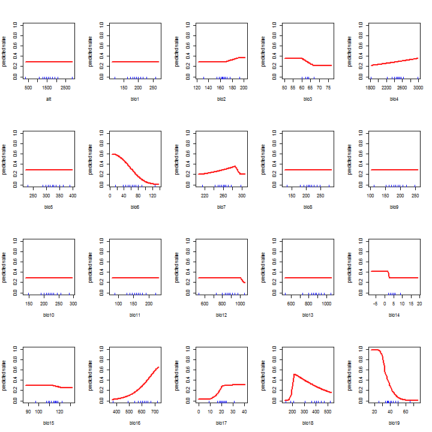
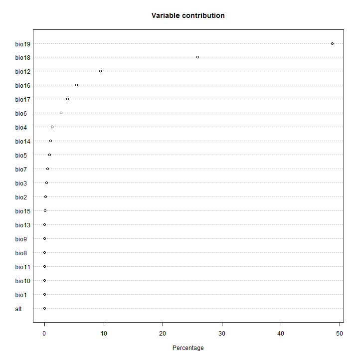

Regresiones de temperatura vs. elevación por cuadrantes
========================================================


```r
elev_field <- 'MDE_aster'
slope_field <- 'slope'
aspect_field <- 'aspect'
relief_field <- 'Relief'
wind_slope_field <- 'wind_slop'
wind_dist_field <- 'wind_dist'
ocean_slope_field <- 'ocean_slop'
ocean_dist_field <- 'ocean_dist'
wind_speed_field <- 'wind_sp01'

list_prec <- c('prec_1_cli')  # for debugging
#list_prec <- c('prec_1_cli','prec_2_cli','prec_3_cli','prec_4_cli','prec_5_cli','prec_6_cli','prec_7_cli','prec_8_cli','prec_9_cli','prec_10_cl','prec_11_cl','prec_12_cl')


replaceOutliers <- function(x){
    quantiles <- quantile( x, c(0.25, 0.5, 0.75) )
    limits <- c(quantiles[2] - 1.5*(quantiles[3]-quantiles[1]),
                quantiles[2] + 1.5*(quantiles[3]-quantiles[1]))
    x[ x < limits[1] ] <- limits[1]
    x[ x > limits[2] ] <- limits[2]
    x
}
```


```r
# read data
library(foreign)
prec<-read.dbf("prec_100000_sample_2.dbf")

# add variables to identify 1 degree cuadrants 
prec$Xclass <- as.factor(floor(prec$X))
prec$Yclass <- as.factor(floor(prec$Y))

# make lists of cuadrant indices
prec_X_values <- sort(unique(prec$Xclass, incomparables = FALSE))
prec_Y_values <- sort(unique(prec$Yclass, incomparables = FALSE))

prec_X_values
```

```
##  [1] -107 -106 -105 -104 -103 -102 -101 -100 -99  -98  -97  -96  -95  -94 
## [15] -93  -92  -91  -90  -89  -88  -87  -86  -85  -84  -83  -82  -81  -80 
## [29] -79  -78  -77  -76  -75  -74  -73 
## 35 Levels: -107 -106 -105 -104 -103 -102 -101 -100 -99 -98 -97 -96 ... -73
```

```r
prec_Y_values
```

```
##  [1] 5  6  7  8  9  10 11 12 13 14 15 16 17 18 19 20 21 22 23 24
## Levels: 5 6 7 8 9 10 11 12 13 14 15 16 17 18 19 20 21 22 23 24
```


```r
dim(prec)
```

```
## [1] 100000     26
```

```r
summary(prec)
```

```
##       CID      MDE_aster          slope          wind_slop      
##  Min.   :0   Min.   :   0.0   Min.   : 0.000   Min.   : 0.0000  
##  1st Qu.:0   1st Qu.:  61.0   1st Qu.: 3.769   1st Qu.: 0.8431  
##  Median :0   Median : 365.0   Median : 7.854   Median : 2.3821  
##  Mean   :0   Mean   : 763.5   Mean   :11.143   Mean   : 4.0702  
##  3rd Qu.:0   3rd Qu.:1410.0   3rd Qu.:16.051   3rd Qu.: 5.4667  
##  Max.   :0   Max.   :4861.0   Max.   :87.970   Max.   :44.5858  
##                                                                 
##    wind_dist        ocean_slop        ocean_dist       wind_sp01      
##  Min.   :0.0000   Min.   : 0.0000   Min.   :0.0000   Min.   : 0.3498  
##  1st Qu.:0.3000   1st Qu.: 0.9218   1st Qu.:0.3005   1st Qu.: 1.2826  
##  Median :0.7807   Median : 2.5579   Median :0.7777   Median : 4.1188  
##  Mean   :1.0310   Mean   : 4.2938   Mean   :1.0018   Mean   : 4.0609  
##  3rd Qu.:1.4795   3rd Qu.: 5.7629   3rd Qu.:1.4535   3rd Qu.: 6.1260  
##  Max.   :5.4989   Max.   :44.7741   Max.   :4.1128   Max.   :10.6780  
##                                                                       
##    prec_1_cli       prec_10_cl      prec_11_cl      prec_12_cl    
##  Min.   :  0.00   Min.   : 13.0   Min.   :  2.0   Min.   :  0.00  
##  1st Qu.: 16.00   1st Qu.: 82.0   1st Qu.: 22.0   1st Qu.: 15.00  
##  Median : 30.00   Median :166.0   Median : 65.0   Median : 37.00  
##  Mean   : 51.05   Mean   :192.5   Mean   :109.7   Mean   : 69.02  
##  3rd Qu.: 63.00   3rd Qu.:276.0   3rd Qu.:167.0   3rd Qu.: 98.00  
##  Max.   :504.00   Max.   :820.0   Max.   :799.0   Max.   :749.00  
##                                                                   
##    prec_2_cli       prec_3_cli       prec_4_cli       prec_5_cli   
##  Min.   :  0.00   Min.   :  0.00   Min.   :  0.00   Min.   :  0.0  
##  1st Qu.:  8.00   1st Qu.:  8.00   1st Qu.: 18.00   1st Qu.: 59.0  
##  Median : 24.00   Median : 24.00   Median : 41.00   Median :111.0  
##  Mean   : 36.42   Mean   : 35.85   Mean   : 64.15   Mean   :136.2  
##  3rd Qu.: 51.00   3rd Qu.: 49.00   3rd Qu.: 74.00   3rd Qu.:190.0  
##  Max.   :483.00   Max.   :486.00   Max.   :797.00   Max.   :709.0  
##                                                                    
##    prec_6_cli      prec_7_cli    prec_8_cli      prec_9_cli   
##  Min.   : 15.0   Min.   : 16   Min.   : 29.0   Min.   : 31.0  
##  1st Qu.:147.0   1st Qu.:139   1st Qu.:148.0   1st Qu.:169.0  
##  Median :200.0   Median :192   Median :198.0   Median :225.0  
##  Mean   :219.6   Mean   :219   Mean   :220.2   Mean   :243.2  
##  3rd Qu.:280.0   3rd Qu.:273   3rd Qu.:276.0   3rd Qu.:310.0  
##  Max.   :777.0   Max.   :942   Max.   :803.0   Max.   :807.0  
##                                                               
##        X                 Y              Relief           aspect      
##  Min.   :-107.00   Min.   : 5.992   Min.   :   0.0   Min.   : -1.00  
##  1st Qu.: -99.17   1st Qu.:13.813   1st Qu.:  86.0   1st Qu.: 83.07  
##  Median : -90.27   Median :17.730   Median : 282.0   Median :174.91  
##  Mean   : -90.48   Mean   :16.719   Mean   : 395.7   Mean   :174.62  
##  3rd Qu.: -83.88   3rd Qu.:20.598   3rd Qu.: 611.0   3rd Qu.:264.35  
##  Max.   : -72.98   Max.   :24.016   Max.   :2769.0   Max.   :359.90  
##                                                                      
##      Xclass          Yclass     
##  -90    : 4832   20     : 9342  
##  -99    : 4770   18     : 9301  
##  -100   : 4714   17     : 8460  
##  -89    : 4608   21     : 7729  
##  -101   : 4396   19     : 7637  
##  -102   : 4142   22     : 7545  
##  (Other):72538   (Other):49986
```


PREC regressions in cuadrants


```r
for (k in 1:length(list_prec)) {
  
  print(paste('Variable ',list_prec[k],sep=""))
  
  # create empty table for variable of month k
  col_pr_4var_R2 <- paste('pr_',k,'_R2',sep="")
  col_pr_4var_I <- paste('pr_',k,'_I',sep="")
  col_pr_4var_El2 <- paste('pr_',k,'_el2',sep="")
  col_pr_4var_El1 <- paste('pr_',k,'_el1',sep="")
  col_pr_4var_Sl2 <- paste('pr_',k,'_sl2',sep="")
  col_pr_4var_Sl1 <- paste('pr_',k,'_sl1',sep="")
  col_pr_4var_Ws2 <- paste('pr_',k,'_ws2',sep="")
  col_pr_4var_Ws1 <- paste('pr_',k,'_ws1',sep="")
  col_pr_4var_Os2 <- paste('pr_',k,'_os2',sep="")
  col_pr_4var_Os1 <- paste('pr_',k,'_os1',sep="")
  col_pr_4var_ElSl <- paste('pr_',k,'_elsl',sep="")
  col_pr_4var_ElWs <- paste('pr_',k,'_elws',sep="")
  col_pr_4var_ElOs <- paste('pr_',k,'_elos',sep="")
  col_pr_4var_SlWs <- paste('pr_',k,'_slws',sep="")
  col_pr_4var_SlOs <- paste('pr_',k,'_slos',sep="")
  col_pr_4var_WsOs <- paste('pr_',k,'_wsos',sep="")
  
  my_table_prec <- data.frame(t(rep(NA,18)))
  columns <- c("X_center", "Y_center", 
             col_pr_4var_I,
             col_pr_4var_El2,
             col_pr_4var_El1,
             col_pr_4var_Sl2,
             col_pr_4var_Sl1,
             col_pr_4var_Ws2,
             col_pr_4var_Ws1,
             col_pr_4var_Os2,
             col_pr_4var_Os1,
             col_pr_4var_ElSl,
             col_pr_4var_ElWs,
             col_pr_4var_ElOs,
             col_pr_4var_SlWs,
             col_pr_4var_SlOs,
             col_pr_4var_WsOs,
             col_pr_4var_R2)
  names(my_table_prec) <- columns
  
  # create empty table for variable of month k
  col_pr_2var_R2 <- paste('pr_',k,'_R2',sep="")
  col_pr_2var_I <- paste('pr_',k,'_I',sep="")
  col_pr_2var_El2 <- paste('pr_',k,'_el2',sep="")
  col_pr_2var_El1 <- paste('pr_',k,'_el1',sep="")
  col_pr_2var_Sl2 <- paste('pr_',k,'_sl2',sep="")
  col_pr_2var_Sl1 <- paste('pr_',k,'_sl1',sep="")
  col_pr_2var_ElSl <- paste('pr_',k,'_elsl',sep="")
  
  my_table_prec2 <- data.frame(t(rep(NA,9)))
  columns <- c("X_center", "Y_center", 
             col_pr_2var_I,
             col_pr_2var_El2,
             col_pr_2var_El1,
             col_pr_2var_Sl2,
             col_pr_2var_Sl1,
             col_pr_2var_ElSl,
             col_pr_2var_R2)
  names(my_table_prec2) <- columns
  
  for (i in 1:length(prec_X_values) ) {
  #for (i in 1:5) {
    prec_i <- prec[prec$Xclass == prec_X_values[i],]
    for (j in 1:length(prec_Y_values) ) {
      prec_ij <- prec_i[prec_i$Yclass == prec_Y_values[j],]
      prec_ij <- prec_ij[complete.cases(prec_ij),]        # take only cases with data
      prec_ij <- prec_ij[prec_ij[[elev_field]] > 0,]      # take only data with positive elevation
      if (nrow(prec_ij) > 0) {
        #print(dim(prec_ij))
      
        # data suitable for regression analysis should fit following criteria:
        # 1) have enough samples (n > 20)
        # 2) values should be normally distributed ?
        # 3) variability in elevation should be at least 1000 m
        if ((nrow(prec_ij) > 20) && 
              ( max(prec_ij[[elev_field]]) - min(prec_ij[[elev_field]]) >= 1000 )) {
              # data could be considered suitable for analysis

          y <- prec_ij[[list_prec[k]]]  
          el <- prec_ij[[elev_field]]
          sl <- prec_ij[[slope_field]]
          ws <- prec_ij[[wind_slope_field]]
          wd <- prec_ij[[wind_dist_field]]
          os <- prec_ij[[ocean_slope_field]]
          od <- prec_ij[[ocean_dist_field]]
          sp <- prec_ij[[wind_speed_field]]
          as <- prec_ij[[aspect_field]]
          rl <- prec_ij[[relief_field]]
          asx <- cos(prec_ij[[aspect_field]]*pi/180)
          asy <- sin(prec_ij[[aspect_field]]*pi/180)
          

            print('Correlations')
            print(paste('el vs. sl',cor(el,sl)))
            print(paste('el vs. ws',cor(el,ws)))
            print(paste('el vs. os',cor(el,os)))
            print(paste('el vs. wd',cor(el,wd)))
            print(paste('el vs. od',cor(el,od)))
            print(paste('el vs. sp',cor(el,sp)))
            print(paste('sl vs. ws',cor(sl,ws)))
            print(paste('sl vs. os',cor(sl,os)))
            print(paste('sl vs. wd',cor(sl,wd)))
            print(paste('sl vs. od',cor(sl,od)))
            print(paste('sl vs. sp',cor(sl,sp)))
            print(paste('ws vs. os',cor(ws,os)))
            print(paste('ws vs. wd',cor(ws,wd)))
            print(paste('ws vs. od',cor(ws,od)))
            print(paste('ws vs. sp',cor(ws,sp)))
            print(paste('os vs. wd',cor(os,wd)))
            print(paste('os vs. od',cor(os,od)))
            print(paste('os vs. sp',cor(os,sp)))
            print(paste('wd vs. wd',cor(wd,od)))
            print(paste('wd vs. sp',cor(wd,sp)))
            print(paste('od vs. sp',cor(od,sp)))
            print(paste('el vs. rl',cor(el,rl)))
            print(paste('sl vs. rl',cor(sl,rl)))
            print(paste('ws vs. rl',cor(ws,rl)))
            print(paste('os vs. rl',cor(os,rl)))
            print(paste('wd vs. rl',cor(wd,rl)))
            print(paste('od vs. rl',cor(od,rl)))

            par(mfcol = c(1,4))
          
            # elevation
            my_fit <- lm(y ~ el)
            plot(y ~ el, 
                 main=paste('Cuadrant ',prec_X_values[i],'° ',prec_Y_values[j],'°, month ',k,sep=""), 
                 xlab=paste('elevation, R²=',round(summary(my_fit)$r.squared,digits=2),sep=''), 
                 ylab='P',col='darkgray')
            abline(my_fit, col='red', lwd=2)
            
            # slope
            my_fit2 <- lm(y ~ sl)
            plot(y ~ sl, 
                main=paste('Cuadrant ',prec_X_values[i],'° ',prec_Y_values[j],'°, month ',k,sep=""), 
                xlab=paste('slope, R²=',round(summary(my_fit2)$r.squared,digits=2),sep=''), 
                ylab='P',col='darkgray')
            abline(my_fit2, col='red', lwd=2)  
          
            # slope
            my_fit20 <- lm(y ~ as)
            plot(y ~ as, 
                main=paste('Cuadrant ',prec_X_values[i],'° ',prec_Y_values[j],'°, month ',k,sep=""), 
                xlab=paste('aspect, R²=',round(summary(my_fit20)$r.squared,digits=2),sep=''), 
                ylab='P',col='darkgray')
            abline(my_fit20, col='red', lwd=2)    
          
            # relief
            my_fit21 <- lm(y ~ rl)
            plot(y ~ rl, 
                main=paste('Cuadrant ',prec_X_values[i],'° ',prec_Y_values[j],'°, month ',k,sep=""), 
                xlab=paste('relief, R²=',round(summary(my_fit21)$r.squared,digits=2),sep=''), 
                ylab='P',col='darkgray')
            abline(my_fit21, col='red', lwd=2)            

            # wind slope
            my_fit3 <- lm(y ~ ws)
            plot(y ~ ws, 
                 main=paste('Cuadrant ',prec_X_values[i],'° ',prec_Y_values[j],'°, month ',k,sep=""), 
                 xlab=paste('wind slope, R²=',round(summary(my_fit3)$r.squared,digits=2),sep=''), 
                 ylab='P',col='darkgray')
            abline(my_fit3, col='red', lwd=2)
            
            # wind ocean distance
            my_fit4 <- lm(y ~ wd)
            plot(y ~ wd, 
                main=paste('Cuadrant ',prec_X_values[i],'° ',prec_Y_values[j],'°, month ',k,sep=""), 
                xlab=paste('wind distance, R²=',round(summary(my_fit4)$r.squared,digits=2),sep=''), 
                ylab='P',col='darkgray')
            abline(my_fit4, col='red', lwd=2)                  
            
            # wind speed
            my_fit5 <- lm(y ~ sp)
            plot(y ~ sp, 
                 main=paste('Cuadrant ',prec_X_values[i],'° ',prec_Y_values[j],'°, month ',k,sep=""), 
                 xlab=paste('wind speed, R²=',round(summary(my_fit5)$r.squared,digits=2),sep=''), 
                 ylab='P',col='darkgray')
            abline(my_fit5, col='red', lwd=2)
            
            # ocean slope
            my_fit6 <- lm(y ~ os)
            plot(y ~ os, 
                main=paste('Cuadrant ',prec_X_values[i],'° ',prec_Y_values[j],'°, month ',k,sep=""), 
                xlab=paste('ocean slope, R²=',round(summary(my_fit6)$r.squared,digits=2),sep=''), 
                ylab='P',col='darkgray')
            abline(my_fit6, col='red', lwd=2)            

            # ocean distance
            my_fit7 <- lm(y ~ od)
            plot(y ~ od, 
                 main=paste('Cuadrant ',prec_X_values[i],'° ',prec_Y_values[j],'°, month ',k,sep=""), 
                 xlab=paste('ocean distance, R²=',round(summary(my_fit7)$r.squared,digits=2),sep=''), 
                 ylab='P',col='darkgray')
            abline(my_fit7, col='red', lwd=2)
            
            # elevation + slope
            my_fit8 <- lm(y ~ el + sl)
            plot(y ~ el, 
                main=paste('Cuadrant ',prec_X_values[i],'° ',prec_Y_values[j],'°, month ',k,sep=""), 
                xlab=paste('elevation, el + sl, R²=',round(summary(my_fit8)$r.squared,digits=2),sep=''), 
                ylab='P',col='darkgray')
            abline(my_fit8, col='red', lwd=2)
            plot(y ~ sl, 
                main=paste('Cuadrant ',prec_X_values[i],'° ',prec_Y_values[j],'°, month ',k,sep=""), 
                xlab=paste('slope, el + sl, R²=',round(summary(my_fit8)$r.squared,digits=2),sep=''), 
                ylab='P',col='darkgray')
            abline(my_fit8, col='red', lwd=2)
          
            # elevation + slope second order
            #my_fit15 <- lm(y ~ polym(el,sl,degree=2,raw=TRUE))  # the same as following line, but ugly summary output
            my_fit15 <- lm(y ~ el + sl + I(el^2) + I(sl^2) + el*sl)
            plot(y ~ el, 
                main=paste('Cuadrant ',prec_X_values[i],'° ',prec_Y_values[j],'°, month ',k,sep=""), 
                xlab=paste('elevation, el + sl 2-nd order, R²=',round(summary(my_fit15)$r.squared,digits=2),sep=''), 
                ylab='P',col='darkgray')
            #abline(my_fit15, col='red', lwd=2)
            pol15 <- function(el) my_fit15$coefficient[4]*el^2 + my_fit15$coefficient[2]*el + my_fit15$coefficient[1]
            curve(pol15, col="blue", lwd=2, xname="el", add = TRUE)
            plot(y ~ sl, 
                main=paste('Cuadrant ',prec_X_values[i],'° ',prec_Y_values[j],'°, month ',k,sep=""), 
                xlab=paste('slope, el + sl 2-nd order, R²=',round(summary(my_fit15)$r.squared,digits=2),sep=''), 
                ylab='P',col='darkgray')
            #abline(my_fit15, col='red', lwd=2)
            pol15a <- function(sl) my_fit15$coefficient[5]*sl^2 + my_fit15$coefficient[3]*sl + my_fit15$coefficient[1]
            curve(pol15a, col="blue", lwd=2, xname="sl", add = TRUE)

            # elevation + slope + relief + aspect second order
            my_fit22 <- lm(y ~ el + sl + rl + asx + asy + I(el^2))
            plot(y ~ el, 
                main=paste('Cuadrant ',prec_X_values[i],'° ',prec_Y_values[j],'°, month ',k,sep=""), 
                xlab=paste('elevation, el+sl+rl+as 2-nd order, R²=',round(summary(my_fit22)$r.squared,digits=2),sep=''), 
                ylab='P',col='darkgray')
            pol22 <- function(el) my_fit22$coefficient[7]*el^2 + my_fit22$coefficient[2]*el + my_fit22$coefficient[1]
            abline(my_fit22, col='red', lwd=2)
            curve(pol22, col="blue", lwd=2, xname="el", add = TRUE)
            plot(y ~ sl, 
                main=paste('Cuadrant ',prec_X_values[i],'° ',prec_Y_values[j],'°, month ',k,sep=""), 
                xlab=paste('slope, el+sl+rl+as 2-nd order, R²=',round(summary(my_fit22)$r.squared,digits=2),sep=''), 
                ylab='P',col='darkgray')
            pol22a <- function(sl) my_fit22$coefficient[3]*sl + my_fit22$coefficient[1]
            curve(pol22a, col="blue", lwd=2, xname="sl", add = TRUE)          
            plot(y ~ rl, 
                main=paste('Cuadrant ',prec_X_values[i],'° ',prec_Y_values[j],'°, month ',k,sep=""), 
                xlab=paste('relief, el+sl+rl+as 2-nd order, R²=',round(summary(my_fit22)$r.squared,digits=2),sep=''), 
                ylab='P',col='darkgray')
            pol22b <- function(rl) my_fit22$coefficient[4]*rl + my_fit22$coefficient[1]
            curve(pol22b, col="blue", lwd=2, xname="rl", add = TRUE) 
            plot(y ~ asx, 
                main=paste('Cuadrant ',prec_X_values[i],'° ',prec_Y_values[j],'°, month ',k,sep=""), 
                xlab=paste('as cos, el+sl+rl+as 2-nd order, R²=',round(summary(my_fit22)$r.squared,digits=2),sep=''), 
                ylab='P',col='darkgray')
            pol22c <- function(asx) my_fit22$coefficient[5]*asx + my_fit22$coefficient[1]
            curve(pol22c, col="blue", lwd=2, xname="as cos", add = TRUE) 
            plot(y ~ asx, 
                main=paste('Cuadrant ',prec_X_values[i],'° ',prec_Y_values[j],'°, month ',k,sep=""), 
                xlab=paste('as sin, el+sl+rl+as 2-nd order, R²=',round(summary(my_fit22)$r.squared,digits=2),sep=''), 
                ylab='P',col='darkgray')
            pol22d <- function(asy) my_fit22$coefficient[6]*asy + my_fit22$coefficient[1]
            curve(pol22d, col="blue", lwd=2, xname="as sin", add = TRUE) 
            
            
            # elevation + slope + aspect two components, elevation second order
            my_fit23 <- lm(y ~ el + sl + asx + asy + I(el^2))
            plot(y ~ el, 
                main=paste('Cuadrant ',prec_X_values[i],'° ',prec_Y_values[j],'°, month ',k,sep=""), 
                xlab=paste('elevation, el+el2+sl+as, R²=',round(summary(my_fit23)$r.squared,digits=2),sep=''), 
                ylab='P',col='darkgray')
            abline(my_fit23, col='red', lwd=2)
            pol23 <- function(el) my_fit23$coefficient[6]*el^2 + my_fit23$coefficient[2]*el + my_fit23$coefficient[1]
            curve(pol23, col="blue", lwd=2, xname="el", add = TRUE) 
            plot(y ~ sl, 
                main=paste('Cuadrant ',prec_X_values[i],'° ',prec_Y_values[j],'°, month ',k,sep=""), 
                xlab=paste('slope, el+el2+sl+as, R²=',round(summary(my_fit23)$r.squared,digits=2),sep=''), 
                ylab='P',col='darkgray')
            pol23a <- function(sl) my_fit23$coefficient[3]*sl + my_fit23$coefficient[1]
            curve(pol23a, col="blue", lwd=2, xname="sl", add = TRUE)      
            plot(y ~ asx, 
                main=paste('Cuadrant ',prec_X_values[i],'° ',prec_Y_values[j],'°, month ',k,sep=""), 
                xlab=paste('aspect cos, el+el2+sl+as, R²=',round(summary(my_fit23)$r.squared,digits=2),sep=''), 
                ylab='P',col='darkgray')
            pol23b <- function(asx) my_fit23$coefficient[4]*asx + my_fit23$coefficient[1]
            curve(pol23b, col="blue", lwd=2, xname="as cos", add = TRUE)  
            plot(y ~ asy, 
                main=paste('Cuadrant ',prec_X_values[i],'° ',prec_Y_values[j],'°, month ',k,sep=""), 
                xlab=paste('aspect sin, el+el2+sl+as, R²=',round(summary(my_fit23)$r.squared,digits=2),sep=''), 
                ylab='P',col='darkgray')
            pol23c <- function(asy) my_fit23$coefficient[5]*asy + my_fit23$coefficient[1]
            curve(pol23c, col="blue", lwd=2, xname="as sin", add = TRUE)  
          
            # elevation + slope + wind slope + ocean slope
#            my_fit13 <- lm(y ~ el + sl + ws + os)
#            plot(y ~ el, 
#                main=paste('Cuadrant ',prec_X_values[i],'° ',prec_Y_values[j],'°, month ',k,sep=""), 
#                xlab=paste('elevation, local effect vars., R²=',round(summary(my_fit13)$r.squared,digits=2),sep=''), 
#                ylab='P',col='darkgray')
#            abline(my_fit13, col='red', lwd=2)  
#            plot(y ~ sl, 
#                main=paste('Cuadrant ',prec_X_values[i],'° ',prec_Y_values[j],'°, month ',k,sep=""), 
#                xlab=paste('slope, local effect vars., R²=',round(summary(my_fit13)$r.squared,digits=2),sep=''), 
#                ylab='P',col='darkgray')
#            abline(my_fit13, col='red', lwd=2)
#            plot(y ~ ws, 
#                main=paste('Cuadrant ',prec_X_values[i],'° ',prec_Y_values[j],'°, month ',k,sep=""), 
#                xlab=paste('ws, local effect vars., R²=',round(summary(my_fit13)$r.squared,digits=2),sep=''), 
#                ylab='P',col='darkgray')
#            abline(my_fit13, col='red', lwd=2)
#              plot(y ~ os, 
#                main=paste('Cuadrant ',prec_X_values[i],'° ',prec_Y_values[j],'°, month ',k,sep=""), 
#                xlab=paste('os, local effect vars., R²=',round(summary(my_fit13)$r.squared,digits=2),sep=''), 
#                ylab='P',col='darkgray')
#            abline(my_fit13, col='red', lwd=2) 
            
#            # elevation + slope + wind slope + ocean slope second order
#            my_fit14 <- lm(y ~ el + sl + ws + os
#                          + I(el^2) + I(sl^2) + I(ws^2) + I(os^2) 
#                          + el*sl + el*ws + el*os + sl*ws + sl*os + ws*os)
#            plot(y ~ el, 
#                main=paste('Cuadrant ',prec_X_values[i],'° ',prec_Y_values[j],'°, month ',k,sep=""), 
#                xlab=paste('elevation, local effect vars. 2-nd order, R²=',round(summary(my_fit14)$r.squared,digits=2),sep=''), 
#                ylab='P',col='darkgray')
#            #abline(my_fit14, col='red', lwd=2)  
#            pol14 <- function(el) my_fit14$coefficient[6]*el^2 + my_fit14$coefficient[2]*el + my_fit14$coefficient[1]
#            curve(pol14, col="blue", lwd=2, xname="el", add = TRUE)
#            plot(y ~ sl, 
#                main=paste('Cuadrant ',prec_X_values[i],'° ',prec_Y_values[j],'°, month ',k,sep=""), 
#                xlab=paste('slope, local effect vars. 2-nd order, R²=',round(summary(my_fit14)$r.squared,digits=2),sep=''), 
#                ylab='P',col='darkgray')
#            #abline(my_fit14, col='red', lwd=2)  
#            pol14a <- function(sl) my_fit14$coefficient[7]*sl^2 + my_fit14$coefficient[3]*sl + my_fit14$coefficient[1]
#            curve(pol14a, col="blue", lwd=2, xname="sl", add = TRUE)
#            plot(y ~ ws, 
#                main=paste('Cuadrant ',prec_X_values[i],'° ',prec_Y_values[j],'°, month ',k,sep=""), 
#                xlab=paste('ws, local effect vars. 2-nd order, R²=',round(summary(my_fit14)$r.squared,digits=2),sep=''), 
#                ylab='P',col='darkgray')
#            #abline(my_fit14, col='red', lwd=2)  
#            pol14b <- function(ws) my_fit14$coefficient[8]*ws^2 + my_fit14$coefficient[4]*ws + my_fit14$coefficient[1]
#            curve(pol14b, col="blue", lwd=2, xname="ws", add = TRUE)          
#            plot(y ~ os, 
#                main=paste('Cuadrant ',prec_X_values[i],'° ',prec_Y_values[j],'°, month ',k,sep=""), 
#                xlab=paste('os, local effect vars. 2-nd order, R²=',round(summary(my_fit14)$r.squared,digits=2),sep=''), 
#                ylab='P',col='darkgray')
#            #abline(my_fit14, col='red', lwd=2)  
#            pol14c <- function(os) my_fit14$coefficient[9]*os^2 + my_fit14$coefficient[5]*os + my_fit14$coefficient[1]
#            curve(pol14c, col="blue", lwd=2, xname="os", add = TRUE)          
          
            # elevation + slope + wind slope + wind distance + ocean slope + ocean distance
#            my_fit12 <- lm(y ~ el + sl + ws + wd + os + od)
#            plot(y ~ el, 
#                main=paste('Cuadrant ',prec_X_values[i],'° ',prec_Y_values[j],'°, month ',k,sep=""), 
#                xlab=paste('elevation, all vars. (-sp), R²=',round(summary(my_fit12)$r.squared,digits=2),sep=''), 
#                ylab='P',col='darkgray')
#            abline(my_fit12, col='red', lwd=2)
#            plot(y ~ sl, 
#                main=paste('Cuadrant ',prec_X_values[i],'° ',prec_Y_values[j],'°, month ',k,sep=""), 
#                xlab=paste('slope, all vars. (-sp), R²=',round(summary(my_fit12)$r.squared,digits=2),sep=''), 
#                ylab='P',col='darkgray')
#            abline(my_fit12, col='red', lwd=2)  
#              plot(y ~ ws, 
#                main=paste('Cuadrant ',prec_X_values[i],'° ',prec_Y_values[j],'°, month ',k,sep=""), 
#                xlab=paste('ws, all vars. (-sp), R²=',round(summary(my_fit12)$r.squared,digits=2),sep=''), 
#                ylab='P',col='darkgray')
#            abline(my_fit12, col='red', lwd=2)  
#              plot(y ~ wd, 
#                main=paste('Cuadrant ',prec_X_values[i],'° ',prec_Y_values[j],'°, month ',k,sep=""), 
#                xlab=paste('wd, all vars. (-sp), R²=',round(summary(my_fit12)$r.squared,digits=2),sep=''), 
#                ylab='P',col='darkgray')
#            abline(my_fit12, col='red', lwd=2)  
#              plot(y ~ os, 
#                main=paste('Cuadrant ',prec_X_values[i],'° ',prec_Y_values[j],'°, month ',k,sep=""), 
#                xlab=paste('os, all vars. (-sp), R²=',round(summary(my_fit12)$r.squared,digits=2),sep=''), 
#                ylab='P',col='darkgray')
#            abline(my_fit12, col='red', lwd=2)  
#              plot(y ~ od, 
#                main=paste('Cuadrant ',prec_X_values[i],'° ',prec_Y_values[j],'°, month ',k,sep=""), 
#                xlab=paste('od, all vars. (-sp), R²=',round(summary(my_fit12)$r.squared,digits=2),sep=''), 
#                ylab='P',col='darkgray')
#            abline(my_fit12, col='red', lwd=2)  
          
#            # elevation + slope + wind slope + wind distance + ocean slope + ocean distance second order
#            my_fit9 <- lm(y ~ el + sl + ws + os + wd + od
#                          + I(el^2) + I(sl^2) + I(ws^2) + I(os^2) + I(wd^2) + I(od^2)
#                          + el*sl + el*ws + el*os + el*wd + el*od + sl*ws + sl*os + sl*wd + sl*od
#                          + ws*os + ws*wd + ws*od + os*wd + os*od + wd*od)
#            plot(y ~ el, 
#                main=paste('Cuadrant ',prec_X_values[i],'° ',prec_Y_values[j],'°, month ',k,sep=""), 
#                xlab=paste('elevation, all vars. (-sp), R²=',round(summary(my_fit9)$r.squared,digits=2),sep=''), 
#                ylab='P',col='darkgray')
#            #abline(my_fit9, col='red', lwd=2)  
#            pol9 <- function(el) my_fit9$coefficient[8]*el^2 + my_fit9$coefficient[2]*el + my_fit9$coefficient[1]
#            curve(pol9, col="blue", lwd=2, add = TRUE)  
#            plot(y ~ sl, 
#                main=paste('Cuadrant ',prec_X_values[i],'° ',prec_Y_values[j],'°, month ',k,sep=""), 
#                xlab=paste('slope, all vars. (-sp), R²=',round(summary(my_fit9)$r.squared,digits=2),sep=''), 
#                ylab='P',col='darkgray')
#            #abline(my_fit9, col='red', lwd=2)  
#            pol9a <- function(sl) my_fit9$coefficient[9]*sl^2 + my_fit9$coefficient[3]*sl + my_fit9$coefficient[1]
#            curve(pol9a, col="blue", lwd=2, add = TRUE)  
#            plot(y ~ ws, 
#                main=paste('Cuadrant ',prec_X_values[i],'° ',prec_Y_values[j],'°, month ',k,sep=""), 
#                xlab=paste('ws, all vars. (-sp), R²=',round(summary(my_fit9)$r.squared,digits=2),sep=''), 
#                ylab='P',col='darkgray')
#            #abline(my_fit9, col='red', lwd=2)  
#            pol9b <- function(ws) my_fit9$coefficient[10]*ws^2 + my_fit9$coefficient[4]*ws + my_fit9$coefficient[1]
#            curve(pol9b, col="blue", lwd=2, add = TRUE) 
#            plot(y ~ os, 
#                main=paste('Cuadrant ',prec_X_values[i],'° ',prec_Y_values[j],'°, month ',k,sep=""), 
#                xlab=paste('os, all vars. (-sp), R²=',round(summary(my_fit9)$r.squared,digits=2),sep=''), 
#                ylab='P',col='darkgray')
#            #abline(my_fit9, col='red', lwd=2)  
#            pol9c <- function(os) my_fit9$coefficient[11]*os^2 + my_fit9$coefficient[5]*os + my_fit9$coefficient[1]
#            curve(pol9c, col="blue", lwd=2, add = TRUE)
#            plot(y ~ wd, 
#                main=paste('Cuadrant ',prec_X_values[i],'° ',prec_Y_values[j],'°, month ',k,sep=""), 
#                xlab=paste('wd, all vars. (-sp), R²=',round(summary(my_fit9)$r.squared,digits=2),sep=''), 
#                ylab='P',col='darkgray')
#            #abline(my_fit9, col='red', lwd=2)  
#            pol9d <- function(wd) my_fit9$coefficient[12]*wd^2 + my_fit9$coefficient[6]*wd + my_fit9$coefficient[1]
#            curve(pol9d, col="blue", lwd=2, add = TRUE) 
#            plot(y ~ od, 
#                main=paste('Cuadrant ',prec_X_values[i],'° ',prec_Y_values[j],'°, month ',k,sep=""), 
#                xlab=paste('od, all vars. (-sp), R²=',round(summary(my_fit9)$r.squared,digits=2),sep=''), 
#                ylab='P',col='darkgray')
#            #abline(my_fit9, col='red', lwd=2)  
#            pol9e <- function(od) my_fit9$coefficient[13]*od^2 + my_fit9$coefficient[7]*od + my_fit9$coefficient[1]
#            curve(pol9e, col="blue", lwd=2, add = TRUE)
            
            print('Elevation + slope 2-nd order')
            print(summary(my_fit15))
            print('Elevation + slope + relief 2-nd order')
            print(summary(my_fit22))
            print('Elevation + slope + aspect partial 2-nd order')
            print(summary(my_fit23))
            #print('Elevation + slope + wind slope + ocean slope 2-nd order')
            #print(summary(my_fit14)) 
            #print('all vars. (-sp) 2-nd order')
            #print(summary(my_fit9)) 
            
            # store the centers of cuadrants, regression coefficients and R2 in table
            # note: the conversion of factor to numeric values require use of levels attribute
#            my_table_line <- c(as.numeric(levels(prec_X_values)[prec_X_values[i]])+0.5,
#                               as.numeric(levels(prec_Y_values)[prec_Y_values[j]])+0.5,
#                               coef(my_fit14)[1],
#                               coef(my_fit14)[6],
#                               coef(my_fit14)[2],
#                               coef(my_fit14)[7],
#                               coef(my_fit14)[3],
#                               coef(my_fit14)[8],
#                               coef(my_fit14)[4],
#                               coef(my_fit14)[9],
#                               coef(my_fit14)[5],
#                               coef(my_fit14)[10],
#                               coef(my_fit14)[11],
#                               coef(my_fit14)[12],
#                               coef(my_fit14)[13],
#                               coef(my_fit14)[14],
#                               coef(my_fit14)[15],
#                               summary(my_fit14)$r.squared)            

#            my_table_prec <- rbind(my_table_prec,my_table_line)

            my_table_line2 <- c(as.numeric(levels(prec_X_values)[prec_X_values[i]])+0.5,
                               as.numeric(levels(prec_Y_values)[prec_Y_values[j]])+0.5,
                               coef(my_fit15)[1],                               
                               coef(my_fit15)[4],
                               coef(my_fit15)[2],
                               coef(my_fit15)[5],
                               coef(my_fit15)[3],
                               coef(my_fit15)[6],
                               summary(my_fit15)$r.squared)            

            my_table_prec2 <- rbind(my_table_prec2,my_table_line2)          
          
        }
      }
    }     
  }

  # coef graphs & table outputs

#  my_table_prec <- my_table_prec[-1,]

#  my_table_prec[,col_pr_4var_I] <- replaceOutliers(my_table_prec[,col_pr_4var_I])
#  my_table_prec[,col_pr_4var_El2] <- replaceOutliers(my_table_prec[,col_pr_4var_El2])
#  my_table_prec[,col_pr_4var_El1] <- replaceOutliers(my_table_prec[,col_pr_4var_El1])
#  my_table_prec[,col_pr_4var_Sl2] <- replaceOutliers(my_table_prec[,col_pr_4var_Sl2])
#  my_table_prec[,col_pr_4var_Sl1] <- replaceOutliers(my_table_prec[,col_pr_4var_Sl1])
#  my_table_prec[,col_pr_4var_Ws2] <- replaceOutliers(my_table_prec[,col_pr_4var_Ws2])
#  my_table_prec[,col_pr_4var_Ws1] <- replaceOutliers(my_table_prec[,col_pr_4var_Ws1])
#  my_table_prec[,col_pr_4var_Os2] <- replaceOutliers(my_table_prec[,col_pr_4var_Os2])
#  my_table_prec[,col_pr_4var_Os1] <- replaceOutliers(my_table_prec[,col_pr_4var_Os1])
#  my_table_prec[,col_pr_4var_ElSl] <- replaceOutliers(my_table_prec[,col_pr_4var_ElSl])
#  my_table_prec[,col_pr_4var_ElWs] <- replaceOutliers(my_table_prec[,col_pr_4var_ElWs])
#  my_table_prec[,col_pr_4var_ElOs] <- replaceOutliers(my_table_prec[,col_pr_4var_ElOs])
#  my_table_prec[,col_pr_4var_SlWs] <- replaceOutliers(my_table_prec[,col_pr_4var_SlWs])
#  my_table_prec[,col_pr_4var_SlOs] <- replaceOutliers(my_table_prec[,col_pr_4var_SlOs])
#  my_table_prec[,col_pr_4var_WsOs] <- replaceOutliers(my_table_prec[,col_pr_4var_WsOs])

#  print('4 variables 2-nd order')
#  par(mfcol = c(1,4))
#  boxplot(my_table_prec[,col_pr_4var_R2],main='R²')
#  boxplot(my_table_prec[,col_pr_4var_I],main='intercept')
#  boxplot(my_table_prec[,col_pr_4var_El2],main='el²')
#  boxplot(my_table_prec[,col_pr_4var_El1],main='el')
#  boxplot(my_table_prec[,col_pr_4var_Sl2],main='sl²')
#  boxplot(my_table_prec[,col_pr_4var_Sl1],main='sl')
#  boxplot(my_table_prec[,col_pr_4var_Ws2],main='ws²')
#  boxplot(my_table_prec[,col_pr_4var_Ws1],main='ws')
#  boxplot(my_table_prec[,col_pr_4var_Os2],main='os²')
#  boxplot(my_table_prec[,col_pr_4var_Os1],main='os')
#  boxplot(my_table_prec[,col_pr_4var_ElSl],main='el-sl')
#  boxplot(my_table_prec[,col_pr_4var_ElWs],main='el-ws')
#  boxplot(my_table_prec[,col_pr_4var_ElOs],main='el-os')
#  boxplot(my_table_prec[,col_pr_4var_SlWs],main='sl-ws')
#  boxplot(my_table_prec[,col_pr_4var_SlOs],main='sl-os')
#  boxplot(my_table_prec[,col_pr_4var_WsOs],main='ws-os')

#  write.table(my_table_prec, file = paste('table_4var_',list_prec[k],'.csv',sep=""), 
#              sep = ",", row.names = FALSE)

  my_table_prec2 <- my_table_prec2[-1,]

  my_table_prec2[,col_pr_2var_I] <- replaceOutliers(my_table_prec2[,col_pr_2var_I])
  my_table_prec2[,col_pr_2var_El2] <- replaceOutliers(my_table_prec2[,col_pr_2var_El2])
  my_table_prec2[,col_pr_2var_El1] <- replaceOutliers(my_table_prec2[,col_pr_2var_El1])
  my_table_prec2[,col_pr_2var_Sl2] <- replaceOutliers(my_table_prec2[,col_pr_2var_Sl2])
  my_table_prec2[,col_pr_2var_Sl1] <- replaceOutliers(my_table_prec2[,col_pr_2var_Sl1])
  my_table_prec2[,col_pr_2var_ElSl] <- replaceOutliers(my_table_prec2[,col_pr_2var_ElSl])

  print('2 variables 2-nd order')
  par(mfcol = c(1,4))
  boxplot(my_table_prec2[,col_pr_2var_R2],main='R²')
  boxplot(my_table_prec2[,col_pr_2var_I],main='intercept')
  boxplot(my_table_prec2[,col_pr_2var_El2],main='el²')
  boxplot(my_table_prec2[,col_pr_2var_El1],main='el')
  boxplot(my_table_prec2[,col_pr_2var_Sl2],main='sl²')
  boxplot(my_table_prec2[,col_pr_2var_Sl1],main='sl')
  boxplot(my_table_prec2[,col_pr_2var_ElSl],main='el-sl')

  write.table(my_table_prec2, file = paste('table_2var_',list_prec[k],'.csv',sep=""), 
              sep = ",", row.names = FALSE)

}
```

```
## [1] "Variable prec_1_cli"
## [1] "Correlations"
## [1] "el vs. sl 0.6379861215322"
## [1] "el vs. ws 0.407313058184196"
## [1] "el vs. os 0.52516717565979"
## [1] "el vs. wd 0.784692471624785"
## [1] "el vs. od 0.778446264525656"
## [1] "el vs. sp 0.368329791531114"
## [1] "sl vs. ws 0.397377377668365"
## [1] "sl vs. os 0.488580940653079"
## [1] "sl vs. wd 0.608971513952789"
## [1] "sl vs. od 0.60788301212147"
## [1] "sl vs. sp 0.273674726401431"
## [1] "ws vs. os 0.492208083192844"
## [1] "ws vs. wd 0.354069216730982"
## [1] "ws vs. od 0.353569319919686"
## [1] "ws vs. sp 0.262386356809894"
## [1] "os vs. wd 0.477408900947407"
## [1] "os vs. od 0.475791988424165"
## [1] "os vs. sp 0.279442348758961"
## [1] "wd vs. wd 0.995334530557141"
## [1] "wd vs. sp 0.411691101502527"
## [1] "od vs. sp 0.428976164731029"
## [1] "el vs. rl 0.896675842004981"
## [1] "sl vs. rl 0.674728783335497"
## [1] "ws vs. rl 0.429360891955615"
## [1] "os vs. rl 0.549022911418927"
## [1] "wd vs. rl 0.837202765907313"
## [1] "od vs. rl 0.833147857656392"
```

      

```
## [1] "Elevation + slope 2-nd order"
## 
## Call:
## lm(formula = y ~ el + sl + I(el^2) + I(sl^2) + el * sl)
## 
## Residuals:
##     Min      1Q  Median      3Q     Max 
## -7.7816 -2.2552 -0.3412  2.7979 11.7632 
## 
## Coefficients:
##               Estimate Std. Error t value Pr(>|t|)    
## (Intercept)  2.260e+01  4.470e-01  50.569  < 2e-16 ***
## el           6.997e-03  1.792e-03   3.905 0.000112 ***
## sl           2.618e-01  7.997e-02   3.274 0.001162 ** 
## I(el^2)      5.016e-06  1.069e-06   4.693 3.79e-06 ***
## I(sl^2)     -3.914e-03  2.978e-03  -1.314 0.189571    
## el:sl       -2.371e-04  9.306e-05  -2.548 0.011236 *  
## ---
## Signif. codes:  0 '***' 0.001 '**' 0.01 '*' 0.05 '.' 0.1 ' ' 1
## 
## Residual standard error: 3.9 on 370 degrees of freedom
## Multiple R-squared:  0.5504,	Adjusted R-squared:  0.5444 
## F-statistic:  90.6 on 5 and 370 DF,  p-value: < 2.2e-16
## 
## [1] "Elevation + slope + relief 2-nd order"
## 
## Call:
## lm(formula = y ~ el + sl + rl + asx + asy + I(el^2))
## 
## Residuals:
##     Min      1Q  Median      3Q     Max 
## -8.8099 -2.4704 -0.1957  2.8595 12.1298 
## 
## Coefficients:
##               Estimate Std. Error t value Pr(>|t|)    
## (Intercept)  2.396e+01  3.625e-01  66.095  < 2e-16 ***
## el           7.708e-03  2.524e-03   3.054  0.00242 ** 
## sl           3.383e-02  3.212e-02   1.053  0.29291    
## rl          -1.619e-03  1.695e-03  -0.955  0.34018    
## asx         -6.932e-01  2.883e-01  -2.405  0.01667 *  
## asy          2.819e-01  3.045e-01   0.926  0.35520    
## I(el^2)      2.487e-06  9.927e-07   2.505  0.01267 *  
## ---
## Signif. codes:  0 '***' 0.001 '**' 0.01 '*' 0.05 '.' 0.1 ' ' 1
## 
## Residual standard error: 3.999 on 369 degrees of freedom
## Multiple R-squared:  0.5287,	Adjusted R-squared:  0.521 
## F-statistic: 68.98 on 6 and 369 DF,  p-value: < 2.2e-16
## 
## [1] "Elevation + slope + aspect partial 2-nd order"
## 
## Call:
## lm(formula = y ~ el + sl + asx + asy + I(el^2))
## 
## Residuals:
##     Min      1Q  Median      3Q     Max 
## -8.8478 -2.4002 -0.1738  2.9064 12.1100 
## 
## Coefficients:
##               Estimate Std. Error t value Pr(>|t|)    
## (Intercept)  2.385e+01  3.437e-01  69.392  < 2e-16 ***
## el           5.896e-03  1.664e-03   3.543 0.000446 ***
## sl           2.943e-02  3.178e-02   0.926 0.355137    
## asx         -6.815e-01  2.880e-01  -2.367 0.018468 *  
## asy          2.898e-01  3.044e-01   0.952 0.341613    
## I(el^2)      2.919e-06  8.839e-07   3.302 0.001054 ** 
## ---
## Signif. codes:  0 '***' 0.001 '**' 0.01 '*' 0.05 '.' 0.1 ' ' 1
## 
## Residual standard error: 3.998 on 370 degrees of freedom
## Multiple R-squared:  0.5275,	Adjusted R-squared:  0.5211 
## F-statistic: 82.61 on 5 and 370 DF,  p-value: < 2.2e-16
## 
## [1] "Correlations"
## [1] "el vs. sl 0.549338652716049"
## [1] "el vs. ws 0.43509895904063"
## [1] "el vs. os 0.263026882836688"
## [1] "el vs. wd 0.599288690717317"
## [1] "el vs. od 0.330644083783892"
## [1] "el vs. sp -0.395593646025065"
## [1] "sl vs. ws 0.448514456748149"
## [1] "sl vs. os 0.334557323794117"
## [1] "sl vs. wd 0.404836642772763"
## [1] "sl vs. od 0.116713511546887"
## [1] "sl vs. sp -0.135471003453302"
## [1] "ws vs. os -0.252640475001792"
## [1] "ws vs. wd 0.327657412583015"
## [1] "ws vs. od 0.282004143971832"
## [1] "ws vs. sp -0.235919395615805"
## [1] "os vs. wd 0.171721405266223"
## [1] "os vs. od -0.0561268560210879"
## [1] "os vs. sp 0.0372866651008668"
## [1] "wd vs. wd 0.727916515530876"
## [1] "wd vs. sp -0.764795011550453"
## [1] "od vs. sp -0.820136147051134"
## [1] "el vs. rl 0.814378258801117"
## [1] "sl vs. rl 0.623697662729446"
## [1] "ws vs. rl 0.456754513603829"
## [1] "os vs. rl 0.371664562363301"
## [1] "wd vs. rl 0.661923173147269"
## [1] "od vs. rl 0.324519921713517"
```

      

```
## [1] "Elevation + slope 2-nd order"
## 
## Call:
## lm(formula = y ~ el + sl + I(el^2) + I(sl^2) + el * sl)
## 
## Residuals:
##     Min      1Q  Median      3Q     Max 
## -4.1216 -1.0460  0.0392  0.9691  4.3256 
## 
## Coefficients:
##               Estimate Std. Error t value Pr(>|t|)    
## (Intercept)  2.358e+01  2.099e-01 112.362  < 2e-16 ***
## el           1.528e-03  5.287e-04   2.889  0.00413 ** 
## sl           9.522e-03  2.559e-02   0.372  0.71003    
## I(el^2)      1.883e-06  3.371e-07   5.587 4.98e-08 ***
## I(sl^2)      4.165e-05  7.285e-04   0.057  0.95445    
## el:sl       -2.485e-05  2.017e-05  -1.232  0.21885    
## ---
## Signif. codes:  0 '***' 0.001 '**' 0.01 '*' 0.05 '.' 0.1 ' ' 1
## 
## Residual standard error: 1.406 on 318 degrees of freedom
## Multiple R-squared:  0.7166,	Adjusted R-squared:  0.7122 
## F-statistic: 160.8 on 5 and 318 DF,  p-value: < 2.2e-16
## 
## [1] "Elevation + slope + relief 2-nd order"
## 
## Call:
## lm(formula = y ~ el + sl + rl + asx + asy + I(el^2))
## 
## Residuals:
##     Min      1Q  Median      3Q     Max 
## -4.1745 -0.9786  0.0452  0.9826  4.1387 
## 
## Coefficients:
##               Estimate Std. Error t value Pr(>|t|)    
## (Intercept)  2.382e+01  1.824e-01 130.607  < 2e-16 ***
## el           1.953e-03  6.170e-04   3.166   0.0017 ** 
## sl          -2.252e-03  9.121e-03  -0.247   0.8051    
## rl          -4.884e-04  4.115e-04  -1.187   0.2362    
## asx         -8.581e-02  1.103e-01  -0.778   0.4370    
## asy          1.892e-01  1.155e-01   1.638   0.1024    
## I(el^2)      1.476e-06  2.811e-07   5.251 2.78e-07 ***
## ---
## Signif. codes:  0 '***' 0.001 '**' 0.01 '*' 0.05 '.' 0.1 ' ' 1
## 
## Residual standard error: 1.402 on 317 degrees of freedom
## Multiple R-squared:  0.7192,	Adjusted R-squared:  0.7139 
## F-statistic: 135.3 on 6 and 317 DF,  p-value: < 2.2e-16
## 
## [1] "Elevation + slope + aspect partial 2-nd order"
## 
## Call:
## lm(formula = y ~ el + sl + asx + asy + I(el^2))
## 
## Residuals:
##    Min     1Q Median     3Q    Max 
## -4.162 -1.068  0.055  1.036  4.149 
## 
## Coefficients:
##               Estimate Std. Error t value Pr(>|t|)    
## (Intercept)  2.374e+01  1.679e-01 141.417  < 2e-16 ***
## el           1.535e-03  5.067e-04   3.029  0.00265 ** 
## sl          -5.926e-03  8.586e-03  -0.690  0.49058    
## asx         -9.414e-02  1.101e-01  -0.855  0.39320    
## asy          1.911e-01  1.155e-01   1.654  0.09913 .  
## I(el^2)      1.579e-06  2.674e-07   5.907 8.97e-09 ***
## ---
## Signif. codes:  0 '***' 0.001 '**' 0.01 '*' 0.05 '.' 0.1 ' ' 1
## 
## Residual standard error: 1.403 on 318 degrees of freedom
## Multiple R-squared:  0.7179,	Adjusted R-squared:  0.7135 
## F-statistic: 161.9 on 5 and 318 DF,  p-value: < 2.2e-16
## 
## [1] "Correlations"
## [1] "el vs. sl 0.510728401976386"
## [1] "el vs. ws 0.519219856876648"
## [1] "el vs. os 0.524247096575577"
## [1] "el vs. wd 0.398170899700811"
## [1] "el vs. od -0.0387489947958006"
## [1] "el vs. sp -0.491375074461619"
## [1] "sl vs. ws 0.445243202356478"
## [1] "sl vs. os 0.60263834818853"
## [1] "sl vs. wd 0.245879754058158"
## [1] "sl vs. od -0.161850030141804"
## [1] "sl vs. sp -0.508621335892881"
## [1] "ws vs. os 0.238978287946487"
## [1] "ws vs. wd 0.382278666974087"
## [1] "ws vs. od -0.0142815881571145"
## [1] "ws vs. sp -0.43766664290318"
## [1] "os vs. wd 0.257318281361838"
## [1] "os vs. od -0.0915963770867773"
## [1] "os vs. sp -0.406760154382301"
## [1] "wd vs. wd 0.592519679857928"
## [1] "wd vs. sp -0.336152343232878"
## [1] "od vs. sp 0.452024713007582"
## [1] "el vs. rl 0.833417399401667"
## [1] "sl vs. rl 0.660749868827873"
## [1] "ws vs. rl 0.540640649745009"
## [1] "os vs. rl 0.638368101385695"
## [1] "wd vs. rl 0.494608013178566"
## [1] "od vs. rl -0.0631389041391744"
```

      

```
## [1] "Elevation + slope 2-nd order"
## 
## Call:
## lm(formula = y ~ el + sl + I(el^2) + I(sl^2) + el * sl)
## 
## Residuals:
##     Min      1Q  Median      3Q     Max 
## -7.2726 -1.4234  0.2966  1.3862  5.3967 
## 
## Coefficients:
##               Estimate Std. Error t value Pr(>|t|)    
## (Intercept)  2.044e+01  2.844e-01  71.863   <2e-16 ***
## el           5.729e-03  2.548e-03   2.248   0.0256 *  
## sl           4.436e-02  5.647e-02   0.785   0.4330    
## I(el^2)      6.732e-06  2.813e-06   2.393   0.0176 *  
## I(sl^2)      1.255e-03  1.652e-03   0.759   0.4484    
## el:sl       -1.410e-04  1.052e-04  -1.341   0.1814    
## ---
## Signif. codes:  0 '***' 0.001 '**' 0.01 '*' 0.05 '.' 0.1 ' ' 1
## 
## Residual standard error: 2.281 on 212 degrees of freedom
## Multiple R-squared:  0.5204,	Adjusted R-squared:  0.5091 
## F-statistic: 46.01 on 5 and 212 DF,  p-value: < 2.2e-16
## 
## [1] "Elevation + slope + relief 2-nd order"
## 
## Call:
## lm(formula = y ~ el + sl + rl + asx + asy + I(el^2))
## 
## Residuals:
##     Min      1Q  Median      3Q     Max 
## -7.2674 -1.4227  0.3012  1.4542  5.0602 
## 
## Coefficients:
##               Estimate Std. Error t value Pr(>|t|)    
## (Intercept)  2.037e+01  2.320e-01  87.805   <2e-16 ***
## el           2.567e-03  3.051e-03   0.841   0.4012    
## sl           4.026e-02  2.387e-02   1.686   0.0932 .  
## rl           1.671e-03  1.368e-03   1.221   0.2233    
## asx          1.926e-01  2.197e-01   0.877   0.3817    
## asy         -1.595e-01  2.278e-01  -0.700   0.4846    
## I(el^2)      6.796e-06  2.797e-06   2.429   0.0160 *  
## ---
## Signif. codes:  0 '***' 0.001 '**' 0.01 '*' 0.05 '.' 0.1 ' ' 1
## 
## Residual standard error: 2.279 on 211 degrees of freedom
## Multiple R-squared:  0.5235,	Adjusted R-squared:  0.5099 
## F-statistic: 38.63 on 6 and 211 DF,  p-value: < 2.2e-16
## 
## [1] "Elevation + slope + aspect partial 2-nd order"
## 
## Call:
## lm(formula = y ~ el + sl + asx + asy + I(el^2))
## 
## Residuals:
##     Min      1Q  Median      3Q     Max 
## -7.4187 -1.3689  0.2382  1.3674  5.1384 
## 
## Coefficients:
##               Estimate Std. Error t value Pr(>|t|)    
## (Intercept)  2.045e+01  2.240e-01  91.303   <2e-16 ***
## el           4.909e-03  2.376e-03   2.066   0.0401 *  
## sl           4.997e-02  2.254e-02   2.217   0.0277 *  
## asx          2.186e-01  2.189e-01   0.999   0.3191    
## asy         -2.070e-01  2.247e-01  -0.922   0.3578    
## I(el^2)      5.555e-06  2.610e-06   2.129   0.0344 *  
## ---
## Signif. codes:  0 '***' 0.001 '**' 0.01 '*' 0.05 '.' 0.1 ' ' 1
## 
## Residual standard error: 2.282 on 212 degrees of freedom
## Multiple R-squared:  0.5201,	Adjusted R-squared:  0.5088 
## F-statistic: 45.95 on 5 and 212 DF,  p-value: < 2.2e-16
## 
## [1] "Correlations"
## [1] "el vs. sl 0.546885312260963"
## [1] "el vs. ws 0.3301565818601"
## [1] "el vs. os 0.397465578554164"
## [1] "el vs. wd 0.799593720554003"
## [1] "el vs. od 0.775323447496426"
## [1] "el vs. sp 0.807343824932906"
## [1] "sl vs. ws 0.576749947048019"
## [1] "sl vs. os 0.51721269613284"
## [1] "sl vs. wd 0.628549416403844"
## [1] "sl vs. od 0.644283069795701"
## [1] "sl vs. sp 0.62013521643577"
## [1] "ws vs. os 0.516764718227981"
## [1] "ws vs. wd 0.407815353365108"
## [1] "ws vs. od 0.435867369404677"
## [1] "ws vs. sp 0.400343187216084"
## [1] "os vs. wd 0.42375103727146"
## [1] "os vs. od 0.436069063930556"
## [1] "os vs. sp 0.42105906862708"
## [1] "wd vs. wd 0.974343991159026"
## [1] "wd vs. sp 0.910975750576842"
## [1] "od vs. sp 0.846886061124972"
## [1] "el vs. rl 0.709009139552206"
## [1] "sl vs. rl 0.770518304540306"
## [1] "ws vs. rl 0.584953336058941"
## [1] "os vs. rl 0.594082861973416"
## [1] "wd vs. rl 0.774661501685147"
## [1] "od vs. rl 0.787277158780005"
```

      

```
## [1] "Elevation + slope 2-nd order"
## 
## Call:
## lm(formula = y ~ el + sl + I(el^2) + I(sl^2) + el * sl)
## 
## Residuals:
##      Min       1Q   Median       3Q      Max 
## -24.2560  -2.6429  -0.1824   2.3673  14.1095 
## 
## Coefficients:
##               Estimate Std. Error t value Pr(>|t|)    
## (Intercept)  1.805e+01  4.634e-01  38.948  < 2e-16 ***
## el           3.542e-02  2.170e-03  16.324  < 2e-16 ***
## sl           3.090e-01  8.642e-02   3.575 0.000387 ***
## I(el^2)     -6.302e-06  1.147e-06  -5.493 6.58e-08 ***
## I(sl^2)     -4.773e-03  2.400e-03  -1.989 0.047344 *  
## el:sl       -1.662e-04  6.176e-05  -2.691 0.007385 ** 
## ---
## Signif. codes:  0 '***' 0.001 '**' 0.01 '*' 0.05 '.' 0.1 ' ' 1
## 
## Residual standard error: 5.169 on 456 degrees of freedom
## Multiple R-squared:  0.8758,	Adjusted R-squared:  0.8744 
## F-statistic: 643.1 on 5 and 456 DF,  p-value: < 2.2e-16
## 
## [1] "Elevation + slope + relief 2-nd order"
## 
## Call:
## lm(formula = y ~ el + sl + rl + asx + asy + I(el^2))
## 
## Residuals:
##      Min       1Q   Median       3Q      Max 
## -24.5246  -2.5260  -0.2599   2.5612  14.9723 
## 
## Coefficients:
##               Estimate Std. Error t value Pr(>|t|)    
## (Intercept)  1.932e+01  3.769e-01  51.245  < 2e-16 ***
## el           3.785e-02  3.066e-03  12.343  < 2e-16 ***
## sl           2.647e-02  3.794e-02   0.698   0.4858    
## rl          -1.142e-03  1.741e-03  -0.656   0.5122    
## asx         -3.188e-01  3.646e-01  -0.874   0.3823    
## asy         -6.735e-01  3.424e-01  -1.967   0.0498 *  
## I(el^2)     -8.566e-06  1.524e-06  -5.619 3.35e-08 ***
## ---
## Signif. codes:  0 '***' 0.001 '**' 0.01 '*' 0.05 '.' 0.1 ' ' 1
## 
## Residual standard error: 5.279 on 455 degrees of freedom
## Multiple R-squared:  0.8708,	Adjusted R-squared:  0.8691 
## F-statistic:   511 on 6 and 455 DF,  p-value: < 2.2e-16
## 
## [1] "Elevation + slope + aspect partial 2-nd order"
## 
## Call:
## lm(formula = y ~ el + sl + asx + asy + I(el^2))
## 
## Residuals:
##      Min       1Q   Median       3Q      Max 
## -24.6060  -2.4403  -0.2281   2.6096  14.5433 
## 
## Coefficients:
##               Estimate Std. Error t value Pr(>|t|)    
## (Intercept)  1.928e+01  3.717e-01  51.861  < 2e-16 ***
## el           3.634e-02  2.037e-03  17.838  < 2e-16 ***
## sl           1.657e-02  3.479e-02   0.476   0.6342    
## asx         -3.123e-01  3.642e-01  -0.858   0.3916    
## asy         -6.385e-01  3.380e-01  -1.889   0.0595 .  
## I(el^2)     -7.886e-06  1.118e-06  -7.057 6.37e-12 ***
## ---
## Signif. codes:  0 '***' 0.001 '**' 0.01 '*' 0.05 '.' 0.1 ' ' 1
## 
## Residual standard error: 5.276 on 456 degrees of freedom
## Multiple R-squared:  0.8706,	Adjusted R-squared:  0.8692 
## F-statistic: 613.9 on 5 and 456 DF,  p-value: < 2.2e-16
## 
## [1] "Correlations"
## [1] "el vs. sl -0.0668806209404694"
## [1] "el vs. ws -0.0285895009836415"
## [1] "el vs. os -0.0787380356485436"
## [1] "el vs. wd 0.774045581846131"
## [1] "el vs. od 0.830292696933251"
## [1] "el vs. sp 0.669566102264547"
## [1] "sl vs. ws 0.271792059623718"
## [1] "sl vs. os 0.336725428482989"
## [1] "sl vs. wd -0.0131746493304933"
## [1] "sl vs. od -0.0149888302481366"
## [1] "sl vs. sp -0.0547452019841075"
## [1] "ws vs. os 0.44590184171468"
## [1] "ws vs. wd -0.0118879012614946"
## [1] "ws vs. od -0.019918735092955"
## [1] "ws vs. sp -0.0319967182437863"
## [1] "os vs. wd -0.0561953448008676"
## [1] "os vs. od -0.0524283642037211"
## [1] "os vs. sp -0.0893572236470231"
## [1] "wd vs. wd 0.961055280232827"
## [1] "wd vs. sp 0.946166755758351"
## [1] "od vs. sp 0.845861102469351"
## [1] "el vs. rl -0.0936990623049374"
## [1] "sl vs. rl 0.526910157776675"
## [1] "ws vs. rl 0.335776742262328"
## [1] "os vs. rl 0.349826016173572"
## [1] "wd vs. rl -0.158615540714261"
## [1] "od vs. rl -0.134722527898169"
```

      

```
## [1] "Elevation + slope 2-nd order"
## 
## Call:
## lm(formula = y ~ el + sl + I(el^2) + I(sl^2) + el * sl)
## 
## Residuals:
##      Min       1Q   Median       3Q      Max 
## -27.2236  -6.5676  -0.1409   5.7005  22.7281 
## 
## Coefficients:
##               Estimate Std. Error t value Pr(>|t|)    
## (Intercept)  2.409e+01  1.835e+00  13.127  < 2e-16 ***
## el           1.963e-02  2.333e-03   8.416 2.82e-16 ***
## sl          -3.133e-01  1.229e-01  -2.550    0.011 *  
## I(el^2)     -3.668e-06  7.850e-07  -4.673 3.67e-06 ***
## I(sl^2)     -8.881e-04  1.812e-03  -0.490    0.624    
## el:sl        2.395e-04  4.298e-05   5.572 3.80e-08 ***
## ---
## Signif. codes:  0 '***' 0.001 '**' 0.01 '*' 0.05 '.' 0.1 ' ' 1
## 
## Residual standard error: 9.508 on 604 degrees of freedom
## Multiple R-squared:  0.5557,	Adjusted R-squared:  0.552 
## F-statistic: 151.1 on 5 and 604 DF,  p-value: < 2.2e-16
## 
## [1] "Elevation + slope + relief 2-nd order"
## 
## Call:
## lm(formula = y ~ el + sl + rl + asx + asy + I(el^2))
## 
## Residuals:
##      Min       1Q   Median       3Q      Max 
## -23.1112  -5.9879   0.2062   5.8342  25.4802 
## 
## Coefficients:
##               Estimate Std. Error t value Pr(>|t|)    
## (Intercept)  1.710e+01  1.353e+00  12.640  < 2e-16 ***
## el           8.488e-03  2.890e-03   2.937  0.00344 ** 
## sl          -3.142e-02  3.492e-02  -0.900  0.36858    
## rl           1.033e-02  1.447e-03   7.138 2.73e-12 ***
## asx         -7.962e-01  5.458e-01  -1.459  0.14515    
## asy          6.197e-01  5.385e-01   1.151  0.25025    
## I(el^2)      1.614e-06  9.874e-07   1.635  0.10254    
## ---
## Signif. codes:  0 '***' 0.001 '**' 0.01 '*' 0.05 '.' 0.1 ' ' 1
## 
## Residual standard error: 9.331 on 603 degrees of freedom
## Multiple R-squared:  0.5728,	Adjusted R-squared:  0.5685 
## F-statistic: 134.7 on 6 and 603 DF,  p-value: < 2.2e-16
## 
## [1] "Elevation + slope + aspect partial 2-nd order"
## 
## Call:
## lm(formula = y ~ el + sl + asx + asy + I(el^2))
## 
## Residuals:
##      Min       1Q   Median       3Q      Max 
## -27.0922  -6.0190   0.3519   5.4687  22.5673 
## 
## Coefficients:
##               Estimate Std. Error t value Pr(>|t|)    
## (Intercept)  1.864e+01  1.390e+00  13.409  < 2e-16 ***
## el           2.162e-02  2.319e-03   9.321  < 2e-16 ***
## sl           3.935e-02  3.484e-02   1.129 0.259150    
## asx         -9.926e-01  5.672e-01  -1.750 0.080623 .  
## asy          8.153e-01  5.596e-01   1.457 0.145626    
## I(el^2)     -2.997e-06  7.770e-07  -3.857 0.000127 ***
## ---
## Signif. codes:  0 '***' 0.001 '**' 0.01 '*' 0.05 '.' 0.1 ' ' 1
## 
## Residual standard error: 9.71 on 604 degrees of freedom
## Multiple R-squared:  0.5367,	Adjusted R-squared:  0.5328 
## F-statistic: 139.9 on 5 and 604 DF,  p-value: < 2.2e-16
## 
## [1] "Correlations"
## [1] "el vs. sl 0.4304852652039"
## [1] "el vs. ws 0.311269317096623"
## [1] "el vs. os 0.211218610351524"
## [1] "el vs. wd 0.700509708281032"
## [1] "el vs. od 0.728505767350926"
## [1] "el vs. sp 0.429801359310881"
## [1] "sl vs. ws 0.351450360763598"
## [1] "sl vs. os 0.425740931934815"
## [1] "sl vs. wd 0.195481356855236"
## [1] "sl vs. od 0.209798126449253"
## [1] "sl vs. sp 0.111164567766967"
## [1] "ws vs. os 0.178503019481725"
## [1] "ws vs. wd 0.12429841100633"
## [1] "ws vs. od 0.136680197650774"
## [1] "ws vs. sp 0.0700618969695158"
## [1] "os vs. wd 0.0566630413839924"
## [1] "os vs. od 0.0645537036964982"
## [1] "os vs. sp 0.0319067306388404"
## [1] "wd vs. wd 0.979925295157306"
## [1] "wd vs. sp 0.819988998542643"
## [1] "od vs. sp 0.76155555297262"
## [1] "el vs. rl 0.686736426206427"
## [1] "sl vs. rl 0.48219467909868"
## [1] "ws vs. rl 0.322651126532109"
## [1] "os vs. rl 0.319317650636836"
## [1] "wd vs. rl 0.397827358056513"
## [1] "od vs. rl 0.40977412985336"
```

      

```
## [1] "Elevation + slope 2-nd order"
## 
## Call:
## lm(formula = y ~ el + sl + I(el^2) + I(sl^2) + el * sl)
## 
## Residuals:
##     Min      1Q  Median      3Q     Max 
## -7.6135 -1.6217 -0.4676  1.6232  9.3178 
## 
## Coefficients:
##               Estimate Std. Error t value Pr(>|t|)    
## (Intercept)  2.330e+01  3.403e-01  68.454  < 2e-16 ***
## el          -2.519e-03  6.930e-04  -3.635 0.000303 ***
## sl          -6.637e-02  3.406e-02  -1.949 0.051826 .  
## I(el^2)      2.854e-06  3.413e-07   8.362 4.68e-16 ***
## I(sl^2)      1.614e-03  9.932e-04   1.625 0.104783    
## el:sl        3.195e-05  2.492e-05   1.282 0.200259    
## ---
## Signif. codes:  0 '***' 0.001 '**' 0.01 '*' 0.05 '.' 0.1 ' ' 1
## 
## Residual standard error: 2.609 on 573 degrees of freedom
## Multiple R-squared:  0.4334,	Adjusted R-squared:  0.4285 
## F-statistic: 87.67 on 5 and 573 DF,  p-value: < 2.2e-16
## 
## [1] "Elevation + slope + relief 2-nd order"
## 
## Call:
## lm(formula = y ~ el + sl + rl + asx + asy + I(el^2))
## 
## Residuals:
##     Min      1Q  Median      3Q     Max 
## -7.7317 -1.6934 -0.3589  1.7690  9.2621 
## 
## Coefficients:
##               Estimate Std. Error t value Pr(>|t|)    
## (Intercept)  2.250e+01  2.920e-01  77.052  < 2e-16 ***
## el          -3.105e-03  7.260e-04  -4.277 2.22e-05 ***
## sl           1.823e-02  1.286e-02   1.417   0.1569    
## rl           9.433e-04  5.011e-04   1.882   0.0603 .  
## asx          6.589e-02  1.541e-01   0.428   0.6691    
## asy          1.729e-02  1.591e-01   0.109   0.9135    
## I(el^2)      3.243e-06  3.246e-07   9.990  < 2e-16 ***
## ---
## Signif. codes:  0 '***' 0.001 '**' 0.01 '*' 0.05 '.' 0.1 ' ' 1
## 
## Residual standard error: 2.625 on 572 degrees of freedom
## Multiple R-squared:  0.4277,	Adjusted R-squared:  0.4217 
## F-statistic: 71.24 on 6 and 572 DF,  p-value: < 2.2e-16
## 
## [1] "Elevation + slope + aspect partial 2-nd order"
## 
## Call:
## lm(formula = y ~ el + sl + asx + asy + I(el^2))
## 
## Residuals:
##     Min      1Q  Median      3Q     Max 
## -7.5674 -1.7010 -0.4089  1.6514  9.2719 
## 
## Coefficients:
##               Estimate Std. Error t value Pr(>|t|)    
## (Intercept)  2.267e+01  2.772e-01  81.792  < 2e-16 ***
## el          -2.570e-03  6.695e-04  -3.838 0.000138 ***
## sl           2.452e-02  1.244e-02   1.970 0.049264 *  
## asx          4.561e-02  1.541e-01   0.296 0.767310    
## asy         -1.962e-03  1.591e-01  -0.012 0.990170    
## I(el^2)      3.140e-06  3.207e-07   9.792  < 2e-16 ***
## ---
## Signif. codes:  0 '***' 0.001 '**' 0.01 '*' 0.05 '.' 0.1 ' ' 1
## 
## Residual standard error: 2.63 on 573 degrees of freedom
## Multiple R-squared:  0.4241,	Adjusted R-squared:  0.4191 
## F-statistic: 84.41 on 5 and 573 DF,  p-value: < 2.2e-16
## 
## [1] "Correlations"
## [1] "el vs. sl 0.0821780833432929"
## [1] "el vs. ws 0.0605955872477837"
## [1] "el vs. os 0.00206358435603168"
## [1] "el vs. wd 0.219494346878801"
## [1] "el vs. od 0.263275790573385"
## [1] "el vs. sp -0.149665385786893"
## [1] "sl vs. ws 0.263842662834454"
## [1] "sl vs. os 0.391567093355649"
## [1] "sl vs. wd -0.106221641034188"
## [1] "sl vs. od -0.266714307582718"
## [1] "sl vs. sp 0.112618757828693"
## [1] "ws vs. os -0.274645797990142"
## [1] "ws vs. wd -0.141710473946924"
## [1] "ws vs. od -0.193219812848213"
## [1] "ws vs. sp -0.0148851211464183"
## [1] "os vs. wd -0.101329146564038"
## [1] "os vs. od -0.197595323190403"
## [1] "os vs. sp 0.0812667054311132"
## [1] "wd vs. wd 0.698918978272947"
## [1] "wd vs. sp 0.554642641289842"
## [1] "od vs. sp -0.0139325921188609"
## [1] "el vs. rl 0.0583263741848087"
## [1] "sl vs. rl 0.503098893489058"
## [1] "ws vs. rl 0.320400198176082"
## [1] "os vs. rl 0.385383003300734"
## [1] "wd vs. rl -0.176695569911609"
## [1] "od vs. rl -0.426440396499935"
```

      

```
## [1] "Elevation + slope 2-nd order"
## 
## Call:
## lm(formula = y ~ el + sl + I(el^2) + I(sl^2) + el * sl)
## 
## Residuals:
##      Min       1Q   Median       3Q      Max 
## -12.8444  -2.6134   0.8704   3.3035   8.0817 
## 
## Coefficients:
##               Estimate Std. Error t value Pr(>|t|)    
## (Intercept)  2.354e+01  1.466e+00  16.056  < 2e-16 ***
## el          -1.125e-02  1.921e-03  -5.858 7.54e-09 ***
## sl           2.243e-01  7.676e-02   2.922  0.00361 ** 
## I(el^2)      6.284e-06  7.241e-07   8.678  < 2e-16 ***
## I(sl^2)     -3.462e-03  1.318e-03  -2.627  0.00883 ** 
## el:sl       -2.644e-05  3.818e-05  -0.692  0.48900    
## ---
## Signif. codes:  0 '***' 0.001 '**' 0.01 '*' 0.05 '.' 0.1 ' ' 1
## 
## Residual standard error: 4.447 on 628 degrees of freedom
## Multiple R-squared:  0.2817,	Adjusted R-squared:  0.276 
## F-statistic: 49.26 on 5 and 628 DF,  p-value: < 2.2e-16
## 
## [1] "Elevation + slope + relief 2-nd order"
## 
## Call:
## lm(formula = y ~ el + sl + rl + asx + asy + I(el^2))
## 
## Residuals:
##      Min       1Q   Median       3Q      Max 
## -12.4331  -2.5649   0.9028   3.2067   8.0338 
## 
## Coefficients:
##               Estimate Std. Error t value Pr(>|t|)    
## (Intercept)  2.342e+01  1.340e+00  17.478  < 2e-16 ***
## el          -1.093e-02  1.902e-03  -5.745 1.43e-08 ***
## sl           1.913e-02  1.894e-02   1.010  0.31300    
## rl           2.290e-03  7.525e-04   3.043  0.00244 ** 
## asx         -5.272e-01  2.504e-01  -2.106  0.03563 *  
## asy          2.092e-01  2.529e-01   0.827  0.40829    
## I(el^2)      6.052e-06  7.040e-07   8.596  < 2e-16 ***
## ---
## Signif. codes:  0 '***' 0.001 '**' 0.01 '*' 0.05 '.' 0.1 ' ' 1
## 
## Residual standard error: 4.423 on 627 degrees of freedom
## Multiple R-squared:  0.2905,	Adjusted R-squared:  0.2837 
## F-statistic: 42.79 on 6 and 627 DF,  p-value: < 2.2e-16
## 
## [1] "Elevation + slope + aspect partial 2-nd order"
## 
## Call:
## lm(formula = y ~ el + sl + asx + asy + I(el^2))
## 
## Residuals:
##      Min       1Q   Median       3Q      Max 
## -12.5676  -2.6046   0.8905   3.4077   8.0705 
## 
## Coefficients:
##               Estimate Std. Error t value Pr(>|t|)    
## (Intercept)  2.464e+01  1.287e+00  19.140  < 2e-16 ***
## el          -1.120e-02  1.912e-03  -5.855  7.7e-09 ***
## sl           4.815e-02  1.647e-02   2.923  0.00359 ** 
## asx         -6.016e-01  2.508e-01  -2.399  0.01675 *  
## asy          1.629e-01  2.540e-01   0.641  0.52167    
## I(el^2)      6.172e-06  7.075e-07   8.723  < 2e-16 ***
## ---
## Signif. codes:  0 '***' 0.001 '**' 0.01 '*' 0.05 '.' 0.1 ' ' 1
## 
## Residual standard error: 4.452 on 628 degrees of freedom
## Multiple R-squared:   0.28,	Adjusted R-squared:  0.2743 
## F-statistic: 48.86 on 5 and 628 DF,  p-value: < 2.2e-16
## 
## [1] "Correlations"
## [1] "el vs. sl -0.0580988046582832"
## [1] "el vs. ws 0.00234911791350571"
## [1] "el vs. os 0.017044755002381"
## [1] "el vs. wd 0.533541008726141"
## [1] "el vs. od 0.494739395877491"
## [1] "el vs. sp -0.0245840771308319"
## [1] "sl vs. ws 0.403156723362207"
## [1] "sl vs. os 0.328238862107846"
## [1] "sl vs. wd 0.136914976192183"
## [1] "sl vs. od 0.167054573280849"
## [1] "sl vs. sp 0.0518326908930788"
## [1] "ws vs. os -0.0210405242402413"
## [1] "ws vs. wd 0.128465670543026"
## [1] "ws vs. od 0.183511040194499"
## [1] "ws vs. sp 0.0785550236272277"
## [1] "os vs. wd 0.0690167653424508"
## [1] "os vs. od 0.0764416900093723"
## [1] "os vs. sp 0.0111928889880008"
## [1] "wd vs. wd 0.899794787992807"
## [1] "wd vs. sp -0.051362441363073"
## [1] "od vs. sp 0.299725142630634"
## [1] "el vs. rl 0.151476108380943"
## [1] "sl vs. rl 0.440798612858029"
## [1] "ws vs. rl 0.354401016918095"
## [1] "os vs. rl 0.29994431241492"
## [1] "wd vs. rl 0.243828501487486"
## [1] "od vs. rl 0.28704198725111"
```

      

```
## [1] "Elevation + slope 2-nd order"
## 
## Call:
## lm(formula = y ~ el + sl + I(el^2) + I(sl^2) + el * sl)
## 
## Residuals:
##      Min       1Q   Median       3Q      Max 
## -15.0503  -4.9614  -0.5709   4.3114  24.4407 
## 
## Coefficients:
##               Estimate Std. Error t value Pr(>|t|)    
## (Intercept)  2.018e+01  1.581e+00  12.767  < 2e-16 ***
## el           1.001e-02  2.251e-03   4.447 1.02e-05 ***
## sl           1.402e-01  9.274e-02   1.512 0.131069    
## I(el^2)     -3.160e-06  9.070e-07  -3.484 0.000528 ***
## I(sl^2)     -2.605e-03  1.566e-03  -1.663 0.096774 .  
## el:sl       -8.770e-05  5.048e-05  -1.737 0.082783 .  
## ---
## Signif. codes:  0 '***' 0.001 '**' 0.01 '*' 0.05 '.' 0.1 ' ' 1
## 
## Residual standard error: 6.937 on 657 degrees of freedom
## Multiple R-squared:  0.04613,	Adjusted R-squared:  0.03887 
## F-statistic: 6.354 on 5 and 657 DF,  p-value: 8.962e-06
## 
## [1] "Elevation + slope + relief 2-nd order"
## 
## Call:
## lm(formula = y ~ el + sl + rl + asx + asy + I(el^2))
## 
## Residuals:
##      Min       1Q   Median       3Q      Max 
## -15.8085  -4.9825  -0.3319   4.4995  24.7900 
## 
## Coefficients:
##               Estimate Std. Error t value Pr(>|t|)    
## (Intercept)  2.132e+01  1.279e+00  16.665  < 2e-16 ***
## el           8.786e-03  2.131e-03   4.123 4.22e-05 ***
## sl          -8.417e-02  2.770e-02  -3.038 0.002475 ** 
## rl           2.040e-03  9.262e-04   2.202 0.027994 *  
## asx          7.528e-01  3.810e-01   1.976 0.048598 *  
## asy          2.817e-01  3.834e-01   0.735 0.462683    
## I(el^2)     -3.330e-06  9.076e-07  -3.668 0.000264 ***
## ---
## Signif. codes:  0 '***' 0.001 '**' 0.01 '*' 0.05 '.' 0.1 ' ' 1
## 
## Residual standard error: 6.921 on 656 degrees of freedom
## Multiple R-squared:  0.052,	Adjusted R-squared:  0.04333 
## F-statistic: 5.997 on 6 and 656 DF,  p-value: 4.058e-06
## 
## [1] "Elevation + slope + aspect partial 2-nd order"
## 
## Call:
## lm(formula = y ~ el + sl + asx + asy + I(el^2))
## 
## Residuals:
##      Min       1Q   Median       3Q      Max 
## -14.8415  -5.0738  -0.4615   4.3101  24.9632 
## 
## Coefficients:
##               Estimate Std. Error t value Pr(>|t|)    
## (Intercept)  2.209e+01  1.235e+00  17.885  < 2e-16 ***
## el           9.188e-03  2.129e-03   4.315 1.84e-05 ***
## sl          -5.647e-02  2.476e-02  -2.281 0.022865 *  
## asx          7.324e-01  3.820e-01   1.917 0.055639 .  
## asy          2.689e-01  3.844e-01   0.699 0.484573    
## I(el^2)     -3.401e-06  9.097e-07  -3.739 0.000201 ***
## ---
## Signif. codes:  0 '***' 0.001 '**' 0.01 '*' 0.05 '.' 0.1 ' ' 1
## 
## Residual standard error: 6.941 on 657 degrees of freedom
## Multiple R-squared:  0.04499,	Adjusted R-squared:  0.03772 
## F-statistic:  6.19 on 5 and 657 DF,  p-value: 1.281e-05
## 
## [1] "Correlations"
## [1] "el vs. sl -0.169841905655504"
## [1] "el vs. ws -0.176374346678166"
## [1] "el vs. os -0.104515221084489"
## [1] "el vs. wd 0.384121742343946"
## [1] "el vs. od 0.413250731704231"
## [1] "el vs. sp 0.498613262548676"
## [1] "sl vs. ws 0.217686899401857"
## [1] "sl vs. os 0.280413659757351"
## [1] "sl vs. wd -0.127398777139056"
## [1] "sl vs. od -0.16354442669246"
## [1] "sl vs. sp -0.164760462805402"
## [1] "ws vs. os 0.22839027949431"
## [1] "ws vs. wd -0.109414369444933"
## [1] "ws vs. od -0.134520547458713"
## [1] "ws vs. sp -0.155195713879536"
## [1] "os vs. wd -0.178728890000285"
## [1] "os vs. od -0.201338784931674"
## [1] "os vs. sp -0.132829174384526"
## [1] "wd vs. wd 0.936410513639691"
## [1] "wd vs. sp 0.660813408309475"
## [1] "od vs. sp 0.796864048864281"
## [1] "el vs. rl -0.134002400039041"
## [1] "sl vs. rl 0.349547423989095"
## [1] "ws vs. rl 0.205041936401549"
## [1] "os vs. rl 0.366796879749048"
## [1] "wd vs. rl -0.201286005729926"
## [1] "od vs. rl -0.279573529344723"
```

      

```
## [1] "Elevation + slope 2-nd order"
## 
## Call:
## lm(formula = y ~ el + sl + I(el^2) + I(sl^2) + el * sl)
## 
## Residuals:
##      Min       1Q   Median       3Q      Max 
## -22.9295  -6.4876   0.4487   6.9182  19.6493 
## 
## Coefficients:
##               Estimate Std. Error t value Pr(>|t|)    
## (Intercept)  1.591e+01  3.434e+00   4.633 4.40e-06 ***
## el           2.446e-02  3.445e-03   7.100 3.49e-12 ***
## sl           2.017e-01  1.677e-01   1.203    0.230    
## I(el^2)     -6.759e-06  1.003e-06  -6.739 3.69e-11 ***
## I(sl^2)     -2.369e-03  2.396e-03  -0.989    0.323    
## el:sl        1.026e-06  6.573e-05   0.016    0.988    
## ---
## Signif. codes:  0 '***' 0.001 '**' 0.01 '*' 0.05 '.' 0.1 ' ' 1
## 
## Residual standard error: 9.341 on 609 degrees of freedom
## Multiple R-squared:  0.1384,	Adjusted R-squared:  0.1314 
## F-statistic: 19.57 on 5 and 609 DF,  p-value: < 2.2e-16
## 
## [1] "Elevation + slope + relief 2-nd order"
## 
## Call:
## lm(formula = y ~ el + sl + rl + asx + asy + I(el^2))
## 
## Residuals:
##      Min       1Q   Median       3Q      Max 
## -22.2872  -6.4235  -0.3026   6.8382  21.7325 
## 
## Coefficients:
##               Estimate Std. Error t value Pr(>|t|)    
## (Intercept)  1.267e+01  2.203e+00   5.751 1.41e-08 ***
## el           1.806e-02  2.987e-03   6.047 2.58e-09 ***
## sl           4.279e-03  3.568e-02   0.120    0.905    
## rl           1.108e-02  1.437e-03   7.708 5.25e-14 ***
## asx         -3.471e-01  5.389e-01  -0.644    0.520    
## asy          1.645e-01  4.952e-01   0.332    0.740    
## I(el^2)     -4.459e-06  9.907e-07  -4.501 8.10e-06 ***
## ---
## Signif. codes:  0 '***' 0.001 '**' 0.01 '*' 0.05 '.' 0.1 ' ' 1
## 
## Residual standard error: 8.924 on 608 degrees of freedom
## Multiple R-squared:  0.2149,	Adjusted R-squared:  0.2071 
## F-statistic: 27.74 on 6 and 608 DF,  p-value: < 2.2e-16
## 
## [1] "Elevation + slope + aspect partial 2-nd order"
## 
## Call:
## lm(formula = y ~ el + sl + asx + asy + I(el^2))
## 
## Residuals:
##      Min       1Q   Median       3Q      Max 
## -23.2662  -6.5921   0.4489   7.0693  20.0569 
## 
## Coefficients:
##               Estimate Std. Error t value Pr(>|t|)    
## (Intercept)  1.690e+01  2.234e+00   7.566 1.43e-13 ***
## el           2.434e-02  3.009e-03   8.090 3.25e-15 ***
## sl           9.368e-02  3.532e-02   2.652  0.00821 ** 
## asx         -3.747e-01  5.642e-01  -0.664  0.50687    
## asy         -3.065e-01  5.145e-01  -0.596  0.55159    
## I(el^2)     -6.718e-06  9.907e-07  -6.781 2.83e-11 ***
## ---
## Signif. codes:  0 '***' 0.001 '**' 0.01 '*' 0.05 '.' 0.1 ' ' 1
## 
## Residual standard error: 9.342 on 609 degrees of freedom
## Multiple R-squared:  0.1382,	Adjusted R-squared:  0.1311 
## F-statistic: 19.53 on 5 and 609 DF,  p-value: < 2.2e-16
## 
## [1] "Correlations"
## [1] "el vs. sl -0.0221092999740294"
## [1] "el vs. ws 0.0367086239474306"
## [1] "el vs. os 0.0107766603488643"
## [1] "el vs. wd -0.13599826264001"
## [1] "el vs. od -0.102081914884837"
## [1] "el vs. sp -0.076778105158231"
## [1] "sl vs. ws 0.31660997246599"
## [1] "sl vs. os 0.347782177202639"
## [1] "sl vs. wd -0.36348419828149"
## [1] "sl vs. od -0.386643030076538"
## [1] "sl vs. sp -0.40647705600339"
## [1] "ws vs. os 0.308744907890931"
## [1] "ws vs. wd -0.230939834338519"
## [1] "ws vs. od -0.254597747669403"
## [1] "ws vs. sp -0.301532096505352"
## [1] "os vs. wd -0.2443042932035"
## [1] "os vs. od -0.272197699599485"
## [1] "os vs. sp -0.308895012843538"
## [1] "wd vs. wd 0.981697716798504"
## [1] "wd vs. sp 0.843579449717034"
## [1] "od vs. sp 0.916825126671913"
## [1] "el vs. rl -0.0609076074572561"
## [1] "sl vs. rl 0.423151659581057"
## [1] "ws vs. rl 0.367634399804028"
## [1] "os vs. rl 0.323629027891425"
## [1] "wd vs. rl -0.488496365363982"
## [1] "od vs. rl -0.577110032099311"
```

      

```
## [1] "Elevation + slope 2-nd order"
## 
## Call:
## lm(formula = y ~ el + sl + I(el^2) + I(sl^2) + el * sl)
## 
## Residuals:
##     Min      1Q  Median      3Q     Max 
## -17.210  -6.954  -2.202   6.960  34.136 
## 
## Coefficients:
##               Estimate Std. Error t value Pr(>|t|)    
## (Intercept) -9.983e+00  1.024e+01  -0.974 0.330234    
## el           1.313e-02  8.819e-03   1.488 0.137187    
## sl           1.219e+00  2.244e-01   5.434 7.99e-08 ***
## I(el^2)      3.516e-08  1.908e-06   0.018 0.985305    
## I(sl^2)     -6.436e-03  2.674e-03  -2.407 0.016391 *  
## el:sl       -3.241e-04  8.338e-05  -3.886 0.000113 ***
## ---
## Signif. codes:  0 '***' 0.001 '**' 0.01 '*' 0.05 '.' 0.1 ' ' 1
## 
## Residual standard error: 9.469 on 610 degrees of freedom
## Multiple R-squared:  0.1961,	Adjusted R-squared:  0.1895 
## F-statistic: 29.76 on 5 and 610 DF,  p-value: < 2.2e-16
## 
## [1] "Elevation + slope + relief 2-nd order"
## 
## Call:
## lm(formula = y ~ el + sl + rl + asx + asy + I(el^2))
## 
## Residuals:
##     Min      1Q  Median      3Q     Max 
## -26.010  -6.371  -1.802   6.193  30.098 
## 
## Coefficients:
##               Estimate Std. Error t value Pr(>|t|)    
## (Intercept) -4.696e+00  7.968e+00  -0.589    0.556    
## el           1.089e-02  7.366e-03   1.479    0.140    
## sl           1.527e-01  3.758e-02   4.063 5.47e-05 ***
## rl           1.109e-02  1.399e-03   7.927 1.08e-14 ***
## asx          1.674e-01  5.503e-01   0.304    0.761    
## asy          5.453e-01  5.025e-01   1.085    0.278    
## I(el^2)     -6.195e-07  1.730e-06  -0.358    0.720    
## ---
## Signif. codes:  0 '***' 0.001 '**' 0.01 '*' 0.05 '.' 0.1 ' ' 1
## 
## Residual standard error: 9.139 on 609 degrees of freedom
## Multiple R-squared:  0.2524,	Adjusted R-squared:  0.2451 
## F-statistic: 34.28 on 6 and 609 DF,  p-value: < 2.2e-16
## 
## [1] "Elevation + slope + aspect partial 2-nd order"
## 
## Call:
## lm(formula = y ~ el + sl + asx + asy + I(el^2))
## 
## Residuals:
##     Min      1Q  Median      3Q     Max 
## -21.818  -7.024  -2.554   7.245  31.142 
## 
## Coefficients:
##               Estimate Std. Error t value Pr(>|t|)    
## (Intercept)  1.515e+01  7.939e+00   1.908   0.0569 .  
## el          -3.973e-03  7.476e-03  -0.531   0.5953    
## sl           2.721e-01  3.613e-02   7.530 1.84e-13 ***
## asx         -1.835e-01  5.756e-01  -0.319   0.7500    
## asy          8.384e-01  5.259e-01   1.594   0.1114    
## I(el^2)      2.794e-06  1.759e-06   1.589   0.1127    
## ---
## Signif. codes:  0 '***' 0.001 '**' 0.01 '*' 0.05 '.' 0.1 ' ' 1
## 
## Residual standard error: 9.591 on 610 degrees of freedom
## Multiple R-squared:  0.1753,	Adjusted R-squared:  0.1686 
## F-statistic: 25.94 on 5 and 610 DF,  p-value: < 2.2e-16
## 
## [1] "Correlations"
## [1] "el vs. sl 0.367973540287588"
## [1] "el vs. ws 0.240708023791575"
## [1] "el vs. os 0.285488053340315"
## [1] "el vs. wd 0.388326846994756"
## [1] "el vs. od 0.653242233575732"
## [1] "el vs. sp 0.331726915707212"
## [1] "sl vs. ws 0.344687089175471"
## [1] "sl vs. os 0.490301918905548"
## [1] "sl vs. wd 0.144178690399228"
## [1] "sl vs. od 0.24843660383721"
## [1] "sl vs. sp 0.0775666046958721"
## [1] "ws vs. os -0.201274534962482"
## [1] "ws vs. wd 0.0698539905178624"
## [1] "ws vs. od 0.122443545361407"
## [1] "ws vs. sp 0.00402142814408049"
## [1] "os vs. wd 0.0172582023749669"
## [1] "os vs. od 0.10242838626112"
## [1] "os vs. sp -0.0119160232987513"
## [1] "wd vs. wd 0.845628930377094"
## [1] "wd vs. sp 0.853627302839842"
## [1] "od vs. sp 0.843420652837202"
## [1] "el vs. rl 0.603540112242355"
## [1] "sl vs. rl 0.586324422873771"
## [1] "ws vs. rl 0.254923414256819"
## [1] "os vs. rl 0.460705908057119"
## [1] "wd vs. rl 0.330301246113316"
## [1] "od vs. rl 0.455994394856324"
```

      

```
## [1] "Elevation + slope 2-nd order"
## 
## Call:
## lm(formula = y ~ el + sl + I(el^2) + I(sl^2) + el * sl)
## 
## Residuals:
##     Min      1Q  Median      3Q     Max 
## -8.8287 -3.0274 -0.8224  2.8437 13.2530 
## 
## Coefficients:
##               Estimate Std. Error t value Pr(>|t|)    
## (Intercept)  1.542e+01  6.694e-01  23.028  < 2e-16 ***
## el           1.084e-02  1.416e-03   7.658 1.96e-13 ***
## sl           3.636e-01  7.951e-02   4.572 6.76e-06 ***
## I(el^2)     -4.107e-06  6.314e-07  -6.505 2.78e-10 ***
## I(sl^2)     -2.863e-03  1.926e-03  -1.486 0.138114    
## el:sl       -1.641e-04  4.518e-05  -3.631 0.000325 ***
## ---
## Signif. codes:  0 '***' 0.001 '**' 0.01 '*' 0.05 '.' 0.1 ' ' 1
## 
## Residual standard error: 4.319 on 341 degrees of freedom
## Multiple R-squared:  0.3468,	Adjusted R-squared:  0.3372 
## F-statistic: 36.21 on 5 and 341 DF,  p-value: < 2.2e-16
## 
## [1] "Elevation + slope + relief 2-nd order"
## 
## Call:
## lm(formula = y ~ el + sl + rl + asx + asy + I(el^2))
## 
## Residuals:
##      Min       1Q   Median       3Q      Max 
## -12.1463  -3.3477  -0.8853   2.8447  12.3710 
## 
## Coefficients:
##               Estimate Std. Error t value Pr(>|t|)    
## (Intercept)  1.663e+01  6.451e-01  25.784  < 2e-16 ***
## el           9.982e-03  1.551e-03   6.436 4.18e-10 ***
## sl           7.871e-02  2.742e-02   2.870 0.004359 ** 
## rl           1.953e-03  1.220e-03   1.600 0.110478    
## asx         -1.150e+00  3.434e-01  -3.350 0.000898 ***
## asy          3.460e-01  3.362e-01   1.029 0.304095    
## I(el^2)     -5.033e-06  6.490e-07  -7.756 1.03e-13 ***
## ---
## Signif. codes:  0 '***' 0.001 '**' 0.01 '*' 0.05 '.' 0.1 ' ' 1
## 
## Residual standard error: 4.367 on 340 degrees of freedom
## Multiple R-squared:  0.334,	Adjusted R-squared:  0.3223 
## F-statistic: 28.42 on 6 and 340 DF,  p-value: < 2.2e-16
## 
## [1] "Elevation + slope + aspect partial 2-nd order"
## 
## Call:
## lm(formula = y ~ el + sl + asx + asy + I(el^2))
## 
## Residuals:
##      Min       1Q   Median       3Q      Max 
## -11.8052  -3.3924  -0.9171   2.7961  12.8536 
## 
## Coefficients:
##               Estimate Std. Error t value Pr(>|t|)    
## (Intercept)  1.719e+01  5.424e-01  31.701  < 2e-16 ***
## el           1.128e-02  1.326e-03   8.504 5.84e-16 ***
## sl           9.445e-02  2.566e-02   3.681 0.000270 ***
## asx         -1.218e+00  3.416e-01  -3.565 0.000415 ***
## asy          2.944e-01  3.354e-01   0.878 0.380734    
## I(el^2)     -5.445e-06  5.972e-07  -9.117  < 2e-16 ***
## ---
## Signif. codes:  0 '***' 0.001 '**' 0.01 '*' 0.05 '.' 0.1 ' ' 1
## 
## Residual standard error: 4.377 on 341 degrees of freedom
## Multiple R-squared:  0.329,	Adjusted R-squared:  0.3192 
## F-statistic: 33.44 on 5 and 341 DF,  p-value: < 2.2e-16
## 
## [1] "Correlations"
## [1] "el vs. sl 0.233158993547636"
## [1] "el vs. ws 0.157280875106246"
## [1] "el vs. os 0.0910476255604169"
## [1] "el vs. wd 0.473185824516739"
## [1] "el vs. od 0.667570276624477"
## [1] "el vs. sp 0.668947016886323"
## [1] "sl vs. ws 0.336885248567586"
## [1] "sl vs. os 0.38867136597452"
## [1] "sl vs. wd -0.0443466239294271"
## [1] "sl vs. od 0.00570546878413551"
## [1] "sl vs. sp -0.0254450091749101"
## [1] "ws vs. os -0.195344010820618"
## [1] "ws vs. wd -0.0174064104844105"
## [1] "ws vs. od -0.00351458879703234"
## [1] "ws vs. sp -0.0524130655898059"
## [1] "os vs. wd -0.120410311651085"
## [1] "os vs. od -0.0523828534928133"
## [1] "os vs. sp -0.0650671967680011"
## [1] "wd vs. wd 0.785246360045926"
## [1] "wd vs. sp 0.5956496053401"
## [1] "od vs. sp 0.912444755512306"
## [1] "el vs. rl 0.299383604395215"
## [1] "sl vs. rl 0.520379760781729"
## [1] "ws vs. rl 0.365083458844891"
## [1] "os vs. rl 0.316474843416251"
## [1] "wd vs. rl -0.212845981577268"
## [1] "od vs. rl -0.148676478655427"
```

      

```
## [1] "Elevation + slope 2-nd order"
## 
## Call:
## lm(formula = y ~ el + sl + I(el^2) + I(sl^2) + el * sl)
## 
## Residuals:
##     Min      1Q  Median      3Q     Max 
## -9.7079 -2.4522 -0.1962  2.3648 15.5762 
## 
## Coefficients:
##               Estimate Std. Error t value Pr(>|t|)    
## (Intercept)  2.304e+01  7.444e-01  30.953  < 2e-16 ***
## el          -6.133e-03  9.881e-04  -6.207 1.00e-09 ***
## sl          -7.279e-03  5.548e-02  -0.131    0.896    
## I(el^2)      2.682e-06  3.616e-07   7.419 3.99e-13 ***
## I(sl^2)      5.473e-04  1.386e-03   0.395    0.693    
## el:sl       -3.339e-05  2.798e-05  -1.193    0.233    
## ---
## Signif. codes:  0 '***' 0.001 '**' 0.01 '*' 0.05 '.' 0.1 ' ' 1
## 
## Residual standard error: 3.563 on 609 degrees of freedom
## Multiple R-squared:  0.1002,	Adjusted R-squared:  0.09282 
## F-statistic: 13.57 on 5 and 609 DF,  p-value: 1.447e-12
## 
## [1] "Elevation + slope + relief 2-nd order"
## 
## Call:
## lm(formula = y ~ el + sl + rl + asx + asy + I(el^2))
## 
## Residuals:
##     Min      1Q  Median      3Q     Max 
## -9.4471 -2.4977 -0.0574  2.3049 14.9939 
## 
## Coefficients:
##               Estimate Std. Error t value Pr(>|t|)    
## (Intercept)  2.367e+01  7.260e-01  32.597  < 2e-16 ***
## el          -6.461e-03  9.919e-04  -6.514 1.54e-10 ***
## sl          -2.091e-02  1.739e-02  -1.202   0.2299    
## rl          -7.341e-04  5.556e-04  -1.321   0.1869    
## asx         -1.593e-01  2.107e-01  -0.756   0.4499    
## asy          3.434e-01  2.030e-01   1.691   0.0913 .  
## I(el^2)      2.660e-06  3.509e-07   7.579 1.31e-13 ***
## ---
## Signif. codes:  0 '***' 0.001 '**' 0.01 '*' 0.05 '.' 0.1 ' ' 1
## 
## Residual standard error: 3.555 on 608 degrees of freedom
## Multiple R-squared:  0.1057,	Adjusted R-squared:  0.0969 
## F-statistic: 11.98 on 6 and 608 DF,  p-value: 9.744e-13
## 
## [1] "Elevation + slope + aspect partial 2-nd order"
## 
## Call:
## lm(formula = y ~ el + sl + asx + asy + I(el^2))
## 
## Residuals:
##     Min      1Q  Median      3Q     Max 
## -9.5716 -2.4714 -0.0916  2.3266 15.2359 
## 
## Coefficients:
##               Estimate Std. Error t value Pr(>|t|)    
## (Intercept)  2.331e+01  6.745e-01  34.561  < 2e-16 ***
## el          -6.274e-03  9.824e-04  -6.387 3.37e-10 ***
## sl          -3.224e-02  1.514e-02  -2.129   0.0337 *  
## asx         -1.720e-01  2.106e-01  -0.816   0.4146    
## asy          3.322e-01  2.030e-01   1.637   0.1021    
## I(el^2)      2.564e-06  3.437e-07   7.462 2.96e-13 ***
## ---
## Signif. codes:  0 '***' 0.001 '**' 0.01 '*' 0.05 '.' 0.1 ' ' 1
## 
## Residual standard error: 3.557 on 609 degrees of freedom
## Multiple R-squared:  0.1032,	Adjusted R-squared:  0.09579 
## F-statistic: 14.01 on 5 and 609 DF,  p-value: 5.563e-13
## 
## [1] "Correlations"
## [1] "el vs. sl 0.163899998017646"
## [1] "el vs. ws 0.194393013367635"
## [1] "el vs. os 0.117109335094902"
## [1] "el vs. wd 0.0905287810224717"
## [1] "el vs. od 0.000218541269155168"
## [1] "el vs. sp -0.184289170009051"
## [1] "sl vs. ws 0.437616167127279"
## [1] "sl vs. os 0.526867597527987"
## [1] "sl vs. wd -0.0997061661378947"
## [1] "sl vs. od -0.122748325281915"
## [1] "sl vs. sp -0.0277279591550715"
## [1] "ws vs. os 0.036359554499089"
## [1] "ws vs. wd -0.0991793193108302"
## [1] "ws vs. od -0.108236018962912"
## [1] "ws vs. sp -0.0548575469635021"
## [1] "os vs. wd -0.0482053214046129"
## [1] "os vs. od -0.0629849944075019"
## [1] "os vs. sp 0.0168829223600504"
## [1] "wd vs. wd 0.629218955136033"
## [1] "wd vs. sp 0.446125694856884"
## [1] "od vs. sp 0.821044894659553"
## [1] "el vs. rl 0.286976710417677"
## [1] "sl vs. rl 0.594908928096769"
## [1] "ws vs. rl 0.415420043262177"
## [1] "os vs. rl 0.481522195923186"
## [1] "wd vs. rl -0.121290299722533"
## [1] "od vs. rl -0.223520694590257"
```

      

```
## [1] "Elevation + slope 2-nd order"
## 
## Call:
## lm(formula = y ~ el + sl + I(el^2) + I(sl^2) + el * sl)
## 
## Residuals:
##     Min      1Q  Median      3Q     Max 
## -5.1974 -2.0629 -0.8624  1.5668  8.9412 
## 
## Coefficients:
##               Estimate Std. Error t value Pr(>|t|)    
## (Intercept)  1.329e+01  2.550e+00   5.210 2.54e-07 ***
## el          -3.323e-03  2.841e-03  -1.170 0.242437    
## sl           1.139e-01  6.495e-02   1.754 0.079985 .  
## I(el^2)      2.944e-06  7.967e-07   3.695 0.000238 ***
## I(sl^2)     -4.510e-04  8.390e-04  -0.537 0.591134    
## el:sl       -5.903e-05  3.608e-05  -1.636 0.102324    
## ---
## Signif. codes:  0 '***' 0.001 '**' 0.01 '*' 0.05 '.' 0.1 ' ' 1
## 
## Residual standard error: 2.831 on 648 degrees of freedom
## Multiple R-squared:  0.2864,	Adjusted R-squared:  0.2809 
## F-statistic: 52.01 on 5 and 648 DF,  p-value: < 2.2e-16
## 
## [1] "Elevation + slope + relief 2-nd order"
## 
## Call:
## lm(formula = y ~ el + sl + rl + asx + asy + I(el^2))
## 
## Residuals:
##     Min      1Q  Median      3Q     Max 
## -5.5474 -2.0922 -0.8053  1.5844  9.1884 
## 
## Coefficients:
##               Estimate Std. Error t value Pr(>|t|)    
## (Intercept)  1.480e+01  2.391e+00   6.191 1.06e-09 ***
## el          -4.363e-03  2.773e-03  -1.574 0.116082    
## sl           4.190e-03  1.458e-02   0.287 0.773931    
## rl          -8.884e-05  4.900e-04  -0.181 0.856186    
## asx          7.256e-02  1.553e-01   0.467 0.640439    
## asy         -1.096e-01  1.632e-01  -0.672 0.502036    
## I(el^2)      3.027e-06  8.021e-07   3.774 0.000176 ***
## ---
## Signif. codes:  0 '***' 0.001 '**' 0.01 '*' 0.05 '.' 0.1 ' ' 1
## 
## Residual standard error: 2.839 on 647 degrees of freedom
## Multiple R-squared:  0.2837,	Adjusted R-squared:  0.2771 
## F-statistic: 42.71 on 6 and 647 DF,  p-value: < 2.2e-16
## 
## [1] "Elevation + slope + aspect partial 2-nd order"
## 
## Call:
## lm(formula = y ~ el + sl + asx + asy + I(el^2))
## 
## Residuals:
##     Min      1Q  Median      3Q     Max 
## -5.5179 -2.0980 -0.7926  1.5914  9.1529 
## 
## Coefficients:
##               Estimate Std. Error t value Pr(>|t|)    
## (Intercept)  1.476e+01  2.379e+00   6.206 9.71e-10 ***
## el          -4.328e-03  2.764e-03  -1.566 0.117873    
## sl           2.708e-03  1.207e-02   0.224 0.822483    
## asx          7.375e-02  1.550e-01   0.476 0.634408    
## asy         -1.071e-01  1.625e-01  -0.659 0.510091    
## I(el^2)      3.011e-06  7.969e-07   3.779 0.000172 ***
## ---
## Signif. codes:  0 '***' 0.001 '**' 0.01 '*' 0.05 '.' 0.1 ' ' 1
## 
## Residual standard error: 2.836 on 648 degrees of freedom
## Multiple R-squared:  0.2837,	Adjusted R-squared:  0.2781 
## F-statistic: 51.32 on 5 and 648 DF,  p-value: < 2.2e-16
## 
## [1] "Correlations"
## [1] "el vs. sl -0.226471811539479"
## [1] "el vs. ws -0.216990525299066"
## [1] "el vs. os -0.0846924147742448"
## [1] "el vs. wd 0.13208923052103"
## [1] "el vs. od 0.37628574341403"
## [1] "el vs. sp 0.399791565269011"
## [1] "sl vs. ws 0.392084501183987"
## [1] "sl vs. os 0.264258440876172"
## [1] "sl vs. wd -0.140816755817076"
## [1] "sl vs. od -0.178683324020926"
## [1] "sl vs. sp -0.176457620030644"
## [1] "ws vs. os -0.35274968874245"
## [1] "ws vs. wd -0.05984501407645"
## [1] "ws vs. od -0.201200288237065"
## [1] "ws vs. sp -0.134708395873522"
## [1] "os vs. wd -0.116817005764104"
## [1] "os vs. od -0.105841541659206"
## [1] "os vs. sp -0.0877073825474944"
## [1] "wd vs. wd 0.12649837102779"
## [1] "wd vs. sp -0.0534490127855871"
## [1] "od vs. sp 0.367819719019984"
## [1] "el vs. rl -0.312530158252423"
## [1] "sl vs. rl 0.471058292247135"
## [1] "ws vs. rl 0.374217445676425"
## [1] "os vs. rl 0.309928033638088"
## [1] "wd vs. rl -0.267000133929282"
## [1] "od vs. rl -0.380066691692606"
```

      

```
## [1] "Elevation + slope 2-nd order"
## 
## Call:
## lm(formula = y ~ el + sl + I(el^2) + I(sl^2) + el * sl)
## 
## Residuals:
##     Min      1Q  Median      3Q     Max 
## -5.3332 -1.5241 -0.2367  0.9833 13.4651 
## 
## Coefficients:
##               Estimate Std. Error t value Pr(>|t|)    
## (Intercept)  1.231e+01  1.643e+00   7.495 2.26e-13 ***
## el          -3.095e-04  1.711e-03  -0.181  0.85653    
## sl           2.521e-03  5.146e-02   0.049  0.96094    
## I(el^2)      1.410e-06  4.673e-07   3.017  0.00266 ** 
## I(sl^2)     -3.307e-04  6.306e-04  -0.524  0.60021    
## el:sl        2.920e-05  2.135e-05   1.368  0.17190    
## ---
## Signif. codes:  0 '***' 0.001 '**' 0.01 '*' 0.05 '.' 0.1 ' ' 1
## 
## Residual standard error: 2.386 on 629 degrees of freedom
## Multiple R-squared:  0.4315,	Adjusted R-squared:  0.427 
## F-statistic: 95.49 on 5 and 629 DF,  p-value: < 2.2e-16
## 
## [1] "Elevation + slope + relief 2-nd order"
## 
## Call:
## lm(formula = y ~ el + sl + rl + asx + asy + I(el^2))
## 
## Residuals:
##    Min     1Q Median     3Q    Max 
## -5.136 -1.513 -0.185  1.035 12.269 
## 
## Coefficients:
##               Estimate Std. Error t value Pr(>|t|)    
## (Intercept)  8.909e+00  1.315e+00   6.774 2.88e-11 ***
## el           1.792e-03  1.520e-03   1.179   0.2389    
## sl           1.179e-02  9.415e-03   1.252   0.2109    
## rl           2.302e-03  3.538e-04   6.508 1.56e-10 ***
## asx         -1.042e-01  1.311e-01  -0.795   0.4271    
## asy         -2.554e-02  1.296e-01  -0.197   0.8439    
## I(el^2)      1.048e-06  4.438e-07   2.361   0.0185 *  
## ---
## Signif. codes:  0 '***' 0.001 '**' 0.01 '*' 0.05 '.' 0.1 ' ' 1
## 
## Residual standard error: 2.315 on 628 degrees of freedom
## Multiple R-squared:  0.4656,	Adjusted R-squared:  0.4605 
## F-statistic: 91.21 on 6 and 628 DF,  p-value: < 2.2e-16
## 
## [1] "Elevation + slope + aspect partial 2-nd order"
## 
## Call:
## lm(formula = y ~ el + sl + asx + asy + I(el^2))
## 
## Residuals:
##     Min      1Q  Median      3Q     Max 
## -5.4451 -1.4250 -0.2376  1.0655 13.3038 
## 
## Coefficients:
##               Estimate Std. Error t value Pr(>|t|)    
## (Intercept)  1.115e+01  1.310e+00   8.513  < 2e-16 ***
## el           6.392e-04  1.558e-03   0.410  0.68178    
## sl           3.816e-02  8.774e-03   4.349  1.6e-05 ***
## asx         -9.862e-02  1.354e-01  -0.729  0.46656    
## asy         -4.373e-02  1.338e-01  -0.327  0.74391    
## I(el^2)      1.282e-06  4.566e-07   2.808  0.00514 ** 
## ---
## Signif. codes:  0 '***' 0.001 '**' 0.01 '*' 0.05 '.' 0.1 ' ' 1
## 
## Residual standard error: 2.39 on 629 degrees of freedom
## Multiple R-squared:  0.4296,	Adjusted R-squared:  0.4251 
## F-statistic: 94.75 on 5 and 629 DF,  p-value: < 2.2e-16
## 
## [1] "Correlations"
## [1] "el vs. sl -0.0496082227488722"
## [1] "el vs. ws 0.0164082855650567"
## [1] "el vs. os -0.0447287450317206"
## [1] "el vs. wd 0.0403713376267298"
## [1] "el vs. od 0.422412633798576"
## [1] "el vs. sp 0.482025295021024"
## [1] "sl vs. ws 0.363687646715023"
## [1] "sl vs. os 0.381928812751475"
## [1] "sl vs. wd -0.10581979913703"
## [1] "sl vs. od -0.187371776490477"
## [1] "sl vs. sp -0.15970606674192"
## [1] "ws vs. os -0.0754873814127329"
## [1] "ws vs. wd -0.0515702581467153"
## [1] "ws vs. od -0.0615555633170948"
## [1] "ws vs. sp -0.0374572539061299"
## [1] "os vs. wd -0.0641879599446859"
## [1] "os vs. od -0.157566293168515"
## [1] "os vs. sp -0.101297079319369"
## [1] "wd vs. wd 0.494179725852742"
## [1] "wd vs. sp 0.118536230712218"
## [1] "od vs. sp 0.786016852461332"
## [1] "el vs. rl -0.0741462030675619"
## [1] "sl vs. rl 0.389082177946014"
## [1] "ws vs. rl 0.263198136466886"
## [1] "os vs. rl 0.323084739544314"
## [1] "wd vs. rl -0.282693190155719"
## [1] "od vs. rl -0.51270264682111"
```

      

```
## [1] "Elevation + slope 2-nd order"
## 
## Call:
## lm(formula = y ~ el + sl + I(el^2) + I(sl^2) + el * sl)
## 
## Residuals:
##      Min       1Q   Median       3Q      Max 
## -10.8457  -3.0544  -0.4176   2.3164  18.8723 
## 
## Coefficients:
##               Estimate Std. Error t value Pr(>|t|)    
## (Intercept) -4.781e+01  5.594e+00  -8.547   <2e-16 ***
## el           6.970e-02  5.256e-03  13.259   <2e-16 ***
## sl           1.004e-02  1.376e-01   0.073    0.942    
## I(el^2)     -1.655e-05  1.269e-06 -13.041   <2e-16 ***
## I(sl^2)     -5.738e-04  8.848e-04  -0.648    0.517    
## el:sl        3.770e-05  5.897e-05   0.639    0.523    
## ---
## Signif. codes:  0 '***' 0.001 '**' 0.01 '*' 0.05 '.' 0.1 ' ' 1
## 
## Residual standard error: 4.331 on 636 degrees of freedom
## Multiple R-squared:  0.2355,	Adjusted R-squared:  0.2295 
## F-statistic: 39.18 on 5 and 636 DF,  p-value: < 2.2e-16
## 
## [1] "Elevation + slope + relief 2-nd order"
## 
## Call:
## lm(formula = y ~ el + sl + rl + asx + asy + I(el^2))
## 
## Residuals:
##      Min       1Q   Median       3Q      Max 
## -13.0702  -2.6987  -0.3784   2.5467  17.1121 
## 
## Coefficients:
##               Estimate Std. Error t value Pr(>|t|)    
## (Intercept) -6.267e+01  5.183e+00 -12.092   <2e-16 ***
## el           8.119e-02  4.991e-03  16.268   <2e-16 ***
## sl          -4.632e-03  1.840e-02  -0.252    0.801    
## rl           8.635e-03  9.056e-04   9.536   <2e-16 ***
## asx          3.522e-01  2.419e-01   1.456    0.146    
## asy         -8.836e-02  2.197e-01  -0.402    0.688    
## I(el^2)     -1.915e-05  1.215e-06 -15.758   <2e-16 ***
## ---
## Signif. codes:  0 '***' 0.001 '**' 0.01 '*' 0.05 '.' 0.1 ' ' 1
## 
## Residual standard error: 4.047 on 635 degrees of freedom
## Multiple R-squared:  0.3335,	Adjusted R-squared:  0.3272 
## F-statistic: 52.96 on 6 and 635 DF,  p-value: < 2.2e-16
## 
## [1] "Elevation + slope + aspect partial 2-nd order"
## 
## Call:
## lm(formula = y ~ el + sl + asx + asy + I(el^2))
## 
## Residuals:
##      Min       1Q   Median       3Q      Max 
## -12.0624  -3.0749  -0.3443   2.3606  19.1962 
## 
## Coefficients:
##               Estimate Std. Error t value Pr(>|t|)    
## (Intercept) -4.896e+01  5.320e+00  -9.202  < 2e-16 ***
## el           7.053e-02  5.196e-03  13.572  < 2e-16 ***
## sl           5.847e-02  1.835e-02   3.187  0.00151 ** 
## asx          4.562e-01  2.582e-01   1.767  0.07777 .  
## asy         -1.210e-01  2.347e-01  -0.515  0.60638    
## I(el^2)     -1.661e-05  1.267e-06 -13.113  < 2e-16 ***
## ---
## Signif. codes:  0 '***' 0.001 '**' 0.01 '*' 0.05 '.' 0.1 ' ' 1
## 
## Residual standard error: 4.324 on 636 degrees of freedom
## Multiple R-squared:  0.2381,	Adjusted R-squared:  0.2321 
## F-statistic: 39.75 on 5 and 636 DF,  p-value: < 2.2e-16
## 
## [1] "Correlations"
## [1] "el vs. sl 0.363773059383851"
## [1] "el vs. ws 0.301832413762689"
## [1] "el vs. os 0.2990926669358"
## [1] "el vs. wd -0.0354949102414426"
## [1] "el vs. od -0.408368744246072"
## [1] "el vs. sp -0.473047383354128"
## [1] "sl vs. ws 0.40953002074456"
## [1] "sl vs. os 0.334014043989982"
## [1] "sl vs. wd -0.171221398297116"
## [1] "sl vs. od -0.28800344687516"
## [1] "sl vs. sp -0.327319572616361"
## [1] "ws vs. os 0.1206870927079"
## [1] "ws vs. wd -0.123350828233784"
## [1] "ws vs. od -0.198183224935719"
## [1] "ws vs. sp -0.233821810765456"
## [1] "os vs. wd -0.295942801950378"
## [1] "os vs. od -0.322140338774082"
## [1] "os vs. sp -0.309392379347071"
## [1] "wd vs. wd 0.751960914377737"
## [1] "wd vs. sp 0.54329178709188"
## [1] "od vs. sp 0.796260610346365"
## [1] "el vs. rl 0.526303416285085"
## [1] "sl vs. rl 0.517441669841026"
## [1] "ws vs. rl 0.430018027959427"
## [1] "os vs. rl 0.449197999146074"
## [1] "wd vs. rl -0.339901676247363"
## [1] "od vs. rl -0.50013737170277"
```

      

```
## [1] "Elevation + slope 2-nd order"
## 
## Call:
## lm(formula = y ~ el + sl + I(el^2) + I(sl^2) + el * sl)
## 
## Residuals:
##     Min      1Q  Median      3Q     Max 
## -8.8781 -2.5519 -0.0135  2.3011 12.9328 
## 
## Coefficients:
##               Estimate Std. Error t value Pr(>|t|)    
## (Intercept) -1.480e+02  1.595e+01  -9.282  < 2e-16 ***
## el           1.286e-01  1.408e-02   9.132  < 2e-16 ***
## sl           1.045e+00  2.240e-01   4.664 3.82e-06 ***
## I(el^2)     -2.404e-05  3.116e-06  -7.716 4.86e-14 ***
## I(sl^2)      3.380e-04  1.884e-03   0.179    0.858    
## el:sl       -4.285e-04  1.030e-04  -4.159 3.65e-05 ***
## ---
## Signif. codes:  0 '***' 0.001 '**' 0.01 '*' 0.05 '.' 0.1 ' ' 1
## 
## Residual standard error: 3.765 on 615 degrees of freedom
## Multiple R-squared:  0.416,	Adjusted R-squared:  0.4113 
## F-statistic: 87.62 on 5 and 615 DF,  p-value: < 2.2e-16
## 
## [1] "Elevation + slope + relief 2-nd order"
## 
## Call:
## lm(formula = y ~ el + sl + rl + asx + asy + I(el^2))
## 
## Residuals:
##     Min      1Q  Median      3Q     Max 
## -9.0653 -2.4994 -0.1512  2.3401 12.9810 
## 
## Coefficients:
##               Estimate Std. Error t value Pr(>|t|)    
## (Intercept) -1.576e+02  1.595e+01  -9.887  < 2e-16 ***
## el           1.423e-01  1.392e-02  10.221  < 2e-16 ***
## sl           2.911e-02  2.318e-02   1.256 0.209591    
## rl           3.858e-03  1.149e-03   3.358 0.000832 ***
## asx         -2.831e-01  2.165e-01  -1.307 0.191563    
## asy          1.480e-01  2.164e-01   0.684 0.494122    
## I(el^2)     -2.838e-05  3.032e-06  -9.358  < 2e-16 ***
## ---
## Signif. codes:  0 '***' 0.001 '**' 0.01 '*' 0.05 '.' 0.1 ' ' 1
## 
## Residual standard error: 3.785 on 614 degrees of freedom
## Multiple R-squared:  0.4107,	Adjusted R-squared:  0.405 
## F-statistic: 71.33 on 6 and 614 DF,  p-value: < 2.2e-16
## 
## [1] "Elevation + slope + aspect partial 2-nd order"
## 
## Call:
## lm(formula = y ~ el + sl + asx + asy + I(el^2))
## 
## Residuals:
##     Min      1Q  Median      3Q     Max 
## -9.1380 -2.4422 -0.1027  2.2991 13.5888 
## 
## Coefficients:
##               Estimate Std. Error t value Pr(>|t|)    
## (Intercept) -1.571e+02  1.608e+01  -9.774  < 2e-16 ***
## el           1.413e-01  1.404e-02  10.065  < 2e-16 ***
## sl           6.100e-02  2.132e-02   2.861  0.00437 ** 
## asx         -3.447e-01  2.175e-01  -1.585  0.11355    
## asy          1.121e-01  2.179e-01   0.515  0.60707    
## I(el^2)     -2.787e-05  3.054e-06  -9.125  < 2e-16 ***
## ---
## Signif. codes:  0 '***' 0.001 '**' 0.01 '*' 0.05 '.' 0.1 ' ' 1
## 
## Residual standard error: 3.817 on 615 degrees of freedom
## Multiple R-squared:  0.3999,	Adjusted R-squared:  0.395 
## F-statistic: 81.97 on 5 and 615 DF,  p-value: < 2.2e-16
## 
## [1] "Correlations"
## [1] "el vs. sl 0.358851167908415"
## [1] "el vs. ws 0.3242595915165"
## [1] "el vs. os 0.174309317641974"
## [1] "el vs. wd -0.0804950938823595"
## [1] "el vs. od 0.0919033589610092"
## [1] "el vs. sp -0.284780782601129"
## [1] "sl vs. ws 0.341273033076173"
## [1] "sl vs. os 0.304006308439308"
## [1] "sl vs. wd -0.135080429279578"
## [1] "sl vs. od -0.0972146933179197"
## [1] "sl vs. sp -0.25155055186679"
## [1] "ws vs. os -0.218490184136698"
## [1] "ws vs. wd -0.0567004638659596"
## [1] "ws vs. od -0.00656682522322747"
## [1] "ws vs. sp -0.189301025085493"
## [1] "os vs. wd -0.184039534127631"
## [1] "os vs. od -0.204954129648361"
## [1] "os vs. sp -0.227801660487305"
## [1] "wd vs. wd 0.93487747297065"
## [1] "wd vs. sp 0.801093586541885"
## [1] "od vs. sp 0.765756765319302"
## [1] "el vs. rl 0.667375662086191"
## [1] "sl vs. rl 0.49941091438414"
## [1] "ws vs. rl 0.391621398974953"
## [1] "os vs. rl 0.205517018775277"
## [1] "wd vs. rl -0.0871594700624815"
## [1] "od vs. rl 0.0156794514954393"
```

      

```
## [1] "Elevation + slope 2-nd order"
## 
## Call:
## lm(formula = y ~ el + sl + I(el^2) + I(sl^2) + el * sl)
## 
## Residuals:
##      Min       1Q   Median       3Q      Max 
## -10.9785  -3.5091  -0.4346   3.4516  14.8620 
## 
## Coefficients:
##               Estimate Std. Error t value Pr(>|t|)    
## (Intercept)  1.745e+01  7.230e-01  24.139  < 2e-16 ***
## el          -1.069e-03  1.600e-03  -0.668   0.5045    
## sl           4.727e-01  7.438e-02   6.356 4.24e-10 ***
## I(el^2)      3.609e-07  7.617e-07   0.474   0.6358    
## I(sl^2)     -8.892e-03  2.138e-03  -4.160 3.68e-05 ***
## el:sl       -1.160e-04  5.219e-05  -2.222   0.0267 *  
## ---
## Signif. codes:  0 '***' 0.001 '**' 0.01 '*' 0.05 '.' 0.1 ' ' 1
## 
## Residual standard error: 5.045 on 571 degrees of freedom
## Multiple R-squared:  0.09574,	Adjusted R-squared:  0.08782 
## F-statistic: 12.09 on 5 and 571 DF,  p-value: 3.775e-11
## 
## [1] "Elevation + slope + relief 2-nd order"
## 
## Call:
## lm(formula = y ~ el + sl + rl + asx + asy + I(el^2))
## 
## Residuals:
##     Min      1Q  Median      3Q     Max 
## -10.954  -3.822  -0.506   3.576  16.151 
## 
## Coefficients:
##               Estimate Std. Error t value Pr(>|t|)    
## (Intercept)  1.903e+01  6.595e-01  28.848  < 2e-16 ***
## el          -3.277e-03  1.664e-03  -1.970  0.04937 *  
## sl           2.333e-02  2.493e-02   0.936  0.34964    
## rl           4.155e-03  1.137e-03   3.655  0.00028 ***
## asx         -3.902e-01  3.206e-01  -1.217  0.22408    
## asy         -6.717e-02  2.983e-01  -0.225  0.82191    
## I(el^2)      2.633e-08  7.685e-07   0.034  0.97268    
## ---
## Signif. codes:  0 '***' 0.001 '**' 0.01 '*' 0.05 '.' 0.1 ' ' 1
## 
## Residual standard error: 5.158 on 570 degrees of freedom
## Multiple R-squared:  0.05647,	Adjusted R-squared:  0.04654 
## F-statistic: 5.686 on 6 and 570 DF,  p-value: 9.382e-06
## 
## [1] "Elevation + slope + aspect partial 2-nd order"
## 
## Call:
## lm(formula = y ~ el + sl + asx + asy + I(el^2))
## 
## Residuals:
##     Min      1Q  Median      3Q     Max 
## -11.588  -3.822  -0.538   3.448  15.867 
## 
## Coefficients:
##               Estimate Std. Error t value Pr(>|t|)    
## (Intercept)  1.995e+01  6.156e-01  32.405   <2e-16 ***
## el          -7.755e-04  1.533e-03  -0.506   0.6131    
## sl           5.274e-02  2.385e-02   2.212   0.0274 *  
## asx         -2.673e-01  3.223e-01  -0.829   0.4073    
## asy         -4.888e-02  3.014e-01  -0.162   0.8712    
## I(el^2)     -5.991e-07  7.573e-07  -0.791   0.4292    
## ---
## Signif. codes:  0 '***' 0.001 '**' 0.01 '*' 0.05 '.' 0.1 ' ' 1
## 
## Residual standard error: 5.213 on 571 degrees of freedom
## Multiple R-squared:  0.03436,	Adjusted R-squared:  0.0259 
## F-statistic: 4.063 on 5 and 571 DF,  p-value: 0.001242
## 
## [1] "Correlations"
## [1] "el vs. sl 0.232350459614601"
## [1] "el vs. ws 0.124208985838785"
## [1] "el vs. os 0.0725912695957131"
## [1] "el vs. wd -0.175082133413885"
## [1] "el vs. od 0.7832915094982"
## [1] "el vs. sp 0.696849400823599"
## [1] "sl vs. ws 0.384713384947807"
## [1] "sl vs. os 0.416283247259924"
## [1] "sl vs. wd 0.122327309159957"
## [1] "sl vs. od 0.0738169078152768"
## [1] "sl vs. sp 0.180955278417323"
## [1] "ws vs. os -0.228980615681478"
## [1] "ws vs. wd 0.0136123518270871"
## [1] "ws vs. od 0.00435236090210918"
## [1] "ws vs. sp 0.0915518186808083"
## [1] "os vs. wd 0.187588544570521"
## [1] "os vs. od -0.0520600248880102"
## [1] "os vs. sp 0.0575837485585845"
## [1] "wd vs. wd -0.150156965109895"
## [1] "wd vs. sp 0.195149842076457"
## [1] "od vs. sp 0.845094125311957"
## [1] "el vs. rl 0.488753843001066"
## [1] "sl vs. rl 0.408293551699822"
## [1] "ws vs. rl 0.281352099336025"
## [1] "os vs. rl 0.306913632117777"
## [1] "wd vs. rl -0.0321451510538855"
## [1] "od vs. rl 0.201993628701972"
```

      

```
## [1] "Elevation + slope 2-nd order"
## 
## Call:
## lm(formula = y ~ el + sl + I(el^2) + I(sl^2) + el * sl)
## 
## Residuals:
##     Min      1Q  Median      3Q     Max 
## -9.4277 -1.9076  0.1913  1.8945 12.9508 
## 
## Coefficients:
##               Estimate Std. Error t value Pr(>|t|)    
## (Intercept)  9.233e+00  4.747e-01  19.449  < 2e-16 ***
## el           5.270e-03  6.975e-04   7.557 1.42e-13 ***
## sl           8.394e-02  4.950e-02   1.696   0.0904 .  
## I(el^2)     -5.421e-08  2.625e-07  -0.207   0.8364    
## I(sl^2)      6.323e-05  1.291e-03   0.049   0.9610    
## el:sl       -5.366e-05  2.249e-05  -2.386   0.0173 *  
## ---
## Signif. codes:  0 '***' 0.001 '**' 0.01 '*' 0.05 '.' 0.1 ' ' 1
## 
## Residual standard error: 3.02 on 645 degrees of freedom
## Multiple R-squared:  0.5587,	Adjusted R-squared:  0.5552 
## F-statistic: 163.3 on 5 and 645 DF,  p-value: < 2.2e-16
## 
## [1] "Elevation + slope + relief 2-nd order"
## 
## Call:
## lm(formula = y ~ el + sl + rl + asx + asy + I(el^2))
## 
## Residuals:
##    Min     1Q Median     3Q    Max 
## -8.375 -1.918 -0.006  1.872 12.249 
## 
## Coefficients:
##               Estimate Std. Error t value Pr(>|t|)    
## (Intercept)  1.019e+01  4.395e-01  23.185  < 2e-16 ***
## el           5.874e-03  6.838e-04   8.591  < 2e-16 ***
## sl           2.120e-02  1.520e-02   1.395 0.163388    
## rl          -1.940e-03  5.630e-04  -3.446 0.000605 ***
## asx          4.870e-01  1.670e-01   2.917 0.003662 ** 
## asy          7.108e-01  1.660e-01   4.281 2.15e-05 ***
## I(el^2)     -3.978e-07  2.342e-07  -1.699 0.089867 .  
## ---
## Signif. codes:  0 '***' 0.001 '**' 0.01 '*' 0.05 '.' 0.1 ' ' 1
## 
## Residual standard error: 2.945 on 644 degrees of freedom
## Multiple R-squared:  0.5808,	Adjusted R-squared:  0.5769 
## F-statistic: 148.7 on 6 and 644 DF,  p-value: < 2.2e-16
## 
## [1] "Elevation + slope + aspect partial 2-nd order"
## 
## Call:
## lm(formula = y ~ el + sl + asx + asy + I(el^2))
## 
## Residuals:
##     Min      1Q  Median      3Q     Max 
## -9.0197 -1.8329  0.1146  1.8363 12.4631 
## 
## Coefficients:
##               Estimate Std. Error t value Pr(>|t|)    
## (Intercept)  9.762e+00  4.251e-01  22.962  < 2e-16 ***
## el           5.520e-03  6.817e-04   8.098 2.79e-15 ***
## sl           3.104e-03  1.438e-02   0.216  0.82915    
## asx          4.647e-01  1.683e-01   2.762  0.00591 ** 
## asy          7.309e-01  1.673e-01   4.368 1.46e-05 ***
## I(el^2)     -3.685e-07  2.360e-07  -1.562  0.11888    
## ---
## Signif. codes:  0 '***' 0.001 '**' 0.01 '*' 0.05 '.' 0.1 ' ' 1
## 
## Residual standard error: 2.97 on 645 degrees of freedom
## Multiple R-squared:  0.5731,	Adjusted R-squared:  0.5698 
## F-statistic: 173.2 on 5 and 645 DF,  p-value: < 2.2e-16
## 
## [1] "Correlations"
## [1] "el vs. sl 0.163033103275442"
## [1] "el vs. ws 0.115329332932524"
## [1] "el vs. os 0.108540867545717"
## [1] "el vs. wd -0.487551534810907"
## [1] "el vs. od 0.614671965996557"
## [1] "el vs. sp 0.467296750974068"
## [1] "sl vs. ws 0.424809437080151"
## [1] "sl vs. os 0.356998140822379"
## [1] "sl vs. wd 0.0236907456828921"
## [1] "sl vs. od 0.00184647352053542"
## [1] "sl vs. sp 0.00857610637582781"
## [1] "ws vs. os -0.153969123804569"
## [1] "ws vs. wd 0.0171475260512605"
## [1] "ws vs. od 0.014824052673465"
## [1] "ws vs. sp 0.038217160606578"
## [1] "os vs. wd 0.00276170440512525"
## [1] "os vs. od 0.0418607321751076"
## [1] "os vs. sp 0.0744243797536395"
## [1] "wd vs. wd -0.87411259834602"
## [1] "wd vs. sp -0.171684693356453"
## [1] "od vs. sp 0.614831794149296"
## [1] "el vs. rl 0.17313366420496"
## [1] "sl vs. rl 0.436933597499889"
## [1] "ws vs. rl 0.3232409268092"
## [1] "os vs. rl 0.267284334877993"
## [1] "wd vs. rl 0.103803301044168"
## [1] "od vs. rl -0.137286040024728"
```

      

```
## [1] "Elevation + slope 2-nd order"
## 
## Call:
## lm(formula = y ~ el + sl + I(el^2) + I(sl^2) + el * sl)
## 
## Residuals:
##     Min      1Q  Median      3Q     Max 
## -5.6584 -1.5469 -0.0242  1.4554 10.8963 
## 
## Coefficients:
##               Estimate Std. Error t value Pr(>|t|)   
## (Intercept)  8.032e+00  6.681e+00   1.202  0.22973   
## el           1.220e-02  7.408e-03   1.647  0.10010   
## sl          -2.059e-01  1.201e-01  -1.714  0.08691 . 
## I(el^2)     -4.716e-06  2.029e-06  -2.325  0.02039 * 
## I(sl^2)     -3.690e-03  1.402e-03  -2.632  0.00868 **
## el:sl        1.994e-04  6.363e-05   3.133  0.00181 **
## ---
## Signif. codes:  0 '***' 0.001 '**' 0.01 '*' 0.05 '.' 0.1 ' ' 1
## 
## Residual standard error: 2.302 on 662 degrees of freedom
## Multiple R-squared:  0.1428,	Adjusted R-squared:  0.1363 
## F-statistic: 22.05 on 5 and 662 DF,  p-value: < 2.2e-16
## 
## [1] "Elevation + slope + relief 2-nd order"
## 
## Call:
## lm(formula = y ~ el + sl + rl + asx + asy + I(el^2))
## 
## Residuals:
##     Min      1Q  Median      3Q     Max 
## -6.7681 -1.5013  0.0611  1.3710 10.7734 
## 
## Coefficients:
##               Estimate Std. Error t value Pr(>|t|)    
## (Intercept)  1.124e+01  6.605e+00   1.701   0.0893 .  
## el           7.124e-03  7.323e-03   0.973   0.3310    
## sl           2.645e-02  1.628e-02   1.625   0.1047    
## rl           3.343e-03  5.609e-04   5.960  4.1e-09 ***
## asx         -2.145e-03  1.169e-01  -0.018   0.9854    
## asy         -1.383e-01  1.339e-01  -1.033   0.3018    
## I(el^2)     -3.003e-06  1.999e-06  -1.503   0.1334    
## ---
## Signif. codes:  0 '***' 0.001 '**' 0.01 '*' 0.05 '.' 0.1 ' ' 1
## 
## Residual standard error: 2.268 on 661 degrees of freedom
## Multiple R-squared:  0.1698,	Adjusted R-squared:  0.1622 
## F-statistic: 22.53 on 6 and 661 DF,  p-value: < 2.2e-16
## 
## [1] "Elevation + slope + aspect partial 2-nd order"
## 
## Call:
## lm(formula = y ~ el + sl + asx + asy + I(el^2))
## 
## Residuals:
##     Min      1Q  Median      3Q     Max 
## -5.6573 -1.7219  0.0218  1.4337 10.9056 
## 
## Coefficients:
##               Estimate Std. Error t value Pr(>|t|)    
## (Intercept)  5.911e+00  6.713e+00   0.881   0.3789    
## el           1.345e-02  7.432e-03   1.810   0.0707 .  
## sl           6.693e-02  1.518e-02   4.409 1.21e-05 ***
## asx          2.387e-02  1.199e-01   0.199   0.8422    
## asy         -1.726e-01  1.372e-01  -1.258   0.2089    
## I(el^2)     -4.658e-06  2.030e-06  -2.294   0.0221 *  
## ---
## Signif. codes:  0 '***' 0.001 '**' 0.01 '*' 0.05 '.' 0.1 ' ' 1
## 
## Residual standard error: 2.326 on 662 degrees of freedom
## Multiple R-squared:  0.1252,	Adjusted R-squared:  0.1185 
## F-statistic: 18.94 on 5 and 662 DF,  p-value: < 2.2e-16
## 
## [1] "Correlations"
## [1] "el vs. sl 0.184370001527829"
## [1] "el vs. ws 0.272407370223307"
## [1] "el vs. os 0.109986307359226"
## [1] "el vs. wd -0.141216796751415"
## [1] "el vs. od 0.0536818858323823"
## [1] "el vs. sp 0.260066115756447"
## [1] "sl vs. ws 0.291043972901849"
## [1] "sl vs. os 0.451226348601211"
## [1] "sl vs. wd 0.254158888698492"
## [1] "sl vs. od -0.314340526789567"
## [1] "sl vs. sp 0.0881907791171252"
## [1] "ws vs. os -0.354358623227777"
## [1] "ws vs. wd 0.264140957135487"
## [1] "ws vs. od -0.324603814747165"
## [1] "ws vs. sp 0.0870094789154454"
## [1] "os vs. wd 0.182658566873451"
## [1] "os vs. od -0.214626545906376"
## [1] "os vs. sp 0.0612435823312915"
## [1] "wd vs. wd -0.95964236344344"
## [1] "wd vs. sp -0.408013040499932"
## [1] "od vs. sp 0.181202472863044"
## [1] "el vs. rl 0.419929379486278"
## [1] "sl vs. rl 0.500749526260201"
## [1] "ws vs. rl 0.347659528385742"
## [1] "os vs. rl 0.422950766956128"
## [1] "wd vs. rl 0.456800673117661"
## [1] "od vs. rl -0.563960585568116"
```

      

```
## [1] "Elevation + slope 2-nd order"
## 
## Call:
## lm(formula = y ~ el + sl + I(el^2) + I(sl^2) + el * sl)
## 
## Residuals:
##    Min     1Q Median     3Q    Max 
## -5.242 -1.123 -0.114  1.010  5.941 
## 
## Coefficients:
##               Estimate Std. Error t value Pr(>|t|)    
## (Intercept)  2.885e+01  4.705e+00   6.132 1.55e-09 ***
## el          -2.350e-02  4.754e-03  -4.943 9.93e-07 ***
## sl           4.281e-02  7.785e-02   0.550  0.58256    
## I(el^2)      8.126e-06  1.210e-06   6.715 4.30e-11 ***
## I(sl^2)     -2.568e-03  8.283e-04  -3.100  0.00203 ** 
## el:sl        4.578e-05  4.264e-05   1.074  0.28340    
## ---
## Signif. codes:  0 '***' 0.001 '**' 0.01 '*' 0.05 '.' 0.1 ' ' 1
## 
## Residual standard error: 1.588 on 613 degrees of freedom
## Multiple R-squared:  0.572,	Adjusted R-squared:  0.5685 
## F-statistic: 163.9 on 5 and 613 DF,  p-value: < 2.2e-16
## 
## [1] "Elevation + slope + relief 2-nd order"
## 
## Call:
## lm(formula = y ~ el + sl + rl + asx + asy + I(el^2))
## 
## Residuals:
##     Min      1Q  Median      3Q     Max 
## -4.0139 -0.9619 -0.1764  0.8626  5.4335 
## 
## Coefficients:
##               Estimate Std. Error t value Pr(>|t|)    
## (Intercept)  1.743e+01  4.315e+00   4.039 6.06e-05 ***
## el          -1.098e-02  4.381e-03  -2.507   0.0124 *  
## sl           8.715e-03  9.314e-03   0.936   0.3498    
## rl           4.701e-03  3.914e-04  12.011  < 2e-16 ***
## asx         -1.728e-01  8.282e-02  -2.087   0.0373 *  
## asy          2.004e-01  8.089e-02   2.477   0.0135 *  
## I(el^2)      4.611e-06  1.116e-06   4.133 4.07e-05 ***
## ---
## Signif. codes:  0 '***' 0.001 '**' 0.01 '*' 0.05 '.' 0.1 ' ' 1
## 
## Residual standard error: 1.43 on 612 degrees of freedom
## Multiple R-squared:  0.6536,	Adjusted R-squared:  0.6502 
## F-statistic: 192.4 on 6 and 612 DF,  p-value: < 2.2e-16
## 
## [1] "Elevation + slope + aspect partial 2-nd order"
## 
## Call:
## lm(formula = y ~ el + sl + asx + asy + I(el^2))
## 
## Residuals:
##     Min      1Q  Median      3Q     Max 
## -5.4156 -1.1147 -0.1249  1.0017  6.1396 
## 
## Coefficients:
##               Estimate Std. Error t value Pr(>|t|)    
## (Intercept)  2.796e+01  4.693e+00   5.957 4.34e-09 ***
## el          -2.259e-02  4.746e-03  -4.760 2.42e-06 ***
## sl           5.840e-02  9.269e-03   6.301 5.66e-10 ***
## asx         -1.875e-01  9.198e-02  -2.038   0.0420 *  
## asy          1.950e-01  8.984e-02   2.171   0.0304 *  
## I(el^2)      7.982e-06  1.199e-06   6.656 6.25e-11 ***
## ---
## Signif. codes:  0 '***' 0.001 '**' 0.01 '*' 0.05 '.' 0.1 ' ' 1
## 
## Residual standard error: 1.588 on 613 degrees of freedom
## Multiple R-squared:  0.5719,	Adjusted R-squared:  0.5684 
## F-statistic: 163.8 on 5 and 613 DF,  p-value: < 2.2e-16
## 
## [1] "Correlations"
## [1] "el vs. sl 0.233154751982383"
## [1] "el vs. ws 0.025897275290603"
## [1] "el vs. os 0.258262641669109"
## [1] "el vs. wd 0.0847302770540602"
## [1] "el vs. od -0.0530795988735963"
## [1] "el vs. sp 0.0973568584441783"
## [1] "sl vs. ws 0.294045360749669"
## [1] "sl vs. os 0.423006850884703"
## [1] "sl vs. wd 0.141615670028974"
## [1] "sl vs. od -0.183747245864575"
## [1] "sl vs. sp -0.176002930226865"
## [1] "ws vs. os -0.263762030539119"
## [1] "ws vs. wd 0.0967105490652851"
## [1] "ws vs. od -0.116282568507122"
## [1] "ws vs. sp -0.11761285731829"
## [1] "os vs. wd 0.138609687098853"
## [1] "os vs. od -0.194400931562779"
## [1] "os vs. sp -0.201417879809037"
## [1] "wd vs. wd -0.946364414027877"
## [1] "wd vs. sp -0.466235605429529"
## [1] "od vs. sp 0.6941924438216"
## [1] "el vs. rl 0.272038318230216"
## [1] "sl vs. rl 0.377001284266679"
## [1] "ws vs. rl 0.214174842977291"
## [1] "os vs. rl 0.431483390544567"
## [1] "wd vs. rl 0.418526741034914"
## [1] "od vs. rl -0.529742617300381"
```

      

```
## [1] "Elevation + slope 2-nd order"
## 
## Call:
## lm(formula = y ~ el + sl + I(el^2) + I(sl^2) + el * sl)
## 
## Residuals:
##     Min      1Q  Median      3Q     Max 
## -8.3847 -1.5493 -0.4506  0.9403  7.9568 
## 
## Coefficients:
##               Estimate Std. Error t value Pr(>|t|)  
## (Intercept)  8.059e+00  6.044e+00   1.333   0.1829  
## el           6.653e-03  5.267e-03   1.263   0.2070  
## sl           1.596e-01  9.295e-02   1.717   0.0865 .
## I(el^2)     -8.349e-07  1.147e-06  -0.728   0.4671  
## I(sl^2)      4.245e-04  1.213e-03   0.350   0.7264  
## el:sl       -5.563e-05  3.647e-05  -1.525   0.1276  
## ---
## Signif. codes:  0 '***' 0.001 '**' 0.01 '*' 0.05 '.' 0.1 ' ' 1
## 
## Residual standard error: 2.282 on 638 degrees of freedom
## Multiple R-squared:  0.07044,	Adjusted R-squared:  0.06316 
## F-statistic: 9.669 on 5 and 638 DF,  p-value: 6.504e-09
## 
## [1] "Elevation + slope + relief 2-nd order"
## 
## Call:
## lm(formula = y ~ el + sl + rl + asx + asy + I(el^2))
## 
## Residuals:
##     Min      1Q  Median      3Q     Max 
## -7.7413 -1.2486 -0.3205  0.9183  8.0924 
## 
## Coefficients:
##               Estimate Std. Error t value Pr(>|t|)    
## (Intercept)  8.787e+00  3.294e+00   2.668  0.00783 ** 
## el           6.790e-03  3.036e-03   2.236  0.02567 *  
## sl           9.992e-03  1.418e-02   0.704  0.48139    
## rl           7.094e-03  6.065e-04  11.697  < 2e-16 ***
## asx         -9.731e-02  1.193e-01  -0.816  0.41479    
## asy          1.058e-01  1.137e-01   0.930  0.35282    
## I(el^2)     -1.363e-06  7.215e-07  -1.889  0.05938 .  
## ---
## Signif. codes:  0 '***' 0.001 '**' 0.01 '*' 0.05 '.' 0.1 ' ' 1
## 
## Residual standard error: 2.07 on 637 degrees of freedom
## Multiple R-squared:  0.2364,	Adjusted R-squared:  0.2292 
## F-statistic: 32.86 on 6 and 637 DF,  p-value: < 2.2e-16
## 
## [1] "Elevation + slope + aspect partial 2-nd order"
## 
## Call:
## lm(formula = y ~ el + sl + asx + asy + I(el^2))
## 
## Residuals:
##     Min      1Q  Median      3Q     Max 
## -8.5527 -1.4779 -0.4268  0.9926  7.7184 
## 
## Coefficients:
##               Estimate Std. Error t value Pr(>|t|)    
## (Intercept)  1.528e+01  3.576e+00   4.273 2.23e-05 ***
## el           7.688e-04  3.295e-03   0.233  0.81559    
## sl           4.901e-02  1.518e-02   3.229  0.00131 ** 
## asx         -2.568e-01  1.305e-01  -1.968  0.04949 *  
## asy         -3.522e-02  1.246e-01  -0.283  0.77746    
## I(el^2)      3.215e-07  7.786e-07   0.413  0.67982    
## ---
## Signif. codes:  0 '***' 0.001 '**' 0.01 '*' 0.05 '.' 0.1 ' ' 1
## 
## Residual standard error: 2.279 on 638 degrees of freedom
## Multiple R-squared:  0.07234,	Adjusted R-squared:  0.06507 
## F-statistic:  9.95 on 5 and 638 DF,  p-value: 3.523e-09
## 
## [1] "Correlations"
## [1] "el vs. sl 0.468199217684199"
## [1] "el vs. ws 0.243772915135172"
## [1] "el vs. os 0.459153376581996"
## [1] "el vs. wd 0.790068843477281"
## [1] "el vs. od 0.868623541337222"
## [1] "el vs. sp -0.130241110784166"
## [1] "sl vs. ws 0.361022572317967"
## [1] "sl vs. os 0.402660464319607"
## [1] "sl vs. wd 0.482704908295476"
## [1] "sl vs. od 0.468133448835949"
## [1] "sl vs. sp -0.162641481239753"
## [1] "ws vs. os -0.278951779331882"
## [1] "ws vs. wd 0.268043608010154"
## [1] "ws vs. od 0.211329072824111"
## [1] "ws vs. sp -0.126615601052574"
## [1] "os vs. wd 0.41310826266192"
## [1] "os vs. od 0.45960947830213"
## [1] "os vs. sp -0.0504481818358507"
## [1] "wd vs. wd 0.920523602228445"
## [1] "wd vs. sp -0.40431210273683"
## [1] "od vs. sp -0.151882664295366"
## [1] "el vs. rl 0.758072986394511"
## [1] "sl vs. rl 0.50968596071697"
## [1] "ws vs. rl 0.278651679368183"
## [1] "os vs. rl 0.484536551912961"
## [1] "wd vs. rl 0.778860079619925"
## [1] "od vs. rl 0.777336158015758"
```

      

```
## [1] "Elevation + slope 2-nd order"
## 
## Call:
## lm(formula = y ~ el + sl + I(el^2) + I(sl^2) + el * sl)
## 
## Residuals:
##     Min      1Q  Median      3Q     Max 
## -4.1078 -1.6864 -0.1969  1.2934  7.3850 
## 
## Coefficients:
##               Estimate Std. Error t value Pr(>|t|)    
## (Intercept)  1.452e+01  3.632e-01  39.995  < 2e-16 ***
## el           1.233e-02  8.098e-04  15.232  < 2e-16 ***
## sl           1.451e-01  4.594e-02   3.158  0.00181 ** 
## I(el^2)     -3.397e-06  3.481e-07  -9.759  < 2e-16 ***
## I(sl^2)     -2.696e-03  1.214e-03  -2.220  0.02744 *  
## el:sl       -8.965e-06  2.406e-05  -0.373  0.70977    
## ---
## Signif. codes:  0 '***' 0.001 '**' 0.01 '*' 0.05 '.' 0.1 ' ' 1
## 
## Residual standard error: 2.09 on 223 degrees of freedom
## Multiple R-squared:  0.7814,	Adjusted R-squared:  0.7765 
## F-statistic: 159.4 on 5 and 223 DF,  p-value: < 2.2e-16
## 
## [1] "Elevation + slope + relief 2-nd order"
## 
## Call:
## lm(formula = y ~ el + sl + rl + asx + asy + I(el^2))
## 
## Residuals:
##     Min      1Q  Median      3Q     Max 
## -4.5432 -1.6499 -0.0599  1.5362  5.7022 
## 
## Coefficients:
##               Estimate Std. Error t value Pr(>|t|)    
## (Intercept)  1.513e+01  3.322e-01  45.536  < 2e-16 ***
## el           1.182e-02  1.168e-03  10.119  < 2e-16 ***
## sl           1.667e-02  1.575e-02   1.058    0.291    
## rl           9.741e-04  7.832e-04   1.244    0.215    
## asx         -1.175e-01  2.069e-01  -0.568    0.571    
## asy          3.359e-01  2.172e-01   1.547    0.123    
## I(el^2)     -3.383e-06  4.194e-07  -8.066  4.5e-14 ***
## ---
## Signif. codes:  0 '***' 0.001 '**' 0.01 '*' 0.05 '.' 0.1 ' ' 1
## 
## Residual standard error: 2.119 on 222 degrees of freedom
## Multiple R-squared:  0.7763,	Adjusted R-squared:  0.7702 
## F-statistic: 128.4 on 6 and 222 DF,  p-value: < 2.2e-16
## 
## [1] "Elevation + slope + aspect partial 2-nd order"
## 
## Call:
## lm(formula = y ~ el + sl + asx + asy + I(el^2))
## 
## Residuals:
##     Min      1Q  Median      3Q     Max 
## -4.1603 -1.6776 -0.0869  1.5115  5.7557 
## 
## Coefficients:
##               Estimate Std. Error t value Pr(>|t|)    
## (Intercept)  1.533e+01  2.885e-01  53.134   <2e-16 ***
## el           1.292e-02  7.599e-04  17.004   <2e-16 ***
## sl           1.804e-02  1.574e-02   1.146    0.253    
## asx         -1.405e-01  2.063e-01  -0.681    0.497    
## asy          2.901e-01  2.143e-01   1.354    0.177    
## I(el^2)     -3.714e-06  3.249e-07 -11.431   <2e-16 ***
## ---
## Signif. codes:  0 '***' 0.001 '**' 0.01 '*' 0.05 '.' 0.1 ' ' 1
## 
## Residual standard error: 2.122 on 223 degrees of freedom
## Multiple R-squared:  0.7747,	Adjusted R-squared:  0.7697 
## F-statistic: 153.4 on 5 and 223 DF,  p-value: < 2.2e-16
## 
## [1] "Correlations"
## [1] "el vs. sl 0.381738378709504"
## [1] "el vs. ws 0.267960096070227"
## [1] "el vs. os 0.240559494379195"
## [1] "el vs. wd -0.0274829131461655"
## [1] "el vs. od 0.0805357689348193"
## [1] "el vs. sp 0.463441348523049"
## [1] "sl vs. ws 0.299586983671981"
## [1] "sl vs. os 0.30879357579139"
## [1] "sl vs. wd -0.0960499999079156"
## [1] "sl vs. od -0.10752229886827"
## [1] "sl vs. sp 0.177309517172577"
## [1] "ws vs. os -0.418654393883409"
## [1] "ws vs. wd -0.0537985944128507"
## [1] "ws vs. od -0.0416861621688472"
## [1] "ws vs. sp 0.18346734492243"
## [1] "os vs. wd -0.0251028521620845"
## [1] "os vs. od -0.0748551126762485"
## [1] "os vs. sp 0.0147900584003055"
## [1] "wd vs. wd 0.832314113103443"
## [1] "wd vs. sp -0.373052593342431"
## [1] "od vs. sp -0.316840868032039"
## [1] "el vs. rl 0.66796114741398"
## [1] "sl vs. rl 0.438261262661273"
## [1] "ws vs. rl 0.254461105401787"
## [1] "os vs. rl 0.281139320711248"
## [1] "wd vs. rl -0.0618838830835066"
## [1] "od vs. rl -0.143765723024957"
```

      

```
## [1] "Elevation + slope 2-nd order"
## 
## Call:
## lm(formula = y ~ el + sl + I(el^2) + I(sl^2) + el * sl)
## 
## Residuals:
##     Min      1Q  Median      3Q     Max 
## -9.2082 -3.4813 -0.6528  3.3056 12.1101 
## 
## Coefficients:
##               Estimate Std. Error t value Pr(>|t|)    
## (Intercept)  2.313e+01  6.534e-01  35.391   <2e-16 ***
## el          -1.318e-02  1.382e-03  -9.536   <2e-16 ***
## sl           2.695e-02  5.332e-02   0.505    0.613    
## I(el^2)      7.732e-06  7.808e-07   9.903   <2e-16 ***
## I(sl^2)      1.583e-03  1.372e-03   1.154    0.249    
## el:sl       -6.308e-05  4.433e-05  -1.423    0.155    
## ---
## Signif. codes:  0 '***' 0.001 '**' 0.01 '*' 0.05 '.' 0.1 ' ' 1
## 
## Residual standard error: 4.319 on 646 degrees of freedom
## Multiple R-squared:   0.16,	Adjusted R-squared:  0.1535 
## F-statistic:  24.6 on 5 and 646 DF,  p-value: < 2.2e-16
## 
## [1] "Elevation + slope + relief 2-nd order"
## 
## Call:
## lm(formula = y ~ el + sl + rl + asx + asy + I(el^2))
## 
## Residuals:
##     Min      1Q  Median      3Q     Max 
## -8.5642 -3.4924 -0.6711  3.1685 11.8848 
## 
## Coefficients:
##               Estimate Std. Error t value Pr(>|t|)    
## (Intercept)  2.213e+01  6.215e-01  35.602  < 2e-16 ***
## el          -1.542e-02  1.399e-03 -11.022  < 2e-16 ***
## sl           2.657e-02  1.758e-02   1.511    0.131    
## rl           3.603e-03  9.013e-04   3.998 7.14e-05 ***
## asx          2.910e-01  2.307e-01   1.261    0.208    
## asy         -1.300e-01  2.443e-01  -0.532    0.595    
## I(el^2)      7.519e-06  6.669e-07  11.273  < 2e-16 ***
## ---
## Signif. codes:  0 '***' 0.001 '**' 0.01 '*' 0.05 '.' 0.1 ' ' 1
## 
## Residual standard error: 4.272 on 645 degrees of freedom
## Multiple R-squared:  0.1795,	Adjusted R-squared:  0.1719 
## F-statistic: 23.52 on 6 and 645 DF,  p-value: < 2.2e-16
## 
## [1] "Elevation + slope + aspect partial 2-nd order"
## 
## Call:
## lm(formula = y ~ el + sl + asx + asy + I(el^2))
## 
## Residuals:
##     Min      1Q  Median      3Q     Max 
## -9.3158 -3.4828 -0.6932  3.3730 12.2191 
## 
## Coefficients:
##               Estimate Std. Error t value Pr(>|t|)    
## (Intercept)  2.323e+01  5.625e-01  41.307  < 2e-16 ***
## el          -1.368e-02  1.345e-03 -10.172  < 2e-16 ***
## sl           4.488e-02  1.717e-02   2.614  0.00916 ** 
## asx          2.672e-01  2.333e-01   1.145  0.25250    
## asy         -1.677e-01  2.470e-01  -0.679  0.49735    
## I(el^2)      7.293e-06  6.722e-07  10.849  < 2e-16 ***
## ---
## Signif. codes:  0 '***' 0.001 '**' 0.01 '*' 0.05 '.' 0.1 ' ' 1
## 
## Residual standard error: 4.321 on 646 degrees of freedom
## Multiple R-squared:  0.1592,	Adjusted R-squared:  0.1527 
## F-statistic: 24.46 on 5 and 646 DF,  p-value: < 2.2e-16
## 
## [1] "Correlations"
## [1] "el vs. sl -0.0631271944230413"
## [1] "el vs. ws -0.0685101210565631"
## [1] "el vs. os -0.0722136743285846"
## [1] "el vs. wd -0.180157001692605"
## [1] "el vs. od 0.563945683446791"
## [1] "el vs. sp 0.438918500331329"
## [1] "sl vs. ws 0.404444938856043"
## [1] "sl vs. os 0.366668775013471"
## [1] "sl vs. wd -0.110234191777335"
## [1] "sl vs. od -0.172101271208856"
## [1] "sl vs. sp -0.305531376827075"
## [1] "ws vs. os -0.235250581571238"
## [1] "ws vs. wd -0.179074910632364"
## [1] "ws vs. od -0.0724622841457644"
## [1] "ws vs. sp -0.271357000827372"
## [1] "os vs. wd -0.0548339340001704"
## [1] "os vs. od -0.170028962492044"
## [1] "os vs. sp -0.239886889617825"
## [1] "wd vs. wd -0.642418486957611"
## [1] "wd vs. sp 0.52117940273248"
## [1] "od vs. sp 0.292553801156685"
## [1] "el vs. rl -0.0783123822342258"
## [1] "sl vs. rl 0.408450501760967"
## [1] "ws vs. rl 0.273510190294694"
## [1] "os vs. rl 0.331274508332901"
## [1] "wd vs. rl 0.184872771779648"
## [1] "od vs. rl -0.393384899269806"
```

      

```
## [1] "Elevation + slope 2-nd order"
## 
## Call:
## lm(formula = y ~ el + sl + I(el^2) + I(sl^2) + el * sl)
## 
## Residuals:
##      Min       1Q   Median       3Q      Max 
## -11.5979  -2.5159   0.2966   2.8604  10.2809 
## 
## Coefficients:
##               Estimate Std. Error t value Pr(>|t|)    
## (Intercept)  1.279e+01  1.330e+00   9.615  < 2e-16 ***
## el          -2.139e-03  1.348e-03  -1.586   0.1132    
## sl           1.957e-01  8.466e-02   2.312   0.0211 *  
## I(el^2)      2.427e-06  3.978e-07   6.101 1.77e-09 ***
## I(sl^2)     -2.630e-03  1.783e-03  -1.475   0.1407    
## el:sl       -1.559e-05  3.005e-05  -0.519   0.6040    
## ---
## Signif. codes:  0 '***' 0.001 '**' 0.01 '*' 0.05 '.' 0.1 ' ' 1
## 
## Residual standard error: 3.822 on 680 degrees of freedom
## Multiple R-squared:  0.4498,	Adjusted R-squared:  0.4457 
## F-statistic: 111.2 on 5 and 680 DF,  p-value: < 2.2e-16
## 
## [1] "Elevation + slope + relief 2-nd order"
## 
## Call:
## lm(formula = y ~ el + sl + rl + asx + asy + I(el^2))
## 
## Residuals:
##     Min      1Q  Median      3Q     Max 
## -8.2733 -2.3828  0.2378  2.4100 11.4769 
## 
## Coefficients:
##               Estimate Std. Error t value Pr(>|t|)    
## (Intercept)  7.731e+00  1.141e+00   6.773 2.73e-11 ***
## el           1.135e-03  1.253e-03   0.906  0.36544    
## sl           1.096e-02  1.706e-02   0.643  0.52058    
## rl           7.357e-03  6.431e-04  11.440  < 2e-16 ***
## asx         -5.663e-01  1.910e-01  -2.964  0.00314 ** 
## asy         -2.508e-01  1.873e-01  -1.339  0.18108    
## I(el^2)      1.449e-06  3.671e-07   3.947 8.73e-05 ***
## ---
## Signif. codes:  0 '***' 0.001 '**' 0.01 '*' 0.05 '.' 0.1 ' ' 1
## 
## Residual standard error: 3.474 on 679 degrees of freedom
## Multiple R-squared:  0.5461,	Adjusted R-squared:  0.5421 
## F-statistic: 136.1 on 6 and 679 DF,  p-value: < 2.2e-16
## 
## [1] "Elevation + slope + aspect partial 2-nd order"
## 
## Call:
## lm(formula = y ~ el + sl + asx + asy + I(el^2))
## 
## Residuals:
##      Min       1Q   Median       3Q      Max 
## -10.9794  -2.5814   0.3316   2.6982  10.2794 
## 
## Coefficients:
##               Estimate Std. Error t value Pr(>|t|)    
## (Intercept)  1.342e+01  1.121e+00  11.963  < 2e-16 ***
## el          -2.321e-03  1.327e-03  -1.749 0.080746 .  
## sl           8.758e-02  1.712e-02   5.116 4.06e-07 ***
## asx         -7.357e-01  2.078e-01  -3.540 0.000428 ***
## asy         -1.881e-01  2.044e-01  -0.920 0.357760    
## I(el^2)      2.439e-06  3.894e-07   6.264 6.67e-10 ***
## ---
## Signif. codes:  0 '***' 0.001 '**' 0.01 '*' 0.05 '.' 0.1 ' ' 1
## 
## Residual standard error: 3.791 on 680 degrees of freedom
## Multiple R-squared:  0.4586,	Adjusted R-squared:  0.4546 
## F-statistic: 115.2 on 5 and 680 DF,  p-value: < 2.2e-16
## 
## [1] "Correlations"
## [1] "el vs. sl 0.480862317380224"
## [1] "el vs. ws 0.371628375433182"
## [1] "el vs. os 0.423358090761671"
## [1] "el vs. wd -0.170533884933606"
## [1] "el vs. od 0.00531905892908618"
## [1] "el vs. sp -0.129118114463411"
## [1] "sl vs. ws 0.463422102882911"
## [1] "sl vs. os 0.425043174956108"
## [1] "sl vs. wd -0.206515603144507"
## [1] "sl vs. od 0.0500958404142911"
## [1] "sl vs. sp -0.145536582416613"
## [1] "ws vs. os 0.00804864757456238"
## [1] "ws vs. wd -0.124534766844018"
## [1] "ws vs. od -0.0227006668665665"
## [1] "ws vs. sp -0.162766859458262"
## [1] "os vs. wd -0.261884269643093"
## [1] "os vs. od 0.145139281037596"
## [1] "os vs. sp -0.0851517728563583"
## [1] "wd vs. wd -0.576318085032414"
## [1] "wd vs. sp 0.360910027895121"
## [1] "od vs. sp 0.54079711334784"
## [1] "el vs. rl 0.647925801825016"
## [1] "sl vs. rl 0.458690494590602"
## [1] "ws vs. rl 0.377388198779348"
## [1] "os vs. rl 0.307447945040757"
## [1] "wd vs. rl 0.00151837286486626"
## [1] "od vs. rl -0.299587630980747"
```

      

```
## [1] "Elevation + slope 2-nd order"
## 
## Call:
## lm(formula = y ~ el + sl + I(el^2) + I(sl^2) + el * sl)
## 
## Residuals:
##     Min      1Q  Median      3Q     Max 
## -4.2088 -0.8429  0.1202  0.7790  3.9646 
## 
## Coefficients:
##               Estimate Std. Error t value Pr(>|t|)    
## (Intercept)  2.638e+01  4.852e+00   5.438 7.76e-08 ***
## el          -2.260e-02  5.009e-03  -4.511 7.71e-06 ***
## sl           1.367e-01  9.743e-02   1.403    0.161    
## I(el^2)      8.105e-06  1.291e-06   6.277 6.50e-10 ***
## I(sl^2)     -2.326e-05  1.107e-03  -0.021    0.983    
## el:sl       -5.279e-05  5.326e-05  -0.991    0.322    
## ---
## Signif. codes:  0 '***' 0.001 '**' 0.01 '*' 0.05 '.' 0.1 ' ' 1
## 
## Residual standard error: 1.312 on 617 degrees of freedom
## Multiple R-squared:  0.6451,	Adjusted R-squared:  0.6422 
## F-statistic: 224.3 on 5 and 617 DF,  p-value: < 2.2e-16
## 
## [1] "Elevation + slope + relief 2-nd order"
## 
## Call:
## lm(formula = y ~ el + sl + rl + asx + asy + I(el^2))
## 
## Residuals:
##     Min      1Q  Median      3Q     Max 
## -4.2047 -0.8438  0.0760  0.7760  3.8323 
## 
## Coefficients:
##               Estimate Std. Error t value Pr(>|t|)    
## (Intercept)  2.342e+01  4.995e+00   4.689 3.38e-06 ***
## el          -1.933e-02  5.011e-03  -3.858 0.000126 ***
## sl           3.583e-02  9.967e-03   3.595 0.000351 ***
## rl          -5.844e-04  4.297e-04  -1.360 0.174375    
## asx         -1.596e-01  7.278e-02  -2.193 0.028667 *  
## asy          8.599e-02  7.686e-02   1.119 0.263649    
## I(el^2)      7.250e-06  1.233e-06   5.879 6.77e-09 ***
## ---
## Signif. codes:  0 '***' 0.001 '**' 0.01 '*' 0.05 '.' 0.1 ' ' 1
## 
## Residual standard error: 1.305 on 616 degrees of freedom
## Multiple R-squared:  0.6498,	Adjusted R-squared:  0.6464 
## F-statistic: 190.5 on 6 and 616 DF,  p-value: < 2.2e-16
## 
## [1] "Elevation + slope + aspect partial 2-nd order"
## 
## Call:
## lm(formula = y ~ el + sl + asx + asy + I(el^2))
## 
## Residuals:
##     Min      1Q  Median      3Q     Max 
## -4.1192 -0.8481  0.0935  0.8155  3.8738 
## 
## Coefficients:
##               Estimate Std. Error t value Pr(>|t|)    
## (Intercept)  2.571e+01  4.706e+00   5.463 6.78e-08 ***
## el          -2.151e-02  4.753e-03  -4.524 7.27e-06 ***
## sl           3.322e-02  9.788e-03   3.394 0.000732 ***
## asx         -1.742e-01  7.203e-02  -2.418 0.015880 *  
## asy          8.933e-02  7.687e-02   1.162 0.245672    
## I(el^2)      7.713e-06  1.186e-06   6.504 1.61e-10 ***
## ---
## Signif. codes:  0 '***' 0.001 '**' 0.01 '*' 0.05 '.' 0.1 ' ' 1
## 
## Residual standard error: 1.305 on 617 degrees of freedom
## Multiple R-squared:  0.6487,	Adjusted R-squared:  0.6459 
## F-statistic: 227.9 on 5 and 617 DF,  p-value: < 2.2e-16
## 
## [1] "Correlations"
## [1] "el vs. sl 0.509157660912776"
## [1] "el vs. ws 0.315825597503967"
## [1] "el vs. os 0.289974217826924"
## [1] "el vs. wd 0.604056844409244"
## [1] "el vs. od 0.569067566974923"
## [1] "el vs. sp -0.433102600570049"
## [1] "sl vs. ws 0.272630056148912"
## [1] "sl vs. os 0.344558818818082"
## [1] "sl vs. wd 0.439487982527693"
## [1] "sl vs. od 0.428495897423944"
## [1] "sl vs. sp -0.249443975323454"
## [1] "ws vs. os -0.383176719207415"
## [1] "ws vs. wd 0.352963417331239"
## [1] "ws vs. od 0.343930106958736"
## [1] "ws vs. sp -0.264337979079726"
## [1] "os vs. wd 0.162690315136996"
## [1] "os vs. od 0.146067565368378"
## [1] "os vs. sp -0.0704480230192604"
## [1] "wd vs. wd 0.98538416237191"
## [1] "wd vs. sp -0.6864666919702"
## [1] "od vs. sp -0.642292622124351"
## [1] "el vs. rl 0.771103844468512"
## [1] "sl vs. rl 0.555040161606436"
## [1] "ws vs. rl 0.349213130974429"
## [1] "os vs. rl 0.32438762967673"
## [1] "wd vs. rl 0.605280511326385"
## [1] "od vs. rl 0.565149459242579"
```

      

```
## [1] "Elevation + slope 2-nd order"
## 
## Call:
## lm(formula = y ~ el + sl + I(el^2) + I(sl^2) + el * sl)
## 
## Residuals:
##     Min      1Q  Median      3Q     Max 
## -8.9036 -2.3111 -0.3092  2.9976  8.0020 
## 
## Coefficients:
##               Estimate Std. Error t value Pr(>|t|)    
## (Intercept)  1.409e+01  4.695e-01  30.009   <2e-16 ***
## el           7.440e-03  7.592e-04   9.800   <2e-16 ***
## sl          -7.382e-02  4.582e-02  -1.611   0.1077    
## I(el^2)     -7.414e-07  3.250e-07  -2.281   0.0229 *  
## I(sl^2)      1.497e-03  1.093e-03   1.370   0.1713    
## el:sl       -3.089e-05  2.491e-05  -1.240   0.2155    
## ---
## Signif. codes:  0 '***' 0.001 '**' 0.01 '*' 0.05 '.' 0.1 ' ' 1
## 
## Residual standard error: 3.535 on 549 degrees of freedom
## Multiple R-squared:  0.4907,	Adjusted R-squared:  0.486 
## F-statistic: 105.8 on 5 and 549 DF,  p-value: < 2.2e-16
## 
## [1] "Elevation + slope + relief 2-nd order"
## 
## Call:
## lm(formula = y ~ el + sl + rl + asx + asy + I(el^2))
## 
## Residuals:
##     Min      1Q  Median      3Q     Max 
## -8.9770 -2.3550 -0.3656  3.0785  7.1582 
## 
## Coefficients:
##               Estimate Std. Error t value Pr(>|t|)    
## (Intercept)  1.397e+01  4.175e-01  33.467  < 2e-16 ***
## el           6.558e-03  9.095e-04   7.211 1.86e-12 ***
## sl          -5.184e-02  1.600e-02  -3.241  0.00126 ** 
## rl           7.239e-04  7.129e-04   1.015  0.31039    
## asx          2.524e-01  2.154e-01   1.172  0.24171    
## asy         -1.171e-01  2.130e-01  -0.550  0.58282    
## I(el^2)     -7.329e-07  2.913e-07  -2.516  0.01216 *  
## ---
## Signif. codes:  0 '***' 0.001 '**' 0.01 '*' 0.05 '.' 0.1 ' ' 1
## 
## Residual standard error: 3.537 on 548 degrees of freedom
## Multiple R-squared:  0.4911,	Adjusted R-squared:  0.4855 
## F-statistic: 88.15 on 6 and 548 DF,  p-value: < 2.2e-16
## 
## [1] "Elevation + slope + aspect partial 2-nd order"
## 
## Call:
## lm(formula = y ~ el + sl + asx + asy + I(el^2))
## 
## Residuals:
##     Min      1Q  Median      3Q     Max 
## -9.0253 -2.3630 -0.3383  3.0472  7.5138 
## 
## Coefficients:
##               Estimate Std. Error t value Pr(>|t|)    
## (Intercept)  1.412e+01  3.926e-01  35.961  < 2e-16 ***
## el           7.131e-03  7.138e-04   9.990  < 2e-16 ***
## sl          -4.811e-02  1.557e-02  -3.090  0.00210 ** 
## asx          2.506e-01  2.154e-01   1.164  0.24501    
## asy         -1.181e-01  2.130e-01  -0.555  0.57935    
## I(el^2)     -8.588e-07  2.636e-07  -3.258  0.00119 ** 
## ---
## Signif. codes:  0 '***' 0.001 '**' 0.01 '*' 0.05 '.' 0.1 ' ' 1
## 
## Residual standard error: 3.537 on 549 degrees of freedom
## Multiple R-squared:  0.4902,	Adjusted R-squared:  0.4855 
## F-statistic: 105.6 on 5 and 549 DF,  p-value: < 2.2e-16
## 
## [1] "Correlations"
## [1] "el vs. sl 0.461921808426404"
## [1] "el vs. ws 0.240211937856661"
## [1] "el vs. os 0.30570642504471"
## [1] "el vs. wd -0.752208978411637"
## [1] "el vs. od 0.561591566413327"
## [1] "el vs. sp 0.0221316294631916"
## [1] "sl vs. ws 0.395549457046928"
## [1] "sl vs. os 0.335777723818297"
## [1] "sl vs. wd -0.332642398040121"
## [1] "sl vs. od 0.128770605916524"
## [1] "sl vs. sp 0.1377790034072"
## [1] "ws vs. os -0.375009690123881"
## [1] "ws vs. wd -0.156391545360951"
## [1] "ws vs. od -0.0392840741751941"
## [1] "ws vs. sp 0.105722027691341"
## [1] "os vs. wd -0.208050551776262"
## [1] "os vs. od 0.131315668876217"
## [1] "os vs. sp 0.0574146234409012"
## [1] "wd vs. wd -0.62737492938116"
## [1] "wd vs. sp -0.190011628946991"
## [1] "od vs. sp -0.443375239342467"
## [1] "el vs. rl 0.640363640004397"
## [1] "sl vs. rl 0.488653310657561"
## [1] "ws vs. rl 0.319583181843458"
## [1] "os vs. rl 0.259588630682345"
## [1] "wd vs. rl -0.499546324456026"
## [1] "od vs. rl 0.183766550162403"
```

      

```
## [1] "Elevation + slope 2-nd order"
## 
## Call:
## lm(formula = y ~ el + sl + I(el^2) + I(sl^2) + el * sl)
## 
## Residuals:
##     Min      1Q  Median      3Q     Max 
## -9.5588 -1.9992 -0.1573  2.0105 13.6340 
## 
## Coefficients:
##               Estimate Std. Error t value Pr(>|t|)    
## (Intercept)  1.236e+01  4.488e-01  27.545  < 2e-16 ***
## el           4.131e-03  1.046e-03   3.949 8.71e-05 ***
## sl           9.363e-02  3.850e-02   2.432   0.0153 *  
## I(el^2)     -4.556e-07  5.113e-07  -0.891   0.3733    
## I(sl^2)     -1.603e-03  1.057e-03  -1.516   0.1300    
## el:sl       -8.960e-06  2.889e-05  -0.310   0.7566    
## ---
## Signif. codes:  0 '***' 0.001 '**' 0.01 '*' 0.05 '.' 0.1 ' ' 1
## 
## Residual standard error: 3.007 on 651 degrees of freedom
## Multiple R-squared:  0.2274,	Adjusted R-squared:  0.2215 
## F-statistic: 38.33 on 5 and 651 DF,  p-value: < 2.2e-16
## 
## [1] "Elevation + slope + relief 2-nd order"
## 
## Call:
## lm(formula = y ~ el + sl + rl + asx + asy + I(el^2))
## 
## Residuals:
##     Min      1Q  Median      3Q     Max 
## -9.0930 -2.0300 -0.1329  2.0212 13.2594 
## 
## Coefficients:
##               Estimate Std. Error t value Pr(>|t|)    
## (Intercept)  1.255e+01  4.232e-01  29.660  < 2e-16 ***
## el           3.166e-03  1.109e-03   2.856  0.00443 ** 
## sl           1.306e-02  1.344e-02   0.972  0.33144    
## rl           1.636e-03  5.640e-04   2.901  0.00384 ** 
## asx          1.534e-01  1.694e-01   0.906  0.36538    
## asy          2.724e-01  1.640e-01   1.661  0.09727 .  
## I(el^2)     -3.031e-07  4.717e-07  -0.643  0.52073    
## ---
## Signif. codes:  0 '***' 0.001 '**' 0.01 '*' 0.05 '.' 0.1 ' ' 1
## 
## Residual standard error: 2.989 on 650 degrees of freedom
## Multiple R-squared:  0.2381,	Adjusted R-squared:  0.2311 
## F-statistic: 33.86 on 6 and 650 DF,  p-value: < 2.2e-16
## 
## [1] "Elevation + slope + aspect partial 2-nd order"
## 
## Call:
## lm(formula = y ~ el + sl + asx + asy + I(el^2))
## 
## Residuals:
##     Min      1Q  Median      3Q     Max 
## -9.1695 -1.9792 -0.2088  1.9691 13.7760 
## 
## Coefficients:
##               Estimate Std. Error t value Pr(>|t|)    
## (Intercept)  1.271e+01  4.219e-01  30.135  < 2e-16 ***
## el           4.476e-03  1.019e-03   4.394  1.3e-05 ***
## sl           2.171e-02  1.317e-02   1.648   0.0998 .  
## asx          1.782e-01  1.702e-01   1.048   0.2952    
## asy          2.961e-01  1.648e-01   1.797   0.0728 .  
## I(el^2)     -6.667e-07  4.573e-07  -1.458   0.1454    
## ---
## Signif. codes:  0 '***' 0.001 '**' 0.01 '*' 0.05 '.' 0.1 ' ' 1
## 
## Residual standard error: 3.005 on 651 degrees of freedom
## Multiple R-squared:  0.2283,	Adjusted R-squared:  0.2224 
## F-statistic: 38.51 on 5 and 651 DF,  p-value: < 2.2e-16
## 
## [1] "Correlations"
## [1] "el vs. sl -0.133098786770364"
## [1] "el vs. ws -0.0452479190102741"
## [1] "el vs. os -0.113068278371234"
## [1] "el vs. wd -0.690172433114239"
## [1] "el vs. od 0.786948579272139"
## [1] "el vs. sp -0.184093779024173"
## [1] "sl vs. ws 0.315037663272576"
## [1] "sl vs. os 0.379301174081976"
## [1] "sl vs. wd 0.245780611612389"
## [1] "sl vs. od -0.293019189993198"
## [1] "sl vs. sp 0.0884980552313906"
## [1] "ws vs. os -0.402159976772431"
## [1] "ws vs. wd 0.203985479652657"
## [1] "ws vs. od -0.215548134137311"
## [1] "ws vs. sp 0.00638092751999955"
## [1] "os vs. wd 0.218547596509576"
## [1] "os vs. od -0.248365206117525"
## [1] "os vs. sp 0.0294774563510062"
## [1] "wd vs. wd -0.871132702876319"
## [1] "wd vs. sp 0.0252525034470278"
## [1] "od vs. sp -0.308982676778197"
## [1] "el vs. rl -0.0697603085779354"
## [1] "sl vs. rl 0.448455603660594"
## [1] "ws vs. rl 0.214890467264454"
## [1] "os vs. rl 0.445145620151046"
## [1] "wd vs. rl 0.297952258585881"
## [1] "od vs. rl -0.352038010564036"
```

      

```
## [1] "Elevation + slope 2-nd order"
## 
## Call:
## lm(formula = y ~ el + sl + I(el^2) + I(sl^2) + el * sl)
## 
## Residuals:
##      Min       1Q   Median       3Q      Max 
## -10.2221  -2.9838   0.6805   2.7360  11.4705 
## 
## Coefficients:
##               Estimate Std. Error t value Pr(>|t|)    
## (Intercept)  2.401e+01  1.470e+00  16.326  < 2e-16 ***
## el          -8.605e-03  1.377e-03  -6.247 8.02e-10 ***
## sl           1.056e-01  7.018e-02   1.504   0.1330    
## I(el^2)      3.326e-06  3.611e-07   9.212  < 2e-16 ***
## I(sl^2)     -1.517e-03  8.630e-04  -1.758   0.0793 .  
## el:sl        9.071e-06  2.472e-05   0.367   0.7138    
## ---
## Signif. codes:  0 '***' 0.001 '**' 0.01 '*' 0.05 '.' 0.1 ' ' 1
## 
## Residual standard error: 4.059 on 589 degrees of freedom
## Multiple R-squared:  0.3484,	Adjusted R-squared:  0.3429 
## F-statistic: 62.99 on 5 and 589 DF,  p-value: < 2.2e-16
## 
## [1] "Elevation + slope + relief 2-nd order"
## 
## Call:
## lm(formula = y ~ el + sl + rl + asx + asy + I(el^2))
## 
## Residuals:
##      Min       1Q   Median       3Q      Max 
## -10.2101  -2.6507   0.4195   2.4333  10.4514 
## 
## Coefficients:
##               Estimate Std. Error t value Pr(>|t|)    
## (Intercept)  2.232e+01  1.155e+00  19.320  < 2e-16 ***
## el          -9.108e-03  1.283e-03  -7.102 3.56e-12 ***
## sl          -6.671e-03  1.723e-02  -0.387    0.699    
## rl           5.664e-03  6.874e-04   8.240 1.12e-15 ***
## asx         -2.053e-02  2.265e-01  -0.091    0.928    
## asy          1.131e-01  2.286e-01   0.495    0.621    
## I(el^2)      3.514e-06  3.474e-07  10.115  < 2e-16 ***
## ---
## Signif. codes:  0 '***' 0.001 '**' 0.01 '*' 0.05 '.' 0.1 ' ' 1
## 
## Residual standard error: 3.853 on 588 degrees of freedom
## Multiple R-squared:  0.4138,	Adjusted R-squared:  0.4078 
## F-statistic: 69.18 on 6 and 588 DF,  p-value: < 2.2e-16
## 
## [1] "Elevation + slope + aspect partial 2-nd order"
## 
## Call:
## lm(formula = y ~ el + sl + asx + asy + I(el^2))
## 
## Residuals:
##      Min       1Q   Median       3Q      Max 
## -10.3990  -2.9625   0.6668   2.7325  11.2456 
## 
## Coefficients:
##               Estimate Std. Error t value Pr(>|t|)    
## (Intercept)  2.418e+01  1.196e+00  20.220  < 2e-16 ***
## el          -8.494e-03  1.351e-03  -6.287 6.32e-10 ***
## sl           5.757e-02  1.622e-02   3.550 0.000416 ***
## asx         -3.370e-01  2.355e-01  -1.431 0.152998    
## asy          5.378e-02  2.411e-01   0.223 0.823594    
## I(el^2)      3.346e-06  3.659e-07   9.143  < 2e-16 ***
## ---
## Signif. codes:  0 '***' 0.001 '**' 0.01 '*' 0.05 '.' 0.1 ' ' 1
## 
## Residual standard error: 4.066 on 589 degrees of freedom
## Multiple R-squared:  0.3461,	Adjusted R-squared:  0.3406 
## F-statistic: 62.36 on 5 and 589 DF,  p-value: < 2.2e-16
## 
## [1] "Correlations"
## [1] "el vs. sl 0.310291675493722"
## [1] "el vs. ws 0.312306171028891"
## [1] "el vs. os 0.241349068716267"
## [1] "el vs. wd -0.364370646726473"
## [1] "el vs. od 0.0188923701491948"
## [1] "el vs. sp -0.153102298458849"
## [1] "sl vs. ws 0.429031584499328"
## [1] "sl vs. os 0.341256419417802"
## [1] "sl vs. wd -0.0823101964737874"
## [1] "sl vs. od -0.0958035249058744"
## [1] "sl vs. sp 0.103931964767412"
## [1] "ws vs. os 0.334857420690377"
## [1] "ws vs. wd -0.12766475163577"
## [1] "ws vs. od -0.0350784726379538"
## [1] "ws vs. sp 0.138211698198348"
## [1] "os vs. wd -0.0553973095001882"
## [1] "os vs. od -0.0994553098644178"
## [1] "os vs. sp 0.134129225551768"
## [1] "wd vs. wd -0.176915078076636"
## [1] "wd vs. sp -0.325962866187161"
## [1] "od vs. sp 0.432132852936929"
## [1] "el vs. rl 0.51874109250223"
## [1] "sl vs. rl 0.487734235614452"
## [1] "ws vs. rl 0.410848952930533"
## [1] "os vs. rl 0.35635146821444"
## [1] "wd vs. rl -0.0905508031220392"
## [1] "od vs. rl -0.148185357494203"
```

      

```
## [1] "Elevation + slope 2-nd order"
## 
## Call:
## lm(formula = y ~ el + sl + I(el^2) + I(sl^2) + el * sl)
## 
## Residuals:
##     Min      1Q  Median      3Q     Max 
## -3.9932 -1.0124 -0.1170  0.9953  6.6158 
## 
## Coefficients:
##               Estimate Std. Error t value Pr(>|t|)    
## (Intercept) -2.882e+01  3.732e+00  -7.721 4.74e-14 ***
## el           3.581e-02  3.457e-03  10.358  < 2e-16 ***
## sl          -1.911e-01  7.523e-02  -2.540  0.01134 *  
## I(el^2)     -6.913e-06  8.015e-07  -8.626  < 2e-16 ***
## I(sl^2)     -1.767e-03  8.001e-04  -2.208  0.02760 *  
## el:sl        1.134e-04  3.603e-05   3.147  0.00173 ** 
## ---
## Signif. codes:  0 '***' 0.001 '**' 0.01 '*' 0.05 '.' 0.1 ' ' 1
## 
## Residual standard error: 1.588 on 610 degrees of freedom
## Multiple R-squared:  0.5564,	Adjusted R-squared:  0.5528 
## F-statistic:   153 on 5 and 610 DF,  p-value: < 2.2e-16
## 
## [1] "Elevation + slope + relief 2-nd order"
## 
## Call:
## lm(formula = y ~ el + sl + rl + asx + asy + I(el^2))
## 
## Residuals:
##     Min      1Q  Median      3Q     Max 
## -4.2027 -1.1224 -0.1731  0.9670  5.5446 
## 
## Coefficients:
##               Estimate Std. Error t value Pr(>|t|)    
## (Intercept) -2.512e+01  3.732e+00  -6.730 3.93e-11 ***
## el           3.160e-02  3.407e-03   9.275  < 2e-16 ***
## sl          -1.357e-02  9.920e-03  -1.368    0.172    
## rl           1.997e-03  4.241e-04   4.709 3.08e-06 ***
## asx         -3.770e-02  8.817e-02  -0.428    0.669    
## asy         -2.753e-02  9.362e-02  -0.294    0.769    
## I(el^2)     -5.829e-06  7.663e-07  -7.607 1.07e-13 ***
## ---
## Signif. codes:  0 '***' 0.001 '**' 0.01 '*' 0.05 '.' 0.1 ' ' 1
## 
## Residual standard error: 1.575 on 609 degrees of freedom
## Multiple R-squared:  0.5643,	Adjusted R-squared:   0.56 
## F-statistic: 131.5 on 6 and 609 DF,  p-value: < 2.2e-16
## 
## [1] "Elevation + slope + aspect partial 2-nd order"
## 
## Call:
## lm(formula = y ~ el + sl + asx + asy + I(el^2))
## 
## Residuals:
##     Min      1Q  Median      3Q     Max 
## -4.0184 -1.0811 -0.1440  0.9452  6.1255 
## 
## Coefficients:
##               Estimate Std. Error t value Pr(>|t|)    
## (Intercept) -2.755e+01  3.760e+00  -7.327 7.52e-13 ***
## el           3.371e-02  3.436e-03   9.812  < 2e-16 ***
## sl           5.401e-03  9.221e-03   0.586    0.558    
## asx         -9.223e-04  8.933e-02  -0.010    0.992    
## asy         -5.038e-02  9.510e-02  -0.530    0.597    
## I(el^2)     -6.168e-06  7.760e-07  -7.949 9.14e-15 ***
## ---
## Signif. codes:  0 '***' 0.001 '**' 0.01 '*' 0.05 '.' 0.1 ' ' 1
## 
## Residual standard error: 1.602 on 610 degrees of freedom
## Multiple R-squared:  0.5484,	Adjusted R-squared:  0.5447 
## F-statistic: 148.2 on 5 and 610 DF,  p-value: < 2.2e-16
## 
## [1] "Correlations"
## [1] "el vs. sl -0.0981328493224903"
## [1] "el vs. ws -0.119057437396147"
## [1] "el vs. os -0.136331360387364"
## [1] "el vs. wd 0.511460405096948"
## [1] "el vs. od 0.487191604929178"
## [1] "el vs. sp -0.450503899609057"
## [1] "sl vs. ws 0.458431560521236"
## [1] "sl vs. os 0.443560775379892"
## [1] "sl vs. wd -0.448738910259869"
## [1] "sl vs. od -0.436152189841591"
## [1] "sl vs. sp 0.260176934561128"
## [1] "ws vs. os 0.960752538616567"
## [1] "ws vs. wd -0.339972508544007"
## [1] "ws vs. od -0.33459877259163"
## [1] "ws vs. sp 0.163089051664693"
## [1] "os vs. wd -0.336567875013613"
## [1] "os vs. od -0.332724638049755"
## [1] "os vs. sp 0.160051375680569"
## [1] "wd vs. wd 0.989728979405825"
## [1] "wd vs. sp -0.490423211461529"
## [1] "od vs. sp -0.3858098734364"
## [1] "el vs. rl -0.109984510279569"
## [1] "sl vs. rl 0.608332596764939"
## [1] "ws vs. rl 0.466279221343798"
## [1] "os vs. rl 0.46117610853128"
## [1] "wd vs. rl -0.662912544573584"
## [1] "od vs. rl -0.653304469214659"
```

      

```
## [1] "Elevation + slope 2-nd order"
## 
## Call:
## lm(formula = y ~ el + sl + I(el^2) + I(sl^2) + el * sl)
## 
## Residuals:
##     Min      1Q  Median      3Q     Max 
## -4.6447 -1.3367 -0.1565  1.1115  6.6624 
## 
## Coefficients:
##               Estimate Std. Error t value Pr(>|t|)    
## (Intercept)  2.403e+01  1.808e+00  13.286  < 2e-16 ***
## el          -1.758e-02  2.018e-03  -8.711  < 2e-16 ***
## sl           2.196e-01  5.761e-02   3.811 0.000151 ***
## I(el^2)      5.643e-06  5.805e-07   9.721  < 2e-16 ***
## I(sl^2)     -3.308e-03  7.473e-04  -4.426 1.12e-05 ***
## el:sl       -1.519e-05  2.480e-05  -0.613 0.540361    
## ---
## Signif. codes:  0 '***' 0.001 '**' 0.01 '*' 0.05 '.' 0.1 ' ' 1
## 
## Residual standard error: 1.935 on 662 degrees of freedom
## Multiple R-squared:  0.2905,	Adjusted R-squared:  0.2851 
## F-statistic: 54.21 on 5 and 662 DF,  p-value: < 2.2e-16
## 
## [1] "Elevation + slope + relief 2-nd order"
## 
## Call:
## lm(formula = y ~ el + sl + rl + asx + asy + I(el^2))
## 
## Residuals:
##     Min      1Q  Median      3Q     Max 
## -4.1092 -1.1288 -0.1704  0.9117  5.8907 
## 
## Coefficients:
##               Estimate Std. Error t value Pr(>|t|)    
## (Intercept)  2.342e+01  1.524e+00  15.368   <2e-16 ***
## el          -1.749e-02  1.743e-03 -10.037   <2e-16 ***
## sl          -3.423e-03  8.616e-03  -0.397    0.691    
## rl           5.054e-03  3.182e-04  15.883   <2e-16 ***
## asx         -1.955e-01  8.938e-02  -2.188    0.029 *  
## asy         -3.441e-02  9.534e-02  -0.361    0.718    
## I(el^2)      5.631e-06  4.944e-07  11.389   <2e-16 ***
## ---
## Signif. codes:  0 '***' 0.001 '**' 0.01 '*' 0.05 '.' 0.1 ' ' 1
## 
## Residual standard error: 1.671 on 661 degrees of freedom
## Multiple R-squared:  0.4718,	Adjusted R-squared:  0.467 
## F-statistic: 98.41 on 6 and 661 DF,  p-value: < 2.2e-16
## 
## [1] "Elevation + slope + aspect partial 2-nd order"
## 
## Call:
## lm(formula = y ~ el + sl + asx + asy + I(el^2))
## 
## Residuals:
##     Min      1Q  Median      3Q     Max 
## -4.3228 -1.4385 -0.1864  1.0944  6.7645 
## 
## Coefficients:
##               Estimate Std. Error t value Pr(>|t|)    
## (Intercept)  2.468e+01  1.788e+00  13.803   <2e-16 ***
## el          -1.744e-02  2.047e-03  -8.517   <2e-16 ***
## sl           7.898e-02  8.080e-03   9.774   <2e-16 ***
## asx         -8.381e-02  1.047e-01  -0.801    0.423    
## asy         -3.462e-02  1.120e-01  -0.309    0.757    
## I(el^2)      5.557e-06  5.807e-07   9.569   <2e-16 ***
## ---
## Signif. codes:  0 '***' 0.001 '**' 0.01 '*' 0.05 '.' 0.1 ' ' 1
## 
## Residual standard error: 1.962 on 662 degrees of freedom
## Multiple R-squared:  0.2702,	Adjusted R-squared:  0.2647 
## F-statistic: 49.03 on 5 and 662 DF,  p-value: < 2.2e-16
## 
## [1] "Correlations"
## [1] "el vs. sl 0.244943240636316"
## [1] "el vs. ws 0.190296283851119"
## [1] "el vs. os 0.185315185577437"
## [1] "el vs. wd 0.757337645114993"
## [1] "el vs. od 0.763429469454036"
## [1] "el vs. sp -0.271550934515031"
## [1] "sl vs. ws 0.536231423595418"
## [1] "sl vs. os 0.519495428004449"
## [1] "sl vs. wd -0.0202218120080077"
## [1] "sl vs. od -0.0297913945268502"
## [1] "sl vs. sp -0.0403980087095191"
## [1] "ws vs. os 0.971278232401915"
## [1] "ws vs. wd -0.0560087716214233"
## [1] "ws vs. od -0.0539059942026628"
## [1] "ws vs. sp -0.0768548318523593"
## [1] "os vs. wd -0.0450017155181452"
## [1] "os vs. od -0.0438062659800501"
## [1] "os vs. sp -0.102160826842789"
## [1] "wd vs. wd 0.993445427118883"
## [1] "wd vs. sp -0.340142529164564"
## [1] "od vs. sp -0.334266601968036"
## [1] "el vs. rl 0.352357319260113"
## [1] "sl vs. rl 0.582266126384052"
## [1] "ws vs. rl 0.494983155120588"
## [1] "os vs. rl 0.493618501904444"
## [1] "wd vs. rl -0.0452392270094531"
## [1] "od vs. rl -0.056785581016652"
```

      

```
## [1] "Elevation + slope 2-nd order"
## 
## Call:
## lm(formula = y ~ el + sl + I(el^2) + I(sl^2) + el * sl)
## 
## Residuals:
##     Min      1Q  Median      3Q     Max 
## -7.0015 -2.5629 -0.1602  1.8275 11.3198 
## 
## Coefficients:
##               Estimate Std. Error t value Pr(>|t|)    
## (Intercept) -1.355e+01  3.186e+00  -4.252 2.45e-05 ***
## el           4.216e-02  4.390e-03   9.603  < 2e-16 ***
## sl          -4.951e-01  1.182e-01  -4.188 3.23e-05 ***
## I(el^2)     -1.416e-05  1.500e-06  -9.440  < 2e-16 ***
## I(sl^2)     -6.352e-04  1.721e-03  -0.369    0.712    
## el:sl        3.553e-04  7.355e-05   4.831 1.72e-06 ***
## ---
## Signif. codes:  0 '***' 0.001 '**' 0.01 '*' 0.05 '.' 0.1 ' ' 1
## 
## Residual standard error: 3.693 on 611 degrees of freedom
## Multiple R-squared:  0.1637,	Adjusted R-squared:  0.1568 
## F-statistic: 23.92 on 5 and 611 DF,  p-value: < 2.2e-16
## 
## [1] "Elevation + slope + relief 2-nd order"
## 
## Call:
## lm(formula = y ~ el + sl + rl + asx + asy + I(el^2))
## 
## Residuals:
##     Min      1Q  Median      3Q     Max 
## -7.2301 -2.8723 -0.2237  2.1238 10.5880 
## 
## Coefficients:
##               Estimate Std. Error t value Pr(>|t|)    
## (Intercept) -9.846e+00  2.946e+00  -3.342 0.000883 ***
## el           3.306e-02  3.852e-03   8.584  < 2e-16 ***
## sl          -2.466e-03  2.134e-02  -0.116 0.908038    
## rl           6.637e-03  8.857e-04   7.493 2.38e-13 ***
## asx         -9.805e-01  2.078e-01  -4.718 2.96e-06 ***
## asy         -2.795e-01  2.035e-01  -1.373 0.170187    
## I(el^2)     -1.053e-05  1.227e-06  -8.584  < 2e-16 ***
## ---
## Signif. codes:  0 '***' 0.001 '**' 0.01 '*' 0.05 '.' 0.1 ' ' 1
## 
## Residual standard error: 3.543 on 610 degrees of freedom
## Multiple R-squared:  0.2313,	Adjusted R-squared:  0.2238 
## F-statistic:  30.6 on 6 and 610 DF,  p-value: < 2.2e-16
## 
## [1] "Elevation + slope + aspect partial 2-nd order"
## 
## Call:
## lm(formula = y ~ el + sl + asx + asy + I(el^2))
## 
## Residuals:
##     Min      1Q  Median      3Q     Max 
## -7.4863 -2.5395 -0.1029  2.2075 11.9575 
## 
## Coefficients:
##               Estimate Std. Error t value Pr(>|t|)    
## (Intercept) -9.386e+00  3.076e+00  -3.052  0.00237 ** 
## el           3.305e-02  4.022e-03   8.219 1.23e-15 ***
## sl           8.455e-02  1.869e-02   4.523 7.33e-06 ***
## asx         -9.650e-01  2.170e-01  -4.447 1.03e-05 ***
## asy         -2.844e-01  2.125e-01  -1.338  0.18132    
## I(el^2)     -1.023e-05  1.280e-06  -7.987 6.91e-15 ***
## ---
## Signif. codes:  0 '***' 0.001 '**' 0.01 '*' 0.05 '.' 0.1 ' ' 1
## 
## Residual standard error: 3.699 on 611 degrees of freedom
## Multiple R-squared:  0.1606,	Adjusted R-squared:  0.1537 
## F-statistic: 23.38 on 5 and 611 DF,  p-value: < 2.2e-16
## 
## [1] "Correlations"
## [1] "el vs. sl 0.406178916393524"
## [1] "el vs. ws 0.254463188971563"
## [1] "el vs. os 0.264547052876369"
## [1] "el vs. wd 0.304355332416031"
## [1] "el vs. od 0.324486955660022"
## [1] "el vs. sp 0.126575227208358"
## [1] "sl vs. ws 0.376954326091234"
## [1] "sl vs. os 0.397320275279434"
## [1] "sl vs. wd -0.0857007618496213"
## [1] "sl vs. od -0.0840413501722712"
## [1] "sl vs. sp -0.0134619362143424"
## [1] "ws vs. os 0.964460219323945"
## [1] "ws vs. wd -0.12132686460845"
## [1] "ws vs. od -0.122396041651622"
## [1] "ws vs. sp 0.018141316919125"
## [1] "os vs. wd -0.124937056574741"
## [1] "os vs. od -0.124787359824467"
## [1] "os vs. sp 0.0193737964981682"
## [1] "wd vs. wd 0.995368126970168"
## [1] "wd vs. sp -0.417805062337974"
## [1] "od vs. sp -0.363597876909647"
## [1] "el vs. rl 0.450785560570077"
## [1] "sl vs. rl 0.57272537369228"
## [1] "ws vs. rl 0.321876702598623"
## [1] "os vs. rl 0.346013227379414"
## [1] "wd vs. rl -0.0525059101000412"
## [1] "od vs. rl -0.0562010740071011"
```

      

```
## [1] "Elevation + slope 2-nd order"
## 
## Call:
## lm(formula = y ~ el + sl + I(el^2) + I(sl^2) + el * sl)
## 
## Residuals:
##    Min     1Q Median     3Q    Max 
## -7.122 -3.416 -1.324  2.369 18.362 
## 
## Coefficients:
##               Estimate Std. Error t value Pr(>|t|)  
## (Intercept)  8.432e+00  5.250e+00   1.606   0.1087  
## el           1.042e-02  6.218e-03   1.676   0.0942 .
## sl           1.294e-01  1.450e-01   0.892   0.3727  
## I(el^2)     -1.509e-06  1.859e-06  -0.812   0.4174  
## I(sl^2)      3.685e-03  1.665e-03   2.214   0.0272 *
## el:sl       -1.503e-04  7.828e-05  -1.920   0.0553 .
## ---
## Signif. codes:  0 '***' 0.001 '**' 0.01 '*' 0.05 '.' 0.1 ' ' 1
## 
## Residual standard error: 4.673 on 656 degrees of freedom
## Multiple R-squared:  0.04511,	Adjusted R-squared:  0.03783 
## F-statistic: 6.198 on 5 and 656 DF,  p-value: 1.259e-05
## 
## [1] "Elevation + slope + relief 2-nd order"
## 
## Call:
## lm(formula = y ~ el + sl + rl + asx + asy + I(el^2))
## 
## Residuals:
##    Min     1Q Median     3Q    Max 
## -7.098 -3.161 -1.255  1.945 17.339 
## 
## Coefficients:
##               Estimate Std. Error t value Pr(>|t|)    
## (Intercept)  1.796e+00  4.701e+00   0.382 0.702573    
## el           1.876e-02  5.116e-03   3.668 0.000264 ***
## sl          -7.398e-02  2.399e-02  -3.084 0.002131 ** 
## rl           5.402e-03  1.024e-03   5.276  1.8e-07 ***
## asx          1.563e-01  2.881e-01   0.542 0.587702    
## asy          7.693e-01  2.293e-01   3.355 0.000838 ***
## I(el^2)     -4.664e-06  1.397e-06  -3.339 0.000888 ***
## ---
## Signif. codes:  0 '***' 0.001 '**' 0.01 '*' 0.05 '.' 0.1 ' ' 1
## 
## Residual standard error: 4.573 on 655 degrees of freedom
## Multiple R-squared:  0.08714,	Adjusted R-squared:  0.07877 
## F-statistic: 10.42 on 6 and 655 DF,  p-value: 4.725e-11
## 
## [1] "Elevation + slope + aspect partial 2-nd order"
## 
## Call:
## lm(formula = y ~ el + sl + asx + asy + I(el^2))
## 
## Residuals:
##    Min     1Q Median     3Q    Max 
## -6.671 -3.371 -1.371  2.497 17.713 
## 
## Coefficients:
##               Estimate Std. Error t value Pr(>|t|)   
## (Intercept)  4.132e+00  4.775e+00   0.865  0.38717   
## el           1.660e-02  5.202e-03   3.190  0.00149 **
## sl          -1.675e-02  2.183e-02  -0.767  0.44319   
## asx          2.040e-01  2.938e-01   0.694  0.48770   
## asy          6.917e-01  2.334e-01   2.963  0.00315 **
## I(el^2)     -3.771e-06  1.415e-06  -2.666  0.00787 **
## ---
## Signif. codes:  0 '***' 0.001 '**' 0.01 '*' 0.05 '.' 0.1 ' ' 1
## 
## Residual standard error: 4.665 on 656 degrees of freedom
## Multiple R-squared:  0.04834,	Adjusted R-squared:  0.04109 
## F-statistic: 6.665 on 5 and 656 DF,  p-value: 4.562e-06
## 
## [1] "Correlations"
## [1] "el vs. sl 0.495026154617374"
## [1] "el vs. ws 0.470217477319398"
## [1] "el vs. os 0.425988672070363"
## [1] "el vs. wd 0.653251143457353"
## [1] "el vs. od 0.699889961729772"
## [1] "el vs. sp -0.107043137614405"
## [1] "sl vs. ws 0.562495987679928"
## [1] "sl vs. os 0.385541319090965"
## [1] "sl vs. wd 0.375820504819134"
## [1] "sl vs. od 0.371407029481934"
## [1] "sl vs. sp -0.173455883291439"
## [1] "ws vs. os 0.00209647943721228"
## [1] "ws vs. wd 0.206570254111197"
## [1] "ws vs. od 0.307790716901113"
## [1] "ws vs. sp -0.184000513506051"
## [1] "os vs. wd 0.248828237742523"
## [1] "os vs. od 0.238276493272704"
## [1] "os vs. sp -0.0753730310960829"
## [1] "wd vs. wd 0.900348751934575"
## [1] "wd vs. sp -0.0746156968798947"
## [1] "od vs. sp -0.0541091870293384"
## [1] "el vs. rl 0.76790962236219"
## [1] "sl vs. rl 0.56332373743364"
## [1] "ws vs. rl 0.394435294678219"
## [1] "os vs. rl 0.510495047704143"
## [1] "wd vs. rl 0.55029515073053"
## [1] "od vs. rl 0.514733347762592"
```

      

```
## [1] "Elevation + slope 2-nd order"
## 
## Call:
## lm(formula = y ~ el + sl + I(el^2) + I(sl^2) + el * sl)
## 
## Residuals:
##     Min      1Q  Median      3Q     Max 
## -2.5862 -0.9544 -0.3247  0.6306  5.6016 
## 
## Coefficients:
##               Estimate Std. Error t value Pr(>|t|)    
## (Intercept)  9.158e+00  2.414e-01  37.931  < 2e-16 ***
## el          -3.795e-03  1.364e-03  -2.781  0.00600 ** 
## sl           1.596e-01  6.154e-02   2.594  0.01028 *  
## I(el^2)      5.917e-06  1.770e-06   3.343  0.00101 ** 
## I(sl^2)     -5.735e-03  2.830e-03  -2.026  0.04422 *  
## el:sl        6.535e-05  1.078e-04   0.606  0.54523    
## ---
## Signif. codes:  0 '***' 0.001 '**' 0.01 '*' 0.05 '.' 0.1 ' ' 1
## 
## Residual standard error: 1.447 on 177 degrees of freedom
## Multiple R-squared:  0.2331,	Adjusted R-squared:  0.2114 
## F-statistic: 10.76 on 5 and 177 DF,  p-value: 4.784e-09
## 
## [1] "Elevation + slope + relief 2-nd order"
## 
## Call:
## lm(formula = y ~ el + sl + rl + asx + asy + I(el^2))
## 
## Residuals:
##     Min      1Q  Median      3Q     Max 
## -2.8109 -0.8177 -0.1770  0.5861  5.0011 
## 
## Coefficients:
##               Estimate Std. Error t value Pr(>|t|)    
## (Intercept)  9.164e+00  1.893e-01  48.411  < 2e-16 ***
## el          -6.633e-03  1.401e-03  -4.735 4.50e-06 ***
## sl           1.222e-02  2.192e-02   0.557    0.578    
## rl           4.014e-03  7.781e-04   5.158 6.68e-07 ***
## asx          7.604e-02  1.415e-01   0.537    0.592    
## asy         -1.782e-02  1.569e-01  -0.114    0.910    
## I(el^2)      7.321e-06  1.325e-06   5.527 1.16e-07 ***
## ---
## Signif. codes:  0 '***' 0.001 '**' 0.01 '*' 0.05 '.' 0.1 ' ' 1
## 
## Residual standard error: 1.366 on 176 degrees of freedom
## Multiple R-squared:  0.3202,	Adjusted R-squared:  0.297 
## F-statistic: 13.81 on 6 and 176 DF,  p-value: 7.68e-13
## 
## [1] "Elevation + slope + aspect partial 2-nd order"
## 
## Call:
## lm(formula = y ~ el + sl + asx + asy + I(el^2))
## 
## Residuals:
##     Min      1Q  Median      3Q     Max 
## -2.5413 -0.8648 -0.3585  0.6478  5.8843 
## 
## Coefficients:
##               Estimate Std. Error t value Pr(>|t|)    
## (Intercept)  9.395e+00  1.968e-01  47.730  < 2e-16 ***
## el          -2.902e-03  1.284e-03  -2.261   0.0250 *  
## sl           4.967e-02  2.213e-02   2.244   0.0261 *  
## asx         -5.433e-02  1.489e-01  -0.365   0.7157    
## asy         -1.030e-01  1.669e-01  -0.617   0.5378    
## I(el^2)      5.968e-06  1.389e-06   4.296 2.86e-05 ***
## ---
## Signif. codes:  0 '***' 0.001 '**' 0.01 '*' 0.05 '.' 0.1 ' ' 1
## 
## Residual standard error: 1.462 on 177 degrees of freedom
## Multiple R-squared:  0.2174,	Adjusted R-squared:  0.1953 
## F-statistic: 9.834 on 5 and 177 DF,  p-value: 2.604e-08
## 
## [1] "Correlations"
## [1] "el vs. sl 0.168128098812417"
## [1] "el vs. ws 0.152664244258306"
## [1] "el vs. os 0.117768972847296"
## [1] "el vs. wd 0.498556775506423"
## [1] "el vs. od 0.228408370734215"
## [1] "el vs. sp -0.278581020389002"
## [1] "sl vs. ws 0.312563301616887"
## [1] "sl vs. os 0.24387929668049"
## [1] "sl vs. wd 0.107340785273861"
## [1] "sl vs. od -0.00220917708624403"
## [1] "sl vs. sp -0.0990131206195605"
## [1] "ws vs. os -0.460341143469046"
## [1] "ws vs. wd 0.121078766158663"
## [1] "ws vs. od 0.0453561848038917"
## [1] "ws vs. sp -0.0866864953384626"
## [1] "os vs. wd -0.0152269931189947"
## [1] "os vs. od -0.0650688007963141"
## [1] "os vs. sp 0.0129633580588203"
## [1] "wd vs. wd 0.813785628644233"
## [1] "wd vs. sp -0.566200753247955"
## [1] "od vs. sp -0.566464189504675"
## [1] "el vs. rl 0.410150792265845"
## [1] "sl vs. rl 0.385788260308103"
## [1] "ws vs. rl 0.215975090611263"
## [1] "os vs. rl 0.211783286093441"
## [1] "wd vs. rl 0.125405430604272"
## [1] "od vs. rl -0.0524167365669218"
```

      

```
## [1] "Elevation + slope 2-nd order"
## 
## Call:
## lm(formula = y ~ el + sl + I(el^2) + I(sl^2) + el * sl)
## 
## Residuals:
##     Min      1Q  Median      3Q     Max 
## -6.8758 -2.4493 -0.8128  1.3957 10.9677 
## 
## Coefficients:
##               Estimate Std. Error t value Pr(>|t|)    
## (Intercept)  1.150e+01  7.955e-01  14.462  < 2e-16 ***
## el          -2.932e-03  1.063e-03  -2.759  0.00597 ** 
## sl          -1.740e-02  5.165e-02  -0.337  0.73627    
## I(el^2)      2.837e-06  3.993e-07   7.106 3.28e-12 ***
## I(sl^2)      5.121e-04  1.103e-03   0.464  0.64262    
## el:sl        1.161e-05  2.821e-05   0.412  0.68079    
## ---
## Signif. codes:  0 '***' 0.001 '**' 0.01 '*' 0.05 '.' 0.1 ' ' 1
## 
## Residual standard error: 3.47 on 624 degrees of freedom
## Multiple R-squared:  0.3705,	Adjusted R-squared:  0.3654 
## F-statistic: 73.44 on 5 and 624 DF,  p-value: < 2.2e-16
## 
## [1] "Elevation + slope + relief 2-nd order"
## 
## Call:
## lm(formula = y ~ el + sl + rl + asx + asy + I(el^2))
## 
## Residuals:
##     Min      1Q  Median      3Q     Max 
## -6.7050 -2.3491 -0.6618  1.2252 10.6384 
## 
## Coefficients:
##               Estimate Std. Error t value Pr(>|t|)    
## (Intercept)  1.046e+01  6.431e-01  16.266  < 2e-16 ***
## el          -3.807e-03  1.038e-03  -3.668 0.000265 ***
## sl          -1.279e-03  1.463e-02  -0.087 0.930397    
## rl           2.170e-03  6.040e-04   3.593 0.000353 ***
## asx         -5.594e-01  1.947e-01  -2.873 0.004203 ** 
## asy          3.413e-01  1.907e-01   1.790 0.073991 .  
## I(el^2)      3.127e-06  3.867e-07   8.085 3.24e-15 ***
## ---
## Signif. codes:  0 '***' 0.001 '**' 0.01 '*' 0.05 '.' 0.1 ' ' 1
## 
## Residual standard error: 3.409 on 623 degrees of freedom
## Multiple R-squared:  0.3931,	Adjusted R-squared:  0.3872 
## F-statistic: 67.25 on 6 and 623 DF,  p-value: < 2.2e-16
## 
## [1] "Elevation + slope + aspect partial 2-nd order"
## 
## Call:
## lm(formula = y ~ el + sl + asx + asy + I(el^2))
## 
## Residuals:
##     Min      1Q  Median      3Q     Max 
## -6.8096 -2.3920 -0.8277  1.4890 10.7583 
## 
## Coefficients:
##               Estimate Std. Error t value Pr(>|t|)    
## (Intercept)  1.117e+01  6.175e-01  18.095  < 2e-16 ***
## el          -2.906e-03  1.017e-03  -2.858  0.00441 ** 
## sl           1.652e-02  1.390e-02   1.188  0.23519    
## asx         -5.564e-01  1.965e-01  -2.831  0.00479 ** 
## asy          3.198e-01  1.924e-01   1.662  0.09702 .  
## I(el^2)      2.922e-06  3.861e-07   7.568 1.37e-13 ***
## ---
## Signif. codes:  0 '***' 0.001 '**' 0.01 '*' 0.05 '.' 0.1 ' ' 1
## 
## Residual standard error: 3.442 on 624 degrees of freedom
## Multiple R-squared:  0.3805,	Adjusted R-squared:  0.3756 
## F-statistic: 76.66 on 5 and 624 DF,  p-value: < 2.2e-16
## 
## [1] "Correlations"
## [1] "el vs. sl 0.133627616893581"
## [1] "el vs. ws 0.0843328590795935"
## [1] "el vs. os 0.177614047021555"
## [1] "el vs. wd 0.0597180621537307"
## [1] "el vs. od 0.452527700579704"
## [1] "el vs. sp -0.68322157815311"
## [1] "sl vs. ws 0.415314217326033"
## [1] "sl vs. os 0.277018978893425"
## [1] "sl vs. wd 0.129563566092988"
## [1] "sl vs. od -0.0801318182987703"
## [1] "sl vs. sp -0.0500776062814099"
## [1] "ws vs. os -0.394699988272456"
## [1] "ws vs. wd 0.156438902274201"
## [1] "ws vs. od -0.125034946414685"
## [1] "ws vs. sp -0.0342705012775789"
## [1] "os vs. wd 0.0682556584708671"
## [1] "os vs. od -0.0126373136532653"
## [1] "os vs. sp -0.0719632840003995"
## [1] "wd vs. wd -0.751431336008843"
## [1] "wd vs. sp -0.301682230191978"
## [1] "od vs. sp -0.375367560493773"
## [1] "el vs. rl 0.354676645085043"
## [1] "sl vs. rl 0.400504744465647"
## [1] "ws vs. rl 0.301488017539436"
## [1] "os vs. rl 0.239070488113954"
## [1] "wd vs. rl 0.24590023464153"
## [1] "od vs. rl -0.0912761496568898"
```

      

```
## [1] "Elevation + slope 2-nd order"
## 
## Call:
## lm(formula = y ~ el + sl + I(el^2) + I(sl^2) + el * sl)
## 
## Residuals:
##     Min      1Q  Median      3Q     Max 
## -7.2997 -1.3285 -0.0623  1.2150  9.7681 
## 
## Coefficients:
##               Estimate Std. Error t value Pr(>|t|)    
## (Intercept)  1.513e+01  8.584e-01  17.622   <2e-16 ***
## el          -1.241e-02  1.082e-03 -11.474   <2e-16 ***
## sl          -4.679e-02  3.216e-02  -1.455    0.146    
## I(el^2)      6.521e-06  3.302e-07  19.749   <2e-16 ***
## I(sl^2)      5.249e-04  4.476e-04   1.173    0.241    
## el:sl        6.828e-06  2.054e-05   0.332    0.740    
## ---
## Signif. codes:  0 '***' 0.001 '**' 0.01 '*' 0.05 '.' 0.1 ' ' 1
## 
## Residual standard error: 2.356 on 642 degrees of freedom
## Multiple R-squared:  0.7668,	Adjusted R-squared:  0.7649 
## F-statistic: 422.1 on 5 and 642 DF,  p-value: < 2.2e-16
## 
## [1] "Elevation + slope + relief 2-nd order"
## 
## Call:
## lm(formula = y ~ el + sl + rl + asx + asy + I(el^2))
## 
## Residuals:
##     Min      1Q  Median      3Q     Max 
## -7.5588 -1.3704  0.0058  1.4126 10.1908 
## 
## Coefficients:
##               Estimate Std. Error t value Pr(>|t|)    
## (Intercept)  1.469e+01  7.516e-01  19.547  < 2e-16 ***
## el          -1.124e-02  1.073e-03 -10.481  < 2e-16 ***
## sl          -6.151e-05  9.798e-03  -0.006 0.994993    
## rl          -1.741e-03  4.535e-04  -3.839 0.000136 ***
## asx         -1.975e-01  1.311e-01  -1.507 0.132431    
## asy          4.333e-02  1.320e-01   0.328 0.742723    
## I(el^2)      6.259e-06  3.338e-07  18.752  < 2e-16 ***
## ---
## Signif. codes:  0 '***' 0.001 '**' 0.01 '*' 0.05 '.' 0.1 ' ' 1
## 
## Residual standard error: 2.329 on 641 degrees of freedom
## Multiple R-squared:  0.7724,	Adjusted R-squared:  0.7703 
## F-statistic: 362.6 on 6 and 641 DF,  p-value: < 2.2e-16
## 
## [1] "Elevation + slope + aspect partial 2-nd order"
## 
## Call:
## lm(formula = y ~ el + sl + asx + asy + I(el^2))
## 
## Residuals:
##     Min      1Q  Median      3Q     Max 
## -7.3390 -1.3002 -0.0246  1.2362  9.9804 
## 
## Coefficients:
##               Estimate Std. Error t value Pr(>|t|)    
## (Intercept)  1.482e+01  7.588e-01  19.535   <2e-16 ***
## el          -1.235e-02  1.044e-03 -11.831   <2e-16 ***
## sl          -1.374e-02  9.223e-03  -1.490   0.1367    
## asx         -2.237e-01  1.323e-01  -1.691   0.0913 .  
## asy          1.600e-02  1.332e-01   0.120   0.9044    
## I(el^2)      6.530e-06  3.297e-07  19.805   <2e-16 ***
## ---
## Signif. codes:  0 '***' 0.001 '**' 0.01 '*' 0.05 '.' 0.1 ' ' 1
## 
## Residual standard error: 2.353 on 642 degrees of freedom
## Multiple R-squared:  0.7672,	Adjusted R-squared:  0.7654 
## F-statistic: 423.1 on 5 and 642 DF,  p-value: < 2.2e-16
## 
## [1] "Correlations"
## [1] "el vs. sl 0.341744394948863"
## [1] "el vs. ws 0.222065052075724"
## [1] "el vs. os 0.324692233278986"
## [1] "el vs. wd 0.472542594253389"
## [1] "el vs. od 0.145119005786128"
## [1] "el vs. sp -0.204316027348214"
## [1] "sl vs. ws 0.313644806151939"
## [1] "sl vs. os 0.501795405141286"
## [1] "sl vs. wd 0.147804293333437"
## [1] "sl vs. od -0.0235674982858911"
## [1] "sl vs. sp -0.0715843394989467"
## [1] "ws vs. os 0.319068054503452"
## [1] "ws vs. wd 0.0286635964133572"
## [1] "ws vs. od 0.0757153781532077"
## [1] "ws vs. sp -0.0299141989610618"
## [1] "os vs. wd 0.0609048677595076"
## [1] "os vs. od -0.0023348192554506"
## [1] "os vs. sp 0.0544072582716809"
## [1] "wd vs. wd 0.168888642754117"
## [1] "wd vs. sp -0.713168254798229"
## [1] "od vs. sp -0.501923876265661"
## [1] "el vs. rl 0.598013944400417"
## [1] "sl vs. rl 0.485469268973497"
## [1] "ws vs. rl 0.290866873059332"
## [1] "os vs. rl 0.497295327413483"
## [1] "wd vs. rl 0.270959880327413"
## [1] "od vs. rl -0.0714312427934749"
```

      

```
## [1] "Elevation + slope 2-nd order"
## 
## Call:
## lm(formula = y ~ el + sl + I(el^2) + I(sl^2) + el * sl)
## 
## Residuals:
##     Min      1Q  Median      3Q     Max 
## -13.572  -3.319  -1.252   2.641  36.637 
## 
## Coefficients:
##               Estimate Std. Error t value Pr(>|t|)    
## (Intercept) -2.644e+01  5.624e+00  -4.701 3.18e-06 ***
## el           2.197e-02  4.126e-03   5.325 1.40e-07 ***
## sl           3.565e-01  2.078e-01   1.716  0.08671 .  
## I(el^2)     -2.098e-06  7.971e-07  -2.632  0.00871 ** 
## I(sl^2)      1.102e-03  2.670e-03   0.413  0.67987    
## el:sl       -1.314e-04  8.384e-05  -1.567  0.11759    
## ---
## Signif. codes:  0 '***' 0.001 '**' 0.01 '*' 0.05 '.' 0.1 ' ' 1
## 
## Residual standard error: 5.333 on 634 degrees of freedom
## Multiple R-squared:  0.289,	Adjusted R-squared:  0.2834 
## F-statistic: 51.54 on 5 and 634 DF,  p-value: < 2.2e-16
## 
## [1] "Elevation + slope + relief 2-nd order"
## 
## Call:
## lm(formula = y ~ el + sl + rl + asx + asy + I(el^2))
## 
## Residuals:
##     Min      1Q  Median      3Q     Max 
## -11.100  -3.346  -1.190   2.766  36.012 
## 
## Coefficients:
##               Estimate Std. Error t value Pr(>|t|)    
## (Intercept) -2.726e+01  5.534e+00  -4.925 1.08e-06 ***
## el           2.461e-02  4.014e-03   6.132 1.53e-09 ***
## sl          -1.122e-02  3.006e-02  -0.373 0.709143    
## rl           3.861e-03  1.109e-03   3.481 0.000534 ***
## asx          3.220e-01  2.907e-01   1.108 0.268492    
## asy         -1.044e+00  3.000e-01  -3.482 0.000533 ***
## I(el^2)     -3.133e-06  7.384e-07  -4.243 2.54e-05 ***
## ---
## Signif. codes:  0 '***' 0.001 '**' 0.01 '*' 0.05 '.' 0.1 ' ' 1
## 
## Residual standard error: 5.243 on 633 degrees of freedom
## Multiple R-squared:  0.3138,	Adjusted R-squared:  0.3073 
## F-statistic: 48.25 on 6 and 633 DF,  p-value: < 2.2e-16
## 
## [1] "Elevation + slope + aspect partial 2-nd order"
## 
## Call:
## lm(formula = y ~ el + sl + asx + asy + I(el^2))
## 
## Residuals:
##     Min      1Q  Median      3Q     Max 
## -11.891  -3.299  -1.123   2.627  37.156 
## 
## Coefficients:
##               Estimate Std. Error t value Pr(>|t|)    
## (Intercept) -2.629e+01  5.575e+00  -4.715 2.98e-06 ***
## el           2.339e-02  4.033e-03   5.799 1.05e-08 ***
## sl           2.727e-02  2.820e-02   0.967 0.333896    
## asx          2.910e-01  2.931e-01   0.993 0.321246    
## asy         -1.070e+00  3.025e-01  -3.538 0.000433 ***
## I(el^2)     -2.659e-06  7.320e-07  -3.632 0.000304 ***
## ---
## Signif. codes:  0 '***' 0.001 '**' 0.01 '*' 0.05 '.' 0.1 ' ' 1
## 
## Residual standard error: 5.289 on 634 degrees of freedom
## Multiple R-squared:  0.3007,	Adjusted R-squared:  0.2952 
## F-statistic: 54.52 on 5 and 634 DF,  p-value: < 2.2e-16
## 
## [1] "Correlations"
## [1] "el vs. sl -0.159153104259638"
## [1] "el vs. ws -0.182439002218542"
## [1] "el vs. os -0.206083848509317"
## [1] "el vs. wd 0.404524471582212"
## [1] "el vs. od 0.448826496636126"
## [1] "el vs. sp -0.469403907538491"
## [1] "sl vs. ws 0.489263150938739"
## [1] "sl vs. os 0.480926168790611"
## [1] "sl vs. wd -0.371523154813429"
## [1] "sl vs. od -0.399708149379197"
## [1] "sl vs. sp 0.425781409969184"
## [1] "ws vs. os 0.971951261347506"
## [1] "ws vs. wd -0.223051374778212"
## [1] "ws vs. od -0.247320746222282"
## [1] "ws vs. sp 0.282539707312685"
## [1] "os vs. wd -0.214951767144929"
## [1] "os vs. od -0.240383125063762"
## [1] "os vs. sp 0.277451233757277"
## [1] "wd vs. wd 0.994585016207738"
## [1] "wd vs. sp -0.96744474947337"
## [1] "od vs. sp -0.977724141640304"
## [1] "el vs. rl -0.269520591472981"
## [1] "sl vs. rl 0.624203335029818"
## [1] "ws vs. rl 0.425029271715526"
## [1] "os vs. rl 0.430589907609614"
## [1] "wd vs. rl -0.544261788939495"
## [1] "od vs. rl -0.583755451404297"
```

      

```
## [1] "Elevation + slope 2-nd order"
## 
## Call:
## lm(formula = y ~ el + sl + I(el^2) + I(sl^2) + el * sl)
## 
## Residuals:
##     Min      1Q  Median      3Q     Max 
## -6.7921 -1.8860 -0.2306  1.3236 12.4972 
## 
## Coefficients:
##               Estimate Std. Error t value Pr(>|t|)    
## (Intercept)  2.706e+01  2.439e+00  11.093  < 2e-16 ***
## el          -1.379e-02  2.209e-03  -6.244 7.94e-10 ***
## sl          -2.240e-01  6.841e-02  -3.274  0.00112 ** 
## I(el^2)      3.445e-06  5.229e-07   6.587 9.62e-11 ***
## I(sl^2)      1.251e-04  9.466e-04   0.132  0.89492    
## el:sl        1.441e-04  2.619e-05   5.502 5.53e-08 ***
## ---
## Signif. codes:  0 '***' 0.001 '**' 0.01 '*' 0.05 '.' 0.1 ' ' 1
## 
## Residual standard error: 2.76 on 616 degrees of freedom
## Multiple R-squared:  0.2036,	Adjusted R-squared:  0.1971 
## F-statistic: 31.49 on 5 and 616 DF,  p-value: < 2.2e-16
## 
## [1] "Elevation + slope + relief 2-nd order"
## 
## Call:
## lm(formula = y ~ el + sl + rl + asx + asy + I(el^2))
## 
## Residuals:
##     Min      1Q  Median      3Q     Max 
## -7.5297 -1.4280 -0.2029  1.4257 14.4861 
## 
## Coefficients:
##               Estimate Std. Error t value Pr(>|t|)    
## (Intercept)  1.423e+01  2.115e+00   6.730 3.89e-11 ***
## el          -5.164e-03  2.036e-03  -2.537   0.0114 *  
## sl          -8.307e-03  1.250e-02  -0.665   0.5065    
## rl           4.014e-03  4.167e-04   9.633  < 2e-16 ***
## asx         -7.651e-02  1.540e-01  -0.497   0.6194    
## asy          2.381e-01  1.486e-01   1.603   0.1095    
## I(el^2)      2.061e-06  5.043e-07   4.086 4.97e-05 ***
## ---
## Signif. codes:  0 '***' 0.001 '**' 0.01 '*' 0.05 '.' 0.1 ' ' 1
## 
## Residual standard error: 2.635 on 615 degrees of freedom
## Multiple R-squared:  0.2753,	Adjusted R-squared:  0.2682 
## F-statistic: 38.94 on 6 and 615 DF,  p-value: < 2.2e-16
## 
## [1] "Elevation + slope + aspect partial 2-nd order"
## 
## Call:
## lm(formula = y ~ el + sl + asx + asy + I(el^2))
## 
## Residuals:
##     Min      1Q  Median      3Q     Max 
## -7.4115 -1.7608 -0.2755  1.3500 14.5051 
## 
## Coefficients:
##               Estimate Std. Error t value Pr(>|t|)    
## (Intercept)  2.042e+01  2.159e+00   9.458  < 2e-16 ***
## el          -9.580e-03  2.126e-03  -4.505 7.93e-06 ***
## sl           6.249e-02  1.084e-02   5.767 1.28e-08 ***
## asx         -1.569e-01  1.648e-01  -0.952    0.341    
## asy          1.613e-01  1.590e-01   1.014    0.311    
## I(el^2)      3.000e-06  5.303e-07   5.657 2.37e-08 ***
## ---
## Signif. codes:  0 '***' 0.001 '**' 0.01 '*' 0.05 '.' 0.1 ' ' 1
## 
## Residual standard error: 2.824 on 616 degrees of freedom
## Multiple R-squared:  0.166,	Adjusted R-squared:  0.1592 
## F-statistic: 24.52 on 5 and 616 DF,  p-value: < 2.2e-16
## 
## [1] "Correlations"
## [1] "el vs. sl 0.307626352123677"
## [1] "el vs. ws 0.187586397820494"
## [1] "el vs. os 0.174434911011238"
## [1] "el vs. wd 0.616437723264261"
## [1] "el vs. od 0.562075212086234"
## [1] "el vs. sp -0.7291845323773"
## [1] "sl vs. ws 0.373229365201036"
## [1] "sl vs. os 0.349114791145399"
## [1] "sl vs. wd 0.141721669450303"
## [1] "sl vs. od 0.0970230500517816"
## [1] "sl vs. sp -0.308930947717689"
## [1] "ws vs. os 0.963136466319118"
## [1] "ws vs. wd 0.135922728969878"
## [1] "ws vs. od 0.109852548409221"
## [1] "ws vs. sp -0.2244028781282"
## [1] "os vs. wd 0.126049861086211"
## [1] "os vs. od 0.100934109487658"
## [1] "os vs. sp -0.211926711540966"
## [1] "wd vs. wd 0.992977138567292"
## [1] "wd vs. sp -0.875036030182752"
## [1] "od vs. sp -0.818299943063621"
## [1] "el vs. rl 0.497794605017824"
## [1] "sl vs. rl 0.503251342336205"
## [1] "ws vs. rl 0.361777894153526"
## [1] "os vs. rl 0.362242208678017"
## [1] "wd vs. rl 0.157309481601812"
## [1] "od vs. rl 0.0910056452289487"
```

      

```
## [1] "Elevation + slope 2-nd order"
## 
## Call:
## lm(formula = y ~ el + sl + I(el^2) + I(sl^2) + el * sl)
## 
## Residuals:
##     Min      1Q  Median      3Q     Max 
## -16.886  -5.577  -2.870   2.853  40.377 
## 
## Coefficients:
##               Estimate Std. Error t value Pr(>|t|)    
## (Intercept)  3.853e+01  1.510e+00  25.518  < 2e-16 ***
## el          -3.435e-02  2.183e-03 -15.735  < 2e-16 ***
## sl           4.597e-01  1.171e-01   3.925 9.56e-05 ***
## I(el^2)      1.213e-05  9.403e-07  12.903  < 2e-16 ***
## I(sl^2)     -4.884e-03  2.212e-03  -2.208   0.0276 *  
## el:sl       -1.125e-04  6.309e-05  -1.783   0.0751 .  
## ---
## Signif. codes:  0 '***' 0.001 '**' 0.01 '*' 0.05 '.' 0.1 ' ' 1
## 
## Residual standard error: 9.126 on 682 degrees of freedom
## Multiple R-squared:  0.3024,	Adjusted R-squared:  0.2973 
## F-statistic: 59.14 on 5 and 682 DF,  p-value: < 2.2e-16
## 
## [1] "Elevation + slope + relief 2-nd order"
## 
## Call:
## lm(formula = y ~ el + sl + rl + asx + asy + I(el^2))
## 
## Residuals:
##     Min      1Q  Median      3Q     Max 
## -16.886  -5.207  -1.908   2.743  37.591 
## 
## Coefficients:
##               Estimate Std. Error t value Pr(>|t|)    
## (Intercept)  3.871e+01  1.236e+00  31.326   <2e-16 ***
## el          -3.672e-02  2.092e-03 -17.549   <2e-16 ***
## sl          -4.509e-03  3.331e-02  -0.135    0.892    
## rl           1.047e-02  1.230e-03   8.512   <2e-16 ***
## asx         -3.150e-01  5.004e-01  -0.629    0.529    
## asy         -2.615e-01  4.560e-01  -0.573    0.567    
## I(el^2)      1.137e-05  8.226e-07  13.825   <2e-16 ***
## ---
## Signif. codes:  0 '***' 0.001 '**' 0.01 '*' 0.05 '.' 0.1 ' ' 1
## 
## Residual standard error: 8.739 on 681 degrees of freedom
## Multiple R-squared:  0.3613,	Adjusted R-squared:  0.3557 
## F-statistic:  64.2 on 6 and 681 DF,  p-value: < 2.2e-16
## 
## [1] "Elevation + slope + aspect partial 2-nd order"
## 
## Call:
## lm(formula = y ~ el + sl + asx + asy + I(el^2))
## 
## Residuals:
##     Min      1Q  Median      3Q     Max 
## -15.497  -5.687  -2.846   2.509  39.677 
## 
## Coefficients:
##               Estimate Std. Error t value Pr(>|t|)    
## (Intercept)  4.101e+01  1.268e+00  32.349  < 2e-16 ***
## el          -3.414e-02  2.176e-03 -15.689  < 2e-16 ***
## sl           1.152e-01  3.173e-02   3.632 0.000303 ***
## asx         -2.977e-01  5.260e-01  -0.566 0.571539    
## asy         -1.813e-01  4.792e-01  -0.378 0.705247    
## I(el^2)      1.133e-05  8.646e-07  13.108  < 2e-16 ***
## ---
## Signif. codes:  0 '***' 0.001 '**' 0.01 '*' 0.05 '.' 0.1 ' ' 1
## 
## Residual standard error: 9.186 on 682 degrees of freedom
## Multiple R-squared:  0.2933,	Adjusted R-squared:  0.2881 
## F-statistic: 56.62 on 5 and 682 DF,  p-value: < 2.2e-16
## 
## [1] "Correlations"
## [1] "el vs. sl 0.261146982494256"
## [1] "el vs. ws 0.123196436499261"
## [1] "el vs. os 0.0980647716941222"
## [1] "el vs. wd 0.765345855516284"
## [1] "el vs. od 0.768741337742665"
## [1] "el vs. sp -0.636020869066177"
## [1] "sl vs. ws 0.571574698012369"
## [1] "sl vs. os 0.55820462597749"
## [1] "sl vs. wd -0.0146809480198447"
## [1] "sl vs. od -0.0179251725087713"
## [1] "sl vs. sp -0.0165934618667193"
## [1] "ws vs. os 0.974897938564805"
## [1] "ws vs. wd -0.0712647031226005"
## [1] "ws vs. od -0.071684796515931"
## [1] "ws vs. sp 0.0368204681385695"
## [1] "os vs. wd -0.0780109142376135"
## [1] "os vs. od -0.0785678042727761"
## [1] "os vs. sp 0.0390981446348472"
## [1] "wd vs. wd 0.994886730299239"
## [1] "wd vs. sp -0.775817305814847"
## [1] "od vs. sp -0.797798086278328"
## [1] "el vs. rl 0.289923049718453"
## [1] "sl vs. rl 0.483211678472083"
## [1] "ws vs. rl 0.441713674865932"
## [1] "os vs. rl 0.43724983795337"
## [1] "wd vs. rl -0.0873495457975953"
## [1] "od vs. rl -0.0887495842242193"
```

      

```
## [1] "Elevation + slope 2-nd order"
## 
## Call:
## lm(formula = y ~ el + sl + I(el^2) + I(sl^2) + el * sl)
## 
## Residuals:
##     Min      1Q  Median      3Q     Max 
## -8.9089 -2.6329 -0.4401  2.2617 14.7036 
## 
## Coefficients:
##               Estimate Std. Error t value Pr(>|t|)    
## (Intercept)  2.232e+01  5.837e-01  38.241  < 2e-16 ***
## el          -1.143e-02  1.399e-03  -8.172 1.65e-15 ***
## sl           5.244e-01  6.758e-02   7.759 3.42e-14 ***
## I(el^2)      3.651e-06  9.687e-07   3.769 0.000179 ***
## I(sl^2)     -8.402e-03  1.777e-03  -4.729 2.79e-06 ***
## el:sl       -4.425e-05  4.938e-05  -0.896 0.370471    
## ---
## Signif. codes:  0 '***' 0.001 '**' 0.01 '*' 0.05 '.' 0.1 ' ' 1
## 
## Residual standard error: 3.835 on 635 degrees of freedom
## Multiple R-squared:  0.3916,	Adjusted R-squared:  0.3868 
## F-statistic: 81.75 on 5 and 635 DF,  p-value: < 2.2e-16
## 
## [1] "Elevation + slope + relief 2-nd order"
## 
## Call:
## lm(formula = y ~ el + sl + rl + asx + asy + I(el^2))
## 
## Residuals:
##     Min      1Q  Median      3Q     Max 
## -8.5341 -2.2693 -0.2109  2.1744 10.8388 
## 
## Coefficients:
##               Estimate Std. Error t value Pr(>|t|)    
## (Intercept)  2.221e+01  4.342e-01  51.149  < 2e-16 ***
## el          -1.266e-02  1.168e-03 -10.840  < 2e-16 ***
## sl           8.635e-02  1.775e-02   4.865 1.45e-06 ***
## rl           9.788e-03  5.885e-04  16.633  < 2e-16 ***
## asx         -1.576e-01  1.995e-01  -0.790    0.430    
## asy         -4.584e-02  1.784e-01  -0.257    0.797    
## I(el^2)      3.631e-06  7.071e-07   5.136 3.74e-07 ***
## ---
## Signif. codes:  0 '***' 0.001 '**' 0.01 '*' 0.05 '.' 0.1 ' ' 1
## 
## Residual standard error: 3.268 on 634 degrees of freedom
## Multiple R-squared:  0.5589,	Adjusted R-squared:  0.5548 
## F-statistic: 133.9 on 6 and 634 DF,  p-value: < 2.2e-16
## 
## [1] "Elevation + slope + aspect partial 2-nd order"
## 
## Call:
## lm(formula = y ~ el + sl + asx + asy + I(el^2))
## 
## Residuals:
##     Min      1Q  Median      3Q     Max 
## -8.2821 -2.7195 -0.6268  2.2320 13.8565 
## 
## Coefficients:
##               Estimate Std. Error t value Pr(>|t|)    
## (Intercept)  2.378e+01  5.075e-01  46.862  < 2e-16 ***
## el          -1.147e-02  1.396e-03  -8.215 1.19e-15 ***
## sl           2.136e-01  1.918e-02  11.137  < 2e-16 ***
## asx          5.187e-03  2.386e-01   0.022    0.983    
## asy          7.843e-02  2.134e-01   0.367    0.713    
## I(el^2)      3.500e-06  8.467e-07   4.134 4.04e-05 ***
## ---
## Signif. codes:  0 '***' 0.001 '**' 0.01 '*' 0.05 '.' 0.1 ' ' 1
## 
## Residual standard error: 3.913 on 635 degrees of freedom
## Multiple R-squared:  0.3665,	Adjusted R-squared:  0.3615 
## F-statistic: 73.47 on 5 and 635 DF,  p-value: < 2.2e-16
## 
## [1] "Correlations"
## [1] "el vs. sl 0.369040352320624"
## [1] "el vs. ws 0.190078483764791"
## [1] "el vs. os 0.188818246613606"
## [1] "el vs. wd 0.75739284504086"
## [1] "el vs. od 0.766207209995918"
## [1] "el vs. sp -0.623784037538559"
## [1] "sl vs. ws 0.442998566998508"
## [1] "sl vs. os 0.427298113745958"
## [1] "sl vs. wd 0.124963414661827"
## [1] "sl vs. od 0.138460938362597"
## [1] "sl vs. sp -0.077296329849143"
## [1] "ws vs. os 0.973866633231863"
## [1] "ws vs. wd 0.0313596399887907"
## [1] "ws vs. od 0.0374650463799559"
## [1] "ws vs. sp -0.0016031283655787"
## [1] "os vs. wd 0.0317404931776068"
## [1] "os vs. od 0.0379480362928993"
## [1] "os vs. sp -0.0028069803442823"
## [1] "wd vs. wd 0.996386730831752"
## [1] "wd vs. sp -0.877305859353307"
## [1] "od vs. sp -0.862470633150004"
## [1] "el vs. rl 0.58121139848525"
## [1] "sl vs. rl 0.589551383063377"
## [1] "ws vs. rl 0.449427067745324"
## [1] "os vs. rl 0.438158181145213"
## [1] "wd vs. rl 0.2902562036765"
## [1] "od vs. rl 0.300049352704284"
```

      

```
## [1] "Elevation + slope 2-nd order"
## 
## Call:
## lm(formula = y ~ el + sl + I(el^2) + I(sl^2) + el * sl)
## 
## Residuals:
##    Min     1Q Median     3Q    Max 
## -6.438 -2.150 -0.151  2.084  9.804 
## 
## Coefficients:
##               Estimate Std. Error t value Pr(>|t|)    
## (Intercept)  2.417e+01  3.988e-01  60.608  < 2e-16 ***
## el          -9.781e-03  5.887e-04 -16.615  < 2e-16 ***
## sl           1.810e-01  3.600e-02   5.028 6.45e-07 ***
## I(el^2)      4.444e-06  2.239e-07  19.846  < 2e-16 ***
## I(sl^2)     -1.790e-03  7.345e-04  -2.436   0.0151 *  
## el:sl       -2.679e-05  1.600e-05  -1.674   0.0946 .  
## ---
## Signif. codes:  0 '***' 0.001 '**' 0.01 '*' 0.05 '.' 0.1 ' ' 1
## 
## Residual standard error: 2.885 on 641 degrees of freedom
## Multiple R-squared:  0.5677,	Adjusted R-squared:  0.5643 
## F-statistic: 168.4 on 5 and 641 DF,  p-value: < 2.2e-16
## 
## [1] "Elevation + slope + relief 2-nd order"
## 
## Call:
## lm(formula = y ~ el + sl + rl + asx + asy + I(el^2))
## 
## Residuals:
##     Min      1Q  Median      3Q     Max 
## -6.5290 -2.0484 -0.2087  1.8387 11.1463 
## 
## Coefficients:
##               Estimate Std. Error t value Pr(>|t|)    
## (Intercept)  2.445e+01  3.588e-01  68.153  < 2e-16 ***
## el          -1.079e-02  5.998e-04 -17.995  < 2e-16 ***
## sl           2.594e-02  1.076e-02   2.411  0.01619 *  
## rl           3.038e-03  4.149e-04   7.322 7.36e-13 ***
## asx          4.748e-01  1.709e-01   2.779  0.00561 ** 
## asy         -1.371e-01  1.490e-01  -0.921  0.35760    
## I(el^2)      4.466e-06  1.904e-07  23.449  < 2e-16 ***
## ---
## Signif. codes:  0 '***' 0.001 '**' 0.01 '*' 0.05 '.' 0.1 ' ' 1
## 
## Residual standard error: 2.775 on 640 degrees of freedom
## Multiple R-squared:  0.6005,	Adjusted R-squared:  0.5968 
## F-statistic: 160.3 on 6 and 640 DF,  p-value: < 2.2e-16
## 
## [1] "Elevation + slope + aspect partial 2-nd order"
## 
## Call:
## lm(formula = y ~ el + sl + asx + asy + I(el^2))
## 
## Residuals:
##     Min      1Q  Median      3Q     Max 
## -6.3393 -2.1376 -0.1288  2.1074 10.7596 
## 
## Coefficients:
##               Estimate Std. Error t value Pr(>|t|)    
## (Intercept)  2.461e+01  3.725e-01  66.063  < 2e-16 ***
## el          -9.203e-03  5.816e-04 -15.824  < 2e-16 ***
## sl           6.335e-02  9.847e-03   6.434 2.44e-10 ***
## asx          5.649e-01  1.773e-01   3.187  0.00151 ** 
## asy         -6.386e-02  1.546e-01  -0.413  0.67975    
## I(el^2)      4.153e-06  1.931e-07  21.511  < 2e-16 ***
## ---
## Signif. codes:  0 '***' 0.001 '**' 0.01 '*' 0.05 '.' 0.1 ' ' 1
## 
## Residual standard error: 2.887 on 641 degrees of freedom
## Multiple R-squared:  0.567,	Adjusted R-squared:  0.5637 
## F-statistic: 167.9 on 5 and 641 DF,  p-value: < 2.2e-16
## 
## [1] "Correlations"
## [1] "el vs. sl 0.517698623217091"
## [1] "el vs. ws 0.390504173223836"
## [1] "el vs. os 0.454152767977923"
## [1] "el vs. wd 0.754764917385889"
## [1] "el vs. od 0.711167710648485"
## [1] "el vs. sp -0.572813378305997"
## [1] "sl vs. ws 0.348973608294135"
## [1] "sl vs. os 0.413611297066306"
## [1] "sl vs. wd 0.485718703660346"
## [1] "sl vs. od 0.464517685736539"
## [1] "sl vs. sp -0.317593588705989"
## [1] "ws vs. os -0.225857017633754"
## [1] "ws vs. wd 0.381381984745228"
## [1] "ws vs. od 0.357224879795156"
## [1] "ws vs. sp -0.243898717993798"
## [1] "os vs. wd 0.364819378321139"
## [1] "os vs. od 0.349977323451693"
## [1] "os vs. sp -0.23853206003407"
## [1] "wd vs. wd 0.937206388670586"
## [1] "wd vs. sp -0.521598574488206"
## [1] "od vs. sp -0.396495898524899"
## [1] "el vs. rl 0.863733795780592"
## [1] "sl vs. rl 0.535874883506542"
## [1] "ws vs. rl 0.378662665610562"
## [1] "os vs. rl 0.463566390647939"
## [1] "wd vs. rl 0.788072985314638"
## [1] "od vs. rl 0.762809041831352"
```

      

```
## [1] "Elevation + slope 2-nd order"
## 
## Call:
## lm(formula = y ~ el + sl + I(el^2) + I(sl^2) + el * sl)
## 
## Residuals:
##     Min      1Q  Median      3Q     Max 
## -4.9274 -1.5769 -0.3635  1.2730  7.7412 
## 
## Coefficients:
##               Estimate Std. Error t value Pr(>|t|)    
## (Intercept)  8.772e+00  2.686e-01  32.660  < 2e-16 ***
## el          -5.309e-03  1.026e-03  -5.176 3.68e-07 ***
## sl           9.653e-02  4.837e-02   1.996   0.0467 *  
## I(el^2)      6.622e-06  9.042e-07   7.324 1.46e-12 ***
## I(sl^2)     -1.907e-03  1.718e-03  -1.110   0.2677    
## el:sl       -1.959e-05  4.673e-05  -0.419   0.6752    
## ---
## Signif. codes:  0 '***' 0.001 '**' 0.01 '*' 0.05 '.' 0.1 ' ' 1
## 
## Residual standard error: 2.076 on 380 degrees of freedom
## Multiple R-squared:  0.273,	Adjusted R-squared:  0.2634 
## F-statistic: 28.54 on 5 and 380 DF,  p-value: < 2.2e-16
## 
## [1] "Elevation + slope + relief 2-nd order"
## 
## Call:
## lm(formula = y ~ el + sl + rl + asx + asy + I(el^2))
## 
## Residuals:
##    Min     1Q Median     3Q    Max 
## -4.558 -1.623 -0.368  1.247  7.632 
## 
## Coefficients:
##               Estimate Std. Error t value Pr(>|t|)    
## (Intercept)  9.080e+00  2.206e-01  41.154  < 2e-16 ***
## el          -3.790e-03  1.338e-03  -2.834  0.00485 ** 
## sl           2.996e-02  1.522e-02   1.968  0.04979 *  
## rl          -9.167e-04  8.156e-04  -1.124  0.26175    
## asx         -3.458e-02  1.418e-01  -0.244  0.80751    
## asy          1.854e-01  1.662e-01   1.116  0.26528    
## I(el^2)      5.664e-06  8.108e-07   6.985 1.29e-11 ***
## ---
## Signif. codes:  0 '***' 0.001 '**' 0.01 '*' 0.05 '.' 0.1 ' ' 1
## 
## Residual standard error: 2.079 on 379 degrees of freedom
## Multiple R-squared:  0.2728,	Adjusted R-squared:  0.2613 
## F-statistic: 23.69 on 6 and 379 DF,  p-value: < 2.2e-16
## 
## [1] "Elevation + slope + aspect partial 2-nd order"
## 
## Call:
## lm(formula = y ~ el + sl + asx + asy + I(el^2))
## 
## Residuals:
##     Min      1Q  Median      3Q     Max 
## -4.6358 -1.6215 -0.3668  1.2667  7.7045 
## 
## Coefficients:
##               Estimate Std. Error t value Pr(>|t|)    
## (Intercept)  9.042e+00  2.182e-01  41.445  < 2e-16 ***
## el          -4.854e-03  9.457e-04  -5.133 4.57e-07 ***
## sl           2.723e-02  1.503e-02   1.812   0.0708 .  
## asx         -2.064e-02  1.413e-01  -0.146   0.8839    
## asy          1.890e-01  1.662e-01   1.137   0.2563    
## I(el^2)      6.052e-06  7.336e-07   8.250 2.62e-15 ***
## ---
## Signif. codes:  0 '***' 0.001 '**' 0.01 '*' 0.05 '.' 0.1 ' ' 1
## 
## Residual standard error: 2.079 on 380 degrees of freedom
## Multiple R-squared:  0.2704,	Adjusted R-squared:  0.2608 
## F-statistic: 28.16 on 5 and 380 DF,  p-value: < 2.2e-16
## 
## [1] "Correlations"
## [1] "el vs. sl 0.0846082803000204"
## [1] "el vs. ws 0.0706739948697405"
## [1] "el vs. os 0.0689755971557016"
## [1] "el vs. wd 0.0948710644147091"
## [1] "el vs. od -0.175884987766839"
## [1] "el vs. sp 0.137721741665881"
## [1] "sl vs. ws 0.202841661360757"
## [1] "sl vs. os 0.214583285025563"
## [1] "sl vs. wd 0.191624271783327"
## [1] "sl vs. od -0.209236813310955"
## [1] "sl vs. sp 0.086442986964024"
## [1] "ws vs. os -0.53386310668423"
## [1] "ws vs. wd 0.178990008158656"
## [1] "ws vs. od -0.141326641282794"
## [1] "ws vs. sp -0.0186548578699057"
## [1] "os vs. wd 0.0761589850715542"
## [1] "os vs. od -0.159708302118457"
## [1] "os vs. sp 0.167669851429249"
## [1] "wd vs. wd -0.601767661131686"
## [1] "wd vs. sp -0.25808691575264"
## [1] "od vs. sp -0.509112695377427"
## [1] "el vs. rl 0.225112873509868"
## [1] "sl vs. rl 0.313692413361471"
## [1] "ws vs. rl 0.0791685784452792"
## [1] "os vs. rl 0.336914658606041"
## [1] "wd vs. rl 0.360559784022516"
## [1] "od vs. rl -0.605862453484677"
```

      

```
## [1] "Elevation + slope 2-nd order"
## 
## Call:
## lm(formula = y ~ el + sl + I(el^2) + I(sl^2) + el * sl)
## 
## Residuals:
##     Min      1Q  Median      3Q     Max 
## -5.8865 -2.3058 -0.9056  1.2743 12.5203 
## 
## Coefficients:
##               Estimate Std. Error t value Pr(>|t|)    
## (Intercept)  1.879e+01  2.036e+00   9.232   <2e-16 ***
## el          -2.182e-02  2.235e-03  -9.763   <2e-16 ***
## sl           8.990e-02  7.721e-02   1.164    0.245    
## I(el^2)      9.329e-06  6.554e-07  14.235   <2e-16 ***
## I(sl^2)     -1.101e-03  1.290e-03  -0.854    0.394    
## el:sl        1.286e-05  3.549e-05   0.362    0.717    
## ---
## Signif. codes:  0 '***' 0.001 '**' 0.01 '*' 0.05 '.' 0.1 ' ' 1
## 
## Residual standard error: 3.498 on 602 degrees of freedom
## Multiple R-squared:   0.62,	Adjusted R-squared:  0.6168 
## F-statistic: 196.4 on 5 and 602 DF,  p-value: < 2.2e-16
## 
## [1] "Elevation + slope + relief 2-nd order"
## 
## Call:
## lm(formula = y ~ el + sl + rl + asx + asy + I(el^2))
## 
## Residuals:
##     Min      1Q  Median      3Q     Max 
## -7.7096 -2.0899 -0.6229  1.1945 11.5068 
## 
## Coefficients:
##               Estimate Std. Error t value Pr(>|t|)    
## (Intercept)  1.330e+01  1.664e+00   7.994 6.71e-15 ***
## el          -1.835e-02  1.969e-03  -9.321  < 2e-16 ***
## sl           9.556e-03  1.442e-02   0.663    0.508    
## rl           6.378e-03  5.309e-04  12.012  < 2e-16 ***
## asx         -2.866e-02  1.861e-01  -0.154    0.878    
## asy          1.031e-01  1.767e-01   0.583    0.560    
## I(el^2)      8.115e-06  5.916e-07  13.717  < 2e-16 ***
## ---
## Signif. codes:  0 '***' 0.001 '**' 0.01 '*' 0.05 '.' 0.1 ' ' 1
## 
## Residual standard error: 3.138 on 601 degrees of freedom
## Multiple R-squared:  0.6947,	Adjusted R-squared:  0.6916 
## F-statistic: 227.9 on 6 and 601 DF,  p-value: < 2.2e-16
## 
## [1] "Elevation + slope + aspect partial 2-nd order"
## 
## Call:
## lm(formula = y ~ el + sl + asx + asy + I(el^2))
## 
## Residuals:
##     Min      1Q  Median      3Q     Max 
## -5.8713 -2.2709 -0.9668  1.1898 12.6516 
## 
## Coefficients:
##               Estimate Std. Error t value Pr(>|t|)    
## (Intercept)  1.878e+01  1.781e+00  10.545  < 2e-16 ***
## el          -2.154e-02  2.171e-03  -9.920  < 2e-16 ***
## sl           6.251e-02  1.527e-02   4.093 4.84e-05 ***
## asx         -3.546e-01  2.049e-01  -1.731    0.084 .  
## asy         -5.773e-04  1.964e-01  -0.003    0.998    
## I(el^2)      9.329e-06  6.486e-07  14.382  < 2e-16 ***
## ---
## Signif. codes:  0 '***' 0.001 '**' 0.01 '*' 0.05 '.' 0.1 ' ' 1
## 
## Residual standard error: 3.492 on 602 degrees of freedom
## Multiple R-squared:  0.6214,	Adjusted R-squared:  0.6182 
## F-statistic: 197.6 on 5 and 602 DF,  p-value: < 2.2e-16
## 
## [1] "Correlations"
## [1] "el vs. sl -0.0516709902283672"
## [1] "el vs. ws -0.0960380288780383"
## [1] "el vs. os -0.0854347222075498"
## [1] "el vs. wd -0.622013740037474"
## [1] "el vs. od 0.577693484741415"
## [1] "el vs. sp -0.250979753739746"
## [1] "sl vs. ws 0.436000345430833"
## [1] "sl vs. os 0.331136081859517"
## [1] "sl vs. wd 0.221068511249433"
## [1] "sl vs. od -0.280443956472028"
## [1] "sl vs. sp 0.121431068340055"
## [1] "ws vs. os -0.0853672927739479"
## [1] "ws vs. wd 0.239232054719078"
## [1] "ws vs. od -0.328228097645619"
## [1] "ws vs. sp 0.149975850386979"
## [1] "os vs. wd 0.167907409474852"
## [1] "os vs. od -0.142595386758303"
## [1] "os vs. sp 0.0549014747736843"
## [1] "wd vs. wd -0.553786659113055"
## [1] "wd vs. sp -0.255695877664726"
## [1] "od vs. sp -0.533988576938867"
## [1] "el vs. rl 0.166172330169329"
## [1] "sl vs. rl 0.451884714961681"
## [1] "ws vs. rl 0.299107417333163"
## [1] "os vs. rl 0.249751468762138"
## [1] "wd vs. rl 0.346471268463768"
## [1] "od vs. rl -0.311061006780322"
```

      

```
## [1] "Elevation + slope 2-nd order"
## 
## Call:
## lm(formula = y ~ el + sl + I(el^2) + I(sl^2) + el * sl)
## 
## Residuals:
##     Min      1Q  Median      3Q     Max 
## -6.3337 -1.1808  0.0204  1.0759  5.1463 
## 
## Coefficients:
##               Estimate Std. Error t value Pr(>|t|)    
## (Intercept)  8.810e+00  7.053e-01  12.491  < 2e-16 ***
## el          -2.471e-03  7.777e-04  -3.178  0.00156 ** 
## sl          -9.398e-03  3.328e-02  -0.282  0.77771    
## I(el^2)      1.596e-06  2.202e-07   7.248 1.26e-12 ***
## I(sl^2)      1.662e-03  6.181e-04   2.688  0.00737 ** 
## el:sl       -6.996e-05  1.764e-05  -3.966 8.17e-05 ***
## ---
## Signif. codes:  0 '***' 0.001 '**' 0.01 '*' 0.05 '.' 0.1 ' ' 1
## 
## Residual standard error: 1.685 on 623 degrees of freedom
## Multiple R-squared:  0.3229,	Adjusted R-squared:  0.3175 
## F-statistic: 59.42 on 5 and 623 DF,  p-value: < 2.2e-16
## 
## [1] "Elevation + slope + relief 2-nd order"
## 
## Call:
## lm(formula = y ~ el + sl + rl + asx + asy + I(el^2))
## 
## Residuals:
##     Min      1Q  Median      3Q     Max 
## -6.0235 -1.1646  0.0722  1.1709  4.3691 
## 
## Coefficients:
##               Estimate Std. Error t value Pr(>|t|)    
## (Intercept)  1.120e+01  7.222e-01  15.504  < 2e-16 ***
## el          -4.567e-03  8.149e-04  -5.603 3.16e-08 ***
## sl          -2.232e-02  8.156e-03  -2.736  0.00639 ** 
## rl          -2.318e-03  3.885e-04  -5.967 4.07e-09 ***
## asx         -2.657e-01  9.566e-02  -2.778  0.00564 ** 
## asy         -3.936e-02  9.587e-02  -0.411  0.68157    
## I(el^2)      1.992e-06  2.354e-07   8.464  < 2e-16 ***
## ---
## Signif. codes:  0 '***' 0.001 '**' 0.01 '*' 0.05 '.' 0.1 ' ' 1
## 
## Residual standard error: 1.657 on 622 degrees of freedom
## Multiple R-squared:  0.3456,	Adjusted R-squared:  0.3393 
## F-statistic: 54.75 on 6 and 622 DF,  p-value: < 2.2e-16
## 
## [1] "Elevation + slope + aspect partial 2-nd order"
## 
## Call:
## lm(formula = y ~ el + sl + asx + asy + I(el^2))
## 
## Residuals:
##     Min      1Q  Median      3Q     Max 
## -5.8772 -1.2138  0.0626  1.2605  4.9228 
## 
## Coefficients:
##               Estimate Std. Error t value Pr(>|t|)    
## (Intercept)  9.218e+00  6.591e-01  13.986  < 2e-16 ***
## el          -2.767e-03  7.778e-04  -3.557 0.000403 ***
## sl          -4.526e-02  7.389e-03  -6.125 1.60e-09 ***
## asx         -2.865e-01  9.821e-02  -2.917 0.003656 ** 
## asy         -5.498e-02  9.846e-02  -0.558 0.576816    
## I(el^2)      1.407e-06  2.199e-07   6.400 3.05e-10 ***
## ---
## Signif. codes:  0 '***' 0.001 '**' 0.01 '*' 0.05 '.' 0.1 ' ' 1
## 
## Residual standard error: 1.703 on 623 degrees of freedom
## Multiple R-squared:  0.3082,	Adjusted R-squared:  0.3026 
## F-statistic:  55.5 on 5 and 623 DF,  p-value: < 2.2e-16
## 
## [1] "Correlations"
## [1] "el vs. sl 0.45982625694077"
## [1] "el vs. ws 0.473712055487346"
## [1] "el vs. os 0.478253355739239"
## [1] "el vs. wd -0.116371656329198"
## [1] "el vs. od -0.0868561893706666"
## [1] "el vs. sp 0.131856571651549"
## [1] "sl vs. ws 0.435338428705514"
## [1] "sl vs. os 0.441340504394311"
## [1] "sl vs. wd -0.0189910974483389"
## [1] "sl vs. od -0.0013230351028374"
## [1] "sl vs. sp 0.0468378965331452"
## [1] "ws vs. os 0.938009312839172"
## [1] "ws vs. wd -0.00331789512395245"
## [1] "ws vs. od 0.0274168804913249"
## [1] "ws vs. sp 0.0673937802212488"
## [1] "os vs. wd 0.0270155607554694"
## [1] "os vs. od 0.0544493043091055"
## [1] "os vs. sp 0.0392049067838416"
## [1] "wd vs. wd 0.987774511972669"
## [1] "wd vs. sp -0.715895275546357"
## [1] "od vs. sp -0.612462012213806"
## [1] "el vs. rl 0.815189686378388"
## [1] "sl vs. rl 0.48282110239172"
## [1] "ws vs. rl 0.441169823995492"
## [1] "os vs. rl 0.480719669929999"
## [1] "wd vs. rl 0.0586328390430697"
## [1] "od vs. rl 0.0901782554883628"
```

      

```
## [1] "Elevation + slope 2-nd order"
## 
## Call:
## lm(formula = y ~ el + sl + I(el^2) + I(sl^2) + el * sl)
## 
## Residuals:
##    Min     1Q Median     3Q    Max 
## -4.902 -1.286 -0.172  1.192  8.656 
## 
## Coefficients:
##               Estimate Std. Error t value Pr(>|t|)    
## (Intercept) -9.285e+00  4.042e+00  -2.297    0.022 *  
## el           1.408e-02  3.033e-03   4.641 4.33e-06 ***
## sl          -1.289e-01  9.956e-02  -1.295    0.196    
## I(el^2)     -2.433e-06  5.714e-07  -4.259 2.41e-05 ***
## I(sl^2)     -1.904e-04  1.230e-03  -0.155    0.877    
## el:sl        5.226e-05  3.938e-05   1.327    0.185    
## ---
## Signif. codes:  0 '***' 0.001 '**' 0.01 '*' 0.05 '.' 0.1 ' ' 1
## 
## Residual standard error: 2.095 on 560 degrees of freedom
## Multiple R-squared:  0.05545,	Adjusted R-squared:  0.04702 
## F-statistic: 6.575 on 5 and 560 DF,  p-value: 5.858e-06
## 
## [1] "Elevation + slope + relief 2-nd order"
## 
## Call:
## lm(formula = y ~ el + sl + rl + asx + asy + I(el^2))
## 
## Residuals:
##     Min      1Q  Median      3Q     Max 
## -4.7339 -1.3239 -0.2629  1.0666  8.6255 
## 
## Coefficients:
##               Estimate Std. Error t value Pr(>|t|)    
## (Intercept) -7.037e+00  3.652e+00  -1.927  0.05449 .  
## el           1.226e-02  2.579e-03   4.754 2.54e-06 ***
## sl           3.969e-03  1.386e-02   0.286  0.77469    
## rl           1.545e-03  5.712e-04   2.705  0.00704 ** 
## asx         -3.407e-01  1.270e-01  -2.683  0.00751 ** 
## asy         -1.518e-01  1.221e-01  -1.243  0.21448    
## I(el^2)     -2.155e-06  4.536e-07  -4.751 2.58e-06 ***
## ---
## Signif. codes:  0 '***' 0.001 '**' 0.01 '*' 0.05 '.' 0.1 ' ' 1
## 
## Residual standard error: 2.071 on 559 degrees of freedom
## Multiple R-squared:  0.0788,	Adjusted R-squared:  0.06891 
## F-statistic: 7.969 on 6 and 559 DF,  p-value: 2.904e-08
## 
## [1] "Elevation + slope + aspect partial 2-nd order"
## 
## Call:
## lm(formula = y ~ el + sl + asx + asy + I(el^2))
## 
## Residuals:
##     Min      1Q  Median      3Q     Max 
## -4.6598 -1.2607 -0.2489  1.0495  8.6921 
## 
## Coefficients:
##               Estimate Std. Error t value Pr(>|t|)    
## (Intercept) -7.321e+00  3.671e+00  -1.994  0.04662 *  
## el           1.203e-02  2.592e-03   4.640 4.35e-06 ***
## sl           1.222e-02  1.360e-02   0.898  0.36934    
## asx         -3.496e-01  1.276e-01  -2.739  0.00637 ** 
## asy         -1.496e-01  1.228e-01  -1.218  0.22376    
## I(el^2)     -1.950e-06  4.497e-07  -4.335 1.73e-05 ***
## ---
## Signif. codes:  0 '***' 0.001 '**' 0.01 '*' 0.05 '.' 0.1 ' ' 1
## 
## Residual standard error: 2.083 on 560 degrees of freedom
## Multiple R-squared:  0.06674,	Adjusted R-squared:  0.0584 
## F-statistic: 8.009 on 5 and 560 DF,  p-value: 2.628e-07
## 
## [1] "Correlations"
## [1] "el vs. sl -0.178203044690793"
## [1] "el vs. ws -0.150327524112592"
## [1] "el vs. os -0.160276404038869"
## [1] "el vs. wd 0.771099328704187"
## [1] "el vs. od 0.752546965270149"
## [1] "el vs. sp -0.69984200074444"
## [1] "sl vs. ws 0.41806817587165"
## [1] "sl vs. os 0.412561319745441"
## [1] "sl vs. wd -0.0789983403769696"
## [1] "sl vs. od -0.07099039066436"
## [1] "sl vs. sp 0.0395960344391111"
## [1] "ws vs. os 0.956280617359797"
## [1] "ws vs. wd -0.0770312050751304"
## [1] "ws vs. od -0.066854620769095"
## [1] "ws vs. sp 0.0454418143535723"
## [1] "os vs. wd -0.0839332405526144"
## [1] "os vs. od -0.0735141318198396"
## [1] "os vs. sp 0.050728228995403"
## [1] "wd vs. wd 0.997666999976211"
## [1] "wd vs. sp -0.981691529093094"
## [1] "od vs. sp -0.987454731113341"
## [1] "el vs. rl -0.105107060247222"
## [1] "sl vs. rl 0.56913178378676"
## [1] "ws vs. rl 0.415157614388074"
## [1] "os vs. rl 0.41577706088009"
## [1] "wd vs. rl -0.0209545412040097"
## [1] "od vs. rl -0.0149020414965491"
```

      

```
## [1] "Elevation + slope 2-nd order"
## 
## Call:
## lm(formula = y ~ el + sl + I(el^2) + I(sl^2) + el * sl)
## 
## Residuals:
##      Min       1Q   Median       3Q      Max 
## -30.7799  -6.2752  -0.2623   6.2125  29.4455 
## 
## Coefficients:
##               Estimate Std. Error t value Pr(>|t|)    
## (Intercept)  4.944e+01  2.041e+00  24.228  < 2e-16 ***
## el          -1.831e-02  2.383e-03  -7.683 5.37e-14 ***
## sl           7.312e-01  1.318e-01   5.546 4.17e-08 ***
## I(el^2)      1.200e-06  8.016e-07   1.497    0.135    
## I(sl^2)     -1.300e-02  2.283e-03  -5.696 1.82e-08 ***
## el:sl        7.104e-06  5.038e-05   0.141    0.888    
## ---
## Signif. codes:  0 '***' 0.001 '**' 0.01 '*' 0.05 '.' 0.1 ' ' 1
## 
## Residual standard error: 9.947 on 686 degrees of freedom
## Multiple R-squared:  0.5929,	Adjusted R-squared:  0.5899 
## F-statistic: 199.8 on 5 and 686 DF,  p-value: < 2.2e-16
## 
## [1] "Elevation + slope + relief 2-nd order"
## 
## Call:
## lm(formula = y ~ el + sl + rl + asx + asy + I(el^2))
## 
## Residuals:
##      Min       1Q   Median       3Q      Max 
## -29.9419  -5.0402  -0.2069   5.3735  27.6942 
## 
## Coefficients:
##               Estimate Std. Error t value Pr(>|t|)    
## (Intercept)  5.198e+01  1.429e+00  36.373  < 2e-16 ***
## el          -2.822e-02  2.458e-03 -11.480  < 2e-16 ***
## sl          -2.732e-03  3.817e-02  -0.072    0.943    
## rl           1.420e-02  1.519e-03   9.348  < 2e-16 ***
## asx         -1.948e-01  5.290e-01  -0.368    0.713    
## asy          1.025e-01  5.186e-01   0.198    0.843    
## I(el^2)      4.666e-06  8.586e-07   5.435 7.62e-08 ***
## ---
## Signif. codes:  0 '***' 0.001 '**' 0.01 '*' 0.05 '.' 0.1 ' ' 1
## 
## Residual standard error: 9.592 on 685 degrees of freedom
## Multiple R-squared:  0.622,	Adjusted R-squared:  0.6187 
## F-statistic: 187.8 on 6 and 685 DF,  p-value: < 2.2e-16
## 
## [1] "Elevation + slope + aspect partial 2-nd order"
## 
## Call:
## lm(formula = y ~ el + sl + asx + asy + I(el^2))
## 
## Residuals:
##      Min       1Q   Median       3Q      Max 
## -29.9021  -6.6760  -0.5629   5.9841  28.4950 
## 
## Coefficients:
##               Estimate Std. Error t value Pr(>|t|)    
## (Intercept)  5.384e+01  1.502e+00  35.854  < 2e-16 ***
## el          -1.854e-02  2.366e-03  -7.838 1.75e-14 ***
## sl           1.772e-01  3.497e-02   5.069 5.15e-07 ***
## asx         -1.323e-01  5.612e-01  -0.236    0.814    
## asy          3.038e-01  5.498e-01   0.553    0.581    
## I(el^2)      1.218e-06  8.226e-07   1.480    0.139    
## ---
## Signif. codes:  0 '***' 0.001 '**' 0.01 '*' 0.05 '.' 0.1 ' ' 1
## 
## Residual standard error: 10.18 on 686 degrees of freedom
## Multiple R-squared:  0.5737,	Adjusted R-squared:  0.5706 
## F-statistic: 184.7 on 5 and 686 DF,  p-value: < 2.2e-16
## 
## [1] "Correlations"
## [1] "el vs. sl 0.693765189320751"
## [1] "el vs. ws 0.624308438537418"
## [1] "el vs. os 0.611640079162666"
## [1] "el vs. wd 0.593087203884181"
## [1] "el vs. od 0.56658024466893"
## [1] "el vs. sp -0.679471519500722"
## [1] "sl vs. ws 0.548580006068179"
## [1] "sl vs. os 0.525875081872445"
## [1] "sl vs. wd 0.478636390777106"
## [1] "sl vs. od 0.457143327168535"
## [1] "sl vs. sp -0.560609304903915"
## [1] "ws vs. os 0.975301739255449"
## [1] "ws vs. wd 0.398577543471316"
## [1] "ws vs. od 0.379018606861747"
## [1] "ws vs. sp -0.472555037858947"
## [1] "os vs. wd 0.397513502442038"
## [1] "os vs. od 0.378622941213246"
## [1] "os vs. sp -0.470253718071241"
## [1] "wd vs. wd 0.99793958805625"
## [1] "wd vs. sp -0.948058789940355"
## [1] "od vs. sp -0.933774977360152"
## [1] "el vs. rl 0.904592091712998"
## [1] "sl vs. rl 0.671187952826516"
## [1] "ws vs. rl 0.596897427579176"
## [1] "os vs. rl 0.591119489782415"
## [1] "wd vs. rl 0.654390566818721"
## [1] "od vs. rl 0.626809046874515"
```

      

```
## [1] "Elevation + slope 2-nd order"
## 
## Call:
## lm(formula = y ~ el + sl + I(el^2) + I(sl^2) + el * sl)
## 
## Residuals:
##      Min       1Q   Median       3Q      Max 
## -20.9771  -2.7829   0.6087   3.0369  15.0478 
## 
## Coefficients:
##               Estimate Std. Error t value Pr(>|t|)    
## (Intercept)  3.467e+01  4.052e-01  85.569  < 2e-16 ***
## el           8.244e-02  3.618e-03  22.785  < 2e-16 ***
## sl           2.433e-01  8.242e-02   2.952  0.00328 ** 
## I(el^2)     -6.556e-05  4.179e-06 -15.690  < 2e-16 ***
## I(sl^2)     -1.420e-03  2.929e-03  -0.485  0.62795    
## el:sl       -4.853e-04  1.630e-04  -2.977  0.00302 ** 
## ---
## Signif. codes:  0 '***' 0.001 '**' 0.01 '*' 0.05 '.' 0.1 ' ' 1
## 
## Residual standard error: 5.046 on 618 degrees of freedom
## Multiple R-squared:  0.6327,	Adjusted R-squared:  0.6298 
## F-statistic: 212.9 on 5 and 618 DF,  p-value: < 2.2e-16
## 
## [1] "Elevation + slope + relief 2-nd order"
## 
## Call:
## lm(formula = y ~ el + sl + rl + asx + asy + I(el^2))
## 
## Residuals:
##      Min       1Q   Median       3Q      Max 
## -19.1140  -2.7662   0.4703   2.8297  22.0580 
## 
## Coefficients:
##               Estimate Std. Error t value Pr(>|t|)    
## (Intercept)  3.531e+01  3.356e-01 105.218  < 2e-16 ***
## el           1.046e-01  4.742e-03  22.048  < 2e-16 ***
## sl           4.337e-03  3.537e-02   0.123   0.9024    
## rl          -1.001e-02  1.718e-03  -5.829 8.98e-09 ***
## asx          5.460e-01  2.869e-01   1.903   0.0575 .  
## asy          9.256e-02  2.838e-01   0.326   0.7444    
## I(el^2)     -8.444e-05  3.531e-06 -23.914  < 2e-16 ***
## ---
## Signif. codes:  0 '***' 0.001 '**' 0.01 '*' 0.05 '.' 0.1 ' ' 1
## 
## Residual standard error: 4.997 on 617 degrees of freedom
## Multiple R-squared:  0.6404,	Adjusted R-squared:  0.6369 
## F-statistic: 183.1 on 6 and 617 DF,  p-value: < 2.2e-16
## 
## [1] "Elevation + slope + aspect partial 2-nd order"
## 
## Call:
## lm(formula = y ~ el + sl + asx + asy + I(el^2))
## 
## Residuals:
##      Min       1Q   Median       3Q      Max 
## -20.1165  -2.7668   0.6584   2.9751  21.2925 
## 
## Coefficients:
##               Estimate Std. Error t value Pr(>|t|)    
## (Intercept)  3.551e+01  3.426e-01 103.624   <2e-16 ***
## el           8.518e-02  3.471e-03  24.544   <2e-16 ***
## sl           3.444e-03  3.630e-02   0.095   0.9244    
## asx          5.444e-01  2.944e-01   1.849   0.0649 .  
## asy          9.136e-02  2.913e-01   0.314   0.7539    
## I(el^2)     -7.637e-05  3.334e-06 -22.907   <2e-16 ***
## ---
## Signif. codes:  0 '***' 0.001 '**' 0.01 '*' 0.05 '.' 0.1 ' ' 1
## 
## Residual standard error: 5.129 on 618 degrees of freedom
## Multiple R-squared:  0.6206,	Adjusted R-squared:  0.6175 
## F-statistic: 202.2 on 5 and 618 DF,  p-value: < 2.2e-16
## 
## [1] "Correlations"
## [1] "el vs. sl 0.657949717319434"
## [1] "el vs. ws 0.49195537254286"
## [1] "el vs. os 0.499862193500024"
## [1] "el vs. wd -0.0081006310189179"
## [1] "el vs. od 0.0132856724821137"
## [1] "el vs. sp -0.150939134554488"
## [1] "sl vs. ws 0.547337106782768"
## [1] "sl vs. os 0.545924687521507"
## [1] "sl vs. wd -0.0851415539077592"
## [1] "sl vs. od -0.0732828943049718"
## [1] "sl vs. sp -0.0156608352120963"
## [1] "ws vs. os 0.973511195649495"
## [1] "ws vs. wd -0.125949501498144"
## [1] "ws vs. od -0.115446581426255"
## [1] "ws vs. sp 0.0554040309193076"
## [1] "os vs. wd -0.124831693881138"
## [1] "os vs. od -0.114532107730104"
## [1] "os vs. sp 0.0470492186564324"
## [1] "wd vs. wd 0.998461974464925"
## [1] "wd vs. sp -0.915361755509216"
## [1] "od vs. sp -0.920785190837519"
## [1] "el vs. rl 0.812101099166598"
## [1] "sl vs. rl 0.641418193770393"
## [1] "ws vs. rl 0.553183322887332"
## [1] "os vs. rl 0.560561139396434"
## [1] "wd vs. rl -0.237659957146405"
## [1] "od vs. rl -0.216661178740633"
```

      

```
## [1] "Elevation + slope 2-nd order"
## 
## Call:
## lm(formula = y ~ el + sl + I(el^2) + I(sl^2) + el * sl)
## 
## Residuals:
##      Min       1Q   Median       3Q      Max 
## -14.5647  -5.8455  -0.6097   5.0734  19.7765 
## 
## Coefficients:
##               Estimate Std. Error t value Pr(>|t|)    
## (Intercept)  2.698e+01  8.255e-01  32.689   <2e-16 ***
## el           1.146e-03  4.829e-03   0.237   0.8125    
## sl           2.753e-01  1.301e-01   2.116   0.0347 *  
## I(el^2)     -1.974e-07  6.623e-06  -0.030   0.9762    
## I(sl^2)     -5.239e-03  4.535e-03  -1.155   0.2485    
## el:sl        1.722e-05  2.866e-04   0.060   0.9521    
## ---
## Signif. codes:  0 '***' 0.001 '**' 0.01 '*' 0.05 '.' 0.1 ' ' 1
## 
## Residual standard error: 7.678 on 635 degrees of freedom
## Multiple R-squared:  0.02666,	Adjusted R-squared:  0.01899 
## F-statistic: 3.478 on 5 and 635 DF,  p-value: 0.00414
## 
## [1] "Elevation + slope + relief 2-nd order"
## 
## Call:
## lm(formula = y ~ el + sl + rl + asx + asy + I(el^2))
## 
## Residuals:
##      Min       1Q   Median       3Q      Max 
## -15.7058  -5.7779  -0.7424   5.1796  21.1130 
## 
## Coefficients:
##               Estimate Std. Error t value Pr(>|t|)    
## (Intercept)  2.721e+01  7.782e-01  34.969  < 2e-16 ***
## el           1.113e-02  4.940e-03   2.253 0.024606 *  
## sl           1.447e-01  4.865e-02   2.975 0.003042 ** 
## rl          -1.137e-02  3.043e-03  -3.737 0.000203 ***
## asx          1.617e+00  4.232e-01   3.822 0.000145 ***
## asy          1.987e-01  4.282e-01   0.464 0.642681    
## I(el^2)     -3.225e-06  4.543e-06  -0.710 0.478062    
## ---
## Signif. codes:  0 '***' 0.001 '**' 0.01 '*' 0.05 '.' 0.1 ' ' 1
## 
## Residual standard error: 7.526 on 634 degrees of freedom
## Multiple R-squared:  0.06643,	Adjusted R-squared:  0.0576 
## F-statistic: 7.519 on 6 and 634 DF,  p-value: 8.407e-08
## 
## [1] "Elevation + slope + aspect partial 2-nd order"
## 
## Call:
## lm(formula = y ~ el + sl + asx + asy + I(el^2))
## 
## Residuals:
##      Min       1Q   Median       3Q      Max 
## -15.1274  -5.6283  -0.5661   5.0415  20.5406 
## 
## Coefficients:
##               Estimate Std. Error t value Pr(>|t|)    
## (Intercept)  2.709e+01  7.854e-01  34.490  < 2e-16 ***
## el           3.753e-03  4.574e-03   0.820 0.412249    
## sl           1.023e-01  4.779e-02   2.141 0.032655 *  
## asx          1.661e+00  4.273e-01   3.887 0.000112 ***
## asy          4.772e-02  4.306e-01   0.111 0.911779    
## I(el^2)     -1.879e-06  4.575e-06  -0.411 0.681327    
## ---
## Signif. codes:  0 '***' 0.001 '**' 0.01 '*' 0.05 '.' 0.1 ' ' 1
## 
## Residual standard error: 7.602 on 635 degrees of freedom
## Multiple R-squared:  0.04587,	Adjusted R-squared:  0.03835 
## F-statistic: 6.105 on 5 and 635 DF,  p-value: 1.554e-05
## 
## [1] "Correlations"
## [1] "el vs. sl 0.383619979008815"
## [1] "el vs. ws 0.209871765491424"
## [1] "el vs. os 0.22556340223264"
## [1] "el vs. wd 0.64989826011906"
## [1] "el vs. od 0.732378803764613"
## [1] "el vs. sp -0.256937663867701"
## [1] "sl vs. ws 0.272539480559617"
## [1] "sl vs. os 0.307677450517754"
## [1] "sl vs. wd 0.340070482464641"
## [1] "sl vs. od 0.329824933791666"
## [1] "sl vs. sp -0.11139875751998"
## [1] "ws vs. os -0.432459591856437"
## [1] "ws vs. wd 0.205626596395867"
## [1] "ws vs. od 0.222189810999847"
## [1] "ws vs. sp -0.113381538564244"
## [1] "os vs. wd 0.177317977582053"
## [1] "os vs. od 0.143019660436099"
## [1] "os vs. sp -0.0224883392550645"
## [1] "wd vs. wd 0.905342917203695"
## [1] "wd vs. sp -0.707811014212152"
## [1] "od vs. sp -0.687281684741092"
## [1] "el vs. rl 0.554428239235526"
## [1] "sl vs. rl 0.489779737799317"
## [1] "ws vs. rl 0.232550327840786"
## [1] "os vs. rl 0.307238530340053"
## [1] "wd vs. rl 0.506245254904243"
## [1] "od vs. rl 0.440245111706348"
```

      

```
## [1] "Elevation + slope 2-nd order"
## 
## Call:
## lm(formula = y ~ el + sl + I(el^2) + I(sl^2) + el * sl)
## 
## Residuals:
##     Min      1Q  Median      3Q     Max 
## -6.8405 -1.6764 -0.5578  1.5286 11.7603 
## 
## Coefficients:
##               Estimate Std. Error t value Pr(>|t|)    
## (Intercept)  4.800e+00  4.334e-01  11.074  < 2e-16 ***
## el           4.751e-03  6.839e-04   6.947 9.70e-12 ***
## sl          -1.631e-01  3.990e-02  -4.087 4.95e-05 ***
## I(el^2)     -3.561e-07  2.532e-07  -1.406  0.16022    
## I(sl^2)      5.332e-03  1.034e-03   5.157 3.41e-07 ***
## el:sl       -6.320e-05  2.030e-05  -3.114  0.00193 ** 
## ---
## Signif. codes:  0 '***' 0.001 '**' 0.01 '*' 0.05 '.' 0.1 ' ' 1
## 
## Residual standard error: 3.049 on 603 degrees of freedom
## Multiple R-squared:  0.2878,	Adjusted R-squared:  0.2819 
## F-statistic: 48.74 on 5 and 603 DF,  p-value: < 2.2e-16
## 
## [1] "Elevation + slope + relief 2-nd order"
## 
## Call:
## lm(formula = y ~ el + sl + rl + asx + asy + I(el^2))
## 
## Residuals:
##     Min      1Q  Median      3Q     Max 
## -7.7991 -1.8351 -0.3012  1.6369 11.0613 
## 
## Coefficients:
##               Estimate Std. Error t value Pr(>|t|)    
## (Intercept)  3.946e+00  3.686e-01  10.704  < 2e-16 ***
## el           1.278e-03  7.811e-04   1.636  0.10235    
## sl          -3.968e-02  1.428e-02  -2.779  0.00563 ** 
## rl           2.737e-03  5.398e-04   5.071 5.27e-07 ***
## asx         -8.262e-02  1.733e-01  -0.477  0.63378    
## asy          4.552e-02  1.797e-01   0.253  0.80017    
## I(el^2)      2.913e-07  2.683e-07   1.086  0.27808    
## ---
## Signif. codes:  0 '***' 0.001 '**' 0.01 '*' 0.05 '.' 0.1 ' ' 1
## 
## Residual standard error: 3.054 on 602 degrees of freedom
## Multiple R-squared:  0.2867,	Adjusted R-squared:  0.2796 
## F-statistic: 40.33 on 6 and 602 DF,  p-value: < 2.2e-16
## 
## [1] "Elevation + slope + aspect partial 2-nd order"
## 
## Call:
## lm(formula = y ~ el + sl + asx + asy + I(el^2))
## 
## Residuals:
##     Min      1Q  Median      3Q     Max 
## -7.2709 -1.6915 -0.4693  1.5558 12.6245 
## 
## Coefficients:
##               Estimate Std. Error t value Pr(>|t|)    
## (Intercept)  4.361e+00  3.667e-01  11.892  < 2e-16 ***
## el           3.528e-03  6.559e-04   5.379 1.07e-07 ***
## sl          -1.696e-02  1.383e-02  -1.226    0.221    
## asx         -8.597e-02  1.768e-01  -0.486    0.627    
## asy          1.070e-02  1.833e-01   0.058    0.953    
## I(el^2)     -3.596e-07  2.404e-07  -1.496    0.135    
## ---
## Signif. codes:  0 '***' 0.001 '**' 0.01 '*' 0.05 '.' 0.1 ' ' 1
## 
## Residual standard error: 3.116 on 603 degrees of freedom
## Multiple R-squared:  0.2563,	Adjusted R-squared:  0.2501 
## F-statistic: 41.55 on 5 and 603 DF,  p-value: < 2.2e-16
## 
## [1] "Correlations"
## [1] "el vs. sl 0.132842103982686"
## [1] "el vs. ws 0.00981654022714674"
## [1] "el vs. os -0.0149818628006391"
## [1] "el vs. wd 0.104275600641796"
## [1] "el vs. od -0.0162119808961962"
## [1] "el vs. sp 0.126878694366311"
## [1] "sl vs. ws 0.270579043747716"
## [1] "sl vs. os 0.230156205465578"
## [1] "sl vs. wd 0.080003170803993"
## [1] "sl vs. od -0.103781414885189"
## [1] "sl vs. sp 0.078871766218027"
## [1] "ws vs. os -0.212697166732842"
## [1] "ws vs. wd -0.0210710254983623"
## [1] "ws vs. od -0.0320935800312884"
## [1] "ws vs. sp 0.0400356865198164"
## [1] "os vs. wd -0.0447373706597342"
## [1] "os vs. od 0.000705620672793645"
## [1] "os vs. sp 0.0475501221867698"
## [1] "wd vs. wd -0.817594557633095"
## [1] "wd vs. sp 0.153677929617811"
## [1] "od vs. sp -0.566512765786427"
## [1] "el vs. rl -0.029934988621282"
## [1] "sl vs. rl 0.295478622922833"
## [1] "ws vs. rl 0.227108993059136"
## [1] "os vs. rl 0.22410844726564"
## [1] "wd vs. rl 0.141146499707359"
## [1] "od vs. rl -0.309943416524632"
```

      

```
## [1] "Elevation + slope 2-nd order"
## 
## Call:
## lm(formula = y ~ el + sl + I(el^2) + I(sl^2) + el * sl)
## 
## Residuals:
##      Min       1Q   Median       3Q      Max 
## -10.0927  -2.8139  -0.9806   1.7502  22.2015 
## 
## Coefficients:
##               Estimate Std. Error t value Pr(>|t|)    
## (Intercept)  1.434e+01  2.706e+00   5.300 1.60e-07 ***
## el          -1.424e-02  2.562e-03  -5.558 4.04e-08 ***
## sl           2.032e-01  1.326e-01   1.532    0.126    
## I(el^2)      5.326e-06  7.026e-07   7.581 1.23e-13 ***
## I(sl^2)     -1.769e-03  1.901e-03  -0.931    0.352    
## el:sl       -3.818e-05  5.477e-05  -0.697    0.486    
## ---
## Signif. codes:  0 '***' 0.001 '**' 0.01 '*' 0.05 '.' 0.1 ' ' 1
## 
## Residual standard error: 4.667 on 631 degrees of freedom
## Multiple R-squared:  0.2471,	Adjusted R-squared:  0.2411 
## F-statistic: 41.41 on 5 and 631 DF,  p-value: < 2.2e-16
## 
## [1] "Elevation + slope + relief 2-nd order"
## 
## Call:
## lm(formula = y ~ el + sl + rl + asx + asy + I(el^2))
## 
## Residuals:
##      Min       1Q   Median       3Q      Max 
## -11.4226  -2.4034  -0.5865   1.7414  20.8443 
## 
## Coefficients:
##               Estimate Std. Error t value Pr(>|t|)    
## (Intercept)  8.061e+00  2.347e+00   3.434 0.000633 ***
## el          -1.066e-02  2.344e-03  -4.549 6.46e-06 ***
## sl          -1.413e-02  1.968e-02  -0.718 0.473146    
## rl           7.762e-03  6.591e-04  11.777  < 2e-16 ***
## asx          3.580e-01  2.510e-01   1.426 0.154310    
## asy         -1.968e-01  2.257e-01  -0.872 0.383567    
## I(el^2)      4.311e-06  6.084e-07   7.086 3.71e-12 ***
## ---
## Signif. codes:  0 '***' 0.001 '**' 0.01 '*' 0.05 '.' 0.1 ' ' 1
## 
## Residual standard error: 4.224 on 630 degrees of freedom
## Multiple R-squared:  0.3842,	Adjusted R-squared:  0.3783 
## F-statistic: 65.51 on 6 and 630 DF,  p-value: < 2.2e-16
## 
## [1] "Elevation + slope + aspect partial 2-nd order"
## 
## Call:
## lm(formula = y ~ el + sl + asx + asy + I(el^2))
## 
## Residuals:
##      Min       1Q   Median       3Q      Max 
## -10.0424  -2.8943  -0.9089   1.8715  22.6754 
## 
## Coefficients:
##               Estimate Std. Error t value Pr(>|t|)    
## (Intercept)  1.573e+01  2.489e+00   6.318 5.00e-10 ***
## el          -1.439e-02  2.564e-03  -5.613 2.98e-08 ***
## sl           5.481e-02  2.074e-02   2.642  0.00844 ** 
## asx          4.282e-01  2.770e-01   1.546  0.12253    
## asy         -1.527e-01  2.491e-01  -0.613  0.54021    
## I(el^2)      5.199e-06  6.664e-07   7.801 2.55e-14 ***
## ---
## Signif. codes:  0 '***' 0.001 '**' 0.01 '*' 0.05 '.' 0.1 ' ' 1
## 
## Residual standard error: 4.662 on 631 degrees of freedom
## Multiple R-squared:  0.2486,	Adjusted R-squared:  0.2426 
## F-statistic: 41.75 on 5 and 631 DF,  p-value: < 2.2e-16
## 
## [1] "Correlations"
## [1] "el vs. sl 0.156421021930892"
## [1] "el vs. ws 0.0924039628612548"
## [1] "el vs. os 0.0722140473150391"
## [1] "el vs. wd -0.130257515868172"
## [1] "el vs. od -0.150806946281723"
## [1] "el vs. sp -0.374680249602492"
## [1] "sl vs. ws 0.475824113870938"
## [1] "sl vs. os 0.437693050969286"
## [1] "sl vs. wd -0.276066437709024"
## [1] "sl vs. od -0.248802458407819"
## [1] "sl vs. sp 0.38104674983605"
## [1] "ws vs. os 0.905595585195546"
## [1] "ws vs. wd -0.248518827930172"
## [1] "ws vs. od -0.225480146919812"
## [1] "ws vs. sp 0.270624506397731"
## [1] "os vs. wd -0.225257598800131"
## [1] "os vs. od -0.218867800153002"
## [1] "os vs. sp 0.259541055552409"
## [1] "wd vs. wd 0.977534552711717"
## [1] "wd vs. sp -0.410746044417443"
## [1] "od vs. sp -0.32746695964621"
## [1] "el vs. rl 0.117973384861655"
## [1] "sl vs. rl 0.625478129532953"
## [1] "ws vs. rl 0.434610907186698"
## [1] "os vs. rl 0.422626540754584"
## [1] "wd vs. rl -0.483623822553492"
## [1] "od vs. rl -0.458538613513101"
```

      

```
## [1] "Elevation + slope 2-nd order"
## 
## Call:
## lm(formula = y ~ el + sl + I(el^2) + I(sl^2) + el * sl)
## 
## Residuals:
##     Min      1Q  Median      3Q     Max 
## -12.818  -5.662  -2.853   1.593  40.941 
## 
## Coefficients:
##               Estimate Std. Error t value Pr(>|t|)    
## (Intercept)  1.733e+01  4.731e+00   3.664  0.00027 ***
## el          -1.279e-02  4.849e-03  -2.638  0.00854 ** 
## sl           3.143e-01  1.977e-01   1.590  0.11233    
## I(el^2)      3.794e-06  1.348e-06   2.815  0.00503 ** 
## I(sl^2)     -4.518e-03  3.166e-03  -1.427  0.15406    
## el:sl        6.507e-05  9.099e-05   0.715  0.47478    
## ---
## Signif. codes:  0 '***' 0.001 '**' 0.01 '*' 0.05 '.' 0.1 ' ' 1
## 
## Residual standard error: 9.506 on 634 degrees of freedom
## Multiple R-squared:  0.1218,	Adjusted R-squared:  0.1149 
## F-statistic: 17.59 on 5 and 634 DF,  p-value: 2.429e-16
## 
## [1] "Elevation + slope + relief 2-nd order"
## 
## Call:
## lm(formula = y ~ el + sl + rl + asx + asy + I(el^2))
## 
## Residuals:
##     Min      1Q  Median      3Q     Max 
## -20.679  -4.649  -1.847   2.905  38.895 
## 
## Coefficients:
##               Estimate Std. Error t value Pr(>|t|)    
## (Intercept)  1.084e+01  4.107e+00   2.639  0.00853 ** 
## el          -1.054e-02  4.331e-03  -2.435  0.01519 *  
## sl          -5.700e-02  4.161e-02  -1.370  0.17124    
## rl           1.609e-02  1.272e-03  12.647  < 2e-16 ***
## asx          2.987e-01  4.828e-01   0.619  0.53632    
## asy          1.413e+00  4.835e-01   2.922  0.00360 ** 
## I(el^2)      3.406e-06  1.147e-06   2.968  0.00311 ** 
## ---
## Signif. codes:  0 '***' 0.001 '**' 0.01 '*' 0.05 '.' 0.1 ' ' 1
## 
## Residual standard error: 8.451 on 633 degrees of freedom
## Multiple R-squared:  0.307,	Adjusted R-squared:  0.3005 
## F-statistic: 46.75 on 6 and 633 DF,  p-value: < 2.2e-16
## 
## [1] "Elevation + slope + aspect partial 2-nd order"
## 
## Call:
## lm(formula = y ~ el + sl + asx + asy + I(el^2))
## 
## Residuals:
##     Min      1Q  Median      3Q     Max 
## -15.136  -5.449  -2.734   1.593  40.225 
## 
## Coefficients:
##               Estimate Std. Error t value Pr(>|t|)    
## (Intercept)  1.874e+01  4.540e+00   4.128 4.16e-05 ***
## el          -1.423e-02  4.832e-03  -2.944 0.003355 ** 
## sl           2.641e-01  3.687e-02   7.163 2.19e-12 ***
## asx          7.829e-01  5.382e-01   1.455 0.146271    
## asy          1.405e+00  5.407e-01   2.599 0.009561 ** 
## I(el^2)      4.468e-06  1.280e-06   3.492 0.000513 ***
## ---
## Signif. codes:  0 '***' 0.001 '**' 0.01 '*' 0.05 '.' 0.1 ' ' 1
## 
## Residual standard error: 9.451 on 634 degrees of freedom
## Multiple R-squared:  0.1319,	Adjusted R-squared:  0.1251 
## F-statistic: 19.27 on 5 and 634 DF,  p-value: < 2.2e-16
## 
## [1] "Correlations"
## [1] "el vs. sl -0.224457041765537"
## [1] "el vs. ws -0.233708148694403"
## [1] "el vs. os -0.272371353343277"
## [1] "el vs. wd 0.495039169030724"
## [1] "el vs. od 0.48111302851925"
## [1] "el vs. sp -0.0444046881666437"
## [1] "sl vs. ws 0.552889697570236"
## [1] "sl vs. os 0.545994971723167"
## [1] "sl vs. wd -0.292304283425452"
## [1] "sl vs. od -0.295543803217813"
## [1] "sl vs. sp 0.0137856824385443"
## [1] "ws vs. os 0.946144455881041"
## [1] "ws vs. wd -0.346134376172199"
## [1] "ws vs. od -0.34948653929171"
## [1] "ws vs. sp 0.110552145164993"
## [1] "os vs. wd -0.35812475000677"
## [1] "os vs. od -0.359292776354224"
## [1] "os vs. sp 0.0955944634719903"
## [1] "wd vs. wd 0.996016525007024"
## [1] "wd vs. sp -0.500302483395369"
## [1] "od vs. sp -0.556732838345179"
## [1] "el vs. rl -0.121390428224277"
## [1] "sl vs. rl 0.618447240941311"
## [1] "ws vs. rl 0.54946668659495"
## [1] "os vs. rl 0.551826744720535"
## [1] "wd vs. rl -0.395192226424738"
## [1] "od vs. rl -0.404132432860203"
```

      

```
## [1] "Elevation + slope 2-nd order"
## 
## Call:
## lm(formula = y ~ el + sl + I(el^2) + I(sl^2) + el * sl)
## 
## Residuals:
##     Min      1Q  Median      3Q     Max 
## -50.916  -6.759  -2.743   6.158  55.322 
## 
## Coefficients:
##               Estimate Std. Error t value Pr(>|t|)    
## (Intercept)  1.548e+02  4.961e+00  31.213  < 2e-16 ***
## el          -1.055e-01  3.477e-03 -30.348  < 2e-16 ***
## sl           1.301e+00  2.691e-01   4.834  1.7e-06 ***
## I(el^2)      1.886e-05  7.655e-07  24.636  < 2e-16 ***
## I(sl^2)     -1.135e-02  3.733e-03  -3.041  0.00246 ** 
## el:sl       -2.209e-04  8.125e-05  -2.719  0.00673 ** 
## ---
## Signif. codes:  0 '***' 0.001 '**' 0.01 '*' 0.05 '.' 0.1 ' ' 1
## 
## Residual standard error: 11.75 on 613 degrees of freedom
## Multiple R-squared:  0.7995,	Adjusted R-squared:  0.7978 
## F-statistic: 488.8 on 5 and 613 DF,  p-value: < 2.2e-16
## 
## [1] "Elevation + slope + relief 2-nd order"
## 
## Call:
## lm(formula = y ~ el + sl + rl + asx + asy + I(el^2))
## 
## Residuals:
##     Min      1Q  Median      3Q     Max 
## -43.255  -5.815  -1.165   4.411  58.579 
## 
## Coefficients:
##               Estimate Std. Error t value Pr(>|t|)    
## (Intercept)  1.507e+02  3.754e+00  40.156  < 2e-16 ***
## el          -9.938e-02  3.195e-03 -31.110  < 2e-16 ***
## sl           8.263e-02  5.167e-02   1.599  0.11029    
## rl           1.475e-02  1.588e-03   9.288  < 2e-16 ***
## asx          2.029e+00  6.373e-01   3.184  0.00152 ** 
## asy          5.584e-01  6.389e-01   0.874  0.38249    
## I(el^2)      1.661e-05  7.474e-07  22.221  < 2e-16 ***
## ---
## Signif. codes:  0 '***' 0.001 '**' 0.01 '*' 0.05 '.' 0.1 ' ' 1
## 
## Residual standard error: 10.99 on 612 degrees of freedom
## Multiple R-squared:  0.825,	Adjusted R-squared:  0.8233 
## F-statistic: 480.9 on 6 and 612 DF,  p-value: < 2.2e-16
## 
## [1] "Elevation + slope + aspect partial 2-nd order"
## 
## Call:
## lm(formula = y ~ el + sl + asx + asy + I(el^2))
## 
## Residuals:
##     Min      1Q  Median      3Q     Max 
## -50.739  -6.874  -2.367   5.763  57.788 
## 
## Coefficients:
##               Estimate Std. Error t value Pr(>|t|)    
## (Intercept)  1.633e+02  3.739e+00  43.660  < 2e-16 ***
## el          -1.078e-01  3.268e-03 -33.004  < 2e-16 ***
## sl           3.764e-01  4.360e-02   8.633  < 2e-16 ***
## asx          2.511e+00  6.779e-01   3.705 0.000231 ***
## asy          7.351e-01  6.816e-01   1.079 0.281214    
## I(el^2)      1.872e-05  7.599e-07  24.629  < 2e-16 ***
## ---
## Signif. codes:  0 '***' 0.001 '**' 0.01 '*' 0.05 '.' 0.1 ' ' 1
## 
## Residual standard error: 11.73 on 613 degrees of freedom
## Multiple R-squared:  0.8003,	Adjusted R-squared:  0.7987 
## F-statistic: 491.5 on 5 and 613 DF,  p-value: < 2.2e-16
## 
## [1] "Correlations"
## [1] "el vs. sl 0.453765709295659"
## [1] "el vs. ws 0.469929524161448"
## [1] "el vs. os 0.461601513764859"
## [1] "el vs. wd 0.743315929131026"
## [1] "el vs. od 0.74988088705368"
## [1] "el vs. sp -0.684355909878928"
## [1] "sl vs. ws 0.442751382923596"
## [1] "sl vs. os 0.410341107659328"
## [1] "sl vs. wd 0.377841850335537"
## [1] "sl vs. od 0.379953421569081"
## [1] "sl vs. sp -0.365756771080518"
## [1] "ws vs. os 0.9359361492918"
## [1] "ws vs. wd 0.383118070053938"
## [1] "ws vs. od 0.385455488996669"
## [1] "ws vs. sp -0.35411952998682"
## [1] "os vs. wd 0.389643642905241"
## [1] "os vs. od 0.392228266064165"
## [1] "os vs. sp -0.35738878619998"
## [1] "wd vs. wd 0.99836229071108"
## [1] "wd vs. sp -0.959954890206854"
## [1] "od vs. sp -0.948901918085315"
## [1] "el vs. rl 0.898391349078292"
## [1] "sl vs. rl 0.498443170062609"
## [1] "ws vs. rl 0.506311667814257"
## [1] "os vs. rl 0.524243146251146"
## [1] "wd vs. rl 0.775035648395394"
## [1] "od vs. rl 0.781227005332635"
```

      

```
## [1] "Elevation + slope 2-nd order"
## 
## Call:
## lm(formula = y ~ el + sl + I(el^2) + I(sl^2) + el * sl)
## 
## Residuals:
##     Min      1Q  Median      3Q     Max 
## -26.645  -9.329  -3.253   7.394  54.825 
## 
## Coefficients:
##               Estimate Std. Error t value Pr(>|t|)    
## (Intercept)  3.598e+01  1.398e+00  25.732   <2e-16 ***
## el           8.593e-02  4.610e-03  18.642   <2e-16 ***
## sl           1.765e-01  1.968e-01   0.896   0.3703    
## I(el^2)     -4.562e-05  2.968e-06 -15.369   <2e-16 ***
## I(sl^2)     -1.156e-02  6.488e-03  -1.783   0.0752 .  
## el:sl        3.205e-04  1.851e-04   1.731   0.0840 .  
## ---
## Signif. codes:  0 '***' 0.001 '**' 0.01 '*' 0.05 '.' 0.1 ' ' 1
## 
## Residual standard error: 14.15 on 610 degrees of freedom
## Multiple R-squared:  0.4472,	Adjusted R-squared:  0.4427 
## F-statistic: 98.71 on 5 and 610 DF,  p-value: < 2.2e-16
## 
## [1] "Elevation + slope + relief 2-nd order"
## 
## Call:
## lm(formula = y ~ el + sl + rl + asx + asy + I(el^2))
## 
## Residuals:
##     Min      1Q  Median      3Q     Max 
## -30.083 -10.044  -3.003   7.668  53.127 
## 
## Coefficients:
##               Estimate Std. Error t value Pr(>|t|)    
## (Intercept)  3.688e+01  1.069e+00  34.486  < 2e-16 ***
## el           8.552e-02  6.928e-03  12.344  < 2e-16 ***
## sl          -7.384e-02  7.488e-02  -0.986    0.325    
## rl           2.444e-03  5.329e-03   0.459    0.647    
## asx          3.189e+00  8.047e-01   3.963 8.29e-05 ***
## asy         -1.678e+00  8.110e-01  -2.069    0.039 *  
## I(el^2)     -4.316e-05  2.908e-06 -14.840  < 2e-16 ***
## ---
## Signif. codes:  0 '***' 0.001 '**' 0.01 '*' 0.05 '.' 0.1 ' ' 1
## 
## Residual standard error: 13.98 on 609 degrees of freedom
## Multiple R-squared:  0.4616,	Adjusted R-squared:  0.4563 
## F-statistic: 87.03 on 6 and 609 DF,  p-value: < 2.2e-16
## 
## [1] "Elevation + slope + aspect partial 2-nd order"
## 
## Call:
## lm(formula = y ~ el + sl + asx + asy + I(el^2))
## 
## Residuals:
##     Min      1Q  Median      3Q     Max 
## -29.561 -10.092  -3.052   7.554  53.401 
## 
## Coefficients:
##               Estimate Std. Error t value Pr(>|t|)    
## (Intercept)  3.701e+01  1.031e+00  35.888  < 2e-16 ***
## el           8.798e-02  4.365e-03  20.158  < 2e-16 ***
## sl          -6.786e-02  7.370e-02  -0.921   0.3575    
## asx          3.183e+00  8.041e-01   3.959 8.41e-05 ***
## asy         -1.689e+00  8.101e-01  -2.085   0.0375 *  
## I(el^2)     -4.374e-05  2.624e-06 -16.667  < 2e-16 ***
## ---
## Signif. codes:  0 '***' 0.001 '**' 0.01 '*' 0.05 '.' 0.1 ' ' 1
## 
## Residual standard error: 13.97 on 610 degrees of freedom
## Multiple R-squared:  0.4614,	Adjusted R-squared:  0.457 
## F-statistic: 104.5 on 5 and 610 DF,  p-value: < 2.2e-16
## 
## [1] "Correlations"
## [1] "el vs. sl 0.366104222473067"
## [1] "el vs. ws 0.227298569635487"
## [1] "el vs. os 0.211432284789715"
## [1] "el vs. wd 0.54123961768378"
## [1] "el vs. od 0.549104459872897"
## [1] "el vs. sp -0.534480040575462"
## [1] "sl vs. ws 0.220863095378715"
## [1] "sl vs. os 0.208044979570822"
## [1] "sl vs. wd 0.125040286494775"
## [1] "sl vs. od 0.127225492218754"
## [1] "sl vs. sp -0.185516566707684"
## [1] "ws vs. os 0.905736033631807"
## [1] "ws vs. wd 0.110321965374943"
## [1] "ws vs. od 0.112001019282162"
## [1] "ws vs. sp -0.147975612500938"
## [1] "os vs. wd 0.119533102687136"
## [1] "os vs. od 0.119673554795381"
## [1] "os vs. sp -0.171556919134019"
## [1] "wd vs. wd 0.99883954420098"
## [1] "wd vs. sp -0.911196411990714"
## [1] "od vs. sp -0.910141452664403"
## [1] "el vs. rl 0.837758543102868"
## [1] "sl vs. rl 0.310853539185408"
## [1] "ws vs. rl 0.268617670347449"
## [1] "os vs. rl 0.254554781871335"
## [1] "wd vs. rl 0.487741088516515"
## [1] "od vs. rl 0.497688962069972"
```

      

```
## [1] "Elevation + slope 2-nd order"
## 
## Call:
## lm(formula = y ~ el + sl + I(el^2) + I(sl^2) + el * sl)
## 
## Residuals:
##     Min      1Q  Median      3Q     Max 
## -8.4116 -2.5970  0.0113  1.8275 14.4948 
## 
## Coefficients:
##               Estimate Std. Error t value Pr(>|t|)    
## (Intercept)  4.175e+01  6.009e-01  69.479  < 2e-16 ***
## el           2.187e-02  4.148e-03   5.272  2.5e-07 ***
## sl          -1.006e-01  1.295e-01  -0.776  0.43814    
## I(el^2)      1.178e-05  4.531e-06   2.600  0.00975 ** 
## I(sl^2)     -2.960e-04  6.192e-03  -0.048  0.96191    
## el:sl        2.403e-04  2.288e-04   1.050  0.29440    
## ---
## Signif. codes:  0 '***' 0.001 '**' 0.01 '*' 0.05 '.' 0.1 ' ' 1
## 
## Residual standard error: 4.033 on 316 degrees of freedom
## Multiple R-squared:  0.5222,	Adjusted R-squared:  0.5147 
## F-statistic: 69.08 on 5 and 316 DF,  p-value: < 2.2e-16
## 
## [1] "Elevation + slope + relief 2-nd order"
## 
## Call:
## lm(formula = y ~ el + sl + rl + asx + asy + I(el^2))
## 
## Residuals:
##     Min      1Q  Median      3Q     Max 
## -7.8869 -2.5276  0.0701  1.9127 14.1106 
## 
## Coefficients:
##               Estimate Std. Error t value Pr(>|t|)    
## (Intercept)  4.146e+01  4.331e-01  95.729  < 2e-16 ***
## el           8.264e-03  6.027e-03   1.371  0.17126    
## sl          -6.275e-02  4.576e-02  -1.371  0.17122    
## rl           8.560e-03  2.729e-03   3.137  0.00187 ** 
## asx         -5.820e-01  3.239e-01  -1.797  0.07332 .  
## asy         -4.498e-04  3.062e-01  -0.001  0.99883    
## I(el^2)      2.110e-05  4.544e-06   4.642 5.06e-06 ***
## ---
## Signif. codes:  0 '***' 0.001 '**' 0.01 '*' 0.05 '.' 0.1 ' ' 1
## 
## Residual standard error: 3.973 on 315 degrees of freedom
## Multiple R-squared:  0.538,	Adjusted R-squared:  0.5292 
## F-statistic: 61.13 on 6 and 315 DF,  p-value: < 2.2e-16
## 
## [1] "Elevation + slope + aspect partial 2-nd order"
## 
## Call:
## lm(formula = y ~ el + sl + asx + asy + I(el^2))
## 
## Residuals:
##     Min      1Q  Median      3Q     Max 
## -8.2028 -2.5596 -0.0323  1.8550 14.2587 
## 
## Coefficients:
##               Estimate Std. Error t value Pr(>|t|)    
## (Intercept)  4.153e+01  4.386e-01  94.695  < 2e-16 ***
## el           2.325e-02  3.724e-03   6.245 1.37e-09 ***
## sl          -6.738e-02  4.637e-02  -1.453 0.147172    
## asx         -5.485e-01  3.282e-01  -1.671 0.095689 .  
## asy          1.835e-02  3.103e-01   0.059 0.952900    
## I(el^2)      1.443e-05  4.073e-06   3.543 0.000455 ***
## ---
## Signif. codes:  0 '***' 0.001 '**' 0.01 '*' 0.05 '.' 0.1 ' ' 1
## 
## Residual standard error: 4.028 on 316 degrees of freedom
## Multiple R-squared:  0.5235,	Adjusted R-squared:  0.516 
## F-statistic: 69.44 on 5 and 316 DF,  p-value: < 2.2e-16
## 
## [1] "Correlations"
## [1] "el vs. sl 0.543760647922982"
## [1] "el vs. ws 0.412204699787066"
## [1] "el vs. os 0.333032398708267"
## [1] "el vs. wd 0.664857462291167"
## [1] "el vs. od 0.820810764201815"
## [1] "el vs. sp -0.3196829106359"
## [1] "sl vs. ws 0.318065449361818"
## [1] "sl vs. os 0.400653782755368"
## [1] "sl vs. wd 0.379191590399584"
## [1] "sl vs. od 0.518538626927937"
## [1] "sl vs. sp -0.176842731888746"
## [1] "ws vs. os -0.0503712532640267"
## [1] "ws vs. wd 0.233128921006019"
## [1] "ws vs. od 0.354245825417625"
## [1] "ws vs. sp -0.074165874110071"
## [1] "os vs. wd 0.277563052318949"
## [1] "os vs. od 0.297103328477455"
## [1] "os vs. sp -0.169106959628741"
## [1] "wd vs. wd 0.861371015956386"
## [1] "wd vs. sp -0.798122975888669"
## [1] "od vs. sp -0.473853969961295"
## [1] "el vs. rl 0.804028697834011"
## [1] "sl vs. rl 0.582910431101656"
## [1] "ws vs. rl 0.349651524716379"
## [1] "os vs. rl 0.35808935231149"
## [1] "wd vs. rl 0.762879325815298"
## [1] "od vs. rl 0.869070378856094"
```

      

```
## [1] "Elevation + slope 2-nd order"
## 
## Call:
## lm(formula = y ~ el + sl + I(el^2) + I(sl^2) + el * sl)
## 
## Residuals:
##     Min      1Q  Median      3Q     Max 
## -3.6474 -0.6018 -0.0399  0.3709  6.6025 
## 
## Coefficients:
##               Estimate Std. Error t value Pr(>|t|)    
## (Intercept)  1.358e+00  2.723e-01   4.985 1.42e-06 ***
## el           3.724e-03  7.734e-04   4.815 3.06e-06 ***
## sl          -1.200e-02  3.528e-02  -0.340 0.734226    
## I(el^2)     -1.662e-06  4.553e-07  -3.650 0.000342 ***
## I(sl^2)     -1.445e-03  1.209e-03  -1.195 0.233537    
## el:sl        1.357e-04  3.795e-05   3.576 0.000446 ***
## ---
## Signif. codes:  0 '***' 0.001 '**' 0.01 '*' 0.05 '.' 0.1 ' ' 1
## 
## Residual standard error: 1.221 on 185 degrees of freedom
## Multiple R-squared:  0.6301,	Adjusted R-squared:  0.6201 
## F-statistic: 63.03 on 5 and 185 DF,  p-value: < 2.2e-16
## 
## [1] "Elevation + slope + relief 2-nd order"
## 
## Call:
## lm(formula = y ~ el + sl + rl + asx + asy + I(el^2))
## 
## Residuals:
##     Min      1Q  Median      3Q     Max 
## -3.5699 -0.6406 -0.0503  0.4080  6.7895 
## 
## Coefficients:
##               Estimate Std. Error t value Pr(>|t|)    
## (Intercept)  9.468e-01  2.091e-01   4.529 1.06e-05 ***
## el           5.410e-03  1.011e-03   5.352 2.57e-07 ***
## sl           1.086e-02  1.288e-02   0.843    0.400    
## rl          -4.389e-04  5.413e-04  -0.811    0.419    
## asx         -2.183e-01  1.330e-01  -1.642    0.102    
## asy         -9.641e-02  1.335e-01  -0.722    0.471    
## I(el^2)     -8.926e-07  4.736e-07  -1.885    0.061 .  
## ---
## Signif. codes:  0 '***' 0.001 '**' 0.01 '*' 0.05 '.' 0.1 ' ' 1
## 
## Residual standard error: 1.266 on 184 degrees of freedom
## Multiple R-squared:  0.6047,	Adjusted R-squared:  0.5919 
## F-statistic: 46.92 on 6 and 184 DF,  p-value: < 2.2e-16
## 
## [1] "Elevation + slope + aspect partial 2-nd order"
## 
## Call:
## lm(formula = y ~ el + sl + asx + asy + I(el^2))
## 
## Residuals:
##     Min      1Q  Median      3Q     Max 
## -3.5356 -0.6301 -0.0915  0.4174  6.8351 
## 
## Coefficients:
##               Estimate Std. Error t value Pr(>|t|)    
## (Intercept)  9.029e-01  2.017e-01   4.475 1.33e-05 ***
## el           4.823e-03  7.046e-04   6.844 1.09e-10 ***
## sl           8.693e-03  1.259e-02   0.690   0.4908    
## asx         -2.074e-01  1.322e-01  -1.569   0.1183    
## asy         -9.645e-02  1.333e-01  -0.723   0.4704    
## I(el^2)     -6.951e-07  4.058e-07  -1.713   0.0884 .  
## ---
## Signif. codes:  0 '***' 0.001 '**' 0.01 '*' 0.05 '.' 0.1 ' ' 1
## 
## Residual standard error: 1.264 on 185 degrees of freedom
## Multiple R-squared:  0.6033,	Adjusted R-squared:  0.5926 
## F-statistic: 56.28 on 5 and 185 DF,  p-value: < 2.2e-16
## 
## [1] "Correlations"
## [1] "el vs. sl 0.173520243198862"
## [1] "el vs. ws 0.172248211105506"
## [1] "el vs. os 0.090202466923998"
## [1] "el vs. wd 0.0971477290913276"
## [1] "el vs. od 0.0910867197103689"
## [1] "el vs. sp -0.0820878892286772"
## [1] "sl vs. ws 0.319868652253919"
## [1] "sl vs. os 0.31279465355738"
## [1] "sl vs. wd -0.329243513830156"
## [1] "sl vs. od -0.289567930467703"
## [1] "sl vs. sp 0.326298095855864"
## [1] "ws vs. os -0.116358433761396"
## [1] "ws vs. wd -0.161413471504101"
## [1] "ws vs. od -0.108448789684605"
## [1] "ws vs. sp 0.161432268517648"
## [1] "os vs. wd -0.264625980635554"
## [1] "os vs. od -0.234671493358396"
## [1] "os vs. sp 0.235123275314486"
## [1] "wd vs. wd 0.845976186409756"
## [1] "wd vs. sp -0.976668966062158"
## [1] "od vs. sp -0.85244905773985"
## [1] "el vs. rl 0.311289598585059"
## [1] "sl vs. rl 0.535658493441751"
## [1] "ws vs. rl 0.331647695456132"
## [1] "os vs. rl 0.416382823534304"
## [1] "wd vs. rl -0.565714700028757"
## [1] "od vs. rl -0.465067877206503"
```

      

```
## [1] "Elevation + slope 2-nd order"
## 
## Call:
## lm(formula = y ~ el + sl + I(el^2) + I(sl^2) + el * sl)
## 
## Residuals:
##     Min      1Q  Median      3Q     Max 
## -5.0812 -2.4222 -1.1217  0.8772 30.6258 
## 
## Coefficients:
##               Estimate Std. Error t value Pr(>|t|)   
## (Intercept) -1.939e+00  1.778e+00  -1.091  0.27569   
## el           3.002e-03  1.772e-03   1.694  0.09066 . 
## sl           2.081e-01  6.711e-02   3.102  0.00201 **
## I(el^2)     -8.472e-08  4.825e-07  -0.176  0.86066   
## I(sl^2)     -2.057e-03  1.103e-03  -1.865  0.06258 . 
## el:sl       -2.166e-05  3.296e-05  -0.657  0.51122   
## ---
## Signif. codes:  0 '***' 0.001 '**' 0.01 '*' 0.05 '.' 0.1 ' ' 1
## 
## Residual standard error: 4.086 on 657 degrees of freedom
## Multiple R-squared:  0.128,	Adjusted R-squared:  0.1213 
## F-statistic: 19.29 on 5 and 657 DF,  p-value: < 2.2e-16
## 
## [1] "Elevation + slope + relief 2-nd order"
## 
## Call:
## lm(formula = y ~ el + sl + rl + asx + asy + I(el^2))
## 
## Residuals:
##     Min      1Q  Median      3Q     Max 
## -5.6872 -2.0732 -0.8984  0.5121 29.4732 
## 
## Coefficients:
##               Estimate Std. Error t value Pr(>|t|)    
## (Intercept) -2.751e+00  1.530e+00  -1.798   0.0726 .  
## el           3.815e-03  1.678e-03   2.274   0.0233 *  
## sl           2.030e-02  1.679e-02   1.209   0.2269    
## rl           3.697e-03  5.007e-04   7.383 4.72e-13 ***
## asx         -2.180e-01  2.182e-01  -0.999   0.3181    
## asy          2.087e-01  2.171e-01   0.962   0.3366    
## I(el^2)     -6.104e-07  4.613e-07  -1.323   0.1862    
## ---
## Signif. codes:  0 '***' 0.001 '**' 0.01 '*' 0.05 '.' 0.1 ' ' 1
## 
## Residual standard error: 3.931 on 656 degrees of freedom
## Multiple R-squared:  0.1942,	Adjusted R-squared:  0.1868 
## F-statistic: 26.35 on 6 and 656 DF,  p-value: < 2.2e-16
## 
## [1] "Elevation + slope + aspect partial 2-nd order"
## 
## Call:
## lm(formula = y ~ el + sl + asx + asy + I(el^2))
## 
## Residuals:
##     Min      1Q  Median      3Q     Max 
## -5.3304 -2.3691 -1.1375  0.8605 30.3915 
## 
## Coefficients:
##               Estimate Std. Error t value Pr(>|t|)    
## (Intercept) -8.964e-01  1.569e+00  -0.571   0.5681    
## el           2.928e-03  1.740e-03   1.683   0.0929 .  
## sl           8.354e-02  1.502e-02   5.564 3.85e-08 ***
## asx         -3.956e-01  2.255e-01  -1.754   0.0798 .  
## asy          2.472e-01  2.257e-01   1.095   0.2738    
## I(el^2)     -1.699e-07  4.757e-07  -0.357   0.7211    
## ---
## Signif. codes:  0 '***' 0.001 '**' 0.01 '*' 0.05 '.' 0.1 ' ' 1
## 
## Residual standard error: 4.087 on 657 degrees of freedom
## Multiple R-squared:  0.1273,	Adjusted R-squared:  0.1206 
## F-statistic: 19.16 on 5 and 657 DF,  p-value: < 2.2e-16
## 
## [1] "Correlations"
## [1] "el vs. sl 0.158125369303802"
## [1] "el vs. ws 0.0973198998988582"
## [1] "el vs. os 0.0967904934106888"
## [1] "el vs. wd 0.646370547791951"
## [1] "el vs. od 0.665456471577384"
## [1] "el vs. sp 0.257443771808713"
## [1] "sl vs. ws 0.304789974419573"
## [1] "sl vs. os 0.241760370020878"
## [1] "sl vs. wd -0.0802690815652255"
## [1] "sl vs. od 0.236375747298642"
## [1] "sl vs. sp -0.048881925722178"
## [1] "ws vs. os 0.487889474477154"
## [1] "ws vs. wd -0.0320426117966411"
## [1] "ws vs. od 0.0928794036466567"
## [1] "ws vs. sp 0.018411322233749"
## [1] "os vs. wd -0.0342203554432047"
## [1] "os vs. od 0.125066522276331"
## [1] "os vs. sp 0.0173497263496396"
## [1] "wd vs. wd 0.512934579664889"
## [1] "wd vs. sp 0.623638084057613"
## [1] "od vs. sp 0.0760667394598768"
## [1] "el vs. rl 0.292921740576392"
## [1] "sl vs. rl 0.535899526504011"
## [1] "ws vs. rl 0.330694836683702"
## [1] "os vs. rl 0.352279837779837"
## [1] "wd vs. rl -0.135266237863353"
## [1] "od vs. rl 0.410839660081133"
```

      

```
## [1] "Elevation + slope 2-nd order"
## 
## Call:
## lm(formula = y ~ el + sl + I(el^2) + I(sl^2) + el * sl)
## 
## Residuals:
##    Min     1Q Median     3Q    Max 
## -56.72 -10.65  -3.02  10.07  73.48 
## 
## Coefficients:
##               Estimate Std. Error t value Pr(>|t|)    
## (Intercept)  7.667e+01  3.632e+00  21.110  < 2e-16 ***
## el          -7.494e-02  3.692e-03 -20.297  < 2e-16 ***
## sl           2.375e+00  2.745e-01   8.653  < 2e-16 ***
## I(el^2)      1.828e-05  1.262e-06  14.489  < 2e-16 ***
## I(sl^2)     -2.223e-02  5.297e-03  -4.197 3.10e-05 ***
## el:sl       -5.366e-04  9.626e-05  -5.574 3.71e-08 ***
## ---
## Signif. codes:  0 '***' 0.001 '**' 0.01 '*' 0.05 '.' 0.1 ' ' 1
## 
## Residual standard error: 18.85 on 619 degrees of freedom
## Multiple R-squared:  0.679,	Adjusted R-squared:  0.6765 
## F-statistic: 261.9 on 5 and 619 DF,  p-value: < 2.2e-16
## 
## [1] "Elevation + slope + relief 2-nd order"
## 
## Call:
## lm(formula = y ~ el + sl + rl + asx + asy + I(el^2))
## 
## Residuals:
##     Min      1Q  Median      3Q     Max 
## -56.616  -9.672  -1.593   8.312  66.030 
## 
## Coefficients:
##               Estimate Std. Error t value Pr(>|t|)    
## (Intercept)  9.167e+01  2.560e+00  35.806  < 2e-16 ***
## el          -8.966e-02  3.787e-03 -23.674  < 2e-16 ***
## sl           2.137e-01  8.012e-02   2.667  0.00785 ** 
## rl           2.031e-02  2.391e-03   8.496  < 2e-16 ***
## asx          8.296e-01  1.052e+00   0.788  0.43086    
## asy          1.605e+00  1.061e+00   1.513  0.13091    
## I(el^2)      1.927e-05  1.251e-06  15.408  < 2e-16 ***
## ---
## Signif. codes:  0 '***' 0.001 '**' 0.01 '*' 0.05 '.' 0.1 ' ' 1
## 
## Residual standard error: 18.59 on 618 degrees of freedom
## Multiple R-squared:  0.6885,	Adjusted R-squared:  0.6855 
## F-statistic: 227.7 on 6 and 618 DF,  p-value: < 2.2e-16
## 
## [1] "Elevation + slope + aspect partial 2-nd order"
## 
## Call:
## lm(formula = y ~ el + sl + asx + asy + I(el^2))
## 
## Residuals:
##     Min      1Q  Median      3Q     Max 
## -50.466 -11.969  -3.013  11.412  67.300 
## 
## Coefficients:
##               Estimate Std. Error t value Pr(>|t|)    
## (Intercept)  9.610e+01  2.647e+00  36.308  < 2e-16 ***
## el          -7.817e-02  3.735e-03 -20.926  < 2e-16 ***
## sl           5.477e-01  7.372e-02   7.429 3.64e-13 ***
## asx          1.483e+00  1.108e+00   1.338    0.181    
## asy          1.568e+00  1.120e+00   1.400    0.162    
## I(el^2)      1.604e-05  1.258e-06  12.750  < 2e-16 ***
## ---
## Signif. codes:  0 '***' 0.001 '**' 0.01 '*' 0.05 '.' 0.1 ' ' 1
## 
## Residual standard error: 19.63 on 619 degrees of freedom
## Multiple R-squared:  0.6521,	Adjusted R-squared:  0.6493 
## F-statistic: 232.1 on 5 and 619 DF,  p-value: < 2.2e-16
## 
## [1] "Correlations"
## [1] "el vs. sl 0.578183011917349"
## [1] "el vs. ws 0.444393140827092"
## [1] "el vs. os 0.430304691351952"
## [1] "el vs. wd 0.660607084293319"
## [1] "el vs. od 0.694463530467959"
## [1] "el vs. sp -0.378917432529903"
## [1] "sl vs. ws 0.604991894288428"
## [1] "sl vs. os 0.584738971065253"
## [1] "sl vs. wd 0.531290600820213"
## [1] "sl vs. od 0.561465523316635"
## [1] "sl vs. sp -0.196365811915663"
## [1] "ws vs. os 0.957841533161434"
## [1] "ws vs. wd 0.392004355403658"
## [1] "ws vs. od 0.417576439243392"
## [1] "ws vs. sp -0.215395259162536"
## [1] "os vs. wd 0.398016162493524"
## [1] "os vs. od 0.423500008575951"
## [1] "os vs. sp -0.210582119436054"
## [1] "wd vs. wd 0.990503339404062"
## [1] "wd vs. sp -0.0261944698256822"
## [1] "od vs. sp -0.106977330392589"
## [1] "el vs. rl 0.797926281105758"
## [1] "sl vs. rl 0.714560509948329"
## [1] "ws vs. rl 0.559721280885265"
## [1] "os vs. rl 0.565758900299609"
## [1] "wd vs. rl 0.727813792437207"
## [1] "od vs. rl 0.764329285732731"
```

      

```
## [1] "Elevation + slope 2-nd order"
## 
## Call:
## lm(formula = y ~ el + sl + I(el^2) + I(sl^2) + el * sl)
## 
## Residuals:
##     Min      1Q  Median      3Q     Max 
## -35.180 -10.041  -1.180   5.623  65.542 
## 
## Coefficients:
##               Estimate Std. Error t value Pr(>|t|)    
## (Intercept)  2.532e+01  1.340e+00  18.895  < 2e-16 ***
## el           6.120e-02  4.015e-03  15.245  < 2e-16 ***
## sl           2.993e-01  2.069e-01   1.446 0.148607    
## I(el^2)     -2.145e-05  1.941e-06 -11.049  < 2e-16 ***
## I(sl^2)      9.490e-03  5.273e-03   1.800 0.072364 .  
## el:sl       -5.236e-04  1.386e-04  -3.776 0.000175 ***
## ---
## Signif. codes:  0 '***' 0.001 '**' 0.01 '*' 0.05 '.' 0.1 ' ' 1
## 
## Residual standard error: 16.09 on 612 degrees of freedom
## Multiple R-squared:  0.4344,	Adjusted R-squared:  0.4298 
## F-statistic:    94 on 5 and 612 DF,  p-value: < 2.2e-16
## 
## [1] "Elevation + slope + relief 2-nd order"
## 
## Call:
## lm(formula = y ~ el + sl + rl + asx + asy + I(el^2))
## 
## Residuals:
##     Min      1Q  Median      3Q     Max 
## -39.393  -9.041  -1.134   5.416  68.135 
## 
## Coefficients:
##               Estimate Std. Error t value Pr(>|t|)    
## (Intercept)  2.721e+01  9.321e-01  29.195  < 2e-16 ***
## el           3.994e-02  4.490e-03   8.895  < 2e-16 ***
## sl          -3.091e-02  8.372e-02  -0.369  0.71206    
## rl           2.155e-02  2.670e-03   8.068 3.79e-15 ***
## asx          2.780e+00  8.806e-01   3.157  0.00167 ** 
## asy         -1.422e+00  9.188e-01  -1.548  0.12220    
## I(el^2)     -2.038e-05  1.806e-06 -11.285  < 2e-16 ***
## ---
## Signif. codes:  0 '***' 0.001 '**' 0.01 '*' 0.05 '.' 0.1 ' ' 1
## 
## Residual standard error: 15.33 on 611 degrees of freedom
## Multiple R-squared:  0.4871,	Adjusted R-squared:  0.4821 
## F-statistic: 96.72 on 6 and 611 DF,  p-value: < 2.2e-16
## 
## [1] "Elevation + slope + aspect partial 2-nd order"
## 
## Call:
## lm(formula = y ~ el + sl + asx + asy + I(el^2))
## 
## Residuals:
##     Min      1Q  Median      3Q     Max 
## -37.125 -10.525  -1.931   6.341  65.760 
## 
## Coefficients:
##               Estimate Std. Error t value Pr(>|t|)    
## (Intercept)  2.669e+01  9.774e-01  27.309  < 2e-16 ***
## el           5.967e-02  3.957e-03  15.078  < 2e-16 ***
## sl           2.566e-01  7.962e-02   3.223  0.00134 ** 
## asx          2.892e+00  9.255e-01   3.125  0.00187 ** 
## asy         -1.782e+00  9.646e-01  -1.848  0.06513 .  
## I(el^2)     -2.487e-05  1.806e-06 -13.767  < 2e-16 ***
## ---
## Signif. codes:  0 '***' 0.001 '**' 0.01 '*' 0.05 '.' 0.1 ' ' 1
## 
## Residual standard error: 16.12 on 612 degrees of freedom
## Multiple R-squared:  0.4325,	Adjusted R-squared:  0.4278 
## F-statistic: 93.27 on 5 and 612 DF,  p-value: < 2.2e-16
## 
## [1] "Correlations"
## [1] "el vs. sl 0.444783569143601"
## [1] "el vs. ws 0.307369820022081"
## [1] "el vs. os 0.31933308033703"
## [1] "el vs. wd 0.705715207009145"
## [1] "el vs. od 0.720284985372396"
## [1] "el vs. sp -0.702058591970997"
## [1] "sl vs. ws 0.553902666455978"
## [1] "sl vs. os 0.549727931987605"
## [1] "sl vs. wd 0.200969693262037"
## [1] "sl vs. od 0.21102399447952"
## [1] "sl vs. sp -0.419785635134628"
## [1] "ws vs. os 0.93991956946684"
## [1] "ws vs. wd 0.127832751021157"
## [1] "ws vs. od 0.135057445511599"
## [1] "ws vs. sp -0.339055169815288"
## [1] "os vs. wd 0.155440112804263"
## [1] "os vs. od 0.162660841006267"
## [1] "os vs. sp -0.365400559638456"
## [1] "wd vs. wd 0.998956014242145"
## [1] "wd vs. sp -0.494137804164661"
## [1] "od vs. sp -0.513249284831328"
## [1] "el vs. rl 0.725846349909796"
## [1] "sl vs. rl 0.588460145180616"
## [1] "ws vs. rl 0.513415852102462"
## [1] "os vs. rl 0.508988976535244"
## [1] "wd vs. rl 0.296609998939595"
## [1] "od vs. rl 0.315414513972078"
```

      

```
## [1] "Elevation + slope 2-nd order"
## 
## Call:
## lm(formula = y ~ el + sl + I(el^2) + I(sl^2) + el * sl)
## 
## Residuals:
##     Min      1Q  Median      3Q     Max 
## -21.894 -10.551  -4.615   2.369  75.166 
## 
## Coefficients:
##               Estimate Std. Error t value Pr(>|t|)    
## (Intercept)  1.660e+01  2.043e+00   8.126 5.32e-15 ***
## el           3.257e-02  4.893e-03   6.657 9.00e-11 ***
## sl           8.321e-01  2.591e-01   3.211  0.00143 ** 
## I(el^2)     -8.847e-06  3.148e-06  -2.811  0.00518 ** 
## I(sl^2)     -1.405e-02  7.822e-03  -1.796  0.07329 .  
## el:sl       -2.989e-05  2.047e-04  -0.146  0.88398    
## ---
## Signif. codes:  0 '***' 0.001 '**' 0.01 '*' 0.05 '.' 0.1 ' ' 1
## 
## Residual standard error: 17.73 on 409 degrees of freedom
## Multiple R-squared:  0.3055,	Adjusted R-squared:  0.297 
## F-statistic: 35.99 on 5 and 409 DF,  p-value: < 2.2e-16
## 
## [1] "Elevation + slope + relief 2-nd order"
## 
## Call:
## lm(formula = y ~ el + sl + rl + asx + asy + I(el^2))
## 
## Residuals:
##     Min      1Q  Median      3Q     Max 
## -33.457  -9.558  -3.825   4.287  68.755 
## 
## Coefficients:
##               Estimate Std. Error t value Pr(>|t|)    
## (Intercept)  1.689e+01  1.571e+00  10.754  < 2e-16 ***
## el           2.002e-02  4.694e-03   4.266 2.48e-05 ***
## sl          -1.476e-01  9.215e-02  -1.602 0.109965    
## rl           3.813e-02  3.931e-03   9.699  < 2e-16 ***
## asx          2.962e+00  1.110e+00   2.668 0.007929 ** 
## asy         -5.077e-01  1.231e+00  -0.413 0.680189    
## I(el^2)     -8.877e-06  2.341e-06  -3.791 0.000173 ***
## ---
## Signif. codes:  0 '***' 0.001 '**' 0.01 '*' 0.05 '.' 0.1 ' ' 1
## 
## Residual standard error: 15.84 on 408 degrees of freedom
## Multiple R-squared:  0.447,	Adjusted R-squared:  0.4388 
## F-statistic: 54.96 on 6 and 408 DF,  p-value: < 2.2e-16
## 
## [1] "Elevation + slope + aspect partial 2-nd order"
## 
## Call:
## lm(formula = y ~ el + sl + asx + asy + I(el^2))
## 
## Residuals:
##     Min      1Q  Median      3Q     Max 
## -23.414 -10.565  -4.943   2.926  78.041 
## 
## Coefficients:
##               Estimate Std. Error t value Pr(>|t|)    
## (Intercept)  1.917e+01  1.720e+00  11.145  < 2e-16 ***
## el           3.710e-02  4.821e-03   7.695 1.07e-13 ***
## sl           2.268e-01  9.271e-02   2.446 0.014866 *  
## asx          4.389e+00  1.219e+00   3.601 0.000357 ***
## asy         -1.271e+00  1.361e+00  -0.934 0.350927    
## I(el^2)     -1.107e-05  2.582e-06  -4.286 2.27e-05 ***
## ---
## Signif. codes:  0 '***' 0.001 '**' 0.01 '*' 0.05 '.' 0.1 ' ' 1
## 
## Residual standard error: 17.55 on 409 degrees of freedom
## Multiple R-squared:  0.3194,	Adjusted R-squared:  0.3111 
## F-statistic:  38.4 on 5 and 409 DF,  p-value: < 2.2e-16
## 
## [1] "Correlations"
## [1] "el vs. sl 0.553554516213777"
## [1] "el vs. ws 0.361070464409515"
## [1] "el vs. os 0.424146936959714"
## [1] "el vs. wd 0.516321144205626"
## [1] "el vs. od 0.590525082067649"
## [1] "el vs. sp -0.503615074346352"
## [1] "sl vs. ws 0.360709349695543"
## [1] "sl vs. os 0.419005890698134"
## [1] "sl vs. wd 0.345669360340608"
## [1] "sl vs. od 0.37922829844889"
## [1] "sl vs. sp -0.327648576727341"
## [1] "ws vs. os 0.185568573101605"
## [1] "ws vs. wd 0.237300121640586"
## [1] "ws vs. od 0.264727322664862"
## [1] "ws vs. sp -0.220804148341918"
## [1] "os vs. wd 0.264394289629892"
## [1] "os vs. od 0.287063033508732"
## [1] "os vs. sp -0.233997624007021"
## [1] "wd vs. wd 0.940554076548722"
## [1] "wd vs. sp -0.954825826234318"
## [1] "od vs. sp -0.968587509870087"
## [1] "el vs. rl 0.802107738896108"
## [1] "sl vs. rl 0.562325215737723"
## [1] "ws vs. rl 0.379695832695899"
## [1] "os vs. rl 0.412183693803677"
## [1] "wd vs. rl 0.428585342756833"
## [1] "od vs. rl 0.517423599095182"
```

      

```
## [1] "Elevation + slope 2-nd order"
## 
## Call:
## lm(formula = y ~ el + sl + I(el^2) + I(sl^2) + el * sl)
## 
## Residuals:
##     Min      1Q  Median      3Q     Max 
## -18.723  -8.451  -2.599   3.469  43.538 
## 
## Coefficients:
##               Estimate Std. Error t value Pr(>|t|)    
## (Intercept)  3.020e+00  1.291e+00   2.338   0.0197 *  
## el           1.802e-02  3.604e-03   4.999 7.53e-07 ***
## sl          -2.062e-01  1.660e-01  -1.242   0.2146    
## I(el^2)     -5.716e-06  2.287e-06  -2.499   0.0127 *  
## I(sl^2)     -1.471e-03  4.405e-03  -0.334   0.7386    
## el:sl        2.875e-04  1.410e-04   2.039   0.0419 *  
## ---
## Signif. codes:  0 '***' 0.001 '**' 0.01 '*' 0.05 '.' 0.1 ' ' 1
## 
## Residual standard error: 12.1 on 614 degrees of freedom
## Multiple R-squared:  0.2197,	Adjusted R-squared:  0.2134 
## F-statistic: 34.58 on 5 and 614 DF,  p-value: < 2.2e-16
## 
## [1] "Elevation + slope + relief 2-nd order"
## 
## Call:
## lm(formula = y ~ el + sl + rl + asx + asy + I(el^2))
## 
## Residuals:
##     Min      1Q  Median      3Q     Max 
## -17.813  -8.497  -2.197   3.397  45.383 
## 
## Coefficients:
##               Estimate Std. Error t value Pr(>|t|)    
## (Intercept)  2.990e+00  1.167e+00   2.562   0.0107 *  
## el           2.257e-02  4.035e-03   5.593 3.37e-08 ***
## sl          -2.094e-02  5.564e-02  -0.376   0.7068    
## rl          -5.765e-03  2.461e-03  -2.342   0.0195 *  
## asx          1.527e-01  6.740e-01   0.227   0.8208    
## asy         -2.668e-01  7.205e-01  -0.370   0.7113    
## I(el^2)     -3.687e-06  1.872e-06  -1.970   0.0493 *  
## ---
## Signif. codes:  0 '***' 0.001 '**' 0.01 '*' 0.05 '.' 0.1 ' ' 1
## 
## Residual standard error: 12.1 on 613 degrees of freedom
## Multiple R-squared:  0.2205,	Adjusted R-squared:  0.2128 
## F-statistic: 28.89 on 6 and 613 DF,  p-value: < 2.2e-16
## 
## [1] "Elevation + slope + aspect partial 2-nd order"
## 
## Call:
## lm(formula = y ~ el + sl + asx + asy + I(el^2))
## 
## Residuals:
##     Min      1Q  Median      3Q     Max 
## -18.015  -8.433  -3.111   3.389  44.002 
## 
## Coefficients:
##               Estimate Std. Error t value Pr(>|t|)    
## (Intercept)  1.987e+00  1.090e+00   1.823   0.0688 .  
## el           1.713e-02  3.312e-03   5.172 3.14e-07 ***
## sl          -4.022e-02  5.523e-02  -0.728   0.4668    
## asx          2.405e-01  6.754e-01   0.356   0.7219    
## asy         -3.342e-01  7.226e-01  -0.462   0.6439    
## I(el^2)     -2.298e-06  1.782e-06  -1.290   0.1976    
## ---
## Signif. codes:  0 '***' 0.001 '**' 0.01 '*' 0.05 '.' 0.1 ' ' 1
## 
## Residual standard error: 12.15 on 614 degrees of freedom
## Multiple R-squared:  0.2135,	Adjusted R-squared:  0.2071 
## F-statistic: 33.33 on 5 and 614 DF,  p-value: < 2.2e-16
## 
## [1] "Correlations"
## [1] "el vs. sl 0.605254850827705"
## [1] "el vs. ws 0.582849781885533"
## [1] "el vs. os 0.510394884447476"
## [1] "el vs. wd 0.640489232373898"
## [1] "el vs. od 0.480830759962889"
## [1] "el vs. sp 0.169902089969203"
## [1] "sl vs. ws 0.602084008866961"
## [1] "sl vs. os 0.461258633074897"
## [1] "sl vs. wd 0.569239070292884"
## [1] "sl vs. od 0.454625883354621"
## [1] "sl vs. sp 0.121315723243681"
## [1] "ws vs. os 0.519187295449109"
## [1] "ws vs. wd 0.543546924619742"
## [1] "ws vs. od 0.384115470675515"
## [1] "ws vs. sp 0.147786738736606"
## [1] "os vs. wd 0.458494198572735"
## [1] "os vs. od 0.377231329950782"
## [1] "os vs. sp 0.05986170849427"
## [1] "wd vs. wd 0.56427497612604"
## [1] "wd vs. sp 0.485489074340332"
## [1] "od vs. sp -0.0826821826733783"
## [1] "el vs. rl 0.89545524349293"
## [1] "sl vs. rl 0.670202000257514"
## [1] "ws vs. rl 0.655920404875053"
## [1] "os vs. rl 0.538598981833149"
## [1] "wd vs. rl 0.70836406577863"
## [1] "od vs. rl 0.527675335393113"
```

      

```
## [1] "Elevation + slope 2-nd order"
## 
## Call:
## lm(formula = y ~ el + sl + I(el^2) + I(sl^2) + el * sl)
## 
## Residuals:
##     Min      1Q  Median      3Q     Max 
## -31.277  -9.455  -0.476   8.080  38.421 
## 
## Coefficients:
##               Estimate Std. Error t value Pr(>|t|)    
## (Intercept)  3.939e+01  1.296e+00  30.385  < 2e-16 ***
## el           4.172e-02  5.110e-03   8.164 1.75e-15 ***
## sl           4.845e-01  2.138e-01   2.266   0.0238 *  
## I(el^2)     -1.525e-05  2.225e-06  -6.854 1.71e-11 ***
## I(sl^2)     -2.964e-03  6.917e-03  -0.429   0.6684    
## el:sl       -1.961e-04  1.883e-04  -1.042   0.2980    
## ---
## Signif. codes:  0 '***' 0.001 '**' 0.01 '*' 0.05 '.' 0.1 ' ' 1
## 
## Residual standard error: 13.06 on 634 degrees of freedom
## Multiple R-squared:  0.304,	Adjusted R-squared:  0.2985 
## F-statistic: 55.38 on 5 and 634 DF,  p-value: < 2.2e-16
## 
## [1] "Elevation + slope + relief 2-nd order"
## 
## Call:
## lm(formula = y ~ el + sl + rl + asx + asy + I(el^2))
## 
## Residuals:
##     Min      1Q  Median      3Q     Max 
## -32.942  -9.674  -0.646   8.263  41.655 
## 
## Coefficients:
##               Estimate Std. Error t value Pr(>|t|)    
## (Intercept)  4.077e+01  8.844e-01  46.105  < 2e-16 ***
## el           3.074e-02  6.821e-03   4.507 7.85e-06 ***
## sl           2.910e-01  8.263e-02   3.521  0.00046 ***
## rl           6.228e-03  4.038e-03   1.543  0.12342    
## asx         -6.429e-02  7.234e-01  -0.089  0.92921    
## asy         -5.309e-01  7.595e-01  -0.699  0.48480    
## I(el^2)     -1.394e-05  2.535e-06  -5.498 5.59e-08 ***
## ---
## Signif. codes:  0 '***' 0.001 '**' 0.01 '*' 0.05 '.' 0.1 ' ' 1
## 
## Residual standard error: 13.07 on 633 degrees of freedom
## Multiple R-squared:  0.3041,	Adjusted R-squared:  0.2975 
## F-statistic: 46.11 on 6 and 633 DF,  p-value: < 2.2e-16
## 
## [1] "Elevation + slope + aspect partial 2-nd order"
## 
## Call:
## lm(formula = y ~ el + sl + asx + asy + I(el^2))
## 
## Residuals:
##     Min      1Q  Median      3Q     Max 
## -30.961  -9.569  -0.618   8.263  39.547 
## 
## Coefficients:
##               Estimate Std. Error t value Pr(>|t|)    
## (Intercept)  4.064e+01  8.808e-01  46.137  < 2e-16 ***
## el           3.898e-02  4.241e-03   9.192  < 2e-16 ***
## sl           3.151e-01  8.122e-02   3.879 0.000116 ***
## asx         -6.496e-03  7.232e-01  -0.009 0.992836    
## asy         -4.989e-01  7.600e-01  -0.656 0.511784    
## I(el^2)     -1.596e-05  2.172e-06  -7.348  6.2e-13 ***
## ---
## Signif. codes:  0 '***' 0.001 '**' 0.01 '*' 0.05 '.' 0.1 ' ' 1
## 
## Residual standard error: 13.09 on 634 degrees of freedom
## Multiple R-squared:  0.3015,	Adjusted R-squared:  0.296 
## F-statistic: 54.74 on 5 and 634 DF,  p-value: < 2.2e-16
## 
## [1] "Correlations"
## [1] "el vs. sl 0.451090502222334"
## [1] "el vs. ws 0.308609196013409"
## [1] "el vs. os 0.368434068992014"
## [1] "el vs. wd -0.26632462133052"
## [1] "el vs. od -0.237048790700653"
## [1] "el vs. sp 0.252174645591229"
## [1] "sl vs. ws 0.331094748564418"
## [1] "sl vs. os 0.30559569530843"
## [1] "sl vs. wd -0.151859006546949"
## [1] "sl vs. od -0.151472788547001"
## [1] "sl vs. sp 0.0819407776614825"
## [1] "ws vs. os 0.80113806833075"
## [1] "ws vs. wd -0.106091010059678"
## [1] "ws vs. od -0.101539601385299"
## [1] "ws vs. sp 0.112603854267967"
## [1] "os vs. wd -0.156366543619483"
## [1] "os vs. od -0.151451226099811"
## [1] "os vs. sp 0.118304484827516"
## [1] "wd vs. wd 0.982581924551857"
## [1] "wd vs. sp 0.407269710436364"
## [1] "od vs. sp 0.5078301170983"
## [1] "el vs. rl 0.844754813150872"
## [1] "sl vs. rl 0.486594071348404"
## [1] "ws vs. rl 0.437229271982721"
## [1] "os vs. rl 0.500764869289373"
## [1] "wd vs. rl -0.395811929989482"
## [1] "od vs. rl -0.362778895927923"
```

      

```
## [1] "Elevation + slope 2-nd order"
## 
## Call:
## lm(formula = y ~ el + sl + I(el^2) + I(sl^2) + el * sl)
## 
## Residuals:
##     Min      1Q  Median      3Q     Max 
## -55.291 -16.351  -8.700   4.014 136.768 
## 
## Coefficients:
##               Estimate Std. Error t value Pr(>|t|)    
## (Intercept)  3.903e+01  3.273e+00  11.924  < 2e-16 ***
## el           2.292e-01  2.608e-02   8.791  < 2e-16 ***
## sl          -3.366e-02  8.777e-01  -0.038 0.969430    
## I(el^2)     -1.010e-04  2.593e-05  -3.893 0.000114 ***
## I(sl^2)      1.139e-01  5.345e-02   2.132 0.033563 *  
## el:sl       -6.433e-03  1.890e-03  -3.404 0.000722 ***
## ---
## Signif. codes:  0 '***' 0.001 '**' 0.01 '*' 0.05 '.' 0.1 ' ' 1
## 
## Residual standard error: 30.58 on 466 degrees of freedom
## Multiple R-squared:  0.3145,	Adjusted R-squared:  0.3071 
## F-statistic: 42.76 on 5 and 466 DF,  p-value: < 2.2e-16
## 
## [1] "Elevation + slope + relief 2-nd order"
## 
## Call:
## lm(formula = y ~ el + sl + rl + asx + asy + I(el^2))
## 
## Residuals:
##     Min      1Q  Median      3Q     Max 
## -85.473 -13.788  -5.540   3.982 124.155 
## 
## Coefficients:
##               Estimate Std. Error t value Pr(>|t|)    
## (Intercept)  3.443e+01  1.997e+00  17.237  < 2e-16 ***
## el          -9.592e-02  2.688e-02  -3.569 0.000396 ***
## sl           2.274e-01  3.241e-01   0.702 0.483310    
## rl           2.103e-01  1.435e-02  14.655  < 2e-16 ***
## asx          2.867e+00  1.662e+00   1.725 0.085261 .  
## asy         -7.115e-01  1.701e+00  -0.418 0.675922    
## I(el^2)      2.955e-05  2.328e-05   1.269 0.204901    
## ---
## Signif. codes:  0 '***' 0.001 '**' 0.01 '*' 0.05 '.' 0.1 ' ' 1
## 
## Residual standard error: 25.46 on 465 degrees of freedom
## Multiple R-squared:  0.5258,	Adjusted R-squared:  0.5197 
## F-statistic: 85.94 on 6 and 465 DF,  p-value: < 2.2e-16
## 
## [1] "Elevation + slope + aspect partial 2-nd order"
## 
## Call:
## lm(formula = y ~ el + sl + asx + asy + I(el^2))
## 
## Residuals:
##     Min      1Q  Median      3Q     Max 
## -40.066 -16.269  -8.558   3.626 138.208 
## 
## Coefficients:
##               Estimate Std. Error t value Pr(>|t|)    
## (Intercept)  3.881e+01  2.385e+00  16.270  < 2e-16 ***
## el           1.846e-01  2.279e-02   8.099 4.88e-15 ***
## sl           8.612e-01  3.880e-01   2.220   0.0269 *  
## asx          4.821e+00  2.001e+00   2.409   0.0164 *  
## asy          1.210e+00  2.048e+00   0.591   0.5550    
## I(el^2)     -1.205e-04  2.525e-05  -4.773 2.44e-06 ***
## ---
## Signif. codes:  0 '***' 0.001 '**' 0.01 '*' 0.05 '.' 0.1 ' ' 1
## 
## Residual standard error: 30.75 on 466 degrees of freedom
## Multiple R-squared:  0.3068,	Adjusted R-squared:  0.2994 
## F-statistic: 41.25 on 5 and 466 DF,  p-value: < 2.2e-16
## 
## [1] "Correlations"
## [1] "el vs. sl 0.652676988183795"
## [1] "el vs. ws 0.515201702328103"
## [1] "el vs. os 0.494385448732785"
## [1] "el vs. wd 0.812009250965264"
## [1] "el vs. od 0.704827834547144"
## [1] "el vs. sp -0.363183302872469"
## [1] "sl vs. ws 0.499256732188086"
## [1] "sl vs. os 0.595582137980353"
## [1] "sl vs. wd 0.688711917667041"
## [1] "sl vs. od 0.61639420065685"
## [1] "sl vs. sp -0.444052360265561"
## [1] "ws vs. os -0.0101176976848294"
## [1] "ws vs. wd 0.494221271465489"
## [1] "ws vs. od 0.456374096955024"
## [1] "ws vs. sp -0.310297607317299"
## [1] "os vs. wd 0.496646348548102"
## [1] "os vs. od 0.407250669288261"
## [1] "os vs. sp -0.278047873510263"
## [1] "wd vs. wd 0.806504359603467"
## [1] "wd vs. sp -0.505255526971229"
## [1] "od vs. sp -0.786483313508566"
## [1] "el vs. rl 0.818145211354758"
## [1] "sl vs. rl 0.724038154884868"
## [1] "ws vs. rl 0.465784921798053"
## [1] "os vs. rl 0.604301990730698"
## [1] "wd vs. rl 0.792476295229158"
## [1] "od vs. rl 0.627547997613161"
```

      

```
## [1] "Elevation + slope 2-nd order"
## 
## Call:
## lm(formula = y ~ el + sl + I(el^2) + I(sl^2) + el * sl)
## 
## Residuals:
##     Min      1Q  Median      3Q     Max 
## -36.186 -10.498  -3.521   2.618 102.982 
## 
## Coefficients:
##               Estimate Std. Error t value Pr(>|t|)    
## (Intercept)  8.719e-01  1.597e+00   0.546  0.58543    
## el           3.431e-02  8.339e-03   4.114 4.48e-05 ***
## sl           1.831e+00  2.694e-01   6.797 2.78e-11 ***
## I(el^2)     -9.978e-06  6.125e-06  -1.629  0.10386    
## I(sl^2)     -1.708e-02  7.682e-03  -2.224  0.02659 *  
## el:sl       -1.029e-03  3.145e-04  -3.271  0.00114 ** 
## ---
## Signif. codes:  0 '***' 0.001 '**' 0.01 '*' 0.05 '.' 0.1 ' ' 1
## 
## Residual standard error: 21.31 on 550 degrees of freedom
## Multiple R-squared:  0.2825,	Adjusted R-squared:  0.276 
## F-statistic: 43.32 on 5 and 550 DF,  p-value: < 2.2e-16
## 
## [1] "Elevation + slope + relief 2-nd order"
## 
## Call:
## lm(formula = y ~ el + sl + rl + asx + asy + I(el^2))
## 
## Residuals:
##     Min      1Q  Median      3Q     Max 
## -39.082  -9.131  -5.628   2.126 106.450 
## 
## Coefficients:
##               Estimate Std. Error t value Pr(>|t|)    
## (Intercept)  6.230e+00  1.546e+00   4.030 6.38e-05 ***
## el           5.920e-02  9.122e-03   6.490 1.92e-10 ***
## sl           4.239e-01  1.305e-01   3.249  0.00123 ** 
## rl          -8.309e-03  5.243e-03  -1.585  0.11355    
## asx         -8.078e-03  1.286e+00  -0.006  0.99499    
## asy         -1.527e+00  1.434e+00  -1.064  0.28763    
## I(el^2)     -3.214e-05  5.381e-06  -5.972 4.21e-09 ***
## ---
## Signif. codes:  0 '***' 0.001 '**' 0.01 '*' 0.05 '.' 0.1 ' ' 1
## 
## Residual standard error: 22.11 on 549 degrees of freedom
## Multiple R-squared:  0.2294,	Adjusted R-squared:  0.221 
## F-statistic: 27.24 on 6 and 549 DF,  p-value: < 2.2e-16
## 
## [1] "Elevation + slope + aspect partial 2-nd order"
## 
## Call:
## lm(formula = y ~ el + sl + asx + asy + I(el^2))
## 
## Residuals:
##     Min      1Q  Median      3Q     Max 
## -39.370  -9.612  -5.386   2.051 107.425 
## 
## Coefficients:
##               Estimate Std. Error t value Pr(>|t|)    
## (Intercept)  5.574e+00  1.492e+00   3.737 0.000206 ***
## el           5.221e-02  7.998e-03   6.529 1.51e-10 ***
## sl           3.606e-01  1.244e-01   2.899 0.003893 ** 
## asx          3.605e-01  1.267e+00   0.285 0.776053    
## asy         -1.256e+00  1.426e+00  -0.880 0.378988    
## I(el^2)     -2.993e-05  5.204e-06  -5.750 1.48e-08 ***
## ---
## Signif. codes:  0 '***' 0.001 '**' 0.01 '*' 0.05 '.' 0.1 ' ' 1
## 
## Residual standard error: 22.14 on 550 degrees of freedom
## Multiple R-squared:  0.2259,	Adjusted R-squared:  0.2188 
## F-statistic: 32.09 on 5 and 550 DF,  p-value: < 2.2e-16
## 
## [1] "Correlations"
## [1] "el vs. sl 0.631791028314342"
## [1] "el vs. ws 0.481422819521492"
## [1] "el vs. os 0.520136265299334"
## [1] "el vs. wd 0.641657970858297"
## [1] "el vs. od 0.40001985973597"
## [1] "el vs. sp 0.636888911916666"
## [1] "sl vs. ws 0.498610557758895"
## [1] "sl vs. os 0.405840584090483"
## [1] "sl vs. wd 0.563736020133447"
## [1] "sl vs. od 0.404326218859929"
## [1] "sl vs. sp 0.557102123473282"
## [1] "ws vs. os 0.225159842897781"
## [1] "ws vs. wd 0.434845552360838"
## [1] "ws vs. od 0.320802790288819"
## [1] "ws vs. sp 0.434300218022298"
## [1] "os vs. wd 0.442353639069664"
## [1] "os vs. od 0.321689341392171"
## [1] "os vs. sp 0.420533857829868"
## [1] "wd vs. wd 0.843553975872167"
## [1] "wd vs. sp 0.954835664771327"
## [1] "od vs. sp 0.746090554353614"
## [1] "el vs. rl 0.84685723074423"
## [1] "sl vs. rl 0.63223446543829"
## [1] "ws vs. rl 0.510873244204751"
## [1] "os vs. rl 0.51199993544222"
## [1] "wd vs. rl 0.726826993042175"
## [1] "od vs. rl 0.471379483774534"
```

      

```
## [1] "Elevation + slope 2-nd order"
## 
## Call:
## lm(formula = y ~ el + sl + I(el^2) + I(sl^2) + el * sl)
## 
## Residuals:
##      Min       1Q   Median       3Q      Max 
## -101.024  -25.243    8.758   24.130   71.167 
## 
## Coefficients:
##               Estimate Std. Error t value Pr(>|t|)    
## (Intercept)  1.042e+02  2.779e+00  37.480  < 2e-16 ***
## el           2.560e-01  2.643e-02   9.684  < 2e-16 ***
## sl           1.268e+00  5.370e-01   2.362  0.01847 *  
## I(el^2)     -2.887e-04  3.350e-05  -8.618  < 2e-16 ***
## I(sl^2)      9.762e-03  2.273e-02   0.429  0.66771    
## el:sl       -3.624e-03  1.338e-03  -2.709  0.00692 ** 
## ---
## Signif. codes:  0 '***' 0.001 '**' 0.01 '*' 0.05 '.' 0.1 ' ' 1
## 
## Residual standard error: 34.42 on 650 degrees of freedom
## Multiple R-squared:  0.2452,	Adjusted R-squared:  0.2393 
## F-statistic: 42.22 on 5 and 650 DF,  p-value: < 2.2e-16
## 
## [1] "Elevation + slope + relief 2-nd order"
## 
## Call:
## lm(formula = y ~ el + sl + rl + asx + asy + I(el^2))
## 
## Residuals:
##    Min     1Q Median     3Q    Max 
## -92.53 -24.83   9.40  23.09  74.93 
## 
## Coefficients:
##               Estimate Std. Error t value Pr(>|t|)    
## (Intercept)  1.082e+02  2.181e+00  49.609  < 2e-16 ***
## el           1.750e-01  3.561e-02   4.916 1.12e-06 ***
## sl           4.831e-01  2.424e-01   1.993  0.04665 *  
## rl           3.842e-02  1.305e-02   2.945  0.00335 ** 
## asx         -3.496e-01  1.865e+00  -0.187  0.85137    
## asy         -2.979e+00  1.973e+00  -1.510  0.13159    
## I(el^2)     -3.058e-04  3.256e-05  -9.392  < 2e-16 ***
## ---
## Signif. codes:  0 '***' 0.001 '**' 0.01 '*' 0.05 '.' 0.1 ' ' 1
## 
## Residual standard error: 34.55 on 649 degrees of freedom
## Multiple R-squared:  0.2405,	Adjusted R-squared:  0.2335 
## F-statistic: 34.25 on 6 and 649 DF,  p-value: < 2.2e-16
## 
## [1] "Elevation + slope + aspect partial 2-nd order"
## 
## Call:
## lm(formula = y ~ el + sl + asx + asy + I(el^2))
## 
## Residuals:
##    Min     1Q Median     3Q    Max 
## -97.51 -25.48   9.53  23.99  72.01 
## 
## Coefficients:
##               Estimate Std. Error t value Pr(>|t|)    
## (Intercept)  1.088e+02  2.183e+00  49.855   <2e-16 ***
## el           2.491e-01  2.534e-02   9.830   <2e-16 ***
## sl           5.450e-01  2.429e-01   2.244   0.0252 *  
## asx         -1.621e-01  1.875e+00  -0.086   0.9312    
## asy         -3.164e+00  1.984e+00  -1.595   0.1113    
## I(el^2)     -3.519e-04  2.873e-05 -12.247   <2e-16 ***
## ---
## Signif. codes:  0 '***' 0.001 '**' 0.01 '*' 0.05 '.' 0.1 ' ' 1
## 
## Residual standard error: 34.75 on 650 degrees of freedom
## Multiple R-squared:  0.2304,	Adjusted R-squared:  0.2244 
## F-statistic: 38.91 on 5 and 650 DF,  p-value: < 2.2e-16
## 
## [1] "Correlations"
## [1] "el vs. sl 0.657254121670991"
## [1] "el vs. ws 0.496734398327242"
## [1] "el vs. os 0.449968000996276"
## [1] "el vs. wd 0.0385778471789121"
## [1] "el vs. od 0.184741538473992"
## [1] "el vs. sp -0.508043953779699"
## [1] "sl vs. ws 0.452775382311195"
## [1] "sl vs. os 0.523632086491684"
## [1] "sl vs. wd -0.104627347098125"
## [1] "sl vs. od -0.0247340623401804"
## [1] "sl vs. sp -0.382577459677766"
## [1] "ws vs. os 0.878391607321849"
## [1] "ws vs. wd -0.17307319131807"
## [1] "ws vs. od -0.102961235457951"
## [1] "ws vs. sp -0.413760736725555"
## [1] "os vs. wd -0.192147819014889"
## [1] "os vs. od -0.157497354522717"
## [1] "os vs. sp -0.343648137627768"
## [1] "wd vs. wd 0.893824613471573"
## [1] "wd vs. sp 0.295138885873923"
## [1] "od vs. sp -0.0226380650573403"
## [1] "el vs. rl 0.760072717074382"
## [1] "sl vs. rl 0.651326378986642"
## [1] "ws vs. rl 0.649459314297348"
## [1] "os vs. rl 0.662637129515354"
## [1] "wd vs. rl -0.237522478277928"
## [1] "od vs. rl -0.0995113548956637"
```

      

```
## [1] "Elevation + slope 2-nd order"
## 
## Call:
## lm(formula = y ~ el + sl + I(el^2) + I(sl^2) + el * sl)
## 
## Residuals:
##     Min      1Q  Median      3Q     Max 
## -83.319 -25.854   6.135  24.747  84.261 
## 
## Coefficients:
##               Estimate Std. Error t value Pr(>|t|)    
## (Intercept)  1.098e+02  5.877e+00  18.685  < 2e-16 ***
## el          -1.144e-01  3.043e-02  -3.760 0.000233 ***
## sl           1.866e+00  1.174e+00   1.589 0.113951    
## I(el^2)      1.328e-04  4.091e-05   3.247 0.001405 ** 
## I(sl^2)      3.554e-02  5.075e-02   0.700 0.484679    
## el:sl       -3.210e-03  2.266e-03  -1.417 0.158347    
## ---
## Signif. codes:  0 '***' 0.001 '**' 0.01 '*' 0.05 '.' 0.1 ' ' 1
## 
## Residual standard error: 37.85 on 171 degrees of freedom
## Multiple R-squared:  0.1074,	Adjusted R-squared:  0.08134 
## F-statistic: 4.117 on 5 and 171 DF,  p-value: 0.001483
## 
## [1] "Elevation + slope + relief 2-nd order"
## 
## Call:
## lm(formula = y ~ el + sl + rl + asx + asy + I(el^2))
## 
## Residuals:
##     Min      1Q  Median      3Q     Max 
## -71.410 -22.376   4.645  23.737  72.442 
## 
## Coefficients:
##               Estimate Std. Error t value Pr(>|t|)    
## (Intercept)  1.118e+02  4.078e+00  27.417  < 2e-16 ***
## el          -2.264e-01  3.333e-02  -6.794 1.76e-10 ***
## sl           4.203e-01  5.041e-01   0.834  0.40555    
## rl           9.882e-02  1.610e-02   6.138 5.71e-09 ***
## asx          9.725e+00  3.602e+00   2.700  0.00763 ** 
## asy         -7.721e+00  3.679e+00  -2.099  0.03733 *  
## I(el^2)      1.478e-04  2.595e-05   5.695 5.32e-08 ***
## ---
## Signif. codes:  0 '***' 0.001 '**' 0.01 '*' 0.05 '.' 0.1 ' ' 1
## 
## Residual standard error: 33.15 on 170 degrees of freedom
## Multiple R-squared:  0.3195,	Adjusted R-squared:  0.2955 
## F-statistic: 13.31 on 6 and 170 DF,  p-value: 2.462e-12
## 
## [1] "Elevation + slope + aspect partial 2-nd order"
## 
## Call:
## lm(formula = y ~ el + sl + asx + asy + I(el^2))
## 
## Residuals:
##     Min      1Q  Median      3Q     Max 
## -77.765 -22.827   2.415  26.726  75.187 
## 
## Coefficients:
##               Estimate Std. Error t value Pr(>|t|)    
## (Intercept)  1.126e+02  4.492e+00  25.055  < 2e-16 ***
## el          -9.642e-02  2.836e-02  -3.400 0.000838 ***
## sl           1.471e+00  5.226e-01   2.814 0.005463 ** 
## asx          1.435e+01  3.882e+00   3.696 0.000294 ***
## asy         -5.280e+00  4.031e+00  -1.310 0.191990    
## I(el^2)      7.577e-05  2.551e-05   2.971 0.003399 ** 
## ---
## Signif. codes:  0 '***' 0.001 '**' 0.01 '*' 0.05 '.' 0.1 ' ' 1
## 
## Residual standard error: 36.53 on 171 degrees of freedom
## Multiple R-squared:  0.1687,	Adjusted R-squared:  0.1444 
## F-statistic: 6.943 on 5 and 171 DF,  p-value: 6.285e-06
## 
## [1] "Correlations"
## [1] "el vs. sl 0.801689368094891"
## [1] "el vs. ws 0.589579668670415"
## [1] "el vs. os 0.609347657794173"
## [1] "el vs. wd 0.440688122008266"
## [1] "el vs. od 0.821315379244781"
## [1] "el vs. sp -0.295555024258725"
## [1] "sl vs. ws 0.464481541546176"
## [1] "sl vs. os 0.670581739954628"
## [1] "sl vs. wd 0.420919675956831"
## [1] "sl vs. od 0.65617023275853"
## [1] "sl vs. sp -0.235707829281947"
## [1] "ws vs. os -0.0819526278821268"
## [1] "ws vs. wd 0.229681397207701"
## [1] "ws vs. od 0.500773833125136"
## [1] "ws vs. sp -0.242295912198592"
## [1] "os vs. wd 0.379444697566545"
## [1] "os vs. od 0.426899504043929"
## [1] "os vs. sp -0.103582274330108"
## [1] "wd vs. wd 0.635621382550428"
## [1] "wd vs. sp -0.0608179492419323"
## [1] "od vs. sp -0.351895194825417"
## [1] "el vs. rl 0.841129762485429"
## [1] "sl vs. rl 0.787658721276654"
## [1] "ws vs. rl 0.482726503771198"
## [1] "os vs. rl 0.684439923591879"
## [1] "wd vs. rl 0.49925693504168"
## [1] "od vs. rl 0.718704995810867"
```

      

```
## [1] "Elevation + slope 2-nd order"
## 
## Call:
## lm(formula = y ~ el + sl + I(el^2) + I(sl^2) + el * sl)
## 
## Residuals:
##     Min      1Q  Median      3Q     Max 
## -3.4986 -0.6385  0.2543  0.5242  4.1928 
## 
## Coefficients:
##               Estimate Std. Error t value Pr(>|t|)    
## (Intercept)  3.435e+00  1.706e-01  20.138  < 2e-16 ***
## el           3.153e-03  7.855e-04   4.014  8.5e-05 ***
## sl           2.853e-02  3.323e-02   0.859   0.3917    
## I(el^2)      4.469e-07  6.646e-07   0.672   0.5021    
## I(sl^2)      1.276e-03  1.164e-03   1.096   0.2744    
## el:sl       -7.564e-05  4.096e-05  -1.847   0.0663 .  
## ---
## Signif. codes:  0 '***' 0.001 '**' 0.01 '*' 0.05 '.' 0.1 ' ' 1
## 
## Residual standard error: 1.376 on 195 degrees of freedom
## Multiple R-squared:  0.5931,	Adjusted R-squared:  0.5827 
## F-statistic: 56.85 on 5 and 195 DF,  p-value: < 2.2e-16
## 
## [1] "Elevation + slope + relief 2-nd order"
## 
## Call:
## lm(formula = y ~ el + sl + rl + asx + asy + I(el^2))
## 
## Residuals:
##     Min      1Q  Median      3Q     Max 
## -3.2891 -0.6468  0.1015  0.6706  3.7830 
## 
## Coefficients:
##               Estimate Std. Error t value Pr(>|t|)    
## (Intercept)  3.421e+00  1.502e-01  22.781  < 2e-16 ***
## el           2.742e-03  7.981e-04   3.436 0.000723 ***
## sl           2.684e-03  1.446e-02   0.186 0.852940    
## rl           7.560e-04  3.887e-04   1.945 0.053191 .  
## asx         -2.347e-01  1.455e-01  -1.613 0.108418    
## asy         -5.141e-02  1.397e-01  -0.368 0.713329    
## I(el^2)     -3.337e-07  3.981e-07  -0.838 0.403014    
## ---
## Signif. codes:  0 '***' 0.001 '**' 0.01 '*' 0.05 '.' 0.1 ' ' 1
## 
## Residual standard error: 1.364 on 194 degrees of freedom
## Multiple R-squared:  0.6026,	Adjusted R-squared:  0.5904 
## F-statistic: 49.04 on 6 and 194 DF,  p-value: < 2.2e-16
## 
## [1] "Elevation + slope + aspect partial 2-nd order"
## 
## Call:
## lm(formula = y ~ el + sl + asx + asy + I(el^2))
## 
## Residuals:
##     Min      1Q  Median      3Q     Max 
## -3.4711 -0.6923  0.0874  0.6963  3.7842 
## 
## Coefficients:
##               Estimate Std. Error t value Pr(>|t|)    
## (Intercept)  3.494e+00  1.465e-01  23.847  < 2e-16 ***
## el           3.666e-03  6.458e-04   5.677 4.91e-08 ***
## sl           1.052e-02  1.399e-02   0.753   0.4526    
## asx         -2.994e-01  1.427e-01  -2.099   0.0371 *  
## asy         -5.772e-02  1.407e-01  -0.410   0.6820    
## I(el^2)     -6.373e-07  3.689e-07  -1.728   0.0856 .  
## ---
## Signif. codes:  0 '***' 0.001 '**' 0.01 '*' 0.05 '.' 0.1 ' ' 1
## 
## Residual standard error: 1.373 on 195 degrees of freedom
## Multiple R-squared:  0.5949,	Adjusted R-squared:  0.5845 
## F-statistic: 57.27 on 5 and 195 DF,  p-value: < 2.2e-16
## 
## [1] "Correlations"
## [1] "el vs. sl 0.401966974713486"
## [1] "el vs. ws 0.360279748483539"
## [1] "el vs. os 0.214019029364325"
## [1] "el vs. wd 0.299088652159062"
## [1] "el vs. od 0.316712190362152"
## [1] "el vs. sp -0.108253068624976"
## [1] "sl vs. ws 0.366618848229681"
## [1] "sl vs. os 0.416955197191071"
## [1] "sl vs. wd 0.201542752820059"
## [1] "sl vs. od 0.0249952182281956"
## [1] "sl vs. sp -0.0202523446170928"
## [1] "ws vs. os -0.3085721750336"
## [1] "ws vs. wd 0.227412690693607"
## [1] "ws vs. od 0.00772092793942557"
## [1] "ws vs. sp 0.0756596217759506"
## [1] "os vs. wd 0.0549741965749958"
## [1] "os vs. od 0.0254472817159689"
## [1] "os vs. sp -0.10438830304604"
## [1] "wd vs. wd -0.174111130516792"
## [1] "wd vs. sp 0.513134875262835"
## [1] "od vs. sp -0.639970185653814"
## [1] "el vs. rl 0.479037350932177"
## [1] "sl vs. rl 0.53101468117356"
## [1] "ws vs. rl 0.310340498149439"
## [1] "os vs. rl 0.388092859261909"
## [1] "wd vs. rl 0.336513515385432"
## [1] "od vs. rl 0.0145419543112907"
```

      

```
## [1] "Elevation + slope 2-nd order"
## 
## Call:
## lm(formula = y ~ el + sl + I(el^2) + I(sl^2) + el * sl)
## 
## Residuals:
##     Min      1Q  Median      3Q     Max 
## -18.938  -5.140  -3.036   1.124  69.285 
## 
## Coefficients:
##               Estimate Std. Error t value Pr(>|t|)    
## (Intercept)  7.342e-01  1.433e+00   0.512 0.608713    
## el           7.713e-04  3.465e-03   0.223 0.823904    
## sl           5.367e-01  1.378e-01   3.896 0.000108 ***
## I(el^2)      1.113e-05  2.593e-06   4.293 2.05e-05 ***
## I(sl^2)      8.249e-03  2.938e-03   2.808 0.005147 ** 
## el:sl       -8.292e-04  1.352e-04  -6.132 1.55e-09 ***
## ---
## Signif. codes:  0 '***' 0.001 '**' 0.01 '*' 0.05 '.' 0.1 ' ' 1
## 
## Residual standard error: 9.527 on 619 degrees of freedom
## Multiple R-squared:  0.1502,	Adjusted R-squared:  0.1434 
## F-statistic: 21.89 on 5 and 619 DF,  p-value: < 2.2e-16
## 
## [1] "Elevation + slope + relief 2-nd order"
## 
## Call:
## lm(formula = y ~ el + sl + rl + asx + asy + I(el^2))
## 
## Residuals:
##     Min      1Q  Median      3Q     Max 
## -11.137  -5.417  -3.134   1.298  66.609 
## 
## Coefficients:
##               Estimate Std. Error t value Pr(>|t|)   
## (Intercept)  2.226e+00  1.438e+00   1.548  0.12219   
## el           3.407e-03  3.405e-03   1.001  0.31734   
## sl           1.429e-01  4.897e-02   2.918  0.00365 **
## rl           2.108e-03  1.556e-03   1.354  0.17614   
## asx         -2.722e-01  5.596e-01  -0.486  0.62681   
## asy         -5.361e-01  5.596e-01  -0.958  0.33839   
## I(el^2)      1.578e-06  2.080e-06   0.758  0.44850   
## ---
## Signif. codes:  0 '***' 0.001 '**' 0.01 '*' 0.05 '.' 0.1 ' ' 1
## 
## Residual standard error: 9.804 on 618 degrees of freedom
## Multiple R-squared:  0.1016,	Adjusted R-squared:  0.09292 
## F-statistic: 11.65 on 6 and 618 DF,  p-value: 2.176e-12
## 
## [1] "Elevation + slope + aspect partial 2-nd order"
## 
## Call:
## lm(formula = y ~ el + sl + asx + asy + I(el^2))
## 
## Residuals:
##     Min      1Q  Median      3Q     Max 
## -10.897  -5.380  -3.246   1.053  67.630 
## 
## Coefficients:
##               Estimate Std. Error t value Pr(>|t|)    
## (Intercept)  2.627e+00  1.408e+00   1.866 0.062533 .  
## el           3.618e-03  3.404e-03   1.063 0.288208    
## sl           1.707e-01  4.450e-02   3.835 0.000138 ***
## asx         -3.624e-01  5.561e-01  -0.652 0.514860    
## asy         -5.460e-01  5.599e-01  -0.975 0.329889    
## I(el^2)      1.873e-06  2.070e-06   0.905 0.365867    
## ---
## Signif. codes:  0 '***' 0.001 '**' 0.01 '*' 0.05 '.' 0.1 ' ' 1
## 
## Residual standard error: 9.81 on 619 degrees of freedom
## Multiple R-squared:  0.09898,	Adjusted R-squared:  0.0917 
## F-statistic:  13.6 on 5 and 619 DF,  p-value: 1.312e-12
## 
## [1] "Correlations"
## [1] "el vs. sl 0.496954180462361"
## [1] "el vs. ws 0.39683311873671"
## [1] "el vs. os 0.450668822504319"
## [1] "el vs. wd 0.603414364623389"
## [1] "el vs. od 0.698812331265577"
## [1] "el vs. sp 0.711248624411183"
## [1] "sl vs. ws 0.385086712680876"
## [1] "sl vs. os 0.529599244257013"
## [1] "sl vs. wd 0.464256318266354"
## [1] "sl vs. od 0.507360429943297"
## [1] "sl vs. sp 0.471393988719612"
## [1] "ws vs. os 0.306546898285996"
## [1] "ws vs. wd 0.374734369612586"
## [1] "ws vs. od 0.373563230042633"
## [1] "ws vs. sp 0.353972416324274"
## [1] "os vs. wd 0.352230802906392"
## [1] "os vs. od 0.421996440277913"
## [1] "os vs. sp 0.392551269974676"
## [1] "wd vs. wd 0.934632082386805"
## [1] "wd vs. sp 0.930911575123983"
## [1] "od vs. sp 0.952427658737584"
## [1] "el vs. rl 0.823418570798025"
## [1] "sl vs. rl 0.632060975749455"
## [1] "ws vs. rl 0.454103934708839"
## [1] "os vs. rl 0.55929687362366"
## [1] "wd vs. rl 0.699535294621482"
## [1] "od vs. rl 0.806272841005146"
```

      

```
## [1] "Elevation + slope 2-nd order"
## 
## Call:
## lm(formula = y ~ el + sl + I(el^2) + I(sl^2) + el * sl)
## 
## Residuals:
##     Min      1Q  Median      3Q     Max 
## -111.37  -33.53  -11.11   21.80  160.17 
## 
## Coefficients:
##               Estimate Std. Error t value Pr(>|t|)    
## (Intercept)  1.771e+02  4.159e+00  42.574  < 2e-16 ***
## el          -1.197e-01  1.735e-02  -6.899 1.23e-11 ***
## sl           1.866e+00  6.720e-01   2.777  0.00565 ** 
## I(el^2)      3.164e-05  1.149e-05   2.754  0.00604 ** 
## I(sl^2)     -2.959e-02  1.885e-02  -1.570  0.11684    
## el:sl       -2.534e-04  7.440e-04  -0.341  0.73351    
## ---
## Signif. codes:  0 '***' 0.001 '**' 0.01 '*' 0.05 '.' 0.1 ' ' 1
## 
## Residual standard error: 51.9 on 659 degrees of freedom
## Multiple R-squared:  0.2131,	Adjusted R-squared:  0.2071 
## F-statistic:  35.7 on 5 and 659 DF,  p-value: < 2.2e-16
## 
## [1] "Elevation + slope + relief 2-nd order"
## 
## Call:
## lm(formula = y ~ el + sl + rl + asx + asy + I(el^2))
## 
## Residuals:
##     Min      1Q  Median      3Q     Max 
## -154.29  -31.24  -10.56   22.77  172.33 
## 
## Coefficients:
##               Estimate Std. Error t value Pr(>|t|)    
## (Intercept)  1.798e+02  3.167e+00  56.757  < 2e-16 ***
## el          -1.670e-01  2.171e-02  -7.691 5.36e-14 ***
## sl           2.930e-01  2.865e-01   1.023 0.306819    
## rl           5.036e-02  1.341e-02   3.754 0.000190 ***
## asx          9.832e+00  2.824e+00   3.482 0.000531 ***
## asy          2.672e+00  2.848e+00   0.938 0.348538    
## I(el^2)      4.293e-05  1.142e-05   3.758 0.000186 ***
## ---
## Signif. codes:  0 '***' 0.001 '**' 0.01 '*' 0.05 '.' 0.1 ' ' 1
## 
## Residual standard error: 51.07 on 658 degrees of freedom
## Multiple R-squared:  0.2392,	Adjusted R-squared:  0.2323 
## F-statistic: 34.48 on 6 and 658 DF,  p-value: < 2.2e-16
## 
## [1] "Elevation + slope + aspect partial 2-nd order"
## 
## Call:
## lm(formula = y ~ el + sl + asx + asy + I(el^2))
## 
## Residuals:
##     Min      1Q  Median      3Q     Max 
## -143.06  -33.32  -12.45   22.36  168.80 
## 
## Coefficients:
##               Estimate Std. Error t value Pr(>|t|)    
## (Intercept)  1.809e+02  3.183e+00  56.836  < 2e-16 ***
## el          -1.120e-01  1.619e-02  -6.918 1.09e-11 ***
## sl           6.685e-01  2.711e-01   2.466  0.01392 *  
## asx          9.427e+00  2.850e+00   3.308  0.00099 ***
## asy          2.803e+00  2.876e+00   0.975  0.33000    
## I(el^2)      2.531e-05  1.052e-05   2.407  0.01635 *  
## ---
## Signif. codes:  0 '***' 0.001 '**' 0.01 '*' 0.05 '.' 0.1 ' ' 1
## 
## Residual standard error: 51.58 on 659 degrees of freedom
## Multiple R-squared:  0.2229,	Adjusted R-squared:  0.217 
## F-statistic: 37.81 on 5 and 659 DF,  p-value: < 2.2e-16
## 
## [1] "Correlations"
## [1] "el vs. sl 0.589609833740059"
## [1] "el vs. ws 0.403595415611318"
## [1] "el vs. os 0.422577516011139"
## [1] "el vs. wd 0.285438472857029"
## [1] "el vs. od 0.33420585144095"
## [1] "el vs. sp -0.00264364462038925"
## [1] "sl vs. ws 0.429029487954102"
## [1] "sl vs. os 0.472515376336933"
## [1] "sl vs. wd 0.377257850619417"
## [1] "sl vs. od 0.117047224949349"
## [1] "sl vs. sp -0.0145921393808032"
## [1] "ws vs. os -0.296624102988674"
## [1] "ws vs. wd 0.234191056454807"
## [1] "ws vs. od 0.154852626640317"
## [1] "ws vs. sp -0.140840790285297"
## [1] "os vs. wd 0.27648061884632"
## [1] "os vs. od 0.0153096497032265"
## [1] "os vs. sp 0.0885770777900678"
## [1] "wd vs. wd 0.075522424386965"
## [1] "wd vs. sp -0.4550899768157"
## [1] "od vs. sp -0.589055070922341"
## [1] "el vs. rl 0.73540287202987"
## [1] "sl vs. rl 0.696132860670225"
## [1] "ws vs. rl 0.384100928272811"
## [1] "os vs. rl 0.541546345412587"
## [1] "wd vs. rl 0.499933972744916"
## [1] "od vs. rl 0.114424597602153"
```

      

```
## [1] "Elevation + slope 2-nd order"
## 
## Call:
## lm(formula = y ~ el + sl + I(el^2) + I(sl^2) + el * sl)
## 
## Residuals:
##     Min      1Q  Median      3Q     Max 
## -14.652  -6.058  -1.319   2.854  30.119 
## 
## Coefficients:
##               Estimate Std. Error t value Pr(>|t|)    
## (Intercept)  4.482e+00  8.902e-01   5.035 6.37e-07 ***
## el           1.176e-02  1.717e-03   6.850 1.87e-11 ***
## sl           4.107e-01  1.130e-01   3.635 0.000302 ***
## I(el^2)     -3.689e-06  6.676e-07  -5.525 4.95e-08 ***
## I(sl^2)     -2.671e-03  2.983e-03  -0.895 0.371069    
## el:sl       -1.381e-04  6.321e-05  -2.185 0.029306 *  
## ---
## Signif. codes:  0 '***' 0.001 '**' 0.01 '*' 0.05 '.' 0.1 ' ' 1
## 
## Residual standard error: 8.601 on 587 degrees of freedom
## Multiple R-squared:  0.197,	Adjusted R-squared:  0.1901 
## F-statistic:  28.8 on 5 and 587 DF,  p-value: < 2.2e-16
## 
## [1] "Elevation + slope + relief 2-nd order"
## 
## Call:
## lm(formula = y ~ el + sl + rl + asx + asy + I(el^2))
## 
## Residuals:
##     Min      1Q  Median      3Q     Max 
## -14.018  -5.779  -1.376   2.512  29.410 
## 
## Coefficients:
##               Estimate Std. Error t value Pr(>|t|)    
## (Intercept)  5.537e+00  7.577e-01   7.309 8.89e-13 ***
## el           6.971e-03  1.886e-03   3.696  0.00024 ***
## sl           2.222e-02  4.077e-02   0.545  0.58596    
## rl           7.413e-03  1.274e-03   5.819 9.74e-09 ***
## asx         -1.085e+00  4.854e-01  -2.236  0.02576 *  
## asy         -8.591e-01  5.056e-01  -1.699  0.08983 .  
## I(el^2)     -3.613e-06  5.857e-07  -6.169 1.28e-09 ***
## ---
## Signif. codes:  0 '***' 0.001 '**' 0.01 '*' 0.05 '.' 0.1 ' ' 1
## 
## Residual standard error: 8.335 on 586 degrees of freedom
## Multiple R-squared:  0.2472,	Adjusted R-squared:  0.2395 
## F-statistic: 32.08 on 6 and 586 DF,  p-value: < 2.2e-16
## 
## [1] "Elevation + slope + aspect partial 2-nd order"
## 
## Call:
## lm(formula = y ~ el + sl + asx + asy + I(el^2))
## 
## Residuals:
##     Min      1Q  Median      3Q     Max 
## -12.895  -5.854  -1.708   2.503  30.718 
## 
## Coefficients:
##               Estimate Std. Error t value Pr(>|t|)    
## (Intercept)  5.612e+00  7.785e-01   7.209 1.74e-12 ***
## el           1.320e-02  1.595e-03   8.278 8.50e-16 ***
## sl           1.173e-01  3.839e-02   3.054  0.00236 ** 
## asx         -1.618e+00  4.898e-01  -3.304  0.00101 ** 
## asy         -1.110e+00  5.177e-01  -2.144  0.03247 *  
## I(el^2)     -4.991e-06  5.506e-07  -9.065  < 2e-16 ***
## ---
## Signif. codes:  0 '***' 0.001 '**' 0.01 '*' 0.05 '.' 0.1 ' ' 1
## 
## Residual standard error: 8.565 on 587 degrees of freedom
## Multiple R-squared:  0.2037,	Adjusted R-squared:  0.1969 
## F-statistic: 30.04 on 5 and 587 DF,  p-value: < 2.2e-16
## 
## [1] "Correlations"
## [1] "el vs. sl 0.373735769632607"
## [1] "el vs. ws 0.272978237439797"
## [1] "el vs. os 0.194199245129421"
## [1] "el vs. wd -0.347013593843669"
## [1] "el vs. od 0.716709390095801"
## [1] "el vs. sp -0.398664361813473"
## [1] "sl vs. ws 0.415578161932487"
## [1] "sl vs. os 0.318960142025489"
## [1] "sl vs. wd -0.328115855268459"
## [1] "sl vs. od 0.349618741791626"
## [1] "sl vs. sp -0.347752313963341"
## [1] "ws vs. os -0.284564182985325"
## [1] "ws vs. wd -0.229158409518906"
## [1] "ws vs. od 0.286628416961774"
## [1] "ws vs. sp -0.272408203929077"
## [1] "os vs. wd -0.202426649197122"
## [1] "os vs. od 0.16335873617762"
## [1] "os vs. sp -0.156517482656007"
## [1] "wd vs. wd -0.581124507965629"
## [1] "wd vs. sp 0.853572115678031"
## [1] "od vs. sp -0.579362931788155"
## [1] "el vs. rl 0.40118662423928"
## [1] "sl vs. rl 0.465885352970616"
## [1] "ws vs. rl 0.28629309723634"
## [1] "os vs. rl 0.393613681137118"
## [1] "wd vs. rl -0.537903485760326"
## [1] "od vs. rl 0.437987613495568"
```

      

```
## [1] "Elevation + slope 2-nd order"
## 
## Call:
## lm(formula = y ~ el + sl + I(el^2) + I(sl^2) + el * sl)
## 
## Residuals:
##     Min      1Q  Median      3Q     Max 
## -27.940  -8.365  -1.802   5.883  58.930 
## 
## Coefficients:
##               Estimate Std. Error t value Pr(>|t|)    
## (Intercept) -3.058e+01  2.920e+00 -10.473  < 2e-16 ***
## el           6.895e-02  5.181e-03  13.307  < 2e-16 ***
## sl          -1.877e-01  2.267e-01  -0.828  0.40789    
## I(el^2)     -2.017e-05  1.902e-06 -10.602  < 2e-16 ***
## I(sl^2)     -3.556e-03  6.200e-03  -0.573  0.56651    
## el:sl        3.769e-04  1.314e-04   2.867  0.00428 ** 
## ---
## Signif. codes:  0 '***' 0.001 '**' 0.01 '*' 0.05 '.' 0.1 ' ' 1
## 
## Residual standard error: 14.35 on 653 degrees of freedom
## Multiple R-squared:  0.4727,	Adjusted R-squared:  0.4687 
## F-statistic: 117.1 on 5 and 653 DF,  p-value: < 2.2e-16
## 
## [1] "Elevation + slope + relief 2-nd order"
## 
## Call:
## lm(formula = y ~ el + sl + rl + asx + asy + I(el^2))
## 
## Residuals:
##     Min      1Q  Median      3Q     Max 
## -28.743  -9.757  -0.612   7.042  61.138 
## 
## Coefficients:
##               Estimate Std. Error t value Pr(>|t|)    
## (Intercept) -3.025e+01  2.855e+00 -10.594  < 2e-16 ***
## el           5.836e-02  5.522e-03  10.569  < 2e-16 ***
## sl           1.256e-01  7.530e-02   1.668  0.09584 .  
## rl           1.208e-02  2.553e-03   4.734 2.70e-06 ***
## asx          3.974e+00  7.541e-01   5.270 1.85e-07 ***
## asy          2.225e+00  8.176e-01   2.721  0.00669 ** 
## I(el^2)     -1.549e-05  1.898e-06  -8.160 1.72e-15 ***
## ---
## Signif. codes:  0 '***' 0.001 '**' 0.01 '*' 0.05 '.' 0.1 ' ' 1
## 
## Residual standard error: 13.82 on 652 degrees of freedom
## Multiple R-squared:  0.5116,	Adjusted R-squared:  0.5071 
## F-statistic: 113.8 on 6 and 652 DF,  p-value: < 2.2e-16
## 
## [1] "Elevation + slope + aspect partial 2-nd order"
## 
## Call:
## lm(formula = y ~ el + sl + asx + asy + I(el^2))
## 
## Residuals:
##     Min      1Q  Median      3Q     Max 
## -29.817  -9.245  -1.007   7.096  63.779 
## 
## Coefficients:
##               Estimate Std. Error t value Pr(>|t|)    
## (Intercept) -3.338e+01  2.823e+00 -11.825  < 2e-16 ***
## el           7.015e-02  5.008e-03  14.008  < 2e-16 ***
## sl           2.432e-01  7.224e-02   3.367 0.000805 ***
## asx          3.816e+00  7.656e-01   4.984 7.98e-07 ***
## asy          1.994e+00  8.294e-01   2.404 0.016511 *  
## I(el^2)     -1.922e-05  1.755e-06 -10.947  < 2e-16 ***
## ---
## Signif. codes:  0 '***' 0.001 '**' 0.01 '*' 0.05 '.' 0.1 ' ' 1
## 
## Residual standard error: 14.05 on 653 degrees of freedom
## Multiple R-squared:  0.4948,	Adjusted R-squared:  0.491 
## F-statistic: 127.9 on 5 and 653 DF,  p-value: < 2.2e-16
## 
## [1] "Correlations"
## [1] "el vs. sl 0.584791184762088"
## [1] "el vs. ws 0.346391761959754"
## [1] "el vs. os 0.382288917302418"
## [1] "el vs. wd 0.743062342028303"
## [1] "el vs. od 0.778882778414322"
## [1] "el vs. sp 0.701800160905261"
## [1] "sl vs. ws 0.507668183675471"
## [1] "sl vs. os 0.531539301907177"
## [1] "sl vs. wd 0.560713171012966"
## [1] "sl vs. od 0.616951704341259"
## [1] "sl vs. sp 0.54157308301451"
## [1] "ws vs. os 0.649337396921589"
## [1] "ws vs. wd 0.404029555880426"
## [1] "ws vs. od 0.437400278059892"
## [1] "ws vs. sp 0.385595282269516"
## [1] "os vs. wd 0.442950309824405"
## [1] "os vs. od 0.485089540770234"
## [1] "os vs. sp 0.431613172274626"
## [1] "wd vs. wd 0.94400557808608"
## [1] "wd vs. sp 0.91363665702822"
## [1] "od vs. sp 0.929877091610226"
## [1] "el vs. rl 0.809689938085699"
## [1] "sl vs. rl 0.686023121770813"
## [1] "ws vs. rl 0.507733217748153"
## [1] "os vs. rl 0.535182207359604"
## [1] "wd vs. rl 0.734393331965923"
## [1] "od vs. rl 0.813730788823631"
```

      

```
## [1] "Elevation + slope 2-nd order"
## 
## Call:
## lm(formula = y ~ el + sl + I(el^2) + I(sl^2) + el * sl)
## 
## Residuals:
##      Min       1Q   Median       3Q      Max 
## -108.325  -23.657   -6.949   23.021  141.657 
## 
## Coefficients:
##               Estimate Std. Error t value Pr(>|t|)    
## (Intercept)  1.516e+02  3.089e+00  49.076  < 2e-16 ***
## el          -9.449e-02  1.328e-02  -7.115 2.98e-12 ***
## sl           2.394e+00  5.797e-01   4.130 4.10e-05 ***
## I(el^2)      4.787e-05  8.339e-06   5.740 1.45e-08 ***
## I(sl^2)     -1.263e-02  1.431e-02  -0.882    0.378    
## el:sl       -1.948e-03  4.137e-04  -4.708 3.05e-06 ***
## ---
## Signif. codes:  0 '***' 0.001 '**' 0.01 '*' 0.05 '.' 0.1 ' ' 1
## 
## Residual standard error: 39.9 on 649 degrees of freedom
## Multiple R-squared:  0.2645,	Adjusted R-squared:  0.2588 
## F-statistic: 46.67 on 5 and 649 DF,  p-value: < 2.2e-16
## 
## [1] "Elevation + slope + relief 2-nd order"
## 
## Call:
## lm(formula = y ~ el + sl + rl + asx + asy + I(el^2))
## 
## Residuals:
##     Min      1Q  Median      3Q     Max 
## -93.892 -23.628  -6.414  23.052 145.522 
## 
## Coefficients:
##               Estimate Std. Error t value Pr(>|t|)    
## (Intercept)  1.583e+02  2.454e+00  64.489  < 2e-16 ***
## el          -1.299e-01  1.606e-02  -8.090 2.94e-15 ***
## sl           3.676e-01  2.285e-01   1.609    0.108    
## rl           2.950e-02  7.434e-03   3.969 8.04e-05 ***
## asx         -2.331e+00  2.172e+00  -1.073    0.284    
## asy          2.594e+00  2.353e+00   1.102    0.271    
## I(el^2)      4.463e-05  8.613e-06   5.182 2.94e-07 ***
## ---
## Signif. codes:  0 '***' 0.001 '**' 0.01 '*' 0.05 '.' 0.1 ' ' 1
## 
## Residual standard error: 40.27 on 648 degrees of freedom
## Multiple R-squared:  0.2516,	Adjusted R-squared:  0.2447 
## F-statistic: 36.31 on 6 and 648 DF,  p-value: < 2.2e-16
## 
## [1] "Elevation + slope + aspect partial 2-nd order"
## 
## Call:
## lm(formula = y ~ el + sl + asx + asy + I(el^2))
## 
## Residuals:
##     Min      1Q  Median      3Q     Max 
## -96.727 -24.784  -7.971  23.393 137.899 
## 
## Coefficients:
##               Estimate Std. Error t value Pr(>|t|)    
## (Intercept)  1.597e+02  2.456e+00  65.019  < 2e-16 ***
## el          -8.815e-02  1.227e-02  -7.186 1.84e-12 ***
## sl           6.175e-01  2.221e-01   2.781 0.005584 ** 
## asx         -1.565e+00  2.188e+00  -0.715 0.474738    
## asy          2.905e+00  2.379e+00   1.221 0.222406    
## I(el^2)      2.829e-05  7.651e-06   3.698 0.000236 ***
## ---
## Signif. codes:  0 '***' 0.001 '**' 0.01 '*' 0.05 '.' 0.1 ' ' 1
## 
## Residual standard error: 40.73 on 649 degrees of freedom
## Multiple R-squared:  0.2334,	Adjusted R-squared:  0.2275 
## F-statistic: 39.53 on 5 and 649 DF,  p-value: < 2.2e-16
## 
## [1] "Correlations"
## [1] "el vs. sl 0.588752081132816"
## [1] "el vs. ws 0.588585827086438"
## [1] "el vs. os 0.420629661692285"
## [1] "el vs. wd 0.838613583838758"
## [1] "el vs. od 0.876980149591977"
## [1] "el vs. sp -0.816715251242763"
## [1] "sl vs. ws 0.467316498816839"
## [1] "sl vs. os 0.647804801231906"
## [1] "sl vs. wd 0.56722563628932"
## [1] "sl vs. od 0.529254948289567"
## [1] "sl vs. sp -0.546676615653827"
## [1] "ws vs. os 0.0515717574240178"
## [1] "ws vs. wd 0.463485160290015"
## [1] "ws vs. od 0.545807058673369"
## [1] "ws vs. sp -0.452050535033967"
## [1] "os vs. wd 0.448061223879028"
## [1] "os vs. od 0.360779148774224"
## [1] "os vs. sp -0.428407347038796"
## [1] "wd vs. wd 0.851631367377607"
## [1] "wd vs. sp -0.974551349846541"
## [1] "od vs. sp -0.81228419658085"
## [1] "el vs. rl 0.746057996201365"
## [1] "sl vs. rl 0.708229044492874"
## [1] "ws vs. rl 0.484514561580362"
## [1] "os vs. rl 0.630904823137241"
## [1] "wd vs. rl 0.678202905353942"
## [1] "od vs. rl 0.633145558371899"
```

      

```
## [1] "Elevation + slope 2-nd order"
## 
## Call:
## lm(formula = y ~ el + sl + I(el^2) + I(sl^2) + el * sl)
## 
## Residuals:
##     Min      1Q  Median      3Q     Max 
## -16.723  -4.974  -1.515   2.751  35.664 
## 
## Coefficients:
##               Estimate Std. Error t value Pr(>|t|)    
## (Intercept)  3.002e+00  7.089e-01   4.234 2.68e-05 ***
## el           1.190e-02  1.683e-03   7.073 4.50e-12 ***
## sl           9.002e-01  1.329e-01   6.772 3.18e-11 ***
## I(el^2)     -3.912e-06  6.543e-07  -5.979 3.99e-09 ***
## I(sl^2)     -4.216e-03  3.123e-03  -1.350    0.178    
## el:sl       -3.231e-04  5.944e-05  -5.437 8.07e-08 ***
## ---
## Signif. codes:  0 '***' 0.001 '**' 0.01 '*' 0.05 '.' 0.1 ' ' 1
## 
## Residual standard error: 8.636 on 566 degrees of freedom
## Multiple R-squared:  0.2867,	Adjusted R-squared:  0.2804 
## F-statistic: 45.49 on 5 and 566 DF,  p-value: < 2.2e-16
## 
## [1] "Elevation + slope + relief 2-nd order"
## 
## Call:
## lm(formula = y ~ el + sl + rl + asx + asy + I(el^2))
## 
## Residuals:
##     Min      1Q  Median      3Q     Max 
## -18.449  -5.100  -1.590   2.693  34.265 
## 
## Coefficients:
##               Estimate Std. Error t value Pr(>|t|)    
## (Intercept)  4.669e+00  6.517e-01   7.165 2.44e-12 ***
## el           1.417e-02  1.970e-03   7.196 1.98e-12 ***
## sl           8.592e-02  4.914e-02   1.748 0.080950 .  
## rl           1.859e-03  1.519e-03   1.224 0.221370    
## asx         -2.254e+00  5.826e-01  -3.869 0.000122 ***
## asy         -9.783e-01  5.640e-01  -1.735 0.083363 .  
## I(el^2)     -5.583e-06  6.202e-07  -9.001  < 2e-16 ***
## ---
## Signif. codes:  0 '***' 0.001 '**' 0.01 '*' 0.05 '.' 0.1 ' ' 1
## 
## Residual standard error: 8.854 on 565 degrees of freedom
## Multiple R-squared:  0.2516,	Adjusted R-squared:  0.2436 
## F-statistic: 31.65 on 6 and 565 DF,  p-value: < 2.2e-16
## 
## [1] "Elevation + slope + aspect partial 2-nd order"
## 
## Call:
## lm(formula = y ~ el + sl + asx + asy + I(el^2))
## 
## Residuals:
##     Min      1Q  Median      3Q     Max 
## -18.037  -5.134  -1.510   2.666  34.413 
## 
## Coefficients:
##               Estimate Std. Error t value Pr(>|t|)    
## (Intercept)  4.563e+00  6.461e-01   7.062 4.84e-12 ***
## el           1.554e-02  1.625e-03   9.562  < 2e-16 ***
## sl           1.110e-01  4.471e-02   2.482   0.0134 *  
## asx         -2.338e+00  5.787e-01  -4.041 6.07e-05 ***
## asy         -9.744e-01  5.642e-01  -1.727   0.0847 .  
## I(el^2)     -5.912e-06  5.593e-07 -10.569  < 2e-16 ***
## ---
## Signif. codes:  0 '***' 0.001 '**' 0.01 '*' 0.05 '.' 0.1 ' ' 1
## 
## Residual standard error: 8.858 on 566 degrees of freedom
## Multiple R-squared:  0.2496,	Adjusted R-squared:  0.243 
## F-statistic: 37.65 on 5 and 566 DF,  p-value: < 2.2e-16
## 
## [1] "Correlations"
## [1] "el vs. sl 0.0486342333667356"
## [1] "el vs. ws 0.112062643180249"
## [1] "el vs. os 0.074011127792893"
## [1] "el vs. wd 0.210884337856414"
## [1] "el vs. od -0.324425306993767"
## [1] "el vs. sp 0.383344870317084"
## [1] "sl vs. ws 0.303388110587599"
## [1] "sl vs. os 0.267992615440931"
## [1] "sl vs. wd -0.0104998402932125"
## [1] "sl vs. od -0.00740027039771829"
## [1] "sl vs. sp 0.0283658994916445"
## [1] "ws vs. os -0.52846169995377"
## [1] "ws vs. wd -0.172474831733448"
## [1] "ws vs. od 0.132444977257047"
## [1] "ws vs. sp 0.0221539940874823"
## [1] "os vs. wd 0.114603057172018"
## [1] "os vs. od -0.0904258299345318"
## [1] "os vs. sp -0.0182839773902807"
## [1] "wd vs. wd -0.87563749563957"
## [1] "wd vs. sp 0.248519599523765"
## [1] "od vs. sp -0.670921780577128"
## [1] "el vs. rl 0.23655479223782"
## [1] "sl vs. rl 0.502748661161401"
## [1] "ws vs. rl 0.212684988526299"
## [1] "os vs. rl 0.385315137316972"
## [1] "wd vs. rl -0.0250112135755363"
## [1] "od vs. rl 0.0840393050545219"
```

      

```
## [1] "Elevation + slope 2-nd order"
## 
## Call:
## lm(formula = y ~ el + sl + I(el^2) + I(sl^2) + el * sl)
## 
## Residuals:
##      Min       1Q   Median       3Q      Max 
## -137.001  -22.504   -8.539   11.634  202.044 
## 
## Coefficients:
##               Estimate Std. Error t value Pr(>|t|)    
## (Intercept)  7.791e+01  1.203e+01   6.474 2.04e-10 ***
## el          -5.510e-02  1.098e-02  -5.019 6.95e-07 ***
## sl           3.900e+00  7.263e-01   5.370 1.14e-07 ***
## I(el^2)      1.263e-05  2.664e-06   4.740 2.70e-06 ***
## I(sl^2)     -1.580e-02  1.211e-02  -1.305    0.192    
## el:sl       -1.337e-03  2.101e-04  -6.365 3.98e-10 ***
## ---
## Signif. codes:  0 '***' 0.001 '**' 0.01 '*' 0.05 '.' 0.1 ' ' 1
## 
## Residual standard error: 41.18 on 576 degrees of freedom
## Multiple R-squared:  0.268,	Adjusted R-squared:  0.2617 
## F-statistic: 42.19 on 5 and 576 DF,  p-value: < 2.2e-16
## 
## [1] "Elevation + slope + relief 2-nd order"
## 
## Call:
## lm(formula = y ~ el + sl + rl + asx + asy + I(el^2))
## 
## Residuals:
##     Min      1Q  Median      3Q     Max 
## -78.795 -19.829  -5.698  10.558 209.024 
## 
## Coefficients:
##               Estimate Std. Error t value Pr(>|t|)    
## (Intercept)  1.193e+02  9.179e+00  12.992  < 2e-16 ***
## el          -9.592e-02  9.987e-03  -9.604  < 2e-16 ***
## sl          -2.273e-01  1.700e-01  -1.337   0.1817    
## rl           5.238e-02  4.967e-03  10.545  < 2e-16 ***
## asx          1.250e+00  2.195e+00   0.569   0.5693    
## asy          6.281e+00  2.445e+00   2.568   0.0105 *  
## I(el^2)      1.580e-05  2.514e-06   6.285  6.5e-10 ***
## ---
## Signif. codes:  0 '***' 0.001 '**' 0.01 '*' 0.05 '.' 0.1 ' ' 1
## 
## Residual standard error: 38.93 on 575 degrees of freedom
## Multiple R-squared:  0.347,	Adjusted R-squared:  0.3401 
## F-statistic: 50.92 on 6 and 575 DF,  p-value: < 2.2e-16
## 
## [1] "Elevation + slope + aspect partial 2-nd order"
## 
## Call:
## lm(formula = y ~ el + sl + asx + asy + I(el^2))
## 
## Residuals:
##     Min      1Q  Median      3Q     Max 
## -99.602 -22.814  -7.583  11.888 203.733 
## 
## Coefficients:
##               Estimate Std. Error t value Pr(>|t|)    
## (Intercept)  1.228e+02  1.001e+01  12.266  < 2e-16 ***
## el          -7.461e-02  1.068e-02  -6.990 7.66e-12 ***
## sl           6.563e-01  1.614e-01   4.065 5.47e-05 ***
## asx         -1.683e+00  2.376e+00  -0.708   0.4790    
## asy          4.618e+00  2.664e+00   1.734   0.0835 .  
## I(el^2)      1.192e-05  2.715e-06   4.390 1.35e-05 ***
## ---
## Signif. codes:  0 '***' 0.001 '**' 0.01 '*' 0.05 '.' 0.1 ' ' 1
## 
## Residual standard error: 42.49 on 576 degrees of freedom
## Multiple R-squared:  0.2207,	Adjusted R-squared:  0.2139 
## F-statistic: 32.62 on 5 and 576 DF,  p-value: < 2.2e-16
## 
## [1] "Correlations"
## [1] "el vs. sl 0.117673746058239"
## [1] "el vs. ws 0.0869432002759921"
## [1] "el vs. os -0.000421868201439172"
## [1] "el vs. wd 0.666740096317828"
## [1] "el vs. od -0.540720415556517"
## [1] "el vs. sp -0.0378371899387896"
## [1] "sl vs. ws 0.411201553533854"
## [1] "sl vs. os 0.316658904716288"
## [1] "sl vs. wd 0.0253851840024341"
## [1] "sl vs. od 0.077303130569818"
## [1] "sl vs. sp -0.00469172185632914"
## [1] "ws vs. os -0.00526916063021206"
## [1] "ws vs. wd 0.0633053282018528"
## [1] "ws vs. od 0.0678126636205475"
## [1] "ws vs. sp -0.0838630626270516"
## [1] "os vs. wd -0.00712310469427474"
## [1] "os vs. od 0.0932249970022787"
## [1] "os vs. sp -0.0320746853427567"
## [1] "wd vs. wd -0.449315918450761"
## [1] "wd vs. sp -0.564068029529071"
## [1] "od vs. sp 0.188770001748505"
## [1] "el vs. rl 0.262730280187173"
## [1] "sl vs. rl 0.308897611003675"
## [1] "ws vs. rl 0.215977630805106"
## [1] "os vs. rl 0.195225444227611"
## [1] "wd vs. rl 0.340636766919521"
## [1] "od vs. rl 0.0710155116788657"
```

      

```
## [1] "Elevation + slope 2-nd order"
## 
## Call:
## lm(formula = y ~ el + sl + I(el^2) + I(sl^2) + el * sl)
## 
## Residuals:
##     Min      1Q  Median      3Q     Max 
## -90.661 -12.684  -2.466  13.054 102.962 
## 
## Coefficients:
##               Estimate Std. Error t value Pr(>|t|)    
## (Intercept)  7.179e+01  4.120e+00  17.425  < 2e-16 ***
## el           6.623e-02  8.343e-03   7.939 1.01e-14 ***
## sl           8.472e-01  3.545e-01   2.390   0.0172 *  
## I(el^2)     -4.859e-05  4.219e-06 -11.516  < 2e-16 ***
## I(sl^2)     -1.916e-02  8.021e-03  -2.389   0.0172 *  
## el:sl        5.770e-04  2.230e-04   2.587   0.0099 ** 
## ---
## Signif. codes:  0 '***' 0.001 '**' 0.01 '*' 0.05 '.' 0.1 ' ' 1
## 
## Residual standard error: 24.15 on 601 degrees of freedom
## Multiple R-squared:  0.331,	Adjusted R-squared:  0.3254 
## F-statistic: 59.47 on 5 and 601 DF,  p-value: < 2.2e-16
## 
## [1] "Elevation + slope + relief 2-nd order"
## 
## Call:
## lm(formula = y ~ el + sl + rl + asx + asy + I(el^2))
## 
## Residuals:
##     Min      1Q  Median      3Q     Max 
## -87.922 -13.712  -1.559  12.585  97.199 
## 
## Coefficients:
##               Estimate Std. Error t value Pr(>|t|)    
## (Intercept)  6.677e+01  3.452e+00  19.344  < 2e-16 ***
## el           5.774e-02  8.361e-03   6.905 1.28e-11 ***
## sl           4.690e-01  1.078e-01   4.349 1.61e-05 ***
## rl           2.360e-02  3.997e-03   5.903 5.98e-09 ***
## asx          1.937e+00  1.428e+00   1.356    0.176    
## asy          1.013e+00  1.436e+00   0.705    0.481    
## I(el^2)     -4.199e-05  4.154e-06 -10.108  < 2e-16 ***
## ---
## Signif. codes:  0 '***' 0.001 '**' 0.01 '*' 0.05 '.' 0.1 ' ' 1
## 
## Residual standard error: 23.67 on 600 degrees of freedom
## Multiple R-squared:  0.3585,	Adjusted R-squared:  0.3521 
## F-statistic: 55.88 on 6 and 600 DF,  p-value: < 2.2e-16
## 
## [1] "Elevation + slope + aspect partial 2-nd order"
## 
## Call:
## lm(formula = y ~ el + sl + asx + asy + I(el^2))
## 
## Residuals:
##     Min      1Q  Median      3Q     Max 
## -90.132 -13.124  -2.188  12.860 103.600 
## 
## Coefficients:
##               Estimate Std. Error t value Pr(>|t|)    
## (Intercept)  7.107e+01  3.468e+00  20.492  < 2e-16 ***
## el           7.077e-02  8.288e-03   8.539  < 2e-16 ***
## sl           6.380e-01  1.069e-01   5.971 4.04e-09 ***
## asx          1.343e+00  1.464e+00   0.917    0.359    
## asy          6.980e-01  1.475e+00   0.473    0.636    
## I(el^2)     -4.721e-05  4.171e-06 -11.319  < 2e-16 ***
## ---
## Signif. codes:  0 '***' 0.001 '**' 0.01 '*' 0.05 '.' 0.1 ' ' 1
## 
## Residual standard error: 24.33 on 601 degrees of freedom
## Multiple R-squared:  0.3212,	Adjusted R-squared:  0.3156 
## F-statistic: 56.89 on 5 and 601 DF,  p-value: < 2.2e-16
## 
## [1] "Correlations"
## [1] "el vs. sl 0.483766929521275"
## [1] "el vs. ws 0.362845022852918"
## [1] "el vs. os 0.368796553885343"
## [1] "el vs. wd 0.381886865852374"
## [1] "el vs. od 0.590103234000181"
## [1] "el vs. sp 0.522618611597674"
## [1] "sl vs. ws 0.367978056682997"
## [1] "sl vs. os 0.337361245180635"
## [1] "sl vs. wd 0.257408015667989"
## [1] "sl vs. od 0.398410368689524"
## [1] "sl vs. sp 0.357584388036919"
## [1] "ws vs. os 0.625185715931071"
## [1] "ws vs. wd 0.234128912780404"
## [1] "ws vs. od 0.346720104496633"
## [1] "ws vs. sp 0.317665546119345"
## [1] "os vs. wd 0.197492853771789"
## [1] "os vs. od 0.32640351161673"
## [1] "os vs. sp 0.290351288285841"
## [1] "wd vs. wd 0.838060040347637"
## [1] "wd vs. sp 0.88437222650936"
## [1] "od vs. sp 0.968679469170174"
## [1] "el vs. rl 0.809521998672168"
## [1] "sl vs. rl 0.517317329709925"
## [1] "ws vs. rl 0.459323798719804"
## [1] "os vs. rl 0.472704384977684"
## [1] "wd vs. rl 0.422505779501832"
## [1] "od vs. rl 0.67936023828712"
```

      

```
## [1] "Elevation + slope 2-nd order"
## 
## Call:
## lm(formula = y ~ el + sl + I(el^2) + I(sl^2) + el * sl)
## 
## Residuals:
##     Min      1Q  Median      3Q     Max 
## -35.805 -13.125   1.173  12.672  42.581 
## 
## Coefficients:
##               Estimate Std. Error t value Pr(>|t|)    
## (Intercept)  8.680e+01  1.488e+00  58.333  < 2e-16 ***
## el           4.785e-02  8.494e-03   5.634 2.63e-08 ***
## sl           4.352e-01  3.058e-01   1.423    0.155    
## I(el^2)     -3.568e-05  7.928e-06  -4.501 8.03e-06 ***
## I(sl^2)      4.625e-05  9.825e-03   0.005    0.996    
## el:sl       -5.315e-04  3.828e-04  -1.388    0.165    
## ---
## Signif. codes:  0 '***' 0.001 '**' 0.01 '*' 0.05 '.' 0.1 ' ' 1
## 
## Residual standard error: 17.09 on 647 degrees of freedom
## Multiple R-squared:  0.08707,	Adjusted R-squared:  0.08002 
## F-statistic: 12.34 on 5 and 647 DF,  p-value: 1.884e-11
## 
## [1] "Elevation + slope + relief 2-nd order"
## 
## Call:
## lm(formula = y ~ el + sl + rl + asx + asy + I(el^2))
## 
## Residuals:
##     Min      1Q  Median      3Q     Max 
## -33.610 -13.412   1.776  12.555  45.458 
## 
## Coefficients:
##               Estimate Std. Error t value Pr(>|t|)    
## (Intercept)  8.643e+01  1.093e+00  79.047  < 2e-16 ***
## el           1.343e-02  1.015e-02   1.323 0.186413    
## sl           1.715e-01  1.160e-01   1.478 0.139832    
## rl           3.340e-02  6.185e-03   5.400 9.39e-08 ***
## asx         -4.414e-01  9.010e-01  -0.490 0.624389    
## asy          3.472e-01  9.880e-01   0.351 0.725357    
## I(el^2)     -2.692e-05  7.431e-06  -3.623 0.000314 ***
## ---
## Signif. codes:  0 '***' 0.001 '**' 0.01 '*' 0.05 '.' 0.1 ' ' 1
## 
## Residual standard error: 16.75 on 646 degrees of freedom
## Multiple R-squared:  0.1241,	Adjusted R-squared:  0.116 
## F-statistic: 15.26 on 6 and 646 DF,  p-value: < 2.2e-16
## 
## [1] "Elevation + slope + aspect partial 2-nd order"
## 
## Call:
## lm(formula = y ~ el + sl + asx + asy + I(el^2))
## 
## Residuals:
##     Min      1Q  Median      3Q     Max 
## -36.065 -13.191   1.193  12.606  43.506 
## 
## Coefficients:
##               Estimate Std. Error t value Pr(>|t|)    
## (Intercept)  8.757e+01  1.096e+00  79.932  < 2e-16 ***
## el           4.673e-02  8.237e-03   5.673 2.12e-08 ***
## sl           2.735e-01  1.169e-01   2.338   0.0197 *  
## asx          3.114e-01  9.093e-01   0.342   0.7321    
## asy          4.184e-01  1.009e+00   0.415   0.6786    
## I(el^2)     -4.080e-05  7.122e-06  -5.729 1.55e-08 ***
## ---
## Signif. codes:  0 '***' 0.001 '**' 0.01 '*' 0.05 '.' 0.1 ' ' 1
## 
## Residual standard error: 17.11 on 647 degrees of freedom
## Multiple R-squared:  0.08458,	Adjusted R-squared:  0.07751 
## F-statistic: 11.96 on 5 and 647 DF,  p-value: 4.362e-11
## 
## [1] "Correlations"
## [1] "el vs. sl 0.669232251462082"
## [1] "el vs. ws 0.573672718978552"
## [1] "el vs. os 0.758252256267055"
## [1] "el vs. wd 0.771650158532392"
## [1] "el vs. od 0.809680547031108"
## [1] "el vs. sp -0.216939499152053"
## [1] "sl vs. ws 0.760037901861792"
## [1] "sl vs. os 0.620999644803988"
## [1] "sl vs. wd 0.611868414476197"
## [1] "sl vs. od 0.634707253384972"
## [1] "sl vs. sp -0.202614325124501"
## [1] "ws vs. os 0.340539598053347"
## [1] "ws vs. wd 0.51343664114338"
## [1] "ws vs. od 0.557534508769281"
## [1] "ws vs. sp -0.125154531784256"
## [1] "os vs. wd 0.753880058330593"
## [1] "os vs. od 0.724899539188669"
## [1] "os vs. sp -0.264690540279658"
## [1] "wd vs. wd 0.969130041064351"
## [1] "wd vs. sp -0.277672954192648"
## [1] "od vs. sp -0.376660408761979"
## [1] "el vs. rl 0.89355772928921"
## [1] "sl vs. rl 0.686717111201066"
## [1] "ws vs. rl 0.568091476999571"
## [1] "os vs. rl 0.82113113328394"
## [1] "wd vs. rl 0.8828939160344"
## [1] "od vs. rl 0.868067244326003"
```

      

```
## [1] "Elevation + slope 2-nd order"
## 
## Call:
## lm(formula = y ~ el + sl + I(el^2) + I(sl^2) + el * sl)
## 
## Residuals:
##     Min      1Q  Median      3Q     Max 
## -0.8194 -0.2207 -0.2147  0.2308  0.7868 
## 
## Coefficients:
##               Estimate Std. Error t value Pr(>|t|)  
## (Intercept)  2.004e-01  8.415e-02   2.382   0.0194 *
## el           1.293e-03  7.507e-04   1.722   0.0886 .
## sl           5.062e-03  3.432e-02   0.147   0.8831  
## I(el^2)      1.758e-06  1.537e-06   1.144   0.2558  
## I(sl^2)     -1.298e-03  1.416e-03  -0.916   0.3619  
## el:sl        5.986e-05  6.565e-05   0.912   0.3643  
## ---
## Signif. codes:  0 '***' 0.001 '**' 0.01 '*' 0.05 '.' 0.1 ' ' 1
## 
## Residual standard error: 0.4184 on 89 degrees of freedom
## Multiple R-squared:  0.6954,	Adjusted R-squared:  0.6783 
## F-statistic: 40.64 on 5 and 89 DF,  p-value: < 2.2e-16
## 
## [1] "Elevation + slope + relief 2-nd order"
## 
## Call:
## lm(formula = y ~ el + sl + rl + asx + asy + I(el^2))
## 
## Residuals:
##     Min      1Q  Median      3Q     Max 
## -0.6613 -0.2286 -0.1497  0.1813  0.8474 
## 
## Coefficients:
##               Estimate Std. Error t value Pr(>|t|)    
## (Intercept)  1.956e-01  6.113e-02   3.200  0.00191 ** 
## el          -1.337e-03  1.116e-03  -1.198  0.23415    
## sl          -1.844e-02  1.218e-02  -1.514  0.13370    
## rl           1.549e-03  5.675e-04   2.730  0.00766 ** 
## asx          1.687e-02  5.929e-02   0.285  0.77662    
## asy         -8.302e-02  6.862e-02  -1.210  0.22958    
## I(el^2)      4.355e-06  9.201e-07   4.733 8.38e-06 ***
## ---
## Signif. codes:  0 '***' 0.001 '**' 0.01 '*' 0.05 '.' 0.1 ' ' 1
## 
## Residual standard error: 0.3988 on 88 degrees of freedom
## Multiple R-squared:  0.7264,	Adjusted R-squared:  0.7077 
## F-statistic: 38.94 on 6 and 88 DF,  p-value: < 2.2e-16
## 
## [1] "Elevation + slope + aspect partial 2-nd order"
## 
## Call:
## lm(formula = y ~ el + sl + asx + asy + I(el^2))
## 
## Residuals:
##     Min      1Q  Median      3Q     Max 
## -0.6515 -0.2841 -0.1764  0.2550  0.9317 
## 
## Coefficients:
##               Estimate Std. Error t value Pr(>|t|)    
## (Intercept)  1.900e-01  6.327e-02   3.002 0.003477 ** 
## el           1.207e-03  6.356e-04   1.899 0.060767 .  
## sl          -7.441e-03  1.190e-02  -0.625 0.533525    
## asx          9.702e-03  6.134e-02   0.158 0.874676    
## asy         -1.291e-01  6.889e-02  -1.874 0.064271 .  
## I(el^2)      2.811e-06  7.515e-07   3.741 0.000325 ***
## ---
## Signif. codes:  0 '***' 0.001 '**' 0.01 '*' 0.05 '.' 0.1 ' ' 1
## 
## Residual standard error: 0.413 on 89 degrees of freedom
## Multiple R-squared:  0.7032,	Adjusted R-squared:  0.6866 
## F-statistic: 42.18 on 5 and 89 DF,  p-value: < 2.2e-16
## 
## [1] "Correlations"
## [1] "el vs. sl 0.381746963732255"
## [1] "el vs. ws 0.339240369371875"
## [1] "el vs. os 0.163747132403772"
## [1] "el vs. wd 0.801373519521985"
## [1] "el vs. od 0.512182249418173"
## [1] "el vs. sp -0.532039025924541"
## [1] "sl vs. ws 0.428952485636158"
## [1] "sl vs. os 0.387498637682606"
## [1] "sl vs. wd 0.352748462231204"
## [1] "sl vs. od 0.340072026370172"
## [1] "sl vs. sp -0.30811469576477"
## [1] "ws vs. os -0.135234687699491"
## [1] "ws vs. wd 0.320294435825452"
## [1] "ws vs. od 0.340610862080191"
## [1] "ws vs. sp -0.323052010665624"
## [1] "os vs. wd 0.152736772845293"
## [1] "os vs. od 0.138564704968338"
## [1] "os vs. sp -0.116123239217929"
## [1] "wd vs. wd 0.573959486625364"
## [1] "wd vs. sp -0.584255510977984"
## [1] "od vs. sp -0.970349419837611"
## [1] "el vs. rl 0.527551995094893"
## [1] "sl vs. rl 0.529698088529664"
## [1] "ws vs. rl 0.321080321601837"
## [1] "os vs. rl 0.421547196565675"
## [1] "wd vs. rl 0.458050665105611"
## [1] "od vs. rl 0.367867136998046"
```

      

```
## [1] "Elevation + slope 2-nd order"
## 
## Call:
## lm(formula = y ~ el + sl + I(el^2) + I(sl^2) + el * sl)
## 
## Residuals:
##    Min     1Q Median     3Q    Max 
## -9.003 -3.058 -1.353  1.338 33.609 
## 
## Coefficients:
##               Estimate Std. Error t value Pr(>|t|)   
## (Intercept)  1.905e+00  6.812e-01   2.797  0.00532 **
## el           7.706e-04  1.240e-03   0.622  0.53444   
## sl           9.606e-02  9.038e-02   1.063  0.28828   
## I(el^2)      6.680e-07  5.984e-07   1.116  0.26478   
## I(sl^2)     -2.684e-03  2.155e-03  -1.245  0.21353   
## el:sl        6.113e-05  4.522e-05   1.352  0.17691   
## ---
## Signif. codes:  0 '***' 0.001 '**' 0.01 '*' 0.05 '.' 0.1 ' ' 1
## 
## Residual standard error: 5.357 on 620 degrees of freedom
## Multiple R-squared:  0.1738,	Adjusted R-squared:  0.1671 
## F-statistic: 26.08 on 5 and 620 DF,  p-value: < 2.2e-16
## 
## [1] "Elevation + slope + relief 2-nd order"
## 
## Call:
## lm(formula = y ~ el + sl + rl + asx + asy + I(el^2))
## 
## Residuals:
##     Min      1Q  Median      3Q     Max 
## -12.426  -2.870  -1.171   1.528  32.013 
## 
## Coefficients:
##               Estimate Std. Error t value Pr(>|t|)    
## (Intercept)  6.794e-01  5.982e-01   1.136   0.2565    
## el          -7.791e-04  1.185e-03  -0.658   0.5111    
## sl           3.822e-02  2.537e-02   1.506   0.1325    
## rl           4.272e-03  8.069e-04   5.294 1.66e-07 ***
## asx         -1.251e+00  2.966e-01  -4.217 2.84e-05 ***
## asy         -4.771e-01  3.081e-01  -1.548   0.1221    
## I(el^2)      1.460e-06  4.726e-07   3.088   0.0021 ** 
## ---
## Signif. codes:  0 '***' 0.001 '**' 0.01 '*' 0.05 '.' 0.1 ' ' 1
## 
## Residual standard error: 5.162 on 619 degrees of freedom
## Multiple R-squared:  0.234,	Adjusted R-squared:  0.2266 
## F-statistic: 31.51 on 6 and 619 DF,  p-value: < 2.2e-16
## 
## [1] "Elevation + slope + aspect partial 2-nd order"
## 
## Call:
## lm(formula = y ~ el + sl + asx + asy + I(el^2))
## 
## Residuals:
##    Min     1Q Median     3Q    Max 
## -9.144 -2.998 -1.176  1.566 34.345 
## 
## Coefficients:
##               Estimate Std. Error t value Pr(>|t|)    
## (Intercept)  1.145e+00  6.044e-01   1.894 0.058699 .  
## el           1.115e-03  1.154e-03   0.966 0.334193    
## sl           9.022e-02  2.390e-02   3.775 0.000175 ***
## asx         -1.335e+00  3.025e-01  -4.414  1.2e-05 ***
## asy         -5.536e-01  3.144e-01  -1.761 0.078813 .  
## I(el^2)      1.014e-06  4.751e-07   2.134 0.033243 *  
## ---
## Signif. codes:  0 '***' 0.001 '**' 0.01 '*' 0.05 '.' 0.1 ' ' 1
## 
## Residual standard error: 5.274 on 620 degrees of freedom
## Multiple R-squared:  0.1993,	Adjusted R-squared:  0.1928 
## F-statistic: 30.86 on 5 and 620 DF,  p-value: < 2.2e-16
## 
## [1] "Correlations"
## [1] "el vs. sl 0.33829071846651"
## [1] "el vs. ws 0.249239702372063"
## [1] "el vs. os 0.228340158624861"
## [1] "el vs. wd 0.383197574237839"
## [1] "el vs. od -0.403086251409131"
## [1] "el vs. sp 0.786789842329812"
## [1] "sl vs. ws 0.349625444817421"
## [1] "sl vs. os 0.348474714213452"
## [1] "sl vs. wd 0.177380337731589"
## [1] "sl vs. od -0.131247246928729"
## [1] "sl vs. sp 0.331180545228269"
## [1] "ws vs. os 0.0194245296896172"
## [1] "ws vs. wd 0.109487717109125"
## [1] "ws vs. od -0.110907386832039"
## [1] "ws vs. sp 0.220619441159412"
## [1] "os vs. wd 0.0725176467623253"
## [1] "os vs. od -0.13119929272645"
## [1] "os vs. sp 0.247367718305983"
## [1] "wd vs. wd 0.276392480454393"
## [1] "wd vs. sp 0.329922194618445"
## [1] "od vs. sp -0.593514336724252"
## [1] "el vs. rl 0.65153436776991"
## [1] "sl vs. rl 0.513438695718899"
## [1] "ws vs. rl 0.347035219733378"
## [1] "os vs. rl 0.30885725855856"
## [1] "wd vs. rl 0.254543535807142"
## [1] "od vs. rl -0.279498882763995"
```

      

```
## [1] "Elevation + slope 2-nd order"
## 
## Call:
## lm(formula = y ~ el + sl + I(el^2) + I(sl^2) + el * sl)
## 
## Residuals:
##      Min       1Q   Median       3Q      Max 
## -116.688  -35.589   -5.198   34.651  177.878 
## 
## Coefficients:
##               Estimate Std. Error t value Pr(>|t|)    
## (Intercept)  1.497e+02  7.535e+00  19.865  < 2e-16 ***
## el          -1.676e-02  1.374e-02  -1.220  0.22293    
## sl           1.145e+00  7.089e-01   1.616  0.10660    
## I(el^2)     -1.188e-05  5.959e-06  -1.994  0.04656 *  
## I(sl^2)     -1.597e-03  1.465e-02  -0.109  0.91321    
## el:sl       -9.375e-04  3.621e-04  -2.589  0.00984 ** 
## ---
## Signif. codes:  0 '***' 0.001 '**' 0.01 '*' 0.05 '.' 0.1 ' ' 1
## 
## Residual standard error: 55.52 on 676 degrees of freedom
## Multiple R-squared:  0.3184,	Adjusted R-squared:  0.3134 
## F-statistic: 63.16 on 5 and 676 DF,  p-value: < 2.2e-16
## 
## [1] "Elevation + slope + relief 2-nd order"
## 
## Call:
## lm(formula = y ~ el + sl + rl + asx + asy + I(el^2))
## 
## Residuals:
##     Min      1Q  Median      3Q     Max 
## -118.59  -38.21   -6.71   34.29  176.95 
## 
## Coefficients:
##               Estimate Std. Error t value Pr(>|t|)    
## (Intercept)  1.597e+02  5.866e+00  27.220   <2e-16 ***
## el          -2.346e-02  1.510e-02  -1.553   0.1208    
## sl           6.003e-02  2.275e-01   0.264   0.7919    
## rl           1.477e-03  7.969e-03   0.185   0.8531    
## asx          2.373e+00  2.755e+00   0.862   0.3893    
## asy          3.017e+00  3.445e+00   0.876   0.3816    
## I(el^2)     -1.537e-05  6.122e-06  -2.510   0.0123 *  
## ---
## Signif. codes:  0 '***' 0.001 '**' 0.01 '*' 0.05 '.' 0.1 ' ' 1
## 
## Residual standard error: 55.78 on 675 degrees of freedom
## Multiple R-squared:  0.3129,	Adjusted R-squared:  0.3068 
## F-statistic: 51.23 on 6 and 675 DF,  p-value: < 2.2e-16
## 
## [1] "Elevation + slope + aspect partial 2-nd order"
## 
## Call:
## lm(formula = y ~ el + sl + asx + asy + I(el^2))
## 
## Residuals:
##      Min       1Q   Median       3Q      Max 
## -119.076  -38.379   -6.392   34.072  177.141 
## 
## Coefficients:
##               Estimate Std. Error t value Pr(>|t|)    
## (Intercept)  1.597e+02  5.862e+00  27.241  < 2e-16 ***
## el          -2.219e-02  1.346e-02  -1.649  0.09971 .  
## sl           7.459e-02  2.133e-01   0.350  0.72667    
## asx          2.377e+00  2.753e+00   0.864  0.38812    
## asy          3.029e+00  3.442e+00   0.880  0.37923    
## I(el^2)     -1.571e-05  5.829e-06  -2.696  0.00719 ** 
## ---
## Signif. codes:  0 '***' 0.001 '**' 0.01 '*' 0.05 '.' 0.1 ' ' 1
## 
## Residual standard error: 55.74 on 676 degrees of freedom
## Multiple R-squared:  0.3129,	Adjusted R-squared:  0.3078 
## F-statistic: 61.56 on 5 and 676 DF,  p-value: < 2.2e-16
## 
## [1] "Correlations"
## [1] "el vs. sl 0.346439675205209"
## [1] "el vs. ws 0.357654763611952"
## [1] "el vs. os 0.167382607277364"
## [1] "el vs. wd 0.479829201571857"
## [1] "el vs. od 0.48558032431782"
## [1] "el vs. sp -0.46447666526085"
## [1] "sl vs. ws 0.45943487795607"
## [1] "sl vs. os 0.434832233336732"
## [1] "sl vs. wd 0.0584914015963521"
## [1] "sl vs. od 0.0517552050902123"
## [1] "sl vs. sp -0.150161006973663"
## [1] "ws vs. os -0.0510654997610433"
## [1] "ws vs. wd 0.227449629525246"
## [1] "ws vs. od 0.225615926474717"
## [1] "ws vs. sp -0.209173546782462"
## [1] "os vs. wd -0.274030398144586"
## [1] "os vs. od -0.274056784578674"
## [1] "os vs. sp 0.167464026092768"
## [1] "wd vs. wd 0.971457386416928"
## [1] "wd vs. sp -0.779406184707306"
## [1] "od vs. sp -0.79705855670238"
## [1] "el vs. rl 0.756788120907439"
## [1] "sl vs. rl 0.529875867062766"
## [1] "ws vs. rl 0.36839762897367"
## [1] "os vs. rl 0.386191092014114"
## [1] "wd vs. rl 0.216707564971144"
## [1] "od vs. rl 0.221113427417528"
```

      

```
## [1] "Elevation + slope 2-nd order"
## 
## Call:
## lm(formula = y ~ el + sl + I(el^2) + I(sl^2) + el * sl)
## 
## Residuals:
##     Min      1Q  Median      3Q     Max 
## -3.4438 -0.9932 -0.1608  0.9194  6.2771 
## 
## Coefficients:
##               Estimate Std. Error t value Pr(>|t|)    
## (Intercept)  1.930e+00  2.511e-01   7.686 2.21e-13 ***
## el           8.937e-03  7.244e-04  12.337  < 2e-16 ***
## sl          -1.328e-01  3.130e-02  -4.243 2.95e-05 ***
## I(el^2)     -4.100e-06  6.044e-07  -6.783 6.32e-11 ***
## I(sl^2)     -2.693e-04  9.210e-04  -0.292 0.770155    
## el:sl        1.315e-04  3.587e-05   3.665 0.000292 ***
## ---
## Signif. codes:  0 '***' 0.001 '**' 0.01 '*' 0.05 '.' 0.1 ' ' 1
## 
## Residual standard error: 1.556 on 298 degrees of freedom
## Multiple R-squared:  0.5902,	Adjusted R-squared:  0.5833 
## F-statistic: 85.84 on 5 and 298 DF,  p-value: < 2.2e-16
## 
## [1] "Elevation + slope + relief 2-nd order"
## 
## Call:
## lm(formula = y ~ el + sl + rl + asx + asy + I(el^2))
## 
## Residuals:
##     Min      1Q  Median      3Q     Max 
## -3.9637 -0.9164 -0.0859  0.7568  6.3216 
## 
## Coefficients:
##               Estimate Std. Error t value Pr(>|t|)    
## (Intercept)  1.837e+00  2.300e-01   7.989 3.02e-14 ***
## el           9.130e-03  8.039e-04  11.357  < 2e-16 ***
## sl          -3.873e-02  1.235e-02  -3.137  0.00188 ** 
## rl          -1.794e-03  5.951e-04  -3.015  0.00279 ** 
## asx          2.912e-01  1.341e-01   2.172  0.03063 *  
## asy          3.454e-02  1.345e-01   0.257  0.79757    
## I(el^2)     -2.596e-06  5.559e-07  -4.670 4.56e-06 ***
## ---
## Signif. codes:  0 '***' 0.001 '**' 0.01 '*' 0.05 '.' 0.1 ' ' 1
## 
## Residual standard error: 1.551 on 297 degrees of freedom
## Multiple R-squared:  0.5941,	Adjusted R-squared:  0.5859 
## F-statistic: 72.46 on 6 and 297 DF,  p-value: < 2.2e-16
## 
## [1] "Elevation + slope + aspect partial 2-nd order"
## 
## Call:
## lm(formula = y ~ el + sl + asx + asy + I(el^2))
## 
## Residuals:
##     Min      1Q  Median      3Q     Max 
## -3.8200 -1.0145 -0.0831  0.8062  6.5698 
## 
## Coefficients:
##               Estimate Std. Error t value Pr(>|t|)    
## (Intercept)  1.743e+00  2.309e-01   7.548 5.41e-13 ***
## el           8.315e-03  7.674e-04  10.836  < 2e-16 ***
## sl          -5.521e-02  1.122e-02  -4.921 1.43e-06 ***
## asx          3.881e-01  1.319e-01   2.942  0.00351 ** 
## asy          2.005e-02  1.363e-01   0.147  0.88314    
## I(el^2)     -2.696e-06  5.624e-07  -4.795 2.58e-06 ***
## ---
## Signif. codes:  0 '***' 0.001 '**' 0.01 '*' 0.05 '.' 0.1 ' ' 1
## 
## Residual standard error: 1.572 on 298 degrees of freedom
## Multiple R-squared:  0.5817,	Adjusted R-squared:  0.5747 
## F-statistic: 82.88 on 5 and 298 DF,  p-value: < 2.2e-16
## 
## [1] "Correlations"
## [1] "el vs. sl 0.29094681688784"
## [1] "el vs. ws 0.249048187400629"
## [1] "el vs. os 0.263775136003808"
## [1] "el vs. wd -0.185323719444168"
## [1] "el vs. od 0.280816242504083"
## [1] "el vs. sp -0.252895401917739"
## [1] "sl vs. ws 0.325312586077897"
## [1] "sl vs. os 0.371739269830736"
## [1] "sl vs. wd -0.244618126971006"
## [1] "sl vs. od 0.251162863895353"
## [1] "sl vs. sp -0.254228771924416"
## [1] "ws vs. os 0.0383295911944725"
## [1] "ws vs. wd -0.112219482472385"
## [1] "ws vs. od 0.11128541955825"
## [1] "ws vs. sp -0.129373248104565"
## [1] "os vs. wd -0.0727570672050203"
## [1] "os vs. od 0.152130472862377"
## [1] "os vs. sp -0.108566594366015"
## [1] "wd vs. wd -0.73009819784896"
## [1] "wd vs. sp 0.905977230929724"
## [1] "od vs. sp -0.871440052220407"
## [1] "el vs. rl 0.576923830943629"
## [1] "sl vs. rl 0.50866455094783"
## [1] "ws vs. rl 0.30238857625541"
## [1] "os vs. rl 0.340962615568147"
## [1] "wd vs. rl -0.27914055167296"
## [1] "od vs. rl 0.353556380460273"
```

      

```
## [1] "Elevation + slope 2-nd order"
## 
## Call:
## lm(formula = y ~ el + sl + I(el^2) + I(sl^2) + el * sl)
## 
## Residuals:
##     Min      1Q  Median      3Q     Max 
## -20.628  -6.971  -1.947   3.312  35.399 
## 
## Coefficients:
##               Estimate Std. Error t value Pr(>|t|)    
## (Intercept) -5.792e+00  2.094e+00  -2.767 0.005834 ** 
## el           1.471e-02  4.290e-03   3.430 0.000645 ***
## sl           1.678e-01  1.594e-01   1.053 0.292898    
## I(el^2)      1.003e-06  2.125e-06   0.472 0.637232    
## I(sl^2)      6.049e-04  3.975e-03   0.152 0.879082    
## el:sl        2.240e-05  1.191e-04   0.188 0.850810    
## ---
## Signif. codes:  0 '***' 0.001 '**' 0.01 '*' 0.05 '.' 0.1 ' ' 1
## 
## Residual standard error: 10.17 on 613 degrees of freedom
## Multiple R-squared:  0.354,	Adjusted R-squared:  0.3487 
## F-statistic: 67.17 on 5 and 613 DF,  p-value: < 2.2e-16
## 
## [1] "Elevation + slope + relief 2-nd order"
## 
## Call:
## lm(formula = y ~ el + sl + rl + asx + asy + I(el^2))
## 
## Residuals:
##     Min      1Q  Median      3Q     Max 
## -17.517  -6.939  -2.229   3.513  34.469 
## 
## Coefficients:
##               Estimate Std. Error t value Pr(>|t|)    
## (Intercept) -6.671e+00  1.916e+00  -3.483 0.000532 ***
## el           1.270e-02  4.231e-03   3.001 0.002797 ** 
## sl           1.545e-01  4.893e-02   3.159 0.001664 ** 
## rl           5.155e-03  2.019e-03   2.554 0.010900 *  
## asx          7.093e-01  5.741e-01   1.236 0.217118    
## asy         -9.723e-01  5.766e-01  -1.686 0.092233 .  
## I(el^2)      1.317e-06  2.011e-06   0.655 0.512612    
## ---
## Signif. codes:  0 '***' 0.001 '**' 0.01 '*' 0.05 '.' 0.1 ' ' 1
## 
## Residual standard error: 10.08 on 612 degrees of freedom
## Multiple R-squared:  0.3663,	Adjusted R-squared:  0.3601 
## F-statistic: 58.95 on 6 and 612 DF,  p-value: < 2.2e-16
## 
## [1] "Elevation + slope + aspect partial 2-nd order"
## 
## Call:
## lm(formula = y ~ el + sl + asx + asy + I(el^2))
## 
## Residuals:
##     Min      1Q  Median      3Q     Max 
## -19.398  -6.953  -2.198   3.552  34.421 
## 
## Coefficients:
##               Estimate Std. Error t value Pr(>|t|)    
## (Intercept) -5.973e+00  1.904e+00  -3.136  0.00179 ** 
## el           1.463e-02  4.181e-03   3.499  0.00050 ***
## sl           2.078e-01  4.446e-02   4.675 3.62e-06 ***
## asx          7.558e-01  5.764e-01   1.311  0.19027    
## asy         -1.071e+00  5.779e-01  -1.853  0.06431 .  
## I(el^2)      1.198e-06  2.019e-06   0.593  0.55333    
## ---
## Signif. codes:  0 '***' 0.001 '**' 0.01 '*' 0.05 '.' 0.1 ' ' 1
## 
## Residual standard error: 10.12 on 613 degrees of freedom
## Multiple R-squared:  0.3595,	Adjusted R-squared:  0.3543 
## F-statistic: 68.82 on 5 and 613 DF,  p-value: < 2.2e-16
## 
## [1] "Correlations"
## [1] "el vs. sl 0.492505629115439"
## [1] "el vs. ws 0.445516280678563"
## [1] "el vs. os 0.360288764521065"
## [1] "el vs. wd 0.565884150653061"
## [1] "el vs. od 0.56252009831965"
## [1] "el vs. sp 0.414947262047193"
## [1] "sl vs. ws 0.551615399837503"
## [1] "sl vs. os 0.515074913375194"
## [1] "sl vs. wd 0.31737664863034"
## [1] "sl vs. od 0.306399182031015"
## [1] "sl vs. sp 0.219530117479924"
## [1] "ws vs. os 0.882360344757186"
## [1] "ws vs. wd 0.238586086459844"
## [1] "ws vs. od 0.23865642019769"
## [1] "ws vs. sp 0.203884294433697"
## [1] "os vs. wd 0.211214404806094"
## [1] "os vs. od 0.209882404941399"
## [1] "os vs. sp 0.186835850663312"
## [1] "wd vs. wd 0.991702977165135"
## [1] "wd vs. sp 0.4647411561619"
## [1] "od vs. sp 0.431249912157642"
## [1] "el vs. rl 0.758937285984155"
## [1] "sl vs. rl 0.565037414218481"
## [1] "ws vs. rl 0.503511159795372"
## [1] "os vs. rl 0.476195066397097"
## [1] "wd vs. rl 0.571637655051596"
## [1] "od vs. rl 0.569908328726975"
```

      

```
## [1] "Elevation + slope 2-nd order"
## 
## Call:
## lm(formula = y ~ el + sl + I(el^2) + I(sl^2) + el * sl)
## 
## Residuals:
##     Min      1Q  Median      3Q     Max 
## -125.07  -28.05   10.09   27.24  121.85 
## 
## Coefficients:
##               Estimate Std. Error t value Pr(>|t|)    
## (Intercept)  1.344e+02  3.995e+00  33.641  < 2e-16 ***
## el          -3.307e-02  1.232e-02  -2.684  0.00747 ** 
## sl          -1.028e+00  5.354e-01  -1.920  0.05529 .  
## I(el^2)      9.215e-06  5.082e-06   1.813  0.07026 .  
## I(sl^2)      2.577e-02  1.429e-02   1.803  0.07185 .  
## el:sl       -2.288e-04  3.940e-04  -0.581  0.56159    
## ---
## Signif. codes:  0 '***' 0.001 '**' 0.01 '*' 0.05 '.' 0.1 ' ' 1
## 
## Residual standard error: 43.3 on 613 degrees of freedom
## Multiple R-squared:  0.08174,	Adjusted R-squared:  0.07425 
## F-statistic: 10.91 on 5 and 613 DF,  p-value: 4.468e-10
## 
## [1] "Elevation + slope + relief 2-nd order"
## 
## Call:
## lm(formula = y ~ el + sl + rl + asx + asy + I(el^2))
## 
## Residuals:
##      Min       1Q   Median       3Q      Max 
## -130.593  -21.662    5.124   24.725  115.767 
## 
## Coefficients:
##               Estimate Std. Error t value Pr(>|t|)    
## (Intercept)  1.361e+02  3.073e+00  44.283   <2e-16 ***
## el           2.478e-02  1.195e-02   2.074   0.0385 *  
## sl           2.419e-01  1.861e-01   1.300   0.1942    
## rl          -6.129e-02  6.248e-03  -9.809   <2e-16 ***
## asx          4.212e+00  2.081e+00   2.024   0.0434 *  
## asy         -1.478e+00  2.636e+00  -0.561   0.5750    
## I(el^2)     -4.604e-06  4.614e-06  -0.998   0.3187    
## ---
## Signif. codes:  0 '***' 0.001 '**' 0.01 '*' 0.05 '.' 0.1 ' ' 1
## 
## Residual standard error: 40.21 on 612 degrees of freedom
## Multiple R-squared:  0.2094,	Adjusted R-squared:  0.2017 
## F-statistic: 27.02 on 6 and 612 DF,  p-value: < 2.2e-16
## 
## [1] "Elevation + slope + aspect partial 2-nd order"
## 
## Call:
## lm(formula = y ~ el + sl + asx + asy + I(el^2))
## 
## Residuals:
##      Min       1Q   Median       3Q      Max 
## -125.907  -27.622    9.884   26.706  125.140 
## 
## Coefficients:
##               Estimate Std. Error t value Pr(>|t|)    
## (Intercept)  1.299e+02  3.232e+00  40.180  < 2e-16 ***
## el          -3.861e-02  1.080e-02  -3.573  0.00038 ***
## sl          -1.284e-01  1.959e-01  -0.656  0.51229    
## asx          4.977e+00  2.235e+00   2.226  0.02635 *  
## asy         -2.585e+00  2.830e+00  -0.913  0.36135    
## I(el^2)      9.526e-06  4.712e-06   2.022  0.04363 *  
## ---
## Signif. codes:  0 '***' 0.001 '**' 0.01 '*' 0.05 '.' 0.1 ' ' 1
## 
## Residual standard error: 43.22 on 613 degrees of freedom
## Multiple R-squared:  0.08512,	Adjusted R-squared:  0.07766 
## F-statistic: 11.41 on 5 and 613 DF,  p-value: 1.527e-10
## 
## [1] "Correlations"
## [1] "el vs. sl 0.181116741373016"
## [1] "el vs. ws 0.116416632415618"
## [1] "el vs. os 0.172944938418978"
## [1] "el vs. wd -0.320848678735763"
## [1] "el vs. od -0.416799844785357"
## [1] "el vs. sp 0.0710578639442241"
## [1] "sl vs. ws 0.309420464270511"
## [1] "sl vs. os 0.243815284443065"
## [1] "sl vs. wd -0.208865761360647"
## [1] "sl vs. od -0.206205631043581"
## [1] "sl vs. sp 0.119282091601811"
## [1] "ws vs. os 0.580791028958699"
## [1] "ws vs. wd -0.261280664357334"
## [1] "ws vs. od -0.264498161235625"
## [1] "ws vs. sp 0.161547170678798"
## [1] "os vs. wd -0.287819361066523"
## [1] "os vs. od -0.294965016236091"
## [1] "os vs. sp 0.207661386544484"
## [1] "wd vs. wd 0.969882755163111"
## [1] "wd vs. sp -0.744650176583238"
## [1] "od vs. sp -0.726649522790295"
## [1] "el vs. rl 0.573458855502194"
## [1] "sl vs. rl 0.35845922806583"
## [1] "ws vs. rl 0.32527084546682"
## [1] "os vs. rl 0.351688125489404"
## [1] "wd vs. rl -0.491456665264154"
## [1] "od vs. rl -0.517584370157416"
```

      

```
## [1] "Elevation + slope 2-nd order"
## 
## Call:
## lm(formula = y ~ el + sl + I(el^2) + I(sl^2) + el * sl)
## 
## Residuals:
##     Min      1Q  Median      3Q     Max 
## -41.741 -13.710  -4.077  14.816  51.932 
## 
## Coefficients:
##               Estimate Std. Error t value Pr(>|t|)    
## (Intercept)  1.145e+02  3.367e+00  34.003   <2e-16 ***
## el          -1.661e-01  1.590e-02 -10.450   <2e-16 ***
## sl           7.952e-01  3.903e-01   2.037    0.042 *  
## I(el^2)      2.645e-04  1.642e-05  16.106   <2e-16 ***
## I(sl^2)     -2.478e-03  1.115e-02  -0.222    0.824    
## el:sl       -5.720e-04  6.572e-04  -0.870    0.384    
## ---
## Signif. codes:  0 '***' 0.001 '**' 0.01 '*' 0.05 '.' 0.1 ' ' 1
## 
## Residual standard error: 18.52 on 617 degrees of freedom
## Multiple R-squared:  0.4486,	Adjusted R-squared:  0.4442 
## F-statistic: 100.4 on 5 and 617 DF,  p-value: < 2.2e-16
## 
## [1] "Elevation + slope + relief 2-nd order"
## 
## Call:
## lm(formula = y ~ el + sl + rl + asx + asy + I(el^2))
## 
## Residuals:
##     Min      1Q  Median      3Q     Max 
## -46.961 -13.407  -2.693  13.851  51.533 
## 
## Coefficients:
##               Estimate Std. Error t value Pr(>|t|)    
## (Intercept)  1.120e+02  2.762e+00  40.536  < 2e-16 ***
## el          -1.781e-01  1.450e-02 -12.285  < 2e-16 ***
## sl           2.841e-01  1.134e-01   2.505  0.01250 *  
## rl           6.331e-02  1.009e-02   6.273 6.68e-10 ***
## asx         -1.419e+00  9.749e-01  -1.456  0.14600    
## asy          2.957e+00  1.081e+00   2.735  0.00641 ** 
## I(el^2)      2.543e-04  1.574e-05  16.156  < 2e-16 ***
## ---
## Signif. codes:  0 '***' 0.001 '**' 0.01 '*' 0.05 '.' 0.1 ' ' 1
## 
## Residual standard error: 17.79 on 616 degrees of freedom
## Multiple R-squared:  0.4921,	Adjusted R-squared:  0.4871 
## F-statistic: 99.46 on 6 and 616 DF,  p-value: < 2.2e-16
## 
## [1] "Elevation + slope + aspect partial 2-nd order"
## 
## Call:
## lm(formula = y ~ el + sl + asx + asy + I(el^2))
## 
## Residuals:
##    Min     1Q Median     3Q    Max 
## -41.93 -14.10  -3.17  14.80  51.62 
## 
## Coefficients:
##               Estimate Std. Error t value Pr(>|t|)    
## (Intercept)  1.163e+02  2.756e+00  42.210  < 2e-16 ***
## el          -1.680e-01  1.485e-02 -11.316  < 2e-16 ***
## sl           5.124e-01  1.107e-01   4.629 4.49e-06 ***
## asx         -1.281e+00  1.004e+00  -1.276 0.202534    
## asy          3.767e+00  1.106e+00   3.405 0.000705 ***
## I(el^2)      2.625e-04  1.617e-05  16.234  < 2e-16 ***
## ---
## Signif. codes:  0 '***' 0.001 '**' 0.01 '*' 0.05 '.' 0.1 ' ' 1
## 
## Residual standard error: 18.33 on 617 degrees of freedom
## Multiple R-squared:  0.4596,	Adjusted R-squared:  0.4553 
## F-statistic:   105 on 5 and 617 DF,  p-value: < 2.2e-16
## 
## [1] "Correlations"
## [1] "el vs. sl 0.450684708702466"
## [1] "el vs. ws 0.288201104862809"
## [1] "el vs. os 0.295968591754633"
## [1] "el vs. wd 0.38184699605004"
## [1] "el vs. od 0.400094771487029"
## [1] "el vs. sp -0.379111533123195"
## [1] "sl vs. ws 0.476792351012803"
## [1] "sl vs. os 0.402100817506381"
## [1] "sl vs. wd 0.293052305434794"
## [1] "sl vs. od 0.359537733510126"
## [1] "sl vs. sp -0.321674686378846"
## [1] "ws vs. os 0.0286760640212718"
## [1] "ws vs. wd 0.192583593578068"
## [1] "ws vs. od 0.234409187412701"
## [1] "ws vs. sp -0.197058004206422"
## [1] "os vs. wd 0.17788197544256"
## [1] "os vs. od 0.194004560495271"
## [1] "os vs. sp -0.184372154223487"
## [1] "wd vs. wd 0.88956305721153"
## [1] "wd vs. sp -0.952233800589209"
## [1] "od vs. sp -0.940160833399673"
## [1] "el vs. rl 0.732907654422031"
## [1] "sl vs. rl 0.471183699279622"
## [1] "ws vs. rl 0.380240784797378"
## [1] "os vs. rl 0.315923869651025"
## [1] "wd vs. rl 0.213752703304344"
## [1] "od vs. rl 0.297226089867414"
```

      

```
## [1] "Elevation + slope 2-nd order"
## 
## Call:
## lm(formula = y ~ el + sl + I(el^2) + I(sl^2) + el * sl)
## 
## Residuals:
##     Min      1Q  Median      3Q     Max 
## -3.7341 -1.2038 -0.1011  1.0939  6.3125 
## 
## Coefficients:
##               Estimate Std. Error t value Pr(>|t|)    
## (Intercept)  1.936e+00  1.888e-01  10.257  < 2e-16 ***
## el           2.980e-03  7.819e-04   3.811 0.000156 ***
## sl           8.044e-02  3.274e-02   2.457 0.014364 *  
## I(el^2)      1.098e-06  7.443e-07   1.475 0.140961    
## I(sl^2)      6.625e-04  9.796e-04   0.676 0.499183    
## el:sl       -1.879e-04  3.460e-05  -5.432 8.82e-08 ***
## ---
## Signif. codes:  0 '***' 0.001 '**' 0.01 '*' 0.05 '.' 0.1 ' ' 1
## 
## Residual standard error: 1.686 on 488 degrees of freedom
## Multiple R-squared:  0.1777,	Adjusted R-squared:  0.1693 
## F-statistic:  21.1 on 5 and 488 DF,  p-value: < 2.2e-16
## 
## [1] "Elevation + slope + relief 2-nd order"
## 
## Call:
## lm(formula = y ~ el + sl + rl + asx + asy + I(el^2))
## 
## Residuals:
##     Min      1Q  Median      3Q     Max 
## -3.4288 -1.2726 -0.2408  1.0062  6.5276 
## 
## Coefficients:
##               Estimate Std. Error t value Pr(>|t|)    
## (Intercept)  2.351e+00  1.746e-01  13.462  < 2e-16 ***
## el           3.513e-03  8.117e-04   4.327 1.83e-05 ***
## sl           2.443e-02  1.112e-02   2.196   0.0285 *  
## rl          -7.494e-04  4.069e-04  -1.842   0.0661 .  
## asx          9.706e-02  1.104e-01   0.879   0.3796    
## asy          3.487e-02  1.138e-01   0.307   0.7593    
## I(el^2)     -1.136e-06  6.275e-07  -1.810   0.0709 .  
## ---
## Signif. codes:  0 '***' 0.001 '**' 0.01 '*' 0.05 '.' 0.1 ' ' 1
## 
## Residual standard error: 1.731 on 487 degrees of freedom
## Multiple R-squared:  0.1349,	Adjusted R-squared:  0.1242 
## F-statistic: 12.65 on 6 and 487 DF,  p-value: 2.749e-13
## 
## [1] "Elevation + slope + aspect partial 2-nd order"
## 
## Call:
## lm(formula = y ~ el + sl + asx + asy + I(el^2))
## 
## Residuals:
##     Min      1Q  Median      3Q     Max 
## -3.3516 -1.2858 -0.2057  1.0463  6.6394 
## 
## Coefficients:
##               Estimate Std. Error t value Pr(>|t|)    
## (Intercept)  2.269e+00  1.692e-01  13.404  < 2e-16 ***
## el           2.932e-03  7.498e-04   3.910 0.000105 ***
## sl           2.002e-02  1.089e-02   1.838 0.066619 .  
## asx          9.559e-02  1.106e-01   0.864 0.388007    
## asy          1.713e-02  1.136e-01   0.151 0.880256    
## I(el^2)     -1.043e-06  6.270e-07  -1.663 0.096987 .  
## ---
## Signif. codes:  0 '***' 0.001 '**' 0.01 '*' 0.05 '.' 0.1 ' ' 1
## 
## Residual standard error: 1.736 on 488 degrees of freedom
## Multiple R-squared:  0.1288,	Adjusted R-squared:  0.1199 
## F-statistic: 14.44 on 5 and 488 DF,  p-value: 3.365e-13
## 
## [1] "Correlations"
## [1] "el vs. sl 0.101026693233991"
## [1] "el vs. ws 0.046083558990735"
## [1] "el vs. os 0.0519516235299099"
## [1] "el vs. wd 0.177710833556954"
## [1] "el vs. od 0.422441557577481"
## [1] "el vs. sp 0.0580909609342197"
## [1] "sl vs. ws 0.174141561178825"
## [1] "sl vs. os 0.341204628651944"
## [1] "sl vs. wd 0.0405996051023965"
## [1] "sl vs. od -0.0719712278734635"
## [1] "sl vs. sp 0.0564105208780576"
## [1] "ws vs. os 0.104517349135748"
## [1] "ws vs. wd -0.0586922580713152"
## [1] "ws vs. od 0.0768432743998139"
## [1] "ws vs. sp -0.0582626808077835"
## [1] "os vs. wd 0.0932361886180804"
## [1] "os vs. od -0.0421202993044982"
## [1] "os vs. sp 0.0706298329065895"
## [1] "wd vs. wd 0.103492198339405"
## [1] "wd vs. sp 0.88641142364706"
## [1] "od vs. sp -0.136065415735803"
## [1] "el vs. rl 0.262169819292067"
## [1] "sl vs. rl 0.356420823053475"
## [1] "ws vs. rl 0.204931028791026"
## [1] "os vs. rl 0.245310904443542"
## [1] "wd vs. rl -0.0269609160819922"
## [1] "od vs. rl -0.0409914045631546"
```

      

```
## [1] "Elevation + slope 2-nd order"
## 
## Call:
## lm(formula = y ~ el + sl + I(el^2) + I(sl^2) + el * sl)
## 
## Residuals:
##    Min     1Q Median     3Q    Max 
## -36.70 -14.13  -3.82  11.05  95.68 
## 
## Coefficients:
##               Estimate Std. Error t value Pr(>|t|)    
## (Intercept)  4.641e+01  4.604e+00  10.080  < 2e-16 ***
## el          -1.701e-02  6.777e-03  -2.510 0.012304 *  
## sl          -1.015e+00  3.031e-01  -3.347 0.000864 ***
## I(el^2)      1.578e-06  2.830e-06   0.558 0.577332    
## I(sl^2)      5.337e-03  6.524e-03   0.818 0.413586    
## el:sl        6.345e-04  1.663e-04   3.816 0.000149 ***
## ---
## Signif. codes:  0 '***' 0.001 '**' 0.01 '*' 0.05 '.' 0.1 ' ' 1
## 
## Residual standard error: 18.76 on 637 degrees of freedom
## Multiple R-squared:  0.03682,	Adjusted R-squared:  0.02925 
## F-statistic:  4.87 on 5 and 637 DF,  p-value: 0.000222
## 
## [1] "Elevation + slope + relief 2-nd order"
## 
## Call:
## lm(formula = y ~ el + sl + rl + asx + asy + I(el^2))
## 
## Residuals:
##     Min      1Q  Median      3Q     Max 
## -29.359 -14.005  -2.307  10.754 102.646 
## 
## Coefficients:
##               Estimate Std. Error t value Pr(>|t|)    
## (Intercept)  3.108e+01  4.081e+00   7.615 9.56e-14 ***
## el          -1.277e-02  6.681e-03  -1.912 0.056340 .  
## sl          -1.816e-01  8.485e-02  -2.140 0.032713 *  
## rl           1.051e-02  3.159e-03   3.325 0.000934 ***
## asx          1.447e+00  1.088e+00   1.330 0.184008    
## asy         -6.133e-01  1.028e+00  -0.596 0.551065    
## I(el^2)      3.778e-06  2.767e-06   1.365 0.172731    
## ---
## Signif. codes:  0 '***' 0.001 '**' 0.01 '*' 0.05 '.' 0.1 ' ' 1
## 
## Residual standard error: 18.84 on 636 degrees of freedom
## Multiple R-squared:  0.0302,	Adjusted R-squared:  0.02105 
## F-statistic:   3.3 on 6 and 636 DF,  p-value: 0.003313
## 
## [1] "Elevation + slope + aspect partial 2-nd order"
## 
## Call:
## lm(formula = y ~ el + sl + asx + asy + I(el^2))
## 
## Residuals:
##     Min      1Q  Median      3Q     Max 
## -31.472 -14.516  -3.398  11.604  99.159 
## 
## Coefficients:
##               Estimate Std. Error t value Pr(>|t|)    
## (Intercept)  3.608e+01  3.823e+00   9.436   <2e-16 ***
## el          -1.257e-02  6.734e-03  -1.866   0.0625 .  
## sl          -8.480e-02  8.032e-02  -1.056   0.2915    
## asx          1.276e+00  1.095e+00   1.166   0.2442    
## asy         -5.262e-01  1.036e+00  -0.508   0.6117    
## I(el^2)      4.241e-06  2.786e-06   1.523   0.1284    
## ---
## Signif. codes:  0 '***' 0.001 '**' 0.01 '*' 0.05 '.' 0.1 ' ' 1
## 
## Residual standard error: 18.99 on 637 degrees of freedom
## Multiple R-squared:  0.01333,	Adjusted R-squared:  0.00559 
## F-statistic: 1.722 on 5 and 637 DF,  p-value: 0.1274
## 
## [1] "Correlations"
## [1] "el vs. sl 0.47660534877313"
## [1] "el vs. ws 0.281502280748257"
## [1] "el vs. os 0.27129444419948"
## [1] "el vs. wd 0.463051029230745"
## [1] "el vs. od 0.436903807813565"
## [1] "el vs. sp 0.497525733079124"
## [1] "sl vs. ws 0.330857532856103"
## [1] "sl vs. os 0.307939811602541"
## [1] "sl vs. wd 0.240732525794084"
## [1] "sl vs. od 0.212536041832752"
## [1] "sl vs. sp 0.257596125561346"
## [1] "ws vs. os 0.53633287347167"
## [1] "ws vs. wd 0.160834163476332"
## [1] "ws vs. od 0.119378308942146"
## [1] "ws vs. sp 0.180043662596622"
## [1] "os vs. wd 0.126277764921213"
## [1] "os vs. od 0.0860928764790481"
## [1] "os vs. sp 0.151770050280955"
## [1] "wd vs. wd 0.960707404499923"
## [1] "wd vs. sp 0.954963051596058"
## [1] "od vs. sp 0.917768473468604"
## [1] "el vs. rl 0.779537535359737"
## [1] "sl vs. rl 0.581911566669035"
## [1] "ws vs. rl 0.358902533005068"
## [1] "os vs. rl 0.382400442012215"
## [1] "wd vs. rl 0.388568328753014"
## [1] "od vs. rl 0.346937323377499"
```

      

```
## [1] "Elevation + slope 2-nd order"
## 
## Call:
## lm(formula = y ~ el + sl + I(el^2) + I(sl^2) + el * sl)
## 
## Residuals:
##     Min      1Q  Median      3Q     Max 
## -69.781 -21.621  -1.048  23.947  83.405 
## 
## Coefficients:
##               Estimate Std. Error t value Pr(>|t|)    
## (Intercept)  1.579e+02  3.900e+00  40.475   <2e-16 ***
## el          -2.213e-01  1.189e-02 -18.606   <2e-16 ***
## sl          -2.647e-01  5.813e-01  -0.455    0.649    
## I(el^2)      1.192e-04  9.742e-06  12.236   <2e-16 ***
## I(sl^2)      1.353e-02  1.657e-02   0.817    0.414    
## el:sl        1.678e-04  5.044e-04   0.333    0.740    
## ---
## Signif. codes:  0 '***' 0.001 '**' 0.01 '*' 0.05 '.' 0.1 ' ' 1
## 
## Residual standard error: 32.65 on 513 degrees of freedom
## Multiple R-squared:  0.537,	Adjusted R-squared:  0.5324 
## F-statistic:   119 on 5 and 513 DF,  p-value: < 2.2e-16
## 
## [1] "Elevation + slope + relief 2-nd order"
## 
## Call:
## lm(formula = y ~ el + sl + rl + asx + asy + I(el^2))
## 
## Residuals:
##     Min      1Q  Median      3Q     Max 
## -71.724 -21.286  -0.287  24.410  84.014 
## 
## Coefficients:
##               Estimate Std. Error t value Pr(>|t|)    
## (Intercept)  1.562e+02  3.054e+00  51.163   <2e-16 ***
## el          -2.191e-01  1.305e-02 -16.795   <2e-16 ***
## sl           3.607e-01  1.901e-01   1.898   0.0583 .  
## rl          -6.476e-03  7.616e-03  -0.850   0.3956    
## asx         -1.089e+00  2.025e+00  -0.538   0.5907    
## asy          1.642e+00  2.096e+00   0.783   0.4339    
## I(el^2)      1.218e-04  8.514e-06  14.309   <2e-16 ***
## ---
## Signif. codes:  0 '***' 0.001 '**' 0.01 '*' 0.05 '.' 0.1 ' ' 1
## 
## Residual standard error: 32.65 on 512 degrees of freedom
## Multiple R-squared:  0.5377,	Adjusted R-squared:  0.5323 
## F-statistic: 99.24 on 6 and 512 DF,  p-value: < 2.2e-16
## 
## [1] "Elevation + slope + aspect partial 2-nd order"
## 
## Call:
## lm(formula = y ~ el + sl + asx + asy + I(el^2))
## 
## Residuals:
##     Min      1Q  Median      3Q     Max 
## -71.471 -21.682  -0.147  23.877  84.888 
## 
## Coefficients:
##               Estimate Std. Error t value Pr(>|t|)    
## (Intercept)  1.554e+02  2.887e+00  53.819   <2e-16 ***
## el          -2.245e-01  1.138e-02 -19.726   <2e-16 ***
## sl           3.056e-01  1.786e-01   1.711   0.0878 .  
## asx         -1.263e+00  2.014e+00  -0.627   0.5309    
## asy          1.705e+00  2.095e+00   0.814   0.4161    
## I(el^2)      1.232e-04  8.360e-06  14.735   <2e-16 ***
## ---
## Signif. codes:  0 '***' 0.001 '**' 0.01 '*' 0.05 '.' 0.1 ' ' 1
## 
## Residual standard error: 32.64 on 513 degrees of freedom
## Multiple R-squared:  0.537,	Adjusted R-squared:  0.5325 
## F-statistic:   119 on 5 and 513 DF,  p-value: < 2.2e-16
## 
## [1] "Correlations"
## [1] "el vs. sl 0.409850710903294"
## [1] "el vs. ws 0.31624593907675"
## [1] "el vs. os 0.373238979522305"
## [1] "el vs. wd 0.255260199046015"
## [1] "el vs. od 0.830801669050779"
## [1] "el vs. sp -0.616857144163298"
## [1] "sl vs. ws 0.375618309474466"
## [1] "sl vs. os 0.513823643257565"
## [1] "sl vs. wd 0.230918279619179"
## [1] "sl vs. od 0.422044558273789"
## [1] "sl vs. sp -0.373767512198331"
## [1] "ws vs. os -0.0217282599551064"
## [1] "ws vs. wd 0.134391694172355"
## [1] "ws vs. od 0.30056614740815"
## [1] "ws vs. sp -0.273728706759642"
## [1] "os vs. wd 0.100637301424667"
## [1] "os vs. od 0.321860032935632"
## [1] "os vs. sp -0.30192766429414"
## [1] "wd vs. wd 0.413936497054495"
## [1] "wd vs. sp 0.133268311194128"
## [1] "od vs. sp -0.634359192878173"
## [1] "el vs. rl 0.658010980768433"
## [1] "sl vs. rl 0.56242261805857"
## [1] "ws vs. rl 0.34131002705853"
## [1] "os vs. rl 0.499269318758411"
## [1] "wd vs. rl 0.24334450173527"
## [1] "od vs. rl 0.603391569605059"
```

      

```
## [1] "Elevation + slope 2-nd order"
## 
## Call:
## lm(formula = y ~ el + sl + I(el^2) + I(sl^2) + el * sl)
## 
## Residuals:
##     Min      1Q  Median      3Q     Max 
## -7.5795 -1.3107 -0.3078  1.2490 10.3944 
## 
## Coefficients:
##               Estimate Std. Error t value Pr(>|t|)    
## (Intercept)  2.691e+00  1.946e-01  13.827  < 2e-16 ***
## el          -5.244e-03  8.752e-04  -5.992 3.93e-09 ***
## sl           5.357e-02  3.423e-02   1.565    0.118    
## I(el^2)      1.137e-05  5.992e-07  18.972  < 2e-16 ***
## I(sl^2)      1.440e-03  1.035e-03   1.391    0.165    
## el:sl       -2.284e-04  3.097e-05  -7.374 6.77e-13 ***
## ---
## Signif. codes:  0 '***' 0.001 '**' 0.01 '*' 0.05 '.' 0.1 ' ' 1
## 
## Residual standard error: 1.975 on 509 degrees of freedom
## Multiple R-squared:  0.7139,	Adjusted R-squared:  0.7111 
## F-statistic:   254 on 5 and 509 DF,  p-value: < 2.2e-16
## 
## [1] "Elevation + slope + relief 2-nd order"
## 
## Call:
## lm(formula = y ~ el + sl + rl + asx + asy + I(el^2))
## 
## Residuals:
##     Min      1Q  Median      3Q     Max 
## -6.1671 -1.3230 -0.1264  1.1411 12.4112 
## 
## Coefficients:
##               Estimate Std. Error t value Pr(>|t|)    
## (Intercept)  3.282e+00  1.829e-01  17.940  < 2e-16 ***
## el          -6.406e-03  1.014e-03  -6.320 5.72e-10 ***
## sl          -9.081e-03  1.287e-02  -0.705   0.4809    
## rl          -3.908e-04  5.627e-04  -0.695   0.4876    
## asx          2.604e-01  1.305e-01   1.996   0.0465 *  
## asy         -3.057e-02  1.300e-01  -0.235   0.8142    
## I(el^2)      1.046e-05  6.761e-07  15.477  < 2e-16 ***
## ---
## Signif. codes:  0 '***' 0.001 '**' 0.01 '*' 0.05 '.' 0.1 ' ' 1
## 
## Residual standard error: 2.077 on 508 degrees of freedom
## Multiple R-squared:  0.6843,	Adjusted R-squared:  0.6806 
## F-statistic: 183.5 on 6 and 508 DF,  p-value: < 2.2e-16
## 
## [1] "Elevation + slope + aspect partial 2-nd order"
## 
## Call:
## lm(formula = y ~ el + sl + asx + asy + I(el^2))
## 
## Residuals:
##     Min      1Q  Median      3Q     Max 
## -6.2539 -1.3072 -0.1707  1.1586 12.2807 
## 
## Coefficients:
##               Estimate Std. Error t value Pr(>|t|)    
## (Intercept)  3.225e+00  1.637e-01  19.704  < 2e-16 ***
## el          -6.817e-03  8.226e-04  -8.287 1.03e-15 ***
## sl          -1.111e-02  1.253e-02  -0.886   0.3759    
## asx          2.585e-01  1.304e-01   1.983   0.0479 *  
## asy         -2.892e-02  1.299e-01  -0.223   0.8239    
## I(el^2)      1.068e-05  6.028e-07  17.710  < 2e-16 ***
## ---
## Signif. codes:  0 '***' 0.001 '**' 0.01 '*' 0.05 '.' 0.1 ' ' 1
## 
## Residual standard error: 2.076 on 509 degrees of freedom
## Multiple R-squared:  0.684,	Adjusted R-squared:  0.6809 
## F-statistic: 220.4 on 5 and 509 DF,  p-value: < 2.2e-16
## 
## [1] "Correlations"
## [1] "el vs. sl 0.202262031724525"
## [1] "el vs. ws 0.147879266436374"
## [1] "el vs. os 0.135208483352597"
## [1] "el vs. wd 0.402699102239614"
## [1] "el vs. od -0.177287237841493"
## [1] "el vs. sp 0.400279770787157"
## [1] "sl vs. ws 0.269876901494682"
## [1] "sl vs. os 0.30156776004733"
## [1] "sl vs. wd -0.0430280451931096"
## [1] "sl vs. od -0.00340150569741917"
## [1] "sl vs. sp -0.0393698681809807"
## [1] "ws vs. os 0.0462397971674498"
## [1] "ws vs. wd -0.0194867768997704"
## [1] "ws vs. od -0.00278075595575896"
## [1] "ws vs. sp -0.000711184610788596"
## [1] "os vs. wd -0.00394143980125289"
## [1] "os vs. od -0.00895088441937529"
## [1] "os vs. sp -0.0106072695823211"
## [1] "wd vs. wd -0.424731078509337"
## [1] "wd vs. sp 0.97292694662037"
## [1] "od vs. sp -0.407958271675077"
## [1] "el vs. rl 0.496775099435501"
## [1] "sl vs. rl 0.439696885120429"
## [1] "ws vs. rl 0.301126267258775"
## [1] "os vs. rl 0.26834620924988"
## [1] "wd vs. rl 0.00761239872138915"
## [1] "od vs. rl -0.112531619214346"
```

      

```
## [1] "Elevation + slope 2-nd order"
## 
## Call:
## lm(formula = y ~ el + sl + I(el^2) + I(sl^2) + el * sl)
## 
## Residuals:
##     Min      1Q  Median      3Q     Max 
## -52.092 -18.211  -5.295   9.552 112.513 
## 
## Coefficients:
##               Estimate Std. Error t value Pr(>|t|)    
## (Intercept)  8.879e+01  7.730e+00  11.487  < 2e-16 ***
## el          -1.029e-01  1.349e-02  -7.630 8.16e-14 ***
## sl           1.259e+00  4.370e-01   2.881  0.00409 ** 
## I(el^2)      3.892e-05  5.899e-06   6.597 8.54e-11 ***
## I(sl^2)     -1.338e-02  9.577e-03  -1.397  0.16294    
## el:sl       -3.482e-04  2.970e-04  -1.172  0.24148    
## ---
## Signif. codes:  0 '***' 0.001 '**' 0.01 '*' 0.05 '.' 0.1 ' ' 1
## 
## Residual standard error: 27.89 on 665 degrees of freedom
## Multiple R-squared:  0.1224,	Adjusted R-squared:  0.1158 
## F-statistic: 18.55 on 5 and 665 DF,  p-value: < 2.2e-16
## 
## [1] "Elevation + slope + relief 2-nd order"
## 
## Call:
## lm(formula = y ~ el + sl + rl + asx + asy + I(el^2))
## 
## Residuals:
##     Min      1Q  Median      3Q     Max 
## -57.323 -16.065  -5.299   9.870 111.607 
## 
## Coefficients:
##               Estimate Std. Error t value Pr(>|t|)    
## (Intercept)  8.959e+01  7.165e+00  12.503  < 2e-16 ***
## el          -1.098e-01  1.332e-02  -8.245 8.84e-16 ***
## sl           1.590e-01  1.246e-01   1.276    0.202    
## rl           2.571e-02  5.245e-03   4.902 1.19e-06 ***
## asx          1.644e+00  1.524e+00   1.078    0.281    
## asy          5.906e-01  1.495e+00   0.395    0.693    
## I(el^2)      3.690e-05  5.617e-06   6.570 1.02e-10 ***
## ---
## Signif. codes:  0 '***' 0.001 '**' 0.01 '*' 0.05 '.' 0.1 ' ' 1
## 
## Residual standard error: 27.48 on 664 degrees of freedom
## Multiple R-squared:  0.1493,	Adjusted R-squared:  0.1416 
## F-statistic: 19.42 on 6 and 664 DF,  p-value: < 2.2e-16
## 
## [1] "Elevation + slope + aspect partial 2-nd order"
## 
## Call:
## lm(formula = y ~ el + sl + asx + asy + I(el^2))
## 
## Residuals:
##    Min     1Q Median     3Q    Max 
## -49.24 -17.67  -4.96  10.29 114.30 
## 
## Coefficients:
##               Estimate Std. Error t value Pr(>|t|)    
## (Intercept)  9.377e+01  7.236e+00  12.958  < 2e-16 ***
## el          -1.021e-01  1.346e-02  -7.592 1.07e-13 ***
## sl           4.033e-01  1.161e-01   3.473 0.000548 ***
## asx          1.356e+00  1.549e+00   0.875 0.381630    
## asy          9.004e-01  1.520e+00   0.593 0.553679    
## I(el^2)      3.654e-05  5.713e-06   6.396 3.00e-10 ***
## ---
## Signif. codes:  0 '***' 0.001 '**' 0.01 '*' 0.05 '.' 0.1 ' ' 1
## 
## Residual standard error: 27.95 on 665 degrees of freedom
## Multiple R-squared:  0.1185,	Adjusted R-squared:  0.1119 
## F-statistic: 17.88 on 5 and 665 DF,  p-value: < 2.2e-16
## 
## [1] "Correlations"
## [1] "el vs. sl 0.558979985868985"
## [1] "el vs. ws 0.383902187525516"
## [1] "el vs. os 0.342948706000971"
## [1] "el vs. wd 0.566602247353354"
## [1] "el vs. od 0.5933653875739"
## [1] "el vs. sp 0.697284212103304"
## [1] "sl vs. ws 0.537299302656517"
## [1] "sl vs. os 0.456458654632172"
## [1] "sl vs. wd 0.260970052826901"
## [1] "sl vs. od 0.272122311140616"
## [1] "sl vs. sp 0.365564087717049"
## [1] "ws vs. os 0.591509424582692"
## [1] "ws vs. wd 0.18518692796885"
## [1] "ws vs. od 0.18033506850906"
## [1] "ws vs. sp 0.274117942283331"
## [1] "os vs. wd 0.180716914414178"
## [1] "os vs. od 0.183300374528458"
## [1] "os vs. sp 0.277273931967208"
## [1] "wd vs. wd 0.985050923481608"
## [1] "wd vs. sp 0.903482023465421"
## [1] "od vs. sp 0.912268267121929"
## [1] "el vs. rl 0.711080900199476"
## [1] "sl vs. rl 0.64949593879296"
## [1] "ws vs. rl 0.42961524474463"
## [1] "os vs. rl 0.501380158693851"
## [1] "wd vs. rl 0.420063313298444"
## [1] "od vs. rl 0.435129437442135"
```

      

```
## [1] "Elevation + slope 2-nd order"
## 
## Call:
## lm(formula = y ~ el + sl + I(el^2) + I(sl^2) + el * sl)
## 
## Residuals:
##     Min      1Q  Median      3Q     Max 
## -96.671 -33.559  -4.061  31.189 182.742 
## 
## Coefficients:
##               Estimate Std. Error t value Pr(>|t|)    
## (Intercept)  1.510e+02  4.604e+00  32.804  < 2e-16 ***
## el          -1.897e-01  1.512e-02 -12.541  < 2e-16 ***
## sl           1.165e+00  7.010e-01   1.662   0.0972 .  
## I(el^2)      7.899e-05  1.028e-05   7.686 6.77e-14 ***
## I(sl^2)     -1.409e-02  1.917e-02  -0.735   0.4628    
## el:sl        1.371e-04  6.281e-04   0.218   0.8273    
## ---
## Signif. codes:  0 '***' 0.001 '**' 0.01 '*' 0.05 '.' 0.1 ' ' 1
## 
## Residual standard error: 48.88 on 564 degrees of freedom
## Multiple R-squared:  0.3723,	Adjusted R-squared:  0.3668 
## F-statistic: 66.91 on 5 and 564 DF,  p-value: < 2.2e-16
## 
## [1] "Elevation + slope + relief 2-nd order"
## 
## Call:
## lm(formula = y ~ el + sl + rl + asx + asy + I(el^2))
## 
## Residuals:
##     Min      1Q  Median      3Q     Max 
## -97.934 -32.812  -3.615  30.978 181.146 
## 
## Coefficients:
##               Estimate Std. Error t value Pr(>|t|)    
## (Intercept)  1.526e+02  3.760e+00  40.592  < 2e-16 ***
## el          -1.848e-01  1.691e-02 -10.929  < 2e-16 ***
## sl           6.772e-01  2.721e-01   2.489   0.0131 *  
## rl           2.911e-04  9.537e-03   0.031   0.9757    
## asx         -7.813e-01  2.889e+00  -0.270   0.7870    
## asy          3.167e+00  2.962e+00   1.069   0.2855    
## I(el^2)      7.790e-05  9.702e-06   8.029 5.76e-15 ***
## ---
## Signif. codes:  0 '***' 0.001 '**' 0.01 '*' 0.05 '.' 0.1 ' ' 1
## 
## Residual standard error: 48.89 on 563 degrees of freedom
## Multiple R-squared:  0.3731,	Adjusted R-squared:  0.3664 
## F-statistic: 55.85 on 6 and 563 DF,  p-value: < 2.2e-16
## 
## [1] "Elevation + slope + aspect partial 2-nd order"
## 
## Call:
## lm(formula = y ~ el + sl + asx + asy + I(el^2))
## 
## Residuals:
##     Min      1Q  Median      3Q     Max 
## -97.945 -32.781  -3.664  31.022 181.230 
## 
## Coefficients:
##               Estimate Std. Error t value Pr(>|t|)    
## (Intercept)  1.527e+02  3.592e+00  42.504  < 2e-16 ***
## el          -1.845e-01  1.438e-02 -12.833  < 2e-16 ***
## sl           6.801e-01  2.551e-01   2.666  0.00791 ** 
## asx         -7.752e-01  2.880e+00  -0.269  0.78790    
## asy          3.160e+00  2.952e+00   1.071  0.28480    
## I(el^2)      7.779e-05  9.049e-06   8.597  < 2e-16 ***
## ---
## Signif. codes:  0 '***' 0.001 '**' 0.01 '*' 0.05 '.' 0.1 ' ' 1
## 
## Residual standard error: 48.85 on 564 degrees of freedom
## Multiple R-squared:  0.3731,	Adjusted R-squared:  0.3676 
## F-statistic: 67.14 on 5 and 564 DF,  p-value: < 2.2e-16
## 
## [1] "Correlations"
## [1] "el vs. sl 0.669700477884146"
## [1] "el vs. ws 0.56447487995111"
## [1] "el vs. os 0.521347953164337"
## [1] "el vs. wd -0.138241017634737"
## [1] "el vs. od 0.58744465313363"
## [1] "el vs. sp 0.105838871740711"
## [1] "sl vs. ws 0.515187732422178"
## [1] "sl vs. os 0.605823518811013"
## [1] "sl vs. wd -0.0366170652765921"
## [1] "sl vs. od 0.358498993780683"
## [1] "sl vs. sp -0.0138709027729484"
## [1] "ws vs. os 0.0058415234250952"
## [1] "ws vs. wd -0.02088928418516"
## [1] "ws vs. od 0.308125608207712"
## [1] "ws vs. sp -0.0192623078386014"
## [1] "os vs. wd -0.0292297287200028"
## [1] "os vs. od 0.291190090294571"
## [1] "os vs. sp -0.00335744909811232"
## [1] "wd vs. wd -0.222229476560303"
## [1] "wd vs. sp -0.61951668641821"
## [1] "od vs. sp 0.246144211995095"
## [1] "el vs. rl 0.733988495227232"
## [1] "sl vs. rl 0.592324814770099"
## [1] "ws vs. rl 0.512879891259076"
## [1] "os vs. rl 0.483300993823731"
## [1] "wd vs. rl 0.0286760137944259"
## [1] "od vs. rl 0.374313722846053"
```

      

```
## [1] "Elevation + slope 2-nd order"
## 
## Call:
## lm(formula = y ~ el + sl + I(el^2) + I(sl^2) + el * sl)
## 
## Residuals:
##     Min      1Q  Median      3Q     Max 
## -13.280  -1.786  -0.971   0.530  34.495 
## 
## Coefficients:
##               Estimate Std. Error t value Pr(>|t|)    
## (Intercept)  2.128e+00  3.235e-01   6.579 1.04e-10 ***
## el          -9.596e-03  2.343e-03  -4.095 4.80e-05 ***
## sl           1.726e-01  8.752e-02   1.972   0.0490 *  
## I(el^2)      2.659e-05  3.160e-06   8.414 2.94e-16 ***
## I(sl^2)     -6.465e-03  3.709e-03  -1.743   0.0819 .  
## el:sl        4.672e-05  1.675e-04   0.279   0.7805    
## ---
## Signif. codes:  0 '***' 0.001 '**' 0.01 '*' 0.05 '.' 0.1 ' ' 1
## 
## Residual standard error: 4.284 on 596 degrees of freedom
## Multiple R-squared:  0.4723,	Adjusted R-squared:  0.4678 
## F-statistic: 106.7 on 5 and 596 DF,  p-value: < 2.2e-16
## 
## [1] "Elevation + slope + relief 2-nd order"
## 
## Call:
## lm(formula = y ~ el + sl + rl + asx + asy + I(el^2))
## 
## Residuals:
##     Min      1Q  Median      3Q     Max 
## -12.789  -1.726  -0.899   0.757  35.348 
## 
## Coefficients:
##               Estimate Std. Error t value Pr(>|t|)    
## (Intercept)  2.564e+00  3.013e-01   8.510  < 2e-16 ***
## el          -3.263e-03  2.459e-03  -1.327 0.185050    
## sl           4.559e-02  3.669e-02   1.243 0.214532    
## rl          -4.701e-03  1.219e-03  -3.855 0.000128 ***
## asx          1.660e-01  2.365e-01   0.702 0.482991    
## asy          2.550e-01  2.674e-01   0.953 0.340739    
## I(el^2)      2.324e-05  2.326e-06   9.994  < 2e-16 ***
## ---
## Signif. codes:  0 '***' 0.001 '**' 0.01 '*' 0.05 '.' 0.1 ' ' 1
## 
## Residual standard error: 4.247 on 595 degrees of freedom
## Multiple R-squared:  0.4823,	Adjusted R-squared:  0.4771 
## F-statistic: 92.38 on 6 and 595 DF,  p-value: < 2.2e-16
## 
## [1] "Elevation + slope + aspect partial 2-nd order"
## 
## Call:
## lm(formula = y ~ el + sl + asx + asy + I(el^2))
## 
## Residuals:
##     Min      1Q  Median      3Q     Max 
## -12.997  -1.728  -0.945   0.595  35.068 
## 
## Coefficients:
##               Estimate Std. Error t value Pr(>|t|)    
## (Intercept)  2.351e+00  2.996e-01   7.847 1.99e-14 ***
## el          -7.743e-03  2.193e-03  -3.531 0.000445 ***
## sl           2.092e-02  3.654e-02   0.572 0.567212    
## asx          1.162e-01  2.388e-01   0.487 0.626684    
## asy          1.914e-01  2.700e-01   0.709 0.478782    
## I(el^2)      2.550e-05  2.276e-06  11.203  < 2e-16 ***
## ---
## Signif. codes:  0 '***' 0.001 '**' 0.01 '*' 0.05 '.' 0.1 ' ' 1
## 
## Residual standard error: 4.296 on 596 degrees of freedom
## Multiple R-squared:  0.4693,	Adjusted R-squared:  0.4649 
## F-statistic: 105.4 on 5 and 596 DF,  p-value: < 2.2e-16
## 
## [1] "Correlations"
## [1] "el vs. sl 0.223814077930145"
## [1] "el vs. ws 0.187306308581741"
## [1] "el vs. os 0.173481742802925"
## [1] "el vs. wd -0.335542788517856"
## [1] "el vs. od 0.333404391582849"
## [1] "el vs. sp -0.158142325331468"
## [1] "sl vs. ws 0.254151007872874"
## [1] "sl vs. os 0.309093316881886"
## [1] "sl vs. wd -0.0794088097177328"
## [1] "sl vs. od 0.111162124225076"
## [1] "sl vs. sp -0.078520134279302"
## [1] "ws vs. os -0.543124003925763"
## [1] "ws vs. wd -0.0992068261167685"
## [1] "ws vs. od 0.106760261317684"
## [1] "ws vs. sp -0.136859385191776"
## [1] "os vs. wd -0.014109085795578"
## [1] "os vs. od 0.0163131808951857"
## [1] "os vs. sp -0.0465407700264056"
## [1] "wd vs. wd -0.941659524970445"
## [1] "wd vs. sp -0.0680131035071026"
## [1] "od vs. sp 0.11149639417805"
## [1] "el vs. rl 0.506396236156929"
## [1] "sl vs. rl 0.38496308107697"
## [1] "ws vs. rl 0.211628889958843"
## [1] "os vs. rl 0.270572993889546"
## [1] "wd vs. rl 0.00855359776274661"
## [1] "od vs. rl -0.0185777816352913"
```

      

```
## [1] "Elevation + slope 2-nd order"
## 
## Call:
## lm(formula = y ~ el + sl + I(el^2) + I(sl^2) + el * sl)
## 
## Residuals:
##     Min      1Q  Median      3Q     Max 
## -44.821 -13.745  -3.381  11.922  54.828 
## 
## Coefficients:
##               Estimate Std. Error t value Pr(>|t|)   
## (Intercept) -1.785e+00  3.853e+00  -0.463  0.64334   
## el           1.901e-02  7.915e-03   2.401  0.01663 * 
## sl          -1.946e-01  3.383e-01  -0.575  0.56535   
## I(el^2)      1.392e-05  5.345e-06   2.604  0.00943 **
## I(sl^2)     -2.168e-03  7.424e-03  -0.292  0.77035   
## el:sl        5.507e-04  3.113e-04   1.769  0.07732 . 
## ---
## Signif. codes:  0 '***' 0.001 '**' 0.01 '*' 0.05 '.' 0.1 ' ' 1
## 
## Residual standard error: 19.17 on 626 degrees of freedom
## Multiple R-squared:  0.4312,	Adjusted R-squared:  0.4267 
## F-statistic: 94.93 on 5 and 626 DF,  p-value: < 2.2e-16
## 
## [1] "Elevation + slope + relief 2-nd order"
## 
## Call:
## lm(formula = y ~ el + sl + rl + asx + asy + I(el^2))
## 
## Residuals:
##     Min      1Q  Median      3Q     Max 
## -43.176 -12.718  -2.921  11.080  52.216 
## 
## Coefficients:
##               Estimate Std. Error t value Pr(>|t|)    
## (Intercept) -8.301e-01  3.311e+00  -0.251 0.802138    
## el           2.550e-02  7.995e-03   3.189 0.001498 ** 
## sl           3.076e-01  8.979e-02   3.426 0.000652 ***
## rl          -1.822e-02  4.336e-03  -4.201 3.04e-05 ***
## asx         -2.100e-01  1.075e+00  -0.195 0.845159    
## asy          1.556e+00  1.063e+00   1.463 0.143920    
## I(el^2)      1.758e-05  4.663e-06   3.769 0.000179 ***
## ---
## Signif. codes:  0 '***' 0.001 '**' 0.01 '*' 0.05 '.' 0.1 ' ' 1
## 
## Residual standard error: 18.93 on 625 degrees of freedom
## Multiple R-squared:  0.4467,	Adjusted R-squared:  0.4413 
## F-statistic: 84.08 on 6 and 625 DF,  p-value: < 2.2e-16
## 
## [1] "Elevation + slope + aspect partial 2-nd order"
## 
## Call:
## lm(formula = y ~ el + sl + asx + asy + I(el^2))
## 
## Residuals:
##     Min      1Q  Median      3Q     Max 
## -40.869 -13.490  -3.471  11.704  52.220 
## 
## Coefficients:
##               Estimate Std. Error t value Pr(>|t|)    
## (Intercept) -4.325e+00  3.247e+00  -1.332   0.1834    
## el           1.850e-02  7.923e-03   2.335   0.0199 *  
## sl           1.866e-01  8.617e-02   2.166   0.0307 *  
## asx         -1.038e-01  1.089e+00  -0.095   0.9241    
## asy          1.833e+00  1.075e+00   1.705   0.0887 .  
## I(el^2)      1.863e-05  4.718e-06   3.950 8.72e-05 ***
## ---
## Signif. codes:  0 '***' 0.001 '**' 0.01 '*' 0.05 '.' 0.1 ' ' 1
## 
## Residual standard error: 19.18 on 626 degrees of freedom
## Multiple R-squared:  0.431,	Adjusted R-squared:  0.4265 
## F-statistic: 94.85 on 5 and 626 DF,  p-value: < 2.2e-16
## 
## [1] "Correlations"
## [1] "el vs. sl 0.436313361258296"
## [1] "el vs. ws 0.244067883638711"
## [1] "el vs. os 0.228220405809764"
## [1] "el vs. wd -0.147450239567325"
## [1] "el vs. od -0.304477917439693"
## [1] "el vs. sp -0.277965266181443"
## [1] "sl vs. ws 0.291825583595393"
## [1] "sl vs. os 0.278107552908449"
## [1] "sl vs. wd -0.133314200651762"
## [1] "sl vs. od -0.0380272380032828"
## [1] "sl vs. sp -0.114404494132295"
## [1] "ws vs. os 0.0210688050940106"
## [1] "ws vs. wd -0.0130428254400509"
## [1] "ws vs. od 0.023375337522036"
## [1] "ws vs. sp -0.0169662588308291"
## [1] "os vs. wd -0.0349981819417687"
## [1] "os vs. od 0.0688987810256591"
## [1] "os vs. sp -0.00975589559716552"
## [1] "wd vs. wd 0.411982324618108"
## [1] "wd vs. sp 0.870321688817869"
## [1] "od vs. sp 0.631714969313455"
## [1] "el vs. rl 0.525909736314269"
## [1] "sl vs. rl 0.45168218195254"
## [1] "ws vs. rl 0.304775812827359"
## [1] "os vs. rl 0.290930686881164"
## [1] "wd vs. rl -0.0859107139443872"
## [1] "od vs. rl -0.0693635772341661"
```

      

```
## [1] "Elevation + slope 2-nd order"
## 
## Call:
## lm(formula = y ~ el + sl + I(el^2) + I(sl^2) + el * sl)
## 
## Residuals:
##     Min      1Q  Median      3Q     Max 
## -34.169  -7.051   0.583   6.538  52.659 
## 
## Coefficients:
##               Estimate Std. Error t value Pr(>|t|)    
## (Intercept)  6.110e+01  4.132e+00  14.786  < 2e-16 ***
## el          -7.810e-02  1.011e-02  -7.725 4.68e-14 ***
## sl           9.325e-01  2.412e-01   3.866 0.000123 ***
## I(el^2)      4.943e-05  6.549e-06   7.547 1.65e-13 ***
## I(sl^2)     -1.263e-02  5.186e-03  -2.436 0.015145 *  
## el:sl       -1.336e-04  2.793e-04  -0.478 0.632591    
## ---
## Signif. codes:  0 '***' 0.001 '**' 0.01 '*' 0.05 '.' 0.1 ' ' 1
## 
## Residual standard error: 12.69 on 605 degrees of freedom
## Multiple R-squared:  0.2006,	Adjusted R-squared:  0.194 
## F-statistic: 30.36 on 5 and 605 DF,  p-value: < 2.2e-16
## 
## [1] "Elevation + slope + relief 2-nd order"
## 
## Call:
## lm(formula = y ~ el + sl + rl + asx + asy + I(el^2))
## 
## Residuals:
##     Min      1Q  Median      3Q     Max 
## -33.556  -7.089   1.016   7.071  51.704 
## 
## Coefficients:
##               Estimate Std. Error t value Pr(>|t|)    
## (Intercept)  6.068e+01  4.017e+00  15.104  < 2e-16 ***
## el          -7.969e-02  9.608e-03  -8.294 7.16e-16 ***
## sl           2.225e-01  6.147e-02   3.620 0.000319 ***
## rl           1.711e-02  2.656e-03   6.443 2.40e-10 ***
## asx         -3.530e-01  7.094e-01  -0.498 0.618907    
## asy          1.062e-01  7.125e-01   0.149 0.881575    
## I(el^2)      4.623e-05  5.202e-06   8.887  < 2e-16 ***
## ---
## Signif. codes:  0 '***' 0.001 '**' 0.01 '*' 0.05 '.' 0.1 ' ' 1
## 
## Residual standard error: 12.38 on 604 degrees of freedom
## Multiple R-squared:  0.241,	Adjusted R-squared:  0.2335 
## F-statistic: 31.96 on 6 and 604 DF,  p-value: < 2.2e-16
## 
## [1] "Elevation + slope + aspect partial 2-nd order"
## 
## Call:
## lm(formula = y ~ el + sl + asx + asy + I(el^2))
## 
## Residuals:
##     Min      1Q  Median      3Q     Max 
## -33.268  -7.224   1.354   6.412  53.335 
## 
## Coefficients:
##               Estimate Std. Error t value Pr(>|t|)    
## (Intercept)  6.268e+01  4.137e+00  15.151  < 2e-16 ***
## el          -7.269e-02  9.861e-03  -7.371 5.59e-13 ***
## sl           3.360e-01  6.084e-02   5.523 4.96e-08 ***
## asx         -2.286e-01  7.325e-01  -0.312    0.755    
## asy          2.163e-01  7.358e-01   0.294    0.769    
## I(el^2)      4.568e-05  5.373e-06   8.503  < 2e-16 ***
## ---
## Signif. codes:  0 '***' 0.001 '**' 0.01 '*' 0.05 '.' 0.1 ' ' 1
## 
## Residual standard error: 12.78 on 605 degrees of freedom
## Multiple R-squared:  0.1888,	Adjusted R-squared:  0.1821 
## F-statistic: 28.17 on 5 and 605 DF,  p-value: < 2.2e-16
## 
## [1] "Correlations"
## [1] "el vs. sl 0.40129721178639"
## [1] "el vs. ws 0.349912562320017"
## [1] "el vs. os 0.233169696961996"
## [1] "el vs. wd 0.432473581971054"
## [1] "el vs. od 0.457872920212152"
## [1] "el vs. sp 0.336090134381823"
## [1] "sl vs. ws 0.327622122853305"
## [1] "sl vs. os 0.28118540959812"
## [1] "sl vs. wd 0.062236748592753"
## [1] "sl vs. od 0.0475048675329612"
## [1] "sl vs. sp 0.0253545372772167"
## [1] "ws vs. os 0.383301128886853"
## [1] "ws vs. wd 0.0388908094546984"
## [1] "ws vs. od 0.0431557388719886"
## [1] "ws vs. sp 0.0216503623741799"
## [1] "os vs. wd 0.0702150284969096"
## [1] "os vs. od 0.0743706582414692"
## [1] "os vs. sp 0.0381538063453195"
## [1] "wd vs. wd 0.983552628322512"
## [1] "wd vs. sp 0.937081363292546"
## [1] "od vs. sp 0.927917308745091"
## [1] "el vs. rl 0.559263517679611"
## [1] "sl vs. rl 0.495155521359772"
## [1] "ws vs. rl 0.362707515361865"
## [1] "os vs. rl 0.373475807824516"
## [1] "wd vs. rl -0.149832025944691"
## [1] "od vs. rl -0.119959414689535"
```

      

```
## [1] "Elevation + slope 2-nd order"
## 
## Call:
## lm(formula = y ~ el + sl + I(el^2) + I(sl^2) + el * sl)
## 
## Residuals:
##     Min      1Q  Median      3Q     Max 
## -67.261 -15.726  -3.214  14.497 110.634 
## 
## Coefficients:
##               Estimate Std. Error t value Pr(>|t|)    
## (Intercept)  1.414e+02  3.581e+00  39.498  < 2e-16 ***
## el          -1.827e-01  8.406e-03 -21.733  < 2e-16 ***
## sl           1.353e+00  3.994e-01   3.387 0.000756 ***
## I(el^2)      8.271e-05  5.400e-06  15.316  < 2e-16 ***
## I(sl^2)     -1.364e-02  8.979e-03  -1.520 0.129195    
## el:sl       -2.849e-04  2.846e-04  -1.001 0.317242    
## ---
## Signif. codes:  0 '***' 0.001 '**' 0.01 '*' 0.05 '.' 0.1 ' ' 1
## 
## Residual standard error: 27.36 on 544 degrees of freedom
## Multiple R-squared:  0.5506,	Adjusted R-squared:  0.5464 
## F-statistic: 133.3 on 5 and 544 DF,  p-value: < 2.2e-16
## 
## [1] "Elevation + slope + relief 2-nd order"
## 
## Call:
## lm(formula = y ~ el + sl + rl + asx + asy + I(el^2))
## 
## Residuals:
##     Min      1Q  Median      3Q     Max 
## -70.459 -13.222  -2.067  14.092 114.516 
## 
## Coefficients:
##               Estimate Std. Error t value Pr(>|t|)    
## (Intercept)  1.392e+02  3.182e+00  43.758  < 2e-16 ***
## el          -1.840e-01  7.890e-03 -23.319  < 2e-16 ***
## sl           3.069e-01  1.240e-01   2.475   0.0136 *  
## rl           2.305e-02  4.388e-03   5.254 2.14e-07 ***
## asx          4.943e-01  1.507e+00   0.328   0.7431    
## asy         -2.197e+00  1.774e+00  -1.238   0.2161    
## I(el^2)      7.708e-05  4.462e-06  17.275  < 2e-16 ***
## ---
## Signif. codes:  0 '***' 0.001 '**' 0.01 '*' 0.05 '.' 0.1 ' ' 1
## 
## Residual standard error: 26.77 on 543 degrees of freedom
## Multiple R-squared:  0.5706,	Adjusted R-squared:  0.5658 
## F-statistic: 120.2 on 6 and 543 DF,  p-value: < 2.2e-16
## 
## [1] "Elevation + slope + aspect partial 2-nd order"
## 
## Call:
## lm(formula = y ~ el + sl + asx + asy + I(el^2))
## 
## Residuals:
##     Min      1Q  Median      3Q     Max 
## -63.996 -15.694  -3.421  13.897 107.119 
## 
## Coefficients:
##               Estimate Std. Error t value Pr(>|t|)    
## (Intercept)  1.458e+02  2.991e+00  48.758  < 2e-16 ***
## el          -1.783e-01  8.003e-03 -22.274  < 2e-16 ***
## sl           5.396e-01  1.186e-01   4.551  6.6e-06 ***
## asx          8.079e-01  1.542e+00   0.524    0.601    
## asy         -2.602e+00  1.815e+00  -1.434    0.152    
## I(el^2)      7.801e-05  4.566e-06  17.085  < 2e-16 ***
## ---
## Signif. codes:  0 '***' 0.001 '**' 0.01 '*' 0.05 '.' 0.1 ' ' 1
## 
## Residual standard error: 27.41 on 544 degrees of freedom
## Multiple R-squared:  0.5487,	Adjusted R-squared:  0.5446 
## F-statistic: 132.3 on 5 and 544 DF,  p-value: < 2.2e-16
## 
## [1] "Correlations"
## [1] "el vs. sl 0.374907268846127"
## [1] "el vs. ws 0.33026188705135"
## [1] "el vs. os 0.318539954015189"
## [1] "el vs. wd 0.302560003741103"
## [1] "el vs. od 0.415531153649278"
## [1] "el vs. sp 0.345620860697241"
## [1] "sl vs. ws 0.474028747935113"
## [1] "sl vs. os 0.506532465940887"
## [1] "sl vs. wd -0.164589494600879"
## [1] "sl vs. od -0.0131784021444245"
## [1] "sl vs. sp -0.148571946670026"
## [1] "ws vs. os 0.0206217423873037"
## [1] "ws vs. wd -0.16638377394587"
## [1] "ws vs. od 0.0186894802506438"
## [1] "ws vs. sp -0.0848751229921589"
## [1] "os vs. wd -0.0984953410217573"
## [1] "os vs. od -0.0082186051013744"
## [1] "os vs. sp -0.0817706150132592"
## [1] "wd vs. wd 0.463660242449186"
## [1] "wd vs. sp 0.754600080443089"
## [1] "od vs. sp 0.720498374379001"
## [1] "el vs. rl 0.825734907273461"
## [1] "sl vs. rl 0.446289458618025"
## [1] "ws vs. rl 0.424945705014279"
## [1] "os vs. rl 0.397030693432332"
## [1] "wd vs. rl -0.0434774920130897"
## [1] "od vs. rl 0.253434627408898"
```

      

```
## [1] "Elevation + slope 2-nd order"
## 
## Call:
## lm(formula = y ~ el + sl + I(el^2) + I(sl^2) + el * sl)
## 
## Residuals:
##     Min      1Q  Median      3Q     Max 
## -99.189 -12.212  -2.924  -0.451 119.052 
## 
## Coefficients:
##               Estimate Std. Error t value Pr(>|t|)    
## (Intercept)  2.197e+00  2.852e+00   0.770    0.442    
## el           1.189e-01  1.276e-02   9.318  < 2e-16 ***
## sl          -3.328e-01  5.321e-01  -0.625    0.532    
## I(el^2)      8.322e-05  1.402e-05   5.936 5.77e-09 ***
## I(sl^2)      8.641e-03  1.688e-02   0.512    0.609    
## el:sl       -2.925e-03  7.001e-04  -4.178 3.52e-05 ***
## ---
## Signif. codes:  0 '***' 0.001 '**' 0.01 '*' 0.05 '.' 0.1 ' ' 1
## 
## Residual standard error: 29.02 on 457 degrees of freedom
## Multiple R-squared:  0.7098,	Adjusted R-squared:  0.7066 
## F-statistic: 223.6 on 5 and 457 DF,  p-value: < 2.2e-16
## 
## [1] "Elevation + slope + relief 2-nd order"
## 
## Call:
## lm(formula = y ~ el + sl + rl + asx + asy + I(el^2))
## 
## Residuals:
##     Min      1Q  Median      3Q     Max 
## -98.821 -12.009  -5.475   2.817 119.790 
## 
## Coefficients:
##               Estimate Std. Error t value Pr(>|t|)    
## (Intercept)  1.732e+00  2.550e+00   0.679 0.497286    
## el           1.065e-01  1.452e-02   7.336 1.01e-12 ***
## sl          -1.087e+00  1.991e-01  -5.457 7.96e-08 ***
## rl           2.560e-02  9.426e-03   2.716 0.006860 ** 
## asx          3.944e+00  1.937e+00   2.036 0.042364 *  
## asy          1.022e+00  1.957e+00   0.522 0.601789    
## I(el^2)      4.068e-05  1.075e-05   3.786 0.000174 ***
## ---
## Signif. codes:  0 '***' 0.001 '**' 0.01 '*' 0.05 '.' 0.1 ' ' 1
## 
## Residual standard error: 29.15 on 456 degrees of freedom
## Multiple R-squared:  0.7077,	Adjusted R-squared:  0.7039 
## F-statistic:   184 on 6 and 456 DF,  p-value: < 2.2e-16
## 
## [1] "Elevation + slope + aspect partial 2-nd order"
## 
## Call:
## lm(formula = y ~ el + sl + asx + asy + I(el^2))
## 
## Residuals:
##      Min       1Q   Median       3Q      Max 
## -108.147  -12.129   -5.444    2.909  118.001 
## 
## Coefficients:
##               Estimate Std. Error t value Pr(>|t|)    
## (Intercept)  4.408e+00  2.368e+00   1.861 0.063384 .  
## el           1.255e-01  1.280e-02   9.805  < 2e-16 ***
## sl          -9.439e-01  1.934e-01  -4.881 1.46e-06 ***
## asx          4.734e+00  1.929e+00   2.454 0.014481 *  
## asy          1.332e+00  1.967e+00   0.677 0.498649    
## I(el^2)      4.075e-05  1.082e-05   3.766 0.000188 ***
## ---
## Signif. codes:  0 '***' 0.001 '**' 0.01 '*' 0.05 '.' 0.1 ' ' 1
## 
## Residual standard error: 29.36 on 457 degrees of freedom
## Multiple R-squared:  0.703,	Adjusted R-squared:  0.6997 
## F-statistic: 216.3 on 5 and 457 DF,  p-value: < 2.2e-16
## 
## [1] "Correlations"
## [1] "el vs. sl 0.681979108230394"
## [1] "el vs. ws 0.402479226769379"
## [1] "el vs. os 0.723627002160823"
## [1] "el vs. wd 0.0747295162559733"
## [1] "el vs. od -0.236968598673903"
## [1] "el vs. sp -0.212199729700278"
## [1] "sl vs. ws 0.571046977419957"
## [1] "sl vs. os 0.729265429019207"
## [1] "sl vs. wd 0.0231319800858753"
## [1] "sl vs. od -0.22018424891751"
## [1] "sl vs. sp -0.209853542186925"
## [1] "ws vs. os 0.208265327254186"
## [1] "ws vs. wd -0.0117455573339155"
## [1] "ws vs. od -0.22967428127625"
## [1] "ws vs. sp -0.205117569641297"
## [1] "os vs. wd 0.014047454462447"
## [1] "os vs. od -0.153646721731663"
## [1] "os vs. sp -0.161459372563689"
## [1] "wd vs. wd -0.454442691398671"
## [1] "wd vs. sp -0.691684375262674"
## [1] "od vs. sp 0.898576437587965"
## [1] "el vs. rl 0.674045946904247"
## [1] "sl vs. rl 0.548489804554199"
## [1] "ws vs. rl 0.443249770803718"
## [1] "os vs. rl 0.554820430449816"
## [1] "wd vs. rl 0.133203004194726"
## [1] "od vs. rl -0.224914495579594"
```

      

```
## [1] "Elevation + slope 2-nd order"
## 
## Call:
## lm(formula = y ~ el + sl + I(el^2) + I(sl^2) + el * sl)
## 
## Residuals:
##     Min      1Q  Median      3Q     Max 
## -38.120 -19.637  -5.357  18.363  64.146 
## 
## Coefficients:
##               Estimate Std. Error t value Pr(>|t|)    
## (Intercept)  3.106e+01  1.305e+00  23.801  < 2e-16 ***
## el           9.904e-02  2.774e-02   3.571 0.000387 ***
## sl          -9.313e-01  4.945e-01  -1.884 0.060150 .  
## I(el^2)      6.101e-06  8.182e-05   0.075 0.940581    
## I(sl^2)      2.840e-02  1.992e-02   1.425 0.154645    
## el:sl       -1.595e-03  1.889e-03  -0.844 0.398911    
## ---
## Signif. codes:  0 '***' 0.001 '**' 0.01 '*' 0.05 '.' 0.1 ' ' 1
## 
## Residual standard error: 21.55 on 558 degrees of freedom
## Multiple R-squared:  0.09594,	Adjusted R-squared:  0.08784 
## F-statistic: 11.84 on 5 and 558 DF,  p-value: 6.625e-11
## 
## [1] "Elevation + slope + relief 2-nd order"
## 
## Call:
## lm(formula = y ~ el + sl + rl + asx + asy + I(el^2))
## 
## Residuals:
##     Min      1Q  Median      3Q     Max 
## -37.999 -18.493  -4.488  17.507  66.345 
## 
## Coefficients:
##               Estimate Std. Error t value Pr(>|t|)    
## (Intercept)  2.847e+01  2.047e+00  13.908  < 2e-16 ***
## el           1.176e-01  2.067e-02   5.691 2.04e-08 ***
## sl          -2.863e-01  2.222e-01  -1.288   0.1981    
## rl          -1.456e-02  6.455e-03  -2.255   0.0245 *  
## asx          2.976e+00  1.779e+00   1.673   0.0948 .  
## asy         -9.311e-01  1.878e+00  -0.496   0.6202    
## I(el^2)     -3.698e-05  2.177e-05  -1.698   0.0900 .  
## ---
## Signif. codes:  0 '***' 0.001 '**' 0.01 '*' 0.05 '.' 0.1 ' ' 1
## 
## Residual standard error: 21.42 on 557 degrees of freedom
## Multiple R-squared:  0.1079,	Adjusted R-squared:  0.09828 
## F-statistic: 11.23 on 6 and 557 DF,  p-value: 7.522e-12
## 
## [1] "Elevation + slope + aspect partial 2-nd order"
## 
## Call:
## lm(formula = y ~ el + sl + asx + asy + I(el^2))
## 
## Residuals:
##     Min      1Q  Median      3Q     Max 
## -36.890 -18.974  -4.452  17.867  64.299 
## 
## Coefficients:
##               Estimate Std. Error t value Pr(>|t|)    
## (Intercept)  2.787e+01  2.037e+00  13.681  < 2e-16 ***
## el           9.757e-02  1.873e-02   5.211 2.65e-07 ***
## sl          -3.298e-01  2.222e-01  -1.484   0.1383    
## asx          3.569e+00  1.765e+00   2.022   0.0437 *  
## asy         -1.004e+00  1.884e+00  -0.533   0.5944    
## I(el^2)     -2.892e-05  2.156e-05  -1.342   0.1803    
## ---
## Signif. codes:  0 '***' 0.001 '**' 0.01 '*' 0.05 '.' 0.1 ' ' 1
## 
## Residual standard error: 21.5 on 558 degrees of freedom
## Multiple R-squared:  0.09975,	Adjusted R-squared:  0.09168 
## F-statistic: 12.37 on 5 and 558 DF,  p-value: 2.16e-11
## 
## [1] "Correlations"
## [1] "el vs. sl 0.438183172310321"
## [1] "el vs. ws 0.285063757553435"
## [1] "el vs. os 0.265925613207909"
## [1] "el vs. wd 0.249285151491939"
## [1] "el vs. od 0.233889723908862"
## [1] "el vs. sp -0.31707904840832"
## [1] "sl vs. ws 0.342459722480868"
## [1] "sl vs. os 0.310770249467864"
## [1] "sl vs. wd 0.0407458239634242"
## [1] "sl vs. od 0.159024718209465"
## [1] "sl vs. sp -0.0897457725129371"
## [1] "ws vs. os -0.228034441211353"
## [1] "ws vs. wd -0.00262807190177078"
## [1] "ws vs. od 0.151411657808689"
## [1] "ws vs. sp -0.0376894276812475"
## [1] "os vs. wd 0.0696759844897436"
## [1] "os vs. od 0.0457527250798284"
## [1] "os vs. sp -0.0819495886751305"
## [1] "wd vs. wd -0.483751480802103"
## [1] "wd vs. sp -0.950625192032992"
## [1] "od vs. sp 0.248615724580371"
## [1] "el vs. rl 0.687732507035446"
## [1] "sl vs. rl 0.438413949902848"
## [1] "ws vs. rl 0.2896469602192"
## [1] "os vs. rl 0.273355117888279"
## [1] "wd vs. rl 0.276891056441527"
## [1] "od vs. rl 0.137631526123211"
```

      

```
## [1] "Elevation + slope 2-nd order"
## 
## Call:
## lm(formula = y ~ el + sl + I(el^2) + I(sl^2) + el * sl)
## 
## Residuals:
##     Min      1Q  Median      3Q     Max 
## -80.438 -33.982  -4.747  29.795 150.701 
## 
## Coefficients:
##               Estimate Std. Error t value Pr(>|t|)    
## (Intercept)  3.362e+01  5.589e+00   6.015 3.07e-09 ***
## el           1.936e-01  2.512e-02   7.708 5.09e-14 ***
## sl          -6.869e-01  6.379e-01  -1.077    0.282    
## I(el^2)     -1.745e-04  2.747e-05  -6.353 4.08e-10 ***
## I(sl^2)      4.220e-03  2.081e-02   0.203    0.839    
## el:sl        1.652e-03  1.114e-03   1.483    0.139    
## ---
## Signif. codes:  0 '***' 0.001 '**' 0.01 '*' 0.05 '.' 0.1 ' ' 1
## 
## Residual standard error: 45.33 on 621 degrees of freedom
## Multiple R-squared:  0.112,	Adjusted R-squared:  0.1049 
## F-statistic: 15.67 on 5 and 621 DF,  p-value: 1.541e-14
## 
## [1] "Elevation + slope + relief 2-nd order"
## 
## Call:
## lm(formula = y ~ el + sl + rl + asx + asy + I(el^2))
## 
## Residuals:
##     Min      1Q  Median      3Q     Max 
## -90.655 -33.608  -8.277  30.840 170.578 
## 
## Coefficients:
##               Estimate Std. Error t value Pr(>|t|)    
## (Intercept)  3.581e+01  5.459e+00   6.560 1.14e-10 ***
## el           2.179e-01  2.530e-02   8.611  < 2e-16 ***
## sl           5.214e-01  2.539e-01   2.053   0.0405 *  
## rl          -5.470e-02  1.337e-02  -4.092 4.85e-05 ***
## asx         -3.128e-01  2.448e+00  -0.128   0.8984    
## asy          1.586e+00  2.654e+00   0.598   0.5503    
## I(el^2)     -1.525e-04  2.174e-05  -7.017 5.95e-12 ***
## ---
## Signif. codes:  0 '***' 0.001 '**' 0.01 '*' 0.05 '.' 0.1 ' ' 1
## 
## Residual standard error: 44.89 on 620 degrees of freedom
## Multiple R-squared:  0.1303,	Adjusted R-squared:  0.1219 
## F-statistic: 15.48 on 6 and 620 DF,  p-value: < 2.2e-16
## 
## [1] "Elevation + slope + aspect partial 2-nd order"
## 
## Call:
## lm(formula = y ~ el + sl + asx + asy + I(el^2))
## 
## Residuals:
##     Min      1Q  Median      3Q     Max 
## -82.000 -35.295  -5.164  31.275 162.231 
## 
## Coefficients:
##               Estimate Std. Error t value Pr(>|t|)    
## (Intercept)  3.065e+01  5.378e+00   5.699 1.86e-08 ***
## el           1.797e-01  2.381e-02   7.546 1.61e-13 ***
## sl           3.094e-01  2.517e-01   1.229    0.219    
## asx          3.538e-01  2.473e+00   0.143    0.886    
## asy          1.542e+00  2.687e+00   0.574    0.566    
## I(el^2)     -1.418e-04  2.185e-05  -6.491 1.74e-10 ***
## ---
## Signif. codes:  0 '***' 0.001 '**' 0.01 '*' 0.05 '.' 0.1 ' ' 1
## 
## Residual standard error: 45.46 on 621 degrees of freedom
## Multiple R-squared:  0.1068,	Adjusted R-squared:  0.0996 
## F-statistic: 14.85 on 5 and 621 DF,  p-value: 8.859e-14
## 
## [1] "Correlations"
## [1] "el vs. sl 0.196789476655584"
## [1] "el vs. ws 0.117758771341769"
## [1] "el vs. os 0.124896844617415"
## [1] "el vs. wd 0.605825600853388"
## [1] "el vs. od -0.340314976891054"
## [1] "el vs. sp -0.258862216527618"
## [1] "sl vs. ws 0.249173650771955"
## [1] "sl vs. os 0.235319376060425"
## [1] "sl vs. wd 0.0437660931387978"
## [1] "sl vs. od 0.0648615540447569"
## [1] "sl vs. sp -0.108076114693314"
## [1] "ws vs. os -0.0931849882729462"
## [1] "ws vs. wd 0.0966215011385941"
## [1] "ws vs. od -0.00181542503066081"
## [1] "ws vs. sp -0.157177005193839"
## [1] "os vs. wd -0.0219843068266591"
## [1] "os vs. od 0.132625474358104"
## [1] "os vs. sp -0.0421677573862463"
## [1] "wd vs. wd -0.267617460803299"
## [1] "wd vs. sp -0.596544984453084"
## [1] "od vs. sp -0.308969784923558"
## [1] "el vs. rl 0.488554769254968"
## [1] "sl vs. rl 0.326091499508523"
## [1] "ws vs. rl 0.198021927308319"
## [1] "os vs. rl 0.23762677291864"
## [1] "wd vs. rl 0.241421332868525"
## [1] "od vs. rl -0.00440219308416111"
```

      

```
## [1] "Elevation + slope 2-nd order"
## 
## Call:
## lm(formula = y ~ el + sl + I(el^2) + I(sl^2) + el * sl)
## 
## Residuals:
##     Min      1Q  Median      3Q     Max 
## -71.347 -15.327  -0.109  17.664  71.533 
## 
## Coefficients:
##               Estimate Std. Error t value Pr(>|t|)    
## (Intercept)  1.294e+02  5.336e+00  24.253  < 2e-16 ***
## el          -7.450e-02  1.537e-02  -4.846 1.59e-06 ***
## sl          -3.772e-01  4.396e-01  -0.858 0.391184    
## I(el^2)      4.474e-05  1.194e-05   3.746 0.000196 ***
## I(sl^2)      1.448e-02  1.068e-02   1.356 0.175603    
## el:sl        2.849e-04  4.387e-04   0.649 0.516271    
## ---
## Signif. codes:  0 '***' 0.001 '**' 0.01 '*' 0.05 '.' 0.1 ' ' 1
## 
## Residual standard error: 26.91 on 634 degrees of freedom
## Multiple R-squared:  0.05144,	Adjusted R-squared:  0.04396 
## F-statistic: 6.877 on 5 and 634 DF,  p-value: 2.91e-06
## 
## [1] "Elevation + slope + relief 2-nd order"
## 
## Call:
## lm(formula = y ~ el + sl + rl + asx + asy + I(el^2))
## 
## Residuals:
##    Min     1Q Median     3Q    Max 
## -64.75 -15.19   1.12  17.47  71.73 
## 
## Coefficients:
##               Estimate Std. Error t value Pr(>|t|)    
## (Intercept)  1.230e+02  4.611e+00  26.686  < 2e-16 ***
## el          -9.770e-02  1.593e-02  -6.134 1.51e-09 ***
## sl           2.288e-01  1.264e-01   1.810 0.070838 .  
## rl           2.196e-02  6.534e-03   3.361 0.000823 ***
## asx         -2.238e+00  1.534e+00  -1.458 0.145263    
## asy         -4.336e+00  1.449e+00  -2.992 0.002876 ** 
## I(el^2)      5.995e-05  1.132e-05   5.296 1.63e-07 ***
## ---
## Signif. codes:  0 '***' 0.001 '**' 0.01 '*' 0.05 '.' 0.1 ' ' 1
## 
## Residual standard error: 26.53 on 633 degrees of freedom
## Multiple R-squared:  0.07935,	Adjusted R-squared:  0.07063 
## F-statistic: 9.094 on 6 and 633 DF,  p-value: 1.479e-09
## 
## [1] "Elevation + slope + aspect partial 2-nd order"
## 
## Call:
## lm(formula = y ~ el + sl + asx + asy + I(el^2))
## 
## Residuals:
##     Min      1Q  Median      3Q     Max 
## -68.409 -14.760   0.161  17.368  69.455 
## 
## Coefficients:
##               Estimate Std. Error t value Pr(>|t|)    
## (Intercept)  1.260e+02  4.560e+00  27.634  < 2e-16 ***
## el          -8.001e-02  1.515e-02  -5.280 1.78e-07 ***
## sl           3.382e-01  1.232e-01   2.746  0.00620 ** 
## asx         -2.357e+00  1.546e+00  -1.524  0.12804    
## asy         -4.187e+00  1.460e+00  -2.867  0.00428 ** 
## I(el^2)      5.168e-05  1.114e-05   4.640 4.23e-06 ***
## ---
## Signif. codes:  0 '***' 0.001 '**' 0.01 '*' 0.05 '.' 0.1 ' ' 1
## 
## Residual standard error: 26.75 on 634 degrees of freedom
## Multiple R-squared:  0.06292,	Adjusted R-squared:  0.05553 
## F-statistic: 8.514 on 5 and 634 DF,  p-value: 8.159e-08
## 
## [1] "Correlations"
## [1] "el vs. sl 0.324987905725628"
## [1] "el vs. ws 0.128611561348273"
## [1] "el vs. os 0.0781614636290284"
## [1] "el vs. wd 0.231609954493245"
## [1] "el vs. od -0.0844186011482684"
## [1] "el vs. sp -0.310786937372255"
## [1] "sl vs. ws 0.242188581574594"
## [1] "sl vs. os 0.167209953338219"
## [1] "sl vs. wd 0.0913724134027721"
## [1] "sl vs. od 0.0391237224737925"
## [1] "sl vs. sp -0.0408862278070057"
## [1] "ws vs. os 0.337482186973381"
## [1] "ws vs. wd 0.0493474088524287"
## [1] "ws vs. od 0.0410661402555483"
## [1] "ws vs. sp 0.00715048179011511"
## [1] "os vs. wd 0.0901617449404573"
## [1] "os vs. od 0.0807203146217999"
## [1] "os vs. sp 0.0339931561115551"
## [1] "wd vs. wd 0.763209552200577"
## [1] "wd vs. sp 0.361959949407945"
## [1] "od vs. sp 0.842562653352535"
## [1] "el vs. rl 0.696808158445613"
## [1] "sl vs. rl 0.324111252294638"
## [1] "ws vs. rl 0.218725835871127"
## [1] "os vs. rl 0.1658259958647"
## [1] "wd vs. rl 0.133191907823342"
## [1] "od vs. rl -0.0126852925803442"
```

      

```
## [1] "Elevation + slope 2-nd order"
## 
## Call:
## lm(formula = y ~ el + sl + I(el^2) + I(sl^2) + el * sl)
## 
## Residuals:
##     Min      1Q  Median      3Q     Max 
## -50.249 -15.250   2.336  15.300  55.415 
## 
## Coefficients:
##               Estimate Std. Error t value Pr(>|t|)    
## (Intercept)  1.180e+02  3.328e+00  35.460  < 2e-16 ***
## el          -9.060e-02  9.426e-03  -9.611  < 2e-16 ***
## sl           5.814e-01  3.046e-01   1.909   0.0567 .  
## I(el^2)      4.374e-05  6.302e-06   6.940 9.42e-12 ***
## I(sl^2)     -7.784e-03  8.292e-03  -0.939   0.3482    
## el:sl       -1.420e-04  2.958e-04  -0.480   0.6315    
## ---
## Signif. codes:  0 '***' 0.001 '**' 0.01 '*' 0.05 '.' 0.1 ' ' 1
## 
## Residual standard error: 20.74 on 657 degrees of freedom
## Multiple R-squared:  0.1798,	Adjusted R-squared:  0.1735 
## F-statistic:  28.8 on 5 and 657 DF,  p-value: < 2.2e-16
## 
## [1] "Elevation + slope + relief 2-nd order"
## 
## Call:
## lm(formula = y ~ el + sl + rl + asx + asy + I(el^2))
## 
## Residuals:
##     Min      1Q  Median      3Q     Max 
## -47.361 -15.660   2.072  15.731  54.097 
## 
## Coefficients:
##               Estimate Std. Error t value Pr(>|t|)    
## (Intercept)  1.191e+02  3.007e+00  39.603  < 2e-16 ***
## el          -9.375e-02  9.273e-03 -10.110  < 2e-16 ***
## sl           2.072e-01  9.237e-02   2.244   0.0252 *  
## rl           6.852e-03  5.187e-03   1.321   0.1869    
## asx          3.250e-01  1.200e+00   0.271   0.7866    
## asy         -1.949e+00  1.108e+00  -1.759   0.0790 .  
## I(el^2)      4.126e-05  5.690e-06   7.251 1.17e-12 ***
## ---
## Signif. codes:  0 '***' 0.001 '**' 0.01 '*' 0.05 '.' 0.1 ' ' 1
## 
## Residual standard error: 20.7 on 656 degrees of freedom
## Multiple R-squared:  0.1837,	Adjusted R-squared:  0.1763 
## F-statistic: 24.61 on 6 and 656 DF,  p-value: < 2.2e-16
## 
## [1] "Elevation + slope + aspect partial 2-nd order"
## 
## Call:
## lm(formula = y ~ el + sl + asx + asy + I(el^2))
## 
## Residuals:
##     Min      1Q  Median      3Q     Max 
## -49.367 -15.763   1.805  15.731  55.691 
## 
## Coefficients:
##               Estimate Std. Error t value Pr(>|t|)    
## (Intercept)  1.205e+02  2.824e+00  42.663  < 2e-16 ***
## el          -9.040e-02  8.925e-03 -10.129  < 2e-16 ***
## sl           2.249e-01  9.145e-02   2.459   0.0142 *  
## asx          3.378e-01  1.201e+00   0.281   0.7785    
## asy         -1.863e+00  1.107e+00  -1.684   0.0927 .  
## I(el^2)      4.146e-05  5.691e-06   7.285 9.24e-13 ***
## ---
## Signif. codes:  0 '***' 0.001 '**' 0.01 '*' 0.05 '.' 0.1 ' ' 1
## 
## Residual standard error: 20.71 on 657 degrees of freedom
## Multiple R-squared:  0.1816,	Adjusted R-squared:  0.1753 
## F-statistic: 29.15 on 5 and 657 DF,  p-value: < 2.2e-16
## 
## [1] "Correlations"
## [1] "el vs. sl 0.434310072583755"
## [1] "el vs. ws 0.269891095714999"
## [1] "el vs. os 0.28966631761324"
## [1] "el vs. wd 0.624959176958057"
## [1] "el vs. od 0.571153418965675"
## [1] "el vs. sp 0.424791793539279"
## [1] "sl vs. ws 0.374292551094581"
## [1] "sl vs. os 0.337357821462723"
## [1] "sl vs. wd 0.157466766039353"
## [1] "sl vs. od 0.16222693271987"
## [1] "sl vs. sp 0.230073182687064"
## [1] "ws vs. os 0.367318199570554"
## [1] "ws vs. wd 0.0853603651940069"
## [1] "ws vs. od 0.0905464366382578"
## [1] "ws vs. sp 0.127845204106216"
## [1] "os vs. wd 0.0896491790658298"
## [1] "os vs. od 0.0793317937288905"
## [1] "os vs. sp 0.0974863295812671"
## [1] "wd vs. wd 0.97897799199382"
## [1] "wd vs. sp 0.824097585877643"
## [1] "od vs. sp 0.871133117617574"
## [1] "el vs. rl 0.642379231664924"
## [1] "sl vs. rl 0.551911054392518"
## [1] "ws vs. rl 0.371897737973821"
## [1] "os vs. rl 0.424463291371107"
## [1] "wd vs. rl 0.245880806610032"
## [1] "od vs. rl 0.212605271999397"
```

      

```
## [1] "Elevation + slope 2-nd order"
## 
## Call:
## lm(formula = y ~ el + sl + I(el^2) + I(sl^2) + el * sl)
## 
## Residuals:
##     Min      1Q  Median      3Q     Max 
## -48.257 -18.523   1.498  16.125  88.451 
## 
## Coefficients:
##               Estimate Std. Error t value Pr(>|t|)    
## (Intercept)  1.356e+02  2.865e+00  47.327  < 2e-16 ***
## el          -5.372e-02  9.172e-03  -5.857 7.68e-09 ***
## sl          -4.878e-01  3.709e-01  -1.315   0.1889    
## I(el^2)      1.690e-05  7.155e-06   2.362   0.0185 *  
## I(sl^2)      2.488e-02  1.115e-02   2.231   0.0260 *  
## el:sl       -3.742e-04  3.567e-04  -1.049   0.2946    
## ---
## Signif. codes:  0 '***' 0.001 '**' 0.01 '*' 0.05 '.' 0.1 ' ' 1
## 
## Residual standard error: 24.44 on 613 degrees of freedom
## Multiple R-squared:  0.2538,	Adjusted R-squared:  0.2477 
## F-statistic: 41.69 on 5 and 613 DF,  p-value: < 2.2e-16
## 
## [1] "Elevation + slope + relief 2-nd order"
## 
## Call:
## lm(formula = y ~ el + sl + rl + asx + asy + I(el^2))
## 
## Residuals:
##     Min      1Q  Median      3Q     Max 
## -48.855 -19.395   1.704  14.563  89.002 
## 
## Coefficients:
##               Estimate Std. Error t value Pr(>|t|)    
## (Intercept)  1.346e+02  2.453e+00  54.890  < 2e-16 ***
## el          -5.819e-02  8.918e-03  -6.525 1.43e-10 ***
## sl           2.704e-01  1.261e-01   2.145  0.03238 *  
## rl          -7.356e-03  5.049e-03  -1.457  0.14568    
## asx         -1.584e+00  1.396e+00  -1.135  0.25678    
## asy         -8.677e-01  1.429e+00  -0.607  0.54395    
## I(el^2)      1.728e-05  6.493e-06   2.661  0.00799 ** 
## ---
## Signif. codes:  0 '***' 0.001 '**' 0.01 '*' 0.05 '.' 0.1 ' ' 1
## 
## Residual standard error: 24.48 on 612 degrees of freedom
## Multiple R-squared:  0.2525,	Adjusted R-squared:  0.2452 
## F-statistic: 34.46 on 6 and 612 DF,  p-value: < 2.2e-16
## 
## [1] "Elevation + slope + aspect partial 2-nd order"
## 
## Call:
## lm(formula = y ~ el + sl + asx + asy + I(el^2))
## 
## Residuals:
##     Min      1Q  Median      3Q     Max 
## -47.927 -18.684   2.147  15.223  89.086 
## 
## Coefficients:
##               Estimate Std. Error t value Pr(>|t|)    
## (Intercept)  1.335e+02  2.333e+00  57.235  < 2e-16 ***
## el          -6.207e-02  8.519e-03  -7.286  9.9e-13 ***
## sl           2.010e-01  1.168e-01   1.720  0.08592 .  
## asx         -1.770e+00  1.391e+00  -1.272  0.20371    
## asy         -8.059e-01  1.430e+00  -0.564  0.57322    
## I(el^2)      1.815e-05  6.472e-06   2.804  0.00521 ** 
## ---
## Signif. codes:  0 '***' 0.001 '**' 0.01 '*' 0.05 '.' 0.1 ' ' 1
## 
## Residual standard error: 24.5 on 613 degrees of freedom
## Multiple R-squared:  0.2499,	Adjusted R-squared:  0.2438 
## F-statistic: 40.85 on 5 and 613 DF,  p-value: < 2.2e-16
## 
## [1] "Correlations"
## [1] "el vs. sl 0.442999091784038"
## [1] "el vs. ws 0.339871874065941"
## [1] "el vs. os 0.173192713419699"
## [1] "el vs. wd 0.292515852938998"
## [1] "el vs. od 0.735632433316267"
## [1] "el vs. sp 0.691309710823405"
## [1] "sl vs. ws 0.388518127468839"
## [1] "sl vs. os 0.376892396608231"
## [1] "sl vs. wd 0.207143149040351"
## [1] "sl vs. od 0.231927511368058"
## [1] "sl vs. sp 0.187254861826244"
## [1] "ws vs. os -0.19519579668113"
## [1] "ws vs. wd 0.0742575080736424"
## [1] "ws vs. od 0.122327294498987"
## [1] "ws vs. sp 0.106977935144897"
## [1] "os vs. wd 0.111786100686406"
## [1] "os vs. od 0.0198344636646385"
## [1] "os vs. sp -0.0131830945265582"
## [1] "wd vs. wd 0.339966956245606"
## [1] "wd vs. sp 0.528930629184081"
## [1] "od vs. sp 0.918635463867255"
## [1] "el vs. rl 0.64443439609848"
## [1] "sl vs. rl 0.640224823820423"
## [1] "ws vs. rl 0.424870536375113"
## [1] "os vs. rl 0.401597464621308"
## [1] "wd vs. rl 0.300661329477669"
## [1] "od vs. rl 0.287266186578039"
```

      

```
## [1] "Elevation + slope 2-nd order"
## 
## Call:
## lm(formula = y ~ el + sl + I(el^2) + I(sl^2) + el * sl)
## 
## Residuals:
##     Min      1Q  Median      3Q     Max 
## -26.099 -10.303  -4.471   7.044  64.149 
## 
## Coefficients:
##               Estimate Std. Error t value Pr(>|t|)    
## (Intercept)  2.908e+01  2.835e+00  10.257  < 2e-16 ***
## el          -3.377e-02  7.186e-03  -4.700 4.51e-06 ***
## sl           1.106e-02  3.932e-01   0.028    0.978    
## I(el^2)      1.968e-05  4.797e-06   4.102 5.71e-05 ***
## I(sl^2)     -1.472e-03  1.234e-02  -0.119    0.905    
## el:sl        3.188e-05  2.837e-04   0.112    0.911    
## ---
## Signif. codes:  0 '***' 0.001 '**' 0.01 '*' 0.05 '.' 0.1 ' ' 1
## 
## Residual standard error: 17.5 on 228 degrees of freedom
## Multiple R-squared:  0.1057,	Adjusted R-squared:  0.08612 
## F-statistic: 5.391 on 5 and 228 DF,  p-value: 0.0001046
## 
## [1] "Elevation + slope + relief 2-nd order"
## 
## Call:
## lm(formula = y ~ el + sl + rl + asx + asy + I(el^2))
## 
## Residuals:
##     Min      1Q  Median      3Q     Max 
## -28.057 -11.776  -3.127   5.490  51.400 
## 
## Coefficients:
##               Estimate Std. Error t value Pr(>|t|)    
## (Intercept)  2.695e+01  2.382e+00  11.315  < 2e-16 ***
## el          -3.874e-02  7.088e-03  -5.466 1.21e-07 ***
## sl          -2.237e-01  1.519e-01  -1.472  0.14231    
## rl           1.243e-02  4.482e-03   2.773  0.00601 ** 
## asx         -3.222e+00  1.603e+00  -2.010  0.04559 *  
## asy          5.738e-01  1.638e+00   0.350  0.72641    
## I(el^2)      2.074e-05  3.869e-06   5.361 2.03e-07 ***
## ---
## Signif. codes:  0 '***' 0.001 '**' 0.01 '*' 0.05 '.' 0.1 ' ' 1
## 
## Residual standard error: 17.1 on 227 degrees of freedom
## Multiple R-squared:  0.1499,	Adjusted R-squared:  0.1274 
## F-statistic: 6.672 on 6 and 227 DF,  p-value: 1.617e-06
## 
## [1] "Elevation + slope + aspect partial 2-nd order"
## 
## Call:
## lm(formula = y ~ el + sl + asx + asy + I(el^2))
## 
## Residuals:
##     Min      1Q  Median      3Q     Max 
## -28.104 -11.066  -4.017   6.137  61.081 
## 
## Coefficients:
##               Estimate Std. Error t value Pr(>|t|)    
## (Intercept)  2.844e+01  2.355e+00  12.077  < 2e-16 ***
## el          -3.252e-02  6.821e-03  -4.767 3.33e-06 ***
## sl          -8.406e-03  1.325e-01  -0.063   0.9495    
## asx         -3.137e+00  1.626e+00  -1.929   0.0549 .  
## asy          7.768e-01  1.660e+00   0.468   0.6403    
## I(el^2)      1.934e-05  3.891e-06   4.970 1.32e-06 ***
## ---
## Signif. codes:  0 '***' 0.001 '**' 0.01 '*' 0.05 '.' 0.1 ' ' 1
## 
## Residual standard error: 17.35 on 228 degrees of freedom
## Multiple R-squared:  0.1211,	Adjusted R-squared:  0.1018 
## F-statistic: 6.284 on 5 and 228 DF,  p-value: 1.747e-05
## 
## [1] "Correlations"
## [1] "el vs. sl 0.440163293335595"
## [1] "el vs. ws 0.322999210349665"
## [1] "el vs. os 0.34708907876241"
## [1] "el vs. wd 0.258644545844521"
## [1] "el vs. od -0.260006241227046"
## [1] "el vs. sp -0.393856366532025"
## [1] "sl vs. ws 0.464166934437254"
## [1] "sl vs. os 0.274648307027348"
## [1] "sl vs. wd 0.131004361484443"
## [1] "sl vs. od -0.195160652779854"
## [1] "sl vs. sp -0.177460094522496"
## [1] "ws vs. os -0.0887514118467352"
## [1] "ws vs. wd 0.0561463942881096"
## [1] "ws vs. od -0.0282522651533384"
## [1] "ws vs. sp -0.0565011825786289"
## [1] "os vs. wd 0.0652207600510408"
## [1] "os vs. od -0.225494054792368"
## [1] "os vs. sp -0.141549578437913"
## [1] "wd vs. wd -0.349774253968841"
## [1] "wd vs. sp -0.844475593098078"
## [1] "od vs. sp 0.579013200139907"
## [1] "el vs. rl 0.822652018263322"
## [1] "sl vs. rl 0.553710683247534"
## [1] "ws vs. rl 0.471526847562962"
## [1] "os vs. rl 0.368402441576351"
## [1] "wd vs. rl 0.294225371728976"
## [1] "od vs. rl -0.36976470411763"
```

      

```
## [1] "Elevation + slope 2-nd order"
## 
## Call:
## lm(formula = y ~ el + sl + I(el^2) + I(sl^2) + el * sl)
## 
## Residuals:
##      Min       1Q   Median       3Q      Max 
## -199.325  -65.869   -6.398   63.473  230.880 
## 
## Coefficients:
##               Estimate Std. Error t value Pr(>|t|)    
## (Intercept)  1.892e+02  8.717e+00  21.710  < 2e-16 ***
## el          -1.212e-01  2.124e-02  -5.706 1.83e-08 ***
## sl           1.551e+00  1.012e+00   1.532  0.12600    
## I(el^2)      3.365e-05  1.194e-05   2.819  0.00498 ** 
## I(sl^2)     -1.811e-02  2.823e-02  -0.641  0.52145    
## el:sl        2.915e-04  9.877e-04   0.295  0.76801    
## ---
## Signif. codes:  0 '***' 0.001 '**' 0.01 '*' 0.05 '.' 0.1 ' ' 1
## 
## Residual standard error: 91.79 on 596 degrees of freedom
## Multiple R-squared:  0.1105,	Adjusted R-squared:  0.103 
## F-statistic:  14.8 on 5 and 596 DF,  p-value: 1.056e-13
## 
## [1] "Elevation + slope + relief 2-nd order"
## 
## Call:
## lm(formula = y ~ el + sl + rl + asx + asy + I(el^2))
## 
## Residuals:
##      Min       1Q   Median       3Q      Max 
## -210.043  -58.931   -6.305   62.054  220.069 
## 
## Coefficients:
##               Estimate Std. Error t value Pr(>|t|)    
## (Intercept)  1.869e+02  6.585e+00  28.383  < 2e-16 ***
## el          -1.848e-01  2.543e-02  -7.269 1.15e-12 ***
## sl           2.009e-01  5.168e-01   0.389  0.69768    
## rl           9.156e-02  2.312e-02   3.961 8.38e-05 ***
## asx          1.997e+01  5.159e+00   3.871  0.00012 ***
## asy          1.020e+01  5.232e+00   1.949  0.05180 .  
## I(el^2)      5.178e-05  1.136e-05   4.557 6.30e-06 ***
## ---
## Signif. codes:  0 '***' 0.001 '**' 0.01 '*' 0.05 '.' 0.1 ' ' 1
## 
## Residual standard error: 88.87 on 595 degrees of freedom
## Multiple R-squared:  0.1675,	Adjusted R-squared:  0.1591 
## F-statistic: 19.96 on 6 and 595 DF,  p-value: < 2.2e-16
## 
## [1] "Elevation + slope + aspect partial 2-nd order"
## 
## Call:
## lm(formula = y ~ el + sl + asx + asy + I(el^2))
## 
## Residuals:
##      Min       1Q   Median       3Q      Max 
## -218.528  -66.803   -6.337   60.718  213.987 
## 
## Coefficients:
##               Estimate Std. Error t value Pr(>|t|)    
## (Intercept)  1.907e+02  6.593e+00  28.927  < 2e-16 ***
## el          -1.214e-01  1.999e-02  -6.073 2.24e-09 ***
## sl           9.482e-01  4.870e-01   1.947 0.052031 .  
## asx          2.307e+01  5.162e+00   4.469 9.40e-06 ***
## asy          1.161e+01  5.284e+00   2.197 0.028379 *  
## I(el^2)      3.719e-05  1.088e-05   3.418 0.000674 ***
## ---
## Signif. codes:  0 '***' 0.001 '**' 0.01 '*' 0.05 '.' 0.1 ' ' 1
## 
## Residual standard error: 89.96 on 596 degrees of freedom
## Multiple R-squared:  0.1456,	Adjusted R-squared:  0.1384 
## F-statistic: 20.31 on 5 and 596 DF,  p-value: < 2.2e-16
## 
## [1] "Correlations"
## [1] "el vs. sl 0.318761934478499"
## [1] "el vs. ws 0.333222064381811"
## [1] "el vs. os 0.235998090877781"
## [1] "el vs. wd 0.28416406648086"
## [1] "el vs. od 0.587012090471115"
## [1] "el vs. sp 0.396311066401233"
## [1] "sl vs. ws 0.318744587322064"
## [1] "sl vs. os 0.303971282473195"
## [1] "sl vs. wd 0.0131347041998669"
## [1] "sl vs. od 0.0895357347816854"
## [1] "sl vs. sp -0.00151629115620254"
## [1] "ws vs. os -0.182913451473188"
## [1] "ws vs. wd -0.0640150455899453"
## [1] "ws vs. od -0.0106668944106161"
## [1] "ws vs. sp -0.0537930319699794"
## [1] "os vs. wd -0.0399907546892301"
## [1] "os vs. od 0.0947261200738388"
## [1] "os vs. sp -0.021426569581447"
## [1] "wd vs. wd 0.572431452476529"
## [1] "wd vs. sp 0.713149865690409"
## [1] "od vs. sp 0.769846975833752"
## [1] "el vs. rl 0.7644803167469"
## [1] "sl vs. rl 0.477757900519472"
## [1] "ws vs. rl 0.226407711805715"
## [1] "os vs. rl 0.446463628022865"
## [1] "wd vs. rl 0.325836704329742"
## [1] "od vs. rl 0.532389615527991"
```

      

```
## [1] "Elevation + slope 2-nd order"
## 
## Call:
## lm(formula = y ~ el + sl + I(el^2) + I(sl^2) + el * sl)
## 
## Residuals:
##     Min      1Q  Median      3Q     Max 
## -33.778 -10.654  -1.779   7.347  63.731 
## 
## Coefficients:
##               Estimate Std. Error t value Pr(>|t|)    
## (Intercept)  9.460e+01  3.636e+00  26.016  < 2e-16 ***
## el          -1.404e-01  1.476e-02  -9.511  < 2e-16 ***
## sl          -9.665e-03  5.086e-01  -0.019    0.985    
## I(el^2)      6.630e-05  1.045e-05   6.342 1.68e-09 ***
## I(sl^2)     -6.944e-03  1.453e-02  -0.478    0.633    
## el:sl        2.553e-04  5.477e-04   0.466    0.642    
## ---
## Signif. codes:  0 '***' 0.001 '**' 0.01 '*' 0.05 '.' 0.1 ' ' 1
## 
## Residual standard error: 18.64 on 186 degrees of freedom
## Multiple R-squared:  0.6146,	Adjusted R-squared:  0.6043 
## F-statistic: 59.33 on 5 and 186 DF,  p-value: < 2.2e-16
## 
## [1] "Elevation + slope + relief 2-nd order"
## 
## Call:
## lm(formula = y ~ el + sl + rl + asx + asy + I(el^2))
## 
## Residuals:
##     Min      1Q  Median      3Q     Max 
## -31.889 -10.557  -1.091   7.792  67.225 
## 
## Coefficients:
##               Estimate Std. Error t value Pr(>|t|)    
## (Intercept)  9.626e+01  2.667e+00  36.099  < 2e-16 ***
## el          -1.288e-01  1.474e-02  -8.735 1.44e-15 ***
## sl          -1.869e-01  1.775e-01  -1.053    0.294    
## rl          -4.661e-03  7.873e-03  -0.592    0.555    
## asx          3.773e+00  1.869e+00   2.018    0.045 *  
## asy          2.739e+00  2.014e+00   1.360    0.175    
## I(el^2)      6.141e-05  1.060e-05   5.794 2.90e-08 ***
## ---
## Signif. codes:  0 '***' 0.001 '**' 0.01 '*' 0.05 '.' 0.1 ' ' 1
## 
## Residual standard error: 18.31 on 185 degrees of freedom
## Multiple R-squared:   0.63,	Adjusted R-squared:  0.618 
## F-statistic: 52.51 on 6 and 185 DF,  p-value: < 2.2e-16
## 
## [1] "Elevation + slope + aspect partial 2-nd order"
## 
## Call:
## lm(formula = y ~ el + sl + asx + asy + I(el^2))
## 
## Residuals:
##     Min      1Q  Median      3Q     Max 
## -32.061 -10.262  -1.061   7.636  66.872 
## 
## Coefficients:
##               Estimate Std. Error t value Pr(>|t|)    
## (Intercept)  9.564e+01  2.449e+00  39.060  < 2e-16 ***
## el          -1.334e-01  1.242e-02 -10.744  < 2e-16 ***
## sl          -2.213e-01  1.674e-01  -1.322   0.1878    
## asx          3.971e+00  1.836e+00   2.163   0.0318 *  
## asy          2.943e+00  1.980e+00   1.486   0.1390    
## I(el^2)      6.282e-05  1.031e-05   6.093 6.24e-09 ***
## ---
## Signif. codes:  0 '***' 0.001 '**' 0.01 '*' 0.05 '.' 0.1 ' ' 1
## 
## Residual standard error: 18.28 on 186 degrees of freedom
## Multiple R-squared:  0.6293,	Adjusted R-squared:  0.6194 
## F-statistic: 63.16 on 5 and 186 DF,  p-value: < 2.2e-16
## 
## [1] "Correlations"
## [1] "el vs. sl 0.302969335077707"
## [1] "el vs. ws 0.0750979150907438"
## [1] "el vs. os 0.161683850569516"
## [1] "el vs. wd 0.201014564437899"
## [1] "el vs. od 0.626218849952021"
## [1] "el vs. sp -0.0603318759712978"
## [1] "sl vs. ws 0.250303931517979"
## [1] "sl vs. os 0.286443845327996"
## [1] "sl vs. wd -0.0791953420077265"
## [1] "sl vs. od 0.243272561047829"
## [1] "sl vs. sp 0.114329790520775"
## [1] "ws vs. os 0.114740039046544"
## [1] "ws vs. wd -0.202217987478231"
## [1] "ws vs. od 0.136767714122663"
## [1] "ws vs. sp 0.224390156012777"
## [1] "os vs. wd -0.00624633272541098"
## [1] "os vs. od 0.0422095754708265"
## [1] "os vs. sp 0.00190905432205019"
## [1] "wd vs. wd -0.0592913231367126"
## [1] "wd vs. sp -0.903475010335946"
## [1] "od vs. sp 0.182062271977277"
## [1] "el vs. rl 0.683121615257219"
## [1] "sl vs. rl 0.479407771928092"
## [1] "ws vs. rl 0.192285588261331"
## [1] "os vs. rl 0.366609718774946"
## [1] "wd vs. rl 0.0404119033947491"
## [1] "od vs. rl 0.494321906303072"
```

      

```
## [1] "Elevation + slope 2-nd order"
## 
## Call:
## lm(formula = y ~ el + sl + I(el^2) + I(sl^2) + el * sl)
## 
## Residuals:
##     Min      1Q  Median      3Q     Max 
## -122.89  -65.83  -13.23   56.09  230.63 
## 
## Coefficients:
##               Estimate Std. Error t value Pr(>|t|)    
## (Intercept)  1.152e+02  1.234e+01   9.338  < 2e-16 ***
## el          -2.415e-02  1.442e-02  -1.675  0.09457 .  
## sl           2.813e+00  1.016e+00   2.769  0.00581 ** 
## I(el^2)      2.159e-06  4.453e-06   0.485  0.62793    
## I(sl^2)     -2.952e-02  2.260e-02  -1.306  0.19202    
## el:sl       -4.358e-04  4.070e-04  -1.071  0.28468    
## ---
## Signif. codes:  0 '***' 0.001 '**' 0.01 '*' 0.05 '.' 0.1 ' ' 1
## 
## Residual standard error: 75.69 on 556 degrees of freedom
## Multiple R-squared:  0.07373,	Adjusted R-squared:  0.0654 
## F-statistic: 8.851 on 5 and 556 DF,  p-value: 4.254e-08
## 
## [1] "Elevation + slope + relief 2-nd order"
## 
## Call:
## lm(formula = y ~ el + sl + rl + asx + asy + I(el^2))
## 
## Residuals:
##     Min      1Q  Median      3Q     Max 
## -135.24  -59.03  -13.07   57.31  221.22 
## 
## Coefficients:
##               Estimate Std. Error t value Pr(>|t|)    
## (Intercept)  1.301e+02  9.291e+00  14.004  < 2e-16 ***
## el          -3.575e-02  1.544e-02  -2.316   0.0209 *  
## sl           6.957e-01  3.290e-01   2.114   0.0349 *  
## rl           1.377e-02  1.326e-02   1.038   0.2997    
## asx          2.123e+01  4.363e+00   4.867 1.48e-06 ***
## asy          1.111e+01  4.536e+00   2.449   0.0146 *  
## I(el^2)      3.088e-06  4.518e-06   0.683   0.4946    
## ---
## Signif. codes:  0 '***' 0.001 '**' 0.01 '*' 0.05 '.' 0.1 ' ' 1
## 
## Residual standard error: 73.99 on 555 degrees of freedom
## Multiple R-squared:  0.1165,	Adjusted R-squared:  0.1069 
## F-statistic:  12.2 on 6 and 555 DF,  p-value: 6.621e-13
## 
## [1] "Elevation + slope + aspect partial 2-nd order"
## 
## Call:
## lm(formula = y ~ el + sl + asx + asy + I(el^2))
## 
## Residuals:
##     Min      1Q  Median      3Q     Max 
## -135.96  -59.23  -12.15   57.48  221.29 
## 
## Coefficients:
##               Estimate Std. Error t value Pr(>|t|)    
## (Intercept)  1.332e+02  8.787e+00  15.164  < 2e-16 ***
## el          -2.757e-02  1.328e-02  -2.077  0.03829 *  
## sl           8.208e-01  3.062e-01   2.681  0.00756 ** 
## asx          2.097e+01  4.356e+00   4.815  1.9e-06 ***
## asy          1.106e+01  4.536e+00   2.438  0.01508 *  
## I(el^2)      1.544e-06  4.266e-06   0.362  0.71753    
## ---
## Signif. codes:  0 '***' 0.001 '**' 0.01 '*' 0.05 '.' 0.1 ' ' 1
## 
## Residual standard error: 73.99 on 556 degrees of freedom
## Multiple R-squared:  0.1148,	Adjusted R-squared:  0.1068 
## F-statistic: 14.42 on 5 and 556 DF,  p-value: 2.722e-13
## 
## [1] "Correlations"
## [1] "el vs. sl 0.542319299255762"
## [1] "el vs. ws 0.648914702840954"
## [1] "el vs. os 0.622410011503637"
## [1] "el vs. wd 0.609753849063937"
## [1] "el vs. od 0.62456462152749"
## [1] "el vs. sp -0.673160864653129"
## [1] "sl vs. ws 0.615767533623734"
## [1] "sl vs. os 0.584317804692644"
## [1] "sl vs. wd 0.356836818834019"
## [1] "sl vs. od 0.370056683271444"
## [1] "sl vs. sp -0.370724440693917"
## [1] "ws vs. os 0.93395131934645"
## [1] "ws vs. wd 0.512471305829829"
## [1] "ws vs. od 0.531109914276896"
## [1] "ws vs. sp -0.549232639550852"
## [1] "os vs. wd 0.488295222020458"
## [1] "os vs. od 0.507362545226341"
## [1] "os vs. sp -0.538513966241767"
## [1] "wd vs. wd 0.998375669807038"
## [1] "wd vs. sp -0.89841639180446"
## [1] "od vs. sp -0.907090204664715"
## [1] "el vs. rl 0.931280002006276"
## [1] "sl vs. rl 0.620744549970327"
## [1] "ws vs. rl 0.705982431005058"
## [1] "os vs. rl 0.694004044819178"
## [1] "wd vs. rl 0.586416411360513"
## [1] "od vs. rl 0.609351288669634"
```

      

```
## [1] "Elevation + slope 2-nd order"
## 
## Call:
## lm(formula = y ~ el + sl + I(el^2) + I(sl^2) + el * sl)
## 
## Residuals:
##     Min      1Q  Median      3Q     Max 
## -118.42  -54.87  -14.37   57.39  132.73 
## 
## Coefficients:
##               Estimate Std. Error t value Pr(>|t|)    
## (Intercept)  3.636e+02  7.053e+00  51.549  < 2e-16 ***
## el          -2.928e-01  2.668e-02 -10.975  < 2e-16 ***
## sl           1.972e+00  1.122e+00   1.757   0.0799 .  
## I(el^2)      1.042e-04  1.838e-05   5.671 2.99e-08 ***
## I(sl^2)     -1.300e-02  3.458e-02  -0.376   0.7073    
## el:sl       -1.157e-03  1.052e-03  -1.100   0.2722    
## ---
## Signif. codes:  0 '***' 0.001 '**' 0.01 '*' 0.05 '.' 0.1 ' ' 1
## 
## Residual standard error: 67.1 on 347 degrees of freedom
## Multiple R-squared:  0.4571,	Adjusted R-squared:  0.4493 
## F-statistic: 58.44 on 5 and 347 DF,  p-value: < 2.2e-16
## 
## [1] "Elevation + slope + relief 2-nd order"
## 
## Call:
## lm(formula = y ~ el + sl + rl + asx + asy + I(el^2))
## 
## Residuals:
##     Min      1Q  Median      3Q     Max 
## -111.58  -54.34  -13.65   54.80  158.28 
## 
## Coefficients:
##               Estimate Std. Error t value Pr(>|t|)    
## (Intercept)  3.672e+02  5.366e+00  68.428  < 2e-16 ***
## el          -3.661e-01  3.875e-02  -9.449  < 2e-16 ***
## sl           1.637e-01  5.103e-01   0.321  0.74856    
## rl           1.058e-01  3.304e-02   3.202  0.00149 ** 
## asx         -1.257e+01  5.154e+00  -2.440  0.01520 *  
## asy         -1.133e+01  5.051e+00  -2.242  0.02558 *  
## I(el^2)      9.717e-05  1.523e-05   6.381 5.66e-10 ***
## ---
## Signif. codes:  0 '***' 0.001 '**' 0.01 '*' 0.05 '.' 0.1 ' ' 1
## 
## Residual standard error: 65.63 on 346 degrees of freedom
## Multiple R-squared:  0.4822,	Adjusted R-squared:  0.4733 
## F-statistic: 53.71 on 6 and 346 DF,  p-value: < 2.2e-16
## 
## [1] "Elevation + slope + aspect partial 2-nd order"
## 
## Call:
## lm(formula = y ~ el + sl + asx + asy + I(el^2))
## 
## Residuals:
##     Min      1Q  Median      3Q     Max 
## -130.14  -55.06  -11.77   61.06  145.23 
## 
## Coefficients:
##               Estimate Std. Error t value Pr(>|t|)    
## (Intercept)  3.710e+02  5.301e+00  69.983  < 2e-16 ***
## el          -2.757e-01  2.686e-02 -10.263  < 2e-16 ***
## sl           7.636e-01  4.810e-01   1.587   0.1133    
## asx         -1.157e+01  5.212e+00  -2.220   0.0271 *  
## asy         -1.064e+01  5.114e+00  -2.080   0.0383 *  
## I(el^2)      8.432e-05  1.488e-05   5.665 3.09e-08 ***
## ---
## Signif. codes:  0 '***' 0.001 '**' 0.01 '*' 0.05 '.' 0.1 ' ' 1
## 
## Residual standard error: 66.49 on 347 degrees of freedom
## Multiple R-squared:  0.4669,	Adjusted R-squared:  0.4592 
## F-statistic: 60.78 on 5 and 347 DF,  p-value: < 2.2e-16
## 
## [1] "Correlations"
## [1] "el vs. sl 0.51125396314766"
## [1] "el vs. ws 0.374455930895897"
## [1] "el vs. os 0.403563457920703"
## [1] "el vs. wd -0.230234351582908"
## [1] "el vs. od 0.719285697433847"
## [1] "el vs. sp 0.628980325095905"
## [1] "sl vs. ws 0.474655907977081"
## [1] "sl vs. os 0.43290660583427"
## [1] "sl vs. wd -0.390576685534678"
## [1] "sl vs. od 0.239727794695588"
## [1] "sl vs. sp 0.470177675289168"
## [1] "ws vs. os 0.520866189089781"
## [1] "ws vs. wd -0.40358339577901"
## [1] "ws vs. od 0.0367720082694322"
## [1] "ws vs. sp 0.438309101209992"
## [1] "os vs. wd -0.231557415239019"
## [1] "os vs. od 0.249579806804357"
## [1] "os vs. sp 0.370325463834376"
## [1] "wd vs. wd 0.130994215860923"
## [1] "wd vs. sp -0.538383327063295"
## [1] "od vs. sp 0.468735924860789"
## [1] "el vs. rl 0.755115987702796"
## [1] "sl vs. rl 0.65511927911478"
## [1] "ws vs. rl 0.560842672698505"
## [1] "os vs. rl 0.480725602876345"
## [1] "wd vs. rl -0.512381512711107"
## [1] "od vs. rl 0.427057517789763"
```

      

```
## [1] "Elevation + slope 2-nd order"
## 
## Call:
## lm(formula = y ~ el + sl + I(el^2) + I(sl^2) + el * sl)
## 
## Residuals:
##    Min     1Q Median     3Q    Max 
## -82.96 -26.04 -12.81  18.57 167.98 
## 
## Coefficients:
##               Estimate Std. Error t value Pr(>|t|)    
## (Intercept)  4.501e+01  4.543e+00   9.906  < 2e-16 ***
## el           3.816e-03  9.808e-03   0.389 0.697411    
## sl           2.364e+00  6.771e-01   3.490 0.000529 ***
## I(el^2)     -1.001e-06  5.117e-06  -0.196 0.845051    
## I(sl^2)     -3.198e-03  2.258e-02  -0.142 0.887419    
## el:sl       -6.854e-04  4.817e-04  -1.423 0.155459    
## ---
## Signif. codes:  0 '***' 0.001 '**' 0.01 '*' 0.05 '.' 0.1 ' ' 1
## 
## Residual standard error: 42.59 on 460 degrees of freedom
## Multiple R-squared:  0.1104,	Adjusted R-squared:  0.1007 
## F-statistic: 11.42 on 5 and 460 DF,  p-value: 2.113e-10
## 
## [1] "Elevation + slope + relief 2-nd order"
## 
## Call:
## lm(formula = y ~ el + sl + rl + asx + asy + I(el^2))
## 
## Residuals:
##     Min      1Q  Median      3Q     Max 
## -93.768 -22.100  -9.226  19.483 168.770 
## 
## Coefficients:
##               Estimate Std. Error t value Pr(>|t|)    
## (Intercept)  4.562e+01  3.271e+00  13.947  < 2e-16 ***
## el          -4.608e-02  9.635e-03  -4.782 2.34e-06 ***
## sl           3.049e-01  2.489e-01   1.225   0.2213    
## rl           8.452e-02  7.587e-03  11.141  < 2e-16 ***
## asx          6.491e+00  2.582e+00   2.514   0.0123 *  
## asy          6.867e-01  2.493e+00   0.275   0.7831    
## I(el^2)      3.787e-06  3.918e-06   0.967   0.3343    
## ---
## Signif. codes:  0 '***' 0.001 '**' 0.01 '*' 0.05 '.' 0.1 ' ' 1
## 
## Residual standard error: 37.41 on 459 degrees of freedom
## Multiple R-squared:  0.3153,	Adjusted R-squared:  0.3063 
## F-statistic: 35.22 on 6 and 459 DF,  p-value: < 2.2e-16
## 
## [1] "Elevation + slope + aspect partial 2-nd order"
## 
## Call:
## lm(formula = y ~ el + sl + asx + asy + I(el^2))
## 
## Residuals:
##    Min     1Q Median     3Q    Max 
## -90.04 -26.46 -13.49  16.86 163.18 
## 
## Coefficients:
##               Estimate Std. Error t value Pr(>|t|)    
## (Intercept)  5.206e+01  3.625e+00  14.363  < 2e-16 ***
## el           8.339e-03  9.350e-03   0.892  0.37294    
## sl           1.489e+00  2.535e-01   5.874 8.18e-09 ***
## asx          1.065e+01  2.876e+00   3.702  0.00024 ***
## asy          2.139e+00  2.803e+00   0.763  0.44573    
## I(el^2)     -7.594e-06  4.259e-06  -1.783  0.07525 .  
## ---
## Signif. codes:  0 '***' 0.001 '**' 0.01 '*' 0.05 '.' 0.1 ' ' 1
## 
## Residual standard error: 42.12 on 460 degrees of freedom
## Multiple R-squared:  0.1301,	Adjusted R-squared:  0.1207 
## F-statistic: 13.76 on 5 and 460 DF,  p-value: 1.541e-12
## 
## [1] "Correlations"
## [1] "el vs. sl 0.46893534347995"
## [1] "el vs. ws 0.315610731932693"
## [1] "el vs. os 0.307958650889661"
## [1] "el vs. wd 0.919951873596239"
## [1] "el vs. od 0.92452611282919"
## [1] "el vs. sp -0.728751771993358"
## [1] "sl vs. ws 0.479036234251872"
## [1] "sl vs. os 0.483106923721637"
## [1] "sl vs. wd 0.518957885495999"
## [1] "sl vs. od 0.536900149251823"
## [1] "sl vs. sp -0.421153807760442"
## [1] "ws vs. os 0.875961182313021"
## [1] "ws vs. wd 0.311842506895784"
## [1] "ws vs. od 0.326704029808647"
## [1] "ws vs. sp -0.297466665870523"
## [1] "os vs. wd 0.3507322747764"
## [1] "os vs. od 0.35523121526106"
## [1] "os vs. sp -0.315008766631751"
## [1] "wd vs. wd 0.993146011756754"
## [1] "wd vs. sp -0.694952143990624"
## [1] "od vs. sp -0.685180826606277"
## [1] "el vs. rl 0.70121346910212"
## [1] "sl vs. rl 0.618570948368452"
## [1] "ws vs. rl 0.50426573382496"
## [1] "os vs. rl 0.573574678919203"
## [1] "wd vs. rl 0.772279348907781"
## [1] "od vs. rl 0.781221999806435"
```

      

```
## [1] "Elevation + slope 2-nd order"
## 
## Call:
## lm(formula = y ~ el + sl + I(el^2) + I(sl^2) + el * sl)
## 
## Residuals:
##     Min      1Q  Median      3Q     Max 
## -81.080 -12.035   2.313  17.313  59.482 
## 
## Coefficients:
##               Estimate Std. Error t value Pr(>|t|)    
## (Intercept)  2.020e+02  4.451e+00  45.374   <2e-16 ***
## el          -1.407e-01  8.329e-03 -16.893   <2e-16 ***
## sl          -9.029e-01  5.601e-01  -1.612    0.108    
## I(el^2)      3.640e-05  3.390e-06  10.738   <2e-16 ***
## I(sl^2)      1.739e-02  1.347e-02   1.291    0.198    
## el:sl        5.711e-05  2.420e-04   0.236    0.814    
## ---
## Signif. codes:  0 '***' 0.001 '**' 0.01 '*' 0.05 '.' 0.1 ' ' 1
## 
## Residual standard error: 28.37 on 276 degrees of freedom
## Multiple R-squared:  0.7677,	Adjusted R-squared:  0.7635 
## F-statistic: 182.4 on 5 and 276 DF,  p-value: < 2.2e-16
## 
## [1] "Elevation + slope + relief 2-nd order"
## 
## Call:
## lm(formula = y ~ el + sl + rl + asx + asy + I(el^2))
## 
## Residuals:
##    Min     1Q Median     3Q    Max 
## -81.96 -12.73   2.39  18.65  64.61 
## 
## Coefficients:
##               Estimate Std. Error t value Pr(>|t|)    
## (Intercept)  1.999e+02  3.292e+00  60.732  < 2e-16 ***
## el          -1.236e-01  1.228e-02 -10.065  < 2e-16 ***
## sl          -6.377e-02  1.990e-01  -0.321  0.74883    
## rl          -1.665e-02  8.529e-03  -1.952  0.05195 .  
## asx          7.098e+00  2.422e+00   2.930  0.00367 ** 
## asy         -2.794e+00  2.455e+00  -1.138  0.25603    
## I(el^2)      3.132e-05  4.239e-06   7.389 1.78e-12 ***
## ---
## Signif. codes:  0 '***' 0.001 '**' 0.01 '*' 0.05 '.' 0.1 ' ' 1
## 
## Residual standard error: 27.96 on 275 degrees of freedom
## Multiple R-squared:  0.7751,	Adjusted R-squared:  0.7702 
## F-statistic: 157.9 on 6 and 275 DF,  p-value: < 2.2e-16
## 
## [1] "Elevation + slope + aspect partial 2-nd order"
## 
## Call:
## lm(formula = y ~ el + sl + asx + asy + I(el^2))
## 
## Residuals:
##     Min      1Q  Median      3Q     Max 
## -83.978 -12.485   1.712  18.933  67.179 
## 
## Coefficients:
##               Estimate Std. Error t value Pr(>|t|)    
## (Intercept)  1.977e+02  3.101e+00  63.751   <2e-16 ***
## el          -1.420e-01  7.934e-03 -17.893   <2e-16 ***
## sl          -1.773e-01  1.912e-01  -0.927   0.3546    
## asx          6.055e+00  2.375e+00   2.550   0.0113 *  
## asy         -2.818e+00  2.468e+00  -1.142   0.2545    
## I(el^2)      3.696e-05  3.117e-06  11.856   <2e-16 ***
## ---
## Signif. codes:  0 '***' 0.001 '**' 0.01 '*' 0.05 '.' 0.1 ' ' 1
## 
## Residual standard error: 28.1 on 276 degrees of freedom
## Multiple R-squared:  0.772,	Adjusted R-squared:  0.7678 
## F-statistic: 186.9 on 5 and 276 DF,  p-value: < 2.2e-16
## 
## [1] "Correlations"
## [1] "el vs. sl 0.49120357570265"
## [1] "el vs. ws 0.288901434666821"
## [1] "el vs. os 0.298357103645087"
## [1] "el vs. wd -0.239627282326856"
## [1] "el vs. od 0.282052224422872"
## [1] "el vs. sp 0.234691995068383"
## [1] "sl vs. ws 0.352042659308072"
## [1] "sl vs. os 0.352664796694988"
## [1] "sl vs. wd -0.199673857876746"
## [1] "sl vs. od 0.0856254817342671"
## [1] "sl vs. sp 0.212970234596498"
## [1] "ws vs. os 0.477292919968988"
## [1] "ws vs. wd -0.254409368913464"
## [1] "ws vs. od -0.0740281840852274"
## [1] "ws vs. sp 0.233316641703194"
## [1] "os vs. wd -0.18400087620747"
## [1] "os vs. od -0.0429510230957887"
## [1] "os vs. sp 0.201102370258776"
## [1] "wd vs. wd 0.350981702971517"
## [1] "wd vs. sp -0.919965782874289"
## [1] "od vs. sp -0.424736376240947"
## [1] "el vs. rl 0.806889979927808"
## [1] "sl vs. rl 0.528549550071537"
## [1] "ws vs. rl 0.396143184858613"
## [1] "os vs. rl 0.423003208156563"
## [1] "wd vs. rl -0.37014944934053"
## [1] "od vs. rl 0.131511097524196"
```

      

```
## [1] "Elevation + slope 2-nd order"
## 
## Call:
## lm(formula = y ~ el + sl + I(el^2) + I(sl^2) + el * sl)
## 
## Residuals:
##     Min      1Q  Median      3Q     Max 
## -141.86  -47.76  -24.67   30.75  182.70 
## 
## Coefficients:
##               Estimate Std. Error t value Pr(>|t|)    
## (Intercept)  8.984e+01  7.697e+00  11.672  < 2e-16 ***
## el          -6.469e-02  2.116e-02  -3.057 0.002351 ** 
## sl          -3.673e-01  1.083e+00  -0.339 0.734584    
## I(el^2)      5.255e-05  1.465e-05   3.587 0.000366 ***
## I(sl^2)      2.361e-02  3.351e-02   0.705 0.481433    
## el:sl        2.596e-04  8.883e-04   0.292 0.770226    
## ---
## Signif. codes:  0 '***' 0.001 '**' 0.01 '*' 0.05 '.' 0.1 ' ' 1
## 
## Residual standard error: 61.88 on 518 degrees of freedom
## Multiple R-squared:  0.05772,	Adjusted R-squared:  0.04862 
## F-statistic: 6.346 on 5 and 518 DF,  p-value: 9.872e-06
## 
## [1] "Elevation + slope + relief 2-nd order"
## 
## Call:
## lm(formula = y ~ el + sl + rl + asx + asy + I(el^2))
## 
## Residuals:
##     Min      1Q  Median      3Q     Max 
## -131.41  -42.33  -22.02   27.73  192.96 
## 
## Coefficients:
##               Estimate Std. Error t value Pr(>|t|)    
## (Intercept)  7.662e+01  5.750e+00  13.326  < 2e-16 ***
## el          -1.510e-01  2.797e-02  -5.399 1.02e-07 ***
## sl           3.120e-01  3.614e-01   0.863    0.388    
## rl           6.629e-02  1.559e-02   4.252 2.52e-05 ***
## asx          4.775e+00  3.819e+00   1.250    0.212    
## asy         -1.836e+00  3.739e+00  -0.491    0.624    
## I(el^2)      8.758e-05  1.437e-05   6.094 2.15e-09 ***
## ---
## Signif. codes:  0 '***' 0.001 '**' 0.01 '*' 0.05 '.' 0.1 ' ' 1
## 
## Residual standard error: 60.81 on 517 degrees of freedom
## Multiple R-squared:  0.09175,	Adjusted R-squared:  0.08121 
## F-statistic: 8.705 on 6 and 517 DF,  p-value: 4.82e-09
## 
## [1] "Elevation + slope + aspect partial 2-nd order"
## 
## Call:
## lm(formula = y ~ el + sl + asx + asy + I(el^2))
## 
## Residuals:
##     Min      1Q  Median      3Q     Max 
## -125.14  -47.16  -22.96   30.87  185.20 
## 
## Coefficients:
##               Estimate Std. Error t value Pr(>|t|)    
## (Intercept)  8.436e+01  5.543e+00  15.218  < 2e-16 ***
## el          -6.737e-02  2.021e-02  -3.334 0.000916 ***
## sl           5.897e-01  3.612e-01   1.632 0.103213    
## asx          5.636e+00  3.876e+00   1.454 0.146466    
## asy         -1.892e+00  3.800e+00  -0.498 0.618820    
## I(el^2)      5.759e-05  1.272e-05   4.526 7.48e-06 ***
## ---
## Signif. codes:  0 '***' 0.001 '**' 0.01 '*' 0.05 '.' 0.1 ' ' 1
## 
## Residual standard error: 61.81 on 518 degrees of freedom
## Multiple R-squared:   0.06,	Adjusted R-squared:  0.05092 
## F-statistic: 6.612 on 5 and 518 DF,  p-value: 5.569e-06
## 
## [1] "Correlations"
## [1] "el vs. sl 0.532509732621812"
## [1] "el vs. ws 0.285249503230595"
## [1] "el vs. os 0.372170041526691"
## [1] "el vs. wd 0.479470666130323"
## [1] "el vs. od 0.216170738598634"
## [1] "el vs. sp -0.196911143396149"
## [1] "sl vs. ws 0.304280697470871"
## [1] "sl vs. os 0.332030722452919"
## [1] "sl vs. wd 0.354804245419155"
## [1] "sl vs. od 0.100584520807182"
## [1] "sl vs. sp -0.220623757882346"
## [1] "ws vs. os -0.103874323786259"
## [1] "ws vs. wd 0.16386573021333"
## [1] "ws vs. od 0.117108504322192"
## [1] "ws vs. sp -0.100764077433461"
## [1] "os vs. wd 0.173577573533895"
## [1] "os vs. od -0.0501244151052949"
## [1] "os vs. sp -0.218452198035776"
## [1] "wd vs. wd 0.305173511426583"
## [1] "wd vs. sp 0.128502470621581"
## [1] "od vs. sp 0.491299106855894"
## [1] "el vs. rl 0.753607213533146"
## [1] "sl vs. rl 0.571263743885823"
## [1] "ws vs. rl 0.32449977624169"
## [1] "os vs. rl 0.426139025221844"
## [1] "wd vs. rl 0.546790491054678"
## [1] "od vs. rl 0.0338395655816131"
```

      

```
## [1] "Elevation + slope 2-nd order"
## 
## Call:
## lm(formula = y ~ el + sl + I(el^2) + I(sl^2) + el * sl)
## 
## Residuals:
##     Min      1Q  Median      3Q     Max 
## -13.784  -6.973  -1.708   5.251  40.446 
## 
## Coefficients:
##               Estimate Std. Error t value Pr(>|t|)    
## (Intercept)  1.417e+01  1.235e+00  11.471   <2e-16 ***
## el           2.571e-02  6.079e-03   4.229    3e-05 ***
## sl           2.408e-01  1.805e-01   1.334    0.183    
## I(el^2)     -8.533e-06  8.068e-06  -1.058    0.291    
## I(sl^2)     -6.857e-03  5.515e-03  -1.243    0.215    
## el:sl        2.006e-04  3.652e-04   0.549    0.583    
## ---
## Signif. codes:  0 '***' 0.001 '**' 0.01 '*' 0.05 '.' 0.1 ' ' 1
## 
## Residual standard error: 9.018 on 350 degrees of freedom
## Multiple R-squared:  0.263,	Adjusted R-squared:  0.2525 
## F-statistic: 24.98 on 5 and 350 DF,  p-value: < 2.2e-16
## 
## [1] "Elevation + slope + relief 2-nd order"
## 
## Call:
## lm(formula = y ~ el + sl + rl + asx + asy + I(el^2))
## 
## Residuals:
##     Min      1Q  Median      3Q     Max 
## -13.517  -6.698  -1.897   5.273  40.400 
## 
## Coefficients:
##               Estimate Std. Error t value Pr(>|t|)    
## (Intercept)  1.467e+01  9.340e-01  15.706  < 2e-16 ***
## el           1.835e-02  6.572e-03   2.792  0.00553 ** 
## sl           1.303e-03  6.758e-02   0.019  0.98463    
## rl           7.546e-03  2.873e-03   2.627  0.00901 ** 
## asx         -2.482e-01  6.419e-01  -0.387  0.69927    
## asy         -1.848e+00  7.118e-01  -2.597  0.00981 ** 
## I(el^2)     -2.392e-06  5.914e-06  -0.404  0.68615    
## ---
## Signif. codes:  0 '***' 0.001 '**' 0.01 '*' 0.05 '.' 0.1 ' ' 1
## 
## Residual standard error: 8.861 on 349 degrees of freedom
## Multiple R-squared:  0.2905,	Adjusted R-squared:  0.2783 
## F-statistic: 23.81 on 6 and 349 DF,  p-value: < 2.2e-16
## 
## [1] "Elevation + slope + aspect partial 2-nd order"
## 
## Call:
## lm(formula = y ~ el + sl + asx + asy + I(el^2))
## 
## Residuals:
##     Min      1Q  Median      3Q     Max 
## -14.104  -6.644  -1.751   4.939  40.073 
## 
## Coefficients:
##               Estimate Std. Error t value Pr(>|t|)    
## (Intercept)  1.522e+01  9.178e-01  16.584  < 2e-16 ***
## el           2.707e-02  5.721e-03   4.731 3.24e-06 ***
## sl           4.688e-02  6.587e-02   0.712  0.47711    
## asx         -2.654e-01  6.472e-01  -0.410  0.68200    
## asy         -1.968e+00  7.163e-01  -2.747  0.00632 ** 
## I(el^2)     -5.821e-06  5.816e-06  -1.001  0.31762    
## ---
## Signif. codes:  0 '***' 0.001 '**' 0.01 '*' 0.05 '.' 0.1 ' ' 1
## 
## Residual standard error: 8.936 on 350 degrees of freedom
## Multiple R-squared:  0.2764,	Adjusted R-squared:  0.2661 
## F-statistic: 26.74 on 5 and 350 DF,  p-value: < 2.2e-16
## 
## [1] "Correlations"
## [1] "el vs. sl 0.556252258823877"
## [1] "el vs. ws 0.36173161218949"
## [1] "el vs. os 0.401036131693227"
## [1] "el vs. wd -0.116127292295395"
## [1] "el vs. od 0.32191515439882"
## [1] "el vs. sp 0.243321994571719"
## [1] "sl vs. ws 0.372057629759769"
## [1] "sl vs. os 0.394097765874726"
## [1] "sl vs. wd -0.110133270734278"
## [1] "sl vs. od 0.188378598167804"
## [1] "sl vs. sp 0.304731014471842"
## [1] "ws vs. os 0.415792451792095"
## [1] "ws vs. wd -0.0800080228335839"
## [1] "ws vs. od 0.12850368957162"
## [1] "ws vs. sp 0.293376260555484"
## [1] "os vs. wd -0.102414756002132"
## [1] "os vs. od 0.111934703446967"
## [1] "os vs. sp 0.2541878712577"
## [1] "wd vs. wd 0.573487810301633"
## [1] "wd vs. sp -0.262920264922186"
## [1] "od vs. sp 0.0184959734752632"
## [1] "el vs. rl 0.879245654451037"
## [1] "sl vs. rl 0.570151588140446"
## [1] "ws vs. rl 0.42335533246186"
## [1] "os vs. rl 0.447646399372384"
## [1] "wd vs. rl -0.109249463628918"
## [1] "od vs. rl 0.347258772441764"
```

      

```
## [1] "Elevation + slope 2-nd order"
## 
## Call:
## lm(formula = y ~ el + sl + I(el^2) + I(sl^2) + el * sl)
## 
## Residuals:
##    Min     1Q Median     3Q    Max 
## -95.57 -41.55 -17.64  30.14 163.86 
## 
## Coefficients:
##               Estimate Std. Error t value Pr(>|t|)    
## (Intercept)  3.965e+01  5.914e+00   6.704 5.28e-11 ***
## el          -2.597e-02  2.946e-02  -0.881   0.3785    
## sl           5.258e+00  9.434e-01   5.573 4.02e-08 ***
## I(el^2)      3.782e-05  2.366e-05   1.598   0.1106    
## I(sl^2)     -8.602e-02  3.426e-02  -2.510   0.0124 *  
## el:sl       -2.543e-03  1.292e-03  -1.968   0.0496 *  
## ---
## Signif. codes:  0 '***' 0.001 '**' 0.01 '*' 0.05 '.' 0.1 ' ' 1
## 
## Residual standard error: 55.84 on 520 degrees of freedom
## Multiple R-squared:  0.07758,	Adjusted R-squared:  0.06871 
## F-statistic: 8.747 on 5 and 520 DF,  p-value: 5.593e-08
## 
## [1] "Elevation + slope + relief 2-nd order"
## 
## Call:
## lm(formula = y ~ el + sl + rl + asx + asy + I(el^2))
## 
## Residuals:
##    Min     1Q Median     3Q    Max 
## -79.24 -42.36 -20.20  30.15 162.07 
## 
## Coefficients:
##               Estimate Std. Error t value Pr(>|t|)    
## (Intercept)  5.789e+01  4.632e+00  12.497  < 2e-16 ***
## el          -1.266e-01  4.209e-02  -3.007 0.002765 ** 
## sl           1.397e+00  3.827e-01   3.649 0.000289 ***
## rl           6.157e-02  2.129e-02   2.892 0.003986 ** 
## asx          2.767e+00  3.504e+00   0.790 0.430080    
## asy         -7.968e+00  3.540e+00  -2.251 0.024819 *  
## I(el^2)      4.765e-05  2.621e-05   1.818 0.069675 .  
## ---
## Signif. codes:  0 '***' 0.001 '**' 0.01 '*' 0.05 '.' 0.1 ' ' 1
## 
## Residual standard error: 56.6 on 519 degrees of freedom
## Multiple R-squared:  0.05416,	Adjusted R-squared:  0.04322 
## F-statistic: 4.953 on 6 and 519 DF,  p-value: 6.064e-05
## 
## [1] "Elevation + slope + aspect partial 2-nd order"
## 
## Call:
## lm(formula = y ~ el + sl + asx + asy + I(el^2))
## 
## Residuals:
##    Min     1Q Median     3Q    Max 
## -77.72 -44.00 -21.21  31.02 159.84 
## 
## Coefficients:
##               Estimate Std. Error t value Pr(>|t|)    
## (Intercept)  6.078e+01  4.555e+00  13.342  < 2e-16 ***
## el          -3.412e-02  2.757e-02  -1.237 0.216532    
## sl           1.484e+00  3.842e-01   3.864 0.000126 ***
## asx          3.703e+00  3.514e+00   1.054 0.292434    
## asy         -7.142e+00  3.554e+00  -2.010 0.044961 *  
## I(el^2)      9.929e-06  2.290e-05   0.434 0.664749    
## ---
## Signif. codes:  0 '***' 0.001 '**' 0.01 '*' 0.05 '.' 0.1 ' ' 1
## 
## Residual standard error: 57 on 520 degrees of freedom
## Multiple R-squared:  0.03891,	Adjusted R-squared:  0.02967 
## F-statistic: 4.211 on 5 and 520 DF,  p-value: 0.0009239
## 
## [1] "Correlations"
## [1] "el vs. sl 0.231264527851214"
## [1] "el vs. ws 0.0211762973138087"
## [1] "el vs. os 0.127482537928941"
## [1] "el vs. wd 0.902539628986725"
## [1] "el vs. od 0.910513306210225"
## [1] "el vs. sp -0.65283955537483"
## [1] "sl vs. ws 0.309424492450393"
## [1] "sl vs. os 0.172695575514324"
## [1] "sl vs. wd 0.165622797882818"
## [1] "sl vs. od 0.194980160102638"
## [1] "sl vs. sp -0.07160801854444"
## [1] "ws vs. os -0.0800204202121762"
## [1] "ws vs. wd 0.125894582299876"
## [1] "ws vs. od -0.00944034289835131"
## [1] "ws vs. sp 0.0114937568175212"
## [1] "os vs. wd 0.187605448769318"
## [1] "os vs. od 0.204823654461361"
## [1] "os vs. sp 0.0567898890139633"
## [1] "wd vs. wd 0.933897459103188"
## [1] "wd vs. sp -0.725125256727047"
## [1] "od vs. sp -0.623914707222399"
## [1] "el vs. rl 0.303977153333135"
## [1] "sl vs. rl 0.140534820681794"
## [1] "ws vs. rl 0.267681656613909"
## [1] "os vs. rl 0.562815950436101"
## [1] "wd vs. rl 0.326502558242139"
## [1] "od vs. rl 0.234003636997684"
```

      

```
## [1] "Elevation + slope 2-nd order"
## 
## Call:
## lm(formula = y ~ el + sl + I(el^2) + I(sl^2) + el * sl)
## 
## Residuals:
##     Min      1Q  Median      3Q     Max 
## -8.1323 -1.6282  0.3074  2.1894  6.9535 
## 
## Coefficients:
##               Estimate Std. Error t value Pr(>|t|)    
## (Intercept)  3.002e+01  2.207e+00  13.601 4.08e-14 ***
## el           4.636e-02  8.332e-03   5.564 5.30e-06 ***
## sl          -2.649e-01  2.559e-01  -1.035    0.309    
## I(el^2)     -1.073e-05  1.232e-05  -0.871    0.391    
## I(sl^2)      6.316e-04  5.590e-03   0.113    0.911    
## el:sl        1.809e-04  3.442e-04   0.525    0.603    
## ---
## Signif. codes:  0 '***' 0.001 '**' 0.01 '*' 0.05 '.' 0.1 ' ' 1
## 
## Residual standard error: 3.862 on 29 degrees of freedom
## Multiple R-squared:  0.9117,	Adjusted R-squared:  0.8965 
## F-statistic: 59.92 on 5 and 29 DF,  p-value: 2.135e-14
## 
## [1] "Elevation + slope + relief 2-nd order"
## 
## Call:
## lm(formula = y ~ el + sl + rl + asx + asy + I(el^2))
## 
## Residuals:
##     Min      1Q  Median      3Q     Max 
## -7.1380 -1.6800  0.5004  2.2104  6.8849 
## 
## Coefficients:
##               Estimate Std. Error t value Pr(>|t|)    
## (Intercept)  2.883e+01  1.929e+00  14.947 7.13e-15 ***
## el           4.122e-02  1.253e-02   3.289  0.00272 ** 
## sl          -1.683e-01  8.499e-02  -1.980  0.05758 .  
## rl           1.631e-03  5.194e-03   0.314  0.75583    
## asx         -6.711e-01  1.090e+00  -0.616  0.54307    
## asy         -3.076e-01  1.250e+00  -0.246  0.80742    
## I(el^2)     -2.152e-06  1.395e-05  -0.154  0.87851    
## ---
## Signif. codes:  0 '***' 0.001 '**' 0.01 '*' 0.05 '.' 0.1 ' ' 1
## 
## Residual standard error: 3.894 on 28 degrees of freedom
## Multiple R-squared:  0.9134,	Adjusted R-squared:  0.8948 
## F-statistic:  49.2 on 6 and 28 DF,  p-value: 1.36e-13
## 
## [1] "Elevation + slope + aspect partial 2-nd order"
## 
## Call:
## lm(formula = y ~ el + sl + asx + asy + I(el^2))
## 
## Residuals:
##     Min      1Q  Median      3Q     Max 
## -7.3578 -1.7825  0.3542  2.1794  6.8040 
## 
## Coefficients:
##               Estimate Std. Error t value Pr(>|t|)    
## (Intercept)  2.909e+01  1.713e+00  16.981  < 2e-16 ***
## el           4.416e-02  8.223e-03   5.370 9.08e-06 ***
## sl          -1.623e-01  8.155e-02  -1.991    0.056 .  
## asx         -7.328e-01  1.055e+00  -0.694    0.493    
## asy         -3.648e-01  1.217e+00  -0.300    0.767    
## I(el^2)     -5.244e-06  9.722e-06  -0.539    0.594    
## ---
## Signif. codes:  0 '***' 0.001 '**' 0.01 '*' 0.05 '.' 0.1 ' ' 1
## 
## Residual standard error: 3.833 on 29 degrees of freedom
## Multiple R-squared:  0.9131,	Adjusted R-squared:  0.8981 
## F-statistic: 60.91 on 5 and 29 DF,  p-value: 1.72e-14
## 
## [1] "Correlations"
## [1] "el vs. sl 0.54619055815995"
## [1] "el vs. ws 0.368094693908726"
## [1] "el vs. os 0.272677501272211"
## [1] "el vs. wd 0.340365016047392"
## [1] "el vs. od -0.2074887152355"
## [1] "el vs. sp -0.206923723062321"
## [1] "sl vs. ws 0.372225561375313"
## [1] "sl vs. os 0.348647379883776"
## [1] "sl vs. wd 0.238972371045597"
## [1] "sl vs. od -0.21704908142228"
## [1] "sl vs. sp -0.194076218904909"
## [1] "ws vs. os -0.49307323923799"
## [1] "ws vs. wd 0.207442747887247"
## [1] "ws vs. od -0.0112114153396746"
## [1] "ws vs. sp -0.0580940776329316"
## [1] "os vs. wd -0.134592385224973"
## [1] "os vs. od -0.379792978799462"
## [1] "os vs. sp -0.00351422247752854"
## [1] "wd vs. wd 0.429330057837793"
## [1] "wd vs. sp -0.646933025174043"
## [1] "od vs. sp 0.0624290026001649"
## [1] "el vs. rl 0.721898693176766"
## [1] "sl vs. rl 0.509980049828989"
## [1] "ws vs. rl 0.219954763394209"
## [1] "os vs. rl 0.42933586839737"
## [1] "wd vs. rl 0.115110124384433"
## [1] "od vs. rl -0.503412727830871"
```

      

```
## [1] "Elevation + slope 2-nd order"
## 
## Call:
## lm(formula = y ~ el + sl + I(el^2) + I(sl^2) + el * sl)
## 
## Residuals:
##      Min       1Q   Median       3Q      Max 
## -13.9744  -2.7438   0.4172   2.9521  10.1971 
## 
## Coefficients:
##               Estimate Std. Error t value Pr(>|t|)    
## (Intercept)  3.894e+01  1.457e+00  26.724  < 2e-16 ***
## el          -1.551e-02  5.998e-03  -2.587 0.011319 *  
## sl          -2.716e-01  2.099e-01  -1.294 0.198937    
## I(el^2)      1.664e-05  4.470e-06   3.723 0.000345 ***
## I(sl^2)      3.548e-03  6.710e-03   0.529 0.598257    
## el:sl        1.372e-04  2.601e-04   0.528 0.599106    
## ---
## Signif. codes:  0 '***' 0.001 '**' 0.01 '*' 0.05 '.' 0.1 ' ' 1
## 
## Residual standard error: 4.238 on 89 degrees of freedom
## Multiple R-squared:  0.3358,	Adjusted R-squared:  0.2985 
## F-statistic: 8.999 on 5 and 89 DF,  p-value: 5.979e-07
## 
## [1] "Elevation + slope + relief 2-nd order"
## 
## Call:
## lm(formula = y ~ el + sl + rl + asx + asy + I(el^2))
## 
## Residuals:
##      Min       1Q   Median       3Q      Max 
## -13.4116  -2.5951   0.7266   2.5425   8.3395 
## 
## Coefficients:
##               Estimate Std. Error t value Pr(>|t|)    
## (Intercept)  3.933e+01  1.141e+00  34.461  < 2e-16 ***
## el          -8.202e-03  5.426e-03  -1.512   0.1342    
## sl          -7.032e-02  5.377e-02  -1.308   0.1943    
## rl          -5.088e-03  1.884e-03  -2.701   0.0083 ** 
## asx         -5.177e-01  6.082e-01  -0.851   0.3970    
## asy          7.957e-01  5.969e-01   1.333   0.1860    
## I(el^2)      1.602e-05  3.884e-06   4.125 8.39e-05 ***
## ---
## Signif. codes:  0 '***' 0.001 '**' 0.01 '*' 0.05 '.' 0.1 ' ' 1
## 
## Residual standard error: 4.059 on 88 degrees of freedom
## Multiple R-squared:  0.3976,	Adjusted R-squared:  0.3566 
## F-statistic: 9.682 on 6 and 88 DF,  p-value: 3.602e-08
## 
## [1] "Elevation + slope + aspect partial 2-nd order"
## 
## Call:
## lm(formula = y ~ el + sl + asx + asy + I(el^2))
## 
## Residuals:
##      Min       1Q   Median       3Q      Max 
## -13.1659  -2.7902   0.9731   2.7825   9.4894 
## 
## Coefficients:
##               Estimate Std. Error t value Pr(>|t|)    
## (Intercept)  3.781e+01  1.028e+00  36.794  < 2e-16 ***
## el          -1.577e-02  4.808e-03  -3.280  0.00148 ** 
## sl          -8.411e-02  5.538e-02  -1.519  0.13237    
## asx         -3.805e-01  6.272e-01  -0.607  0.54559    
## asy          1.100e+00  6.066e-01   1.813  0.07318 .  
## I(el^2)      1.932e-05  3.815e-06   5.063 2.21e-06 ***
## ---
## Signif. codes:  0 '***' 0.001 '**' 0.01 '*' 0.05 '.' 0.1 ' ' 1
## 
## Residual standard error: 4.2 on 89 degrees of freedom
## Multiple R-squared:  0.3477,	Adjusted R-squared:  0.3111 
## F-statistic: 9.489 on 5 and 89 DF,  p-value: 2.804e-07
## 
## [1] "Correlations"
## [1] "el vs. sl 0.388469446722435"
## [1] "el vs. ws 0.1750793655717"
## [1] "el vs. os 0.371392824193513"
## [1] "el vs. wd 0.298890865244185"
## [1] "el vs. od 0.313393797812575"
## [1] "el vs. sp 0.243352097049587"
## [1] "sl vs. ws 0.296323975981678"
## [1] "sl vs. os 0.276362106790463"
## [1] "sl vs. wd 0.0750427524361981"
## [1] "sl vs. od 0.0527443490485212"
## [1] "sl vs. sp 0.0971873608397876"
## [1] "ws vs. os -0.106111645368979"
## [1] "ws vs. wd 0.0125081417759122"
## [1] "ws vs. od 0.0181535962192696"
## [1] "ws vs. sp -0.0421379960777356"
## [1] "os vs. wd 0.0688559192462619"
## [1] "os vs. od -0.107150621298448"
## [1] "os vs. sp 0.0104244649015476"
## [1] "wd vs. wd 0.339104901457668"
## [1] "wd vs. sp 0.563692300266149"
## [1] "od vs. sp 0.389114750847756"
## [1] "el vs. rl 0.72334067245483"
## [1] "sl vs. rl 0.283834069825172"
## [1] "ws vs. rl 0.175345871492964"
## [1] "os vs. rl 0.254606321188859"
## [1] "wd vs. rl 0.394324472088674"
## [1] "od vs. rl 0.272520698641334"
```

      

```
## [1] "Elevation + slope 2-nd order"
## 
## Call:
## lm(formula = y ~ el + sl + I(el^2) + I(sl^2) + el * sl)
## 
## Residuals:
##     Min      1Q  Median      3Q     Max 
## -12.248  -5.949  -1.820   5.996  22.292 
## 
## Coefficients:
##               Estimate Std. Error t value Pr(>|t|)    
## (Intercept)  1.794e+01  9.201e-01  19.497  < 2e-16 ***
## el           4.496e-02  8.018e-03   5.606  4.7e-08 ***
## sl          -1.244e-01  1.155e-01  -1.078   0.2821    
## I(el^2)     -2.020e-05  9.732e-06  -2.076   0.0388 *  
## I(sl^2)      3.836e-03  3.606e-03   1.064   0.2882    
## el:sl       -1.869e-04  2.783e-04  -0.671   0.5025    
## ---
## Signif. codes:  0 '***' 0.001 '**' 0.01 '*' 0.05 '.' 0.1 ' ' 1
## 
## Residual standard error: 7.354 on 299 degrees of freedom
## Multiple R-squared:  0.2829,	Adjusted R-squared:  0.2709 
## F-statistic: 23.59 on 5 and 299 DF,  p-value: < 2.2e-16
## 
## [1] "Elevation + slope + relief 2-nd order"
## 
## Call:
## lm(formula = y ~ el + sl + rl + asx + asy + I(el^2))
## 
## Residuals:
##     Min      1Q  Median      3Q     Max 
## -14.145  -5.840  -1.258   5.636  22.881 
## 
## Coefficients:
##               Estimate Std. Error t value Pr(>|t|)    
## (Intercept)  1.849e+01  9.757e-01  18.948  < 2e-16 ***
## el           4.881e-02  8.446e-03   5.779 1.89e-08 ***
## sl          -1.366e-02  5.286e-02  -0.258   0.7962    
## rl          -5.267e-03  3.062e-03  -1.720   0.0864 .  
## asx         -6.791e-02  6.028e-01  -0.113   0.9104    
## asy         -9.535e-01  5.891e-01  -1.619   0.1066    
## I(el^2)     -2.266e-05  9.138e-06  -2.479   0.0137 *  
## ---
## Signif. codes:  0 '***' 0.001 '**' 0.01 '*' 0.05 '.' 0.1 ' ' 1
## 
## Residual standard error: 7.309 on 298 degrees of freedom
## Multiple R-squared:  0.2939,	Adjusted R-squared:  0.2797 
## F-statistic: 20.68 on 6 and 298 DF,  p-value: < 2.2e-16
## 
## [1] "Elevation + slope + aspect partial 2-nd order"
## 
## Call:
## lm(formula = y ~ el + sl + asx + asy + I(el^2))
## 
## Residuals:
##     Min      1Q  Median      3Q     Max 
## -13.110  -6.142  -1.727   5.704  23.081 
## 
## Coefficients:
##               Estimate Std. Error t value Pr(>|t|)    
## (Intercept)  1.761e+01  8.347e-01  21.098  < 2e-16 ***
## el           4.055e-02  6.971e-03   5.817 1.54e-08 ***
## sl          -1.211e-02  5.303e-02  -0.228   0.8195    
## asx         -3.751e-02  6.045e-01  -0.062   0.9506    
## asy         -1.015e+00  5.900e-01  -1.720   0.0864 .  
## I(el^2)     -1.807e-05  8.769e-06  -2.060   0.0402 *  
## ---
## Signif. codes:  0 '***' 0.001 '**' 0.01 '*' 0.05 '.' 0.1 ' ' 1
## 
## Residual standard error: 7.333 on 299 degrees of freedom
## Multiple R-squared:  0.2869,	Adjusted R-squared:  0.275 
## F-statistic: 24.06 on 5 and 299 DF,  p-value: < 2.2e-16
## 
## [1] "Correlations"
## [1] "el vs. sl 0.397886023367122"
## [1] "el vs. ws 0.393508173174174"
## [1] "el vs. os 0.284255572748715"
## [1] "el vs. wd 0.0927160092996058"
## [1] "el vs. od -0.222812904502458"
## [1] "el vs. sp 0.341926998799608"
## [1] "sl vs. ws 0.285841379482572"
## [1] "sl vs. os 0.265373234830864"
## [1] "sl vs. wd 0.118510336244037"
## [1] "sl vs. od -0.23586116516972"
## [1] "sl vs. sp 0.140385580968444"
## [1] "ws vs. os -0.0906112953612433"
## [1] "ws vs. wd 0.0337663943395209"
## [1] "ws vs. od -0.110921619022908"
## [1] "ws vs. sp 0.224098430178771"
## [1] "os vs. wd 0.101649964126867"
## [1] "os vs. od -0.253447428778529"
## [1] "os vs. sp 0.116217832862365"
## [1] "wd vs. wd -0.142645957053233"
## [1] "wd vs. sp -0.405356153992985"
## [1] "od vs. sp -0.126480847041241"
## [1] "el vs. rl 0.838824485658801"
## [1] "sl vs. rl 0.431681637565051"
## [1] "ws vs. rl 0.437388581667724"
## [1] "os vs. rl 0.291029707823194"
## [1] "wd vs. rl 0.11320329225089"
## [1] "od vs. rl -0.263266651023356"
```

      

```
## [1] "Elevation + slope 2-nd order"
## 
## Call:
## lm(formula = y ~ el + sl + I(el^2) + I(sl^2) + el * sl)
## 
## Residuals:
##     Min      1Q  Median      3Q     Max 
## -28.165 -12.030  -5.695   3.878  83.409 
## 
## Coefficients:
##               Estimate Std. Error t value Pr(>|t|)    
## (Intercept)  5.102e+01  1.895e+00  26.918  < 2e-16 ***
## el          -2.554e-02  8.905e-03  -2.868  0.00428 ** 
## sl          -4.671e-01  2.561e-01  -1.824  0.06863 .  
## I(el^2)      3.000e-05  9.842e-06   3.048  0.00240 ** 
## I(sl^2)      1.244e-02  6.200e-03   2.007  0.04521 *  
## el:sl       -1.098e-04  3.308e-04  -0.332  0.74014    
## ---
## Signif. codes:  0 '***' 0.001 '**' 0.01 '*' 0.05 '.' 0.1 ' ' 1
## 
## Residual standard error: 19.32 on 618 degrees of freedom
## Multiple R-squared:  0.02962,	Adjusted R-squared:  0.02177 
## F-statistic: 3.773 on 5 and 618 DF,  p-value: 0.002254
## 
## [1] "Elevation + slope + relief 2-nd order"
## 
## Call:
## lm(formula = y ~ el + sl + rl + asx + asy + I(el^2))
## 
## Residuals:
##     Min      1Q  Median      3Q     Max 
## -27.873 -12.190  -5.013   4.299  83.371 
## 
## Coefficients:
##               Estimate Std. Error t value Pr(>|t|)    
## (Intercept)  5.069e+01  1.617e+00  31.340  < 2e-16 ***
## el          -1.547e-02  1.079e-02  -1.433  0.15242    
## sl           1.210e-02  8.967e-02   0.135  0.89267    
## rl          -1.318e-02  5.751e-03  -2.292  0.02222 *  
## asx         -2.743e-01  1.175e+00  -0.233  0.81547    
## asy          9.156e-01  1.043e+00   0.878  0.38046    
## I(el^2)      2.724e-05  9.241e-06   2.948  0.00332 ** 
## ---
## Signif. codes:  0 '***' 0.001 '**' 0.01 '*' 0.05 '.' 0.1 ' ' 1
## 
## Residual standard error: 19.31 on 617 degrees of freedom
## Multiple R-squared:  0.03239,	Adjusted R-squared:  0.02298 
## F-statistic: 3.442 on 6 and 617 DF,  p-value: 0.00237
## 
## [1] "Elevation + slope + aspect partial 2-nd order"
## 
## Call:
## lm(formula = y ~ el + sl + asx + asy + I(el^2))
## 
## Residuals:
##     Min      1Q  Median      3Q     Max 
## -26.860 -12.012  -5.949   4.045  84.774 
## 
## Coefficients:
##               Estimate Std. Error t value Pr(>|t|)    
## (Intercept)  4.910e+01  1.467e+00  33.474  < 2e-16 ***
## el          -3.070e-02  8.537e-03  -3.596 0.000349 ***
## sl          -2.136e-02  8.878e-02  -0.241 0.809924    
## asx         -1.962e-01  1.178e+00  -0.166 0.867851    
## asy          7.525e-01  1.044e+00   0.721 0.471442    
## I(el^2)      3.240e-05  8.993e-06   3.602 0.000341 ***
## ---
## Signif. codes:  0 '***' 0.001 '**' 0.01 '*' 0.05 '.' 0.1 ' ' 1
## 
## Residual standard error: 19.38 on 618 degrees of freedom
## Multiple R-squared:  0.02415,	Adjusted R-squared:  0.01625 
## F-statistic: 3.058 on 5 and 618 DF,  p-value: 0.009774
## 
## [1] "Correlations"
## [1] "el vs. sl 0.424800897751238"
## [1] "el vs. ws 0.356249331232189"
## [1] "el vs. os 0.353697460454275"
## [1] "el vs. wd -0.239302187709716"
## [1] "el vs. od 0.150938926332984"
## [1] "el vs. sp -0.156277393135625"
## [1] "sl vs. ws 0.396130464003704"
## [1] "sl vs. os 0.381202736685204"
## [1] "sl vs. wd -0.186375444019008"
## [1] "sl vs. od 0.0759204086901475"
## [1] "sl vs. sp -0.00476834476319098"
## [1] "ws vs. os 0.718655846025532"
## [1] "ws vs. wd -0.222191830443712"
## [1] "ws vs. od -0.0982292799644553"
## [1] "ws vs. sp -0.0404255835474063"
## [1] "os vs. wd -0.205697539273897"
## [1] "os vs. od -0.0308666152851292"
## [1] "os vs. sp -0.0631407733534173"
## [1] "wd vs. wd 0.461442588997312"
## [1] "wd vs. sp -0.31060327968361"
## [1] "od vs. sp -0.344729431224576"
## [1] "el vs. rl 0.837580975067488"
## [1] "sl vs. rl 0.477336212989457"
## [1] "ws vs. rl 0.452354482238182"
## [1] "os vs. rl 0.484946832771957"
## [1] "wd vs. rl -0.29597505959735"
## [1] "od vs. rl 0.0494200744569058"
```

      

```
## [1] "Elevation + slope 2-nd order"
## 
## Call:
## lm(formula = y ~ el + sl + I(el^2) + I(sl^2) + el * sl)
## 
## Residuals:
##     Min      1Q  Median      3Q     Max 
## -16.143  -4.686  -1.596   3.110  26.345 
## 
## Coefficients:
##               Estimate Std. Error t value Pr(>|t|)    
## (Intercept)  3.346e+01  8.119e-01  41.215  < 2e-16 ***
## el           1.256e-02  4.196e-03   2.992  0.00292 ** 
## sl           1.305e-02  1.125e-01   0.116  0.90775    
## I(el^2)     -1.841e-06  3.318e-06  -0.555  0.57926    
## I(sl^2)     -1.026e-03  2.518e-03  -0.408  0.68374    
## el:sl        2.407e-05  1.244e-04   0.193  0.84673    
## ---
## Signif. codes:  0 '***' 0.001 '**' 0.01 '*' 0.05 '.' 0.1 ' ' 1
## 
## Residual standard error: 7.893 on 445 degrees of freedom
## Multiple R-squared:  0.1415,	Adjusted R-squared:  0.1319 
## F-statistic: 14.67 on 5 and 445 DF,  p-value: 2.513e-13
## 
## [1] "Elevation + slope + relief 2-nd order"
## 
## Call:
## lm(formula = y ~ el + sl + rl + asx + asy + I(el^2))
## 
## Residuals:
##     Min      1Q  Median      3Q     Max 
## -16.628  -4.432  -1.513   2.877  26.167 
## 
## Coefficients:
##               Estimate Std. Error t value Pr(>|t|)    
## (Intercept)  3.296e+01  7.429e-01  44.361   <2e-16 ***
## el           6.796e-03  5.567e-03   1.221    0.223    
## sl          -2.894e-02  4.411e-02  -0.656    0.512    
## rl           4.676e-03  2.926e-03   1.598    0.111    
## asx          5.152e-01  5.197e-01   0.991    0.322    
## asy          6.644e-02  5.335e-01   0.125    0.901    
## I(el^2)      6.922e-07  3.542e-06   0.195    0.845    
## ---
## Signif. codes:  0 '***' 0.001 '**' 0.01 '*' 0.05 '.' 0.1 ' ' 1
## 
## Residual standard error: 7.87 on 444 degrees of freedom
## Multiple R-squared:  0.1483,	Adjusted R-squared:  0.1367 
## F-statistic: 12.88 on 6 and 444 DF,  p-value: 1.954e-13
## 
## [1] "Elevation + slope + aspect partial 2-nd order"
## 
## Call:
## lm(formula = y ~ el + sl + asx + asy + I(el^2))
## 
## Residuals:
##     Min      1Q  Median      3Q     Max 
## -16.533  -4.472  -1.526   3.221  26.145 
## 
## Coefficients:
##               Estimate Std. Error t value Pr(>|t|)    
## (Intercept)  3.356e+01  6.408e-01  52.372  < 2e-16 ***
## el           1.331e-02  3.801e-03   3.501  0.00051 ***
## sl          -2.052e-02  4.387e-02  -0.468  0.64025    
## asx          5.403e-01  5.204e-01   1.038  0.29975    
## asy          1.360e-01  5.327e-01   0.255  0.79865    
## I(el^2)     -2.056e-06  3.102e-06  -0.663  0.50793    
## ---
## Signif. codes:  0 '***' 0.001 '**' 0.01 '*' 0.05 '.' 0.1 ' ' 1
## 
## Residual standard error: 7.884 on 445 degrees of freedom
## Multiple R-squared:  0.1434,	Adjusted R-squared:  0.1337 
## F-statistic: 14.89 on 5 and 445 DF,  p-value: 1.59e-13
## 
## [1] "Correlations"
## [1] "el vs. sl 0.501281852518656"
## [1] "el vs. ws 0.420172747965321"
## [1] "el vs. os 0.426791687589893"
## [1] "el vs. wd 0.691352743125817"
## [1] "el vs. od 0.860834266664391"
## [1] "el vs. sp -0.805530332235375"
## [1] "sl vs. ws 0.425199660845467"
## [1] "sl vs. os 0.430214534047587"
## [1] "sl vs. wd 0.333624883219049"
## [1] "sl vs. od 0.45876811412307"
## [1] "sl vs. sp -0.392817844026345"
## [1] "ws vs. os -0.189367364085905"
## [1] "ws vs. wd 0.245740637039626"
## [1] "ws vs. od 0.346358273098181"
## [1] "ws vs. sp -0.298842249178313"
## [1] "os vs. wd 0.309190340654485"
## [1] "os vs. od 0.405578985023383"
## [1] "os vs. sp -0.35442896848701"
## [1] "wd vs. wd 0.773613568821572"
## [1] "wd vs. sp -0.952411970441903"
## [1] "od vs. sp -0.856203728924023"
## [1] "el vs. rl 0.72117185495484"
## [1] "sl vs. rl 0.57096406513923"
## [1] "ws vs. rl 0.390851546865034"
## [1] "os vs. rl 0.498999759654389"
## [1] "wd vs. rl 0.578316619888256"
## [1] "od vs. rl 0.723857082714901"
```

      

```
## [1] "Elevation + slope 2-nd order"
## 
## Call:
## lm(formula = y ~ el + sl + I(el^2) + I(sl^2) + el * sl)
## 
## Residuals:
##      Min       1Q   Median       3Q      Max 
## -178.386  -46.559   -2.309   43.546  179.316 
## 
## Coefficients:
##               Estimate Std. Error t value Pr(>|t|)    
## (Intercept)  3.388e+02  6.007e+00  56.411   <2e-16 ***
## el          -2.573e-01  1.286e-02 -20.000   <2e-16 ***
## sl          -5.605e-01  6.185e-01  -0.906   0.3652    
## I(el^2)      6.776e-05  5.145e-06  13.170   <2e-16 ***
## I(sl^2)      1.930e-02  9.437e-03   2.045   0.0413 *  
## el:sl       -4.161e-04  2.979e-04  -1.397   0.1631    
## ---
## Signif. codes:  0 '***' 0.001 '**' 0.01 '*' 0.05 '.' 0.1 ' ' 1
## 
## Residual standard error: 72.23 on 589 degrees of freedom
## Multiple R-squared:  0.6518,	Adjusted R-squared:  0.6489 
## F-statistic: 220.5 on 5 and 589 DF,  p-value: < 2.2e-16
## 
## [1] "Elevation + slope + relief 2-nd order"
## 
## Call:
## lm(formula = y ~ el + sl + rl + asx + asy + I(el^2))
## 
## Residuals:
##     Min      1Q  Median      3Q     Max 
## -180.03  -46.79   -1.42   40.90  181.70 
## 
## Coefficients:
##               Estimate Std. Error t value Pr(>|t|)    
## (Intercept)  3.350e+02  5.517e+00  60.716   <2e-16 ***
## el          -2.731e-01  1.564e-02 -17.465   <2e-16 ***
## sl           7.577e-02  2.639e-01   0.287    0.774    
## rl           1.045e-02  1.233e-02   0.847    0.397    
## asx         -3.699e+00  4.453e+00  -0.831    0.406    
## asy          7.875e+00  4.079e+00   1.931    0.054 .  
## I(el^2)      6.889e-05  5.253e-06  13.114   <2e-16 ***
## ---
## Signif. codes:  0 '***' 0.001 '**' 0.01 '*' 0.05 '.' 0.1 ' ' 1
## 
## Residual standard error: 72.3 on 588 degrees of freedom
## Multiple R-squared:  0.6518,	Adjusted R-squared:  0.6483 
## F-statistic: 183.5 on 6 and 588 DF,  p-value: < 2.2e-16
## 
## [1] "Elevation + slope + aspect partial 2-nd order"
## 
## Call:
## lm(formula = y ~ el + sl + asx + asy + I(el^2))
## 
## Residuals:
##      Min       1Q   Median       3Q      Max 
## -181.320  -46.464   -1.955   41.215  182.131 
## 
## Coefficients:
##               Estimate Std. Error t value Pr(>|t|)    
## (Intercept)  3.368e+02  5.059e+00  66.581   <2e-16 ***
## el          -2.648e-01  1.217e-02 -21.762   <2e-16 ***
## sl           1.391e-01  2.531e-01   0.550   0.5826    
## asx         -3.907e+00  4.445e+00  -0.879   0.3798    
## asy          7.781e+00  4.076e+00   1.909   0.0568 .  
## I(el^2)      6.678e-05  4.623e-06  14.446   <2e-16 ***
## ---
## Signif. codes:  0 '***' 0.001 '**' 0.01 '*' 0.05 '.' 0.1 ' ' 1
## 
## Residual standard error: 72.28 on 589 degrees of freedom
## Multiple R-squared:  0.6514,	Adjusted R-squared:  0.6484 
## F-statistic: 220.1 on 5 and 589 DF,  p-value: < 2.2e-16
## 
## [1] "Correlations"
## [1] "el vs. sl 0.599646663609311"
## [1] "el vs. ws 0.368919559506639"
## [1] "el vs. os 0.45045942869818"
## [1] "el vs. wd 0.674357150075594"
## [1] "el vs. od 0.597561385702664"
## [1] "el vs. sp -0.601411626365742"
## [1] "sl vs. ws 0.372924363633527"
## [1] "sl vs. os 0.538269409863411"
## [1] "sl vs. wd 0.538245797865276"
## [1] "sl vs. od 0.394423379823633"
## [1] "sl vs. sp -0.435945586421019"
## [1] "ws vs. os 0.122095255821017"
## [1] "ws vs. wd 0.340919668527715"
## [1] "ws vs. od 0.239252363728126"
## [1] "ws vs. sp -0.286133195827966"
## [1] "os vs. wd 0.43148758373975"
## [1] "os vs. od 0.335671783173286"
## [1] "os vs. sp -0.350327698097293"
## [1] "wd vs. wd 0.816342677299905"
## [1] "wd vs. sp -0.8482585209639"
## [1] "od vs. sp -0.898275244531818"
## [1] "el vs. rl 0.871335589764954"
## [1] "sl vs. rl 0.675528459249781"
## [1] "ws vs. rl 0.386918998847264"
## [1] "os vs. rl 0.514937313585103"
## [1] "wd vs. rl 0.693500967890033"
## [1] "od vs. rl 0.572029215876054"
```

      

```
## [1] "Elevation + slope 2-nd order"
## 
## Call:
## lm(formula = y ~ el + sl + I(el^2) + I(sl^2) + el * sl)
## 
## Residuals:
##     Min      1Q  Median      3Q     Max 
## -52.925 -16.402  -4.915   7.541  72.568 
## 
## Coefficients:
##               Estimate Std. Error t value Pr(>|t|)    
## (Intercept)  9.471e+01  2.441e+00  38.806   <2e-16 ***
## el          -6.455e-02  6.787e-03  -9.512   <2e-16 ***
## sl           6.768e-01  3.649e-01   1.855   0.0641 .  
## I(el^2)      2.384e-05  2.763e-06   8.629   <2e-16 ***
## I(sl^2)     -6.000e-03  9.805e-03  -0.612   0.5408    
## el:sl       -2.193e-04  2.139e-04  -1.025   0.3056    
## ---
## Signif. codes:  0 '***' 0.001 '**' 0.01 '*' 0.05 '.' 0.1 ' ' 1
## 
## Residual standard error: 26.83 on 608 degrees of freedom
## Multiple R-squared:  0.2248,	Adjusted R-squared:  0.2184 
## F-statistic: 35.26 on 5 and 608 DF,  p-value: < 2.2e-16
## 
## [1] "Elevation + slope + relief 2-nd order"
## 
## Call:
## lm(formula = y ~ el + sl + rl + asx + asy + I(el^2))
## 
## Residuals:
##     Min      1Q  Median      3Q     Max 
## -51.825 -15.568  -4.162   8.102  69.792 
## 
## Coefficients:
##               Estimate Std. Error t value Pr(>|t|)    
## (Intercept)  9.424e+01  1.893e+00  49.791  < 2e-16 ***
## el          -9.240e-02  8.578e-03 -10.772  < 2e-16 ***
## sl           1.249e-01  1.412e-01   0.884    0.377    
## rl           2.783e-02  5.953e-03   4.675 3.62e-06 ***
## asx          8.397e-01  1.550e+00   0.542    0.588    
## asy         -1.454e+00  1.494e+00  -0.973    0.331    
## I(el^2)      2.794e-05  2.810e-06   9.944  < 2e-16 ***
## ---
## Signif. codes:  0 '***' 0.001 '**' 0.01 '*' 0.05 '.' 0.1 ' ' 1
## 
## Residual standard error: 26.4 on 607 degrees of freedom
## Multiple R-squared:  0.2508,	Adjusted R-squared:  0.2434 
## F-statistic: 33.86 on 6 and 607 DF,  p-value: < 2.2e-16
## 
## [1] "Elevation + slope + aspect partial 2-nd order"
## 
## Call:
## lm(formula = y ~ el + sl + asx + asy + I(el^2))
## 
## Residuals:
##     Min      1Q  Median      3Q     Max 
## -52.979 -15.902  -4.848   6.994  72.672 
## 
## Coefficients:
##               Estimate Std. Error t value Pr(>|t|)    
## (Intercept)  9.715e+01  1.818e+00  53.448   <2e-16 ***
## el          -6.407e-02  6.174e-03 -10.378   <2e-16 ***
## sl           2.553e-01  1.408e-01   1.813   0.0703 .  
## asx          5.143e-01  1.575e+00   0.327   0.7441    
## asy         -2.186e+00  1.511e+00  -1.447   0.1483    
## I(el^2)      2.191e-05  2.538e-06   8.631   <2e-16 ***
## ---
## Signif. codes:  0 '***' 0.001 '**' 0.01 '*' 0.05 '.' 0.1 ' ' 1
## 
## Residual standard error: 26.85 on 608 degrees of freedom
## Multiple R-squared:  0.2238,	Adjusted R-squared:  0.2174 
## F-statistic: 35.06 on 5 and 608 DF,  p-value: < 2.2e-16
## 
## [1] "Correlations"
## [1] "el vs. sl 0.498945824357632"
## [1] "el vs. ws 0.206314942703243"
## [1] "el vs. os 0.48397763494299"
## [1] "el vs. wd 0.434135641303333"
## [1] "el vs. od 0.576183269236416"
## [1] "el vs. sp 0.537779216595002"
## [1] "sl vs. ws 0.31404581221709"
## [1] "sl vs. os 0.351973775550228"
## [1] "sl vs. wd 0.124233107779092"
## [1] "sl vs. od 0.158281799770407"
## [1] "sl vs. sp 0.255661549892545"
## [1] "ws vs. os 0.189565115582126"
## [1] "ws vs. wd -0.0781878292945961"
## [1] "ws vs. od 0.0933476800994144"
## [1] "ws vs. sp 0.0921066925256025"
## [1] "os vs. wd 0.307533205283751"
## [1] "os vs. od 0.279448384715386"
## [1] "os vs. sp 0.304088590474098"
## [1] "wd vs. wd 0.653677836016319"
## [1] "wd vs. sp 0.540480785605479"
## [1] "od vs. sp 0.290012758920741"
## [1] "el vs. rl 0.80447490821736"
## [1] "sl vs. rl 0.487155413551146"
## [1] "ws vs. rl 0.341722034460266"
## [1] "os vs. rl 0.575553799007773"
## [1] "wd vs. rl 0.370565359047178"
## [1] "od vs. rl 0.407778888763382"
```

      

```
## [1] "Elevation + slope 2-nd order"
## 
## Call:
## lm(formula = y ~ el + sl + I(el^2) + I(sl^2) + el * sl)
## 
## Residuals:
##      Min       1Q   Median       3Q      Max 
## -118.553  -13.677    3.709   21.643  102.612 
## 
## Coefficients:
##               Estimate Std. Error t value Pr(>|t|)    
## (Intercept)  1.434e+02  1.282e+01  11.186  < 2e-16 ***
## el          -1.709e-01  4.581e-02  -3.730 0.000326 ***
## sl           1.880e+00  1.402e+00   1.341 0.183243    
## I(el^2)      1.615e-04  4.452e-05   3.627 0.000463 ***
## I(sl^2)      1.564e-02  3.299e-02   0.474 0.636599    
## el:sl       -3.185e-03  1.526e-03  -2.087 0.039585 *  
## ---
## Signif. codes:  0 '***' 0.001 '**' 0.01 '*' 0.05 '.' 0.1 ' ' 1
## 
## Residual standard error: 42.06 on 95 degrees of freedom
## Multiple R-squared:  0.1961,	Adjusted R-squared:  0.1538 
## F-statistic: 4.636 on 5 and 95 DF,  p-value: 0.0007893
## 
## [1] "Elevation + slope + relief 2-nd order"
## 
## Call:
## lm(formula = y ~ el + sl + rl + asx + asy + I(el^2))
## 
## Residuals:
##      Min       1Q   Median       3Q      Max 
## -125.324  -17.798    4.709   23.056  103.695 
## 
## Coefficients:
##               Estimate Std. Error t value Pr(>|t|)    
## (Intercept)  1.471e+02  1.163e+01  12.646  < 2e-16 ***
## el          -1.709e-01  4.684e-02  -3.649 0.000432 ***
## sl           1.002e+00  4.612e-01   2.173 0.032311 *  
## rl           8.502e-03  1.884e-02   0.451 0.652766    
## asx          7.593e+00  5.762e+00   1.318 0.190832    
## asy          4.509e+00  6.668e+00   0.676 0.500577    
## I(el^2)      1.046e-04  3.689e-05   2.837 0.005581 ** 
## ---
## Signif. codes:  0 '***' 0.001 '**' 0.01 '*' 0.05 '.' 0.1 ' ' 1
## 
## Residual standard error: 42.7 on 94 degrees of freedom
## Multiple R-squared:  0.1801,	Adjusted R-squared:  0.1278 
## F-statistic: 3.442 on 6 and 94 DF,  p-value: 0.004067
## 
## [1] "Elevation + slope + aspect partial 2-nd order"
## 
## Call:
## lm(formula = y ~ el + sl + asx + asy + I(el^2))
## 
## Residuals:
##      Min       1Q   Median       3Q      Max 
## -127.201  -17.681    4.415   20.696  105.502 
## 
## Coefficients:
##               Estimate Std. Error t value Pr(>|t|)    
## (Intercept)  1.497e+02  1.014e+01  14.759  < 2e-16 ***
## el          -1.657e-01  4.522e-02  -3.665 0.000407 ***
## sl           1.039e+00  4.520e-01   2.298 0.023739 *  
## asx          7.526e+00  5.736e+00   1.312 0.192692    
## asy          4.508e+00  6.640e+00   0.679 0.498863    
## I(el^2)      1.062e-04  3.656e-05   2.905 0.004569 ** 
## ---
## Signif. codes:  0 '***' 0.001 '**' 0.01 '*' 0.05 '.' 0.1 ' ' 1
## 
## Residual standard error: 42.52 on 95 degrees of freedom
## Multiple R-squared:  0.1784,	Adjusted R-squared:  0.1351 
## F-statistic: 4.124 on 5 and 95 DF,  p-value: 0.001963
## 
## [1] "Correlations"
## [1] "el vs. sl 0.498497955494243"
## [1] "el vs. ws 0.375272395501403"
## [1] "el vs. os 0.456573371184935"
## [1] "el vs. wd 0.78000177500835"
## [1] "el vs. od 0.725056024587947"
## [1] "el vs. sp -0.603671520010683"
## [1] "sl vs. ws 0.594436474156266"
## [1] "sl vs. os 0.428973223316298"
## [1] "sl vs. wd 0.416960956886898"
## [1] "sl vs. od 0.372382757636819"
## [1] "sl vs. sp -0.43912575217934"
## [1] "ws vs. os 0.324886904086107"
## [1] "ws vs. wd 0.327822487161038"
## [1] "ws vs. od 0.325754792257984"
## [1] "ws vs. sp -0.113395073100382"
## [1] "os vs. wd 0.293619854006926"
## [1] "os vs. od 0.250154118163864"
## [1] "os vs. sp -0.246817610556452"
## [1] "wd vs. wd 0.990074795300222"
## [1] "wd vs. sp -0.626028717230156"
## [1] "od vs. sp -0.567771906990579"
## [1] "el vs. rl 0.732731343502176"
## [1] "sl vs. rl 0.514428336703391"
## [1] "ws vs. rl 0.422787677477615"
## [1] "os vs. rl 0.489064218961868"
## [1] "wd vs. rl 0.591209509822279"
## [1] "od vs. rl 0.520105788915674"
```

      

```
## [1] "Elevation + slope 2-nd order"
## 
## Call:
## lm(formula = y ~ el + sl + I(el^2) + I(sl^2) + el * sl)
## 
## Residuals:
##     Min      1Q  Median      3Q     Max 
## -8.5661 -2.5878  0.7053  2.0021  8.1341 
## 
## Coefficients:
##               Estimate Std. Error t value Pr(>|t|)    
## (Intercept)  4.957e+01  2.776e+00  17.859  1.4e-14 ***
## el          -7.881e-03  9.180e-03  -0.859    0.400    
## sl          -4.325e-01  3.086e-01  -1.401    0.175    
## I(el^2)      1.205e-05  7.928e-06   1.520    0.143    
## I(sl^2)      3.358e-03  7.478e-03   0.449    0.658    
## el:sl        3.691e-04  3.184e-04   1.159    0.259    
## ---
## Signif. codes:  0 '***' 0.001 '**' 0.01 '*' 0.05 '.' 0.1 ' ' 1
## 
## Residual standard error: 4.201 on 22 degrees of freedom
## Multiple R-squared:  0.662,	Adjusted R-squared:  0.5851 
## F-statistic: 8.616 on 5 and 22 DF,  p-value: 0.0001218
## 
## [1] "Elevation + slope + relief 2-nd order"
## 
## Call:
## lm(formula = y ~ el + sl + rl + asx + asy + I(el^2))
## 
## Residuals:
##     Min      1Q  Median      3Q     Max 
## -8.1952 -2.5567 -0.0147  2.0126 10.5674 
## 
## Coefficients:
##               Estimate Std. Error t value Pr(>|t|)    
## (Intercept)  4.896e+01  2.381e+00  20.560 2.16e-15 ***
## el           1.325e-03  1.031e-02   0.129   0.8989    
## sl          -1.719e-01  8.843e-02  -1.944   0.0654 .  
## rl          -2.149e-03  3.255e-03  -0.660   0.5164    
## asx          2.389e+00  1.538e+00   1.553   0.1355    
## asy          2.806e-02  1.224e+00   0.023   0.9819    
## I(el^2)      1.324e-05  7.910e-06   1.674   0.1089    
## ---
## Signif. codes:  0 '***' 0.001 '**' 0.01 '*' 0.05 '.' 0.1 ' ' 1
## 
## Residual standard error: 4.236 on 21 degrees of freedom
## Multiple R-squared:  0.6719,	Adjusted R-squared:  0.5781 
## F-statistic: 7.167 on 6 and 21 DF,  p-value: 0.0002925
## 
## [1] "Elevation + slope + aspect partial 2-nd order"
## 
## Call:
## lm(formula = y ~ el + sl + asx + asy + I(el^2))
## 
## Residuals:
##     Min      1Q  Median      3Q     Max 
## -8.0233 -2.5527 -0.3632  2.3048 10.1869 
## 
## Coefficients:
##               Estimate Std. Error t value Pr(>|t|)    
## (Intercept)  4.817e+01  2.029e+00  23.739   <2e-16 ***
## el          -2.672e-03  8.231e-03  -0.325   0.7485    
## sl          -1.820e-01  8.598e-02  -2.117   0.0458 *  
## asx          2.600e+00  1.485e+00   1.750   0.0941 .  
## asy          6.812e-02  1.207e+00   0.056   0.9555    
## I(el^2)      1.545e-05  7.078e-06   2.182   0.0400 *  
## ---
## Signif. codes:  0 '***' 0.001 '**' 0.01 '*' 0.05 '.' 0.1 ' ' 1
## 
## Residual standard error: 4.181 on 22 degrees of freedom
## Multiple R-squared:  0.6651,	Adjusted R-squared:  0.589 
## F-statistic: 8.738 on 5 and 22 DF,  p-value: 0.0001107
## 
## [1] "Correlations"
## [1] "el vs. sl 0.649005022588111"
## [1] "el vs. ws 0.41500181663197"
## [1] "el vs. os 0.527734854952476"
## [1] "el vs. wd -0.448477571246332"
## [1] "el vs. od -0.534120349053241"
## [1] "el vs. sp 0.555044213086967"
## [1] "sl vs. ws 0.486758215802869"
## [1] "sl vs. os 0.499692751658482"
## [1] "sl vs. wd -0.43114022712154"
## [1] "sl vs. od -0.423891976736799"
## [1] "sl vs. sp 0.423940436596558"
## [1] "ws vs. os 0.359557441330374"
## [1] "ws vs. wd -0.328942506484311"
## [1] "ws vs. od -0.306842848408885"
## [1] "ws vs. sp 0.320912117830753"
## [1] "os vs. wd -0.394307833747444"
## [1] "os vs. od -0.35681359283905"
## [1] "os vs. sp 0.276437374307083"
## [1] "wd vs. wd 0.293746760627302"
## [1] "wd vs. sp 0.0827791187470769"
## [1] "od vs. sp -0.482317561779904"
## [1] "el vs. rl 0.860021634464344"
## [1] "sl vs. rl 0.699608050051513"
## [1] "ws vs. rl 0.529919965369169"
## [1] "os vs. rl 0.506008007812735"
## [1] "wd vs. rl -0.497087842513421"
## [1] "od vs. rl -0.615021511850305"
```

      

```
## [1] "Elevation + slope 2-nd order"
## 
## Call:
## lm(formula = y ~ el + sl + I(el^2) + I(sl^2) + el * sl)
## 
## Residuals:
##     Min      1Q  Median      3Q     Max 
## -10.325  -4.099  -1.859   2.498  35.480 
## 
## Coefficients:
##               Estimate Std. Error t value Pr(>|t|)    
## (Intercept)  2.342e+01  5.207e-01  44.983  < 2e-16 ***
## el           4.751e-02  3.836e-03  12.385  < 2e-16 ***
## sl           9.191e-02  9.810e-02   0.937 0.349158    
## I(el^2)     -1.207e-05  3.141e-06  -3.841 0.000134 ***
## I(sl^2)      2.407e-03  3.499e-03   0.688 0.491687    
## el:sl       -3.532e-04  1.597e-04  -2.211 0.027389 *  
## ---
## Signif. codes:  0 '***' 0.001 '**' 0.01 '*' 0.05 '.' 0.1 ' ' 1
## 
## Residual standard error: 6.364 on 650 degrees of freedom
## Multiple R-squared:  0.5809,	Adjusted R-squared:  0.5776 
## F-statistic: 180.2 on 5 and 650 DF,  p-value: < 2.2e-16
## 
## [1] "Elevation + slope + relief 2-nd order"
## 
## Call:
## lm(formula = y ~ el + sl + rl + asx + asy + I(el^2))
## 
## Residuals:
##     Min      1Q  Median      3Q     Max 
## -10.649  -4.242  -1.647   2.431  34.273 
## 
## Coefficients:
##               Estimate Std. Error t value Pr(>|t|)    
## (Intercept)  2.407e+01  4.183e-01  57.555  < 2e-16 ***
## el           3.377e-02  4.961e-03   6.808 2.25e-11 ***
## sl           1.373e-02  4.441e-02   0.309 0.757211    
## rl           7.449e-03  2.194e-03   3.395 0.000729 ***
## asx         -2.633e-01  3.396e-01  -0.775 0.438545    
## asy         -6.802e-01  3.655e-01  -1.861 0.063183 .  
## I(el^2)     -1.093e-05  3.134e-06  -3.488 0.000520 ***
## ---
## Signif. codes:  0 '***' 0.001 '**' 0.01 '*' 0.05 '.' 0.1 ' ' 1
## 
## Residual standard error: 6.328 on 649 degrees of freedom
## Multiple R-squared:  0.5862,	Adjusted R-squared:  0.5823 
## F-statistic: 153.2 on 6 and 649 DF,  p-value: < 2.2e-16
## 
## [1] "Elevation + slope + aspect partial 2-nd order"
## 
## Call:
## lm(formula = y ~ el + sl + asx + asy + I(el^2))
## 
## Residuals:
##     Min      1Q  Median      3Q     Max 
## -10.052  -4.168  -1.694   2.396  35.352 
## 
## Coefficients:
##               Estimate Std. Error t value Pr(>|t|)    
## (Intercept)  2.381e+01  4.143e-01  57.471  < 2e-16 ***
## el           4.566e-02  3.543e-03  12.886  < 2e-16 ***
## sl           4.772e-02  4.361e-02   1.094   0.2743    
## asx         -2.329e-01  3.422e-01  -0.681   0.4964    
## asy         -6.425e-01  3.682e-01  -1.745   0.0815 .  
## I(el^2)     -1.607e-05  2.766e-06  -5.809 9.82e-09 ***
## ---
## Signif. codes:  0 '***' 0.001 '**' 0.01 '*' 0.05 '.' 0.1 ' ' 1
## 
## Residual standard error: 6.379 on 650 degrees of freedom
## Multiple R-squared:  0.5788,	Adjusted R-squared:  0.5756 
## F-statistic: 178.6 on 5 and 650 DF,  p-value: < 2.2e-16
## 
## [1] "Correlations"
## [1] "el vs. sl -0.0849619422864557"
## [1] "el vs. ws -0.0433021487267827"
## [1] "el vs. os -0.104752470557345"
## [1] "el vs. wd 0.0239280249094052"
## [1] "el vs. od -0.0433798629597982"
## [1] "el vs. sp 0.100363648544693"
## [1] "sl vs. ws 0.243599695439583"
## [1] "sl vs. os 0.340565199053701"
## [1] "sl vs. wd -0.413148930624603"
## [1] "sl vs. od -0.361618286816316"
## [1] "sl vs. sp 0.353493193257873"
## [1] "ws vs. os -0.430083780461164"
## [1] "ws vs. wd -0.171100732891176"
## [1] "ws vs. od -0.170243394127063"
## [1] "ws vs. sp 0.170163774903336"
## [1] "os vs. wd -0.30317406937838"
## [1] "os vs. od -0.250117595564499"
## [1] "os vs. sp 0.233168098730955"
## [1] "wd vs. wd 0.859054009400273"
## [1] "wd vs. sp -0.930638140145951"
## [1] "od vs. sp -0.938102112841718"
## [1] "el vs. rl -0.232760049019913"
## [1] "sl vs. rl 0.540726229355576"
## [1] "ws vs. rl 0.208976727625082"
## [1] "os vs. rl 0.407640386562324"
## [1] "wd vs. rl -0.571227873358593"
## [1] "od vs. rl -0.50577040063552"
```

      

```
## [1] "Elevation + slope 2-nd order"
## 
## Call:
## lm(formula = y ~ el + sl + I(el^2) + I(sl^2) + el * sl)
## 
## Residuals:
##     Min      1Q  Median      3Q     Max 
## -43.216 -19.596  -4.559   9.310 107.730 
## 
## Coefficients:
##               Estimate Std. Error t value Pr(>|t|)    
## (Intercept)  2.505e+01  1.024e+01   2.446   0.0147 *  
## el           6.302e-02  9.874e-03   6.383 3.38e-10 ***
## sl          -4.191e-01  3.905e-01  -1.073   0.2836    
## I(el^2)     -1.717e-05  2.591e-06  -6.628 7.36e-11 ***
## I(sl^2)     -6.835e-03  6.018e-03  -1.136   0.2565    
## el:sl        2.998e-04  1.639e-04   1.829   0.0679 .  
## ---
## Signif. codes:  0 '***' 0.001 '**' 0.01 '*' 0.05 '.' 0.1 ' ' 1
## 
## Residual standard error: 27.37 on 626 degrees of freedom
## Multiple R-squared:  0.09512,	Adjusted R-squared:  0.08789 
## F-statistic: 13.16 on 5 and 626 DF,  p-value: 3.33e-12
## 
## [1] "Elevation + slope + relief 2-nd order"
## 
## Call:
## lm(formula = y ~ el + sl + rl + asx + asy + I(el^2))
## 
## Residuals:
##     Min      1Q  Median      3Q     Max 
## -43.954 -17.943  -5.342   9.599 109.053 
## 
## Coefficients:
##               Estimate Std. Error t value Pr(>|t|)    
## (Intercept)  2.145e+01  8.399e+00   2.554 0.010876 *  
## el           7.128e-02  9.382e-03   7.597 1.11e-13 ***
## sl           1.046e-01  1.172e-01   0.893 0.372296    
## rl          -1.098e-02  2.996e-03  -3.666 0.000267 ***
## asx         -1.458e+00  1.607e+00  -0.907 0.364645    
## asy          2.792e+00  1.474e+00   1.894 0.058723 .  
## I(el^2)     -1.852e-05  2.585e-06  -7.163 2.24e-12 ***
## ---
## Signif. codes:  0 '***' 0.001 '**' 0.01 '*' 0.05 '.' 0.1 ' ' 1
## 
## Residual standard error: 27.08 on 625 degrees of freedom
## Multiple R-squared:  0.116,	Adjusted R-squared:  0.1075 
## F-statistic: 13.67 on 6 and 625 DF,  p-value: 1.284e-14
## 
## [1] "Elevation + slope + aspect partial 2-nd order"
## 
## Call:
## lm(formula = y ~ el + sl + asx + asy + I(el^2))
## 
## Residuals:
##     Min      1Q  Median      3Q     Max 
## -45.558 -19.233  -4.433  10.309 110.176 
## 
## Coefficients:
##               Estimate Std. Error t value Pr(>|t|)    
## (Intercept)  1.709e+01  8.396e+00   2.035   0.0423 *  
## el           6.827e-02  9.438e-03   7.233 1.38e-12 ***
## sl          -1.268e-01  9.970e-02  -1.272   0.2039    
## asx         -1.195e+00  1.621e+00  -0.737   0.4612    
## asy          3.206e+00  1.485e+00   2.159   0.0312 *  
## I(el^2)     -1.726e-05  2.588e-06  -6.670 5.62e-11 ***
## ---
## Signif. codes:  0 '***' 0.001 '**' 0.01 '*' 0.05 '.' 0.1 ' ' 1
## 
## Residual standard error: 27.35 on 626 degrees of freedom
## Multiple R-squared:  0.09699,	Adjusted R-squared:  0.08978 
## F-statistic: 13.45 on 5 and 626 DF,  p-value: 1.79e-12
## 
## [1] "Correlations"
## [1] "el vs. sl 0.482112658084935"
## [1] "el vs. ws 0.320433156885375"
## [1] "el vs. os 0.306206020689794"
## [1] "el vs. wd 0.133757745064981"
## [1] "el vs. od 0.0428676765294904"
## [1] "el vs. sp -0.421740566700987"
## [1] "sl vs. ws 0.299813912862648"
## [1] "sl vs. os 0.432294916318104"
## [1] "sl vs. wd 0.0617260597559219"
## [1] "sl vs. od -0.00712679145811086"
## [1] "sl vs. sp -0.304780087048573"
## [1] "ws vs. os -0.258624395559404"
## [1] "ws vs. wd 0.0430769679158785"
## [1] "ws vs. od 0.00450067774936693"
## [1] "ws vs. sp -0.230393527113383"
## [1] "os vs. wd 0.0160075317153203"
## [1] "os vs. od -0.0375827501999869"
## [1] "os vs. sp -0.185206946584339"
## [1] "wd vs. wd 0.91847457787857"
## [1] "wd vs. sp -0.782161731629058"
## [1] "od vs. sp -0.7136985225262"
## [1] "el vs. rl 0.75901274476751"
## [1] "sl vs. rl 0.611782770654282"
## [1] "ws vs. rl 0.399157367720475"
## [1] "os vs. rl 0.390167079632295"
## [1] "wd vs. rl 0.0607361224036192"
## [1] "od vs. rl -0.055048109633127"
```

      

```
## [1] "Elevation + slope 2-nd order"
## 
## Call:
## lm(formula = y ~ el + sl + I(el^2) + I(sl^2) + el * sl)
## 
## Residuals:
##     Min      1Q  Median      3Q     Max 
## -50.858 -16.645  -4.499  13.892  66.337 
## 
## Coefficients:
##               Estimate Std. Error t value Pr(>|t|)    
## (Intercept)  4.001e+01  2.440e+00  16.395  < 2e-16 ***
## el           5.029e-02  4.869e-03  10.328  < 2e-16 ***
## sl           4.051e-01  2.286e-01   1.772 0.076880 .  
## I(el^2)     -9.939e-06  1.799e-06  -5.524    5e-08 ***
## I(sl^2)      2.028e-03  4.598e-03   0.441 0.659357    
## el:sl       -5.684e-04  1.465e-04  -3.881 0.000116 ***
## ---
## Signif. codes:  0 '***' 0.001 '**' 0.01 '*' 0.05 '.' 0.1 ' ' 1
## 
## Residual standard error: 23.31 on 584 degrees of freedom
## Multiple R-squared:  0.2768,	Adjusted R-squared:  0.2706 
## F-statistic: 44.71 on 5 and 584 DF,  p-value: < 2.2e-16
## 
## [1] "Elevation + slope + relief 2-nd order"
## 
## Call:
## lm(formula = y ~ el + sl + rl + asx + asy + I(el^2))
## 
## Residuals:
##    Min     1Q Median     3Q    Max 
## -51.04 -17.14  -5.73  14.85  64.92 
## 
## Coefficients:
##               Estimate Std. Error t value Pr(>|t|)    
## (Intercept)  4.558e+01  1.901e+00  23.982   <2e-16 ***
## el           5.641e-02  6.259e-03   9.013   <2e-16 ***
## sl           1.396e-02  9.985e-02   0.140   0.8889    
## rl          -9.444e-03  3.695e-03  -2.556   0.0109 *  
## asx         -3.075e-01  1.497e+00  -0.205   0.8373    
## asy          1.497e+00  1.307e+00   1.146   0.2525    
## I(el^2)     -1.494e-05  2.034e-06  -7.344    7e-13 ***
## ---
## Signif. codes:  0 '***' 0.001 '**' 0.01 '*' 0.05 '.' 0.1 ' ' 1
## 
## Residual standard error: 23.53 on 583 degrees of freedom
## Multiple R-squared:  0.2641,	Adjusted R-squared:  0.2565 
## F-statistic: 34.86 on 6 and 583 DF,  p-value: < 2.2e-16
## 
## [1] "Elevation + slope + aspect partial 2-nd order"
## 
## Call:
## lm(formula = y ~ el + sl + asx + asy + I(el^2))
## 
## Residuals:
##     Min      1Q  Median      3Q     Max 
## -50.325 -16.430  -5.329  14.428  65.274 
## 
## Coefficients:
##               Estimate Std. Error t value Pr(>|t|)    
## (Intercept)  4.532e+01  1.907e+00  23.767  < 2e-16 ***
## el           4.539e-02  4.557e-03   9.961  < 2e-16 ***
## sl          -6.103e-02  9.590e-02  -0.636    0.525    
## asx         -1.052e-01  1.502e+00  -0.070    0.944    
## asy          1.455e+00  1.313e+00   1.108    0.268    
## I(el^2)     -1.221e-05  1.738e-06  -7.021 6.14e-12 ***
## ---
## Signif. codes:  0 '***' 0.001 '**' 0.01 '*' 0.05 '.' 0.1 ' ' 1
## 
## Residual standard error: 23.64 on 584 degrees of freedom
## Multiple R-squared:  0.2558,	Adjusted R-squared:  0.2494 
## F-statistic: 40.15 on 5 and 584 DF,  p-value: < 2.2e-16
## 
## [1] "Correlations"
## [1] "el vs. sl 0.443655306179887"
## [1] "el vs. ws 0.424334006016889"
## [1] "el vs. os 0.181352465513913"
## [1] "el vs. wd -0.444529379137076"
## [1] "el vs. od -0.779309497004638"
## [1] "el vs. sp -0.435129349776446"
## [1] "sl vs. ws 0.416378813203295"
## [1] "sl vs. os 0.117168946696735"
## [1] "sl vs. wd -0.180589876632932"
## [1] "sl vs. od -0.368246980155632"
## [1] "sl vs. sp -0.241457092640096"
## [1] "ws vs. os -0.336762889991452"
## [1] "ws vs. wd -0.172753755065399"
## [1] "ws vs. od -0.339684664264902"
## [1] "ws vs. sp -0.214742262489191"
## [1] "os vs. wd 0.0211949337173788"
## [1] "os vs. od -0.0832868542606164"
## [1] "os vs. sp -0.145277075907131"
## [1] "wd vs. wd 0.763918483032857"
## [1] "wd vs. sp -0.366919834400955"
## [1] "od vs. sp 0.284167336169387"
## [1] "el vs. rl 0.671795799282212"
## [1] "sl vs. rl 0.465154940921922"
## [1] "ws vs. rl 0.449419222063622"
## [1] "os vs. rl 0.24646272038141"
## [1] "wd vs. rl -0.0571009779685423"
## [1] "od vs. rl -0.43833857103133"
```

      

```
## [1] "Elevation + slope 2-nd order"
## 
## Call:
## lm(formula = y ~ el + sl + I(el^2) + I(sl^2) + el * sl)
## 
## Residuals:
##     Min      1Q  Median      3Q     Max 
## -27.721 -10.257  -3.782  10.847  57.974 
## 
## Coefficients:
##               Estimate Std. Error t value Pr(>|t|)    
## (Intercept)  6.253e+01  1.688e+00  37.035  < 2e-16 ***
## el           2.588e-02  6.034e-03   4.289 2.07e-05 ***
## sl          -6.692e-01  2.315e-01  -2.891  0.00398 ** 
## I(el^2)     -5.802e-06  4.824e-06  -1.203  0.22952    
## I(sl^2)      1.732e-02  7.539e-03   2.298  0.02189 *  
## el:sl        3.616e-04  2.434e-04   1.486  0.13786    
## ---
## Signif. codes:  0 '***' 0.001 '**' 0.01 '*' 0.05 '.' 0.1 ' ' 1
## 
## Residual standard error: 13.95 on 636 degrees of freedom
## Multiple R-squared:  0.3087,	Adjusted R-squared:  0.3033 
## F-statistic:  56.8 on 5 and 636 DF,  p-value: < 2.2e-16
## 
## [1] "Elevation + slope + relief 2-nd order"
## 
## Call:
## lm(formula = y ~ el + sl + rl + asx + asy + I(el^2))
## 
## Residuals:
##     Min      1Q  Median      3Q     Max 
## -36.318  -8.567  -2.100   7.910  42.919 
## 
## Coefficients:
##               Estimate Std. Error t value Pr(>|t|)    
## (Intercept)  5.907e+01  1.206e+00  48.984  < 2e-16 ***
## el          -1.264e-02  6.232e-03  -2.029 0.042886 *  
## sl          -7.664e-02  7.970e-02  -0.962 0.336562    
## rl           4.481e-02  3.603e-03  12.437  < 2e-16 ***
## asx          5.845e-01  7.271e-01   0.804 0.421788    
## asy         -4.598e-01  7.037e-01  -0.653 0.513730    
## I(el^2)      1.619e-05  4.315e-06   3.753 0.000191 ***
## ---
## Signif. codes:  0 '***' 0.001 '**' 0.01 '*' 0.05 '.' 0.1 ' ' 1
## 
## Residual standard error: 12.63 on 635 degrees of freedom
## Multiple R-squared:  0.4337,	Adjusted R-squared:  0.4284 
## F-statistic: 81.06 on 6 and 635 DF,  p-value: < 2.2e-16
## 
## [1] "Elevation + slope + aspect partial 2-nd order"
## 
## Call:
## lm(formula = y ~ el + sl + asx + asy + I(el^2))
## 
## Residuals:
##     Min      1Q  Median      3Q     Max 
## -30.140 -10.433  -3.946  10.700  57.060 
## 
## Coefficients:
##               Estimate Std. Error t value Pr(>|t|)    
## (Intercept)  5.864e+01  1.343e+00  43.663  < 2e-16 ***
## el           2.463e-02  6.088e-03   4.046 5.85e-05 ***
## sl           1.104e-01  8.721e-02   1.265    0.206    
## asx          9.283e-01  8.096e-01   1.147    0.252    
## asy         -2.042e-01  7.838e-01  -0.260    0.795    
## I(el^2)     -2.111e-06  4.520e-06  -0.467    0.641    
## ---
## Signif. codes:  0 '***' 0.001 '**' 0.01 '*' 0.05 '.' 0.1 ' ' 1
## 
## Residual standard error: 14.08 on 636 degrees of freedom
## Multiple R-squared:  0.2958,	Adjusted R-squared:  0.2903 
## F-statistic: 53.43 on 5 and 636 DF,  p-value: < 2.2e-16
## 
## [1] "Correlations"
## [1] "el vs. sl 0.266437787799421"
## [1] "el vs. ws 0.19093221993112"
## [1] "el vs. os 0.148929053881762"
## [1] "el vs. wd 0.0439157213325441"
## [1] "el vs. od 0.142771350110999"
## [1] "el vs. sp 0.229481452413654"
## [1] "sl vs. ws 0.224568885782911"
## [1] "sl vs. os 0.348457038648889"
## [1] "sl vs. wd 0.126014497955802"
## [1] "sl vs. od 0.0918817757344784"
## [1] "sl vs. sp -0.0129898017919765"
## [1] "ws vs. os -0.294981048838901"
## [1] "ws vs. wd 0.136912931426229"
## [1] "ws vs. od 0.0906669955252067"
## [1] "ws vs. sp -0.0140882387376387"
## [1] "os vs. wd -0.0357099537474839"
## [1] "os vs. od -0.042837319332514"
## [1] "os vs. sp 0.0395622354038625"
## [1] "wd vs. wd 0.901337005565109"
## [1] "wd vs. sp -0.591263478272431"
## [1] "od vs. sp -0.31244855688727"
## [1] "el vs. rl 0.678074700883301"
## [1] "sl vs. rl 0.420161107526066"
## [1] "ws vs. rl 0.265709854784976"
## [1] "os vs. rl 0.325672427330205"
## [1] "wd vs. rl 0.0569271617144569"
## [1] "od vs. rl 0.0945865383603759"
```

      

```
## [1] "Elevation + slope 2-nd order"
## 
## Call:
## lm(formula = y ~ el + sl + I(el^2) + I(sl^2) + el * sl)
## 
## Residuals:
##     Min      1Q  Median      3Q     Max 
## -54.191 -12.886   1.355  14.512  49.051 
## 
## Coefficients:
##               Estimate Std. Error t value Pr(>|t|)    
## (Intercept)  7.455e+01  2.643e+00  28.202  < 2e-16 ***
## el           1.851e-02  7.084e-03   2.613  0.00919 ** 
## sl           3.927e-01  2.989e-01   1.314  0.18947    
## I(el^2)     -2.723e-05  5.345e-06  -5.094 4.63e-07 ***
## I(sl^2)     -7.963e-03  8.482e-03  -0.939  0.34820    
## el:sl       -1.341e-04  2.762e-04  -0.485  0.62755    
## ---
## Signif. codes:  0 '***' 0.001 '**' 0.01 '*' 0.05 '.' 0.1 ' ' 1
## 
## Residual standard error: 20.05 on 639 degrees of freedom
## Multiple R-squared:  0.1407,	Adjusted R-squared:  0.1339 
## F-statistic: 20.92 on 5 and 639 DF,  p-value: < 2.2e-16
## 
## [1] "Elevation + slope + relief 2-nd order"
## 
## Call:
## lm(formula = y ~ el + sl + rl + asx + asy + I(el^2))
## 
## Residuals:
##     Min      1Q  Median      3Q     Max 
## -53.365 -13.177   1.391  13.293  52.576 
## 
## Coefficients:
##               Estimate Std. Error t value Pr(>|t|)    
## (Intercept)  7.716e+01  2.044e+00  37.741  < 2e-16 ***
## el           2.247e-02  7.290e-03   3.082  0.00215 ** 
## sl           7.105e-03  1.032e-01   0.069  0.94514    
## rl          -2.930e-03  4.624e-03  -0.634  0.52650    
## asx          2.063e+00  1.178e+00   1.751  0.08037 .  
## asy         -3.438e+00  1.060e+00  -3.244  0.00124 ** 
## I(el^2)     -3.042e-05  4.972e-06  -6.118 1.66e-09 ***
## ---
## Signif. codes:  0 '***' 0.001 '**' 0.01 '*' 0.05 '.' 0.1 ' ' 1
## 
## Residual standard error: 19.87 on 638 degrees of freedom
## Multiple R-squared:  0.1574,	Adjusted R-squared:  0.1494 
## F-statistic: 19.86 on 6 and 638 DF,  p-value: < 2.2e-16
## 
## [1] "Elevation + slope + aspect partial 2-nd order"
## 
## Call:
## lm(formula = y ~ el + sl + asx + asy + I(el^2))
## 
## Residuals:
##     Min      1Q  Median      3Q     Max 
## -53.427 -13.135   1.422  13.461  52.110 
## 
## Coefficients:
##               Estimate Std. Error t value Pr(>|t|)    
## (Intercept)  7.697e+01  2.023e+00  38.051  < 2e-16 ***
## el           2.076e-02  6.771e-03   3.066  0.00226 ** 
## sl          -1.387e-02  9.772e-02  -0.142  0.88720    
## asx          2.070e+00  1.177e+00   1.758  0.07920 .  
## asy         -3.425e+00  1.059e+00  -3.234  0.00128 ** 
## I(el^2)     -3.003e-05  4.932e-06  -6.089 1.96e-09 ***
## ---
## Signif. codes:  0 '***' 0.001 '**' 0.01 '*' 0.05 '.' 0.1 ' ' 1
## 
## Residual standard error: 19.86 on 639 degrees of freedom
## Multiple R-squared:  0.1568,	Adjusted R-squared:  0.1502 
## F-statistic: 23.77 on 5 and 639 DF,  p-value: < 2.2e-16
## 
## [1] "Correlations"
## [1] "el vs. sl 0.574626889296269"
## [1] "el vs. ws 0.521838389299683"
## [1] "el vs. os 0.397201643046603"
## [1] "el vs. wd 0.698499816738303"
## [1] "el vs. od 0.667445902365416"
## [1] "el vs. sp -0.404614432444535"
## [1] "sl vs. ws 0.540269085744269"
## [1] "sl vs. os 0.534529767738968"
## [1] "sl vs. wd 0.553663177925511"
## [1] "sl vs. od 0.528783485935511"
## [1] "sl vs. sp -0.404471087902774"
## [1] "ws vs. os 0.0863893394543556"
## [1] "ws vs. wd 0.509570955803115"
## [1] "ws vs. od 0.499129392574815"
## [1] "ws vs. sp -0.325875110724269"
## [1] "os vs. wd 0.422075423951527"
## [1] "os vs. od 0.396746979484784"
## [1] "os vs. sp -0.314071975841384"
## [1] "wd vs. wd 0.927701073172105"
## [1] "wd vs. sp -0.765755463754872"
## [1] "od vs. sp -0.51551745386737"
## [1] "el vs. rl 0.803831117905402"
## [1] "sl vs. rl 0.709312948632328"
## [1] "ws vs. rl 0.559841970274008"
## [1] "os vs. rl 0.590776207390517"
## [1] "wd vs. rl 0.749053462699692"
## [1] "od vs. rl 0.754015584265178"
```

      

```
## [1] "Elevation + slope 2-nd order"
## 
## Call:
## lm(formula = y ~ el + sl + I(el^2) + I(sl^2) + el * sl)
## 
## Residuals:
##     Min      1Q  Median      3Q     Max 
## -30.769 -11.869  -4.399   7.972  51.293 
## 
## Coefficients:
##               Estimate Std. Error t value Pr(>|t|)    
## (Intercept)  2.434e+01  1.269e+00  19.184  < 2e-16 ***
## el          -1.131e-03  8.681e-03  -0.130   0.8964    
## sl           1.170e+00  2.839e-01   4.120 4.31e-05 ***
## I(el^2)      5.355e-06  6.722e-06   0.797   0.4260    
## I(sl^2)     -4.519e-03  9.830e-03  -0.460   0.6459    
## el:sl       -8.824e-04  3.206e-04  -2.752   0.0061 ** 
## ---
## Signif. codes:  0 '***' 0.001 '**' 0.01 '*' 0.05 '.' 0.1 ' ' 1
## 
## Residual standard error: 17.05 on 604 degrees of freedom
## Multiple R-squared:  0.1068,	Adjusted R-squared:  0.09943 
## F-statistic: 14.45 on 5 and 604 DF,  p-value: 2.199e-13
## 
## [1] "Elevation + slope + relief 2-nd order"
## 
## Call:
## lm(formula = y ~ el + sl + rl + asx + asy + I(el^2))
## 
## Residuals:
##     Min      1Q  Median      3Q     Max 
## -29.360 -12.114  -5.208   9.150  52.778 
## 
## Coefficients:
##               Estimate Std. Error t value Pr(>|t|)    
## (Intercept)  2.532e+01  9.874e-01  25.644  < 2e-16 ***
## el          -4.052e-02  1.096e-02  -3.698 0.000237 ***
## sl           5.259e-01  1.162e-01   4.527 7.22e-06 ***
## rl           2.668e-02  5.338e-03   4.997 7.63e-07 ***
## asx          5.344e-01  9.449e-01   0.566 0.571934    
## asy         -1.902e-01  1.008e+00  -0.189 0.850504    
## I(el^2)      1.617e-05  7.298e-06   2.216 0.027062 *  
## ---
## Signif. codes:  0 '***' 0.001 '**' 0.01 '*' 0.05 '.' 0.1 ' ' 1
## 
## Residual standard error: 16.88 on 603 degrees of freedom
## Multiple R-squared:  0.1254,	Adjusted R-squared:  0.1167 
## F-statistic: 14.41 on 6 and 603 DF,  p-value: 2.134e-15
## 
## [1] "Elevation + slope + aspect partial 2-nd order"
## 
## Call:
## lm(formula = y ~ el + sl + asx + asy + I(el^2))
## 
## Residuals:
##     Min      1Q  Median      3Q     Max 
## -28.312 -12.836  -5.011   8.764  50.092 
## 
## Coefficients:
##               Estimate Std. Error t value Pr(>|t|)    
## (Intercept)  2.633e+01  9.853e-01  26.727  < 2e-16 ***
## el          -3.943e-03  8.315e-03  -0.474    0.636    
## sl           7.128e-01  1.122e-01   6.355  4.1e-10 ***
## asx          7.552e-01  9.624e-01   0.785    0.433    
## asy         -7.078e-01  1.023e+00  -0.692    0.489    
## I(el^2)     -2.243e-06  6.423e-06  -0.349    0.727    
## ---
## Signif. codes:  0 '***' 0.001 '**' 0.01 '*' 0.05 '.' 0.1 ' ' 1
## 
## Residual standard error: 17.22 on 604 degrees of freedom
## Multiple R-squared:  0.08922,	Adjusted R-squared:  0.08168 
## F-statistic: 11.83 on 5 and 604 DF,  p-value: 6.166e-11
## 
## [1] "Correlations"
## [1] "el vs. sl 0.714191903219321"
## [1] "el vs. ws 0.361445893048192"
## [1] "el vs. os 0.677770850710517"
## [1] "el vs. wd 0.185750043322217"
## [1] "el vs. od 0.0922465455964693"
## [1] "el vs. sp 0.10067580705443"
## [1] "sl vs. ws 0.512898773062293"
## [1] "sl vs. os 0.636038629391217"
## [1] "sl vs. wd 0.0326431967904239"
## [1] "sl vs. od 0.00232637728652617"
## [1] "sl vs. sp 0.157321533777196"
## [1] "ws vs. os 0.0511573729744098"
## [1] "ws vs. wd 0.0409754126514894"
## [1] "ws vs. od 0.036376027658607"
## [1] "ws vs. sp 0.0602655481388259"
## [1] "os vs. wd 0.0562175574144069"
## [1] "os vs. od 0.0268810518405271"
## [1] "os vs. sp 0.124901740359546"
## [1] "wd vs. wd 0.842411538353615"
## [1] "wd vs. sp -0.765470094857525"
## [1] "od vs. sp -0.943727962992708"
## [1] "el vs. rl 0.865382682143765"
## [1] "sl vs. rl 0.746391382569799"
## [1] "ws vs. rl 0.435223127437092"
## [1] "os vs. rl 0.688353958084075"
## [1] "wd vs. rl 0.021293284902414"
## [1] "od vs. rl -0.0359792801816791"
```

      

```
## [1] "Elevation + slope 2-nd order"
## 
## Call:
## lm(formula = y ~ el + sl + I(el^2) + I(sl^2) + el * sl)
## 
## Residuals:
##      Min       1Q   Median       3Q      Max 
## -19.1267  -4.5838   0.7321   4.0970  15.3850 
## 
## Coefficients:
##               Estimate Std. Error t value Pr(>|t|)    
## (Intercept)  5.543e+00  3.513e-01  15.780  < 2e-16 ***
## el           7.771e-02  4.032e-03  19.272  < 2e-16 ***
## sl          -2.324e-01  1.048e-01  -2.217   0.0269 *  
## I(el^2)     -4.389e-05  5.216e-06  -8.414 2.46e-16 ***
## I(sl^2)     -1.873e-03  5.106e-03  -0.367   0.7139    
## el:sl        7.109e-05  2.936e-04   0.242   0.8088    
## ---
## Signif. codes:  0 '***' 0.001 '**' 0.01 '*' 0.05 '.' 0.1 ' ' 1
## 
## Residual standard error: 5.465 on 661 degrees of freedom
## Multiple R-squared:  0.504,	Adjusted R-squared:  0.5002 
## F-statistic: 134.3 on 5 and 661 DF,  p-value: < 2.2e-16
## 
## [1] "Elevation + slope + relief 2-nd order"
## 
## Call:
## lm(formula = y ~ el + sl + rl + asx + asy + I(el^2))
## 
## Residuals:
##      Min       1Q   Median       3Q      Max 
## -18.1178  -4.3035   0.9814   3.6764  11.2414 
## 
## Coefficients:
##               Estimate Std. Error t value Pr(>|t|)    
## (Intercept)  5.095e+00  2.859e-01  17.821   <2e-16 ***
## el           1.029e-01  4.285e-03  24.018   <2e-16 ***
## sl          -8.475e-02  5.300e-02  -1.599    0.110    
## rl          -2.051e-02  2.033e-03 -10.088   <2e-16 ***
## asx         -2.081e-01  2.802e-01  -0.743    0.458    
## asy         -1.723e-01  2.842e-01  -0.606    0.545    
## I(el^2)     -4.873e-05  2.931e-06 -16.623   <2e-16 ***
## ---
## Signif. codes:  0 '***' 0.001 '**' 0.01 '*' 0.05 '.' 0.1 ' ' 1
## 
## Residual standard error: 5.089 on 660 degrees of freedom
## Multiple R-squared:  0.5704,	Adjusted R-squared:  0.5665 
## F-statistic:   146 on 6 and 660 DF,  p-value: < 2.2e-16
## 
## [1] "Elevation + slope + aspect partial 2-nd order"
## 
## Call:
## lm(formula = y ~ el + sl + asx + asy + I(el^2))
## 
## Residuals:
##      Min       1Q   Median       3Q      Max 
## -19.3432  -4.5966   0.7161   4.1024  15.2454 
## 
## Coefficients:
##               Estimate Std. Error t value Pr(>|t|)    
## (Intercept)  5.633e+00  3.015e-01  18.682  < 2e-16 ***
## el           7.812e-02  3.768e-03  20.732  < 2e-16 ***
## sl          -2.678e-01  5.346e-02  -5.008 7.06e-07 ***
## asx         -1.716e-01  3.007e-01  -0.571    0.568    
## asy          8.166e-02  3.038e-01   0.269    0.788    
## I(el^2)     -4.309e-05  3.089e-06 -13.948  < 2e-16 ***
## ---
## Signif. codes:  0 '***' 0.001 '**' 0.01 '*' 0.05 '.' 0.1 ' ' 1
## 
## Residual standard error: 5.464 on 661 degrees of freedom
## Multiple R-squared:  0.5041,	Adjusted R-squared:  0.5004 
## F-statistic: 134.4 on 5 and 661 DF,  p-value: < 2.2e-16
## 
## [1] "Correlations"
## [1] "el vs. sl 0.556384314669119"
## [1] "el vs. ws 0.414119878639932"
## [1] "el vs. os 0.426178341565894"
## [1] "el vs. wd 0.383511436022547"
## [1] "el vs. od 0.850030433369989"
## [1] "el vs. sp -0.0776229968885816"
## [1] "sl vs. ws 0.449428866450505"
## [1] "sl vs. os 0.669154999954999"
## [1] "sl vs. wd 0.0549138395466395"
## [1] "sl vs. od 0.389519800677034"
## [1] "sl vs. sp 0.263057730209002"
## [1] "ws vs. os 0.0583838579471989"
## [1] "ws vs. wd -0.219977279032627"
## [1] "ws vs. od 0.214230439013832"
## [1] "ws vs. sp 0.421470223221266"
## [1] "os vs. wd 0.248338937362808"
## [1] "os vs. od 0.377445184027148"
## [1] "os vs. sp 0.151665118312231"
## [1] "wd vs. wd 0.548675333308065"
## [1] "wd vs. sp -0.524110359299193"
## [1] "od vs. sp -0.281830610299819"
## [1] "el vs. rl 0.855946007940726"
## [1] "sl vs. rl 0.569043926437674"
## [1] "ws vs. rl 0.402285190390247"
## [1] "os vs. rl 0.55752819065197"
## [1] "wd vs. rl 0.468973685531495"
## [1] "od vs. rl 0.776537420175085"
```

      

```
## [1] "Elevation + slope 2-nd order"
## 
## Call:
## lm(formula = y ~ el + sl + I(el^2) + I(sl^2) + el * sl)
## 
## Residuals:
##     Min      1Q  Median      3Q     Max 
## -7.5931 -3.4509  0.1184  2.9283  9.5262 
## 
## Coefficients:
##               Estimate Std. Error t value Pr(>|t|)    
## (Intercept)  1.557e+00  1.049e+00   1.485    0.143    
## el           3.439e-02  3.712e-03   9.263 9.57e-13 ***
## sl           3.316e-01  2.011e-01   1.649    0.105    
## I(el^2)     -1.033e-05  2.190e-06  -4.715 1.74e-05 ***
## I(sl^2)     -5.011e-03  5.564e-03  -0.900    0.372    
## el:sl        7.069e-05  1.219e-04   0.580    0.564    
## ---
## Signif. codes:  0 '***' 0.001 '**' 0.01 '*' 0.05 '.' 0.1 ' ' 1
## 
## Residual standard error: 4.21 on 54 degrees of freedom
## Multiple R-squared:  0.8997,	Adjusted R-squared:  0.8904 
## F-statistic: 96.84 on 5 and 54 DF,  p-value: < 2.2e-16
## 
## [1] "Elevation + slope + relief 2-nd order"
## 
## Call:
## lm(formula = y ~ el + sl + rl + asx + asy + I(el^2))
## 
## Residuals:
##     Min      1Q  Median      3Q     Max 
## -7.7370 -2.0098 -0.7592  2.0463 10.3142 
## 
## Coefficients:
##               Estimate Std. Error t value Pr(>|t|)    
## (Intercept) -4.147e-01  8.768e-01  -0.473 0.638147    
## el           2.089e-02  4.154e-03   5.029 5.99e-06 ***
## sl           1.481e-01  5.021e-02   2.949 0.004737 ** 
## rl           1.125e-02  2.215e-03   5.079 5.03e-06 ***
## asx         -1.102e-01  6.625e-01  -0.166 0.868492    
## asy          4.311e-01  8.015e-01   0.538 0.592967    
## I(el^2)     -6.192e-06  1.669e-06  -3.710 0.000498 ***
## ---
## Signif. codes:  0 '***' 0.001 '**' 0.01 '*' 0.05 '.' 0.1 ' ' 1
## 
## Residual standard error: 3.503 on 53 degrees of freedom
## Multiple R-squared:  0.9318,	Adjusted R-squared:  0.9241 
## F-statistic: 120.7 on 6 and 53 DF,  p-value: < 2.2e-16
## 
## [1] "Elevation + slope + aspect partial 2-nd order"
## 
## Call:
## lm(formula = y ~ el + sl + asx + asy + I(el^2))
## 
## Residuals:
##     Min      1Q  Median      3Q     Max 
## -7.3776 -3.1937  0.2431  2.5567  9.7930 
## 
## Coefficients:
##               Estimate Std. Error t value Pr(>|t|)    
## (Intercept)  2.082e+00  8.769e-01   2.375  0.02114 *  
## el           3.685e-02  3.284e-03  11.219 9.98e-16 ***
## sl           1.696e-01  6.044e-02   2.806  0.00696 ** 
## asx          1.628e-01  7.976e-01   0.204  0.83901    
## asy          5.429e-01  9.678e-01   0.561  0.57714    
## I(el^2)     -1.062e-05  1.719e-06  -6.178 8.83e-08 ***
## ---
## Signif. codes:  0 '***' 0.001 '**' 0.01 '*' 0.05 '.' 0.1 ' ' 1
## 
## Residual standard error: 4.232 on 54 degrees of freedom
## Multiple R-squared:  0.8986,	Adjusted R-squared:  0.8893 
## F-statistic: 95.75 on 5 and 54 DF,  p-value: < 2.2e-16
## 
## [1] "Correlations"
## [1] "el vs. sl 0.286968506575701"
## [1] "el vs. ws 0.261485982079529"
## [1] "el vs. os 0.286450687576209"
## [1] "el vs. wd 0.456398228350962"
## [1] "el vs. od 0.631247214948939"
## [1] "el vs. sp 0.266877954586754"
## [1] "sl vs. ws 0.214187218695251"
## [1] "sl vs. os 0.302583603192406"
## [1] "sl vs. wd 0.135230479930511"
## [1] "sl vs. od 0.23952542235121"
## [1] "sl vs. sp 0.0375688553172251"
## [1] "ws vs. os -0.129786367934326"
## [1] "ws vs. wd 0.0730709845750895"
## [1] "ws vs. od 0.374518545021651"
## [1] "ws vs. sp -0.0462425048662386"
## [1] "os vs. wd 0.11847644155699"
## [1] "os vs. od 0.120215251726403"
## [1] "os vs. sp 0.157806088666862"
## [1] "wd vs. wd 0.380197664201784"
## [1] "wd vs. sp 0.752705003354278"
## [1] "od vs. sp 0.0908963766391721"
## [1] "el vs. rl 0.750119741649849"
## [1] "sl vs. rl 0.285783177841116"
## [1] "ws vs. rl 0.157418973382782"
## [1] "os vs. rl 0.293223587683295"
## [1] "wd vs. rl 0.468080057561207"
## [1] "od vs. rl 0.500642480166448"
```

      

```
## [1] "Elevation + slope 2-nd order"
## 
## Call:
## lm(formula = y ~ el + sl + I(el^2) + I(sl^2) + el * sl)
## 
## Residuals:
##    Min     1Q Median     3Q    Max 
## -9.767 -4.013 -1.781  3.641 17.068 
## 
## Coefficients:
##               Estimate Std. Error t value Pr(>|t|)    
## (Intercept)  8.562e+01  2.793e+00  30.660  < 2e-16 ***
## el           3.135e-02  6.715e-03   4.668 9.76e-06 ***
## sl           2.109e-02  2.580e-01   0.082    0.935    
## I(el^2)     -2.645e-05  4.729e-06  -5.592 2.07e-07 ***
## I(sl^2)      8.131e-04  5.915e-03   0.137    0.891    
## el:sl       -1.957e-04  2.221e-04  -0.881    0.380    
## ---
## Signif. codes:  0 '***' 0.001 '**' 0.01 '*' 0.05 '.' 0.1 ' ' 1
## 
## Residual standard error: 6.944 on 97 degrees of freedom
## Multiple R-squared:  0.3503,	Adjusted R-squared:  0.3168 
## F-statistic: 10.46 on 5 and 97 DF,  p-value: 4.773e-08
## 
## [1] "Elevation + slope + relief 2-nd order"
## 
## Call:
## lm(formula = y ~ el + sl + rl + asx + asy + I(el^2))
## 
## Residuals:
##     Min      1Q  Median      3Q     Max 
## -10.800  -4.306  -1.371   3.891  18.151 
## 
## Coefficients:
##               Estimate Std. Error t value Pr(>|t|)    
## (Intercept)  8.588e+01  2.022e+00  42.475  < 2e-16 ***
## el           2.247e-02  6.630e-03   3.390  0.00102 ** 
## sl          -2.848e-02  6.329e-02  -0.450  0.65370    
## rl           3.892e-03  2.910e-03   1.337  0.18431    
## asx          1.789e+00  9.252e-01   1.933  0.05614 .  
## asy          1.503e+00  1.037e+00   1.449  0.15058    
## I(el^2)     -2.585e-05  4.387e-06  -5.892 5.64e-08 ***
## ---
## Signif. codes:  0 '***' 0.001 '**' 0.01 '*' 0.05 '.' 0.1 ' ' 1
## 
## Residual standard error: 6.782 on 96 degrees of freedom
## Multiple R-squared:  0.3867,	Adjusted R-squared:  0.3484 
## F-statistic: 10.09 on 6 and 96 DF,  p-value: 1.255e-08
## 
## [1] "Elevation + slope + aspect partial 2-nd order"
## 
## Call:
## lm(formula = y ~ el + sl + asx + asy + I(el^2))
## 
## Residuals:
##     Min      1Q  Median      3Q     Max 
## -10.554  -5.066  -1.542   3.763  18.524 
## 
## Coefficients:
##               Estimate Std. Error t value Pr(>|t|)    
## (Intercept)  8.713e+01  1.799e+00  48.423  < 2e-16 ***
## el           2.623e-02  6.031e-03   4.349 3.38e-05 ***
## sl          -1.955e-02  6.319e-02  -0.309    0.758    
## asx          1.474e+00  8.984e-01   1.641    0.104    
## asy          1.389e+00  1.038e+00   1.339    0.184    
## I(el^2)     -2.627e-05  4.393e-06  -5.979 3.73e-08 ***
## ---
## Signif. codes:  0 '***' 0.001 '**' 0.01 '*' 0.05 '.' 0.1 ' ' 1
## 
## Residual standard error: 6.809 on 97 degrees of freedom
## Multiple R-squared:  0.3753,	Adjusted R-squared:  0.3431 
## F-statistic: 11.65 on 5 and 97 DF,  p-value: 7.853e-09
## 
## [1] "Correlations"
## [1] "el vs. sl 0.212182090952654"
## [1] "el vs. ws 0.164788503722894"
## [1] "el vs. os 0.154807188404064"
## [1] "el vs. wd 0.554987717478071"
## [1] "el vs. od 0.639775072443649"
## [1] "el vs. sp 0.071683871495152"
## [1] "sl vs. ws 0.375673101077755"
## [1] "sl vs. os 0.295043561658126"
## [1] "sl vs. wd 0.270140377195429"
## [1] "sl vs. od 0.29689334094912"
## [1] "sl vs. sp 0.111146183462892"
## [1] "ws vs. os 0.571737923077076"
## [1] "ws vs. wd 0.0600155886812069"
## [1] "ws vs. od 0.11974081108448"
## [1] "ws vs. sp 0.0672758701626294"
## [1] "os vs. wd 0.0271105479840263"
## [1] "os vs. od 0.0701268740754837"
## [1] "os vs. sp -0.000366043904426336"
## [1] "wd vs. wd 0.810998297496183"
## [1] "wd vs. sp 0.419390996542027"
## [1] "od vs. sp 0.0548170734536316"
## [1] "el vs. rl 0.64233864755545"
## [1] "sl vs. rl 0.362266382891038"
## [1] "ws vs. rl 0.406496571741282"
## [1] "os vs. rl 0.441020508947755"
## [1] "wd vs. rl 0.26738177890389"
## [1] "od vs. rl 0.326794731826501"
```

      

```
## [1] "Elevation + slope 2-nd order"
## 
## Call:
## lm(formula = y ~ el + sl + I(el^2) + I(sl^2) + el * sl)
## 
## Residuals:
##     Min      1Q  Median      3Q     Max 
## -95.505 -13.660   0.887  15.415  99.485 
## 
## Coefficients:
##               Estimate Std. Error t value Pr(>|t|)    
## (Intercept)  1.278e+02  7.197e+00  17.757  < 2e-16 ***
## el          -1.571e-01  2.890e-02  -5.436 1.46e-07 ***
## sl           2.029e+00  8.054e-01   2.520  0.01247 *  
## I(el^2)      1.076e-04  2.914e-05   3.693  0.00028 ***
## I(sl^2)     -3.400e-02  1.917e-02  -1.774  0.07754 .  
## el:sl       -9.041e-04  1.024e-03  -0.883  0.37827    
## ---
## Signif. codes:  0 '***' 0.001 '**' 0.01 '*' 0.05 '.' 0.1 ' ' 1
## 
## Residual standard error: 31.23 on 218 degrees of freedom
## Multiple R-squared:  0.2826,	Adjusted R-squared:  0.2661 
## F-statistic: 17.17 on 5 and 218 DF,  p-value: 2.578e-14
## 
## [1] "Elevation + slope + relief 2-nd order"
## 
## Call:
## lm(formula = y ~ el + sl + rl + asx + asy + I(el^2))
## 
## Residuals:
##     Min      1Q  Median      3Q     Max 
## -90.892 -16.176   0.982  15.324  89.922 
## 
## Coefficients:
##               Estimate Std. Error t value Pr(>|t|)    
## (Intercept)  1.196e+02  5.906e+00  20.257  < 2e-16 ***
## el          -2.043e-01  2.735e-02  -7.471 1.92e-12 ***
## sl           1.935e-01  2.175e-01   0.890    0.375    
## rl           6.725e-02  1.402e-02   4.797 2.99e-06 ***
## asx          1.250e+01  2.837e+00   4.406 1.66e-05 ***
## asy         -2.588e+00  2.784e+00  -0.929    0.354    
## I(el^2)      1.198e-04  2.688e-05   4.455 1.34e-05 ***
## ---
## Signif. codes:  0 '***' 0.001 '**' 0.01 '*' 0.05 '.' 0.1 ' ' 1
## 
## Residual standard error: 28.99 on 217 degrees of freedom
## Multiple R-squared:  0.3847,	Adjusted R-squared:  0.3677 
## F-statistic: 22.61 on 6 and 217 DF,  p-value: < 2.2e-16
## 
## [1] "Elevation + slope + aspect partial 2-nd order"
## 
## Call:
## lm(formula = y ~ el + sl + asx + asy + I(el^2))
## 
## Residuals:
##    Min     1Q Median     3Q    Max 
## -85.99 -14.27   0.92  13.50  89.23 
## 
## Coefficients:
##               Estimate Std. Error t value Pr(>|t|)    
## (Intercept)  1.349e+02  5.220e+00  25.841  < 2e-16 ***
## el          -1.535e-01  2.646e-02  -5.803 2.28e-08 ***
## sl           4.503e-01  2.211e-01   2.036 0.042927 *  
## asx          1.192e+01  2.974e+00   4.007 8.44e-05 ***
## asy         -1.208e+00  2.906e+00  -0.416 0.677901    
## I(el^2)      9.628e-05  2.774e-05   3.471 0.000624 ***
## ---
## Signif. codes:  0 '***' 0.001 '**' 0.01 '*' 0.05 '.' 0.1 ' ' 1
## 
## Residual standard error: 30.42 on 218 degrees of freedom
## Multiple R-squared:  0.3195,	Adjusted R-squared:  0.3039 
## F-statistic: 20.47 on 5 and 218 DF,  p-value: < 2.2e-16
## 
## [1] "Correlations"
## [1] "el vs. sl 0.321416367795689"
## [1] "el vs. ws 0.209013503235299"
## [1] "el vs. os 0.230456880763056"
## [1] "el vs. wd 0.660749836371042"
## [1] "el vs. od 0.149703116712305"
## [1] "el vs. sp -0.112856442642112"
## [1] "sl vs. ws 0.273454282379836"
## [1] "sl vs. os 0.268188586021732"
## [1] "sl vs. wd 0.150610747028508"
## [1] "sl vs. od -0.0170542199816185"
## [1] "sl vs. sp 0.00854136093010277"
## [1] "ws vs. os 0.537150779284043"
## [1] "ws vs. wd 0.081996605074974"
## [1] "ws vs. od 0.0446632495844161"
## [1] "ws vs. sp -0.0437437229488584"
## [1] "os vs. wd 0.177328011362916"
## [1] "os vs. od 0.0822946694162877"
## [1] "os vs. sp -0.0830016211256266"
## [1] "wd vs. wd 0.640470873611185"
## [1] "wd vs. sp -0.645612835486494"
## [1] "od vs. sp -0.963459455575291"
## [1] "el vs. rl 0.596235820260195"
## [1] "sl vs. rl 0.486105806484623"
## [1] "ws vs. rl 0.300084235066153"
## [1] "os vs. rl 0.294051887820435"
## [1] "wd vs. rl 0.265154732768557"
## [1] "od vs. rl -0.0365156361942727"
```

      

```
## [1] "Elevation + slope 2-nd order"
## 
## Call:
## lm(formula = y ~ el + sl + I(el^2) + I(sl^2) + el * sl)
## 
## Residuals:
##    Min     1Q Median     3Q    Max 
## -61.56 -14.96  -1.22  16.40  92.08 
## 
## Coefficients:
##               Estimate Std. Error t value Pr(>|t|)    
## (Intercept)  5.404e+01  3.978e+00  13.587  < 2e-16 ***
## el           4.515e-02  5.150e-03   8.767  < 2e-16 ***
## sl           6.635e-01  3.790e-01   1.751   0.0805 .  
## I(el^2)     -1.526e-05  2.418e-06  -6.311 5.36e-10 ***
## I(sl^2)     -7.058e-03  8.397e-03  -0.841   0.4009    
## el:sl       -2.872e-04  1.979e-04  -1.451   0.1473    
## ---
## Signif. codes:  0 '***' 0.001 '**' 0.01 '*' 0.05 '.' 0.1 ' ' 1
## 
## Residual standard error: 28.14 on 604 degrees of freedom
## Multiple R-squared:  0.1248,	Adjusted R-squared:  0.1175 
## F-statistic: 17.22 on 5 and 604 DF,  p-value: 6.013e-16
## 
## [1] "Elevation + slope + relief 2-nd order"
## 
## Call:
## lm(formula = y ~ el + sl + rl + asx + asy + I(el^2))
## 
## Residuals:
##     Min      1Q  Median      3Q     Max 
## -62.412 -15.022  -1.365  15.309  89.374 
## 
## Coefficients:
##               Estimate Std. Error t value Pr(>|t|)    
## (Intercept)  5.903e+01  3.019e+00  19.556  < 2e-16 ***
## el           4.784e-02  5.693e-03   8.402 3.16e-16 ***
## sl           3.506e-02  1.374e-01   0.255   0.7986    
## rl          -2.243e-03  3.674e-03  -0.611   0.5417    
## asx          3.862e+00  1.728e+00   2.235   0.0258 *  
## asy          2.268e+00  1.558e+00   1.456   0.1458    
## I(el^2)     -1.792e-05  2.117e-06  -8.463  < 2e-16 ***
## ---
## Signif. codes:  0 '***' 0.001 '**' 0.01 '*' 0.05 '.' 0.1 ' ' 1
## 
## Residual standard error: 28.1 on 603 degrees of freedom
## Multiple R-squared:  0.1291,	Adjusted R-squared:  0.1205 
## F-statistic:  14.9 on 6 and 603 DF,  p-value: 6.315e-16
## 
## [1] "Elevation + slope + aspect partial 2-nd order"
## 
## Call:
## lm(formula = y ~ el + sl + asx + asy + I(el^2))
## 
## Residuals:
##     Min      1Q  Median      3Q     Max 
## -62.926 -14.928  -1.259  15.178  88.686 
## 
## Coefficients:
##               Estimate Std. Error t value Pr(>|t|)    
## (Intercept)  5.896e+01  3.015e+00  19.557   <2e-16 ***
## el           4.632e-02  5.122e-03   9.044   <2e-16 ***
## sl           1.352e-03  1.257e-01   0.011   0.9914    
## asx          3.886e+00  1.727e+00   2.251   0.0247 *  
## asy          2.281e+00  1.557e+00   1.465   0.1434    
## I(el^2)     -1.755e-05  2.031e-06  -8.642   <2e-16 ***
## ---
## Signif. codes:  0 '***' 0.001 '**' 0.01 '*' 0.05 '.' 0.1 ' ' 1
## 
## Residual standard error: 28.08 on 604 degrees of freedom
## Multiple R-squared:  0.1286,	Adjusted R-squared:  0.1214 
## F-statistic: 17.82 on 5 and 604 DF,  p-value: < 2.2e-16
## 
## [1] "Correlations"
## [1] "el vs. sl 0.639443412085352"
## [1] "el vs. ws 0.368156910147143"
## [1] "el vs. os 0.37361066485248"
## [1] "el vs. wd 0.18916515502068"
## [1] "el vs. od -0.61698394724668"
## [1] "el vs. sp 0.32010147356859"
## [1] "sl vs. ws 0.404376603734661"
## [1] "sl vs. os 0.393583531134438"
## [1] "sl vs. wd 0.218336517683664"
## [1] "sl vs. od -0.446881475391223"
## [1] "sl vs. sp 0.179932069779263"
## [1] "ws vs. os 0.784186214302105"
## [1] "ws vs. wd 0.114018350501643"
## [1] "ws vs. od -0.264133120203181"
## [1] "ws vs. sp 0.110069366957923"
## [1] "os vs. wd 0.143416464321553"
## [1] "os vs. od -0.284519220230693"
## [1] "os vs. sp 0.115865014685217"
## [1] "wd vs. wd 0.374884463463183"
## [1] "wd vs. sp -0.666732584745512"
## [1] "od vs. sp -0.855228822904168"
## [1] "el vs. rl 0.84080550187781"
## [1] "sl vs. rl 0.710796800954364"
## [1] "ws vs. rl 0.371720710189805"
## [1] "os vs. rl 0.401535920547298"
## [1] "wd vs. rl 0.2949852937127"
## [1] "od vs. rl -0.566416196765731"
```

      

```
## [1] "Elevation + slope 2-nd order"
## 
## Call:
## lm(formula = y ~ el + sl + I(el^2) + I(sl^2) + el * sl)
## 
## Residuals:
##     Min      1Q  Median      3Q     Max 
## -45.535 -11.540  -0.853  12.088  76.683 
## 
## Coefficients:
##               Estimate Std. Error t value Pr(>|t|)    
## (Intercept)  2.594e+01  1.373e+00  18.893  < 2e-16 ***
## el           5.078e-02  3.532e-03  14.378  < 2e-16 ***
## sl           1.016e+00  2.300e-01   4.417 1.17e-05 ***
## I(el^2)     -1.911e-05  1.399e-06 -13.658  < 2e-16 ***
## I(sl^2)     -4.495e-03  6.498e-03  -0.692    0.489    
## el:sl       -4.681e-04  1.128e-04  -4.149 3.80e-05 ***
## ---
## Signif. codes:  0 '***' 0.001 '**' 0.01 '*' 0.05 '.' 0.1 ' ' 1
## 
## Residual standard error: 16.4 on 636 degrees of freedom
## Multiple R-squared:  0.4336,	Adjusted R-squared:  0.4291 
## F-statistic: 97.37 on 5 and 636 DF,  p-value: < 2.2e-16
## 
## [1] "Elevation + slope + relief 2-nd order"
## 
## Call:
## lm(formula = y ~ el + sl + rl + asx + asy + I(el^2))
## 
## Residuals:
##     Min      1Q  Median      3Q     Max 
## -62.987 -12.023  -1.498  12.021  54.783 
## 
## Coefficients:
##               Estimate Std. Error t value Pr(>|t|)    
## (Intercept)  3.009e+01  9.853e-01  30.538  < 2e-16 ***
## el           2.774e-02  4.626e-03   5.996 3.38e-09 ***
## sl           1.328e-01  8.922e-02   1.489    0.137    
## rl           2.451e-02  3.199e-03   7.663 6.82e-14 ***
## asx          1.492e+00  9.348e-01   1.595    0.111    
## asy         -9.249e-02  8.928e-01  -0.104    0.918    
## I(el^2)     -1.684e-05  1.432e-06 -11.755  < 2e-16 ***
## ---
## Signif. codes:  0 '***' 0.001 '**' 0.01 '*' 0.05 '.' 0.1 ' ' 1
## 
## Residual standard error: 16.08 on 635 degrees of freedom
## Multiple R-squared:  0.4565,	Adjusted R-squared:  0.4514 
## F-statistic: 88.91 on 6 and 635 DF,  p-value: < 2.2e-16
## 
## [1] "Elevation + slope + aspect partial 2-nd order"
## 
## Call:
## lm(formula = y ~ el + sl + asx + asy + I(el^2))
## 
## Residuals:
##    Min     1Q Median     3Q    Max 
## -45.50 -12.53  -1.87  12.59  73.17 
## 
## Coefficients:
##               Estimate Std. Error t value Pr(>|t|)    
## (Intercept)  2.983e+01  1.028e+00  29.006  < 2e-16 ***
## el           5.227e-02  3.488e-03  14.985  < 2e-16 ***
## sl           3.116e-01  8.993e-02   3.465 0.000566 ***
## asx          6.880e-01  9.702e-01   0.709 0.478488    
## asy         -6.436e-01  9.294e-01  -0.692 0.488919    
## I(el^2)     -2.256e-05  1.276e-06 -17.677  < 2e-16 ***
## ---
## Signif. codes:  0 '***' 0.001 '**' 0.01 '*' 0.05 '.' 0.1 ' ' 1
## 
## Residual standard error: 16.79 on 636 degrees of freedom
## Multiple R-squared:  0.4063,	Adjusted R-squared:  0.4016 
## F-statistic: 87.05 on 5 and 636 DF,  p-value: < 2.2e-16
## 
## [1] "Correlations"
## [1] "el vs. sl 0.617578888959751"
## [1] "el vs. ws 0.408906781655014"
## [1] "el vs. os 0.458456929582929"
## [1] "el vs. wd 0.362302068986893"
## [1] "el vs. od -0.482003306352097"
## [1] "el vs. sp -0.0131515427319906"
## [1] "sl vs. ws 0.363648175774049"
## [1] "sl vs. os 0.374095813967573"
## [1] "sl vs. wd 0.137726895386268"
## [1] "sl vs. od -0.441176832093069"
## [1] "sl vs. sp 0.129469200084657"
## [1] "ws vs. os 0.888945190324316"
## [1] "ws vs. wd 0.0479421692950241"
## [1] "ws vs. od -0.397897743169058"
## [1] "ws vs. sp 0.165801908436145"
## [1] "os vs. wd 0.0739761043261013"
## [1] "os vs. od -0.437399870461589"
## [1] "os vs. sp 0.179048904825647"
## [1] "wd vs. wd 0.192835334625505"
## [1] "wd vs. sp -0.83702455305866"
## [1] "od vs. sp -0.680163790922378"
## [1] "el vs. rl 0.776246328706351"
## [1] "sl vs. rl 0.700710123071819"
## [1] "ws vs. rl 0.473441736318863"
## [1] "os vs. rl 0.5059500034059"
## [1] "wd vs. rl 0.147574452772204"
## [1] "od vs. rl -0.649550671518753"
```

      

```
## [1] "Elevation + slope 2-nd order"
## 
## Call:
## lm(formula = y ~ el + sl + I(el^2) + I(sl^2) + el * sl)
## 
## Residuals:
##     Min      1Q  Median      3Q     Max 
## -41.912  -9.169  -4.036   4.443  70.527 
## 
## Coefficients:
##               Estimate Std. Error t value Pr(>|t|)    
## (Intercept)  1.638e+01  1.385e+00  11.825   <2e-16 ***
## el           4.271e-02  4.019e-03  10.626   <2e-16 ***
## sl           1.901e-01  1.841e-01   1.033    0.302    
## I(el^2)     -2.084e-05  2.351e-06  -8.863   <2e-16 ***
## I(sl^2)      6.136e-03  4.615e-03   1.330    0.184    
## el:sl       -2.191e-04  1.467e-04  -1.494    0.136    
## ---
## Signif. codes:  0 '***' 0.001 '**' 0.01 '*' 0.05 '.' 0.1 ' ' 1
## 
## Residual standard error: 16.99 on 687 degrees of freedom
## Multiple R-squared:  0.2546,	Adjusted R-squared:  0.2492 
## F-statistic: 46.93 on 5 and 687 DF,  p-value: < 2.2e-16
## 
## [1] "Elevation + slope + relief 2-nd order"
## 
## Call:
## lm(formula = y ~ el + sl + rl + asx + asy + I(el^2))
## 
## Residuals:
##     Min      1Q  Median      3Q     Max 
## -39.266  -8.259  -2.448   5.032  70.141 
## 
## Coefficients:
##               Estimate Std. Error t value Pr(>|t|)    
## (Intercept)  1.604e+01  1.042e+00  15.391  < 2e-16 ***
## el           1.181e-02  4.553e-03   2.595  0.00967 ** 
## sl           8.664e-03  7.547e-02   0.115  0.90864    
## rl           2.514e-02  2.604e-03   9.652  < 2e-16 ***
## asx          9.854e-01  8.975e-01   1.098  0.27263    
## asy          2.271e+00  8.267e-01   2.747  0.00617 ** 
## I(el^2)     -1.229e-05  1.981e-06  -6.200 9.74e-10 ***
## ---
## Signif. codes:  0 '***' 0.001 '**' 0.01 '*' 0.05 '.' 0.1 ' ' 1
## 
## Residual standard error: 15.89 on 686 degrees of freedom
## Multiple R-squared:  0.3482,	Adjusted R-squared:  0.3425 
## F-statistic: 61.07 on 6 and 686 DF,  p-value: < 2.2e-16
## 
## [1] "Elevation + slope + aspect partial 2-nd order"
## 
## Call:
## lm(formula = y ~ el + sl + asx + asy + I(el^2))
## 
## Residuals:
##     Min      1Q  Median      3Q     Max 
## -38.641  -9.597  -4.138   4.756  68.332 
## 
## Coefficients:
##               Estimate Std. Error t value Pr(>|t|)    
## (Intercept)  1.649e+01  1.109e+00  14.869  < 2e-16 ***
## el           4.101e-02  3.625e-03  11.312  < 2e-16 ***
## sl           2.790e-01  7.464e-02   3.738 0.000201 ***
## asx          1.056e+00  9.558e-01   1.105 0.269686    
## asy          2.166e+00  8.803e-01   2.460 0.014133 *  
## I(el^2)     -2.218e-05  1.806e-06 -12.283  < 2e-16 ***
## ---
## Signif. codes:  0 '***' 0.001 '**' 0.01 '*' 0.05 '.' 0.1 ' ' 1
## 
## Residual standard error: 16.93 on 687 degrees of freedom
## Multiple R-squared:  0.2597,	Adjusted R-squared:  0.2543 
## F-statistic: 48.19 on 5 and 687 DF,  p-value: < 2.2e-16
## 
## [1] "Correlations"
## [1] "el vs. sl 0.741420247974578"
## [1] "el vs. ws 0.539628573207762"
## [1] "el vs. os 0.538170806893368"
## [1] "el vs. wd 0.337990057497191"
## [1] "el vs. od -0.362467502164349"
## [1] "el vs. sp -0.0313250791548341"
## [1] "sl vs. ws 0.545734247268969"
## [1] "sl vs. os 0.548739659185967"
## [1] "sl vs. wd 0.429702705459031"
## [1] "sl vs. od -0.250478020542878"
## [1] "sl vs. sp -0.160400178831021"
## [1] "ws vs. os 0.91033778773638"
## [1] "ws vs. wd 0.425505542863513"
## [1] "ws vs. od -0.115602608590938"
## [1] "ws vs. sp -0.244723304104799"
## [1] "os vs. wd 0.428193232520089"
## [1] "os vs. od -0.128962233330461"
## [1] "os vs. sp -0.236703243937543"
## [1] "wd vs. wd 0.437843428261712"
## [1] "wd vs. sp -0.875467398644121"
## [1] "od vs. sp -0.75329356603635"
## [1] "el vs. rl 0.895896477089238"
## [1] "sl vs. rl 0.78069459902142"
## [1] "ws vs. rl 0.545323921782909"
## [1] "os vs. rl 0.559224116397868"
## [1] "wd vs. rl 0.461829416414262"
## [1] "od vs. rl -0.360235135760962"
```

      

```
## [1] "Elevation + slope 2-nd order"
## 
## Call:
## lm(formula = y ~ el + sl + I(el^2) + I(sl^2) + el * sl)
## 
## Residuals:
##     Min      1Q  Median      3Q     Max 
## -23.961  -5.428  -0.203   4.428  40.549 
## 
## Coefficients:
##               Estimate Std. Error t value Pr(>|t|)    
## (Intercept)  1.955e+01  5.805e-01  33.674  < 2e-16 ***
## el           2.078e-02  2.393e-03   8.685  < 2e-16 ***
## sl           2.274e-01  9.234e-02   2.463  0.01406 *  
## I(el^2)     -3.756e-06  1.401e-06  -2.681  0.00756 ** 
## I(sl^2)      2.049e-03  2.675e-03   0.766  0.44394    
## el:sl       -2.266e-04  9.761e-05  -2.321  0.02060 *  
## ---
## Signif. codes:  0 '***' 0.001 '**' 0.01 '*' 0.05 '.' 0.1 ' ' 1
## 
## Residual standard error: 8.018 on 591 degrees of freedom
## Multiple R-squared:  0.4662,	Adjusted R-squared:  0.4617 
## F-statistic: 103.2 on 5 and 591 DF,  p-value: < 2.2e-16
## 
## [1] "Elevation + slope + relief 2-nd order"
## 
## Call:
## lm(formula = y ~ el + sl + rl + asx + asy + I(el^2))
## 
## Residuals:
##     Min      1Q  Median      3Q     Max 
## -25.703  -4.687  -0.158   4.283  35.524 
## 
## Coefficients:
##               Estimate Std. Error t value Pr(>|t|)    
## (Intercept)  2.045e+01  4.817e-01  42.465  < 2e-16 ***
## el           6.758e-03  3.574e-03   1.891  0.05912 .  
## sl           3.392e-02  4.477e-02   0.758  0.44899    
## rl           1.028e-02  1.925e-03   5.340 1.33e-07 ***
## asx          6.365e-01  4.552e-01   1.398  0.16255    
## asy          1.235e+00  4.588e-01   2.693  0.00729 ** 
## I(el^2)     -2.234e-06  1.301e-06  -1.718  0.08634 .  
## ---
## Signif. codes:  0 '***' 0.001 '**' 0.01 '*' 0.05 '.' 0.1 ' ' 1
## 
## Residual standard error: 7.841 on 590 degrees of freedom
## Multiple R-squared:  0.4905,	Adjusted R-squared:  0.4853 
## F-statistic: 94.65 on 6 and 590 DF,  p-value: < 2.2e-16
## 
## [1] "Elevation + slope + aspect partial 2-nd order"
## 
## Call:
## lm(formula = y ~ el + sl + asx + asy + I(el^2))
## 
## Residuals:
##     Min      1Q  Median      3Q     Max 
## -22.713  -4.927   0.104   4.144  38.831 
## 
## Coefficients:
##               Estimate Std. Error t value Pr(>|t|)    
## (Intercept)  2.025e+01  4.911e-01  41.223  < 2e-16 ***
## el           2.238e-02  2.099e-03  10.666  < 2e-16 ***
## sl           1.032e-01  4.384e-02   2.354   0.0189 *  
## asx          7.489e-01  4.652e-01   1.610   0.1079    
## asy          1.149e+00  4.691e-01   2.449   0.0146 *  
## I(el^2)     -6.782e-06  1.006e-06  -6.744 3.66e-11 ***
## ---
## Signif. codes:  0 '***' 0.001 '**' 0.01 '*' 0.05 '.' 0.1 ' ' 1
## 
## Residual standard error: 8.021 on 591 degrees of freedom
## Multiple R-squared:  0.4658,	Adjusted R-squared:  0.4613 
## F-statistic: 103.1 on 5 and 591 DF,  p-value: < 2.2e-16
## 
## [1] "Correlations"
## [1] "el vs. sl 0.57683353582792"
## [1] "el vs. ws 0.451706281944549"
## [1] "el vs. os 0.351619486957226"
## [1] "el vs. wd -0.657253484303477"
## [1] "el vs. od -0.616001333491047"
## [1] "el vs. sp 0.613707584920976"
## [1] "sl vs. ws 0.459981517369043"
## [1] "sl vs. os 0.409935749142161"
## [1] "sl vs. wd -0.398531256685104"
## [1] "sl vs. od -0.413151734804753"
## [1] "sl vs. sp 0.35645336601809"
## [1] "ws vs. os 0.144172760021442"
## [1] "ws vs. wd -0.398917275811217"
## [1] "ws vs. od -0.38279337349566"
## [1] "ws vs. sp 0.385972994338739"
## [1] "os vs. wd -0.343433037150824"
## [1] "os vs. od -0.349152184575013"
## [1] "os vs. sp 0.29573739526095"
## [1] "wd vs. wd 0.945090099661186"
## [1] "wd vs. sp -0.894817687190155"
## [1] "od vs. sp -0.888488019082344"
## [1] "el vs. rl 0.792932553995507"
## [1] "sl vs. rl 0.662902492933259"
## [1] "ws vs. rl 0.520080958098599"
## [1] "os vs. rl 0.498786162110564"
## [1] "wd vs. rl -0.617355284953947"
## [1] "od vs. rl -0.612071063968662"
```

      

```
## [1] "Elevation + slope 2-nd order"
## 
## Call:
## lm(formula = y ~ el + sl + I(el^2) + I(sl^2) + el * sl)
## 
## Residuals:
##     Min      1Q  Median      3Q     Max 
## -18.134  -2.526   0.421   2.884  10.881 
## 
## Coefficients:
##               Estimate Std. Error t value Pr(>|t|)    
## (Intercept)  1.298e+01  4.674e-01  27.774  < 2e-16 ***
## el           1.589e-02  6.426e-04  24.727  < 2e-16 ***
## sl          -3.046e-01  6.070e-02  -5.018 6.79e-07 ***
## I(el^2)     -1.082e-06  1.505e-07  -7.190 1.85e-12 ***
## I(sl^2)      2.864e-03  1.597e-03   1.793   0.0735 .  
## el:sl        5.789e-05  1.874e-05   3.089   0.0021 ** 
## ---
## Signif. codes:  0 '***' 0.001 '**' 0.01 '*' 0.05 '.' 0.1 ' ' 1
## 
## Residual standard error: 4.669 on 627 degrees of freedom
## Multiple R-squared:  0.9127,	Adjusted R-squared:  0.912 
## F-statistic:  1311 on 5 and 627 DF,  p-value: < 2.2e-16
## 
## [1] "Elevation + slope + relief 2-nd order"
## 
## Call:
## lm(formula = y ~ el + sl + rl + asx + asy + I(el^2))
## 
## Residuals:
##    Min     1Q Median     3Q    Max 
## -17.72  -2.72   0.50   3.29  10.37 
## 
## Coefficients:
##               Estimate Std. Error t value Pr(>|t|)    
## (Intercept)  1.142e+01  3.789e-01  30.138  < 2e-16 ***
## el           1.468e-02  9.715e-04  15.109  < 2e-16 ***
## sl          -8.907e-02  2.109e-02  -4.224 2.76e-05 ***
## rl           8.695e-04  7.203e-04   1.207  0.22781    
## asx         -2.304e-01  2.673e-01  -0.862  0.38905    
## asy          2.624e-01  2.828e-01   0.928  0.35383    
## I(el^2)     -5.836e-07  1.855e-07  -3.146  0.00173 ** 
## ---
## Signif. codes:  0 '***' 0.001 '**' 0.01 '*' 0.05 '.' 0.1 ' ' 1
## 
## Residual standard error: 4.775 on 626 degrees of freedom
## Multiple R-squared:  0.9088,	Adjusted R-squared:  0.908 
## F-statistic:  1040 on 6 and 626 DF,  p-value: < 2.2e-16
## 
## [1] "Elevation + slope + aspect partial 2-nd order"
## 
## Call:
## lm(formula = y ~ el + sl + asx + asy + I(el^2))
## 
## Residuals:
##      Min       1Q   Median       3Q      Max 
## -17.6470  -2.6254   0.5334   3.2843  10.6732 
## 
## Coefficients:
##               Estimate Std. Error t value Pr(>|t|)    
## (Intercept)  1.149e+01  3.747e-01  30.661  < 2e-16 ***
## el           1.559e-02  6.078e-04  25.659  < 2e-16 ***
## sl          -8.489e-02  2.081e-02  -4.080  5.1e-05 ***
## asx         -1.840e-01  2.646e-01  -0.695    0.487    
## asy          2.824e-01  2.824e-01   1.000    0.318    
## I(el^2)     -7.341e-07  1.374e-07  -5.341  1.3e-07 ***
## ---
## Signif. codes:  0 '***' 0.001 '**' 0.01 '*' 0.05 '.' 0.1 ' ' 1
## 
## Residual standard error: 4.777 on 627 degrees of freedom
## Multiple R-squared:  0.9086,	Adjusted R-squared:  0.9079 
## F-statistic:  1247 on 5 and 627 DF,  p-value: < 2.2e-16
## 
## [1] "Correlations"
## [1] "el vs. sl 0.683900412976019"
## [1] "el vs. ws 0.501904458523061"
## [1] "el vs. os 0.525155597530226"
## [1] "el vs. wd 0.284517397888359"
## [1] "el vs. od 0.628803925164105"
## [1] "el vs. sp -0.76792324362651"
## [1] "sl vs. ws 0.41765009264268"
## [1] "sl vs. os 0.529517556877099"
## [1] "sl vs. wd 0.156251044022828"
## [1] "sl vs. od 0.435193672521546"
## [1] "sl vs. sp -0.618976124493004"
## [1] "ws vs. os 0.255987249665303"
## [1] "ws vs. wd 0.187757889076833"
## [1] "ws vs. od 0.388296628641881"
## [1] "ws vs. sp -0.488360756135255"
## [1] "os vs. wd 0.0968134135018206"
## [1] "os vs. od 0.323391343473348"
## [1] "os vs. sp -0.461407849836046"
## [1] "wd vs. wd 0.877689668989705"
## [1] "wd vs. sp -0.543709330213813"
## [1] "od vs. sp -0.82884648896198"
## [1] "el vs. rl 0.8801595935647"
## [1] "sl vs. rl 0.718435865137306"
## [1] "ws vs. rl 0.487316915078638"
## [1] "os vs. rl 0.612734574696468"
## [1] "wd vs. rl 0.168477078215241"
## [1] "od vs. rl 0.557113822539933"
```

      

```
## [1] "Elevation + slope 2-nd order"
## 
## Call:
## lm(formula = y ~ el + sl + I(el^2) + I(sl^2) + el * sl)
## 
## Residuals:
##     Min      1Q  Median      3Q     Max 
## -16.781  -3.925  -0.416   4.198  15.652 
## 
## Coefficients:
##               Estimate Std. Error t value Pr(>|t|)    
## (Intercept)  1.499e+01  9.178e-01  16.332  < 2e-16 ***
## el           1.173e-02  2.591e-03   4.526 1.01e-05 ***
## sl           5.345e-01  1.295e-01   4.128 5.30e-05 ***
## I(el^2)      1.316e-06  1.370e-06   0.960  0.33802    
## I(sl^2)     -3.542e-03  3.439e-03  -1.030  0.30419    
## el:sl       -2.661e-04  8.898e-05  -2.991  0.00312 ** 
## ---
## Signif. codes:  0 '***' 0.001 '**' 0.01 '*' 0.05 '.' 0.1 ' ' 1
## 
## Residual standard error: 6.24 on 208 degrees of freedom
## Multiple R-squared:  0.6308,	Adjusted R-squared:  0.622 
## F-statistic: 71.09 on 5 and 208 DF,  p-value: < 2.2e-16
## 
## [1] "Elevation + slope + relief 2-nd order"
## 
## Call:
## lm(formula = y ~ el + sl + rl + asx + asy + I(el^2))
## 
## Residuals:
##      Min       1Q   Median       3Q      Max 
## -13.5482  -3.8046  -0.8168   3.8862  12.8957 
## 
## Coefficients:
##               Estimate Std. Error t value Pr(>|t|)    
## (Intercept)  1.608e+01  7.601e-01  21.158  < 2e-16 ***
## el           7.036e-04  3.281e-03   0.214   0.8304    
## sl           8.016e-02  4.748e-02   1.688   0.0929 .  
## rl           1.032e-02  1.678e-03   6.150 3.94e-09 ***
## asx         -4.446e-01  6.026e-01  -0.738   0.4615    
## asy         -7.341e-02  6.276e-01  -0.117   0.9070    
## I(el^2)      4.303e-07  1.118e-06   0.385   0.7006    
## ---
## Signif. codes:  0 '***' 0.001 '**' 0.01 '*' 0.05 '.' 0.1 ' ' 1
## 
## Residual standard error: 6.047 on 207 degrees of freedom
## Multiple R-squared:  0.6551,	Adjusted R-squared:  0.6451 
## F-statistic: 65.52 on 6 and 207 DF,  p-value: < 2.2e-16
## 
## [1] "Elevation + slope + aspect partial 2-nd order"
## 
## Call:
## lm(formula = y ~ el + sl + asx + asy + I(el^2))
## 
## Residuals:
##      Min       1Q   Median       3Q      Max 
## -16.8388  -4.5025  -0.4887   4.8886  15.7138 
## 
## Coefficients:
##               Estimate Std. Error t value Pr(>|t|)    
## (Intercept)  1.714e+01  8.033e-01  21.332  < 2e-16 ***
## el           1.503e-02  2.506e-03   6.000 8.67e-09 ***
## sl           1.379e-01  5.050e-02   2.732  0.00684 ** 
## asx         -2.093e-01  6.524e-01  -0.321  0.74872    
## asy         -6.495e-01  6.733e-01  -0.965  0.33584    
## I(el^2)     -2.863e-06  1.064e-06  -2.690  0.00773 ** 
## ---
## Signif. codes:  0 '***' 0.001 '**' 0.01 '*' 0.05 '.' 0.1 ' ' 1
## 
## Residual standard error: 6.56 on 208 degrees of freedom
## Multiple R-squared:  0.592,	Adjusted R-squared:  0.5822 
## F-statistic: 60.37 on 5 and 208 DF,  p-value: < 2.2e-16
## 
## [1] "Correlations"
## [1] "el vs. sl 0.520014980655917"
## [1] "el vs. ws 0.267517603662872"
## [1] "el vs. os 0.339622085525946"
## [1] "el vs. wd 0.271769046318204"
## [1] "el vs. od 0.467970376186427"
## [1] "el vs. sp -0.0336783095225699"
## [1] "sl vs. ws 0.462589726819481"
## [1] "sl vs. os 0.366329563370167"
## [1] "sl vs. wd 0.185313962196793"
## [1] "sl vs. od 0.230481387005252"
## [1] "sl vs. sp 0.0466262688647432"
## [1] "ws vs. os 0.27944364907165"
## [1] "ws vs. wd 0.101936251373395"
## [1] "ws vs. od 0.128814298898378"
## [1] "ws vs. sp 0.0937159816084081"
## [1] "os vs. wd 0.102930833227511"
## [1] "os vs. od 0.0222993655146737"
## [1] "os vs. sp 0.00140415638275764"
## [1] "wd vs. wd 0.681414801693317"
## [1] "wd vs. sp 0.284949173767571"
## [1] "od vs. sp 0.191872697222294"
## [1] "el vs. rl 0.789239779956544"
## [1] "sl vs. rl 0.589493788906124"
## [1] "ws vs. rl 0.390243882976986"
## [1] "os vs. rl 0.319131683514531"
## [1] "wd vs. rl 0.253882686976288"
## [1] "od vs. rl 0.431096260683667"
```

      

```
## [1] "Elevation + slope 2-nd order"
## 
## Call:
## lm(formula = y ~ el + sl + I(el^2) + I(sl^2) + el * sl)
## 
## Residuals:
##     Min      1Q  Median      3Q     Max 
## -58.446 -28.985  -0.416  28.134  89.846 
## 
## Coefficients:
##               Estimate Std. Error t value Pr(>|t|)    
## (Intercept)  8.617e+01  6.538e+00  13.180   <2e-16 ***
## el           2.633e-03  2.738e-02   0.096   0.9235    
## sl          -1.409e+00  7.981e-01  -1.766   0.0788 .  
## I(el^2)      1.123e-05  3.116e-05   0.360   0.7190    
## I(sl^2)      4.930e-02  2.273e-02   2.169   0.0312 *  
## el:sl       -1.212e-03  1.169e-03  -1.036   0.3012    
## ---
## Signif. codes:  0 '***' 0.001 '**' 0.01 '*' 0.05 '.' 0.1 ' ' 1
## 
## Residual standard error: 34.56 on 214 degrees of freedom
## Multiple R-squared:  0.0256,	Adjusted R-squared:  0.002835 
## F-statistic: 1.125 on 5 and 214 DF,  p-value: 0.3483
## 
## [1] "Elevation + slope + relief 2-nd order"
## 
## Call:
## lm(formula = y ~ el + sl + rl + asx + asy + I(el^2))
## 
## Residuals:
##     Min      1Q  Median      3Q     Max 
## -59.594 -31.001  -0.447  29.014  83.382 
## 
## Coefficients:
##               Estimate Std. Error t value Pr(>|t|)    
## (Intercept)  7.760e+01  5.566e+00  13.940   <2e-16 ***
## el          -1.564e-02  2.966e-02  -0.527    0.599    
## sl          -5.921e-02  2.800e-01  -0.211    0.833    
## rl           1.007e-02  1.387e-02   0.726    0.469    
## asx         -4.445e+00  3.053e+00  -1.456    0.147    
## asy          5.662e+00  3.825e+00   1.481    0.140    
## I(el^2)      1.363e-06  2.488e-05   0.055    0.956    
## ---
## Signif. codes:  0 '***' 0.001 '**' 0.01 '*' 0.05 '.' 0.1 ' ' 1
## 
## Residual standard error: 34.65 on 213 degrees of freedom
## Multiple R-squared:  0.02486,	Adjusted R-squared:  -0.002608 
## F-statistic: 0.9051 on 6 and 213 DF,  p-value: 0.4921
## 
## [1] "Elevation + slope + aspect partial 2-nd order"
## 
## Call:
## lm(formula = y ~ el + sl + asx + asy + I(el^2))
## 
## Residuals:
##     Min      1Q  Median      3Q     Max 
## -61.409 -30.933  -0.868  28.354  81.934 
## 
## Coefficients:
##               Estimate Std. Error t value Pr(>|t|)    
## (Intercept)  7.927e+01  5.064e+00  15.654   <2e-16 ***
## el          -6.499e-03  2.682e-02  -0.242    0.809    
## sl           4.204e-03  2.657e-01   0.016    0.987    
## asx         -4.593e+00  3.043e+00  -1.510    0.133    
## asy          5.918e+00  3.804e+00   1.556    0.121    
## I(el^2)     -3.694e-07  2.474e-05  -0.015    0.988    
## ---
## Signif. codes:  0 '***' 0.001 '**' 0.01 '*' 0.05 '.' 0.1 ' ' 1
## 
## Residual standard error: 34.61 on 214 degrees of freedom
## Multiple R-squared:  0.02245,	Adjusted R-squared:  -0.0003896 
## F-statistic: 0.9829 on 5 and 214 DF,  p-value: 0.4291
## 
## [1] "2 variables 2-nd order"
```

  


