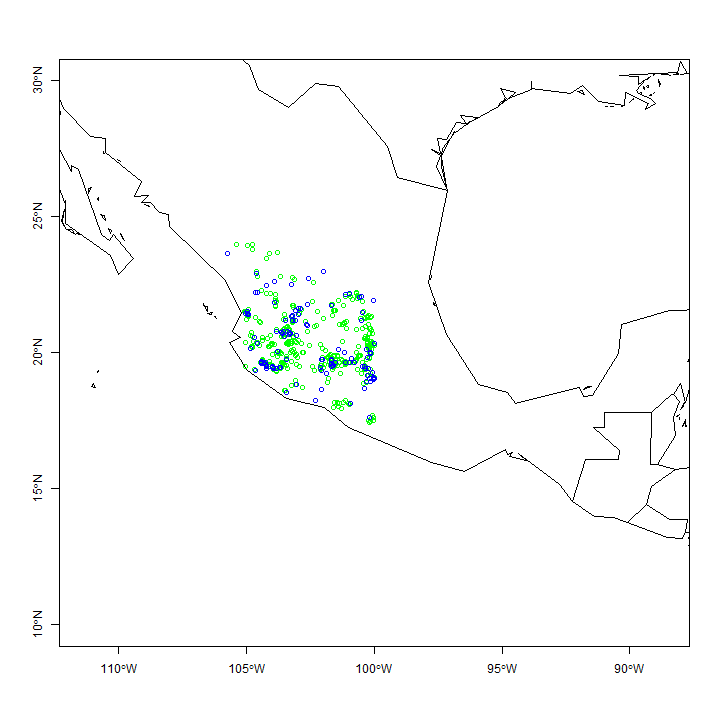

Zinnia spp.
========================================================


```r
library(rgdal)
```

```
## Warning: package 'rgdal' was built under R version 3.1.2
```

```
## Loading required package: sp
```

```
## Warning: package 'sp' was built under R version 3.1.3
```

```
## rgdal: version: 0.9-1, (SVN revision 518)
## Geospatial Data Abstraction Library extensions to R successfully loaded
## Loaded GDAL runtime: GDAL 1.11.1, released 2014/09/24
## Path to GDAL shared files: C:/Users/Viacheslav/Documents/R/win-library/3.1/rgdal/gdal
## GDAL does not use iconv for recoding strings.
## Loaded PROJ.4 runtime: Rel. 4.8.0, 6 March 2012, [PJ_VERSION: 480]
## Path to PROJ.4 shared files: C:/Users/Viacheslav/Documents/R/win-library/3.1/rgdal/proj
```

```r
library(maptools)
```

```
## Warning: package 'maptools' was built under R version 3.1.3
```

```
## Checking rgeos availability: TRUE
```

```r
library(raster)
```

```
## Warning: package 'raster' was built under R version 3.1.2
```

```
## Warning: no function found corresponding to methods exports from 'raster'
## for: 'overlay'
```

```r
library(dismo)
```

```
## Warning: package 'dismo' was built under R version 3.1.2
```

```r
my_factor.as.numeric <- function (f) { as.numeric(levels(f))[f] }
```

Cargando variables


```r
my_path <- 'C:\\Users\\Viacheslav\\Google Drive\\Projects_actual\\geo_BioclimInterpolation_Occidente\\Bioclim_a100\\'

#b <- stack(paste(my_path,"biovars_occidente_a1min.tif",sep=""))
b <- stack(paste(my_path,"biovars_primnev_urb_a100.tif",sep=''))
#r <- raster(paste(my_path,"FP2DAR_2015_Urb_a100.tif",sep=''))
#b <- addLayer(b, r)            

names_b <- c(paste('b',1:19,sep=''))
names(b) <- c(names_b,'bosque')

b
```

```
## class       : RasterStack 
## dimensions  : 2123, 2449, 5199227, 20  (nrow, ncol, ncell, nlayers)
## resolution  : 0.000941889, 0.000941889  (x, y)
## extent      : -104.4682, -102.1615, 19.13104, 21.13067  (xmin, xmax, ymin, ymax)
## coord. ref. : +proj=longlat +datum=WGS84 +no_defs +ellps=WGS84 +towgs84=0,0,0 
## names       : b1, b2, b3, b4, b5, b6, b7, b8, b9, b10, b11, b12, b13, b14, b15, ...
```

```r
summary(b)
```

```
## Warning in .local(object, ...): summary is an estimate based on a sample of 1e+05 cells (1.92% of all cells)
```

```
##                b1       b2       b3       b4       b5        b6       b7
## Min.     4.405223 10.99464 58.37815 134.4862 13.69208 -4.477830 15.94990
## 1st Qu. 17.824911 14.65067 63.42260 189.0822 29.69467  4.890606 22.35612
## Median  19.515569 15.25589 64.33939 228.2093 31.37935  6.979357 23.85172
## 3rd Qu. 21.242250 16.22987 65.56334 253.7362 32.96034  9.055033 25.47759
## Max.    29.105579 18.96518 73.44743 303.1269 40.56422 18.324299 29.00415
## NA's     0.000000  0.00000  0.00000   0.0000  0.00000  0.000000  0.00000
##                b8        b9      b10       b11       b12      b13
## Min.     5.477194  3.813679  6.42856  2.027267  588.0855 129.5716
## 1st Qu. 19.757388 17.105974 20.42074 14.516562  828.4427 199.7891
## Median  21.389783 18.827320 22.01445 16.321217  900.0595 223.3447
## 3rd Qu. 22.867027 20.428066 23.56626 18.344871 1006.5132 250.7576
## Max.    30.168621 29.219573 31.50195 26.695274 1672.0419 425.5543
## NA's     0.000000  0.000000  0.00000  0.000000    0.0000   0.0000
##                b14       b15       b16       b17      b18       b19 bosque
## Min.     0.6238256  83.99683  342.7477  3.858168 142.8396  15.86008      1
## 1st Qu.  3.7232881 104.28354  531.6540 17.131014 286.3264  34.16684      1
## Median   4.9571218 110.70223  585.8991 20.651887 399.6987  39.53193      2
## 3rd Qu.  5.9797554 114.63908  654.5329 23.933998 446.5713  48.58434      2
## Max.    15.0274096 127.30889 1146.3628 52.673078 804.6729 100.23492      5
## NA's     0.0000000   0.00000    0.0000  0.000000   0.0000   0.00000      0
```

```r
mask_reclass_table <- matrix(c(-Inf, Inf, 1), ncol=3, byrow=TRUE)
b_mask <- reclassify(subset(b,1),mask_reclass_table)

#b_mask <- mask(subset(b,1),subset(b,1),updatevalue=1)

plot(b_mask)
```

 

```r
plot(b,c(1:9), nc=3)
```

 

```r
plot(b,c(10:18), nc=3)
```

 

```r
plot(b,c(19:20), nc=3)
```

 

Cargando puntos de presencia


```r
obs_points <- read.csv("Zinnia_para_modelo.csv")

obs_points
```

```
##    Especie         X        Y
## 1   Zinnia -103.9600 20.67000
## 2   Zinnia -103.1908 20.37611
## 3   Zinnia -103.0306 20.40056
## 4   Zinnia -103.3920 20.72000
## 5   Zinnia -103.5690 20.22800
## 6   Zinnia -103.3870 20.58800
## 7   Zinnia -103.8370 20.88300
## 8   Zinnia -103.3900 20.78000
## 9   Zinnia -103.4800 20.47000
## 10  Zinnia -103.5300 20.38000
## 11  Zinnia -103.6650 20.41500
## 12  Zinnia -103.3900 20.78000
## 13  Zinnia -103.3600 20.42000
## 14  Zinnia -103.3989 20.78056
## 15  Zinnia -103.9658 20.67556
## 16  Zinnia -103.9600 20.37200
## 17  Zinnia -103.7900 20.83000
## 18  Zinnia -103.3980 20.78200
## 19  Zinnia -103.9658 20.67556
## 20  Zinnia -103.8408 20.87000
## 21  Zinnia -103.5333 20.38333
## 22  Zinnia -103.4847 20.47167
## 23  Zinnia -103.3989 20.78056
## 24  Zinnia -103.5640 20.72500
## 25  Zinnia -103.5000 20.67000
## 26  Zinnia -103.5640 20.72500
## 27  Zinnia -103.3106 20.43722
## 28  Zinnia -103.7900 20.83000
## 29  Zinnia -103.5690 20.22800
## 30  Zinnia -103.7900 20.83000
## 31  Zinnia -103.3900 20.78000
## 32  Zinnia -103.6220 20.73300
## 33  Zinnia -103.1900 20.37000
## 34  Zinnia -103.6220 20.73300
## 35  Zinnia -103.4400 20.45000
## 36  Zinnia -103.5878 20.73806
## 37  Zinnia -103.5920 20.42000
## 38  Zinnia -103.8400 20.87000
## 39  Zinnia -103.6219 20.73319
## 40  Zinnia -102.9336 20.71472
## 41  Zinnia -103.3845 19.38128
## 42  Zinnia -103.7580 19.94500
## 43  Zinnia -102.7000 19.88000
## 44  Zinnia -103.3770 19.55300
## 45  Zinnia -102.7000 19.88000
## 46  Zinnia -102.7000 19.88000
## 47  Zinnia -103.3850 19.38100
## 48  Zinnia -102.6158 19.82639
## 49  Zinnia -103.6250 19.32944
## 50  Zinnia -103.6200 19.32000
## 51  Zinnia -103.1486 19.20611
## 52  Zinnia -103.3850 19.38100
## 53  Zinnia -104.2580 19.60000
## 54  Zinnia -102.6670 19.96700
## 55  Zinnia -103.2550 19.67300
## 56  Zinnia -103.6250 19.32944
## 57  Zinnia -103.1400 19.20000
## 58  Zinnia -103.5042 19.31000
```

```r
obs_points_xy <- data.frame(cbind(obs_points[,2],obs_points[,3]))
colnames(obs_points_xy) <- c('x','y')

data(wrld_simpl)
plot(wrld_simpl, xlim=c(-110,-90), ylim=c(10,30), axes=TRUE, col="lightyellow")

points(obs_points_xy$x, obs_points_xy$y, col="red", cex=0.75)
```

 

Generando puntos aleatorios (fondo)


```r
set.seed(0)
random_bg <- randomPoints(b_mask, 1000)

plot(wrld_simpl, xlim=c(-110,-90), ylim=c(10,30), axes=TRUE, col="lightyellow")
points(random_bg, cex=0.2, col="blue")
points(obs_points_xy$x, obs_points_xy$y, col="red", cex=0.75)
```

 

```r
pb <- c(rep(1, nrow(obs_points_xy)), rep(0, nrow(random_bg)))

all_points_xy <- data.frame(cbind(pb, rbind(obs_points_xy, random_bg)))
#dim(all_points_xy)
```

Muestreo de variables


```r
all_vals <- extract(b, all_points_xy[,2:3])

all_vals_xy <- data.frame(cbind(all_points_xy, all_vals))
all_vals_xy <- na.omit(all_vals_xy)

pairs(all_vals_xy[all_vals_xy$pb==1,4:23], cex=0.1, fig=TRUE)
```

 

Separación de "trainset" y "testset"


```r
train_test <- sample(nrow(all_vals_xy), round(0.75 * nrow(all_vals_xy)))
traindata <- all_vals_xy[train_test,]
paste('Número de puntos de entrenamiento:',nrow(traindata[traindata$pb==1,]),sep=' ')
```

```
## [1] "Número de puntos de entrenamiento: 45"
```

```r
#traindata[traindata$pb==1,]
testdata <- all_vals_xy[-train_test,]
paste('Número de puntos de control:',nrow(traindata[testdata$pb==1,]),sep=' ')
```

```
## [1] "Número de puntos de control: 41"
```

```r
#testdata[testdata$pb==1,]
```

Modelación


```r
jar <- paste(system.file(package='dismo'), '/java/maxent.jar', sep='')
if (file.exists(jar)) {
  bc_model <- maxent(b, obs_points_xy)
  plot(bc_model)
  
  str(bc_model)
  response(bc_model)
  
  #plot(bc_model, a=4, b=5, p=0.85)

} else {
  print('maxent.jar no disponible')
}
```

```
## Loading required package: rJava
```

```
## Warning: package 'rJava' was built under R version 3.1.2
```

 

```
## Formal class 'MaxEnt' [package "dismo"] with 7 slots
##   ..@ lambdas   : chr [1:94] "b1, 0.0, 4.85774599512418, 28.9828771750132" "b10, 0.0, 6.86592479546865, 31.427082379659" "b11, 0.0, 2.50068712234497, 26.567130724589" "b12, 0.7729202902102525, 594.6385602355, 1645.60159265995" ...
##   ..@ results   : num [1:84, 1] 42 0.902 1.27 500 0.872 ...
##   .. ..- attr(*, "dimnames")=List of 2
##   .. .. ..$ : chr [1:84] "X.Training.samples" "Regularized.training.gain" "Unregularized.training.gain" "Iterations" ...
##   .. .. ..$ : NULL
##   ..@ path      : chr "C:/Users/VIACHE~1/AppData/Local/Temp/R_raster_Viacheslav/maxent/10935549296"
##   ..@ html      : chr "C:/Users/VIACHE~1/AppData/Local/Temp/R_raster_Viacheslav/maxent/10935549296/maxent.html"
##   ..@ presence  :'data.frame':	42 obs. of  20 variables:
##   .. ..$ b1    : num [1:42] 20.7 19.2 19.9 19.4 20.3 ...
##   .. ..$ b2    : num [1:42] 16.4 15.2 15.7 16.1 15.4 ...
##   .. ..$ b3    : num [1:42] 65.2 62.5 63.4 62.5 63.7 ...
##   .. ..$ b4    : num [1:42] 233 252 254 254 222 ...
##   .. ..$ b5    : num [1:42] 33 31 31.8 32.3 32.2 ...
##   .. ..$ b6    : num [1:42] 7.82 6.77 7.04 6.51 8 ...
##   .. ..$ b7    : num [1:42] 25.2 24.3 24.7 25.8 24.2 ...
##   .. ..$ b8    : num [1:42] 22.7 21.4 22.1 21.5 21.7 ...
##   .. ..$ b9    : num [1:42] 19.8 18.7 19.4 18.8 19.5 ...
##   .. ..$ b10   : num [1:42] 23 21.9 22.6 22.1 22.7 ...
##   .. ..$ b11   : num [1:42] 17.4 15.8 16.5 15.9 17.2 ...
##   .. ..$ b12   : num [1:42] 949 829 839 960 616 ...
##   .. ..$ b13   : num [1:42] 241 213 220 257 146 ...
##   .. ..$ b14   : num [1:42] 8.58 5.04 3.18 5.06 2.91 ...
##   .. ..$ b15   : num [1:42] 111 113 116 116 110 ...
##   .. ..$ b16   : num [1:42] 619 547 566 654 385 ...
##   .. ..$ b17   : num [1:42] 28.3 19.5 17 21.3 10.9 ...
##   .. ..$ b18   : num [1:42] 449 395 198 460 297 ...
##   .. ..$ b19   : num [1:42] 49.4 32.1 31.4 38.3 22.3 ...
##   .. ..$ bosque: num [1:42] 2 1 2 5 5 5 5 2 2 2 ...
##   ..@ absence   :'data.frame':	10000 obs. of  20 variables:
##   .. ..$ b1    : num [1:10000] 17.8 17.9 16 18.1 20 ...
##   .. ..$ b2    : num [1:10000] 17.4 15 13.5 14.3 16.3 ...
##   .. ..$ b3    : num [1:10000] 64.2 64.1 64.7 66.1 62.9 ...
##   .. ..$ b4    : num [1:10000] 276 217 185 177 269 ...
##   .. ..$ b5    : num [1:10000] 30.7 29 26.1 28.9 32.6 ...
##   .. ..$ b6    : num [1:10000] 3.65 5.52 5.19 7.24 6.62 ...
##   .. ..$ b7    : num [1:10000] 27 23.5 20.9 21.7 25.9 ...
##   .. ..$ b8    : num [1:10000] 20.3 19.3 17.3 19.1 22.2 ...
##   .. ..$ b9    : num [1:10000] 17.2 17.1 15.1 17.3 19.3 ...
##   .. ..$ b10   : num [1:10000] 20.9 20.2 18 20.1 22.9 ...
##   .. ..$ b11   : num [1:10000] 14.2 14.9 13.4 15.8 16.4 ...
##   .. ..$ b12   : num [1:10000] 781 1159 988 1020 879 ...
##   .. ..$ b13   : num [1:10000] 210 298 202 240 223 ...
##   .. ..$ b14   : num [1:10000] 4 6.97 6.83 4.2 5.97 ...
##   .. ..$ b15   : num [1:10000] 115 110 97 101 111 ...
##   .. ..$ b16   : num [1:10000] 525 742 576 611 579 ...
##   .. ..$ b17   : num [1:10000] 19 23.1 21.1 26.6 24.1 ...
##   .. ..$ b18   : num [1:10000] 369 527 414 446 209 ...
##   .. ..$ b19   : num [1:10000] 32.4 48.6 50.7 62.6 31.5 ...
##   .. ..$ bosque: num [1:10000] 2 1 1 1 2 3 2 1 1 1 ...
##   ..@ hasabsence: logi TRUE
```

 

```r
#pb <- predict(b, bc_model, progress='window')
#pb
#plot(pb, main='Modelo MAXENT')
```

Evaluación


```r
e <- evaluate(testdata[testdata$pb==1,], testdata[testdata$pb==0,], bc_model)
e
```

```
## class          : ModelEvaluation 
## n presences    : 13 
## n absences     : 251 
## AUC            : 0.8648483 
## cor            : 0.3901094 
## max TPR+TNR at : 0.3853127
```

```r
#str(e)

par(mfrow=c(1, 3))

plot(e, 'ROC')
density(e)
boxplot(e, col=c('lightblue','coral'), notch=TRUE)
```

```
## Warning in bxp(structure(list(stats = structure(c(0.00550084467977285,
## 0.0938112437725067, : some notches went outside hinges ('box'): maybe set
## notch=FALSE
```

 

```r
test_presence <- extract(pb,testdata[testdata$pb==1,2:3])
```

```
## Error in (function (classes, fdef, mtable) : unable to find an inherited method for function 'extract' for signature '"numeric", "data.frame"'
```

```r
test_absence <- extract(pb,testdata[testdata$pb==0,2:3])
```

```
## Error in (function (classes, fdef, mtable) : unable to find an inherited method for function 'extract' for signature '"numeric", "data.frame"'
```

```r
test_pb = c(rep('presence', length(test_presence)), rep('absence', length(test_absence)))
```

```
## Error in eval(expr, envir, enclos): objeto 'test_presence' no encontrado
```

```r
test_points <- data.frame(cbind(test_pb, c(test_presence,test_absence)))
```

```
## Error in cbind(test_pb, c(test_presence, test_absence)): objeto 'test_pb' no encontrado
```

```r
colnames(test_points) <- c('obs','prob')
```

```
## Error in colnames(test_points) <- c("obs", "prob"): objeto 'test_points' no encontrado
```

```r
test_points$obs <- as.factor(test_points$obs)
```

```
## Error in as.factor(test_points$obs): error in evaluating the argument 'x' in selecting a method for function 'as.factor': Error: objeto 'test_points' no encontrado
```

```r
test_points$prob <- my_factor.as.numeric(test_points$prob)
```

```
## Error in levels(f): error in evaluating the argument 'x' in selecting a method for function 'levels': Error: objeto 'test_points' no encontrado
```

```r
boxplot(prob~obs, data=test_points, col=c('lightblue','coral'), notch=TRUE)
```

```
## Error in eval(expr, envir, enclos): objeto 'test_points' no encontrado
```

Guardando raster


```r
if (require(rgdal)) {
  rf <- writeRaster(pb, filename="Zinnia_maxent_superficie_a100.tif", format="GTiff", overwrite=TRUE)
}
```

```
## Error in (function (classes, fdef, mtable) : unable to find an inherited method for function 'writeRaster' for signature '"numeric", "character"'
```

