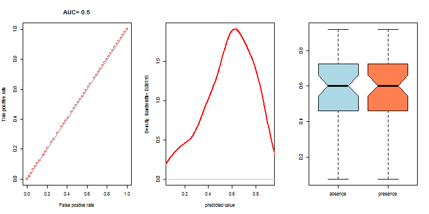
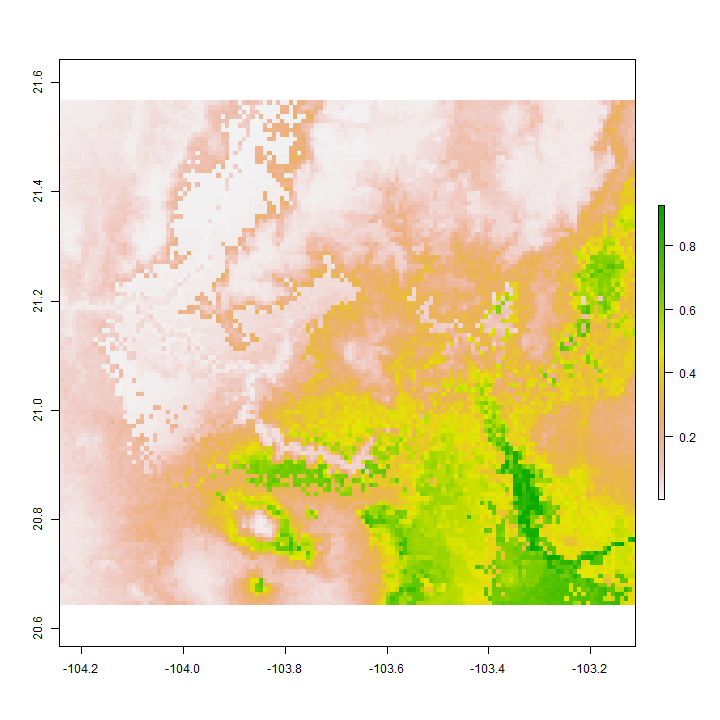

SDM
========================================================


```r
library(rgdal)
```

```
## Warning: package 'rgdal' was built under R version 3.1.2
```

```
## Loading required package: sp
```

```
## Warning: package 'sp' was built under R version 3.1.3
```

```
## rgdal: version: 0.9-1, (SVN revision 518)
## Geospatial Data Abstraction Library extensions to R successfully loaded
## Loaded GDAL runtime: GDAL 1.11.1, released 2014/09/24
## Path to GDAL shared files: C:/Users/Viacheslav/Documents/R/win-library/3.1/rgdal/gdal
## GDAL does not use iconv for recoding strings.
## Loaded PROJ.4 runtime: Rel. 4.8.0, 6 March 2012, [PJ_VERSION: 480]
## Path to PROJ.4 shared files: C:/Users/Viacheslav/Documents/R/win-library/3.1/rgdal/proj
```

```r
library(maptools)
```

```
## Warning: package 'maptools' was built under R version 3.1.3
```

```
## Checking rgeos availability: TRUE
```

```r
library(raster)
```

```
## Warning: package 'raster' was built under R version 3.1.2
```

```
## Warning: no function found corresponding to methods exports from 'raster'
## for: 'overlay'
```

```r
library(dismo)
```

```
## Warning: package 'dismo' was built under R version 3.1.2
```

```r
library(kernlab)
```

```
## Warning: package 'kernlab' was built under R version 3.1.3
```

```
## 
## Attaching package: 'kernlab'
## 
## The following objects are masked from 'package:raster':
## 
##     buffer, rotated
```

```r
my_factor.as.numeric <- function (f) { as.numeric(levels(f))[f] }
```

Definición de veriables


```r
my_specie <- 'Zinnia spp.'
my_specie_file <- 'Zinnia_spp'
my_method <- 'SVM'
my_path <- 'C:\\Users\\Viacheslav\\Google Drive\\Projects_actual\\geo_BioclimInterpolation_Occidente\\Bioclim_a100\\'

b <- stack(paste(my_path,"biovars_primnev_modis_a300.tif",sep=""))
b1 <- stack(paste(my_path,"biovars_primavera_modis_a100.tif",sep=""))
b2 <- stack(paste(my_path,"biovars_nevado_modis_a100.tif",sep=""))

#names(b) <- c(paste('b',1:19,sep=""))
names(b) <- c(c(paste('b',1:19,sep='')),'bosque')
names(b1) <- c(c(paste('b',1:19,sep='')),'bosque')
names(b2) <- c(c(paste('b',1:19,sep='')),'bosque')

b <- dropLayer(b,18)
b1 <- dropLayer(b1,18)
b2 <- dropLayer(b2,18)

b
```

```
## class       : RasterStack 
## dimensions  : 710, 818, 580780, 19  (nrow, ncol, ncell, nlayers)
## resolution  : 0.002826, 0.002826  (x, y)
## extent      : -104.4701, -102.1584, 19.1279, 21.13436  (xmin, xmax, ymin, ymax)
## coord. ref. : +proj=longlat +datum=WGS84 +no_defs +ellps=WGS84 +towgs84=0,0,0 
## names       :            b1,            b2,            b3,            b4,            b5,            b6,            b7,            b8,            b9,           b10,           b11,           b12,           b13,           b14,           b15, ... 
## min values  :     4.4052229,    10.9750853,    58.2798920,   134.2431641,    13.6920795,    -4.4778304,    15.8833466,     5.4771938,     3.8136790,     6.4285603,     2.0272667,   582.9362793,   126.9471054,     0.5586119,    83.5632095, ... 
## max values  :      29.09713,      18.95131,      73.55495,     304.98874,      40.61411,      18.31081,      29.00008,      30.18755,      29.25659,      31.52076,      26.68643,    1673.64124,     427.13290,      15.02741,     127.91476, ...
```

```r
summary(b)
```

```
## Warning in .local(object, ...): summary is an estimate based on a sample of 1e+05 cells (17.22% of all cells)
```

```
##                b1       b2       b3       b4       b5        b6       b7
## Min.     5.010379 10.99543 58.27989 135.9685 14.17943 -3.800337 15.90026
## 1st Qu. 17.821900 14.65207 63.42052 189.0876 29.70666  4.885640 22.35699
## Median  19.508052 15.25959 64.33964 228.3731 31.38538  6.979039 23.85974
## 3rd Qu. 21.243605 16.23388 65.55941 253.8704 32.96555  9.051965 25.48901
## Max.    29.097128 18.95131 73.48251 304.9503 40.57313 18.310806 29.00008
## NA's     0.000000  0.00000  0.00000   0.0000  0.00000  0.000000  0.00000
##                b8        b9       b10      b11       b12      b13
## Min.     6.041408  4.409182  6.984944  2.70340  586.7786 129.5736
## 1st Qu. 19.754200 17.099059 20.419888 14.51491  828.2810 199.8797
## Median  21.391521 18.822578 22.013971 16.31789  899.8633 223.3840
## 3rd Qu. 22.870901 20.432270 23.566324 18.35339 1006.1586 250.7695
## Max.    30.136705 29.216553 31.485538 26.68643 1671.4352 424.9762
## NA's     0.000000  0.000000  0.000000  0.00000    0.0000   0.0000
##                b14       b15       b16       b17       b19 bosque
## Min.     0.5637149  83.69952  344.1025  3.845378  15.92943  -1999
## 1st Qu.  3.7251334 104.31909  531.6743 17.139454  34.15264   3422
## Median   4.9581990 110.73201  586.1349 20.646889  39.51943   4498
## 3rd Qu.  5.9768168 114.66469  654.5441 23.919662  48.54155   6097
## Max.    14.9223719 127.86947 1146.4808 52.440823 101.12070  10000
## NA's     0.0000000   0.00000    0.0000  0.000000   0.00000      0
```

```r
mask_reclass_table <- matrix(c(-Inf, Inf, 1), ncol=3, byrow=TRUE)
b_mask <- reclassify(subset(b,1),mask_reclass_table)

#b_mask <- mask(subset(b,1),subset(b,1),updatevalue=1)

plot(b,c(1:9), nc=3)
```

 

```r
plot(b,c(10:18), nc=3)
```

 


```r
par(mfrow=c(1, 3))
plot(b,c(19))
#plot(b,c(20))
plot(b_mask)
```

 

Cargando puntos de presencia


```r
obs_points <- read.csv("Zinnia_para_modelo.csv")

obs_points
```

```
##    Especie         X        Y
## 1   Zinnia -103.9600 20.67000
## 2   Zinnia -103.1908 20.37611
## 3   Zinnia -103.0306 20.40056
## 4   Zinnia -103.3920 20.72000
## 5   Zinnia -103.5690 20.22800
## 6   Zinnia -103.3870 20.58800
## 7   Zinnia -103.8370 20.88300
## 8   Zinnia -103.3900 20.78000
## 9   Zinnia -103.4800 20.47000
## 10  Zinnia -103.5300 20.38000
## 11  Zinnia -103.6650 20.41500
## 12  Zinnia -103.3900 20.78000
## 13  Zinnia -103.3600 20.42000
## 14  Zinnia -103.3989 20.78056
## 15  Zinnia -103.9658 20.67556
## 16  Zinnia -103.9600 20.37200
## 17  Zinnia -103.7900 20.83000
## 18  Zinnia -103.3980 20.78200
## 19  Zinnia -103.9658 20.67556
## 20  Zinnia -103.8408 20.87000
## 21  Zinnia -103.5333 20.38333
## 22  Zinnia -103.4847 20.47167
## 23  Zinnia -103.3989 20.78056
## 24  Zinnia -103.5640 20.72500
## 25  Zinnia -103.5000 20.67000
## 26  Zinnia -103.5640 20.72500
## 27  Zinnia -103.3106 20.43722
## 28  Zinnia -103.7900 20.83000
## 29  Zinnia -103.5690 20.22800
## 30  Zinnia -103.7900 20.83000
## 31  Zinnia -103.3900 20.78000
## 32  Zinnia -103.6220 20.73300
## 33  Zinnia -103.1900 20.37000
## 34  Zinnia -103.6220 20.73300
## 35  Zinnia -103.4400 20.45000
## 36  Zinnia -103.5878 20.73806
## 37  Zinnia -103.5920 20.42000
## 38  Zinnia -103.8400 20.87000
## 39  Zinnia -103.6219 20.73319
## 40  Zinnia -102.9336 20.71472
## 41  Zinnia -103.3845 19.38128
## 42  Zinnia -103.7580 19.94500
## 43  Zinnia -102.7000 19.88000
## 44  Zinnia -103.3770 19.55300
## 45  Zinnia -102.7000 19.88000
## 46  Zinnia -102.7000 19.88000
## 47  Zinnia -103.3850 19.38100
## 48  Zinnia -102.6158 19.82639
## 49  Zinnia -103.6250 19.32944
## 50  Zinnia -103.6200 19.32000
## 51  Zinnia -103.1486 19.20611
## 52  Zinnia -103.3850 19.38100
## 53  Zinnia -104.2580 19.60000
## 54  Zinnia -102.6670 19.96700
## 55  Zinnia -103.2550 19.67300
## 56  Zinnia -103.6250 19.32944
## 57  Zinnia -103.1400 19.20000
## 58  Zinnia -103.5042 19.31000
```

```r
obs_points_xy <- data.frame(cbind(obs_points[,2],obs_points[,3]))
colnames(obs_points_xy) <- c('x','y')

data(wrld_simpl)
plot(wrld_simpl, xlim=c(-110,-90), ylim=c(10,30), axes=TRUE, col="lightyellow")

points(obs_points_xy$x, obs_points_xy$y, col="red", cex=0.75)
```

 

Generando puntos aleatorios (fondo)


```r
set.seed(0)
random_bg <- randomPoints(b_mask, 1000)

plot(wrld_simpl, xlim=c(-110,-90), ylim=c(10,30), axes=TRUE, col="lightyellow")
points(random_bg, cex=0.2, col="blue")
points(obs_points_xy$x, obs_points_xy$y, col="red", cex=0.75)
```

 

```r
pb <- c(rep(1, nrow(obs_points_xy)), rep(0, nrow(random_bg)))

all_points_xy <- data.frame(cbind(pb, rbind(obs_points_xy, random_bg)))
#dim(all_points_xy)
```

Muestreo de variables


```r
all_vals <- extract(b, all_points_xy[,2:3])

all_vals_xy <- data.frame(cbind(all_points_xy, all_vals))
all_vals_xy <- na.omit(all_vals_xy)

pairs(all_vals_xy[all_vals_xy$pb==1,4:22], cex=0.1, fig=TRUE)
```

 

Separación de "trainset" y "testset"


```r
train_test <- sample(nrow(all_vals_xy), round(0.75 * nrow(all_vals_xy)))
traindata <- all_vals_xy[train_test,]
paste('Número de puntos de entrenamiento:',nrow(traindata[traindata$pb==1,]),sep=' ')
```

```
## [1] "Número de puntos de entrenamiento: 45"
```

```r
#traindata[traindata$pb==1,]
testdata <- all_vals_xy[-train_test,]
paste('Número de puntos de control:',nrow(traindata[testdata$pb==1,]),sep=' ')
```

```
## [1] "Número de puntos de control: 41"
```

```r
#testdata[testdata$pb==1,]
```

Modelación


```r
#jar <- paste(system.file(package='dismo'), '/java/maxent.jar', sep='')
#if (file.exists(jar)) {
  #bc_model <- maxent(b, obs_points_xy, factors='bosque')
  bc_model <- ksvm(pb ~ b1+b2+b3+b4+b5+b6+b7+b8+b9+b10+b11+b12+b13+b14+b15+b16+b17+b19+bosque, 
                   data=all_vals_xy)
  #bc_model <- maxent(b, obs_points_xy)  
  
  str(bc_model)  
```

```
## Formal class 'ksvm' [package "kernlab"] with 24 slots
##   ..@ param     :List of 2
##   .. ..$ epsilon: num 0.1
##   .. ..$ C      : num 1
##   ..@ scaling   :List of 3
##   .. ..$ scaled : logi [1:19] TRUE TRUE TRUE TRUE TRUE TRUE ...
##   .. ..$ x.scale:List of 2
##   .. .. ..$ scaled:center: Named num [1:19] 19.7 15.4 64.8 221.2 31.3 ...
##   .. .. .. ..- attr(*, "names")= chr [1:19] "b1" "b2" "b3" "b4" ...
##   .. .. ..$ scaled:scale : Named num [1:19] 3.1 1.14 2.09 37.75 3.01 ...
##   .. .. .. ..- attr(*, "names")= chr [1:19] "b1" "b2" "b3" "b4" ...
##   .. ..$ y.scale:List of 2
##   .. .. ..$ scaled:center: num 0.0548
##   .. .. ..$ scaled:scale : num 0.228
##   ..@ coef      : num [1:168] 1 1 1 1 1 1 1 1 1 1 ...
##   ..@ alphaindex: int [1:168] 1 2 3 4 5 6 7 8 9 10 ...
##   ..@ b         : num 0.17
##   ..@ obj       : num -242
##   ..@ SVindex   : int [1:168] 1 2 3 4 5 6 7 8 9 10 ...
##   ..@ nSV       : int 168
##   ..@ prior     :List of 1
##   .. ..$ : NULL
##   ..@ prob.model:List of 1
##   .. ..$ : NULL
##   ..@ alpha     : num [1:168] 1 1 1 1 1 1 1 1 1 1 ...
##   ..@ type      : chr "eps-svr"
##   ..@ kernelf   :Formal class 'rbfkernel' [package "kernlab"] with 2 slots
##   .. .. ..@ .Data:function (x, y = NULL)  
##   .. .. ..@ kpar :List of 1
##   .. .. .. ..$ sigma: num 0.0658
##   ..@ kpar      : list()
##   ..@ xmatrix   : num [1:168, 1:19] 0.34 -0.102 0.101 -0.119 0.202 ...
##   .. ..- attr(*, "dimnames")=List of 2
##   .. .. ..$ : chr [1:168] "1" "2" "3" "4" ...
##   .. .. ..$ : chr [1:19] "b1" "b2" "b3" "b4" ...
##   ..@ ymatrix   : num [1:1058] 4.15 4.15 4.15 4.15 4.15 ...
##   ..@ fitted    : num [1:1058, 1] 0.0642 -0.1221 -0.1548 -0.1468 0.0271 ...
##   ..@ lev       : num [1:2] -0.241 4.15
##   ..@ nclass    : int 2
##   ..@ error     : num 0.989
##   ..@ cross     : num -1
##   ..@ n.action  :function (object, ...)  
##   ..@ terms     :Classes 'terms', 'formula' length 3 pb ~ b1 + b2 + b3 + b4 + b5 + b6 + b7 + b8 + b9 + b10 + b11 + b12 +      b13 + b14 + b15 + b16 + b17 + b19 + bosque
##   .. .. ..- attr(*, "variables")= language list(pb, b1, b2, b3, b4, b5, b6, b7, b8, b9, b10, b11, b12, b13, b14,      b15, b16, b17, b19, bosque)
##   .. .. ..- attr(*, "factors")= int [1:20, 1:19] 0 1 0 0 0 0 0 0 0 0 ...
##   .. .. .. ..- attr(*, "dimnames")=List of 2
##   .. .. .. .. ..$ : chr [1:20] "pb" "b1" "b2" "b3" ...
##   .. .. .. .. ..$ : chr [1:19] "b1" "b2" "b3" "b4" ...
##   .. .. ..- attr(*, "term.labels")= chr [1:19] "b1" "b2" "b3" "b4" ...
##   .. .. ..- attr(*, "order")= int [1:19] 1 1 1 1 1 1 1 1 1 1 ...
##   .. .. ..- attr(*, "intercept")= num 0
##   .. .. ..- attr(*, "response")= int 1
##   .. .. ..- attr(*, ".Environment")=<environment: R_GlobalEnv> 
##   .. .. ..- attr(*, "predvars")= language list(pb, b1, b2, b3, b4, b5, b6, b7, b8, b9, b10, b11, b12, b13, b14,      b15, b16, b17, b19, bosque)
##   .. .. ..- attr(*, "dataClasses")= Named chr [1:20] "numeric" "numeric" "numeric" "numeric" ...
##   .. .. .. ..- attr(*, "names")= chr [1:20] "pb" "b1" "b2" "b3" ...
##   ..@ kcall     : language .local(x = x, data = ..1)
```

```r
  plot(bc_model)
```

```
## Error in .local(x, ...): Only plots of classification ksvm objects supported
```

```r
  response(bc_model)
```

```
## Error in x$terms: $ operator not defined for this S4 class
```

```r
#} else {
#  print('maxent.jar no disponible')
#}
```

Predicción


```r
  pb1 <- predict(b1, bc_model, progress='window')
```

```
## Loading required package: tcltk
```

```r
  pb1
```

```
## class       : RasterLayer 
## dimensions  : 278, 253, 70334  (nrow, ncol, ncell)
## resolution  : 0.002413, 0.002413  (x, y)
## extent      : -103.8431, -103.2326, 20.25888, 20.92969  (xmin, xmax, ymin, ymax)
## coord. ref. : +proj=longlat +datum=WGS84 +no_defs +ellps=WGS84 +towgs84=0,0,0 
## data source : in memory
## names       : layer 
## values      : -0.0171155, 0.05988594  (min, max)
```

```r
  plot(pb1, main='Modelo SVM Primavera')
```

 

```r
  pb2 <- predict(b2, bc_model, progress='window')
  pb2
```

```
## class       : RasterLayer 
## dimensions  : 223, 203, 45269  (nrow, ncol, ncell)
## resolution  : 0.002413, 0.002413  (x, y)
## extent      : -103.8647, -103.3749, 19.32139, 19.85949  (xmin, xmax, ymin, ymax)
## coord. ref. : +proj=longlat +datum=WGS84 +no_defs +ellps=WGS84 +towgs84=0,0,0 
## data source : in memory
## names       : layer 
## values      : -0.03055167, 0.0632311  (min, max)
```

```r
  plot(pb2, main=paste('Modelo SVM Nevado:',my_specie,sep=' '))
```

 


Evaluación


```r
e <- evaluate(testdata[testdata$pb==1,], testdata[testdata$pb==0,], bc_model)
e
```

```
## class          : ModelEvaluation 
## n presences    : 13 
## n absences     : 251 
## AUC            : 0.9644499 
## cor            : 0.4046345 
## max TPR+TNR at : 0.02388579
```

```r
#str(e)

par(mfrow=c(1, 3))

plot(e, 'ROC')
density(e)
boxplot(e, col=c('lightblue','coral'), notch=TRUE)
```

```
## Warning in bxp(structure(list(stats = structure(c(-0.0109565318518902,
## 0.00681686548036416, : some notches went outside hinges ('box'): maybe set
## notch=FALSE
```

 

Evaluación parte 2


```r
test_presence1 <- extract(pb1,testdata[testdata$pb==1,2:3])
test_absence1 <- extract(pb1,testdata[testdata$pb==0,2:3])
test_presence2 <- extract(pb2,testdata[testdata$pb==1,2:3])
test_absence2 <- extract(pb2,testdata[testdata$pb==0,2:3])

test_pb1 = c(rep('presence', length(test_presence1)), rep('absence', length(test_absence1)))
test_points1 <- data.frame(cbind(test_pb1, c(test_presence1,test_absence1)))
colnames(test_points1) <- c('obs','prob')
test_points1$obs <- as.factor(test_points1$obs)
test_points1$prob <- my_factor.as.numeric(test_points1$prob)

test_pb2 = c(rep('presence', length(test_presence2)), rep('absence', length(test_absence2)))
test_points2 <- data.frame(cbind(test_pb2, c(test_presence2,test_absence2)))
colnames(test_points2) <- c('obs','prob')
test_points2$obs <- as.factor(test_points2$obs)
test_points2$prob <- my_factor.as.numeric(test_points2$prob)

par(mfrow=c(1, 3))
boxplot(prob~obs, data=test_points1, col=c('lightblue','coral'), notch=TRUE, main='Primavera')
```

```
## Warning in bxp(structure(list(stats = structure(c(0.0187418309849723,
## 0.0204438490615266, : some notches went outside hinges ('box'): maybe set
## notch=FALSE
```

```r
boxplot(prob~obs, data=test_points2, col=c('lightblue','coral'), notch=TRUE, main='Nevado')
```

```
## Warning in bxp(structure(list(stats = structure(c(-0.0157852570268089,
## -0.00928038684787474, : some notches went outside hinges ('box'): maybe
## set notch=FALSE
```

 

Guardando raster


```r
if (require(rgdal)) {
  rf1 <- writeRaster(pb1, 
                     filename=paste(my_specie_file,'_primavera_',my_method,'_superficie_a100.tif',sep=''), 
                     format='GTiff', overwrite=TRUE)
  rf2 <- writeRaster(pb2, 
                     filename=paste(my_specie_file,'_nevado_',my_method,'_superficie_a100.tif',sep=''), 
                     format='GTiff', overwrite=TRUE)
}
```

