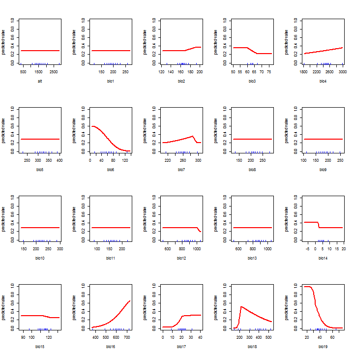

Zinnia spp.
========================================================


```r
library(rgdal)
```

```
## Warning: package 'rgdal' was built under R version 3.1.2
```

```
## Loading required package: sp
```

```
## Warning: package 'sp' was built under R version 3.1.3
```

```
## rgdal: version: 0.9-1, (SVN revision 518)
## Geospatial Data Abstraction Library extensions to R successfully loaded
## Loaded GDAL runtime: GDAL 1.11.1, released 2014/09/24
## Path to GDAL shared files: C:/Users/Viacheslav/Documents/R/win-library/3.1/rgdal/gdal
## GDAL does not use iconv for recoding strings.
## Loaded PROJ.4 runtime: Rel. 4.8.0, 6 March 2012, [PJ_VERSION: 480]
## Path to PROJ.4 shared files: C:/Users/Viacheslav/Documents/R/win-library/3.1/rgdal/proj
```

```r
library(maptools)
```

```
## Warning: package 'maptools' was built under R version 3.1.3
```

```
## Checking rgeos availability: TRUE
```

```r
library(raster)
```

```
## Warning: package 'raster' was built under R version 3.1.2
```

```
## Warning: no function found corresponding to methods exports from 'raster'
## for: 'overlay'
```

```r
library(dismo)
```

```
## Warning: package 'dismo' was built under R version 3.1.2
```

```r
my_factor.as.numeric <- function (f) { as.numeric(levels(f))[f] }
```

Cargando variables


```r
my_path <- 'C:\\Users\\Viacheslav\\Google Drive\\Projects_actual\\geo_BioclimInterpolation_Occidente\\Bioclim_a100\\'

b <- stack(paste(my_path,"biovars_occidente_a1min.tif",sep=""))

names(b) <- c(paste('b',1:19,sep=""))
b
```

```
## class       : RasterStack 
## dimensions  : 368, 371, 136528, 19  (nrow, ncol, ncell, nlayers)
## resolution  : 0.016667, 0.016666  (x, y)
## extent      : -107.0093, -100.8258, 16.95012, 23.08321  (xmin, xmax, ymin, ymax)
## coord. ref. : +proj=longlat +datum=WGS84 +no_defs +ellps=WGS84 +towgs84=0,0,0 
## names       :         b1,         b2,         b3,         b4,         b5,         b6,         b7,         b8,         b9,        b10,        b11,        b12,        b13,        b14,        b15, ... 
## min values  :   68.28463,   95.66667,   55.14500,  541.22832,  155.91046,  -17.47172,  136.39751,   77.53442,   61.68777,   86.45466,   47.45741,  203.68608,   33.75415,    0.00000,   59.79518, ... 
## max values  :  295.11619,  197.95850,   85.32609, 3822.04370,  412.00000,  209.64537,  306.49799,  303.00000,  297.38472,  318.54283,  273.13150, 2166.63542,  695.58090,   13.29448,  142.37447, ...
```

```r
summary(b)
```

```
## Warning in .local(object, ...): summary is an estimate based on a sample of 1e+05 cells (73.25% of all cells)
```

```
##                  b1          b2          b3         b4         b5
## Min.       68.28463    95.66667    55.24477   541.2283   155.9105
## 1st Qu.   171.13087   140.90539    63.06938  1885.8542   293.0504
## Median    192.60037   153.56368    64.67043  2512.5196   312.0628
## 3rd Qu.   235.81112   163.79876    66.90337  2794.0579   332.2584
## Max.      294.81231   197.72508    85.32609  3822.0437   412.0000
## NA's    56719.00000 56719.00000 56719.00000 56719.0000 56719.0000
##                  b6         b7          b8          b9         b10
## Min.      -17.47172   136.3975    77.53442    61.68777    86.45466
## 1st Qu.    39.79307   211.8076   192.27293   162.02091   200.37406
## Median     67.00000   238.0803   213.06767   186.33253   220.21437
## 3rd Qu.   126.26934   256.2619   250.27641   227.94643   257.93849
## Max.      209.64537   306.2490   302.73785   297.38472   318.54283
## NA's    56719.00000 56719.0000 56719.00000 56719.00000 56719.00000
##                 b11        b12         b13          b14         b15
## Min.       47.45741   203.6861    33.75415     0.000000    59.83207
## 1st Qu.   134.86756   662.5133   158.27558     2.747814   102.57256
## Median    158.81283   851.5611   212.69362     4.000000   109.15755
## 3rd Qu.   208.37654  1062.5433   263.09428     6.000000   114.73442
## Max.      273.08877  2166.6354   695.58090    13.294484   142.37447
## NA's    56719.00000 56719.0000 56719.00000 56719.000000 56719.00000
##                 b16         b17         b18         b19
## Min.       96.25883     3.00000    80.96214    14.00000
## 1st Qu.   421.01251    14.00000   198.56174    32.48716
## Median    558.72337    19.55534   292.02145    40.00000
## 3rd Qu.   700.73574    24.51723   435.65966    50.76837
## Max.     1763.09193    57.91881  1685.13916   187.49809
## NA's    56719.00000 56719.00000 56719.00000 56719.00000
```

```r
mask_reclass_table <- matrix(c(-Inf, Inf, 1), ncol=3, byrow=TRUE)
b_mask <- reclassify(subset(b,1),mask_reclass_table)

#b_mask <- mask(subset(b,1),subset(b,1),updatevalue=1)

plot(b_mask)
```

 

```r
plot(b,c(1:9), nc=3)
```

 

```r
plot(b,c(10:18), nc=3)
```

 

```r
plot(b,c(19), nc=3)
```

 

Cargando puntos de presencia


```r
obs_points <- read.csv("Zinnia_para_modelo.csv")

obs_points
```

```
##    Especie         X        Y
## 1   Zinnia -103.9600 20.67000
## 2   Zinnia -103.1908 20.37611
## 3   Zinnia -103.0306 20.40056
## 4   Zinnia -103.3920 20.72000
## 5   Zinnia -103.5690 20.22800
## 6   Zinnia -103.3870 20.58800
## 7   Zinnia -103.8370 20.88300
## 8   Zinnia -103.3900 20.78000
## 9   Zinnia -103.4800 20.47000
## 10  Zinnia -103.5300 20.38000
## 11  Zinnia -103.6650 20.41500
## 12  Zinnia -103.3900 20.78000
## 13  Zinnia -103.3600 20.42000
## 14  Zinnia -103.3989 20.78056
## 15  Zinnia -103.9658 20.67556
## 16  Zinnia -103.9600 20.37200
## 17  Zinnia -103.7900 20.83000
## 18  Zinnia -103.3980 20.78200
## 19  Zinnia -103.9658 20.67556
## 20  Zinnia -103.8408 20.87000
## 21  Zinnia -103.5333 20.38333
## 22  Zinnia -103.4847 20.47167
## 23  Zinnia -103.3989 20.78056
## 24  Zinnia -103.5640 20.72500
## 25  Zinnia -103.5000 20.67000
## 26  Zinnia -103.5640 20.72500
## 27  Zinnia -103.3106 20.43722
## 28  Zinnia -103.7900 20.83000
## 29  Zinnia -103.5690 20.22800
## 30  Zinnia -103.7900 20.83000
## 31  Zinnia -103.3900 20.78000
## 32  Zinnia -103.6220 20.73300
## 33  Zinnia -103.1900 20.37000
## 34  Zinnia -103.6220 20.73300
## 35  Zinnia -103.4400 20.45000
## 36  Zinnia -103.5878 20.73806
## 37  Zinnia -103.5920 20.42000
## 38  Zinnia -103.8400 20.87000
## 39  Zinnia -103.6219 20.73319
## 40  Zinnia -102.9336 20.71472
## 41  Zinnia -103.3845 19.38128
## 42  Zinnia -103.7580 19.94500
## 43  Zinnia -102.7000 19.88000
## 44  Zinnia -103.3770 19.55300
## 45  Zinnia -102.7000 19.88000
## 46  Zinnia -102.7000 19.88000
## 47  Zinnia -103.3850 19.38100
## 48  Zinnia -102.6158 19.82639
## 49  Zinnia -103.6250 19.32944
## 50  Zinnia -103.6200 19.32000
## 51  Zinnia -103.1486 19.20611
## 52  Zinnia -103.3850 19.38100
## 53  Zinnia -104.2580 19.60000
## 54  Zinnia -102.6670 19.96700
## 55  Zinnia -103.2550 19.67300
## 56  Zinnia -103.6250 19.32944
## 57  Zinnia -103.1400 19.20000
## 58  Zinnia -103.5042 19.31000
```

```r
obs_points_xy <- data.frame(cbind(obs_points[,2],obs_points[,3]))
colnames(obs_points_xy) <- c('x','y')

data(wrld_simpl)
plot(wrld_simpl, xlim=c(-110,-90), ylim=c(10,30), axes=TRUE, col="lightyellow")

points(obs_points_xy$x, obs_points_xy$y, col="red", cex=0.75)
```

 

Generando puntos aleatorios (fondo)


```r
set.seed(0)
random_bg <- randomPoints(b_mask, 1000)

plot(wrld_simpl, xlim=c(-110,-90), ylim=c(10,30), axes=TRUE, col="lightyellow")
points(random_bg, cex=0.2, col="blue")
points(obs_points_xy$x, obs_points_xy$y, col="red", cex=0.75)
```

 

```r
pb <- c(rep(1, nrow(obs_points_xy)), rep(0, nrow(random_bg)))

all_points_xy <- data.frame(cbind(pb, rbind(obs_points_xy, random_bg)))
#dim(all_points_xy)
```

Muestreo de variables


```r
all_vals <- extract(b, all_points_xy[,2:3])

all_vals_xy <- data.frame(cbind(all_points_xy, all_vals))
all_vals_xy <- na.omit(all_vals_xy)

pairs(all_vals_xy[all_vals_xy$pb==1,4:22], cex=0.1, fig=TRUE)
```

 

Separación de "trainset" y "testset"


```r
train_test <- sample(nrow(all_vals_xy), round(0.75 * nrow(all_vals_xy)))
traindata <- all_vals_xy[train_test,]
paste('Número de puntos de entrenamiento:',nrow(traindata[traindata$pb==1,]),sep=' ')
```

```
## [1] "Número de puntos de entrenamiento: 45"
```

```r
#traindata[traindata$pb==1,]
testdata <- all_vals_xy[-train_test,]
paste('Número de puntos de control:',nrow(traindata[testdata$pb==1,]),sep=' ')
```

```
## [1] "Número de puntos de control: 41"
```

```r
#testdata[testdata$pb==1,]
```

Modelación


```r
bc_model <- bioclim(traindata[traindata$pb==1,4:22])

#str(bc_model)
response(bc_model)
```

 

```r
plot(bc_model, a=4, b=5, p=0.85)
```

 

```r
pb <- predict(b, bc_model, progress='window')
```

```
## Loading required package: tcltk
```

```r
pb
```

```
## class       : RasterLayer 
## dimensions  : 368, 371, 136528  (nrow, ncol, ncell)
## resolution  : 0.016667, 0.016666  (x, y)
## extent      : -107.0093, -100.8258, 16.95012, 23.08321  (xmin, xmax, ymin, ymax)
## coord. ref. : +proj=longlat +datum=WGS84 +no_defs +ellps=WGS84 +towgs84=0,0,0 
## data source : in memory
## names       : layer 
## values      : 0, 0.4888889  (min, max)
```

```r
plot(pb, main='Modelo BIOCLIM')
```

 

Evaluación


```r
e <- evaluate(testdata[testdata$pb==1,], testdata[testdata$pb==0,], bc_model)
e
```

```
## class          : ModelEvaluation 
## n presences    : 13 
## n absences     : 251 
## AUC            : 0.8528961 
## cor            : 0.4839395 
## max TPR+TNR at : 0.04434444
```

```r
#str(e)

par(mfrow=c(1, 3))

plot(e, 'ROC')
density(e)
boxplot(e, col=c('lightblue','coral'), notch=TRUE)
```

```
## Warning in bxp(structure(list(stats = structure(c(0, 0, 0, 0, 0, 0,
## 0.0444444444444444, : some notches went outside hinges ('box'): maybe set
## notch=FALSE
```

 

```r
test_presence <- extract(pb,testdata[testdata$pb==1,2:3])
test_absence <- extract(pb,testdata[testdata$pb==0,2:3])

test_pb = c(rep('presence', length(test_presence)), rep('absence', length(test_absence)))
test_points <- data.frame(cbind(test_pb, c(test_presence,test_absence)))
colnames(test_points) <- c('obs','prob')
test_points$obs <- as.factor(test_points$obs)
test_points$prob <- my_factor.as.numeric(test_points$prob)

boxplot(prob~obs, data=test_points, col=c('lightblue','coral'), notch=TRUE)
```

```
## Warning in bxp(structure(list(stats = structure(c(0, 0, 0, 0, 0, 0,
## 0.0444444444444444, : some notches went outside hinges ('box'): maybe set
## notch=FALSE
```

```r
#if (require(rgdal)) {
#  rf <- writeRaster(b, filename=paste(my_path,"biovars.tif",sep=""), format="GTiff", overwrite=TRUE)
#}
```

 

